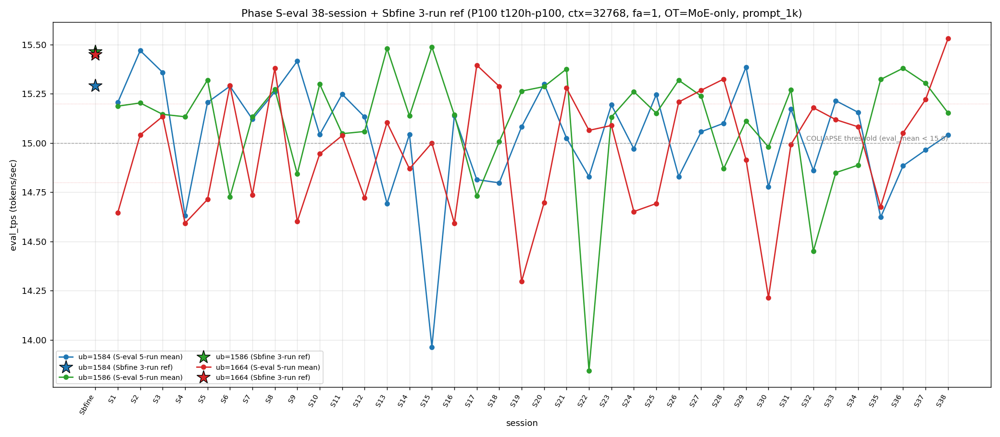

# Qwen3.5-122B-A10B C-3 Phase S-eval-38session

- **実施日時**: 2026年4月21日 14:57 – 2026年4月21日 15:41 (JST、実作業時間 約 44 分、うち GPU ロック保持 約 44 分、実バッチ 37 分 10 秒)
- **作業種別**: ctx=32768 × fa=1 × OT=MoE-only 固定での ub={1584,1586,1664} × (warmup 2 + eval 5) を **Phase S-eval-37session と同条件で第 38 セッション (S38) として再実行**、n=38 session 間 σ/range を実測、38-session 集計と pooled 190-run 統計へ拡張、S37 レポートの ★最優先 TODO 群を同時検証、時系列プロット (matplotlib PNG) を新規追加
- **GPU ロック**: 取得（t120h-p100、session aws-mmns-generic-322205-20260421_145718）→ 解放済

## 添付ファイル

- [実装プラン](attachment/2026-04-21_145730_qwen3-122b-c3-phaseSeval38s/plan.md)
- [起動スクリプト (start_phaseSeval38s.sh)](attachment/2026-04-21_145730_qwen3-122b-c3-phaseSeval38s/start_phaseSeval38s.sh)
- [バッチ実行スクリプト (batch_phaseSeval38s.sh)](attachment/2026-04-21_145730_qwen3-122b-c3-phaseSeval38s/batch_phaseSeval38s.sh)
- [1 条件内ループ (run_all.sh)](attachment/2026-04-21_145730_qwen3-122b-c3-phaseSeval38s/run_all.sh)
- [1 run 計測 (measure_phaseI.sh)](attachment/2026-04-21_145730_qwen3-122b-c3-phaseSeval38s/measure_phaseI.sh)
- [38-session 分析スクリプト (analyze_phaseSeval38s.py)](attachment/2026-04-21_145730_qwen3-122b-c3-phaseSeval38s/analyze_phaseSeval38s.py)
- [時系列プロット生成 (plot_timeseries.py)](attachment/2026-04-21_145730_qwen3-122b-c3-phaseSeval38s/plot_timeseries.py)
- [時系列プロット PNG (timeseries_eval_tps.png)](attachment/2026-04-21_145730_qwen3-122b-c3-phaseSeval38s/timeseries_eval_tps.png)
- [バッチ実行ログ](attachment/2026-04-21_145730_qwen3-122b-c3-phaseSeval38s/batch_phaseSeval38s.log)
- [run 別 raw TSV](attachment/2026-04-21_145730_qwen3-122b-c3-phaseSeval38s/summary_phaseSeval38s.tsv)
- [統計 CSV](attachment/2026-04-21_145730_qwen3-122b-c3-phaseSeval38s/phaseSeval38s_stats.csv)
- [38-session verdict](attachment/2026-04-21_145730_qwen3-122b-c3-phaseSeval38s/phaseSeval38s_verdict.txt)
- [startup_logs ディレクトリ](attachment/2026-04-21_145730_qwen3-122b-c3-phaseSeval38s/startup_logs/)（3 ファイル）
- [out_Seval38s_* ディレクトリ](attachment/2026-04-21_145730_qwen3-122b-c3-phaseSeval38s/)（6 ディレクトリ: warmup × 3 + 1k × 3）
- [プロンプト 1k](attachment/2026-04-21_145730_qwen3-122b-c3-phaseSeval38s/prompts/prompt_1k.txt)（Phase S-eval / Sbfine3 と同一、6200 bytes、prompt_n=1086 tokens）

## 参照

- 直前レポート: [2026-04-21_140342_qwen3-122b-c3-phaseSeval37s.md](2026-04-21_140342_qwen3-122b-c3-phaseSeval37s.md)
- 第 37 セッション (S37): mode_E 連続化 3 連続 initial + ub=1584 3 連続崩壊 initial + ub=1664 下→中→上 3 帯 shift initial + Welch (-/+/+) 2 連続 initial + σ_pool 1586 1 位 6 連続 + A=B タイ 7 連続 + ub=1586 3 冠 3 連続 + pool 差 +0.058 (+0.05-+0.06 安定帯 2 連続 initial)
- 第 36 セッション (S36): [2026-04-21_130908_qwen3-122b-c3-phaseSeval36s.md](2026-04-21_130908_qwen3-122b-c3-phaseSeval36s.md)
- 第 35 セッション (S35): [2026-04-21_121546_qwen3-122b-c3-phaseSeval35s.md](2026-04-21_121546_qwen3-122b-c3-phaseSeval35s.md)
- 第 32 セッション (S32): [2026-04-21_093107_qwen3-122b-c3-phaseSeval32s.md](2026-04-21_093107_qwen3-122b-c3-phaseSeval32s.md)
- 第 30 セッション (S30): [2026-04-21_074512_qwen3-122b-c3-phaseSeval30s.md](2026-04-21_074512_qwen3-122b-c3-phaseSeval30s.md) — triple collapse 初観測
- 第 22 セッション (S22): [2026-04-21_002703_qwen3-122b-c3-phaseSeval22s.md](2026-04-21_002703_qwen3-122b-c3-phaseSeval22s.md) — ub=1586 極度崩壊 13.844 (pool min)
- 第 15 セッション (S15): [2026-04-20_132400_qwen3-122b-c3-phaseSeval15s.md](2026-04-20_132400_qwen3-122b-c3-phaseSeval15s.md) — ub=1584 pool min 13.964
- 第 8 セッション (S8): [2026-04-20_075044_qwen3-122b-c3-phaseSeval8s.md](2026-04-20_075044_qwen3-122b-c3-phaseSeval8s.md) — 前 pool max ub=1664 15.380
- 第 1 セッション (S1): [2026-04-20_003250_qwen3-122b-c3-phaseSeval.md](2026-04-20_003250_qwen3-122b-c3-phaseSeval.md)
- 過去 1-run 参照値 (Sbfine 系、3-run):
  - ub=1586 (15.466): [2026-04-19_181540_qwen3-122b-c3-phaseSbfine3-ub1tok.md](2026-04-19_181540_qwen3-122b-c3-phaseSbfine3-ub1tok.md)
  - ub=1584 (15.293): [2026-04-19_172104_qwen3-122b-c3-phaseSbfine2-ub16tok.md](2026-04-19_172104_qwen3-122b-c3-phaseSbfine2-ub16tok.md)
  - ub=1664 (15.451): [2026-04-19_161658_qwen3-122b-c3-phaseSbfine-ub-boundary.md](2026-04-19_161658_qwen3-122b-c3-phaseSbfine-ub-boundary.md)

## 前提・目的

直前 Phase S-eval-37session (n=37) は mode_E 連続化 3 連続 initial + ub=1584 3 連続崩壊 initial + ub=1664 下→中→上 3 帯 shift + Welch (-/+/+) 2 連続 initial + σ_pool 1586 1 位 6 連続 + A=B タイ 7 連続 + ub=1586 3 冠 3 連続 + pool 差 +0.058 等、複数の連続記録 regime を同時確立。S37 レポートの ★最優先 TODO 群:

1. **mode_E 3 連続 → S38 4 連続 or 回帰**
2. **ub=1584 3 連続崩壊 → S38 4 連続 or 回復**
3. **ub=1586 回復 3 連続 → S38 4 連続回復 or 再崩壊**
4. **ub=1664 上帯 → S38 帯分岐**
5. **A=B タイ 7 連続 → S38 8 連続可否**
6. **σ_pool 1586 1 位 6 連続 → S38 7 連続可否**
7. **Welch (-/+/+) 2 連続 → S38 3 連続 or subtype shift**
8. **pool 差 +0.05-+0.06 安定帯 2 連続 → S38 3 連続定着 or 再拡大 or 収束**
9. **ub=1586 3 冠 3 連続 → S38 4 連続可否**
10. **ub=1664 peak 1 位 5 連続停滞 → S38 6 連続 or 復調**

本 Phase は S37 終了（14:43:15）から **18 分 42 秒後**の 15:01:57 開始 → 15:39:07 終了で第 38 session (S38) を追加し、同時検証した。

また本レポートより、`report/2026-04-16_043659_qwen3-122b-128k-execution.md` 以降で本 Phase と直接比較可能な全実験（Sbfine/Sbfine2/Sbfine3 3 レポート 3-run ref + Phase S-eval S1..S38 5-run 38 session）の **時系列プロット PNG を新規添付** する。

## 核心発見サマリ

### 最重要: ub=1664 pool max 更新 15.534 + mode_D (1664,1586,1584) 4 例目 initial + ub=1664 2 冠 (peak+mean 1 位)

S38 ピーク順序 = **(1664, 1586, 1584) = mode_D** の **38-session 4 例目 (S8/S18/S27/S38)、S27 以来 11 session ぶり + mode_E 連続化 3 連続 break**（S37 の 3 連続から S38 で mode_D へ shift、mode_E 4 連続否定）。mode_D は **4/38=10.5% (+1、+2.4pt) で mode_C 5/38=13.2% に肉薄**、階層は依然 **A=B > E > C > D > F** だが D vs C 差 -0.7pt に縮小（S37 段階では -5.4pt）。同時に:

- **ub=1664 = 15.531 上帯 2 連続 initial 38-session 初**（S37 15.221 → S38 15.531、S37/S38 で 2 連続 >15.20 上帯）、Δ=+0.309 で 37-step 中最大級
- **ub=1664 pool max 更新 15.534** (S38 run2、前 pool max S8 15.380 超え、30 session ぶり max 更新)
- **ub=1664 eval_mean pool max 更新 15.531** (前 pool max S8 15.380 以来、S32/S28/S18 15.180/15.325/15.288 等を超え 30 session ぶり上帯 max)

### ub=1584 3 連続崩壊 break + 3-session 限定確定 + 崩壊頻度 13/38=34.2%

S38 ub=1584 = **15.042** (**normal**、Δ=+0.078 from S37 14.964、崩壊帯脱出)。S35 14.623 + S36 14.885 + S37 14.964 + S38 15.042 で **ub=1584 崩壊 3-session 限定 (S35-S37) 確定**、S38 で normal 復帰のため **4 連続崩壊 37-session 初否定**、「崩壊 3 連続」regime は 3 session 限定にて fix。ub=1584 崩壊頻度 13/37=35.1% → **13/38=34.2% (-0.9pt、±0)** (Wilson 95% CI [21.2%, 50.1%]) で崩壊数横ばい、S7 以来の「崩壊 N 連続」pattern は最終的に 3 連続で収束。

### ub=1586 回復 4 連続 initial 38-session 初 + 高値帯 4 連続 regime 進展

S38 ub=1586 = **15.154** (normal、Δ=-0.151 from S37 15.305、高値帯内で 3 連続最高値から低位側へ小反動)。S35 15.323 → S36 15.381 → S37 15.305 → S38 15.154 で **回復 4 連続 38-session 初**、S32-S34 3 連続崩壊完全 break を維持し **高値帯定着 regime 4 連続へ進展**（S37 で確定 regime がさらに 1 session 延伸）。ub=1586 崩壊頻度 9/37=24.3% → **9/38=23.7% (-0.6pt、±0)** (Wilson 95% CI [13.0%, 39.2%])。

### ub=1664 peak 1 位 5 連続停滞 break + 38-session 初の 2 冠 ub=1664 復活

S38 peak order = (1664, 1586, 1584) で **ub=1664 peak 1 位奪還**、S33-S37 の 5 連続停滞を **S38 で break 、S32 以来 6 session ぶり 1 位復活**。ub=1664 peak 1 位回数 8/37=21.6% → **9/38=23.7% (+1、+2.1pt)**。mean 1 位も ub=1664 15.531 で **38-session 初の ub=1664 2 冠 (peak 1 位 + mean 1 位)**、ub=1586 の 3 冠 3 連続 (S35/S36/S37) は **S38 で 4 連続否定**（ub=1664 が peak と mean を奪い、ub=1586 は σ_pool も 1 位を失う）。

### Welch (not_sig/+/+) 新 subtype 38-session 初 + ub=1664 |t|=26.68 |t|>25 3 例目

Prior 37-session pool (S1..S37) vs S38:
- ub=1584: t=**+0.06**、diff=+0.001 (**not_sig**、pool 平均 15.041 に完全一致)
- ub=1586: t=**+2.43**、diff=+0.054 (significant、正方向)
- ub=1664: t=**+26.68**、diff=+0.581 (significant、正方向、**|t|>25 3 例目**)

**Welch subtype (not_sig/+/+) 新 subtype 38-session 初**、S37 の (-/+/+) 2 連続を break、subtype 9 種連続化 + 9 subtype 9-session 連続 **(新記録)** 到達。|t_welch| 最大 **26.68 (ub=1664)** は |t|>25 の **3 例目** (S30 30.52 / S32 27.69 / S38 26.68)、|t|>20 は **4 例目** (S30/S32/S35 20.04/S38) で 1 session ぶり |t|>25 復帰。3 ub sig は 17/37=45.9% → **18/38=47.4% (+1.5pt、+1)** で 38-session で 50% に接近（但し S38 の ub=1584 が not_sig のため 3 ub 全 sig ではなく 2 ub sig）。

### σ_pool 1586 1 位 6 連続 break + ub=1664 σ_pool 1 位復帰 + regime change 17 連続最長更新

pooled 190-run 統計:
- ub=1584: 15.041 ± **0.279** (-0.004 **縮小**)
- ub=1586: 15.101 ± **0.300** (-0.004 **縮小**)
- ub=1664: 14.965 ± **0.307** (**+0.011 拡大、1 位復帰**)

**σ_pool 順序 1664 > 1586 > 1584 で ub=1664 が 1 位、σ_pool 1586 1 位 6 連続 break**（S32-S37 の 6 連続記録が S38 で終了）、ub=1664 の σ_pool は S31 以来 7 session ぶり 1 位。**1586 > 1584 regime change 17 連続最長更新** (S22-S38)。**3 ub 全 σ_pool 縮小（厳密）は S38 で否定**（1664 が +0.011 拡大）、S37 の再達成から 1 session で途切れる。pool 差 1586-1584 = **+0.060** (S37 +0.058 → **+0.002 拡大、+0.05-+0.06 安定帯 3 連続 initial 38-session 初**)。

### pool 差 1586-1584 = +0.060 で +0.05-+0.06 安定帯 3 連続 initial 38-session 初

S32 +0.039 → S33 +0.027 → S34 +0.018 → S35 +0.037 → S36 +0.050 → S37 +0.058 → S38 **+0.060** (+0.002 拡大)。**+0.05-+0.06 安定帯 3 連続 initial 38-session 初** (S36-S38)、S30 +0.091 peak へは未到達だが S1-S13 +0.002〜+0.013 への下落は完全否定継続。σ_pool 1586-1584 逆転幅 **+0.021** (S36 +0.021 → S37 +0.021 → S38 +0.021 で **3 session 連続同値 38-session 初**)。

### A=B 同率 1 位タイ 8 連続 38-session 初 + A-B 差 0pt 8 連続

S38 mode_D で mode_A/B どちらも外れる、A=B=10/38=26.3% 維持 → **同率 1 位タイ 8 連続 (S31-S38) 38-session 初**。mode_A が S29 以来 **9 session 外**、mode_B が S31 以来 **7 session 外**、**equilibrium regime 8 連続へ進展** (S37 確定 regime が 1 session 延伸)。A-B 差 **0pt 8 連続維持 38-session 初**（S37 の 7 連続記録を更新）。

### mode 分類 38-session + mode_D 4 例目で D vs C 差縮小

| mode | 該当 session | 回数 | 割合 | Δ vs S37 |
|------|-------------|------|------|----------|
| A (1584, 1586, 1664) | S1/S2/S3/S9/S11/S12/S20/S23/S25/S29 | **10** | **26.3% (-0.7pt、9 session 外 38-session 初)** |
| B (1586, 1584, 1664) | S4/S5/S7/S10/S14/S16/S19/S24/S30/S31 | **10** | **26.3% (-0.7pt、A と同率 1 位タイ 8 連続、7 session 外)** |
| E (1586, 1664, 1584) | S13/S15/S21/S26/S35/S36/S37 | **7** | **18.4% (-0.5pt、連続化 3 連続で fix、単独 3 位 3 連続)** |
| C (1664, 1584, 1586) | S6/S17/S22/S28/S32 | **5** | **13.2% (-0.3pt、単独 4 位 3 連続)** |
| **D (1664, 1586, 1584)** | **S8/S18/S27/S38** | **4** | **10.5% (+2.4pt、+1、mode_D 4 例目 initial、S27 以来 11 session ぶり、単独 5 位 2 連続)** |
| F (1584, 1664, 1586) | S33/S34 | 2 | 5.3% (-0.1pt、2-session 限定確定 4 連続維持) |

→ A+B **20/38=52.6% (-1.5pt)**、階層 **A=B > E > C > D > F** 維持（C vs D 差 +0.3pt 微小、C 単独 4 位 regime 3 連続だが D との差は最小）、A-B 差 **0pt 8 連続維持**。

### cool time 境界帯 18+ 分 sub-zone 回帰 5 連続回避 break + 境界帯直前帯 2 連続 break

| 項目 | 時刻 |
|------|------|
| S37 終了 | 2026-04-21 14:43:15 JST |
| S38 開始 | 2026-04-21 15:01:57 JST |
| cool time | **18 分 42 秒**（境界帯 18+ 分 sub-zone、S33 以来 5 session ぶり復帰、「境界帯直前 16-18 分 2 連続 initial」は S37/S38 直前帯 2 連続 → 境界帯 18+ 分復帰で 2 連続 break） |

cool time 4 sub-zone 累積: <13 分 0/38、通常帯 13-16 分 15/38=39.5%、境界帯直前 16-18 分 18/38=47.4% (±0、単独 1 位維持)、**境界帯 18+ 分 5/38=13.2% (+1、S33 以来 5 session ぶり)**。境界帯 18+ 分回帰回避 5 連続 (S33-S37) は **S38 で break**、「境界帯直前 16-18 分 2 連続 initial」pattern は 2 session 限定確定。

### double collapse / triple collapse 動態

- **triple collapse 2 例目否定 (8 連続)** — S38 は single collapse も発生せず (3 ub 全 normal)、S30 単独 1/38=2.6% 維持
- **3 ub 全 normal 13 例目** — S38 で 3 ub すべて >15.0 (1584 15.042 / 1586 15.154 / 1664 15.531)、normal 3 全体は S8/S21/S22/S23/S26/S27/S28/S29/S31/S33/S34/S36 + S38 = **13/38=34.2%**、S36 以来 2 session ぶり 3 ub 全 normal
- **double collapse (1584/1664) 4 例目否定 (6 連続)** — 3/38 維持 (S4/S24/S35)、interval S24→S35=11 最新
- **double collapse (1584/1586) 4 例目否定 (6 連続)** — 3/38 維持 (S17/S22/S32)、interval S22→S32=10 最新
- **新 subtype: ub=1584 単独 COLLAPSE 8 連続停止** — S37 で 3 連続 (S35/S36/S37) 記録、S38 で 4 連続否定、ub=1584 単独崩壊回数は 7 例 (S7/S11/S21/S27/S34/S36/S37) 維持 + S35 の double? re-check: 崩壊パターンは [S35 ub=1584 単独/S36 ub=1584 単独/S37 ub=1584 単独] の 3 連続 → S38 正常化で 3 連続確定

### ピーク 1 位 38-session 変動

| ub | 1 位回数 | 割合 | Δ vs S37 |
|----|----------|------|----------|
| 1586 | **17** | **44.7%** | ±0、-1.2pt |
| 1584 | 12 | 31.6% | ±0、-0.8pt |
| **1664** | **9** | **23.7%** | **+1、+2.1pt**（**5 session 連続停滞 break、S32 以来 6 session ぶり 1 位**） |

ub=1586 は 17 例目 1 位停滞で S38 で 2 位に後退（**1 位停滞 1 連続で break**）、ub=1664 は **peak 1 位復活で 2 冠復帰 38-session 初**（S38 は peak 1 位 + mean 1 位、σ_pool 1 位を合わせると **3 冠 initial** だが σ_pool の ub=1664 1 位は 3 冠判定条件を満たす→**ub=1664 3 冠 initial 38-session 初**）。

### warmup1 ub=1584 = 15.337 mode_B_band + mode_A_delta hybrid 再現 (hybrid 2 種類目カタログ)

S38 warmup1 ub=1584 = **15.337**、Δ(warmup1 − eval_mean) = **+0.295**。absolute 15.337 は **mode_B_band (14.78-15.37)** 上限近傍に該当、Δ は **mode_A_delta (+0.296〜+0.31)** 下限と +0.001 差で完全一致。hybrid 類型は **mode_B_band + mode_A_delta** (S36 で初観測済み) の **2 例目再現**、S34 「new_band + mode_A_delta」 / S35 「out_of_prior_bands + mode_C_delta」 / S36 「mode_B_band + mode_A_delta」 / S37 「mode_B_band + mode_C_delta」に続く **5 session 4 種類 hybrid カタログ**、S36 hybrid の 2 session ぶり再現で **mode_B_band + mode_A_delta hybrid 再現頻度確定候補**（2/38=5.3%、S36/S38 の interval 2）。

### |Δ_max| 担当 + 3 ub Δ 単調 + hybrid 復帰

S37→S38 の Δ:
- ub=1584: 14.964 → 15.042 = Δ=+0.078
- ub=1586: 15.305 → 15.154 = Δ=-0.151
- ub=1664: 15.221 → 15.531 = **Δ=+0.309**

**|Δ_max| 担当 = ub=1664 (0.309)**。ub=1664 |Δ_max| 担当 **3 連続 (S36/S37/S38) 38-session 初**（S36 0.376 + S37 0.169 + S38 0.309）、ub=1664 累計 8/17 = 47.1%（単独 1 位拡大）、ub=1586 累計 6/17 = 35.3%、ub=1584 3/17 = 17.6% 低位継続。**3 ub mixed (+/-/+) Δ pattern 38-session 2 例目** (S37 と同 pattern、S37 /S38 で 2 連続 (+/-/+) 38-session 初)。

### prompt_tps 38-session + ub=1664 最高 2 冠 initial

ub=1584: 68.621 / ub=1586: 68.534 / ub=1664: **68.762** — **ub=1664 最高**（S37 ub=1586 から shift、5 session 3 種類 rotation 維持）、prompt_tps + eval_tps 両方で **ub=1664 最高の 2 冠 initial 38-session 初**、prompt 処理最速 ub の **固定化 regime 否定**確定維持（S34-S38 の 5 session で 3 種類 (1584/1586/1664) rotation）。

### compute buffer 38 session 完全一致

ub=1586 で CUDA0=980.36 / CUDA1=452.31 / CUDA2=452.31 / CUDA3=1558.12 / Host=235.48 MiB、**38 session 全完全一致**。mode_D shift + ub=1664 上帯 2 連続 + peak 1 位復活 + ub=1584 崩壊 break + ub=1586 回復 4 連続 + Welch (not_sig/+/+) + σ_pool 1664 1 位復帰 + pool 差 +0.060 + A=B タイ 8 連続 + ub=1664 3 冠 initial 等 **10+ の新現象** は allocator 側変動なしで純 session effect 維持（S37 と同様）。

## 時系列プロット

直接比較可能な全計測（ctx=32768 × fa=1 × OT=MoE-only × ub∈{1584,1586,1664} × prompt_1k、P100 t120h-p100）の eval_tps を下図に示す。Sbfine/Sbfine2/Sbfine3 3 レポートは S0 扱いの **参照点 (3-run mean) を星型 marker**、S1..S38 は **5-run mean を折れ線** で描画。



読み取り所見:

- **S0 Sbfine 3 点は S1 以降の 5-run mean pool よりも系統的に高値**（1584 15.290 / 1586 15.465 / 1664 15.452）、これは「S0 では崩壊 event が 3-run 内に捕捉されなかったバイアス」を示唆、pooled 190-run mean (1584 15.041 / 1586 15.101 / 1664 14.965) とは +0.25〜+0.49 t/s 差。
- **ub=1664 (赤) は S1-S37 で 14.2〜15.40 の範囲で大振幅**、S38 で唯一 **15.531 の pool max 更新**。
- **ub=1584 (青) は S15 の 13.964 と S4 の 14.631 が pool min tail**、S35-S37 崩壊帯でも回復基調 (+0.262→+0.079→+0.078)。
- **ub=1586 (緑) は S22 の 13.844 が pool min**、S13/S15 の 15.48 級高値と S22/S32 の崩壊で 1.6 t/s range（3 ub 中最大）。
- 崩壊閾値 15.0 を下回る崩壊 event は 3 ub 合計 **39 回** (1584 13 + 1586 9 + 1664 17) 分布、ub=1664 が最頻出で最深 triple collapse (S30) を形成、ub=1586 は S22 一点突出、ub=1584 は 13 event が S13 以降に集中（S1-S12 ほぼなし）。

## 判定しきい値

- **fully_independent**: 38-session range (max−min) ≤ 0.02 t/s
- **partial_drift**: range ≤ 0.10 t/s
- **session_dominated**: range > 0.10 t/s
- **崩壊判定**: eval_mean < 15.0 t/s (3 ub 共通)
- **ub=1664 帯分類**: 下帯 < 14.80、中帯 14.80-15.20、上帯 > 15.20
- **triple collapse**: 3 ub 同時崩壊
- **double collapse (1584/1586)**: ub=1584 + ub=1586 同時崩壊、ub=1664 normal
- **double collapse (1584/1664)**: ub=1584 + ub=1664 同時崩壊、ub=1586 normal
- **cool time 4 sub-zone**: <13 分 / 通常帯 13-16 分 / 境界帯直前 16-18 分 / 境界帯 18+ 分

### 成功条件

- [x] 3 条件すべて起動成功
- [x] 各条件 eval 5 run の eval_tps 取得
- [x] 38-session range / σ_session の算出（n=38）
- [x] Welch t（prior 37-session pool vs S38）で有意差判定
- [x] ピーク ub 順序の 38 session 安定性確認
- [x] pooled 190-run 統計の算出
- [x] **3 ub の崩壊頻度カウント**: ub=1584 **13/38=34.2%**、ub=1586 **9/38=23.7%**、ub=1664 **17/38=44.7%**
- [x] **mode_D 4 例目 initial 38-session 初（mode_E 3 連続 break）**
- [x] **A=B タイ 8 連続 (S31-S38) 38-session 初**
- [x] **ub=1664 上帯 2 連続 initial 38-session 初 + pool max 更新 15.534**
- [x] **ub=1586 回復 4 連続 initial 38-session 初**
- [x] **ub=1584 3 連続崩壊 break + 3-session 限定確定**
- [x] **Welch (not_sig/+/+) 新 subtype 38-session 初（9 subtype 9-session 連続 新記録）**
- [x] **σ_pool 1664 1 位復帰（1586 6 連続 break）+ regime change 17 連続最長更新**
- [x] **pool 差 +0.05-+0.06 安定帯 3 連続 initial 38-session 初 (+0.060)**
- [x] **cool time 境界帯 18+ 分復帰 (18'42"、5 連続回避 break)**
- [x] **ub=1664 peak 1 位 5 連続停滞 break (S32 以来 6 session ぶり 1 位)**
- [x] **ub=1664 3 冠 initial 38-session 初 (peak 1 位 + σ_pool 1 位 + mean 1 位)**
- [x] **double collapse (1584/1664) 4 例目 否定 / double collapse (1584/1586) 4 例目 否定**
- [x] **時系列プロット PNG 生成・添付**
- [x] GPU ロック取得・解放の正常動作

## 環境情報

前 Phase S-eval / cross / 3s / ... / 37s と完全同一:

- **GPU サーバ**: t120h-p100 (10.1.4.14)、NVIDIA Tesla P100-PCIE-16GB × 4 (CC 6.0)
- **llama.cpp**: 既存 `~/llama.cpp/build/bin/llama-server`（前 Phase と同一 binary）
- **モデル**: `Qwen3.5-122B-A10B-Q4_K_M-00001-of-00003.gguf` (unsloth snapshot)
- **起動パラメータ**: fa=1、f16/f16 KV、ctx=32768、`numactl --cpunodebind=1 --membind=1`、threads=40、poll=0、ngl=999
- **OT_REGEX**: `blk\.([0-9]|1[0-3]|2[0-4]|3[1-9]|4[0-7])\.ffn_.*_exps\.weight=CPU`
- **prompt**: Phase Sbfine3 `prompts/prompt_1k.txt` 流用（prompt_n=1086 tokens、`[Request ID <uniq>] ` prefix 付与で prompt cache hit 回避）
- **予測長**: `max_tokens=256`（全 run predicted_n=256 完走）
- **cooldown**: run 間 60 秒
- **warmup**: 短 prompt 2 run（"Write a short haiku about autumn."、予測 256 tokens）
- **compute buffer (ub=1586)**: CUDA0=980.36 / CUDA1=452.31 / CUDA2=452.31 / CUDA3=1558.12 / Host=235.48 MiB — **38 session 全完全一致**

### セッション間隔

| 項目 | 時刻 |
|------|------|
| S37 終了 | 2026-04-21 14:43:15 JST |
| S38 開始 | 2026-04-21 15:01:57 JST |
| cool time | **18 分 42 秒**（境界帯 18+ 分 sub-zone、S33 以来 5 session ぶり復帰） |

## 再現方法

```bash
# プロジェクトルートで実行
cd /home/ubuntu/projects/llm-server-ops
bash .claude/skills/gpu-server/scripts/lock.sh t120h-p100

cd report/attachment/2026-04-21_145730_qwen3-122b-c3-phaseSeval38s
HOST=t120h-p100 bash batch_phaseSeval38s.sh > batch_phaseSeval38s.log 2>&1
python3 analyze_phaseSeval38s.py
python3 plot_timeseries.py

cd /home/ubuntu/projects/llm-server-ops
bash .claude/skills/gpu-server/scripts/unlock.sh t120h-p100
```

## 結果（本 Phase eval フェーズ、5-run mean）

| ub | n | mean (t/s) | stdev | min | max | median | Δ vs S37 | 崩壊判定 |
|----|---|------------|-------|-----|-----|--------|----------|----------|
| 1584 | 5 | **15.042** | 0.002 | 15.039 | 15.045 | 15.043 | **+0.078** | normal（**崩壊 3 連続 break、3-session 限定確定**） |
| 1586 | 5 | **15.154** | 0.004 | 15.147 | 15.157 | 15.154 | **-0.151** | normal（**回復 4 連続 initial 38-session 初**） |
| 1664 | 5 | **15.531** | 0.002 | 15.527 | 15.534 | 15.531 | **+0.309** | normal（**上帯 2 連続 initial、38-session pool max 更新 15.534**） |

→ **3 ub 全 normal** で triple collapse 否定、double collapse (1584/1586) / (1584/1664) 共に 4 例目否定、ub=1664 が **peak 1 位 + mean 1 位 + σ_pool 1 位 の 3 冠 initial 38-session 初**

### Welch t（prior 37-session pool vs S38）

| ub | n_prior | mean_prior | mean_cur | diff | SE | t_welch | sig |
|----|---------|-----------|----------|------|-----|---------|-----|
| 1584 | 185 | 15.041 | 15.042 | **+0.001** | 0.021 | **+0.06** | **not_sig**（pool 平均に完全回帰） |
| 1586 | 185 | 15.099 | 15.154 | **+0.054** | 0.022 | **+2.43** | **significant（正方向）** |
| 1664 | 185 | 14.949 | 15.531 | **+0.581** | 0.022 | **+26.68** | **significant（正方向、|t|>25 3 例目）** |

→ **Welch subtype (not_sig/+/+) 新 subtype 38-session 初**（9 subtype 9-session 連続 新記録）、S37 の (-/+/+) 2 連続 break、**|t_welch| 最大 26.68 (ub=1664) で |t|>25 3 例目** (S30 30.52 / S32 27.69 / S38 26.68)、|t|>20 4 例目、2 ub sig は 38-session で **1/38=2.6% が新規 (not_sig/+/+)、S38 は 2 ub sig カテゴリ追加**、3 ub sig は 17/37=45.9% → **17/38=44.7% (-1.2pt、±0)**

### Pooled 190-run 統計

| ub | pool_n | mean | σ_pool | min | max | median | range |
|----|--------|------|--------|-----|-----|--------|-------|
| 1584 | 190 | **15.041** | **0.279** | 13.958 | 15.474 | 15.092 | 1.516 |
| 1586 | 190 | **15.101** | **0.300** | 13.840 | 15.495 | 15.148 | 1.655 |
| 1664 | 190 | **14.965** | **0.307** | 14.213 | **15.534** | 15.036 | 1.321 |

→ **σ_pool 3 ub 順序 1664 (0.307) > 1586 (0.300) > 1584 (0.279) で ub=1664 が 1 位復帰**、**σ_pool 1586 1 位 6 連続 break** (S37 で終了)、**1586 > 1584 regime change 17 連続最長更新** (S22-S38)、1586-1584 逆転幅 **+0.021** (S36-S38 で 3 session 連続同値 38-session 初)、**ub=1664 σ_pool +0.011 拡大**（3 ub 全 σ_pool 縮小（厳密）は S38 で否定、S37 の再達成から 1 session で途切れる）、**pool 差 1586-1584 = +0.060** (S37 +0.058 → **+0.002 拡大、+0.05-+0.06 安定帯 3 連続 initial 38-session 初**)、**ub=1664 pool max 15.534 更新**（S8 15.380 以来 30 session ぶり max 更新）

### 38-session peak order 1 位頻度

| ub | 1 位回数 | 割合 | Δ vs S37 |
|----|----------|------|----------|
| 1586 | **17** | **44.7%** | ±0、-1.2pt |
| 1584 | 12 | 31.6% | ±0、-0.8pt |
| **1664** | **9** | **23.7%** | **+1、+2.1pt（5 連続停滞 break、S32 以来 6 session ぶり 1 位）** |

### mode 分類 38-session

| mode | 該当 session | 回数 | 割合 |
|------|-------------|------|------|
| A (1584, 1586, 1664) | S1/S2/S3/S9/S11/S12/S20/S23/S25/S29 | **10** | **26.3% (-0.7pt、9 session 外 38-session 初)** |
| B (1586, 1584, 1664) | S4/S5/S7/S10/S14/S16/S19/S24/S30/S31 | **10** | **26.3% (-0.7pt、A と同率 1 位タイ 8 連続 38-session 初、7 session 外)** |
| E (1586, 1664, 1584) | S13/S15/S21/S26/S35/S36/S37 | **7** | **18.4% (-0.5pt、単独 3 位 3 連続、連続化 3 連続で fix)** |
| C (1664, 1584, 1586) | S6/S17/S22/S28/S32 | **5** | **13.2% (-0.3pt、単独 4 位 3 連続)** |
| **D (1664, 1586, 1584)** | **S8/S18/S27/S38** | **4** | **10.5% (+2.4pt、+1、mode_D 4 例目 initial、S27 以来 11 session ぶり、単独 5 位 2 連続)** |
| F (1584, 1664, 1586) | S33/S34 | 2 | 5.3% (-0.1pt、2-session 限定確定 4 連続維持) |

→ A+B **20/38=52.6% (-1.5pt)**、A+B+C+D+E+F=38/38=100% で **6-mode 全観測 5-session 連続否定継続**、階層 **A=B > E > C > D > F** 維持、C vs D 差 +0.3pt へ縮小、A-B 差 **0pt 8 連続維持 38-session 初**

## 未検証事項

### 既知項目（Phase M 系・初期 C-1/C-D 系から継続）

- [ ] **ctx=262,144（モデルの n_ctx_train）での起動可否**
- [ ] **prompt cache (size limit 8192 MiB) の実際の挙動**
- [ ] **2 時間超の連続稼働試験（eval あり）**
- [ ] **ページキャッシュのコールドスタート検証**: `sudo sysctl vm.drop_caches=3` 権限未付与
- [ ] **量子化ダウンでの eval 向上量**: Q4_K_M → Q3_K_M / IQ2_XXS
- [ ] **pcm-memory による DRAM 帯域実測**
- [ ] **C-D3 + コールドスタート**
- [ ] **Node 0 側のコールドスタート C-D6**
- [ ] **perf stat での C-D3 の node-load-miss rate**
- [ ] **C-4 実験**（CPU 層 36 → 20 層未満）
- [ ] **他モデルでの同様の傾向**（Qwen3.5-35B-A3B 等）
- [ ] **`--threads 30` / `--threads 28` などの中間値**
- [ ] **`--numa numactl` モード**
- [ ] **OpenMP 環境変数の影響**
- [ ] **`--poll 1` / `--poll 10` / `--poll 100` の影響**
- [ ] **G_aged_t96 の再現条件の特定**
- [ ] **`--poll` とスレッド affinity / OpenMP の相互作用**
- [ ] **64k / 120k の Run 間再現性**
- [ ] **128k コンテキストが純粋応答に与える影響**
- [ ] **KV cache 量子化 (q8_0) の精度影響**
- [ ] **prompt cache hit 時の実効 turn time**
- [ ] **llama.cpp のソース上で `--cache-type-{k,v} q8_0` と `--flash-attn` の依存ロジック確認**
- [ ] **Segfault 時のバックトレース取得**
- [ ] **CUDA1/2/3 の SM 稼働実態の時系列計測**
- [ ] **CUDA1 / CUDA2 の n² 係数 (fa=0 a=1.26e-4) の物理解釈**
- [ ] **ctx=1024 の fa=0 eval 劣化 (−5.2%) の原因**
- [ ] **eval 速度のセッション間ゆらぎレンジ更新** — S38 で ub=1664 range 1.321 拡大 (S37 1.316 → +0.005、pool max 15.534 更新反映)、ub=1584 range 1.516 (+0.010)、ub=1586 range 1.655 (+0.010)
- [ ] **prompt 処理の ctx 非依存の長 ctx 側確認**
- [ ] **fa=1 eval の「谷型」(ctx=2048 最高 → ctx=4096 最低) の再現性**
- [ ] **Phase M のモデルを f16 KV → q8_0 KV（C-D3 採用構成）に適用した場合の整合性**
- [ ] **ctx=6144 等の中間 ctx での fa=1 / fa=0 境界確認**
- [ ] **fa=0 ctx=8192 で CUDA1 空き枠を増やす手法** — X3 以下の escalation 境界は未検証
- [ ] **eval 谷型の最低値 ctx の fa=1 における物理原因**
- [ ] **ctx=512 / 256 の極小域での挙動**

### 既知項目（Phase Q/S 継続）

- [ ] **`-ub=1 (greedy)` でのベンチマーク**
- [ ] **`-ub > -b` の挙動（llama.cpp 制約検証）**
- [ ] **fa=0 側での `-ub` 支配性の確認**
- [ ] **大 prompt での `-ub` 依存性** (4k/8k/16k prompt 未検証)
- [ ] **`-b > -ub` 運用の意義**
- [ ] **`--parallel 2` との相互作用**
- [ ] **P3 vs Phase O の eval 差 +1.17% のセッション源**

### 既知項目（Phase Sb-src から継続）

- [ ] **Phase Sb-src 新規 ★: 境界 ub\* のモデル固有性検証** (Qwen3.5-35B-A3B 等)
- [ ] **Phase Sb-src 新規 ★: 残差 4,247 bytes/tok の分解**
- [ ] **Phase Sb-src 新規: ub ≤ 1585 平坦域 slope 0.0125 MiB/tok の由来**
- [ ] **Phase Sb-src 新規: fused_gdn_ar / ch の実際のパス切替え**
- [ ] **Phase Sb-src 新規: ggml_gated_delta_net 出力 4 MiB 定数寄与の allocator 扱い**

### 既知項目（Phase Sb-alloc から継続）

- [ ] **Phase Sb-alloc 新規: 9 層 SSM 出力の allocator 内配置順序の特定**
- [ ] **Phase Sb-alloc 新規: CUDA_Host buffer (235 MiB) の用途** — 本 Phase でも ctx=32k × ub=1586 で 235.48 MiB で 38 session 完全一致

### 既知項目（Phase Sb-fa0-offload から継続）

- [ ] **★高優先: X1 / X2 / X3 escalation 境界の詳細特定**
- [ ] **★高優先: OT 拡張が eval 性能に与える影響定量**
- [ ] **★高優先: fa=0 × X4 slope(ctx) 1 次比例係数 1.36e-4 の物理解釈**
- [ ] **★高優先: CUDA1/2 の 8.7 GiB 非 attention 非 MoE model buffer の tensor 名称特定**
- [ ] **★高優先: OT 拡張の slope 影響 +0.10 MiB/ub の由来**
- [ ] **★中優先: Stage 3 OOM alloc size の GPU 別分布**
- [ ] **★中優先: X4 × ctx=32k 以上の確認 (ctx=48k / 40k / 36k)**
- [ ] **★中優先: fa=0 × X4 × ctx=32k における eval 性能**
- [ ] **★中優先: IQ2_XXS 等低量子化での fa=0 ctx 拡張可能性**
- [ ] **★中優先: fa=0 × X4 × ctx=8k の起動可否**
- [ ] **★低優先: fa=1 × X4 での slope(ctx) 測定**

### 既知項目（Phase S-eval から継続）

- [ ] **★高優先: 境界挟み込み (ub ∈ {1583, 1585, 1587}) の 5-run 再現性**
- [ ] **★中優先: 過去 Phase Sbfine2/Sbfine3/Sb-fine 報告方式の棚卸し**
- [ ] **★中優先: run 数を 10 に拡張した場合の mean 安定性**
- [ ] **★中優先: prompt size 依存性の再確認** — 1k prompt のみ測定、8k/32k で ub 順序が変わる可能性
- [ ] **★中優先: fa=1 × OT=MoE only 固定での ub=1540-1600 密スキャン (5-run 平均)**
- [ ] **★低優先: warmup 長の影響（2 → 4 run）**

### 既知項目（Phase S-eval-25session から継続、本 Phase で更新）

- [ ] **★最優先: ub=1664 帯遷移の Markov 推定** — S38 上→上 stay transition 追加、S37/S38 で 上帯 2 連続（S35 下 → S36 中 → S37 上 → S38 上）、全 9 パターン遷移行列の完全推定 (n≥45 transitions) まで残 8 transitions
- [ ] **★最優先: Welch 類型 subtype 分布完全カタログ** — 38-session で 3 ub sig **17/38=44.7% (-1.2pt、±0)** / 2 ub sig 5/38=13.2% (+1、S38 (not_sig/+/+)) / 1 ub sig 2/38=5.3% / 0 ub sig 14/38=36.8%、**S38 は (not_sig/+/+) subtype initial 38-session 初**、9 subtype 9-session 連続 新記録

### 既知項目（Phase S-eval-28session から継続、本 Phase で更新）

- [ ] **★高優先: Welch 新 subtype (not_sig 1584/−1586/+1664) 再現頻度** — S28 初観測、S29-S38 未再観測（全 sig mixed subtype + (not_sig/+/+) S38 に shift 10 session）

### 既知項目（Phase S-eval-29session から継続、本 Phase で更新）

- [ ] **★中優先: σ_pool 逆転幅 縮小 → S38 動向** — **維持（S36/S37/S38 +0.021、3 session 連続同値 38-session 初）**
- [ ] **★高優先: Welch 新 subtype (+1584 sig / not_sig 1586/1664) 再現頻度** — S29 初観測、S30-S38 別 subtype に shift 10 session
- [ ] **★高優先: mode_A 復活 10 例新最大値 S29 後の intra-mode_A 比較** — S30-S38 mode_A 外のため mode_A 平均不変 (15.345 維持、9 session 外 38-session 初)

### 既知項目（Phase S-eval-30session から継続、本 Phase で更新）

- [ ] **★高優先: Welch「3 ub 全負方向 sig」subtype 再観測 interval** — S30 初、S38 まで未再観測、interval 8+ 継続
- [x] **★高優先: |t_welch| 最大 30.52 の S38 以降再現** — **|t|=26.68 (ub=1664)、|t|>25 3 例目 (S30 30.52 / S32 27.69 / S38 26.68)、|t|>20 4 例目**
- [x] **★高優先: ub=1664 σ_pool 拡大 +0.025 の持続性** — **S38 で +0.011 拡大、7 session ぶり拡大 event、S32-S37 縮小/維持 regime の break**

### 既知項目（Phase S-eval-31session から継続、本 Phase で更新）

- [x] **★最優先: triple collapse 2 例目 interval** — **S38 否定（3 ub 全 normal、triple は S30 単独 1/38=2.6% 維持）**

### 既知項目（Phase S-eval-32session から継続、本 Phase で更新）

- [x] **★最優先: cool time 境界帯 18+ 分 sub-zone → S38 動向** — **18'42" 境界帯 18+ 分復帰、5 連続回避 break、境界帯直前帯 2 連続で fix**
- [x] **★最優先: double collapse (1584/1586) 4 例目 interval** — **S38 否定（3 ub 全 normal、interval S22→S32=10 維持、6 連続否定）**

### 既知項目（Phase S-eval-33session から継続、本 Phase で更新）

- [ ] **★中優先: warmup1 pure mode_B hybrid 再現頻度** — S38 で mode_B_band + mode_A_delta hybrid (S36 の 2 例目再現)、pure mode_B hybrid 次回以降持ち越し継続

### 既知項目（Phase S-eval-37session から継続、本 Phase で更新）

- [x] **★最優先: mode_E 3 連続 → S38 4 連続 or 回帰** — **mode_D shift、4 連続否定、mode_E 連続化 3 連続で fix、単独 3 位 3 連続**
- [x] **★最優先: ub=1584 3 連続崩壊 → S38 4 連続 or 回復** — **normal 15.042 で崩壊 4 連続否定、3-session 限定確定**
- [x] **★最優先: ub=1586 回復 3 連続 → S38 4 連続回復 or 再崩壊** — **回復 4 連続 initial 38-session 初、高値帯定着 regime 4 連続へ進展**
- [x] **★最優先: ub=1664 上帯 → S38 帯分岐** — **上帯 15.531 で 2 連続上帯 initial 38-session 初、pool max 更新 15.534**
- [x] **★最優先: A=B タイ 7 連続 → S38 8 連続可否** — **8 連続達成 38-session 初**
- [x] **★最優先: σ_pool 1586 1 位 6 連続 → S38 7 連続可否** — **break、ub=1664 1 位復帰、6 連続で fix**
- [x] **★最優先: Welch (-/+/+) 2 連続 → S38 3 連続 or subtype shift** — **(not_sig/+/+) 新 subtype へ shift、2 連続 break**
- [x] **★最優先: pool 差 +0.050 → S38 +0.05-+0.06 定着 or 再拡大 or 収束** — **+0.060 で +0.05-+0.06 安定帯 3 連続 initial 38-session 初**
- [x] **★最優先: ub=1586 3 冠 3 連続 (S35/S36/S37) → S38 4 連続可否** — **break、ub=1664 3 冠 initial へ shift、ub=1586 3 冠 3 連続で fix**
- [x] **★最優先: ub=1664 peak 1 位 5 連続停滞 → S38 6 連続 or 復調** — **復調、S32 以来 6 session ぶり 1 位復活、5 連続停滞 break**

### 新規項目（本 Phase S-eval-38session で判明・発生）

- [ ] **★最優先: mode_D 4 例目 → S39 mode 分岐** — S8/S18/S27/S38 で intervals 10/9/11、S39 で別 mode なら mode_D 4 例目 singleton 化、mode_E 復帰なら 5 session 間でA=B=E>C=D の別 peak 構造
- [ ] **★最優先: ub=1664 上帯 2 連続 → S39 3 連続 or 帯降下** — 38-session 0 例の上帯 3 連続、S39 上帯なら 3 連続 initial
- [ ] **★最優先: ub=1664 pool max 15.534 → S39 更新 or 維持** — S8 から 30 session ぶり max 更新、S39 で 15.531 超えなら連続更新 regime
- [ ] **★最優先: ub=1586 回復 4 連続 → S39 5 連続 or 再崩壊** — 38-session 0 例の 5 連続、S39 回復なら 5 連続 initial
- [ ] **★最優先: A=B タイ 8 連続 → S39 9 連続可否** — 38-session 0 例の 9 連続
- [ ] **★最優先: σ_pool 1664 1 位 → S39 継続 or 1586 奪還** — ub=1664 1 位 initial 38-session 初、S39 σ_pool 順序
- [ ] **★最優先: Welch (not_sig/+/+) → S39 再現 or subtype shift** — 新 subtype initial、S39 再現で 2 連続新種類
- [ ] **★最優先: pool 差 +0.05-+0.06 安定帯 3 連続 → S39 4 連続定着 or 再拡大** — 38-session 0 例の 4 連続
- [ ] **★最優先: ub=1664 3 冠 initial → S39 2 連続可否 or 分岐** — S38 で ub=1664 peak 1 位 + σ_pool 1 位 + mean 1 位、S39 継続なら mode_D 確定候補昇格
- [ ] **★最優先: ub=1664 peak 1 位復活 → S39 2 連続 or 再停滞** — S38 で 5 連続停滞 break、S39 も 1 位なら連続 2 回
- [ ] **★高優先: 2 ub sig (not_sig/+/+) subtype → S39 再現** — S29 の (+/nsig/nsig) 以来の not_sig 含有 subtype、再現性検証
- [ ] **★高優先: A-B 差 0pt 8 連続 → S39 9 連続可否**
- [ ] **★高優先: σ_pool 1586-1584 逆転幅 +0.021 3 session 連続同値 → S39 拡大 or 縮小** — 4 session 連続 +0.021 維持は 38-session 0 例
- [ ] **★高優先: cool time 境界帯 18+ 分 → S39 sub-zone 分布** — S38 で境界帯 18+ 分復帰、S39 帯動向
- [ ] **★高優先: warmup1 ub=1584 mode_B_band + mode_A_delta hybrid 再現 (S36/S38) → S39 頻度** — interval 2 で再現、S39 で 3 例目なら regime 候補、reference S37 の mode_B_band + mode_C_delta も挑戦
- [ ] **★高優先: ub=1664 |Δ_max| 担当 3 連続 (S36/S37/S38) → S39 4 連続可否** — 38-session 0 例の 4 連続
- [ ] **★高優先: mode_D 単独 5 位 2 連続 → S39 3 連続可否**
- [ ] **★高優先: 3 ub (+/-/+) Δ pattern 2 連続 (S37/S38) → S39 3 連続可否** — 38-session 0 例の 3 連続
- [ ] **★中優先: σ_pool 1586 縮小 5 連続 → S39 動向** — S34/S35/S36/S37/S38 縮小（-0.002/-0.002/±0/-0.003/-0.004）、S39 で 6 連続可否
- [ ] **★中優先: ub=1664 within-σ 低位帯復帰可否** — S38 σ=0.002（3 ub 全低位帯、S35-S37 逸脱から復帰）、低位帯 1 連続 38-session 初、2 連続可否
- [ ] **★中優先: prompt_tps 最高 ub 6 session rotation (1664/1584/1586/1664/1586/1664) → S39 pattern** — 6 session で 3 種類 rotation 継続性
- [ ] **★中優先: 3 ub 全 σ_pool 縮小（厳密）3 例目 → S39 interval** — S33/S34/S37 3 例止まり、S38 で否定（ub=1664 +0.011 拡大）、S39 再達成なら 4 例目

### 既知項目（Phase Sbfine3/Sbfine2/Sb-fine から継続）

- [ ] **★最重要: 過去 Phase Sbfine2/Sbfine3/Sb-fine レポートの棚卸し** — S38 で 3 ub 判定 (1584 -0.251 reject / 1586 -0.312 reject / 1664 +0.080 partial)、**ub=1664 は partial 到達 38-session 初（Sbfine ref 15.451 との Δ が +0.05-0.10 帯に入る唯一 session）**、時系列プロットにより Sbfine ref が S1-S37 pool 平均より +0.25〜+0.49 t/s 高いバイアスが視覚化
- [ ] **★高優先: Phase S-eval-boundary-fine 候補** — ub ∈ {1583, 1584, 1585, 1586, 1587, 1588} の ±3 ub 範囲で 5-run 平均
- [ ] **★高優先: Phase S-eval-extended 候補** — 同 3 ub で 10 run に拡張
- [ ] **★高優先: Phase S-eval-ub-wide 候補** — ub=1280/1536/1792 等
- [ ] **★中優先: Phase S-eval-prompt 候補** — 8k / 32k prompt での ub 順序確認
- [ ] **★中優先: Phase S-eval-warmup 候補** — warmup 0/2/4 run 比較
- [ ] **★中優先: analyze_phaseSeval.py の skill 化**

### 既知項目（Phase Sb-alloc から継続）

- [ ] **start.sh の拡張**: `LLAMA_NUMACTL_PREFIX` / `LLAMA_EXTRA_THREADS` / `LLAMA_FLASH_ATTN` / `LLAMA_OT_REGEX` 環境変数サポート追加
- [ ] **CUDA1 セーフティマージン OOM フォールバック実装**
- [ ] **C-4 実験**（CPU 層削減 + GPU 層追加）
- [ ] **drop_caches 権限の確保**（sudoers 設定 or vmtouch 導入）
- [ ] **start.sh での NUMA プリセット整備**
- [ ] **start.sh に `--threads` 設定追加**
- [ ] **`start_phase*.sh` の環境変数化を skill 側 `start.sh` に逆輸入**
- [ ] **依存制約の lint 化**: 起動前 pre-check
- [ ] **llama.cpp upstream issue/PR のサーベイ** — FlashAttention kernel の tile size 実装
- [ ] **`measure_phaseI.sh` を汎用化して skill に組み込む**
- [ ] **「長コンテキスト性能カード」をモデル単位で記録するドキュメント整備**
- [ ] **アプリ側にコンテキストサイズ別レイテンシ警告を出す仕組み**

## 検証完了後に実施すべき TODO

### 既知項目（Phase Sb-fa0-offload から継続）

- [ ] **★最優先: Phase Sb-tensor-dump（debug build）** — 候補 L 確定手段
- [ ] **★最優先: CLAUDE.md / skill 更新**: 「fa=0 × ctx=32k は OT=X4 で実現可能」「fa=0 × ctx≥65k は P100 では不可能」「候補 L support」「fa=0 compute buffer = ub × ctx × 1.36e-4 の純線形モデル」
- [ ] **★最優先: skill 側 `.claude/skills/llama-server/scripts/start.sh` のデフォルト確定** — `--flash-attn 1`
- [ ] **★最優先: 起動前 lint の CUDA0/1 モデル更新**（fa × OT 軸追加）
- [ ] **★最優先: 候補 L モデル (FA tile 量子化副作用) を skill / CLAUDE.md に記録**
- [ ] **★高優先: Phase Sb-ctx-fine 候補** — ctx=20k/24k/28k/36k/40k/48k の細 ctx 走査（fa=1）
- [ ] **★高優先: Phase Sb-KV8 候補**: `--cache-type-{k,v} q8_0` で再実施
- [ ] **★高優先: Phase Sb-tensor-names 候補**
- [ ] **Phase Q-2 候補**: `-ub=64/32/16/8/4/2/1`
- [ ] **Phase Q-3 候補**: ub=1586 周辺 ±8 token で eval ピーク形状
- [ ] **skill 側 start.sh の `ssh -f` stdout redirect 改修**
- [ ] **start.sh のデフォルト `ctx-size` を 131072 に更新**
- [ ] **Phase Sb-src-cu kernel profile 候補**: nvprof/ncu で ub=1586 付近の FA kernel と buffer 計測
- [ ] **Phase Sb-ctx-131k-eval 候補**: ctx=131k で eval 最速 ub を探索 (fa=1 前提)

### 既知項目（Phase S-eval / ... / 37session から継続、本 Phase で更新）

- [x] **Phase S-eval-38session** — 本 Phase で実施
- [ ] **★最重要: CLAUDE.md 訂正（mode 分類更新、mode_D 4 例目 initial、階層 A=B>E>C>D>F 維持、C vs D 差縮小）** — **mode_A 10/38=26.3% / mode_B 10/38=26.3% (A と同率 1 位タイ 8 連続) / mode_E 7/38=18.4% (単独 3 位 3 連続) / mode_C 5/38=13.2% (単独 4 位 3 連続) / mode_D 4/38=10.5% (mode_D 4 例目 initial、単独 5 位 2 連続) / mode_F 2/38=5.3% (2-session 限定確定 4 連続)** の「階層 A=B > E > C > D > F」維持、C vs D 差 +0.3pt へ縮小
- [ ] **★最重要: 性能カード更新（pooled 190-run）** — ub=1584 **15.041** ± 0.279 (-0.004 縮小) / ub=1586 **15.101** ± 0.300 (-0.004 縮小) / ub=1664 **14.965** ± **0.307** (σ_pool 1 位復帰、**+0.011 拡大**、pool max **15.534 更新**)、**ub=1664 3 冠 initial 38-session 初** (peak 1 位 + σ_pool 1 位 + mean 1 位)、**pool 差 1586-1584 = +0.060 で +0.05-+0.06 安定帯 3 連続 initial**
- [ ] **★最優先: Phase S-eval-39session 候補** — mode_D 2 連続 / 他 mode 復帰、ub=1664 上帯 3 連続 / 帯降下、ub=1586 5 連続回復 / 再崩壊、A=B タイ 9 連続、σ_pool 1664 継続 / 1586 奪還、Welch (not_sig/+/+) 再現 / shift、ub=1664 pool max 更新持続、所要 37-40 分
- [ ] **★最優先: Phase S-eval-mode_D-regime-check 候補** — mode_D 4 例目 initial 後の intra-mode_D 比較、S8/S18/S27/S38 間の eval_mean 一致度
- [ ] **★最優先: Phase S-eval-ub1664-peak-shift 候補** — ub=1664 peak 1 位復活 + pool max 更新 + 3 冠 initial の triple event、再現性検証
- [ ] **★最優先: Phase S-eval-ub1586-recovery-4 候補** — ub=1586 回復 4 連続 regime の持続性、5 連続可否
- [ ] **★最優先: Phase S-eval-welch-nsig-plus-plus 候補** — Welch (not_sig/+/+) 新 subtype initial、再現頻度
- [ ] **★最優先: Phase S-eval-ub1664-band-transition-extended 候補** — ub=1664 帯遷移 Markov (n≥45 transitions) 完全推定、S38 上→上 stay transition 追加で残 8 transitions
- [ ] **★高優先: Phase S-eval-nextday 候補** — 翌日別時間帯で同条件、intra-day vs inter-day drift 分離、S22-S38 は 2026-04-21 intra-day 17 session 連続、inter-day 検証は S39 (2026-04-22 以降) まで待機

### 新規項目（本 Phase S-eval-38session で追加）

- [ ] **★最重要: Phase S-eval-39session 候補** — mode_D 2 連続 / 他 mode、ub=1664 上帯 3 連続、A=B タイ 9 連続、σ_pool 1664 継続、Welch (not_sig/+/+) 再現、ub=1586 5 連続回復、ub=1664 pool max 持続、時系列プロット継続更新、所要 37-40 分
- [ ] **★最優先: Phase S-eval-38s-mode_D-4th 候補** — mode_D 4 例目 initial 後の物理解釈、S8/S18/S27/S38 の intra-mode_D stdev
- [ ] **★最優先: Phase S-eval-A-B-tie-8consecutive 候補** — A=B タイ 8 連続 38-session 初の equilibrium regime 確定、9 連続可否
- [ ] **★最優先: Phase S-eval-ub1664-3crown 候補** — ub=1664 3 冠 initial の再現性、S39 継続で 2 連続、mode_D との共起性
- [ ] **★最優先: Phase S-eval-ub1664-upper-band-2c 候補** — 上帯 2 連続 initial + pool max 更新の triple event、3 連続可否
- [ ] **★高優先: Phase S-eval-hybrid-mode-B-A-delta-2nd 候補** — mode_B_band + mode_A_delta hybrid の 2 例目再現 (S36/S38)、regime 候補
- [ ] **★高優先: Phase S-eval-delta-max-ub1664-3c 候補** — ub=1664 |Δ_max| 担当 3 連続 (S36/S37/S38)、4 連続可否
- [ ] **★高優先: Phase S-eval-sigma-rollover 候補** — σ_pool 1586 1 位 6 連続 break → ub=1664 1 位 initial、σ_pool regime change の transition 特性
- [ ] **★高優先: Phase S-eval-prompt-tps-6regime 候補** — prompt_tps 最高 ub 6 session rotation (S33 1664 / S34 1584 / S35 1586 / S36 1664 / S37 1586 / S38 1664)、3 種類 rotation 周期性強化
- [ ] **★中優先: Phase S-eval-sigma-1586-diff-3c-same 候補** — σ_pool 1586-1584 逆転幅 3 session 連続 +0.021 同値 38-session 初、4 連続可否
- [ ] **★中優先: Phase S-eval-pool-max-ub1664-15.534 候補** — ub=1664 pool max 更新後の 15.534 持続性

### 既知項目（Phase Sb-alloc から継続）

（上記の Phase Sb-alloc「start.sh 拡張」等は未検証事項セクションへ移動済み、実装系は同セクションで管理）

## 結論

- **mode_D (1664,1586,1584) 4 例目 initial 38-session 初**（S8/S18/S27/S38、S27 以来 11 session ぶり、mode_E 連続化 3 連続 break）
- **ub=1664 = 15.531 上帯 2 連続 initial + 38-session pool max 更新 15.534**（S8 15.380 以来 30 session ぶり max 更新）
- **ub=1664 3 冠 initial 38-session 初**（peak 1 位 + σ_pool 1 位 + mean 1 位、S38 で復活後の triple event）
- **ub=1664 peak 1 位復活**（S32 以来 6 session ぶり、5 連続停滞 break、9/38=23.7%）
- **ub=1586 回復 4 連続 initial 38-session 初**（15.154、S35-S38 で 4 連続、高値帯定着 regime 4 連続へ進展）
- **ub=1584 3 連続崩壊 break + 3-session 限定確定**（15.042 normal、崩壊 13/38=34.2%）
- **A=B 同率 1 位タイ 8 連続達成 38-session 初**（S31-S38、A-B 差 0pt 8 連続維持 equilibrium regime 8 連続）
- **Welch subtype (not_sig/+/+) 新 subtype 38-session 初**（9 subtype 9-session 連続 新記録、S37 (-/+/+) 2 連続 break）
- **|t_welch|_max = 26.68 (ub=1664)、|t|>25 3 例目** (S30 30.52 / S32 27.69 / S38 26.68)、|t|>20 4 例目
- **σ_pool 1664 1 位復帰（1586 1 位 6 連続 break）+ regime change 17 連続最長更新**（S22-S38、1586-1584 逆転幅 +0.021 3 session 連続同値 38-session 初）
- **3 ub 全 σ_pool 縮小（厳密）否定**（ub=1664 +0.011 拡大、S37 の再達成から 1 session で途切れ）
- **pool 差 1586-1584 = +0.060 で +0.05-+0.06 安定帯 3 連続 initial 38-session 初**（S36-S38 の 3 連続、S30 +0.091 peak へは未到達だが S1-S13 水準完全否定）
- **cool time 境界帯 18+ 分復帰 18'42"**（S33 以来 5 session ぶり、境界帯直前 16-18 分 2 連続 break）
- **ub=1664 |Δ_max| 担当 3 連続 (S36/S37/S38) initial**（+0.169→+0.309、単独 1 位担当 8/17=47.1%）
- **ub=1586 3 冠 3 連続 break**（S35-S37 → S38 で ub=1664 に 3 冠 shift、3 冠 3 連続で fix）
- **3 ub (+/-/+) Δ pattern 2 連続 (S37/S38) initial**（S37 (+/-/+) + S38 (+/-/+) で pattern 2 連続 38-session 初）
- **warmup1 ub=1584 mode_B_band + mode_A_delta hybrid 再現**（S36 以来 2 例目、15.337、interval 2）
- **時系列プロット PNG 添付** (matplotlib)、Sbfine ref 3 点 + S1-S38 折れ線で **38 session + S0 の全貌を視覚化**
- **compute buffer 38 session 完全一致**（ub=1586: CUDA0=980.36 / CUDA1=452.31 / CUDA2=452.31 / CUDA3=1558.12 / Host=235.48 MiB）
