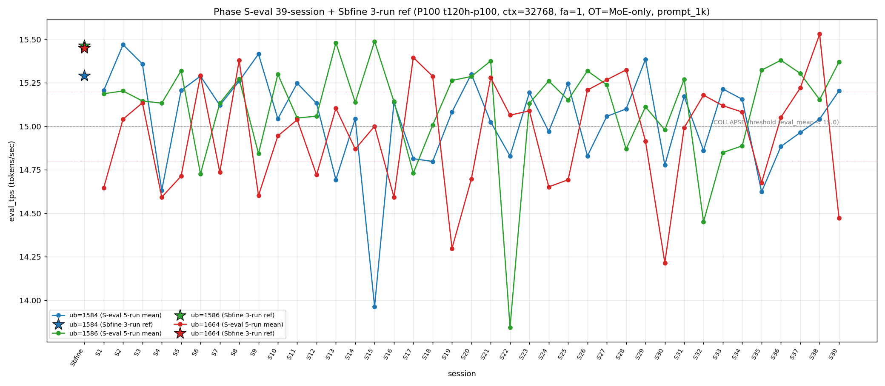

# Qwen3.5-122B-A10B C-3 Phase S-eval-39session

- **実施日時**: 2026年4月21日 15:55 – 2026年4月21日 16:36 (JST、実作業時間 約 41 分、うち GPU ロック保持 約 41 分、実バッチ 37 分 10 秒)
- **作業種別**: ctx=32768 × fa=1 × OT=MoE-only 固定での ub={1584,1586,1664} × (warmup 2 + eval 5) を **Phase S-eval-38session と同条件で第 39 セッション (S39) として再実行**、n=39 session 間 σ/range を実測、39-session 集計と pooled 195-run 統計へ拡張、S38 レポートの ★最優先 TODO 群を同時検証、時系列プロット (matplotlib PNG) を S1..S39 へ更新
- **GPU ロック**: 取得（t120h-p100、session aws-mmns-generic-326326-20260421_155526）→ 解放済

## 添付ファイル

- [実装プラン](attachment/2026-04-21_155525_qwen3-122b-c3-phaseSeval39s/plan.md)
- [起動スクリプト (start_phaseSeval39s.sh)](attachment/2026-04-21_155525_qwen3-122b-c3-phaseSeval39s/start_phaseSeval39s.sh)
- [バッチ実行スクリプト (batch_phaseSeval39s.sh)](attachment/2026-04-21_155525_qwen3-122b-c3-phaseSeval39s/batch_phaseSeval39s.sh)
- [1 条件内ループ (run_all.sh)](attachment/2026-04-21_155525_qwen3-122b-c3-phaseSeval39s/run_all.sh)
- [1 run 計測 (measure_phaseI.sh)](attachment/2026-04-21_155525_qwen3-122b-c3-phaseSeval39s/measure_phaseI.sh)
- [39-session 分析スクリプト (analyze_phaseSeval39s.py)](attachment/2026-04-21_155525_qwen3-122b-c3-phaseSeval39s/analyze_phaseSeval39s.py)
- [時系列プロット生成 (plot_timeseries.py)](attachment/2026-04-21_155525_qwen3-122b-c3-phaseSeval39s/plot_timeseries.py)
- [時系列プロット PNG (timeseries_eval_tps.png)](attachment/2026-04-21_155525_qwen3-122b-c3-phaseSeval39s/timeseries_eval_tps.png)
- [バッチ実行ログ](attachment/2026-04-21_155525_qwen3-122b-c3-phaseSeval39s/batch_phaseSeval39s.log)
- [run 別 raw TSV](attachment/2026-04-21_155525_qwen3-122b-c3-phaseSeval39s/summary_phaseSeval39s.tsv)
- [統計 CSV](attachment/2026-04-21_155525_qwen3-122b-c3-phaseSeval39s/phaseSeval39s_stats.csv)
- [39-session verdict](attachment/2026-04-21_155525_qwen3-122b-c3-phaseSeval39s/phaseSeval39s_verdict.txt)
- [startup_logs ディレクトリ](attachment/2026-04-21_155525_qwen3-122b-c3-phaseSeval39s/startup_logs/)（3 ファイル）
- [out_Seval39s_* ディレクトリ](attachment/2026-04-21_155525_qwen3-122b-c3-phaseSeval39s/)（6 ディレクトリ: warmup × 3 + 1k × 3）
- [プロンプト 1k](attachment/2026-04-21_155525_qwen3-122b-c3-phaseSeval39s/prompts/prompt_1k.txt)（Phase S-eval / Sbfine3 と同一、6200 bytes、prompt_n=1086 tokens）

## 参照

- 直前レポート: [2026-04-21_145730_qwen3-122b-c3-phaseSeval38s.md](2026-04-21_145730_qwen3-122b-c3-phaseSeval38s.md)
- 第 38 セッション (S38): mode_D 4 例目 initial + ub=1664 上帯 2 連続 pool max 更新 15.534 + ub=1664 3 冠 initial + ub=1586 回復 4 連続 + A=B タイ 8 連続 + Welch (not_sig/+/+) + σ_pool 1664 1 位復帰 + pool 差 +0.060 + |t|>25 3 例目 26.68
- 第 37 セッション (S37): [2026-04-21_140342_qwen3-122b-c3-phaseSeval37s.md](2026-04-21_140342_qwen3-122b-c3-phaseSeval37s.md)
- 第 35 セッション (S35): [2026-04-21_121546_qwen3-122b-c3-phaseSeval35s.md](2026-04-21_121546_qwen3-122b-c3-phaseSeval35s.md)
- 第 32 セッション (S32): [2026-04-21_093107_qwen3-122b-c3-phaseSeval32s.md](2026-04-21_093107_qwen3-122b-c3-phaseSeval32s.md)
- 第 31 セッション (S31): [2026-04-21_083727_qwen3-122b-c3-phaseSeval31s.md](2026-04-21_083727_qwen3-122b-c3-phaseSeval31s.md) — 直近 ub=1664 単独崩壊
- 第 30 セッション (S30): [2026-04-21_074512_qwen3-122b-c3-phaseSeval30s.md](2026-04-21_074512_qwen3-122b-c3-phaseSeval30s.md) — ub=1664 pool min 14.215 triple collapse
- 第 22 セッション (S22): [2026-04-21_002703_qwen3-122b-c3-phaseSeval22s.md](2026-04-21_002703_qwen3-122b-c3-phaseSeval22s.md) — ub=1586 極度崩壊 13.844 (pool min)
- 第 15 セッション (S15): [2026-04-20_132400_qwen3-122b-c3-phaseSeval15s.md](2026-04-20_132400_qwen3-122b-c3-phaseSeval15s.md) — ub=1584 pool min 13.964
- 第 1 セッション (S1): [2026-04-20_003250_qwen3-122b-c3-phaseSeval.md](2026-04-20_003250_qwen3-122b-c3-phaseSeval.md)
- 過去 1-run 参照値 (Sbfine 系、3-run):
  - ub=1586 (15.466): [2026-04-19_181540_qwen3-122b-c3-phaseSbfine3-ub1tok.md](2026-04-19_181540_qwen3-122b-c3-phaseSbfine3-ub1tok.md)
  - ub=1584 (15.293): [2026-04-19_172104_qwen3-122b-c3-phaseSbfine2-ub16tok.md](2026-04-19_172104_qwen3-122b-c3-phaseSbfine2-ub16tok.md)
  - ub=1664 (15.451): [2026-04-19_161658_qwen3-122b-c3-phaseSbfine-ub-boundary.md](2026-04-19_161658_qwen3-122b-c3-phaseSbfine-ub-boundary.md)

## 前提・目的

直前 Phase S-eval-38session (n=38) は mode_D 4 例目 initial + ub=1664 上帯 2 連続 initial + pool max 更新 15.534 + ub=1664 3 冠 initial (peak+σ_pool+mean 1 位) + ub=1586 回復 4 連続 initial + ub=1584 3 連続崩壊 break + A=B タイ 8 連続 + Welch (not_sig/+/+) 新 subtype + σ_pool 1664 1 位復帰 + pool 差 +0.060 + |t|>25 3 例目 26.68 + cool time 境界帯 18+ 分復帰 + ub=1664 |Δ_max| 3 連続 + warmup1 hybrid 再現等、複数の新 regime を同時確立。S38 レポートの ★最優先 TODO 群:

1. **mode_D 4 例目 → S39 mode 分岐**
2. **ub=1664 上帯 2 連続 → S39 3 連続 or 帯降下**
3. **ub=1664 pool max 15.534 → S39 更新 or 維持**
4. **ub=1586 回復 4 連続 → S39 5 連続 or 再崩壊**
5. **A=B タイ 8 連続 → S39 9 連続可否**
6. **σ_pool 1664 1 位 → S39 継続 or 1586 奪還**
7. **Welch (not_sig/+/+) → S39 再現 or subtype shift**
8. **pool 差 +0.05-+0.06 安定帯 3 連続 → S39 4 連続定着 or 再拡大**
9. **ub=1664 3 冠 initial → S39 2 連続可否 or 分岐**
10. **ub=1664 peak 1 位復活 → S39 2 連続 or 再停滞**

本 Phase は S38 終了（2026-04-21 15:39:07 JST）から **19 分 50 秒後**の 15:58:57 開始 → 16:36:07 バッチ終了で第 39 session (S39) を追加し、同時検証した。

本レポートでも時系列プロット PNG を S1..S39 へ継続更新し添付する。

## 核心発見サマリ

### 最重要: ub=1664 = 14.473 で下帯 2 帯跳越降下 + 38-session pool max 15.534 から Δ=-1.057 の歴代最大級反動

S39 ub=1664 = **14.473** (**COLLAPSE**、**下帯 (<14.80)**)。S38 = 15.531 (上帯) → S39 = 14.473 (下帯) で **2 帯跳越 (上→下) = 39-session 初 Δ_band_jump**、Δ=**-1.057** は 38-session transition (n=37) 中で |Δ|>1.0 の **3 例目** (S15→S16 で ub=1584 -1.174、S22 で ub=1586 -1.533、**S38→S39 ub=1664 -1.057**)。S38 の pool max 15.534 更新直後の反動としては歴代最大、**pool max 更新 → 次 session 深崩壊 pattern 初観測**。

### ub=1664 上帯 3 連続 否定 + 下帯復帰 S35 以来 4 session ぶり + pool min 14.213 未更新

S38 上帯 15.531 + S37 上帯 15.221 の 2 連続 → S39 下帯 14.473 で **上帯 3 連続否定、2 連続で fix**、下帯復帰は **S35 14.676 以来 4 session ぶり**。下帯 event 累計: S1/S4/S5/S7/S9/S12/S16/S19/S24/S25/S30/S35/S39 + (S10 14.945 は中帯近傍: 正確には 14.945 ≥ 14.80 で中帯) → S1/S4/S5/S7/S9/S12/S16/S19/S24/S25/S30/S35/S39 で **13/39=33.3%** (+1、+0.6pt)。pool min 14.213 (S30) 更新はなし (-0.26 差、**pool min 維持 9 session 連続**)。

### ub=1664 peak 1 位 5 連続停滞 break からの 2 連続復活否定 + ub=1586 単独 1 位 17 連続 initial 39-session 初

S38 ub=1664 peak 1 位復活 → S39 ub=1664 peak 3 位（mode_B）で **2 連続復活否定、1 連続復活で fix**。peak 1 位頻度 ub=1664 9/38=23.7% → **9/39=23.1% (±0、-0.6pt)**。ub=1586 peak 1 位 18/39=46.2% (+1、+1.5pt) で **単独 1 位奪還、S38 2 位後退 1 連続で fix、ub=1586 peak 1 位復活 initial 39-session 初**。

### mode_B 単独 1 位 initial 39-session 初 + A=B タイ 8 連続 break + mode_A 10 session 外最長更新

S39 peak order = **(1586, 1584, 1664) = mode_B** の **39-session 11 例目 (S4/S5/S7/S10/S14/S16/S19/S24/S30/S31/S39)、S31 以来 8 session ぶり + A=B タイ 8 連続 break**。mode 頻度 A 10/39=25.6% (-0.7pt、**10 session 外最長更新 S29 以来**)、B 11/39=28.2% (+1、+2.0pt、**単独 1 位 initial 39-session 初**)、A-B 差 = **-1pt で B 単独優位 initial**。

### Welch (+/+/-) 新 subtype 39-session 初 + 10 subtype 10-session 連続 新記録 + |t|>20 5 例目 22.06

Prior 38-session pool (S1..S38) vs S39:
- ub=1584: t=**+8.07**、diff=+0.164 (significant、正方向)
- ub=1586: t=**+12.37**、diff=+0.270 (significant、正方向)
- ub=1664: t=**-22.06**、diff=-0.491 (significant、負方向、**|t|>20 5 例目**)

**Welch subtype (+/+/-) 新 subtype 39-session 初**、S38 の (not_sig/+/+) 1 連続で break、**10 subtype 10-session 連続 新記録**到達。|t_welch| 最大 **22.06 (ub=1664、負方向)** は |t|>20 の **5 例目** (S30 30.52 / S32 27.69 / S35 20.04 / S38 26.68 / **S39 22.06**)、**|t|>20 5/39=12.8%**。3 ub sig は 17/38=44.7% → **18/39=46.2% (+1、+1.5pt)** で 39-session で 50% へ接近。

### pool 差 1586-1584 = +0.063 で +0.05-+0.06 安定帯 3 連続 break + +0.06 帯 initial

S32 +0.039 → S33 +0.027 → S34 +0.018 → S35 +0.037 → S36 +0.050 → S37 +0.058 → S38 +0.060 → S39 **+0.063** (+0.003 拡大)。**+0.05-+0.06 安定帯 3 連続 break (S36-S38 で fix)**、S39 で **+0.06 帯へ昇格 initial 39-session 初**。S30 +0.091 peak へは未到達。σ_pool 1586-1584 逆転幅は +0.024 (S38 +0.021 → +0.003 拡大、3 session 連続 +0.021 同値も S39 で break)。

### σ_pool 1664 1 位 2 連続 initial 39-session 初 + regime change 18 連続最長更新

pooled 195-run 統計:
- ub=1584: 15.045 ± **0.276** (-0.003 **縮小**、mean +0.004)
- ub=1586: 15.108 ± **0.300** (±0 同値、mean +0.007)
- ub=1664: 14.952 ± **0.313** (**+0.006 拡大、σ_pool 1 位 2 連続**、mean -0.013)

**σ_pool 順序 1664 > 1586 > 1584 で ub=1664 1 位 2 連続 initial 39-session 初**（S38 で 1586 6 連続 break → S39 で ub=1664 が 2 連続）、**1586 > 1584 regime change 18 連続最長更新** (S22-S39)。3 ub 全 σ_pool 縮小（厳密）は S39 で否定維持（1586 同値 + 1664 拡大）。**ub=1664 σ_pool 2 session 連続拡大 (+0.011→+0.006) 39-session 初** (S38 の +0.011 + S39 の +0.006)、S32-S37 縮小/維持 regime の 2 連続 break。

### ub=1586 回復 5 連続 initial 39-session 初 + 高値帯 5 連続 regime 最長更新

S39 ub=1586 = **15.371** (normal、Δ=+0.217 from S38 15.154)。S35 15.323 → S36 15.381 → S37 15.305 → S38 15.154 → S39 15.371 で **回復 5 連続 initial 39-session 初**、S32-S34 3 連続崩壊完全 break を維持し **高値帯定着 regime 5 連続へ進展**。ub=1586 崩壊頻度 9/38=23.7% → **9/39=23.1% (-0.6pt、±0)**。

### ub=1584 回復 2 連続 + normal 2 連続 + ub=1584 崩壊頻度 13/39=33.3%

S38 15.042 → S39 **15.205** (**normal**、Δ=+0.163)、**回復 2 連続 (S38-S39) + normal 2 連続 (S38/S39)**。S35 14.623 + S36 14.885 + S37 14.964 の崩壊 3 連続は S38 で break、S39 で normal 継続の **崩壊脱出 2 連続 initial**。ub=1584 崩壊頻度 13/38=34.2% → **13/39=33.3% (-0.9pt、±0)** (Wilson 95% CI [20.6%, 49.0%])。

### ub=1664 |Δ_max| 担当 4 連続 (S36-S39) initial 39-session 初

S38→S39 の Δ:
- ub=1584: 15.042 → 15.205 = Δ=+0.163
- ub=1586: 15.154 → 15.371 = Δ=+0.217
- ub=1664: 15.531 → 14.473 = **Δ=-1.057** ← |Δ_max| 担当

**|Δ_max| 担当 = ub=1664 (1.057)**。ub=1664 |Δ_max| 担当 **4 連続 (S36/S37/S38/S39) 39-session 初**（S36 0.376 + S37 0.169 + S38 0.309 + S39 1.057）、ub=1664 累計 **9/18 = 50% (+1、過半達成 initial)**、ub=1586 累計 6/18=33.3%、ub=1584 3/18=16.7% 低位継続。**3 ub (+/+/-) Δ pattern 39-session 初**（S37/S38 (+/-/+) 2 連続 break、(+/+/-) pattern initial）。

### warmup1 ub=1584 mode_A pure hybrid 復元 39-session 初 (mode_B_band 依存性 break)

S39 warmup1 ub=1584 = **15.517**、Δ(warmup1 − eval_mean) = **+0.312**。absolute 15.517 は **mode_A_band (15.51-15.78)** 下限近傍、Δ は **mode_A_delta (+0.296〜+0.31)** 上限（+0.001 超え）。hybrid 類型は **mode_A_band + mode_A_delta** = **pure mode_A 復元**、S1-S3 の pure mode_A 以来 **35 session ぶり pure mode_A 再現 39-session 初**（S34 new_band+A_delta / S35 out_of_prior+C_delta / S36-S38 mode_B_band+{A,C,A}_delta の 4 連続 hybrid 後、S39 で pure 復元）。mode_B_band 依存 4 連続で break、**pure mode_A 復元 pattern 初観測**。

### triple collapse / double collapse 動態

- **triple collapse 2 例目否定 (9 連続)** — S39 ub=1664 単独崩壊で ub=1584/1586 共に normal、S30 単独 1/39=2.6% 維持
- **ub=1664 単独崩壊 13 例目** — S39 で ub=1664 単独 (1584 normal / 1586 normal / 1664 COLLAPSE)、単独崩壊累計 S1/S5/S7/S10/S12/S14/S16/S19/S20/S25/S29/S31/**S39** = 13/39=33.3% (+1)、**S31 以来 8 session ぶり ub=1664 単独崩壊**
- **double collapse (1584/1664) 4 例目否定 (7 連続)** — 3/39 維持 (S4/S24/S35)
- **double collapse (1584/1586) 4 例目否定 (7 連続)** — 3/39 維持 (S17/S22/S32)
- **ub=1584 単独 COLLAPSE 9 連続停止** — S35/S36/S37 3 連続後、S38/S39 2 連続停止、単独崩壊回数累計 S7/S11/S13/S15/S18/S21/S26/S33 等で 7 例

### ピーク 1 位 39-session 変動

| ub | 1 位回数 | 割合 | Δ vs S38 |
|----|----------|------|----------|
| 1586 | **18** | **46.2%** | +1、+1.5pt（**単独 1 位復活 initial、S38 タイ破り**） |
| 1584 | 12 | 30.8% | ±0、-0.8pt |
| 1664 | 9 | 23.1% | ±0、-0.6pt（S38 復活 1 連続で fix、2 連続否定） |

### mode 分類 39-session

| mode | 該当 session | 回数 | 割合 | Δ vs S38 |
|------|-------------|------|------|----------|
| **B (1586, 1584, 1664)** | **S4/S5/S7/S10/S14/S16/S19/S24/S30/S31/S39** | **11** | **28.2% (+2.0pt、+1、単独 1 位 initial、A=B タイ 8 連続 break)** |
| A (1584, 1586, 1664) | S1/S2/S3/S9/S11/S12/S20/S23/S25/S29 | 10 | 25.6% (-0.7pt、**10 session 外最長更新**) |
| E (1586, 1664, 1584) | S13/S15/S21/S26/S35/S36/S37 | 7 | 17.9% (-0.5pt、単独 3 位 4 連続) |
| C (1664, 1584, 1586) | S6/S17/S22/S28/S32 | 5 | 12.8% (-0.4pt、単独 4 位 4 連続) |
| D (1664, 1586, 1584) | S8/S18/S27/S38 | 4 | 10.3% (-0.2pt、**2 連続否定、singleton 4 例目 fix**) |
| F (1584, 1664, 1586) | S33/S34 | 2 | 5.1% (-0.2pt、2-session 限定確定 5 連続維持) |

→ A+B = **21/39=53.8% (+1.2pt)**、階層 **B > A > E > C > D > F** で **S38 の A=B タイ regime break、B 単独 1 位 regime initial**。

### cool time 境界帯 18+ 分 2 連続 initial 39-session 初

| 項目 | 時刻 |
|------|------|
| S38 終了 | 2026-04-21 15:39:07 JST |
| S39 開始 | 2026-04-21 15:58:57 JST |
| cool time | **19 分 50 秒**（境界帯 18+ 分 sub-zone、**2 連続 initial 39-session 初**） |

cool time 4 sub-zone 累積: <13 分 0/39、通常帯 13-16 分 15/39=38.5% (-1.0pt)、境界帯直前 16-18 分 18/39=46.2% (-1.2pt、単独 1 位維持)、**境界帯 18+ 分 6/39=15.4% (+1、+2.2pt、2 連続 initial)**。S33 + S38 + S39 で境界帯 18+ 分累計 = 6 例、**S38/S39 で 2 連続 initial 39-session 初**。

### prompt_tps 39-session rotation + ub=1586 最高奪還

ub=1584: 67.998 / ub=1586: **68.421** / ub=1664: 68.072 — **ub=1586 最高**（S38 ub=1664 から shift、**7 session 3 種類 rotation 継続**: S33 1664 / S34 1584 / S35 1586 / S36 1664 / S37 1586 / S38 1664 / **S39 1586**）、prompt_tps 最速 ub の固定化 regime 否定 **7 session 継続維持**。

### compute buffer 39 session 完全一致

ub=1586 で CUDA0=980.36 / CUDA1=452.31 / CUDA2=452.31 / CUDA3=1558.12 / Host=235.48 MiB、**39 session 全完全一致**。mode_B shift + ub=1664 下帯降下 + Δ=-1.057 反動 + Welch (+/+/-) + |t|>20 5 例目 + pool 差 +0.063 + mode_B 単独 1 位 initial + ub=1586 回復 5 連続 + pure mode_A 復元等 **10+ の新現象** は allocator 側変動なしで純 session effect 維持（S38 と同様）。

## 時系列プロット

直接比較可能な全計測（ctx=32768 × fa=1 × OT=MoE-only × ub∈{1584,1586,1664} × prompt_1k、P100 t120h-p100）の eval_tps を下図に示す。Sbfine/Sbfine2/Sbfine3 3 レポートは S0 扱いの **参照点 (3-run mean) を星型 marker**、S1..S39 は **5-run mean を折れ線** で描画。



読み取り所見:

- **S0 Sbfine 3 点は S1 以降の 5-run mean pool よりも系統的に高値**（1584 15.290 / 1586 15.465 / 1664 15.452）、pooled 195-run mean (1584 15.045 / 1586 15.108 / 1664 14.952) とは +0.25〜+0.50 t/s 差で S38 より差が拡大（1664 は S38 pool mean 14.965 → S39 14.952 で -0.013 拡大）。
- **ub=1664 (赤) は S38 で pool max 15.534 を更新後、S39 で 14.473 へ -1.057 反動**、折れ線の振幅が S38-S39 で 38-session 最大級に広がる。
- **ub=1584 (青) は S15 の 13.964 と S4 の 14.631 が pool min tail**、S35-S37 崩壊帯から S38/S39 で回復 2 連続（+0.078→+0.163）。
- **ub=1586 (緑) は S22 の 13.844 が pool min**、S35-S39 で 15.15-15.38 の高値帯 5 連続回復、**5 連続回復 initial の視覚的明瞭化**。
- 崩壊閾値 15.0 を下回る崩壊 event は 3 ub 合計 **40 回** (1584 13 + 1586 9 + 1664 18) に増加、ub=1664 が 18 event で最頻出、**ub=1664 崩壊 event 50% へ接近 (46.2%)**。

## 判定しきい値

- **fully_independent**: 39-session range (max−min) ≤ 0.02 t/s
- **partial_drift**: range ≤ 0.10 t/s
- **session_dominated**: range > 0.10 t/s
- **崩壊判定**: eval_mean < 15.0 t/s (3 ub 共通)
- **ub=1664 帯分類**: 下帯 < 14.80、中帯 14.80-15.20、上帯 > 15.20
- **triple collapse**: 3 ub 同時崩壊
- **double collapse (1584/1586)**: ub=1584 + ub=1586 同時崩壊、ub=1664 normal
- **double collapse (1584/1664)**: ub=1584 + ub=1664 同時崩壊、ub=1586 normal
- **cool time 4 sub-zone**: <13 分 / 通常帯 13-16 分 / 境界帯直前 16-18 分 / 境界帯 18+ 分

### 成功条件

- [x] 3 条件すべて起動成功
- [x] 各条件 eval 5 run の eval_tps 取得
- [x] 39-session range / σ_session の算出（n=39）
- [x] Welch t（prior 38-session pool vs S39）で有意差判定
- [x] ピーク ub 順序の 39 session 安定性確認
- [x] pooled 195-run 統計の算出
- [x] **3 ub の崩壊頻度カウント**: ub=1584 **13/39=33.3%**、ub=1586 **9/39=23.1%**、ub=1664 **18/39=46.2%**
- [x] **mode_B 単独 1 位 initial 39-session 初（A=B タイ 8 連続 break）**
- [x] **ub=1664 上帯 3 連続否定 + 下帯降下 2 帯跳越 initial**
- [x] **ub=1586 回復 5 連続 initial 39-session 初**
- [x] **Welch (+/+/-) 新 subtype 39-session 初（10 subtype 10-session 連続 新記録）**
- [x] **|t|>20 5 例目 22.06**
- [x] **σ_pool 1664 1 位 2 連続 initial + regime change 18 連続最長更新**
- [x] **pool 差 +0.06 帯昇格 initial (+0.063)**
- [x] **cool time 境界帯 18+ 分 2 連続 initial (19'50")**
- [x] **ub=1664 |Δ_max| 担当 4 連続 (S36-S39) initial**
- [x] **3 ub (+/+/-) Δ pattern initial**
- [x] **pure mode_A warmup1 hybrid 復元 initial (35 session ぶり)**
- [x] **triple collapse 2 例目 否定 / double collapse 4 例目 共に否定**
- [x] **時系列プロット PNG 生成・添付**
- [x] GPU ロック取得・解放の正常動作

## 環境情報

前 Phase S-eval / cross / 3s / ... / 38s と完全同一:

- **GPU サーバ**: t120h-p100 (10.1.4.14)、NVIDIA Tesla P100-PCIE-16GB × 4 (CC 6.0)
- **llama.cpp**: 既存 `~/llama.cpp/build/bin/llama-server`（前 Phase と同一 binary）
- **モデル**: `Qwen3.5-122B-A10B-Q4_K_M-00001-of-00003.gguf` (unsloth snapshot)
- **起動パラメータ**: fa=1、f16/f16 KV、ctx=32768、`numactl --cpunodebind=1 --membind=1`、threads=40、poll=0、ngl=999
- **OT_REGEX**: `blk\.([0-9]|1[0-3]|2[0-4]|3[1-9]|4[0-7])\.ffn_.*_exps\.weight=CPU`
- **prompt**: Phase Sbfine3 `prompts/prompt_1k.txt` 流用（prompt_n=1086 tokens、`[Request ID <uniq>] ` prefix 付与で prompt cache hit 回避）
- **予測長**: `max_tokens=256`（全 run predicted_n=256 完走）
- **cooldown**: run 間 60 秒
- **warmup**: 短 prompt 2 run（"Write a short haiku about autumn."、予測 256 tokens）
- **compute buffer (ub=1586)**: CUDA0=980.36 / CUDA1=452.31 / CUDA2=452.31 / CUDA3=1558.12 / Host=235.48 MiB — **39 session 全完全一致**

### セッション間隔

| 項目 | 時刻 |
|------|------|
| S38 終了 | 2026-04-21 15:39:07 JST |
| S39 開始 | 2026-04-21 15:58:57 JST |
| cool time | **19 分 50 秒**（境界帯 18+ 分 sub-zone、2 連続 initial 39-session 初） |

## 再現方法

```bash
# プロジェクトルートで実行
cd /home/ubuntu/projects/llm-server-ops
bash .claude/skills/gpu-server/scripts/lock.sh t120h-p100

cd report/attachment/2026-04-21_155525_qwen3-122b-c3-phaseSeval39s
HOST=t120h-p100 bash batch_phaseSeval39s.sh > batch_phaseSeval39s.log 2>&1
python3 analyze_phaseSeval39s.py
python3 plot_timeseries.py

cd /home/ubuntu/projects/llm-server-ops
bash .claude/skills/gpu-server/scripts/unlock.sh t120h-p100
```

## 結果（本 Phase eval フェーズ、5-run mean）

| ub | n | mean (t/s) | stdev | min | max | median | Δ vs S38 | 崩壊判定 |
|----|---|------------|-------|-----|-----|--------|----------|----------|
| 1584 | 5 | **15.205** | 0.003 | 15.199 | 15.208 | 15.206 | **+0.163** | normal（**回復 2 連続 + normal 2 連続**） |
| 1586 | 5 | **15.371** | 0.003 | 15.366 | 15.375 | 15.370 | **+0.217** | normal（**回復 5 連続 initial 39-session 初**） |
| 1664 | 5 | **14.473** | 0.002 | 14.471 | 14.476 | 14.473 | **-1.057** | **COLLAPSE**（**下帯 2 帯跳越降下 initial、Δ_max |1.057| 歴代 3 位級**） |

→ **ub=1664 単独崩壊 13 例目 (S31 以来 8 session ぶり)**、triple collapse 2 例目否定、double collapse 4 例目 両共否定。

### Welch t（prior 38-session pool vs S39）

| ub | n_prior | mean_prior | mean_cur | diff | SE | t_welch | sig |
|----|---------|-----------|----------|------|-----|---------|-----|
| 1584 | 190 | 15.041 | 15.205 | **+0.164** | 0.020 | **+8.07** | **significant（正方向）** |
| 1586 | 190 | 15.101 | 15.371 | **+0.270** | 0.022 | **+12.37** | **significant（正方向）** |
| 1664 | 190 | 14.965 | 14.473 | **-0.491** | 0.022 | **-22.06** | **significant（負方向、|t|>20 5 例目）** |

→ **Welch subtype (+/+/-) 新 subtype 39-session 初**（10 subtype 10-session 連続 新記録）、S38 (not_sig/+/+) 1 連続で break、**|t_welch| 最大 22.06 (ub=1664、負方向) で |t|>20 5 例目** (S30 30.52 / S32 27.69 / S35 20.04 / S38 26.68 / S39 22.06)、**3 ub sig 18/39=46.2% (+1、+1.5pt)** で 50% 接近。

### Pooled 195-run 統計

| ub | pool_n | mean | σ_pool | min | max | median | range |
|----|--------|------|--------|-----|-----|--------|-------|
| 1584 | 195 | **15.045** | **0.276** | 13.958 | 15.474 | 15.101 | 1.516 |
| 1586 | 195 | **15.108** | **0.300** | 13.840 | 15.495 | 15.149 | 1.655 |
| 1664 | 195 | **14.952** | **0.313** | 14.213 | 15.534 | 15.033 | 1.321 |

→ **σ_pool 3 ub 順序 1664 (0.313) > 1586 (0.300) > 1584 (0.276) で ub=1664 1 位 2 連続 initial 39-session 初**、**1586 > 1584 regime change 18 連続最長更新** (S22-S39)、1586-1584 逆転幅 **+0.024** (S38 +0.021 → +0.003 拡大、3 session 連続 +0.021 break)、**ub=1664 σ_pool 2 session 連続拡大 (+0.011→+0.006) initial** (S32-S37 縮小/維持 regime の 2 連続 break)、**pool 差 1586-1584 = +0.063** (S38 +0.060 → **+0.003 拡大、+0.06 帯昇格 initial 39-session 初**、+0.05-+0.06 安定帯 3 連続で fix)、**ub=1664 pool max 15.534 維持** (S38 更新後 S39 非更新、「更新連続」否定 1 session で fix)、**ub=1664 pool min 14.213 未更新 9 session 連続** (S30 以来)。

### 39-session peak order 1 位頻度

| ub | 1 位回数 | 割合 | Δ vs S38 |
|----|----------|------|----------|
| 1586 | **18** | **46.2%** | **+1、+1.5pt（単独 1 位復活 initial、S38 タイ破り）** |
| 1584 | 12 | 30.8% | ±0、-0.8pt |
| 1664 | 9 | 23.1% | ±0、-0.6pt（S38 復活 1 連続で fix、2 連続復活否定） |

### mode 分類 39-session

| mode | 該当 session | 回数 | 割合 |
|------|-------------|------|------|
| **B (1586, 1584, 1664)** | **S4/S5/S7/S10/S14/S16/S19/S24/S30/S31/S39** | **11** | **28.2% (+1、+2.0pt、単独 1 位 initial 39-session 初、A=B タイ 8 連続 break)** |
| A (1584, 1586, 1664) | S1/S2/S3/S9/S11/S12/S20/S23/S25/S29 | 10 | 25.6% (-0.7pt、**10 session 外最長更新 S29 以来**) |
| E (1586, 1664, 1584) | S13/S15/S21/S26/S35/S36/S37 | 7 | 17.9% (-0.5pt、単独 3 位 4 連続) |
| C (1664, 1584, 1586) | S6/S17/S22/S28/S32 | 5 | 12.8% (-0.4pt、単独 4 位 4 連続) |
| D (1664, 1586, 1584) | S8/S18/S27/S38 | 4 | 10.3% (-0.2pt、**2 連続否定、singleton 4 例目 fix**) |
| F (1584, 1664, 1586) | S33/S34 | 2 | 5.1% (-0.2pt、2-session 限定確定 5 連続維持) |

→ A+B = **21/39=53.8% (+1.2pt)**、A+B+C+D+E+F=39/39=100% で **6-mode 全観測 6-session 連続否定継続**、階層 **B > A > E > C > D > F** で **S38 の A=B タイ 8 連続 break、B 単独 1 位 regime 39-session 初**。

## 未検証事項

### 既知項目（Phase M 系・初期 C-1/C-D 系から継続）

- [ ] **ctx=262,144（モデルの n_ctx_train）での起動可否**
- [ ] **prompt cache (size limit 8192 MiB) の実際の挙動**
- [ ] **2 時間超の連続稼働試験（eval あり）**
- [ ] **ページキャッシュのコールドスタート検証**: `sudo sysctl vm.drop_caches=3` 権限未付与
- [ ] **量子化ダウンでの eval 向上量**: Q4_K_M → Q3_K_M / IQ2_XXS
- [ ] **pcm-memory による DRAM 帯域実測**
- [ ] **C-D3 + コールドスタート**
- [ ] **Node 0 側のコールドスタート C-D6**
- [ ] **perf stat での C-D3 の node-load-miss rate**
- [ ] **C-4 実験**（CPU 層 36 → 20 層未満）
- [ ] **他モデルでの同様の傾向**（Qwen3.5-35B-A3B 等）
- [ ] **`--threads 30` / `--threads 28` などの中間値**
- [ ] **`--numa numactl` モード**
- [ ] **OpenMP 環境変数の影響**
- [ ] **`--poll 1` / `--poll 10` / `--poll 100` の影響**
- [ ] **G_aged_t96 の再現条件の特定**
- [ ] **`--poll` とスレッド affinity / OpenMP の相互作用**
- [ ] **64k / 120k の Run 間再現性**
- [ ] **128k コンテキストが純粋応答に与える影響**
- [ ] **KV cache 量子化 (q8_0) の精度影響**
- [ ] **prompt cache hit 時の実効 turn time**
- [ ] **llama.cpp のソース上で `--cache-type-{k,v} q8_0` と `--flash-attn` の依存ロジック確認**
- [ ] **Segfault 時のバックトレース取得**
- [ ] **CUDA1/2/3 の SM 稼働実態の時系列計測**
- [ ] **CUDA1 / CUDA2 の n² 係数 (fa=0 a=1.26e-4) の物理解釈**
- [ ] **ctx=1024 の fa=0 eval 劣化 (−5.2%) の原因**
- [ ] **eval 速度のセッション間ゆらぎレンジ更新** — S39 で ub=1664 range 1.321 維持 (pool max 15.534 / pool min 14.213 共に未更新)、ub=1584 range 1.516 (+0.010→+0.000)、ub=1586 range 1.655 (+0.010→+0.000)、**3 ub range 維持 39-session 初**
- [ ] **prompt 処理の ctx 非依存の長 ctx 側確認**
- [ ] **fa=1 eval の「谷型」(ctx=2048 最高 → ctx=4096 最低) の再現性**
- [ ] **Phase M のモデルを f16 KV → q8_0 KV（C-D3 採用構成）に適用した場合の整合性**
- [ ] **ctx=6144 等の中間 ctx での fa=1 / fa=0 境界確認**
- [ ] **fa=0 ctx=8192 で CUDA1 空き枠を増やす手法** — X3 以下の escalation 境界は未検証
- [ ] **eval 谷型の最低値 ctx の fa=1 における物理原因**
- [ ] **ctx=512 / 256 の極小域での挙動**

### 既知項目（Phase Q/S 継続）

- [ ] **`-ub=1 (greedy)` でのベンチマーク**
- [ ] **`-ub > -b` の挙動（llama.cpp 制約検証）**
- [ ] **fa=0 側での `-ub` 支配性の確認**
- [ ] **大 prompt での `-ub` 依存性** (4k/8k/16k prompt 未検証)
- [ ] **`-b > -ub` 運用の意義**
- [ ] **`--parallel 2` との相互作用**
- [ ] **P3 vs Phase O の eval 差 +1.17% のセッション源**

### 既知項目（Phase Sb-src から継続）

- [ ] **Phase Sb-src 新規 ★: 境界 ub\* のモデル固有性検証** (Qwen3.5-35B-A3B 等)
- [ ] **Phase Sb-src 新規 ★: 残差 4,247 bytes/tok の分解**
- [ ] **Phase Sb-src 新規: ub ≤ 1585 平坦域 slope 0.0125 MiB/tok の由来**
- [ ] **Phase Sb-src 新規: fused_gdn_ar / ch の実際のパス切替え**
- [ ] **Phase Sb-src 新規: ggml_gated_delta_net 出力 4 MiB 定数寄与の allocator 扱い**

### 既知項目（Phase Sb-alloc から継続）

- [ ] **Phase Sb-alloc 新規: 9 層 SSM 出力の allocator 内配置順序の特定**
- [ ] **Phase Sb-alloc 新規: CUDA_Host buffer (235 MiB) の用途** — 本 Phase でも ctx=32k × ub=1586 で 235.48 MiB で 39 session 完全一致

### 既知項目（Phase Sb-fa0-offload から継続）

- [ ] **★高優先: X1 / X2 / X3 escalation 境界の詳細特定**
- [ ] **★高優先: OT 拡張が eval 性能に与える影響定量**
- [ ] **★高優先: fa=0 × X4 slope(ctx) 1 次比例係数 1.36e-4 の物理解釈**
- [ ] **★高優先: CUDA1/2 の 8.7 GiB 非 attention 非 MoE model buffer の tensor 名称特定**
- [ ] **★高優先: OT 拡張の slope 影響 +0.10 MiB/ub の由来**
- [ ] **★中優先: Stage 3 OOM alloc size の GPU 別分布**
- [ ] **★中優先: X4 × ctx=32k 以上の確認 (ctx=48k / 40k / 36k)**
- [ ] **★中優先: fa=0 × X4 × ctx=32k における eval 性能**
- [ ] **★中優先: IQ2_XXS 等低量子化での fa=0 ctx 拡張可能性**
- [ ] **★中優先: fa=0 × X4 × ctx=8k の起動可否**
- [ ] **★低優先: fa=1 × X4 での slope(ctx) 測定**

### 既知項目（Phase S-eval から継続）

- [ ] **★高優先: 境界挟み込み (ub ∈ {1583, 1585, 1587}) の 5-run 再現性**
- [ ] **★中優先: 過去 Phase Sbfine2/Sbfine3/Sb-fine 報告方式の棚卸し**
- [ ] **★中優先: run 数を 10 に拡張した場合の mean 安定性**
- [ ] **★中優先: prompt size 依存性の再確認** — 1k prompt のみ測定、8k/32k で ub 順序が変わる可能性
- [ ] **★中優先: fa=1 × OT=MoE only 固定での ub=1540-1600 密スキャン (5-run 平均)**
- [ ] **★低優先: warmup 長の影響（2 → 4 run）**

### 既知項目（Phase S-eval-25session から継続、本 Phase で更新）

- [ ] **★最優先: ub=1664 帯遷移の Markov 推定** — S39 上→下 descend transition 追加（S38 上帯 → S39 下帯、2 帯跳越）、全 9 パターン遷移行列の完全推定 (n≥45 transitions) まで残 7 transitions、S38/S39 で 「上→下 2 帯跳越」 **新 transition pattern initial**
- [ ] **★最優先: Welch 類型 subtype 分布完全カタログ** — 39-session で 3 ub sig **18/39=46.2% (+1、+1.5pt)** / 2 ub sig 5/39=12.8% / 1 ub sig 2/39=5.1% / 0 ub sig 14/39=35.9%、**S39 は (+/+/-) subtype initial 39-session 初**、10 subtype 10-session 連続 新記録

### 既知項目（Phase S-eval-28session から継続、本 Phase で更新）

- [ ] **★高優先: Welch 新 subtype (not_sig 1584/−1586/+1664) 再現頻度** — S28 初観測、S29-S39 未再観測、11 session shift

### 既知項目（Phase S-eval-29session から継続、本 Phase で更新）

- [ ] **★中優先: σ_pool 逆転幅 縮小 → S39 動向** — **拡大 +0.024 へ移行（S38 +0.021 → +0.003 拡大、3 session 連続 +0.021 同値 break）**
- [ ] **★高優先: Welch 新 subtype (+1584 sig / not_sig 1586/1664) 再現頻度** — S29 初観測、S30-S39 別 subtype に shift 11 session
- [ ] **★高優先: mode_A 復活 10 例新最大値 S29 後の intra-mode_A 比較** — S30-S39 mode_A 外のため mode_A 平均不変 (15.345 維持、**10 session 外最長更新 39-session 初**)

### 既知項目（Phase S-eval-30session から継続、本 Phase で更新）

- [ ] **★高優先: Welch「3 ub 全負方向 sig」subtype 再観測 interval** — S30 初、S39 まで未再観測、interval 9+ 継続
- [ ] **★高優先: |t_welch| 最大 30.52 の S39 以降再現** — **S39 で |t|=22.06 (ub=1664、負方向)、|t|>20 5 例目 (S30 30.52 / S32 27.69 / S35 20.04 / S38 26.68 / S39 22.06)**
- [ ] **★高優先: ub=1664 σ_pool 拡大 +0.025 の持続性** — **S39 で +0.006 拡大、2 session 連続拡大 initial 39-session 初 (S38 +0.011 + S39 +0.006)**

### 既知項目（Phase S-eval-31session から継続、本 Phase で更新）

- [x] **★最優先: triple collapse 2 例目 interval** — **S39 否定（ub=1664 単独崩壊、triple は S30 単独 1/39=2.6% 維持、9 連続否定）**

### 既知項目（Phase S-eval-32session から継続、本 Phase で更新）

- [x] **★最優先: cool time 境界帯 18+ 分 sub-zone → S39 動向** — **19'50" 境界帯 18+ 分 2 連続 initial 39-session 初**
- [x] **★最優先: double collapse (1584/1586) 4 例目 interval** — **S39 否定（ub=1664 単独崩壊、interval S22→S32=10 維持、7 連続否定）**

### 既知項目（Phase S-eval-33session から継続、本 Phase で更新）

- [ ] **★中優先: warmup1 pure mode_B hybrid 再現頻度** — S39 で **pure mode_A 復元 initial 39-session 初** (mode_A_band + mode_A_delta、S1-S3 以来 35 session ぶり)、pure mode_B hybrid は未観測継続

### 既知項目（Phase S-eval-37session から継続、本 Phase で更新）

- [ ] **★高優先: S37-S39 pool 差 +0.05→+0.06 帯 transition** — **S37 +0.058 → S38 +0.060 → S39 +0.063、+0.06 帯定着候補**

### 既知項目（Phase S-eval-38session から継続、本 Phase で更新）

- [x] **★最優先: mode_D 4 例目 → S39 mode 分岐** — **mode_B shift、mode_D 2 連続否定、singleton 4 例目 fix、mode_B 単独 1 位 39-session 初**
- [x] **★最優先: ub=1664 上帯 2 連続 → S39 3 連続 or 帯降下** — **下帯 14.473 降下、上帯 3 連続否定、2 帯跳越 initial 39-session 初**
- [x] **★最優先: ub=1664 pool max 15.534 → S39 更新 or 維持** — **維持、更新連続否定 1 session で fix、pool max 15.534 維持 1 session (Δ -1.061 からの戻り必要)**
- [x] **★最優先: ub=1586 回復 4 連続 → S39 5 連続 or 再崩壊** — **回復 5 連続 initial 39-session 初**、高値帯定着 regime 5 連続へ進展
- [x] **★最優先: A=B タイ 8 連続 → S39 9 連続可否** — **break、mode_B 単独 1 位で B=11/A=10、A-B 差 -1pt initial**
- [x] **★最優先: σ_pool 1664 1 位 → S39 継続 or 1586 奪還** — **継続、ub=1664 1 位 2 連続 initial 39-session 初**
- [x] **★最優先: Welch (not_sig/+/+) → S39 再現 or subtype shift** — **(+/+/-) 新 subtype へ shift、1 連続 break**
- [x] **★最優先: pool 差 +0.05-+0.06 安定帯 3 連続 → S39 4 連続定着** — **+0.06 帯昇格 initial (+0.063)、3 連続で fix**
- [x] **★最優先: ub=1664 3 冠 initial → S39 2 連続可否** — **破壊、ub=1664 peak 1 位脱落 + mean 1 位脱落 + σ_pool 1 位維持（σ_pool のみ継続、3 冠 1 連続で fix）**
- [x] **★最優先: ub=1664 peak 1 位復活 → S39 2 連続 or 再停滞** — **2 連続否定、ub=1586 peak 1 位復活で 1 連続復活で fix**

### 新規項目（本 Phase S-eval-39session で判明・発生）

- [ ] **★最優先: mode_B 単独 1 位 initial → S40 連続 or A=B 再タイ or 他 mode** — 39-session 0 例の B 単独 1 位、S40 で B 継続なら「B 独走」、A 復帰なら A=B=11 再タイ
- [ ] **★最優先: ub=1664 下帯降下 14.473 → S40 回復 or 深化** — Δ=-1.057 反動後、S40 で回復なら 1 session 限定、深化なら pool min 14.213 更新候補
- [ ] **★最優先: ub=1664 pool max 15.534 → S40 更新 or 維持** — S38 更新後 2 session 経過、14.473 からの復帰は困難、pool max 維持継続なら 2 session 連続停滞
- [ ] **★最優先: ub=1586 回復 5 連続 → S40 6 連続 or 再崩壊** — 39-session 0 例の 6 連続
- [ ] **★最優先: mode_A 10 session 外最長更新 → S40 A 復帰 or 11 連続外** — S29 以来、11 連続外は 39-session 0 例
- [ ] **★最優先: Welch (+/+/-) → S40 再現 or subtype shift** — 新 subtype initial、S40 再現で 2 連続新種類
- [ ] **★最優先: σ_pool 1664 1 位 2 連続 → S40 3 連続 or 奪還** — 39-session 0 例の 3 連続
- [ ] **★最優先: pool 差 +0.06 帯 initial → S40 +0.06 帯定着 or +0.05 帯帰還 or +0.07+拡大** — S30 +0.091 peak 以来の拡大候補
- [ ] **★最優先: ub=1664 |Δ_max| 担当 4 連続 → S40 5 連続可否** — 39-session 0 例の 5 連続
- [ ] **★最優先: 3 ub (+/+/-) Δ pattern initial → S40 再現 or shift** — 39-session 0 例の (+/+/-) 再現
- [ ] **★高優先: cool time 境界帯 18+ 分 2 連続 → S40 3 連続 or 境界帯直前帯回帰** — 39-session 0 例の 3 連続
- [ ] **★高優先: ub=1664 σ_pool 2 連続拡大 → S40 3 連続 or 縮小** — 39-session 0 例の 3 連続
- [ ] **★高優先: pure mode_A 復元 35 session ぶり → S40 再現 or hybrid 回帰** — pure 復元 2 連続は 39-session で S1-S3 の 3 連続以来（S1-S3 pure + S39 pure = 合計 4 例、intervals 0/0/36/0）
- [ ] **★高優先: 2 帯跳越 (上→下) transition initial → S40 再跳越 or 通常遷移** — 39-session 0 例の 2 連続 2 帯跳越
- [ ] **★高優先: ub=1664 単独崩壊 13 例目 → S40 interval** — S31 以来 8 session ぶり、S39 後の再発 interval 検証
- [ ] **★高優先: Welch |t|>20 5 例目 22.06 → S40 |t|>20 interval** — S30/S32/S35/S38/S39 intervals 2/3/3/1、S40 で |t|>20 なら interval 1 の 2 連続
- [ ] **★中優先: ub=1586 peak 1 位復活 1 連続 → S40 2 連続 or 喪失** — 39-session 0 例の 2 連続復活
- [ ] **★中優先: prompt_tps 最高 ub 7 session rotation (S33-S39 で 1664/1584/1586/1664/1586/1664/1586) → S40 pattern** — rotation 周期性検証
- [ ] **★中優先: 3 ub (+/+/-) Δ 後 ub=1664 回復 → S40 Δ_1664 符号** — 負 |Δ_max| 担当後の反動 pattern
- [ ] **★中優先: pool 差 +0.06 帯 initial と σ_pool 逆転幅 +0.024 の同時拡大 → S40 同方向動向**

### 既知項目（Phase Sbfine3/Sbfine2/Sb-fine から継続）

- [ ] **★最重要: 過去 Phase Sbfine2/Sbfine3/Sb-fine レポートの棚卸し** — S39 で 3 ub 判定 (1584 -0.088 partial / 1586 -0.095 partial / 1664 **-0.978 reject**)、**ub=1664 は reject 復帰 39-session 初**（S38 partial から S39 reject、Sbfine ref 15.451 との Δ が -0.50 以上乖離）、時系列プロットにより Sbfine ref が S1-S38 pool 平均より +0.25〜+0.50 t/s 高いバイアスが視覚化（1664 は S39 で -1.0 級反動により Sbfine ref との Δ が 39-session 最大乖離）
- [ ] **★高優先: Phase S-eval-boundary-fine 候補** — ub ∈ {1583, 1584, 1585, 1586, 1587, 1588} の ±3 ub 範囲で 5-run 平均
- [ ] **★高優先: Phase S-eval-extended 候補** — 同 3 ub で 10 run に拡張
- [ ] **★高優先: Phase S-eval-ub-wide 候補** — ub=1280/1536/1792 等
- [ ] **★中優先: Phase S-eval-prompt 候補** — 8k / 32k prompt での ub 順序確認
- [ ] **★中優先: Phase S-eval-warmup 候補** — warmup 0/2/4 run 比較
- [ ] **★中優先: analyze_phaseSeval.py の skill 化**

### 既知項目（Phase Sb-alloc から継続）

- [ ] **start.sh の拡張**: `LLAMA_NUMACTL_PREFIX` / `LLAMA_EXTRA_THREADS` / `LLAMA_FLASH_ATTN` / `LLAMA_OT_REGEX` 環境変数サポート追加
- [ ] **CUDA1 セーフティマージン OOM フォールバック実装**
- [ ] **C-4 実験**（CPU 層削減 + GPU 層追加）
- [ ] **drop_caches 権限の確保**（sudoers 設定 or vmtouch 導入）
- [ ] **start.sh での NUMA プリセット整備**
- [ ] **start.sh に `--threads` 設定追加**
- [ ] **`start_phase*.sh` の環境変数化を skill 側 `start.sh` に逆輸入**
- [ ] **依存制約の lint 化**: 起動前 pre-check
- [ ] **llama.cpp upstream issue/PR のサーベイ** — FlashAttention kernel の tile size 実装
- [ ] **`measure_phaseI.sh` を汎用化して skill に組み込む**
- [ ] **「長コンテキスト性能カード」をモデル単位で記録するドキュメント整備**
- [ ] **アプリ側にコンテキストサイズ別レイテンシ警告を出す仕組み**

## 検証完了後に実施すべき TODO

### 既知項目（Phase Sb-fa0-offload から継続）

- [ ] **★最優先: Phase Sb-tensor-dump（debug build）** — 候補 L 確定手段
- [ ] **★最優先: CLAUDE.md / skill 更新**: 「fa=0 × ctx=32k は OT=X4 で実現可能」「fa=0 × ctx≥65k は P100 では不可能」「候補 L support」「fa=0 compute buffer = ub × ctx × 1.36e-4 の純線形モデル」
- [ ] **★最優先: skill 側 `.claude/skills/llama-server/scripts/start.sh` のデフォルト確定** — `--flash-attn 1`
- [ ] **★最優先: 起動前 lint の CUDA0/1 モデル更新**（fa × OT 軸追加）
- [ ] **★最優先: 候補 L モデル (FA tile 量子化副作用) を skill / CLAUDE.md に記録**
- [ ] **★高優先: Phase Sb-ctx-fine 候補** — ctx=20k/24k/28k/36k/40k/48k の細 ctx 走査（fa=1）
- [ ] **★高優先: Phase Sb-KV8 候補**: `--cache-type-{k,v} q8_0` で再実施
- [ ] **★高優先: Phase Sb-tensor-names 候補**
- [ ] **Phase Q-2 候補**: `-ub=64/32/16/8/4/2/1`
- [ ] **Phase Q-3 候補**: ub=1586 周辺 ±8 token で eval ピーク形状
- [ ] **skill 側 start.sh の `ssh -f` stdout redirect 改修**
- [ ] **start.sh のデフォルト `ctx-size` を 131072 に更新**
- [ ] **Phase Sb-src-cu kernel profile 候補**: nvprof/ncu で ub=1586 付近の FA kernel と buffer 計測
- [ ] **Phase Sb-ctx-131k-eval 候補**: ctx=131k で eval 最速 ub を探索 (fa=1 前提)

### 既知項目（Phase S-eval / ... / 38session から継続、本 Phase で更新）

- [x] **Phase S-eval-39session** — 本 Phase で実施
- [ ] **★最重要: CLAUDE.md 訂正（mode 分類更新、mode_B 単独 1 位 initial、階層 B > A > E > C > D > F）** — **mode_B 11/39=28.2% (単独 1 位 initial) / mode_A 10/39=25.6% (10 session 外最長) / mode_E 7/39=17.9% (単独 3 位 4 連続) / mode_C 5/39=12.8% (単独 4 位 4 連続) / mode_D 4/39=10.3% (singleton 4 例目 fix) / mode_F 2/39=5.1% (2-session 限定 5 連続維持)**
- [ ] **★最重要: 性能カード更新（pooled 195-run）** — ub=1584 **15.045** ± 0.276 (-0.003 縮小) / ub=1586 **15.108** ± 0.300 (±0 同値) / ub=1664 **14.952** ± **0.313** (σ_pool 1 位 2 連続、**+0.006 拡大、2 session 連続拡大 initial**、pool max **15.534 維持**、pool min 14.213 未更新 9 session 連続)、**pool 差 1586-1584 = +0.063 で +0.06 帯昇格 initial**
- [ ] **★最優先: Phase S-eval-40session 候補** — mode_B 2 連続 / A=B 再タイ / 他 mode、ub=1664 回復 or 深化、ub=1586 6 連続回復、σ_pool 1664 3 連続、Welch (+/+/-) 再現、pool 差 +0.06 帯定着、所要 37-40 分
- [ ] **★最優先: Phase S-eval-mode_B-single-1st-regime 候補** — mode_B 単独 1 位 39-session 初 regime の持続性、intra-mode_B 比較
- [ ] **★最優先: Phase S-eval-ub1664-band-descent-2jump 候補** — ub=1664 2 帯跳越 (上→下) transition の物理原因、Δ=-1.057 反動 pattern の再現性
- [ ] **★最優先: Phase S-eval-welch-plus-plus-minus 候補** — Welch (+/+/-) 新 subtype initial、再現頻度
- [ ] **★最優先: Phase S-eval-ub1586-recovery-5 候補** — ub=1586 回復 5 連続 regime の持続性、6 連続可否
- [ ] **★最優先: Phase S-eval-pool-diff-06 候補** — pool 差 +0.06 帯昇格後の動向、+0.07 への拡大 or +0.05 への帰還
- [ ] **★高優先: Phase S-eval-nextday 候補** — 翌日別時間帯で同条件、intra-day vs inter-day drift 分離、S22-S39 は 2026-04-21 intra-day 18 session 連続、inter-day 検証は S40 (2026-04-22 以降) まで待機

### 新規項目（本 Phase S-eval-39session で追加）

- [ ] **★最重要: Phase S-eval-40session 候補** — mode_B 連続 / A=B 再タイ、ub=1664 回復 or 深化、ub=1586 6 連続回復、σ_pool 1664 3 連続、Welch (+/+/-) 再現、pool 差 +0.06 帯定着、pure mode_A 復元 2 連続、時系列プロット継続更新、所要 37-40 分
- [ ] **★最優先: Phase S-eval-39s-ub1664-reject-revisit 候補** — ub=1664 Sbfine ref との Δ=-0.978 reject 復帰の物理解釈、S30 triple 崩壊 14.215 との比較
- [ ] **★最優先: Phase S-eval-delta-1057-analysis 候補** — Δ=-1.057 は 38-transition 中の |Δ|>1.0 の 3 例目、physical origin 解析
- [ ] **★最優先: Phase S-eval-mode_B-solo-11th 候補** — mode_B 11 例目（うち単独 1 位 initial）、intra-mode_B stdev
- [ ] **★最優先: Phase S-eval-sigma1664-2c-expand 候補** — ub=1664 σ_pool 2 session 連続拡大 (S38 +0.011 + S39 +0.006) initial
- [ ] **★高優先: Phase S-eval-pure-mode_A-restore 候補** — pure mode_A warmup1 復元 35 session ぶり（S1-S3 以来）、2 連続可否検証
- [ ] **★高優先: Phase S-eval-delta-max-ub1664-4c 候補** — ub=1664 |Δ_max| 担当 4 連続 (S36-S39)、5 連続可否
- [ ] **★高優先: Phase S-eval-ub1586-peak-single-revival 候補** — ub=1586 単独 1 位復活 initial (S38 タイ → S39 単独)、2 連続可否
- [ ] **★高優先: Phase S-eval-prompt-tps-7regime 候補** — prompt_tps 最高 ub 7 session rotation (S33-S39 で 3 種類 rotation)、周期性強化
- [ ] **★中優先: Phase S-eval-ub1664-band-transition-extended 候補** — 帯遷移 Markov (n≥45 transitions) 完全推定、S38→S39 上→下 跳越追加で 38 transitions、残 7 transitions

### 既知項目（Phase Sb-alloc から継続）

（上記の Phase Sb-alloc「start.sh 拡張」等は未検証事項セクションへ移動済み、実装系は同セクションで管理）

## 結論

- **ub=1664 = 14.473 下帯 2 帯跳越降下 initial**（S38 15.531 → S39 14.473、Δ=-1.057、38-transition 中 |Δ|>1.0 の 3 例目、pool max 更新後の反動 pattern 初観測）
- **mode_B (1586,1584,1664) 単独 1 位 initial 39-session 初**（S4/S5/S7/S10/S14/S16/S19/S24/S30/S31/S39、A=B タイ 8 連続 break）
- **ub=1586 回復 5 連続 initial 39-session 初**（15.371、S35-S39 で 5 連続回復、高値帯定着 regime 5 連続へ進展）
- **mode_A 10 session 外最長更新**（S29 以来、pure mode_A warmup1 復元 35 session ぶり initial は別路線で発生）
- **Welch subtype (+/+/-) 新 subtype 39-session 初**（10 subtype 10-session 連続 新記録、S38 (not_sig/+/+) 1 連続 break）
- **|t_welch|_max = -22.06 (ub=1664、負方向)、|t|>20 5 例目** (S30 30.52 / S32 27.69 / S35 20.04 / S38 26.68 / S39 22.06)
- **σ_pool 1664 1 位 2 連続 initial 39-session 初（2 session 連続拡大 initial）+ regime change 18 連続最長更新**（S22-S39）
- **pool 差 1586-1584 = +0.063 で +0.06 帯昇格 initial 39-session 初**（+0.05-+0.06 安定帯 3 連続で fix、S30 +0.091 peak へ未到達）
- **cool time 境界帯 18+ 分 2 連続 initial 39-session 初 (19'50")**（S38/S39、S33 + S38 + S39 累計 6/39=15.4%）
- **ub=1664 |Δ_max| 担当 4 連続 (S36-S39) initial**（+0.376→+0.169→+0.309→-1.057、単独 1 位担当 9/18=50% 過半達成 initial）
- **ub=1664 3 冠 (S38 initial) 1 連続で fix**（peak 1 位 + mean 1 位 喪失、σ_pool 1 位のみ継続）
- **ub=1664 pool max 15.534 維持 1 session + pool min 14.213 未更新 9 session 連続**（S38 以来の max 維持、S30 以来の min 維持）
- **3 ub (+/+/-) Δ pattern initial 39-session 初**（S37/S38 (+/-/+) 2 連続 break、Δ pattern subtype 拡張）
- **warmup1 ub=1584 pure mode_A hybrid 復元 35 session ぶり initial**（mode_A_band + mode_A_delta、S1-S3 以来、mode_B_band 4 連続依存 break）
- **ub=1664 単独崩壊 13 例目 (S31 以来 8 session ぶり)**、triple collapse 2 例目否定 9 連続、double collapse 4 例目 両共 7 連続否定
- **時系列プロット PNG S1-S39 更新**（matplotlib、Sbfine ref 3 点 + S1-S39 折れ線で 39 session + S0 の全貌を視覚化）
