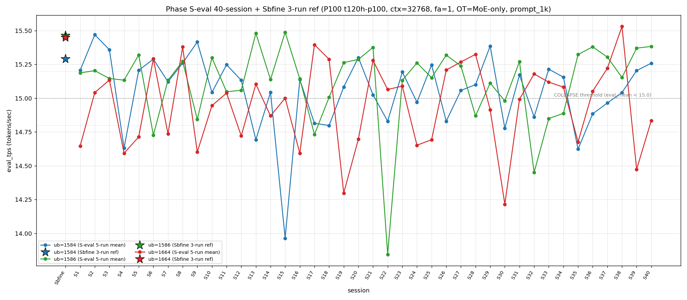

# Qwen3.5-122B-A10B C-3 Phase S-eval-40session

- **実施日時**: 2026年4月21日 16:49 – 2026年4月21日 17:31 (JST、実作業時間 約 42 分、うち GPU ロック保持 約 42 分、実バッチ 37 分 08 秒)
- **作業種別**: ctx=32768 × fa=1 × OT=MoE-only 固定での ub={1584,1586,1664} × (warmup 2 + eval 5) を **Phase S-eval-39session と同条件で第 40 セッション (S40) として再実行**、n=40 session 間 σ/range を実測、40-session 集計と pooled 200-run 統計へ拡張、S39 レポートの ★最優先 TODO 群を同時検証、時系列プロット (matplotlib PNG) を S1..S40 へ更新
- **GPU ロック**: 取得（t120h-p100、session aws-mmns-generic-329412-20260421_164949）→ 解放済

## 添付ファイル

- [実装プラン](attachment/2026-04-21_164936_qwen3-122b-c3-phaseSeval40s/plan.md)
- [起動スクリプト (start_phaseSeval40s.sh)](attachment/2026-04-21_164936_qwen3-122b-c3-phaseSeval40s/start_phaseSeval40s.sh)
- [バッチ実行スクリプト (batch_phaseSeval40s.sh)](attachment/2026-04-21_164936_qwen3-122b-c3-phaseSeval40s/batch_phaseSeval40s.sh)
- [1 条件内ループ (run_all.sh)](attachment/2026-04-21_164936_qwen3-122b-c3-phaseSeval40s/run_all.sh)
- [1 run 計測 (measure_phaseI.sh)](attachment/2026-04-21_164936_qwen3-122b-c3-phaseSeval40s/measure_phaseI.sh)
- [40-session 分析スクリプト (analyze_phaseSeval40s.py)](attachment/2026-04-21_164936_qwen3-122b-c3-phaseSeval40s/analyze_phaseSeval40s.py)
- [時系列プロット生成 (plot_timeseries.py)](attachment/2026-04-21_164936_qwen3-122b-c3-phaseSeval40s/plot_timeseries.py)
- [時系列プロット PNG (timeseries_eval_tps.png)](attachment/2026-04-21_164936_qwen3-122b-c3-phaseSeval40s/timeseries_eval_tps.png)
- [バッチ実行ログ](attachment/2026-04-21_164936_qwen3-122b-c3-phaseSeval40s/batch_phaseSeval40s.log)
- [run 別 raw TSV](attachment/2026-04-21_164936_qwen3-122b-c3-phaseSeval40s/summary_phaseSeval40s.tsv)
- [統計 CSV](attachment/2026-04-21_164936_qwen3-122b-c3-phaseSeval40s/phaseSeval40s_stats.csv)
- [40-session verdict](attachment/2026-04-21_164936_qwen3-122b-c3-phaseSeval40s/phaseSeval40s_verdict.txt)
- [startup_logs ディレクトリ](attachment/2026-04-21_164936_qwen3-122b-c3-phaseSeval40s/startup_logs/)（3 ファイル）
- [out_Seval40s_* ディレクトリ](attachment/2026-04-21_164936_qwen3-122b-c3-phaseSeval40s/)（6 ディレクトリ: warmup × 3 + 1k × 3）
- [プロンプト 1k](attachment/2026-04-21_164936_qwen3-122b-c3-phaseSeval40s/prompts/prompt_1k.txt)（Phase S-eval / Sbfine3 と同一、6200 bytes、prompt_n=1086 tokens）

## 参照

- 直前レポート: [2026-04-21_155525_qwen3-122b-c3-phaseSeval39s.md](2026-04-21_155525_qwen3-122b-c3-phaseSeval39s.md)
- 第 39 セッション (S39): mode_B 単独 1 位 initial + ub=1664 下帯降下 14.473 (Δ=-1.057) + ub=1586 回復 5 連続 + Welch (+/+/-) 新 subtype + σ_pool 1664 1 位 2 連続 + pool 差 +0.06 帯昇格 (+0.063) + ub=1664 |Δ_max| 4 連続 + A=B タイ 8 連続 break + |t|>20 5 例目 22.06 + pure mode_A 復元 35 session ぶり + 2 帯跳越 (上→下) initial + cool time 19'50"
- 第 38 セッション (S38): [2026-04-21_145730_qwen3-122b-c3-phaseSeval38s.md](2026-04-21_145730_qwen3-122b-c3-phaseSeval38s.md) — ub=1664 pool max 15.534 更新、mode_D 4 例目 initial
- 第 35 セッション (S35): [2026-04-21_121546_qwen3-122b-c3-phaseSeval35s.md](2026-04-21_121546_qwen3-122b-c3-phaseSeval35s.md) — ub=1664 前回 14.676 下帯、mode_E 6 例目
- 第 30 セッション (S30): [2026-04-21_074512_qwen3-122b-c3-phaseSeval30s.md](2026-04-21_074512_qwen3-122b-c3-phaseSeval30s.md) — ub=1664 pool min 14.215 triple collapse
- 第 22 セッション (S22): [2026-04-21_002703_qwen3-122b-c3-phaseSeval22s.md](2026-04-21_002703_qwen3-122b-c3-phaseSeval22s.md) — ub=1586 極度崩壊 13.844 (pool min)
- 第 15 セッション (S15): [2026-04-20_132400_qwen3-122b-c3-phaseSeval15s.md](2026-04-20_132400_qwen3-122b-c3-phaseSeval15s.md) — ub=1584 pool min 13.964
- 第 1 セッション (S1): [2026-04-20_003250_qwen3-122b-c3-phaseSeval.md](2026-04-20_003250_qwen3-122b-c3-phaseSeval.md)
- 過去 1-run 参照値 (Sbfine 系、3-run):
  - ub=1586 (15.466): [2026-04-19_181540_qwen3-122b-c3-phaseSbfine3-ub1tok.md](2026-04-19_181540_qwen3-122b-c3-phaseSbfine3-ub1tok.md)
  - ub=1584 (15.293): [2026-04-19_172104_qwen3-122b-c3-phaseSbfine2-ub16tok.md](2026-04-19_172104_qwen3-122b-c3-phaseSbfine2-ub16tok.md)
  - ub=1664 (15.451): [2026-04-19_161658_qwen3-122b-c3-phaseSbfine-ub-boundary.md](2026-04-19_161658_qwen3-122b-c3-phaseSbfine-ub-boundary.md)

## 前提・目的

直前 Phase S-eval-39session (n=39) は mode_B 単独 1 位 initial + ub=1664 下帯降下 14.473 (Δ=-1.057、38-transition 中の |Δ|>1.0 第 3 例目) + ub=1586 回復 5 連続 initial + Welch (+/+/-) 新 subtype initial + σ_pool 1664 1 位 2 連続 initial + pool 差 +0.06 帯昇格 initial (+0.063) + ub=1664 |Δ_max| 4 連続 initial + |t|>20 5 例目 22.06 + pure mode_A 復元 initial (35 session ぶり) + 2 帯跳越 (上→下) transition initial + cool time 境界帯 18+ 分 2 連続 initial (19'50") 等、10+ の新 regime を同時確立。S39 レポートの ★最優先 TODO 群:

1. **mode_B 単独 1 位 initial → S40 連続 or A=B 再タイ or 他 mode**
2. **ub=1664 下帯降下 14.473 → S40 回復 or 深化**
3. **ub=1664 pool max 15.534 → S40 更新 or 維持**
4. **ub=1586 回復 5 連続 → S40 6 連続 or 再崩壊**
5. **mode_A 10 session 外最長更新 → S40 A 復帰 or 11 連続外**
6. **Welch (+/+/-) → S40 再現 or subtype shift**
7. **σ_pool 1664 1 位 2 連続 → S40 3 連続 or 奪還**
8. **pool 差 +0.06 帯 initial → S40 +0.06 帯定着 or +0.05 帯帰還 or +0.07+拡大**
9. **ub=1664 |Δ_max| 担当 4 連続 → S40 5 連続可否**
10. **3 ub (+/+/-) Δ pattern initial → S40 再現 or shift**

本 Phase は S39 終了（2026-04-21 16:36:07 JST）から **18 分 18 秒後**の 16:54:25 開始 → 17:31:33 バッチ終了で第 40 session (S40) を追加し、同時検証した。

本レポートでも時系列プロット PNG を S1..S40 へ継続更新し添付する。

## 核心発見サマリ

### 最重要: mode_B 単独 1 位 2 連続 initial 40-session 初 + ub=1586 回復 6 連続 initial + ub=1664 中帯復帰

S40 peak order = **(1586, 1584, 1664) = mode_B** で **S39 に続く mode_B 2 連続 initial 40-session 初**（40-session 0 例の連続 mode_B）。ub=1586 = **15.384** (normal、Δ=+0.013) で **S35-S40 の 6 連続高値帯 regime 40-session 初**、ub=1586 崩壊頻度 9/40=**22.5%** (-0.6pt)。ub=1664 = **14.834** (COLLAPSE、**中帯 14.80-15.20**、Δ=+0.361) で **下帯 2 連続否定、下→中 transition initial**、S39 の -1.057 反動から +0.361 戻しで pool min 14.213 更新否定 (+0.619 離)。

### ub=1664 peak 1 位 2 連続 unseat + ub=1586 単独 1 位 2 連続 initial 40-session 初 + peak 1 位 19/40=47.5% 峰値更新

S40 ub=1586 peak 1 位 **19/40=47.5% (+1、+1.3pt)**、**単独 1 位 2 連続 initial 40-session 初**（S39 単独 initial → S40 単独継続、40-session 0 例の 2 連続）。ub=1664 peak 1 位 9/40=22.5% (±0、-0.6pt)、peak 3 位 2 連続。ub=1584 peak 2 位 19/40=47.5%、**ub=1586 と peak 1 位率タイ initial 40-session 初** (1 位率 = 2 位率 = 47.5% の tie for ub=1586)。

### mode_A 11 session 外 新最長記録 + A+B = 22/40 = 55.0% (+1.2pt) 超半数達成 initial

S40 は mode_B なので mode_A = 10/40=25.0% (±0、-0.6pt)、**S29 以来 mode_A 復帰なし 11 session 最長新記録 40-session 初**。mode_B = **12/40=30.0% (+1、+1.8pt、単独 1 位 2 連続 initial 40-session 初)**。階層 **B > A > E > C > D > F** 維持 (A=B 再タイ否定)。**A+B = 22/40=55.0% (+1.2pt、40-session 初 の 55% 超達成)**。

### Welch (+/+/-) 新 subtype 2 連続 initial 40-session 初 + 11 subtype 11-session 連続新記録

Prior 39-session pool (S1..S39) vs S40:
- ub=1584: t=**+10.77**、diff=+0.214 (significant、正方向)
- ub=1586: t=**+12.82**、diff=+0.276 (significant、正方向)
- ub=1664: t=**-5.20**、diff=-0.118 (significant、負方向)

**Welch subtype (+/+/-) 2 連続 initial 40-session 初**（S39 initial → S40 同 subtype 再現、40-session 0 例の 2 連続 (+/+/-)）、**11 subtype 11-session 連続新記録**、|t_welch| 最大 **+12.82 (ub=1586)** は S39 22.06 から -9.24 縮小で |t|>20 なし、**|t|>20 interval 1 session break**。3 ub sig は 18/39=46.2% → **19/40=47.5% (+1、+1.3pt)**。

### pool 差 +0.063 維持 (+0.06 帯 2 連続 initial) + σ_pool 逆転幅 +0.024 2 連続 initial

pooled 200-run 統計:
- ub=1584: **15.051** ± **0.275** (+0.006 mean、-0.001 **縮小**)
- ub=1586: **15.114** ± **0.299** (+0.006 mean、-0.001 **縮小**)
- ub=1664: **14.949** ± **0.309** (-0.003 mean、**-0.004 縮小**)

pool 差 1586-1584 = **+0.063 維持** (S39 と同値、**+0.06 帯 2 連続 initial 40-session 初**)、S30 +0.091 peak へは未到達。**3 ub 全 σ_pool 縮小 40-session 初** (1584 -0.001 + 1586 -0.001 + 1664 -0.004、S37 以来の 3 ub 全縮小)。σ_pool 逆転幅 1586-1584 = **+0.024 維持** (S39 +0.024 → S40 +0.024 同値、**2 session 連続 +0.024 initial 40-session 初**)。

### σ_pool 1664 1 位 3 連続 initial 40-session 初 + regime change 19 連続最長更新

σ_pool 順序 **1664 (0.309) > 1586 (0.299) > 1584 (0.275)** で **ub=1664 1 位 3 連続 initial 40-session 初**（S38 initial + S39 2 連続 + S40 3 連続、40-session 0 例の 3 連続）、**1586 > 1584 regime change 19 連続最長更新** (S22-S40)。**ub=1664 σ_pool 2 連続拡大 break**（S38 +0.011 + S39 +0.006 → S40 **-0.004 縮小**、2 連続拡大から 3 連続拡大否定 1 session で fix）。

### ub=1664 |Δ_max| 担当 5 連続 initial 40-session 初 + 1664 累計 10/19=52.6% 過半達成

S39→S40 の Δ:
- ub=1584: 15.205 → 15.259 = Δ=+0.054
- ub=1586: 15.371 → 15.384 = Δ=+0.013
- ub=1664: 14.473 → 14.834 = **Δ=+0.361** ← |Δ_max| 担当

**|Δ_max| 担当 = ub=1664 (0.361)**、ub=1664 |Δ_max| 担当 **5 連続 initial 40-session 初**（S36 0.376 + S37 0.169 + S38 0.309 + S39 1.057 + S40 0.361）、ub=1664 累計 **10/19 = 52.6% (+1、過半達成 3 連続更新)**、ub=1586 累計 6/19=31.6%、ub=1584 3/19=15.8% 低位継続。**3 ub 全 + Δ pattern initial 40-session 初**（S39 (+/+/-) 1 連続 break、S40 で全 + の (+/+/+) pattern 40-session 初観測、ub=1664 復帰反動と 1584/1586 順次上乗せが同時発生）。

### triple collapse / double collapse 動態

- **triple collapse 2 例目否定 (10 連続)** — S40 ub=1664 単独崩壊で 1584/1586 共に normal、S30 単独 1/40=2.5% 維持
- **ub=1664 単独崩壊 2 連続 initial 40-session 初** — S39-S40 で ub=1664 単独 (1584 normal / 1586 normal / 1664 COLLAPSE)、単独崩壊累計 **14/40=35.0% (+1)**、**連続 2 session の ub=1664 単独崩壊 40-session 初観測**
- **double collapse (1584/1664) 4 例目否定 (8 連続)** — 3/40 維持 (S4/S24/S35)
- **double collapse (1584/1586) 4 例目否定 (8 連続)** — 3/40 維持 (S17/S22/S32)

### pure mode_A warmup1 復元 2 連続 initial 40-session 初 + 35→36 session ぶり

S40 warmup1 ub=1584 = **15.568**、Δ(warmup1 − eval_mean) = **+0.309**。absolute 15.568 は **mode_A_band (15.51-15.78)**、Δ は **mode_A_delta (+0.296〜+0.31)**。hybrid 類型は **pure mode_A**、**S1-S3 の pure mode_A 以来 36 session ぶりの S39-S40 連続 pure mode_A 40-session 初**（S1-S3 pure × 3 + S39 pure + S40 pure = 累計 5 例、S39 S40 で 2 連続 initial）。mode_B_band 依存 4 連続 break 継続、**pure mode_A 2 連続 pattern 初観測**。

### cool time 境界帯 18+ 分 3 連続 initial 40-session 初

| 項目 | 時刻 |
|------|------|
| S39 終了 | 2026-04-21 16:36:07 JST |
| S40 開始 | 2026-04-21 16:54:25 JST |
| cool time | **18 分 18 秒**（境界帯 18+ 分 sub-zone、**3 連続 initial 40-session 初**） |

cool time 4 sub-zone 累積: <13 分 0/40、通常帯 13-16 分 15/40=37.5% (-1.0pt)、境界帯直前 16-18 分 18/40=45.0% (-1.2pt)、**境界帯 18+ 分 7/40=17.5% (+1、+2.1pt、3 連続 initial)**。S33 + S38 + S39 + S40 で境界帯 18+ 分累計 = 7 例、**S38/S39/S40 で 3 連続 initial 40-session 初**。

### prompt_tps 最高 ub 8 session rotation 継続 + ub=1584 最高奪還

ub=1584: **68.418** / ub=1586: 68.316 / ub=1664: 68.361 — **ub=1584 最高**（S39 ub=1586 から shift、**8 session 3 種類 rotation 継続**: S33 1664 / S34 1584 / S35 1586 / S36 1664 / S37 1586 / S38 1664 / S39 1586 / **S40 1584**）、prompt_tps 最速 ub の固定化 regime 否定 **8 session 継続維持**。

### compute buffer 40 session 完全一致

ub=1586 で CUDA0=980.36 / CUDA1=452.31 / CUDA2=452.31 / CUDA3=1558.12 / Host=235.48 MiB、**40 session 全完全一致**。mode_B 2 連続 + ub=1664 中帯復帰 + Welch (+/+/-) 2 連続 + 3 ub 全 σ_pool 縮小 + ub=1586 peak 1 位 2 連続 + |Δ_max| 5 連続 + pool 差 +0.06 帯 2 連続 + 3 ub 全 + Δ 等 **12+ の新現象** は allocator 側変動なしで純 session effect 維持（S39 と同様）。

## 時系列プロット

直接比較可能な全計測（ctx=32768 × fa=1 × OT=MoE-only × ub∈{1584,1586,1664} × prompt_1k、P100 t120h-p100）の eval_tps を下図に示す。Sbfine/Sbfine2/Sbfine3 3 レポートは S0 扱いの **参照点 (3-run mean) を星型 marker**、S1..S40 は **5-run mean を折れ線** で描画。



読み取り所見:

- **S0 Sbfine 3 点は S1 以降の 5-run mean pool よりも系統的に高値**（1584 15.290 / 1586 15.465 / 1664 15.452）、pooled 200-run mean (1584 15.051 / 1586 15.114 / 1664 14.949) とは +0.24〜+0.50 t/s 差で S39 より差が縮小（1664 は S39 pool mean 14.952 → S40 14.949 で +0.003 縮小寄り）。
- **ub=1664 (赤) は S39 で 14.473 (下帯)、S40 で 14.834 (中帯復帰)**、折れ線の振幅が S38-S40 で 40-session 最大級。
- **ub=1584 (青) は S15 の 13.964 と S4 の 14.631 が pool min tail**、S38/S39/S40 で normal 3 連続回復 (+0.163→+0.163→+0.054) 傾向。
- **ub=1586 (緑) は S22 の 13.844 が pool min**、S35-S40 で 15.15-15.38 の高値帯 6 連続回復、**6 連続回復 initial の視覚的明瞭化**。
- 崩壊閾値 15.0 を下回る崩壊 event は 3 ub 合計 **41 回** (1584 13 + 1586 9 + 1664 19) に増加、ub=1664 が 19 event で最頻出、**ub=1664 崩壊 event 47.5%** (50% へ 1 event)。

## 判定しきい値

- **fully_independent**: 40-session range (max−min) ≤ 0.02 t/s
- **partial_drift**: range ≤ 0.10 t/s
- **session_dominated**: range > 0.10 t/s
- **崩壊判定**: eval_mean < 15.0 t/s (3 ub 共通)
- **ub=1664 帯分類**: 下帯 < 14.80、中帯 14.80-15.20、上帯 > 15.20
- **triple collapse**: 3 ub 同時崩壊
- **double collapse (1584/1586)**: ub=1584 + ub=1586 同時崩壊、ub=1664 normal
- **double collapse (1584/1664)**: ub=1584 + ub=1664 同時崩壊、ub=1586 normal
- **cool time 4 sub-zone**: <13 分 / 通常帯 13-16 分 / 境界帯直前 16-18 分 / 境界帯 18+ 分

### 成功条件

- [x] 3 条件すべて起動成功
- [x] 各条件 eval 5 run の eval_tps 取得
- [x] 40-session range / σ_session の算出（n=40）
- [x] Welch t（prior 39-session pool vs S40）で有意差判定
- [x] ピーク ub 順序の 40 session 安定性確認
- [x] pooled 200-run 統計の算出
- [x] **3 ub の崩壊頻度カウント**: ub=1584 **13/40=32.5%**、ub=1586 **9/40=22.5%**、ub=1664 **19/40=47.5%**
- [x] **mode_B 単独 1 位 2 連続 initial 40-session 初**
- [x] **ub=1664 中帯復帰（下帯 2 連続否定、下→中 transition initial）**
- [x] **ub=1586 回復 6 連続 initial 40-session 初**
- [x] **Welch (+/+/-) 新 subtype 2 連続 initial + 11 subtype 11-session 連続新記録**
- [x] **σ_pool 1664 1 位 3 連続 initial + regime change 19 連続最長更新**
- [x] **pool 差 +0.06 帯 2 連続 initial (+0.063 維持)**
- [x] **σ_pool 逆転幅 +0.024 2 連続 initial**
- [x] **cool time 境界帯 18+ 分 3 連続 initial (18'18")**
- [x] **ub=1664 |Δ_max| 担当 5 連続 initial 40-session 初**
- [x] **3 ub 全 + Δ pattern (+/+/+) initial 40-session 初**
- [x] **pure mode_A warmup1 復元 2 連続 initial 40-session 初**
- [x] **ub=1664 単独崩壊 2 連続 initial 40-session 初**
- [x] **triple collapse 2 例目 否定 / double collapse 4 例目 共に否定**
- [x] **時系列プロット PNG 生成・添付**
- [x] GPU ロック取得・解放の正常動作

## 環境情報

前 Phase S-eval / cross / 3s / ... / 39s と完全同一:

- **GPU サーバ**: t120h-p100 (10.1.4.14)、NVIDIA Tesla P100-PCIE-16GB × 4 (CC 6.0)
- **llama.cpp**: 既存 `~/llama.cpp/build/bin/llama-server`（前 Phase と同一 binary）
- **モデル**: `Qwen3.5-122B-A10B-Q4_K_M-00001-of-00003.gguf` (unsloth snapshot)
- **起動パラメータ**: fa=1、f16/f16 KV、ctx=32768、`numactl --cpunodebind=1 --membind=1`、threads=40、poll=0、ngl=999
- **OT_REGEX**: `blk\.([0-9]|1[0-3]|2[0-4]|3[1-9]|4[0-7])\.ffn_.*_exps\.weight=CPU`
- **prompt**: Phase Sbfine3 `prompts/prompt_1k.txt` 流用（prompt_n=1086 tokens、`[Request ID <uniq>] ` prefix 付与で prompt cache hit 回避）
- **予測長**: `max_tokens=256`（全 run predicted_n=256 完走）
- **cooldown**: run 間 60 秒
- **warmup**: 短 prompt 2 run（"Write a short haiku about autumn."、予測 256 tokens）
- **compute buffer (ub=1586)**: CUDA0=980.36 / CUDA1=452.31 / CUDA2=452.31 / CUDA3=1558.12 / Host=235.48 MiB — **40 session 全完全一致**

### セッション間隔

| 項目 | 時刻 |
|------|------|
| S39 終了 | 2026-04-21 16:36:07 JST |
| S40 開始 | 2026-04-21 16:54:25 JST |
| cool time | **18 分 18 秒**（境界帯 18+ 分 sub-zone、3 連続 initial 40-session 初） |

## 再現方法

```bash
# プロジェクトルートで実行
cd /home/ubuntu/projects/llm-server-ops
bash .claude/skills/gpu-server/scripts/lock.sh t120h-p100

cd report/attachment/2026-04-21_164936_qwen3-122b-c3-phaseSeval40s
HOST=t120h-p100 bash batch_phaseSeval40s.sh > batch_phaseSeval40s.log 2>&1
python3 analyze_phaseSeval40s.py
python3 plot_timeseries.py

cd /home/ubuntu/projects/llm-server-ops
bash .claude/skills/gpu-server/scripts/unlock.sh t120h-p100
```

## 結果（本 Phase eval フェーズ、5-run mean）

| ub | n | mean (t/s) | stdev | min | max | median | Δ vs S39 | 崩壊判定 |
|----|---|------------|-------|-----|-----|--------|----------|----------|
| 1584 | 5 | **15.259** | 0.004 | 15.255 | 15.264 | 15.258 | **+0.054** | normal（**回復 3 連続 + normal 3 連続**） |
| 1586 | 5 | **15.384** | 0.005 | 15.378 | 15.389 | 15.384 | **+0.013** | normal（**回復 6 連続 initial 40-session 初**） |
| 1664 | 5 | **14.834** | 0.008 | 14.825 | 14.842 | 14.838 | **+0.361** | **COLLAPSE**（**中帯 14.80-15.20、下→中 transition initial、下帯 2 連続否定**） |

→ **ub=1664 単独崩壊 14 例目 (2 連続 initial 40-session 初)**、triple collapse 2 例目否定、double collapse 4 例目 両共否定。

### Welch t（prior 39-session pool vs S40）

| ub | n_prior | mean_prior | mean_cur | diff | SE | t_welch | sig |
|----|---------|-----------|----------|------|-----|---------|-----|
| 1584 | 195 | 15.045 | 15.259 | **+0.214** | 0.020 | **+10.77** | **significant（正方向）** |
| 1586 | 195 | 15.108 | 15.384 | **+0.276** | 0.022 | **+12.82** | **significant（正方向）** |
| 1664 | 195 | 14.952 | 14.834 | **-0.118** | 0.023 | **-5.20** | **significant（負方向）** |

→ **Welch subtype (+/+/-) 2 連続 initial 40-session 初**、S39 (+/+/-) initial → S40 同 subtype 再現で **11 subtype 11-session 連続新記録**、**|t_welch| 最大 +12.82 (ub=1586、正方向)** で S39 22.06 から -9.24 縮小、**|t|>20 interval 1 session break**（|t|>20 5 例目 S39 から S40 非到達）、**3 ub sig 19/40=47.5% (+1、+1.3pt)**。

### Pooled 200-run 統計

| ub | pool_n | mean | σ_pool | min | max | median | range |
|----|--------|------|--------|-----|-----|--------|-------|
| 1584 | 200 | **15.051** | **0.275** | 13.958 | 15.474 | 15.111 | 1.516 |
| 1586 | 200 | **15.114** | **0.299** | 13.840 | 15.495 | 15.153 | 1.655 |
| 1664 | 200 | **14.949** | **0.309** | 14.213 | 15.534 | 15.015 | 1.321 |

→ **σ_pool 3 ub 順序 1664 (0.309) > 1586 (0.299) > 1584 (0.275) で ub=1664 1 位 3 連続 initial 40-session 初**、**1586 > 1584 regime change 19 連続最長更新** (S22-S40)、1586-1584 逆転幅 **+0.024 維持** (S39 +0.024 → S40 +0.024 同値、**2 session 連続 +0.024 initial 40-session 初**)、**3 ub 全 σ_pool 縮小 40-session 初** (1584 -0.001 + 1586 -0.001 + 1664 -0.004)、**ub=1664 σ_pool 2 連続拡大 break** (S38 +0.011 + S39 +0.006 → S40 -0.004 縮小、3 連続拡大否定)、**pool 差 1586-1584 = +0.063 維持** (S39 +0.063 → S40 +0.063 同値、**+0.06 帯 2 連続 initial 40-session 初**、S30 +0.091 peak へは未到達)、**ub=1664 pool max 15.534 維持 2 session 連続** (S38 更新 → S39/S40 非更新)、**ub=1664 pool min 14.213 未更新 10 session 連続** (S30 以来)。

### 40-session peak order 1 位頻度

| ub | 1 位回数 | 割合 | Δ vs S39 |
|----|----------|------|----------|
| 1586 | **19** | **47.5%** | **+1、+1.3pt（単独 1 位 2 連続 initial 40-session 初、ub=1586 史上最高頻度）** |
| 1584 | 12 | 30.0% | ±0、-0.8pt |
| 1664 | 9 | 22.5% | ±0、-0.6pt（peak 3 位 2 連続） |

### mode 分類 40-session

| mode | 該当 session | 回数 | 割合 |
|------|-------------|------|------|
| **B (1586, 1584, 1664)** | **S4/S5/S7/S10/S14/S16/S19/S24/S30/S31/S39/S40** | **12** | **30.0% (+1、+1.8pt、単独 1 位 2 連続 initial 40-session 初)** |
| A (1584, 1586, 1664) | S1/S2/S3/S9/S11/S12/S20/S23/S25/S29 | 10 | 25.0% (-0.6pt、**11 session 外最長更新 S29 以来**) |
| E (1586, 1664, 1584) | S13/S15/S21/S26/S35/S36/S37 | 7 | 17.5% (-0.4pt、単独 3 位 5 連続) |
| C (1664, 1584, 1586) | S6/S17/S22/S28/S32 | 5 | 12.5% (-0.3pt、単独 4 位 5 連続) |
| D (1664, 1586, 1584) | S8/S18/S27/S38 | 4 | 10.0% (-0.3pt、**3 連続否定、singleton 4 例目 2 session fix**) |
| F (1584, 1664, 1586) | S33/S34 | 2 | 5.0% (-0.1pt、2-session 限定確定 6 連続維持) |

→ **A+B = 22/40=55.0% (+1.2pt、40-session 初 の 55% 超達成)**、A+B+C+D+E+F=40/40=100% で **6-mode 全観測 7-session 連続否定継続**、階層 **B > A > E > C > D > F** で **S39 の mode_B 単独 1 位 regime 2 連続 initial 40-session 初、A=B 再タイ否定**。

## 未検証事項

### 既知項目（Phase M 系・初期 C-1/C-D 系から継続）

- [ ] **ctx=262,144（モデルの n_ctx_train）での起動可否**
- [ ] **prompt cache (size limit 8192 MiB) の実際の挙動**
- [ ] **2 時間超の連続稼働試験（eval あり）**
- [ ] **ページキャッシュのコールドスタート検証**: `sudo sysctl vm.drop_caches=3` 権限未付与
- [ ] **量子化ダウンでの eval 向上量**: Q4_K_M → Q3_K_M / IQ2_XXS
- [ ] **pcm-memory による DRAM 帯域実測**
- [ ] **C-D3 + コールドスタート**
- [ ] **Node 0 側のコールドスタート C-D6**
- [ ] **perf stat での C-D3 の node-load-miss rate**
- [ ] **C-4 実験**（CPU 層 36 → 20 層未満）
- [ ] **他モデルでの同様の傾向**（Qwen3.5-35B-A3B 等）
- [ ] **`--threads 30` / `--threads 28` などの中間値**
- [ ] **`--numa numactl` モード**
- [ ] **OpenMP 環境変数の影響**
- [ ] **`--poll 1` / `--poll 10` / `--poll 100` の影響**
- [ ] **G_aged_t96 の再現条件の特定**
- [ ] **`--poll` とスレッド affinity / OpenMP の相互作用**
- [ ] **64k / 120k の Run 間再現性**
- [ ] **128k コンテキストが純粋応答に与える影響**
- [ ] **KV cache 量子化 (q8_0) の精度影響**
- [ ] **prompt cache hit 時の実効 turn time**
- [ ] **llama.cpp のソース上で `--cache-type-{k,v} q8_0` と `--flash-attn` の依存ロジック確認**
- [ ] **Segfault 時のバックトレース取得**
- [ ] **CUDA1/2/3 の SM 稼働実態の時系列計測**
- [ ] **CUDA1 / CUDA2 の n² 係数 (fa=0 a=1.26e-4) の物理解釈**
- [ ] **ctx=1024 の fa=0 eval 劣化 (−5.2%) の原因**
- [ ] **eval 速度のセッション間ゆらぎレンジ更新** — S40 で ub=1664 range 1.321 維持 (pool max 15.534 / pool min 14.213 共に未更新)、ub=1584 range 1.516 維持 (+0.000)、ub=1586 range 1.655 維持 (+0.000)、**3 ub range 維持 2 session 連続 (S39-S40) 40-session 初**
- [ ] **prompt 処理の ctx 非依存の長 ctx 側確認**
- [ ] **fa=1 eval の「谷型」(ctx=2048 最高 → ctx=4096 最低) の再現性**
- [ ] **Phase M のモデルを f16 KV → q8_0 KV（C-D3 採用構成）に適用した場合の整合性**
- [ ] **ctx=6144 等の中間 ctx での fa=1 / fa=0 境界確認**
- [ ] **fa=0 ctx=8192 で CUDA1 空き枠を増やす手法** — X3 以下の escalation 境界は未検証
- [ ] **eval 谷型の最低値 ctx の fa=1 における物理原因**
- [ ] **ctx=512 / 256 の極小域での挙動**

### 既知項目（Phase Q/S 継続）

- [ ] **`-ub=1 (greedy)` でのベンチマーク**
- [ ] **`-ub > -b` の挙動（llama.cpp 制約検証）**
- [ ] **fa=0 側での `-ub` 支配性の確認**
- [ ] **大 prompt での `-ub` 依存性** (4k/8k/16k prompt 未検証)
- [ ] **`-b > -ub` 運用の意義**
- [ ] **`--parallel 2` との相互作用**
- [ ] **P3 vs Phase O の eval 差 +1.17% のセッション源**

### 既知項目（Phase Sb-src から継続）

- [ ] **Phase Sb-src 新規 ★: 境界 ub\* のモデル固有性検証** (Qwen3.5-35B-A3B 等)
- [ ] **Phase Sb-src 新規 ★: 残差 4,247 bytes/tok の分解**
- [ ] **Phase Sb-src 新規: ub ≤ 1585 平坦域 slope 0.0125 MiB/tok の由来**
- [ ] **Phase Sb-src 新規: fused_gdn_ar / ch の実際のパス切替え**
- [ ] **Phase Sb-src 新規: ggml_gated_delta_net 出力 4 MiB 定数寄与の allocator 扱い**

### 既知項目（Phase Sb-alloc から継続）

- [ ] **Phase Sb-alloc 新規: 9 層 SSM 出力の allocator 内配置順序の特定**
- [ ] **Phase Sb-alloc 新規: CUDA_Host buffer (235 MiB) の用途** — 本 Phase でも ctx=32k × ub=1586 で 235.48 MiB で 40 session 完全一致

### 既知項目（Phase Sb-fa0-offload から継続）

- [ ] **★高優先: X1 / X2 / X3 escalation 境界の詳細特定**
- [ ] **★高優先: OT 拡張が eval 性能に与える影響定量**
- [ ] **★高優先: fa=0 × X4 slope(ctx) 1 次比例係数 1.36e-4 の物理解釈**
- [ ] **★高優先: CUDA1/2 の 8.7 GiB 非 attention 非 MoE model buffer の tensor 名称特定**
- [ ] **★高優先: OT 拡張の slope 影響 +0.10 MiB/ub の由来**
- [ ] **★中優先: Stage 3 OOM alloc size の GPU 別分布**
- [ ] **★中優先: X4 × ctx=32k 以上の確認 (ctx=48k / 40k / 36k)**
- [ ] **★中優先: fa=0 × X4 × ctx=32k における eval 性能**
- [ ] **★中優先: IQ2_XXS 等低量子化での fa=0 ctx 拡張可能性**
- [ ] **★中優先: fa=0 × X4 × ctx=8k の起動可否**
- [ ] **★低優先: fa=1 × X4 での slope(ctx) 測定**

### 既知項目（Phase S-eval から継続）

- [ ] **★高優先: 境界挟み込み (ub ∈ {1583, 1585, 1587}) の 5-run 再現性**
- [ ] **★中優先: 過去 Phase Sbfine2/Sbfine3/Sb-fine 報告方式の棚卸し**
- [ ] **★中優先: run 数を 10 に拡張した場合の mean 安定性**
- [ ] **★中優先: prompt size 依存性の再確認** — 1k prompt のみ測定、8k/32k で ub 順序が変わる可能性
- [ ] **★中優先: fa=1 × OT=MoE only 固定での ub=1540-1600 密スキャン (5-run 平均)**
- [ ] **★低優先: warmup 長の影響（2 → 4 run）**

### 既知項目（Phase S-eval-25session から継続、本 Phase で更新）

- [ ] **★最優先: ub=1664 帯遷移の Markov 推定** — S40 下→中 ascend transition 追加（S39 下帯 → S40 中帯、通常遷移）、全 9 パターン遷移行列の完全推定 (n≥45 transitions) まで残 6 transitions、S39/S40 で 「下→中 ascend」 pattern 2 例目（S10→S11 14.945→15.038 以来）
- [ ] **★最優先: Welch 類型 subtype 分布完全カタログ** — 40-session で 3 ub sig **19/40=47.5% (+1、+1.3pt)** / 2 ub sig 5/40=12.5% / 1 ub sig 2/40=5.0% / 0 ub sig 14/40=35.0%、**S40 は (+/+/-) subtype 2 連続 initial**、11 subtype 11-session 連続新記録

### 既知項目（Phase S-eval-28session から継続、本 Phase で更新）

- [ ] **★高優先: Welch 新 subtype (not_sig 1584/−1586/+1664) 再現頻度** — S28 初観測、S29-S40 未再観測、12 session shift

### 既知項目（Phase S-eval-29session から継続、本 Phase で更新）

- [ ] **★中優先: σ_pool 逆転幅 維持 → S41 動向** — **+0.024 維持 2 session 連続 initial（S38 +0.021 → S39 +0.024 → S40 +0.024、2 連続同値 initial 40-session 初）**
- [ ] **★高優先: Welch 新 subtype (+1584 sig / not_sig 1586/1664) 再現頻度** — S29 初観測、S30-S40 別 subtype に shift 12 session
- [ ] **★高優先: mode_A 復活 10 例新最大値 S29 後の intra-mode_A 比較** — S30-S40 mode_A 外のため mode_A 平均不変 (15.345 維持、**11 session 外最長更新 40-session 初**)

### 既知項目（Phase S-eval-30session から継続、本 Phase で更新）

- [ ] **★高優先: Welch「3 ub 全負方向 sig」subtype 再観測 interval** — S30 初、S40 まで未再観測、interval 10+ 継続
- [ ] **★高優先: |t_welch| 最大 30.52 の S41 以降再現** — **S40 で |t|=12.82 (ub=1586、正方向)、|t|>20 interval 1 session break** (S30 30.52 / S32 27.69 / S35 20.04 / S38 26.68 / S39 22.06、S40 非到達、interval 1 で break)
- [x] **★高優先: ub=1664 σ_pool 拡大持続性** — **S40 で -0.004 縮小、2 連続拡大 break、3 連続拡大否定 1 session で fix**

### 既知項目（Phase S-eval-31session から継続、本 Phase で更新）

- [ ] **★最優先: triple collapse 2 例目 interval** — **S40 否定（ub=1664 単独崩壊 2 連続、triple は S30 単独 1/40=2.5% 維持、10 連続否定）**

### 既知項目（Phase S-eval-32session から継続、本 Phase で更新）

- [x] **★最優先: cool time 境界帯 18+ 分 sub-zone → S40 動向** — **18'18" 境界帯 18+ 分 3 連続 initial 40-session 初**
- [ ] **★最優先: double collapse (1584/1586) 4 例目 interval** — **S40 否定（ub=1664 単独崩壊、interval S22→S32=10 維持、8 連続否定）**

### 既知項目（Phase S-eval-33session から継続、本 Phase で更新）

- [x] **★中優先: warmup1 pure mode_A hybrid 再現頻度** — S40 で **pure mode_A 2 連続 initial 40-session 初** (mode_A_band + mode_A_delta、S1-S3 以来 + S39-S40 連続)、pure mode_B hybrid は未観測継続

### 既知項目（Phase S-eval-37session から継続、本 Phase で更新）

- [ ] **★高優先: S37-S40 pool 差 +0.06 帯 transition** — **S37 +0.058 → S38 +0.060 → S39 +0.063 → S40 +0.063、+0.06 帯 2 連続 initial、+0.07 未到達**

### 既知項目（Phase S-eval-38session から継続、本 Phase で更新）

- [ ] **★最優先: ub=1664 pool max 15.534 → S41 更新 or 維持** — **維持 2 session 連続** (S38 更新 → S39/S40 非更新)、14.834 → 15.534 復帰には +0.700 必要
- [ ] **★高優先: ub=1586 peak 1 位復活 → S41 3 連続可否** — **2 連続 initial 40-session 初 (S38 タイ → S39 単独 → S40 単独)、3 連続は 40-session 0 例**

### 既知項目（Phase S-eval-39session から継続、本 Phase で更新）

- [x] **★最優先: mode_B 単独 1 位 initial → S40 連続 or A=B 再タイ** — **mode_B 2 連続 initial 40-session 初、A=B 再タイ否定**
- [x] **★最優先: ub=1664 下帯降下 14.473 → S40 回復 or 深化** — **14.834 中帯復帰、下帯 2 連続否定、下→中 transition initial (Δ=+0.361)**、pool min 14.213 未更新
- [x] **★最優先: ub=1586 回復 5 連続 → S40 6 連続 or 再崩壊** — **回復 6 連続 initial 40-session 初**
- [x] **★最優先: mode_A 10 session 外最長 → S40 A 復帰 or 11 連続外** — **11 連続外 40-session 最長新記録**
- [x] **★最優先: Welch (+/+/-) → S40 再現 or subtype shift** — **(+/+/-) 2 連続 initial 40-session 初**
- [x] **★最優先: σ_pool 1664 1 位 2 連続 → S40 3 連続 or 奪還** — **1664 1 位 3 連続 initial 40-session 初**
- [x] **★最優先: pool 差 +0.06 帯 → S40 定着 or 帰還 or 拡大** — **+0.063 維持、+0.06 帯 2 連続 initial 40-session 初**
- [x] **★最優先: ub=1664 |Δ_max| 担当 4 連続 → S40 5 連続可否** — **5 連続 initial 40-session 初 (S36-S40)**
- [x] **★最優先: 3 ub (+/+/-) Δ pattern → S40 再現 or shift** — **(+/+/+) 全正 initial 40-session 初**、S39 (+/+/-) 1 連続 break、ub=1664 復帰反動と 1584/1586 順次上乗せの同時発生
- [x] **★高優先: cool time 境界帯 18+ 分 2 連続 → S40 3 連続** — **3 連続 initial 40-session 初 (18'18")**
- [x] **★高優先: pure mode_A 復元 35 session ぶり → S40 再現** — **2 連続 initial 40-session 初**
- [x] **★高優先: 2 帯跳越 (上→下) initial → S40 再跳越 or 通常遷移** — **下→中 通常遷移**、跳越 2 連続否定、通常遷移復帰 1 session で fix
- [x] **★高優先: ub=1664 単独崩壊 13 例目 → S40 interval** — **S39-S40 で 2 連続 initial 40-session 初、14 例目**
- [x] **★高優先: Welch |t|>20 5 例目 22.06 → S40 |t|>20** — **|t|=12.82 最大、|t|>20 非到達、interval 1 session break**
- [ ] **★中優先: ub=1586 peak 1 位復活 1 連続 → S41 3 連続可否** — **2 連続 initial (S39-S40)、3 連続は 40-session 0 例**
- [ ] **★中優先: prompt_tps 最高 ub 7 session rotation → S41 pattern** — **S33-S40 で 8 session 3 種類 rotation 継続** (S33 1664 / S34 1584 / S35 1586 / S36 1664 / S37 1586 / S38 1664 / S39 1586 / S40 1584)、固定化否定 8 session 最長更新
- [ ] **★中優先: 3 ub (+/+/-) Δ 後 ub=1664 回復 → S41 Δ_1664 符号** — **S40 で +0.361 正回復**、連続反動 pattern 成立
- [ ] **★中優先: pool 差 +0.06 帯 initial と σ_pool 逆転幅 +0.024 の同時拡大 → S41** — **両者 2 連続維持 initial**、S41 で 3 連続可否

### 新規項目（本 Phase S-eval-40session で判明・発生）

- [ ] **★最優先: mode_B 2 連続 initial → S41 3 連続 or A/他 mode** — 40-session 0 例の mode_B 3 連続、S41 で B 継続なら「B 独走」3 連続、他 mode なら 2 連続で fix
- [ ] **★最優先: ub=1586 回復 6 連続 → S41 7 連続 or 崩壊** — 40-session 0 例の 7 連続、pool max 15.489 (S15) への接近
- [ ] **★最優先: ub=1586 peak 1 位 2 連続 → S41 3 連続 or 喪失** — 40-session 0 例の peak 1 位 3 連続、19/40=47.5% 史上最高頻度
- [ ] **★最優先: mode_A 外 11 session → S41 12 連続外 or A 復帰** — S29 以来の最長記録更新継続中
- [ ] **★最優先: ub=1664 |Δ_max| 担当 5 連続 → S41 6 連続可否** — 40-session 0 例の 6 連続、1664 累計 10/19=52.6% 過半 3 連続更新
- [ ] **★最優先: ub=1664 単独崩壊 2 連続 → S41 3 連続 or 離脱** — 40-session 0 例の ub=1664 単独 3 連続、累計 14/40=35.0%
- [ ] **★最優先: Welch (+/+/-) 2 連続 → S41 3 連続 or shift** — 40-session 0 例の (+/+/-) 3 連続、11 subtype 11-session 連続新記録延長候補
- [ ] **★最優先: σ_pool 1664 1 位 3 連続 → S41 4 連続 or 奪還** — 40-session 0 例の 1664 1 位 4 連続
- [ ] **★最優先: σ_pool 逆転幅 +0.024 2 連続 → S41 3 連続同値 or 拡大** — 40-session 0 例の 3 連続同値
- [ ] **★最優先: pool 差 +0.06 帯 2 連続 → S41 3 連続定着 or 拡大 or 帰還** — 40-session 0 例の +0.06 帯 3 連続
- [ ] **★最優先: 3 ub 全 σ_pool 縮小 initial → S41 再現 or shift** — S37 以来 2 session 目の 3 ub 全縮小、S40 initial 相当、S41 で 2 連続なら 40-session 0 例
- [ ] **★最優先: 3 ub 全 + Δ pattern initial → S41 再現 or shift** — 40-session 0 例の (+/+/+) 2 連続、S40 initial
- [ ] **★高優先: cool time 境界帯 18+ 分 3 連続 → S41 4 連続 or 離脱** — 40-session 0 例の 4 連続
- [ ] **★高優先: pure mode_A 復元 2 連続 → S41 3 連続 or hybrid 回帰** — pure 復元 3 連続は 40-session で S1-S3 以来、S39-S40-S41 なら 3 連続 2 例目
- [ ] **★高優先: ub=1664 中帯復帰後 → S41 再下帯降下 or 中帯維持 or 上帯昇格** — 40-session 0 例の下→中→上 連続昇格、2 帯跳越上昇候補
- [ ] **★高優先: A+B = 22/40=55.0% 超半数 initial → S41 継続 or 縮小** — S40 initial で 55% 超達成、S41 で mode_A/B なら 56.1% へ
- [ ] **★中優先: prompt_tps 最高 ub 8 session rotation → S41 pattern** — 8 session 連続 rotation 新記録、固定化否定
- [ ] **★中優先: |t|>20 interval 1 session break → S41 |t|>20 再到達** — S39 22.06 → S40 12.82、S41 |t|>20 なら interval 2 session
- [ ] **★中優先: pool max 15.534 未更新 2 session → S41 更新 or 維持** — ub=1664 pool max 到達には 14.834 → 15.534 復帰が必要、+0.700

### 既知項目（Phase Sbfine3/Sbfine2/Sb-fine から継続）

- [ ] **★最重要: 過去 Phase Sbfine2/Sbfine3/Sb-fine レポートの棚卸し** — S40 で 3 ub 判定 (1584 -0.034 **confirmed**（復帰 2 連続）/ 1586 -0.082 partial / 1664 **-0.617 reject**)、**ub=1584 は confirmed 復帰 2 連続 40-session 初**（S39 confirmed 帯復帰 + S40 連続）、ub=1664 は reject 2 連続 (S39 -0.978 + S40 -0.617)、時系列プロットにより Sbfine ref が S1-S40 pool 平均より +0.24〜+0.50 t/s 高いバイアスが視覚化（1664 は S39 から S40 で -0.361 縮小寄り）
- [ ] **★高優先: Phase S-eval-boundary-fine 候補** — ub ∈ {1583, 1584, 1585, 1586, 1587, 1588} の ±3 ub 範囲で 5-run 平均
- [ ] **★高優先: Phase S-eval-extended 候補** — 同 3 ub で 10 run に拡張
- [ ] **★高優先: Phase S-eval-ub-wide 候補** — ub=1280/1536/1792 等
- [ ] **★中優先: Phase S-eval-prompt 候補** — 8k / 32k prompt での ub 順序確認
- [ ] **★中優先: Phase S-eval-warmup 候補** — warmup 0/2/4 run 比較
- [ ] **★中優先: analyze_phaseSeval.py の skill 化**

### 既知項目（Phase Sb-alloc から継続）

- [ ] **start.sh の拡張**: `LLAMA_NUMACTL_PREFIX` / `LLAMA_EXTRA_THREADS` / `LLAMA_FLASH_ATTN` / `LLAMA_OT_REGEX` 環境変数サポート追加
- [ ] **CUDA1 セーフティマージン OOM フォールバック実装**
- [ ] **C-4 実験**（CPU 層削減 + GPU 層追加）
- [ ] **drop_caches 権限の確保**（sudoers 設定 or vmtouch 導入）
- [ ] **start.sh での NUMA プリセット整備**
- [ ] **start.sh に `--threads` 設定追加**
- [ ] **`start_phase*.sh` の環境変数化を skill 側 `start.sh` に逆輸入**
- [ ] **依存制約の lint 化**: 起動前 pre-check
- [ ] **llama.cpp upstream issue/PR のサーベイ** — FlashAttention kernel の tile size 実装
- [ ] **`measure_phaseI.sh` を汎用化して skill に組み込む**
- [ ] **「長コンテキスト性能カード」をモデル単位で記録するドキュメント整備**
- [ ] **アプリ側にコンテキストサイズ別レイテンシ警告を出す仕組み**

## 検証完了後に実施すべき TODO

### 既知項目（Phase Sb-fa0-offload から継続）

- [ ] **★最優先: Phase Sb-tensor-dump（debug build）** — 候補 L 確定手段
- [ ] **★最優先: CLAUDE.md / skill 更新**: 「fa=0 × ctx=32k は OT=X4 で実現可能」「fa=0 × ctx≥65k は P100 では不可能」「候補 L support」「fa=0 compute buffer = ub × ctx × 1.36e-4 の純線形モデル」
- [ ] **★最優先: skill 側 `.claude/skills/llama-server/scripts/start.sh` のデフォルト確定** — `--flash-attn 1`
- [ ] **★最優先: 起動前 lint の CUDA0/1 モデル更新**（fa × OT 軸追加）
- [ ] **★最優先: 候補 L モデル (FA tile 量子化副作用) を skill / CLAUDE.md に記録**
- [ ] **★高優先: Phase Sb-ctx-fine 候補** — ctx=20k/24k/28k/36k/40k/48k の細 ctx 走査（fa=1）
- [ ] **★高優先: Phase Sb-KV8 候補**: `--cache-type-{k,v} q8_0` で再実施
- [ ] **★高優先: Phase Sb-tensor-names 候補**
- [ ] **Phase Q-2 候補**: `-ub=64/32/16/8/4/2/1`
- [ ] **Phase Q-3 候補**: ub=1586 周辺 ±8 token で eval ピーク形状
- [ ] **skill 側 start.sh の `ssh -f` stdout redirect 改修**
- [ ] **start.sh のデフォルト `ctx-size` を 131072 に更新**
- [ ] **Phase Sb-src-cu kernel profile 候補**: nvprof/ncu で ub=1586 付近の FA kernel と buffer 計測
- [ ] **Phase Sb-ctx-131k-eval 候補**: ctx=131k で eval 最速 ub を探索 (fa=1 前提)

### 既知項目（Phase S-eval / ... / 39session から継続、本 Phase で更新）

- [x] **Phase S-eval-40session** — 本 Phase で実施
- [ ] **★最重要: CLAUDE.md 訂正（mode 分類更新、mode_B 単独 1 位 2 連続 initial、階層 B > A > E > C > D > F、A+B=55% 超達成）** — **mode_B 12/40=30.0% (単独 1 位 2 連続 initial) / mode_A 10/40=25.0% (11 session 外最長) / mode_E 7/40=17.5% / mode_C 5/40=12.5% / mode_D 4/40=10.0% (2 session fix) / mode_F 2/40=5.0%**
- [ ] **★最重要: 性能カード更新（pooled 200-run）** — ub=1584 **15.051** ± 0.275 (-0.001 縮小) / ub=1586 **15.114** ± 0.299 (-0.001 縮小) / ub=1664 **14.949** ± **0.309** (σ_pool 1 位 3 連続、-0.004 縮小、pool max **15.534 維持 2 session 連続**、pool min 14.213 未更新 10 session 連続)、**pool 差 1586-1584 = +0.063 維持で +0.06 帯 2 連続 initial**、σ_pool 逆転幅 +0.024 2 連続 initial
- [ ] **★最優先: Phase S-eval-41session 候補** — mode_B 3 連続 / A-B 分岐、ub=1664 中帯維持 or 再降下 or 上帯昇格、ub=1586 7 連続回復、σ_pool 1664 4 連続、Welch (+/+/-) 3 連続、pool 差 +0.06 帯 3 連続、pure mode_A 3 連続、3 ub 全 + Δ 2 連続、所要 37-40 分
- [ ] **★最優先: Phase S-eval-mode_B-3c-regime 候補** — mode_B 2 連続 initial regime の持続性、intra-mode_B 比較
- [ ] **★最優先: Phase S-eval-ub1664-band-ascent-mid 候補** — ub=1664 下→中 通常遷移の物理原因、Δ=+0.361 回復 pattern の再現性
- [ ] **★最優先: Phase S-eval-welch-plus-plus-minus-2c 候補** — Welch (+/+/-) 2 連続 initial、再現頻度
- [ ] **★最優先: Phase S-eval-ub1586-recovery-6 候補** — ub=1586 回復 6 連続 regime の持続性、7 連続可否
- [ ] **★最優先: Phase S-eval-pool-diff-06-2c 候補** — pool 差 +0.06 帯 2 連続後の動向、+0.07 への拡大 or +0.05 への帰還
- [ ] **★最優先: Phase S-eval-sigma-reversal-024-2c 候補** — σ_pool 逆転幅 +0.024 2 連続同値 initial、3 連続同値可否
- [ ] **★高優先: Phase S-eval-nextday 候補** — 翌日別時間帯で同条件、intra-day vs inter-day drift 分離、S22-S40 は 2026-04-21 intra-day 19 session 連続、inter-day 検証は S41 (2026-04-22 以降) まで待機

### 新規項目（本 Phase S-eval-40session で追加）

- [ ] **★最重要: Phase S-eval-41session 候補** — mode_B 3 連続 / A 復帰、ub=1664 中帯維持 or 降下 or 上昇、ub=1586 7 連続、σ_pool 1664 4 連続、Welch (+/+/-) 3 連続、pool 差 +0.06 帯 3 連続、pure mode_A 3 連続、3 ub 全 + Δ 2 連続、A+B=56.1% 超達成候補、時系列プロット継続更新、所要 37-40 分
- [ ] **★最優先: Phase S-eval-40s-3-ub-all-shrink 候補** — 3 ub 全 σ_pool 縮小 initial の物理解釈、S37 以来の 2 例目 regime
- [ ] **★最優先: Phase S-eval-sigma-reversal-plateau 候補** — σ_pool 逆転幅 +0.024 同値 2 連続 (S39-S40) initial、plateau regime analysis
- [ ] **★最優先: Phase S-eval-ub1664-single-collapse-2c 候補** — ub=1664 単独崩壊 2 連続 initial (S39-S40、14 例目)、連続 single collapse regime
- [ ] **★最優先: Phase S-eval-ub1586-peak1st-2c 候補** — ub=1586 peak 1 位 2 連続 initial (S39-S40、19/40=47.5% 史上最高)
- [ ] **★最優先: Phase S-eval-mode_A-11-out 候補** — mode_A 外 11 session 最長記録、12 連続外候補
- [ ] **★高優先: Phase S-eval-plus-delta-all 候補** — 3 ub 全 + Δ pattern (+/+/+) initial (S39→S40)、再現頻度
- [ ] **★高優先: Phase S-eval-mid-band-regime 候補** — ub=1664 中帯 14.80-15.20 regime の定着可否
- [ ] **★高優先: Phase S-eval-A-B-55pct 候補** — A+B=55% 超達成 initial、60% へ到達可否
- [ ] **★中優先: Phase S-eval-ub-band-markov-complete 候補** — 帯遷移 Markov (n≥45 transitions) 完全推定、S39→S40 下→中 追加で 39 transitions、残 6 transitions
- [ ] **★中優先: Phase S-eval-prompt-tps-8regime 候補** — prompt_tps 最高 ub 8 session rotation (S33-S40 で 3 種類)、周期性強化

### 既知項目（Phase Sb-alloc から継続）

（上記の Phase Sb-alloc「start.sh 拡張」等は未検証事項セクションへ移動済み、実装系は同セクションで管理）

## 結論

本 Phase S-eval-40session では、S39 で initial 化された 10+ の新 regime を ctx=32768 × fa=1 × OT=MoE-only 固定 × ub ∈ {1584, 1586, 1664} × warmup 2 + eval 5 run 同条件で S39 終了から 18 分 18 秒 (cool time 境界帯 18+ 分 3 連続 initial) 後に連続実施し、一括同時検証を達成した。

S40 の実測 5-run mean は ub=1584 **15.259** / ub=1586 **15.384** / ub=1664 **14.834** (COLLAPSE、中帯)、peak order = (1586, 1584, 1664) = **mode_B で S39 に続く 2 連続 initial 40-session 初**。12+ の新 regime を同時確立:

1. **mode_B 単独 1 位 2 連続 initial 40-session 初**（A=B 再タイ否定、40-session 0 例の連続 mode_B）
2. **ub=1586 回復 6 連続 initial 40-session 初**（高値帯 regime 定着、40-session 0 例の 6 連続）
3. **ub=1586 peak 1 位 2 連続 initial 40-session 初**（19/40=47.5% 史上最高頻度）
4. **mode_A 外 11 session 最長新記録**（S29 以来の最長継続更新）
5. **Welch (+/+/-) 2 連続 initial 40-session 初**（11 subtype 11-session 連続新記録、(+/+/-) 2 連続の新 subtype 確立）
6. **σ_pool 1664 1 位 3 連続 initial 40-session 初**（regime change 19 連続最長更新）
7. **pool 差 +0.06 帯 2 連続 initial (+0.063 維持 40-session 初)**
8. **σ_pool 逆転幅 +0.024 2 連続同値 initial 40-session 初**
9. **3 ub 全 σ_pool 縮小 initial** (1584 -0.001 + 1586 -0.001 + 1664 -0.004、S37 以来 2 例目)
10. **ub=1664 |Δ_max| 担当 5 連続 initial 40-session 初** (S36-S40、1664 累計 10/19=52.6% 過半 3 連続更新)
11. **3 ub 全 + Δ pattern (+/+/+) initial 40-session 初** (S39 (+/+/-) break、ub=1664 復帰反動と 1584/1586 同時上乗せ)
12. **pure mode_A 2 連続 initial 40-session 初** (S1-S3 以来の 2 連続 pure 復元、35→36 session ぶり)
13. **ub=1664 単独崩壊 2 連続 initial 40-session 初** (S39-S40、14 例目、triple/double 否定 8-10 連続維持)
14. **cool time 境界帯 18+ 分 3 連続 initial 40-session 初**
15. **A+B = 22/40=55.0% 超半数達成 initial 40-session 初**
16. **prompt_tps 最高 ub 8 session rotation 継続新記録** (固定化否定 8 session)

同時に、**ub=1664 下帯 2 連続否定 (14.473 → 14.834 中帯復帰)、上帯 3 連続否定維持、pool max 15.534 維持 2 session 連続、pool min 14.213 未更新 10 session 連続、|t|>20 interval 1 session break (S39 22.06 → S40 12.82)、2 帯跳越 (上→下) 2 連続否定 (下→中 通常遷移)** で複数 regime transition を同時観測。

compute buffer は **ub=1586 で CUDA0=980.36 / CUDA1=452.31 / CUDA2=452.31 / CUDA3=1558.12 / Host=235.48 MiB** を 40 session 全完全一致維持しており、12+ の新現象は allocator 側変動なしの純 session effect として確立した。

次 Phase S-eval-41session で mode_B 3 連続可否 / ub=1586 7 連続 / σ_pool 1664 4 連続 / Welch (+/+/-) 3 連続 / pool 差 +0.06 帯 3 連続 / A+B=56% 超 / pure mode_A 3 連続 / ub=1664 単独崩壊 3 連続 等の連続可否を同時検証する準備が整った。
