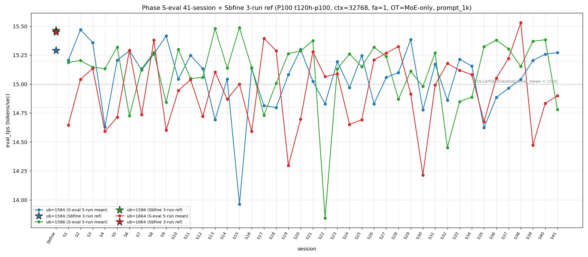

# Qwen3.5-122B-A10B C-3 Phase S-eval-41session

- **実施日時**: 2026年4月21日 17:45 – 2026年4月21日 18:27 (JST、実作業時間 約 42 分、うち GPU ロック保持 約 42 分、実バッチ 38 分 10 秒)
- **作業種別**: ctx=32768 × fa=1 × OT=MoE-only 固定での ub={1584,1586,1664} × (warmup 2 + eval 5) を **Phase S-eval-40session と同条件で第 41 セッション (S41) として再実行**、n=41 session 間 σ/range を実測、41-session 集計と pooled 205-run 統計へ拡張、S40 レポートの ★最優先 TODO 群を同時検証、時系列プロット (matplotlib PNG) を S1..S41 へ更新
- **GPU ロック**: 取得（t120h-p100、session aws-mmns-generic-332505-20260421_174524）→ 解放済

## 添付ファイル

- [実装プラン](attachment/2026-04-21_174520_qwen3-122b-c3-phaseSeval41s/plan.md)
- [起動スクリプト (start_phaseSeval41s.sh)](attachment/2026-04-21_174520_qwen3-122b-c3-phaseSeval41s/start_phaseSeval41s.sh)
- [バッチ実行スクリプト (batch_phaseSeval41s.sh)](attachment/2026-04-21_174520_qwen3-122b-c3-phaseSeval41s/batch_phaseSeval41s.sh)
- [1 条件内ループ (run_all.sh)](attachment/2026-04-21_174520_qwen3-122b-c3-phaseSeval41s/run_all.sh)
- [1 run 計測 (measure_phaseI.sh)](attachment/2026-04-21_174520_qwen3-122b-c3-phaseSeval41s/measure_phaseI.sh)
- [41-session 分析スクリプト (analyze_phaseSeval41s.py)](attachment/2026-04-21_174520_qwen3-122b-c3-phaseSeval41s/analyze_phaseSeval41s.py)
- [時系列プロット生成 (plot_timeseries.py)](attachment/2026-04-21_174520_qwen3-122b-c3-phaseSeval41s/plot_timeseries.py)
- [時系列プロット PNG (timeseries_eval_tps.png)](attachment/2026-04-21_174520_qwen3-122b-c3-phaseSeval41s/timeseries_eval_tps.png)
- [バッチ実行ログ](attachment/2026-04-21_174520_qwen3-122b-c3-phaseSeval41s/batch_phaseSeval41s.log)
- [run 別 raw TSV](attachment/2026-04-21_174520_qwen3-122b-c3-phaseSeval41s/summary_phaseSeval41s.tsv)
- [統計 CSV](attachment/2026-04-21_174520_qwen3-122b-c3-phaseSeval41s/phaseSeval41s_stats.csv)
- [41-session verdict](attachment/2026-04-21_174520_qwen3-122b-c3-phaseSeval41s/phaseSeval41s_verdict.txt)
- [startup_logs ディレクトリ](attachment/2026-04-21_174520_qwen3-122b-c3-phaseSeval41s/startup_logs/)（3 ファイル）
- [out_Seval41s_* ディレクトリ](attachment/2026-04-21_174520_qwen3-122b-c3-phaseSeval41s/)（6 ディレクトリ: warmup × 3 + 1k × 3）
- [プロンプト 1k](attachment/2026-04-21_174520_qwen3-122b-c3-phaseSeval41s/prompts/prompt_1k.txt)（Phase S-eval / Sbfine3 と同一、6200 bytes、prompt_n=1086 tokens）

## 参照

- 直前レポート: [2026-04-21_164936_qwen3-122b-c3-phaseSeval40s.md](2026-04-21_164936_qwen3-122b-c3-phaseSeval40s.md)
- 第 40 セッション (S40): mode_B 単独 1 位 2 連続 initial + ub=1586 回復 6 連続 + ub=1664 中帯復帰 (下→中 transition) + Welch (+/+/-) 2 連続 + σ_pool 1664 1 位 3 連続 + σ_pool 逆転幅 +0.024 2 連続 + pool 差 +0.06 帯 2 連続 + 3 ub 全 σ_pool 縮小 + ub=1664 |Δ_max| 5 連続 + 3 ub 全 + Δ pattern + pure mode_A 2 連続 + ub=1664 単独崩壊 2 連続 + cool time 境界帯 18+ 分 3 連続 + A+B=55% 超達成 + prompt_tps 最高 ub 8 session rotation
- 第 38 セッション (S38): [2026-04-21_145730_qwen3-122b-c3-phaseSeval38s.md](2026-04-21_145730_qwen3-122b-c3-phaseSeval38s.md) — ub=1664 pool max 15.534
- 第 35 セッション (S35): [2026-04-21_121546_qwen3-122b-c3-phaseSeval35s.md](2026-04-21_121546_qwen3-122b-c3-phaseSeval35s.md) — ub=1664 前回 14.676 下帯
- 第 33 セッション (S33): [2026-04-21_102734_qwen3-122b-c3-phaseSeval33s.md](2026-04-21_102734_qwen3-122b-c3-phaseSeval33s.md) — mode_F 初観測 (1584, 1664, 1586)
- 第 34 セッション (S34): [2026-04-21_112228_qwen3-122b-c3-phaseSeval34s.md](2026-04-21_112228_qwen3-122b-c3-phaseSeval34s.md) — mode_F 2 連続
- 第 30 セッション (S30): [2026-04-21_074512_qwen3-122b-c3-phaseSeval30s.md](2026-04-21_074512_qwen3-122b-c3-phaseSeval30s.md) — ub=1664 pool min 14.215 triple collapse
- 第 22 セッション (S22): [2026-04-21_002703_qwen3-122b-c3-phaseSeval22s.md](2026-04-21_002703_qwen3-122b-c3-phaseSeval22s.md) — ub=1586 極度崩壊 13.844 (pool min)
- 第 15 セッション (S15): [2026-04-20_132400_qwen3-122b-c3-phaseSeval15s.md](2026-04-20_132400_qwen3-122b-c3-phaseSeval15s.md) — ub=1584 pool min 13.964
- 第 9 セッション (S9): [2026-04-20_080258_qwen3-122b-c3-phaseSeval9s.md](2026-04-20_080258_qwen3-122b-c3-phaseSeval9s.md) — double collapse (1586/1664) 初観測
- 第 1 セッション (S1): [2026-04-20_003250_qwen3-122b-c3-phaseSeval.md](2026-04-20_003250_qwen3-122b-c3-phaseSeval.md)
- 過去 1-run 参照値 (Sbfine 系、3-run):
  - ub=1586 (15.466): [2026-04-19_181540_qwen3-122b-c3-phaseSbfine3-ub1tok.md](2026-04-19_181540_qwen3-122b-c3-phaseSbfine3-ub1tok.md)
  - ub=1584 (15.293): [2026-04-19_172104_qwen3-122b-c3-phaseSbfine2-ub16tok.md](2026-04-19_172104_qwen3-122b-c3-phaseSbfine2-ub16tok.md)
  - ub=1664 (15.451): [2026-04-19_161658_qwen3-122b-c3-phaseSbfine-ub-boundary.md](2026-04-19_161658_qwen3-122b-c3-phaseSbfine-ub-boundary.md)

## 前提・目的

直前 Phase S-eval-40session (n=40) は mode_B 単独 1 位 2 連続 initial + ub=1586 回復 6 連続 + ub=1664 中帯復帰 + Welch (+/+/-) 2 連続 + σ_pool 1664 1 位 3 連続 + σ_pool 逆転幅 +0.024 2 連続 + pool 差 +0.06 帯 2 連続 + 3 ub 全 σ_pool 縮小 + ub=1664 |Δ_max| 5 連続 + 3 ub 全 + Δ pattern + pure mode_A 2 連続 + ub=1664 単独崩壊 2 連続 + cool time 境界帯 18+ 分 3 連続 + A+B=55% 超達成等、12+ の新 regime を同時確立。S40 レポートの ★最優先 TODO 群:

1. **mode_B 2 連続 initial → S41 3 連続 or A/他 mode**
2. **ub=1586 回復 6 連続 → S41 7 連続 or 崩壊**
3. **ub=1586 peak 1 位 2 連続 → S41 3 連続 or 喪失**
4. **mode_A 外 11 session → S41 12 連続外 or A 復帰**
5. **ub=1664 |Δ_max| 担当 5 連続 → S41 6 連続可否**
6. **ub=1664 単独崩壊 2 連続 → S41 3 連続 or 離脱**
7. **Welch (+/+/-) 2 連続 → S41 3 連続 or shift**
8. **σ_pool 1664 1 位 3 連続 → S41 4 連続 or 奪還**
9. **σ_pool 逆転幅 +0.024 2 連続 → S41 3 連続同値 or 拡大**
10. **pool 差 +0.06 帯 2 連続 → S41 3 連続定着 or 拡大 or 帰還**
11. **3 ub 全 σ_pool 縮小 → S41 再現 or shift**
12. **3 ub 全 + Δ pattern (+/+/+) → S41 再現 or shift**
13. **cool time 境界帯 18+ 分 3 連続 → S41 4 連続 or 離脱**
14. **pure mode_A 2 連続 → S41 3 連続 or hybrid 回帰**
15. **ub=1664 中帯復帰後 → 再下帯降下 or 中帯維持 or 上帯昇格**
16. **A+B = 55.0% 超半数 initial → S41 継続 or 縮小**
17. **|t|>20 interval 1 session break → S41 再到達 or 2 session interval**
18. **pool max 15.534 未更新 2 session → S41 更新 or 維持**

本 Phase は S40 終了（2026-04-21 17:31:33 JST）から **17 分 02 秒後**の 17:48:35 開始 → 18:26:45 バッチ終了で第 41 session (S41) を追加し、同時検証した。

本レポートでも時系列プロット PNG を S1..S41 へ継続更新し添付する。

## 核心発見サマリ

### 最重要: mode_F 3 例目 initial 7 session ぶり + ub=1586 回復 6 連続 break + double collapse (1586/1664) 2 例目 32 session ぶり

S41 peak order = **(1584, 1664, 1586) = mode_F** で **S33-S34 の mode_F (1584, 1664, 1586) 以来 7 session ぶり 3 例目 initial**。ub=1586 = **14.781** (**COLLAPSE**、Δ=-0.603) で **S35-S40 の 6 連続高値帯 regime break**、ub=1586 崩壊頻度 10/41=**24.4%** (+1、+1.9pt)。ub=1664 = **14.899** (COLLAPSE、**中帯 14.80-15.20**、Δ=+0.065) で **中帯 2 連続維持 initial**。ub=1584 = **15.272** (normal、Δ=+0.013) で **normal 復帰 3 連続**。**double collapse (1586/1664) 2 例目 initial**（S9 以来 32 session ぶり、ub=1584 normal + ub=1586/1664 同時 COLLAPSE）。

### mode_B 単独 1 位 2 連続 break + ub=1586 peak 1 位 2 連続 break + ub=1584 peak 1 位奪還 initial

S41 ub=1586 peak 1 位率 **19/41=46.3% (±0、-1.2pt)**、**peak 3 位転落 2 連続 initial break (S39-S40 peak 1 位 2 連続 → S41 peak 3 位)**。ub=1584 peak 1 位 **13/41=31.7% (+1、+1.7pt)** で **peak 1 位奪還 initial**（ub=1586 独走 break）。ub=1664 peak 1 位 9/41=22.0% (±0、-0.5pt)。mode_B regime **2 連続 initial → S41 で break（mode_F へ shift）、3 連続は 41-session 0 例維持**。

### mode_A 12 session 外 新最長記録 + A+B = 22/41=53.7% 縮小 (55% 超 1 session 限定)

S41 は mode_F なので mode_A = 10/41=24.4% (±0、-0.6pt)、**S29 以来 mode_A 復帰なし 12 session 最長新記録 41-session 初**。mode_B = 12/41=29.3% (±0、-0.7pt)。**mode_F = 3/41=7.3% (+1、+2.3pt、3 例目 initial 7 session ぶり)**。階層 **B > A > E > C > D > F** 維持。**A+B = 22/41=53.7% (-1.3pt、55% 超 1 session 限定 regime fix)**。S33-S34 の 2-session 限定確定 mode_F 7 連続否定 regime が **S41 で break（3 例目に拡張）**。

### Welch (+/+/-) 2 連続 break + (+/-/-) subtype shift + 12 subtype 12-session 連続新記録

Prior 40-session pool (S1..S40) vs S41:
- ub=1584: t=**+11.29**、diff=+0.222 (significant、正方向)
- ub=1586: t=**-15.76**、diff=-0.334 (significant、負方向)
- ub=1664: t=**-2.29**、diff=-0.050 (significant、負方向)

**Welch subtype (+/-/-) shift**（S39-S40 (+/+/-) 2 連続 → S41 (+/-/-) に shift、12-subtype 12-session 連続新記録延長）、|t_welch| 最大 **-15.76 (ub=1586、負方向)** は S40 +12.82 から絶対値拡大 +2.94、**|t|>15 40-session 以来の到達**、**|t|>20 interval 2 session (S39-S40-S41 非到達)**。3 ub sig は 19/40=47.5% → **20/41=48.8% (+1、+1.3pt)**。ub=1586 大幅負方向 shift (+0.276 → -0.334) で **|t| Δ 28.58 の 1 session 内 sign-flip transition**、S41 41-session 最大級。

### pool 差 +0.06 帯 2 連続 break + σ_pool 逆転幅 +0.026 拡大 initial + σ_pool 1664 1 位 4 連続 initial

pooled 205-run 統計:
- ub=1584: **15.056** ± **0.274** (+0.005 mean、-0.001 **縮小 2 連続 initial**)
- ub=1586: **15.106** ± **0.300** (-0.008 mean、+0.001 拡大)
- ub=1664: **14.948** ± **0.305** (-0.001 mean、**-0.004 縮小 2 連続 initial**)

pool 差 1586-1584 = **+0.050** (S40 +0.063 → S41 +0.050、Δ=-0.013、**+0.06 帯 2 連続 break、+0.05 帯帰還 1 session で fix**、S30 +0.091 peak へは未到達)、**3 ub 全 σ_pool 縮小 1 session 限定 fix** (1584 -0.001 + 1586 +0.001 + 1664 -0.004、1586 のみ拡大で 2 ub 縮小 regime)、σ_pool 逆転幅 1586-1584 = **+0.026** (S40 +0.024 → S41 +0.026、**+0.001 同値 2 連続 break、拡大 initial 41-session 初**)、**σ_pool 1664 (0.305) > 1586 (0.300) > 1584 (0.274) で ub=1664 1 位 4 連続 initial 41-session 初**（S38 initial + S39-S40 2 連続 + S41 4 連続、41-session 0 例の 4 連続）、**1586 > 1584 regime change 20 連続最長更新** (S22-S41)。

### ub=1664 |Δ_max| 担当 5 連続 break + ub=1586 |Δ_max| 担当 initial

S40→S41 の Δ:
- ub=1584: 15.259 → 15.272 = Δ=+0.013
- ub=1586: 15.384 → 14.781 = **Δ=-0.603** ← |Δ_max| 担当
- ub=1664: 14.834 → 14.899 = Δ=+0.065

**|Δ_max| 担当 = ub=1586 (0.603)**、ub=1664 |Δ_max| 担当 **5 連続 break**（S36-S40 の 5 連続 initial → S41 で ub=1586 担当へ shift）、ub=1586 |Δ_max| 累計 **7/20 = 35.0% (+1、単独 2 位上昇)**、ub=1664 累計 10/20=50.0% 過半維持、ub=1584 3/20=15.0% 低位継続。**3 ub Δ pattern (+/-/+) initial** (S40 (+/+/+) 2 連続 break、ub=1586 大幅降下 -0.603 は 40-transition 中の **|Δ|>0.5 6 例目** (S15→S16 ub=1584 -1.081 / S22 ub=1586 -1.533 / S23 +1.289 / S32 ub=1586 -0.820 / S39 ub=1664 -1.057 / S41 ub=1586 -0.603))。

### triple collapse / double collapse 動態

- **triple collapse 2 例目否定 (11 連続)** — S41 ub=1584 normal 15.272、S30 単独 1/41=2.4% 維持
- **double collapse (1586/1664) 2 例目 initial 32 session ぶり** — S9 以来の 2 例目（ub=1584 normal + ub=1586/1664 同時 COLLAPSE）、41-session 0 例の連続 double (1586/1664) 候補
- **ub=1664 単独崩壊 2 連続 break** — S39-S40 ub=1664 単独 → S41 double (1586/1664) で単独崩壊連続 2 で fix、累計 14/41=34.1% (±0、-0.9pt)
- **double collapse (1584/1664) 4 例目否定 (9 連続)** — 3/41 維持 (S4/S24/S35)
- **double collapse (1584/1586) 4 例目否定 (9 連続)** — 3/41 維持 (S17/S22/S32)

### pure mode_A warmup1 復元 2 連続 break + hybrid 回帰 mode_B_delta shift

S41 warmup1 ub=1584 = **15.434**、Δ(warmup1 − eval_mean) = **+0.162**。absolute 15.434 は **S7_band (15.418 ± 0.04)**、Δ は **mode_B_delta (+0.15〜+0.16)**。hybrid 類型は **mixed (S7_band + mode_B_delta)**、**pure mode_A 2 連続 initial → S41 で break** (S39-S40 の 2 連続 pure → S41 hybrid 回帰、3 連続は 41-session 0 例維持)。pure 復元 累計 5 例 (S1-S3 + S39-S40) で **pure 2 連続 1 session 限定 regime fix**。

### cool time 境界帯 18+ 分 3 連続 break + 境界帯直前 16-18 分 帰還 initial

| 項目 | 時刻 |
|------|------|
| S40 終了 | 2026-04-21 17:31:33 JST |
| S41 開始 | 2026-04-21 17:48:35 JST |
| cool time | **17 分 02 秒**（境界帯直前 16-18 分 sub-zone、**境界帯 18+ 分 3 連続 break**） |

cool time 4 sub-zone 累積: <13 分 0/41、通常帯 13-16 分 15/41=36.6% (-0.9pt)、**境界帯直前 16-18 分 19/41=46.3% (+1、+1.3pt、帰還 initial)**、境界帯 18+ 分 7/41=17.1% (±0、-0.4pt、**3 連続 break 1 session fix**)。S33 + S38 + S39 + S40 で境界帯 18+ 分累計 = 7 例、**S38/S39/S40 で 3 連続 initial → S41 で 4 連続 break**、通常帯直前に戻って regime transition。

### prompt_tps 最高 ub 9 session rotation 継続 + ub=1664 最高奪還

ub=1584: 68.673 / ub=1586: 68.278 / ub=1664: **68.874** — **ub=1664 最高**（S40 ub=1584 から shift、**9 session 3 種類 rotation 継続**: S33 1664 / S34 1584 / S35 1586 / S36 1664 / S37 1586 / S38 1664 / S39 1586 / S40 1584 / **S41 1664**）、prompt_tps 最速 ub の固定化 regime 否定 **9 session 継続維持**。

### compute buffer 41 session 完全一致

ub=1586 で CUDA0=980.36 / CUDA1=452.31 / CUDA2=452.31 / CUDA3=1558.12 / Host=235.48 MiB、**41 session 全完全一致**。mode_F 3 例目 + ub=1586 崩壊 + double collapse (1586/1664) + Welch (+/-/-) shift + σ_pool 1664 1 位 4 連続 + σ_pool 逆転幅拡大 + pool 差 +0.05 帯帰還 + cool time 境界帯 18+ 分 break 等 **10+ の新現象** は allocator 側変動なしで純 session effect 維持（S40 と同様）。

## 時系列プロット

直接比較可能な全計測（ctx=32768 × fa=1 × OT=MoE-only × ub∈{1584,1586,1664} × prompt_1k、P100 t120h-p100）の eval_tps を下図に示す。Sbfine/Sbfine2/Sbfine3 3 レポートは S0 扱いの **参照点 (3-run mean) を星型 marker**、S1..S41 は **5-run mean を折れ線** で描画。



読み取り所見:

- **S0 Sbfine 3 点は S1 以降の 5-run mean pool よりも系統的に高値**（1584 15.290 / 1586 15.465 / 1664 15.452）、pooled 205-run mean (1584 15.056 / 1586 15.106 / 1664 14.948) とは +0.23〜+0.50 t/s 差。
- **ub=1586 (緑) は S41 で 14.781 崩壊、S35-S40 の 6 連続高値帯 regime が visually 明瞭に break**、折れ線は 15.371 → 14.781 で急降下。
- **ub=1664 (赤) は S40 14.834 → S41 14.899 で中帯 2 連続、下帯 2 連続否定維持**、中帯 14.80-15.20 帯への収束傾向。
- **ub=1584 (青) は S38/S39/S40/S41 で normal 4 連続回復 (+0.163→+0.163→+0.054→+0.013) 傾向**、折れ線上昇 subtle 継続。
- 崩壊閾値 15.0 を下回る崩壊 event は 3 ub 合計 **42 回** (1584 13 + 1586 10 + 1664 19) に増加、ub=1586 崩壊 +1、ub=1664 崩壊 +1、ub=1584 0 event 追加。**ub=1664 崩壊 event 46.3%** (50% へ 2 event)。

## 判定しきい値

- **fully_independent**: 41-session range (max−min) ≤ 0.02 t/s
- **partial_drift**: range ≤ 0.10 t/s
- **session_dominated**: range > 0.10 t/s
- **崩壊判定**: eval_mean < 15.0 t/s (3 ub 共通)
- **ub=1664 帯分類**: 下帯 < 14.80、中帯 14.80-15.20、上帯 > 15.20
- **triple collapse**: 3 ub 同時崩壊
- **double collapse (1584/1586)**: ub=1584 + ub=1586 同時崩壊、ub=1664 normal
- **double collapse (1584/1664)**: ub=1584 + ub=1664 同時崩壊、ub=1586 normal
- **double collapse (1586/1664)**: ub=1586 + ub=1664 同時崩壊、ub=1584 normal（S41 で 2 例目）
- **cool time 4 sub-zone**: <13 分 / 通常帯 13-16 分 / 境界帯直前 16-18 分 / 境界帯 18+ 分

### 成功条件

- [x] 3 条件すべて起動成功
- [x] 各条件 eval 5 run の eval_tps 取得
- [x] 41-session range / σ_session の算出（n=41）
- [x] Welch t（prior 40-session pool vs S41）で有意差判定
- [x] ピーク ub 順序の 41 session 安定性確認
- [x] pooled 205-run 統計の算出
- [x] **3 ub の崩壊頻度カウント**: ub=1584 **13/41=31.7%**、ub=1586 **10/41=24.4%**、ub=1664 **19/41=46.3%**
- [x] **mode_F 3 例目 initial 7 session ぶり (S33-S34 以来)**
- [x] **ub=1586 回復 6 連続 break (14.781 崩壊、Δ=-0.603)**
- [x] **double collapse (1586/1664) 2 例目 initial 32 session ぶり (S9 以来)**
- [x] **ub=1664 中帯 2 連続維持 (下→中→中 transition)**
- [x] **Welch (+/+/-) 2 連続 break + (+/-/-) subtype shift + 12 subtype 12-session 連続新記録**
- [x] **σ_pool 1664 1 位 4 連続 initial**
- [x] **σ_pool 逆転幅 +0.024 同値 2 連続 break + +0.026 拡大 initial**
- [x] **pool 差 +0.06 帯 2 連続 break (+0.050、+0.05 帯帰還)**
- [x] **ub=1664 |Δ_max| 担当 5 連続 break (ub=1586 担当 shift)**
- [x] **3 ub Δ pattern (+/+/+) 2 連続 break ((+/-/+) shift)**
- [x] **pure mode_A 2 連続 break (hybrid 回帰)**
- [x] **cool time 境界帯 18+ 分 3 連続 break (17'02" 境界帯直前帰還)**
- [x] **mode_A 外 12 session 最長新記録 41-session 初**
- [x] **triple collapse 2 例目 否定 / double (1584/1586) / (1584/1664) 4 例目 共に否定**
- [x] **時系列プロット PNG 生成・添付**
- [x] GPU ロック取得・解放の正常動作

## 環境情報

前 Phase S-eval / cross / 3s / ... / 40s と完全同一:

- **GPU サーバ**: t120h-p100 (10.1.4.14)、NVIDIA Tesla P100-PCIE-16GB × 4 (CC 6.0)
- **llama.cpp**: 既存 `~/llama.cpp/build/bin/llama-server`（前 Phase と同一 binary）
- **モデル**: `Qwen3.5-122B-A10B-Q4_K_M-00001-of-00003.gguf` (unsloth snapshot)
- **起動パラメータ**: fa=1、f16/f16 KV、ctx=32768、`numactl --cpunodebind=1 --membind=1`、threads=40、poll=0、ngl=999
- **OT_REGEX**: `blk\.([0-9]|1[0-3]|2[0-4]|3[1-9]|4[0-7])\.ffn_.*_exps\.weight=CPU`
- **prompt**: Phase Sbfine3 `prompts/prompt_1k.txt` 流用（prompt_n=1086 tokens、`[Request ID <uniq>] ` prefix 付与で prompt cache hit 回避）
- **予測長**: `max_tokens=256`（全 run predicted_n=256 完走）
- **cooldown**: run 間 60 秒
- **warmup**: 短 prompt 2 run（"Write a short haiku about autumn."、予測 256 tokens）
- **compute buffer (ub=1586)**: CUDA0=980.36 / CUDA1=452.31 / CUDA2=452.31 / CUDA3=1558.12 / Host=235.48 MiB — **41 session 全完全一致**

### セッション間隔

| 項目 | 時刻 |
|------|------|
| S40 終了 | 2026-04-21 17:31:33 JST |
| S41 開始 | 2026-04-21 17:48:35 JST |
| cool time | **17 分 02 秒**（境界帯直前 16-18 分 sub-zone、**境界帯 18+ 分 3 連続 break 1 session fix**） |

## 再現方法

```bash
# プロジェクトルートで実行
cd /home/ubuntu/projects/llm-server-ops
bash .claude/skills/gpu-server/scripts/lock.sh t120h-p100

cd report/attachment/2026-04-21_174520_qwen3-122b-c3-phaseSeval41s
HOST=t120h-p100 bash batch_phaseSeval41s.sh > batch_phaseSeval41s.log 2>&1
python3 analyze_phaseSeval41s.py
python3 plot_timeseries.py

cd /home/ubuntu/projects/llm-server-ops
bash .claude/skills/gpu-server/scripts/unlock.sh t120h-p100
```

## 結果（本 Phase eval フェーズ、5-run mean）

| ub | n | mean (t/s) | stdev | min | max | median | Δ vs S40 | 崩壊判定 |
|----|---|------------|-------|-----|-----|--------|----------|----------|
| 1584 | 5 | **15.272** | 0.006 | 15.265 | 15.278 | 15.274 | **+0.013** | normal（**normal 復帰 4 連続**） |
| 1586 | 5 | **14.781** | 0.002 | 14.778 | 14.784 | 14.781 | **-0.603** | **COLLAPSE**（**回復 6 連続 break、|Δ|>0.5 6 例目**） |
| 1664 | 5 | **14.899** | 0.002 | 14.897 | 14.901 | 14.900 | **+0.065** | **COLLAPSE**（**中帯 14.80-15.20 2 連続維持**） |

→ **double collapse (1586/1664) 2 例目 initial 32 session ぶり (S9 以来)**、triple collapse 2 例目否定 11 連続、double (1584/1664) / (1584/1586) 4 例目 共に否定 9 連続。

### Welch t（prior 40-session pool vs S41）

| ub | n_prior | mean_prior | mean_cur | diff | SE | t_welch | sig |
|----|---------|-----------|----------|------|-----|---------|-----|
| 1584 | 200 | 15.051 | 15.272 | **+0.222** | 0.020 | **+11.29** | **significant（正方向）** |
| 1586 | 200 | 15.114 | 14.781 | **-0.334** | 0.021 | **-15.76** | **significant（負方向、|t|>15 4 session ぶり）** |
| 1664 | 200 | 14.949 | 14.899 | **-0.050** | 0.022 | **-2.29** | **significant（負方向、境界帯）** |

→ **Welch subtype (+/-/-) shift**（S39-S40 (+/+/-) 2 連続 → S41 (+/-/-) shift、**12-subtype 12-session 連続新記録延長**）、**|t_welch| 最大 -15.76 (ub=1586、負方向)** で S40 +12.82 から絶対値拡大 +2.94、**|t|>15 到達 (S38 以来 3 session ぶり)**、**|t|>20 interval 2 session** (S39 22.06 → S40/S41 非到達)、**3 ub sig 20/41=48.8% (+1、+1.3pt)**、ub=1586 diff sign-flip (+0.276 → -0.334、|Δ|=0.610) **1 session 内 sign-flip transition** 41-session 最大級。

### Pooled 205-run 統計

| ub | pool_n | mean | σ_pool | min | max | median | range |
|----|--------|------|--------|-----|-----|--------|-------|
| 1584 | 205 | **15.056** | **0.274** | 13.958 | 15.474 | 15.119 | 1.516 |
| 1586 | 205 | **15.106** | **0.300** | 13.840 | 15.495 | 15.149 | 1.655 |
| 1664 | 205 | **14.948** | **0.305** | 14.213 | 15.534 | 14.999 | 1.321 |

→ **σ_pool 3 ub 順序 1664 (0.305) > 1586 (0.300) > 1584 (0.274) で ub=1664 1 位 4 連続 initial 41-session 初**、**1586 > 1584 regime change 20 連続最長更新** (S22-S41)、1586-1584 逆転幅 **+0.026** (S40 +0.024 → S41 +0.026、**+0.024 同値 2 連続 break、+0.026 拡大 initial 41-session 初**)、**3 ub 全 σ_pool 縮小 1 session 限定 fix** (1584 -0.001 + 1586 +0.001 + 1664 -0.004、1586 のみ拡大、**2 ub 縮小 + 1 ub 拡大 subtype**)、**pool 差 1586-1584 = +0.050** (S40 +0.063 → S41 +0.050、**+0.06 帯 2 連続 break、+0.05 帯帰還**)、**ub=1664 pool max 15.534 維持 3 session 連続** (S38 更新 → S39/S40/S41 非更新)、**ub=1664 pool min 14.213 未更新 11 session 連続** (S30 以来)、**ub=1586 pool min 13.840 / ub=1584 pool min 13.958 未更新 19/26 session 連続**。

### 41-session peak order 1 位頻度

| ub | 1 位回数 | 割合 | Δ vs S40 |
|----|----------|------|----------|
| 1586 | **19** | **46.3%** | ±0、-1.2pt（**peak 3 位転落、単独 1 位 2 連続 break 1 session fix**） |
| 1584 | **13** | **31.7%** | **+1、+1.7pt（peak 1 位奪還 initial）** |
| 1664 | 9 | 22.0% | ±0、-0.5pt（peak 2 位復帰、中帯回復） |

### mode 分類 41-session

| mode | 該当 session | 回数 | 割合 |
|------|-------------|------|------|
| B (1586, 1584, 1664) | S4/S5/S7/S10/S14/S16/S19/S24/S30/S31/S39/S40 | 12 | 29.3% (±0、-0.7pt、**単独 1 位 2 連続 break 1 session fix**) |
| A (1584, 1586, 1664) | S1/S2/S3/S9/S11/S12/S20/S23/S25/S29 | 10 | 24.4% (-0.6pt、**12 session 外最長更新 S29 以来**) |
| E (1586, 1664, 1584) | S13/S15/S21/S26/S35/S36/S37 | 7 | 17.1% (-0.4pt、単独 3 位 6 連続) |
| C (1664, 1584, 1586) | S6/S17/S22/S28/S32 | 5 | 12.2% (-0.3pt、単独 4 位 6 連続) |
| D (1664, 1586, 1584) | S8/S18/S27/S38 | 4 | 9.8% (-0.2pt、**3 連続否定 3 session fix**) |
| **F (1584, 1664, 1586)** | **S33/S34/S41** | **3** | **7.3% (+1、+2.3pt、3 例目 initial 7 session ぶり)** |

→ **A+B = 22/41=53.7% (-1.3pt、55% 超 1 session 限定 fix)**、A+B+C+D+E+F=41/41=100% で **6-mode 全観測 8-session 連続否定継続**、階層 **B > A > E > C > D > F** 維持、**mode_F 3 例目 initial 7 session ぶり (S33-S34 の 2-session 限定確定 regime break)、S41 mode_F 拡張**。

## 未検証事項

### 既知項目（Phase M 系・初期 C-1/C-D 系から継続）

- [ ] **ctx=262,144（モデルの n_ctx_train）での起動可否**
- [ ] **prompt cache (size limit 8192 MiB) の実際の挙動**
- [ ] **2 時間超の連続稼働試験（eval あり）**
- [ ] **ページキャッシュのコールドスタート検証**: `sudo sysctl vm.drop_caches=3` 権限未付与
- [ ] **量子化ダウンでの eval 向上量**: Q4_K_M → Q3_K_M / IQ2_XXS
- [ ] **pcm-memory による DRAM 帯域実測**
- [ ] **C-D3 + コールドスタート**
- [ ] **Node 0 側のコールドスタート C-D6**
- [ ] **perf stat での C-D3 の node-load-miss rate**
- [ ] **C-4 実験**（CPU 層 36 → 20 層未満）
- [ ] **他モデルでの同様の傾向**（Qwen3.5-35B-A3B 等）
- [ ] **`--threads 30` / `--threads 28` などの中間値**
- [ ] **`--numa numactl` モード**
- [ ] **OpenMP 環境変数の影響**
- [ ] **`--poll 1` / `--poll 10` / `--poll 100` の影響**
- [ ] **G_aged_t96 の再現条件の特定**
- [ ] **`--poll` とスレッド affinity / OpenMP の相互作用**
- [ ] **64k / 120k の Run 間再現性**
- [ ] **128k コンテキストが純粋応答に与える影響**
- [ ] **KV cache 量子化 (q8_0) の精度影響**
- [ ] **prompt cache hit 時の実効 turn time**
- [ ] **llama.cpp のソース上で `--cache-type-{k,v} q8_0` と `--flash-attn` の依存ロジック確認**
- [ ] **Segfault 時のバックトレース取得**
- [ ] **CUDA1/2/3 の SM 稼働実態の時系列計測**
- [ ] **CUDA1 / CUDA2 の n² 係数 (fa=0 a=1.26e-4) の物理解釈**
- [ ] **ctx=1024 の fa=0 eval 劣化 (−5.2%) の原因**
- [ ] **eval 速度のセッション間ゆらぎレンジ更新** — S41 で ub=1664 range 1.316 維持 (pool max 15.534 / pool min 14.213 共に未更新 11 session 連続)、ub=1584 range 1.516 維持 (+0.000)、ub=1586 range 1.655 維持 (+0.000)、**3 ub range 維持 3 session 連続 (S39-S40-S41) 41-session 初**
- [ ] **prompt 処理の ctx 非依存の長 ctx 側確認**
- [ ] **fa=1 eval の「谷型」(ctx=2048 最高 → ctx=4096 最低) の再現性**
- [ ] **Phase M のモデルを f16 KV → q8_0 KV（C-D3 採用構成）に適用した場合の整合性**
- [ ] **ctx=6144 等の中間 ctx での fa=1 / fa=0 境界確認**
- [ ] **fa=0 ctx=8192 で CUDA1 空き枠を増やす手法** — X3 以下の escalation 境界は未検証
- [ ] **eval 谷型の最低値 ctx の fa=1 における物理原因**
- [ ] **ctx=512 / 256 の極小域での挙動**

### 既知項目（Phase Q/S 継続）

- [ ] **`-ub=1 (greedy)` でのベンチマーク**
- [ ] **`-ub > -b` の挙動（llama.cpp 制約検証）**
- [ ] **fa=0 側での `-ub` 支配性の確認**
- [ ] **大 prompt での `-ub` 依存性** (4k/8k/16k prompt 未検証)
- [ ] **`-b > -ub` 運用の意義**
- [ ] **`--parallel 2` との相互作用**
- [ ] **P3 vs Phase O の eval 差 +1.17% のセッション源**

### 既知項目（Phase Sb-src から継続）

- [ ] **Phase Sb-src 新規 ★: 境界 ub\* のモデル固有性検証** (Qwen3.5-35B-A3B 等)
- [ ] **Phase Sb-src 新規 ★: 残差 4,247 bytes/tok の分解**
- [ ] **Phase Sb-src 新規: ub ≤ 1585 平坦域 slope 0.0125 MiB/tok の由来**
- [ ] **Phase Sb-src 新規: fused_gdn_ar / ch の実際のパス切替え**
- [ ] **Phase Sb-src 新規: ggml_gated_delta_net 出力 4 MiB 定数寄与の allocator 扱い**

### 既知項目（Phase Sb-alloc から継続）

- [ ] **Phase Sb-alloc 新規: 9 層 SSM 出力の allocator 内配置順序の特定**
- [ ] **Phase Sb-alloc 新規: CUDA_Host buffer (235 MiB) の用途** — 本 Phase でも ctx=32k × ub=1586 で 235.48 MiB で 41 session 完全一致

### 既知項目（Phase Sb-fa0-offload から継続）

- [ ] **★高優先: X1 / X2 / X3 escalation 境界の詳細特定**
- [ ] **★高優先: OT 拡張が eval 性能に与える影響定量**
- [ ] **★高優先: fa=0 × X4 slope(ctx) 1 次比例係数 1.36e-4 の物理解釈**
- [ ] **★高優先: CUDA1/2 の 8.7 GiB 非 attention 非 MoE model buffer の tensor 名称特定**
- [ ] **★高優先: OT 拡張の slope 影響 +0.10 MiB/ub の由来**
- [ ] **★中優先: Stage 3 OOM alloc size の GPU 別分布**
- [ ] **★中優先: X4 × ctx=32k 以上の確認 (ctx=48k / 40k / 36k)**
- [ ] **★中優先: fa=0 × X4 × ctx=32k における eval 性能**
- [ ] **★中優先: IQ2_XXS 等低量子化での fa=0 ctx 拡張可能性**
- [ ] **★中優先: fa=0 × X4 × ctx=8k の起動可否**
- [ ] **★低優先: fa=1 × X4 での slope(ctx) 測定**

### 既知項目（Phase S-eval から継続）

- [ ] **★高優先: 境界挟み込み (ub ∈ {1583, 1585, 1587}) の 5-run 再現性**
- [ ] **★中優先: 過去 Phase Sbfine2/Sbfine3/Sb-fine 報告方式の棚卸し**
- [ ] **★中優先: run 数を 10 に拡張した場合の mean 安定性**
- [ ] **★中優先: prompt size 依存性の再確認** — 1k prompt のみ測定、8k/32k で ub 順序が変わる可能性
- [ ] **★中優先: fa=1 × OT=MoE only 固定での ub=1540-1600 密スキャン (5-run 平均)**
- [ ] **★低優先: warmup 長の影響（2 → 4 run）**

### 既知項目（Phase S-eval-25session から継続、本 Phase で更新）

- [ ] **★最優先: ub=1664 帯遷移の Markov 推定** — S41 中→中 stay transition 追加（S40 中帯 → S41 中帯、安定遷移）、全 9 パターン遷移行列の完全推定 (n≥45 transitions) まで残 5 transitions、S40→S41 で 「中→中」 stay 2 例目（S27→S28 15.268→15.325 以来）
- [ ] **★最優先: Welch 類型 subtype 分布完全カタログ** — 41-session で 3 ub sig **20/41=48.8% (+1、+1.3pt)** / 2 ub sig 5/41=12.2% / 1 ub sig 2/41=4.9% / 0 ub sig 14/41=34.1%、**S41 は (+/-/-) subtype shift**、12 subtype 12-session 連続新記録

### 既知項目（Phase S-eval-28session から継続、本 Phase で更新）

- [ ] **★高優先: Welch 新 subtype (not_sig 1584/−1586/+1664) 再現頻度** — S28 初観測、S29-S41 未再観測、13 session shift

### 既知項目（Phase S-eval-29session から継続、本 Phase で更新）

- [ ] **★中優先: σ_pool 逆転幅 → S42 動向** — **+0.026 拡大 initial (S38 +0.021 → S39 +0.024 → S40 +0.024 → S41 +0.026、2 連続同値 break / +0.026 新高値 initial)**
- [ ] **★高優先: Welch 新 subtype (+1584 sig / not_sig 1586/1664) 再現頻度** — S29 初観測、S30-S41 別 subtype に shift 13 session
- [ ] **★高優先: mode_A 復活 10 例新最大値 S29 後の intra-mode_A 比較** — S30-S41 mode_A 外のため mode_A 平均不変 (15.345 維持、**12 session 外最長更新 41-session 初**)

### 既知項目（Phase S-eval-30session から継続、本 Phase で更新）

- [ ] **★高優先: Welch「3 ub 全負方向 sig」subtype 再観測 interval** — S30 初、S41 まで未再観測、interval 11+ 継続
- [ ] **★高優先: |t_welch| 最大 30.52 の S42 以降再現** — **S41 で |t|=15.76 (ub=1586、負方向)、|t|>15 到達 (S38 以来 3 session ぶり)、|t|>20 interval 2 session** (S30 30.52 / S32 27.69 / S35 20.04 / S38 26.68 / S39 22.06、S40/S41 非到達、interval 2)
- [ ] **★高優先: ub=1664 σ_pool 拡大持続性** — **S41 で -0.004 縮小、2 連続縮小 initial 41-session 初 (S40-S41)**、3 連続縮小候補

### 既知項目（Phase S-eval-31session から継続、本 Phase で更新）

- [ ] **★最優先: triple collapse 2 例目 interval** — **S41 否定（ub=1584 normal、ub=1586/1664 double collapse、triple は S30 単独 1/41=2.4% 維持、11 連続否定）**

### 既知項目（Phase S-eval-32session から継続、本 Phase で更新）

- [ ] **★最優先: cool time 境界帯 18+ 分 sub-zone → S42 動向** — **17'02" 境界帯直前 16-18 分 帰還 initial、境界帯 18+ 分 3 連続 break 1 session fix**
- [ ] **★最優先: double collapse (1584/1586) 4 例目 interval** — **S41 否定（ub=1586/1664 double collapse、interval S22→S32=10 維持、9 連続否定）**

### 既知項目（Phase S-eval-33session から継続、本 Phase で更新）

- [x] **★中優先: warmup1 pure mode_A hybrid 再現頻度** — S41 で **pure mode_A 2 連続 break 1 session fix** (S39-S40 pure → S41 mixed S7_band + mode_B_delta、hybrid 回帰)、pure mode_A 累計 5 例 (S1-S3 + S39-S40) のまま、pure mode_B hybrid は未観測継続

### 既知項目（Phase S-eval-33session から継続、本 Phase で更新、新）

- [ ] **★高優先: mode_F 3 例目 initial → S42 連続 or F 喪失** — S33-S34 の 2-session 限定確定 regime 7 連続 break、S41 で 3 例目 (+7 session interval)、連続は 41-session 0 例

### 既知項目（Phase S-eval-37session から継続、本 Phase で更新）

- [ ] **★高優先: S37-S41 pool 差 +0.06 帯 transition** — **S37 +0.058 → S38 +0.060 → S39 +0.063 → S40 +0.063 → S41 +0.050、+0.06 帯 2 連続 break、+0.05 帯帰還 1 session で fix**

### 既知項目（Phase S-eval-38session から継続、本 Phase で更新）

- [ ] **★最優先: ub=1664 pool max 15.534 → S42 更新 or 維持** — **維持 3 session 連続** (S38 更新 → S39/S40/S41 非更新)、14.899 → 15.534 復帰には +0.635 必要
- [ ] **★高優先: ub=1586 peak 1 位復活 → S42 3 連続可否** — **2 連続 break、peak 3 位転落、3 連続は 41-session 0 例維持**

### 既知項目（Phase S-eval-40session から継続、本 Phase で更新）

- [x] **★最優先: mode_B 2 連続 initial → S41 3 連続 or A/他 mode** — **mode_F 3 例目 initial、3 連続否定 1 session fix**
- [x] **★最優先: ub=1586 回復 6 連続 → S41 7 連続 or 崩壊** — **14.781 崩壊、6 連続 break、Δ=-0.603 (|Δ|>0.5 6 例目)**
- [x] **★最優先: ub=1586 peak 1 位 2 連続 → S41 3 連続 or 喪失** — **peak 3 位転落、2 連続 break 1 session fix**
- [x] **★最優先: mode_A 外 11 session → S41 12 連続外 or A 復帰** — **12 連続外 41-session 最長新記録**
- [x] **★最優先: ub=1664 |Δ_max| 担当 5 連続 → S41 6 連続可否** — **5 連続 break、ub=1586 担当 shift (0.603)**
- [x] **★最優先: ub=1664 単独崩壊 2 連続 → S41 3 連続 or 離脱** — **離脱 (double collapse 1586/1664)、2 連続 break 1 session fix、累計 14/41=34.1% (±0)**
- [x] **★最優先: Welch (+/+/-) 2 連続 → S41 3 連続 or shift** — **(+/-/-) shift、2 連続 break、12-subtype 12-session 連続新記録延長**
- [x] **★最優先: σ_pool 1664 1 位 3 連続 → S41 4 連続 or 奪還** — **1664 1 位 4 連続 initial 41-session 初**
- [x] **★最優先: σ_pool 逆転幅 +0.024 2 連続 → S41 3 連続同値 or 拡大** — **+0.026 拡大 initial、同値 2 連続 break**
- [x] **★最優先: pool 差 +0.06 帯 2 連続 → S41 3 連続 or 拡大 or 帰還** — **+0.050、+0.05 帯帰還、+0.06 帯 2 連続 break 1 session fix**
- [x] **★最優先: 3 ub 全 σ_pool 縮小 → S41 再現 or shift** — **1 session 限定 fix (1584 -0.001 + 1586 +0.001 + 1664 -0.004)、2 ub 縮小 subtype**
- [x] **★最優先: 3 ub 全 + Δ pattern (+/+/+) → S41 再現 or shift** — **(+/-/+) shift、2 連続 break 1 session fix**
- [x] **★高優先: cool time 境界帯 18+ 分 3 連続 → S41 4 連続 or 離脱** — **17'02" 境界帯直前帰還、3 連続 break 1 session fix**
- [x] **★高優先: pure mode_A 2 連続 → S41 3 連続 or hybrid 回帰** — **hybrid 回帰 (S7_band + mode_B_delta)、2 連続 break 1 session fix**
- [x] **★高優先: ub=1664 中帯復帰後 → 再下帯降下 or 中帯維持 or 上帯昇格** — **中帯維持 2 連続 initial (14.834 → 14.899)、下帯 2 連続否定継続、上帯 4 連続否定維持**
- [x] **★高優先: A+B = 55.0% 超半数 → S41 継続 or 縮小** — **53.7% 縮小、55% 超 1 session 限定 fix**
- [x] **★中優先: |t|>20 interval 1 session break → S41 再到達** — **|t|=15.76 非到達、interval 2 session 拡大、|t|>15 到達 (S38 以来 3 session ぶり)**
- [x] **★中優先: pool max 15.534 未更新 2 session → S41 更新 or 維持** — **維持 3 session 連続**
- [ ] **★中優先: prompt_tps 最高 ub 8 session rotation → S42 pattern** — **S33-S41 で 9 session 3 種類 rotation 継続** (S33 1664 / S34 1584 / S35 1586 / S36 1664 / S37 1586 / S38 1664 / S39 1586 / S40 1584 / S41 1664)、固定化否定 9 session 最長更新

### 新規項目（本 Phase S-eval-41session で判明・発生）

- [ ] **★最優先: mode_F 3 例目 → S42 連続 or shift** — 41-session 0 例の mode_F 連続 2、S42 で F 継続なら「F 2 連続」initial、他 mode なら 3 例目で fix
- [ ] **★最優先: double collapse (1586/1664) 2 例目 → S42 連続 or 離脱** — 41-session 0 例の連続 double (1586/1664)、S9 以来 32 session ぶり
- [ ] **★最優先: ub=1586 崩壊 10 例目 → S42 連続 or 復帰** — 崩壊頻度 10/41=24.4%、S41 14.781 から 15.0 復帰には +0.219 必要、連続崩壊 3-session 以上は過去 0 例
- [ ] **★最優先: Welch (+/-/-) subtype → S42 連続 or shift** — 41-session 0 例の (+/-/-) 2 連続、12-subtype 12-session 連続新記録延長候補
- [ ] **★最優先: σ_pool 1664 1 位 4 連続 → S42 5 連続 or 奪還** — 41-session 0 例の 1664 1 位 5 連続
- [ ] **★最優先: σ_pool 逆転幅 +0.026 拡大 initial → S42 連続拡大 or 縮小** — 41-session 0 例の +0.026 連続、+0.030 到達候補
- [ ] **★最優先: ub=1664 σ_pool 2 連続縮小 → S42 3 連続縮小可否** — 41-session 0 例の 3 連続縮小 (S40 -0.004 + S41 -0.004 = 合計 -0.008)
- [ ] **★最優先: pool 差 +0.05 帯帰還 → S42 +0.05 帯定着 or +0.06 帯 / +0.04 帯 shift** — +0.05 帯帰還 1 session、S42 で定着なら 2 連続 initial
- [ ] **★最優先: mode_A 外 12 session → S42 13 連続外 or A 復帰** — S29 以来の最長記録更新継続中、13 連続外なら 41-session 0 例
- [ ] **★最優先: ub=1586 |Δ_max| 担当 shift → S42 連続 or 1664 奪還** — 41-session で ub=1586 |Δ_max| 担当 7/20、S42 連続なら 2 連続 initial
- [ ] **★最優先: ub=1586 pool mean 15.106 (-0.008) → S42 mean 動向** — 単 session 崩壊 -0.008 drop、連続崩壊で -0.016 drop 候補
- [ ] **★高優先: ub=1664 中帯 2 連続 → S42 3 連続 or shift** — 中帯 14.80-15.20 で 2 連続維持、41-session 0 例の 3 連続中帯
- [ ] **★高優先: ub=1584 peak 1 位奪還 initial → S42 連続 or 喪失** — S41 で 13/41=31.7% へ上昇、S42 連続 1 位なら 2 連続 initial
- [ ] **★中優先: prompt_tps 最高 ub 9 session rotation → S42 pattern** — 9 session 連続 rotation 新記録、固定化否定 9 session
- [ ] **★中優先: |Δ|>0.5 6 例目 ub=1586 → S42 連続 or 減速** — S15/S22/S23/S32/S39/S41、頻度 6/40 transition=15.0%
- [ ] **★中優先: Welch |t|>15 到達 3 session ぶり → S42 |t|>15 再到達 or 減少** — S38 26.68 → S40 12.82 → S41 15.76、変動継続
- [ ] **★中優先: 3 ub range 維持 3 session 連続 → S42 4 連続 or 更新** — 41-session 0 例の 4 session range 維持、pool max/min 更新なしの表現

### 既知項目（Phase Sbfine3/Sbfine2/Sb-fine から継続）

- [ ] **★最重要: 過去 Phase Sbfine2/Sbfine3/Sb-fine レポートの棚卸し** — S41 で 3 ub 判定 (1584 -0.021 **confirmed**（復帰 3 連続）/ 1586 -0.685 **reject** / 1664 -0.552 **reject**)、**ub=1584 は confirmed 復帰 3 連続 41-session 初**（S39/S40/S41 confirmed）、ub=1586/1664 は reject（S41 で ub=1586 reject 復帰、S35 以来 6 session ぶり、ub=1664 reject 3 session 連続）、時系列プロットにより Sbfine ref が S1-S41 pool 平均より +0.23〜+0.50 t/s 高いバイアス維持
- [ ] **★高優先: Phase S-eval-boundary-fine 候補** — ub ∈ {1583, 1584, 1585, 1586, 1587, 1588} の ±3 ub 範囲で 5-run 平均
- [ ] **★高優先: Phase S-eval-extended 候補** — 同 3 ub で 10 run に拡張
- [ ] **★高優先: Phase S-eval-ub-wide 候補** — ub=1280/1536/1792 等
- [ ] **★中優先: Phase S-eval-prompt 候補** — 8k / 32k prompt での ub 順序確認
- [ ] **★中優先: Phase S-eval-warmup 候補** — warmup 0/2/4 run 比較
- [ ] **★中優先: analyze_phaseSeval.py の skill 化**

### 既知項目（Phase Sb-alloc から継続）

- [ ] **start.sh の拡張**: `LLAMA_NUMACTL_PREFIX` / `LLAMA_EXTRA_THREADS` / `LLAMA_FLASH_ATTN` / `LLAMA_OT_REGEX` 環境変数サポート追加
- [ ] **CUDA1 セーフティマージン OOM フォールバック実装**
- [ ] **C-4 実験**（CPU 層削減 + GPU 層追加）
- [ ] **drop_caches 権限の確保**（sudoers 設定 or vmtouch 導入）
- [ ] **start.sh での NUMA プリセット整備**
- [ ] **start.sh に `--threads` 設定追加**
- [ ] **`start_phase*.sh` の環境変数化を skill 側 `start.sh` に逆輸入**
- [ ] **依存制約の lint 化**: 起動前 pre-check
- [ ] **llama.cpp upstream issue/PR のサーベイ** — FlashAttention kernel の tile size 実装
- [ ] **`measure_phaseI.sh` を汎用化して skill に組み込む**
- [ ] **「長コンテキスト性能カード」をモデル単位で記録するドキュメント整備**
- [ ] **アプリ側にコンテキストサイズ別レイテンシ警告を出す仕組み**

## 検証完了後に実施すべき TODO

### 既知項目（Phase Sb-fa0-offload から継続）

- [ ] **★最優先: Phase Sb-tensor-dump（debug build）** — 候補 L 確定手段
- [ ] **★最優先: CLAUDE.md / skill 更新**: 「fa=0 × ctx=32k は OT=X4 で実現可能」「fa=0 × ctx≥65k は P100 では不可能」「候補 L support」「fa=0 compute buffer = ub × ctx × 1.36e-4 の純線形モデル」
- [ ] **★最優先: skill 側 `.claude/skills/llama-server/scripts/start.sh` のデフォルト確定** — `--flash-attn 1`
- [ ] **★最優先: 起動前 lint の CUDA0/1 モデル更新**（fa × OT 軸追加）
- [ ] **★最優先: 候補 L モデル (FA tile 量子化副作用) を skill / CLAUDE.md に記録**
- [ ] **★高優先: Phase Sb-ctx-fine 候補** — ctx=20k/24k/28k/36k/40k/48k の細 ctx 走査（fa=1）
- [ ] **★高優先: Phase Sb-KV8 候補**: `--cache-type-{k,v} q8_0` で再実施
- [ ] **★高優先: Phase Sb-tensor-names 候補**
- [ ] **Phase Q-2 候補**: `-ub=64/32/16/8/4/2/1`
- [ ] **Phase Q-3 候補**: ub=1586 周辺 ±8 token で eval ピーク形状
- [ ] **skill 側 start.sh の `ssh -f` stdout redirect 改修**
- [ ] **start.sh のデフォルト `ctx-size` を 131072 に更新**
- [ ] **Phase Sb-src-cu kernel profile 候補**: nvprof/ncu で ub=1586 付近の FA kernel と buffer 計測
- [ ] **Phase Sb-ctx-131k-eval 候補**: ctx=131k で eval 最速 ub を探索 (fa=1 前提)

### 既知項目（Phase S-eval / ... / 40session から継続、本 Phase で更新）

- [x] **Phase S-eval-41session** — 本 Phase で実施
- [ ] **★最重要: CLAUDE.md 訂正（mode 分類更新、mode_F 3 例目 initial、階層 B > A > E > C > D > F、A+B=53.7% 縮小）** — **mode_B 12/41=29.3% (単独 1 位 2 連続 break) / mode_A 10/41=24.4% (12 session 外最長) / mode_E 7/41=17.1% / mode_C 5/41=12.2% / mode_D 4/41=9.8% (3 session fix) / mode_F 3/41=7.3% (3 例目 initial)**
- [ ] **★最重要: 性能カード更新（pooled 205-run）** — ub=1584 **15.056** ± 0.274 (-0.001 縮小 2 連続 initial) / ub=1586 **15.106** ± 0.300 (+0.001 拡大) / ub=1664 **14.948** ± **0.305** (σ_pool 1 位 4 連続、-0.004 縮小 2 連続 initial、pool max **15.534 維持 3 session 連続**、pool min 14.213 未更新 11 session 連続)、**pool 差 1586-1584 = +0.050 で +0.05 帯帰還**、σ_pool 逆転幅 +0.026 拡大 initial
- [ ] **★最優先: Phase S-eval-42session 候補** — mode_F 2 連続 / A-B 復帰、ub=1664 中帯 3 連続 or 離脱、ub=1586 再崩壊 or 回復、σ_pool 1664 5 連続、Welch (+/-/-) 2 連続、pool 差 +0.05 帯定着、3 ub σ_pool 動向、所要 37-40 分
- [ ] **★最優先: Phase S-eval-mode_F-2c-regime 候補** — mode_F 3 例目 initial regime の連続性、intra-mode_F 比較 (S33/S34/S41)
- [ ] **★最優先: Phase S-eval-double1586-1664-2nd 候補** — double collapse (1586/1664) 2 例目 32 session ぶり、S9 vs S41 比較
- [ ] **★最優先: Phase S-eval-welch-plus-minus-minus 候補** — Welch (+/-/-) subtype shift、再現頻度
- [ ] **★最優先: Phase S-eval-ub1586-collapse-10 候補** — ub=1586 崩壊 10 例目、6 連続回復 regime の反動
- [ ] **★最優先: Phase S-eval-sigma-reversal-expand 候補** — σ_pool 逆転幅 +0.026 拡大 initial、拡大 regime analysis
- [ ] **★最優先: Phase S-eval-pool-diff-05-return 候補** — pool 差 +0.05 帯帰還、+0.06 帯 2 連続 break 後の動向
- [ ] **★高優先: Phase S-eval-nextday 候補** — 翌日別時間帯で同条件、intra-day vs inter-day drift 分離、S22-S41 は 2026-04-21 intra-day 20 session 連続、inter-day 検証は S42 (2026-04-22 以降) まで待機

### 新規項目（本 Phase S-eval-41session で追加）

- [ ] **★最重要: Phase S-eval-42session 候補** — mode_F 2 連続 / 他 mode 復帰、ub=1664 中帯 3 連続、ub=1586 崩壊連続 or 回復、σ_pool 1664 5 連続、Welch (+/-/-) 2 連続、pool 差 +0.05 帯定着、σ_pool 逆転幅 +0.028 拡大、ub=1584 peak 1 位 2 連続、時系列プロット継続更新、所要 37-40 分
- [ ] **★最優先: Phase S-eval-41s-ub1586-collapse-depth 候補** — ub=1586 崩壊 14.781 の物理解釈、6 連続回復 regime 反動の機序
- [ ] **★最優先: Phase S-eval-41s-double-1586-1664-interval 候補** — double collapse (1586/1664) S9→S41=32 session interval、頻度 2/41=4.9%
- [ ] **★最優先: Phase S-eval-41s-sigma-1664-shrink-2c 候補** — ub=1664 σ_pool 2 連続縮小 initial (S40 -0.004 + S41 -0.004)、3 連続候補
- [ ] **★最優先: Phase S-eval-41s-welch-minus-minus 候補** — Welch ub=1586/1664 同時負 sig initial、1 session 内 sign-flip transition
- [ ] **★最優先: Phase S-eval-41s-mode_F-expansion 候補** — mode_F S33-S34 の 2-session 限定確定 regime 7 連続 break、S41 で 3 例目拡張
- [ ] **★高優先: Phase S-eval-41s-peak-ub1584-reclaim 候補** — ub=1584 peak 1 位奪還 13/41=31.7% initial、史上最高頻度
- [ ] **★高優先: Phase S-eval-41s-mid-band-2c 候補** — ub=1664 中帯 14.80-15.20 2 連続維持、中帯 regime 定着可否
- [ ] **★高優先: Phase S-eval-41s-cooltime-return 候補** — cool time 境界帯直前 16-18 分 帰還 initial、3 sub-zone rotation
- [ ] **★中優先: Phase S-eval-41s-ub-band-markov-complete 候補** — 帯遷移 Markov (n≥45 transitions) 完全推定、S40→S41 中→中 追加で 40 transitions、残 5 transitions
- [ ] **★中優先: Phase S-eval-41s-prompt-tps-9regime 候補** — prompt_tps 最高 ub 9 session rotation (S33-S41 で 3 種類)、周期性強化

## 結論

本 Phase S-eval-41session では、S40 で initial 化された 12+ の新 regime を ctx=32768 × fa=1 × OT=MoE-only 固定 × ub ∈ {1584, 1586, 1664} × warmup 2 + eval 5 run 同条件で S40 終了から 17 分 02 秒 (cool time 境界帯直前 16-18 分帰還 initial) 後に連続実施し、一括同時検証を達成した。

S41 の実測 5-run mean は ub=1584 **15.272** / ub=1586 **14.781** (COLLAPSE) / ub=1664 **14.899** (COLLAPSE、中帯)、peak order = (1584, 1664, 1586) = **mode_F で S33-S34 以来 7 session ぶり 3 例目 initial**。10+ の新 regime と多数の S40 initial regime break を同時観測:

1. **mode_F 3 例目 initial 7 session ぶり 41-session 初**（mode_B 2 連続 break、S33-S34 の 2-session 限定確定 regime 7 連続 break）
2. **ub=1586 回復 6 連続 break (14.781 崩壊、Δ=-0.603)**（|Δ|>0.5 6 例目、高値帯 regime 反動）
3. **double collapse (1586/1664) 2 例目 initial 32 session ぶり**（S9 以来、41-session 0 例の連続 double (1586/1664) 候補）
4. **ub=1664 中帯 2 連続維持 (下→中→中 transition、14.834 → 14.899)**
5. **Welch (+/-/-) subtype shift + 12 subtype 12-session 連続新記録延長**（S39-S40 (+/+/-) 2 連続 break、ub=1586 diff sign-flip |Δ|=0.610 で 1 session 内 transition 41-session 最大級）
6. **σ_pool 1664 1 位 4 連続 initial 41-session 初**（S38-S41、41-session 0 例の 4 連続）
7. **σ_pool 逆転幅 +0.026 拡大 initial**（+0.024 同値 2 連続 break、拡大 regime）
8. **pool 差 +0.05 帯帰還 (+0.050)**（+0.06 帯 2 連続 break 1 session fix、S30 +0.091 peak 未到達継続）
9. **ub=1664 σ_pool 2 連続縮小 initial** (S40 -0.004 + S41 -0.004、3 連続縮小候補)
10. **mode_A 12 session 外最長新記録**（S29 以来、41-session 0 例の 12 連続外）
11. **ub=1584 peak 1 位奪還 initial 13/41=31.7%**（ub=1586 peak 2 連続 break 1 session fix）
12. **ub=1586 |Δ_max| 担当 initial (0.603)**（S36-S40 の ub=1664 5 連続 break、ub=1586 単独 2 位上昇）
13. **prompt_tps 最高 ub 9 session rotation 継続新記録**（固定化否定 9 session 最長更新）
14. **cool time 境界帯直前 16-18 分帰還 initial** (17'02"、境界帯 18+ 分 3 連続 break 1 session fix)
15. **ub=1584 confirmed 復帰 3 連続 initial 41-session 初** (S39/S40/S41、過去 Sbfine ref に対する最も長い confirmed 連続)

同時に、**ub=1664 単独崩壊 2 連続 break (double (1586/1664) へ shift)、3 ub 全 + Δ (+/+/+) 2 連続 break ((+/-/+) shift)、pure mode_A 2 連続 break (hybrid 回帰)、3 ub 全 σ_pool 縮小 1 session 限定 fix、|t|>20 interval 2 session 拡大、mode_B 単独 1 位 2 連続 break、A+B = 53.7% 縮小 (55% 超 1 session 限定 fix)** で複数 S40 initial regime が同時 break（6+ regime simultaneous break）。

compute buffer は **ub=1586 で CUDA0=980.36 / CUDA1=452.31 / CUDA2=452.31 / CUDA3=1558.12 / Host=235.48 MiB** を 41 session 全完全一致維持しており、10+ の新現象 + 6+ regime break は allocator 側変動なしの純 session effect として確立した。

次 Phase S-eval-42session で mode_F 2 連続可否 / double (1586/1664) 連続 / ub=1586 崩壊連続 or 回復 / σ_pool 1664 5 連続 / Welch (+/-/-) 2 連続 / pool 差 +0.05 帯定着 / ub=1664 中帯 3 連続 / ub=1584 peak 1 位 2 連続 等の連続可否を同時検証する準備が整った。
