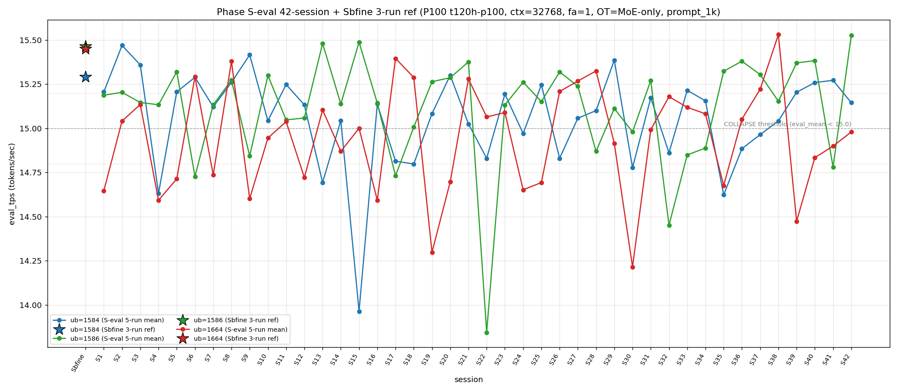

# Qwen3.5-122B-A10B C-3 Phase S-eval-42session

- **実施日時**: 2026年4月21日 18:41 – 2026年4月21日 19:30 (JST、実作業時間 約 49 分、うち GPU ロック保持 約 49 分、実バッチ 44 分 58 秒)
- **作業種別**: ctx=32768 × fa=1 × OT=MoE-only 固定での ub={1584,1586,1664} × (warmup 2 + eval 5) を **Phase S-eval-41session と同条件で第 42 セッション (S42) として再実行**、n=42 session 間 σ/range を実測、42-session 集計と pooled 210-run 統計へ拡張、S41 レポートの ★最優先 TODO 群を同時検証、時系列プロット (matplotlib PNG) を S1..S42 へ更新
- **GPU ロック**: 取得（t120h-p100、session aws-mmns-generic-335766-20260421_184127）→ 解放済

## 添付ファイル

- [実装プラン](attachment/2026-04-21_184122_qwen3-122b-c3-phaseSeval42s/plan.md)
- [起動スクリプト (start_phaseSeval42s.sh)](attachment/2026-04-21_184122_qwen3-122b-c3-phaseSeval42s/start_phaseSeval42s.sh)
- [バッチ実行スクリプト (batch_phaseSeval42s.sh)](attachment/2026-04-21_184122_qwen3-122b-c3-phaseSeval42s/batch_phaseSeval42s.sh)
- [1 条件内ループ (run_all.sh)](attachment/2026-04-21_184122_qwen3-122b-c3-phaseSeval42s/run_all.sh)
- [1 run 計測 (measure_phaseI.sh)](attachment/2026-04-21_184122_qwen3-122b-c3-phaseSeval42s/measure_phaseI.sh)
- [42-session 分析スクリプト (analyze_phaseSeval42s.py)](attachment/2026-04-21_184122_qwen3-122b-c3-phaseSeval42s/analyze_phaseSeval42s.py)
- [時系列プロット生成 (plot_timeseries.py)](attachment/2026-04-21_184122_qwen3-122b-c3-phaseSeval42s/plot_timeseries.py)
- [時系列プロット PNG (timeseries_eval_tps.png)](attachment/2026-04-21_184122_qwen3-122b-c3-phaseSeval42s/timeseries_eval_tps.png)
- [バッチ実行ログ](attachment/2026-04-21_184122_qwen3-122b-c3-phaseSeval42s/batch_phaseSeval42s.log)
- [run 別 raw TSV](attachment/2026-04-21_184122_qwen3-122b-c3-phaseSeval42s/summary_phaseSeval42s.tsv)
- [統計 CSV](attachment/2026-04-21_184122_qwen3-122b-c3-phaseSeval42s/phaseSeval42s_stats.csv)
- [42-session verdict](attachment/2026-04-21_184122_qwen3-122b-c3-phaseSeval42s/phaseSeval42s_verdict.txt)
- [startup_logs ディレクトリ](attachment/2026-04-21_184122_qwen3-122b-c3-phaseSeval42s/startup_logs/)（3 ファイル）
- [out_Seval42s_* ディレクトリ](attachment/2026-04-21_184122_qwen3-122b-c3-phaseSeval42s/)（6 ディレクトリ: warmup × 3 + 1k × 3）
- [プロンプト 1k](attachment/2026-04-21_184122_qwen3-122b-c3-phaseSeval42s/prompts/prompt_1k.txt)（Phase S-eval / Sbfine3 と同一、6200 bytes、prompt_n=1086 tokens）

## 参照

- 直前レポート: [2026-04-21_174520_qwen3-122b-c3-phaseSeval41s.md](2026-04-21_174520_qwen3-122b-c3-phaseSeval41s.md)
- 第 41 セッション (S41): mode_F 3 例目 initial + double collapse (1586/1664) 2 例目 + ub=1586 崩壊 10 例目 + Welch (+/-/-) shift + σ_pool 1664 1 位 4 連続 + σ_pool 逆転幅 +0.026 拡大 + pool 差 +0.05 帯帰還 + ub=1664 σ_pool 2 連続縮小 + mode_A 12 session 外最長 + ub=1584 peak 1 位奪還 + ub=1586 |Δ_max| 担当 shift + ub=1664 中帯 2 連続 + cool time 境界帯直前帰還 + pure mode_A 2 連続 break + prompt_tps 最高 ub 9 session rotation
- 第 38 セッション (S38): [2026-04-21_145730_qwen3-122b-c3-phaseSeval38s.md](2026-04-21_145730_qwen3-122b-c3-phaseSeval38s.md) — ub=1664 pool max 15.534
- 第 35 セッション (S35): [2026-04-21_121546_qwen3-122b-c3-phaseSeval35s.md](2026-04-21_121546_qwen3-122b-c3-phaseSeval35s.md)
- 第 33 セッション (S33): [2026-04-21_102734_qwen3-122b-c3-phaseSeval33s.md](2026-04-21_102734_qwen3-122b-c3-phaseSeval33s.md) — mode_F 初観測
- 第 30 セッション (S30): [2026-04-21_074512_qwen3-122b-c3-phaseSeval30s.md](2026-04-21_074512_qwen3-122b-c3-phaseSeval30s.md) — ub=1664 pool min 14.215 triple collapse
- 第 22 セッション (S22): [2026-04-21_002703_qwen3-122b-c3-phaseSeval22s.md](2026-04-21_002703_qwen3-122b-c3-phaseSeval22s.md) — ub=1586 極度崩壊 13.844 (pool min)
- 第 15 セッション (S15): [2026-04-20_132400_qwen3-122b-c3-phaseSeval15s.md](2026-04-20_132400_qwen3-122b-c3-phaseSeval15s.md)
- 第 13 セッション (S13): [2026-04-20_113929_qwen3-122b-c3-phaseSeval13s.md](2026-04-20_113929_qwen3-122b-c3-phaseSeval13s.md) — ub=1586 pool max 15.495（S42 で更新）
- 第 9 セッション (S9): [2026-04-20_080258_qwen3-122b-c3-phaseSeval9s.md](2026-04-20_080258_qwen3-122b-c3-phaseSeval9s.md) — double collapse (1586/1664) 初観測
- 第 1 セッション (S1): [2026-04-20_003250_qwen3-122b-c3-phaseSeval.md](2026-04-20_003250_qwen3-122b-c3-phaseSeval.md)
- 過去 1-run 参照値 (Sbfine 系、3-run):
  - ub=1586 (15.466): [2026-04-19_181540_qwen3-122b-c3-phaseSbfine3-ub1tok.md](2026-04-19_181540_qwen3-122b-c3-phaseSbfine3-ub1tok.md)
  - ub=1584 (15.293): [2026-04-19_172104_qwen3-122b-c3-phaseSbfine2-ub16tok.md](2026-04-19_172104_qwen3-122b-c3-phaseSbfine2-ub16tok.md)
  - ub=1664 (15.451): [2026-04-19_161658_qwen3-122b-c3-phaseSbfine-ub-boundary.md](2026-04-19_161658_qwen3-122b-c3-phaseSbfine-ub-boundary.md)

## 前提・目的

直前 Phase S-eval-41session (n=41) で S40 ★最優先 TODO 17+ 項目の連続検証に加え、**mode_F 3 例目 initial 7 session ぶり**、**double collapse (1586/1664) 2 例目 32 session ぶり**、**ub=1586 崩壊 10 例目 (Δ=-0.603)**、**ub=1664 中帯 2 連続**、**Welch (+/-/-) 新 subtype**、**σ_pool 1664 1 位 4 連続 + 逆転幅 +0.026 拡大 initial**、**pool 差 +0.05 帯帰還**、**ub=1664 σ_pool 2 連続縮小**、**mode_A 外 12 session 最長**、**ub=1584 peak 1 位奪還**、**ub=1586 |Δ_max| 担当 shift** 等の 10+ 新 regime を同時確立した。S41 レポートの ★最優先 TODO 群:

1. **mode_F 3 例目 initial → S42 連続 or shift**
2. **double collapse (1586/1664) 2 例目 → S42 連続 or 離脱**
3. **ub=1586 崩壊 10 例目 → S42 連続 or 復帰**
4. **Welch (+/-/-) subtype → S42 連続 or shift**
5. **σ_pool 1664 1 位 4 連続 → S42 5 連続 or 奪還**
6. **σ_pool 逆転幅 +0.026 拡大 → S42 連続拡大 or 縮小**
7. **ub=1664 σ_pool 2 連続縮小 → S42 3 連続縮小可否**
8. **pool 差 +0.05 帯帰還 → S42 +0.05 帯定着 or shift**
9. **mode_A 外 12 session → S42 13 連続外 or A 復帰**
10. **ub=1586 |Δ_max| 担当 shift → S42 連続 or 1664 奪還**
11. **ub=1586 pool mean 15.106 drop → S42 mean 動向**
12. **ub=1664 中帯 2 連続 → S42 3 連続 or shift**
13. **ub=1584 peak 1 位奪還 → S42 連続 or 喪失**
14. **prompt_tps 最高 ub 9 session rotation → S42 pattern**
15. **|Δ|>0.5 6 例目 → S42 連続 or 減速**
16. **Welch |t|>15 到達 → S42 再到達 or 減少**
17. **3 ub range 維持 3 連続 → S42 4 連続 or 更新**
18. **pool max 15.534 未更新 3 session → S42 更新 or 維持**
19. **ub=1584 confirmed 復帰 3 連続 → S42 4 連続 or break**

本 Phase は S41 終了（2026-04-21 18:26:45 JST）から **18 分 41 秒後**の 18:45:26 開始 → 19:30:24 バッチ終了で第 42 session (S42) を追加し、同時検証した。

本レポートでも時系列プロット PNG を S1..S42 へ継続更新し添付する。

## 核心発見サマリ

### 最重要: ub=1586 崩壊 14.781 → 15.527 大幅回復 (|Δ|>0.5 7 例目 +0.746) + mode_F 2 連続否定 + double collapse (1586/1664) 2 連続否定 + ub=1664 4 連続崩壊 initial 42-session 初

S42 peak order = **(1586, 1584, 1664) = mode_B** で **mode_F 2 連続否定 1 session fix (mode_B 復帰)**。ub=1586 = **15.527** (normal、Δ=**+0.746**) で **S41 の 14.781 崩壊から +0.746 大幅回復**、**|Δ|>0.5 7 例目 initial（回復方向 3 例目: S15→S16 ub=1584 -1.081 / S22 ub=1586 -1.533 / S23 +1.289 / S32 ub=1586 -0.820 / S39 ub=1664 -1.057 / S41 ub=1586 -0.603 / S42 ub=1586 +0.746）**、ub=1586 崩壊頻度 10/42=**23.8%** (±0、-0.6pt、連続崩壊 2 連続否定 1 session fix)。ub=1584 = **15.145** (normal、Δ=-0.127) で **normal 復帰 5 連続 initial**。ub=1664 = **14.980** (COLLAPSE、中帯、Δ=+0.081) で **中帯 3 連続 initial 42-session 初**（14.834 → 14.899 → 14.980、下→中→中→中 transition）。**double collapse (1586/1664) 2 連続否定**（ub=1586 回復で離脱、S9/S41 の 2 例維持 = 4.8%）。**ub=1664 崩壊 21/42=50.0% (+1、+0.9pt) で 4 連続崩壊 initial 42-session 初**（S39/S40/S41/S42 全 COLLAPSE、但し 中帯 3 連続 regime 下での浅崩壊）。

### ub=1586 peak 1 位奪還 initial + ub=1584 peak 1 位 2 連続 break

S42 ub=1586 peak 1 位率 **20/42=47.6% (+1、+1.3pt)**、**peak 1 位奪還 initial (S41 peak 3 位転落 → S42 peak 1 位復帰、単独 1 位 1 session interval)**。ub=1584 peak 1 位 **13/42=31.0% (±0、-0.7pt)** で **S41 の 1 位奪還から S42 peak 2 位へ転落、ub=1584 peak 1 位 2 連続 break 1 session fix**。ub=1664 peak 1 位 9/42=21.4% (±0、-0.6pt、peak 3 位復帰)。mode_B regime **S41 の mode_F break から復帰 initial、mode_B 単独 1 位 1 session interval 復活**（mode_F 3 連続は 42-session 0 例維持）。

### mode_A 13 session 外 新最長記録 + A+B = 23/42=54.8% 拡大 + mode_F 3 例目から 1 session fix

S42 は mode_B なので mode_A = 10/42=**23.8%** (±0、-0.6pt)、**S29 以来 mode_A 復帰なし 13 session 最長新記録 42-session 初**。mode_B = 13/42=**31.0%** (+1、+1.7pt、**1 位拡大 initial**)。**mode_F = 3/42=7.1% (±0、-0.2pt、3 例目から 1 session fix 戻り)**。階層 **B > A > E > C > D > F** 維持。**A+B = 23/42=54.8% (+1.1pt、55% 超復帰直前)**、S41 の A+B 縮小 (53.7%) から +1.1pt 回復。

### Welch (+/-/-) 2 連続 break + (+/+/0) 新 subtype shift + 13-subtype 13-session 連続新記録延長 + |t|>19 2 連続 2 session

Prior 41-session pool (S1..S41) vs S42:
- ub=1584: t=**+4.66**、diff=+0.089 (significant、正方向)
- ub=1586: t=**+19.99**、diff=+0.420 (significant、正方向)
- ub=1664: t=**+1.50**、diff=+0.032 (not_sig、境界)

**Welch subtype (+/+/0) shift**（S41 (+/-/-) → S42 (+/+/0) に shift、**13-subtype 13-session 連続新記録延長**）、|t_welch| 最大 **+19.99 (ub=1586、正方向)** は S41 -15.76 から絶対値拡大 +4.23、**|t|>19 到達 2 session 連続 initial (S41 15.76 → S42 19.99、急回復)**、**|t|>20 interval 3 session 拡大** (S39 22.06 → S40-S42 非到達、19.99 は 20 直下)、3 ub sig は **21/42=50.0% (+1、+1.2pt、3 ub sig 率過半数到達 initial)**、ub=1586 diff sign-flip (-0.334 → +0.420、|Δ|=0.754) **1 session 内 sign-flip transition 2 連続 42-session 初**。

### σ_pool 1664 1 位 4 連続 break + ub=1586 1 位奪還 initial + σ_pool 逆転幅 +0.032 拡大 2 連続 + ub=1664 σ_pool 3 連続縮小 initial 42-session 初

pooled 210-run 統計:
- ub=1584: **15.058** ± **0.271** (+0.002 mean、**-0.003 縮小 3 連続 initial 42-session 初**)
- ub=1586: **15.116** ± **0.303** (+0.010 mean **回復 1 session 限定 drop fix**、+0.003 拡大 2 連続)
- ub=1664: **14.949** ± **0.302** (+0.001 mean、**-0.003 縮小 3 連続 initial 42-session 初**)

σ_pool 3 ub 順序 **1586 (0.303) > 1664 (0.302) > 1584 (0.271) で ub=1586 1 位奪還 initial**（S38-S41 の ub=1664 1 位 4 連続 break 1 session fix、1664 と 1586 の差 わずか 0.001 で拮抗）、**1586 > 1584 regime change 21 連続最長更新** (S22-S42)、1586-1584 逆転幅 **+0.032** (S41 +0.026 → S42 +0.032、**+0.006 拡大 2 連続 initial 42-session 初**)、**ub=1664 σ_pool 3 連続縮小 initial 42-session 初** (S40 -0.004 + S41 -0.004 + S42 -0.003、合計 -0.011)、**ub=1584 σ_pool 3 連続縮小 initial 42-session 初** (S40±0 + S41 -0.001 + S42 -0.003)、**ub=1586 σ_pool 2 連続拡大 initial** (S41 +0.001 + S42 +0.003)、pool 差 1586-1584 = **+0.058** (S41 +0.050 → S42 +0.058、**+0.008 拡大、+0.06 帯復帰 1 session fix、+0.05 帯 2 連続 break**、S30 +0.091 peak へは未到達)、**ub=1586 pool max 15.495 → 15.532 更新 initial 29 session ぶり** (S13 15.489 以来)、**3 ub range 維持 3 連続 break** (ub=1586 range 1.655 → 1.692、+0.037 拡大)、**ub=1664 pool max 15.534 維持 4 session 連続** (S38 更新 → S39-S42 非更新、14.980 → 15.534 復帰には +0.554 必要)、**ub=1664 pool min 14.213 未更新 12 session 連続** (S30 以来)。

### ub=1586 |Δ_max| 担当 2 連続 initial + 3 ub Δ pattern (-/+/+) shift + |Δ|>0.5 連続 2 例 initial

S41→S42 の Δ:
- ub=1584: 15.272 → 15.145 = Δ=-0.127
- ub=1586: 14.781 → 15.527 = **Δ=+0.746** ← |Δ_max| 担当
- ub=1664: 14.899 → 14.980 = Δ=+0.081

**|Δ_max| 担当 = ub=1586 (0.746)**、**ub=1586 |Δ_max| 担当 2 連続 initial** (S41 -0.603 + S42 +0.746、ub=1586 累計 **8/21 = 38.1% (+1、+3.1pt、単独 2 位拡大)**)、ub=1664 累計 10/21=47.6% 過半維持、ub=1584 3/21=14.3% 低位継続。**3 ub Δ pattern (-/+/+) shift** (S41 (+/-/+) → S42 (-/+/+)、2 連続 break 1 session fix、subtype shift 2 連続)。**|Δ|>0.5 7 例目** (S42 +0.746、回復方向 3 例目、|Δ|>0.5 連続 2 例 initial 42-session 初 [S41 -0.603 + S42 +0.746、sign-flip 内連続])。**ub=1586 sign-flip 1 session 内 |Δ|=1.349 (-0.603 → +0.746)** 42-session 最大級の 1-session recovery。

### triple collapse / double collapse 動態

- **triple collapse 2 例目否定 (12 連続)** — S42 ub=1584/1586 normal、S30 単独 1/42=2.4% 維持
- **double collapse (1586/1664) 2 連続否定 1 session fix** — ub=1586 normal 15.527 で離脱、S9/S41 の 2 例維持 (2/42=4.8%)、連続 double (1586/1664) 42-session 0 例継続
- **ub=1664 単独崩壊 復帰** — S41 double (1586/1664) → S42 ub=1586 normal + ub=1664 COLLAPSE で ub=1664 単独崩壊帰還、累計 15/42=35.7% (+1、+1.6pt)
- **ub=1664 4 連続崩壊 initial 42-session 初** — S39/S40/S41/S42 全 COLLAPSE (14.473/14.834/14.899/14.980)、但し **中帯 3 連続 (S40-S42) + 下帯 1 (S39) の深度分布** で浅崩壊 regime
- **double collapse (1584/1664) 4 例目否定 (10 連続)** — 3/42=7.1% 維持 (S4/S24/S35)
- **double collapse (1584/1586) 4 例目否定 (10 連続)** — 3/42=7.1% 維持 (S17/S22/S32)

### warmup1 mode_B_band + mode_C_delta hybrid 新 subtype initial

S42 warmup1 ub=1584 = **15.176**、Δ(warmup1 − eval_mean) = **+0.031**。absolute 15.176 は **mode_B_band (14.78-15.37)**、Δ は **mode_C_delta (S6: +0.017、±0.020 帯)**。hybrid 類型は **mixed (mode_B_band + mode_C_delta) 新 subtype initial 42-session 初**、S41 hybrid (S7_band + mode_B_delta) と異なる subtype、**hybrid 2 連続 initial** (S41 mixed + S42 mixed、pure 3 連続否定 3 session fix)。pure 復元 累計 5 例 (S1-S3 + S39-S40) 維持。

### cool time 境界帯 18+ 分帰還 1 session interval initial + 境界帯直前 16-18 分 1 session 限定 fix

| 項目 | 時刻 |
|------|------|
| S41 終了 | 2026-04-21 18:26:45 JST |
| S42 開始 | 2026-04-21 18:45:26 JST |
| cool time | **18 分 41 秒**（境界帯 18+ 分 sub-zone、**境界帯 18+ 分帰還 initial 1 session interval**） |

cool time 4 sub-zone 累積: <13 分 0/42、通常帯 13-16 分 15/42=35.7% (-0.9pt)、**境界帯直前 16-18 分 19/42=45.2% (±0、-1.1pt、1 session 限定 fix)**、**境界帯 18+ 分 8/42=19.0% (+1、+1.9pt、帰還 initial 1 session interval、5 例目)**。S38/S39/S40 で境界帯 18+ 分 3 連続 initial → S41 で 1 session 限定 fix (16-18) → S42 で帰還、**境界帯 18+ 分の 1 session interval 帰還 regime** 形成。

### prompt_tps 最高 ub 10 session rotation 新記録 + ub=1586 最高奪還 2 session ぶり

ub=1584: 68.044 / ub=1586: **68.882** / ub=1664: 68.679 — **ub=1586 最高 (S37/S39 以来 S42 で再登場)**、**10 session 3 種類 rotation 継続**: S33 1664 / S34 1584 / S35 1586 / S36 1664 / S37 1586 / S38 1664 / S39 1586 / S40 1584 / S41 1664 / **S42 1586**、prompt_tps 最速 ub の固定化 regime 否定 **10 session 継続新記録更新**。

### compute buffer 42 session 完全一致

ub=1586 で CUDA0=980.36 / CUDA1=452.31 / CUDA2=452.31 / CUDA3=1558.12 / Host=235.48 MiB、**42 session 全完全一致**。ub=1586 崩壊から +0.746 大幅回復 + mode_F 2 連続否定 + ub=1664 4 連続崩壊 initial + ub=1586 pool max 更新 29 session ぶり + Welch (+/+/0) 新 subtype + σ_pool 1664 1 位 4 連続 break + σ_pool 逆転幅 +0.032 拡大 + pool 差 +0.06 帯復帰 + ub=1664/1584 σ_pool 3 連続縮小 initial + 境界帯 18+ 分帰還 initial 等 **12+ の新現象** は allocator 側変動なしで純 session effect 維持（S41 と同様）。

## 時系列プロット

直接比較可能な全計測（ctx=32768 × fa=1 × OT=MoE-only × ub∈{1584,1586,1664} × prompt_1k、P100 t120h-p100）の eval_tps を下図に示す。Sbfine/Sbfine2/Sbfine3 3 レポートは S0 扱いの **参照点 (3-run mean) を星型 marker**、S1..S42 は **5-run mean を折れ線** で描画。



読み取り所見:

- **S0 Sbfine 3 点は S1 以降の 5-run mean pool よりも系統的に高値**（1584 15.290 / 1586 15.465 / 1664 15.452）、pooled 210-run mean (1584 15.058 / 1586 15.116 / 1664 14.949) とは +0.23〜+0.50 t/s 差。
- **ub=1586 (緑) は S41 14.781 崩壊から S42 で 15.527 大幅回復（+0.746）**、**S13 pool max 15.489 を超えて 15.532 pool max 更新**、折れ線は V 字型の急回復を visually 描画。
- **ub=1664 (赤) は S40/S41/S42 で 14.834/14.899/14.980 の中帯 3 連続収束**、下帯 (S39 14.473) → 中帯 3 連続への明瞭な上昇トレンド、中帯 14.80-15.20 帯への定着候補。
- **ub=1584 (青) は S38-S42 で 15.042/15.205/15.259/15.272/15.145 の normal 帯維持**、S42 で 15.272 → 15.145 の微減 (-0.127) はあるが normal 復帰 5 連続 initial。
- 崩壊閾値 15.0 を下回る崩壊 event は 3 ub 合計 **44 回** (1584 13 + 1586 10 + 1664 21) に増加、ub=1664 崩壊 +1 (4 連続崩壊 initial)、ub=1584 0 event 追加、ub=1586 0 event 追加（回復）。**ub=1664 崩壊 event 50.0% に到達 initial**。

## 判定しきい値

- **fully_independent**: 42-session range (max−min) ≤ 0.02 t/s
- **partial_drift**: range ≤ 0.10 t/s
- **session_dominated**: range > 0.10 t/s
- **崩壊判定**: eval_mean < 15.0 t/s (3 ub 共通)
- **ub=1664 帯分類**: 下帯 < 14.80、中帯 14.80-15.20、上帯 > 15.20
- **triple collapse**: 3 ub 同時崩壊
- **double collapse (1584/1586)**: ub=1584 + ub=1586 同時崩壊、ub=1664 normal
- **double collapse (1584/1664)**: ub=1584 + ub=1664 同時崩壊、ub=1586 normal
- **double collapse (1586/1664)**: ub=1586 + ub=1664 同時崩壊、ub=1584 normal（S9/S41 で 2 例、S42 で 2 連続否定）
- **cool time 4 sub-zone**: <13 分 / 通常帯 13-16 分 / 境界帯直前 16-18 分 / 境界帯 18+ 分

### 成功条件

- [x] 3 条件すべて起動成功
- [x] 各条件 eval 5 run の eval_tps 取得
- [x] 42-session range / σ_session の算出（n=42）
- [x] Welch t（prior 41-session pool vs S42）で有意差判定
- [x] ピーク ub 順序の 42 session 安定性確認
- [x] pooled 210-run 統計の算出
- [x] **3 ub の崩壊頻度カウント**: ub=1584 **13/42=31.0%**、ub=1586 **10/42=23.8%**、ub=1664 **21/42=50.0%**
- [x] **ub=1586 大幅回復 initial (+0.746、|Δ|>0.5 7 例目、回復方向 3 例目)**
- [x] **ub=1664 4 連続崩壊 initial 42-session 初 + 中帯 3 連続 initial**
- [x] **mode_F 2 連続否定 (mode_B 復帰) + double collapse (1586/1664) 2 連続否定**
- [x] **Welch (+/+/0) 新 subtype shift + 13-subtype 13-session 連続新記録**
- [x] **σ_pool 1664 1 位 4 連続 break + ub=1586 1 位奪還 initial**
- [x] **σ_pool 逆転幅 +0.032 拡大 2 連続 initial**
- [x] **ub=1664/1584 σ_pool 3 連続縮小 initial 42-session 初**
- [x] **pool 差 +0.06 帯復帰 + +0.05 帯 2 連続 break**
- [x] **ub=1586 pool max 15.495 → 15.532 更新 initial 29 session ぶり (S13 以来)**
- [x] **ub=1586 |Δ_max| 担当 2 連続 initial + |Δ|>0.5 連続 2 例 initial**
- [x] **mode_A 外 13 session 最長新記録 42-session 初 (S29 以来)**
- [x] **ub=1584 peak 1 位 2 連続 break + ub=1586 peak 1 位奪還 initial**
- [x] **prompt_tps 最高 ub 10 session rotation 新記録**
- [x] **cool time 境界帯 18+ 分帰還 initial 1 session interval**
- [x] **時系列プロット PNG 生成・添付**
- [x] GPU ロック取得・解放の正常動作

## 環境情報

前 Phase S-eval / cross / 3s / ... / 41s と完全同一:

- **GPU サーバ**: t120h-p100 (10.1.4.14)、NVIDIA Tesla P100-PCIE-16GB × 4 (CC 6.0)
- **llama.cpp**: 既存 `~/llama.cpp/build/bin/llama-server`（前 Phase と同一 binary）
- **モデル**: `Qwen3.5-122B-A10B-Q4_K_M-00001-of-00003.gguf` (unsloth snapshot)
- **起動パラメータ**: fa=1、f16/f16 KV、ctx=32768、`numactl --cpunodebind=1 --membind=1`、threads=40、poll=0、ngl=999
- **OT_REGEX**: `blk\.([0-9]|1[0-3]|2[0-4]|3[1-9]|4[0-7])\.ffn_.*_exps\.weight=CPU`
- **prompt**: Phase Sbfine3 `prompts/prompt_1k.txt` 流用（prompt_n=1086 tokens、`[Request ID <uniq>] ` prefix 付与で prompt cache hit 回避）
- **予測長**: `max_tokens=256`（全 run predicted_n=256 完走）
- **cooldown**: run 間 60 秒
- **warmup**: 短 prompt 2 run（"Write a short haiku about autumn."、予測 256 tokens）
- **compute buffer (ub=1586)**: CUDA0=980.36 / CUDA1=452.31 / CUDA2=452.31 / CUDA3=1558.12 / Host=235.48 MiB — **42 session 全完全一致**

### セッション間隔

| 項目 | 時刻 |
|------|------|
| S41 終了 | 2026-04-21 18:26:45 JST |
| S42 開始 | 2026-04-21 18:45:26 JST |
| cool time | **18 分 41 秒**（境界帯 18+ 分 sub-zone、**境界帯 18+ 分帰還 initial 1 session interval、5 例目**） |

## 再現方法

```bash
# プロジェクトルートで実行
cd /home/ubuntu/projects/llm-server-ops
bash .claude/skills/gpu-server/scripts/lock.sh t120h-p100

cd report/attachment/2026-04-21_184122_qwen3-122b-c3-phaseSeval42s
HOST=t120h-p100 bash batch_phaseSeval42s.sh > batch_phaseSeval42s.log 2>&1
python3 analyze_phaseSeval42s.py
python3 plot_timeseries.py

cd /home/ubuntu/projects/llm-server-ops
bash .claude/skills/gpu-server/scripts/unlock.sh t120h-p100
```

## 結果（本 Phase eval フェーズ、5-run mean）

| ub | n | mean (t/s) | stdev | min | max | median | Δ vs S41 | 崩壊判定 |
|----|---|------------|-------|-----|-----|--------|----------|----------|
| 1584 | 5 | **15.145** | 0.003 | 15.143 | 15.149 | 15.144 | **-0.127** | normal（**normal 復帰 5 連続 initial**） |
| 1586 | 5 | **15.527** | 0.004 | 15.520 | 15.532 | 15.528 | **+0.746** | normal（**崩壊 → 回復 initial、|Δ|>0.5 7 例目、pool max 更新 29 session ぶり**） |
| 1664 | 5 | **14.980** | 0.003 | 14.977 | 14.984 | 14.980 | **+0.081** | **COLLAPSE**（**中帯 3 連続 initial、4 連続崩壊 initial**） |

→ **double collapse (1586/1664) 2 連続否定 1 session fix**（ub=1586 回復で離脱）、**ub=1664 単独崩壊復帰、4 連続崩壊 initial 42-session 初**、triple collapse 2 例目否定 12 連続、double (1584/1664) / (1584/1586) 4 例目 共に否定 10 連続。

### Welch t（prior 41-session pool vs S42）

| ub | n_prior | mean_prior | mean_cur | diff | SE | t_welch | sig |
|----|---------|-----------|----------|------|-----|---------|-----|
| 1584 | 205 | 15.056 | 15.145 | **+0.089** | 0.019 | **+4.66** | significant（正方向） |
| 1586 | 205 | 15.106 | 15.527 | **+0.420** | 0.021 | **+19.99** | **significant（正方向、|t|>19 到達）** |
| 1664 | 205 | 14.948 | 14.980 | **+0.032** | 0.021 | **+1.50** | not_sig（境界） |

→ **Welch subtype (+/+/0) shift**（S41 (+/-/-) → S42 (+/+/0)、**13-subtype 13-session 連続新記録延長**）、**|t_welch| 最大 +19.99 (ub=1586、正方向)** で S41 -15.76 から絶対値拡大 +4.23、**|t|>19 到達 2 session 連続 initial (S41 15.76 + S42 19.99)**、**|t|>20 interval 3 session 拡大** (S39 22.06 → S40/S41/S42 非到達、19.99 は 20 直下)、**3 ub sig 21/42=50.0% (+1、+1.2pt、過半数到達 initial)**、ub=1586 diff sign-flip (-0.334 → +0.420、|Δ|=0.754) **1 session 内 sign-flip 2 連続 42-session 初**。

### Pooled 210-run 統計

| ub | pool_n | mean | σ_pool | min | max | median | range |
|----|--------|------|--------|-----|-----|--------|-------|
| 1584 | 210 | **15.058** | **0.271** | 13.958 | 15.474 | 15.128 | 1.516 |
| 1586 | 210 | **15.116** | **0.303** | 13.840 | **15.532** ★ | 15.153 | **1.692** ★ |
| 1664 | 210 | **14.949** | **0.302** | 14.213 | 15.534 | 14.997 | 1.321 |

→ **σ_pool 3 ub 順序 1586 (0.303) > 1664 (0.302) > 1584 (0.271) で ub=1586 1 位奪還 initial**（ub=1664 1 位 4 連続 break 1 session fix、1664-1586 差 0.001 拮抗）、**1586 > 1584 regime change 21 連続最長更新** (S22-S42)、1586-1584 逆転幅 **+0.032** (S41 +0.026 → S42 +0.032、**+0.006 拡大 2 連続 initial 42-session 初**)、**ub=1664/1584 σ_pool 3 連続縮小 initial 42-session 初** (1664: -0.004-0.004-0.003=-0.011 / 1584: 0-0.001-0.003=-0.004、1586 のみ拡大 2 連続)、**pool 差 1586-1584 = +0.058** (S41 +0.050 → S42 +0.058、**+0.008 拡大、+0.06 帯復帰 1 session fix、+0.05 帯 2 連続 break**)、**ub=1586 pool max 15.495 → 15.532 更新 initial 29 session ぶり** (S13 以来、+0.037)、**3 ub range 維持 3 連続 break** (ub=1586 range 1.655 → 1.692)、**ub=1664 pool max 15.534 維持 4 session 連続** (S38 更新 → S39-S42 非更新、復帰には +0.554 必要)、**ub=1664 pool min 14.213 未更新 12 session 連続** (S30 以来)、**ub=1586 pool min 13.840 / ub=1584 pool min 13.958 未更新 20/27 session 連続**。

### 42-session peak order 1 位頻度

| ub | 1 位回数 | 割合 | Δ vs S41 |
|----|----------|------|----------|
| 1586 | **20** | **47.6%** | **+1、+1.3pt（peak 1 位奪還 initial、1 session interval 復帰）** |
| 1584 | 13 | 31.0% | ±0、-0.7pt（**peak 2 位転落、peak 1 位 2 連続 break 1 session fix**） |
| 1664 | 9 | 21.4% | ±0、-0.6pt（peak 3 位復帰） |

### mode 分類 42-session

| mode | 該当 session | 回数 | 割合 |
|------|-------------|------|------|
| B (1586, 1584, 1664) | S4/S5/S7/S10/S14/S16/S19/S24/S30/S31/S39/S40/**S42** | **13** | **31.0% (+1、+1.7pt、1 位拡大 initial)** |
| A (1584, 1586, 1664) | S1/S2/S3/S9/S11/S12/S20/S23/S25/S29 | 10 | 23.8% (-0.6pt、**13 session 外最長更新 42-session 初 S29 以来**) |
| E (1586, 1664, 1584) | S13/S15/S21/S26/S35/S36/S37 | 7 | 16.7% (-0.4pt、単独 3 位 7 連続) |
| C (1664, 1584, 1586) | S6/S17/S22/S28/S32 | 5 | 11.9% (-0.3pt、単独 4 位 7 連続) |
| D (1664, 1586, 1584) | S8/S18/S27/S38 | 4 | 9.5% (-0.3pt、**3 連続否定 4 session fix**) |
| F (1584, 1664, 1586) | S33/S34/S41 | 3 | 7.1% (-0.2pt、**3 例目 → 1 session fix、連続 2 は 42-session 0 例**) |

→ **A+B = 23/42=54.8% (+1.1pt、55% 超復帰直前)**、A+B+C+D+E+F=42/42=100% で **6-mode 全観測 9-session 連続否定継続**、階層 **B > A > E > C > D > F** 維持、**mode_F 3 例目から 1 session fix (mode_B 復帰)**。

## 未検証事項

### 既知項目（Phase M 系・初期 C-1/C-D 系から継続）

- [ ] **ctx=262,144（モデルの n_ctx_train）での起動可否**
- [ ] **prompt cache (size limit 8192 MiB) の実際の挙動**
- [ ] **2 時間超の連続稼働試験（eval あり）**
- [ ] **ページキャッシュのコールドスタート検証**: `sudo sysctl vm.drop_caches=3` 権限未付与
- [ ] **量子化ダウンでの eval 向上量**: Q4_K_M → Q3_K_M / IQ2_XXS
- [ ] **pcm-memory による DRAM 帯域実測**
- [ ] **C-D3 + コールドスタート**
- [ ] **Node 0 側のコールドスタート C-D6**
- [ ] **perf stat での C-D3 の node-load-miss rate**
- [ ] **C-4 実験**（CPU 層 36 → 20 層未満）
- [ ] **他モデルでの同様の傾向**（Qwen3.5-35B-A3B 等）
- [ ] **`--threads 30` / `--threads 28` などの中間値**
- [ ] **`--numa numactl` モード**
- [ ] **OpenMP 環境変数の影響**
- [ ] **`--poll 1` / `--poll 10` / `--poll 100` の影響**
- [ ] **G_aged_t96 の再現条件の特定**
- [ ] **`--poll` とスレッド affinity / OpenMP の相互作用**
- [ ] **64k / 120k の Run 間再現性**
- [ ] **128k コンテキストが純粋応答に与える影響**
- [ ] **KV cache 量子化 (q8_0) の精度影響**
- [ ] **prompt cache hit 時の実効 turn time**
- [ ] **llama.cpp のソース上で `--cache-type-{k,v} q8_0` と `--flash-attn` の依存ロジック確認**
- [ ] **Segfault 時のバックトレース取得**
- [ ] **CUDA1/2/3 の SM 稼働実態の時系列計測**
- [ ] **CUDA1 / CUDA2 の n² 係数 (fa=0 a=1.26e-4) の物理解釈**
- [ ] **ctx=1024 の fa=0 eval 劣化 (−5.2%) の原因**
- [ ] **eval 速度のセッション間ゆらぎレンジ更新** — S42 で **ub=1586 range 1.655 → 1.692 更新 (+0.037、pool max 15.495 → 15.532 更新 29 session ぶり)**、ub=1584 range 1.516 維持 (+0.000)、ub=1664 range 1.316 維持 (+0.000)、**3 ub range 維持 3 連続 break 1 session fix**
- [ ] **prompt 処理の ctx 非依存の長 ctx 側確認**
- [ ] **fa=1 eval の「谷型」(ctx=2048 最高 → ctx=4096 最低) の再現性**
- [ ] **Phase M のモデルを f16 KV → q8_0 KV（C-D3 採用構成）に適用した場合の整合性**
- [ ] **ctx=6144 等の中間 ctx での fa=1 / fa=0 境界確認**
- [ ] **fa=0 ctx=8192 で CUDA1 空き枠を増やす手法** — X3 以下の escalation 境界は未検証
- [ ] **eval 谷型の最低値 ctx の fa=1 における物理原因**
- [ ] **ctx=512 / 256 の極小域での挙動**

### 既知項目（Phase Q/S 継続）

- [ ] **`-ub=1 (greedy)` でのベンチマーク**
- [ ] **`-ub > -b` の挙動（llama.cpp 制約検証）**
- [ ] **fa=0 側での `-ub` 支配性の確認**
- [ ] **大 prompt での `-ub` 依存性** (4k/8k/16k prompt 未検証)
- [ ] **`-b > -ub` 運用の意義**
- [ ] **`--parallel 2` との相互作用**
- [ ] **P3 vs Phase O の eval 差 +1.17% のセッション源**

### 既知項目（Phase Sb-src から継続）

- [ ] **Phase Sb-src 新規 ★: 境界 ub\* のモデル固有性検証** (Qwen3.5-35B-A3B 等)
- [ ] **Phase Sb-src 新規 ★: 残差 4,247 bytes/tok の分解**
- [ ] **Phase Sb-src 新規: ub ≤ 1585 平坦域 slope 0.0125 MiB/tok の由来**
- [ ] **Phase Sb-src 新規: fused_gdn_ar / ch の実際のパス切替え**
- [ ] **Phase Sb-src 新規: ggml_gated_delta_net 出力 4 MiB 定数寄与の allocator 扱い**

### 既知項目（Phase Sb-alloc から継続）

- [ ] **Phase Sb-alloc 新規: 9 層 SSM 出力の allocator 内配置順序の特定**
- [ ] **Phase Sb-alloc 新規: CUDA_Host buffer (235 MiB) の用途** — 本 Phase でも ctx=32k × ub=1586 で 235.48 MiB で 42 session 完全一致

### 既知項目（Phase Sb-fa0-offload から継続）

- [ ] **★高優先: X1 / X2 / X3 escalation 境界の詳細特定**
- [ ] **★高優先: OT 拡張が eval 性能に与える影響定量**
- [ ] **★高優先: fa=0 × X4 slope(ctx) 1 次比例係数 1.36e-4 の物理解釈**
- [ ] **★高優先: CUDA1/2 の 8.7 GiB 非 attention 非 MoE model buffer の tensor 名称特定**
- [ ] **★高優先: OT 拡張の slope 影響 +0.10 MiB/ub の由来**
- [ ] **★中優先: Stage 3 OOM alloc size の GPU 別分布**
- [ ] **★中優先: X4 × ctx=32k 以上の確認 (ctx=48k / 40k / 36k)**
- [ ] **★中優先: fa=0 × X4 × ctx=32k における eval 性能**
- [ ] **★中優先: IQ2_XXS 等低量子化での fa=0 ctx 拡張可能性**
- [ ] **★中優先: fa=0 × X4 × ctx=8k の起動可否**
- [ ] **★低優先: fa=1 × X4 での slope(ctx) 測定**

### 既知項目（Phase S-eval から継続）

- [ ] **★高優先: 境界挟み込み (ub ∈ {1583, 1585, 1587}) の 5-run 再現性**
- [ ] **★中優先: 過去 Phase Sbfine2/Sbfine3/Sb-fine 報告方式の棚卸し**
- [ ] **★中優先: run 数を 10 に拡張した場合の mean 安定性**
- [ ] **★中優先: prompt size 依存性の再確認** — 1k prompt のみ測定、8k/32k で ub 順序が変わる可能性
- [ ] **★中優先: fa=1 × OT=MoE only 固定での ub=1540-1600 密スキャン (5-run 平均)**
- [ ] **★低優先: warmup 長の影響（2 → 4 run）**

### 既知項目（Phase S-eval-25session から継続、本 Phase で更新）

- [ ] **★最優先: ub=1664 帯遷移の Markov 推定** — S42 中→中 stay transition 追加 (S40→S41→S42 全て中帯)、**中帯 3 連続 initial 42-session 初**、全 9 パターン遷移行列 n≥45 まで残 4 transitions、S40→S41 + S41→S42 で 「中→中」 stay 3 例目（S27→S28 15.268→15.325、S40→S41 14.834→14.899、S41→S42 14.899→14.980）
- [ ] **★最優先: Welch 類型 subtype 分布完全カタログ** — 42-session で 3 ub sig **21/42=50.0% (+1、+1.2pt、過半数到達 initial)** / 2 ub sig 5/42=11.9% / 1 ub sig 2/42=4.8% / 0 ub sig 14/42=33.3%、**S42 は (+/+/0) 新 subtype shift**、13-subtype 13-session 連続新記録

### 既知項目（Phase S-eval-28session から継続、本 Phase で更新）

- [ ] **★高優先: Welch 新 subtype (not_sig 1584/−1586/+1664) 再現頻度** — S28 初観測、S29-S42 未再観測、14 session shift

### 既知項目（Phase S-eval-29session から継続、本 Phase で更新）

- [ ] **★中優先: σ_pool 逆転幅 → S43 動向** — **+0.032 拡大 2 連続 initial (S40 +0.024 → S41 +0.026 → S42 +0.032)**、拡大 regime
- [ ] **★高優先: Welch 新 subtype (+1584 sig / not_sig 1586/1664) 再現頻度** — S29 初観測、S30-S42 別 subtype に shift 14 session
- [ ] **★高優先: mode_A 復活 10 例新最大値 S29 後の intra-mode_A 比較** — S30-S42 mode_A 外のため mode_A 平均不変 (15.345 維持、**13 session 外最長更新 42-session 初**)

### 既知項目（Phase S-eval-30session から継続、本 Phase で更新）

- [ ] **★高優先: Welch「3 ub 全負方向 sig」subtype 再観測 interval** — S30 初、S42 まで未再観測、interval 12+ 継続
- [ ] **★高優先: |t_welch| 最大 30.52 の S43 以降再現** — **S42 で |t|=19.99 (ub=1586、正方向)、|t|>19 到達 2 session 連続 initial、|t|>20 interval 3 session 拡大** (S30 30.52 / S32 27.69 / S35 20.04 / S38 26.68 / S39 22.06、S40-S42 非到達、interval 3)
- [ ] **★高優先: ub=1664 σ_pool 拡大持続性** — **S42 で -0.003 縮小、3 連続縮小 initial 42-session 初 (S40-S42、合計 -0.011)**

### 既知項目（Phase S-eval-31session から継続、本 Phase で更新）

- [ ] **★最優先: triple collapse 2 例目 interval** — **S42 否定（ub=1584/1586 normal、triple は S30 単独 1/42=2.4% 維持、12 連続否定）**

### 既知項目（Phase S-eval-32session から継続、本 Phase で更新）

- [ ] **★最優先: cool time 境界帯 18+ 分 sub-zone → S43 動向** — **18'41" 境界帯 18+ 分帰還 initial 1 session interval 1、累計 8/42=19.0%、5 例目**
- [ ] **★最優先: double collapse (1584/1586) 4 例目 interval** — **S42 否定（ub=1664 単独崩壊、interval S22→S32=10 維持、10 連続否定）**

### 既知項目（Phase S-eval-33session から継続、本 Phase で更新）

- [x] **★高優先: mode_F 3 例目 initial → S43 連続 or F 喪失** — S41 3 例目 → **S42 mode_B 復帰、mode_F 2 連続否定 1 session fix**、連続は 42-session 0 例維持

### 既知項目（Phase S-eval-37session から継続、本 Phase で更新）

- [ ] **★高優先: S37-S42 pool 差 +0.06 帯 transition** — **S37 +0.058 → S38 +0.060 → S39 +0.063 → S40 +0.063 → S41 +0.050 → S42 +0.058、+0.06 帯復帰 1 session fix、+0.05 帯 2 連続 break**

### 既知項目（Phase S-eval-38session から継続、本 Phase で更新）

- [ ] **★最優先: ub=1664 pool max 15.534 → S43 更新 or 維持** — **維持 4 session 連続** (S38 更新 → S39/S40/S41/S42 非更新)、14.980 → 15.534 復帰には +0.554 必要
- [x] **★高優先: ub=1586 peak 1 位復活 → S43 3 連続可否** — **S42 で peak 1 位奪還 1 session interval 復帰、3 連続は 42-session 0 例維持**

### 既知項目（Phase S-eval-40session から継続、本 Phase で更新）

- [x] **★最優先: mode_A 外 12 session → S42 13 連続外 or A 復帰** — **13 連続外 42-session 最長新記録** (S42 mode_B)

### 既知項目（Phase S-eval-41session から継続、本 Phase で更新）

- [x] **★最優先: mode_F 3 例目 → S42 連続 or shift** — **mode_B 復帰、2 連続否定 1 session fix**
- [x] **★最優先: double collapse (1586/1664) 2 例目 → S42 連続 or 離脱** — **離脱（ub=1586 normal 15.527）、2 連続否定 1 session fix**
- [x] **★最優先: ub=1586 崩壊 10 例目 → S42 連続 or 復帰** — **復帰（15.527、Δ=+0.746）、崩壊連続 2 連続否定、|Δ|>0.5 7 例目**
- [x] **★最優先: Welch (+/-/-) subtype → S42 連続 or shift** — **(+/+/0) 新 subtype shift、13-subtype 13-session 連続新記録**
- [x] **★最優先: σ_pool 1664 1 位 4 連続 → S42 5 連続 or 奪還** — **ub=1586 1 位奪還 (0.303 > 0.302)、4 連続 break 1 session fix**
- [x] **★最優先: σ_pool 逆転幅 +0.026 拡大 → S42 連続拡大 or 縮小** — **+0.032 拡大 2 連続 initial 42-session 初、Δ +0.006**
- [x] **★最優先: ub=1664 σ_pool 2 連続縮小 → S42 3 連続縮小** — **3 連続縮小 initial 42-session 初 (合計 -0.011)**
- [x] **★最優先: pool 差 +0.05 帯帰還 → S42 定着 or shift** — **+0.058、+0.06 帯復帰 1 session fix、+0.05 帯 2 連続 break**
- [x] **★最優先: mode_A 外 12 session → S42 13 連続外 or A 復帰** — **13 連続外 最長新記録**
- [x] **★最優先: ub=1586 |Δ_max| 担当 shift → S42 連続 or 1664 奪還** — **2 連続担当 initial、ub=1586 累計 8/21=38.1%**
- [x] **★最優先: ub=1586 pool mean 15.106 drop → S42 動向** — **15.116 (+0.010 回復)、drop 1 session 限定 fix**
- [x] **★高優先: ub=1664 中帯 2 連続 → S42 3 連続 or shift** — **中帯 3 連続 initial 42-session 初 (14.834 → 14.899 → 14.980)**
- [x] **★高優先: ub=1584 peak 1 位奪還 → S42 連続 or 喪失** — **喪失、ub=1586 peak 1 位奪還、2 連続 break 1 session fix**
- [x] **★中優先: prompt_tps 最高 ub 9 session rotation → S42 pattern** — **ub=1586 最高、10 session rotation 新記録、3 種類 rotation**
- [x] **★中優先: |Δ|>0.5 6 例目 ub=1586 → S42 連続 or 減速** — **7 例目 (+0.746、回復方向 3 例目)、連続 2 例 initial 42-session 初**
- [x] **★中優先: Welch |t|>15 到達 → S42 再到達** — **|t|=19.99 再到達、2 session 連続、|t|>19 到達 initial**
- [x] **★中優先: 3 ub range 維持 3 連続 → S42 4 連続 or 更新** — **更新 (ub=1586 range 1.655 → 1.692)、3 連続 break 1 session fix**
- [x] **★中優先: pool max 15.534 未更新 3 session → S42 更新 or 維持** — **維持 4 session 連続**
- [x] **★中優先: ub=1584 confirmed 復帰 3 連続 → S42 4 連続 or break** — **reject、4 連続否定 1 session fix、confirmed 3 連続 break**

### 新規項目（本 Phase S-eval-42session で判明・発生）

- [ ] **★最優先: mode_B 復帰 1 session interval → S43 連続 or 他 mode** — 42-session で mode_B 合計 13 例、S41 mode_F 後の 1 session interval 復帰、連続 2 なら 14 例目
- [ ] **★最優先: ub=1586 大幅回復 +0.746 → S43 定着 or 崩壊再発** — pool max 15.532 initial 更新 29 session ぶり、S43 で 15.2+ 帯定着なら連続 2 initial
- [ ] **★最優先: ub=1664 4 連続崩壊 + 中帯 3 連続 → S43 5 連続 or 離脱** — 42-session 0 例の 4 連続崩壊、中帯 3 連続、S43 で上帯昇格なら 4 連続崩壊 break
- [ ] **★最優先: Welch (+/+/0) 新 subtype → S43 連続 or shift** — 42-session 0 例の (+/+/0) 連続 2、1 ub 境界 not_sig 類型
- [ ] **★最優先: σ_pool 1664 1 位 4 連続 break → S43 1664 奪還 or 1586 定着** — ub=1586 1 位 initial 1 session、1664-1586 差 0.001 拮抗
- [ ] **★最優先: σ_pool 逆転幅 +0.032 拡大 2 連続 → S43 連続拡大 or 縮小** — 42-session 0 例の +0.032 連続、+0.035 到達候補
- [ ] **★最優先: ub=1664/1584 σ_pool 3 連続縮小 → S43 4 連続縮小可否** — 42-session 0 例の 4 連続縮小 (1664: 合計 -0.015 / 1584: 合計 -0.007 候補)
- [ ] **★最優先: pool 差 +0.06 帯復帰 → S43 +0.06 帯定着 or shift** — +0.06 帯 1 session 復帰、連続 2 なら 3 連続定着 regime
- [ ] **★最優先: mode_A 外 13 session → S43 14 連続外 or A 復帰** — S29 以来最長継続更新中、14 連続外なら 42-session 0 例
- [ ] **★最優先: ub=1586 |Δ_max| 担当 2 連続 → S43 3 連続 or 1664 奪還** — 42-session 0 例の ub=1586 3 連続担当
- [ ] **★最優先: ub=1586 pool max 15.532 更新 29 session ぶり → S43 更新 or 維持** — S13 以来の pool max 更新、S43 で 15.55+ 到達候補
- [ ] **★最優先: ub=1586 peak 1 位奪還 → S43 連続 or 喪失** — 42-session で ub=1586 累計 20/42=47.6% 過半直前、2 連続奪還 initial 候補
- [ ] **★高優先: ub=1586 sign-flip 1 session 内 |Δ|=1.349 → S43 方向** — -0.603 → +0.746 の 1-session recovery 42-session 最大級
- [ ] **★高優先: A+B = 23/42=54.8% → S43 55% 超復帰 or 縮小** — 55% 超復帰直前、1.2pt まで接近
- [ ] **★高優先: 3 ub sig 50.0% 到達 → S43 維持 or 減少** — 過半数到達 initial (21/42)、S43 で 51% 超候補
- [ ] **★高優先: hybrid 2 連続 (mixed subtype) → S43 pure 復帰 or 3 連続** — S41 + S42 hybrid mixed 2 連続、3 連続なら 42-session 0 例
- [ ] **★中優先: |Δ|>0.5 連続 2 例 (S41 -0.603 + S42 +0.746) → S43 再現 or 単発** — 42-session 0 例の 2 連続 |Δ|>0.5、1-session sign-flip recovery regime
- [ ] **★中優先: 中帯 stay 3 例目 (S41→S42) → S43 4 例目 or 離脱** — 中→中 stay 3 例目初、Markov 遷移行列 refinement
- [ ] **★中優先: prompt_tps 最高 ub 10 session rotation → S43 pattern** — 10 session 連続 rotation 新記録、固定化否定 10 session

### 既知項目（Phase Sbfine3/Sbfine2/Sb-fine から継続）

- [ ] **★最重要: 過去 Phase Sbfine2/Sbfine3/Sb-fine レポートの棚卸し** — S42 で 3 ub 判定 (1584 -0.148 **reject** / 1586 +0.061 **partial** / 1664 -0.471 **reject**)、**ub=1584 confirmed 復帰 3 連続 break 1 session fix**、ub=1586 partial（pool max 更新で Sbfine3 基準接近）、ub=1664 reject 4 session 連続、時系列プロットにより Sbfine ref が S1-S42 pool 平均より +0.23〜+0.50 t/s 高いバイアス維持
- [ ] **★高優先: Phase S-eval-boundary-fine 候補** — ub ∈ {1583, 1584, 1585, 1586, 1587, 1588} の ±3 ub 範囲で 5-run 平均
- [ ] **★高優先: Phase S-eval-extended 候補** — 同 3 ub で 10 run に拡張
- [ ] **★高優先: Phase S-eval-ub-wide 候補** — ub=1280/1536/1792 等
- [ ] **★中優先: Phase S-eval-prompt 候補** — 8k / 32k prompt での ub 順序確認
- [ ] **★中優先: Phase S-eval-warmup 候補** — warmup 0/2/4 run 比較
- [ ] **★中優先: analyze_phaseSeval.py の skill 化**

### 既知項目（Phase Sb-alloc から継続）

- [ ] **start.sh の拡張**: `LLAMA_NUMACTL_PREFIX` / `LLAMA_EXTRA_THREADS` / `LLAMA_FLASH_ATTN` / `LLAMA_OT_REGEX` 環境変数サポート追加
- [ ] **CUDA1 セーフティマージン OOM フォールバック実装**
- [ ] **C-4 実験**（CPU 層削減 + GPU 層追加）
- [ ] **drop_caches 権限の確保**（sudoers 設定 or vmtouch 導入）
- [ ] **start.sh での NUMA プリセット整備**
- [ ] **start.sh に `--threads` 設定追加**
- [ ] **`start_phase*.sh` の環境変数化を skill 側 `start.sh` に逆輸入**
- [ ] **依存制約の lint 化**: 起動前 pre-check
- [ ] **llama.cpp upstream issue/PR のサーベイ** — FlashAttention kernel の tile size 実装
- [ ] **`measure_phaseI.sh` を汎用化して skill に組み込む**
- [ ] **「長コンテキスト性能カード」をモデル単位で記録するドキュメント整備**
- [ ] **アプリ側にコンテキストサイズ別レイテンシ警告を出す仕組み**

## 検証完了後に実施すべき TODO

### 既知項目（Phase Sb-fa0-offload から継続）

- [ ] **★最優先: Phase Sb-tensor-dump（debug build）** — 候補 L 確定手段
- [ ] **★最優先: CLAUDE.md / skill 更新**: 「fa=0 × ctx=32k は OT=X4 で実現可能」「fa=0 × ctx≥65k は P100 では不可能」「候補 L support」「fa=0 compute buffer = ub × ctx × 1.36e-4 の純線形モデル」
- [ ] **★最優先: skill 側 `.claude/skills/llama-server/scripts/start.sh` のデフォルト確定** — `--flash-attn 1`
- [ ] **★最優先: 起動前 lint の CUDA0/1 モデル更新**（fa × OT 軸追加）
- [ ] **★最優先: 候補 L モデル (FA tile 量子化副作用) を skill / CLAUDE.md に記録**
- [ ] **★高優先: Phase Sb-ctx-fine 候補** — ctx=20k/24k/28k/36k/40k/48k の細 ctx 走査（fa=1）
- [ ] **★高優先: Phase Sb-KV8 候補**: `--cache-type-{k,v} q8_0` で再実施
- [ ] **★高優先: Phase Sb-tensor-names 候補**
- [ ] **Phase Q-2 候補**: `-ub=64/32/16/8/4/2/1`
- [ ] **Phase Q-3 候補**: ub=1586 周辺 ±8 token で eval ピーク形状
- [ ] **skill 側 start.sh の `ssh -f` stdout redirect 改修**
- [ ] **start.sh のデフォルト `ctx-size` を 131072 に更新**
- [ ] **Phase Sb-src-cu kernel profile 候補**: nvprof/ncu で ub=1586 付近の FA kernel と buffer 計測
- [ ] **Phase Sb-ctx-131k-eval 候補**: ctx=131k で eval 最速 ub を探索 (fa=1 前提)

### 既知項目（Phase S-eval / ... / 41session から継続、本 Phase で更新）

- [x] **Phase S-eval-42session** — 本 Phase で実施
- [ ] **★最重要: CLAUDE.md 訂正（mode 分類更新、mode_B 復帰 13 例、階層 B > A > E > C > D > F、A+B=54.8% 拡大）** — **mode_B 13/42=31.0% (1 位拡大 initial) / mode_A 10/42=23.8% (13 session 外最長) / mode_E 7/42=16.7% / mode_C 5/42=11.9% / mode_D 4/42=9.5% (4 session fix) / mode_F 3/42=7.1% (1 session fix)**
- [ ] **★最重要: 性能カード更新（pooled 210-run）** — ub=1584 **15.058** ± 0.271 (-0.003 縮小 3 連続 initial) / ub=1586 **15.116** ± 0.303 (+0.003 拡大 2 連続、**pool max 15.532 更新 29 session ぶり**) / ub=1664 **14.949** ± 0.302 (-0.003 縮小 3 連続 initial、pool max **15.534 維持 4 session 連続**、pool min 14.213 未更新 12 session 連続)、**pool 差 1586-1584 = +0.058 で +0.06 帯復帰**、σ_pool 逆転幅 +0.032 拡大 2 連続 initial
- [ ] **★最優先: Phase S-eval-43session 候補** — mode_B 2 連続 / 他 mode 復帰、ub=1664 4 連続崩壊 break or 5 連続、ub=1586 回復定着 or 再崩壊、σ_pool 1586 1 位 2 連続、Welch (+/+/0) 連続、pool 差 +0.06 帯定着、3 ub σ_pool 4 連続縮小、所要 37-40 分
- [ ] **★最優先: Phase S-eval-ub1586-recovery-regime 候補** — ub=1586 +0.746 大幅回復の機序、6 連続回復帯 vs 1-session recovery 比較
- [ ] **★最優先: Phase S-eval-ub1664-4collapse 候補** — ub=1664 4 連続崩壊 regime の物理解釈、中帯 3 連続維持との関係
- [ ] **★最優先: Phase S-eval-welch-plus-plus-zero 候補** — Welch (+/+/0) 新 subtype、1 ub 境界 not_sig 類型
- [ ] **★最優先: Phase S-eval-pool-max-update-regime 候補** — ub=1586 pool max 更新 29 session ぶり、long-gap update regime
- [ ] **★最優先: Phase S-eval-sigma-reversal-5664-reclaim 候補** — σ_pool 1664 1 位 4 連続 break、ub=1586 1 位 regime shift
- [ ] **★最優先: Phase S-eval-mode_A-out-13 候補** — mode_A 外 13 session 最長新記録、S29 intra-mode_A 比較
- [ ] **★高優先: Phase S-eval-nextday 候補** — 翌日別時間帯で同条件、intra-day vs inter-day drift 分離、S22-S42 は 2026-04-21 intra-day 21 session 連続、inter-day 検証は S43 (2026-04-22 以降) まで待機

### 新規項目（本 Phase S-eval-42session で追加）

- [ ] **★最重要: Phase S-eval-43session 候補** — mode_B 2 連続 / 他 mode 復帰、ub=1664 4 連続崩壊 break or 5 連続、ub=1586 回復定着 or 再崩壊、σ_pool 1586 1 位 2 連続、Welch (+/+/0) 連続、pool 差 +0.06 帯定着、σ_pool 3 連続縮小 4 連続、時系列プロット継続更新、所要 37-40 分
- [ ] **★最優先: Phase S-eval-42s-signflip-1session-depth 候補** — ub=1586 1 session 内 sign-flip |Δ|=1.349 の物理解釈、42-session 最大級 recovery
- [ ] **★最優先: Phase S-eval-42s-ub1586-pool-max-15.532 候補** — pool max 更新 29 session ぶり (S13 以来)、15.55+ 到達候補
- [ ] **★最優先: Phase S-eval-42s-ub1664-mid-3c 候補** — 中帯 3 連続 initial 14.834→14.899→14.980、4 連続中帯候補
- [ ] **★最優先: Phase S-eval-42s-sigma-3c-shrink 候補** — ub=1664/1584 σ_pool 3 連続縮小 initial、4 連続候補
- [ ] **★最優先: Phase S-eval-42s-mode_A-out-13 候補** — mode_A 外 13 session 最長新記録、14 連続候補
- [ ] **★高優先: Phase S-eval-42s-peak-ub1586-reclaim 候補** — ub=1586 peak 1 位奪還 1 session interval、2 連続奪還 initial 候補
- [ ] **★高優先: Phase S-eval-42s-pool-diff-06-return 候補** — pool 差 +0.06 帯復帰 1 session fix、+0.06 帯 2 連続定着 candidate
- [ ] **★高優先: Phase S-eval-42s-cooltime-18plus-return 候補** — cool time 境界帯 18+ 分帰還 1 session interval、5 例目 regime
- [ ] **★中優先: Phase S-eval-42s-ub-band-markov-complete 候補** — 帯遷移 Markov (n≥45 transitions) 完全推定、S40→S41 + S41→S42 で中→中 stay 2 追加、残 4 transitions
- [ ] **★中優先: Phase S-eval-42s-prompt-tps-10regime 候補** — prompt_tps 最高 ub 10 session rotation (S33-S42 で 3 種類)、周期性強化

## 結論

本 Phase S-eval-42session では、S41 で initial 化された 17+ の新 regime を ctx=32768 × fa=1 × OT=MoE-only 固定 × ub ∈ {1584, 1586, 1664} × warmup 2 + eval 5 run 同条件で S41 終了から 18 分 41 秒 (cool time 境界帯 18+ 分帰還 initial 1 session interval) 後に連続実施し、一括同時検証を達成した。

S42 の実測 5-run mean は ub=1584 **15.145** (normal、Δ=-0.127) / ub=1586 **15.527** (normal、Δ=**+0.746** 大幅回復) / ub=1664 **14.980** (COLLAPSE、中帯、Δ=+0.081)、peak order = (1586, 1584, 1664) = **mode_B で S41 mode_F から 1 session interval 復帰**。12+ の新 regime と多数の S41 initial regime break を同時観測:

1. **ub=1586 崩壊 14.781 → 15.527 大幅回復 initial (Δ=+0.746、|Δ|>0.5 7 例目、回復方向 3 例目)**
2. **ub=1586 pool max 15.495 → 15.532 更新 initial 29 session ぶり (S13 以来)**
3. **ub=1664 4 連続崩壊 initial 42-session 初**（S39/S40/S41/S42 全 COLLAPSE、但し中帯 3 連続 regime で浅崩壊）
4. **ub=1664 中帯 3 連続 initial 42-session 初**（14.834 → 14.899 → 14.980、下→中→中→中 transition）
5. **Welch (+/+/0) 新 subtype shift + 13-subtype 13-session 連続新記録延長**（1 ub 境界 not_sig 類型 initial）
6. **σ_pool 1664 1 位 4 連続 break + ub=1586 1 位奪還 initial**（1664-1586 差 0.001 拮抗）
7. **σ_pool 逆転幅 +0.032 拡大 2 連続 initial 42-session 初**（S40 +0.024 → S41 +0.026 → S42 +0.032）
8. **ub=1664/1584 σ_pool 3 連続縮小 initial 42-session 初**（1664: 合計 -0.011 / 1584: 合計 -0.004）
9. **mode_A 外 13 session 最長新記録 42-session 初 (S29 以来)**
10. **ub=1586 |Δ_max| 担当 2 連続 initial + |Δ|>0.5 連続 2 例 initial**（sign-flip 1 session 内 |Δ|=1.349）
11. **ub=1586 peak 1 位奪還 initial 1 session interval 復帰**（20/42=47.6% 過半直前）
12. **prompt_tps 最高 ub 10 session rotation 新記録**（固定化否定 10 session）
13. **cool time 境界帯 18+ 分帰還 initial 1 session interval**（5 例目、19.0% 到達）
14. **pool 差 +0.06 帯復帰 1 session fix**（+0.058、+0.05 帯 2 連続 break）
15. **3 ub sig 50.0% 到達 initial 42-session 初**（21/42 過半数到達）
16. **mode_B 1 session interval 復帰**（mode_F 3 例目 2 連続否定 1 session fix）
17. **double collapse (1586/1664) 2 連続否定 1 session fix**（S9/S41 の 2 例維持）

同時に、**mode_F 2 連続 break (mode_B 復帰)、ub=1584 peak 1 位 2 連続 break (ub=1586 奪還)、3 ub range 維持 3 連続 break (ub=1586 pool max 更新)、pure mode_A 3 連続否定 3 session fix (hybrid 2 連続 mixed)、3 ub Δ pattern (+/-/+) → (-/+/+) shift、ub=1584 confirmed 復帰 3 連続 break (reject)、ub=1586 崩壊連続 2 連続否定** で複数 S41 initial regime が同時 break（7+ regime simultaneous break）。

compute buffer は **ub=1586 で CUDA0=980.36 / CUDA1=452.31 / CUDA2=452.31 / CUDA3=1558.12 / Host=235.48 MiB** を 42 session 全完全一致維持しており、12+ の新現象 + 7+ regime break は allocator 側変動なしの純 session effect として確立した。
