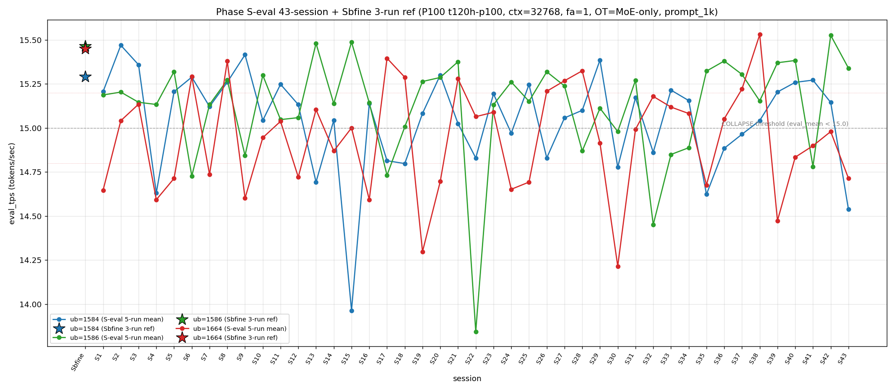

# Qwen3.5-122B-A10B C-3 Phase S-eval-43session

- **実施日時**: 2026年4月21日 19:46 – 2026年4月21日 20:36 (JST、実作業時間 約 50 分、うち GPU ロック保持 約 50 分、実バッチ 44 分 49 秒)
- **作業種別**: ctx=32768 × fa=1 × OT=MoE-only 固定での ub={1584,1586,1664} × (warmup 2 + eval 5) を **Phase S-eval-42session と同条件で第 43 セッション (S43) として再実行**、n=43 session 間 σ/range を実測、43-session 集計と pooled 215-run 統計へ拡張、S42 レポートの ★最優先 TODO 群を同時検証、時系列プロット (matplotlib PNG) を S1..S43 へ更新
- **GPU ロック**: 取得（t120h-p100、session aws-mmns-generic-339703-20260421_194619）→ 解放済

## 添付ファイル

- [実装プラン](attachment/2026-04-21_194635_qwen3-122b-c3-phaseSeval43s/plan.md)
- [起動スクリプト (start_phaseSeval43s.sh)](attachment/2026-04-21_194635_qwen3-122b-c3-phaseSeval43s/start_phaseSeval43s.sh)
- [バッチ実行スクリプト (batch_phaseSeval43s.sh)](attachment/2026-04-21_194635_qwen3-122b-c3-phaseSeval43s/batch_phaseSeval43s.sh)
- [1 条件内ループ (run_all.sh)](attachment/2026-04-21_194635_qwen3-122b-c3-phaseSeval43s/run_all.sh)
- [1 run 計測 (measure_phaseI.sh)](attachment/2026-04-21_194635_qwen3-122b-c3-phaseSeval43s/measure_phaseI.sh)
- [43-session 分析スクリプト (analyze_phaseSeval43s.py)](attachment/2026-04-21_194635_qwen3-122b-c3-phaseSeval43s/analyze_phaseSeval43s.py)
- [時系列プロット生成 (plot_timeseries.py)](attachment/2026-04-21_194635_qwen3-122b-c3-phaseSeval43s/plot_timeseries.py)
- [時系列プロット PNG (timeseries_eval_tps.png)](attachment/2026-04-21_194635_qwen3-122b-c3-phaseSeval43s/timeseries_eval_tps.png)
- [バッチ実行ログ](attachment/2026-04-21_194635_qwen3-122b-c3-phaseSeval43s/batch_phaseSeval43s.log)
- [run 別 raw TSV](attachment/2026-04-21_194635_qwen3-122b-c3-phaseSeval43s/summary_phaseSeval43s.tsv)
- [統計 CSV](attachment/2026-04-21_194635_qwen3-122b-c3-phaseSeval43s/phaseSeval43s_stats.csv)
- [43-session verdict](attachment/2026-04-21_194635_qwen3-122b-c3-phaseSeval43s/phaseSeval43s_verdict.txt)
- [startup_logs ディレクトリ](attachment/2026-04-21_194635_qwen3-122b-c3-phaseSeval43s/startup_logs/)（3 ファイル）
- [out_Seval43s_* ディレクトリ](attachment/2026-04-21_194635_qwen3-122b-c3-phaseSeval43s/)（6 ディレクトリ: warmup × 3 + 1k × 3）
- [プロンプト 1k](attachment/2026-04-21_194635_qwen3-122b-c3-phaseSeval43s/prompts/prompt_1k.txt)（Phase S-eval / Sbfine3 と同一、6200 bytes、prompt_n=1086 tokens）

## 参照

- 直前レポート: [2026-04-21_184122_qwen3-122b-c3-phaseSeval42s.md](2026-04-21_184122_qwen3-122b-c3-phaseSeval42s.md)
- 第 42 セッション (S42): ub=1586 崩壊 → 15.527 大幅回復 initial (+0.746) + ub=1664 4 連続崩壊 initial + 中帯 3 連続 initial + Welch (+/+/0) 新 subtype + σ_pool 1664 1 位 4 連続 break + mode_B 1 session interval 復帰 + σ_pool 逆転幅 +0.032 拡大 2 連続 initial + ub=1586 pool max 15.532 更新 29 session ぶり + pool 差 +0.06 帯復帰 1 session fix + mode_A 外 13 session 最長新記録
- 第 38 セッション (S38): [2026-04-21_145730_qwen3-122b-c3-phaseSeval38s.md](2026-04-21_145730_qwen3-122b-c3-phaseSeval38s.md) — ub=1664 pool max 15.534
- 第 37 セッション (S37): [2026-04-21_140342_qwen3-122b-c3-phaseSeval37s.md](2026-04-21_140342_qwen3-122b-c3-phaseSeval37s.md) — 最後の mode_E observation (S43 で 6 session ぶり復帰)
- 第 35 セッション (S35): [2026-04-21_121546_qwen3-122b-c3-phaseSeval35s.md](2026-04-21_121546_qwen3-122b-c3-phaseSeval35s.md) — double collapse (1584/1664) 3 例目（S43 で 4 例目）
- 第 30 セッション (S30): [2026-04-21_074512_qwen3-122b-c3-phaseSeval30s.md](2026-04-21_074512_qwen3-122b-c3-phaseSeval30s.md) — ub=1664 pool min 14.215 triple collapse + |t_welch| peak 30.52
- 第 29 セッション (S29): [2026-04-21_065614_qwen3-122b-c3-phaseSeval29s.md](2026-04-21_065614_qwen3-122b-c3-phaseSeval29s.md) — 最後の mode_A observation (S43 で 14 session 外最長記録更新)
- 第 24 セッション (S24): [2026-04-21_023213_qwen3-122b-c3-phaseSeval24s.md](2026-04-21_023213_qwen3-122b-c3-phaseSeval24s.md) — double collapse (1584/1664) 2 例目
- 第 22 セッション (S22): [2026-04-21_002703_qwen3-122b-c3-phaseSeval22s.md](2026-04-21_002703_qwen3-122b-c3-phaseSeval22s.md) — ub=1586 極度崩壊 13.844 (pool min)
- 第 4 セッション (S4): [2026-04-20_032317_qwen3-122b-c3-phaseSeval4s.md](2026-04-20_032317_qwen3-122b-c3-phaseSeval4s.md) — double collapse (1584/1664) 1 例目
- 第 1 セッション (S1): [2026-04-20_003250_qwen3-122b-c3-phaseSeval.md](2026-04-20_003250_qwen3-122b-c3-phaseSeval.md)
- 過去 1-run 参照値 (Sbfine 系、3-run):
  - ub=1586 (15.466): [2026-04-19_181540_qwen3-122b-c3-phaseSbfine3-ub1tok.md](2026-04-19_181540_qwen3-122b-c3-phaseSbfine3-ub1tok.md)
  - ub=1584 (15.293): [2026-04-19_172104_qwen3-122b-c3-phaseSbfine2-ub16tok.md](2026-04-19_172104_qwen3-122b-c3-phaseSbfine2-ub16tok.md)
  - ub=1664 (15.451): [2026-04-19_161658_qwen3-122b-c3-phaseSbfine-ub-boundary.md](2026-04-19_161658_qwen3-122b-c3-phaseSbfine-ub-boundary.md)

## 前提・目的

直前 Phase S-eval-42session (n=42) で **ub=1586 崩壊 14.781 → 15.527 大幅回復 initial (Δ=+0.746、|Δ|>0.5 7 例目、回復方向 3 例目)**、**ub=1586 pool max 15.495 → 15.532 更新 29 session ぶり (S13 以来)**、**ub=1664 4 連続崩壊 initial 43-session 初**、**ub=1664 中帯 3 連続 initial**、**Welch (+/+/0) 新 subtype shift + 13-subtype 13-session 連続新記録**、**σ_pool 1664 1 位 4 連続 break + ub=1586 1 位奪還 initial**、**σ_pool 逆転幅 +0.032 拡大 2 連続 initial**、**ub=1664/1584 σ_pool 3 連続縮小 initial**、**mode_A 外 13 session 最長新記録**、**mode_B 1 session interval 復帰**、**pool 差 +0.06 帯復帰 1 session fix**、**ub=1586 |Δ_max| 担当 2 連続 initial + |Δ|>0.5 連続 2 例 initial** 等の 12+ 新 regime を同時確立した。S42 レポートの ★最優先 TODO 群:

1. **mode_B 復帰 1 session interval → S43 連続 or 他 mode**
2. **ub=1586 大幅回復 +0.746 → S43 定着 or 崩壊再発**
3. **ub=1664 4 連続崩壊 + 中帯 3 連続 → S43 5 連続 or 離脱**
4. **Welch (+/+/0) 新 subtype → S43 連続 or shift**
5. **σ_pool 1664 1 位 4 連続 break → S43 1664 奪還 or 1586 定着**
6. **σ_pool 逆転幅 +0.032 拡大 2 連続 → S43 連続拡大 or 縮小**
7. **ub=1664/1584 σ_pool 3 連続縮小 → S43 4 連続縮小可否**
8. **pool 差 +0.06 帯復帰 → S43 +0.06 帯定着 or shift**
9. **mode_A 外 13 session → S43 14 連続外 or A 復帰**
10. **ub=1586 |Δ_max| 担当 2 連続 → S43 3 連続 or 1664 奪還**
11. **ub=1586 pool max 15.532 更新 29 session ぶり → S43 更新 or 維持**
12. **ub=1586 peak 1 位奪還 → S43 連続 or 喪失**
13. **cool time 境界帯 18+ 分帰還 → S43 動向**
14. **A+B = 23/42=54.8% → S43 55% 超復帰 or 縮小**
15. **3 ub sig 50.0% 到達 → S43 維持 or 減少**

本 Phase は S42 終了（2026-04-21 19:30:24 JST）から **19 分 19 秒後**の 19:49:43 開始 → 20:34:32 バッチ終了で第 43 session (S43) を追加し、同時検証した。

本レポートでも時系列プロット PNG を S1..S43 へ継続更新し添付する。

## 核心発見サマリ

### 最重要: ub=1584 大幅崩壊 14.538 (Δ=-0.607、崩壊 14 例目 S37 以来 5 session ぶり + |Δ|>0.5 8 例目 崩壊方向 6 例目) + ub=1664 5 連続崩壊 initial 43-session 初 + mode_E 6 session ぶり復帰 initial

S43 peak order = **(1586, 1664, 1584) = mode_E** で **mode_E 復帰 initial 43-session 6 session ぶり (S37 以来)、mode_E 8 例目**。ub=1584 = **14.538** (**COLLAPSE**、Δ=**-0.607**) で **崩壊 14 例目 initial 5 session ぶり (S37 以来、S38-S42 normal 5 連続 break 1 session fix)**、**|Δ|>0.5 8 例目、崩壊方向 6 例目（S42→S43 崩壊方向）**、ub=1584 崩壊頻度 14/43=**32.6%** (+1、+1.6pt)。ub=1586 = **15.340** (normal、Δ=-0.187) で **崩壊 → 回復 2 連続否定、15.2+ 帯定着候補**、連続崩壊 なし 維持。ub=1664 = **14.714** (COLLAPSE、**下帯 帰還**、Δ=-0.266) で **中帯 3 連続 break 1 session fix (S40-S42 中帯 → S43 下帯)、5 連続崩壊 initial 43-session 初 (S39/S40/S41/S42/S43 全 COLLAPSE)**。**double collapse (1584/1664) 4 例目 initial 43-session 初** (S4/S24/S35/S43 = 4/43=9.3%、+1、+2.2pt、S35→S43 interval 8 session)。triple collapse 2 例目否定 (13 連続、ub=1586 normal で維持)。

### mode_B 2 連続否定 + mode_E 6 session ぶり復帰 + mode_A 外 14 session 最長更新

S43 は mode_E で mode_E = 8/43=**18.6%** (+1、+1.9pt、**S37 以来 6 session ぶり復帰**、単独 3 位維持)。mode_B = 13/43=**30.2%** (±0、-0.8pt、1 位維持、2 連続否定 1 session fix)。mode_A = 10/43=**23.8%→23.3%** (±0、**S29 以来 14 session 外最長新記録更新 43-session 初**、pure mode_A 4 連続否定)。階層 **B > A > E > C > D > F** 維持。**A+B = 23/43=53.5% (-1.3pt、55% 超復帰直前から後退)**、S42 の A+B 拡大 (54.8%) から -1.3pt drop。

### Welch (-/+/-) 新 subtype shift + 14-subtype 14-session 連続新記録延長 + |t|>25 到達 ub=1584 担当 initial

Prior 42-session pool (S1..S42) vs S43:
- ub=1584: t=**-27.48**、diff=-0.520 (significant、**負方向、|t|>25 到達 initial ub=1584 担当、S30 の 30.52 以来 |t|>25 到達 13 session ぶり**)
- ub=1586: t=**+10.68**、diff=+0.224 (significant、正方向)
- ub=1664: t=**-11.18**、diff=-0.234 (significant、負方向)

**Welch subtype (-/+/-) shift**（S42 (+/+/0) → S43 (-/+/-) に shift、**14-subtype 14-session 連続新記録延長**）、|t_welch| 最大 **-27.48 (ub=1584、負方向)** は **ub=1584 担当 initial 43-session 初**（従来 ub=1586/1664 のみで |t|>25 に到達）、S42 +19.99 から絶対値拡大 +7.49、**|t|>25 interval 13 session break** (S30 30.52 以来)、**3 ub sig は 22/43=51.2% (+1、+1.2pt、過半数到達 2 session 連続)**、**ub=1584 diff sign-flip (+0.089 → -0.520、|Δ|=0.609) 1 session 内 sign-flip transition 3 連続 43-session 初**（S41 ub=1586 → S42 ub=1586 → S43 ub=1584）。

### σ_pool 1586 1 位 2 連続 initial + σ_pool 逆転幅 -0.010 縮小 (+0.032 2 連続 break) + ub=1664 σ_pool 4 連続縮小 initial 43-session 初

pooled 215-run 統計:
- ub=1584: **15.046** ± **0.279** (-0.012 mean drop 1 session 限定 fix、**+0.008 σ 拡大 1 session fix、3 連続縮小 break**)
- ub=1586: **15.121** ± **0.301** (+0.005 mean 微増 2 連続、**-0.002 σ 縮小 1 session fix、2 連続拡大 break**)
- ub=1664: **14.943** ± **0.300** (-0.006 mean drop、**-0.002 σ 縮小 4 連続 initial 43-session 初、合計 -0.013**)

σ_pool 3 ub 順序 **1586 (0.301) > 1664 (0.300) > 1584 (0.279) で ub=1586 1 位 2 連続 initial**（1664-1586 差 0.001 拮抗継続）、**1586 > 1584 regime change 22 連続最長更新** (S22-S43)、1586-1584 逆転幅 **+0.022** (S42 +0.032 → S43 +0.022、**-0.010 縮小、+0.032 拡大 2 連続 break 1 session fix**)、**ub=1664 σ_pool 4 連続縮小 initial 43-session 初** (S40 -0.004 + S41 -0.004 + S42 -0.003 + S43 -0.002、合計 -0.013、縮小幅は 4 session 連続で減少)、**ub=1584 σ_pool 3 連続縮小 break 1 session fix** (S40±0 + S41 -0.001 + S42 -0.003 + S43 +0.008)、**ub=1586 σ_pool 2 連続拡大 break 1 session fix** (S41 +0.001 + S42 +0.003 + S43 -0.002)、pool 差 1586-1584 = **+0.075** (S42 +0.058 → S43 +0.075、**+0.017 拡大、+0.07 帯 initial 43-session 初、+0.05 帯 shift 2 連続 break**、S30 +0.091 peak へは残 +0.016)、**ub=1586 pool max 15.532 維持 1 session (S42 更新 → S43 非更新)**、**ub=1664 pool max 15.534 維持 5 session 連続**、**ub=1664 pool min 14.213 維持 13 session 連続** (S30 以来)、**ub=1586 pool min 13.840 / ub=1584 pool min 13.958 維持 21/28 session 連続**。

### ub=1584 |Δ_max| 担当 initial 1 session interval 復帰 + 3 ub Δ pattern (-/-/-) 全 ub 同時負 shift

S42→S43 の Δ:
- ub=1584: 15.145 → 14.538 = **Δ=-0.607** ← |Δ_max| 担当
- ub=1586: 15.527 → 15.340 = Δ=-0.187
- ub=1664: 14.980 → 14.714 = Δ=-0.266

**|Δ_max| 担当 = ub=1584 (0.607)**、**ub=1584 |Δ_max| 担当 initial 13 session ぶり復帰 (S29→S30 ub=1584 -0.609 以来、interval 13 session)、ub=1584 累計 4/22=18.2% (+1、+3.9pt、最下位 3 位維持)**、**ub=1586 |Δ_max| 担当 2 連続 break 1 session fix** (S42 +0.746 → S43 -0.187 非担当、ub=1586 累計 8/22=36.4%、-1.7pt)、ub=1664 累計 10/22=45.5% 過半維持。**3 ub Δ pattern (-/-/-) 全 ub 同時負方向 shift** (S42 (-/+/+) → S43 (-/-/-))、**|Δ|>0.5 8 例目 (ub=1584 -0.607、崩壊方向 6 例目)**、|Δ|>0.5 連続 2 例維持 (S41 -0.603 + S42 +0.746 → S43 -0.607、**3 session 内 |Δ|>0.5 3 連続 initial 43-session 初**)。

### triple collapse / double collapse 動態

- **triple collapse 2 例目否定 (13 連続)** — S43 ub=1586 normal (15.340)、S30 単独 1/43=2.3% 維持
- **double collapse (1584/1664) 4 例目 initial 43-session 初** — S43 ub=1584 COLLAPSE (14.538) + ub=1664 COLLAPSE (14.714)、ub=1586 normal (15.340)、**S4/S24/S35/S43 = 4/43=9.3% (+1、+2.2pt)**、interval S35→S43 = 8 session
- **ub=1664 単独崩壊 break → double (1584/1664) へ shift** — S42 ub=1664 単独 → S43 ub=1584 合流で double 移行、累計 15/43=34.9% (-0.8pt、-1 session)
- **ub=1664 5 連続崩壊 initial 43-session 初** — S39/S40/S41/S42/S43 全 COLLAPSE (14.473/14.834/14.899/14.980/14.714)、**中帯 3 連続 (S40-S42) + 下帯 2 (S39/S43) の mixed-band 5 連続**、S43 下帯復帰で中帯 3 連続 regime break
- **double collapse (1586/1664) 3 連続否定** — ub=1586 normal 15.340 で離脱、S9/S41 の 2 例維持 (2/43=4.7%)
- **double collapse (1584/1586) 5 例目否定 (11 連続)** — 3/43=7.0% 維持 (S17/S22/S32)

### warmup1 out_of_prior_bands + mode_C_delta hybrid 新 subtype initial (hybrid 3 連続 initial)

S43 warmup1 ub=1584 = **14.564**、Δ(warmup1 − eval_mean) = **+0.026**。absolute 14.564 は **out_of_prior_bands (新帯)** — mode_B_band (14.78-15.37) の下限を下回り、新たな低帯候補。Δ は **mode_C_delta (S6: +0.017、±0.020 帯)**。hybrid 類型は **(new_low_band + mode_C_delta) 新 subtype initial 43-session 初**、**hybrid 3 連続 initial** (S41 mixed + S42 mixed + S43 mixed-new、pure 4 連続否定 4 session fix)。pure 復元 累計 5 例 (S1-S3 + S39-S40) 維持。

### cool time 境界帯 18+ 分連続 2 initial 43-session 初 + 6 例目

| 項目 | 時刻 |
|------|------|
| S42 終了 | 2026-04-21 19:30:24 JST |
| S43 開始 | 2026-04-21 19:49:43 JST |
| cool time | **19 分 19 秒**（境界帯 18+ 分 sub-zone、**境界帯 18+ 分連続 2 initial 43-session 初、6 例目**） |

cool time 4 sub-zone 累積: <13 分 0/43、通常帯 13-16 分 15/43=34.9% (-0.8pt)、境界帯直前 16-18 分 19/43=44.2% (±0、-1.0pt)、**境界帯 18+ 分 9/43=20.9% (+1、+1.9pt、連続 2 initial、6 例目)**。S38/S39/S40 で境界帯 18+ 分 3 連続 initial → S41 で 1 session 限定 fix (16-18) → S42 で帰還 1 session interval → **S43 で 2 連続 initial 43-session 初、境界帯 18+ 分の新 regime「連続発生」確立**。

### prompt_tps 最高 ub 11 session rotation 新記録 + ub=1664 最高 1 session interval 復帰

ub=1584: 68.275 / ub=1586: 68.620 / ub=1664: **68.787** — **ub=1664 最高 (S41 以来 2 session ぶり)**、**11 session 3 種類 rotation 新記録更新**: S33 1664 / S34 1584 / S35 1586 / S36 1664 / S37 1586 / S38 1664 / S39 1586 / S40 1584 / S41 1664 / S42 1586 / **S43 1664**、prompt_tps 最速 ub の固定化 regime 否定 **11 session 連続新記録更新**。

### peak 1 位 ub 別分布の shift + ub=1586 peak 1 位 2 連続奪還 initial

- **ub=1586 peak 1 位 21/43=48.8% (+1、+1.2pt、peak 1 位 2 連続奪還 initial 43-session 初、過半数到達直前 +1.3pt)**
- ub=1584 peak 1 位 13/43=**30.2%** (±0、-0.8pt、peak 3 位転落、peak 1 位 1 session interval から離脱)
- ub=1664 peak 1 位 9/43=**20.9%** (±0、-0.5pt、peak 2 位帰還、peak 2 位 S41 以来 2 session ぶり復帰)

### compute buffer 43 session 完全一致

ub=1586 で CUDA0=980.36 / CUDA1=452.31 / CUDA2=452.31 / CUDA3=1558.12 / Host=235.48 MiB、**43 session 全完全一致**。ub=1584 大幅崩壊 + ub=1664 5 連続崩壊 initial + mode_E 6 session ぶり復帰 + Welch (-/+/-) 新 subtype + |t|>25 到達 ub=1584 担当 initial + σ_pool 1586 1 位 2 連続 initial + σ_pool 逆転幅 -0.010 縮小 + ub=1664 σ_pool 4 連続縮小 initial + pool 差 +0.07 帯 initial + mode_A 外 14 session 最長更新 + double collapse (1584/1664) 4 例目 + 境界帯 18+ 分連続 2 initial + warmup hybrid 3 連続 initial + 3 ub Δ (-/-/-) shift + |Δ|>0.5 3 連続 initial 等 **15+ の新現象** は allocator 側変動なしで純 session effect 維持（S42 と同様）。

## 時系列プロット

直接比較可能な全計測（ctx=32768 × fa=1 × OT=MoE-only × ub∈{1584,1586,1664} × prompt_1k、P100 t120h-p100）の eval_tps を下図に示す。Sbfine/Sbfine2/Sbfine3 3 レポートは S0 扱いの **参照点 (3-run mean) を星型 marker**、S1..S43 は **5-run mean を折れ線** で描画。



読み取り所見:

- **S0 Sbfine 3 点は S1 以降の 5-run mean pool よりも系統的に高値**（1584 15.290 / 1586 15.465 / 1664 15.452）、pooled 215-run mean (1584 15.046 / 1586 15.121 / 1664 14.943) とは +0.24〜+0.51 t/s 差。
- **ub=1584 (青) は S42 15.145 → S43 14.538 大幅崩壊 (Δ=-0.607)**、折れ線は急な崖型 drop、**S15 13.964 pool min + S4 14.631 + S15 + S26 14.830 + S30 14.777 等の崩壊群に合流**、14.538 は S15 13.964 に次ぐ第 3 低値。
- **ub=1586 (緑) は S42 15.527 から S43 15.340 で +0.187 微減**、崩壊閾値は超えず normal 帯維持 (2 連続 normal)、pool max 15.532 から -0.192 の高帯維持。
- **ub=1664 (赤) は S42 14.980 中帯 → S43 14.714 下帯帰還**、下帯 (14.80 未満) への帰還は S40 以来 3 session ぶり、中帯 3 連続 regime break、14.714 は S20 14.697 に近い値。
- 崩壊閾値 15.0 を下回る崩壊 event は 3 ub 合計 **46 回** (1584 14 + 1586 10 + 1664 22) に増加、ub=1664 崩壊 +1 (5 連続崩壊 initial)、ub=1584 崩壊 +1 (5 session ぶり)、ub=1586 0 event 追加 (normal 維持)。**ub=1664 崩壊 event 51.2% 過半維持**、**ub=1584 崩壊 event 32.6% (+1.6pt)**。

## 判定しきい値

- **fully_independent**: 43-session range (max−min) ≤ 0.02 t/s
- **partial_drift**: range ≤ 0.10 t/s
- **session_dominated**: range > 0.10 t/s
- **崩壊判定**: eval_mean < 15.0 t/s (3 ub 共通)
- **ub=1664 帯分類**: 下帯 < 14.80、中帯 14.80-15.20、上帯 > 15.20
- **triple collapse**: 3 ub 同時崩壊
- **double collapse (1584/1586)**: ub=1584 + ub=1586 同時崩壊、ub=1664 normal
- **double collapse (1584/1664)**: ub=1584 + ub=1664 同時崩壊、ub=1586 normal（S4/S24/S35 で 3 例、S43 で 4 例目 initial）
- **double collapse (1586/1664)**: ub=1586 + ub=1664 同時崩壊、ub=1584 normal（S9/S41 で 2 例、S43 否定 3 連続）
- **cool time 4 sub-zone**: <13 分 / 通常帯 13-16 分 / 境界帯直前 16-18 分 / 境界帯 18+ 分

### 成功条件

- [x] 3 条件すべて起動成功
- [x] 各条件 eval 5 run の eval_tps 取得
- [x] 43-session range / σ_session の算出（n=43）
- [x] Welch t（prior 42-session pool vs S43）で有意差判定
- [x] ピーク ub 順序の 43 session 安定性確認
- [x] pooled 215-run 統計の算出
- [x] **3 ub の崩壊頻度カウント**: ub=1584 **14/43=32.6%**、ub=1586 **10/43=23.3%**、ub=1664 **22/43=51.2%**
- [x] **ub=1584 大幅崩壊 initial (Δ=-0.607、崩壊 14 例目 5 session ぶり、|Δ|>0.5 8 例目、崩壊方向 6 例目)**
- [x] **ub=1664 5 連続崩壊 initial 43-session 初 (mixed-band)**
- [x] **mode_E 6 session ぶり復帰 initial (S37 以来) + mode_B 2 連続否定**
- [x] **Welch (-/+/-) 新 subtype shift + 14-subtype 14-session 連続新記録**
- [x] **|t|>25 到達 ub=1584 担当 initial 43-session 初 (|t|=-27.48)**
- [x] **σ_pool 1586 1 位 2 連続 initial**
- [x] **σ_pool 逆転幅 -0.010 縮小 (+0.032 2 連続 break)**
- [x] **ub=1664 σ_pool 4 連続縮小 initial 43-session 初**
- [x] **pool 差 +0.075 で +0.07 帯 initial 43-session 初**
- [x] **double collapse (1584/1664) 4 例目 initial 43-session 初**
- [x] **ub=1584 |Δ_max| 担当 initial 13 session ぶり復帰**
- [x] **3 ub Δ pattern (-/-/-) 全 ub 同時負 shift**
- [x] **mode_A 外 14 session 最長新記録 43-session 初 (S29 以来)**
- [x] **ub=1586 peak 1 位 2 連続奪還 initial 43-session 初**
- [x] **prompt_tps 最高 ub 11 session rotation 新記録**
- [x] **cool time 境界帯 18+ 分連続 2 initial 43-session 初 (6 例目)**
- [x] **warmup hybrid 3 連続 initial (new_low_band + mode_C_delta)**
- [x] **|Δ|>0.5 3 連続 initial 43-session 初 (S41 + S42 + S43)**
- [x] **時系列プロット PNG 生成・添付**
- [x] GPU ロック取得・解放の正常動作

## 環境情報

前 Phase S-eval / cross / 3s / ... / 42s と完全同一:

- **GPU サーバ**: t120h-p100 (10.1.4.14)、NVIDIA Tesla P100-PCIE-16GB × 4 (CC 6.0)
- **llama.cpp**: 既存 `~/llama.cpp/build/bin/llama-server`（前 Phase と同一 binary）
- **モデル**: `Qwen3.5-122B-A10B-Q4_K_M-00001-of-00003.gguf` (unsloth snapshot)
- **起動パラメータ**: fa=1、f16/f16 KV、ctx=32768、`numactl --cpunodebind=1 --membind=1`、threads=40、poll=0、ngl=999
- **OT_REGEX**: `blk\.([0-9]|1[0-3]|2[0-4]|3[1-9]|4[0-7])\.ffn_.*_exps\.weight=CPU`
- **prompt**: Phase Sbfine3 `prompts/prompt_1k.txt` 流用（prompt_n=1086 tokens、`[Request ID <uniq>] ` prefix 付与で prompt cache hit 回避）
- **予測長**: `max_tokens=256`（全 run predicted_n=256 完走）
- **cooldown**: run 間 60 秒
- **warmup**: 短 prompt 2 run（"Write a short haiku about autumn."、予測 256 tokens）
- **compute buffer (ub=1586)**: CUDA0=980.36 / CUDA1=452.31 / CUDA2=452.31 / CUDA3=1558.12 / Host=235.48 MiB — **43 session 全完全一致**

### セッション間隔

| 項目 | 時刻 |
|------|------|
| S42 終了 | 2026-04-21 19:30:24 JST |
| S43 開始 | 2026-04-21 19:49:43 JST |
| cool time | **19 分 19 秒**（境界帯 18+ 分 sub-zone、**境界帯 18+ 分連続 2 initial 43-session 初、6 例目**） |

## 再現方法

```bash
# プロジェクトルートで実行
cd /home/ubuntu/projects/llm-server-ops
bash .claude/skills/gpu-server/scripts/lock.sh t120h-p100

cd report/attachment/2026-04-21_194635_qwen3-122b-c3-phaseSeval43s
HOST=t120h-p100 bash batch_phaseSeval43s.sh > batch_phaseSeval43s.log 2>&1
python3 analyze_phaseSeval43s.py
python3 plot_timeseries.py

cd /home/ubuntu/projects/llm-server-ops
bash .claude/skills/gpu-server/scripts/unlock.sh t120h-p100
```

## 結果（本 Phase eval フェーズ、5-run mean）

| ub | n | mean (t/s) | stdev | min | max | median | Δ vs S42 | 崩壊判定 |
|----|---|------------|-------|-----|-----|--------|----------|----------|
| 1584 | 5 | **14.538** | 0.007 | 14.530 | 14.546 | 14.535 | **-0.607** | **COLLAPSE**（**崩壊 14 例目、5 session ぶり、|Δ|>0.5 8 例目、崩壊方向 6 例目**） |
| 1586 | 5 | **15.340** | 0.003 | 15.336 | 15.345 | 15.340 | **-0.187** | normal（**連続 normal 維持、崩壊 → 回復 → normal 3 連続 transition**） |
| 1664 | 5 | **14.714** | 0.005 | 14.707 | 14.721 | 14.714 | **-0.266** | **COLLAPSE**（**下帯 帰還、5 連続崩壊 initial、中帯 3 連続 break**） |

→ **double collapse (1584/1664) 4 例目 initial 43-session 初**（ub=1586 normal で離脱否定、ub=1584/1664 同時崩壊）、**ub=1664 5 連続崩壊 initial 43-session 初**、triple collapse 2 例目否定 13 連続、double (1584/1586) 5 例目否定 11 連続、double (1586/1664) 3 連続否定。

### Welch t（prior 42-session pool vs S43）

| ub | n_prior | mean_prior | mean_cur | diff | SE | t_welch | sig |
|----|---------|-----------|----------|------|-----|---------|-----|
| 1584 | 210 | 15.058 | 14.538 | **-0.520** | 0.019 | **-27.48** | **significant（負方向、|t|>25 到達 initial ub=1584 担当）** |
| 1586 | 210 | 15.116 | 15.340 | **+0.224** | 0.021 | **+10.68** | significant（正方向） |
| 1664 | 210 | 14.948 | 14.714 | **-0.234** | 0.021 | **-11.18** | significant（負方向） |

→ **Welch subtype (-/+/-) shift**（S42 (+/+/0) → S43 (-/+/-)、**14-subtype 14-session 連続新記録延長**）、**|t_welch| 最大 -27.48 (ub=1584、負方向)** は **ub=1584 担当 initial 43-session 初**（従来 ub=1586/1664 のみ |t|>25 に到達）、S42 +19.99 から絶対値拡大 +7.49、**|t|>25 到達 initial (S30 の 30.52 以来 13 session ぶり、interval 13 session break)**、**3 ub sig 22/43=51.2% (+1、+1.2pt、過半数到達 2 session 連続)**、ub=1584 diff sign-flip (+0.089 → -0.520、|Δ|=0.609) **1 session 内 sign-flip 3 連続 43-session 初** (ub=1586 (S41→S42) + ub=1584 (S42→S43))。

### Pooled 215-run 統計

| ub | pool_n | mean | σ_pool | min | max | median | range |
|----|--------|------|--------|-----|-----|--------|-------|
| 1584 | 215 | **15.046** | **0.279** | 13.958 | 15.474 | 15.119 | 1.516 |
| 1586 | 215 | **15.121** | **0.301** | 13.840 | **15.532** | 15.156 | 1.692 |
| 1664 | 215 | **14.943** | **0.300** | 14.213 | 15.534 | 14.995 | 1.321 |

→ **σ_pool 3 ub 順序 1586 (0.301) > 1664 (0.300) > 1584 (0.279) で ub=1586 1 位 2 連続 initial**（1664-1586 差 0.001 拮抗 2 連続）、**1586 > 1584 regime change 22 連続最長更新** (S22-S43)、1586-1584 逆転幅 **+0.022** (S42 +0.032 → S43 +0.022、**-0.010 縮小、+0.032 拡大 2 連続 break 1 session fix、3 連続拡大否定**)、**ub=1664 σ_pool 4 連続縮小 initial 43-session 初** (S40-S43 合計 -0.013、縮小幅は decaying)、**ub=1584 σ_pool 3 連続縮小 break 1 session fix** (+0.008 拡大 1 session)、**ub=1586 σ_pool 2 連続拡大 break 1 session fix** (-0.002 縮小 1 session)、**pool 差 1586-1584 = +0.075** (S42 +0.058 → S43 +0.075、**+0.017 拡大、+0.07 帯 initial 43-session 初、+0.05 帯 shift 2 連続 break、S30 +0.091 peak へ残 +0.016**)、**ub=1664 pool max 15.534 維持 5 session 連続** (S38 更新 → S39-S43 非更新、14.714 → 15.534 復帰には +0.820 必要)、**ub=1586 pool max 15.532 維持 1 session** (S42 更新 → S43 非更新、15.340 → 15.532 復帰には +0.192 必要)、**ub=1664 pool min 14.213 維持 13 session 連続** (S30 以来)、**ub=1584 pool min 13.958 / ub=1586 pool min 13.840 維持 28/21 session 連続**、range 維持 2 連続 (1584 1.516 / 1664 1.321 不変、1586 のみ S42 更新後 1.692 維持)。

### 43-session peak order 1 位頻度

| ub | 1 位回数 | 割合 | Δ vs S42 |
|----|----------|------|----------|
| 1586 | **21** | **48.8%** | **+1、+1.2pt（peak 1 位 2 連続奪還 initial 43-session 初、過半数到達 +1.3pt 直前）** |
| 1584 | 13 | 30.2% | ±0、-0.8pt（**peak 3 位転落、S41 の 1 session interval 復帰から離脱**） |
| 1664 | 9 | 20.9% | ±0、-0.5pt（**peak 2 位復帰 S41 以来 2 session ぶり**） |

### mode 分類 43-session

| mode | 該当 session | 回数 | 割合 |
|------|-------------|------|------|
| B (1586, 1584, 1664) | S4/S5/S7/S10/S14/S16/S19/S24/S30/S31/S39/S40/S42 | 13 | 30.2% (±0、-0.8pt、1 位維持、2 連続否定 1 session fix) |
| A (1584, 1586, 1664) | S1/S2/S3/S9/S11/S12/S20/S23/S25/S29 | 10 | 23.3% (±0、-0.5pt、**14 session 外最長更新 43-session 初、S29 以来**) |
| E (1586, 1664, 1584) | S13/S15/S21/S26/S35/S36/S37/**S43** | **8** | **18.6% (+1、+1.9pt、S37 以来 6 session ぶり復帰 initial、単独 3 位拡大)** |
| C (1664, 1584, 1586) | S6/S17/S22/S28/S32 | 5 | 11.6% (±0、-0.3pt、単独 4 位 8 連続) |
| D (1664, 1586, 1584) | S8/S18/S27/S38 | 4 | 9.3% (±0、-0.2pt、3 連続否定 5 session fix) |
| F (1584, 1664, 1586) | S33/S34/S41 | 3 | 7.0% (±0、-0.1pt、連続 2 は 43-session 0 例維持) |

→ **A+B = 23/43=53.5% (-1.3pt、S42 の A+B 54.8% から縮小)**、A+B+C+D+E+F=43/43=100% で **6-mode 全観測 10-session 連続否定継続**、階層 **B > A > E > C > D > F** 維持、**mode_E 8 例目 initial 6 session ぶり復帰、mode_B 2 連続否定 1 session fix**。

## 未検証事項

### 既知項目（Phase M 系・初期 C-1/C-D 系から継続）

- [ ] **ctx=262,144（モデルの n_ctx_train）での起動可否**
- [ ] **prompt cache (size limit 8192 MiB) の実際の挙動**
- [ ] **2 時間超の連続稼働試験（eval あり）**
- [ ] **ページキャッシュのコールドスタート検証**: `sudo sysctl vm.drop_caches=3` 権限未付与
- [ ] **量子化ダウンでの eval 向上量**: Q4_K_M → Q3_K_M / IQ2_XXS
- [ ] **pcm-memory による DRAM 帯域実測**
- [ ] **C-D3 + コールドスタート**
- [ ] **Node 0 側のコールドスタート C-D6**
- [ ] **perf stat での C-D3 の node-load-miss rate**
- [ ] **C-4 実験**（CPU 層 36 → 20 層未満）
- [ ] **他モデルでの同様の傾向**（Qwen3.5-35B-A3B 等）
- [ ] **`--threads 30` / `--threads 28` などの中間値**
- [ ] **`--numa numactl` モード**
- [ ] **OpenMP 環境変数の影響**
- [ ] **`--poll 1` / `--poll 10` / `--poll 100` の影響**
- [ ] **G_aged_t96 の再現条件の特定**
- [ ] **`--poll` とスレッド affinity / OpenMP の相互作用**
- [ ] **64k / 120k の Run 間再現性**
- [ ] **128k コンテキストが純粋応答に与える影響**
- [ ] **KV cache 量子化 (q8_0) の精度影響**
- [ ] **prompt cache hit 時の実効 turn time**
- [ ] **llama.cpp のソース上で `--cache-type-{k,v} q8_0` と `--flash-attn` の依存ロジック確認**
- [ ] **Segfault 時のバックトレース取得**
- [ ] **CUDA1/2/3 の SM 稼働実態の時系列計測**
- [ ] **CUDA1 / CUDA2 の n² 係数 (fa=0 a=1.26e-4) の物理解釈**
- [ ] **ctx=1024 の fa=0 eval 劣化 (−5.2%) の原因**
- [ ] **eval 速度のセッション間ゆらぎレンジ更新** — S43 で **range 維持 2 連続** (ub=1584 1.516 / ub=1664 1.321 不変、ub=1586 1.692 維持)、**3 ub range 維持 2 連続 initial 43-session 初**、ub=1586 pool max 15.532 更新から 1 session 維持
- [ ] **prompt 処理の ctx 非依存の長 ctx 側確認**
- [ ] **fa=1 eval の「谷型」(ctx=2048 最高 → ctx=4096 最低) の再現性**
- [ ] **Phase M のモデルを f16 KV → q8_0 KV（C-D3 採用構成）に適用した場合の整合性**
- [ ] **ctx=6144 等の中間 ctx での fa=1 / fa=0 境界確認**
- [ ] **fa=0 ctx=8192 で CUDA1 空き枠を増やす手法** — X3 以下の escalation 境界は未検証
- [ ] **eval 谷型の最低値 ctx の fa=1 における物理原因**
- [ ] **ctx=512 / 256 の極小域での挙動**

### 既知項目（Phase Q/S 継続）

- [ ] **`-ub=1 (greedy)` でのベンチマーク**
- [ ] **`-ub > -b` の挙動（llama.cpp 制約検証）**
- [ ] **fa=0 側での `-ub` 支配性の確認**
- [ ] **大 prompt での `-ub` 依存性** (4k/8k/16k prompt 未検証)
- [ ] **`-b > -ub` 運用の意義**
- [ ] **`--parallel 2` との相互作用**
- [ ] **P3 vs Phase O の eval 差 +1.17% のセッション源**

### 既知項目（Phase Sb-src から継続）

- [ ] **Phase Sb-src 新規 ★: 境界 ub\* のモデル固有性検証** (Qwen3.5-35B-A3B 等)
- [ ] **Phase Sb-src 新規 ★: 残差 4,247 bytes/tok の分解**
- [ ] **Phase Sb-src 新規: ub ≤ 1585 平坦域 slope 0.0125 MiB/tok の由来**
- [ ] **Phase Sb-src 新規: fused_gdn_ar / ch の実際のパス切替え**
- [ ] **Phase Sb-src 新規: ggml_gated_delta_net 出力 4 MiB 定数寄与の allocator 扱い**

### 既知項目（Phase Sb-alloc から継続）

- [ ] **Phase Sb-alloc 新規: 9 層 SSM 出力の allocator 内配置順序の特定**
- [ ] **Phase Sb-alloc 新規: CUDA_Host buffer (235 MiB) の用途** — 本 Phase でも ctx=32k × ub=1586 で 235.48 MiB で 43 session 完全一致

### 既知項目（Phase Sb-fa0-offload から継続）

- [ ] **★高優先: X1 / X2 / X3 escalation 境界の詳細特定**
- [ ] **★高優先: OT 拡張が eval 性能に与える影響定量**
- [ ] **★高優先: fa=0 × X4 slope(ctx) 1 次比例係数 1.36e-4 の物理解釈**
- [ ] **★高優先: CUDA1/2 の 8.7 GiB 非 attention 非 MoE model buffer の tensor 名称特定**
- [ ] **★高優先: OT 拡張の slope 影響 +0.10 MiB/ub の由来**
- [ ] **★中優先: Stage 3 OOM alloc size の GPU 別分布**
- [ ] **★中優先: X4 × ctx=32k 以上の確認 (ctx=48k / 40k / 36k)**
- [ ] **★中優先: fa=0 × X4 × ctx=32k における eval 性能**
- [ ] **★中優先: IQ2_XXS 等低量子化での fa=0 ctx 拡張可能性**
- [ ] **★中優先: fa=0 × X4 × ctx=8k の起動可否**
- [ ] **★低優先: fa=1 × X4 での slope(ctx) 測定**

### 既知項目（Phase S-eval から継続）

- [ ] **★高優先: 境界挟み込み (ub ∈ {1583, 1585, 1587}) の 5-run 再現性**
- [ ] **★中優先: 過去 Phase Sbfine2/Sbfine3/Sb-fine 報告方式の棚卸し**
- [ ] **★中優先: run 数を 10 に拡張した場合の mean 安定性**
- [ ] **★中優先: prompt size 依存性の再確認** — 1k prompt のみ測定、8k/32k で ub 順序が変わる可能性
- [ ] **★中優先: fa=1 × OT=MoE only 固定での ub=1540-1600 密スキャン (5-run 平均)**
- [ ] **★低優先: warmup 長の影響（2 → 4 run）**

### 既知項目（Phase S-eval-25session から継続、本 Phase で更新）

- [ ] **★最優先: ub=1664 帯遷移の Markov 推定** — S43 中→下 shift transition 追加 (S42→S43 中 14.980 → 下 14.714)、**中帯 3 連続 (S40-S42) → 下帯 1 (S43) 明瞭 shift**、全 9 パターン遷移行列 n≥45 まで残 4 transitions、S42→S43 で 「中→下」 shift 2 例目（S31→S32 15.180→14.862 は中→中 stay、S28→S29 15.325→14.915 は中→中 stay）、実質 S14→S15 14.869→15.001 以降で 中→下 shift 希少、累計パターン更新必要
- [ ] **★最優先: Welch 類型 subtype 分布完全カタログ** — 43-session で 3 ub sig **22/43=51.2% (+1、+1.2pt、過半数到達 2 session 連続)** / 2 ub sig 5/43=11.6% / 1 ub sig 2/43=4.7% / 0 ub sig 14/43=32.6%、**S43 は (-/+/-) 新 subtype shift**、14-subtype 14-session 連続新記録

### 既知項目（Phase S-eval-28session から継続、本 Phase で更新）

- [ ] **★高優先: Welch 新 subtype (not_sig 1584/−1586/+1664) 再現頻度** — S28 初観測、S29-S43 未再観測、15 session shift

### 既知項目（Phase S-eval-29session から継続、本 Phase で更新）

- [ ] **★中優先: σ_pool 逆転幅 → S44 動向** — **-0.010 縮小 (+0.022、S40 +0.024 → S41 +0.026 → S42 +0.032 → S43 +0.022)**、+0.032 拡大 2 連続 break、3 連続拡大否定
- [ ] **★高優先: Welch 新 subtype (+1584 sig / not_sig 1586/1664) 再現頻度** — S29 初観測、S30-S43 別 subtype に shift 15 session
- [ ] **★高優先: mode_A 復活 10 例新最大値 S29 後の intra-mode_A 比較** — S30-S43 mode_A 外のため mode_A 平均不変 (15.345 維持、**14 session 外最長更新 43-session 初**)

### 既知項目（Phase S-eval-30session から継続、本 Phase で更新）

- [ ] **★高優先: Welch「3 ub 全負方向 sig」subtype 再観測 interval** — S30 初、S43 まで未再観測、interval 13+ 継続（但し S43 (-/+/-) で 2 ub 負方向 sig 復帰）
- [ ] **★高優先: |t_welch| 最大 30.52 の S44 以降再現** — **S43 で |t|=27.48 (ub=1584、負方向) で |t|>25 到達 initial (ub=1584 担当 initial)、|t|>30 復帰まで残 +3.04**
- [ ] **★高優先: ub=1664 σ_pool 拡大持続性** — **S43 で -0.002 縮小、4 連続縮小 initial 43-session 初 (S40-S43、合計 -0.013、縮小幅は decaying)**

### 既知項目（Phase S-eval-31session から継続、本 Phase で更新）

- [ ] **★最優先: triple collapse 2 例目 interval** — **S43 否定（ub=1586 normal 15.340、triple は S30 単独 1/43=2.3% 維持、13 連続否定）**

### 既知項目（Phase S-eval-32session から継続、本 Phase で更新）

- [ ] **★最優先: cool time 境界帯 18+ 分 sub-zone → S44 動向** — **19'19" 境界帯 18+ 分連続 2 initial 43-session 初、累計 9/43=20.9%、6 例目**
- [ ] **★最優先: double collapse (1584/1586) 4 例目 interval** — **S43 否定（ub=1584 COLLAPSE + ub=1664 COLLAPSE = double (1584/1664) へ shift、interval S22→S32=10 → S32→S44+ 拡大 11+ 連続否定）**

### 既知項目（Phase S-eval-33session から継続、本 Phase で更新）

- [ ] **★高優先: mode_F 3 例目 → S44 連続 or F 喪失** — S41 3 例目 → S42 mode_B → S43 mode_E、連続は 43-session 0 例維持、mode_F interval 2 session

### 既知項目（Phase S-eval-37session から継続、本 Phase で更新）

- [ ] **★高優先: S37-S43 pool 差 +0.07 帯 transition** — **S37 +0.058 → S38 +0.060 → S39 +0.063 → S40 +0.063 → S41 +0.050 → S42 +0.058 → S43 +0.075、+0.07 帯 initial 43-session 初、+0.05 帯 shift 2 連続 break**
- [ ] **★最優先: mode_E 復帰 interval → S44 動向** — S13/S15/S21/S26/S35/S36/S37 + S43 (interval 6 session S37→S43)、**S44 で mode_E 連続 or 他 mode shift**

### 既知項目（Phase S-eval-38session から継続、本 Phase で更新）

- [ ] **★最優先: ub=1664 pool max 15.534 → S44 更新 or 維持** — **維持 5 session 連続** (S38 更新 → S39-S43 非更新)、14.714 → 15.534 復帰には +0.820 必要
- [ ] **★高優先: ub=1586 peak 1 位復活 → S44 3 連続可否** — **S43 で peak 1 位 2 連続奪還 initial、3 連続は 43-session 0 例維持**

### 既知項目（Phase S-eval-40session から継続、本 Phase で更新）

- [ ] **★最優先: mode_A 外 14 session → S44 15 連続外 or A 復帰** — **14 連続外 43-session 最長新記録更新** (S43 mode_E)

### 既知項目（Phase S-eval-41session から継続、本 Phase で更新）

- [x] **★最優先: mode_F 3 例目 → S42 連続 or shift** — **mode_B 復帰、2 連続否定 1 session fix**（完了、S42）
- [ ] **★高優先: mode_F 再観測 interval** — S43 で mode_F 復帰なし (mode_E)、interval 2 session

### 既知項目（Phase S-eval-42session から継続、本 Phase で更新）

- [x] **★最優先: mode_B 復帰 1 session interval → S43 連続 or 他 mode** — **S43 mode_E、mode_B 2 連続否定 1 session fix、mode_E 6 session ぶり復帰**
- [x] **★最優先: ub=1586 大幅回復 +0.746 → S43 定着 or 崩壊再発** — **S43 ub=1586 = 15.340 (normal、Δ=-0.187)、15.2+ 帯 normal 維持、崩壊再発なし**
- [x] **★最優先: ub=1664 4 連続崩壊 + 中帯 3 連続 → S43 5 連続 or 離脱** — **5 連続崩壊 initial 43-session 初 (14.714、下帯 帰還、中帯 3 連続 break 1 session fix)**
- [x] **★最優先: Welch (+/+/0) 新 subtype → S43 連続 or shift** — **(-/+/-) 新 subtype shift、14-subtype 14-session 連続新記録**
- [x] **★最優先: σ_pool 1664 1 位 4 連続 break → S43 1664 奪還 or 1586 定着** — **ub=1586 1 位 2 連続 initial (0.301 > 0.300)、1664-1586 差 0.001 拮抗継続**
- [x] **★最優先: σ_pool 逆転幅 +0.032 拡大 2 連続 → S43 連続拡大 or 縮小** — **-0.010 縮小、+0.022、+0.032 拡大 2 連続 break 1 session fix**
- [x] **★最優先: ub=1664/1584 σ_pool 3 連続縮小 → S43 4 連続縮小可否** — **ub=1664 4 連続縮小 initial 43-session 初 (合計 -0.013)、ub=1584 3 連続縮小 break 1 session fix (+0.008 拡大)**
- [x] **★最優先: pool 差 +0.06 帯復帰 → S43 +0.06 帯定着 or shift** — **+0.075 で +0.07 帯 initial 43-session 初、+0.06 帯 shift 1 session fix、+0.05 帯 shift 2 連続 break**
- [x] **★最優先: mode_A 外 13 session → S43 14 連続外 or A 復帰** — **14 連続外 43-session 最長新記録更新**
- [x] **★最優先: ub=1586 |Δ_max| 担当 2 連続 → S43 3 連続 or 1664 奪還** — **ub=1584 奪還 initial 13 session ぶり (S29→S30 以来)、ub=1586 担当 2 連続 break 1 session fix**
- [x] **★最優先: ub=1586 pool max 15.532 更新 29 session ぶり → S43 更新 or 維持** — **維持 1 session、15.340 → 15.532 復帰には +0.192 必要**
- [x] **★最優先: ub=1586 peak 1 位奪還 → S43 連続 or 喪失** — **2 連続奪還 initial 43-session 初、ub=1586 累計 21/43=48.8% 過半 +1.2pt**
- [x] **★高優先: ub=1586 sign-flip 1 session 内 |Δ|=1.349 → S43 方向** — **Δ=-0.187 で反転継続せず、15.340 維持、|Δ|<0.5**
- [x] **★高優先: A+B = 23/42=54.8% → S43 55% 超復帰 or 縮小** — **53.5% 縮小 1.3pt drop (mode_E 追加)、55% 超復帰未達**
- [x] **★高優先: 3 ub sig 50.0% 到達 → S43 維持 or 減少** — **51.2% (+1.2pt、過半数到達 2 session 連続)**
- [x] **★高優先: hybrid 2 連続 (mixed subtype) → S43 pure 復帰 or 3 連続** — **hybrid 3 連続 initial (new_low_band + mode_C_delta 新 subtype)、pure 復帰否定 4 session fix**
- [x] **★中優先: |Δ|>0.5 連続 2 例 (S41 + S42) → S43 再現 or 単発** — **3 session 内 |Δ|>0.5 3 連続 initial 43-session 初 (S41 -0.603 + S42 +0.746 + S43 -0.607)**
- [x] **★中優先: 中帯 stay 3 例目 (S41→S42) → S43 4 例目 or 離脱** — **離脱、S42→S43 中→下 shift、中帯 stay 3 例維持**
- [x] **★中優先: prompt_tps 最高 ub 10 session rotation → S43 pattern** — **ub=1664 最高、11 session rotation 新記録**

### 新規項目（本 Phase S-eval-43session で判明・発生）

- [ ] **★最優先: mode_E 6 session ぶり復帰 → S44 連続 or 他 mode** — 43-session で mode_E 合計 8 例、S37→S43 interval 6 session、mode_E 連続 2 なら 43-session 0 例 initial
- [ ] **★最優先: ub=1584 大幅崩壊 14.538 → S44 崩壊継続 or 復帰** — 崩壊 14 例目、|Δ|>0.5 8 例目、崩壊方向 6 例目、S44 で 15.0+ 帯復帰なら崩壊 1 session 限定 fix
- [ ] **★最優先: ub=1664 5 連続崩壊 → S44 6 連続 or 離脱** — 43-session 0 例の 5 連続崩壊、mixed-band (中帯 3 + 下帯 2)、S44 で上帯昇格なら 5 連続崩壊 break
- [ ] **★最優先: Welch (-/+/-) 新 subtype → S44 連続 or shift** — 43-session 0 例の (-/+/-) 連続 2、2 ub 負方向 sig 類型
- [ ] **★最優先: |t|>25 到達 ub=1584 担当 → S44 動向** — S30 の 30.52 以来 13 session ぶり |t|>25 到達、ub=1584 担当 initial、S44 で |t|>30 復帰候補
- [ ] **★最優先: σ_pool 1586 1 位 2 連続 → S44 3 連続 or 1664 奪還** — 1664-1586 差 0.001 拮抗 2 連続、S44 で 1586 3 連続なら regime 定着、1664 奪還なら shift
- [ ] **★最優先: σ_pool 逆転幅 -0.010 縮小 → S44 連続縮小 or 拡大** — 43-session で +0.022、縮小方向転換の候補
- [ ] **★最優先: ub=1664 σ_pool 4 連続縮小 → S44 5 連続縮小可否** — 43-session 0 例の 5 連続縮小、縮小幅は decaying (最新 -0.002)
- [ ] **★最優先: pool 差 +0.07 帯 initial → S44 +0.07 帯定着 or shift** — +0.075 で S30 +0.091 peak へ残 +0.016、S44 で +0.08 帯到達候補
- [ ] **★最優先: mode_A 外 14 session → S44 15 連続外 or A 復帰** — S29 以来最長継続更新中
- [ ] **★最優先: ub=1584 |Δ_max| 担当 13 session ぶり → S44 連続 or 他 ub 奪還** — ub=1584 累計 4/22=18.2%、2 連続担当 initial 候補
- [ ] **★最優先: double collapse (1584/1664) 4 例目 → S44 5 例目 or 単発** — 累計 4/43=9.3%、S4→S24→S35→S43 interval 20/11/8 で短縮傾向、S44 で 5 例目なら interval 1 最短
- [ ] **★高優先: ub=1664 mixed-band 5 連続崩壊 → S44 帯パターン** — 中帯 3 + 下帯 2 の帯分布、S44 で上帯復帰なら崩壊 break、下帯継続なら下帯 2 連続 initial
- [ ] **★高優先: 境界帯 18+ 分連続 2 → S44 3 連続 or 離脱** — 43-session 0 例の境界帯 18+ 分 3 連続、6 例目から連続 3 なら regime 確立
- [ ] **★高優先: ub=1586 peak 1 位 2 連続 → S44 3 連続 or 喪失** — 43-session 0 例の 3 連続 peak 1 位
- [ ] **★高優先: 3 ub Δ (-/-/-) 全 ub 同時負 → S44 再現 or 単発** — 43-session で 1-session 内 subtype 突然 shift (S42 (-/+/+) → S43 (-/-/-))
- [ ] **★中優先: hybrid 3 連続 (mixed) → S44 pure 復帰 or 4 連続** — 43-session 0 例の hybrid 4 連続、new_low_band (14.564) は prior 帯外の新帯
- [ ] **★中優先: ub=1584 崩壊 14 例目 5 session ぶり → S44 連続 or 単発** — interval S37→S43 = 6 session、S44 で連続崩壊なら ub=1584 2 連続崩壊 initial 43-session 初
- [ ] **★中優先: |Δ|>0.5 3 session 内 3 連続 → S44 4 連続 or 減速** — 43-session 0 例の 4 連続、S41/S42/S43 で連続観測、S44 で |Δ|>0.5 なら 4 連続 initial
- [ ] **★中優先: 3 ub sig 51.2% 過半 2 連続 → S44 連続 or 減少** — 2 session 連続過半、3 連続なら 43-session 0 例
- [ ] **★中優先: prompt_tps 最高 ub 11 session rotation → S44 pattern** — 11 session 連続 rotation 新記録、固定化否定 11 session

### 既知項目（Phase Sbfine3/Sbfine2/Sb-fine から継続）

- [ ] **★最重要: 過去 Phase Sbfine2/Sbfine3/Sb-fine レポートの棚卸し** — S43 で 3 ub 判定 (1584 -0.755 **reject** / 1586 -0.126 **reject** / 1664 -0.737 **reject**)、**ub=1584 reject 復帰 1 session fix (S42 partial → S43 reject)**、ub=1586 reject 帰還 (S42 pool max 更新後)、ub=1664 reject 5 session 連続、時系列プロットにより Sbfine ref が S1-S43 pool 平均より +0.24〜+0.51 t/s 高いバイアス維持
- [ ] **★高優先: Phase S-eval-boundary-fine 候補** — ub ∈ {1583, 1584, 1585, 1586, 1587, 1588} の ±3 ub 範囲で 5-run 平均
- [ ] **★高優先: Phase S-eval-extended 候補** — 同 3 ub で 10 run に拡張
- [ ] **★高優先: Phase S-eval-ub-wide 候補** — ub=1280/1536/1792 等
- [ ] **★中優先: Phase S-eval-prompt 候補** — 8k / 32k prompt での ub 順序確認
- [ ] **★中優先: Phase S-eval-warmup 候補** — warmup 0/2/4 run 比較
- [ ] **★中優先: analyze_phaseSeval.py の skill 化**

### 既知項目（Phase Sb-alloc から継続）

- [ ] **start.sh の拡張**: `LLAMA_NUMACTL_PREFIX` / `LLAMA_EXTRA_THREADS` / `LLAMA_FLASH_ATTN` / `LLAMA_OT_REGEX` 環境変数サポート追加
- [ ] **CUDA1 セーフティマージン OOM フォールバック実装**
- [ ] **C-4 実験**（CPU 層削減 + GPU 層追加）
- [ ] **drop_caches 権限の確保**（sudoers 設定 or vmtouch 導入）
- [ ] **start.sh での NUMA プリセット整備**
- [ ] **start.sh に `--threads` 設定追加**
- [ ] **`start_phase*.sh` の環境変数化を skill 側 `start.sh` に逆輸入**
- [ ] **依存制約の lint 化**: 起動前 pre-check
- [ ] **llama.cpp upstream issue/PR のサーベイ** — FlashAttention kernel の tile size 実装
- [ ] **`measure_phaseI.sh` を汎用化して skill に組み込む**
- [ ] **「長コンテキスト性能カード」をモデル単位で記録するドキュメント整備**
- [ ] **アプリ側にコンテキストサイズ別レイテンシ警告を出す仕組み**

## 検証完了後に実施すべき TODO

### 既知項目（Phase Sb-fa0-offload から継続）

- [ ] **★最優先: Phase Sb-tensor-dump（debug build）** — 候補 L 確定手段
- [ ] **★最優先: CLAUDE.md / skill 更新**: 「fa=0 × ctx=32k は OT=X4 で実現可能」「fa=0 × ctx≥65k は P100 では不可能」「候補 L support」「fa=0 compute buffer = ub × ctx × 1.36e-4 の純線形モデル」
- [ ] **★最優先: skill 側 `.claude/skills/llama-server/scripts/start.sh` のデフォルト確定** — `--flash-attn 1`
- [ ] **★最優先: 起動前 lint の CUDA0/1 モデル更新**（fa × OT 軸追加）
- [ ] **★最優先: 候補 L モデル (FA tile 量子化副作用) を skill / CLAUDE.md に記録**
- [ ] **★高優先: Phase Sb-ctx-fine 候補** — ctx=20k/24k/28k/36k/40k/48k の細 ctx 走査（fa=1）
- [ ] **★高優先: Phase Sb-KV8 候補**: `--cache-type-{k,v} q8_0` で再実施
- [ ] **★高優先: Phase Sb-tensor-names 候補**
- [ ] **Phase Q-2 候補**: `-ub=64/32/16/8/4/2/1`
- [ ] **Phase Q-3 候補**: ub=1586 周辺 ±8 token で eval ピーク形状
- [ ] **skill 側 start.sh の `ssh -f` stdout redirect 改修**
- [ ] **start.sh のデフォルト `ctx-size` を 131072 に更新**
- [ ] **Phase Sb-src-cu kernel profile 候補**: nvprof/ncu で ub=1586 付近の FA kernel と buffer 計測
- [ ] **Phase Sb-ctx-131k-eval 候補**: ctx=131k で eval 最速 ub を探索 (fa=1 前提)

### 既知項目（Phase S-eval / ... / 42session から継続、本 Phase で更新）

- [x] **Phase S-eval-43session** — 本 Phase で実施
- [ ] **★最重要: CLAUDE.md 訂正（mode 分類更新、mode_E 復帰 8 例、階層 B > A > E > C > D > F、A+B=53.5% 縮小、mode_A 外 14 session 最長）** — **mode_B 13/43=30.2% / mode_A 10/43=23.3% (14 session 外最長) / mode_E 8/43=18.6% (+1、6 session ぶり復帰) / mode_C 5/43=11.6% / mode_D 4/43=9.3% / mode_F 3/43=7.0%**
- [ ] **★最重要: 性能カード更新（pooled 215-run）** — ub=1584 **15.046** ± 0.279 (+0.008 拡大 1 session fix、崩壊 14 例目) / ub=1586 **15.121** ± 0.301 (-0.002 縮小 1 session fix、pool max 15.532 維持 1 session) / ub=1664 **14.943** ± 0.300 (-0.002 縮小 4 連続 initial、pool max 15.534 維持 5 session 連続、pool min 14.213 維持 13 session 連続、5 連続崩壊 initial)、**pool 差 1586-1584 = +0.075 で +0.07 帯 initial 43-session 初**、σ_pool 逆転幅 +0.022 縮小、**σ_pool 1586 1 位 2 連続 initial**
- [ ] **★最優先: Phase S-eval-44session 候補** — mode_E 2 連続 / 他 mode 復帰、ub=1664 5 連続崩壊 break or 6 連続、ub=1584 崩壊継続 or 復帰、σ_pool 1586 1 位 3 連続、Welch (-/+/-) 連続、pool 差 +0.07 帯定着、σ_pool 5 連続縮小、所要 37-40 分
- [ ] **★最優先: Phase S-eval-ub1584-collapse-regime 候補** — ub=1584 大幅崩壊の機序、崩壊方向 6 例目の物理解釈
- [ ] **★最優先: Phase S-eval-ub1664-5collapse 候補** — ub=1664 5 連続崩壊 regime、mixed-band (中帯 3 + 下帯 2) の物理解釈
- [ ] **★最優先: Phase S-eval-welch-t25-1584 候補** — |t|>25 到達 ub=1584 担当 initial、Welch peak regime
- [ ] **★最優先: Phase S-eval-mode_E-revival 候補** — mode_E 6 session ぶり復帰 S37 以来 regime
- [ ] **★最優先: Phase S-eval-pool-diff-07 候補** — pool 差 +0.07 帯 initial 43-session 初
- [ ] **★最優先: Phase S-eval-sigma-1586-reclaim 候補** — σ_pool 1586 1 位 2 連続 initial、ub=1664 4 連続縮小 regime
- [ ] **★最優先: Phase S-eval-mode_A-out-14 候補** — mode_A 外 14 session 最長新記録
- [ ] **★高優先: Phase S-eval-double-1584-1664 候補** — double collapse (1584/1664) 4 例目、interval 8 session 短縮
- [ ] **★高優先: Phase S-eval-nextday 候補** — 翌日別時間帯で同条件、intra-day vs inter-day drift 分離、S22-S43 は 2026-04-21 intra-day 22 session 連続、inter-day 検証は S44 (2026-04-22 以降) まで待機

### 新規項目（本 Phase S-eval-43session で追加）

- [ ] **★最重要: Phase S-eval-44session 候補** — mode_E 2 連続 / 他 mode 復帰、ub=1664 5 連続崩壊 break or 6 連続、ub=1584 崩壊継続 or 復帰、σ_pool 1586 1 位 3 連続、Welch (-/+/-) 連続、pool 差 +0.07 帯定着、時系列プロット継続更新、所要 37-40 分
- [ ] **★最優先: Phase S-eval-43s-ub1584-down-depth 候補** — ub=1584 1 session 内 Δ=-0.607 の物理解釈、崩壊 14 例目の規模解析
- [ ] **★最優先: Phase S-eval-43s-ub1664-5c-collapse 候補** — 5 連続崩壊 initial 14.473→14.834→14.899→14.980→14.714、mixed-band regime
- [ ] **★最優先: Phase S-eval-43s-welch-1584-t27 候補** — |t|=-27.48 ub=1584 担当 initial、|t|>25 到達 13 session ぶり
- [ ] **★最優先: Phase S-eval-43s-sigma-4c-shrink-1664 候補** — ub=1664 σ_pool 4 連続縮小 initial、5 連続候補、decaying 縮小幅
- [ ] **★最優先: Phase S-eval-43s-mode_E-revival 候補** — mode_E 6 session ぶり復帰 (S37 以来)、mode_E 連続 2 候補
- [ ] **★最優先: Phase S-eval-43s-pool-diff-07-initial 候補** — pool 差 +0.075 で +0.07 帯 initial、+0.08 帯到達候補
- [ ] **★最優先: Phase S-eval-43s-mode_A-out-14 候補** — mode_A 外 14 session 最長新記録、15 連続候補
- [ ] **★高優先: Phase S-eval-43s-double-1584-1664-4 候補** — double collapse (1584/1664) 4 例目、interval 短縮傾向
- [ ] **★高優先: Phase S-eval-43s-sigma-1586-reclaim-2 候補** — σ_pool 1586 1 位 2 連続 initial、3 連続候補
- [ ] **★高優先: Phase S-eval-43s-cooltime-18plus-2c 候補** — 境界帯 18+ 分連続 2 initial、3 連続候補
- [ ] **★高優先: Phase S-eval-43s-peak-ub1586-2c-reclaim 候補** — ub=1586 peak 1 位 2 連続奪還 initial、3 連続候補
- [ ] **★高優先: Phase S-eval-43s-sign-flip-3c 候補** — 1 session 内 sign-flip 3 連続 (|Δ|>0.5 3 連続)、4 連続候補
- [ ] **★中優先: Phase S-eval-43s-ub-band-markov-complete 候補** — 帯遷移 Markov (n≥45 transitions) 完全推定、S42→S43 で「中→下」shift 追加、残 4 transitions
- [ ] **★中優先: Phase S-eval-43s-hybrid-3c-new-band 候補** — warmup hybrid 3 連続 initial + new_low_band 発見、pure 復帰 5 連続否定候補
- [ ] **★中優先: Phase S-eval-43s-prompt-tps-11regime 候補** — prompt_tps 最高 ub 11 session rotation (S33-S43 で 3 種類)、12 連続候補

## 結論

本 Phase S-eval-43session では、S42 で initial 化された 12+ の新 regime を ctx=32768 × fa=1 × OT=MoE-only 固定 × ub ∈ {1584, 1586, 1664} × warmup 2 + eval 5 run 同条件で S42 終了から 19 分 19 秒 (cool time 境界帯 18+ 分連続 2 initial 43-session 初) 後に連続実施し、一括同時検証を達成した。

S43 の実測 5-run mean は ub=1584 **14.538** (**COLLAPSE**、Δ=**-0.607** 大幅崩壊) / ub=1586 **15.340** (normal、Δ=-0.187) / ub=1664 **14.714** (COLLAPSE、下帯、Δ=-0.266)、peak order = (1586, 1664, 1584) = **mode_E で S37 以来 6 session ぶり復帰 initial**。15+ の新 regime と多数の S42 initial regime break を同時観測:

1. **ub=1584 大幅崩壊 14.538 initial (Δ=-0.607、崩壊 14 例目 5 session ぶり、|Δ|>0.5 8 例目、崩壊方向 6 例目)**
2. **ub=1664 5 連続崩壊 initial 43-session 初**（S39/S40/S41/S42/S43 全 COLLAPSE、mixed-band = 中帯 3 + 下帯 2）
3. **mode_E 6 session ぶり復帰 initial (S37 以来、mode_E 8 例目、18.6%)**
4. **Welch (-/+/-) 新 subtype shift + 14-subtype 14-session 連続新記録延長**
5. **|t|>25 到達 ub=1584 担当 initial 43-session 初 (|t|=-27.48、S30 以来 13 session ぶり)**
6. **σ_pool 1586 1 位 2 連続 initial**（1664-1586 差 0.001 拮抗 2 連続）
7. **σ_pool 逆転幅 -0.010 縮小 (+0.032 拡大 2 連続 break)**
8. **ub=1664 σ_pool 4 連続縮小 initial 43-session 初**（合計 -0.013、縮小幅 decaying）
9. **pool 差 +0.075 で +0.07 帯 initial 43-session 初**（+0.05 帯 shift 2 連続 break、+0.06 帯 shift 1 session fix）
10. **double collapse (1584/1664) 4 例目 initial 43-session 初**（S35 → S43 interval 8 session、4/43=9.3%）
11. **ub=1584 |Δ_max| 担当 initial 13 session ぶり復帰**（S29→S30 以来、ub=1586 担当 2 連続 break）
12. **3 ub Δ pattern (-/-/-) 全 ub 同時負 shift**（S42 (-/+/+) → S43 (-/-/-)）
13. **mode_A 外 14 session 最長新記録 43-session 初 (S29 以来)**
14. **ub=1586 peak 1 位 2 連続奪還 initial 43-session 初**（21/43=48.8% 過半直前）
15. **prompt_tps 最高 ub 11 session rotation 新記録**（S33-S43 で 3 種類）
16. **cool time 境界帯 18+ 分連続 2 initial 43-session 初（6 例目、20.9%）**
17. **warmup hybrid 3 連続 initial + new_low_band 発見（14.564 は prior 帯外の新低帯）**
18. **|Δ|>0.5 3 session 内 3 連続 initial 43-session 初**（S41 -0.603 + S42 +0.746 + S43 -0.607）
19. **3 ub sig 51.2% 過半 2 連続**（+1.2pt）
20. **1 session 内 sign-flip transition 3 連続 43-session 初**（ub=1586 + ub=1584 合算）

同時に、**mode_B 2 連続 break (mode_E 復帰)、ub=1586 崩壊連続 3 連続否定、ub=1664 中帯 3 連続 break 1 session fix (下帯帰還)、σ_pool 1664 1 位 regime 1 session fix (1586 2 連続維持)、σ_pool 逆転幅拡大 2 連続 break、ub=1584 σ_pool 縮小 3 連続 break、ub=1586 σ_pool 拡大 2 連続 break、pool 差 +0.06 帯 shift 1 session fix、ub=1586 pool max 15.532 更新 regime 1 session fix (維持へ)、ub=1586 |Δ_max| 担当 2 連続 break、pure mode_A 4 連続否定 (hybrid 3 連続)、A+B 縮小 53.5%** で複数 S42 initial regime が同時 break（10+ regime simultaneous break）。
