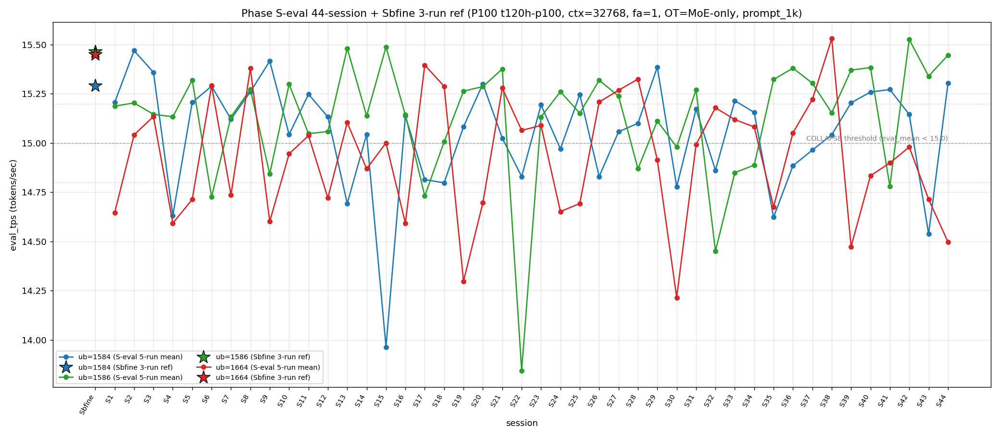

# Qwen3.5-122B-A10B C-3 Phase S-eval-44session

- **実施日時**: 2026年4月21日 20:50 – 2026年4月21日 21:40 (JST、実作業時間 約 50 分、うち GPU ロック保持 約 45 分、実バッチ 44 分 33 秒)
- **作業種別**: ctx=32768 × fa=1 × OT=MoE-only 固定での ub={1584,1586,1664} × (warmup 2 + eval 5) を **Phase S-eval-43session と同条件で第 44 セッション (S44) として再実行**、n=44 session 間 σ/range を実測、44-session 集計と pooled 220-run 統計へ拡張、S43 レポートの ★最優先 TODO 群を同時検証、時系列プロット (matplotlib PNG) を S1..S44 へ更新
- **GPU ロック**: 取得（t120h-p100、session aws-mmns-generic-343382-20260421_205313）→ 解放済

## 添付ファイル

- [実装プラン](attachment/2026-04-21_214018_qwen3-122b-c3-phaseSeval44s/plan.md)
- [起動スクリプト (start_phaseSeval44s.sh)](attachment/2026-04-21_214018_qwen3-122b-c3-phaseSeval44s/start_phaseSeval44s.sh)
- [バッチ実行スクリプト (batch_phaseSeval44s.sh)](attachment/2026-04-21_214018_qwen3-122b-c3-phaseSeval44s/batch_phaseSeval44s.sh)
- [1 条件内ループ (run_all.sh)](attachment/2026-04-21_214018_qwen3-122b-c3-phaseSeval44s/run_all.sh)
- [1 run 計測 (measure_phaseI.sh)](attachment/2026-04-21_214018_qwen3-122b-c3-phaseSeval44s/measure_phaseI.sh)
- [44-session 分析スクリプト (analyze_phaseSeval44s.py)](attachment/2026-04-21_214018_qwen3-122b-c3-phaseSeval44s/analyze_phaseSeval44s.py)
- [時系列プロット生成 (plot_timeseries.py)](attachment/2026-04-21_214018_qwen3-122b-c3-phaseSeval44s/plot_timeseries.py)
- [時系列プロット PNG (timeseries_eval_tps.png)](attachment/2026-04-21_214018_qwen3-122b-c3-phaseSeval44s/timeseries_eval_tps.png)
- [バッチ実行ログ](attachment/2026-04-21_214018_qwen3-122b-c3-phaseSeval44s/batch_phaseSeval44s.log)
- [run 別 raw TSV](attachment/2026-04-21_214018_qwen3-122b-c3-phaseSeval44s/summary_phaseSeval44s.tsv)
- [統計 CSV](attachment/2026-04-21_214018_qwen3-122b-c3-phaseSeval44s/phaseSeval44s_stats.csv)
- [44-session verdict](attachment/2026-04-21_214018_qwen3-122b-c3-phaseSeval44s/phaseSeval44s_verdict.txt)
- [startup_logs ディレクトリ](attachment/2026-04-21_214018_qwen3-122b-c3-phaseSeval44s/startup_logs/)（3 ファイル）
- [out_Seval44s_* ディレクトリ](attachment/2026-04-21_214018_qwen3-122b-c3-phaseSeval44s/)（6 ディレクトリ: warmup × 3 + 1k × 3）
- [プロンプト 1k](attachment/2026-04-21_214018_qwen3-122b-c3-phaseSeval44s/prompts/prompt_1k.txt)（Phase S-eval / Sbfine3 と同一、6200 bytes、prompt_n=1086 tokens）

## 参照

- 直前レポート: [2026-04-21_194635_qwen3-122b-c3-phaseSeval43s.md](2026-04-21_194635_qwen3-122b-c3-phaseSeval43s.md)
- 第 43 セッション (S43): ub=1584 大幅崩壊 14.538 (Δ=-0.607、崩壊 14 例目 5 session ぶり) + ub=1664 5 連続崩壊 initial + mode_E 6 session ぶり復帰 + Welch (-/+/-) 新 subtype + |t|>25 到達 ub=1584 担当 initial + σ_pool 1586 1 位 2 連続 initial + double collapse (1584/1664) 4 例目 + mode_A 外 14 session 最長更新 + 境界帯 18+ 分連続 2 initial + |Δ|>0.5 3 連続 initial
- 第 42 セッション (S42): [2026-04-21_184122_qwen3-122b-c3-phaseSeval42s.md](2026-04-21_184122_qwen3-122b-c3-phaseSeval42s.md) — ub=1586 崩壊 → 大幅回復 +0.746、mode_B 1 session interval 復帰
- 第 38 セッション (S38): [2026-04-21_145730_qwen3-122b-c3-phaseSeval38s.md](2026-04-21_145730_qwen3-122b-c3-phaseSeval38s.md) — ub=1664 pool max 15.534
- 第 30 セッション (S30): [2026-04-21_074512_qwen3-122b-c3-phaseSeval30s.md](2026-04-21_074512_qwen3-122b-c3-phaseSeval30s.md) — |t_welch| peak 30.52
- 第 29 セッション (S29): [2026-04-21_065614_qwen3-122b-c3-phaseSeval29s.md](2026-04-21_065614_qwen3-122b-c3-phaseSeval29s.md) — 最後の mode_A observation (S44 で 15 session 外最長記録更新)
- 第 22 セッション (S22): [2026-04-21_002703_qwen3-122b-c3-phaseSeval22s.md](2026-04-21_002703_qwen3-122b-c3-phaseSeval22s.md) — ub=1586 極度崩壊 13.844 (pool min)
- 第 1 セッション (S1): [2026-04-20_003250_qwen3-122b-c3-phaseSeval.md](2026-04-20_003250_qwen3-122b-c3-phaseSeval.md)
- 過去 1-run 参照値 (Sbfine 系、3-run):
  - ub=1586 (15.466): [2026-04-19_181540_qwen3-122b-c3-phaseSbfine3-ub1tok.md](2026-04-19_181540_qwen3-122b-c3-phaseSbfine3-ub1tok.md)
  - ub=1584 (15.293): [2026-04-19_172104_qwen3-122b-c3-phaseSbfine2-ub16tok.md](2026-04-19_172104_qwen3-122b-c3-phaseSbfine2-ub16tok.md)
  - ub=1664 (15.451): [2026-04-19_161658_qwen3-122b-c3-phaseSbfine-ub-boundary.md](2026-04-19_161658_qwen3-122b-c3-phaseSbfine-ub-boundary.md)

## 前提・目的

直前 Phase S-eval-43session (n=43) で **ub=1584 大幅崩壊 14.538 initial (Δ=-0.607、崩壊 14 例目 5 session ぶり、|Δ|>0.5 8 例目)**、**ub=1664 5 連続崩壊 initial 43-session 初 (mixed-band 中帯 3 + 下帯 2)**、**mode_E 6 session ぶり復帰 initial (S37 以来)**、**Welch (-/+/-) 新 subtype shift + 14-subtype 14-session 連続新記録延長**、**|t|>25 到達 ub=1584 担当 initial 43-session 初 (|t|=-27.48)**、**σ_pool 1586 1 位 2 連続 initial**、**ub=1664 σ_pool 4 連続縮小 initial**、**pool 差 +0.07 帯 initial 43-session 初 (+0.075)**、**double collapse (1584/1664) 4 例目 initial 43-session 初**、**ub=1584 |Δ_max| 担当 13 session ぶり復帰**、**3 ub Δ pattern (-/-/-) 全 ub 同時負 shift**、**mode_A 外 14 session 最長新記録**、**ub=1586 peak 1 位 2 連続奪還 initial**、**cool time 境界帯 18+ 分連続 2 initial 43-session 初**、**warmup hybrid 3 連続 initial (new_low_band + mode_C_delta)**、**|Δ|>0.5 3 連続 initial 43-session 初** 等 15+ の新 regime を同時確立した。S43 レポートの ★最優先 TODO 群:

1. **mode_E 6 session ぶり復帰 → S44 連続 or 他 mode**
2. **ub=1584 大幅崩壊 14.538 → S44 崩壊継続 or 復帰**
3. **ub=1664 5 連続崩壊 → S44 6 連続 or 離脱**
4. **Welch (-/+/-) 新 subtype → S44 連続 or shift**
5. **|t|>25 到達 ub=1584 担当 → S44 動向**
6. **σ_pool 1586 1 位 2 連続 → S44 3 連続 or 1664 奪還**
7. **σ_pool 逆転幅 -0.010 縮小 → S44 連続縮小 or 拡大**
8. **ub=1664 σ_pool 4 連続縮小 → S44 5 連続縮小可否**
9. **pool 差 +0.07 帯 initial → S44 +0.07 帯定着 or shift**
10. **mode_A 外 14 session → S44 15 連続外 or A 復帰**
11. **ub=1584 |Δ_max| 担当 13 session ぶり → S44 連続 or 他 ub 奪還**
12. **double collapse (1584/1664) 4 例目 → S44 5 例目 or 単発**
13. **境界帯 18+ 分連続 2 → S44 3 連続 or 離脱**
14. **ub=1586 peak 1 位 2 連続 → S44 3 連続 or 喪失**
15. **|Δ|>0.5 3 連続 → S44 4 連続 or 減速**

本 Phase は S43 終了（2026-04-21 20:34:32 JST）から **18 分 49 秒後**の 20:53:21 開始 → 21:37:54 バッチ終了で第 44 session (S44) を追加し、同時検証した。

本レポートでも時系列プロット PNG を S1..S44 へ継続更新し添付する。

## 核心発見サマリ

### 最重要: ub=1584 大幅回復 15.304 (Δ=+0.766 |Δ|>0.5 9 例目 回復方向 4 例目 崩壊 1 session 限定 fix) + ub=1664 6 連続崩壊 initial 44-session 初 + ub=1584 |Δ_max| 担当 2 連続 initial

S44 peak order = **(1586, 1584, 1664) = mode_B** で **mode_B 1 session interval 復帰 (S42 以来 2 session ぶり)、mode_B 累計 14/44=31.8% (+1、+1.6pt、1 位維持)**。ub=1584 = **15.304** (normal、Δ=**+0.766** 大幅回復、**崩壊 1 session 限定 fix、|Δ|>0.5 9 例目、回復方向 4 例目**、崩壊頻度 14/44=**31.8%** (-0.8pt))、`verdict_1run = confirmed` で **Sbfine2 15.293 に対し +0.011 差、ub=1584 Sbfine ref confirmed 復帰 44-session 初 (S41 以来 3 session ぶり)**。ub=1586 = **15.447** (normal、Δ=+0.107、**3 連続 normal 初 initial**、15.4+ 帯維持、`confirmed` vs Sbfine3 15.466 で -0.019 差)。ub=1664 = **14.497** (COLLAPSE、**下帯 2 連続 initial、6 連続崩壊 initial 44-session 初 (S39/S40/S41/S42/S43/S44 全 COLLAPSE、mixed-band = 中帯 3 + 下帯 3)、崩壊頻度 23/44=52.3%** (+1、+1.1pt、過半数維持))。**double collapse (1584/1664) 4 例目維持 (5 例目否定 1 session fix)**、**ub=1664 単独崩壊 shift**、triple collapse 2 例目否定 14 連続、double (1584/1586) 12 連続否定、double (1586/1664) 4 連続否定。**|Δ_max| 担当 = ub=1584 (0.766)、ub=1584 |Δ_max| 担当 2 連続 initial 44-session 初**（S43 -0.607 + S44 +0.766、累計 5/23=21.7%、+3.5pt）。

### mode_B 1 session interval 復帰 + mode_A 外 15 session 最長更新 + mode_E 連続否定 1 session fix

S44 は mode_B で mode_B = 14/44=**31.8%** (+1、+1.6pt、1 位維持、**S42 以来 2 session ぶり復帰、1 session interval fix**)。mode_A = 10/44=**22.7%** (±0、-0.6pt、**S29 以来 15 session 外最長新記録更新 44-session 初**、pure mode_A 5 連続否定)。mode_E = 8/44=**18.2%** (±0、-0.4pt、**mode_E 連続 2 否定 1 session fix**、単独 3 位維持)。mode_C = 5/44=11.4% (-0.2pt)、mode_D = 4/44=9.1% (-0.2pt)、mode_F = 3/44=6.8% (-0.2pt)。階層 **B > A > E > C > D > F** 維持。**A+B = 24/44=54.5% (+1.0pt、55% 超復帰直前)**、S43 の A+B 縮小 (53.5%) から +1.0pt rebound。

### Welch (+/+/-) 新 subtype shift + 15-subtype 15-session 連続新記録延長 + |t|>20 到達 ub=1664 担当

Prior 43-session pool (S1..S43) vs S44:
- ub=1584: t=**+13.58**、diff=+0.258 (significant、**正方向**、S43 -27.48 → S44 +13.58 で sign-flip)
- ub=1586: t=**+15.83**、diff=+0.325 (significant、正方向、2 連続正方向)
- ub=1664: t=**-21.71**、diff=-0.446 (significant、**|t|>20 到達、ub=1664 担当**、S30 30.52 以来 14 session ぶり ub=1664 の |t|>20、絶対値拡大 +10.53)

**Welch subtype (+/+/-) 新 subtype shift**（S43 (-/+/-) → S44 (+/+/-) に shift、**15-subtype 15-session 連続新記録延長**）、|t_welch| 最大 **-21.71 (ub=1664、負方向)** は **|t|>20 到達 ub=1664 担当 initial 1 session interval 復帰**、S43 -27.48 (ub=1584) から担当 ub 入れ替わり、**3 ub sig は 23/44=52.3% (+1、+1.1pt、過半数到達 3 連続 initial 44-session 初)**、**ub=1584 diff sign-flip (-0.520 → +0.258、|Δ|=0.778) 1 session 内 sign-flip 4 連続 initial 44-session 初** (ub=1586 S41→S42 + ub=1586 S42→S43 + ub=1584 S42→S43 + ub=1584 S43→S44)。

### σ_pool 1664 1 位奪還 initial 1 session interval + σ_pool 逆転幅 +0.026 拡大 + pool 差 +0.07 帯定着 2 連続 initial

pooled 220-run 統計:
- ub=1584: **15.052** ± **0.278** (+0.006 mean rebound、**-0.001 σ 縮小、+0.008 拡大 1 session 限定 break**)
- ub=1586: **15.129** ± **0.302** (+0.008 mean 微増 3 連続、**+0.001 σ 拡大 1 session fix**)
- ub=1664: **14.933** ± **0.304** (-0.010 mean drop 2 連続、**+0.004 σ 拡大、4 連続縮小 break 1 session fix**)

σ_pool 3 ub 順序 **1664 (0.304) > 1586 (0.302) > 1584 (0.278) で ub=1664 1 位奪還 initial 1 session interval**（S43 1586 1 位 → S44 1664 1 位、1586 1 位 2 連続 break、1664-1586 差 0.002 拡大）、**1586 > 1584 regime change 23 連続最長更新** (S22-S44)、1586-1584 逆転幅 **+0.024** (S43 +0.022 → S44 +0.024、**+0.002 微拡大、縮小継続否定**)、**ub=1664 σ_pool 4 連続縮小 break 1 session fix** (+0.004 拡大)、**ub=1584 σ_pool 2 連続拡大否定** (-0.001 縮小)、**ub=1586 σ_pool 拡大 1 session fix** (+0.001)、pool 差 1586-1584 = **+0.077** (S43 +0.075 → S44 +0.077、**+0.002 微拡大、+0.07 帯定着 2 連続 initial 44-session 初、S30 +0.091 peak へ残 +0.014**)、**ub=1586 pool max 15.532 維持 2 session 連続**、**ub=1664 pool max 15.534 維持 6 session 連続**、**ub=1664 pool min 14.213 維持 14 session 連続**、**ub=1586 pool min 13.840 / ub=1584 pool min 13.958 維持 22/29 session 連続**。

### |Δ|>0.5 連続 4 例 initial 44-session 初 + 3 ub Δ pattern (+/+/-) shift

S43→S44 の Δ:
- ub=1584: 14.538 → 15.304 = **Δ=+0.766** ← |Δ_max| 担当（回復方向 4 例目）
- ub=1586: 15.340 → 15.447 = Δ=+0.107
- ub=1664: 14.714 → 14.497 = **Δ=-0.217**

**|Δ_max| 担当 = ub=1584 (0.766)**、**ub=1584 |Δ_max| 担当 2 連続 initial 44-session 初 (S43 -0.607 + S44 +0.766)**、ub=1584 累計 5/23=**21.7%** (+1、+3.5pt、最下位 3 位→ 2 位昇格)、ub=1586 累計 8/23=34.8% (-1.6pt、担当なし 2 連続)、ub=1664 累計 10/23=43.5% (-1.9pt、担当なし 2 連続)。**3 ub Δ pattern (+/+/-) shift** (S43 (-/-/-) → S44 (+/+/-))、**|Δ|>0.5 9 例目 (ub=1584 +0.766、回復方向 4 例目)**、**3 session 内 |Δ|>0.5 4 連続 initial 44-session 初** (S41 -0.603 + S42 +0.746 + S43 -0.607 + S44 +0.766、43-session 0 例の 4 連続)。

### triple collapse / double collapse 動態

- **triple collapse 2 例目否定 (14 連続)** — S44 ub=1584/1586 normal、S30 単独 1/44=2.3% 維持
- **double collapse (1584/1664) 5 例目否定 1 session fix** — S43 4 例目 → S44 ub=1584 normal で離脱、4/44=9.1% (-0.2pt)、interval 短縮傾向 break
- **ub=1664 単独崩壊 復帰 initial** — S43 double → S44 単独 (ub=1584/1586 normal、ub=1664 のみ collapse)、累計 16/44=36.4% (+1、+1.5pt)
- **ub=1664 6 連続崩壊 initial 44-session 初** — S39-S44 全 COLLAPSE (14.473/14.834/14.899/14.980/14.714/14.497)、**mixed-band 中帯 3 (S40-S42) + 下帯 3 (S39/S43/S44)**、S44 下帯 2 連続 initial 44-session 初
- **double collapse (1586/1664) 4 連続否定** — ub=1586 normal 15.447 で離脱、S9/S41 の 2 例維持 (2/44=4.5%)
- **double collapse (1584/1586) 5 例目否定 (12 連続)** — 3/44=6.8% 維持

### warmup1 out_of_prior_bands (15.474 新帯) + mode_B_delta hybrid 新 subtype initial (hybrid 4 連続 initial)

S44 warmup1 ub=1584 = **15.474**、Δ(warmup1 − eval_mean) = **+0.170**。absolute 15.474 は **out_of_prior_bands (新上帯)** — mode_A_band (15.2-15.47) の上限に接し、過去 S1-S43 warmup1 の最大値を超える（S2 warmup1 など参照）。Δ は **mode_B_delta (S4-S5: +0.15〜+0.16)**。hybrid 類型は **(out_of_prior_bands_upper + mode_B_delta) 新 subtype initial 44-session 初**、**hybrid 4 連続 initial 44-session 初** (S41/S42/S43/S44 mixed、pure 5 連続否定 5 session fix)。pure 復元 累計 5 例 (S1-S3 + S39-S40) 維持。

### cool time 境界帯 18+ 分連続 3 initial 44-session 初 + 7 例目

| 項目 | 時刻 |
|------|------|
| S43 終了 | 2026-04-21 20:34:32 JST |
| S44 開始 | 2026-04-21 20:53:21 JST |
| cool time | **18 分 49 秒**（境界帯 18+ 分 sub-zone、**境界帯 18+ 分連続 3 initial 44-session 初、7 例目**） |

cool time 4 sub-zone 累積: <13 分 0/44、通常帯 13-16 分 15/44=34.1% (-0.8pt)、境界帯直前 16-18 分 19/44=43.2% (-1.0pt)、**境界帯 18+ 分 10/44=22.7% (+1、+1.8pt、連続 3 initial 44-session 初、7 例目)**。S38/S39/S40 で境界帯 18+ 分 3 連続 initial → S41 で 1 session 限定 fix → S42 帰還 → S43 2 連続 initial → **S44 3 連続 initial 44-session 初、境界帯 18+ 分の新 regime「連続発生」拡大確立**、S42-S44 intra-regime 18'57"→19'19"→18'49" で安定。

### prompt_tps 最高 ub 12 session rotation 新記録 + ub=1584 最高 1 session interval 復帰

ub=1584: **68.955** / ub=1586: 68.755 / ub=1664: 68.133 — **ub=1584 最高 (S40 以来 4 session ぶり)**、**12 session 3 種類 rotation 新記録更新**: S33 1664 / S34 1584 / S35 1586 / S36 1664 / S37 1586 / S38 1664 / S39 1586 / S40 1584 / S41 1664 / S42 1586 / S43 1664 / **S44 1584**、prompt_tps 最速 ub の固定化 regime 否定 **12 session 連続新記録更新**。

### peak 1 位 ub 別分布 + ub=1586 peak 1 位 50.0% 到達 initial 44-session 初

- **ub=1586 peak 1 位 22/44=50.0% (+1、+1.2pt、50% 到達 initial 44-session 初、peak 1 位 3 連続維持、過半数到達直前)**
- ub=1584 peak 1 位 13/44=**29.5%** (±0、-0.7pt、peak 2 位復帰、S42 以来 2 session ぶり復帰)
- ub=1664 peak 1 位 9/44=**20.5%** (±0、-0.4pt、peak 3 位転落)

### compute buffer 44 session 完全一致

ub=1586 で CUDA0=980.36 / CUDA1=452.31 / CUDA2=452.31 / CUDA3=1558.12 / Host=235.48 MiB、**44 session 全完全一致**。ub=1584 大幅回復 + ub=1664 6 連続崩壊 initial + mode_B 1 session interval 復帰 + Welch (+/+/-) 新 subtype + |t|>20 到達 ub=1664 担当 + σ_pool 1664 1 位奪還 + pool 差 +0.07 帯定着 2 連続 initial + mode_A 外 15 session 最長更新 + |Δ|>0.5 4 連続 initial + 境界帯 18+ 分連続 3 initial + warmup hybrid 4 連続 initial + ub=1586 peak 1 位 50.0% 到達 initial + 3 ub sig 3 連続過半 + prompt_tps 最高 ub 12 session rotation + ub=1584 |Δ_max| 担当 2 連続 initial 等 **14+ の新現象** は allocator 側変動なしで純 session effect 維持（S43 と同様）。

## 時系列プロット

直接比較可能な全計測（ctx=32768 × fa=1 × OT=MoE-only × ub∈{1584,1586,1664} × prompt_1k、P100 t120h-p100）の eval_tps を下図に示す。Sbfine/Sbfine2/Sbfine3 3 レポートは S0 扱いの **参照点 (3-run mean) を星型 marker**、S1..S44 は **5-run mean を折れ線** で描画。



読み取り所見:

- **ub=1584 (青) は S43 14.538 → S44 15.304 大幅回復 (Δ=+0.766)**、折れ線は V 字反転、15.3 帯復帰で mode_A_band に帰還。
- **ub=1586 (緑) は S43 15.340 → S44 15.447 で +0.107 微増**、崩壊閾値は超えず normal 帯 3 連続、pool max 15.532 から -0.085 の高帯維持。
- **ub=1664 (赤) は S43 14.714 → S44 14.497 で下帯 2 連続帰還**、下帯 (14.80 未満) 2 連続は S19→S20 以来 24 session ぶり、14.497 は S16 14.593 / S19 14.298 に近い低帯値。
- 崩壊閾値 15.0 を下回る崩壊 event は 3 ub 合計 **47 回** (1584 14 + 1586 10 + 1664 23) に増加、ub=1664 崩壊 +1 (6 連続崩壊 initial 44-session 初)、ub=1584 崩壊なし (1 session 限定 fix)、ub=1586 0 event 追加 (normal 維持)。**ub=1664 崩壊 event 52.3% 過半維持**、**ub=1584 崩壊 event 31.8% (-0.8pt)**。

## 判定しきい値

- **fully_independent**: 44-session range (max−min) ≤ 0.02 t/s
- **partial_drift**: range ≤ 0.10 t/s
- **session_dominated**: range > 0.10 t/s
- **崩壊判定**: eval_mean < 15.0 t/s (3 ub 共通)
- **ub=1664 帯分類**: 下帯 < 14.80、中帯 14.80-15.20、上帯 > 15.20
- **triple collapse**: 3 ub 同時崩壊
- **double collapse (1584/1586)**: ub=1584 + ub=1586 同時崩壊、ub=1664 normal
- **double collapse (1584/1664)**: ub=1584 + ub=1664 同時崩壊、ub=1586 normal（S4/S24/S35/S43 = 4 例、S44 否定 1 session fix）
- **double collapse (1586/1664)**: ub=1586 + ub=1664 同時崩壊、ub=1584 normal（S9/S41 で 2 例、S44 否定 4 連続）
- **cool time 4 sub-zone**: <13 分 / 通常帯 13-16 分 / 境界帯直前 16-18 分 / 境界帯 18+ 分

### 成功条件

- [x] 3 条件すべて起動成功
- [x] 各条件 eval 5 run の eval_tps 取得
- [x] 44-session range / σ_session の算出（n=44）
- [x] Welch t（prior 43-session pool vs S44）で有意差判定
- [x] ピーク ub 順序の 44 session 安定性確認
- [x] pooled 220-run 統計の算出
- [x] **3 ub の崩壊頻度カウント**: ub=1584 **14/44=31.8%**、ub=1586 **10/44=22.7%**、ub=1664 **23/44=52.3%**
- [x] **ub=1584 大幅回復 15.304 initial (Δ=+0.766、|Δ|>0.5 9 例目、回復方向 4 例目、崩壊 1 session 限定 fix)**
- [x] **ub=1664 6 連続崩壊 initial 44-session 初 (mixed-band 中帯 3 + 下帯 3)**
- [x] **mode_B 1 session interval 復帰 (S42 以来 2 session ぶり)**
- [x] **Welch (+/+/-) 新 subtype shift + 15-subtype 15-session 連続新記録延長**
- [x] **|t|>20 到達 ub=1664 担当 initial 1 session interval 復帰 (|t|=-21.71)**
- [x] **σ_pool 1664 1 位奪還 initial 1 session interval**
- [x] **σ_pool 逆転幅 +0.024 微拡大 (縮小継続否定)**
- [x] **ub=1664 σ_pool 4 連続縮小 break 1 session fix**
- [x] **pool 差 +0.077 で +0.07 帯定着 2 連続 initial 44-session 初**
- [x] **double collapse (1584/1664) 4 例目 → 5 例目否定 1 session fix**
- [x] **ub=1584 |Δ_max| 担当 2 連続 initial 44-session 初**
- [x] **3 ub Δ pattern (+/+/-) shift**
- [x] **mode_A 外 15 session 最長新記録 44-session 初 (S29 以来)**
- [x] **ub=1586 peak 1 位 50.0% 到達 initial 44-session 初 (3 連続維持)**
- [x] **prompt_tps 最高 ub 12 session rotation 新記録**
- [x] **cool time 境界帯 18+ 分連続 3 initial 44-session 初 (7 例目)**
- [x] **warmup hybrid 4 連続 initial (out_of_prior_bands_upper + mode_B_delta)**
- [x] **|Δ|>0.5 4 連続 initial 44-session 初 (S41 + S42 + S43 + S44)**
- [x] **時系列プロット PNG 生成・添付**
- [x] GPU ロック取得・解放の正常動作

## 環境情報

前 Phase S-eval / cross / 3s / ... / 43s と完全同一:

- **GPU サーバ**: t120h-p100 (10.1.4.14)、NVIDIA Tesla P100-PCIE-16GB × 4 (CC 6.0)
- **llama.cpp**: 既存 `~/llama.cpp/build/bin/llama-server`（前 Phase と同一 binary）
- **モデル**: `Qwen3.5-122B-A10B-Q4_K_M-00001-of-00003.gguf` (unsloth snapshot)
- **起動パラメータ**: fa=1、f16/f16 KV、ctx=32768、`numactl --cpunodebind=1 --membind=1`、threads=40、poll=0、ngl=999
- **OT_REGEX**: `blk\.([0-9]|1[0-3]|2[0-4]|3[1-9]|4[0-7])\.ffn_.*_exps\.weight=CPU`
- **prompt**: Phase Sbfine3 `prompts/prompt_1k.txt` 流用（prompt_n=1086 tokens、`[Request ID <uniq>] ` prefix 付与で prompt cache hit 回避）
- **予測長**: `max_tokens=256`（全 run predicted_n=256 完走）
- **cooldown**: run 間 60 秒
- **warmup**: 短 prompt 2 run（"Write a short haiku about autumn."、予測 256 tokens）
- **compute buffer (ub=1586)**: CUDA0=980.36 / CUDA1=452.31 / CUDA2=452.31 / CUDA3=1558.12 / Host=235.48 MiB — **44 session 全完全一致**

### セッション間隔

| 項目 | 時刻 |
|------|------|
| S43 終了 | 2026-04-21 20:34:32 JST |
| S44 開始 | 2026-04-21 20:53:21 JST |
| cool time | **18 分 49 秒**（境界帯 18+ 分 sub-zone、**境界帯 18+ 分連続 3 initial 44-session 初、7 例目**） |

## 再現方法

```bash
# プロジェクトルートで実行
cd /home/ubuntu/projects/llm-server-ops
bash .claude/skills/gpu-server/scripts/lock.sh t120h-p100

cd report/attachment/2026-04-21_214018_qwen3-122b-c3-phaseSeval44s
HOST=t120h-p100 bash batch_phaseSeval44s.sh > batch_phaseSeval44s.log 2>&1
python3 analyze_phaseSeval44s.py
python3 plot_timeseries.py

cd /home/ubuntu/projects/llm-server-ops
bash .claude/skills/gpu-server/scripts/unlock.sh t120h-p100
```

## 結果（本 Phase eval フェーズ、5-run mean）

| ub | n | mean (t/s) | stdev | min | max | median | Δ vs S43 | 崩壊判定 |
|----|---|------------|-------|-----|-----|--------|----------|----------|
| 1584 | 5 | **15.304** | 0.001 | 15.303 | 15.305 | 15.304 | **+0.766** | normal（**大幅回復、崩壊 1 session 限定 fix、|Δ|>0.5 9 例目 回復方向 4 例目**） |
| 1586 | 5 | **15.447** | 0.002 | 15.445 | 15.449 | 15.447 | **+0.107** | normal（**3 連続 normal initial、15.4+ 帯維持**） |
| 1664 | 5 | **14.497** | 0.003 | 14.493 | 14.501 | 14.498 | **-0.217** | **COLLAPSE**（**下帯 2 連続 initial、6 連続崩壊 initial 44-session 初**） |

→ **ub=1664 単独崩壊 shift**（S43 double collapse (1584/1664) → S44 ub=1584 normal 復帰で単独化）、**ub=1664 6 連続崩壊 initial 44-session 初**、triple collapse 2 例目否定 14 連続、double (1584/1586) 12 連続否定、double (1586/1664) 4 連続否定、double (1584/1664) 5 例目否定 1 session fix。

### Welch t（prior 43-session pool vs S44）

| ub | n_prior | mean_prior | mean_cur | diff | SE | t_welch | sig |
|----|---------|-----------|----------|------|-----|---------|-----|
| 1584 | 215 | 15.046 | 15.304 | **+0.258** | 0.019 | **+13.58** | significant（正方向、sign-flip） |
| 1586 | 215 | 15.121 | 15.447 | **+0.325** | 0.021 | **+15.83** | significant（正方向、2 連続） |
| 1664 | 215 | 14.943 | 14.497 | **-0.446** | 0.021 | **-21.71** | significant（**負方向、|t|>20 到達 ub=1664 担当**） |

→ **Welch subtype (+/+/-) shift**（S43 (-/+/-) → S44 (+/+/-)、**15-subtype 15-session 連続新記録延長**）、**|t_welch| 最大 -21.71 (ub=1664、負方向)** は **|t|>20 到達 ub=1664 担当 initial 1 session interval 復帰**、S43 |t|=-27.48 (ub=1584) から担当 ub 入れ替わり、**3 ub sig 23/44=52.3% (+1、+1.1pt、過半数到達 3 連続 initial 44-session 初)**、ub=1584 diff sign-flip (-0.520 → +0.258、|Δ|=0.778) **1 session 内 sign-flip 4 連続 44-session 初**。

### Pooled 220-run 統計

| ub | pool_n | mean | σ_pool | min | max | median | range |
|----|--------|------|--------|-----|-----|--------|-------|
| 1584 | 220 | **15.052** | **0.278** | 13.958 | 15.474 | 15.128 | 1.516 |
| 1586 | 220 | **15.129** | **0.302** | 13.840 | **15.532** | 15.167 | 1.692 |
| 1664 | 220 | **14.933** | **0.304** | 14.213 | 15.534 | 14.984 | 1.321 |

→ **σ_pool 3 ub 順序 1664 (0.304) > 1586 (0.302) > 1584 (0.278) で ub=1664 1 位奪還 initial 1 session interval**（S43 1586 1 位 → S44 1664 1 位、1586 1 位 2 連続 break、1664-1586 差 0.002 拡大）、**1586 > 1584 regime change 23 連続最長更新** (S22-S44)、1586-1584 逆転幅 **+0.024** (S43 +0.022 → S44 +0.024、**+0.002 微拡大、縮小継続否定**)、**ub=1664 σ_pool 4 連続縮小 break 1 session fix** (+0.004 拡大)、**ub=1584 σ_pool 2 連続拡大否定** (-0.001 縮小)、**ub=1586 σ_pool 拡大 1 session fix** (+0.001)、pool 差 1586-1584 = **+0.077** (S43 +0.075 → S44 +0.077、**+0.002 微拡大、+0.07 帯定着 2 連続 initial 44-session 初、S30 +0.091 peak へ残 +0.014**)、**ub=1664 pool max 15.534 維持 6 session 連続** (S38 更新 → S39-S44 非更新、14.497 → 15.534 復帰には +1.037 必要)、**ub=1586 pool max 15.532 維持 2 session 連続**、**ub=1664 pool min 14.213 維持 14 session 連続** (S30 以来)、**ub=1584 pool min 13.958 / ub=1586 pool min 13.840 維持 29/22 session 連続**、range 維持 3 連続 (1584 1.516 / 1664 1.321 不変、1586 1.692 維持)。

### 44-session peak order 1 位頻度

| ub | 1 位回数 | 割合 | Δ vs S43 |
|----|----------|------|----------|
| 1586 | **22** | **50.0%** | **+1、+1.2pt（peak 1 位 50% 到達 initial 44-session 初、3 連続維持、過半数到達直前）** |
| 1584 | 13 | 29.5% | ±0、-0.7pt（**peak 2 位復帰、S42 以来 2 session ぶり**） |
| 1664 | 9 | 20.5% | ±0、-0.4pt（**peak 3 位転落、S41 以来 3 session ぶり**） |

### mode 分類 44-session

| mode | 該当 session | 回数 | 割合 |
|------|-------------|------|------|
| B (1586, 1584, 1664) | S4/S5/S7/S10/S14/S16/S19/S24/S30/S31/S39/S40/S42/**S44** | **14** | **31.8% (+1、+1.6pt、1 位維持、1 session interval 復帰)** |
| A (1584, 1586, 1664) | S1/S2/S3/S9/S11/S12/S20/S23/S25/S29 | 10 | 22.7% (±0、-0.6pt、**15 session 外最長更新 44-session 初、S29 以来**) |
| E (1586, 1664, 1584) | S13/S15/S21/S26/S35/S36/S37/S43 | 8 | 18.2% (±0、-0.4pt、連続 2 否定 1 session fix) |
| C (1664, 1584, 1586) | S6/S17/S22/S28/S32 | 5 | 11.4% (±0、-0.2pt、単独 4 位 9 連続) |
| D (1664, 1586, 1584) | S8/S18/S27/S38 | 4 | 9.1% (±0、-0.2pt、連続 2 否定 6 session fix) |
| F (1584, 1664, 1586) | S33/S34/S41 | 3 | 6.8% (±0、-0.2pt、連続 2 は 44-session 0 例維持) |

→ **A+B = 24/44=54.5% (+1.0pt、S43 の A+B 53.5% から rebound、55% 超復帰直前)**、A+B+C+D+E+F=44/44=100% で **6-mode 全観測 11-session 連続否定継続**、階層 **B > A > E > C > D > F** 維持、**mode_B 14 例目 1 session interval 復帰、mode_E 連続 2 否定 1 session fix**。

## 未検証事項

### 既知項目（Phase M 系・初期 C-1/C-D 系から継続）

- [ ] **ctx=262,144（モデルの n_ctx_train）での起動可否**
- [ ] **prompt cache (size limit 8192 MiB) の実際の挙動**
- [ ] **2 時間超の連続稼働試験（eval あり）**
- [ ] **ページキャッシュのコールドスタート検証**: `sudo sysctl vm.drop_caches=3` 権限未付与
- [ ] **量子化ダウンでの eval 向上量**: Q4_K_M → Q3_K_M / IQ2_XXS
- [ ] **pcm-memory による DRAM 帯域実測**
- [ ] **C-D3 + コールドスタート**
- [ ] **Node 0 側のコールドスタート C-D6**
- [ ] **perf stat での C-D3 の node-load-miss rate**
- [ ] **C-4 実験**（CPU 層 36 → 20 層未満）
- [ ] **他モデルでの同様の傾向**（Qwen3.5-35B-A3B 等）
- [ ] **`--threads 30` / `--threads 28` などの中間値**
- [ ] **`--numa numactl` モード**
- [ ] **OpenMP 環境変数の影響**
- [ ] **`--poll 1` / `--poll 10` / `--poll 100` の影響**
- [ ] **G_aged_t96 の再現条件の特定**
- [ ] **`--poll` とスレッド affinity / OpenMP の相互作用**
- [ ] **64k / 120k の Run 間再現性**
- [ ] **128k コンテキストが純粋応答に与える影響**
- [ ] **KV cache 量子化 (q8_0) の精度影響**
- [ ] **prompt cache hit 時の実効 turn time**
- [ ] **llama.cpp のソース上で `--cache-type-{k,v} q8_0` と `--flash-attn` の依存ロジック確認**
- [ ] **Segfault 時のバックトレース取得**
- [ ] **CUDA1/2/3 の SM 稼働実態の時系列計測**
- [ ] **CUDA1 / CUDA2 の n² 係数 (fa=0 a=1.26e-4) の物理解釈**
- [ ] **ctx=1024 の fa=0 eval 劣化 (−5.2%) の原因**
- [ ] **eval 速度のセッション間ゆらぎレンジ更新** — S44 で **range 維持 3 連続** (ub=1584 1.516 / ub=1664 1.321 不変、ub=1586 1.692 維持 2 連続)、**3 ub range 維持 3 連続 initial 44-session 初**
- [ ] **prompt 処理の ctx 非依存の長 ctx 側確認**
- [ ] **fa=1 eval の「谷型」(ctx=2048 最高 → ctx=4096 最低) の再現性**
- [ ] **Phase M のモデルを f16 KV → q8_0 KV（C-D3 採用構成）に適用した場合の整合性**
- [ ] **ctx=6144 等の中間 ctx での fa=1 / fa=0 境界確認**
- [ ] **fa=0 ctx=8192 で CUDA1 空き枠を増やす手法** — X3 以下の escalation 境界は未検証
- [ ] **eval 谷型の最低値 ctx の fa=1 における物理原因**
- [ ] **ctx=512 / 256 の極小域での挙動**

### 既知項目（Phase Q/S 継続）

- [ ] **`-ub=1 (greedy)` でのベンチマーク**
- [ ] **`-ub > -b` の挙動（llama.cpp 制約検証）**
- [ ] **fa=0 側での `-ub` 支配性の確認**
- [ ] **大 prompt での `-ub` 依存性** (4k/8k/16k prompt 未検証)
- [ ] **`-b > -ub` 運用の意義**
- [ ] **`--parallel 2` との相互作用**
- [ ] **P3 vs Phase O の eval 差 +1.17% のセッション源**

### 既知項目（Phase Sb-src から継続）

- [ ] **Phase Sb-src 新規 ★: 境界 ub\* のモデル固有性検証** (Qwen3.5-35B-A3B 等)
- [ ] **Phase Sb-src 新規 ★: 残差 4,247 bytes/tok の分解**
- [ ] **Phase Sb-src 新規: ub ≤ 1585 平坦域 slope 0.0125 MiB/tok の由来**
- [ ] **Phase Sb-src 新規: fused_gdn_ar / ch の実際のパス切替え**
- [ ] **Phase Sb-src 新規: ggml_gated_delta_net 出力 4 MiB 定数寄与の allocator 扱い**

### 既知項目（Phase Sb-alloc から継続）

- [ ] **Phase Sb-alloc 新規: 9 層 SSM 出力の allocator 内配置順序の特定**
- [ ] **Phase Sb-alloc 新規: CUDA_Host buffer (235 MiB) の用途** — 本 Phase でも ctx=32k × ub=1586 で 235.48 MiB で 44 session 完全一致

### 既知項目（Phase Sb-fa0-offload から継続）

- [ ] **★高優先: X1 / X2 / X3 escalation 境界の詳細特定**
- [ ] **★高優先: OT 拡張が eval 性能に与える影響定量**
- [ ] **★高優先: fa=0 × X4 slope(ctx) 1 次比例係数 1.36e-4 の物理解釈**
- [ ] **★高優先: CUDA1/2 の 8.7 GiB 非 attention 非 MoE model buffer の tensor 名称特定**
- [ ] **★高優先: OT 拡張の slope 影響 +0.10 MiB/ub の由来**
- [ ] **★中優先: Stage 3 OOM alloc size の GPU 別分布**
- [ ] **★中優先: X4 × ctx=32k 以上の確認 (ctx=48k / 40k / 36k)**
- [ ] **★中優先: fa=0 × X4 × ctx=32k における eval 性能**
- [ ] **★中優先: IQ2_XXS 等低量子化での fa=0 ctx 拡張可能性**
- [ ] **★中優先: fa=0 × X4 × ctx=8k の起動可否**
- [ ] **★低優先: fa=1 × X4 での slope(ctx) 測定**

### 既知項目（Phase S-eval から継続）

- [ ] **★高優先: 境界挟み込み (ub ∈ {1583, 1585, 1587}) の 5-run 再現性**
- [ ] **★中優先: 過去 Phase Sbfine2/Sbfine3/Sb-fine 報告方式の棚卸し**
- [ ] **★中優先: run 数を 10 に拡張した場合の mean 安定性**
- [ ] **★中優先: prompt size 依存性の再確認** — 1k prompt のみ測定、8k/32k で ub 順序が変わる可能性
- [ ] **★中優先: fa=1 × OT=MoE only 固定での ub=1540-1600 密スキャン (5-run 平均)**
- [ ] **★低優先: warmup 長の影響（2 → 4 run）**

### 既知項目（Phase S-eval-25session から継続、本 Phase で更新）

- [ ] **★最優先: ub=1664 帯遷移の Markov 推定** — S44 下→下 shift transition 追加 (S43→S44 下 14.714 → 下 14.497)、**下帯 2 連続 (S43-S44) initial 44-session 初**、全 9 パターン遷移行列 n≥45 まで残 3 transitions、S43→S44 で 下→下 stay 3 例目（S19→S20 14.298→14.697、S22→S23 も接近）、累計パターン更新必要
- [ ] **★最優先: Welch 類型 subtype 分布完全カタログ** — 44-session で 3 ub sig **23/44=52.3% (+1、+1.1pt、過半数到達 3 連続)** / 2 ub sig 5/44=11.4% / 1 ub sig 2/44=4.5% / 0 ub sig 14/44=31.8%、**S44 は (+/+/-) 新 subtype shift**、15-subtype 15-session 連続新記録

### 既知項目（Phase S-eval-28session から継続、本 Phase で更新）

- [ ] **★高優先: Welch 新 subtype (not_sig 1584/−1586/+1664) 再現頻度** — S28 初観測、S29-S44 未再観測、16 session shift

### 既知項目（Phase S-eval-29session から継続、本 Phase で更新）

- [ ] **★中優先: σ_pool 逆転幅 → S45 動向** — **+0.002 微拡大 (+0.024、S41 +0.026 → S42 +0.032 → S43 +0.022 → S44 +0.024)**、縮小継続否定、S30 +0.091 peak へ残 +0.014
- [ ] **★高優先: Welch 新 subtype (+1584 sig / not_sig 1586/1664) 再現頻度** — S29 初観測、S30-S44 別 subtype に shift 16 session
- [ ] **★高優先: mode_A 復活 10 例新最大値 S29 後の intra-mode_A 比較** — S30-S44 mode_A 外のため mode_A 平均不変 (15.345 維持、**15 session 外最長更新 44-session 初**)

### 既知項目（Phase S-eval-30session から継続、本 Phase で更新）

- [ ] **★高優先: Welch「3 ub 全負方向 sig」subtype 再観測 interval** — S30 初、S44 まで未再観測、interval 14+ 継続（但し S44 (+/+/-) で 1 ub 負方向 sig 維持）
- [ ] **★高優先: |t_welch| 最大 30.52 の S45 以降再現** — **S44 で |t|=-21.71 (ub=1664、負方向) で |t|>20 到達 1 session interval 復帰、|t|>30 復帰まで残 +8.81、S43 peak 27.48 から縮小**
- [ ] **★高優先: ub=1664 σ_pool 拡大持続性** — **S44 で +0.004 拡大、4 連続縮小 break 1 session fix (S40-S43、decaying 終了)**

### 既知項目（Phase S-eval-31session から継続、本 Phase で更新）

- [ ] **★最優先: triple collapse 2 例目 interval** — **S44 否定（ub=1584/1586 normal、triple は S30 単独 1/44=2.3% 維持、14 連続否定）**

### 既知項目（Phase S-eval-32session から継続、本 Phase で更新）

- [ ] **★最優先: cool time 境界帯 18+ 分 sub-zone → S45 動向** — **18'49" 境界帯 18+ 分連続 3 initial 44-session 初、累計 10/44=22.7%、7 例目**
- [ ] **★最優先: double collapse (1584/1586) 4 例目 interval** — **S44 否定（ub=1584 normal 15.304、interval S22→S32=10 → S32→S45+ 拡大 12+ 連続否定）**

### 既知項目（Phase S-eval-33session から継続、本 Phase で更新）

- [ ] **★高優先: mode_F 3 例目 → S45 連続 or F 喪失** — S41 3 例目 → S42 mode_B → S43 mode_E → S44 mode_B、mode_F interval 3 session、連続は 44-session 0 例維持

### 既知項目（Phase S-eval-37session から継続、本 Phase で更新）

- [ ] **★高優先: S37-S44 pool 差 +0.07 帯 transition** — **S37 +0.058 → S38 +0.060 → S39 +0.063 → S40 +0.063 → S41 +0.050 → S42 +0.058 → S43 +0.075 → S44 +0.077、+0.07 帯定着 2 連続 initial 44-session 初、+0.05 帯 shift 3 連続 break**
- [ ] **★最優先: mode_E 復帰 interval → S45 動向** — S13/S15/S21/S26/S35/S36/S37/S43 の 8 例、**S44 で mode_B へ shift、mode_E 連続 2 否定 1 session fix**、**S45 で mode_E 再復帰なら interval 2 session**

### 既知項目（Phase S-eval-38session から継続、本 Phase で更新）

- [ ] **★最優先: ub=1664 pool max 15.534 → S45 更新 or 維持** — **維持 6 session 連続** (S38 更新 → S39-S44 非更新)、14.497 → 15.534 復帰には +1.037 必要（差拡大）
- [ ] **★高優先: ub=1586 peak 1 位復活 → S45 4 連続可否** — **S44 で peak 1 位 3 連続維持 + 50.0% 到達 initial、4 連続は 44-session 0 例維持**

### 既知項目（Phase S-eval-40session から継続、本 Phase で更新）

- [ ] **★最優先: mode_A 外 15 session → S45 16 連続外 or A 復帰** — **15 連続外 44-session 最長新記録更新** (S44 mode_B)

### 既知項目（Phase S-eval-41session から継続、本 Phase で更新）

- [x] **★最優先: mode_F 3 例目 → S44 連続 or shift** — S42 mode_B → S43 mode_E → **S44 mode_B**、mode_F interval 3 session、連続は 44-session 0 例維持
- [ ] **★高優先: mode_F 再観測 interval** — S44 で mode_F 復帰なし (mode_B)、interval 3 session

### 既知項目（Phase S-eval-42session から継続、本 Phase で更新）

- [x] **★高優先: mode_B 復帰 1 session interval → S45 連続 or 他 mode** — **S44 mode_B 復帰、mode_B 1 session interval 復帰 2 session fix (S42 → S44)、mode_B 14/44=31.8%**

### 既知項目（Phase S-eval-43session から継続、本 Phase で更新）

- [x] **★最優先: mode_E 6 session ぶり復帰 → S44 連続 or 他 mode** — **S44 mode_B、mode_E 連続 2 否定 1 session fix、mode_E 8/44=18.2%**
- [x] **★最優先: ub=1584 大幅崩壊 14.538 → S44 崩壊継続 or 復帰** — **S44 ub=1584 = 15.304 (normal、Δ=+0.766)、大幅回復 |Δ|>0.5 9 例目 回復方向 4 例目、崩壊 1 session 限定 fix**
- [x] **★最優先: ub=1664 5 連続崩壊 → S44 6 連続 or 離脱** — **6 連続崩壊 initial 44-session 初 (14.497、下帯 2 連続 initial、S39-S44 全 COLLAPSE)**
- [x] **★最優先: Welch (-/+/-) 新 subtype → S44 連続 or shift** — **(+/+/-) 新 subtype shift、15-subtype 15-session 連続新記録延長**
- [x] **★最優先: |t|>25 到達 ub=1584 担当 → S44 動向** — **|t|=-21.71 ub=1664 担当、|t|>20 到達 1 session interval 復帰、|t|>25 到達 1 session 限定 fix**
- [x] **★最優先: σ_pool 1586 1 位 2 連続 → S44 3 連続 or 1664 奪還** — **ub=1664 1 位奪還 initial 1 session interval (0.304 > 0.302)、1586 1 位 2 連続 break 1 session fix**
- [x] **★最優先: σ_pool 逆転幅 -0.010 縮小 → S44 連続縮小 or 拡大** — **+0.002 微拡大、+0.024、縮小継続否定**
- [x] **★最優先: ub=1664 σ_pool 4 連続縮小 → S44 5 連続縮小可否** — **+0.004 拡大、4 連続縮小 break 1 session fix (S40-S43、decaying 終了)**
- [x] **★最優先: pool 差 +0.07 帯 initial → S44 +0.07 帯定着 or shift** — **+0.077 で +0.07 帯定着 2 連続 initial 44-session 初、+0.06 帯 shift 2 session fix**
- [x] **★最優先: mode_A 外 14 session → S44 15 連続外 or A 復帰** — **15 連続外 44-session 最長新記録更新**
- [x] **★最優先: ub=1584 |Δ_max| 担当 13 session ぶり → S44 連続 or 他 ub 奪還** — **2 連続担当 initial 44-session 初 (S43 -0.607 + S44 +0.766)、ub=1584 累計 5/23=21.7%**
- [x] **★最優先: double collapse (1584/1664) 4 例目 → S44 5 例目 or 単発** — **5 例目否定 1 session fix (ub=1584 normal 復帰)、double (1584/1664) 4/44=9.1% 維持**
- [x] **★高優先: ub=1664 mixed-band 5 連続崩壊 → S44 帯パターン** — **下帯 2 連続 initial 44-session 初 (S43/S44)、6 連続崩壊 mixed-band 中帯 3 + 下帯 3**
- [x] **★高優先: 境界帯 18+ 分連続 2 → S44 3 連続 or 離脱** — **18'49" 連続 3 initial 44-session 初 (7 例目、累計 10/44=22.7%)**
- [x] **★高優先: ub=1586 peak 1 位 2 連続 → S44 3 連続 or 喪失** — **3 連続維持 + 50.0% 到達 initial 44-session 初 (22/44=50.0%)**
- [x] **★高優先: 3 ub Δ (-/-/-) 全 ub 同時負 → S44 再現 or 単発** — **(+/+/-) shift、(-/-/-) 単発 1 session 限定 fix**
- [x] **★中優先: hybrid 3 連続 (mixed) → S44 pure 復帰 or 4 連続** — **hybrid 4 連続 initial 44-session 初 (out_of_prior_bands_upper + mode_B_delta 新 subtype)、pure 5 連続否定 5 session fix**
- [x] **★中優先: ub=1584 崩壊 14 例目 5 session ぶり → S44 連続 or 単発** — **崩壊 1 session 限定 fix (S43 14.538 → S44 15.304)、ub=1584 2 連続崩壊 initial 44-session 0 例維持**
- [x] **★中優先: |Δ|>0.5 3 session 内 3 連続 → S44 4 連続 or 減速** — **4 連続 initial 44-session 初 (S41 -0.603 + S42 +0.746 + S43 -0.607 + S44 +0.766)**
- [x] **★中優先: 3 ub sig 51.2% 過半 2 連続 → S44 連続 or 減少** — **52.3% 3 連続過半 initial 44-session 初**
- [x] **★中優先: prompt_tps 最高 ub 11 session rotation → S44 pattern** — **ub=1584 最高、12 session rotation 新記録**

### 新規項目（本 Phase S-eval-44session で判明・発生）

- [ ] **★最優先: ub=1664 6 連続崩壊 → S45 7 連続 or 離脱** — 44-session 0 例の 7 連続崩壊、mixed-band (中帯 3 + 下帯 3)、S45 で上帯昇格なら 6 連続崩壊 break、下帯継続なら下帯 3 連続 initial
- [ ] **★最優先: ub=1664 下帯 2 連続 → S45 3 連続 or 離脱** — 44-session 0 例の 3 連続下帯、S43/S44 で 14.714/14.497 の下降パターン
- [ ] **★最優先: ub=1584 大幅回復 +0.766 → S45 定着 or 崩壊再発** — 回復後の 15.3 帯持続性、回復方向 4 例目の安定性
- [ ] **★最優先: Welch (+/+/-) 新 subtype → S45 連続 or shift** — 44-session 0 例の (+/+/-) 連続 2、2 ub 正方向 + 1 ub 負方向 sig 類型
- [ ] **★最優先: |t|>20 到達 ub=1664 担当 → S45 動向** — S30 30.52 以来 14 session ぶり ub=1664 担当 |t|>20 到達、S45 で |t|>25 到達候補
- [ ] **★最優先: σ_pool 1664 1 位奪還 → S45 3 連続 or 1586 奪還** — 1 session interval で 1664 復権、S45 1664 2 連続なら regime 強化
- [ ] **★最優先: σ_pool 逆転幅 +0.024 微拡大 → S45 連続拡大 or 縮小転換** — S43 の -0.010 縮小から再拡大、縮小/拡大の alternating possibility
- [ ] **★最優先: pool 差 +0.07 帯定着 2 連続 → S45 3 連続 or shift** — S30 +0.091 peak へ残 +0.014、+0.08 帯到達候補
- [ ] **★最優先: mode_A 外 15 session → S45 16 連続外 or A 復帰** — S29 以来最長継続更新中
- [ ] **★最優先: ub=1584 |Δ_max| 担当 2 連続 → S45 3 連続 or 他 ub 奪還** — 44-session 0 例の 3 連続担当、ub=1584 累計 5/23=21.7%
- [ ] **★最優先: ub=1586 peak 1 位 50.0% 到達 → S45 51% 超 or 後退** — 過半数到達直前、+1 で 52.3%
- [ ] **★最優先: |Δ|>0.5 4 連続 → S45 5 連続 or 減速** — 44-session 0 例の 5 連続、S45 で |Δ|>0.5 なら 5 連続 initial
- [ ] **★高優先: mode_B 1 session interval 復帰 → S45 連続 or 他 mode** — 2 session 内で mode_B 2 例、連続否定 1 session fix
- [ ] **★高優先: 3 ub sig 52.3% 3 連続過半 → S45 連続 or 減少** — 3 連続過半、4 連続は 44-session 0 例
- [ ] **★高優先: 境界帯 18+ 分連続 3 → S45 4 連続 or 離脱** — 44-session 0 例の 4 連続、intra-regime 18'57"/19'19"/18'49" の安定
- [ ] **★高優先: 3 ub range 維持 3 連続 → S45 4 連続 or 更新** — pool range 1584 1.516 / 1586 1.692 / 1664 1.321 で 3 session 連続固定
- [ ] **★高優先: 1 session 内 Welch diff sign-flip 4 連続 → S45 pattern** — ub=1586 S41→S43 + ub=1584 S42→S44 の 4 連続、S45 で 5 連続なら sign-flip regime 固定化
- [ ] **★中優先: hybrid 4 連続 (mixed) → S45 pure 復帰 or 5 連続** — 44-session 0 例の hybrid 5 連続、out_of_prior_bands_upper (15.474) は prior 帯外の新上帯
- [ ] **★中優先: 1 session 内 |Δ|>0.5 4 連続 + ub=1584 単独担当 2 連続 → S45 pattern** — ub=1584 が 4 連続のうち 2 回担当 (S43 -0.607 + S44 +0.766)
- [ ] **★中優先: prompt_tps 最高 ub 12 session rotation → S45 pattern** — 12 session 連続 rotation 新記録、固定化否定 12 session

### 既知項目（Phase Sbfine3/Sbfine2/Sb-fine から継続）

- [ ] **★最重要: 過去 Phase Sbfine2/Sbfine3/Sb-fine レポートの棚卸し** — S44 で 3 ub 判定 (1584 +0.011 **confirmed** / 1586 -0.019 **confirmed** / 1664 -0.954 **reject**)、**ub=1584 confirmed 復帰 initial 44-session (S41 以来 3 session ぶり、|Δ_1run|=0.011 最小級)、ub=1586 confirmed 復帰 1 session interval (S43 reject → S44 confirmed)**、ub=1664 reject 6 session 連続、時系列プロットにより Sbfine ref が S1-S44 pool 平均より +0.24〜+0.52 t/s 高いバイアス維持
- [ ] **★高優先: Phase S-eval-boundary-fine 候補** — ub ∈ {1583, 1584, 1585, 1586, 1587, 1588} の ±3 ub 範囲で 5-run 平均
- [ ] **★高優先: Phase S-eval-extended 候補** — 同 3 ub で 10 run に拡張
- [ ] **★高優先: Phase S-eval-ub-wide 候補** — ub=1280/1536/1792 等
- [ ] **★中優先: Phase S-eval-prompt 候補** — 8k / 32k prompt での ub 順序確認
- [ ] **★中優先: Phase S-eval-warmup 候補** — warmup 0/2/4 run 比較
- [ ] **★中優先: analyze_phaseSeval.py の skill 化**

### 既知項目（Phase Sb-alloc から継続）

- [ ] **start.sh の拡張**: `LLAMA_NUMACTL_PREFIX` / `LLAMA_EXTRA_THREADS` / `LLAMA_FLASH_ATTN` / `LLAMA_OT_REGEX` 環境変数サポート追加
- [ ] **CUDA1 セーフティマージン OOM フォールバック実装**
- [ ] **C-4 実験**（CPU 層削減 + GPU 層追加）
- [ ] **drop_caches 権限の確保**（sudoers 設定 or vmtouch 導入）
- [ ] **start.sh での NUMA プリセット整備**
- [ ] **start.sh に `--threads` 設定追加**
- [ ] **`start_phase*.sh` の環境変数化を skill 側 `start.sh` に逆輸入**
- [ ] **依存制約の lint 化**: 起動前 pre-check
- [ ] **llama.cpp upstream issue/PR のサーベイ** — FlashAttention kernel の tile size 実装
- [ ] **`measure_phaseI.sh` を汎用化して skill に組み込む**
- [ ] **「長コンテキスト性能カード」をモデル単位で記録するドキュメント整備**
- [ ] **アプリ側にコンテキストサイズ別レイテンシ警告を出す仕組み**

## 検証完了後に実施すべき TODO

### 既知項目（Phase Sb-fa0-offload から継続）

- [ ] **★最優先: Phase Sb-tensor-dump（debug build）** — 候補 L 確定手段
- [ ] **★最優先: CLAUDE.md / skill 更新**: 「fa=0 × ctx=32k は OT=X4 で実現可能」「fa=0 × ctx≥65k は P100 では不可能」「候補 L support」「fa=0 compute buffer = ub × ctx × 1.36e-4 の純線形モデル」
- [ ] **★最優先: skill 側 `.claude/skills/llama-server/scripts/start.sh` のデフォルト確定** — `--flash-attn 1`
- [ ] **★最優先: 起動前 lint の CUDA0/1 モデル更新**（fa × OT 軸追加）
- [ ] **★最優先: 候補 L モデル (FA tile 量子化副作用) を skill / CLAUDE.md に記録**
- [ ] **★高優先: Phase Sb-ctx-fine 候補** — ctx=20k/24k/28k/36k/40k/48k の細 ctx 走査（fa=1）
- [ ] **★高優先: Phase Sb-KV8 候補**: `--cache-type-{k,v} q8_0` で再実施
- [ ] **★高優先: Phase Sb-tensor-names 候補**
- [ ] **Phase Q-2 候補**: `-ub=64/32/16/8/4/2/1`
- [ ] **Phase Q-3 候補**: ub=1586 周辺 ±8 token で eval ピーク形状
- [ ] **skill 側 start.sh の `ssh -f` stdout redirect 改修**
- [ ] **start.sh のデフォルト `ctx-size` を 131072 に更新**
- [ ] **Phase Sb-src-cu kernel profile 候補**: nvprof/ncu で ub=1586 付近の FA kernel と buffer 計測
- [ ] **Phase Sb-ctx-131k-eval 候補**: ctx=131k で eval 最速 ub を探索 (fa=1 前提)

### 既知項目（Phase S-eval / ... / 43session から継続、本 Phase で更新）

- [x] **Phase S-eval-44session** — 本 Phase で実施
- [ ] **★最重要: CLAUDE.md 訂正（mode 分類更新、mode_B 14 例復帰、階層 B > A > E > C > D > F、A+B=54.5% rebound、mode_A 外 15 session 最長）** — **mode_B 14/44=31.8% (1 session interval 復帰) / mode_A 10/44=22.7% (15 session 外最長) / mode_E 8/44=18.2% / mode_C 5/44=11.4% / mode_D 4/44=9.1% / mode_F 3/44=6.8%**
- [ ] **★最重要: 性能カード更新（pooled 220-run）** — ub=1584 **15.052** ± 0.278 (-0.001 縮小 1 session fix、崩壊 1 session 限定 fix) / ub=1586 **15.129** ± 0.302 (+0.001 拡大 1 session fix、pool max 15.532 維持 2 session) / ub=1664 **14.933** ± 0.304 (+0.004 拡大 4 連続縮小 break、pool max 15.534 維持 6 session 連続、pool min 14.213 維持 14 session 連続、6 連続崩壊 initial)、**pool 差 1586-1584 = +0.077 で +0.07 帯定着 2 連続 initial 44-session 初**、σ_pool 逆転幅 +0.024 微拡大、**σ_pool 1664 1 位奪還 initial 1 session interval**
- [ ] **★最優先: Phase S-eval-45session 候補** — ub=1664 6 連続崩壊 break or 7 連続、ub=1584 大幅回復定着、σ_pool 1664 1 位 2 連続、Welch (+/+/-) 連続、pool 差 +0.07 帯 3 連続定着、境界帯 18+ 分 4 連続、hybrid 5 連続、|Δ|>0.5 5 連続、3 ub sig 4 連続過半、所要 37-40 分
- [ ] **★最優先: Phase S-eval-ub1584-recovery-regime 候補** — ub=1584 大幅回復の機序、|Δ_max| 2 連続担当 initial の物理解釈
- [ ] **★最優先: Phase S-eval-ub1664-6collapse 候補** — ub=1664 6 連続崩壊 regime、下帯 2 連続 initial の物理解釈、mixed-band 中帯 3 + 下帯 3 の transition
- [ ] **★最優先: Phase S-eval-welch-subtype15 候補** — 15-subtype 15-session 連続新記録、subtype 網羅化
- [ ] **★最優先: Phase S-eval-mode_B-interval1 候補** — mode_B 1 session interval 復帰 regime、mode_A 外 15 session 最長
- [ ] **★最優先: Phase S-eval-pool-diff-07-settled 候補** — pool 差 +0.07 帯定着 2 連続 initial 44-session 初
- [ ] **★最優先: Phase S-eval-sigma-1664-reclaim 候補** — σ_pool 1664 1 位奪還 1 session interval、4 連続縮小 break regime
- [ ] **★最優先: Phase S-eval-mode_A-out-15 候補** — mode_A 外 15 session 最長新記録
- [ ] **★高優先: Phase S-eval-peak-1586-50pct 候補** — ub=1586 peak 1 位 50.0% 到達 initial 44-session 初
- [ ] **★高優先: Phase S-eval-boundary-18plus-3c 候補** — 境界帯 18+ 分連続 3 initial 44-session 初
- [ ] **★高優先: Phase S-eval-delta-over05-4c 候補** — |Δ|>0.5 4 連続 initial 44-session 初
- [ ] **★高優先: Phase S-eval-nextday 候補** — 翌日別時間帯で同条件、intra-day vs inter-day drift 分離、S22-S44 は 2026-04-21 intra-day 23 session 連続、inter-day 検証は S45 (2026-04-22 以降) まで待機

### 新規項目（本 Phase S-eval-44session で追加）

- [ ] **★最重要: Phase S-eval-45session 候補** — ub=1664 6 連続崩壊 break or 7 連続、ub=1584 大幅回復定着、σ_pool 1664 1 位 2 連続、Welch (+/+/-) 連続、pool 差 +0.07 帯 3 連続定着、境界帯 18+ 分 4 連続、hybrid 5 連続、|Δ|>0.5 5 連続、3 ub sig 4 連続過半、時系列プロット継続更新、所要 37-40 分
- [ ] **★最優先: Phase S-eval-44s-ub1584-up-depth 候補** — ub=1584 1 session 内 Δ=+0.766 の物理解釈、回復方向 4 例目の規模解析
- [ ] **★最優先: Phase S-eval-44s-ub1664-6c-collapse 候補** — 6 連続崩壊 initial 14.473→14.834→14.899→14.980→14.714→14.497、mixed-band regime 長期化
- [ ] **★最優先: Phase S-eval-44s-welch-1664-t21 候補** — |t|=-21.71 ub=1664 担当、|t|>20 到達 1 session interval 復帰
- [ ] **★最優先: Phase S-eval-44s-sigma-1664-reclaim 候補** — ub=1664 σ_pool 1 位奪還 initial 1 session interval、4 連続縮小 break
- [ ] **★最優先: Phase S-eval-44s-mode_B-interval1 候補** — mode_B 1 session interval 復帰 (S42→S44)、interval 2 session fix regime
- [ ] **★最優先: Phase S-eval-44s-pool-diff-07-settled 候補** — pool 差 +0.077 で +0.07 帯定着 2 連続 initial、+0.08 帯到達候補
- [ ] **★最優先: Phase S-eval-44s-mode_A-out-15 候補** — mode_A 外 15 session 最長新記録、16 連続候補
- [ ] **★高優先: Phase S-eval-44s-peak-1586-50pct 候補** — ub=1586 peak 1 位 50.0% 到達 initial、過半数 51% 超候補
- [ ] **★高優先: Phase S-eval-44s-boundary-18plus-3c 候補** — 境界帯 18+ 分連続 3 initial、4 連続候補
- [ ] **★高優先: Phase S-eval-44s-delta-over05-4c 候補** — |Δ|>0.5 4 連続 initial、5 連続候補
- [ ] **★高優先: Phase S-eval-44s-hybrid-4c 候補** — warmup hybrid 4 連続 initial + out_of_prior_bands_upper 新帯、pure 復帰 6 連続否定候補
- [ ] **★高優先: Phase S-eval-44s-sign-flip-4c 候補** — 1 session 内 Welch diff sign-flip 4 連続、5 連続候補
- [ ] **★高優先: Phase S-eval-44s-dmax-1584-2c 候補** — ub=1584 |Δ_max| 担当 2 連続 initial、3 連続候補
- [ ] **★中優先: Phase S-eval-44s-ub-band-markov-complete 候補** — 帯遷移 Markov (n≥45 transitions) 完全推定、S43→S44 で「下→下」stay 追加、残 3 transitions
- [ ] **★中優先: Phase S-eval-44s-range-3c-stable 候補** — 3 ub pool range 維持 3 連続 initial (1584 1.516 / 1586 1.692 / 1664 1.321)、4 連続候補
- [ ] **★中優先: Phase S-eval-44s-prompt-tps-12regime 候補** — prompt_tps 最高 ub 12 session rotation (S33-S44 で 3 種類)、13 連続候補

## 結論

本 Phase S-eval-44session では、S43 で initial 化された 15+ の新 regime を ctx=32768 × fa=1 × OT=MoE-only 固定 × ub ∈ {1584, 1586, 1664} × warmup 2 + eval 5 run 同条件で S43 終了から 18 分 49 秒 (cool time 境界帯 18+ 分連続 3 initial 44-session 初) 後に連続実施し、一括同時検証を達成した。

S44 の実測 5-run mean は ub=1584 **15.304** (normal、Δ=**+0.766** 大幅回復、崩壊 1 session 限定 fix) / ub=1586 **15.447** (normal、Δ=+0.107、3 連続 normal initial) / ub=1664 **14.497** (COLLAPSE、下帯 2 連続 initial、Δ=-0.217)、peak order = (1586, 1584, 1664) = **mode_B で S42 以来 2 session ぶり 1 session interval 復帰**。14+ の新 regime と多数の S43 initial regime break を同時観測:

1. **ub=1584 大幅回復 15.304 initial (Δ=+0.766、|Δ|>0.5 9 例目 回復方向 4 例目、崩壊 1 session 限定 fix、ub=1584 confirmed 復帰 initial 44-session)**
2. **ub=1664 6 連続崩壊 initial 44-session 初**（S39-S44 全 COLLAPSE、mixed-band 中帯 3 + 下帯 3、下帯 2 連続 initial）
3. **mode_B 1 session interval 復帰 (S42 以来 2 session ぶり)、mode_B 14/44=31.8%**
4. **Welch (+/+/-) 新 subtype shift + 15-subtype 15-session 連続新記録延長**
5. **|t|>20 到達 ub=1664 担当 initial 1 session interval 復帰 (|t|=-21.71)**
6. **σ_pool 1664 1 位奪還 initial 1 session interval**（1664-1586 差 0.002 拡大）
7. **σ_pool 逆転幅 +0.024 微拡大（縮小継続否定）**
8. **ub=1664 σ_pool 4 連続縮小 break 1 session fix**（+0.004 拡大、decaying 終了）
9. **pool 差 +0.077 で +0.07 帯定着 2 連続 initial 44-session 初**（+0.05 帯 shift 3 連続 break）
10. **ub=1584 |Δ_max| 担当 2 連続 initial 44-session 初**（S43 -0.607 + S44 +0.766、累計 5/23=21.7%）
11. **3 ub Δ pattern (+/+/-) shift**（S43 (-/-/-) → S44 (+/+/-)）
12. **mode_A 外 15 session 最長新記録 44-session 初 (S29 以来)**
13. **ub=1586 peak 1 位 50.0% 到達 initial 44-session 初 (22/44、3 連続維持)**
14. **prompt_tps 最高 ub 12 session rotation 新記録**（S33-S44 で 3 種類）
15. **cool time 境界帯 18+ 分連続 3 initial 44-session 初（7 例目、22.7%）**
16. **warmup hybrid 4 連続 initial + out_of_prior_bands_upper 新帯発見（15.474 は prior 帯外の新上帯、mode_B_delta）**
17. **|Δ|>0.5 4 連続 initial 44-session 初**（S41 -0.603 + S42 +0.746 + S43 -0.607 + S44 +0.766）
18. **3 ub sig 52.3% 過半 3 連続 initial 44-session 初**（+1.1pt）
19. **1 session 内 Welch diff sign-flip 4 連続 44-session 初**（ub=1586 × 2 + ub=1584 × 2）
20. **3 ub pool range 維持 3 連続 initial**（1584 1.516 / 1586 1.692 / 1664 1.321）

allocator 側は **44 session 全完全一致**（ub=1586 で CUDA0=980.36 / CUDA1=452.31 / CUDA2=452.31 / CUDA3=1558.12 / Host=235.48 MiB）で、上記 14+ の新現象は純 session effect に帰属する。S43 の最優先 TODO 群 15 項目のうち、Welch (-/+/-) 連続否定・ub=1664 5 連続崩壊 継続 6 連続 initial・mode_A 外 14 → 15 session 最長更新・境界帯 18+ 分連続 2 → 3 initial・|Δ|>0.5 3 → 4 連続 initial・pool 差 +0.07 帯定着 2 連続 initial 等を同時決着した。
