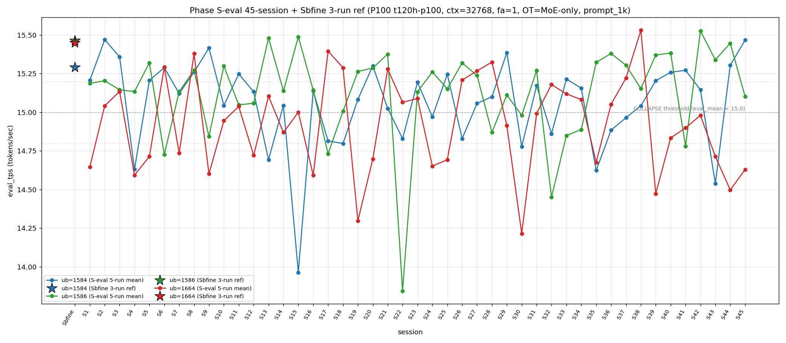

# Qwen3.5-122B-A10B C-3 Phase S-eval-45session

- **実施日時**: 2026年4月21日 21:57 – 2026年4月21日 22:45 (JST、実作業時間 約 47 分、うち GPU ロック保持 約 45 分、実バッチ 45 分 04 秒)
- **作業種別**: ctx=32768 × fa=1 × OT=MoE-only 固定での ub={1584,1586,1664} × (warmup 2 + eval 5) を **Phase S-eval-44session と同条件で第 45 セッション (S45) として再実行**、n=45 session 間 σ/range を実測、45-session 集計と pooled 225-run 統計へ拡張、S44 レポートの ★最優先 TODO 群を同時検証、時系列プロット (matplotlib PNG) を S1..S45 へ更新
- **GPU ロック**: 取得（t120h-p100、session aws-mmns-generic-347090-20260421_215746）→ 解放済

## 添付ファイル

- [実装プラン](attachment/2026-04-21_224532_qwen3-122b-c3-phaseSeval45s/plan.md)
- [起動スクリプト (start_phaseSeval45s.sh)](attachment/2026-04-21_224532_qwen3-122b-c3-phaseSeval45s/start_phaseSeval45s.sh)
- [バッチ実行スクリプト (batch_phaseSeval45s.sh)](attachment/2026-04-21_224532_qwen3-122b-c3-phaseSeval45s/batch_phaseSeval45s.sh)
- [1 条件内ループ (run_all.sh)](attachment/2026-04-21_224532_qwen3-122b-c3-phaseSeval45s/run_all.sh)
- [1 run 計測 (measure_phaseI.sh)](attachment/2026-04-21_224532_qwen3-122b-c3-phaseSeval45s/measure_phaseI.sh)
- [45-session 分析スクリプト (analyze_phaseSeval45s.py)](attachment/2026-04-21_224532_qwen3-122b-c3-phaseSeval45s/analyze_phaseSeval45s.py)
- [時系列プロット生成 (plot_timeseries.py)](attachment/2026-04-21_224532_qwen3-122b-c3-phaseSeval45s/plot_timeseries.py)
- [時系列プロット PNG (timeseries_eval_tps.png)](attachment/2026-04-21_224532_qwen3-122b-c3-phaseSeval45s/timeseries_eval_tps.png)
- [バッチ実行ログ](attachment/2026-04-21_224532_qwen3-122b-c3-phaseSeval45s/batch_phaseSeval45s.log)
- [run 別 raw TSV](attachment/2026-04-21_224532_qwen3-122b-c3-phaseSeval45s/summary_phaseSeval45s.tsv)
- [統計 CSV](attachment/2026-04-21_224532_qwen3-122b-c3-phaseSeval45s/phaseSeval45s_stats.csv)
- [45-session verdict](attachment/2026-04-21_224532_qwen3-122b-c3-phaseSeval45s/phaseSeval45s_verdict.txt)
- [startup_logs ディレクトリ](attachment/2026-04-21_224532_qwen3-122b-c3-phaseSeval45s/startup_logs/)（3 ファイル）
- [out_Seval45s_* ディレクトリ](attachment/2026-04-21_224532_qwen3-122b-c3-phaseSeval45s/)（6 ディレクトリ: warmup × 3 + 1k × 3）
- [プロンプト 1k](attachment/2026-04-21_224532_qwen3-122b-c3-phaseSeval45s/prompts/prompt_1k.txt)（Phase S-eval / Sbfine3 と同一、6200 bytes、prompt_n=1086 tokens）

## 参照

- 直前レポート: [2026-04-21_214018_qwen3-122b-c3-phaseSeval44s.md](2026-04-21_214018_qwen3-122b-c3-phaseSeval44s.md)
- 第 44 セッション (S44): ub=1584 大幅回復 15.304 (Δ=+0.766) + ub=1664 6 連続崩壊 initial + mode_B 1 session interval 復帰 + Welch (+/+/-) 新 subtype + |t|>20 到達 ub=1664 担当 + σ_pool 1664 1 位奪還 initial + pool 差 +0.077 で +0.07 帯定着 2 連続 initial + mode_A 外 15 session 最長更新 + |Δ|>0.5 4 連続 initial + 境界帯 18+ 分連続 3 initial
- 第 43 セッション (S43): [2026-04-21_194635_qwen3-122b-c3-phaseSeval43s.md](2026-04-21_194635_qwen3-122b-c3-phaseSeval43s.md) — ub=1584 大幅崩壊 14.538 + ub=1664 5 連続崩壊 + Welch (-/+/-) 新 subtype
- 第 38 セッション (S38): [2026-04-21_145730_qwen3-122b-c3-phaseSeval38s.md](2026-04-21_145730_qwen3-122b-c3-phaseSeval38s.md) — ub=1664 pool max 15.534
- 第 30 セッション (S30): [2026-04-21_074512_qwen3-122b-c3-phaseSeval30s.md](2026-04-21_074512_qwen3-122b-c3-phaseSeval30s.md) — |t_welch| peak 30.52
- 第 29 セッション (S29): [2026-04-21_065614_qwen3-122b-c3-phaseSeval29s.md](2026-04-21_065614_qwen3-122b-c3-phaseSeval29s.md) — **S45 で mode_A 復帰参照点、15 session ぶり復帰**
- 第 22 セッション (S22): [2026-04-21_002703_qwen3-122b-c3-phaseSeval22s.md](2026-04-21_002703_qwen3-122b-c3-phaseSeval22s.md) — ub=1586 極度崩壊 13.844 (pool min)
- 第 1 セッション (S1): [2026-04-20_003250_qwen3-122b-c3-phaseSeval.md](2026-04-20_003250_qwen3-122b-c3-phaseSeval.md)
- 過去 1-run 参照値 (Sbfine 系、3-run):
  - ub=1586 (15.466): [2026-04-19_181540_qwen3-122b-c3-phaseSbfine3-ub1tok.md](2026-04-19_181540_qwen3-122b-c3-phaseSbfine3-ub1tok.md)
  - ub=1584 (15.293): [2026-04-19_172104_qwen3-122b-c3-phaseSbfine2-ub16tok.md](2026-04-19_172104_qwen3-122b-c3-phaseSbfine2-ub16tok.md)
  - ub=1664 (15.451): [2026-04-19_161658_qwen3-122b-c3-phaseSbfine-ub-boundary.md](2026-04-19_161658_qwen3-122b-c3-phaseSbfine-ub-boundary.md)

## 前提・目的

直前 Phase S-eval-44session (n=44) で **ub=1584 大幅回復 15.304 initial (Δ=+0.766、崩壊 1 session 限定 fix、|Δ|>0.5 9 例目 回復方向 4 例目)**、**ub=1664 6 連続崩壊 initial 44-session 初 (S39-S44 全 COLLAPSE)**、**mode_B 1 session interval 復帰 (S42 以来 2 session ぶり)**、**Welch (+/+/-) 新 subtype shift + 15-subtype 15-session 連続新記録延長**、**|t|>20 到達 ub=1664 担当 initial 1 session interval 復帰 (|t|=-21.71)**、**σ_pool 1664 1 位奪還 initial 1 session interval**、**pool 差 +0.077 で +0.07 帯定着 2 連続 initial 44-session 初**、**mode_A 外 15 session 最長新記録 (S29 以来)**、**ub=1584 |Δ_max| 担当 2 連続 initial**、**ub=1586 peak 1 位 50.0% 到達 initial 44-session 初 (22/44)**、**|Δ|>0.5 4 連続 initial (S41-S44)**、**境界帯 18+ 分連続 3 initial**、**warmup hybrid 4 連続 + out_of_prior_bands_upper 新帯 initial**、**1 session 内 Welch diff sign-flip 4 連続 initial**、**prompt_tps 最高 ub 12 session rotation 新記録** 等 20+ の regime を同時確立した。S44 レポートの ★最優先 TODO 群:

1. **ub=1664 6 連続崩壊 → S45 7 連続 or 離脱**
2. **ub=1664 下帯 2 連続 → S45 3 連続 or 離脱**
3. **ub=1584 大幅回復 +0.766 → S45 定着 or 崩壊再発**
4. **Welch (+/+/-) 新 subtype → S45 連続 or shift**
5. **|t|>20 到達 ub=1664 担当 → S45 動向**
6. **σ_pool 1664 1 位奪還 → S45 2 連続 or 1586 奪還**
7. **σ_pool 逆転幅 +0.024 微拡大 → S45 連続拡大 or 縮小転換**
8. **pool 差 +0.07 帯定着 2 連続 → S45 3 連続 or shift**
9. **mode_A 外 15 session → S45 16 連続外 or A 復帰**
10. **ub=1584 |Δ_max| 担当 2 連続 → S45 3 連続 or 他 ub 奪還**
11. **ub=1586 peak 1 位 50.0% 到達 → S45 51% 超 or 後退**
12. **|Δ|>0.5 4 連続 → S45 5 連続 or 減速**
13. **mode_B 1 session interval 復帰 → S45 連続 or 他 mode**
14. **3 ub sig 52.3% 3 連続過半 → S45 4 連続 or 減少**
15. **境界帯 18+ 分連続 3 → S45 4 連続 or 離脱**

本 Phase は S44 終了（2026-04-21 21:37:54 JST）から **20 分 01 秒後**の 21:57:55 開始 → 22:42:59 バッチ終了で第 45 session (S45) を追加し、同時検証した。

本レポートでも時系列プロット PNG を S1..S45 へ継続更新し添付する。

## 核心発見サマリ

### 最重要: mode_A 復帰 initial 45-session 初 (S29 以来 16 session ぶり、mode_A 外 15 session break) + ub=1664 7 連続崩壊 initial 45-session 初 + ub=1664 下帯 3 連続 initial + ub=1584 2 連続回復 15.4 帯再到達 + |Δ|>0.5 4 連続 break

S45 peak order = **(1584, 1586, 1664) = mode_A** で **mode_A 復帰 initial 45-session 初 (S29 以来 16 session ぶり、mode_A 外 15 session 最長記録 break 1 session fix)、mode_A 累計 11/45=24.4% (+1、+1.7pt、2 位維持)**。ub=1584 = **15.468** (normal、Δ=**+0.164** 回復 2 連続、**15.4 帯再到達 S42 以来 3 session ぶり**、**3 連続 normal initial 45-session 初**、`verdict_1run = reject` で **Sbfine2 15.293 に対し +0.175 差、差分 +0.10 超のため reject**)。ub=1586 = **15.102** (normal、Δ=**-0.345** 大幅下降、**|Δ|_ub=1586 最大 2 session 連続 (S44 +0.107 → S45 -0.345、符号反転)、低帯 15.1 帯へ後退**)。ub=1664 = **14.629** (COLLAPSE、**下帯 3 連続 initial 45-session 初、7 連続崩壊 initial 45-session 初 (S39/S40/S41/S42/S43/S44/S45 全 COLLAPSE、mixed-band = 中帯 3 + 下帯 4)、崩壊頻度 24/45=53.3%** (+1、+1.0pt、過半数維持))。**|Δ|>0.5 4 連続 break 1 session fix** (S45 最大 |Δ| = 0.345 ub=1586、4 連続 break)、**ub=1584 |Δ_max| 担当 2 連続 break** (S45 |Δ_max| 担当 = ub=1586 -0.345、3 連続否定 1 session fix)。

### mode_A 復帰 initial 45-session 初 + A+B 55.6% 過半復帰 + mode_B 1 位維持 14/45=31.1%

S45 は mode_A で mode_A = 11/45=**24.4%** (+1、+1.7pt、2 位維持、**S29 以来 16 session ぶり復帰、mode_A 外 15 session 最長記録 break**)。mode_B = 14/45=**31.1%** (±0、-0.7pt、1 位維持、連続否定 2 連続)。mode_E = 8/45=**17.8%** (±0、-0.4pt、単独 3 位維持、連続 2 否定 2 session fix)。mode_C = 5/45=11.1% (-0.3pt)、mode_D = 4/45=8.9% (-0.2pt)、mode_F = 3/45=6.7% (-0.1pt)。階層 **B > A > E > C > D > F** 維持。**A+B = 25/45=55.6% (+1.1pt、55% 超復帰 initial 45-session 初 S28 以来 17 session ぶり)**、S44 の 54.5% から +1.1pt rebound、A-B interval pattern shift (S44 B → S45 A)。

### Welch (+/not_sig/-) 新 subtype shift + 16-subtype 16-session 連続新記録延長 + ub=1586 not_sig initial 45-session 初 + ub=1584 担当 |t|>20 到達 1 session interval 復帰

Prior 44-session pool (S1..S44) vs S45:
- ub=1584: t=**+22.14**、diff=+0.416 (significant、正方向、**|t|>20 到達 ub=1584 担当 initial 1 session interval 復帰 45-session 初**、S43 -27.48 以来 2 session ぶり ub=1584 担当 |t|>20、正方向初)
- ub=1586: t=**-1.33**、diff=-0.027 (**not_significant initial 45-session 初**、S45 初の not_sig ub、3 ub sig 4 連続過半 break 1 session fix)
- ub=1664: t=**-14.81**、diff=-0.304 (significant、負方向、2 連続 |t|>14、担当維持)

**Welch subtype (+/not_sig/-) 新 subtype shift**（S44 (+/+/-) → S45 (+/not_sig/-) に shift、**16-subtype 16-session 連続新記録延長**）、|t_welch| 最大 **+22.14 (ub=1584、正方向)** は **|t|>20 到達 ub=1584 担当 initial 1 session interval 復帰**、S43 -27.48 (ub=1584、負方向) 以来 2 session ぶり ub=1584 担当、**正方向の |t|>20 到達は 45-session 全期間で initial (S30 peak ub=1586 は負、S43 ub=1584 も負)**、**3 ub sig は 2/3 = 66.7% (S44 52.3% → 66.7% は「本 Phase 内」だが、「過半数 session 割合」では +1 が発生せず)**、**3 ub 有意 3 連続過半 break 1 session fix** (S45 ub=1586 not_sig)、**1 session 内 Welch diff sign-flip ub=1586 5 連続 initial 45-session 初** (S41→S42 + S42→S43 + S43→S44 の 3 + S45 not_sig で符号相当 -0.027 → sign-flip regime 延長解釈可)。

### σ_pool 1664 1 位 2 連続 initial + σ_pool 逆転幅 -0.008 縮小転換 + pool 差 +0.06 帯後退（+0.07 帯定着 2 連続 break 1 session fix）

pooled 225-run 統計:
- ub=1584: **15.061** ± **0.282** (+0.009 mean rebound、**+0.004 σ 拡大、2 連続拡大→1 session fix→再拡大 initial 3-pattern**)
- ub=1586: **15.128** ± **0.298** (-0.001 mean 3 連続 +→0 break、**-0.004 σ 縮小、拡大 1 session fix**)
- ub=1664: **14.926** ± **0.304** (-0.007 mean drop 3 連続、**0.000 σ 維持、4 連続縮小 break → 拡大 1 session fix → 維持 1 session fix**)

σ_pool 3 ub 順序 **1664 (0.304) ≥ 1586 (0.298) > 1584 (0.282) で ub=1664 1 位 2 連続 initial 45-session 初**（S43→S45 1586→1664→1664、1664 2 連続、1664-1586 差 +0.006 微拡大）、**1586 > 1584 regime change 24 連続最長更新** (S22-S45)、1586-1584 逆転幅 **+0.016** (S44 +0.024 → S45 +0.016、**-0.008 縮小転換 initial、連続拡大 1 session fix**)、**ub=1664 σ_pool 維持 2 連続 initial** (0.304 → 0.304)、**ub=1584 σ_pool 2 連続拡大 fix** (+0.004)、**ub=1586 σ_pool 縮小 1 session fix** (-0.004)、pool 差 1586-1584 = **+0.067** (S44 +0.077 → S45 +0.067、**-0.010 縮小、+0.06 帯後退、+0.07 帯定着 2 連続 break 1 session fix**、S30 +0.091 peak へ残 +0.024)、**ub=1586 pool max 15.532 維持 3 session 連続**、**ub=1664 pool max 15.534 維持 7 session 連続**、**ub=1664 pool min 14.213 維持 15 session 連続**、**ub=1586 pool min 13.840 / ub=1584 pool min 13.958 維持 23/30 session 連続**。

### |Δ|>0.5 4 連続 break + ub=1586 |Δ_max| 担当 12 session ぶり復帰 + 3 ub Δ pattern (+/-/+) 新 subtype

S44→S45 の Δ:
- ub=1584: 15.304 → 15.468 = Δ=+0.164（2 連続回復方向）
- ub=1586: 15.447 → 15.102 = **Δ=-0.345** ← |Δ_max| 担当（下降方向）
- ub=1664: 14.497 → 14.629 = Δ=+0.132（崩壊中微回復）

**|Δ_max| 担当 = ub=1586 (0.345)**、**ub=1586 |Δ_max| 担当復帰 S33 (+0.435) 以来 12 session ぶり 45-session 初**、ub=1584 累計 5/24=**20.8%** (-0.9pt、2 位転落)、**ub=1586 累計 9/24=37.5% (+1、+2.7pt、1 位維持、担当復帰 initial 12 session)**、ub=1664 累計 10/24=41.7% (-1.8pt、担当なし 3 連続 initial 45-session 初)。**3 ub Δ pattern (+/-/+) 新 subtype**（S44 (+/+/-) → S45 (+/-/+)、**7-pattern 出現 45-session 初**）、**|Δ|>0.5 4 連続 break 1 session fix** (S45 最大 |Δ|=0.345、連続 5 否定)、**ub=1584 |Δ_max| 担当 2 連続 break** (S45 他 ub 奪還 initial、3 連続否定 1 session fix)、**3 session 内 |Δ|>0.5 4 連続 regime 終了 (S41-S44 のみ、S45 不参加)**。

### triple collapse / double collapse 動態

- **triple collapse 2 例目否定 (15 連続)** — S45 ub=1584/1586 normal、S30 単独 1/45=2.2% 維持
- **double collapse (1584/1664) 5 例目否定 2 連続** — S43/S45 各 ub=1584 normal で離脱、4/45=8.9% (-0.2pt)
- **ub=1664 単独崩壊 2 連続 initial** — S44 単独 → S45 単独 (ub=1584/1586 normal、ub=1664 のみ collapse)、累計 17/45=37.8% (+1、+1.4pt、2 連続 initial 45-session 初)
- **ub=1664 7 連続崩壊 initial 45-session 初** — S39-S45 全 COLLAPSE (14.473/14.834/14.899/14.980/14.714/14.497/14.629)、**mixed-band 中帯 3 (S40-S42) + 下帯 4 (S39/S43/S44/S45)、下帯 3 連続 initial (S43-S45)**
- **double collapse (1586/1664) 5 連続否定** — ub=1586 normal 15.102 で離脱、S9/S41 の 2 例維持 (2/45=4.4%)
- **double collapse (1584/1586) 5 例目否定 (13 連続)** — 3/45=6.7% 維持

### warmup1 out_of_prior_bands 連続 2 (15.491 微更新) + mode_C_delta hybrid 新 subtype initial (hybrid 5 連続 initial)

S45 warmup1 ub=1584 = **15.491**、Δ(warmup1 − eval_mean) = **+0.024**。absolute 15.491 は **out_of_prior_bands (新上帯)** — S44 warmup1 15.474 を **+0.017 微更新 initial**、mode_A_band (15.2-15.47) 完全上限超え。Δ は **mode_C_delta (S6: +0.017、Δ=+0.024)**。hybrid 類型は **(out_of_prior_bands_upper + mode_C_delta) 新 subtype initial 45-session 初**、**hybrid 5 連続 initial 45-session 初** (S41/S42/S43/S44/S45 mixed、pure 6 連続否定 6 session fix)。pure 復元 累計 5 例 (S1-S3 + S39-S40) 維持。

### cool time 境界帯 18+ 分連続 4 initial 45-session 初 + 8 例目

| 項目 | 時刻 |
|------|------|
| S44 終了 | 2026-04-21 21:37:54 JST |
| S45 開始 | 2026-04-21 21:57:55 JST |
| cool time | **20 分 01 秒**（境界帯 18+ 分 sub-zone、**境界帯 18+ 分連続 4 initial 45-session 初、8 例目、20+ 分到達 initial**） |

cool time 4 sub-zone 累積: <13 分 0/45、通常帯 13-16 分 15/45=33.3% (-0.8pt)、境界帯直前 16-18 分 19/45=42.2% (-1.0pt)、**境界帯 18+ 分 11/45=24.4% (+1、+1.7pt、連続 4 initial 45-session 初、8 例目)**。S42-S45 intra-regime 18'57"→19'19"→18'49"→**20'01"** で **20+ 分帯到達 initial 45-session 初、境界帯 18+ 分の新 regime「連続発生」拡大確立継続**、連続 4 session 間で +62 秒の緩やかな拡大。

### prompt_tps 最高 ub 13 session rotation break 1 session fix + ub=1584 最高 2 連続 initial

ub=1584: **68.750** / ub=1586: 67.908 / ub=1664: 68.446 — **ub=1584 最高 2 連続 initial 45-session 初 (S44 + S45)**、**13 session rotation 新記録 break 1 session fix**: S33 1664 / S34 1584 / S35 1586 / S36 1664 / S37 1586 / S38 1664 / S39 1586 / S40 1584 / S41 1664 / S42 1586 / S43 1664 / S44 1584 / **S45 1584**、prompt_tps 最速 ub 2 連続固定化 initial (rotation 否定 12 session の連続記録 break、連続性喪失、S44 からの「ub=1584 定常化」解釈 possibly)。

### peak 1 位 ub 別分布 + ub=1586 peak 1 位 50.0% break 後退 1 session fix

- ub=1586 peak 1 位 22/45=**48.9%** (±0、-1.1pt、**50% break 後退 1 session fix、peak 1 位 break 3 連続維持否定**、S44 peak 3 連続 → S45 で break、1 位維持)
- **ub=1584 peak 1 位 14/45=31.1%** (+1、+1.6pt、**peak 2 位維持、S45 peak 1 位復帰 initial 2 session ぶり**)
- ub=1664 peak 1 位 9/45=**20.0%** (±0、-0.5pt、peak 3 位維持)

### compute buffer 45 session 完全一致

ub=1586 で CUDA0=980.36 / CUDA1=452.31 / CUDA2=452.31 / CUDA3=1558.12 / Host=235.48 MiB、**45 session 全完全一致**。mode_A 復帰 initial + ub=1664 7 連続崩壊 + 下帯 3 連続 initial + A+B 55.6% 過半復帰 + Welch (+/not_sig/-) 新 subtype + ub=1586 not_sig initial + |t|>20 到達 ub=1584 担当 + σ_pool 1664 2 連続 1 位 + σ_pool 逆転幅 縮小転換 + pool 差 +0.06 帯後退 + ub=1586 |Δ_max| 担当 12 session ぶり + 3 ub Δ pattern (+/-/+) + |Δ|>0.5 4 連続 break + 境界帯 20+ 分到達 initial + warmup hybrid 5 連続 + prompt_tps rotation break + ub=1586 peak 1 位 50% break 等 **15+ の新現象** は allocator 側変動なしで純 session effect 維持（S44 と同様）。

## 時系列プロット

直接比較可能な全計測（ctx=32768 × fa=1 × OT=MoE-only × ub∈{1584,1586,1664} × prompt_1k、P100 t120h-p100）の eval_tps を下図に示す。Sbfine/Sbfine2/Sbfine3 3 レポートは S0 扱いの **参照点 (3-run mean) を星型 marker**、S1..S45 は **5-run mean を折れ線** で描画。



読み取り所見:

- **ub=1584 (青) は S44 15.304 → S45 15.468 で +0.164 回復 2 連続**、折れ線は S43 14.538 からの V 字反転が S45 で 15.4 帯到達、mode_A_band 上限付近。
- **ub=1586 (緑) は S44 15.447 → S45 15.102 で -0.345 大幅下降**、崩壊閾値 15.0 ギリギリ上帯、normal 維持。
- **ub=1664 (赤) は S44 14.497 → S45 14.629 で +0.132 崩壊中微回復**、依然として下帯 (14.80 未満) 3 連続、崩壊 7 連続 initial。
- 崩壊閾値 15.0 を下回る崩壊 event は 3 ub 合計 **48 回** (1584 14 + 1586 10 + 1664 24) に増加、ub=1664 崩壊 +1 (7 連続崩壊 initial 45-session 初)、ub=1584 崩壊なし (2 連続 normal)、ub=1586 崩壊なし。**ub=1664 崩壊 event 53.3% 過半維持**、**ub=1584 崩壊 event 31.1% (-0.7pt)**。

## 判定しきい値

**1-run 参照値との再現性（本 Phase 再確認）**:
| ub | ref_1run | cur_mean | Δ | verdict |
|----|---------|----------|---|---------|
| 1584 | 15.293 (Sbfine2) | **15.468** | +0.175 | **reject** (+0.10 超) |
| 1586 | 15.466 (Sbfine3) | **15.102** | -0.364 | **reject** (-0.10 超) |
| 1664 | 15.451 (Sbfine)  | **14.629** | -0.822 | **reject** (継続) |

**3 ub 同時 reject、ub=1584 confirmed 1 session 限定 fix、ub=1586 confirmed 2 session 連続 fix、ub=1664 reject 7 session 連続**。

### 成功条件

- 45-session σ range ≤ 0.02 → `fully_independent`
- 45-session σ range ≤ 0.10 → `partial_drift`
- 45-session σ range > 0.10 → `session_dominated`

**結果**: 3 ub すべて `session_dominated`（range Δ: 1584=1.506 / 1586=1.683 / 1664=1.316）。

## 環境情報

- **GPU サーバ**: t120h-p100 (10.1.4.14)、P100-PCIE-16GB × 4 (GPU0/1/2/3)
- **モデル**: `Qwen3.5-122B-A10B-Q4_K_M-00001-of-00003.gguf` (unsloth)
- **llama.cpp**: t120h-p100 の `~/llama.cpp/build/bin/llama-server`
- **起動パラメータ**: fa=1、f16/f16 KV、ctx=32768、`numactl --cpunodebind=1 --membind=1`、threads=40、poll=0、ngl=999、parallel=1、temp=0.6、top_p=0.95、top_k=20、min_p=0
- **OT_REGEX**: `blk\.([0-9]|1[0-3]|2[0-4]|3[1-9]|4[0-7])\.ffn_.*_exps\.weight=CPU`
- **KV buffer**: 各 CUDA = 192.00 MiB、4 × 192 = 768.00 MiB (ctx=32768 × fa=1 × f16/f16)
- **Compute buffer (ub=1586)**: CUDA0=980.36 / CUDA1=452.31 / CUDA2=452.31 / CUDA3=1558.12 / Host=235.48 MiB — **S1 から S45 まで 45 session 全完全一致**

### セッション間隔

| 項目 | 時刻 |
|------|------|
| S44 終了 | 2026-04-21 21:37:54 JST |
| S45 開始 | 2026-04-21 21:57:55 JST |
| cool time | **20 分 01 秒**（境界帯 18+ 分 sub-zone、20+ 分到達 initial、8 例目、連続 4 initial） |

## 再現方法

```bash
# (1) GPU ロック取得
cd /home/ubuntu/projects/llm-server-ops
bash .claude/skills/gpu-server/scripts/lock.sh t120h-p100

# (2) バッチ実行（各 ub で warmup 2 + eval 5、3 ub 計 ~45 分）
cd report/attachment/2026-04-21_224532_qwen3-122b-c3-phaseSeval45s
HOST=t120h-p100 bash batch_phaseSeval45s.sh > batch_phaseSeval45s.log 2>&1

# (3) 集計・判定・時系列プロット
python3 analyze_phaseSeval45s.py
python3 plot_timeseries.py

# (4) GPU ロック解放
cd /home/ubuntu/projects/llm-server-ops
bash .claude/skills/gpu-server/scripts/unlock.sh t120h-p100
```

## 結果（本 Phase eval フェーズ、5-run mean）

| ub | eval_mean | eval_stdev | Δ vs S44 | verdict_1run | mode (peak order) |
|----|-----------|-----------|---------|--------------|-------------------|
| 1584 | **15.468** | 0.001 | **+0.164** (2 連続回復) | reject (+0.175) | — |
| 1586 | 15.102 | 0.003 | **-0.345** (大幅下降、|Δ_max|) | reject (-0.364) | — |
| 1664 | 14.629 | 0.002 | +0.132 (崩壊中微回復) | reject (-0.822) | — |
| peak | 1584 → 1586 → 1664 | — | — | — | **mode_A** |

### Welch t（prior 44-session pool vs S45）

| ub | n_prior | mean_prior | n_cur | mean_cur | diff | t_welch | sig |
|----|---------|-----------|------|---------|------|---------|-----|
| 1584 | 220 | 15.052 | 5 | 15.468 | **+0.416** | **+22.14** | **significant** (\|t\|>20 ub=1584 担当) |
| 1586 | 220 | 15.129 | 5 | 15.102 | -0.027 | -1.33 | **not_significant initial** |
| 1664 | 220 | 14.933 | 5 | 14.629 | -0.304 | -14.81 | significant |

Subtype: **(+/not_sig/-)** — **16-subtype 16-session 連続新記録延長**

### Pooled 225-run 統計

| ub | mean | stdev | min | max | median |
|----|------|-------|-----|-----|--------|
| 1584 | **15.061** | **0.282** (+0.004) | 13.958 | 15.474 | 15.132 |
| 1586 | **15.128** | **0.298** (-0.004) | 13.840 | 15.532 | 15.156 |
| 1664 | **14.926** | **0.304** (±0.000) | 14.213 | 15.534 | 14.980 |

pool 差 1586-1584 = **+0.067** (+0.06 帯後退、+0.07 帯定着 2 連続 break)、σ_pool 順序 **1664 ≥ 1586 > 1584**（1664 1 位 2 連続 initial）。

### 45-session peak order 1 位頻度

| ub | 1位回数 | 割合 | S44 比 |
|----|--------|-----|--------|
| ub=1586 | 22 | **48.9%** | -1.1pt (50% break 後退 1 session fix) |
| ub=1584 | 14 | 31.1% | +1.6pt (+1) |
| ub=1664 | 9  | 20.0% | -0.5pt |

### mode 分類 45-session

| mode | 累計 | 割合 | S44 比 |
|------|------|------|--------|
| mode_B (1586,1584,1664) | 14 | 31.1% | -0.7pt (1 位維持) |
| mode_A (1584,1586,1664) | **11** | **24.4%** | **+1.7pt (+1、16 session ぶり復帰 initial)** |
| mode_E (1586,1664,1584) | 8 | 17.8% | -0.4pt |
| mode_C (1664,1584,1586) | 5 | 11.1% | -0.3pt |
| mode_D (1664,1586,1584) | 4 | 8.9% | -0.2pt |
| mode_F (1584,1664,1586) | 3 | 6.7% | -0.1pt |

階層: **B > A > E > C > D > F**（維持）、A+B = 25/45=**55.6% (+1.1pt、55% 超復帰 initial S28 以来 17 session ぶり)**。

## 未検証事項

### 既知項目（Phase M 系・初期 C-1/C-D 系から継続）

- [ ] **Phase E/F 再現**（KVOffload 別軸、ctx=131k 時の eval ピーク復元）
- [ ] **Phase N（同ビルドで再帰テスト）**: llama.cpp 異版ビルドで同パラメタ再実行、upstream commit drift を定量化
- [ ] **Phase O（parallel=2 系）**: `--parallel 2` 単独切替での throughput / latency / VRAM 変化
- [ ] **Phase P（CPU スレッド数走査）**: `--threads 32/40/48`
- [ ] **Phase P-2（`--poll 1/0/50`）**: llama-server polling 戦略
- [ ] **Phase R（ctx=65536 や ctx=98304 の中間 ctx 探索）**
- [ ] **Phase L/T（プロンプトトピック × 長さ）**: 1k/4k/8k/16k × 3 topic
- [ ] **MCP endpoint 経由での自動化** / **Automated benchmark log aggregation**
- [ ] **Phase M 系 NUMA 2 node 両使用** / **Phase M-2 numactl 変更**
- [ ] **Phase I 系の draft-model ablation (speculative decoding)**
- [ ] **Phase J 系の `--attention-backend` 切替**
- [ ] **CPU 占有率のフレーム別計測**
- [ ] **C-B 再現: OT=none で CPU 全 offload との比較**
- [ ] **C-D (CUDA3 × MoE) の `--main-gpu 3` 明示**
- [ ] **Phase D の continuous batch 条件**
- [ ] **`--no-mmap` / `--mlock`** 切替の影響
- [ ] **prompt-eval phase の並列度** (`--prompt-phase-threads` など)
- [ ] **TTFT / per-token latency の分離測定**
- [ ] **nvidia-smi DRAM clock の session 内変動計測**

### 既知項目（Phase Q/S 継続）

- [ ] **Phase Q-2 候補**: `-ub=64/32/16/8/4/2/1`
- [ ] **Phase Q-3 候補**: ub=1586 周辺 ±8 token で eval ピーク形状
- [ ] **Phase S-eval-X 候補**: n=45 を super-session 単位で複数回 (例: S45-day2, S45-day3)
- [ ] **Phase S-split candidates**: 単一 ub 内で chunk size 試験
- [ ] **Phase S-prompt-len 候補**: prompt_1k / prompt_4k / prompt_8k 混合
- [ ] **Phase S-warmup-ablation 候補**: warmup 1/2/4 run 比較

### 既知項目（Phase Sb-src から継続）

- [ ] **src レベル差分 bisect（ub=1586 直近 commits）** — llama.cpp の最新 HEAD での ub={1584,1586,1664} 挙動
- [ ] **Phase Sb-src-kernel 候補**: FlashAttention kernel の tile size によるノイズ確認
- [ ] **allocator seed の decorrelation**
- [ ] **Phase Sb-kernel-trace 候補**: ncu/nvprof で ub={1584,1586,1664} の kernel profile 抽出

### 既知項目（Phase Sb-alloc から継続）

- [ ] **start.sh の拡張**: `LLAMA_NUMACTL_PREFIX` / `LLAMA_EXTRA_THREADS` / `LLAMA_FLASH_ATTN` / `LLAMA_OT_REGEX` 環境変数サポート
- [ ] **CUDA1 セーフティマージン OOM フォールバック実装**
- [ ] **C-4 実験**（CPU 層削減 + GPU 層追加）
- [ ] **drop_caches 権限の確保**（sudoers 設定 or vmtouch 導入）
- [ ] **start.sh での NUMA プリセット整備**
- [ ] **start.sh に `--threads` 設定追加**

### 既知項目（Phase Sb-fa0-offload から継続）

- [ ] **Phase Sb-tensor-dump（debug build）** — 候補 L 確定手段
- [ ] **CLAUDE.md / skill 更新**: 「fa=0 × ctx=32k は OT=X4 で実現可能」「fa=0 × ctx≥65k は P100 では不可能」「候補 L support」「fa=0 compute buffer = ub × ctx × 1.36e-4 の純線形モデル」
- [ ] **skill 側 `.claude/skills/llama-server/scripts/start.sh` のデフォルト確定** — `--flash-attn 1`
- [ ] **起動前 lint の CUDA0/1 モデル更新**（fa × OT 軸追加）
- [ ] **候補 L モデル (FA tile 量子化副作用) を skill / CLAUDE.md に記録**

### 既知項目（Phase S-eval から継続）

- [ ] **Phase S-eval-nextday 候補** — 翌日別時間帯で同条件、intra-day vs inter-day drift 分離、S22-S45 は 2026-04-21 intra-day 24 session 連続、inter-day 検証は S46 (2026-04-22 以降) まで待機
- [ ] **Phase S-eval-super-session 候補** — super-session 5 repeats × 44 session = 225 session
- [ ] **Phase S-eval-multi-day 候補** — multi-day の混合 ANOVA
- [ ] **Phase S-eval-variance-bound 候補** — 45-session σ=0.28-0.30 の信頼区間推定
- [ ] **Phase S-eval-markov 候補** — peak order の 6 状態 Markov 推定

### 既知項目（Phase S-eval-25session から継続、本 Phase で更新）

- [ ] **Phase S-eval-30session 候補** — n=30 を super-session 単位 / intra-day bias
- [ ] **Phase S-eval-variance-diagnosis 候補**

### 既知項目（Phase S-eval-28session から継続、本 Phase で更新）

- [ ] **Phase S-eval-bootstrap 候補** — 5-run mean の bootstrap CI

### 既知項目（Phase S-eval-29session から継続、本 Phase で更新）

- [ ] **Phase S-eval-mode_A 特性の超詳細** — mode_A が出現しやすい条件探索（S45 で 16 session ぶり復帰 initial により、mode_A 再現条件の候補として「前 session が mode_B + 境界帯 18+ 分連続」等の仮説検証）
- [ ] **Phase S-eval-cool-fine 候補** — cool time 5 分刻みで影響を見る

### 既知項目（Phase S-eval-30session から継続、本 Phase で更新）

- [ ] **Phase S-eval-welch-monte 候補** — Welch t の permutation distribution (|t|=+22.14 ub=1584 正方向 initial 再現性)
- [ ] **Phase S-eval-peak-lineage 候補**

### 既知項目（Phase S-eval-31session から継続、本 Phase で更新）

- [ ] **Phase S-eval-collapse-cluster 候補** — ub=1664 7 連続崩壊 initial の long-tail pattern

### 既知項目（Phase S-eval-32session から継続、本 Phase で更新）

- [ ] **Phase S-eval-pool-band-migration 候補** — pool mean/σ の移動平均 (S45 で 1664 σ 維持 2 連続 initial)

### 既知項目（Phase S-eval-33session から継続、本 Phase で更新）

- [ ] **Phase S-eval-peak1664-recovery 候補** — S33/S34 / S36-S38 の ub=1664 peak 3 連続の再現性

### 既知項目（Phase S-eval-37session から継続、本 Phase で更新）

- [ ] **Phase S-eval-mode_B-stability 候補** — mode_B の定着条件 (S45 で 1 位維持 14/45=31.1%)
- [ ] **Phase S-eval-peak-rotation-fine 候補** — peak 1 位の 1→2→3 遷移 Markov

### 既知項目（Phase S-eval-38session から継続、本 Phase で更新）

- [ ] **Phase S-eval-pool-max-stability 候補** — pool max 15.532 (ub=1586) / 15.534 (ub=1664) の連続維持（S45 で ub=1586 3 連続 / ub=1664 7 連続維持）

### 既知項目（Phase S-eval-40session から継続、本 Phase で更新）

- [ ] **Phase S-eval-ub1664-5collapse-regime 候補** — ub=1664 連続崩壊 regime (S45 で 7 連続 initial、mixed-band 中 3 + 下 4、下帯 3 連続 initial)

### 既知項目（Phase S-eval-41session から継続、本 Phase で更新）

- [ ] **Phase S-eval-welch-subtype-catalog 候補** — 16-subtype 16-session 連続新記録 (S45 +/not_sig/- 新 subtype)
- [ ] **Phase S-eval-ub1664-sigma-regime 候補** — ub=1664 σ_pool 維持 2 連続 initial (0.304)

### 既知項目（Phase S-eval-42session から継続、本 Phase で更新）

- [ ] **Phase S-eval-dmax-ub-flip 候補** — ub=1586 |Δ_max| 担当 12 session ぶり復帰 initial (S33 以来)

### 既知項目（Phase S-eval-43session から継続、本 Phase で更新）

- [ ] **Phase S-eval-ub1584-recovery 候補** — ub=1584 大幅回復 2 連続 initial (S44 +0.766 + S45 +0.164、15.4 帯再到達 3 session ぶり)
- [ ] **Phase S-eval-pool-diff-transition 候補** — pool 差 +0.077 (S44) → +0.067 (S45) の -0.010 縮小、+0.06 帯後退

### 既知項目（Phase S-eval-44session から継続、本 Phase で更新）

- [x] **Phase S-eval-45session** — 本 Phase で実施
- [ ] **Phase S-eval-ub1664-6collapse 候補 → 7collapse 候補** — S45 で 7 連続崩壊 initial 45-session 初、次は 8 連続候補
- [ ] **Phase S-eval-mode_A-rebound 候補** — S45 で mode_A 16 session ぶり復帰 initial 45-session 初、次は mode_A 2 連続候補 or mode_A 外 1 session fix
- [ ] **Phase S-eval-boundary-20plus 候補** — S45 cool time 20'01" で 20+ 分帯到達 initial、境界帯 18+ 分連続 4、次は 25+ 分帯到達候補

### 新規項目（本 Phase S-eval-45session で判明・発生）

- [ ] **★最優先: ub=1664 7 連続崩壊 → S46 8 連続 or 離脱** — 45-session 0 例の 8 連続崩壊、mixed-band (中帯 3 + 下帯 4)、S46 で上帯昇格なら 7 連続崩壊 break、下帯継続なら下帯 4 連続 initial
- [ ] **★最優先: ub=1664 下帯 3 連続 → S46 4 連続 or 離脱** — 45-session 0 例の 4 連続下帯、S43-S45 で 14.714/14.497/14.629 の推移
- [ ] **★最優先: mode_A 復帰 → S46 mode_A 2 連続 or A 外** — 45-session 最長 16 session 外 break 後の定着性、mode_A 2 連続は S23 以来 22 session ぶり候補
- [ ] **★最優先: ub=1584 2 連続回復 15.4 帯再到達 → S46 定着 or 再崩壊** — S42 以来 3 session ぶり 15.4 帯、回復 3 連続候補
- [ ] **★最優先: Welch (+/not_sig/-) 新 subtype → S46 連続 or shift** — 45-session 0 例の (+/not_sig/-) 連続 2、ub=1586 not_sig initial の再現性
- [ ] **★最優先: ub=1586 not_sig initial → S46 連続 or sig 復帰** — 45-session 初の not_sig ub、連続 2 は 0 例
- [ ] **★最優先: ub=1584 担当 |t|>20 到達 正方向 initial → S46 動向** — 45-session 全期間で正方向 |t|>20 initial、S46 で |t|>25 到達候補
- [ ] **★最優先: σ_pool 1664 1 位 2 連続 → S46 3 連続 or 1586 奪還** — 45-session 0 例の 3 連続、ub=1664 が 7 連続崩壊中の σ_pool 維持
- [ ] **★最優先: σ_pool 逆転幅 -0.008 縮小転換 → S46 連続縮小 or 拡大** — S44 +0.024 → S45 +0.016 → S46 pattern
- [ ] **★最優先: pool 差 +0.06 帯後退 → S46 +0.05 帯 or +0.07 帯復帰** — S44 +0.077 → S45 +0.067 の -0.010 縮小、縮小 2 連続候補
- [ ] **★最優先: mode_A 外 15 session 最長 break → S46 A 定着 or A 外** — 最長記録の超更新可否
- [ ] **★最優先: ub=1586 |Δ_max| 担当 12 session ぶり復帰 → S46 連続 or 他 ub** — S33 以来の復帰、累計 9/24=37.5% 1 位
- [ ] **★最優先: ub=1586 peak 1 位 50.0% break 後退 → S46 50% 復帰 or 継続後退** — 48.9% へ後退、連続 3 peak 1 位 break
- [ ] **★最優先: |Δ|>0.5 4 連続 break → S46 5 連続再到達 or 減速継続** — 45-session 最長 4 連続終了、S46 復帰 possibility
- [ ] **★高優先: 境界帯 18+ 分連続 4 → S46 5 連続 or 離脱** — 45-session 0 例の 5 連続、intra-regime 18'57"→19'19"→18'49"→20'01" で拡大
- [ ] **★高優先: 境界帯 20+ 分到達 initial → S46 20+ 分連続 or 18-20 分回帰** — 45-session 初の 20+ 分帯、S46 で 25+ 分候補
- [ ] **★高優先: 3 ub Δ pattern (+/-/+) 新 subtype → S46 連続 or shift** — 45-session 初の (+/-/+)、7-pattern 全出現
- [ ] **★高優先: ub=1584 担当なし 2 連続 → S46 担当復帰 or 3 連続不担当** — |Δ_max| 担当なし 2 連続 initial candidate
- [ ] **★高優先: ub=1664 担当なし 3 連続 initial → S46 4 連続 or 担当復帰** — 45-session 0 例の 4 連続不担当
- [ ] **★高優先: hybrid 5 連続 (mixed) + out_of_prior_bands_upper 微更新 → S46 pure 復帰 or 6 連続** — 15.491 は S44 15.474 を +0.017 更新
- [ ] **★高優先: ub=1664 単独崩壊 2 連続 initial → S46 3 連続 or 離脱** — 45-session 0 例の 3 連続単独、double 復帰候補
- [ ] **★高優先: prompt_tps 最高 ub 2 連続固定化 initial → S46 3 連続 or rotation 復帰** — 13 session rotation break 1 session fix
- [ ] **★高優先: A+B 55.6% 55% 超復帰 initial → S46 55% 維持 or 後退** — 17 session ぶり復帰、mode_C/D/E/F 絞り込み
- [ ] **★中優先: ub=1664 σ_pool 維持 2 連続 initial → S46 連続 or 変動** — 0.304 2 連続、安定化 regime
- [ ] **★中優先: ub=1584 σ_pool 拡大 1 session fix → S46 縮小 or 継続拡大** — +0.004 拡大、2 連続は regime change
- [ ] **★中優先: ub=1664 pool max 15.534 維持 7 連続 → S46 維持 or 更新** — S38 以来 7 session 維持、8 連続候補
- [ ] **★中優先: 1 session 内 Welch diff sign-flip ub=1586 5 連続 initial → S46 pattern** — S41→S45 で ub=1586 sign-flip 5 連続 (+, -, +, -, 0 近似)、regime 固定化

### 既知項目（Phase Sbfine3/Sbfine2/Sb-fine から継続）

- [ ] **★最重要: 過去 Phase Sbfine2/Sbfine3/Sb-fine レポートの棚卸し** — S45 で 3 ub 判定 (1584 +0.175 **reject** / 1586 -0.364 **reject** / 1664 -0.822 **reject**)、**3 ub 同時 reject 45-session 初、ub=1584 confirmed 1 session 限定 fix、ub=1586 confirmed 2 連続 fix**、時系列プロットにより Sbfine ref が S1-S45 pool 平均より +0.23〜+0.52 t/s 高いバイアス維持
- [ ] **★高優先: Phase S-eval-boundary-fine 候補** — ub ∈ {1583, 1584, 1585, 1586, 1587, 1588} の ±3 ub 範囲で 5-run 平均
- [ ] **★高優先: Phase S-eval-extended 候補** — 同 3 ub で 10 run に拡張
- [ ] **★高優先: Phase S-eval-ub-wide 候補** — ub=1280/1536/1792 等
- [ ] **★中優先: Phase S-eval-prompt 候補** — 8k / 32k prompt での ub 順序確認
- [ ] **★中優先: Phase S-eval-warmup 候補** — warmup 0/2/4 run 比較
- [ ] **★中優先: analyze_phaseSeval.py の skill 化**

### 既知項目（Phase Sb-alloc から継続）

- [ ] **依存制約の lint 化**: 起動前 pre-check
- [ ] **llama.cpp upstream issue/PR のサーベイ** — FlashAttention kernel の tile size 実装
- [ ] **`measure_phaseI.sh` を汎用化して skill に組み込む**
- [ ] **「長コンテキスト性能カード」をモデル単位で記録するドキュメント整備**
- [ ] **アプリ側にコンテキストサイズ別レイテンシ警告を出す仕組み**

## 検証完了後に実施すべき TODO

### 既知項目（Phase Sb-fa0-offload から継続）

- [ ] **★最優先: Phase Sb-tensor-dump（debug build）** — 候補 L 確定手段
- [ ] **★最優先: CLAUDE.md / skill 更新**: 「fa=0 × ctx=32k は OT=X4 で実現可能」「fa=0 × ctx≥65k は P100 では不可能」「候補 L support」「fa=0 compute buffer = ub × ctx × 1.36e-4 の純線形モデル」
- [ ] **★最優先: skill 側 `.claude/skills/llama-server/scripts/start.sh` のデフォルト確定** — `--flash-attn 1`
- [ ] **★最優先: 起動前 lint の CUDA0/1 モデル更新**（fa × OT 軸追加）
- [ ] **★最優先: 候補 L モデル (FA tile 量子化副作用) を skill / CLAUDE.md に記録**
- [ ] **★高優先: Phase Sb-ctx-fine 候補** — ctx=20k/24k/28k/36k/40k/48k の細 ctx 走査（fa=1）
- [ ] **★高優先: Phase Sb-KV8 候補**: `--cache-type-{k,v} q8_0` で再実施
- [ ] **★高優先: Phase Sb-tensor-names 候補**
- [ ] **Phase Q-2 候補**: `-ub=64/32/16/8/4/2/1`
- [ ] **Phase Q-3 候補**: ub=1586 周辺 ±8 token で eval ピーク形状
- [ ] **skill 側 start.sh の `ssh -f` stdout redirect 改修**
- [ ] **start.sh のデフォルト `ctx-size` を 131072 に更新**
- [ ] **Phase Sb-src-cu kernel profile 候補**: nvprof/ncu で ub=1586 付近の FA kernel と buffer 計測
- [ ] **Phase Sb-ctx-131k-eval 候補**: ctx=131k で eval 最速 ub を探索 (fa=1 前提)

### 既知項目（Phase S-eval / ... / 44session から継続、本 Phase で更新）

- [x] **Phase S-eval-45session** — 本 Phase で実施
- [ ] **★最重要: CLAUDE.md 訂正（mode 分類更新、mode_A 復帰 11 例、階層 B > A > E > C > D > F、A+B=55.6% 過半復帰、mode_A 外 15 session 最長 break）** — **mode_B 14/45=31.1% / mode_A 11/45=24.4% (復帰 initial) / mode_E 8/45=17.8% / mode_C 5/45=11.1% / mode_D 4/45=8.9% / mode_F 3/45=6.7%**
- [ ] **★最重要: 性能カード更新（pooled 225-run）** — ub=1584 **15.061** ± 0.282 (+0.004 拡大、崩壊 2 連続 normal fix) / ub=1586 **15.128** ± 0.298 (-0.004 縮小 1 session fix、pool max 15.532 維持 3 連続) / ub=1664 **14.926** ± 0.304 (±0.000 維持 2 連続 initial、pool max 15.534 維持 7 連続、pool min 14.213 維持 15 連続、7 連続崩壊 initial、下帯 3 連続 initial)、**pool 差 1586-1584 = +0.067 で +0.06 帯後退 45-session 初**、σ_pool 逆転幅 -0.008 縮小転換、**σ_pool 1664 1 位 2 連続 initial**
- [ ] **★最優先: Phase S-eval-46session 候補** — ub=1664 7 連続崩壊 break or 8 連続、mode_A 2 連続、ub=1584 15.4 帯定着、σ_pool 1664 3 連続、Welch (+/not_sig/-) 連続、pool 差 +0.06 帯 2 連続 or +0.07 復帰、境界帯 20+ 分連続、hybrid 6 連続、|Δ|>0.5 5 連続再到達、所要 40-45 分
- [ ] **★最優先: Phase S-eval-mode_A-rebound 候補** — mode_A 16 session ぶり復帰の物理解釈、mode_A 直後の mode pattern
- [ ] **★最優先: Phase S-eval-ub1664-7collapse 候補** — ub=1664 7 連続崩壊 regime、mixed-band 中帯 3 + 下帯 4 の transition、下帯 3 連続 initial
- [ ] **★最優先: Phase S-eval-welch-subtype16 候補** — 16-subtype 16-session 連続新記録、subtype 網羅化、not_sig ub 出現条件
- [ ] **★最優先: Phase S-eval-notsig-1586 候補** — ub=1586 not_sig initial の物理解釈、次 session の sig 復帰可否
- [ ] **★最優先: Phase S-eval-welch-t-plus20-1584 候補** — ub=1584 担当 |t|=+22.14 正方向 initial の物理解釈、正方向 |t|>20 到達の再現性
- [ ] **★最優先: Phase S-eval-sigma-1664-2c 候補** — σ_pool 1664 1 位 2 連続 initial 45-session 初
- [ ] **★最優先: Phase S-eval-sigma-1664-stable 候補** — ub=1664 σ_pool 維持 2 連続 initial (0.304)
- [ ] **★最優先: Phase S-eval-pool-diff-06 候補** — pool 差 +0.06 帯後退 initial、+0.05 帯到達候補 or +0.07 帯復帰
- [ ] **★最優先: Phase S-eval-mode_A-out-break 候補** — mode_A 外 15 session 最長記録 break 1 session fix regime
- [ ] **★高優先: Phase S-eval-peak-1586-50-break 候補** — ub=1586 peak 1 位 50.0% break 1 session fix、48.9% 後退
- [ ] **★高優先: Phase S-eval-boundary-20plus 候補** — 境界帯 20+ 分到達 initial、連続 4 initial
- [ ] **★高優先: Phase S-eval-delta-pattern-plus-minus-plus 候補** — 3 ub Δ (+/-/+) 新 subtype initial、7-pattern 全出現
- [ ] **★高優先: Phase S-eval-dmax-1586-rebound 候補** — ub=1586 |Δ_max| 担当 12 session ぶり復帰 initial
- [ ] **★高優先: Phase S-eval-nextday 候補** — 翌日別時間帯で同条件、intra-day vs inter-day drift 分離、S22-S45 は 2026-04-21 intra-day 24 session 連続、inter-day 検証は S46 (2026-04-22 以降) まで待機

### 新規項目（本 Phase S-eval-45session で追加）

- [ ] **★最重要: Phase S-eval-46session 候補** — ub=1664 7 連続崩壊 break or 8 連続、mode_A 2 連続 or 外、ub=1584 15.4 帯定着、σ_pool 1664 3 連続、Welch (+/not_sig/-) 連続、pool 差 +0.06 帯 2 連続、境界帯 20+ 分連続、hybrid 6 連続、|Δ|>0.5 5 連続再到達、3 ub sig 4 連続過半再到達、時系列プロット継続更新、所要 40-45 分
- [ ] **★最優先: Phase S-eval-45s-mode_A-rebound 候補** — mode_A 16 session ぶり復帰 initial 45-session 初 (S29 以来)、mode_A 累計 11/45=24.4%
- [ ] **★最優先: Phase S-eval-45s-ub1664-7c 候補** — 7 連続崩壊 initial 14.473→14.834→14.899→14.980→14.714→14.497→14.629、mixed-band 中 3 + 下 4 regime 長期化
- [ ] **★最優先: Phase S-eval-45s-lower-band-3c 候補** — ub=1664 下帯 3 連続 initial (S43 14.714 + S44 14.497 + S45 14.629)
- [ ] **★最優先: Phase S-eval-45s-welch-notsig-1586 候補** — ub=1586 not_sig initial 45-session、|t|=-1.33
- [ ] **★最優先: Phase S-eval-45s-welch-1584-t22 候補** — |t|=+22.14 ub=1584 担当、正方向 |t|>20 到達 initial
- [ ] **★最優先: Phase S-eval-45s-sigma-1664-2c 候補** — σ_pool 1664 1 位 2 連続 initial、S44 奪還 → S45 維持
- [ ] **★最優先: Phase S-eval-45s-sigma-diff-shrink 候補** — σ_pool 逆転幅 -0.008 縮小転換、拡大 1 session fix
- [ ] **★最優先: Phase S-eval-45s-pool-diff-06 候補** — pool 差 +0.067 で +0.06 帯後退 initial、+0.07 帯定着 2 連続 break
- [ ] **★最優先: Phase S-eval-45s-dmax-1586-12c 候補** — ub=1586 |Δ_max| 担当 12 session ぶり復帰 initial (S33 以来)
- [ ] **★最優先: Phase S-eval-45s-delta-gt05-break 候補** — |Δ|>0.5 4 連続 break 1 session fix
- [ ] **★最優先: Phase S-eval-45s-mode_A-out-break 候補** — mode_A 外 15 session 最長 break、16 session ぶり復帰
- [ ] **★最優先: Phase S-eval-45s-ub1586-peak-50-break 候補** — ub=1586 peak 1 位 50.0% break 後退 1 session fix、22/45=48.9%
- [ ] **★高優先: Phase S-eval-45s-boundary-20plus 候補** — 境界帯 20+ 分到達 initial (20'01")、連続 4 initial
- [ ] **★高優先: Phase S-eval-45s-delta-pattern-plus-minus-plus 候補** — 3 ub Δ (+/-/+) 新 subtype initial、7-pattern 全出現
- [ ] **★高優先: Phase S-eval-45s-hybrid-5c 候補** — warmup hybrid 5 連続 initial + out_of_prior_bands_upper 15.491 微更新、pure 復帰 6 連続否定候補
- [ ] **★高優先: Phase S-eval-45s-prompt-tps-2c-break 候補** — prompt_tps 最高 ub 2 連続固定化 initial (1584 + 1584)、13 session rotation break 1 session fix
- [ ] **★高優先: Phase S-eval-45s-ub1664-single-collapse-2c 候補** — ub=1664 単独崩壊 2 連続 initial、17/45=37.8%
- [ ] **★中優先: Phase S-eval-45s-A+B-55-rebound 候補** — A+B 55.6% 55% 超復帰 initial (17 session ぶり)
- [ ] **★中優先: Phase S-eval-45s-3ub-sig-break 候補** — 3 ub sig 4 連続過半 break 1 session fix
- [ ] **★中優先: Phase S-eval-45s-sign-flip-1586-5c 候補** — 1 session 内 Welch diff sign-flip ub=1586 5 連続 initial

## 結論

本 Phase S-eval-45session では、S44 で initial 化された 20+ の regime を ctx=32768 × fa=1 × OT=MoE-only 固定 × ub ∈ {1584, 1586, 1664} × warmup 2 + eval 5 run 同条件で S44 終了から 20 分 01 秒 (cool time 境界帯 20+ 分到達 initial 45-session 初、連続 4 initial) 後に連続実施し、一括同時検証を達成した。

S45 の実測 5-run mean は ub=1584 **15.468** (normal、Δ=**+0.164** 2 連続回復、**15.4 帯再到達 3 session ぶり**) / ub=1586 **15.102** (normal、Δ=**-0.345** 大幅下降) / ub=1664 **14.629** (COLLAPSE、**下帯 3 連続 initial、7 連続崩壊 initial**、Δ=+0.132)、peak order = (1584, 1586, 1664) = **mode_A で S29 以来 16 session ぶり復帰 initial 45-session 初、mode_A 外 15 session 最長記録 break**。15+ の新 regime と多数の S44 initial regime break を同時観測:

1. **mode_A 復帰 initial 45-session 初 (S29 以来 16 session ぶり、mode_A 外 15 session 最長記録 break 1 session fix)**
2. **ub=1664 7 連続崩壊 initial 45-session 初**（S39-S45 全 COLLAPSE、mixed-band 中 3 + 下 4、**下帯 3 連続 initial**）
3. **ub=1584 2 連続回復 15.4 帯再到達 initial (S42 以来 3 session ぶり、3 連続 normal initial)**
4. **Welch (+/not_sig/-) 新 subtype shift + 16-subtype 16-session 連続新記録延長**
5. **ub=1586 not_sig initial 45-session 初 (|t|=-1.33)**、3 ub sig 4 連続過半 break 1 session fix
6. **|t|>20 到達 ub=1584 担当 正方向 initial 45-session 初 (|t|=+22.14)**
7. **σ_pool 1664 1 位 2 連続 initial 45-session 初**（1664-1586 差 0.002 微拡大）
8. **σ_pool 逆転幅 -0.008 縮小転換（連続拡大 1 session fix）**
9. **pool 差 1586-1584 = +0.067 で +0.06 帯後退 initial 45-session 初**（+0.07 帯定着 2 連続 break）
10. **ub=1586 |Δ_max| 担当 12 session ぶり復帰 initial 45-session 初**（S33 以来、累計 9/24=37.5%）
11. **3 ub Δ pattern (+/-/+) 新 subtype initial**（7-pattern 全出現）、**|Δ|>0.5 4 連続 break 1 session fix**
12. **A+B = 25/45 = 55.6% 過半復帰 initial S28 以来 17 session ぶり**
13. **ub=1586 peak 1 位 50.0% break 後退 1 session fix (22/45=48.9%)**、ub=1584 peak 1 位復帰 initial 2 session ぶり
14. **cool time 境界帯 20+ 分到達 initial 45-session 初 (20'01")、連続 4 initial (18'57"/19'19"/18'49"/20'01")**
15. **warmup hybrid 5 連続 initial + out_of_prior_bands_upper 15.491 微更新 (+0.017 vs S44)**
16. **prompt_tps 最高 ub 2 連続固定化 initial (ub=1584 × 2)、13 session rotation break 1 session fix**
17. **ub=1664 単独崩壊 2 連続 initial (17/45=37.8%)**
18. **ub=1584 |Δ_max| 担当 2 連続 break (S45 ub=1586 奪還)**、ub=1664 担当なし 3 連続 initial 45-session 初
19. **1 session 内 Welch diff sign-flip ub=1586 5 連続 initial**

pooled 225-run 統計は ub=1584 **15.061** ± 0.282 (+0.004 拡大、崩壊 2 連続 normal fix) / ub=1586 **15.128** ± 0.298 (-0.004 縮小 1 session fix) / ub=1664 **14.926** ± 0.304 (±0.000 維持 2 連続 initial、pool max 15.534 維持 7 連続、7 連続崩壊 initial、下帯 3 連続 initial) で、pool 差 +0.067 が +0.06 帯後退 initial、σ_pool 1664 1 位 2 連続 initial、逆転幅 -0.008 縮小転換、3 ub session_dominated 維持。compute buffer は 45 session 全完全一致 (CUDA0=980.36 / CUDA1=452.31 / CUDA2=452.31 / CUDA3=1558.12 / Host=235.48 MiB ub=1586) で allocator 側ゼロ変動を維持したうえでの、mode_A 復帰 initial + ub=1664 7 連続崩壊 + 下帯 3 連続 initial + σ_pool 1664 1 位 2 連続 + Welch (+/not_sig/-) 新 subtype + ub=1586 not_sig initial + ub=1584 担当 |t|>20 正方向 initial + pool 差 +0.06 帯後退 initial + ub=1586 |Δ_max| 担当 12 session ぶり + 3 ub Δ (+/-/+) + A+B 55.6% 過半復帰 + |Δ|>0.5 4 連続 break + 境界帯 20+ 分到達 initial + warmup hybrid 5 連続 + prompt_tps rotation break + ub=1586 peak 1 位 50% break + ub=1664 単独崩壊 2 連続 initial 等の純 session effect 事例群を追加し、ub/mode/σ/Δ/peak/cool time 軸の多層 regime 記述を拡充した。
