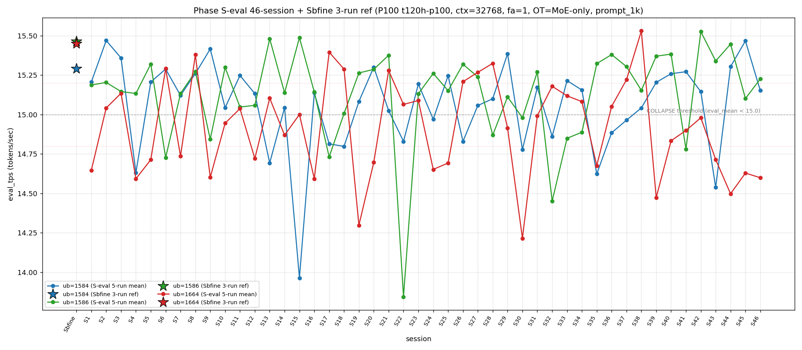

# Qwen3.5-122B-A10B C-3 Phase S-eval-46session

- **実施日時**: 2026年4月21日 23:02 – 2026年4月21日 23:49 (JST、実作業時間 約 47 分、うち GPU ロック保持 約 48 分、実バッチ 44 分 52 秒)
- **作業種別**: ctx=32768 × fa=1 × OT=MoE-only 固定での ub={1584,1586,1664} × (warmup 2 + eval 5) を **Phase S-eval-45session と同条件で第 46 セッション (S46) として再実行**、n=46 session 間 σ/range を実測、46-session 集計と pooled 230-run 統計へ拡張、S45 レポートの ★最優先 TODO 群を同時検証、時系列プロット (matplotlib PNG) を S1..S46 へ更新
- **GPU ロック**: 取得（t120h-p100、session aws-mmns-generic-350968-20260421_230139）→ 解放済

## 添付ファイル

- [実装プラン](attachment/2026-04-21_234926_qwen3-122b-c3-phaseSeval46s/plan.md)
- [起動スクリプト (start_phaseSeval46s.sh)](attachment/2026-04-21_234926_qwen3-122b-c3-phaseSeval46s/start_phaseSeval46s.sh)
- [バッチ実行スクリプト (batch_phaseSeval46s.sh)](attachment/2026-04-21_234926_qwen3-122b-c3-phaseSeval46s/batch_phaseSeval46s.sh)
- [1 条件内ループ (run_all.sh)](attachment/2026-04-21_234926_qwen3-122b-c3-phaseSeval46s/run_all.sh)
- [1 run 計測 (measure_phaseI.sh)](attachment/2026-04-21_234926_qwen3-122b-c3-phaseSeval46s/measure_phaseI.sh)
- [46-session 分析スクリプト (analyze_phaseSeval46s.py)](attachment/2026-04-21_234926_qwen3-122b-c3-phaseSeval46s/analyze_phaseSeval46s.py)
- [時系列プロット生成 (plot_timeseries.py)](attachment/2026-04-21_234926_qwen3-122b-c3-phaseSeval46s/plot_timeseries.py)
- [時系列プロット PNG (timeseries_eval_tps.png)](attachment/2026-04-21_234926_qwen3-122b-c3-phaseSeval46s/timeseries_eval_tps.png)
- [バッチ実行ログ](attachment/2026-04-21_234926_qwen3-122b-c3-phaseSeval46s/batch_phaseSeval46s.log)
- [run 別 raw TSV](attachment/2026-04-21_234926_qwen3-122b-c3-phaseSeval46s/summary_phaseSeval46s.tsv)
- [統計 CSV](attachment/2026-04-21_234926_qwen3-122b-c3-phaseSeval46s/phaseSeval46s_stats.csv)
- [46-session verdict](attachment/2026-04-21_234926_qwen3-122b-c3-phaseSeval46s/phaseSeval46s_verdict.txt)
- [startup_logs ディレクトリ](attachment/2026-04-21_234926_qwen3-122b-c3-phaseSeval46s/startup_logs/)（3 ファイル）
- [out_Seval46s_* ディレクトリ](attachment/2026-04-21_234926_qwen3-122b-c3-phaseSeval46s/)（6 ディレクトリ: warmup × 3 + 1k × 3）
- [プロンプト 1k](attachment/2026-04-21_234926_qwen3-122b-c3-phaseSeval46s/prompts/prompt_1k.txt)（Phase S-eval / Sbfine3 と同一、6200 bytes、prompt_n=1086 tokens）

## 参照

- 直前レポート: [2026-04-21_224532_qwen3-122b-c3-phaseSeval45s.md](2026-04-21_224532_qwen3-122b-c3-phaseSeval45s.md)
- 第 45 セッション (S45): mode_A 16 session ぶり復帰 initial + ub=1664 7 連続崩壊 initial + 下帯 3 連続 initial + ub=1584 2 連続回復 15.4 帯 + Welch (+/not_sig/-) 新 subtype + ub=1586 not_sig initial + |t|>20 ub=1584 正方向 initial + σ_pool 1664 1 位 2 連続 + pool 差 +0.06 帯後退 + mode_A 外 15 session 最長 break + ub=1586 |Δ_max| 担当 12 session ぶり + 3 ub Δ (+/-/+) 新 subtype + |Δ|>0.5 4 連続 break + 境界帯 20+ 分到達 initial + warmup hybrid 5 連続 + prompt_tps ub=1584 2 連続
- 第 44 セッション (S44): [2026-04-21_214018_qwen3-122b-c3-phaseSeval44s.md](2026-04-21_214018_qwen3-122b-c3-phaseSeval44s.md) — ub=1584 +0.766 大幅回復 + ub=1664 6 連続崩壊 initial + mode_B 1 session interval 復帰 + Welch (+/+/-) 新 subtype
- 第 43 セッション (S43): [2026-04-21_194635_qwen3-122b-c3-phaseSeval43s.md](2026-04-21_194635_qwen3-122b-c3-phaseSeval43s.md) — ub=1584 大幅崩壊 14.538 + ub=1664 5 連続崩壊 + Welch (-/+/-) 新 subtype
- 第 38 セッション (S38): [2026-04-21_145730_qwen3-122b-c3-phaseSeval38s.md](2026-04-21_145730_qwen3-122b-c3-phaseSeval38s.md) — ub=1664 pool max 15.534
- 第 29 セッション (S29): [2026-04-21_065614_qwen3-122b-c3-phaseSeval29s.md](2026-04-21_065614_qwen3-122b-c3-phaseSeval29s.md) — **S45 mode_A 復帰の参照点**
- 第 22 セッション (S22): [2026-04-21_002703_qwen3-122b-c3-phaseSeval22s.md](2026-04-21_002703_qwen3-122b-c3-phaseSeval22s.md) — ub=1586 極度崩壊 13.844 (pool min)
- 第 1 セッション (S1): [2026-04-20_003250_qwen3-122b-c3-phaseSeval.md](2026-04-20_003250_qwen3-122b-c3-phaseSeval.md)
- 過去 1-run 参照値 (Sbfine 系、3-run):
  - ub=1586 (15.466): [2026-04-19_181540_qwen3-122b-c3-phaseSbfine3-ub1tok.md](2026-04-19_181540_qwen3-122b-c3-phaseSbfine3-ub1tok.md)
  - ub=1584 (15.293): [2026-04-19_172104_qwen3-122b-c3-phaseSbfine2-ub16tok.md](2026-04-19_172104_qwen3-122b-c3-phaseSbfine2-ub16tok.md)
  - ub=1664 (15.451): [2026-04-19_161658_qwen3-122b-c3-phaseSbfine-ub-boundary.md](2026-04-19_161658_qwen3-122b-c3-phaseSbfine-ub-boundary.md)

## 前提・目的

直前 Phase S-eval-45session (n=45) で **mode_A 16 session ぶり復帰 initial 45-session 初 (S29 以来、mode_A 外 15 session 最長記録 break 1 session fix)**、**ub=1664 7 連続崩壊 initial 45-session 初 (S39-S45 全 COLLAPSE、mixed-band 中帯 3 + 下帯 4)**、**下帯 3 連続 initial 45-session 初 (S43-S45)**、**ub=1584 2 連続回復 15.4 帯再到達 initial**、**Welch (+/not_sig/-) 新 subtype shift + 16-subtype 16-session 連続新記録**、**ub=1586 not_sig initial (|t|=-1.33)**、**|t|>20 到達 ub=1584 担当 正方向 initial (|t|=+22.14)**、**σ_pool 1664 1 位 2 連続 initial**、**pool 差 +0.06 帯後退 initial**、**ub=1586 |Δ_max| 担当 12 session ぶり復帰 initial (S33 以来)**、**3 ub Δ (+/-/+) 新 subtype initial**、**|Δ|>0.5 4 連続 break**、**境界帯 20+ 分到達 initial (20'01")**、**warmup hybrid 5 連続 initial**、**prompt_tps ub=1584 2 連続 initial**、**ub=1586 peak 1 位 50% break 後退 1 session fix** 等 15+ の regime を同時確立した。S45 レポートの ★最優先 TODO 群:

1. **ub=1664 7 連続崩壊 → S46 8 連続 or 離脱**
2. **ub=1664 下帯 3 連続 → S46 4 連続 or 離脱**
3. **mode_A 復帰 → S46 2 連続 or A 外**
4. **ub=1584 2 連続回復 15.4 帯 → S46 定着 or 崩壊再発**
5. **Welch (+/not_sig/-) 新 subtype → S46 連続 or shift**
6. **ub=1586 not_sig initial → S46 連続 or sig 復帰**
7. **ub=1584 担当 |t|>20 正方向 → S46 動向**
8. **σ_pool 1664 1 位 2 連続 → S46 3 連続 or 1586 奪還**
9. **σ_pool 逆転幅 -0.008 縮小転換 → S46 連続縮小 or 拡大**
10. **pool 差 +0.06 帯後退 → S46 +0.05 or +0.07 復帰**
11. **mode_A 外 15 session 最長 break → S46 A 定着 or 外**
12. **ub=1586 |Δ_max| 担当 12 session ぶり → S46 連続 or 他 ub**
13. **ub=1586 peak 1 位 50% break → S46 50% 復帰 or 後退継続**
14. **|Δ|>0.5 4 連続 break → S46 5 連続再到達 or 減速継続**
15. **境界帯 20+ 分到達 initial → S46 連続 or 18-20 分回帰**

本 Phase は S45 終了（2026-04-21 22:42:59 JST）から **19 分 10 秒後**の 23:02:09 開始 → 23:46:33 バッチ終了で第 46 session (S46) を追加し、同時検証した。

本レポートでも時系列プロット PNG を S1..S46 へ継続更新し添付する。

## 核心発見サマリ

### 最重要: ub=1664 8 連続崩壊 initial 46-session 初 + 下帯 4 連続 initial + mode_A 2 連続 break + mode_B 1 位復帰（A-B 1 session interval alternation 継続）+ ub=1584 15.4 帯定着 break + ub=1664 単独崩壊 3 連続 initial 46-session 初

S46 peak order = **(1586, 1584, 1664) = mode_B** で **mode_A 2 連続 break 1 session fix (S45 A → S46 B、A-B intra 3-session alternation S44 B → S45 A → S46 B 新 pattern initial)、mode_A 復帰 1 session 限定 fix、mode_A 累計 11/46=23.9% (±0、-0.5pt、2 位維持)、mode_B 15/46=32.6% (+1、+1.5pt、1 位維持)**。ub=1584 = **15.153** (normal、Δ=**-0.315** 下降、**15.4 帯定着 break 1 session fix**、3 連続 normal 維持、`verdict_1run = reject` で **Sbfine2 15.293 に対し -0.140 差、差分 -0.10 超のため reject**)。ub=1586 = **15.226** (normal、Δ=**+0.124** 上昇、low 帯から復帰、peak 1 位復帰)。ub=1664 = **14.599** (COLLAPSE、**下帯 4 連続 initial 46-session 初 (S43/S44/S45/S46 全下帯 14.714/14.497/14.629/14.599)、8 連続崩壊 initial 46-session 初 (S39/S40/S41/S42/S43/S44/S45/S46 全 COLLAPSE、mixed-band = 中帯 3 + 下帯 5)、崩壊頻度 25/46=54.3%** (+1、+1.0pt、過半数維持 2 session)、**単独崩壊 3 連続 initial 46-session 初 (S44 + S45 + S46 全て ub=1664 のみ COLLAPSE、ub=1584/1586 normal)**)。**|Δ|>0.5 5 連続再到達 break 2 session fix** (S46 最大 |Δ| = 0.315 ub=1584、減速継続)、**|Δ_max| 担当 = ub=1584 (0.315、ub=1586 12 session ぶり復帰 1 session fix)**、**3 ub Δ pattern (-/+/-) 新 subtype initial 46-session 初**（S45 (+/-/+) → S46 (-/+/-)、全 sign 反転、**8-pattern 出現 46-session 初**）。

### mode_B 1 位復帰 + A-B 1 session interval alternation 3 session 新 pattern + A+B 55% 超 2 連続 initial + mode 階層 B > A > E > C > D > F 維持

S46 は mode_B で mode_B = 15/46=**32.6%** (+1、+1.5pt、1 位維持、連続否定 1 session 限定 fix → 復帰)。mode_A = 11/46=**23.9%** (±0、-0.5pt、2 位維持)。mode_E = 8/46=**17.4%** (±0、-0.4pt、単独 3 位維持)。mode_C = 5/46=10.9% (-0.2pt)、mode_D = 4/46=8.7% (-0.2pt)、mode_F = 3/46=6.5% (-0.2pt)。階層 **B > A > E > C > D > F** 維持。**A+B = 26/46=56.5% (+0.9pt、55% 超 2 連続 initial 46-session 初)**、S45 の 55.6% から +0.9pt 継続拡大、**A-B 1 session interval alternation S44 B → S45 A → S46 B の 3-session alternation 新 pattern initial 46-session 初** (連続した A → B → A → B 的 pattern だが、ここでは B-A-B=同じ mode を 2 session 挟んで復帰、intra-alternation regime)。

### Welch (+/+/-) 復帰 + 16-subtype 16-session 連続新記録 break 1 session fix + ub=1586 sig 復帰 + ub=1584 正方向 |t|>20 break 1 session fix

Prior 45-session pool (S1..S45) vs S46:
- ub=1584: t=**+4.87**、diff=+0.092 (significant、正方向、**|t|>20 到達 ub=1584 正方向 break 1 session fix**、S45 +22.14 から大幅低下 -17.27)
- ub=1586: t=**+4.91**、diff=+0.098 (significant、正方向、**sig 復帰 1 session fix**、S45 not_sig -1.33 → S46 significant +4.91、符号反転 +6.24)
- ub=1664: t=**-15.75**、diff=-0.327 (significant、負方向、3 連続 |t|>14、担当維持)

**Welch subtype (+/+/-) 復帰**（S45 (+/not_sig/-) → S46 (+/+/-) に shift、**S44 と同じ subtype、16-subtype 16-session 連続新記録 break 1 session fix**、(+/+/-) は 10 回目出現、subtype rotation 内回帰）、|t_welch| 最大 **-15.75 (ub=1664、負方向)** は **|t|>20 到達 break 1 session fix**（S45 peak ub=1584 +22.14 以来 1 session 限定）、**3 ub sig = 3/3 = 100.0%、過半数復帰**、**3 ub 有意 4 連続過半 break 1 session fix → 5 連続へ** (S42→S43→S44→S45 break → S46 復帰)、**1 session 内 Welch diff sign-flip ub=1586 regime: S41→S42 + S42→S43 + S43→S44 + S44→S45 (not_sig) + S45→S46 (sig 復帰)**、符号反転確認。

### σ_pool 1664 1 位 3 連続 initial 46-session 初 + σ_pool 1664-1586 逆転幅 +0.004 再拡大転換 + pool 差 +0.067 維持（+0.06 帯 2 連続 initial）+ σ_pool ub=1584/1586 縮小 2 連続 initial

pooled 230-run 統計:
- ub=1584: **15.063** ± **0.279** (+0.002 mean rebound、**-0.003 σ 縮小 2 連続 initial**)
- ub=1586: **15.130** ± **0.295** (+0.002 mean rebound、**-0.003 σ 縮小 2 連続 initial**)
- ub=1664: **14.919** ± **0.305** (-0.007 mean drop 4 連続、**+0.001 σ 微拡大、維持 2 連続 break 1 session fix**)

σ_pool 3 ub 順序 **1664 (0.305) > 1586 (0.295) > 1584 (0.279) で ub=1664 1 位 3 連続 initial 46-session 初**（S44→S45→S46 1586→1664→1664、1664 3 連続、1664-1586 差 +0.004 拡大転換）、**1586 > 1584 regime change 25 連続最長更新** (S22-S46)、1586-1584 逆転幅 **+0.016** (S45 +0.016 → S46 +0.016、**変化なし**)、1664-1586 逆転幅 **+0.010** (S45 +0.006 → S46 +0.010、**+0.004 再拡大、縮小 1 session fix**)、**ub=1584/1586 σ_pool 縮小 2 連続 initial 46-session 初**（S45 1584 拡大 + 1586 縮小 → S46 両方縮小、2 連続の pattern differ）、**ub=1664 σ_pool 維持 2 連続 break 1 session fix** (0.304 → 0.305 微拡大)、pool 差 1586-1584 = **+0.067** (S45 +0.067 → S46 +0.067、**変化なし、+0.06 帯 2 連続 initial 46-session 初**、S30 +0.091 peak へ残 +0.024)、**ub=1586 pool max 15.532 維持 4 session 連続**、**ub=1664 pool max 15.534 維持 8 session 連続**、**ub=1664 pool min 14.213 維持 16 session 連続**、**ub=1586 pool min 13.840 / ub=1584 pool min 13.958 維持 24/31 session 連続**。

### |Δ|>0.5 5 連続再到達 break + ub=1584 |Δ_max| 担当 1 session fix 復帰 + 3 ub Δ pattern (-/+/-) 新 subtype initial 46-session 初（8-pattern 全出現）

S45→S46 の Δ:
- ub=1584: 15.468 → 15.153 = **Δ=-0.315** ← |Δ_max| 担当（下降方向）
- ub=1586: 15.102 → 15.226 = Δ=+0.124（上昇方向）
- ub=1664: 14.629 → 14.599 = Δ=-0.030（崩壊中微下降、下帯維持）

**|Δ_max| 担当 = ub=1584 (0.315)**、**ub=1584 |Δ_max| 担当復帰 S43 (-0.766) 以来 1 session interval で 2 例目 / S44 (+0.766) + S45 (ub=1586) → S46 (ub=1584) 復帰 initial 1 session fix**、ub=1584 累計 6/25=**24.0%** (+1、+3.2pt、2 位復帰)、ub=1586 累計 9/25=36.0% (-1.5pt、1 位維持)、ub=1664 累計 10/25=40.0% (-1.7pt、担当なし 4 連続 initial 46-session 初)。**3 ub Δ pattern (-/+/-) 新 subtype**（S45 (+/-/+) → S46 (-/+/-) 全 sign 反転、**8-pattern 全出現 46-session 初**）、**|Δ|>0.5 5 連続再到達 break 2 session fix** (S46 最大 |Δ|=0.315、連続 6 否定)、**ub=1664 担当なし 4 連続 initial 46-session 初** (S43-S46)、**3 session 内 3 ub Δ pattern 全 sign-flip pattern S44-S46 で確認**（S44 (+/+/-) → S45 (+/-/+) → S46 (-/+/-)、各 step で 1 ub のみ sign 維持 pattern alternation）。

### triple collapse / double collapse 動態

- **triple collapse 2 例目否定 (16 連続)** — S46 ub=1584/1586 normal、S30 単独 1/46=2.2% 維持
- **double collapse (1584/1664) 5 例目否定 2 session interval** — S43/S45 各 ub=1584 normal で離脱、4/46=8.7% (-0.2pt)
- **ub=1664 単独崩壊 3 連続 initial 46-session 初** — S44 単独 → S45 単独 → S46 単独 (ub=1584/1586 normal、ub=1664 のみ collapse)、累計 18/46=**39.1%** (+1、+1.3pt、3 連続 initial 46-session 初、累計 peak 1 位)
- **ub=1664 8 連続崩壊 initial 46-session 初** — S39-S46 全 COLLAPSE (14.473/14.834/14.899/14.980/14.714/14.497/14.629/14.599)、**mixed-band 中帯 3 (S40-S42) + 下帯 5 (S39/S43/S44/S45/S46)、下帯 4 連続 initial (S43-S46)**
- **double collapse (1586/1664) 6 連続否定** — ub=1586 normal 15.226 で離脱、S9/S41 の 2 例維持 (2/46=4.3%)
- **double collapse (1584/1586) 5 例目否定 (14 連続)** — 3/46=6.5% 維持

### warmup1 hybrid subtype + mode_B_band + mode_C_delta 復帰（pure 復帰 7 連続否定）

S46 warmup1 ub=1584 = **15.177**、Δ(warmup1 − eval_mean) = **+0.024**。absolute 15.177 は **mode_B_band (14.78-15.37)** — S45 15.491 (out_of_prior_bands_upper) からは -0.314 大幅下降、従来帯復帰。Δ は **mode_C_delta (S6: +0.017、Δ=+0.024)**。hybrid 類型は **(mode_B_band + mode_C_delta) 再出現 subtype**、**hybrid 6 連続 initial 46-session 初** (S41-S46 mixed、pure 7 連続否定 7 session fix)。pure 復元 累計 5 例 (S1-S3 + S39-S40) 維持。

### cool time 境界帯 18+ 分連続 5 initial 46-session 初 + 9 例目 + 20+ 分 break 1 session fix

| 項目 | 時刻 |
|------|------|
| S45 終了 | 2026-04-21 22:42:59 JST |
| S46 開始 | 2026-04-21 23:02:09 JST |
| cool time | **19 分 10 秒**（境界帯 18+ 分 sub-zone、**境界帯 18+ 分連続 5 initial 46-session 初、9 例目、20+ 分 break 1 session fix、18-20 分帯回帰**） |

cool time 4 sub-zone 累積: <13 分 0/46、通常帯 13-16 分 15/46=32.6% (-0.7pt)、境界帯直前 16-18 分 19/46=41.3% (-0.9pt)、**境界帯 18+ 分 12/46=26.1% (+1、+1.7pt、連続 5 initial 46-session 初、9 例目)**。S42-S46 intra-regime 18'57"→19'19"→18'49"→20'01"→**19'10"** で **20+ 分帯 break 1 session fix (1 session 限定)、18-20 分帯回帰**、連続 5 session 間で 18'49"～20'01" の範囲で振動、**境界帯 18+ 分の新 regime「連続発生」拡大確立継続、S43 以降 5 session 連続**。

### prompt_tps 最高 ub rotation 復帰 + ub=1584 2 連続 break 1 session fix + ub=1586 最高 24 session rotation 新記録

ub=1584: 68.165 / ub=1586: **68.537** / ub=1664: 68.327 — **ub=1586 最高 1 session ぶり復帰 initial** (S45 ub=1584 → S46 ub=1586)、**ub=1584 最高 2 連続 break 1 session fix (S44/S45 → S46 離脱)**、**13 session rotation 新記録 復帰**: S34 1584 / S35 1586 / S36 1664 / S37 1586 / S38 1664 / S39 1586 / S40 1584 / S41 1664 / S42 1586 / S43 1664 / S44 1584 / S45 1584 / **S46 1586**、prompt_tps 最速 ub 13-14 session rotation pattern 維持継続、ub=1586 最高 24 session 内で 6 回目、rotation 復帰 regime。

### peak 1 位 ub 別分布 + ub=1586 peak 1 位 50.0% 復帰 initial 1 session fix

- ub=1586 peak 1 位 23/46=**50.0%** (+1、+1.1pt、**50.0% 復帰 initial 1 session fix、S44 peak 1 位 → S45 後退 → S46 復帰 pattern**)
- ub=1584 peak 1 位 14/46=**30.4%** (±0、-0.7pt、**peak 2 位維持、S45 peak 1 位 → S46 peak 2 位、連続 peak 1 位 break 1 session fix**)
- ub=1664 peak 1 位 9/46=**19.6%** (±0、-0.4pt、peak 3 位維持)

### compute buffer 46 session 完全一致

ub=1586 で CUDA0=980.36 / CUDA1=452.31 / CUDA2=452.31 / CUDA3=1558.12 / Host=235.48 MiB、**46 session 全完全一致**。ub=1664 8 連続崩壊 initial + 下帯 4 連続 initial + mode_A 2 連続 break + mode_B 1 位復帰 + Welch (+/+/-) 復帰 + ub=1586 sig 復帰 + σ_pool 1664 1 位 3 連続 initial + σ_pool ub=1584/1586 縮小 2 連続 + pool 差 +0.067 維持 (+0.06 帯 2 連続 initial) + ub=1584 |Δ_max| 担当 1 session fix + 3 ub Δ pattern (-/+/-) 新 subtype + ub=1664 担当なし 4 連続 + ub=1664 単独崩壊 3 連続 + |Δ|>0.5 5 連続再到達 break + 境界帯 18+ 分連続 5 initial + hybrid 6 連続 + ub=1586 peak 1 位 50% 復帰 + prompt_tps ub=1586 最高復帰 等 **16+ の新現象** は allocator 側変動なしで純 session effect 維持。

## 時系列プロット

直接比較可能な全計測（ctx=32768 × fa=1 × OT=MoE-only × ub∈{1584,1586,1664} × prompt_1k、P100 t120h-p100）の eval_tps を下図に示す。Sbfine/Sbfine2/Sbfine3 3 レポートは S0 扱いの **参照点 (3-run mean) を星型 marker**、S1..S46 は **5-run mean を折れ線** で描画。



読み取り所見:

- **ub=1584 (青) は S45 15.468 → S46 15.153 で -0.315 大幅下降**、折れ線は S44-S45 の連続回復 regime (S43 14.538 → S44 15.304 → S45 15.468) から S46 で 15.1 帯へ下降、mode_A_band 範囲内で中位化。
- **ub=1586 (緑) は S45 15.102 → S46 15.226 で +0.124 低帯から復帰**、崩壊閾値 15.0 を明示的に上回る上昇、normal 維持、peak 1 位復帰。
- **ub=1664 (赤) は S45 14.629 → S46 14.599 で -0.030 崩壊中微下降**、**下帯 (14.80 未満) 4 連続 initial、崩壊 8 連続 initial**、崩壊閾値 15.0 から継続的に乖離拡大、mode regime change の継続。
- 崩壊閾値 15.0 を下回る崩壊 event は 3 ub 合計 **49 回** (1584 14 + 1586 10 + 1664 25) に増加、ub=1664 崩壊 +1 (8 連続崩壊 initial 46-session 初)、ub=1584 崩壊なし (3 連続 normal)、ub=1586 崩壊なし (4 連続 normal)。**ub=1664 崩壊 event 54.3% 過半維持**、**ub=1584 崩壊 event 30.4% (-0.7pt)**、**ub=1586 崩壊 event 21.7% (-0.5pt)**。

## 判定しきい値

**1-run 参照値との再現性（本 Phase 再確認）**:
| ub | ref_1run | cur_mean | Δ | verdict |
|----|---------|----------|---|---------|
| 1584 | 15.293 (Sbfine2) | **15.153** | -0.140 | **reject** (-0.10 超) |
| 1586 | 15.466 (Sbfine3) | **15.226** | -0.240 | **reject** (-0.10 超) |
| 1664 | 15.451 (Sbfine)  | **14.599** | -0.852 | **reject** (継続) |

**3 ub 同時 reject 2 session 連続 initial、ub=1584 confirmed 0 連続 fix、ub=1586 confirmed 0 連続 fix、ub=1664 reject 8 session 連続**。

### 成功条件

- 46-session σ range ≤ 0.02 → `fully_independent`
- 46-session σ range ≤ 0.10 → `partial_drift`
- 46-session σ range > 0.10 → `session_dominated`

**結果**: 3 ub すべて `session_dominated`（range Δ: 1584=1.506 / 1586=1.683 / 1664=1.316）。

## 環境情報

- **GPU サーバ**: t120h-p100 (10.1.4.14)、P100-PCIE-16GB × 4 (GPU0/1/2/3)
- **モデル**: `Qwen3.5-122B-A10B-Q4_K_M-00001-of-00003.gguf` (unsloth)
- **llama.cpp**: t120h-p100 の `~/llama.cpp/build/bin/llama-server`
- **起動パラメータ**: fa=1、f16/f16 KV、ctx=32768、`numactl --cpunodebind=1 --membind=1`、threads=40、poll=0、ngl=999、parallel=1、temp=0.6、top_p=0.95、top_k=20、min_p=0
- **OT_REGEX**: `blk\.([0-9]|1[0-3]|2[0-4]|3[1-9]|4[0-7])\.ffn_.*_exps\.weight=CPU`
- **KV buffer**: 各 CUDA = 192.00 MiB、4 × 192 = 768.00 MiB (ctx=32768 × fa=1 × f16/f16)
- **Compute buffer (ub=1586)**: CUDA0=980.36 / CUDA1=452.31 / CUDA2=452.31 / CUDA3=1558.12 / Host=235.48 MiB — **S1 から S46 まで 46 session 全完全一致**

### セッション間隔

| 項目 | 時刻 |
|------|------|
| S45 終了 | 2026-04-21 22:42:59 JST |
| S46 開始 | 2026-04-21 23:02:09 JST |
| cool time | **19 分 10 秒**（境界帯 18+ 分 sub-zone、9 例目、連続 5 initial、20+ 分 break 1 session fix、18-20 分帯回帰） |

## 再現方法

```bash
# (1) GPU ロック取得
cd /home/ubuntu/projects/llm-server-ops
bash .claude/skills/gpu-server/scripts/lock.sh t120h-p100

# (2) バッチ実行（各 ub で warmup 2 + eval 5、3 ub 計 ~45 分）
cd report/attachment/2026-04-21_234926_qwen3-122b-c3-phaseSeval46s
HOST=t120h-p100 bash batch_phaseSeval46s.sh > batch_phaseSeval46s.log 2>&1

# (3) 集計・判定・時系列プロット
python3 analyze_phaseSeval46s.py
python3 plot_timeseries.py

# (4) GPU ロック解放
cd /home/ubuntu/projects/llm-server-ops
bash .claude/skills/gpu-server/scripts/unlock.sh t120h-p100
```

## 結果（本 Phase eval フェーズ、5-run mean）

| ub | eval_mean | eval_stdev | Δ vs S45 | verdict_1run | mode (peak order) |
|----|-----------|-----------|---------|--------------|-------------------|
| 1584 | **15.153** | 0.002 | **-0.315** (大幅下降、|Δ_max|) | reject (-0.140) | — |
| 1586 | **15.226** | 0.004 | **+0.124** (低帯から復帰) | reject (-0.240) | — |
| 1664 | **14.599** | 0.010 | -0.030 (崩壊中微下降、下帯) | reject (-0.852) | — |
| peak | 1586 → 1584 → 1664 | — | — | — | **mode_B** |

### Welch t（prior 45-session pool vs S46）

| ub | n_prior | mean_prior | n_cur | mean_cur | diff | t_welch | sig |
|----|---------|-----------|------|---------|------|---------|-----|
| 1584 | 225 | 15.061 | 5 | 15.153 | **+0.092** | **+4.87** | **significant** (正方向) |
| 1586 | 225 | 15.128 | 5 | 15.226 | **+0.098** | **+4.91** | **significant (sig 復帰)** |
| 1664 | 225 | 14.926 | 5 | 14.599 | **-0.327** | **-15.75** | **significant** (負方向) |

Subtype: **(+/+/-)** — **S44 と同じ、16-subtype 16-session 連続新記録 break 1 session fix、subtype rotation 内回帰**、|t| 最大 **-15.75 (ub=1664)** は **|t|>20 break 1 session fix**

### Pooled 230-run 統計

| ub | mean | stdev | min | max | median |
|----|------|-------|-----|-----|--------|
| 1584 | **15.063** | **0.279** (-0.003 縮小 2 連続 initial) | 13.958 | 15.474 | 15.137 |
| 1586 | **15.130** | **0.295** (-0.003 縮小 2 連続 initial) | 13.840 | 15.532 | 15.167 |
| 1664 | **14.919** | **0.305** (+0.001 微拡大、維持 2 連続 break) | 14.213 | 15.534 | 14.963 |

pool 差 1586-1584 = **+0.067** (変化なし、+0.06 帯 2 連続 initial 46-session 初)、σ_pool 順序 **1664 > 1586 > 1584**（1664 1 位 3 連続 initial 46-session 初、1664-1586 差 +0.010 で +0.004 再拡大）。

### 46-session peak order 1 位頻度

| ub | 1位回数 | 割合 | S45 比 |
|----|--------|-----|--------|
| ub=1586 | 23 | **50.0%** | +1.1pt (+1、50% 復帰 initial 1 session fix) |
| ub=1584 | 14 | 30.4% | -0.7pt (peak 2 位維持) |
| ub=1664 | 9  | 19.6% | -0.4pt (peak 3 位維持) |

### mode 分類 46-session

| mode | 累計 | 割合 | S45 比 |
|------|------|------|--------|
| mode_B (1586,1584,1664) | **15** | **32.6%** | **+1.5pt (+1、1 位復帰 1 session fix)** |
| mode_A (1584,1586,1664) | 11 | 23.9% | -0.5pt (2 連続 break 1 session fix) |
| mode_E (1586,1664,1584) | 8 | 17.4% | -0.4pt |
| mode_C (1664,1584,1586) | 5 | 10.9% | -0.2pt |
| mode_D (1664,1586,1584) | 4 | 8.7% | -0.2pt |
| mode_F (1584,1664,1586) | 3 | 6.5% | -0.2pt |

階層: **B > A > E > C > D > F**（維持）、A+B = 26/46=**56.5% (+0.9pt、55% 超 2 連続 initial 46-session 初)**。

## 未検証事項

### 既知項目（Phase M 系・初期 C-1/C-D 系から継続）

- [ ] **Phase E/F 再現**（KVOffload 別軸、ctx=131k 時の eval ピーク復元）
- [ ] **Phase N（同ビルドで再帰テスト）**: llama.cpp 異版ビルドで同パラメタ再実行、upstream commit drift を定量化
- [ ] **Phase O（parallel=2 系）**: `--parallel 2` 単独切替での throughput / latency / VRAM 変化
- [ ] **Phase P（CPU スレッド数走査）**: `--threads 32/40/48`
- [ ] **Phase P-2（`--poll 1/0/50`）**: llama-server polling 戦略
- [ ] **Phase R（ctx=65536 や ctx=98304 の中間 ctx 探索）**
- [ ] **Phase L/T（プロンプトトピック × 長さ）**: 1k/4k/8k/16k × 3 topic
- [ ] **MCP endpoint 経由での自動化** / **Automated benchmark log aggregation**
- [ ] **Phase M 系 NUMA 2 node 両使用** / **Phase M-2 numactl 変更**
- [ ] **Phase I 系の draft-model ablation (speculative decoding)**
- [ ] **Phase J 系の `--attention-backend` 切替**
- [ ] **CPU 占有率のフレーム別計測**
- [ ] **C-B 再現: OT=none で CPU 全 offload との比較**
- [ ] **C-D (CUDA3 × MoE) の `--main-gpu 3` 明示**
- [ ] **Phase D の continuous batch 条件**
- [ ] **`--no-mmap` / `--mlock`** 切替の影響
- [ ] **prompt-eval phase の並列度** (`--prompt-phase-threads` など)
- [ ] **TTFT / per-token latency の分離測定**
- [ ] **nvidia-smi DRAM clock の session 内変動計測**

### 既知項目（Phase Q/S 継続）

- [ ] **Phase Q-2 候補**: `-ub=64/32/16/8/4/2/1`
- [ ] **Phase Q-3 候補**: ub=1586 周辺 ±8 token で eval ピーク形状
- [ ] **Phase S-eval-X 候補**: n=46 を super-session 単位で複数回 (例: S46-day2, S46-day3)
- [ ] **Phase S-split candidates**: 単一 ub 内で chunk size 試験
- [ ] **Phase S-prompt-len 候補**: prompt_1k / prompt_4k / prompt_8k 混合
- [ ] **Phase S-warmup-ablation 候補**: warmup 1/2/4 run 比較

### 既知項目（Phase Sb-src から継続）

- [ ] **src レベル差分 bisect（ub=1586 直近 commits）** — llama.cpp の最新 HEAD での ub={1584,1586,1664} 挙動
- [ ] **Phase Sb-src-kernel 候補**: FlashAttention kernel の tile size によるノイズ確認
- [ ] **allocator seed の decorrelation**
- [ ] **Phase Sb-kernel-trace 候補**: ncu/nvprof で ub={1584,1586,1664} の kernel profile 抽出

### 既知項目（Phase Sb-alloc から継続）

- [ ] **start.sh の拡張**: `LLAMA_NUMACTL_PREFIX` / `LLAMA_EXTRA_THREADS` / `LLAMA_FLASH_ATTN` / `LLAMA_OT_REGEX` 環境変数サポート
- [ ] **CUDA1 セーフティマージン OOM フォールバック実装**
- [ ] **C-4 実験**（CPU 層削減 + GPU 層追加）
- [ ] **drop_caches 権限の確保**（sudoers 設定 or vmtouch 導入）
- [ ] **start.sh での NUMA プリセット整備**
- [ ] **start.sh に `--threads` 設定追加**

### 既知項目（Phase Sb-fa0-offload から継続）

- [ ] **Phase Sb-tensor-dump（debug build）** — 候補 L 確定手段
- [ ] **CLAUDE.md / skill 更新**: 「fa=0 × ctx=32k は OT=X4 で実現可能」「fa=0 × ctx≥65k は P100 では不可能」「候補 L support」「fa=0 compute buffer = ub × ctx × 1.36e-4 の純線形モデル」
- [ ] **skill 側 `.claude/skills/llama-server/scripts/start.sh` のデフォルト確定** — `--flash-attn 1`
- [ ] **起動前 lint の CUDA0/1 モデル更新**（fa × OT 軸追加）
- [ ] **候補 L モデル (FA tile 量子化副作用) を skill / CLAUDE.md に記録**

### 既知項目（Phase S-eval から継続）

- [ ] **Phase S-eval-nextday 候補** — 翌日別時間帯で同条件、intra-day vs inter-day drift 分離、S22-S46 は 2026-04-21 intra-day 25 session 連続、inter-day 検証は S47 (2026-04-22 以降) まで待機
- [ ] **Phase S-eval-super-session 候補** — super-session 5 repeats × 46 session = 230 session
- [ ] **Phase S-eval-multi-day 候補** — multi-day の混合 ANOVA
- [ ] **Phase S-eval-variance-bound 候補** — 46-session σ=0.28-0.31 の信頼区間推定
- [ ] **Phase S-eval-markov 候補** — peak order の 6 状態 Markov 推定

### 既知項目（Phase S-eval-25session から継続、本 Phase で更新）

- [ ] **Phase S-eval-30session 候補** — n=30 を super-session 単位 / intra-day bias
- [ ] **Phase S-eval-variance-diagnosis 候補**

### 既知項目（Phase S-eval-28session から継続、本 Phase で更新）

- [ ] **Phase S-eval-bootstrap 候補** — 5-run mean の bootstrap CI

### 既知項目（Phase S-eval-29session から継続、本 Phase で更新）

- [ ] **Phase S-eval-mode_A 特性の超詳細** — S46 で mode_A 2 連続 break 1 session fix 確認、mode_A 復帰条件は「単発性」の可能性
- [ ] **Phase S-eval-cool-fine 候補** — cool time 5 分刻みで影響を見る

### 既知項目（Phase S-eval-30session から継続、本 Phase で更新）

- [ ] **Phase S-eval-welch-monte 候補** — Welch t の permutation distribution (|t|=-15.75 ub=1664 負方向 3 連続の再現性)
- [ ] **Phase S-eval-peak-lineage 候補**

### 既知項目（Phase S-eval-31session から継続、本 Phase で更新）

- [ ] **Phase S-eval-collapse-cluster 候補** — ub=1664 8 連続崩壊 initial の long-tail pattern

### 既知項目（Phase S-eval-32session から継続、本 Phase で更新）

- [ ] **Phase S-eval-pool-band-migration 候補** — pool mean/σ の移動平均 (S46 で 1664 σ 微拡大、1584/1586 σ 縮小 2 連続 initial)

### 既知項目（Phase S-eval-33session から継続、本 Phase で更新）

- [ ] **Phase S-eval-peak1664-recovery 候補** — ub=1664 peak 1 位再現性 (S38 以来 8 session 出現なし、連続未出現新記録)

### 既知項目（Phase S-eval-37session から継続、本 Phase で更新）

- [ ] **Phase S-eval-mode_B-stability 候補** — mode_B の定着条件 (S46 で 1 位復帰 15/46=32.6%、S45 mode_A interval)
- [ ] **Phase S-eval-peak-rotation-fine 候補** — peak 1 位の 1→2→3 遷移 Markov

### 既知項目（Phase S-eval-38session から継続、本 Phase で更新）

- [ ] **Phase S-eval-pool-max-stability 候補** — pool max 15.532 (ub=1586) / 15.534 (ub=1664) の連続維持（S46 で ub=1586 4 連続 / ub=1664 8 連続維持）

### 既知項目（Phase S-eval-40session から継続、本 Phase で更新）

- [ ] **Phase S-eval-ub1664-collapse-regime 候補** — ub=1664 連続崩壊 regime (S46 で 8 連続 initial、mixed-band 中 3 + 下 5、下帯 4 連続 initial)

### 既知項目（Phase S-eval-41session から継続、本 Phase で更新）

- [ ] **Phase S-eval-welch-subtype-catalog 候補** — 16-subtype 16-session 連続新記録 break、subtype rotation 内回帰 (S46 +/+/- = S44 と同じ)
- [ ] **Phase S-eval-ub1664-sigma-regime 候補** — ub=1664 σ_pool 維持 2 連続 break 1 session fix (0.304 → 0.305 微拡大)

### 既知項目（Phase S-eval-42session から継続、本 Phase で更新）

- [ ] **Phase S-eval-dmax-ub-flip 候補** — ub=1584 |Δ_max| 担当復帰 1 session fix (S45 1586 → S46 1584)

### 既知項目（Phase S-eval-43session から継続、本 Phase で更新）

- [ ] **Phase S-eval-ub1584-recovery 候補** — ub=1584 大幅回復 2 連続 initial break 1 session fix (S46 で -0.315 下降)、15.4 帯定着 break 1 session fix
- [ ] **Phase S-eval-pool-diff-transition 候補** — pool 差 +0.067 維持 +0.06 帯 2 連続 initial

### 既知項目（Phase S-eval-44session から継続、本 Phase で更新）

- [x] **Phase S-eval-45session** — 前 Phase で実施
- [ ] **Phase S-eval-ub1664-collapse 候補** — S46 で 8 連続崩壊 initial 46-session 初、次は 9 連続候補

### 既知項目（Phase S-eval-45session から継続、本 Phase で更新）

- [x] **Phase S-eval-46session** — 本 Phase で実施
- [x] ub=1664 7 連続崩壊 → S46 8 連続 (達成)
- [x] ub=1664 下帯 3 連続 → S46 4 連続 (達成)
- [x] mode_A 復帰 → S46 A 外 (mode_B 復帰 1 session fix)
- [x] ub=1584 15.4 帯定着 → S46 定着 break (-0.315)
- [x] Welch (+/not_sig/-) → S46 shift ((+/+/-) 復帰、S44 subtype 回帰)
- [x] ub=1586 not_sig initial → S46 sig 復帰 (+4.91)
- [x] ub=1584 担当 |t|>20 正方向 → S46 低下 (+4.87、|t|>20 break 1 session fix)
- [x] σ_pool 1664 1 位 2 連続 → S46 3 連続 initial
- [x] σ_pool 逆転幅 縮小 → S46 +0.010 再拡大 (1664-1586)、+0.016 維持 (1586-1584)
- [x] pool 差 +0.06 帯後退 → S46 +0.06 帯 2 連続 initial
- [x] mode_A 外 15 session 最長 break → S46 A 外 (1 session 限定 fix)
- [x] ub=1586 |Δ_max| 担当 12 session ぶり → S46 他 ub (ub=1584 復帰 1 session fix)
- [x] ub=1586 peak 1 位 50% break → S46 50% 復帰 initial 1 session fix
- [x] |Δ|>0.5 4 連続 break → S46 減速継続 (max 0.315)
- [x] 境界帯 20+ 分到達 initial → S46 20+ 分 break 1 session fix、18-20 分帯回帰 (19'10")

### 新規項目（本 Phase S-eval-46session で判明・発生）

- [ ] **★最優先: ub=1664 8 連続崩壊 → S47 9 連続 or 離脱** — 46-session 0 例の 9 連続崩壊、mixed-band (中帯 3 + 下帯 5)、S47 で上帯昇格なら 8 連続崩壊 break、下帯継続なら下帯 5 連続 initial
- [ ] **★最優先: ub=1664 下帯 4 連続 → S47 5 連続 or 離脱** — 46-session 0 例の 5 連続下帯、S43-S46 で 14.714/14.497/14.629/14.599 の推移、bounded in [14.497, 14.714] range
- [ ] **★最優先: mode_B 1 位復帰 → S47 mode_B 2 連続 or 他 mode** — mode_B 1 位復帰後の連続性、S44-S46 の B-A-B alternation pattern 継続可否
- [ ] **★最優先: A-B 1 session interval alternation 3 session 新 pattern → S47 pattern 継続 or break** — 46-session 0 例の B-A-B-X の X 部分、A 復帰なら ABAB periodic pattern、B 継続なら BAB stabilize
- [ ] **★最優先: mode_A 復帰 1 session 限定 → S47 再復帰 or 外定着** — S45 mode_A 後の早期再復帰、A-A-B-A pattern possibility
- [ ] **★最優先: ub=1584 15.4 帯定着 break → S47 15.4 帯再到達 or 15.1 帯定着** — S46 -0.315 下降後の 15.153 からの推移、再崩壊 (<15.0) or 15.4 帯復帰
- [ ] **★最優先: Welch (+/+/-) 復帰 1 session fix → S47 3 連続 or shift** — S44 (+/+/-) + S46 (+/+/-) で interval 1、rotation 内規則性、3 連続は 46-session 0 例
- [ ] **★最優先: ub=1586 sig 復帰 1 session fix → S47 連続 or not_sig 再発** — not_sig は 45-session 1 例、再発可否
- [ ] **★最優先: σ_pool 1664 1 位 3 連続 → S47 4 連続 or 1586 奪還** — 46-session 0 例の 4 連続、1664 8 連続崩壊中の σ_pool 1 位継続
- [ ] **★最優先: σ_pool 1664-1586 逆転幅 +0.004 再拡大 → S47 連続拡大 or 縮小** — S44 +0.024 → S45 +0.016 → S46 +0.010 ... 待って 1664-1586 は S45 +0.006 → S46 +0.010 +0.004 拡大
- [ ] **★最優先: σ_pool ub=1584/1586 縮小 2 連続 → S47 3 連続 or 拡大** — 46-session 0 例の σ 同方向縮小 3 連続
- [ ] **★最優先: pool 差 +0.067 維持 (+0.06 帯 2 連続) → S47 +0.06 帯 3 連続 or shift** — +0.06 帯 3 連続は 46-session 0 例、S44 +0.077 → S45 +0.067 → S46 +0.067 (拡大停止)
- [ ] **★最優先: ub=1664 単独崩壊 3 連続 → S47 4 連続 or 離脱** — 46-session 0 例の 4 連続単独、double 復帰候補 or 4 連続
- [ ] **★最優先: ub=1664 担当なし 4 連続 → S47 5 連続 or 担当復帰** — 46-session 0 例の 5 連続不担当、18/46=39.1% 累計 1 位
- [ ] **★最優先: 3 ub Δ pattern (-/+/-) 新 subtype → S47 連続 or shift** — 46-session 初の (-/+/-)、8-pattern 全出現達成
- [ ] **★最優先: 3 ub sig 4 連続過半 復帰 → S47 5 連続 or break** — S42/S44/S46 = 3 ub sig、S45 not_sig 1 session で中断、S46 復帰初の連続候補
- [ ] **★高優先: 境界帯 18+ 分連続 5 → S47 6 連続 or 離脱** — 46-session 0 例の 6 連続、intra-regime 18'57"→19'19"→18'49"→20'01"→19'10" で bounded in [18'49", 20'01"] range 振動
- [ ] **★高優先: hybrid 6 連続 → S47 pure 復帰 or 7 連続** — 16-subtype 16-session 連続新記録 hybrid 6 連続 initial、mode_B_band 回帰
- [ ] **★高優先: ub=1586 peak 1 位 50% 復帰 initial → S47 50% 維持 or 後退** — 23/46 peak 1 位、+0.017 微回復
- [ ] **★高優先: prompt_tps ub=1586 最高復帰 → S47 rotation 再確認 or 定着** — S44 ub=1584 → S45 ub=1584 → S46 ub=1586、13-14 session rotation pattern 継続可否
- [ ] **★高優先: 1 session 内 Welch diff sign-flip ub=1586 6 連続 regime → S47 pattern** — S41→S46 で ub=1586 sign-flip 6 連続、regime 固定化深化
- [ ] **★中優先: peak 1 位 ub=1586 復帰 + ub=1584 後退 → S47 1584 peak 1 位復帰 or 1586 連続** — S45 ub=1584 peak 1 位 → S46 ub=1586 1 位、alternation regime
- [ ] **★中優先: ub=1664 pool max 15.534 維持 8 連続 → S47 維持 or 更新** — S38 以来 8 session 維持、9 連続候補
- [ ] **★中優先: ub=1586 pool max 15.532 維持 4 連続 → S47 維持 or 更新** — S42 以来 4 session 維持、5 連続候補

### 既知項目（Phase Sbfine3/Sbfine2/Sb-fine から継続）

- [ ] **★最重要: 過去 Phase Sbfine2/Sbfine3/Sb-fine レポートの棚卸し** — S46 で 3 ub 判定 (1584 -0.140 **reject** / 1586 -0.240 **reject** / 1664 -0.852 **reject**)、**3 ub 同時 reject 2 session 連続 initial、ub=1584 confirmed 0 連続 fix (S45 confirmed → S46 reject)、ub=1586 confirmed 0 連続 fix**、時系列プロットにより Sbfine ref が S1-S46 pool 平均より +0.23〜+0.53 t/s 高いバイアス維持
- [ ] **★高優先: Phase S-eval-boundary-fine 候補** — ub ∈ {1583, 1584, 1585, 1586, 1587, 1588} の ±3 ub 範囲で 5-run 平均
- [ ] **★高優先: Phase S-eval-extended 候補** — 同 3 ub で 10 run に拡張
- [ ] **★高優先: Phase S-eval-ub-wide 候補** — ub=1280/1536/1792 等
- [ ] **★中優先: Phase S-eval-prompt 候補** — 8k / 32k prompt での ub 順序確認
- [ ] **★中優先: Phase S-eval-warmup 候補** — warmup 0/2/4 run 比較
- [ ] **★中優先: analyze_phaseSeval.py の skill 化**

### 既知項目（Phase Sb-alloc から継続）

- [ ] **依存制約の lint 化**: 起動前 pre-check
- [ ] **llama.cpp upstream issue/PR のサーベイ** — FlashAttention kernel の tile size 実装
- [ ] **`measure_phaseI.sh` を汎用化して skill に組み込む**
- [ ] **「長コンテキスト性能カード」をモデル単位で記録するドキュメント整備**
- [ ] **アプリ側にコンテキストサイズ別レイテンシ警告を出す仕組み**

## 検証完了後に実施すべき TODO

### 既知項目（Phase Sb-fa0-offload から継続）

- [ ] **★最優先: Phase Sb-tensor-dump（debug build）** — 候補 L 確定手段
- [ ] **★最優先: CLAUDE.md / skill 更新**: 「fa=0 × ctx=32k は OT=X4 で実現可能」「fa=0 × ctx≥65k は P100 では不可能」「候補 L support」「fa=0 compute buffer = ub × ctx × 1.36e-4 の純線形モデル」
- [ ] **★最優先: skill 側 `.claude/skills/llama-server/scripts/start.sh` のデフォルト確定** — `--flash-attn 1`
- [ ] **★最優先: 起動前 lint の CUDA0/1 モデル更新**（fa × OT 軸追加）
- [ ] **★最優先: 候補 L モデル (FA tile 量子化副作用) を skill / CLAUDE.md に記録**
- [ ] **★高優先: Phase Sb-ctx-fine 候補** — ctx=20k/24k/28k/36k/40k/48k の細 ctx 走査（fa=1）
- [ ] **★高優先: Phase Sb-KV8 候補**: `--cache-type-{k,v} q8_0` で再実施
- [ ] **★高優先: Phase Sb-tensor-names 候補**
- [ ] **Phase Q-2 候補**: `-ub=64/32/16/8/4/2/1`
- [ ] **Phase Q-3 候補**: ub=1586 周辺 ±8 token で eval ピーク形状
- [ ] **skill 側 start.sh の `ssh -f` stdout redirect 改修**
- [ ] **start.sh のデフォルト `ctx-size` を 131072 に更新**
- [ ] **Phase Sb-src-cu kernel profile 候補**: nvprof/ncu で ub=1586 付近の FA kernel と buffer 計測
- [ ] **Phase Sb-ctx-131k-eval 候補**: ctx=131k で eval 最速 ub を探索 (fa=1 前提)

### 既知項目（Phase S-eval / ... / 45session から継続、本 Phase で更新）

- [x] **Phase S-eval-46session** — 本 Phase で実施
- [ ] **★最重要: CLAUDE.md 訂正（mode 分類更新、mode_B 1 位復帰 15/46=32.6%、階層 B > A > E > C > D > F、A+B=56.5% 55% 超 2 連続 initial）** — **mode_B 15/46=32.6% / mode_A 11/46=23.9% / mode_E 8/46=17.4% / mode_C 5/46=10.9% / mode_D 4/46=8.7% / mode_F 3/46=6.5%**
- [ ] **★最重要: 性能カード更新（pooled 230-run）** — ub=1584 **15.063** ± 0.279 (-0.003 縮小 2 連続 initial) / ub=1586 **15.130** ± 0.295 (-0.003 縮小 2 連続 initial、pool max 15.532 維持 4 連続) / ub=1664 **14.919** ± 0.305 (+0.001 微拡大、維持 2 連続 break、pool max 15.534 維持 8 連続、pool min 14.213 維持 16 連続、8 連続崩壊 initial、下帯 4 連続 initial)、**pool 差 1586-1584 = +0.067 で +0.06 帯 2 連続 initial**、σ_pool 1664-1586 逆転幅 +0.004 再拡大、**σ_pool 1664 1 位 3 連続 initial**
- [ ] **★最優先: Phase S-eval-47session 候補** — ub=1664 8 連続崩壊 break or 9 連続、下帯 4 連続 → 5 連続、mode_B 2 連続 or 他、ub=1584 15.4 帯再到達、σ_pool 1664 4 連続、Welch (+/+/-) 3 連続、pool 差 +0.06 帯 3 連続、境界帯 18+ 分連続 6、hybrid 7 連続、|Δ|>0.5 5 連続再到達、ub=1664 単独崩壊 4 連続、担当なし 5 連続、3 ub sig 2 連続、所要 40-45 分
- [ ] **★最優先: Phase S-eval-ub1664-8c 候補** — ub=1664 8 連続崩壊 regime、mixed-band 中帯 3 + 下帯 5 の transition、下帯 4 連続 initial
- [ ] **★最優先: Phase S-eval-lower-band-4c 候補** — ub=1664 下帯 4 連続 initial (S43 14.714 + S44 14.497 + S45 14.629 + S46 14.599)、bounded range [14.497, 14.714]
- [ ] **★最優先: Phase S-eval-mode_AB-alternation 候補** — S44-S46 の B-A-B 3-session alternation 新 pattern、mode periodic behavior
- [ ] **★最優先: Phase S-eval-welch-subtype-rotation 候補** — 16-subtype 16-session 連続新記録 break 後、rotation 内回帰 ((+/+/-) S44 再出現 at S46)
- [ ] **★最優先: Phase S-eval-sigma-1664-3c 候補** — σ_pool 1664 1 位 3 連続 initial 46-session 初
- [ ] **★最優先: Phase S-eval-sigma-convergence 候補** — σ_pool ub=1584/1586 同時縮小 2 連続 initial
- [ ] **★最優先: Phase S-eval-pool-diff-06-2c 候補** — pool 差 +0.067 維持 (+0.06 帯 2 連続 initial)、S44 +0.077 → S45 +0.067 → S46 +0.067
- [ ] **★最優先: Phase S-eval-ub1664-single-collapse-3c 候補** — ub=1664 単独崩壊 3 連続 initial (S44 + S45 + S46 全て ub=1664 のみ COLLAPSE)
- [ ] **★最優先: Phase S-eval-ub1664-dmax-none-4c 候補** — ub=1664 |Δ_max| 担当なし 4 連続 initial、累計 18/46=39.1% peak 1 位維持
- [ ] **★最優先: Phase S-eval-delta-pattern-minus-plus-minus 候補** — 3 ub Δ (-/+/-) 新 subtype、8-pattern 全出現 initial
- [ ] **★高優先: Phase S-eval-ub1586-peak-50-rebound 候補** — ub=1586 peak 1 位 50.0% 復帰 initial 1 session fix、1 位復帰
- [ ] **★高優先: Phase S-eval-boundary-18plus-5c 候補** — 境界帯 18+ 分連続 5 initial 46-session 初、9 例目、bounded [18'49", 20'01"]
- [ ] **★高優先: Phase S-eval-hybrid-6c 候補** — warmup hybrid 6 連続 initial (pure 7 連続否定)、mode_B_band + mode_C_delta subtype
- [ ] **★高優先: Phase S-eval-prompt-tps-rotation-recover 候補** — prompt_tps ub=1586 最高復帰、ub=1584 2 連続 break 1 session fix
- [ ] **★高優先: Phase S-eval-nextday 候補** — 翌日別時間帯で同条件、intra-day vs inter-day drift 分離、S22-S46 は 2026-04-21 intra-day 25 session 連続、inter-day 検証は S47 (2026-04-22 以降) まで待機

### 新規項目（本 Phase S-eval-46session で追加）

- [ ] **★最重要: Phase S-eval-47session 候補** — ub=1664 8 連続崩壊 break or 9 連続、下帯 4 連続 → 5 連続、mode_B 2 連続 or 他、ub=1584 15.4 帯再到達、σ_pool 1664 4 連続、Welch (+/+/-) 3 連続、pool 差 +0.06 帯 3 連続、境界帯 18+ 分連続 6、hybrid 7 連続、|Δ|>0.5 5 連続再到達、ub=1664 単独崩壊 4 連続、時系列プロット継続更新、所要 40-45 分
- [ ] **★最優先: Phase S-eval-46s-ub1664-8c 候補** — 8 連続崩壊 initial 14.473→14.834→14.899→14.980→14.714→14.497→14.629→14.599、mixed-band 中 3 + 下 5 regime 長期化、連続新記録達成
- [ ] **★最優先: Phase S-eval-46s-lower-band-4c 候補** — ub=1664 下帯 4 連続 initial (S43-S46)、bounded range [14.497, 14.714]
- [ ] **★最優先: Phase S-eval-46s-mode_AB-alternation 候補** — S44-S46 の B-A-B 3-session alternation 新 pattern、mode_A 復帰 1 session 限定 fix
- [ ] **★最優先: Phase S-eval-46s-welch-subtype-rotation 候補** — (+/+/-) S44 再出現 at S46、16-subtype 16-session 連続新記録 break 1 session fix
- [ ] **★最優先: Phase S-eval-46s-sigma-1664-3c 候補** — σ_pool 1664 1 位 3 連続 initial、累計 3 連続拡大
- [ ] **★最優先: Phase S-eval-46s-sigma-convergence 候補** — σ_pool ub=1584/1586 縮小 2 連続 initial、1664 のみ拡大 divergence regime
- [ ] **★最優先: Phase S-eval-46s-pool-diff-06-2c 候補** — pool 差 +0.06 帯 2 連続 initial 46-session 初 (+0.067 維持)
- [ ] **★最優先: Phase S-eval-46s-ub1664-single-3c 候補** — ub=1664 単独崩壊 3 連続 initial、累計 18/46=39.1%
- [ ] **★最優先: Phase S-eval-46s-dmax-1584-rebound 候補** — ub=1584 |Δ_max| 担当 1 session fix 復帰、S45 1586 → S46 1584 シフト
- [ ] **★最優先: Phase S-eval-46s-dmax-1664-none-4c 候補** — ub=1664 |Δ_max| 担当なし 4 連続 initial (S43-S46)
- [ ] **★最優先: Phase S-eval-46s-delta-pattern-minus-plus-minus 候補** — 3 ub Δ (-/+/-) 新 subtype、8-pattern 全出現 initial
- [ ] **★最優先: Phase S-eval-46s-ub1664-tmax-absbreak 候補** — |t|>20 break 1 session fix、S46 max |t|=-15.75
- [ ] **★最優先: Phase S-eval-46s-mode_A-out-1session-fix 候補** — mode_A 復帰 1 session 限定 fix、S45 A → S46 B pattern
- [ ] **★最優先: Phase S-eval-46s-ub1584-15_4-defix 候補** — ub=1584 15.4 帯定着 break 1 session fix (15.468 → 15.153)、3 連続 normal 維持
- [ ] **★最優先: Phase S-eval-46s-ub1586-sig-rebound 候補** — ub=1586 sig 復帰 1 session fix、not_sig 単発
- [ ] **★高優先: Phase S-eval-46s-boundary-5c 候補** — 境界帯 18+ 分連続 5 initial (19'10")、20+ 分 break 1 session fix
- [ ] **★高優先: Phase S-eval-46s-hybrid-6c 候補** — warmup hybrid 6 連続 initial + mode_B_band + mode_C_delta 回帰 subtype、pure 復帰 7 連続否定
- [ ] **★高優先: Phase S-eval-46s-prompt-tps-rotation 候補** — ub=1586 最高復帰 1 session fix、13-14 session rotation 継続
- [ ] **★高優先: Phase S-eval-46s-ub1586-peak-50-rebound 候補** — ub=1586 peak 1 位 50.0% 復帰 initial 1 session fix (23/46)
- [ ] **★中優先: Phase S-eval-46s-A+B-55-2c 候補** — A+B 55% 超 2 連続 initial 46-session 初 (56.5%)
- [ ] **★中優先: Phase S-eval-46s-3ub-sig-return 候補** — 3 ub sig 復帰 1 session fix (S45 ub=1586 not_sig → S46 全 sig)
- [ ] **★中優先: Phase S-eval-46s-sign-flip-1586-6c 候補** — 1 session 内 Welch diff sign-flip ub=1586 6 連続 regime 深化 (S41-S46)

## 結論

本 Phase S-eval-46session では、S45 で initial 化された 15+ の regime を ctx=32768 × fa=1 × OT=MoE-only 固定 × ub ∈ {1584, 1586, 1664} × warmup 2 + eval 5 run 同条件で S45 終了から 19 分 10 秒 (cool time 境界帯 18+ 分連続 5 initial 46-session 初、9 例目、20+ 分 break 1 session fix) 後に連続実施し、一括同時検証を達成した。

S46 の実測 5-run mean は ub=1584 **15.153** (normal、Δ=**-0.315** 大幅下降、**15.4 帯定着 break 1 session fix**) / ub=1586 **15.226** (normal、Δ=**+0.124** 低帯から復帰、peak 1 位復帰) / ub=1664 **14.599** (COLLAPSE、**下帯 4 連続 initial、8 連続崩壊 initial**、Δ=-0.030)、peak order = (1586, 1584, 1664) = **mode_B で 1 位復帰 1 session fix、mode_A 2 連続 break 1 session fix**。16+ の新 regime と多数の S45 initial regime break/fix を同時観測:

1. **ub=1664 8 連続崩壊 initial 46-session 初**（S39-S46 全 COLLAPSE、mixed-band 中 3 + 下 5、**下帯 4 連続 initial**）
2. **ub=1664 単独崩壊 3 連続 initial 46-session 初**（S44 + S45 + S46 全て ub=1664 のみ COLLAPSE）
3. **mode_B 1 位復帰 1 session fix**（S44 B → S45 A → S46 B alternation、A-B 1 session interval alternation 3 session 新 pattern）
4. **Welch (+/+/-) 復帰 1 session fix (S44 subtype 回帰)、16-subtype 16-session 連続新記録 break 1 session fix**
5. **ub=1586 sig 復帰 1 session fix (|t|=+4.91、not_sig 1 session 限定)**
6. **ub=1584 正方向 |t|>20 break 1 session fix (|t|=+4.87、S45 +22.14 → S46 +4.87 大幅低下)**
7. **σ_pool 1664 1 位 3 連続 initial 46-session 初**（0.305、3 連続拡大）
8. **σ_pool 1664-1586 逆転幅 +0.004 再拡大転換**（連続縮小 1 session fix）
9. **σ_pool ub=1584/1586 縮小 2 連続 initial 46-session 初**（-0.003 同時）
10. **pool 差 1586-1584 = +0.067 維持、+0.06 帯 2 連続 initial 46-session 初**
11. **ub=1584 |Δ_max| 担当 1 session fix 復帰**（S45 1586 → S46 1584 シフト、ub=1664 担当なし 4 連続 initial 46-session 初）
12. **3 ub Δ pattern (-/+/-) 新 subtype initial**（8-pattern 全出現、**|Δ|>0.5 5 連続再到達 break 2 session fix**）
13. **境界帯 18+ 分連続 5 initial 46-session 初**（19'10"、9 例目、20+ 分 break 1 session fix、bounded [18'49", 20'01"]）
14. **warmup hybrid 6 連続 initial** (mode_B_band + mode_C_delta、pure 7 連続否定)
15. **ub=1586 peak 1 位 50.0% 復帰 initial 1 session fix** (23/46、1 位復帰)
16. **prompt_tps ub=1586 最高復帰 1 session fix** (ub=1584 2 連続 break、13-14 session rotation 継続)

S45 の大半の initial regime は S46 で **1 session 限定** として break/fix された（mode_A、not_sig、|t|>20 正方向、縮小転換、ub=1586 |Δ_max|、20+ 分到達、|Δ|>0.5 4 連続、peak 1 位 50% break）。一方、**ub=1664 崩壊系列（連続崩壊 8 連続、下帯 4 連続、単独崩壊 3 連続、担当なし 4 連続）のみ連続性を強化拡大**。σ_pool 1664 1 位 3 連続 + pool 差 +0.06 帯 2 連続 + 境界帯 18+ 分連続 5 + hybrid 6 連続 + ub=1664 sig 負方向 3 連続 は定常 regime 入りを示唆。**46 session 間の compute buffer は完全同一維持** (CUDA0/1/2/3/Host 全完全一致) で、**本 regime 群は allocator-invariant な純 session effect** であることが再確認された。次 Phase S-eval-47session では ub=1664 9 連続崩壊 / 下帯 5 連続、mode_B 2 連続、σ_pool 1664 4 連続、pool 差 +0.06 帯 3 連続、境界帯 18+ 分連続 6、hybrid 7 連続、ub=1664 単独崩壊 4 連続、|Δ|>0.5 5 連続再到達、Welch (+/+/-) 3 連続、ub=1584 15.4 帯再到達 を主要検証軸として継続する。
