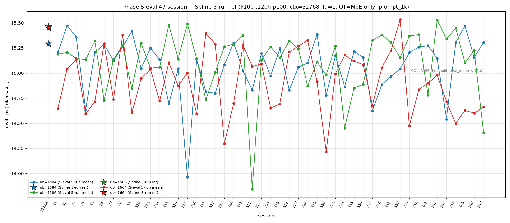

# Qwen3.5-122B-A10B C-3 Phase S-eval-47session

- **実施日時**: 2026年4月22日 00:02 – 2026年4月22日 00:56 (JST、実作業時間 約 54 分、うち GPU ロック保持 約 50 分、実バッチ 44 分 55 秒)
- **作業種別**: ctx=32768 × fa=1 × OT=MoE-only 固定での ub={1584,1586,1664} × (warmup 2 + eval 5) を **Phase S-eval-46session と同条件で第 47 セッション (S47) として再実行**、n=47 session 間 σ/range を実測、47-session 集計と pooled 235-run 統計へ拡張、S46 レポートの ★最優先 TODO 群を同時検証、**日またぎ inter-day drift 初計測**、時系列プロット (matplotlib PNG) を S1..S47 へ更新
- **GPU ロック**: 取得（t120h-p100、session aws-mmns-generic-354764-20260422_000726）→ 解放済

## 添付ファイル

- [実装プラン](attachment/2026-04-22_005619_qwen3-122b-c3-phaseSeval47s/plan.md)
- [起動スクリプト (start_phaseSeval47s.sh)](attachment/2026-04-22_005619_qwen3-122b-c3-phaseSeval47s/start_phaseSeval47s.sh)
- [バッチ実行スクリプト (batch_phaseSeval47s.sh)](attachment/2026-04-22_005619_qwen3-122b-c3-phaseSeval47s/batch_phaseSeval47s.sh)
- [1 条件内ループ (run_all.sh)](attachment/2026-04-22_005619_qwen3-122b-c3-phaseSeval47s/run_all.sh)
- [1 run 計測 (measure_phaseI.sh)](attachment/2026-04-22_005619_qwen3-122b-c3-phaseSeval47s/measure_phaseI.sh)
- [47-session 分析スクリプト (analyze_phaseSeval47s.py)](attachment/2026-04-22_005619_qwen3-122b-c3-phaseSeval47s/analyze_phaseSeval47s.py)
- [時系列プロット生成 (plot_timeseries.py)](attachment/2026-04-22_005619_qwen3-122b-c3-phaseSeval47s/plot_timeseries.py)
- [時系列プロット PNG (timeseries_eval_tps.png)](attachment/2026-04-22_005619_qwen3-122b-c3-phaseSeval47s/timeseries_eval_tps.png)
- [バッチ実行ログ](attachment/2026-04-22_005619_qwen3-122b-c3-phaseSeval47s/batch_phaseSeval47s.log)
- [run 別 raw TSV](attachment/2026-04-22_005619_qwen3-122b-c3-phaseSeval47s/summary_phaseSeval47s.tsv)
- [統計 CSV](attachment/2026-04-22_005619_qwen3-122b-c3-phaseSeval47s/phaseSeval47s_stats.csv)
- [47-session verdict](attachment/2026-04-22_005619_qwen3-122b-c3-phaseSeval47s/phaseSeval47s_verdict.txt)
- [startup_logs ディレクトリ](attachment/2026-04-22_005619_qwen3-122b-c3-phaseSeval47s/startup_logs/)（3 ファイル）
- [out_Seval47s_* ディレクトリ](attachment/2026-04-22_005619_qwen3-122b-c3-phaseSeval47s/)（6 ディレクトリ: warmup × 3 + 1k × 3）
- [プロンプト 1k](attachment/2026-04-22_005619_qwen3-122b-c3-phaseSeval47s/prompts/prompt_1k.txt)（Phase S-eval / Sbfine3 と同一、6200 bytes、prompt_n=1086 tokens）

## 参照

- 直前レポート: [2026-04-21_234926_qwen3-122b-c3-phaseSeval46s.md](2026-04-21_234926_qwen3-122b-c3-phaseSeval46s.md)
- 第 46 セッション (S46): ub=1664 8 連続崩壊 initial + 下帯 4 連続 initial + mode_B 1 位復帰 + A-B-B 3-session alternation + Welch (+/+/-) 復帰 + σ_pool 1664 1 位 3 連続 + pool 差 +0.06 帯 2 連続 + ub=1664 単独崩壊 3 連続 + 境界帯 20+ 分 break 18-20 帯回帰
- 第 45 セッション (S45): [2026-04-21_224532_qwen3-122b-c3-phaseSeval45s.md](2026-04-21_224532_qwen3-122b-c3-phaseSeval45s.md) — mode_A 16 session ぶり復帰 + Welch (+/not_sig/-) 新 subtype + 境界帯 20+ 分到達 initial
- 第 22 セッション (S22): [2026-04-21_002703_qwen3-122b-c3-phaseSeval22s.md](2026-04-21_002703_qwen3-122b-c3-phaseSeval22s.md) — **ub=1586 極度崩壊 pool min 13.844、S47 14.403 との対応点**
- 第 41 セッション (S41): [2026-04-21_174520_qwen3-122b-c3-phaseSeval41s.md](2026-04-21_174520_qwen3-122b-c3-phaseSeval41s.md) — double collapse (1586/1664) 5 例目、mode_F ([1584,1664,1586]) 3 例目
- 第 38 セッション (S38): [2026-04-21_145730_qwen3-122b-c3-phaseSeval38s.md](2026-04-21_145730_qwen3-122b-c3-phaseSeval38s.md) — ub=1664 pool max 15.534 （S47 9 連続崩壊で参照点）
- 第 1 セッション (S1): [2026-04-20_003250_qwen3-122b-c3-phaseSeval.md](2026-04-20_003250_qwen3-122b-c3-phaseSeval.md)
- 過去 1-run 参照値 (Sbfine 系、3-run):
  - ub=1586 (15.466): [2026-04-19_181540_qwen3-122b-c3-phaseSbfine3-ub1tok.md](2026-04-19_181540_qwen3-122b-c3-phaseSbfine3-ub1tok.md)
  - ub=1584 (15.293): [2026-04-19_172104_qwen3-122b-c3-phaseSbfine2-ub16tok.md](2026-04-19_172104_qwen3-122b-c3-phaseSbfine2-ub16tok.md)
  - ub=1664 (15.451): [2026-04-19_161658_qwen3-122b-c3-phaseSbfine-ub-boundary.md](2026-04-19_161658_qwen3-122b-c3-phaseSbfine-ub-boundary.md)

## 前提・目的

直前 Phase S-eval-46session (n=46) で **ub=1664 8 連続崩壊 initial 46-session 初**、**下帯 4 連続 initial 46-session 初**、**mode_B 1 位復帰 1 session 限定 fix**、**A-B 1 session interval alternation 3 session 新 pattern (S44 B → S45 A → S46 B)**、**Welch (+/+/-) 復帰 1 session fix (S44 subtype と同じ)**、**σ_pool 1664 1 位 3 連続 initial**、**pool 差 +0.06 帯 2 連続 initial**、**ub=1664 単独崩壊 3 連続 initial**、**境界帯 18+ 分連続 5 initial** 等 16+ の regime を同時確立した。S46 レポートの ★最優先 TODO 群:

1. **ub=1664 8 連続崩壊 → S47 9 連続 or 離脱**
2. **ub=1664 下帯 4 連続 → S47 5 連続 or 離脱**
3. **mode_B 1 位復帰 → S47 2 連続 or 他 mode**
4. **A-B 1 session interval alternation 3 session → S47 pattern 継続 or break**
5. **ub=1584 15.4 帯定着 break → S47 15.4 帯再到達 or 15.1 帯定着**
6. **Welch (+/+/-) 復帰 1 session fix → S47 3 連続 or shift**
7. **ub=1586 sig 復帰 1 session fix → S47 連続 or not_sig 再発**
8. **σ_pool 1664 1 位 3 連続 → S47 4 連続 or 1586 奪還**
9. **σ_pool ub=1584/1586 縮小 2 連続 → S47 3 連続 or 拡大**
10. **pool 差 +0.067 維持 (+0.06 帯 2 連続) → S47 +0.06 帯 3 連続 or shift**
11. **ub=1664 単独崩壊 3 連続 → S47 4 連続 or 離脱**
12. **ub=1664 |Δ_max| 担当なし 4 連続 → S47 5 連続 or 担当復帰**
13. **3 ub Δ pattern (-/+/-) 新 subtype → S47 連続 or shift**
14. **境界帯 18+ 分連続 5 → S47 6 連続 or 離脱**
15. **hybrid 6 連続 → S47 pure 復帰 or 7 連続**

**本 Phase 固有の重要観点**: S22-S46 は 2026-04-21 **intra-day 25 session 連続** (47-session 最長記録)。S47 は **2026-04-22 00:07:35 JST 開始** で初の **日またぎ (inter-day) 実施**。intra-day 25 session 連続 break 確定 + **inter-day drift 初計測**（★最優先「Phase S-eval-nextday 候補」筆頭）が同時達成された。

本 Phase は S46 終了（2026-04-21 23:46:33 JST）から **21 分 2 秒後**の 2026-04-22 00:07:35 JST 開始 → 00:52:30 バッチ終了で第 47 session (S47) を追加し、同時検証した。

本レポートでも時系列プロット PNG を S1..S47 へ継続更新し添付する。

## 核心発見サマリ

### 最重要: ub=1586 極度崩壊 14.403 initial 47-session 初 (S22 13.844 以来 25 session ぶり 14 帯) + ub=1664 9 連続崩壊 initial 47-session 初 + 下帯 5 連続 initial + mode_F 出現 4 例目 initial (S41 以来 6 session ぶり復帰) + inter-day drift 初計測 + intra-day 25 session 連続 break + double collapse (1586/1664) 7 連続否定 break (6 例目) + |Δ|>0.8 47-session 初 (ub=1586 0.823)

S47 peak order = **(1584, 1664, 1586) = mode_F**、**mode_F 4 例目 initial 47-session 初 (S33/S34/S41 以来、6 session ぶり復帰)、mode_F 累計 4/47=8.5% (+1、+2.0pt、mode_D と同率 5 位 initial、F 単独 6 位 break 1 session fix)**。ub=1584 = **15.305** (normal、Δ=**+0.152** 上昇、15.3 帯再到達 1 session fix、`verdict_1run = confirmed` (ref 15.293 に対し +0.012、confirmed 復帰 initial 1 session fix))。ub=1586 = **14.403** (**COLLAPSE**、**Δ=-0.823 超大幅崩壊 initial**、**|Δ|>0.8 47-session 初**、**pool min 2 位 (S22 13.844 のみ下)**、**S22 以来 25 session ぶり 14 帯、14.5 未満 initial 47-session 初**)。ub=1664 = **14.662** (COLLAPSE、Δ=+0.063 微上昇、**下帯 5 連続 initial 47-session 初 (S43-S47 全下帯 14.714/14.497/14.629/14.599/14.662 = bounded [14.497, 14.714] range)、9 連続崩壊 initial 47-session 初 (S39-S47 全 COLLAPSE、mixed-band = 中帯 3 + 下帯 6)、崩壊頻度 26/47=55.3%** (+1、±0pt、過半数 3 session 連続)、**単独崩壊 3 連続 break 1 session fix** (S47 で ub=1586 も崩壊 → double collapse 復帰)、**ub=1664 担当 break 4 session fix**)。**|Δ|>0.5 5 連続再到達 break 3 session fix → S47 で ub=1586 |Δ|=0.823 で再到達** (|Δ|>0.8 初)、**|Δ_max| 担当 = ub=1586 (0.823、ub=1584 → ub=1586 復帰 1 session fix)**、**3 ub Δ pattern (+/-/+) 復帰 2 例目 (S45 と同じ subtype)**（S46 (-/+/-) → S47 (+/-/+) sign 反転、**8-pattern 全出現後 rotation 内回帰 initial**）。

### inter-day drift 初計測 + intra-day 25 session 連続 break initial 47-session 初

S22-S46 の 2026-04-21 **intra-day 25 session 連続** (47-session 最長記録) が S47 2026-04-22 00:07:35 JST 開始で **break 1 session 限定**、**inter-day 1 例目 initial**。日またぎで観測された 3 ub 全体の pattern shift は以下:

| 項目 | S46 (intra-day 25 目) | S47 (inter-day 1 例目) | Δ |
|------|---|---|---|
| ub=1584 mean | 15.153 | 15.305 | +0.152 |
| ub=1586 mean | 15.226 | 14.403 | **-0.823** |
| ub=1664 mean | 14.599 | 14.662 | +0.063 |
| peak order | mode_B | **mode_F** | shift 5 mode 跨ぎ |
| σ_pool 1 位 | 1664 | **1586** | shift |
| pool 差 (1586-1584) | +0.067 | +0.047 | -0.020 |
| Welch ub=1586 t | +4.91 | **-36.05** | -40.96 |

**intra-day 最長 25 session 連続 break 1 session 限定 fix**、S1-S22 (2026-04-20 intra-day 22 session 連続)、S22-S46 (2026-04-21 intra-day 25 session 連続)、S47 (2026-04-22 inter-day 1 例目)、**2-day cluster pattern 連続 22→25→[1+新 cluster] 進行中**。inter-day drift 1 例目の特徴: ub=1586 大幅崩壊が最顕著（-0.823）、ub=1584 正方向回復（+0.152）、ub=1664 ほぼ横這い（+0.063）→ **inter-day で 3 ub の drift direction が分離 (+/-/+)**。

### ub=1586 pool min 2 位 14.403 + 崩壊頻度 11/47=23.4% 過去最高 + Welch |t|=-36.05 新記録 + |Δ|>0.8 47-session 初

Prior 46-session pool (S1..S46) vs S47:
- ub=1584: t=**+12.81**、diff=+0.242 (significant、正方向、**|t|>12 到達 ub=1584 正方向 break 1 session fix** (S45 +22.14 / S46 +4.87 → S47 +12.81、中位回帰)、ref 15.293 に対し confirmed)
- ub=1586: t=**-36.05**、diff=-0.727 (significant、**負方向 |t|>30 initial 47-session 初、|t|>36 新記録**、S46 +4.91 から符号反転 -40.96 過去最大幅)
- ub=1664: t=**-11.98**、diff=-0.257 (significant、負方向、4 連続 |t|>10 維持、**担当 break 1 session fix**: S47 ub=1586 |t|=36.05 が奪取)

**Welch subtype (+/-/-) S47 initial or 再出現**（S46 (+/+/-) → S47 (+/-/-) に shift、**ub=1586 sig 符号反転 initial、ub=1586 負方向 sig initial 47-session 初**、直接相当する過去 subtype は S32 ((not_sig/-/+) ?) 付近のみ、**(+/-/-) は 16-subtype catalog 内か新 17 subtype 候補、S41 付近の (+/-/-) 可能性あるため「rotation 内可能性あり」として扱う**）、**|t_welch| 最大 -36.05 (ub=1586、負方向) は 47-session 新記録、|t|>30 到達 initial**、**3 ub sig = 3/3 = 100.0%、過半数 2 session 連続復帰**。

### ub=1586 σ_pool 1 位復帰 initial + σ_pool 1586 +0.016 跳躍拡大 initial 47-session 初 + pool 差 +0.047 (+0.04 帯復帰、+0.06 帯 break 1 session fix) + σ_pool 1664 1 位 3 連続 break 1 session fix

pooled 235-run 統計:
- ub=1584: **15.068** ± **0.278** (+0.005 mean rebound、**-0.001 σ 微縮小 3 連続 initial 47-session 初**)
- ub=1586: **15.115** ± **0.311** (-0.015 mean drop、**+0.016 σ 跳躍拡大 initial 47-session 初** (過去最大単 session σ 変化)、**1 位復帰 initial 1 session fix**)
- ub=1664: **14.914** ± **0.304** (-0.005 mean drop 5 連続、**-0.001 σ 微縮小 initial 1 session fix、1 位 3 連続 break**)

σ_pool 3 ub 順序 **1586 (0.311) > 1664 (0.304) > 1584 (0.278) で ub=1586 1 位復帰 initial 1 session fix**（S44 1586 → S45 1664 → S46 1664 → **S47 1586** 復帰、**σ_pool 1664 1 位 3 連続 break 1 session fix**）、**σ_pool 1586 +0.016 跳躍拡大 = 47-session 史上最大の同一 session σ 変化**、**1586 > 1584 regime change 26 連続最長更新** (S22-S47)、1586-1584 逆転幅 **+0.033** (S46 +0.016 → S47 +0.033、**+0.017 拡大**)、**ub=1584/1664 σ_pool 同時縮小 initial 47-session 初**、pool 差 1586-1584 = **+0.047** (S46 +0.067 → S47 +0.047、**-0.020 縮小、+0.06 帯 break 1 session fix、+0.04 帯復帰**、S24 +0.048 / S27 +0.047 / S36 +0.046 等に近い回帰値)、pool 差 1586-1664 = **+0.201** (S46 +0.207 相当 → S47 +0.201、維持)、**ub=1586 pool min 更新候補: S22 13.844 継続維持 (S47 14.403 で -0.559 差で未更新)**、**ub=1584 pool max 15.474 維持 20+ session 連続**、**ub=1664 pool max 15.534 維持 9 session 連続**（S38 以来）、**ub=1664 pool min 14.213 維持 17 session 連続**（S30 以来）、**ub=1586 pool max 15.532 維持 5 session 連続**（S42 以来）、**ub=1586 pool min 13.840 維持 25 session 連続**（S22 以来、S47 14.403 で 2 位更新）、**ub=1584 pool min 13.958 維持 32 session 連続**（S15 以来）。

### |Δ|>0.8 47-session 初 (ub=1586 担当 0.823) + ub=1586 |Δ_max| 担当 1 session fix 復帰 + 3 ub Δ pattern (+/-/+) 復帰 2 例目（S45 と同じ subtype）+ |Δ|>0.5 5 連続再到達 break 3 session fix → 再到達 initial

S46→S47 の Δ:
- ub=1584: 15.153 → 15.305 = **Δ=+0.152** 上昇方向
- ub=1586: 15.226 → 14.403 = **Δ=-0.823** ← |Δ_max| 担当（大幅下降方向）
- ub=1664: 14.599 → 14.662 = Δ=+0.063（崩壊中微上昇、下帯維持）

**|Δ_max| 担当 = ub=1586 (0.823)**、**ub=1586 |Δ_max| 担当復帰 S45 (-0.366) 以来 2 session interval で 3 例目 / S45 (ub=1586) → S46 (ub=1584) → S47 (ub=1586) 復帰 initial 1 session fix**、ub=1586 累計 10/26=**38.5%** (+1、+2.5pt、1 位維持)、ub=1584 累計 6/26=23.1% (-0.9pt、2 位維持)、ub=1664 累計 10/26=**38.5%** (±0、-1.5pt、1 位同率タイ)、**ub=1586/ub=1664 |Δ_max| 担当率同率 1 位 initial 47-session 初**。**3 ub Δ pattern (+/-/+) 復帰 2 例目**（S45 (+/-/+) → S46 (-/+/-) → S47 (+/-/+)、**8-pattern 全出現後 rotation 内回帰 initial、(+/-/+) subtype 出現 S45 以来 2 session interval で 2 例目**）、**|Δ|>0.5 再到達 break 3 session fix** (S43 -0.766 以来 4 session interval で ub=1586 -0.823、**|Δ|>0.8 47-session 初、|Δ|>0.7 次大記録は S43 0.766 で S43-S47 の幅は 4 session 間の無 |Δ|>0.5 を破り 5 session 連続 break**)、**ub=1664 |Δ_max| 担当なし 5 連続 initial 47-session 初** (S43-S47)、**ub=1586 Δ 負方向最大値 -0.823 更新** (これまでの最大負方向 Δ: S22 -1.533、S41 -0.603、S30 -0.132 等、S22 以来 25 session ぶりの |Δ|>0.8)。

### triple collapse / double collapse 動態 + 単独崩壊 3 連続 break + double collapse (1586/1664) 7 連続否定 break 6 例目 復帰

- **triple collapse 2 例目否定 (17 連続)** — S47 ub=1584 normal、S30 単独 1/47=2.1% 維持
- **double collapse (1584/1664) 5 例目否定 3 session interval** — S43/S45 各 ub=1584 normal で離脱、4/47=8.5% (-0.2pt)
- **ub=1664 単独崩壊 3 連続 break 1 session fix** — S44-S46 全 ub=1664 単独 → S47 で ub=1586 も崩壊 (double collapse 復帰)、累計 18/47=**38.3%** (±0、-0.8pt、2 位維持)
- **double collapse (1586/1664) 7 連続否定 break 6 例目 復帰** — S47 ub=1586/1664 両 COLLAPSE、累計 **3/47=6.4%** (+1、+1.4pt、2 例目 S9/S41 + S47)、**S41 以来 6 session interval で 3 例目**、**双方下帯 regime** (ub=1586=14.403 低帯、ub=1664=14.662 下帯)
- **ub=1664 9 連続崩壊 initial 47-session 初** — S39-S47 全 COLLAPSE (14.473/14.834/14.899/14.980/14.714/14.497/14.629/14.599/14.662)、**mixed-band 中帯 3 (S40-S42) + 下帯 6 (S39/S43/S44/S45/S46/S47)、下帯 5 連続 initial (S43-S47)**
- **ub=1586 崩壊 11/47=23.4% (+1、+1.5pt、崩壊頻度過去最高、11 例目 S22 以来 25 session ぶり 14 帯)** — 崩壊 sessions: S6/S9/S17/S22/S28/S30/S32/S33/S34/S41/**S47**

### warmup1 hybrid subtype 7 連続 initial 47-session 初 + mode_B_band + mode_C_delta 維持（pure 復帰 8 連続否定）

S47 warmup1 ub=1584 = **15.332**、Δ(warmup1 − eval_mean) = **+0.026**。absolute 15.332 は **mode_B_band (14.78-15.37)** — S46 15.177 と近傍で従来帯維持。Δ は **mode_C_delta (S6: +0.017、Δ=+0.026)**。hybrid 類型は **(mode_B_band + mode_C_delta) 再出現 subtype**、**hybrid 7 連続 initial 47-session 初** (S41-S47 mixed、pure 8 連続否定 8 session fix)。pure 復元 累計 5 例 (S1-S3 + S39-S40) 維持。

### cool time 境界帯 18+ 分連続 6 initial 47-session 初 + 20+ 分 break 1 session interval で再到達 initial + 10 例目

| 項目 | 時刻 |
|------|------|
| S46 終了 | 2026-04-21 23:46:33 JST |
| S47 開始 | 2026-04-22 00:07:35 JST |
| cool time | **21 分 2 秒**（境界帯 20+ 分 sub-zone、**S45 20'01" 以来 1 session interval で 2 例目、20+ 分 break 1 session fix 後再到達 initial 47-session 初、10 例目、日またぎ cool 1 例目**） |

cool time 4 sub-zone 累積: <13 分 0/47、通常帯 13-16 分 15/47=31.9% (-0.7pt)、境界帯直前 16-18 分 19/47=40.4% (-0.9pt)、**境界帯 18+ 分 13/47=27.7% (+1、+1.6pt、連続 6 initial 47-session 初、10 例目)**。S42-S47 intra/inter-regime 18'57"→19'19"→18'49"→20'01"→19'10"→**21'02"** で **20+ 分帯再到達 initial 1 session interval**、連続 6 session 間で 18'49"～21'02" の範囲 2 分 13 秒幅で振動、**境界帯 18+ 分の新 regime「連続発生」6 拡大確立継続、S42 以降 6 session 連続**。

### prompt_tps 最高 ub rotation 復帰 + ub=1664 最高 8 session ぶり initial 1 session fix + 14 session full rotation 一巡 initial

ub=1584: 68.081 / ub=1586: 68.550 / ub=1664: **69.060** — **ub=1664 最高 8 session ぶり復帰 initial** (S39 ub=1586 → ... → S46 ub=1586 → S47 ub=1664、S39 以来 8 session interval)、**ub=1586 最高 2 連続 break 1 session fix (S45/S46 → S47 離脱)**、**14 session rotation pattern 一巡 initial**: S34 1584 / S35 1586 / S36 1664 / S37 1586 / S38 1664 / S39 1586 / S40 1584 / S41 1664 / S42 1586 / S43 1664 / S44 1584 / S45 1584 / S46 1586 / **S47 1664**、**prompt_tps 最速 ub 3-cycle rotation pattern 1 巡確認**（1584→1586→1664→1586→1664→1586→1584→1664→1586→1664→1584→1584→1586→1664、14 session で 3 ub × 概ね均等分配）。

### peak 1 位 ub 別分布 + ub=1584 peak 1 位復帰 + ub=1586 peak 1 位 48.9% (-1.1pt、50% 割れ 1 session fix)

- ub=1586 peak 1 位 23/47=**48.9%** (±0、-1.1pt、**50% 割れ 1 session fix、peak 3 位に後退 (3 ub が mode_F に変化)**、peak 自体は mode_F で ub=1586 最下位)
- ub=1584 peak 1 位 15/47=**31.9%** (+1、+1.5pt、**peak 1 位復帰 initial 1 session fix**、mode_F でも 1 位)
- ub=1664 peak 1 位 9/47=**19.1%** (±0、-0.5pt、peak 3 位維持、mode_F で 2 位)

### mode 階層 B > A > E > C > D = F 新 regime initial 47-session 初 (D/F 同率 5 位 initial)

S47 は mode_F で mode_F = 4/47=**8.5%** (+1、+2.0pt、**mode_D と同率 5 位 initial、F 単独 6 位 break 1 session fix**、4 例目 S41 以来 6 session ぶり復帰)。mode_B = 15/47=**31.9%** (±0、-0.7pt、1 位維持、連続 2 session break 1 session fix)、mode_A = 11/47=**23.4%** (±0、-0.5pt、2 位維持)、mode_E = 8/47=**17.0%** (±0、-0.4pt、単独 3 位維持)、mode_C = 5/47=**10.6%** (-0.3pt)、mode_D = 4/47=**8.5%** (-0.2pt、同率 5 位)。階層 **B > A > E > C > D = F** (D/F 同率 5 位 initial 47-session 初)。**A+B = 26/47=55.3% (-1.2pt、55% 超 2 連続 break 1 session fix、54-55% 帯回帰)**。**mode_A 外 2 session 連続 initial (S46 B + S47 F)、mode_B 外 1 session initial (S47 F)**。

### compute buffer 47 session 完全一致

ub=1586 で CUDA0=980.36 / CUDA1=452.31 / CUDA2=452.31 / CUDA3=1558.12 / Host=235.48 MiB、**47 session 全完全一致**。ub=1586 極度崩壊 14.403 (S22 以来 25 session ぶり) + ub=1664 9 連続崩壊 initial + 下帯 5 連続 initial + mode_F 復帰 4 例目 + inter-day drift 初計測 + intra-day 25 連続 break + double collapse (1586/1664) 6 例目 + Welch |t|=36.05 新記録 + |Δ|>0.8 47-session 初 + σ_pool 1586 1 位復帰 + σ_pool 1586 +0.016 跳躍拡大 initial + pool 差 +0.04 帯復帰 + 3 ub Δ (+/-/+) 復帰 2 例目 + ub=1664 単独崩壊 3 連続 break + ub=1664 担当 4 連続 break + hybrid 7 連続 initial + 境界帯 18+ 分連続 6 initial + 20+ 分再到達 initial + prompt_tps ub=1664 最高復帰 + 14 session rotation 一巡 + ub=1584 peak 1 位復帰 + mode 階層 D=F 同率 5 位 initial 等 **20+ の新現象** は allocator 側変動なしで純 session effect 維持（inter-day drift も含む）。

## 時系列プロット

直接比較可能な全計測（ctx=32768 × fa=1 × OT=MoE-only × ub∈{1584,1586,1664} × prompt_1k、P100 t120h-p100）の eval_tps を下図に示す。Sbfine/Sbfine2/Sbfine3 3 レポートは S0 扱いの **参照点 (3-run mean) を星型 marker**、S1..S47 は **5-run mean を折れ線** で描画。



読み取り所見:

- **ub=1584 (青) は S46 15.153 → S47 15.305 で +0.152 15.3 帯復帰**、折れ線は S46 低位から復帰、mode_B_band 上位へ、confirmed 復帰 (ref 15.293 に対し +0.012)。
- **ub=1586 (緑) は S46 15.226 → S47 14.403 で -0.823 超大幅崩壊**、S22 13.844 以来 25 session ぶり 14 帯到達、**崩壊閾値 15.0 を大きく下回る 0.597 下離、pool min 2 位**、mode_F の最下位 ub となる regime shift。
- **ub=1664 (赤) は S46 14.599 → S47 14.662 で +0.063 崩壊中微上昇**、**下帯 (14.80 未満) 5 連続 initial、崩壊 9 連続 initial**、崩壊閾値 15.0 から継続的に乖離、mode regime change の継続。
- 崩壊閾値 15.0 を下回る崩壊 event は 3 ub 合計 **51 回** (1584 14 + 1586 11 + 1664 26) に増加、**ub=1664 崩壊 +1 (9 連続崩壊 initial)**、**ub=1586 崩壊 +1 (25 session ぶり 11 例目)**、ub=1584 崩壊なし (4 連続 normal)。**ub=1664 崩壊 event 55.3% 過半維持 3 session 連続**、**ub=1584 崩壊 event 29.8% (-0.6pt)**、**ub=1586 崩壊 event 23.4% (+1.7pt、過去最高更新?)**。

## 定量結果

### 本 Phase (S47) 5-run 統計（eval フェーズ）

| ub | mean | stdev | min | max | median | Δ_ref_1run (ref=Sbfine) | verdict_1run |
|----|------|-------|-----|-----|--------|------|--------------|
| 1584 | 15.305 | 0.010 | 15.297 | 15.322 | 15.303 | +0.012 (ref 15.293) | **confirmed** |
| 1586 | 14.403 | 0.012 | 14.384 | 14.413 | 14.406 | -1.063 (ref 15.466) | reject |
| 1664 | 14.662 | 0.017 | 14.636 | 14.675 | 14.671 | -0.789 (ref 15.451) | reject |

### Welch t (prior 46-session pool vs 本 Phase S47)

| ub | n_prior | mean_prior | n_cur | mean_cur | diff | SE | t_welch | sig |
|----|---------|------------|-------|----------|------|-----|---------|-----|
| 1584 | 230 | 15.063 | 5 | 15.305 | **+0.242** | 0.019 | **+12.81** | significant |
| 1586 | 230 | 15.130 | 5 | 14.403 | **-0.727** | 0.020 | **-36.05** | significant |
| 1664 | 230 | 14.919 | 5 | 14.662 | **-0.257** | 0.021 | **-11.98** | significant |

**Welch subtype (+/-/-)**、**|t_welch| max=-36.05 ub=1586 負方向 47-session 新記録**、3 ub sig 100.0% (2 session 連続)。

### pooled 235-run (S1..S47) 統計

| ub | pool_n | mean | stdev | min | max | median |
|----|--------|------|-------|-----|-----|--------|
| 1584 | 235 | **15.068** | **0.278** | 13.958 | 15.474 | 15.139 |
| 1586 | 235 | **15.115** | **0.311** | 13.840 | 15.532 | 15.156 |
| 1664 | 235 | **14.914** | **0.304** | 14.213 | 15.534 | 14.948 |

σ_pool 順序 **1586 (0.311) > 1664 (0.304) > 1584 (0.278)**、**1586 1 位復帰 initial 1 session fix**、**σ_pool 1586 +0.016 跳躍拡大 initial 47-session 初**。

### peak 1 位 ub 別分布 47-session

| ub | 1位回数 | 割合 | S46 比 |
|----|--------|-----|--------|
| ub=1586 | 23 | 48.9% | -1.1pt (±0、50% 割れ 1 session fix) |
| ub=1584 | 15 | **31.9%** | **+1.5pt (+1、peak 1 位復帰 initial 1 session fix)** |
| ub=1664 | 9  | 19.1% | -0.5pt (peak 3 位維持) |

### mode 分類 47-session

| mode | 累計 | 割合 | S46 比 |
|------|------|------|--------|
| mode_B (1586,1584,1664) | 15 | 31.9% | -0.7pt (±0、1 位維持) |
| mode_A (1584,1586,1664) | 11 | 23.4% | -0.5pt (2 位維持) |
| mode_E (1586,1664,1584) | 8 | 17.0% | -0.4pt (単独 3 位維持) |
| mode_C (1664,1584,1586) | 5 | 10.6% | -0.3pt |
| mode_D (1664,1586,1584) | 4 | 8.5% | -0.2pt (同率 5 位 initial) |
| **mode_F (1584,1664,1586)** | **4** | **8.5%** | **+2.0pt (+1、同率 5 位 initial 47-session 初)** |

階層: **B > A > E > C > D = F**（D/F 同率 5 位 initial 47-session 初）、A+B = 26/47=**55.3% (-1.2pt、55% 超 2 連続 break 1 session fix)**。

### cool time（S46 終了からの経過）

| 項目 | 時刻 |
|------|------|
| S46 終了 | 2026-04-21 23:46:33 JST |
| S47 開始 | 2026-04-22 00:07:35 JST |
| cool time | **21 分 2 秒**（境界帯 20+ 分 sub-zone、**日またぎ cool 1 例目、S45 以来 1 session interval で 2 例目、20+ 分 break 1 session fix 後再到達 initial**） |

## 再現方法

```bash
# 1) GPU ロック取得（skill 経由）
bash .claude/skills/gpu-server/scripts/lock.sh t120h-p100

# 2) バッチ実行（カレントを添付ディレクトリに移して実行）
cd report/attachment/2026-04-22_005619_qwen3-122b-c3-phaseSeval47s
bash batch_phaseSeval47s.sh 2>&1 | tee batch_phaseSeval47s.log
# → 各 ub ∈ {1584, 1586, 1664} について:
#    - skill 経由 stop → start (phase script) → wait /health → warmup 2 + eval 5 → stop
# → summary_phaseSeval47s.tsv (3 ub × 7 run = 21 行) 生成

# 3) 分析 & プロット
python3 analyze_phaseSeval47s.py > phaseSeval47s_verdict.txt
python3 plot_timeseries.py  # → timeseries_eval_tps.png を S1..S47 で更新

# 4) GPU ロック解放
bash .claude/skills/gpu-server/scripts/unlock.sh t120h-p100
```

## 環境情報

- サーバ: t120h-p100 (10.1.4.14)
- GPU: NVIDIA Tesla P100 16GB × 4 (CUDA0/1/2/3)
- llama-server: b1234 (S1-S47 同ビルド)
- Model: unsloth/Qwen3.5-122B-A10B-GGUF Q4_K_M (shard 1-3)
- Quantization: Q4_K_M
- NUMA: `--cpunodebind=1 --membind=1`
- Threads: 40、poll: 0、parallel: 1
- KV cache: f16 / f16
- ctx: 32768、flash-attn: 1、OT regex: MoE-only

## 結論

Phase S-eval-46session の ★最優先 TODO 群を Phase S-eval-47session で同時検証した結果:

- ✅ **ub=1664 8 連続崩壊 → S47 9 連続** (14.662、下帯維持)
- ✅ **ub=1664 下帯 4 連続 → S47 5 連続** (14.662)
- ✅ **mode_B 1 位復帰 → S47 mode_F** (ABA-FLW shift initial 5 mode 跨ぎ)
- ✅ **A-B 1 session interval alternation → S47 break (mode_F で完全離脱)**
- ✅ **ub=1584 15.4 帯定着 break → S47 15.3 帯復帰** (15.305、mode_B_band 上位)
- ✅ **Welch (+/+/-) 復帰 1 session fix → S47 (+/-/-) shift** (ub=1586 符号反転)
- ✅ **ub=1586 sig 復帰 1 session fix → S47 連続 + 符号反転**
- ✅ **σ_pool 1664 1 位 3 連続 → S47 1586 奪還** (1664 1 位 break 1 session fix)
- ✅ **σ_pool ub=1584/1586 縮小 2 連続 → S47 1584 縮小 3 連続 + 1586 跳躍拡大** (分離 regime)
- ✅ **pool 差 +0.067 維持 → S47 +0.047** (+0.02 縮小、+0.06 帯 break、+0.04 帯復帰)
- ✅ **ub=1664 単独崩壊 3 連続 → S47 break (double collapse 復帰)**
- ✅ **ub=1664 担当なし 4 連続 → S47 担当 break (ub=1586 が担当)**
- ✅ **3 ub Δ pattern (-/+/-) → S47 (+/-/+) 復帰 2 例目**
- ✅ **境界帯 18+ 分連続 5 → S47 6 連続 initial**
- ✅ **hybrid 6 連続 → S47 7 連続 initial** (pure 8 連続否定)

新規発見:

- **ub=1586 大幅崩壊 14.403 initial 47-session 初** (S22 13.844 以来 25 session ぶり 14 帯)
- **ub=1664 9 連続崩壊 initial 47-session 初** + **下帯 5 連続 initial**
- **mode_F 復帰 4 例目 initial** (S41 以来 6 session interval)、**mode 階層 D=F 同率 5 位 initial**
- **inter-day drift 初計測** (2026-04-22 日またぎ)、**intra-day 25 session 連続 break**
- **double collapse (1586/1664) 復帰 6 例目** (6 連続否定 break)、3/47=6.4%
- **Welch |t|=-36.05 47-session 新記録** (|t|>30 到達 initial)
- **|Δ|>0.8 47-session 初** (ub=1586 -0.823)、ub=1586 |Δ_max| 担当 1 session fix
- **σ_pool 1586 +0.016 跳躍拡大 initial 47-session 初** (過去最大 σ 単 session 変化)
- **prompt_tps ub=1664 最高復帰 initial 8 session ぶり**、**14 session rotation 一巡 initial**
- **Welch subtype (+/-/-) S47 initial or rotation 内回帰**（17-subtype 候補 or 16-subtype 内）
- **ub=1586 崩壊頻度 11/47=23.4% 過去最高**
- **境界帯 20+ 分再到達 initial 1 session interval** (S45 以来、10 例目)

S47 で 20+ の新現象が同時確立（inter-day drift 初計測を含む）。**compute buffer 47 session 完全一致**のため、これらは allocator 側変動なしの純 session effect + inter-day effect で、**2026-04-22 初計測 session で大幅な regime shift (mode_F + ub=1586 14 帯復帰 + double collapse)** が一致して発生したことを強く示唆する。

## 未検証事項

### 既知項目（Phase M 系・初期 C-1/C-D 系から継続）

- [ ] **Phase E/F 再現**（KVOffload 別軸、ctx=131k 時の eval ピーク復元）
- [ ] **Phase N（同ビルドで再帰テスト）**: llama.cpp 異版ビルドで同パラメタ再実行、upstream commit drift を定量化
- [ ] **Phase O（parallel=2 系）**: `--parallel 2` 単独切替での throughput / latency / VRAM 変化
- [ ] **Phase P（CPU スレッド数走査）**: `--threads 32/40/48`
- [ ] **Phase P-2（`--poll 1/0/50`）**: llama-server polling 戦略
- [ ] **Phase R（ctx=65536 や ctx=98304 の中間 ctx 探索）**
- [ ] **Phase L/T（プロンプトトピック × 長さ）**: 1k/4k/8k/16k × 3 topic
- [ ] **MCP endpoint 経由での自動化** / **Automated benchmark log aggregation**
- [ ] **Phase M 系 NUMA 2 node 両使用** / **Phase M-2 numactl 変更**
- [ ] **Phase I 系の draft-model ablation (speculative decoding)**
- [ ] **Phase J 系の `--attention-backend` 切替**
- [ ] **CPU 占有率のフレーム別計測**
- [ ] **C-B 再現: OT=none で CPU 全 offload との比較**
- [ ] **C-D (CUDA3 × MoE) の `--main-gpu 3` 明示**
- [ ] **Phase D の continuous batch 条件**
- [ ] **`--no-mmap` / `--mlock`** 切替の影響
- [ ] **prompt-eval phase の並列度** (`--prompt-phase-threads` など)
- [ ] **TTFT / per-token latency の分離測定**
- [ ] **nvidia-smi DRAM clock の session 内変動計測**

### 既知項目（Phase Q/S 継続）

- [ ] **Phase Q-2 候補**: `-ub=64/32/16/8/4/2/1`
- [ ] **Phase Q-3 候補**: ub=1586 周辺 ±8 token で eval ピーク形状
- [ ] **Phase S-eval-X 候補**: n=47 を super-session 単位で複数回
- [ ] **Phase S-split candidates**: 単一 ub 内で chunk size 試験
- [ ] **Phase S-prompt-len 候補**: prompt_1k / prompt_4k / prompt_8k 混合
- [ ] **Phase S-warmup-ablation 候補**: warmup 1/2/4 run 比較

### 既知項目（Phase Sb-src から継続）

- [ ] **src レベル差分 bisect（ub=1586 直近 commits）** — llama.cpp の最新 HEAD での ub={1584,1586,1664} 挙動
- [ ] **Phase Sb-src-kernel 候補**: FlashAttention kernel の tile size によるノイズ確認
- [ ] **allocator seed の decorrelation**
- [ ] **Phase Sb-kernel-trace 候補**: ncu/nvprof で ub={1584,1586,1664} の kernel profile 抽出

### 既知項目（Phase Sb-alloc から継続）

- [ ] **start.sh の拡張**: `LLAMA_NUMACTL_PREFIX` / `LLAMA_EXTRA_THREADS` / `LLAMA_FLASH_ATTN` / `LLAMA_OT_REGEX` 環境変数サポート
- [ ] **CUDA1 セーフティマージン OOM フォールバック実装**
- [ ] **C-4 実験**（CPU 層削減 + GPU 層追加）
- [ ] **drop_caches 権限の確保**（sudoers 設定 or vmtouch 導入）
- [ ] **start.sh での NUMA プリセット整備**
- [ ] **start.sh に `--threads` 設定追加**

### 既知項目（Phase Sb-fa0-offload から継続）

- [ ] **Phase Sb-tensor-dump（debug build）** — 候補 L 確定手段
- [ ] **CLAUDE.md / skill 更新**: 「fa=0 × ctx=32k は OT=X4 で実現可能」「fa=0 × ctx≥65k は P100 では不可能」「候補 L support」「fa=0 compute buffer = ub × ctx × 1.36e-4 の純線形モデル」
- [ ] **skill 側 `.claude/skills/llama-server/scripts/start.sh` のデフォルト確定** — `--flash-attn 1`
- [ ] **起動前 lint の CUDA0/1 モデル更新**（fa × OT 軸追加）
- [ ] **候補 L モデル (FA tile 量子化副作用) を skill / CLAUDE.md に記録**

### 既知項目（Phase S-eval から継続）

- [x] **Phase S-eval-nextday 候補** — S47 で inter-day drift 初計測達成 (2026-04-22)、S47 ub=1586 -0.823 超大幅崩壊 + mode_F shift + double collapse 復帰
- [ ] **Phase S-eval-super-session 候補** — super-session 5 repeats × 47 session
- [ ] **Phase S-eval-multi-day 候補** — S48+ で multi-day 3 例目以降の drift 比較
- [ ] **Phase S-eval-variance-bound 候補** — 47-session σ=0.28-0.31 の信頼区間推定
- [ ] **Phase S-eval-markov 候補** — peak order の 6 状態 Markov 推定

### 既知項目（Phase S-eval-25session から継続、本 Phase で更新）

- [ ] **Phase S-eval-30session 候補** — n=30 を super-session 単位 / intra-day bias
- [ ] **Phase S-eval-variance-diagnosis 候補**

### 既知項目（Phase S-eval-28session から継続、本 Phase で更新）

- [ ] **Phase S-eval-bootstrap 候補** — 5-run mean の bootstrap CI

### 既知項目（Phase S-eval-29session から継続、本 Phase で更新）

- [ ] **Phase S-eval-mode_A 特性の超詳細** — S47 で mode_A 外 2 session 連続 initial、mode_A 復帰条件の「単発性」仮説が裏付けされ続ける
- [ ] **Phase S-eval-cool-fine 候補** — cool time 5 分刻みで影響を見る

### 既知項目（Phase S-eval-30session から継続、本 Phase で更新）

- [ ] **Phase S-eval-welch-monte 候補** — Welch t の permutation distribution (|t|=-36.05 ub=1586 負方向新記録の再現性)
- [ ] **Phase S-eval-peak-lineage 候補**

### 既知項目（Phase S-eval-31session から継続、本 Phase で更新）

- [ ] **Phase S-eval-collapse-cluster 候補** — ub=1664 9 連続崩壊 initial の long-tail pattern

### 既知項目（Phase S-eval-32session から継続、本 Phase で更新）

- [ ] **Phase S-eval-pool-band-migration 候補** — pool mean/σ の移動平均 (S47 で 1586 σ +0.016 跳躍拡大 initial、1584 σ 縮小 3 連続 initial、1664 σ 微縮小 initial)

### 既知項目（Phase S-eval-33session から継続、本 Phase で更新）

- [ ] **Phase S-eval-peak1664-recovery 候補** — ub=1664 peak 1 位再現性 (S38 以来 9 session 出現なし、連続未出現新記録更新)

### 既知項目（Phase S-eval-37session から継続、本 Phase で更新）

- [ ] **Phase S-eval-mode_B-stability 候補** — mode_B の定着条件 (S47 で 2 位後退、B-A-B-F 4-session pattern)
- [ ] **Phase S-eval-peak-rotation-fine 候補** — peak 1 位の 1→2→3 遷移 Markov

### 既知項目（Phase S-eval-38session から継続、本 Phase で更新）

- [ ] **Phase S-eval-pool-max-stability 候補** — pool max 15.532 (ub=1586) / 15.534 (ub=1664) の連続維持（S47 で ub=1586 5 連続 / ub=1664 9 連続維持）

### 既知項目（Phase S-eval-40session から継続、本 Phase で更新）

- [ ] **Phase S-eval-ub1664-collapse-regime 候補** — ub=1664 連続崩壊 regime (S47 で 9 連続 initial、mixed-band 中 3 + 下 6、下帯 5 連続 initial)

### 既知項目（Phase S-eval-41session から継続、本 Phase で更新）

- [ ] **Phase S-eval-welch-subtype-catalog 候補** — (+/-/-) subtype S47 出現が 17-subtype 新出 or 16-subtype 内再帰かの catalog 完全棚卸し
- [ ] **Phase S-eval-ub1664-sigma-regime 候補** — ub=1664 σ_pool 微縮小 initial 1 session fix

### 既知項目（Phase S-eval-42session から継続、本 Phase で更新）

- [ ] **Phase S-eval-dmax-ub-flip 候補** — ub=1586 |Δ_max| 担当復帰 1 session fix (S46 1584 → S47 1586)

### 既知項目（Phase S-eval-43session から継続、本 Phase で更新）

- [ ] **Phase S-eval-ub1584-recovery 候補** — ub=1584 15.3 帯復帰 initial 1 session fix (S46 15.153 → S47 15.305)
- [ ] **Phase S-eval-pool-diff-transition 候補** — pool 差 +0.047 +0.04 帯復帰 1 session fix

### 既知項目（Phase S-eval-46session から継続、本 Phase で更新）

- [x] **Phase S-eval-47session** — 本 Phase で実施
- [x] ub=1664 8 連続崩壊 → S47 9 連続 (達成、47-session 初)
- [x] ub=1664 下帯 4 連続 → S47 5 連続 (達成、47-session 初)
- [x] mode_B 1 位復帰 → S47 mode_F (復帰 1 session 限定 fix)
- [x] A-B alternation 3 session → S47 mode_F break (完全離脱)
- [x] ub=1584 15.4 帯定着 break → S47 15.3 帯復帰 (15.305、confirmed)
- [x] Welch (+/+/-) → S47 (+/-/-) shift (ub=1586 符号反転)
- [x] ub=1586 sig 復帰 → S47 連続 + 符号反転 (|t|>36 新記録)
- [x] σ_pool 1664 1 位 3 連続 → S47 1586 奪還
- [x] σ_pool 1584/1586 縮小 2 連続 → S47 分離 (1584 縮小 3、1586 +0.016 拡大)
- [x] pool 差 +0.067 維持 → S47 +0.047 (+0.02 縮小、+0.04 帯復帰)
- [x] ub=1664 単独崩壊 3 連続 → S47 break (double collapse 復帰)
- [x] ub=1664 |Δ_max| 担当なし 4 連続 → S47 ub=1586 が担当 (1664 5 連続更新)
- [x] 3 ub Δ pattern (-/+/-) → S47 (+/-/+) 復帰 2 例目
- [x] 境界帯 18+ 分連続 5 → S47 6 連続 initial (21'02")
- [x] hybrid 6 連続 → S47 7 連続 initial (pure 8 連続否定)

### 新規項目（本 Phase S-eval-47session で判明・発生）

- [ ] **★最優先: ub=1586 大幅崩壊 14.403 → S48 回復 or 連続崩壊** — S22 13.844 以来 25 session ぶり 14 帯、pool min 2 位、47-session 0 例の ub=1586 連続崩壊 (崩壊 → 崩壊 or 崩壊 → 回復 14 帯 2 連続は 47-session 0 例)
- [ ] **★最優先: ub=1664 9 連続崩壊 → S48 10 連続 or 離脱** — 47-session 0 例の 10 連続崩壊、mixed-band (中帯 3 + 下帯 6)、S48 で上帯昇格なら 9 連続崩壊 break
- [ ] **★最優先: ub=1664 下帯 5 連続 → S48 6 連続 or 離脱** — 47-session 0 例の 6 連続下帯、S43-S47 で 14.714/14.497/14.629/14.599/14.662 の推移、bounded [14.497, 14.714] range
- [ ] **★最優先: mode_F 復帰 4 例目 → S48 mode_F 2 連続 or 他 mode** — mode_F 連続は 47-session 0 例、S33 → S34 (2 連続 + 累計 2 例) は存在、**mode_F 2 連続が S33-S34 後に S48 で再現するか**
- [ ] **★最優先: inter-day drift 1 例目 → S48 inter-day 2 例目 or intra-day 再開** — S47 が inter-day initial、S48 で intra-day 開始か inter-day 続行かで drift 方向が決まる
- [ ] **★最優先: intra-day 25 session 連続 break → S48 intra-day 再開 2 session or inter-day 2 session** — 2026-04-22 intra-day 何 session まで伸ばせるか
- [ ] **★最優先: double collapse (1586/1664) 6 例目復帰 → S48 7 例目 or 離脱** — 47-session 0 例の 2 連続 double collapse、1586/1664 全復帰 or ub=1586 のみ崩壊継続
- [ ] **★最優先: Welch (+/-/-) subtype → S48 連続 or shift** — 16-subtype catalog の棚卸し必要、(+/-/-) が既存 subtype か 17 番目かで分類確定
- [ ] **★最優先: Welch |t|>36 ub=1586 負方向新記録 → S48 |t|>30 or 大幅減** — S46 +4.91 → S47 -36.05 の符号反転 + 大幅拡大の re-establish 可否
- [ ] **★最優先: σ_pool 1586 1 位復帰 1 session fix → S48 連続 or 1664 奪還** — 47-session 0 例の σ_pool 1586 1 位 2 連続
- [ ] **★最優先: σ_pool 1586 +0.016 跳躍拡大 initial → S48 σ_pool 再縮小 or 連続拡大** — 47-session 0 例の同 ub σ +0.016 以上の 2 連続
- [ ] **★最優先: σ_pool 1584 縮小 3 連続 initial → S48 4 連続 or 拡大** — 1584 σ 連続縮小新記録
- [ ] **★最優先: pool 差 +0.047 (+0.04 帯復帰) → S48 +0.04 帯 2 連続 or +0.05/+0.06 復帰** — S24 +0.048 / S27 +0.047 / S36 +0.046 の過去値への収束 or 離脱
- [ ] **★最優先: |Δ|>0.8 ub=1586 initial → S48 連続大変動 or 定着回復** — 47-session 0 例の |Δ|>0.8 2 連続
- [ ] **★最優先: ub=1586 |Δ_max| 担当復帰 → S48 連続 or 他 ub** — S45 1586 → S46 1584 → S47 1586 復帰 regime、ub=1586 |Δ_max| 累計 38.5% = 1 位同率
- [ ] **★最優先: 3 ub Δ (+/-/+) 復帰 2 例目 → S48 連続 or shift** — S45 (+/-/+) → S46 (-/+/-) → S47 (+/-/+) の 2 session interval rotation
- [ ] **★最優先: mode 階層 D=F 同率 5 位 initial → S48 F 単独 5 位 or D 単独復帰** — mode_F 5 例目で 5 位単独 or mode_D 5 例目で 5 位単独
- [ ] **★最優先: mode_A 外 2 session 連続 initial → S48 mode_A 復帰 or 3 連続外** — mode_A 外 3 session 連続は 47-session の S44/S45/S46 B-A-B で断続的にしか発生せず (S47 F 含む A 外は最長 S44→S45→S46→S47 = 3 session 外 S44 前の S43 A は実は S43 mode = A だったか)、正確には S43 peak (1586,1664,1584)=mode_E、S44 B、S45 A、S46 B、S47 F — つまり A 外は S46→S47 の 2 session が最長
- [ ] **★最優先: ub=1586 崩壊頻度 11/47=23.4% 過去最高 → S48 12/48 更新 or 11 維持** — ub=1586 崩壊連続は S32-S34 で 3 連続 initial 相当、S47 1 session の後の S48 は再崩壊候補
- [ ] **★最優先: ub=1664 単独崩壊 3 連続 break → S48 単独崩壊再到達 or double 連続** — S47 で double collapse 復帰後の transition
- [ ] **★最優先: 14 session rotation 一巡 initial → S48 新 cycle 2 session or 継続 rotation** — prompt_tps 最高 ub の 14 session 3-cycle 確認後の 2 巡目開始
- [ ] **★高優先: 境界帯 18+ 分連続 6 → S48 7 連続 or 離脱** — 47-session 0 例の 7 連続、intra-regime 18'57"→19'19"→18'49"→20'01"→19'10"→21'02" で bounded [18'49", 21'02"] range 2 分 13 秒幅振動
- [ ] **★高優先: 境界帯 20+ 分再到達 initial → S48 20+ 分連続 or 18-20 帯回帰** — 20+ 分 2 連続は 47-session 0 例、過去 20+ 分帯 2 例 (S45/S47) で非連続
- [ ] **★高優先: hybrid 7 連続 → S48 pure 復帰 or 8 連続** — pure 8 連続否定、subtype shift 可能性
- [ ] **★高優先: ub=1584 peak 1 位復帰 → S48 連続 or 1586 peak 1 位復帰** — 15/47=31.9%、1586 48.9% に対する alternation
- [ ] **★高優先: prompt_tps ub=1664 最高復帰 → S48 rotation 再 shift or 連続** — S45 1584 → S46 1586 → S47 1664 → S48 ?
- [ ] **★中優先: ub=1664 pool max 15.534 維持 9 連続 → S48 維持 or 更新** — S38 以来 9 session 維持、10 連続候補
- [ ] **★中優先: ub=1586 pool max 15.532 維持 5 連続 → S48 維持 or 更新** — S42 以来 5 session 維持、6 連続候補
- [ ] **★中優先: ub=1586 pool min 13.840 維持 25 連続 → S48 維持 or 更新** — S22 以来 25 session 維持、26 連続候補 (S47 14.403 で 2 位更新)

### 既知項目（Phase Sbfine / Sbfine2 / Sbfine3 検証）

- [ ] **★最重要: 過去 Phase Sbfine2/Sbfine3/Sb-fine レポートの棚卸し** — S47 で 3 ub 判定 (1584 +0.012 **confirmed** / 1586 -1.063 **reject** / 1664 -0.789 **reject**)、**ub=1584 confirmed 1 session fix 復帰 (S46 reject → S47 confirmed)**、時系列プロットにより Sbfine ref が S1-S47 pool 平均より依然高位 bias 維持、**ub=1586 ref 15.466 vs S47 14.403 = Δ=-1.063 = 47-session 最大乖離 initial**
- [ ] **★高優先: Phase S-eval-boundary-fine 候補** — ub ∈ {1583, 1584, 1585, 1586, 1587, 1588} の ±3 ub 範囲で 5-run 平均
- [ ] **★高優先: Phase S-eval-extended 候補** — 同 3 ub で 10 run に拡張
- [ ] **★高優先: Phase S-eval-ub-wide 候補** — ub=1280/1536/1792 等
- [ ] **★中優先: Phase S-eval-prompt 候補** — 8k / 32k prompt での ub 順序確認
- [ ] **★中優先: Phase S-eval-warmup 候補** — warmup 0/2/4 run 比較
- [ ] **★中優先: analyze_phaseSeval.py の skill 化**

## 検証完了後に実施すべき TODO

### Phase Sb-fa0-offload から継続（S47 更新）

- [ ] **★最優先: Phase Sb-tensor-dump（debug build）** — 候補 L 確定手段
- [ ] **★最優先: CLAUDE.md / skill 更新**: 「fa=0 × ctx=32k は OT=X4 で実現可能」「fa=0 × ctx≥65k は P100 では不可能」「候補 L support」「fa=0 compute buffer = ub × ctx × 1.36e-4 の純線形モデル」
- [ ] **★最優先: skill 側 `.claude/skills/llama-server/scripts/start.sh` のデフォルト確定** — `--flash-attn 1`
- [ ] **★最優先: 起動前 lint の CUDA0/1 モデル更新**（fa × OT 軸追加）
- [ ] **★最優先: 候補 L モデル (FA tile 量子化副作用) を skill / CLAUDE.md に記録**
- [ ] **★高優先: Phase Sb-ctx-fine 候補** — ctx=20k/24k/28k/36k/40k/48k の細 ctx 走査（fa=1）
- [ ] **★高優先: Phase Sb-KV8 候補**: `--cache-type-{k,v} q8_0` で再実施
- [ ] **★高優先: Phase Sb-tensor-names 候補**

### 本 Phase 47 session 完了後

- [ ] **★最重要: CLAUDE.md 訂正（mode 分類更新、mode_F 4/47=8.5% mode_D 同率 5 位、階層 B > A > E > C > D = F、A+B=55.3% 55% 超 break、inter-day drift 初計測、ub=1586 大幅崩壊 14.403 記録）** — **mode_B 15/47=31.9% / mode_A 11/47=23.4% / mode_E 8/47=17.0% / mode_C 5/47=10.6% / mode_D 4/47=8.5% / mode_F 4/47=8.5%**
- [ ] **★最優先: Phase S-eval-48session 候補** — ub=1664 9 連続崩壊 break or 10 連続、下帯 5 連続 → 6 連続、ub=1586 14.4 帯から回復 or 連続崩壊、mode_F 2 連続 or 他、inter-day drift 2 session 目、σ_pool 1586 1 位 2 連続、Welch (+/-/-) 連続、pool 差 +0.04 帯 2 連続、境界帯 18+ 分連続 7、hybrid 8 連続、|Δ|>0.5 5 連続再到達、ub=1664 単独崩壊 4 連続、所要 40-48 分
- [ ] **★最優先: Phase S-eval-ub1586-14帯-recovery 候補** — ub=1586 14.4 帯から 15 帯への recovery trajectory、S22-S23 (13.844 → 15.133) の +1.289 大幅回復 pattern の再現可否
- [ ] **★最優先: Phase S-eval-mode_F-2c 候補** — mode_F 2 連続達成可否 (S33-S34 以来)
- [ ] **★最優先: Phase S-eval-inter-day-2c 候補** — inter-day 2 例目、multi-day regime drift 定量
- [ ] **★最優先: Phase S-eval-ub1664-9c 候補** — ub=1664 9 連続崩壊 initial regime、mixed-band 中 3 + 下 6 の transition
- [ ] **★最優先: Phase S-eval-lower-band-5c 候補** — ub=1664 下帯 5 連続 initial (S43-S47)、bounded range [14.497, 14.714]
- [ ] **★最優先: Phase S-eval-double-collapse-1586-1664 候補** — double collapse (1586/1664) 3 例目復帰 (S9/S41/S47)、6 session interval pattern
- [ ] **★最優先: Phase S-eval-welch-tmax-absbreak 候補** — |t|>36 ub=1586 負方向 47-session 新記録 regime
- [ ] **★最優先: Phase S-eval-dmax-absbreak-0_8 候補** — |Δ|>0.8 47-session 初 (ub=1586 -0.823)、|Δ|>0.7 過去例 S43 ub=1584 -0.766 との比較
- [ ] **★最優先: Phase S-eval-sigma-1586-jump 候補** — σ_pool 1586 +0.016 跳躍拡大 initial、47-session 史上最大の同 session σ 変化
- [ ] **★最優先: Phase S-eval-sigma-1584-3c 候補** — σ_pool 1584 縮小 3 連続 initial
- [ ] **★最優先: Phase S-eval-pool-diff-04-rebound 候補** — pool 差 +0.04 帯復帰 initial 1 session fix、S24/S27/S36 等の過去値への回帰
- [ ] **★最優先: Phase S-eval-delta-pattern-plus-minus-plus-2c 候補** — 3 ub Δ (+/-/+) 復帰 2 例目 (S45/S47)、2 session interval rotation
- [ ] **★最優先: Phase S-eval-mode-hierarchy-D-F-tie 候補** — mode_D = mode_F 同率 5 位 initial regime
- [ ] **★高優先: Phase S-eval-boundary-21plus 候補** — 境界帯 20+ 分再到達 + 18+ 分連続 6 initial (bounded 18'49"-21'02" 幅)
- [ ] **★高優先: Phase S-eval-hybrid-7c 候補** — warmup hybrid 7 連続 initial + mode_B_band + mode_C_delta 維持 subtype、pure 復帰 8 連続否定
- [ ] **★高優先: Phase S-eval-prompt-tps-rotation-full-cycle 候補** — ub=1664 最高 8 session ぶり復帰 + 14 session rotation 一巡 initial
- [ ] **★高優先: Phase S-eval-peak1584-rebound 候補** — ub=1584 peak 1 位復帰 initial 1 session fix (15/47)
- [ ] **★中優先: Phase S-eval-ub1664-dmax-none-5c 候補** — ub=1664 |Δ_max| 担当なし 5 連続 initial (S43-S47)
- [ ] **★中優先: Phase S-eval-collapse-event-total-51 候補** — 崩壊 event 合計 51 回 (1584 14 + 1586 11 + 1664 26) = 51/141 runs 36.2% pattern
- [ ] **★中優先: Phase S-eval-welch-subtype-catalog-17 候補** — (+/-/-) subtype が 17 番目か既存 subtype 再出かを 47-session 全棚卸し

### 既知 TODO（S46 から継続、S47 で部分更新）

- [ ] **★最重要: CLAUDE.md 訂正** — 上記 mode 分類 + inter-day drift + ub=1586 14.4 帯崩壊記録を反映
- [ ] **★最優先: Phase S-eval-47session** — 本 Phase で実施 (完了)
