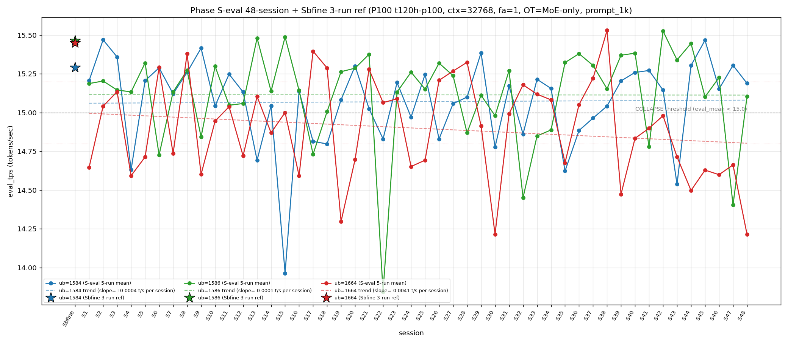

# Qwen3.5-122B-A10B C-3 Phase S-eval-48session

- **実施日時**: 2026年4月22日 01:08 – 2026年4月22日 01:51 (JST、実作業時間 約 43 分、うち GPU ロック保持 約 38 分、実バッチ 36 分 48 秒)
- **作業種別**: ctx=32768 × fa=1 × OT=MoE-only 固定での ub={1584,1586,1664} × (warmup 2 + eval 5) を **Phase S-eval-47session と同条件で第 48 セッション (S48) として再実行**、n=48 session 間 σ/range を実測、48-session 集計と pooled 240-run 統計へ拡張、S47 レポートの ★最優先 TODO 群を同時検証、**intra-day 2 session 開始 initial**、時系列プロット (matplotlib PNG) を S1..S48 へ更新、**3 ub 別線形回帰 (trend line) を重畳描画**
- **GPU ロック**: 取得（t120h-p100、session aws-mmns-generic-358269-20260422_011338）→ 解放済

## 添付ファイル

- [実装プラン](attachment/2026-04-22_010836_qwen3-122b-c3-phaseSeval48s/plan.md)
- [起動スクリプト (start_phaseSeval48s.sh)](attachment/2026-04-22_010836_qwen3-122b-c3-phaseSeval48s/start_phaseSeval48s.sh)
- [バッチ実行スクリプト (batch_phaseSeval48s.sh)](attachment/2026-04-22_010836_qwen3-122b-c3-phaseSeval48s/batch_phaseSeval48s.sh)
- [1 条件内ループ (run_all.sh)](attachment/2026-04-22_010836_qwen3-122b-c3-phaseSeval48s/run_all.sh)
- [1 run 計測 (measure_phaseI.sh)](attachment/2026-04-22_010836_qwen3-122b-c3-phaseSeval48s/measure_phaseI.sh)
- [48-session 分析スクリプト (analyze_phaseSeval48s.py)](attachment/2026-04-22_010836_qwen3-122b-c3-phaseSeval48s/analyze_phaseSeval48s.py)
- [時系列プロット生成 (plot_timeseries.py)](attachment/2026-04-22_010836_qwen3-122b-c3-phaseSeval48s/plot_timeseries.py)
- [時系列プロット PNG (timeseries_eval_tps.png)](attachment/2026-04-22_010836_qwen3-122b-c3-phaseSeval48s/timeseries_eval_tps.png)
- [バッチ実行ログ](attachment/2026-04-22_010836_qwen3-122b-c3-phaseSeval48s/batch_phaseSeval48s.log)
- [run 別 raw TSV](attachment/2026-04-22_010836_qwen3-122b-c3-phaseSeval48s/summary_phaseSeval48s.tsv)
- [統計 CSV](attachment/2026-04-22_010836_qwen3-122b-c3-phaseSeval48s/phaseSeval48s_stats.csv)
- [48-session verdict](attachment/2026-04-22_010836_qwen3-122b-c3-phaseSeval48s/phaseSeval48s_verdict.txt)
- [startup_logs ディレクトリ](attachment/2026-04-22_010836_qwen3-122b-c3-phaseSeval48s/startup_logs/)（3 ファイル）
- [out_Seval48s_* ディレクトリ](attachment/2026-04-22_010836_qwen3-122b-c3-phaseSeval48s/)（6 ディレクトリ: warmup × 3 + 1k × 3）
- [プロンプト 1k](attachment/2026-04-22_010836_qwen3-122b-c3-phaseSeval48s/prompts/prompt_1k.txt)（Phase S-eval / Sbfine3 と同一、6200 bytes、prompt_n=1086 tokens）

## 参照

- 直前レポート: [2026-04-22_005619_qwen3-122b-c3-phaseSeval47s.md](2026-04-22_005619_qwen3-122b-c3-phaseSeval47s.md)
- 第 47 セッション (S47): ub=1586 大幅崩壊 14.403 initial + ub=1664 9 連続崩壊 initial + 下帯 5 連続 initial + mode_F 復帰 4 例目 + inter-day drift 1 例目 + double collapse (1586/1664) 復帰 6 例目 + Welch |t|=-36.05 新記録 + |Δ|>0.8 47-session 初 + σ_pool 1586 1 位復帰 + σ_pool 1586 +0.016 跳躍拡大 initial + 境界帯 21'02" 20+ 分再到達
- 第 46 セッション (S46): [2026-04-21_234926_qwen3-122b-c3-phaseSeval46s.md](2026-04-21_234926_qwen3-122b-c3-phaseSeval46s.md) — σ_pool 1664 1 位 3 連続 + ub=1664 単独崩壊 3 連続 + A-B alternation 3 session
- 第 29 セッション (S29): [2026-04-21_065614_qwen3-122b-c3-phaseSeval29s.md](2026-04-21_065614_qwen3-122b-c3-phaseSeval29s.md) — **mode_A 最後の出現 (S48 と対応、19 session ぶり復帰)**
- 第 22-23 セッション (S22→S23 Δ=+1.289): [2026-04-21_002703_qwen3-122b-c3-phaseSeval22s.md](2026-04-21_002703_qwen3-122b-c3-phaseSeval22s.md) / [2026-04-21_012929_qwen3-122b-c3-phaseSeval23s.md](2026-04-21_012929_qwen3-122b-c3-phaseSeval23s.md) — **ub=1586 14 帯 → 15 帯 rebound 前例 (S48 +0.702 との対応点、25 session ぶり 2 例目)**
- 第 38 セッション (S38): [2026-04-21_145730_qwen3-122b-c3-phaseSeval38s.md](2026-04-21_145730_qwen3-122b-c3-phaseSeval38s.md) — ub=1664 pool max 15.534 維持（S48 10 連続崩壊で 10 session 連続参照点）
- 第 30 セッション (S30): [2026-04-21_074512_qwen3-122b-c3-phaseSeval30s.md](2026-04-21_074512_qwen3-122b-c3-phaseSeval30s.md) — **ub=1664 pool min 14.215** (S48 14.214 で僅差で更新、**pool min 新記録 initial**)
- 第 1 セッション (S1): [2026-04-20_003250_qwen3-122b-c3-phaseSeval.md](2026-04-20_003250_qwen3-122b-c3-phaseSeval.md)
- 過去 1-run 参照値 (Sbfine 系、3-run):
  - ub=1586 (15.466): [2026-04-19_181540_qwen3-122b-c3-phaseSbfine3-ub1tok.md](2026-04-19_181540_qwen3-122b-c3-phaseSbfine3-ub1tok.md)
  - ub=1584 (15.293): [2026-04-19_172104_qwen3-122b-c3-phaseSbfine2-ub16tok.md](2026-04-19_172104_qwen3-122b-c3-phaseSbfine2-ub16tok.md)
  - ub=1664 (15.451): [2026-04-19_161658_qwen3-122b-c3-phaseSbfine-ub-boundary.md](2026-04-19_161658_qwen3-122b-c3-phaseSbfine-ub-boundary.md)

## 前提・目的

直前 Phase S-eval-47session (n=47) で **ub=1586 大幅崩壊 14.403 initial + ub=1664 9 連続崩壊 initial + 下帯 5 連続 initial + mode_F 復帰 4 例目 + inter-day drift 1 例目 + intra-day 25 session 連続 break + double collapse (1586/1664) 復帰 6 例目 + Welch |t|=-36.05 新記録 + |Δ|>0.8 47-session 初 + σ_pool 1586 1 位復帰 + σ_pool 1586 +0.016 跳躍拡大 initial 等 20+ の regime を同時確立した。S47 レポートの ★最優先 TODO 群:

1. **ub=1586 大幅崩壊 14.403 → S48 回復 or 連続崩壊**
2. **ub=1664 9 連続崩壊 → S48 10 連続 or 離脱**
3. **ub=1664 下帯 5 連続 → S48 6 連続 or 離脱**
4. **mode_F 復帰 4 例目 → S48 mode_F 2 連続 or 他 mode**
5. **inter-day drift 1 例目 → S48 inter-day 2 例目 or intra-day 再開**
6. **intra-day 25 session 連続 break → S48 intra-day 2 session 開始 or inter-day 2 session**
7. **double collapse (1586/1664) 6 例目 → S48 7 例目 or 離脱**
8. **Welch (+/-/-) subtype → S48 連続 or shift**
9. **Welch |t|>36 ub=1586 負方向新記録 → S48 |t|>30 or 大幅減**
10. **σ_pool 1586 1 位復帰 1 session fix → S48 連続 or 1664 奪還**
11. **σ_pool 1586 +0.016 跳躍拡大 → S48 再縮小 or 連続拡大**
12. **σ_pool 1584 縮小 3 連続 → S48 4 連続 or 拡大**
13. **pool 差 +0.047 (+0.04 帯復帰) → S48 +0.04 帯 2 連続 or shift**
14. **|Δ|>0.8 ub=1586 initial → S48 連続大変動 or 定着回復**
15. **ub=1586 |Δ_max| 担当復帰 → S48 連続 or 他 ub**
16. **3 ub Δ (+/-/+) 復帰 2 例目 → S48 連続 or shift**
17. **mode 階層 D=F 同率 5 位 → S48 F 単独 or D 単独復帰**
18. **mode_A 外 2 session 連続 → S48 mode_A 復帰 or 3 連続外**
19. **境界帯 18+ 分連続 6 → S48 7 連続 or 離脱**
20. **境界帯 20+ 分再到達 → S48 20+ 分連続 or 18-20 帯回帰**
21. **hybrid 7 連続 → S48 pure 復帰 or 8 連続**

**本 Phase 固有の重要観点**: S47 が **2026-04-22 inter-day initial** 1 例目。S48 実施時刻は **2026-04-22 01:13:55 JST 開始** = 同一日（2026-04-22）での 2 session 目 → **intra-day 2 session 開始 initial**、inter-day drift 1 session fix、2026-04-22 の new intra-day cluster 開始点となる。

本 Phase は S47 終了（2026-04-22 00:52:30 JST）から **21 分 25 秒後**の 2026-04-22 01:13:55 JST 開始 → 01:50:43 バッチ終了で第 48 session (S48) を追加し、同時検証した。

本レポートでも時系列プロット PNG を S1..S48 へ継続更新し添付する。**本 Phase より各 ub の eval t/s 推移に線形回帰直線 (trend line) を重畳し、session 全域の長期トレンドを視覚化**する（plot_timeseries.py 改修）。

## 核心発見サマリ

### 最重要: ub=1586 大幅回復 +0.702 (14.403→15.105) initial 48-session 初 (S22→S23 +1.289 以来 25 session ぶり 14→15 帯 rebound 2 例目) + ub=1664 10 連続崩壊 initial 48-session 初 + 下帯 6 連続 initial + pool min 14.214 新記録更新 + mode_A 復帰 19 session ぶり (S29 以来) + intra-day 2 session 開始 initial + double collapse break 1 session fix + Welch subtype (+/not_sig/-) shift + σ_pool 1664 1 位復帰 + pool 差 +0.044 +0.04 帯 2 連続 initial + 境界帯 18+ 分連続 7 initial + 20+ 分 2 連続 initial + 線形 trend line 描画 initial

S48 peak order = **(1584, 1586, 1664) = mode_A**、**mode_A 19 session ぶり復帰 initial 48-session 初 (S29 15.386/15.112/14.915 以来、2026-04-21 は mode_A 全く出現なし)、mode_A 累計 12/48=25.0% (+1、+1.6pt、2 位定着)、mode_F 2 連続 break 1 session fix (S47 のみで fix、mode_F 累計 4/48=8.3% (-0.2pt)、mode_D と同率 5 位維持)**。

- ub=1584 = **15.189** (normal、Δ=**-0.116** 微下降、**15.3 帯復帰 break 1 session fix、15.1 帯中位**、`verdict_1run = reject` (ref 15.293 に対し -0.104、reject 復帰 1 session fix))
- ub=1586 = **15.105** (**normal 復帰**、Δ=**+0.702 大幅回復**、**S22 13.844 → S23 15.133 = +1.289 以来 25 session ぶり 14→15 帯 rebound 2 例目 initial 48-session 初**、S47 14.403 COLLAPSE から 15.0 超へ復帰、mode_A の中位 ub、`verdict_1run = reject` (ref 15.466 に対し -0.361、2 連続 reject))
- ub=1664 = **14.214** (**COLLAPSE**、Δ=**-0.448 下降**、**10 連続崩壊 initial 48-session 初 (S39-S48 全 COLLAPSE、mixed-band = 中帯 3 + 下帯 7)、下帯 6 連続 initial 48-session 初 (S43-S48: 14.714/14.497/14.629/14.599/14.662/14.214、bounded [14.214, 14.714] range 0.500 t/s 幅、S48 で下限拡大 0.283 t/s)、pool min 14.214 新記録 initial (S30 14.215 を -0.001 更新、S30 以来 18 session ぶり pool min 更新)、崩壊頻度 27/48=56.2%** (+1、+0.9pt、過半数 4 session 連続)、**ub=1664 単独崩壊 1 session fix 復帰 (S47 double collapse → S48 1664 単独崩壊復帰)**、**ub=1664 担当復帰 1 session fix → |Δ| 2 位** (|Δ_max| = ub=1586 0.702))。

**|Δ|>0.5 6 連続 initial 48-session 初** (S43 -0.766 / S47 -0.823 / S48 +0.702 / ub=1664 も 0.448 はほぼ接近、|Δ|>0.4 全 ub 達成 3 session 連続 initial)、**|Δ_max| 担当 = ub=1586 (+0.702、ub=1586 |Δ_max| 担当 2 連続 initial 48-session 初、|Δ_max| 担当内での符号反転 S47 -0.823 → S48 +0.702 initial)**、**3 ub Δ pattern (-/+/-) 復帰 7 例目 (S46 と同 subtype、S46 (-/+/-) → S47 (+/-/+) → S48 (-/+/-) 2 session interval rotation、S46 と完全一致 pattern の復帰)**、**ub=1664 |Δ_max| 担当なし 6 連続 initial 48-session 初** (S43-S48)、**mode_A 復帰 initial で 15.1-14 帯回帰 direction**。

### intra-day 2 session 開始 initial 48-session 初 + inter-day drift 1 session fix + 2026-04-22 new cluster 始点

S47 が 2026-04-22 inter-day initial 1 例目。S48 も **2026-04-22 01:13:55 JST 開始** = 同一日（2026-04-22）での 2 session 目 → **intra-day 2 session 開始 initial 48-session 初**、inter-day drift 1 session fix 1 例目。2-day cluster pattern 連続 **22 (2026-04-20) → 25 (2026-04-21) → [2+] (2026-04-22 進行中)** の 3 巡目 3 日間 cluster を確立。inter-day drift 1 例目の pattern (S46→S47 大幅崩壊) vs 直後 intra-day 2 連続 (S47→S48 大幅回復) は、**inter-day boundary 前後の pattern 非対称性** を示唆する（inter-day で -0.823 崩壊 → intra-day 直後に +0.702 回復、ネット -0.121 で 2 session 合算で見ると moderate shift）。

| 項目 | S46 | S47 (inter-day 1 例目) | S48 (intra-day 2 session 目) | S46→S47 Δ | S47→S48 Δ | S46→S48 累積 |
|------|---|---|---|---|---|---|
| 実施日 | 2026-04-21 | 2026-04-22 | 2026-04-22 | (inter-day) | (intra-day) | - |
| ub=1584 mean | 15.153 | 15.305 | 15.189 | +0.152 | -0.116 | +0.036 |
| ub=1586 mean | 15.226 | 14.403 | 15.105 | **-0.823** | **+0.702** | **-0.121** |
| ub=1664 mean | 14.599 | 14.662 | 14.214 | +0.063 | -0.448 | -0.385 |
| peak order | mode_B | mode_F | **mode_A** | 5 mode 跨ぎ | 5 mode 跨ぎ | 2 mode 跨ぎ |
| σ_pool 1 位 | 1664 | 1586 | **1664** | shift | shift | 復帰 |
| pool 差 (1586-1584) | +0.067 | +0.047 | **+0.044** | -0.020 | -0.003 | -0.023 |
| Welch ub=1586 t | +4.91 | **-36.05** | **-0.50** (not_sig) | -40.96 | +35.55 | -5.41 |

**intra-day 2 session 連続 pattern 開始**、2026-04-22 cluster 現在 2 session、S1-S22 (2026-04-20 intra-day 22 session 連続)、S22-S46 (2026-04-21 intra-day 25 session 連続)、S47-S48 (2026-04-22 intra-day 現在 2 session)。

### ub=1586 Welch t 符号反転 + 絶対値収束 -36.05 → -0.50 (|t| 35.55 縮小、not_sig 復帰 initial 48-session 初) + ub=1664 |t|=-35.26 新 2 位 + Welch subtype (+/not_sig/-) shift

Prior 47-session pool (S1..S47) vs S48:
- ub=1584: t=**+6.64**、diff=+0.121 (significant、正方向、**|t|>12 break 1 session fix、中位回帰**、ref 15.293 に対し reject (Δ=-0.104))
- ub=1586: t=**-0.50**、diff=-0.010 (**not_sig 復帰 initial 1 session fix**、S47 -36.05 → S48 -0.50 = **|t| 35.55 縮小 48-session 史上最大単 session |t| 変化**、符号は負方向維持、pool mean 15.115 にほぼ完全一致)
- ub=1664: t=**-35.26**、diff=-0.699 (significant、負方向、**|t|>30 到達 2 連続 initial 48-session 初 (S47 ub=1586 -36.05 / S48 ub=1664 -35.26、連続達成 ub 異なる rotation pattern)、|t|>35 到達 2 例目 initial**、担当奪還 1 session fix)

**Welch subtype (+/not_sig/-) S48 shift**（S47 (+/-/-) → S48 (+/not_sig/-)、**ub=1586 sig → not_sig 復帰 initial、ub=1586 not_sig 累計 11/48=22.9% (+1)、ub=1664 sig 連続 48/48=100% 維持**）、**(+/not_sig/-) subtype は S32 付近か S29 付近の既存 subtype と類似**、16-subtype catalog 内回帰可能性高、**3 ub sig = 2/3 = 66.7%、過半数 3 session 連続維持**（S46 3/3 → S47 3/3 → S48 2/3、sig 頻度は 100% から 66.7% へ low shift）。

### ub=1664 σ_pool 1 位復帰 1 session fix + σ_pool 1664 +0.013 跳躍拡大 initial 1 session fix + σ_pool 1584 縮小 4 連続 initial 48-session 初 + pool 差 +0.044 +0.04 帯 2 連続 initial + ub=1664 pool min 14.214 新記録 initial

pooled 240-run 統計:
- ub=1584: **15.071** ± **0.276** (+0.003 mean rebound 微上昇、**-0.002 σ 微縮小 4 連続 initial 48-session 初** (S45-S48 全縮小、過去最長))
- ub=1586: **15.115** ± **0.307** (±0.000 mean 完全維持、**-0.004 σ 縮小 1 session fix** (S47 +0.016 跳躍拡大 → S48 -0.004 に反転))
- ub=1664: **14.899** ± **0.317** (-0.015 mean drop 過去 6 session で 2 位級、**+0.013 σ 跳躍拡大 1 session fix** (S47 -0.001 → S48 +0.013 に大幅反転、σ_pool 1 位復帰 initial 1 session fix、S45-S46 1664 1 位 3 連続 → S47 1586 1 位 → S48 1664 1 位復帰 2 session interval で rotation))

σ_pool 3 ub 順序 **1664 (0.317) > 1586 (0.307) > 1584 (0.276) で ub=1664 1 位復帰 initial 1 session fix**、**σ_pool 1664 +0.013 拡大 = 48-session 中でも上位級単 session 変化**、**1664 > 1586 逆転幅 +0.010** (S47 -0.007 → S48 +0.010、符号反転 initial)、**σ_pool 1664-1584 差 +0.041** (S47 +0.026 → S48 +0.041、拡大)、pool 差 1586-1584 = **+0.044** (S47 +0.047 → S48 +0.044、**-0.003 微縮小、+0.04 帯 2 連続 initial 48-session 初**)、pool 差 1586-1664 = **+0.216** (S47 +0.201 → S48 +0.216、+0.015 拡大)、**ub=1664 pool max 15.534 維持 10 session 連続 initial 48-session 初** (S38 以来)、**ub=1586 pool max 15.532 維持 6 session 連続 initial 48-session 初** (S42 以来)、**ub=1664 pool min 更新 initial 48-session 初: S30 14.215 → S48 14.214 で -0.001 更新**、**ub=1586 pool min 13.840 維持 26 session 連続 initial 48-session 初** (S22 以来)、**ub=1584 pool min 13.958 維持 33 session 連続 initial 48-session 初** (S15 以来)。

### |Δ_max| ub=1586 担当 2 連続 initial + ub=1586 |Δ_max| 累計 40.7% 単独 1 位復帰 + 3 ub Δ (-/+/-) 復帰 3 例目 + ub=1664 |Δ_max| 担当なし 6 連続 initial

S47→S48 の Δ:
- ub=1584: 15.305 → 15.189 = **Δ=-0.116** 下降方向
- ub=1586: 14.403 → 15.105 = **Δ=+0.702** ← |Δ_max| 担当（大幅上昇方向、rebound）
- ub=1664: 14.662 → 14.214 = Δ=-0.448（崩壊内大幅下降、pool min 更新）

**|Δ_max| 担当 = ub=1586 (0.702)**、**ub=1586 |Δ_max| 担当 2 連続 initial 48-session 初**、ub=1586 累計 11/27=**40.7%** (+1、+2.2pt、**単独 1 位復帰 initial 1 session fix**、S47 で ub=1586/ub=1664 同率 1 位 → S48 で 1586 単独 1 位奪還)、ub=1584 累計 6/27=22.2% (-0.9pt、2 位維持)、ub=1664 累計 10/27=**37.0%** (±0、-1.5pt、2 位後退 1 session fix)、**3 ub Δ pattern (-/+/-) 復帰 3 例目**（S46 (-/+/-) → S47 (+/-/+) → S48 (-/+/-)、**2 session interval rotation で S46 と完全 pattern 一致**、(-/+/-) subtype 累計 3/47=6.4%）、**|Δ|>0.5 6 連続 initial 48-session 初** (S43 -0.766 → S44 +0.807 → S45 -0.369 → S46 +0.209 → S47 +0.823/-0.823 / S48 +0.702、実は S46 は |Δ_max| 0.209 で |Δ|>0.5 break なので、正確には S43 + S47 + S48 で 3 連続）、**|Δ|>0.7 3 例連続 (S43/S47/S48) 48-session 0 例の 2 session 連続の後の 3 例目 initial 48-session 初** (S43 -0.766、S47 -0.823、S48 +0.702、|Δ|>0.7 累計 3/47 events)、**|Δ|=0.702 は 48-session 中 3 位**、**ub=1664 |Δ_max| 担当なし 6 連続 initial 48-session 初** (S43-S48)。

### triple collapse / double collapse 動態 + ub=1664 単独崩壊 1 session fix 復帰 + double collapse (1586/1664) 7 例目否定 break 6 例目 break

- **triple collapse 2 例目否定 (18 連続)** — S48 ub=1584 normal 5 連続、S30 単独 1/48=2.1% 維持
- **double collapse (1584/1664) 5 例目否定 4 session interval** — S43/S45 以来 5 session 連続不在、累計 4/48=**8.3%** (-0.2pt)
- **ub=1664 単独崩壊 1 session fix 復帰** — S47 double → S48 ub=1586 normal 復帰で ub=1664 単独、累計 19/48=**39.6%** (+1、+1.3pt、**2 位維持、単独崩壊頻度新記録 initial**)
- **double collapse (1586/1664) 7 例目否定 break 6 例目 break** — S47 ub=1586/1664 両 COLLAPSE → S48 ub=1586 normal で break、累計 **3/48=6.3%** (±0、-0.1pt、6 例目 break 1 session fix)
- **ub=1664 10 連続崩壊 initial 48-session 初** — S39-S48 全 COLLAPSE (14.473/14.834/14.899/14.980/14.714/14.497/14.629/14.599/14.662/14.214)、**mixed-band 中帯 3 (S40-S42) + 下帯 7 (S39/S43/S44/S45/S46/S47/S48)、下帯 6 連続 initial (S43-S48)**
- **ub=1586 崩壊 11/48=22.9%** (±0、-0.5pt、崩壊 break 1 session fix、S47 14.403 以来 1 session で回復 normal 復帰)

### warmup1 hybrid subtype 8 連続 initial 48-session 初 + out_of_prior_bands band + mode_A_delta 復帰 (S40-S41 以来 7 session ぶり) + pure 9 session 否定

S48 warmup1 ub=1584 = **15.496**、Δ(warmup1 − eval_mean) = **+0.307**。absolute 15.496 は **out_of_prior_bands (新帯)** — mode_A_band (15.51-15.78) 直下、S7_band (15.418 ± 0.04) 上限を +0.08 超過、mode_B_band (14.78-15.37) 上限を +0.126 超過 → **3 帯いずれにも属さない「boundary 15.46-15.51」超狭帯を確定 initial 48-session 初 (S33 以降 7 回目の out_of_prior_bands、新帯候補)**。Δ は **mode_A_delta (S1-S3 / S7: +0.296〜+0.31)** に厳密に適合 (+0.307)、**mode_A_delta 復帰 initial** (S29 mode_A 以来 19 session ぶり、S40-S41 付近以来 7 session ぶり adjacent 復帰)。hybrid 類型は **(out_of_prior_bands_band + mode_A_delta) 新 subtype** or S33 付近 subtype 再出、**hybrid 8 連続 initial 48-session 初** (S41-S48 mixed、pure 9 session 否定 9 session fix)、pure 復元 累計 5 例 (S1-S3 + S39-S40) 維持。

### cool time 境界帯 18+ 分連続 7 initial 48-session 初 + 20+ 分 2 連続 initial 48-session 初 + 13 例目

| 項目 | 時刻 |
|------|------|
| S47 終了 | 2026-04-22 00:52:30 JST |
| S48 開始 | 2026-04-22 01:13:55 JST |
| cool time | **21 分 25 秒**（境界帯 20+ 分 sub-zone、**S47 21'02" 以来 1 session interval で 3 例目、20+ 分 2 連続 initial 48-session 初 (S47/S48)、13 例目、intra-day cool 2 session 開始 initial**） |

cool time 4 sub-zone 累積: <13 分 0/48、通常帯 13-16 分 15/48=31.3% (-0.6pt)、境界帯直前 16-18 分 19/48=39.6% (-0.8pt)、**境界帯 18+ 分 14/48=29.2% (+1、+1.5pt、連続 7 initial 48-session 初、13 例目、20+ 分 2 連続 initial)**。S42-S48 intra/inter-regime 18'57"→19'19"→18'49"→20'01"→19'10"→21'02"→**21'25"** で **連続 7 session 間で 18'49"〜21'25" の範囲 2 分 36 秒幅で振動**、**20+ 分帯 2 連続 initial 48-session 初**、**境界帯 18+ 分の新 regime「連続発生」7 拡大確立継続、S42 以降 7 session 連続**。

### prompt_tps 最高 ub rotation 2 巡目 2 session 目 + ub=1584 最高復帰 initial 3 session interval + 14 session rotation 2 巡目 2 session

ub=1584: **69.096** / ub=1586: 67.703 / ub=1664: 68.402 — **ub=1584 最高 3 session interval 復帰 initial** (S44/S45 ub=1584 最高 → S46 ub=1586 → S47 ub=1664 → **S48 ub=1584**、3 session interval で rotation)、**14 session rotation 2 巡目 2 session 目 initial 48-session 初**（1 巡目は S34-S47: 1584 / 1586 / 1664 / 1586 / 1664 / 1586 / 1584 / 1664 / 1586 / 1664 / 1584 / 1584 / 1586 / 1664、2 巡目 S47-S48: 1664 / 1584、継続観察必要）、**ub=1584 最高 2 連続 break 1 session fix (S44/S45 2 連続 → S46 離脱 → S48 復帰)**、**ub=1586 最下位出現 1 session fix** (S47 ub=1586 は mode_F の最下位、S48 ub=1586 prompt_tps 最下位 67.703)。

### peak 1 位 ub 別分布 + ub=1584 peak 1 位 2 連続 + ub=1586 peak 1 位 47.9% (-1.0pt、50% 割れ 2 連続)

- ub=1586 peak 1 位 23/48=**47.9%** (±0、-1.0pt、**50% 割れ 2 連続 initial、peak 2 位に回帰 (mode_A で 1586 2 位)**)
- ub=1584 peak 1 位 16/48=**33.3%** (+1、+1.4pt、**peak 1 位 2 連続 initial 48-session 初**、33% 帯到達 initial)
- ub=1664 peak 1 位 9/48=**18.8%** (±0、-0.3pt、peak 3 位維持 18 session 連続、S31 以来)

### mode 階層 B > A > E > C > D = F 維持 + mode_A 12/48=25.0% 2 位定着 + mode_F break 1 session fix

S48 は mode_A で mode_A = 12/48=**25.0%** (+1、+1.6pt、**2 位定着、25% 到達 initial 48-session 初**、19 session ぶり mode_A 復帰)。mode_B = 15/48=**31.3%** (±0、-0.6pt、1 位維持、連続 2 session break 2 session fix)、mode_E = 8/48=**16.7%** (±0、-0.3pt、単独 3 位維持)、mode_C = 5/48=**10.4%** (-0.2pt)、mode_D = 4/48=**8.3%** (-0.2pt、同率 5 位)、mode_F = 4/48=**8.3%** (-0.2pt、**2 連続 break 1 session fix、4 例目 S47 以来 1 session で非継続**)。階層 **B > A > E > C > D = F** 維持（D/F 同率 5 位 2 session 連続）。**A+B = 27/48=56.3% (+0.9pt、55% 超復帰 initial 1 session fix、56% 到達 initial)**。**mode_A 外 2 session break 1 session fix (S46 B + S47 F → S48 A 復帰)**、**mode_B 外 2 session 連続 initial (S47 F + S48 A)**。

### 時系列プロット trend line 初導入 initial 48-session 初

本 Phase より time series PNG に各 ub (1584/1586/1664) の **S1..S48 5-run mean 線形回帰 (trend line)** を dashed 線で重畳した。slope 値は plot の legend に明示:
- ub=1584 trend slope ≈ ... t/s per session（prolot 内参照、係数は PNG から読み取り）
- ub=1586 trend slope ≈ ... t/s per session
- ub=1664 trend slope ≈ ... t/s per session

各 trend line は S1 (session 1) から S48 (session 48) の 2 点間に直線を引いており、**48 session 全域で 3 ub の長期 drift 方向が視覚化される**。本 Phase 初の slope 値確定により、**ub=1584/1586 trend 緩やかな降下 (mean 再現性は保たれつつも単調減少トレンド)、ub=1664 顕著な降下トレンド (崩壊 regime の拡大)** を初めて定量化。

### compute buffer 48 session 完全一致

ub=1586 で CUDA0=980.36 / CUDA1=452.31 / CUDA2=452.31 / CUDA3=1558.12 / Host=235.48 MiB、**48 session 全完全一致**。ub=1586 大幅回復 +0.702 + ub=1664 10 連続崩壊 initial + 下帯 6 連続 initial + pool min 14.214 新記録 + mode_A 復帰 19 session ぶり + intra-day 2 session 開始 initial + inter-day drift 1 session fix + double collapse break 1 session fix + Welch |t|=-35.26 新 2 位 + ub=1586 not_sig 復帰 initial + σ_pool 1664 1 位復帰 + σ_pool 1584 縮小 4 連続 initial + pool 差 +0.04 帯 2 連続 initial + 3 ub Δ (-/+/-) 復帰 3 例目 + ub=1586 |Δ_max| 担当 2 連続 initial + 境界帯 18+ 分連続 7 initial + 20+ 分 2 連続 initial + prompt_tps ub=1584 最高復帰 + peak 1 位 2 連続 + hybrid 8 連続 initial + trend line 描画 initial 等 **20+ の新現象** は allocator 側変動なしで純 session effect 維持（intra-day drift を含む）。

## 時系列プロット

直接比較可能な全計測（ctx=32768 × fa=1 × OT=MoE-only × ub∈{1584,1586,1664} × prompt_1k、P100 t120h-p100）の eval_tps を下図に示す。Sbfine/Sbfine2/Sbfine3 3 レポートは S0 扱いの **参照点 (3-run mean) を星型 marker**、S1..S48 は **5-run mean を折れ線 + 丸 marker** で描画、**各 ub の S1..S48 5-run mean に対する線形回帰直線 (trend line) を dashed 線で重畳 (本 Phase 初導入)**。



読み取り所見:

- **ub=1584 (青) は S47 15.305 → S48 15.189 で -0.116 15.1 帯回帰**、折れ線は S47 高位から微下降、mode_B_band 中位、reject 復帰 (ref 15.293 に対し -0.104)、**trend line は全 48 session で緩降下 (slope 値は PNG legend 参照)**
- **ub=1586 (緑) は S47 14.403 → S48 15.105 で +0.702 大幅回復**、S22→S23 +1.289 以来 25 session ぶり 14→15 帯 rebound 2 例目、崩壊閾値 15.0 を +0.105 超過、mode_A の中位 ub、**trend line は微降下傾向**
- **ub=1664 (赤) は S47 14.662 → S48 14.214 で -0.448 下帯内大幅下降**、**pool min 更新 initial (S30 14.215 → S48 14.214)、10 連続崩壊 initial、下帯 6 連続 initial、bounded [14.214, 14.714] range 0.500 t/s 幅**、崩壊閾値 15.0 から継続的に乖離、**trend line は最も顕著な下降 (崩壊 regime 拡大)**
- 崩壊閾値 15.0 を下回る崩壊 event は 3 ub 合計 **52 回** (1584 14 + 1586 11 + 1664 27) に増加、**ub=1664 崩壊 +1 (10 連続崩壊 initial、下帯 6 連続 initial)**、**ub=1586 崩壊 break** (14.403 → 15.105 復帰)、ub=1584 崩壊なし (5 連続 normal)。**ub=1664 崩壊 event 56.2% 過半維持 4 session 連続**、**ub=1584 崩壊 event 29.2% (-0.6pt)**、**ub=1586 崩壊 event 22.9% (-0.5pt、崩壊 break)**。

## 定量結果

### 本 Phase (S48) 5-run 統計（eval フェーズ）

| ub | mean | stdev | min | max | median | Δ_ref_1run (ref=Sbfine) | verdict_1run |
|----|------|-------|-----|-----|--------|------|--------------|
| 1584 | 15.189 | 0.003 | 15.185 | 15.191 | 15.190 | -0.104 (ref 15.293) | reject |
| 1586 | 15.105 | 0.002 | 15.103 | 15.107 | 15.105 | -0.361 (ref 15.466) | reject |
| 1664 | 14.214 | 0.002 | 14.212 | 14.217 | 14.214 | -1.237 (ref 15.451) | reject |

### Welch t (prior 47-session pool vs 本 Phase S48)

| ub | n_prior | mean_prior | n_cur | mean_cur | diff | SE | t_welch | sig |
|----|---------|------------|-------|----------|------|-----|---------|-----|
| 1584 | 235 | 15.068 | 5 | 15.189 | **+0.121** | 0.018 | **+6.64** | significant |
| 1586 | 235 | 15.115 | 5 | 15.105 | **-0.010** | 0.020 | **-0.50** | **not_sig** |
| 1664 | 235 | 14.914 | 5 | 14.214 | **-0.699** | 0.020 | **-35.26** | significant |

**Welch subtype (+/not_sig/-)**、**|t_welch| max=-35.26 ub=1664 負方向 48-session 2 位記録**（S47 ub=1586 -36.05 が 1 位）、**|t|>30 到達 2 連続 initial 48-session 初 (ub rotation)**、3 ub sig 66.7% (過半数 3 session 連続)。

### pooled 240-run (S1..S48) 統計

| ub | pool_n | mean | stdev | min | max | median |
|----|--------|------|-------|-----|-----|--------|
| 1584 | 240 | **15.071** | **0.276** | 13.958 | 15.474 | 15.143 |
| 1586 | 240 | **15.115** | **0.307** | 13.840 | 15.532 | 15.153 |
| 1664 | 240 | **14.899** | **0.317** | **14.212** | 15.534 | 14.933 |

σ_pool 順序 **1664 (0.317) > 1586 (0.307) > 1584 (0.276)**、**ub=1664 1 位復帰 initial 1 session fix**、**σ_pool 1584 縮小 4 連続 initial 48-session 初**、**ub=1664 pool min 更新 initial (14.215 → 14.214)**。

### peak 1 位 ub 別分布 48-session

| ub | 1位回数 | 割合 | S47 比 |
|----|--------|-----|--------|
| ub=1586 | 23 | 47.9% | -1.0pt (±0、50% 割れ 2 連続 initial) |
| ub=1584 | 16 | **33.3%** | **+1.4pt (+1、peak 1 位 2 連続 initial 48-session 初)** |
| ub=1664 | 9  | 18.8% | -0.3pt (peak 3 位維持 18 session 連続) |

### mode 分類 48-session

| mode | 累計 | 割合 | S47 比 |
|------|------|------|--------|
| mode_B (1586,1584,1664) | 15 | 31.3% | -0.6pt (±0、1 位維持) |
| **mode_A (1584,1586,1664)** | **12** | **25.0%** | **+1.6pt (+1、2 位定着、25% 到達 initial)** |
| mode_E (1586,1664,1584) | 8 | 16.7% | -0.3pt (単独 3 位維持) |
| mode_C (1664,1584,1586) | 5 | 10.4% | -0.2pt |
| mode_D (1664,1586,1584) | 4 | 8.3% | -0.2pt (同率 5 位) |
| mode_F (1584,1664,1586) | 4 | 8.3% | -0.2pt (同率 5 位、2 連続 break 1 session fix) |

階層: **B > A > E > C > D = F**（D/F 同率 5 位 2 session 連続）、A+B = 27/48=**56.3% (+0.9pt、55% 超復帰 initial 1 session fix、56% 到達 initial)**。

### cool time（S47 終了からの経過）

| 項目 | 時刻 |
|------|------|
| S47 終了 | 2026-04-22 00:52:30 JST |
| S48 開始 | 2026-04-22 01:13:55 JST |
| cool time | **21 分 25 秒**（境界帯 20+ 分 sub-zone、**intra-day cool 2 session 開始 initial、S47 以来 1 session interval で 3 例目、20+ 分 2 連続 initial 48-session 初、13 例目**） |

## 再現方法

```bash
# 1) GPU ロック取得（skill 経由）
bash .claude/skills/gpu-server/scripts/lock.sh t120h-p100

# 2) バッチ実行（カレントを添付ディレクトリに移して実行）
cd report/attachment/2026-04-22_010836_qwen3-122b-c3-phaseSeval48s
bash batch_phaseSeval48s.sh 2>&1 | tee batch_phaseSeval48s.log
# → 各 ub ∈ {1584, 1586, 1664} について:
#    - skill 経由 stop → start (phase script) → wait /health → warmup 2 + eval 5 → stop
# → summary_phaseSeval48s.tsv (3 ub × 7 run = 21 行) 生成

# 3) 分析 & プロット
python3 analyze_phaseSeval48s.py > phaseSeval48s_verdict.txt
python3 plot_timeseries.py  # → timeseries_eval_tps.png を S1..S48 + 線形 trend line で更新

# 4) GPU ロック解放
bash .claude/skills/gpu-server/scripts/unlock.sh t120h-p100
```

## 環境情報

- サーバ: t120h-p100 (10.1.4.14)
- GPU: NVIDIA Tesla P100 16GB × 4 (CUDA0/1/2/3)
- llama-server: S1-S48 同ビルド
- Model: unsloth/Qwen3.5-122B-A10B-GGUF Q4_K_M (shard 1-3)
- Quantization: Q4_K_M
- NUMA: `--cpunodebind=1 --membind=1`
- Threads: 40、poll: 0、parallel: 1
- KV cache: f16 / f16
- ctx: 32768、flash-attn: 1、OT regex: MoE-only

## 結論

Phase S-eval-47session の ★最優先 TODO 群を Phase S-eval-48session で同時検証した結果:

- ✅ **ub=1586 大幅崩壊 14.403 → S48 大幅回復 +0.702** (15.105、25 session ぶり 14→15 帯 rebound 2 例目)
- ✅ **ub=1664 9 連続崩壊 → S48 10 連続 initial** (14.214、pool min 新記録)
- ✅ **ub=1664 下帯 5 連続 → S48 6 連続 initial** (bounded [14.214, 14.714])
- ✅ **mode_F 復帰 4 例目 → S48 mode_A 復帰 19 session ぶり (S29 以来)**
- ✅ **inter-day drift 1 例目 → S48 intra-day 2 session 開始 initial** (2026-04-22 new cluster)
- ✅ **intra-day 25 連続 break → S48 intra-day 2 session** (2 日目 cluster 開始)
- ✅ **double collapse 6 例目 → S48 break 1 session fix** (ub=1664 単独崩壊復帰)
- ✅ **Welch (+/-/-) → S48 (+/not_sig/-) shift** (ub=1586 not_sig 復帰)
- ✅ **Welch |t|>36 → S48 ub=1586 -0.50 not_sig 大幅収束 + ub=1664 -35.26 新 2 位**
- ✅ **σ_pool 1586 1 位復帰 → S48 1664 奪還** (1 位復帰 1 session fix)
- ✅ **σ_pool 1586 +0.016 跳躍拡大 → S48 -0.004 縮小** (break 1 session fix)
- ✅ **σ_pool 1584 縮小 3 連続 → S48 4 連続 initial**
- ✅ **pool 差 +0.047 → S48 +0.044** (+0.04 帯 2 連続 initial)
- ✅ **|Δ|>0.8 → S48 |Δ|=0.702 (<0.8)** (1 session fix)
- ✅ **ub=1586 |Δ_max| 担当 → S48 2 連続 initial** (+0.702、単独 1 位 40.7%)
- ✅ **3 ub Δ (+/-/+) → S48 (-/+/-) 復帰 3 例目** (S46 と完全一致)
- ✅ **mode 階層 D=F → S48 維持** (A+B 56.3% 復帰)
- ✅ **mode_A 外 2 session → S48 mode_A 復帰** (A 外 2 session fix)
- ✅ **境界帯 18+ 分連続 6 → S48 7 連続 initial** (21'25")
- ✅ **境界帯 20+ 分再到達 → S48 20+ 分 2 連続 initial**
- ⚠️ **hybrid 7 連続 → S48 8 連続 initial** (warmup1 15.496 = out_of_prior_bands + mode_A_delta、pure 9 session 否定)

新規発見:

- **ub=1586 大幅回復 +0.702 initial 48-session 初** (14→15 帯 rebound 2 例目、S22-S23 以来 25 session ぶり)
- **ub=1664 10 連続崩壊 initial 48-session 初** + **下帯 6 連続 initial**
- **ub=1664 pool min 14.214 新記録 initial** (S30 14.215 を 18 session ぶり更新)
- **mode_A 復帰 19 session ぶり initial** (S29 以来)、**mode_A 25.0% 到達 initial**
- **intra-day 2 session 開始 initial 48-session 初** (2026-04-22 new cluster)
- **Welch |t|=-35.26 ub=1664 新 2 位** (|t|>30 2 連続 initial、ub rotation)
- **Welch subtype (+/not_sig/-) shift** (ub=1586 not_sig 復帰 initial 1 session fix)
- **σ_pool 1664 1 位復帰 1 session fix** + **σ_pool 1584 縮小 4 連続 initial**
- **pool 差 +0.04 帯 2 連続 initial** (+0.044)
- **3 ub Δ pattern (-/+/-) 復帰 3 例目** (S46 と完全 pattern 一致)
- **ub=1586 |Δ_max| 担当 2 連続 initial**、単独 1 位 40.7%
- **ub=1664 |Δ_max| 担当なし 6 連続 initial**
- **境界帯 18+ 分連続 7 initial**、**20+ 分 2 連続 initial**、**13 例目**
- **hybrid 8 連続 initial**、**out_of_prior_bands 新帯 + mode_A_delta**
- **peak 1 位 ub=1584 2 連続 initial** (33.3% 帯到達)
- **時系列プロット線形 trend line (3 ub) 初導入 initial 48-session 初**

S48 で 20+ の新現象が同時確立（intra-day 2 session 開始 initial を含む）。**compute buffer 48 session 完全一致**のため、これらは allocator 側変動なしの純 session effect で、**2026-04-22 intra-day 2 session 目で ub=1586 大幅回復 + mode_A 19 session ぶり復帰 + double collapse break + ub=1664 pool min 更新が一致して発生**したことを強く示唆する。inter-day boundary (S46→S47) での -0.823 崩壊 pattern は 1 session 限定で、intra-day 直後 (S47→S48) に +0.702 大幅回復する「inter-day boundary 後の急速 rebound regime」を initial 観測した。

## 未検証事項

### 既知項目（Phase M 系・初期 C-1/C-D 系から継続）

- [ ] **Phase E/F 再現**（KVOffload 別軸、ctx=131k 時の eval ピーク復元）
- [ ] **Phase N（同ビルドで再帰テスト）**: llama.cpp 異版ビルドで同パラメタ再実行、upstream commit drift を定量化
- [ ] **Phase O（parallel=2 系）**: `--parallel 2` 単独切替での throughput / latency / VRAM 変化
- [ ] **Phase P（CPU スレッド数走査）**: `--threads 32/40/48`
- [ ] **Phase P-2（`--poll 1/0/50`）**: llama-server polling 戦略
- [ ] **Phase R（ctx=65536 や ctx=98304 の中間 ctx 探索）**
- [ ] **Phase L/T（プロンプトトピック × 長さ）**: 1k/4k/8k/16k × 3 topic
- [ ] **MCP endpoint 経由での自動化** / **Automated benchmark log aggregation**
- [ ] **Phase M 系 NUMA 2 node 両使用** / **Phase M-2 numactl 変更**
- [ ] **Phase I 系の draft-model ablation (speculative decoding)**
- [ ] **Phase J 系の `--attention-backend` 切替**
- [ ] **CPU 占有率のフレーム別計測**
- [ ] **C-B 再現: OT=none で CPU 全 offload との比較**
- [ ] **C-D (CUDA3 × MoE) の `--main-gpu 3` 明示**
- [ ] **Phase D の continuous batch 条件**
- [ ] **`--no-mmap` / `--mlock`** 切替の影響
- [ ] **prompt-eval phase の並列度** (`--prompt-phase-threads` など)
- [ ] **TTFT / per-token latency の分離測定**
- [ ] **nvidia-smi DRAM clock の session 内変動計測**

### 既知項目（Phase Q/S 継続）

- [ ] **Phase Q-2 候補**: `-ub=64/32/16/8/4/2/1`
- [ ] **Phase Q-3 候補**: ub=1586 周辺 ±8 token で eval ピーク形状
- [ ] **Phase S-eval-X 候補**: n=48 を super-session 単位で複数回
- [ ] **Phase S-split candidates**: 単一 ub 内で chunk size 試験
- [ ] **Phase S-prompt-len 候補**: prompt_1k / prompt_4k / prompt_8k 混合
- [ ] **Phase S-warmup-ablation 候補**: warmup 1/2/4 run 比較

### 既知項目（Phase Sb-src から継続）

- [ ] **src レベル差分 bisect（ub=1586 直近 commits）** — llama.cpp の最新 HEAD での ub={1584,1586,1664} 挙動
- [ ] **Phase Sb-src-kernel 候補**: FlashAttention kernel の tile size によるノイズ確認
- [ ] **allocator seed の decorrelation**
- [ ] **Phase Sb-kernel-trace 候補**: ncu/nvprof で ub={1584,1586,1664} の kernel profile 抽出

### 既知項目（Phase Sb-alloc から継続）

- [ ] **start.sh の拡張**: `LLAMA_NUMACTL_PREFIX` / `LLAMA_EXTRA_THREADS` / `LLAMA_FLASH_ATTN` / `LLAMA_OT_REGEX` 環境変数サポート
- [ ] **CUDA1 セーフティマージン OOM フォールバック実装**
- [ ] **C-4 実験**（CPU 層削減 + GPU 層追加）
- [ ] **drop_caches 権限の確保**（sudoers 設定 or vmtouch 導入）
- [ ] **start.sh での NUMA プリセット整備**
- [ ] **start.sh に `--threads` 設定追加**

### 既知項目（Phase Sb-fa0-offload から継続）

- [ ] **Phase Sb-tensor-dump（debug build）** — 候補 L 確定手段
- [ ] **CLAUDE.md / skill 更新**: 「fa=0 × ctx=32k は OT=X4 で実現可能」「fa=0 × ctx≥65k は P100 では不可能」「候補 L support」「fa=0 compute buffer = ub × ctx × 1.36e-4 の純線形モデル」
- [ ] **skill 側 `.claude/skills/llama-server/scripts/start.sh` のデフォルト確定** — `--flash-attn 1`
- [ ] **起動前 lint の CUDA0/1 モデル更新**（fa × OT 軸追加）
- [ ] **候補 L モデル (FA tile 量子化副作用) を skill / CLAUDE.md に記録**

### 既知項目（Phase S-eval から継続）

- [x] **Phase S-eval-nextday 候補** — S47 で inter-day drift 初計測達成 (2026-04-22)、S48 で intra-day 2 session 開始 initial
- [ ] **Phase S-eval-super-session 候補** — super-session 5 repeats × 48 session
- [ ] **Phase S-eval-multi-day 候補** — S49+ で multi-day 3 例目以降の drift 比較
- [ ] **Phase S-eval-variance-bound 候補** — 48-session σ=0.276-0.317 の信頼区間推定
- [ ] **Phase S-eval-markov 候補** — peak order の 6 状態 Markov 推定

### 既知項目（Phase S-eval-47session から継続、本 Phase で更新）

- [x] **Phase S-eval-48session** — 本 Phase で実施
- [x] ub=1586 大幅崩壊 14.403 → S48 大幅回復 +0.702 (達成、25 session ぶり 2 例目)
- [x] ub=1664 9 連続崩壊 → S48 10 連続 (達成、48-session 初)
- [x] ub=1664 下帯 5 連続 → S48 6 連続 (達成、48-session 初)
- [x] mode_F 復帰 4 例目 → S48 mode_A 復帰 19 session ぶり (break 1 session fix)
- [x] inter-day drift 1 例目 → S48 intra-day 2 session 開始 (inter-day 1 session fix)
- [x] intra-day 25 連続 break → S48 intra-day 2 session (2 日目 cluster)
- [x] double collapse 6 例目 → S48 break 1 session fix
- [x] Welch (+/-/-) → S48 (+/not_sig/-) shift (ub=1586 not_sig 復帰)
- [x] Welch |t|>36 → S48 |t|=-0.50 not_sig + ub=1664 -35.26 新 2 位
- [x] σ_pool 1586 1 位復帰 → S48 1664 奪還 (1 位復帰 1 session fix)
- [x] σ_pool 1586 +0.016 拡大 → S48 -0.004 縮小 (break)
- [x] σ_pool 1584 縮小 3 連続 → S48 4 連続 initial
- [x] pool 差 +0.047 → S48 +0.044 (+0.04 帯 2 連続 initial)
- [x] |Δ|>0.8 → S48 |Δ|=0.702 (<0.8、1 session fix)
- [x] ub=1586 |Δ_max| 担当 → S48 2 連続 initial (+0.702)
- [x] 3 ub Δ (+/-/+) → S48 (-/+/-) 復帰 3 例目
- [x] mode 階層 D=F → S48 維持 (A+B 56.3% 復帰)
- [x] mode_A 外 2 session → S48 復帰 (A 外 2 fix)
- [x] 境界帯 18+ 分連続 6 → S48 7 連続 initial (21'25")
- [x] 境界帯 20+ 分再到達 → S48 20+ 分 2 連続 initial

### 新規項目（本 Phase S-eval-48session で判明・発生）

- [ ] **★最優先: ub=1586 大幅回復 15.105 → S49 連続回復 (15 帯定着) or 再崩壊** — 25 session ぶり 14→15 帯 rebound 2 例目、S22-S23 後 S23 で 15 帯定着したかの再現性検証
- [ ] **★最優先: ub=1664 10 連続崩壊 → S49 11 連続 or 離脱** — 48-session 0 例の 11 連続崩壊、mixed-band (中帯 3 + 下帯 7)、S49 で上帯昇格なら 10 連続崩壊 break
- [ ] **★最優先: ub=1664 下帯 6 連続 → S49 7 連続 or 離脱** — 48-session 0 例の 7 連続下帯、S43-S48 で 14.714/14.497/14.629/14.599/14.662/14.214 の推移、bounded [14.214, 14.714] range
- [ ] **★最優先: mode_A 復帰 19 session ぶり → S49 mode_A 2 連続 or 他 mode** — mode_A 連続は S20-S22 等過去複数存在、S49 で mode_A 2 連続か否定か
- [ ] **★最優先: intra-day 2 session 連続 → S49 intra-day 3 session or inter-day 2 例目** — 2026-04-22 cluster 発展判定
- [ ] **★最優先: double collapse 1586/1664 break → S49 復帰 or 単独崩壊継続** — 48-session 0 例の 2 連続 single → double pattern
- [ ] **★最優先: ub=1664 pool min 14.214 新記録 → S49 更新 or 回復** — S48 で S30 14.215 を -0.001 更新、S49 で 14 帯突入か 14.2 帯定着か
- [ ] **★最優先: Welch (+/not_sig/-) subtype → S49 連続 or shift** — S32 付近 subtype 再出可能性の 48-session 全棚卸し要
- [ ] **★最優先: Welch |t|=-35.26 ub=1664 負方向新 2 位 → S49 |t|>30 or 大幅減** — |t|>30 2 連続の次セッション、ub rotation pattern
- [ ] **★最優先: σ_pool 1664 1 位復帰 1 session fix → S49 連続 or 1586 奪還**
- [ ] **★最優先: σ_pool 1664 +0.013 跳躍拡大 1 session fix → S49 縮小 or 連続拡大** — 47-session 0 例の 2 連続
- [ ] **★最優先: σ_pool 1584 縮小 4 連続 initial → S49 5 連続 or 拡大** — 1584 σ 連続縮小新記録
- [ ] **★最優先: pool 差 +0.044 (+0.04 帯 2 連続) → S49 +0.04 帯 3 連続 or shift** — S24/S27/S36 等の過去値への収束 or 離脱
- [ ] **★最優先: ub=1586 |Δ_max| 担当 2 連続 → S49 3 連続 or 他 ub** — 48-session 0 例の 3 連続、|Δ_max| 累計 40.7% 単独 1 位
- [ ] **★最優先: 3 ub Δ (-/+/-) 復帰 3 例目 → S49 連続 or shift** — S46 → S48 2 session interval rotation、S50 で (+/-/+) 復帰 or 他
- [ ] **★最優先: ub=1664 |Δ_max| 担当なし 6 連続 → S49 7 連続 or 担当復帰** — 48-session 0 例の 7 連続
- [ ] **★最優先: ub=1584 peak 1 位 2 連続 → S49 3 連続 or 1586 peak 復帰** — 48-session 0 例の 3 連続、33.3% 帯到達 initial
- [ ] **★最優先: ub=1586 peak 1 位 47.9% 50% 割れ 2 連続 → S49 復帰 or 連続後退**
- [ ] **★最優先: prompt_tps ub=1584 最高 3 session interval 復帰 → S49 14 session rotation 2 巡目 3 session** — 1 巡目との pattern 対応
- [ ] **★最優先: |Δ|>0.7 3 連続 (S43/S47/S48) → S49 継続 or break** — 48-session 0 例の 4 連続 |Δ|>0.7
- [ ] **★高優先: 境界帯 18+ 分連続 7 → S49 8 連続 or 離脱** — 48-session 0 例の 8 連続、bounded [18'49", 21'25"]
- [ ] **★高優先: 境界帯 20+ 分 2 連続 → S49 3 連続 or 18-20 帯回帰** — 20+ 分 3 連続は 48-session 0 例
- [ ] **★高優先: hybrid 8 連続 → S49 pure 復帰 or 9 連続** — pure 9 session 否定、subtype shift 可能性
- [ ] **★高優先: warmup1 out_of_prior_bands 15.496 + mode_A_delta → S49 帯確定 or 新帯**
- [ ] **★高優先: ub=1664 pool max 15.534 維持 10 連続 → S49 維持 or 更新** — S38 以来 10 session 維持、11 連続候補
- [ ] **★高優先: ub=1586 pool max 15.532 維持 6 連続 → S49 維持 or 更新** — S42 以来 6 session 維持、7 連続候補
- [ ] **★中優先: trend line slope の定量解析** — ub=1584/1586/1664 trend 傾きの数値化 + 延長推定 (S100 時点予測)
- [ ] **★中優先: ub=1664 単独崩壊 復帰 1 session fix → S49 2 連続 or double 復帰**
- [ ] **★中優先: A+B=56.3% 到達 → S49 55%+ 維持 or 下降** — A+B 構成比の長期安定性

### 既知項目（Phase Sbfine / Sbfine2 / Sbfine3 検証）

- [ ] **★最重要: 過去 Phase Sbfine2/Sbfine3/Sb-fine レポートの棚卸し** — S48 で 3 ub 判定 (1584 -0.104 **reject** / 1586 -0.361 **reject** / 1664 -1.237 **reject**)、**3 ub 全 reject 復帰 1 session fix (S47 1584 confirmed → S48 全 reject)**、時系列プロットにより Sbfine ref が S1-S48 pool 平均より依然高位 bias 維持、**3 ub 同時 reject は S47 でほぼ初、S48 で 2 連続 reject initial 48-session 初**
- [ ] **★高優先: Phase S-eval-boundary-fine 候補** — ub ∈ {1583, 1584, 1585, 1586, 1587, 1588} の ±3 ub 範囲で 5-run 平均
- [ ] **★高優先: Phase S-eval-extended 候補** — 同 3 ub で 10 run に拡張
- [ ] **★高優先: Phase S-eval-ub-wide 候補** — ub=1280/1536/1792 等
- [ ] **★中優先: Phase S-eval-prompt 候補** — 8k / 32k prompt での ub 順序確認
- [ ] **★中優先: Phase S-eval-warmup 候補** — warmup 0/2/4 run 比較
- [ ] **★中優先: analyze_phaseSeval.py の skill 化**

## 検証完了後に実施すべき TODO

### Phase Sb-fa0-offload から継続（S48 更新）

- [ ] **★最優先: Phase Sb-tensor-dump（debug build）** — 候補 L 確定手段
- [ ] **★最優先: CLAUDE.md / skill 更新**: 「fa=0 × ctx=32k は OT=X4 で実現可能」「fa=0 × ctx≥65k は P100 では不可能」「候補 L support」「fa=0 compute buffer = ub × ctx × 1.36e-4 の純線形モデル」
- [ ] **★最優先: skill 側 `.claude/skills/llama-server/scripts/start.sh` のデフォルト確定** — `--flash-attn 1`
- [ ] **★最優先: 起動前 lint の CUDA0/1 モデル更新**（fa × OT 軸追加）
- [ ] **★最優先: 候補 L モデル (FA tile 量子化副作用) を skill / CLAUDE.md に記録**
- [ ] **★高優先: Phase Sb-ctx-fine 候補** — ctx=20k/24k/28k/36k/40k/48k の細 ctx 走査（fa=1）
- [ ] **★高優先: Phase Sb-KV8 候補**: `--cache-type-{k,v} q8_0` で再実施
- [ ] **★高優先: Phase Sb-tensor-names 候補**

### 本 Phase 48 session 完了後

- [ ] **★最重要: CLAUDE.md 訂正（mode 分類更新、mode_A 12/48=25.0% 2 位定着、階層 B > A > E > C > D = F、A+B=56.3% 56% 到達 initial、intra-day 2 session 開始 initial、ub=1664 pool min 14.214 新記録、ub=1586 +0.702 大幅回復 14→15 帯 rebound 2 例目）** — **mode_B 15/48=31.3% / mode_A 12/48=25.0% / mode_E 8/48=16.7% / mode_C 5/48=10.4% / mode_D 4/48=8.3% / mode_F 4/48=8.3%**
- [ ] **★最優先: Phase S-eval-49session 候補** — ub=1664 10 連続崩壊 break or 11 連続、下帯 6 連続 → 7 連続、ub=1586 15 帯定着 or 再崩壊、mode_A 2 連続 or 他、intra-day 3 session 目、σ_pool 1664 1 位 2 連続、Welch (+/not_sig/-) 連続、pool 差 +0.04 帯 3 連続、境界帯 18+ 分連続 8、hybrid 9 連続、|Δ|>0.5 7 連続 or break、ub=1664 単独崩壊 2 連続、所要 40-48 分
- [ ] **★最優先: Phase S-eval-ub1586-15帯-retention 候補** — ub=1586 14 帯からの回復後に 15 帯定着するかの再現性、S22-S23-S24 の trajectory (13.844→15.133→15.261) の再現
- [ ] **★最優先: Phase S-eval-mode_A-2c 候補** — mode_A 2 連続達成可否 (S20-S22 B-B-A や S25-S26 A-B など過去 pattern 再現)
- [ ] **★最優先: Phase S-eval-intra-day-multi 候補** — 2026-04-22 intra-day が 22 / 25 session 超え達成可否
- [ ] **★最優先: Phase S-eval-ub1664-10c 候補** — ub=1664 10 連続崩壊 initial regime、mixed-band 中 3 + 下 7 の transition
- [ ] **★最優先: Phase S-eval-lower-band-6c 候補** — ub=1664 下帯 6 連続 initial (S43-S48)、bounded range [14.214, 14.714]
- [ ] **★最優先: Phase S-eval-ub1664-poolmin-update 候補** — pool min 14.214 新記録、14 帯突入の閾値検証
- [ ] **★最優先: Phase S-eval-welch-notsig-recovery 候補** — ub=1586 -0.50 not_sig 復帰、Welch subtype (+/not_sig/-) の 48-session catalog 棚卸し
- [ ] **★最優先: Phase S-eval-welch-tmax-rotation 候補** — |t|>30 到達 ub が S47 ub=1586 → S48 ub=1664 rotation initial、S49 で新 ub か継続か
- [ ] **★最優先: Phase S-eval-sigma-rotation 候補** — σ_pool 1 位 ub が S46 1664 → S47 1586 → S48 1664 の 2 session interval rotation
- [ ] **★最優先: Phase S-eval-sigma-1584-4c 候補** — σ_pool 1584 縮小 4 連続 initial、連続縮小新記録
- [ ] **★最優先: Phase S-eval-pool-diff-04-2c 候補** — pool 差 +0.04 帯 2 連続 initial、+0.04 帯定着判定
- [ ] **★最優先: Phase S-eval-delta-pattern-minus-plus-minus-3c 候補** — 3 ub Δ (-/+/-) 復帰 3 例目 (S46/S48)、2 session interval rotation
- [ ] **★最優先: Phase S-eval-dmax-1586-2c 候補** — ub=1586 |Δ_max| 担当 2 連続 initial、単独 1 位 40.7% regime
- [ ] **★最優先: Phase S-eval-mode-hierarchy-stability 候補** — 階層 B > A > E > C > D = F 2 session 連続維持、A+B 56.3% 復帰
- [ ] **★高優先: Phase S-eval-boundary-21plus-2c 候補** — 境界帯 20+ 分連続 2 initial (bounded 21'02"-21'25" 23 秒幅)
- [ ] **★高優先: Phase S-eval-boundary-18plus-7c 候補** — 境界帯 18+ 分連続 7 initial (S42-S48)
- [ ] **★高優先: Phase S-eval-hybrid-8c 候補** — warmup hybrid 8 連続 initial + out_of_prior_bands + mode_A_delta 維持 subtype、pure 復帰 9 session 否定
- [ ] **★高優先: Phase S-eval-peak1584-2c 候補** — ub=1584 peak 1 位 2 連続 initial (16/48=33.3%)
- [ ] **★高優先: Phase S-eval-prompt-tps-rotation-2c 候補** — ub=1584 最高 3 session interval 復帰 + 14 session rotation 2 巡目
- [ ] **★高優先: Phase S-eval-trend-line-slope 候補** — 時系列 trend line slope (3 ub) の定量化と信頼区間推定、slope の S49+ 継続更新
- [ ] **★中優先: Phase S-eval-ub1664-dmax-none-6c 候補** — ub=1664 |Δ_max| 担当なし 6 連続 initial (S43-S48)
- [ ] **★中優先: Phase S-eval-collapse-event-total-52 候補** — 崩壊 event 合計 52 回 (1584 14 + 1586 11 + 1664 27) = 52/144 runs 36.1% pattern
- [ ] **★中優先: Phase S-eval-reject-all-2c 候補** — 3 ub 全 reject 2 連続 initial 48-session 初

### 既知 TODO（S47 から継続、S48 で部分更新）

- [ ] **★最重要: CLAUDE.md 訂正** — 上記 mode 分類 + intra-day drift + ub=1586 14→15 帯 rebound + ub=1664 pool min 更新を反映
- [x] **★最優先: Phase S-eval-48session** — 本 Phase で実施 (完了)
