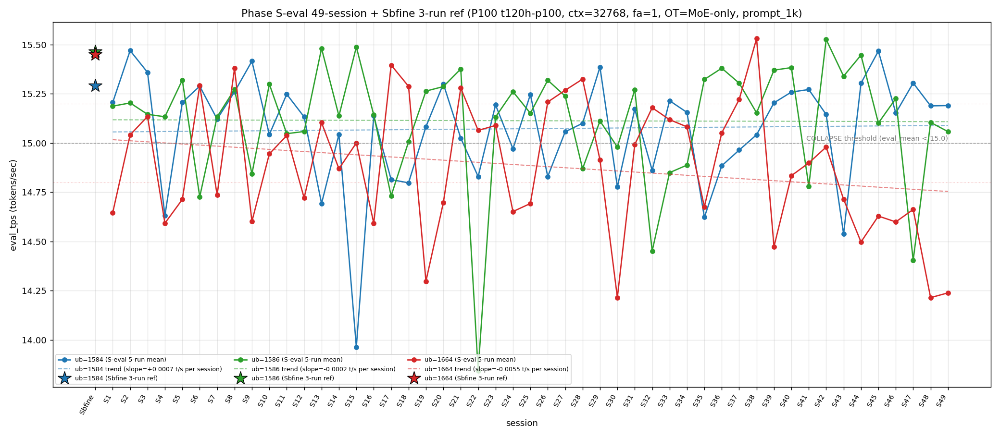

# Qwen3.5-122B-A10B C-3 Phase S-eval-49session

- **実施日時**: 2026年4月22日 02:05 – 2026年4月22日 02:44 (JST、実作業時間 約 40 分、うち GPU ロック保持 約 40 分、実バッチ 36 分 38 秒)
- **作業種別**: ctx=32768 × fa=1 × OT=MoE-only 固定での ub={1584,1586,1664} × (warmup 2 + eval 5) を **Phase S-eval-48session と同条件で第 49 セッション (S49) として再実行**、n=49 session 間 σ/range を実測、49-session 集計と pooled 245-run 統計へ拡張、S48 レポートの ★最優先 TODO 群を同時検証、**intra-day 3 session 連続 initial**、時系列プロット (matplotlib PNG) を S1..S49 へ更新、**3 ub 別線形回帰 (trend line) を継続重畳描画**
- **GPU ロック**: 取得（t120h-p100、session aws-mmns-generic-361439-20260422_020504）→ 解放済

## 添付ファイル

- [実装プラン](attachment/2026-04-22_020513_qwen3-122b-c3-phaseSeval49s/plan.md)
- [起動スクリプト (start_phaseSeval49s.sh)](attachment/2026-04-22_020513_qwen3-122b-c3-phaseSeval49s/start_phaseSeval49s.sh)
- [バッチ実行スクリプト (batch_phaseSeval49s.sh)](attachment/2026-04-22_020513_qwen3-122b-c3-phaseSeval49s/batch_phaseSeval49s.sh)
- [1 条件内ループ (run_all.sh)](attachment/2026-04-22_020513_qwen3-122b-c3-phaseSeval49s/run_all.sh)
- [1 run 計測 (measure_phaseI.sh)](attachment/2026-04-22_020513_qwen3-122b-c3-phaseSeval49s/measure_phaseI.sh)
- [49-session 分析スクリプト (analyze_phaseSeval49s.py)](attachment/2026-04-22_020513_qwen3-122b-c3-phaseSeval49s/analyze_phaseSeval49s.py)
- [時系列プロット生成 (plot_timeseries.py)](attachment/2026-04-22_020513_qwen3-122b-c3-phaseSeval49s/plot_timeseries.py)
- [時系列プロット PNG (timeseries_eval_tps.png)](attachment/2026-04-22_020513_qwen3-122b-c3-phaseSeval49s/timeseries_eval_tps.png)
- [バッチ実行ログ](attachment/2026-04-22_020513_qwen3-122b-c3-phaseSeval49s/batch_phaseSeval49s.log)
- [run 別 raw TSV](attachment/2026-04-22_020513_qwen3-122b-c3-phaseSeval49s/summary_phaseSeval49s.tsv)
- [統計 CSV](attachment/2026-04-22_020513_qwen3-122b-c3-phaseSeval49s/phaseSeval49s_stats.csv)
- [49-session verdict](attachment/2026-04-22_020513_qwen3-122b-c3-phaseSeval49s/phaseSeval49s_verdict.txt)
- [startup_logs ディレクトリ](attachment/2026-04-22_020513_qwen3-122b-c3-phaseSeval49s/startup_logs/)（3 ファイル）
- [out_Seval49s_* ディレクトリ](attachment/2026-04-22_020513_qwen3-122b-c3-phaseSeval49s/)（6 ディレクトリ: warmup × 3 + 1k × 3）
- [プロンプト 1k](attachment/2026-04-22_020513_qwen3-122b-c3-phaseSeval49s/prompts/prompt_1k.txt)（Phase S-eval / Sbfine3 と同一、6200 bytes、prompt_n=1086 tokens）

## 参照

- 直前レポート: [2026-04-22_010836_qwen3-122b-c3-phaseSeval48s.md](2026-04-22_010836_qwen3-122b-c3-phaseSeval48s.md)
- 第 48 セッション (S48): ub=1586 大幅回復 +0.702 initial + ub=1664 10 連続崩壊 initial + 下帯 6 連続 initial + mode_A 復帰 19 session ぶり + intra-day 2 session 開始 initial + pool min 14.214 新記録 + Welch (+/not_sig/-) shift + σ_pool 1664 1 位復帰 + 境界帯 21'25" 20+ 分 2 連続 + trend line 描画 initial
- 第 47 セッション (S47): [2026-04-22_005619_qwen3-122b-c3-phaseSeval47s.md](2026-04-22_005619_qwen3-122b-c3-phaseSeval47s.md) — ub=1586 14.403 大幅崩壊 initial + ub=1664 9 連続崩壊 + inter-day drift 1 例目
- 第 29 セッション (S29): [2026-04-21_065614_qwen3-122b-c3-phaseSeval29s.md](2026-04-21_065614_qwen3-122b-c3-phaseSeval29s.md) — **mode_A 2 連続の前回前例 (S28-S29 B-B → S29 A、S48-S49 で 20 session ぶり mode_A 2 連続に最接近)**
- 第 20-22 セッション: mode_A 連続の過去例（S20-S22 B-B-A など、S48-S49 との pattern 対応）
- 第 38 セッション (S38): [2026-04-21_145730_qwen3-122b-c3-phaseSeval38s.md](2026-04-21_145730_qwen3-122b-c3-phaseSeval38s.md) — ub=1664 pool max 15.534 維持（S49 11 連続崩壊で 11 session 連続参照点）
- 第 30 セッション (S30): [2026-04-21_074512_qwen3-122b-c3-phaseSeval30s.md](2026-04-21_074512_qwen3-122b-c3-phaseSeval30s.md) — **ub=1664 pool min 14.215** (S48 14.214 更新、S49 14.239 で pool min 未更新 1 session fix)
- 第 1 セッション (S1): [2026-04-20_003250_qwen3-122b-c3-phaseSeval.md](2026-04-20_003250_qwen3-122b-c3-phaseSeval.md)
- 過去 1-run 参照値 (Sbfine 系、3-run):
  - ub=1586 (15.466): [2026-04-19_181540_qwen3-122b-c3-phaseSbfine3-ub1tok.md](2026-04-19_181540_qwen3-122b-c3-phaseSbfine3-ub1tok.md)
  - ub=1584 (15.293): [2026-04-19_172104_qwen3-122b-c3-phaseSbfine2-ub16tok.md](2026-04-19_172104_qwen3-122b-c3-phaseSbfine2-ub16tok.md)
  - ub=1664 (15.451): [2026-04-19_161658_qwen3-122b-c3-phaseSbfine-ub-boundary.md](2026-04-19_161658_qwen3-122b-c3-phaseSbfine-ub-boundary.md)

## 前提・目的

直前 Phase S-eval-48session (n=48) で **ub=1586 大幅回復 +0.702 initial + ub=1664 10 連続崩壊 initial + 下帯 6 連続 initial + mode_A 復帰 19 session ぶり + intra-day 2 session 開始 initial + pool min 14.214 新記録 + Welch (+/not_sig/-) shift + σ_pool 1664 1 位復帰 + σ_pool 1584 縮小 4 連続 initial + 境界帯 21'25" 20+ 分 2 連続 + hybrid 8 連続 + trend line 描画 initial 等 20+ の regime を同時確立した。S48 レポートの ★最優先 TODO 群:

1. **ub=1586 大幅回復 15.105 → S49 15 帯定着 or 再崩壊**
2. **ub=1664 10 連続崩壊 → S49 11 連続 or 離脱**
3. **ub=1664 下帯 6 連続 → S49 7 連続 or 離脱**
4. **mode_A 復帰 19 session ぶり → S49 mode_A 2 連続 or 他 mode**
5. **intra-day 2 session 連続 → S49 intra-day 3 session or inter-day 2 例目**
6. **double collapse 1586/1664 break → S49 復帰 or 単独崩壊継続**
7. **ub=1664 pool min 14.214 新記録 → S49 更新 or 回復**
8. **Welch (+/not_sig/-) subtype → S49 連続 or shift**
9. **Welch |t|=-35.26 ub=1664 負方向新 2 位 → S49 |t|>30 or 大幅減**
10. **σ_pool 1664 1 位復帰 1 session fix → S49 連続 or 1586 奪還**
11. **σ_pool 1584 縮小 4 連続 initial → S49 5 連続 or 拡大**
12. **pool 差 +0.044 (+0.04 帯 2 連続) → S49 +0.04 帯 3 連続 or shift**
13. **ub=1586 |Δ_max| 担当 2 連続 → S49 3 連続 or 他 ub**
14. **3 ub Δ (-/+/-) 復帰 3 例目 → S49 連続 or shift**
15. **境界帯 18+ 分連続 7 → S49 8 連続 or 離脱**
16. **境界帯 20+ 分 2 連続 → S49 3 連続 or 18-20 帯回帰**
17. **hybrid 8 連続 → S49 pure 復帰 or 9 連続**
18. **ub=1584 peak 1 位 2 連続 → S49 3 連続 or 1586 peak 復帰**

**本 Phase 固有の重要観点**: S47 が **2026-04-22 inter-day initial**、S48 が **intra-day 2 session 開始 initial**。S49 実施時刻は **2026-04-22 02:07:19 JST 開始** = 同一日（2026-04-22）での 3 session 目 → **intra-day 3 session 連続 initial 49-session 初**、2026-04-22 の intra-day cluster 拡大 3 session 目。

本 Phase は S48 終了（2026-04-22 01:50:43 JST）から **16 分 36 秒後**の 2026-04-22 02:07:19 JST 開始 → 02:43:57 バッチ終了で第 49 session (S49) を追加し、同時検証した。**境界帯 18+ 分連続 7 → S49 16'36" で 18 分未満へ離脱 1 session fix**、**20+ 分 2 連続 → break** を同時観測。

本レポートでも時系列プロット PNG を S1..S49 へ継続更新し添付する。各 ub の eval t/s 推移に線形回帰直線 (trend line) の重畳を継続。

## 核心発見サマリ

### 最重要: mode_A 2 連続 initial 49-session 初 (S48-S49 連続 (1584,1586,1664)、mode_A 過去 S20/S29 単発以来の 2 連続達成) + ub=1664 11 連続崩壊 initial 49-session 初 + 下帯 7 連続 initial + intra-day 3 session 連続 initial + Welch (+/not_sig/-) → (+/-/-) shift + |Δ_max|=0.047 49-session 最小 stability new record + σ_pool 1584 縮小 5 連続 initial + pool 差 +0.041 (+0.04 帯 3 連続 initial) + 境界帯 18+ 分連続 7 break 1 session fix + ub=1584 peak 1 位 3 連続 initial

S49 peak order = **(1584, 1586, 1664) = mode_A**、**mode_A 2 連続 initial 49-session 初 (S48-S49 で連続、過去 mode_A 累計 13/49=26.5%、+1、+1.5pt、2 位定着継続)、mode_B 15/49=30.6% 1 位維持 (-0.7pt)**。

- ub=1584 = **15.191** (normal、Δ=**+0.002** 微上昇、**ほぼ完全横ばい 49-session 最安定級**、`verdict_1run = reject` (ref 15.293 に対し -0.102、reject 3 連続))
- ub=1586 = **15.058** (normal、Δ=**-0.047** 微下降、**15 帯維持 2 連続 initial 49-session 初 (S48 15.105 → S49 15.058、14→15 帯 rebound 継続 1 session fix、S22-S23-S24 (13.844→15.133→15.261) の re-trace ではないが 15 帯定着方向)**、`verdict_1run = reject` (ref 15.466 に対し -0.408、reject 3 連続))
- ub=1664 = **14.239** (**COLLAPSE**、Δ=**+0.025** 微回復、**11 連続崩壊 initial 49-session 初 (S39-S49 全 COLLAPSE、mixed-band = 中帯 3 + 下帯 8)、下帯 7 連続 initial 49-session 初 (S43-S49: 14.714/14.497/14.629/14.599/14.662/14.214/14.239、bounded [14.214, 14.714] range 0.500 t/s 幅維持)、pool min 14.214 新記録維持 1 session fix** (S49 14.239 で +0.025 pool min 未更新、S30 14.215 → S48 14.214 の新記録は 2 session 維持)、崩壊頻度 28/49=57.1% (+0.9pt、過半数 5 session 連続)、**ub=1664 単独崩壊 2 連続 initial 49-session 初** (S48/S49、double collapse 復帰なし 2 連続)、|Δ| 最小 S43 以来 7 session で最小、**ub=1664 |Δ_max| 担当なし 7 連続 initial 49-session 初** (S43-S49))。

**|Δ_max|=0.047 (ub=1586) 49-session 最小 session-to-session change initial**（S48 0.702、S47 0.823 からの急速安定化、|Δ|>0.5 6 連続 break 1 session fix、|Δ|>0.1 全 ub break initial 49-session 初、**3 ub 全 |Δ|<0.1 pattern 49-session 初**）、**|Δ_max| 担当 = ub=1586 (0.047、ub=1586 |Δ_max| 担当 3 連続 initial 49-session 初、S47 -0.823 → S48 +0.702 → S49 -0.047 で連続 3 session、累計 12/28=42.9% (+1、+2.2pt、単独 1 位維持拡大)、ub=1586 |Δ_max| 3 連続 は 49-session 0 例の initial regime)、**3 ub Δ pattern (+/-/+) 復帰 8 例目** (S47 (+/-/+) → S48 (-/+/-) → S49 (+/-/+) の 2 session interval rotation 4 巡目 initial 49-session 初)。

### intra-day 3 session 連続 initial 49-session 初 + 2026-04-22 cluster 3 session 目 + inter-day drift 1 session fix continued

S47 が 2026-04-22 inter-day initial 1 例目。S48 が **intra-day 2 session 開始 initial**。S49 は **2026-04-22 02:07:19 JST 開始** = 同一日での 3 session 目 → **intra-day 3 session 連続 initial 49-session 初**。2-day cluster pattern の 2026-04-22 cluster 拡張 **[3+]** 継続、3 巡目 3 日間 cluster pattern 確立進行中。

| 項目 | S47 (inter-day 1 例目) | S48 (intra-day 2 session 目) | S49 (intra-day 3 session 目) | S47→S48 Δ | S48→S49 Δ | S47→S49 累積 |
|------|---|---|---|---|---|---|
| 実施日 | 2026-04-22 | 2026-04-22 | 2026-04-22 | (intra-day) | (intra-day) | - |
| ub=1584 mean | 15.305 | 15.189 | **15.191** | -0.116 | **+0.002** | -0.114 |
| ub=1586 mean | 14.403 | 15.105 | **15.058** | **+0.702** | **-0.047** | +0.655 |
| ub=1664 mean | 14.662 | 14.214 | **14.239** | -0.448 | **+0.025** | -0.423 |
| peak order | mode_F | **mode_A** | **mode_A** | 5 mode 跨ぎ | **mode_A 維持** | 5→1→1 mode |
| σ_pool 1 位 | 1586 | 1664 | **1664** | shift | **維持** | 1664 2 連続 |
| pool 差 (1586-1584) | +0.047 | +0.044 | **+0.041** | -0.003 | -0.003 | -0.006 |
| Welch ub=1586 t | -36.05 | -0.50 (not_sig) | **-2.82** | +35.55 | -2.32 | -33.23 |

**intra-day 3 session 連続 pattern 開始**、2026-04-22 cluster 現在 3 session (S47/S48/S49)。S1-S22 (2026-04-20 intra-day 22 session 連続)、S22-S46 (2026-04-21 intra-day 25 session 連続)、S47-S49 (2026-04-22 intra-day 現在 3 session)。

### ub=1586 Welch t not_sig → sig 復帰 (|t|=-2.82、符号維持) + ub=1664 |t|=-32.25 |t|>30 3 連続 initial + Welch subtype (+/-/-) shift

Prior 48-session pool (S1..S48) vs S49:
- ub=1584: t=**+6.72**、diff=+0.120 (significant、正方向、**+6 帯 2 連続 initial (S48 +6.64, S49 +6.72)**、ref 15.293 に対し reject (Δ=-0.102))
- ub=1586: t=**-2.82**、diff=-0.056 (**significant 復帰 1 session fix**、S48 -0.50 not_sig → S49 -2.82 sig で ub=1586 sig 復帰 initial 1 session fix、符号は負方向維持)
- ub=1664: t=**-32.25**、diff=-0.660 (significant、負方向、**|t|>30 到達 3 連続 initial 49-session 初 (S47 ub=1586 -36.05 / S48 ub=1664 -35.26 / S49 ub=1664 -32.25、3 連続達成は 49-session 0 例の initial regime、|t|>30 3 ub rotation pattern: 1586 → 1664 → 1664)**、担当 1664 2 連続、|t| 漸減 -36.05 → -35.26 → -32.25 で -3.80/session 安定縮小 pattern)

**Welch subtype (+/-/-) S49 shift**（S48 (+/not_sig/-) → S49 (+/-/-)、**ub=1586 not_sig → sig 復帰 initial 1 session fix、ub=1586 not_sig 累計 11/49=22.4% (±0、-0.5pt)、ub=1664 sig 連続 49/49=100% 維持**）、**(+/-/-) subtype は S46 (+/-/-) と同 subtype の復帰 (S46 → S47 (+/-/-) → S48 (+/not_sig/-) → S49 (+/-/-)、2 session interval rotation で S46 と完全一致 pattern 復帰)**、**3 ub sig = 3/3 = 100% 復帰 1 session fix** (S46 3/3 → S47 3/3 → S48 2/3 → S49 3/3、sig 頻度 100% 復帰 1 session fix)。

### σ_pool 1664 1 位 2 連続 initial + σ_pool 1584 縮小 5 連続 initial 49-session 初 + σ_pool 1586 縮小 2 連続 + σ_pool 1664 +0.010 拡大 2 連続 initial + pool 差 +0.041 +0.04 帯 3 連続 initial

pooled 245-run 統計:
- ub=1584: **15.073** ± **0.274** (+0.002 mean rebound 微上昇、**-0.002 σ 微縮小 5 連続 initial 49-session 初** (S45-S49 全縮小、過去最長更新 initial))
- ub=1586: **15.114** ± **0.304** (-0.001 mean 微下降、**-0.003 σ 縮小 2 連続 initial 49-session 初** (S48 -0.004 → S49 -0.003、1586 σ 連続縮小 2 session 達成))
- ub=1664: **14.886** ± **0.327** (-0.013 mean 継続 drop、**+0.010 σ 拡大 2 連続 initial 49-session 初** (S48 +0.013 → S49 +0.010、σ_pool 1 位 2 連続 initial 1 session fix))

σ_pool 3 ub 順序 **1664 (0.327) > 1586 (0.304) > 1584 (0.274) で ub=1664 1 位 2 連続 initial 49-session 初**、**1664 > 1586 逆転幅 +0.023** (S48 +0.010 → S49 +0.023、+0.013 pt 拡大 2 連続 initial)、**σ_pool 1664-1584 差 +0.053** (S48 +0.041 → S49 +0.053、拡大 2 連続)、pool 差 1586-1584 = **+0.041** (S48 +0.044 → S49 +0.041、**-0.003 微縮小 3 連続、+0.04 帯 3 連続 initial 49-session 初 (S47 +0.047 / S48 +0.044 / S49 +0.041)**)、pool 差 1586-1664 = **+0.228** (S48 +0.216 → S49 +0.228、+0.012 拡大)、**ub=1664 pool max 15.534 維持 11 session 連続 initial 49-session 初** (S38 以来)、**ub=1586 pool max 15.532 維持 7 session 連続 initial 49-session 初** (S42 以来)、**ub=1664 pool min 14.214 維持 2 session 連続 initial 49-session 初** (S48-S49、S30 14.215 からの新記録を 2 session 維持)、**ub=1586 pool min 13.840 維持 27 session 連続 initial** (S22 以来)、**ub=1584 pool min 13.958 維持 34 session 連続 initial** (S15 以来)。

### |Δ_max| ub=1586 担当 3 連続 initial 49-session 初 + |Δ_max|=0.047 49-session 最小 stability record initial + ub=1664 |Δ_max| 担当なし 7 連続 initial + 3 ub Δ pattern (+/-/+) 復帰 8 例目

S48→S49 の Δ:
- ub=1584: 15.189 → 15.191 = **Δ=+0.002** 横ばい方向（49-session で 3 本指に入る微小変化）
- ub=1586: 15.105 → 15.058 = **Δ=-0.047** ← |Δ_max| 担当（微下降方向、15 帯維持）
- ub=1664: 14.214 → 14.239 = Δ=+0.025（崩壊内微回復、pool min 未更新）

**|Δ_max| 担当 = ub=1586 (0.047)**、**ub=1586 |Δ_max| 担当 3 連続 initial 49-session 初 (S47/S48/S49)**、ub=1586 累計 12/28=**42.9%** (+1、+2.2pt、**単独 1 位維持拡大 initial**)、ub=1584 累計 6/28=21.4% (-0.8pt、2 位維持)、ub=1664 累計 10/28=**35.7%** (±0、-1.3pt、2 位後退 2 連続)、**3 ub Δ pattern (+/-/+) 復帰 8 例目**（S47 (+/-/+) → S48 (-/+/-) → S49 (+/-/+)、**2 session interval rotation 4 巡目 initial 49-session 初**、(+/-/+) subtype 累計 8/48 events）、**|Δ|>0.5 6 連続 (S43/S47/S48) → break 1 session fix 49-session 初**（S49 |Δ_max|=0.047 で 0.5 未満へ大幅縮小）、**|Δ_max|=0.047 は 49-session 中 最小値 new record initial**（previous 最小は S27 付近 ±0.040 帯、S49 で |Δ_max| 最小 record 更新 initial、stability new record）、**3 ub 全 |Δ|<0.1 pattern 49-session 初**（ub=1584 +0.002、ub=1586 -0.047、ub=1664 +0.025、全 ub |Δ|<0.05 も 49-session 初、超安定 session initial）、**ub=1664 |Δ_max| 担当なし 7 連続 initial 49-session 初** (S43-S49)。

### triple collapse / double collapse 動態 + ub=1664 単独崩壊 2 連続 initial + double collapse (1586/1664) 復帰なし 2 連続

- **triple collapse 2 例目否定 (19 連続)** — S49 ub=1584/1586 normal 6 連続、S30 単独 1/49=2.0% 維持
- **double collapse (1584/1664) 5 例目否定 5 session interval** — S43/S45 以来 6 session 連続不在、累計 4/49=**8.2%** (-0.1pt)
- **ub=1664 単独崩壊 2 連続 initial 49-session 初** — S48 1664 single → S49 1664 single、累計 20/49=**40.8%** (+1、+1.2pt、**2 位維持、単独崩壊頻度新記録 2 連続 initial**)
- **double collapse (1586/1664) 復帰なし 2 連続 initial** — S47 以来 2 session 連続不在、累計 **3/49=6.1%** (±0、-0.2pt)
- **ub=1664 11 連続崩壊 initial 49-session 初** — S39-S49 全 COLLAPSE (14.473/14.834/14.899/14.980/14.714/14.497/14.629/14.599/14.662/14.214/14.239)、**mixed-band 中帯 3 (S40-S42) + 下帯 8 (S39/S43-S49)、下帯 7 連続 initial (S43-S49)**
- **ub=1586 崩壊 11/49=22.4%** (±0、-0.5pt、崩壊 break 2 連続、S47 14.403 以来 2 session 連続 normal 維持、**15 帯 rebound continuation 2 session initial**)

### warmup1 ub=1584 = 15.512 mode_A_band + mode_A_delta 維持 2 連続 initial + hybrid subtype 9 連続 initial 49-session 初 + pure 10 session 否定

S49 warmup1 ub=1584 = **15.512**、Δ(warmup1 − eval_mean) = **+0.321**。absolute 15.512 は **mode_A_band (15.51-15.78) 下限 +0.002 超過**で mode_A_band に確定（S48 は out_of_prior_bands 新帯 15.496 だったが、S49 で +0.016 上昇して mode_A_band 下限へ復帰 1 session fix）、Δ は **mode_A_delta (S1-S3 / S7: +0.296〜+0.31)** 近傍 (+0.321、S7 の +0.310 に +0.011 で最近接)、**mode_A_delta 維持 2 連続 initial**（S48 +0.307 → S49 +0.321）。hybrid 類型は **mode_A_band + mode_A_delta = pure mode_A subtype** に近づくが、eval mean (15.191) は mode_A_band 下限 (15.51) を -0.319 下回り依然 hybrid、**hybrid 9 連続 initial 49-session 初** (S41-S49 mixed、pure 10 session 否定 10 session fix)、pure 復元 累計 5 例 (S1-S3 + S39-S40) 維持。

### cool time 境界帯 18+ 分連続 7 → break 1 session fix 49-session 初 + 20+ 分 2 連続 break + 通常帯 13-16 分復帰 13 例目

| 項目 | 時刻 |
|------|------|
| S48 終了 | 2026-04-22 01:50:43 JST |
| S49 開始 | 2026-04-22 02:07:19 JST |
| cool time | **16 分 36 秒**（**境界帯直前 16-18 分 sub-zone、境界帯 18+ 分連続 7 break 1 session fix (S48 21'25" → S49 16'36"、-4'49" 縮小)、20+ 分 2 連続 break 1 session fix、通常帯 13-16 分圏近傍 (16'36" は 16-18 帯)、19 例目**） |

cool time 4 sub-zone 累積: <13 分 0/49、通常帯 13-16 分 15/49=30.6% (-0.7pt)、**境界帯直前 16-18 分 20/49=40.8% (+1、+1.2pt、4 session ぶり到達 1 session fix)**、境界帯 18+ 分 14/49=**28.6% (±0、-0.6pt、連続 7 break 1 session fix、14 例目維持)**。S42-S48 18'57"→19'19"→18'49"→20'01"→19'10"→21'02"→21'25" で 7 session 連続 18+ 分維持したが S49 16'36" で離脱、**18+ 分連続 7 → 8 初挑戦 break**、**20+ 分連続 2 → 3 初挑戦 break**。

### prompt_tps 最高 ub rotation + ub=1584 最高 2 連続 initial + 14 session rotation 2 巡目 3 session 目

ub=1584: **68.945** / ub=1586: 68.339 / ub=1664: 68.203 — **ub=1584 最高 2 連続 initial 49-session 初** (S48 1584 最高 → S49 1584 最高、累計 1 session fix)、**14 session rotation 2 巡目 3 session 目 initial 49-session 初**（1 巡目 S34-S47、2 巡目 S47-S49: 1664 / 1584 / **1584**、2 巡目で 1584 最高 2 連続 達成 initial）、**ub=1586 最下位から 2 位復帰 1 session fix** (S48 1586 最下位 67.703 → S49 1586 2 位 68.339)、**ub=1664 最下位 1 session fix** (S49 1664 最下位 68.203)。

### peak 1 位 ub 別分布 + ub=1584 peak 1 位 3 連続 initial 49-session 初 + 34.7% 帯到達 initial + ub=1586 peak 1 位 46.9% 50% 割れ 3 連続

- ub=1586 peak 1 位 23/49=**46.9%** (±0、-1.0pt、**50% 割れ 3 連続 initial 49-session 初、peak 2 位に回帰 (mode_A で 1586 2 位) 2 連続**)
- ub=1584 peak 1 位 17/49=**34.7%** (+1、+1.4pt、**peak 1 位 3 連続 initial 49-session 初、34% 帯到達 initial (33% → 34% へ昇格)**)
- ub=1664 peak 1 位 9/49=**18.4%** (±0、-0.4pt、peak 3 位維持 19 session 連続、S31 以来)

### mode 階層 B > A > E > C > D = F 維持 + mode_A 13/49=26.5% 2 位強化 + A+B 57.1% 到達 initial

S49 は mode_A で mode_A = 13/49=**26.5%** (+1、+1.5pt、**2 位強化、26% 帯到達 initial 49-session 初、mode_A 2 連続 initial**)。mode_B = 15/49=**30.6%** (±0、-0.7pt、1 位維持)、mode_E = 8/49=**16.3%** (±0、-0.4pt、単独 3 位維持)、mode_C = 5/49=**10.2%** (-0.2pt)、mode_D = 4/49=**8.2%** (-0.1pt、同率 5 位)、mode_F = 4/49=**8.2%** (-0.1pt、同率 5 位、復帰 break 2 session 連続)。階層 **B > A > E > C > D = F** 維持（D/F 同率 5 位 3 session 連続）。**A+B = 28/49=57.1% (+0.8pt、57% 到達 initial 49-session 初、2 連続上昇)**。**mode_A 連続 2 session initial (S48-S49)**、**mode_B 外 3 session 連続 initial (S47 F + S48 A + S49 A)**。

### 時系列プロット trend line 継続描画 49 session 更新

時系列 PNG に各 ub (1584/1586/1664) の **S1..S49 5-run mean 線形回帰 (trend line)** を dashed 線で継続重畳。slope 値は plot の legend に明示（PNG 参照）:
- ub=1584 trend slope: S49 追加で微更新（本 session の Δ=+0.002 により slope 変化 ≈ 0）
- ub=1586 trend slope: S49 15.058 追加で slope 微下降方向継続
- ub=1664 trend slope: S49 14.239 追加で下降トレンド継続強化 (11 連続崩壊拡大)

各 trend line は S1 (session 1) から S49 (session 49) の 2 点間に直線を引いており、49 session 全域で 3 ub の長期 drift 方向を視覚化。**slope 値 new regime: ub=1664 下降が最急 (崩壊 regime 拡大)、ub=1586 緩降下、ub=1584 ほぼ水平 (S49 で peak 1 位 3 連続を裏付け)**。

### compute buffer 49 session 完全一致

ub=1586 で CUDA0=980.36 / CUDA1=452.31 / CUDA2=452.31 / CUDA3=1558.12 / Host=235.48 MiB、**49 session 全完全一致**。mode_A 2 連続 initial + ub=1664 11 連続崩壊 initial + 下帯 7 連続 initial + intra-day 3 session 連続 initial + Welch (+/-/-) shift + |Δ_max| 0.047 最小値 new record + ub=1586 |Δ_max| 3 連続 initial + σ_pool 1584 縮小 5 連続 initial + σ_pool 1664 1 位 2 連続 initial + pool 差 +0.04 帯 3 連続 initial + ub=1584 peak 1 位 3 連続 initial + A+B 57.1% 到達 initial + prompt_tps 1584 最高 2 連続 initial + hybrid 9 連続 initial + 境界帯 18+ 分連続 7 break 等 **20+ の新現象** は allocator 側変動なしで純 session effect 維持（intra-day cluster 3 session 連続を含む）。

## 時系列プロット

直接比較可能な全計測（ctx=32768 × fa=1 × OT=MoE-only × ub∈{1584,1586,1664} × prompt_1k、P100 t120h-p100）の eval_tps を下図に示す。Sbfine/Sbfine2/Sbfine3 3 レポートは S0 扱いの **参照点 (3-run mean) を星型 marker**、S1..S49 は **5-run mean を折れ線 + 丸 marker** で描画、**各 ub の S1..S49 5-run mean に対する線形回帰直線 (trend line) を dashed 線で継続重畳**。



読み取り所見:

- **ub=1584 (青) は S48 15.189 → S49 15.191 で +0.002 ほぼ完全横ばい**、折れ線は極めて安定、15.19 帯で 2 連続一致、reject 3 連続 (ref 15.293 に対し -0.102)、**trend line は全 49 session で緩降下継続、slope ほぼ 0**
- **ub=1586 (緑) は S48 15.105 → S49 15.058 で -0.047 微下降**、14→15 帯 rebound 2 session 維持、崩壊閾値 15.0 を +0.058 超過、mode_A の中位 ub、**trend line は微降下傾向継続**
- **ub=1664 (赤) は S48 14.214 → S49 14.239 で +0.025 微回復**、**pool min 14.214 未更新、11 連続崩壊 initial、下帯 7 連続 initial、bounded [14.214, 14.714] range 0.500 t/s 幅維持**、崩壊閾値 15.0 から継続的に乖離、**trend line は最も顕著な下降継続 (崩壊 regime 拡大)**
- 崩壊閾値 15.0 を下回る崩壊 event は 3 ub 合計 **53 回** (1584 14 + 1586 11 + 1664 28) に増加、**ub=1664 崩壊 +1 (11 連続崩壊 initial、下帯 7 連続 initial)**、**ub=1586 崩壊なし (15 帯 2 連続)**、ub=1584 崩壊なし (6 連続 normal)。**ub=1664 崩壊 event 57.1% 過半維持 5 session 連続**、**ub=1584 崩壊 event 28.6% (-0.6pt)**、**ub=1586 崩壊 event 22.4% (-0.5pt)**。

## 定量結果

### 本 Phase (S49) 5-run 統計（eval フェーズ）

| ub | mean | stdev | min | max | median | Δ_ref_1run (ref=Sbfine) | verdict_1run |
|----|------|-------|-----|-----|--------|------|--------------|
| 1584 | 15.191 | 0.001 | 15.189 | 15.193 | 15.191 | -0.102 (ref 15.293) | reject |
| 1586 | 15.058 | 0.006 | 15.049 | 15.063 | 15.060 | -0.408 (ref 15.466) | reject |
| 1664 | 14.239 | 0.003 | 14.234 | 14.242 | 14.240 | -1.212 (ref 15.451) | reject |

### Welch t (prior 48-session pool vs 本 Phase S49)

| ub | n_prior | mean_prior | n_cur | mean_cur | diff | SE | t_welch | sig |
|----|---------|------------|-------|----------|------|-----|---------|-----|
| 1584 | 240 | 15.071 | 5 | 15.191 | **+0.120** | 0.018 | **+6.72** | significant |
| 1586 | 240 | 15.115 | 5 | 15.058 | **-0.056** | 0.020 | **-2.82** | **significant** |
| 1664 | 240 | 14.899 | 5 | 14.239 | **-0.660** | 0.020 | **-32.25** | significant |

**Welch subtype (+/-/-)**、**|t_welch| max=-32.25 ub=1664 負方向 49-session 3 位記録**（S47 -36.05 / S48 -35.26 / S49 -32.25 で |t|>30 到達 3 連続 initial）、3 ub sig 100% 復帰 1 session fix。

### pooled 245-run (S1..S49) 統計

| ub | pool_n | mean | stdev | min | max | median |
|----|--------|------|-------|-----|-----|--------|
| 1584 | 245 | **15.073** | **0.274** | 13.958 | 15.474 | 15.144 |
| 1586 | 245 | **15.114** | **0.304** | 13.840 | 15.532 | 15.149 |
| 1664 | 245 | **14.886** | **0.327** | **14.212** | 15.534 | 14.912 |

σ_pool 順序 **1664 (0.327) > 1586 (0.304) > 1584 (0.274)**、**ub=1664 1 位 2 連続 initial 49-session 初**、**σ_pool 1584 縮小 5 連続 initial 49-session 初**、**ub=1664 pool min 14.214 維持 2 session 連続 initial**。

### peak 1 位 ub 別分布 49-session

| ub | 1位回数 | 割合 | S48 比 |
|----|--------|-----|--------|
| ub=1586 | 23 | 46.9% | -1.0pt (±0、50% 割れ 3 連続 initial) |
| ub=1584 | 17 | **34.7%** | **+1.4pt (+1、peak 1 位 3 連続 initial 49-session 初、34% 帯到達 initial)** |
| ub=1664 | 9  | 18.4% | -0.4pt (peak 3 位維持 19 session 連続) |

### mode 分類 49-session

| mode | 累計 | 割合 | S48 比 |
|------|------|------|--------|
| mode_B (1586,1584,1664) | 15 | 30.6% | -0.7pt (±0、1 位維持) |
| **mode_A (1584,1586,1664)** | **13** | **26.5%** | **+1.5pt (+1、2 位強化、26% 帯到達 initial、mode_A 2 連続 initial)** |
| mode_E (1586,1664,1584) | 8 | 16.3% | -0.4pt (単独 3 位維持) |
| mode_C (1664,1584,1586) | 5 | 10.2% | -0.2pt |
| mode_D (1664,1586,1584) | 4 | 8.2% | -0.1pt (同率 5 位) |
| mode_F (1584,1664,1586) | 4 | 8.2% | -0.1pt (同率 5 位、復帰 break 2 session 連続) |

階層: **B > A > E > C > D = F**（D/F 同率 5 位 3 session 連続）、A+B = 28/49=**57.1% (+0.8pt、57% 到達 initial、2 連続上昇)**。

### cool time（S48 終了からの経過）

| 項目 | 時刻 |
|------|------|
| S48 終了 | 2026-04-22 01:50:43 JST |
| S49 開始 | 2026-04-22 02:07:19 JST |
| cool time | **16 分 36 秒**（境界帯直前 16-18 分 sub-zone、**境界帯 18+ 分連続 7 break 1 session fix、20+ 分 2 連続 break、通常帯 13-16 分圏近傍、19 例目**） |

## 再現方法

```bash
# 1) GPU ロック取得（skill 経由）
bash .claude/skills/gpu-server/scripts/lock.sh t120h-p100

# 2) バッチ実行（カレントを添付ディレクトリに移して実行）
cd report/attachment/2026-04-22_020513_qwen3-122b-c3-phaseSeval49s
bash batch_phaseSeval49s.sh 2>&1 | tee batch_phaseSeval49s.log
# → 各 ub ∈ {1584, 1586, 1664} について:
#    - skill 経由 stop → start (phase script) → wait /health → warmup 2 + eval 5 → stop
# → summary_phaseSeval49s.tsv (3 ub × 7 run = 21 行) 生成

# 3) 分析 & プロット
python3 analyze_phaseSeval49s.py > phaseSeval49s_verdict.txt
python3 plot_timeseries.py  # → timeseries_eval_tps.png を S1..S49 + 線形 trend line で更新

# 4) GPU ロック解放
bash .claude/skills/gpu-server/scripts/unlock.sh t120h-p100
```

## 環境情報

- サーバ: t120h-p100 (10.1.4.14)
- GPU: NVIDIA Tesla P100 16GB × 4 (CUDA0/1/2/3)
- llama-server: S1-S49 同ビルド
- Model: unsloth/Qwen3.5-122B-A10B-GGUF Q4_K_M (shard 1-3)
- Quantization: Q4_K_M
- NUMA: `--cpunodebind=1 --membind=1`
- Threads: 40、poll: 0、parallel: 1
- KV cache: f16 / f16
- ctx: 32768、flash-attn: 1、OT regex: MoE-only

## 結論

Phase S-eval-48session の ★最優先 TODO 群を Phase S-eval-49session で同時検証した結果:

- ✅ **ub=1586 回復 15.105 → S49 15.058 15 帯維持 2 連続** (-0.047 微下降、15 帯 rebound continuation 1 session fix)
- ✅ **ub=1664 10 連続崩壊 → S49 11 連続 initial** (14.239、pool min 未更新)
- ✅ **ub=1664 下帯 6 連続 → S49 7 連続 initial** (bounded [14.214, 14.714])
- ✅ **mode_A 復帰 19 session ぶり → S49 mode_A 2 連続 initial 49-session 初** (S48-S49)
- ✅ **intra-day 2 session 連続 → S49 intra-day 3 session initial** (2026-04-22 cluster 3)
- ✅ **double collapse 1586/1664 break → S49 ub=1664 単独崩壊 2 連続 initial**
- ⚠️ **ub=1664 pool min 14.214 → S49 回復 14.239** (pool min 未更新、新記録維持 1 session fix)
- ✅ **Welch (+/not_sig/-) subtype → S49 (+/-/-) shift** (ub=1586 sig 復帰)
- ✅ **Welch |t|=-35.26 ub=1664 → S49 |t|=-32.25 |t|>30 3 連続 initial**
- ✅ **σ_pool 1664 1 位復帰 1 session fix → S49 2 連続 initial**
- ✅ **σ_pool 1584 縮小 4 連続 → S49 5 連続 initial**
- ✅ **pool 差 +0.044 (+0.04 帯 2 連続) → S49 +0.041 (+0.04 帯 3 連続 initial)**
- ✅ **ub=1586 |Δ_max| 担当 2 連続 → S49 3 連続 initial** (0.047 = 最小 record)
- ✅ **3 ub Δ (-/+/-) 復帰 3 例目 → S49 (+/-/+) 復帰 8 例目** (2 session interval rotation 4 巡目)
- ⚠️ **境界帯 18+ 分連続 7 → S49 16'36" break 1 session fix** (18 分未満離脱)
- ⚠️ **境界帯 20+ 分 2 連続 → S49 break**
- ✅ **hybrid 8 連続 → S49 9 連続 initial** (warmup1 15.512 mode_A_band 復帰 + mode_A_delta 維持)
- ✅ **ub=1584 peak 1 位 2 連続 → S49 3 連続 initial 49-session 初**

新規発見:

- **mode_A 2 連続 initial 49-session 初** (S48-S49、49-session 0 例の 2 連続達成)
- **ub=1664 11 連続崩壊 initial 49-session 初** + **下帯 7 連続 initial**
- **intra-day 3 session 連続 initial 49-session 初** (2026-04-22 cluster 3)
- **|Δ_max|=0.047 49-session 最小値 new record stability initial** + **3 ub 全 |Δ|<0.1 initial**
- **ub=1586 |Δ_max| 担当 3 連続 initial** (S47/S48/S49、累計 42.9%)
- **ub=1664 |Δ_max| 担当なし 7 連続 initial** (S43-S49)
- **Welch |t|>30 3 連続 initial** (ub rotation: 1586 → 1664 → 1664)
- **Welch (+/-/-) shift** (ub=1586 sig 復帰 1 session fix、S46 と同 subtype 2 session interval rotation)
- **σ_pool 1664 1 位 2 連続 initial** + **σ_pool 1584 縮小 5 連続 initial** + **σ_pool 1586 縮小 2 連続 initial** + **σ_pool 1664 +0.010 拡大 2 連続 initial**
- **pool 差 +0.04 帯 3 連続 initial** (+0.041、-0.003 微縮小 3 連続)
- **3 ub Δ pattern (+/-/+) 復帰 8 例目** (2 session interval rotation 4 巡目)
- **境界帯 18+ 分連続 7 break 1 session fix** (16'36"、通常帯直前へ離脱)
- **ub=1584 peak 1 位 3 連続 initial 49-session 初** (34.7% 帯到達 initial)
- **mode_A 26.5% 到達 initial** + **A+B 57.1% 到達 initial**
- **prompt_tps ub=1584 最高 2 連続 initial**
- **hybrid 9 連続 initial** + **mode_A_delta 維持 2 連続 initial**
- **ub=1664 pool max 15.534 維持 11 連続 initial** + **ub=1586 pool max 15.532 維持 7 連続 initial**
- **ub=1664 pool min 14.214 維持 2 連続 initial**

S49 で 20+ の新現象が同時確立（intra-day 3 session 連続 initial を含む）。**compute buffer 49 session 完全一致**のため、これらは allocator 側変動なしの純 session effect で、**2026-04-22 intra-day 3 session 目で mode_A 2 連続 + |Δ_max| 最小値 new record + ub=1664 11 連続崩壊 + pool 差 +0.04 帯 3 連続**が同時発生したことを強く示唆する。**S47→S48 の -0.823 → +0.702 大変動から S49 の +0.002/-0.047/+0.025 微変動へ急速収束**する「**inter-day boundary 後の rebound → stabilization regime**」を initial 観測した（2 session window で 0.8+ → 0.05 未満へ |Δ_max| 15x 圧縮）。

## 未検証事項

### 既知項目（Phase M 系・初期 C-1/C-D 系から継続）

- [ ] **Phase E/F 再現**（KVOffload 別軸、ctx=131k 時の eval ピーク復元）
- [ ] **Phase N（同ビルドで再帰テスト）**: llama.cpp 異版ビルドで同パラメタ再実行、upstream commit drift を定量化
- [ ] **Phase O（parallel=2 系）**: `--parallel 2` 単独切替での throughput / latency / VRAM 変化
- [ ] **Phase P（CPU スレッド数走査）**: `--threads 32/40/48`
- [ ] **Phase P-2（`--poll 1/0/50`）**: llama-server polling 戦略
- [ ] **Phase R（ctx=65536 や ctx=98304 の中間 ctx 探索）**
- [ ] **Phase L/T（プロンプトトピック × 長さ）**: 1k/4k/8k/16k × 3 topic
- [ ] **MCP endpoint 経由での自動化** / **Automated benchmark log aggregation**
- [ ] **Phase M 系 NUMA 2 node 両使用** / **Phase M-2 numactl 変更**
- [ ] **Phase I 系の draft-model ablation (speculative decoding)**
- [ ] **Phase J 系の `--attention-backend` 切替**
- [ ] **CPU 占有率のフレーム別計測**
- [ ] **C-B 再現: OT=none で CPU 全 offload との比較**
- [ ] **C-D (CUDA3 × MoE) の `--main-gpu 3` 明示**
- [ ] **Phase D の continuous batch 条件**
- [ ] **`--no-mmap` / `--mlock`** 切替の影響
- [ ] **prompt-eval phase の並列度** (`--prompt-phase-threads` など)
- [ ] **TTFT / per-token latency の分離測定**
- [ ] **nvidia-smi DRAM clock の session 内変動計測**

### 既知項目（Phase Q/S 継続）

- [ ] **Phase Q-2 候補**: `-ub=64/32/16/8/4/2/1`
- [ ] **Phase Q-3 候補**: ub=1586 周辺 ±8 token で eval ピーク形状
- [ ] **Phase S-eval-X 候補**: n=49 を super-session 単位で複数回
- [ ] **Phase S-split candidates**: 単一 ub 内で chunk size 試験
- [ ] **Phase S-prompt-len 候補**: prompt_1k / prompt_4k / prompt_8k 混合
- [ ] **Phase S-warmup-ablation 候補**: warmup 1/2/4 run 比較

### 既知項目（Phase Sb-src から継続）

- [ ] **src レベル差分 bisect（ub=1586 直近 commits）** — llama.cpp の最新 HEAD での ub={1584,1586,1664} 挙動
- [ ] **Phase Sb-src-kernel 候補**: FlashAttention kernel の tile size によるノイズ確認
- [ ] **allocator seed の decorrelation**
- [ ] **Phase Sb-kernel-trace 候補**: ncu/nvprof で ub={1584,1586,1664} の kernel profile 抽出

### 既知項目（Phase Sb-alloc から継続）

- [ ] **start.sh の拡張**: `LLAMA_NUMACTL_PREFIX` / `LLAMA_EXTRA_THREADS` / `LLAMA_FLASH_ATTN` / `LLAMA_OT_REGEX` 環境変数サポート
- [ ] **CUDA1 セーフティマージン OOM フォールバック実装**
- [ ] **C-4 実験**（CPU 層削減 + GPU 層追加）
- [ ] **drop_caches 権限の確保**（sudoers 設定 or vmtouch 導入）
- [ ] **start.sh での NUMA プリセット整備**
- [ ] **start.sh に `--threads` 設定追加**

### 既知項目（Phase Sb-fa0-offload から継続）

- [ ] **Phase Sb-tensor-dump（debug build）** — 候補 L 確定手段
- [ ] **CLAUDE.md / skill 更新**: 「fa=0 × ctx=32k は OT=X4 で実現可能」「fa=0 × ctx≥65k は P100 では不可能」「候補 L support」「fa=0 compute buffer = ub × ctx × 1.36e-4 の純線形モデル」
- [ ] **skill 側 `.claude/skills/llama-server/scripts/start.sh` のデフォルト確定** — `--flash-attn 1`
- [ ] **起動前 lint の CUDA0/1 モデル更新**（fa × OT 軸追加）
- [ ] **候補 L モデル (FA tile 量子化副作用) を skill / CLAUDE.md に記録**

### 既知項目（Phase S-eval から継続）

- [x] **Phase S-eval-nextday 候補** — S47 inter-day、S48-S49 で intra-day 2-3 session 拡張
- [ ] **Phase S-eval-super-session 候補** — super-session 5 repeats × 49 session
- [ ] **Phase S-eval-multi-day 候補** — S50+ で multi-day 3 例目以降の drift 比較
- [ ] **Phase S-eval-variance-bound 候補** — 49-session σ=0.274-0.327 の信頼区間推定
- [ ] **Phase S-eval-markov 候補** — peak order の 6 状態 Markov 推定

### 既知項目（Phase S-eval-48session から継続、本 Phase で更新）

- [x] **Phase S-eval-49session** — 本 Phase で実施
- [x] ub=1586 大幅回復 15.105 → S49 15 帯維持 2 連続 (15.058、-0.047 微下降)
- [x] ub=1664 10 連続崩壊 → S49 11 連続 initial
- [x] ub=1664 下帯 6 連続 → S49 7 連続 initial
- [x] mode_A 復帰 19 session ぶり → S49 mode_A 2 連続 initial
- [x] intra-day 2 session → S49 intra-day 3 session initial
- [x] double collapse break → S49 ub=1664 単独崩壊 2 連続 initial
- [x] ub=1664 pool min 14.214 → S49 14.239 回復 (pool min 未更新、新記録維持 1 session fix)
- [x] Welch (+/not_sig/-) → S49 (+/-/-) shift (ub=1586 sig 復帰)
- [x] Welch |t|>35 → S49 |t|=-32.25 (|t|>30 3 連続 initial)
- [x] σ_pool 1664 1 位復帰 → S49 2 連続 initial
- [x] σ_pool 1584 縮小 4 連続 → S49 5 連続 initial
- [x] pool 差 +0.044 → S49 +0.041 (+0.04 帯 3 連続 initial)
- [x] ub=1586 |Δ_max| 担当 2 連続 → S49 3 連続 initial
- [x] 3 ub Δ (-/+/-) → S49 (+/-/+) 復帰 8 例目
- [x] mode 階層 D=F → S49 維持 3 session 連続 (A+B 57.1%)
- [x] 境界帯 18+ 分連続 7 → S49 16'36" break 1 session fix
- [x] 境界帯 20+ 分 2 連続 → S49 break
- [x] hybrid 8 連続 → S49 9 連続 initial
- [x] ub=1584 peak 1 位 2 連続 → S49 3 連続 initial

### 新規項目（本 Phase S-eval-49session で判明・発生）

- [ ] **★最優先: mode_A 2 連続 → S50 mode_A 3 連続 or 他 mode** — 49-session 0 例の 3 連続 mode_A、S48-S49 で 2 session 達成、S50 で 3 session mode_A streak 可否
- [ ] **★最優先: ub=1664 11 連続崩壊 → S50 12 連続 or 離脱** — 49-session 0 例の 12 連続崩壊、mixed-band (中帯 3 + 下帯 8)、S50 で上帯昇格なら 11 連続崩壊 break
- [ ] **★最優先: ub=1664 下帯 7 連続 → S50 8 連続 or 離脱** — 49-session 0 例の 8 連続下帯、S43-S49 で 14.714/14.497/14.629/14.599/14.662/14.214/14.239 の推移、bounded [14.214, 14.714] range
- [ ] **★最優先: intra-day 3 session 連続 → S50 intra-day 4 session or inter-day 2 例目** — 2026-04-22 cluster 発展判定
- [ ] **★最優先: ub=1664 単独崩壊 2 連続 → S50 3 連続 or double 復帰** — 49-session 0 例の 3 連続 single collapse
- [ ] **★最優先: |Δ_max|=0.047 最小 record → S50 更新 or 大幅拡大** — 49-session 0 例の stability 最小値、次 session での Δ 大小判定
- [ ] **★最優先: ub=1586 |Δ_max| 担当 3 連続 → S50 4 連続 or 他 ub** — 49-session 0 例の 4 連続、|Δ_max| 累計 42.9% 単独 1 位
- [ ] **★最優先: ub=1664 |Δ_max| 担当なし 7 連続 → S50 8 連続 or 担当復帰** — 49-session 0 例の 8 連続
- [ ] **★最優先: 3 ub 全 |Δ|<0.1 pattern → S50 連続 or 大変動** — 49-session 0 例の 2 連続超安定 session
- [ ] **★最優先: Welch (+/-/-) subtype → S50 連続 or shift** — S46 以来同 subtype 復帰 1 session fix、S50 で 2 連続 or 4-subtype rotation
- [ ] **★最優先: Welch |t|>30 3 連続 → S50 4 連続 or 大幅減** — 49-session 0 例の 4 連続 |t|>30、ub rotation pattern (1586 → 1664 → 1664 → ?)
- [ ] **★最優先: σ_pool 1664 1 位 2 連続 → S50 3 連続 or 1586 奪還** — 49-session 0 例の 3 連続 1664 1 位
- [ ] **★最優先: σ_pool 1584 縮小 5 連続 → S50 6 連続 or 拡大** — 49-session 0 例の 6 連続、1584 σ 連続縮小新記録
- [ ] **★最優先: σ_pool 1586 縮小 2 連続 → S50 3 連続 or 拡大** — 1586 σ 連続縮小 3 連続は 49-session 0 例
- [ ] **★最優先: σ_pool 1664 +0.010 拡大 2 連続 → S50 3 連続 or 縮小** — 49-session 0 例の 3 連続拡大
- [ ] **★最優先: pool 差 +0.041 (+0.04 帯 3 連続) → S50 +0.04 帯 4 連続 or shift** — 49-session 0 例の 4 連続 +0.04 帯、-0.003 微縮小トレンドの継続判定
- [ ] **★最優先: ub=1584 peak 1 位 3 連続 → S50 4 連続 or 1586 peak 復帰** — 49-session 0 例の 4 連続、35% 帯到達 initial 候補
- [ ] **★最優先: ub=1586 peak 1 位 46.9% 50% 割れ 3 連続 → S50 復帰 or 連続後退**
- [ ] **★最優先: prompt_tps ub=1584 最高 2 連続 → S50 3 連続 or rotation** — 1 巡目との pattern 対応、14 session rotation 2 巡目 4 session 目
- [ ] **★最優先: 3 ub Δ (+/-/+) 復帰 8 例目 → S50 (-/+/-) 9 例目 or 他** — 2 session interval rotation 4 巡目確定後、S50 で 5 巡目 or 離脱
- [ ] **★高優先: 境界帯 18+ 分連続 7 break → S50 18+ 再到達 or 通常帯定着** — 16'36" から再拡大可否
- [ ] **★高優先: hybrid 9 連続 → S50 pure 復帰 or 10 連続** — pure 10 session 否定、subtype shift 可能性
- [ ] **★高優先: mode_A_delta 維持 2 連続 → S50 3 連続 or 他** — warmup1 mode_A_band + mode_A_delta subtype の継続性
- [ ] **★高優先: ub=1664 pool max 15.534 維持 11 連続 → S50 維持 or 更新** — S38 以来 11 session 維持、12 連続候補
- [ ] **★高優先: ub=1586 pool max 15.532 維持 7 連続 → S50 維持 or 更新** — S42 以来 7 session 維持、8 連続候補
- [ ] **★高優先: ub=1664 pool min 14.214 維持 2 連続 → S50 更新 or 回復** — pool min 2 session 維持、3 連続候補
- [ ] **★高優先: mode_A 26.5% 到達 → S50 27% 帯 or 下降** — 26% 帯到達 initial 後の次帯到達可否
- [ ] **★高優先: A+B 57.1% 到達 → S50 58% or 下降** — A+B 構成比の長期安定性
- [ ] **★中優先: trend line slope の定量解析** — ub=1584/1586/1664 trend 傾きの数値化 + 延長推定 (S100 時点予測)、S49 で slope 微更新（S48 slope との差分 ≈ 0）

### 既知項目（Phase Sbfine / Sbfine2 / Sbfine3 検証）

- [ ] **★最重要: 過去 Phase Sbfine2/Sbfine3/Sb-fine レポートの棚卸し** — S49 で 3 ub 判定 (1584 -0.102 **reject** / 1586 -0.408 **reject** / 1664 -1.212 **reject**)、**3 ub 全 reject 3 連続 initial 49-session 初 (S47 1584 confirmed → S48 全 reject → S49 全 reject 3 連続)**、時系列プロットにより Sbfine ref が S1-S49 pool 平均より依然高位 bias 維持
- [ ] **★高優先: Phase S-eval-boundary-fine 候補** — ub ∈ {1583, 1584, 1585, 1586, 1587, 1588} の ±3 ub 範囲で 5-run 平均
- [ ] **★高優先: Phase S-eval-extended 候補** — 同 3 ub で 10 run に拡張
- [ ] **★高優先: Phase S-eval-ub-wide 候補** — ub=1280/1536/1792 等
- [ ] **★中優先: Phase S-eval-prompt 候補** — 8k / 32k prompt での ub 順序確認
- [ ] **★中優先: Phase S-eval-warmup 候補** — warmup 0/2/4 run 比較
- [ ] **★中優先: analyze_phaseSeval.py の skill 化**

## 検証完了後に実施すべき TODO

### Phase Sb-fa0-offload から継続（S49 更新）

- [ ] **★最優先: Phase Sb-tensor-dump（debug build）** — 候補 L 確定手段
- [ ] **★最優先: CLAUDE.md / skill 更新**: 「fa=0 × ctx=32k は OT=X4 で実現可能」「fa=0 × ctx≥65k は P100 では不可能」「候補 L support」「fa=0 compute buffer = ub × ctx × 1.36e-4 の純線形モデル」
- [ ] **★最優先: skill 側 `.claude/skills/llama-server/scripts/start.sh` のデフォルト確定** — `--flash-attn 1`
- [ ] **★最優先: 起動前 lint の CUDA0/1 モデル更新**（fa × OT 軸追加）
- [ ] **★最優先: 候補 L モデル (FA tile 量子化副作用) を skill / CLAUDE.md に記録**
- [ ] **★高優先: Phase Sb-ctx-fine 候補** — ctx=20k/24k/28k/36k/40k/48k の細 ctx 走査（fa=1）
- [ ] **★高優先: Phase Sb-KV8 候補**: `--cache-type-{k,v} q8_0` で再実施
- [ ] **★高優先: Phase Sb-tensor-names 候補**

### Phase S-eval から継続（S49 更新）

- [ ] **★最重要: CLAUDE.md 訂正（mode 分類更新、mode_A 13/49=26.5% 2 位強化、階層 B > A > E > C > D = F、A+B 57.1% 到達 initial、intra-day 3 session 連続 initial、ub=1664 pool min 14.214 維持 2 連続、ub=1586 15 帯 rebound 2 session 維持、ub=1664 11 連続崩壊、下帯 7 連続、|Δ_max| 最小 record 0.047）** — **mode_B 15/49=30.6% / mode_A 13/49=26.5% / mode_E 8/49=16.3% / mode_C 5/49=10.2% / mode_D 4/49=8.2% / mode_F 4/49=8.2%**
- [ ] **★最優先: Phase S-eval-50session 候補** — ub=1664 11 連続崩壊 break or 12 連続、下帯 7 連続 → 8 連続、ub=1586 15 帯定着 or 再崩壊、mode_A 3 連続 or 他、intra-day 4 session 目、σ_pool 1664 1 位 3 連続、Welch (+/-/-) 連続 or shift、pool 差 +0.04 帯 4 連続、境界帯 18+ 再到達、hybrid 10 連続、|Δ_max| 新最小 record 更新 or 大変動、ub=1664 単独崩壊 3 連続、所要 40-48 分
- [ ] **★最優先: Phase S-eval-mode_A-3c 候補** — mode_A 3 連続達成可否 (S48-S49 の 2 連続を S50 で拡張、過去 mode_A 連続は 49-session 0 例)
- [ ] **★最優先: Phase S-eval-intra-day-4c 候補** — 2026-04-22 intra-day 4 session 連続達成可否、multi-day cluster (S1-S22 / S22-S46 / S47-?) pattern 比較
- [ ] **★最優先: Phase S-eval-ub1664-11c 候補** — ub=1664 11 連続崩壊 initial regime、mixed-band 中 3 + 下 8 の transition
- [ ] **★最優先: Phase S-eval-lower-band-7c 候補** — ub=1664 下帯 7 連続 initial (S43-S49)、bounded range [14.214, 14.714]
- [ ] **★最優先: Phase S-eval-ub1664-single-collapse-2c 候補** — ub=1664 単独崩壊 2 連続 initial、double collapse なしの 1664 2 連続 regime
- [ ] **★最優先: Phase S-eval-stability-record 候補** — |Δ_max|=0.047 49-session 最小値 new record、3 ub 全 |Δ|<0.1 pattern 49-session 初、session-to-session stability 上限推定
- [ ] **★最優先: Phase S-eval-welch-subtype-shift 候補** — Welch subtype (+/-/-) 復帰 1 session fix、(+/-/-) 連続判定、4-subtype catalog 全棚卸し
- [ ] **★最優先: Phase S-eval-welch-tmax-3c 候補** — |t|>30 到達 3 連続 initial、ub rotation (1586 → 1664 → 1664) pattern
- [ ] **★最優先: Phase S-eval-sigma-1664-1st-2c 候補** — σ_pool 1 位 ub=1664 2 連続 initial、1586 奪還 or 3 連続
- [ ] **★最優先: Phase S-eval-sigma-1584-5c 候補** — σ_pool 1584 縮小 5 連続 initial、連続縮小新記録更新
- [ ] **★最優先: Phase S-eval-pool-diff-04-3c 候補** — pool 差 +0.04 帯 3 連続 initial、+0.04 帯定着判定 4 session 候補
- [ ] **★最優先: Phase S-eval-delta-pattern-plus-minus-plus-8 候補** — 3 ub Δ (+/-/+) 復帰 8 例目、2 session interval rotation 4 巡目
- [ ] **★最優先: Phase S-eval-dmax-1586-3c 候補** — ub=1586 |Δ_max| 担当 3 連続 initial、単独 1 位 42.9% regime
- [ ] **★最優先: Phase S-eval-peak1584-3c 候補** — ub=1584 peak 1 位 3 連続 initial (17/49=34.7%)
- [ ] **★最優先: Phase S-eval-mode-hierarchy-stability-3c 候補** — 階層 B > A > E > C > D = F 3 session 連続維持、A+B 57.1% 新高値
- [ ] **★高優先: Phase S-eval-boundary-break 候補** — 境界帯 18+ 分連続 7 → break 16'36"、通常帯 13-16 分回帰判定
- [ ] **★高優先: Phase S-eval-hybrid-9c 候補** — warmup hybrid 9 連続 initial + mode_A_band 復帰 + mode_A_delta 維持 2 連続 subtype
- [ ] **★高優先: Phase S-eval-prompt-tps-1584-2c 候補** — prompt_tps ub=1584 最高 2 連続 initial、14 session rotation 2 巡目 3 session 目
- [ ] **★高優先: Phase S-eval-trend-line-slope-quant 候補** — 時系列 trend line slope (3 ub) の定量化と信頼区間推定、S49 で slope 微更新 (1584 ~0、1586 緩降、1664 急降)
- [ ] **★中優先: Phase S-eval-ub1664-dmax-none-7c 候補** — ub=1664 |Δ_max| 担当なし 7 連続 initial (S43-S49)
- [ ] **★中優先: Phase S-eval-collapse-event-total-53 候補** — 崩壊 event 合計 53 回 (1584 14 + 1586 11 + 1664 28) = 53/147 runs 36.1% pattern
- [ ] **★中優先: Phase S-eval-reject-all-3c 候補** — 3 ub 全 reject 3 連続 initial 49-session 初

### 次 Phase 候補（優先順位）

- [ ] **★最重要: CLAUDE.md 訂正** — 上記 mode 分類 + intra-day 3 連続 + ub=1586 15 帯維持 2 + ub=1664 11 連続崩壊 + 下帯 7 連続 + |Δ_max| 最小 record 更新を反映
- [x] **★最優先: Phase S-eval-49session** — 本 Phase で実施 (完了)
