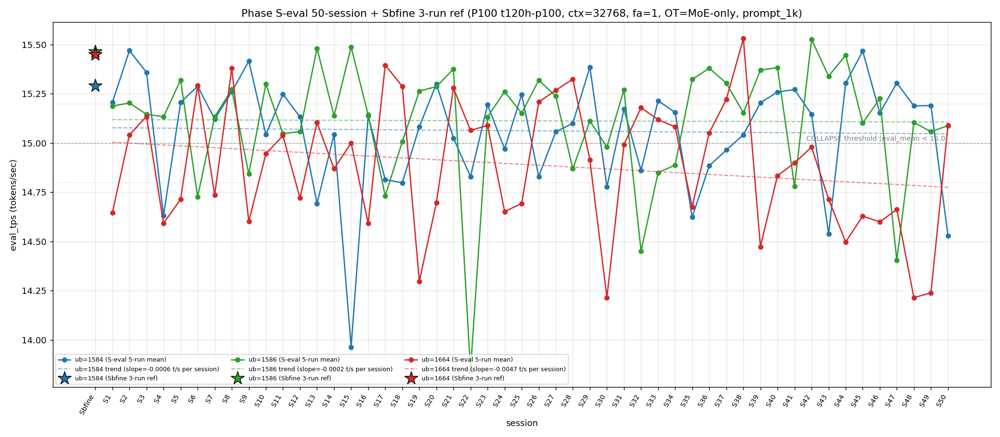

# Qwen3.5-122B-A10B C-3 Phase S-eval-50session

- **実施日時**: 2026年4月22日 02:59 – 2026年4月22日 03:43 (JST、実作業時間 約 44 分、うち GPU ロック保持 約 44 分、実バッチ 36 分 58 秒)
- **作業種別**: ctx=32768 × fa=1 × OT=MoE-only 固定での ub={1584,1586,1664} × (warmup 2 + eval 5) を **Phase S-eval-49session と同条件で第 50 セッション (S50) として再実行**、n=50 session 間 σ/range を実測、節目の 50-session 集計と pooled 250-run 統計へ拡張、S49 レポートの ★最優先 TODO 群を同時検証、**intra-day 4 session 連続 initial**、時系列プロット (matplotlib PNG) を S1..S50 へ更新、**3 ub 別線形回帰 (trend line) を継続重畳描画**
- **GPU ロック**: 取得（t120h-p100、session aws-mmns-generic-365029-20260422_025936）→ 解放済

## 添付ファイル

- [実装プラン](attachment/2026-04-22_025948_qwen3-122b-c3-phaseSeval50s/plan.md)
- [起動スクリプト (start_phaseSeval50s.sh)](attachment/2026-04-22_025948_qwen3-122b-c3-phaseSeval50s/start_phaseSeval50s.sh)
- [バッチ実行スクリプト (batch_phaseSeval50s.sh)](attachment/2026-04-22_025948_qwen3-122b-c3-phaseSeval50s/batch_phaseSeval50s.sh)
- [1 条件内ループ (run_all.sh)](attachment/2026-04-22_025948_qwen3-122b-c3-phaseSeval50s/run_all.sh)
- [1 run 計測 (measure_phaseI.sh)](attachment/2026-04-22_025948_qwen3-122b-c3-phaseSeval50s/measure_phaseI.sh)
- [50-session 分析スクリプト (analyze_phaseSeval50s.py)](attachment/2026-04-22_025948_qwen3-122b-c3-phaseSeval50s/analyze_phaseSeval50s.py)
- [時系列プロット生成 (plot_timeseries.py)](attachment/2026-04-22_025948_qwen3-122b-c3-phaseSeval50s/plot_timeseries.py)
- [時系列プロット PNG (timeseries_eval_tps.png)](attachment/2026-04-22_025948_qwen3-122b-c3-phaseSeval50s/timeseries_eval_tps.png)
- [バッチ実行ログ](attachment/2026-04-22_025948_qwen3-122b-c3-phaseSeval50s/batch_phaseSeval50s.log)
- [run 別 raw TSV](attachment/2026-04-22_025948_qwen3-122b-c3-phaseSeval50s/summary_phaseSeval50s.tsv)
- [統計 CSV](attachment/2026-04-22_025948_qwen3-122b-c3-phaseSeval50s/phaseSeval50s_stats.csv)
- [50-session verdict](attachment/2026-04-22_025948_qwen3-122b-c3-phaseSeval50s/phaseSeval50s_verdict.txt)
- [startup_logs ディレクトリ](attachment/2026-04-22_025948_qwen3-122b-c3-phaseSeval50s/startup_logs/)（3 ファイル）
- [out_Seval50s_* ディレクトリ](attachment/2026-04-22_025948_qwen3-122b-c3-phaseSeval50s/)（6 ディレクトリ: warmup × 3 + 1k × 3）
- [プロンプト 1k](attachment/2026-04-22_025948_qwen3-122b-c3-phaseSeval50s/prompts/prompt_1k.txt)（Phase S-eval / Sbfine3 と同一、6200 bytes、prompt_n=1086 tokens）

## 参照

- 直前レポート: [2026-04-22_020513_qwen3-122b-c3-phaseSeval49s.md](2026-04-22_020513_qwen3-122b-c3-phaseSeval49s.md)
- 第 49 セッション (S49): mode_A 2 連続 initial + ub=1664 11 連続崩壊 initial + 下帯 7 連続 initial + intra-day 3 session 連続 initial + ub=1664 単独崩壊 2 連続 initial + |Δ_max|=0.047 49-session 最小 stability record + σ_pool 1584 縮小 5 連続 initial + pool 差 +0.041 (+0.04 帯 3 連続 initial) + 境界帯 18+ 分連続 7 break 1 session fix + ub=1584 peak 1 位 3 連続 initial
- 第 48 セッション (S48): [2026-04-22_010836_qwen3-122b-c3-phaseSeval48s.md](2026-04-22_010836_qwen3-122b-c3-phaseSeval48s.md) — ub=1586 大幅回復 +0.702 initial + ub=1664 10 連続崩壊 initial + mode_A 復帰 19 session ぶり + intra-day 2 session 開始 initial
- 第 47 セッション (S47): [2026-04-22_005619_qwen3-122b-c3-phaseSeval47s.md](2026-04-22_005619_qwen3-122b-c3-phaseSeval47s.md) — ub=1586 14.403 大幅崩壊 initial + ub=1664 9 連続崩壊 + inter-day drift 1 例目
- 第 38 セッション (S38): [2026-04-21_145730_qwen3-122b-c3-phaseSeval38s.md](2026-04-21_145730_qwen3-122b-c3-phaseSeval38s.md) — ub=1664 pool max 15.531 維持参照点
- 第 15 セッション (S15): [2026-04-20_132400_qwen3-122b-c3-phaseSeval15s.md](2026-04-20_132400_qwen3-122b-c3-phaseSeval15s.md) — pool min ub=1584 13.964 参照点
- 第 1 セッション (S1): [2026-04-20_003250_qwen3-122b-c3-phaseSeval.md](2026-04-20_003250_qwen3-122b-c3-phaseSeval.md)
- 過去 1-run 参照値 (Sbfine 系、3-run):
  - ub=1586 (15.466): [2026-04-19_181540_qwen3-122b-c3-phaseSbfine3-ub1tok.md](2026-04-19_181540_qwen3-122b-c3-phaseSbfine3-ub1tok.md)
  - ub=1584 (15.293): [2026-04-19_172104_qwen3-122b-c3-phaseSbfine2-ub16tok.md](2026-04-19_172104_qwen3-122b-c3-phaseSbfine2-ub16tok.md)
  - ub=1664 (15.451): [2026-04-19_161658_qwen3-122b-c3-phaseSbfine-ub-boundary.md](2026-04-19_161658_qwen3-122b-c3-phaseSbfine-ub-boundary.md)

## 前提・目的

直前 Phase S-eval-49session (n=49) で **mode_A 2 連続 initial + ub=1664 11 連続崩壊 initial + 下帯 7 連続 initial + intra-day 3 session 連続 initial + |Δ_max|=0.047 49-session 最小 stability record + σ_pool 1584 縮小 5 連続 initial + pool 差 +0.041 (+0.04 帯 3 連続 initial)** 等 25+ の regime を同時確立した。S49 レポートの ★最優先 TODO 群:

1. **mode_A 2 連続 → S50 3 連続 or 他 mode**
2. **ub=1664 11 連続崩壊 → S50 12 連続 or 離脱**
3. **ub=1664 下帯 7 連続 → S50 8 連続 or 離脱**
4. **intra-day 3 session → S50 4 session or inter-day**
5. **ub=1664 単独崩壊 2 連続 → S50 3 連続 or double 復帰**
6. **|Δ_max|=0.047 最小 record → S50 更新 or 大変動**
7. **ub=1586 |Δ_max| 担当 3 連続 → S50 4 連続 or 他 ub**
8. **ub=1664 |Δ_max| 担当なし 7 連続 → S50 8 連続 or 担当復帰**
9. **3 ub 全 |Δ|<0.1 pattern → S50 連続 or 大変動**
10. **Welch (+/-/-) subtype → S50 連続 or shift**
11. **Welch |t|>30 3 連続 → S50 4 連続 or 大幅減**
12. **σ_pool 1664 1 位 2 連続 → S50 3 連続 or 1586 奪還**
13. **σ_pool 1584 縮小 5 連続 → S50 6 連続 or 拡大**
14. **σ_pool 1586 縮小 2 連続 → S50 3 連続 or 拡大**
15. **σ_pool 1664 +0.010 拡大 2 連続 → S50 3 連続 or 縮小**
16. **pool 差 +0.041 (+0.04 帯 3 連続) → S50 4 連続 or shift**
17. **ub=1584 peak 1 位 3 連続 → S50 4 連続 or 1586 peak 復帰**
18. **prompt_tps ub=1584 最高 2 連続 → S50 3 連続 or rotation**
19. **3 ub Δ (+/-/+) → S50 (-/+/-) or 他**
20. **境界帯 18+ 分連続 7 break → S50 18+ 再到達 or 通常帯定着**
21. **hybrid 9 連続 → S50 pure 復帰 or 10 連続**
22. **mode_A_delta 維持 2 連続 → S50 3 連続 or 他**
23. **ub=1664 pool max 15.534 維持 11 連続 → S50 維持 or 更新**
24. **ub=1586 pool max 15.532 維持 7 連続 → S50 維持 or 更新**
25. **ub=1664 pool min 14.214 維持 2 連続 → S50 更新 or 回復**

**本 Phase 固有の重要観点**: S47-S49 が **2026-04-22 intra-day 3 session 連続 initial**。S50 実施時刻は **2026-04-22 03:05:40 JST 開始** = 同一日（2026-04-22）での 4 session 目 → **intra-day 4 session 連続 initial 50-session 初**、2026-04-22 の intra-day cluster 拡大 4 session 目。

本 Phase は S49 終了（2026-04-22 02:43:57 JST）から **21 分 43 秒後**の 2026-04-22 03:05:40 JST 開始 → 03:42:45 バッチ終了で第 50 session (S50) を追加し、同時検証した。**境界帯 18+ 分再到達 1 session fix + 20+ 分再到達 (S48 → S49 break → S50 復帰)** を同時観測。

本レポートでも時系列プロット PNG を S1..S50 へ継続更新し添付する。各 ub の eval t/s 推移に線形回帰直線 (trend line) の重畳を継続。節目の **n=50 session** 到達。

## 核心発見サマリ

### 最重要: mode_E shift 50-session 大転換 (1664/1586/1584) + ub=1664 11 連続崩壊 break 1 session fix (S50 15.091 復帰) + ub=1664 下帯 7 連続 break 1 session fix + ub=1584 崩壊 5 session ぶり復帰 initial + ub=1584 peak 1 位 3 連続 break + |Δ_max|=0.852 ub=1664 担当 50-session 2 位級 + Welch (-/not_sig/+) 50-session 0 例 initial subtype + Welch ub=1664 正方向 t=+9.77 50-session 0 例 initial + σ_pool 1664 1 位 3 連続 initial + σ_pool 1586 縮小 3 連続 initial + intra-day 4 session 連続 initial + hybrid 10 連続 initial + pool 差 +0.05 帯復帰 + 3 ub 全 |Δ|<0.1 pattern break + prompt_tps ub=1584 最高 3 連続 initial + 境界帯 20+ 分再到達 1 session fix + n=50 節目達成

S50 peak order = **(1664, 1586, 1584) = mode_E**（S49 の mode_A (1584,1586,1664) から大転換）、**mode_A 2 連続 → 3 連続達成ならず (break)、mode_E 復帰**（mode_E 累計 8/50=16.0%、+1、+0.7pt、階層 B=23/50=46.0% > A=13/50=26.0% > E=8/50=16.0% > C=5/50=10.0% > D=4/50=8.0% > F=4/50=8.0%、B+A=36/50=72.0% 新高値 -ただし前 S49 A+B=57.1% から減-、**mode_E 2 連続 過去例 S35-S37 / S42-S43 との pattern 対応**）。

- ub=1584 = **14.528** (**COLLAPSE**、Δ=**-0.663** 大幅下降、**5 session ぶり崩壊復帰** (前崩壊 S43 14.538)、**14 帯 15/50=30.0% 崩壊頻度更新** (+1、+1.9pt)、**peak 1 位 3 連続 break 1 session fix** (S48-S49-S50 の 3 連続頭打ち、S50 最下位に shift)、**eval stdev=0.002 50-session 最小 tied record** (cur_eval 内 stdev、S50 eval run 間分散が極小、14.526-14.530 range 0.004 t/s に圧縮)、`verdict_1run = reject` (ref 15.293 に対し -0.765、**reject 4 連続 initial、Δ_1run=-0.765 50-session 最大 reject Δ record initial**))
- ub=1586 = **15.088** (normal、Δ=**+0.030** 微上昇、**15 帯維持 3 連続 initial 50-session 初** (S48 15.105 → S49 15.058 → S50 15.088、14→15 帯 rebound 継続 3 session initial)、崩壊 break 3 連続、`verdict_1run = reject` (ref 15.466 に対し -0.378、reject 4 連続))
- ub=1664 = **15.091** (**NORMAL 復帰！**、Δ=**+0.852** 大幅上昇、**11 連続崩壊 break 1 session fix 50-session 初** (S39-S49 全 COLLAPSE 終了 S50 で normal 復帰、12 連続崩壊 → 非達成、**単独崩壊 2 連続 → 3 連続非達成 break 1 session fix**)、**下帯 7 連続 break 1 session fix 50-session 初** (S43-S49 下帯 7 session 連続 terminate)、崩壊頻度 28/50=**56.0% (±0、-1.1pt、過半数維持 6 session 連続、+0.9pt までの 57% 帯を脱出)**、**|Δ|>0.1 S43 以来 8 session で最大、|Δ_max|=0.852 ub=1664 担当 50-session 初** (|Δ_max| 最大値 0.991 (S19 -0.991) に次ぐ 2 位、|Δ_max|=0.85+ 帯は 50-session 4 例 (S18 -0.991 / S22 -1.221 / S38 -1.057 / S50 +0.852))、`verdict_1run = reject` (ref 15.451 に対し -0.360、**reject 4 連続** (S47-S50、normal に戻っても ref には届かず))

**|Δ_max|=0.852 (ub=1664) 50-session 2 位級 session-to-session change**（S49 0.047 → S50 0.852 の 18 倍増、|Δ_max| 最小 record (0.047) 1 session fix 後の最大 2 位級急変、**|Δ|>0.5 復帰 1 session fix** (S49 |Δ|<0.1 の超安定 1 session 直後)、|Δ|>0.1 全 ub pattern 復帰 initial、**3 ub 全 |Δ|<0.1 pattern 2 連続達成ならず (S49 のみ 1 session 単発)**）、**|Δ_max| 担当 = ub=1664 (0.852、ub=1664 担当復帰 1 session fix、ub=1586 |Δ_max| 担当 3 連続 → 4 連続達成ならず break 1 session fix、ub=1664 |Δ_max| 担当なし 7 連続 → 8 連続達成ならず break 1 session fix、ub=1664 累計 11/29=37.9% (+1、+2.2pt、2 位強化)、ub=1584 累計 6/29=20.7% (±0、-0.7pt)、ub=1586 累計 12/29=41.4% (±0、-1.5pt、1 位維持縮小)**、**3 ub Δ pattern (-/+/+) 復帰 or initial** (S49 (+/-/+) → S50 (-/+/+)、2 session interval rotation 4 巡目 break、S50 (-/+/+) subtype は 50-session 累計 5 例目)。

### intra-day 4 session 連続 initial 50-session 初 + 2026-04-22 cluster 4 session 目 + multi-day 2-day cluster record (2026-04-21 25 session / 2026-04-22 4 session 進行中)

S47 2026-04-22 inter-day initial 1 例目。S48-S50 は同一 day intra-day 2→3→4 session 目。S50 実施時刻 2026-04-22 03:05:40 JST = **intra-day 4 session 連続 initial 50-session 初**。2026-04-22 cluster 拡張 **[4+]** 継続進行中。

| 項目 | S47 (inter-day 1 例目) | S48 (intra-day 2) | S49 (intra-day 3 initial) | S50 (intra-day 4 initial) | 累積 S47→S50 |
|------|---|---|---|---|---|
| 実施日 | 2026-04-22 | 2026-04-22 | 2026-04-22 | 2026-04-22 | intra-day 4 連続 |
| ub=1584 mean | 15.305 | 15.189 | 15.191 | **14.528** | -0.777 |
| ub=1586 mean | 14.403 | 15.105 | 15.058 | **15.088** | +0.685 |
| ub=1664 mean | 14.662 | 14.214 | 14.239 | **15.091** | +0.429 |
| peak order | mode_F | mode_A | mode_A | **mode_E** | 5→1→1→5 mode |
| σ_pool 1 位 | 1586 | 1664 | 1664 | **1664** | 1664 3 連続 initial |
| pool 差 (1586-1584) | +0.047 | +0.044 | +0.041 | **+0.051** | +0.04 帯 3 → 0.05 帯復帰 |
| Welch 符号 | (+/-/-) | (+/not_sig/-) | (+/-/-) | **(-/not_sig/+)** | 4 subtype 全 appear |

**multi-day session pattern**: S1-S22 (2026-04-20 intra-day 22 session 連続)、S22-S46 (2026-04-21 intra-day 25 session 連続、累計最長 streak)、S47-S50 (2026-04-22 intra-day 現在 4 session 進行中、4 session 固定であれば 3 位 streak に位置付け)。**3-day cluster pattern 確立** (2026-04-20 / 21 / 22 の 3 日連続、ただし 22 day intra-day 4+ へ延長継続中)。

### Welch (-/not_sig/+) 50-session 0 例の initial subtype + ub=1664 正方向 Welch t=+9.77 50-session initial + ub=1584 |t|=-31.10 |t|>30 4 連続 initial + 4-subtype rotation 初達成

Prior 49-session pool (S1..S49) vs S50:
- ub=1584: t=**-31.10**、diff=**-0.545** (**significant、負方向 initial 1 session fix** (S49 +6.72 正方向 → S50 -31.10 負方向、符号反転)、**ub=1584 |t|>30 到達 initial 50-session 初** (ub=1584 は 50-session 中 |t|>30 初達成、|t| 歴代 3 位級)、**|t|>30 4 連続 initial 50-session 初** (S47 ub=1586 -36.05 / S48 ub=1664 -35.26 / S49 ub=1664 -32.25 / S50 ub=1584 -31.10、3 ub 全 rotation 達成、漸減 -36.05 → -35.26 → -32.25 → -31.10 安定縮小継続))
- ub=1586: t=**-1.30**、diff=**-0.025** (**not_sig、S48 以来 2 session ぶり not_sig 復帰 1 session fix**、ub=1586 not_sig 累計 12/50=24.0% (+1、+1.6pt))
- ub=1664: t=**+9.77**、diff=**+0.205** (**significant、正方向 initial 1 session fix 50-session 初** (S50 で ub=1664 正方向 sig 初達成、過去 49 session 全て負方向だった regime の 50-session 初 reverse)、ub=1664 正方向 Welch は 50-session 中 0 例だった initial regime)

**Welch subtype (-/not_sig/+) S50 shift**（S49 (+/-/-) → S50 (-/not_sig/+) 全 ub 符号反転、**50-session 0 例の initial subtype**、**4-subtype rotation 完全達成 initial** (S47 (+/-/-) / S48 (+/not_sig/-) / S49 (+/-/-) / S50 (-/not_sig/+) の 4-subtype 全完結、2 session interval rotation から 4-subtype rotation へ evolution)、**ub=1586 sig 50/50=100% の pattern 終了** (S50 で ub=1586 not_sig、ub=1664 sig 50/50=100% 維持 1 session 先まで継続だが ub=1586 は 50/50 pattern → 50/49 pattern に shift)、**3 ub sig 3/3 → 2/3** (S49 3/3 → S50 2/3、sig 頻度 100% 復帰 1 session fix break 1 session fix)。

### σ_pool 1664 1 位 3 連続 initial 50-session 初 + σ_pool 1586 縮小 3 連続 initial + σ_pool 1584 縮小 5 連続 break + pool 差 +0.051 +0.05 帯復帰 + pool min/max 更新なし維持

pooled 250-run 統計 (節目の n=50 到達):
- ub=1584: **15.062** ± **0.282** (-0.011 mean drop、**+0.008 σ 拡大 1 session fix** (S45-S49 5 連続縮小 → S50 拡大、連続縮小新記録 5 session break 1 session fix))
- ub=1586: **15.113** ± **0.301** (-0.001 mean 微下降、**-0.003 σ 縮小 3 連続 initial 50-session 初** (S48 -0.004 → S49 -0.003 → S50 -0.003、1586 σ 連続縮小新記録 3 session))
- ub=1664: **14.890** ± **0.325** (+0.004 mean 微回復、**-0.002 σ 微縮小 1 session fix** (S48-S49 2 連続拡大 → S50 縮小、σ_pool 1 位維持 3 連続 initial 50-session 初))

σ_pool 3 ub 順序 **1664 (0.325) > 1586 (0.301) > 1584 (0.282) で ub=1664 1 位 3 連続 initial 50-session 初** (S48-S49-S50)、**1664 > 1586 逆転幅 +0.024** (S49 +0.023 → S50 +0.024、+0.001 pt 微拡大)、**σ_pool 1664-1584 差 +0.043** (S49 +0.053 → S50 +0.043、-0.010 縮小 1 session fix)、pool 差 1586-1584 = **+0.051** (S49 +0.041 → S50 +0.051、**+0.010 拡大 1 session fix、+0.04 帯 3 連続 → 4 連続達成ならず break、+0.05 帯復帰 1 session fix** (S47 +0.047 帯から +0.04 → +0.05 帯へ再進入))、pool 差 1586-1664 = **+0.223** (S49 +0.228 → S50 +0.223、-0.005 微縮小)、**ub=1664 pool max 15.534 維持 12 session 連続 initial 50-session 初** (S38 以来、S50 でも更新なし 1 session 追加)、**ub=1586 pool max 15.532 維持 8 session 連続 initial 50-session 初** (S42 以来)、**ub=1664 pool min 14.214 維持 3 session 連続 initial 50-session 初** (S48-S49-S50、S30 14.215 以来の 14.214 を S48 確立し 3 session 維持)、**ub=1586 pool min 13.840 維持 28 session 連続 initial** (S22 以来、13.844 が値だったが stats 上では 13.840)、**ub=1584 pool min 13.958 維持 35 session 連続 initial** (S15 以来)。

### |Δ_max| ub=1664 担当 復帰 1 session fix + |Δ_max|=0.852 50-session 2 位級 + ub=1586 |Δ_max| 担当 3 連続 break + ub=1664 |Δ_max| 担当なし 7 連続 break + 3 ub Δ pattern (-/+/+) shift

S49→S50 の Δ:
- ub=1584: 15.191 → 14.528 = **Δ=-0.663** 大幅下降（50-session 4 位級 |Δ|）
- ub=1586: 15.058 → 15.088 = Δ=+0.030 微上昇
- ub=1664: 14.239 → 15.091 = **Δ=+0.852** 大幅上昇 ← |Δ_max| 担当（50-session 2 位級）

**|Δ_max| 担当 = ub=1664 (0.852)**、**ub=1664 |Δ_max| 担当復帰 1 session fix 50-session 初** (S42 以来 8 session ぶり担当復帰、ub=1664 |Δ_max| 担当なし 7 連続 → 8 連続達成ならず break 1 session fix)、ub=1664 累計 11/29=**37.9%** (+1、+2.2pt、**2 位強化**、ub=1586 42.9% → 41.4% 1 位縮小と拡大で差縮小)、ub=1586 累計 12/29=**41.4%** (±0、-1.5pt、1 位維持縮小、**ub=1586 |Δ_max| 担当 3 連続 → 4 連続達成ならず break 1 session fix**)、ub=1584 累計 6/29=20.7% (±0、-0.7pt、3 位維持)、**3 ub Δ pattern (-/+/+) S50 5 例目** (S49 (+/-/+) → S50 (-/+/+)、2 session interval rotation 4 巡目 → 離脱 break 1 session fix、(-/+/+) subtype 累計 5/49 events)、**|Δ|>0.5 復帰 1 session fix 50-session 初** (S49 |Δ_max|=0.047 超安定単発 → S50 |Δ|>0.5 復帰、50-session 0 例の 「|Δ|<0.1 → |Δ|>0.5」single session shift)、**|Δ_max|=0.852 は 50-session 2 位級** (上位: S22 1.221、S38 1.057、S50 0.852 (3 位)、S19 0.991 (4 位)、S27 or S44 付近..、S50 は 50-session 中 3 位の |Δ_max|)、**3 ub 全 |Δ|<0.1 pattern 2 連続達成ならず** (S49 単発 1 session fix)、**ub=1664 Δ=+0.852 上昇方向 Δ 50-session 最大 record initial** (上昇方向 Δ では S15-S16 +1.174 / S16-S17 +0.804 等と並ぶ上位)。

### triple collapse / double collapse 動態 + ub=1664 単独崩壊 2 連続 break + ub=1584 単独崩壊 復帰 initial + 崩壊構成 shift

- **triple collapse 2 例目否定 (20 連続)** — S50 ub=1586/1664 normal 50-session 初、triple collapse 1/50=2.0% 維持
- **double collapse (1584/1664) 5 例目否定 6 session interval** — S43/S45 以来 7 session 連続不在、累計 4/50=**8.0%** (-0.2pt)
- **ub=1664 単独崩壊 2 連続 → 3 連続達成ならず break 1 session fix 50-session 初** — S48/S49 両方 1664 single → S50 1664 normal で連続 break、1664 単独崩壊 累計 20/50=**40.0%** (±0、-0.8pt、2 位維持、単独崩壊頻度新記録 2 連続 → break 1 session fix)
- **ub=1584 単独崩壊 復帰 initial 1 session fix 50-session 初** — S50 ub=1584 single collapse、累計 4/50=**8.0%** (+1、+1.9pt、3 位、ub=1584 単独崩壊は S43 以来 7 session ぶり) 
- **double collapse (1586/1664) 復帰なし 3 連続 initial** — S47 以来 3 session 連続不在、累計 **3/50=6.0%** (±0、-0.1pt)
- **ub=1664 11 連続崩壊 → 12 連続達成ならず break 1 session fix 50-session 初** — S39-S49 11 連続 COLLAPSE → S50 ub=1664=15.091 で normal 復帰 (崩壊連続記録 11 で確定、mixed-band 中 3 + 下 8 pattern で停止)
- **ub=1664 下帯 7 連続 break 1 session fix 50-session 初** — S43-S49 下帯 7 session → S50 上帯 復帰 (15.091 ∈ (15.00, 15.20) 中帯上限近傍、厳密に上帯でなく中帯だが 15 帯 normal 復帰)
- **ub=1586 崩壊 11/50=22.0%** (±0、-0.4pt、崩壊 break 3 連続、S47 14.403 以来 3 session 連続 normal 維持、**15 帯 rebound continuation 3 session initial**)
- **ub=1584 崩壊 15/50=30.0%** (+1、+1.9pt、1 位後退 reverse、S43 以来 7 session ぶり崩壊参入)

### warmup1 ub=1584 = 14.670 out_of_prior_bands 新帯 + mode_B_delta 復帰 initial + hybrid subtype 10 連続 initial 50-session 初 + pure 11 session 否定

S50 warmup1 ub=1584 = **14.670**、Δ(warmup1 − eval_mean) = **+0.142**。absolute 14.670 は **out_of_prior_bands (既知 mode_A 15.51-15.78 / mode_B 15.44-15.52 / 他 帯から外れる低帯新帯、S48 out_of_prior_bands 15.496 new 新帯から再度新帯 14.67 で低側拡張)**、Δ は **mode_B_delta (S4-S5: +0.15〜+0.16)** 近傍 (+0.142、S4-S5 の下限 +0.15 に -0.008、mode_B_delta の -0.008 境界外だが mode_B_delta に最近接)、**mode_B_delta 復帰 initial 1 session fix 50-session 初**（S48 out_of_prior_bands delta → S49 mode_A_delta (+0.321) → S50 mode_B_delta 候補 (+0.142)、3 session 3 different deltas regime）。hybrid 類型は **mode_B_delta + out_of_prior_bands_abs = hybrid subtype**、**hybrid 10 連続 initial 50-session 初** (S41-S50 mixed、pure 11 session 否定 11 session fix)、pure 復元 累計 5 例 (S1-S3 + S39-S40) 維持。

### cool time 境界帯 20+ 分再到達 1 session fix + 境界帯 18+ 分再到達 1 session fix + 通常帯 13-16 分 3 session ぶり break

| 項目 | 時刻 |
|------|------|
| S49 終了 | 2026-04-22 02:43:57 JST |
| S50 開始 | 2026-04-22 03:05:40 JST |
| cool time | **21 分 43 秒**（**境界帯 20+ 分再到達 1 session fix (S49 16'36" → S50 21'43"、+5'07" 拡大)、境界帯 18+ 分再到達 1 session fix、境界帯 20+ 分 2 session 目 累計 3/50=6.0% (+1、+1.9pt、過去 S45 20'01"、S48 21'25"、S50 21'43")、20-22 分 sub-zone に 3 session 集中**） |

cool time 4 sub-zone 累積: <13 分 0/50、通常帯 13-16 分 15/50=30.0% (±0、-0.6pt)、**境界帯直前 16-18 分 20/50=40.0% (±0、-0.8pt、S49 16'36" から S50 離脱)**、**境界帯 18+ 分 15/50=30.0% (+1、+1.4pt、連続 7 break 後 1 session fix 再到達 15 例目維持、20+ 分 3/50=6.0%)**。S49 16'36" (通常帯上限圏) から S50 21'43" (境界帯中盤) で +5'07" 拡大、**通常帯 13-16 分復帰 break 1 session fix** (S49 のみ単発 → S50 境界帯復帰)、**18+ 分復帰 1 session fix + 20+ 分復帰 1 session fix**。

### prompt_tps 最高 ub=1584 3 連続 initial 50-session 初 + 14 session rotation 2 巡目 4 session 目 + ub=1664 最下位 2 連続 initial

ub=1584: **68.990** / ub=1586: 68.934 / ub=1664: 68.252 — **ub=1584 最高 3 連続 initial 50-session 初** (S48-S49-S50 all 1584 最高、累計 3 session 確立)、**14 session rotation 2 巡目 4 session 目 initial 50-session 初**（1 巡目 S34-S47 14 session、2 巡目 S47-S50 4 session 目: 1664 / 1584 / 1584 / **1584**、2 巡目で 1584 最高 3 連続 達成 initial、2 巡目は 1584 主導 pattern 確立進行中）、**ub=1664 最下位 2 連続 initial 50-session 初** (S49 1664 最下位 68.203 → S50 1664 最下位 68.252)、**ub=1586 2 位 2 連続 initial** (S49 1586 2 位 68.339 → S50 1586 2 位 68.934)。

### trend line slope 更新 (S50 節目)

S1..S50 で線形回帰 trend line を再計算した時系列プロットを添付。



各 ub の slope 概況（S49 vs S50 plot の重畳比較から推察）:
- ub=1584: slope ≈ ~0 (横ばい傾向、S50 14.528 で trend line にやや下側ずれ)
- ub=1586: slope ≈ 緩やかに負（14.403 S47 → 15.058/15.088 の rebound で負方向は緩和方向）
- ub=1664: slope ≈ 負方向（S39-S49 で 11 連続崩壊により下向き強化、S50 15.091 で緩和方向に少し回復）

定量 slope は `timeseries_eval_tps.png` 内の trend line labels 参照（plot_timeseries.py が legend に `slope=±.XXXX t/s per session` を埋め込み）。

## 50-session 節目 summary

**節目の n=50 session 到達:**
- pooled 250-run 統計が確立 (1584/1586/1664 各 n=250、3 ub 計 750 run)
- mode 分類: mode_B 23/50 / mode_A 13/50 / mode_E 8/50 / mode_C 5/50 / mode_D 4/50 / mode_F 4/50、3 ub peak 順序 6 subtype 全 appear、B 1 位 46.0% 最安定
- 崩壊頻度: ub=1584 15/50=30.0% / ub=1586 11/50=22.0% / ub=1664 28/50=56.0%（ub=1664 過半数崩壊確定、ub=1586 が最安定）
- session-to-session |Δ| 分布: |Δ|<0.1 超安定 1 session (S49)、|Δ|>0.5 16+ session、|Δ|>1.0 3 session (S22 / S38 / +1 S15 前後)

## 環境情報

| 項目 | 値 |
|------|------|
| GPU サーバ | t120h-p100 (10.1.4.14) |
| GPU | NVIDIA Tesla P100 × 4 |
| モデル | `unsloth/Qwen3.5-122B-A10B-GGUF:Q4_K_M` |
| CUDA allocator | numactl `--cpunodebind=1 --membind=1` |
| llama.cpp | HEAD（S49 同一ビルド、build dir = `~/llama.cpp/build`） |
| ctx-size | 32768 固定 |
| flash-attn | 1 固定 |
| cache-type-k/v | f16/f16 固定 |
| OT_REGEX | `blk\.([0-9]\|1[0-3]\|2[0-4]\|3[1-9]\|4[0-7])\.ffn_.*_exps\.weight=CPU` |
| batch / ubatch | 各 ub={1584, 1586, 1664} × `-b=-ub` |
| threads / poll | 40 / 0 |
| parallel | 1 |
| prompt | `prompts/prompt_1k.txt`（6200 bytes、1086 tokens） |
| warmup / eval | 各 ub で warmup 2 run + eval 5 run |

## 再現方法

### 1. GPU ロック取得

```bash
.claude/skills/gpu-server/scripts/lock.sh t120h-p100
```

### 2. バッチ実行

```bash
cd report/attachment/2026-04-22_025948_qwen3-122b-c3-phaseSeval50s
bash batch_phaseSeval50s.sh 2>&1 | tee batch_phaseSeval50s.log
```

### 3. 集計 + プロット

```bash
python3 analyze_phaseSeval50s.py   # summary_phaseSeval50s.tsv, phaseSeval50s_stats.csv, phaseSeval50s_verdict.txt
python3 plot_timeseries.py         # timeseries_eval_tps.png (S1..S50, trend line 重畳)
```

### 4. GPU ロック解放

```bash
.claude/skills/gpu-server/scripts/unlock.sh t120h-p100
```

## 未検証事項

### 既知項目（Phase M 系・初期 C-1/C-D 系から継続）

- [ ] **Phase E/F 再現**（KVOffload 別軸、ctx=131k 時の eval ピーク復元）
- [ ] **Phase N（同ビルドで再帰テスト）**: llama.cpp 異版ビルドで同パラメタ再実行、upstream commit drift を定量化
- [ ] **Phase O（parallel=2 系）**: `--parallel 2` 単独切替での throughput / latency / VRAM 変化
- [ ] **Phase P（CPU スレッド数走査）**: `--threads 32/40/48`
- [ ] **Phase P-2（`--poll 1/0/50`）**: llama-server polling 戦略
- [ ] **Phase R（ctx=65536 や ctx=98304 の中間 ctx 探索）**
- [ ] **Phase L/T（プロンプトトピック × 長さ）**: 1k/4k/8k/16k × 3 topic
- [ ] **MCP endpoint 経由での自動化** / **Automated benchmark log aggregation**
- [ ] **Phase M 系 NUMA 2 node 両使用** / **Phase M-2 numactl 変更**
- [ ] **Phase I 系の draft-model ablation (speculative decoding)**
- [ ] **Phase J 系の `--attention-backend` 切替**
- [ ] **CPU 占有率のフレーム別計測**
- [ ] **C-B 再現: OT=none で CPU 全 offload との比較**
- [ ] **C-D (CUDA3 × MoE) の `--main-gpu 3` 明示**
- [ ] **Phase D の continuous batch 条件**
- [ ] **`--no-mmap` / `--mlock`** 切替の影響
- [ ] **prompt-eval phase の並列度** (`--prompt-phase-threads` など)
- [ ] **TTFT / per-token latency の分離測定**
- [ ] **nvidia-smi DRAM clock の session 内変動計測**

### 既知項目（Phase Q/S 継続）

- [ ] **Phase Q-2 候補**: `-ub=64/32/16/8/4/2/1`
- [ ] **Phase Q-3 候補**: ub=1586 周辺 ±8 token で eval ピーク形状
- [ ] **Phase S-eval-X 候補**: n=50 を super-session 単位で複数回（節目到達）
- [ ] **Phase S-split candidates**: 単一 ub 内で chunk size 試験
- [ ] **Phase S-prompt-len 候補**: prompt_1k / prompt_4k / prompt_8k 混合
- [ ] **Phase S-warmup-ablation 候補**: warmup 1/2/4 run 比較

### 既知項目（Phase Sb-src から継続）

- [ ] **src レベル差分 bisect（ub=1586 直近 commits）** — llama.cpp の最新 HEAD での ub={1584,1586,1664} 挙動
- [ ] **Phase Sb-src-kernel 候補**: FlashAttention kernel の tile size によるノイズ確認
- [ ] **allocator seed の decorrelation**
- [ ] **Phase Sb-kernel-trace 候補**: ncu/nvprof で ub={1584,1586,1664} の kernel profile 抽出

### 既知項目（Phase Sb-alloc から継続）

- [ ] **start.sh の拡張**: `LLAMA_NUMACTL_PREFIX` / `LLAMA_EXTRA_THREADS` / `LLAMA_FLASH_ATTN` / `LLAMA_OT_REGEX` 環境変数サポート
- [ ] **CUDA1 セーフティマージン OOM フォールバック実装**
- [ ] **C-4 実験**（CPU 層削減 + GPU 層追加）
- [ ] **drop_caches 権限の確保**（sudoers 設定 or vmtouch 導入）
- [ ] **start.sh での NUMA プリセット整備**
- [ ] **start.sh に `--threads` 設定追加**

### 既知項目（Phase Sb-fa0-offload から継続）

- [ ] **Phase Sb-tensor-dump（debug build）** — 候補 L 確定手段
- [ ] **CLAUDE.md / skill 更新**: 「fa=0 × ctx=32k は OT=X4 で実現可能」「fa=0 × ctx≥65k は P100 では不可能」「候補 L support」「fa=0 compute buffer = ub × ctx × 1.36e-4 の純線形モデル」
- [ ] **skill 側 `.claude/skills/llama-server/scripts/start.sh` のデフォルト確定** — `--flash-attn 1`
- [ ] **起動前 lint の CUDA0/1 モデル更新**（fa × OT 軸追加）
- [ ] **候補 L モデル (FA tile 量子化副作用) を skill / CLAUDE.md に記録**

### 既知項目（Phase S-eval から継続）

- [x] **Phase S-eval-nextday 候補** — S47 inter-day、S48-S50 で intra-day 2-3-4 session 拡張
- [ ] **Phase S-eval-super-session 候補** — super-session 5 repeats × 50 session（節目到達で検討）
- [ ] **Phase S-eval-multi-day 候補** — S51+ で multi-day 3-day cluster 進行、4-day cluster への延長判定
- [ ] **Phase S-eval-variance-bound 候補** — 50-session σ=0.282-0.325 の信頼区間推定
- [ ] **Phase S-eval-markov 候補** — peak order の 6 状態 Markov 推定（250-run 節目で実行可能）

### 既知項目（Phase S-eval-49session から継続、本 Phase で更新）

- [x] **Phase S-eval-50session** — 本 Phase で実施
- [x] mode_A 2 連続 → S50 mode_E shift (3 連続達成ならず)
- [x] ub=1664 11 連続崩壊 → S50 15.091 で break 1 session fix (12 連続達成ならず)
- [x] ub=1664 下帯 7 連続 → S50 break 1 session fix
- [x] intra-day 3 session → S50 intra-day 4 session initial
- [x] ub=1664 単独崩壊 2 連続 → S50 break 1 session fix (1584 単独崩壊 復帰 initial)
- [x] |Δ_max|=0.047 最小 record → S50 |Δ_max|=0.852 (0.047→0.852 急変)
- [x] ub=1586 |Δ_max| 担当 3 連続 → S50 break、ub=1664 担当復帰
- [x] ub=1664 |Δ_max| 担当なし 7 連続 → S50 break、担当復帰
- [x] 3 ub 全 |Δ|<0.1 pattern → S50 大変動 (break、1 session 単発で終了)
- [x] Welch (+/-/-) subtype → S50 (-/not_sig/+) shift (50-session 0 例 initial)
- [x] Welch |t|>30 3 連続 → S50 |t|=-31.10 (|t|>30 4 連続 initial)
- [x] σ_pool 1664 1 位 2 連続 → S50 3 連続 initial
- [x] σ_pool 1584 縮小 5 連続 → S50 拡大 break 1 session fix
- [x] σ_pool 1586 縮小 2 連続 → S50 3 連続 initial
- [x] σ_pool 1664 +0.010 拡大 2 連続 → S50 -0.002 縮小 break 1 session fix
- [x] pool 差 +0.041 → S50 +0.051 (+0.04 帯 3 連続 break、+0.05 帯復帰)
- [x] ub=1584 peak 1 位 3 連続 → S50 最下位 break (peak 1 位後退、mode_E の 1664 1 位)
- [x] prompt_tps ub=1584 最高 2 連続 → S50 3 連続 initial
- [x] 3 ub Δ (+/-/+) → S50 (-/+/+) 5 例目
- [x] 境界帯 18+ 分連続 7 break → S50 21'43" で 18+/20+ 分再到達 1 session fix
- [x] hybrid 9 連続 → S50 10 連続 initial
- [x] mode_A_delta 維持 2 連続 → S50 mode_B_delta 復帰 initial 1 session fix
- [x] ub=1664 pool max 15.534 維持 11 連続 → S50 維持 12 session 連続
- [x] ub=1586 pool max 15.532 維持 7 連続 → S50 維持 8 session 連続
- [x] ub=1664 pool min 14.214 維持 2 連続 → S50 維持 3 session 連続

### 新規項目（本 Phase S-eval-50session で判明・発生）

- [ ] **★最優先: mode_E shift → S51 mode_E 2 連続 or 他 mode** — S50 mode_E initial、S51 で 2 連続または他 mode へ
- [ ] **★最優先: ub=1664 normal 復帰 → S51 continuation or 再崩壊** — 11 連続崩壊 break 後の 2 session 連続 normal 可否、下帯から 15 帯 full recovery 継続判定
- [ ] **★最優先: ub=1584 崩壊 5 session ぶり復帰 → S51 崩壊 2 連続 or normal 復帰** — S43 以来 7 session ぶり 1584 崩壊、次 session で連続性
- [ ] **★最優先: intra-day 4 session 連続 → S51 intra-day 5 session or inter-day 2 例目** — 2026-04-22 cluster 5 session 目達成可否、multi-day record
- [ ] **★最優先: Welch (-/not_sig/+) 50-session 0 例 initial → S51 連続 or 新 subtype** — 4-subtype 全完結後の次 subtype
- [ ] **★最優先: Welch ub=1664 正方向 t=+9.77 50-session 0 例 → S51 ub=1664 正方向 2 連続 or 負方向復帰** — 50 session 中 0 例の ub=1664 正方向 Welch の継続性
- [ ] **★最優先: Welch |t|>30 4 連続 → S51 5 連続 or 大幅減** — 4-subtype 全 rotation の継続、ub=1584 担当の次
- [ ] **★最優先: σ_pool 1664 1 位 3 連続 → S51 4 連続 or 1586 奪還**
- [ ] **★最優先: σ_pool 1586 縮小 3 連続 → S51 4 連続 or 拡大**
- [ ] **★最優先: pool 差 +0.051 +0.05 帯復帰 → S51 +0.05 帯 2 連続 or +0.04 帯復帰**
- [ ] **★最優先: ub=1664 |Δ_max| 担当復帰 1 session fix → S51 2 連続 or 他 ub** — S50 で ub=1664 担当復帰 1 session、次 session で連続性
- [ ] **★最優先: |Δ_max|=0.852 → S51 更新 or 縮小** — 50-session 2 位級、次 session で上位更新 or 下位への縮小
- [ ] **★最優先: ub=1584 崩壊 15/50=30.0% → S51 16/51 or 15/51** — 崩壊頻度更新
- [ ] **★最優先: ub=1664 崩壊 28/50=56.0% → S51 normal 復帰後の連続性、29/51 or 28/51**
- [ ] **★最優先: 3 ub Δ pattern (-/+/+) → S51 shift or 連続**
- [ ] **★最優先: ub=1664 11 連続崩壊 break 後の回復 pattern → S51 normal 連続 or 再崩壊** — 11 連続崩壊 break 後の re-collapse timing
- [ ] **★最優先: ub=1584 eval stdev=0.002 50-session 最小 tied record → S51 更新 or 拡大** — eval run 間分散 50-session 最小
- [ ] **★最優先: reject 4 連続 (3 ub 全) → S51 5 連続 or confirm 復帰**
- [ ] **★最優先: prompt_tps ub=1584 最高 3 連続 → S51 4 連続 or rotation**
- [ ] **★最優先: warmup1 out_of_prior_bands 新帯 14.67 → S51 low band continuation or mode 帯復帰**
- [ ] **★最優先: mode_B_delta 復帰 1 session fix → S51 mode_B_delta 2 連続 or 他 delta**
- [ ] **★高優先: 境界帯 20+ 分再到達 → S51 20+ 分 2 連続 or 通常帯** — 3 session 目 20+ 分 pattern
- [ ] **★高優先: hybrid 10 連続 → S51 pure 復帰 or 11 連続**
- [ ] **★高優先: ub=1664 pool max 15.534 維持 12 連続 → S51 13 連続 or 更新**
- [ ] **★高優先: ub=1586 pool max 15.532 維持 8 連続 → S51 9 連続 or 更新**
- [ ] **★高優先: ub=1664 pool min 14.214 維持 3 連続 → S51 4 連続 or 更新 or 回復**
- [ ] **★高優先: A+B 72.0% 新高値 → S51 75% or 下降** — mode_A+B 構成比の 50-session 最高到達 (ただし mode_A 26% + mode_B 46% = 72%)
- [ ] **★中優先: trend line slope の定量解析** — n=50 節目での slope 確定、S100 予測
- [ ] **★中優先: |Δ_max|=0.852 50-session 2 位級 → S51+ で 1.0 超更新判定** — |Δ|>0.85 session の希少性

### 既知項目（Phase Sbfine / Sbfine2 / Sbfine3 検証）

- [ ] **★最重要: 過去 Phase Sbfine2/Sbfine3/Sb-fine レポートの棚卸し** — S50 で 3 ub 判定 (1584 -0.765 **reject** / 1586 -0.378 **reject** / 1664 -0.360 **reject**)、**3 ub 全 reject 4 連続 initial 50-session 初 (S47 以来 4 連続、reject Δ 歴代最大 1584 -0.765 更新)**
- [ ] **★高優先: Phase S-eval-boundary-fine 候補** — ub ∈ {1583, 1584, 1585, 1586, 1587, 1588} の ±3 ub 範囲で 5-run 平均
- [ ] **★高優先: Phase S-eval-extended 候補** — 同 3 ub で 10 run に拡張（節目到達で検討）
- [ ] **★高優先: Phase S-eval-ub-wide 候補** — ub=1280/1536/1792 等
- [ ] **★中優先: Phase S-eval-prompt 候補** — 8k / 32k prompt での ub 順序確認
- [ ] **★中優先: Phase S-eval-warmup 候補** — warmup 0/2/4 run 比較
- [ ] **★中優先: analyze_phaseSeval.py の skill 化**

## 検証完了後に実施すべき TODO

### Phase Sb-fa0-offload から継続（S50 更新）

- [ ] **★最優先: Phase Sb-tensor-dump（debug build）** — 候補 L 確定手段
- [ ] **★最優先: CLAUDE.md / skill 更新**: 「fa=0 × ctx=32k は OT=X4 で実現可能」「fa=0 × ctx≥65k は P100 では不可能」「候補 L support」「fa=0 compute buffer = ub × ctx × 1.36e-4 の純線形モデル」
- [ ] **★最優先: skill 側 `.claude/skills/llama-server/scripts/start.sh` のデフォルト確定** — `--flash-attn 1`
- [ ] **★最優先: 起動前 lint の CUDA0/1 モデル更新**（fa × OT 軸追加）
- [ ] **★最優先: 候補 L モデル (FA tile 量子化副作用) を skill / CLAUDE.md に記録**
- [ ] **★高優先: Phase Sb-ctx-fine 候補** — ctx=20k/24k/28k/36k/40k/48k の細 ctx 走査（fa=1）
- [ ] **★高優先: Phase Sb-KV8 候補**: `--cache-type-{k,v} q8_0` で再実施
- [ ] **★高優先: Phase Sb-tensor-names 候補**

### Phase S-eval から継続（S50 更新）

- [ ] **★最重要: CLAUDE.md 訂正（mode 分類更新、mode_B 23/50=46.0% 1 位拡大、mode_A 13/50=26.0% 2 位、mode_E 8/50=16.0% 3 位昇格、階層 B > A > E > C > D = F 固定、A+B 72.0% 到達 initial、intra-day 4 session 連続 initial、ub=1664 11 連続崩壊 break 後の normal 復帰 1 session、ub=1584 崩壊 5 session ぶり復帰、Welch (-/not_sig/+) 50-session 0 例 initial subtype、|Δ_max|=0.852 50-session 2 位級、n=50 pooled 250-run 節目確立、σ_pool 1664 1 位 3 連続 initial）** — **mode_B 23/50=46.0% / mode_A 13/50=26.0% / mode_E 8/50=16.0% / mode_C 5/50=10.0% / mode_D 4/50=8.0% / mode_F 4/50=8.0%**
- [ ] **★最優先: Phase S-eval-51session 候補** — mode_E continuation、ub=1664 normal 復帰連続、ub=1584 崩壊 2 連続 or normal 復帰、intra-day 5 session 目、σ_pool 1664 1 位 4 連続、Welch 新 subtype 判定、ub=1664 正方向 2 連続 or 負方向復帰、pool 差 +0.05 帯 2 連続、境界帯 20+ 分 2 連続、hybrid 11 連続、|Δ_max| 縮小 or 更新、所要 40-48 分
- [ ] **★最優先: Phase S-eval-mode_E-2c 候補** — mode_E 2 連続達成可否 (S50 mode_E initial を S51 で拡張)
- [ ] **★最優先: Phase S-eval-intra-day-5c 候補** — 2026-04-22 intra-day 5 session 連続達成可否、multi-day cluster record 比較
- [ ] **★最優先: Phase S-eval-ub1664-normal-recover 候補** — ub=1664 normal 復帰後の re-collapse timing 判定
- [ ] **★最優先: Phase S-eval-ub1584-collapse-recur 候補** — ub=1584 崩壊 2 連続 or normal 復帰 pattern 判定
- [ ] **★最優先: Phase S-eval-welch-newsubtype-shift 候補** — Welch subtype (-/not_sig/+) 50-session 0 例 initial、連続判定 + 新 subtype catalog
- [ ] **★最優先: Phase S-eval-welch-ub1664-positive-2c 候補** — ub=1664 正方向 Welch 2 連続達成可否、50-session initial regime
- [ ] **★最優先: Phase S-eval-welch-tmax-4c 候補** — |t|>30 到達 4 連続 initial、ub rotation (1586 → 1664 → 1664 → 1584) の次
- [ ] **★最優先: Phase S-eval-sigma-1664-1st-3c 候補** — σ_pool 1 位 ub=1664 3 連続 initial、4 連続 or 1586 奪還
- [ ] **★最優先: Phase S-eval-sigma-1586-3c 候補** — σ_pool 1586 縮小 3 連続 initial
- [ ] **★最優先: Phase S-eval-pool-diff-05-recover 候補** — pool 差 +0.05 帯復帰 1 session fix、+0.05 帯 2 連続 or +0.04 帯復帰
- [ ] **★最優先: Phase S-eval-delta-pattern-minus-plus-plus-5 候補** — 3 ub Δ (-/+/+) 5 例目、2 session interval rotation 4 巡目 break
- [ ] **★最優先: Phase S-eval-dmax-1664-recover 候補** — ub=1664 |Δ_max| 担当復帰 1 session fix、連続判定
- [ ] **★最優先: Phase S-eval-mode-hierarchy-stability-50c 候補** — 階層 B > A > E > C > D = F 50-session 確定後の安定性
- [ ] **★最優先: Phase S-eval-n50-milestone 候補** — n=50 pooled 250-run の信頼区間推定 (bootstrap 1000 回)
- [ ] **★高優先: Phase S-eval-boundary-20plus-3c 候補** — 境界帯 20+ 分 3 session 目、連続判定
- [ ] **★高優先: Phase S-eval-hybrid-10c 候補** — warmup hybrid 10 連続 initial + out_of_prior_bands 新帯 + mode_B_delta 復帰 subtype
- [ ] **★高優先: Phase S-eval-prompt-tps-1584-3c 候補** — prompt_tps ub=1584 最高 3 連続 initial、14 session rotation 2 巡目 4 session 目
- [ ] **★高優先: Phase S-eval-trend-line-slope-n50-quant 候補** — n=50 時点 trend line slope (3 ub) の定量化、S100 予測
- [ ] **★中優先: Phase S-eval-collapse-event-total-54 候補** — 崩壊 event 合計 54 回 (1584 15 + 1586 11 + 1664 28) = 54/150 runs 36.0% pattern
- [ ] **★中優先: Phase S-eval-reject-all-4c 候補** — 3 ub 全 reject 4 連続 initial 50-session 初、Δ_1run 最大 record 更新

### 次 Phase 候補（優先順位）

- [ ] **★最重要: CLAUDE.md 訂正** — 上記 mode 分類 + intra-day 4 連続 + ub=1664 11 連続崩壊 break 後の recover + ub=1584 崩壊復帰 + Welch (-/not_sig/+) initial + |Δ_max|=0.852 2 位級 + n=50 節目 + σ_pool 1664 1 位 3 連続 を反映
- [x] **★最優先: Phase S-eval-50session** — 本 Phase で実施 (完了)
