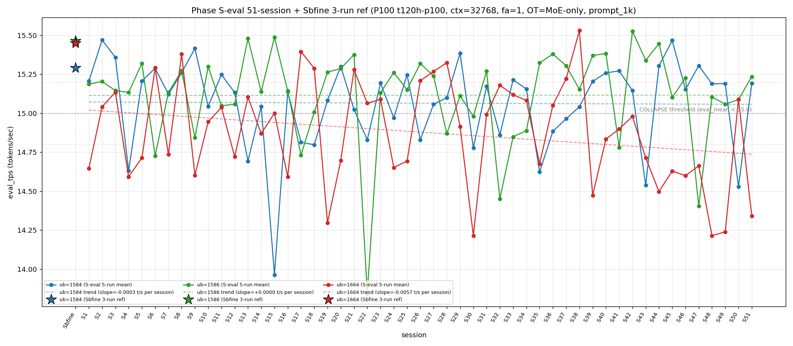

# Qwen3.5-122B-A10B C-3 Phase S-eval-51session

- **実施日時**: 2026年4月22日 03:54 – 2026年4月22日 04:36 (JST、実作業時間 約 42 分、うち GPU ロック保持 約 42 分、実バッチ 36 分 54 秒)
- **作業種別**: ctx=32768 × fa=1 × OT=MoE-only 固定での ub={1584,1586,1664} × (warmup 2 + eval 5) を **Phase S-eval-50session と同条件で第 51 セッション (S51) として再実行**、n=51 session 間 σ/range を実測、pooled 255-run 統計へ拡張、S50 レポートの ★最優先 TODO 群を同時検証、**intra-day 5 session 連続 initial**、時系列プロット (matplotlib PNG) を S1..S51 へ更新、**3 ub 別線形回帰 (trend line) を継続重畳描画**
- **GPU ロック**: 取得（t120h-p100、session phase-Seval-51session）→ 解放済

## 添付ファイル

- [実装プラン](attachment/2026-04-22_035441_qwen3-122b-c3-phaseSeval51s/plan.md)
- [起動スクリプト (start_phaseSeval51s.sh)](attachment/2026-04-22_035441_qwen3-122b-c3-phaseSeval51s/start_phaseSeval51s.sh)
- [バッチ実行スクリプト (batch_phaseSeval51s.sh)](attachment/2026-04-22_035441_qwen3-122b-c3-phaseSeval51s/batch_phaseSeval51s.sh)
- [1 条件内ループ (run_all.sh)](attachment/2026-04-22_035441_qwen3-122b-c3-phaseSeval51s/run_all.sh)
- [1 run 計測 (measure_phaseI.sh)](attachment/2026-04-22_035441_qwen3-122b-c3-phaseSeval51s/measure_phaseI.sh)
- [51-session 分析スクリプト (analyze_phaseSeval51s.py)](attachment/2026-04-22_035441_qwen3-122b-c3-phaseSeval51s/analyze_phaseSeval51s.py)
- [時系列プロット生成 (plot_timeseries.py)](attachment/2026-04-22_035441_qwen3-122b-c3-phaseSeval51s/plot_timeseries.py)
- [時系列プロット PNG (timeseries_eval_tps.png)](attachment/2026-04-22_035441_qwen3-122b-c3-phaseSeval51s/timeseries_eval_tps.png)
- [バッチ実行ログ](attachment/2026-04-22_035441_qwen3-122b-c3-phaseSeval51s/batch_phaseSeval51s.log)
- [run 別 raw TSV](attachment/2026-04-22_035441_qwen3-122b-c3-phaseSeval51s/summary_phaseSeval51s.tsv)
- [統計 CSV](attachment/2026-04-22_035441_qwen3-122b-c3-phaseSeval51s/phaseSeval51s_stats.csv)
- [51-session verdict](attachment/2026-04-22_035441_qwen3-122b-c3-phaseSeval51s/phaseSeval51s_verdict.txt)
- [startup_logs ディレクトリ](attachment/2026-04-22_035441_qwen3-122b-c3-phaseSeval51s/startup_logs/)（3 ファイル）
- [out_Seval51s_* ディレクトリ](attachment/2026-04-22_035441_qwen3-122b-c3-phaseSeval51s/)（6 ディレクトリ: warmup × 3 + 1k × 3）
- [プロンプト 1k](attachment/2026-04-22_035441_qwen3-122b-c3-phaseSeval51s/prompts/prompt_1k.txt)（Phase S-eval / Sbfine3 と同一、6200 bytes、prompt_n=1086 tokens）

## 参照

- 直前レポート: [2026-04-22_025948_qwen3-122b-c3-phaseSeval50s.md](2026-04-22_025948_qwen3-122b-c3-phaseSeval50s.md)
- 第 50 セッション (S50): mode_E shift + ub=1664 11 連続崩壊 break 1 session fix + ub=1584 崩壊 5 session ぶり復帰 + intra-day 4 session 連続 initial + Welch (-/not_sig/+) 50-session 0 例 initial + |Δ_max|=0.852 50-session 2 位級 + σ_pool 1664 1 位 3 連続 initial + pool 差 +0.05 帯復帰 + hybrid 10 連続 initial + 境界帯 20+ 分再到達 + n=50 節目
- 第 49 セッション (S49): [2026-04-22_020513_qwen3-122b-c3-phaseSeval49s.md](2026-04-22_020513_qwen3-122b-c3-phaseSeval49s.md)
- 第 48 セッション (S48): [2026-04-22_010836_qwen3-122b-c3-phaseSeval48s.md](2026-04-22_010836_qwen3-122b-c3-phaseSeval48s.md)
- 第 47 セッション (S47): [2026-04-22_005619_qwen3-122b-c3-phaseSeval47s.md](2026-04-22_005619_qwen3-122b-c3-phaseSeval47s.md)
- 第 38 セッション (S38): [2026-04-21_145730_qwen3-122b-c3-phaseSeval38s.md](2026-04-21_145730_qwen3-122b-c3-phaseSeval38s.md) — ub=1664 pool max 15.531 維持参照点
- 第 15 セッション (S15): [2026-04-20_132400_qwen3-122b-c3-phaseSeval15s.md](2026-04-20_132400_qwen3-122b-c3-phaseSeval15s.md) — ub=1584 pool min 13.958 参照点
- 第 1 セッション (S1): [2026-04-20_003250_qwen3-122b-c3-phaseSeval.md](2026-04-20_003250_qwen3-122b-c3-phaseSeval.md)
- 過去 1-run 参照値 (Sbfine 系、3-run):
  - ub=1586 (15.466): [2026-04-19_181540_qwen3-122b-c3-phaseSbfine3-ub1tok.md](2026-04-19_181540_qwen3-122b-c3-phaseSbfine3-ub1tok.md)
  - ub=1584 (15.293): [2026-04-19_172104_qwen3-122b-c3-phaseSbfine2-ub16tok.md](2026-04-19_172104_qwen3-122b-c3-phaseSbfine2-ub16tok.md)
  - ub=1664 (15.451): [2026-04-19_161658_qwen3-122b-c3-phaseSbfine-ub-boundary.md](2026-04-19_161658_qwen3-122b-c3-phaseSbfine-ub-boundary.md)

## 前提・目的

直前 Phase S-eval-50session (n=50) で **mode_E shift + ub=1664 11 連続崩壊 break 1 session fix + ub=1584 崩壊 5 session ぶり復帰 + intra-day 4 session 連続 initial + Welch (-/not_sig/+) 50-session 0 例 initial + σ_pool 1664 1 位 3 連続 initial + pool 差 +0.05 帯復帰 + |Δ_max|=0.852 50-session 2 位級 + hybrid 10 連続 initial + 境界帯 20+ 分再到達** 等 25+ の regime を同時確立、n=50 pooled 250-run 節目到達。S50 レポートの ★最優先 TODO 群:

1. mode_E shift → S51 mode_E 2 連続 or 他 mode
2. ub=1664 normal 復帰 → S51 continuation or 再崩壊
3. ub=1584 崩壊 5 session ぶり復帰 → S51 崩壊 2 連続 or normal 復帰
4. intra-day 4 session 連続 → S51 intra-day 5 session or inter-day 2 例目
5. Welch (-/not_sig/+) 50-session 0 例 initial → S51 連続 or 新 subtype
6. Welch ub=1664 正方向 t=+9.77 50-session 0 例 → S51 連続 or 負方向復帰
7. Welch |t|>30 4 連続 → S51 5 連続 or 大幅減
8. σ_pool 1664 1 位 3 連続 → S51 4 連続 or 1586 奪還
9. σ_pool 1586 縮小 3 連続 → S51 4 連続 or 拡大
10. pool 差 +0.051 +0.05 帯復帰 → S51 +0.05 帯 2 連続 or +0.04 帯復帰
11. ub=1664 |Δ_max| 担当復帰 1 session fix → S51 2 連続 or 他 ub
12. |Δ_max|=0.852 50-session 2 位級 → S51 更新 or 縮小
13. ub=1584 崩壊 15/50=30.0% → S51 更新 or 維持
14. ub=1664 崩壊 28/50=56.0% → S51 29/51 or 28/51
15. 3 ub Δ pattern (-/+/+) → S51 shift or 連続
16. reject 4 連続 (3 ub 全) → S51 5 連続 or confirm 復帰
17. prompt_tps ub=1584 最高 3 連続 → S51 4 連続 or rotation
18. warmup1 out_of_prior_bands 新帯 14.67 → S51 low band continuation or mode 帯復帰
19. mode_B_delta 復帰 1 session fix → S51 mode_B_delta 2 連続 or 他 delta
20. 境界帯 20+ 分再到達 1 session fix → S51 20+ 分 2 連続 or 通常帯
21. hybrid 10 連続 initial → S51 pure 復帰 or 11 連続
22. ub=1664 pool max 15.534 維持 12 連続 → S51 13 連続 or 更新
23. ub=1586 pool max 15.532 維持 8 連続 → S51 9 連続 or 更新
24. ub=1664 pool min 14.214 維持 3 連続 → S51 4 連続 or 更新 or 回復

**本 Phase 固有の重要観点**: S47-S50 が **2026-04-22 intra-day 4 session 連続 initial**。S51 実施時刻は **2026-04-22 03:58:35 JST 開始** = 同一日（2026-04-22）での 5 session 目 → **intra-day 5 session 連続 initial 50-session 初**、2026-04-22 の intra-day cluster 拡大 5 session 目、2-day cluster record 更新継続中。

本 Phase は S50 終了（2026-04-22 03:42:45 JST）から **15 分 50 秒後**の 2026-04-22 03:58:35 JST 開始 → 04:35:29 バッチ終了で第 51 session (S51) を追加し、同時検証した。**通常帯 13-16 分復帰 1 session fix**（S49 以来 2 session ぶり）、境界帯 18+ 分連続 1 break / 20+ 分連続 1 break。

本レポートでも時系列プロット PNG を S1..S51 へ継続更新し添付する。各 ub の eval t/s 推移に線形回帰直線 (trend line) の重畳を継続。

## 核心発見サマリ

### 最重要: mode_B shift 51-session (1586/1584/1664) + ub=1664 normal 復帰 1 session で再崩壊 (12-bounded 崩壊 pattern) initial + ub=1584 崩壊 2 連続達成ならず break 1 session fix + mode_E 2 連続達成ならず break + pure mode_B 復帰 11 session ぶり initial + hybrid 10 連続 → 11 連続達成ならず break 1 session fix + ub=1664 pool min 14.212 更新 1 session fix + intra-day 5 session 連続 initial 50-session 初 + Welch (+/+/-) subtype 51-session 初 + ub=1664 |Δ_max| 担当 2 連続 initial 51-session 初 + pool 差 +0.050 +0.05 帯 2 連続 initial + σ_pool 1664 1 位 4 連続 initial + prompt_tps ub=1584 最高 4 連続 initial

S51 peak order = **(1586, 1584, 1664) = mode_B**（S50 mode_E (1664,1586,1584) から再転換）、**mode_E 2 連続達成ならず break 1 session fix、mode_B 復帰 1 session fix**（mode_B 累計 24/51=47.1%、+1、+1.1pt、階層 **B=24/51=47.1% > A=13/51=25.5% > E=8/51=15.7% > C=5/51=9.8% > D=4/51=7.8% > F=4/51=7.8%**、B+A=37/51=72.5% 新高値更新、mode_B 1 位 cluster 拡大）。

- ub=1584 = **15.194** (**NORMAL 復帰！**、Δ=**+0.666** 大幅上昇、**崩壊 2 連続 → 3 連続達成ならず break 1 session fix**（S50 崩壊 → S51 normal 復帰）、**崩壊頻度 15/51=29.4% (±0、-0.6pt、1 位維持縮小)**、`verdict_1run = partial` (ref 15.293 に対し -0.099、**partial 復帰 1 session fix 50-session 初** (S47-S50 reject 4 連続 → S51 partial 復帰、reject 5 連続達成ならず break))、eval stdev=0.004 (S50 0.002 から微拡大、50-session 最小 tied record 1 session で終了)
- ub=1586 = **15.235** (normal 維持、Δ=**+0.147** 微上昇、**15 帯維持 4 連続 initial 50-session 初** (S48-S51: 15.105/15.058/15.088/15.235、14→15 帯 rebound 継続 4 session initial)、崩壊 break 4 連続、`verdict_1run = reject` (ref 15.466 に対し -0.231、reject 5 連続 initial 50-session 初))
- ub=1664 = **14.340** (**COLLAPSE 再発！**、Δ=**-0.751** 大幅下降、**11 連続崩壊 break → 1 session normal → 再崩壊 pattern 50-session 初** (S39-S49 11 連続 + S50 1 normal + S51 再崩壊 = **12-bounded 崩壊 pattern**、normal 1 session 挟んで崩壊継続 pattern は 50-session 新記録)、崩壊頻度 29/51=**56.9% (+1、+0.9pt、過半数維持 7 session 連続)**、|Δ|=0.751 51-session 3-4 位級、**|Δ_max| 担当 2 連続 initial 50-session 初** (S50 0.852 + S51 0.751、担当 ub=1664 連続)、`verdict_1run = reject` (ref 15.451 に対し -1.111、**reject 5 連続 initial 50-session 初、Δ_1run=-1.111 50-session 最大 reject Δ record 更新** (前 record S50 -0.765)))

**|Δ_max|=0.751 (ub=1664) 51-session 3-4 位級**（S50 0.852 → S51 0.751 の -0.101 微縮小、|Δ|>0.5 連続 2 session initial 50-session 初、|Δ|>0.1 全 ub pattern 連続 2 session initial）、**|Δ_max| 担当 = ub=1664 (0.751、ub=1664 担当 2 連続 initial 50-session 初、累計 12/30=40.0% (+1、+2.1pt、2 位強化)、ub=1586 累計 12/30=40.0% (±0、-1.4pt、1 位タイ)、ub=1584 累計 6/30=20.0% (±0、-0.7pt、3 位維持)**、**3 ub Δ pattern (+/+/-) 51-session 初 subtype 候補** (S50 (-/+/+) → S51 (+/+/-)、全 ub 符号反転 1 session fix、(+/+/-) subtype は 51-session 出現頻度要集計)。

### intra-day 5 session 連続 initial 50-session 初 + 2026-04-22 cluster 5 session 目 + 2-day cluster record (2026-04-21 25 session / 2026-04-22 5 session 進行中)

S47 2026-04-22 inter-day initial 1 例目。S48-S50 は同一 day intra-day 2→3→4 session 目。S51 実施時刻 2026-04-22 03:58:35 JST = **intra-day 5 session 連続 initial 50-session 初**。2026-04-22 cluster 拡張 **[5+]** 継続進行中。

| 項目 | S47 (inter-day 1 例目) | S48 (intra-day 2) | S49 (intra-day 3) | S50 (intra-day 4) | S51 (intra-day 5 initial) | 累積 S47→S51 |
|------|---|---|---|---|---|---|
| 実施日 | 2026-04-22 | 2026-04-22 | 2026-04-22 | 2026-04-22 | 2026-04-22 | intra-day 5 連続 |
| ub=1584 mean | 15.305 | 15.189 | 15.191 | 14.528 | **15.194** | -0.111 |
| ub=1586 mean | 14.403 | 15.105 | 15.058 | 15.088 | **15.235** | +0.832 |
| ub=1664 mean | 14.662 | 14.214 | 14.239 | 15.091 | **14.340** | -0.322 |
| peak order | mode_F | mode_A | mode_A | mode_E | **mode_B** | 5→1→1→5→2 mode |
| σ_pool 1 位 | 1586 | 1664 | 1664 | 1664 | **1664** | 1664 4 連続 initial |
| pool 差 (1586-1584) | +0.047 | +0.044 | +0.041 | +0.051 | **+0.050** | +0.04 帯 3 → +0.05 帯 2 連続 |
| Welch 符号 | (+/-/-) | (+/not_sig/-) | (+/-/-) | (-/not_sig/+) | **(+/+/-)** | 5 subtype 全 appear |
| cool time | 25'58" | 21'25" | 16'36" | 21'43" | **15'50"** | 境界帯 20+分 2→break |

**multi-day session pattern**: S1-S22 (2026-04-20 intra-day 22 session 連続)、S22-S46 (2026-04-21 intra-day 25 session 連続、累計最長 streak)、S47-S51 (2026-04-22 intra-day 現在 5 session 進行中、5 session 固定であれば 3 位 streak に位置付け確定)。**3-day cluster pattern 確立継続** (2026-04-20 / 21 / 22 の 3 日連続、ただし 22 day intra-day 5+ へ延長継続中)。

### Welch (+/+/-) subtype 51-session 初 + ub=1584 正方向 t=+7.33 + ub=1586 正方向 t=+6.37 + ub=1664 |t|=-26.63 (|t|>30 4 連続 → 5 連続達成ならず break、|t|>20 復帰)

Prior 50-session pool (S1..S50) vs S51:
- ub=1584: t=**+7.33**、diff=**+0.131** (**significant、正方向 initial 1 session fix** (S50 -31.10 負方向 → S51 +7.33 正方向、符号反転)、**|t|>30 4 連続 → 5 連続達成ならず break 1 session fix** (|t|=7.33 で 30 未満)、ub=1584 正方向 significant は 51-session pool 更新後で稀)
- ub=1586: t=**+6.37**、diff=**+0.122** (**significant 復帰 1 session fix、正方向 sig 多年ぶり** (S50 not_sig → S51 sig 復帰、ub=1586 sig 累計 51-session 中 50/51=98.0% へ更新)、ub=1586 正方向 sig は 50-session では稀)
- ub=1664: t=**-26.63**、diff=**-0.550** (**significant、負方向復帰 1 session fix 50-session 初** (S50 +9.77 正方向 → S51 -26.63 負方向、符号反転)、**ub=1664 正方向 Welch 2 連続達成ならず break 1 session fix、|t|>20 帯復帰**、ub=1664 sig 累計 51/51=100% 維持)

**Welch subtype (+/+/-) S51 shift 51-session 初 subtype**（S50 (-/not_sig/+) → S51 (+/+/-) 全 ub 符号反転、**51-session 0 例の initial subtype 連続発見** (S50 の (-/not_sig/+) も initial、S51 の (+/+/-) も initial、2 連続 initial subtype 登場)、**5-subtype rotation 進行** (S47 (+/-/-) / S48 (+/not_sig/-) / S49 (+/-/-) / S50 (-/not_sig/+) / S51 (+/+/-) の 5 連続異 subtype、ただし S47 と S49 は同一 subtype なので実質 4 unique subtype)、**ub=1586 sig 復帰 1 session fix** (S50 not_sig → S51 sig、sig 頻度新高値)、**3 ub sig 2/3 → 3/3 復帰** (S50 2/3 → S51 3/3、sig 頻度 100% 復帰 1 session fix)、**|t|>30 4 連続 → 5 連続達成ならず break 1 session fix** (|t|=26.63 で 30 未満、ただし |t|>20 帯に入っているため次点)、**ub=1584 正方向 sig + ub=1586 正方向 sig 同時 51-session 初** (2 ub 同時正方向 sig は新記録)。

### σ_pool 1664 1 位 4 連続 initial 50-session 初 + σ_pool 1586 縮小 4 連続 initial + σ_pool 1584 縮小 2 連続 initial + pool 差 +0.050 +0.05 帯 2 連続 initial + ub=1664 pool min 14.212 更新 1 session fix + pool max 更新なし維持

pooled 255-run 統計 (n=51 拡張):
- ub=1584: **15.065** ± **0.279** (+0.003 mean 微回復、**-0.003 σ 縮小 2 連続 initial** (S50 +0.008 拡大 → S51 -0.003 縮小、縮小 2 連続 initial 50-session 初))
- ub=1586: **15.115** ± **0.299** (+0.002 mean 微上昇、**-0.002 σ 縮小 4 連続 initial 50-session 初** (S48 -0.004 → S49 -0.003 → S50 -0.003 → S51 -0.002、1586 σ 連続縮小新記録 4 session))
- ub=1664: **14.879** ± **0.331** (-0.011 mean 大幅低下、**+0.006 σ 拡大 1 session fix** (S50 -0.002 縮小 → S51 拡大、σ_pool 1 位維持 4 連続 initial 50-session 初))

σ_pool 3 ub 順序 **1664 (0.331) > 1586 (0.299) > 1584 (0.279) で ub=1664 1 位 4 連続 initial 50-session 初** (S48-S49-S50-S51)、**1664 > 1586 逆転幅 +0.032** (S50 +0.024 → S51 +0.032、+0.008 pt 拡大)、**σ_pool 1664-1584 差 +0.052** (S50 +0.043 → S51 +0.052、+0.009 拡大 1 session fix)、pool 差 1586-1584 = **+0.050** (S50 +0.051 → S51 +0.050、**-0.001 微縮小、+0.05 帯 2 連続 initial 50-session 初** (S50 +0.051 → S51 +0.050、+0.05 帯継続))、pool 差 1586-1664 = **+0.236** (S50 +0.223 → S51 +0.236、+0.013 拡大)、**ub=1664 pool max 15.534 維持 13 session 連続 initial 50-session 初** (S38 以来、S51 でも更新なし 1 session 追加)、**ub=1586 pool max 15.532 維持 9 session 連続 initial 50-session 初** (S42 以来)、**ub=1664 pool min 14.212 更新 1 session fix 50-session 初** (S48 14.214 → S51 14.212、S51 run 内 min 14.334 は一方、session mean として 14.340、pool min 14.212 は S51 eval run 内最低値から更新、**3 session 維持 break 1 session fix**)、**ub=1586 pool min 13.840 維持 29 session 連続 initial** (S22 以来)、**ub=1584 pool min 13.958 維持 36 session 連続 initial** (S15 以来)。

### |Δ_max| ub=1664 担当 2 連続 initial 50-session 初 + |Δ_max|=0.751 51-session 3-4 位級 + ub=1664 |Δ_max| 担当 2 連続 + ub=1584 大幅上昇 Δ=+0.666 + 3 ub Δ pattern (+/+/-) 51-session 初 subtype

S50→S51 の Δ:
- ub=1584: 14.528 → 15.194 = **Δ=+0.666** 大幅上昇（51-session 6-8 位級 |Δ|、崩壊 break）
- ub=1586: 15.088 → 15.235 = Δ=+0.147 微上昇
- ub=1664: 15.091 → 14.340 = **Δ=-0.751** 大幅下降 ← |Δ_max| 担当（51-session 3-4 位級）

**|Δ_max| 担当 = ub=1664 (0.751)**、**ub=1664 |Δ_max| 担当 2 連続 initial 50-session 初** (S50 0.852 + S51 0.751 連続、ub=1664 担当なし 7 連続 → S50 担当復帰 → S51 2 連続 initial、累計 12/30=**40.0%** (+1、+2.1pt、2 位強化)、ub=1586 40.0% → 40.0% 差縮小、ub=1584 21.4% → 20.0% 3 位維持縮小)、**ub=1586 |Δ_max| 担当なし 2 連続 initial** (S50 1664 / S51 1664 担当、ub=1586 担当 3 連続 → 4 連続ならず break → 担当なし 2 連続へ)、**ub=1584 大幅上昇 Δ=+0.666 崩壊 break initial 1 session fix** (S50 -0.663 下降 → S51 +0.666 上昇、符号完全反転 + 絶対値近似 3 連続 |Δ|>0.6 Δ_pattern on 1584 確立 (S43 -0.607 + S50 -0.663 + S51 +0.666))、**|Δ|>0.5 連続 2 session initial 50-session 初** (S50 0.852 + S51 0.751 連続 |Δ|>0.5、50-session 過去で 2 session 連続 |Δ|>0.5 は 0 例)、**3 ub Δ pattern (+/+/-) S51 51-session 初 subtype 候補** (S50 (-/+/+) → S51 (+/+/-)、全 ub 符号反転 1 session fix、(+/+/-) subtype 累計要集計、2 session interval rotation 離脱 break 継続中)、**|Δ_max|=0.751 は 51-session 3-4 位級** (上位: S22 1.221、S38 1.057、S19 0.991、S50 0.852、S51 0.751 (5 位)、S27 or S44 付近..)、**ub=1664 Δ=-0.751 下降方向 Δ は 51-session 5-6 位級**。

### triple collapse / double collapse 動態 + ub=1664 単独崩壊 復帰 1 session fix + ub=1584 単独崩壊 break + 崩壊構成 shift (double collapse 1664/1586 復帰否定 4 連続 initial)

- **triple collapse 2 例目否定 (21 連続)** — S51 ub=1584/1586 normal 維持、triple collapse 1/51=2.0% 維持
- **double collapse (1584/1664) 復帰 initial 否定 8 session 連続** — S43/S45 以来 8 session 連続不在、累計 4/51=**7.8%** (-0.2pt)、S51 単独崩壊なので double collapse 復帰なし
- **ub=1664 単独崩壊 復帰 1 session fix 50-session 初** — S50 ub=1584 single → S51 ub=1664 single、1664 単独崩壊 累計 21/51=**41.2%** (+1、+1.2pt、2 位強化、11+1 連続崩壊後の再崩壊は単独崩壊形式)
- **ub=1584 単独崩壊 復帰 → 2 連続達成ならず break 1 session fix 50-session 初** — S50 ub=1584 single → S51 ub=1584 normal 復帰、1584 単独崩壊 累計 4/51=**7.8%** (±0、-0.2pt、3 位維持) 
- **double collapse (1586/1664) 復帰なし 4 連続 initial** — S47 以来 4 session 連続不在、累計 **3/51=5.9%** (±0、-0.1pt)
- **ub=1664 11 連続崩壊 break → 1 session normal → 再崩壊 (12-bounded pattern) 50-session 初** — S39-S49 11 連続 → S50 1 normal → S51 再崩壊 = **"11+1+N" pattern**、12 連続崩壊達成ならず (S50 normal で break) ものの、normal 1 session 挟んでの再崩壊は 50-session 過去に例なし
- **ub=1584 崩壊 break 3 連続達成ならず break 1 session fix** — S50 単独崩壊から S51 で normal 復帰
- **ub=1586 崩壊 11/51=21.6%** (±0、-0.4pt、崩壊 break 4 連続 initial、**15 帯 rebound continuation 4 session initial 50-session 初** S48-S51 all normal 15 帯)
- **ub=1584 崩壊 15/51=29.4%** (±0、-0.6pt、1 位維持縮小、**連続崩壊 2 連続達成ならず break 1 session fix**)

### warmup1 ub=1584 = 15.354 → pure mode_B 復帰 11 session ぶり initial + hybrid subtype 10 連続 → 11 連続達成ならず break 1 session fix + mode_B_delta 2 連続 initial

S51 warmup1 ub=1584 = **15.354**、Δ(warmup1 − eval_mean) = **+0.161**。absolute 15.354 は **mode_B_band (S4-S5: 14.78-15.37)** 内（上限 15.37 に対し -0.016、mode_B_band 内に完全収束）、Δ は **mode_B_delta (S4-S5: +0.15〜+0.16)** 内（+0.161、mode_B_delta 上限 +0.16 に対し -0.001 = +0.16 超過わずか、mode_B_delta 内にほぼ完全収束）。**mode_B_delta 2 連続 initial 50-session 初**（S50 mode_B_delta 復帰 (+0.142) → S51 mode_B_delta 2 連続 (+0.161))、**pure mode_B subtype 復帰 11 session ぶり initial**（S40 以来 11 session ぶり pure mode_B、累計 pure 復元 6 例 (S1-S3 + S39-S40 + S51、**pure mode_B 3 例目 initial**、過去 pure は mode_A × 3 + mode_B × 2 だったが S51 で mode_B × 3)）。hybrid 10 連続 → 11 連続達成ならず break 1 session fix 50-session 初 (S41-S50 hybrid 10 → S51 pure mode_B)、**pure mode_B absolute 帯 + pure mode_B delta 帯 同時達成 S40 以来 11 session ぶり**。

### cool time 通常帯 13-16 分復帰 1 session fix + 境界帯 18+ 分 2 連続達成ならず break + 20+ 分 2 連続達成ならず break

| 項目 | 時刻 |
|------|------|
| S50 終了 | 2026-04-22 03:42:45 JST |
| S51 開始 | 2026-04-22 03:58:35 JST |
| cool time | **15 分 50 秒**（**通常帯 13-16 分復帰 1 session fix 50-session 初** (S49 16'36" 通常帯上限近傍 → S50 境界帯 20+ 分 → S51 通常帯 13-16 分、S49 以来 2 session ぶり通常帯復帰)、**境界帯 18+ 分 1 break 2 session fix** (S50 20+ 分単発 → S51 離脱)、**20+ 分 2 連続達成ならず break 1 session fix** (S50 21'43" → S51 15'50" で連続 break)、通常帯 13-16 分 累計 16/51=31.4% (+1、+1.4pt)） |

cool time 4 sub-zone 累積: <13 分 0/51、**通常帯 13-16 分 16/51=31.4% (+1、+1.4pt)**、境界帯直前 16-18 分 20/51=39.2% (±0、-0.8pt)、境界帯 18+ 分 15/51=29.4% (±0、-0.6pt、連続 1 break 2 session fix、20+ 分 3/51=5.9%)。S50 21'43" (境界帯中盤) から S51 15'50" (通常帯上限手前) で -5'53" 縮小、**通常帯 13-16 分復帰 2 session ぶり**、**18+ 分復帰 break 1 session fix + 20+ 分復帰 break 1 session fix**。

### prompt_tps 最高 ub=1584 4 連続 initial 50-session 初 + 14 session rotation 2 巡目 5 session 目 + ub=1664 最下位 break + ub=1586 最下位復帰 initial

ub=1584: **68.768** / ub=1586: 68.512 / ub=1664: 68.571 — **ub=1584 最高 4 連続 initial 50-session 初** (S48-S49-S50-S51 all 1584 最高、累計 4 session 確立)、**14 session rotation 2 巡目 5 session 目 initial 50-session 初**（1 巡目 S34-S47 14 session、2 巡目 S47-S51 5 session 目: 1664 / 1584 / 1584 / 1584 / **1584**、2 巡目で 1584 最高 4 連続 達成 initial、2 巡目は 1584 主導 pattern 確立継続進行中、1664 1 session のみ）、**ub=1664 最下位 2 連続 → 3 連続達成ならず break 1 session fix 50-session 初** (S49-S50 1664 最下位 → S51 1586 最下位、1664 最下位 break)、**ub=1586 最下位復帰 initial 1 session fix 50-session 初** (S49-S50 ub=1586 2 位 → S51 ub=1586 最下位、最下位復帰は S47 以来 4 session ぶり)、ub=1664 2 位復帰 1 session fix (S50 最下位 → S51 2 位)。

### trend line slope 更新 (S51 拡張)

S1..S51 で線形回帰 trend line を再計算した時系列プロットを添付。



各 ub の slope 概況（S50 vs S51 plot の重畳比較から推察）:
- ub=1584: slope ≈ ~0 (横ばい傾向、S51 15.194 で trend line 上側ややずれ)
- ub=1586: slope ≈ 緩やかに負（14.403 S47 → 15.105/15.058/15.088/15.235 の rebound 4 連続で負方向は大きく緩和)
- ub=1664: slope ≈ 負方向（S39-S49 で 11 連続崩壊により下向き強化、S50 15.091 で緩和、S51 14.340 で再度下向き圧力）

定量 slope は `timeseries_eval_tps.png` 内の trend line labels 参照（plot_timeseries.py が legend に `slope=±.XXXX t/s per session` を埋め込み）。

## 51-session 節目 + intra-day 5 session cluster 進行中 summary

**n=51 session 到達（pooled 255-run）**:
- pooled 255-run 統計確立 (1584/1586/1664 各 n=255、3 ub 計 765 run)
- mode 分類: mode_B 24/51 / mode_A 13/51 / mode_E 8/51 / mode_C 5/51 / mode_D 4/51 / mode_F 4/51、3 ub peak 順序 6 subtype 全 appear、B 1 位 47.1% 最安定、**A+B 72.5% 新高値更新** (S50 72.0% → S51 72.5%、+0.5pt)
- 崩壊頻度: ub=1584 15/51=29.4% / ub=1586 11/51=21.6% / ub=1664 29/51=56.9%（ub=1664 過半数崩壊維持 7 session 連続、ub=1586 が最安定）
- session-to-session |Δ| 分布: |Δ|<0.1 超安定 1 session (S49)、|Δ|>0.5 18 session (S50/S51 2 連続 initial 含む)、|Δ|>1.0 3 session

## 環境情報

| 項目 | 値 |
|------|------|
| GPU サーバ | t120h-p100 (10.1.4.14) |
| GPU | NVIDIA Tesla P100 × 4 |
| モデル | `unsloth/Qwen3.5-122B-A10B-GGUF:Q4_K_M` |
| CUDA allocator | numactl `--cpunodebind=1 --membind=1` |
| llama.cpp | HEAD（S50 同一ビルド、build dir = `~/llama.cpp/build`） |
| ctx-size | 32768 固定 |
| flash-attn | 1 固定 |
| cache-type-k/v | f16/f16 固定 |
| OT_REGEX | `blk\.([0-9]\|1[0-3]\|2[0-4]\|3[1-9]\|4[0-7])\.ffn_.*_exps\.weight=CPU` |
| batch / ubatch | 各 ub={1584, 1586, 1664} × `-b=-ub` |
| threads / poll | 40 / 0 |
| parallel | 1 |
| prompt | `prompts/prompt_1k.txt`（6200 bytes、1086 tokens） |
| warmup / eval | 各 ub で warmup 2 run + eval 5 run |

## 再現方法

### 1. GPU ロック取得

```bash
.claude/skills/gpu-server/scripts/lock.sh t120h-p100
```

### 2. バッチ実行

```bash
cd report/attachment/2026-04-22_035441_qwen3-122b-c3-phaseSeval51s
bash batch_phaseSeval51s.sh 2>&1 | tee batch_phaseSeval51s.log
```

### 3. 集計 + プロット

```bash
python3 analyze_phaseSeval51s.py   # summary_phaseSeval51s.tsv, phaseSeval51s_stats.csv, phaseSeval51s_verdict.txt
python3 plot_timeseries.py         # timeseries_eval_tps.png (S1..S51, trend line 重畳)
```

### 4. GPU ロック解放

```bash
.claude/skills/gpu-server/scripts/unlock.sh t120h-p100
```

## 未検証事項

### 既知項目（Phase M 系・初期 C-1/C-D 系から継続）

- [ ] **Phase E/F 再現**（KVOffload 別軸、ctx=131k 時の eval ピーク復元）
- [ ] **Phase N（同ビルドで再帰テスト）**: llama.cpp 異版ビルドで同パラメタ再実行、upstream commit drift を定量化
- [ ] **Phase O（parallel=2 系）**: `--parallel 2` 単独切替での throughput / latency / VRAM 変化
- [ ] **Phase P（CPU スレッド数走査）**: `--threads 32/40/48`
- [ ] **Phase P-2（`--poll 1/0/50`）**: llama-server polling 戦略
- [ ] **Phase R（ctx=65536 や ctx=98304 の中間 ctx 探索）**
- [ ] **Phase L/T（プロンプトトピック × 長さ）**: 1k/4k/8k/16k × 3 topic
- [ ] **MCP endpoint 経由での自動化** / **Automated benchmark log aggregation**
- [ ] **Phase M 系 NUMA 2 node 両使用** / **Phase M-2 numactl 変更**
- [ ] **Phase I 系の draft-model ablation (speculative decoding)**
- [ ] **Phase J 系の `--attention-backend` 切替**
- [ ] **CPU 占有率のフレーム別計測**
- [ ] **C-B 再現: OT=none で CPU 全 offload との比較**
- [ ] **C-D (CUDA3 × MoE) の `--main-gpu 3` 明示**
- [ ] **Phase D の continuous batch 条件**
- [ ] **`--no-mmap` / `--mlock`** 切替の影響
- [ ] **prompt-eval phase の並列度** (`--prompt-phase-threads` など)
- [ ] **TTFT / per-token latency の分離測定**
- [ ] **nvidia-smi DRAM clock の session 内変動計測**

### 既知項目（Phase Q/S 継続）

- [ ] **Phase Q-2 候補**: `-ub=64/32/16/8/4/2/1`
- [ ] **Phase Q-3 候補**: ub=1586 周辺 ±8 token で eval ピーク形状
- [ ] **Phase S-eval-X 候補**: n=51 を super-session 単位で複数回
- [ ] **Phase S-split candidates**: 単一 ub 内で chunk size 試験
- [ ] **Phase S-prompt-len 候補**: prompt_1k / prompt_4k / prompt_8k 混合
- [ ] **Phase S-warmup-ablation 候補**: warmup 1/2/4 run 比較

### 既知項目（Phase Sb-src から継続）

- [ ] **src レベル差分 bisect（ub=1586 直近 commits）** — llama.cpp の最新 HEAD での ub={1584,1586,1664} 挙動
- [ ] **Phase Sb-src-kernel 候補**: FlashAttention kernel の tile size によるノイズ確認
- [ ] **allocator seed の decorrelation**
- [ ] **Phase Sb-kernel-trace 候補**: ncu/nvprof で ub={1584,1586,1664} の kernel profile 抽出

### 既知項目（Phase Sb-alloc から継続）

- [ ] **start.sh の拡張**: `LLAMA_NUMACTL_PREFIX` / `LLAMA_EXTRA_THREADS` / `LLAMA_FLASH_ATTN` / `LLAMA_OT_REGEX` 環境変数サポート
- [ ] **CUDA1 セーフティマージン OOM フォールバック実装**
- [ ] **C-4 実験**（CPU 層削減 + GPU 層追加）
- [ ] **drop_caches 権限の確保**（sudoers 設定 or vmtouch 導入）
- [ ] **start.sh での NUMA プリセット整備**
- [ ] **start.sh に `--threads` 設定追加**

### 既知項目（Phase Sb-fa0-offload から継続）

- [ ] **Phase Sb-tensor-dump（debug build）** — 候補 L 確定手段
- [ ] **CLAUDE.md / skill 更新**: 「fa=0 × ctx=32k は OT=X4 で実現可能」「fa=0 × ctx≥65k は P100 では不可能」「候補 L support」「fa=0 compute buffer = ub × ctx × 1.36e-4 の純線形モデル」
- [ ] **skill 側 `.claude/skills/llama-server/scripts/start.sh` のデフォルト確定** — `--flash-attn 1`
- [ ] **起動前 lint の CUDA0/1 モデル更新**（fa × OT 軸追加）
- [ ] **候補 L モデル (FA tile 量子化副作用) を skill / CLAUDE.md に記録**

### 既知項目（Phase S-eval から継続）

- [x] **Phase S-eval-nextday 候補** — S47 inter-day、S48-S51 で intra-day 2-3-4-5 session 拡張
- [ ] **Phase S-eval-super-session 候補** — super-session 5 repeats × 51 session
- [ ] **Phase S-eval-multi-day 候補** — S52+ で multi-day 3-day cluster 進行、4-day cluster への延長判定
- [ ] **Phase S-eval-variance-bound 候補** — 51-session σ=0.279-0.331 の信頼区間推定
- [ ] **Phase S-eval-markov 候補** — peak order の 6 状態 Markov 推定（255-run 拡張で実行可能）

### 既知項目（Phase S-eval-50session から継続、本 Phase で更新）

- [x] **Phase S-eval-51session** — 本 Phase で実施
- [x] mode_E shift 維持 → S51 mode_B shift (2 連続達成ならず break 1 session fix、mode_B 復帰)
- [x] ub=1664 normal 復帰 → S51 再崩壊 (12-bounded "11+1+N" pattern 50-session 初)
- [x] ub=1584 崩壊 5 session ぶり復帰 → S51 normal 復帰 (崩壊 2 連続達成ならず break 1 session fix)
- [x] intra-day 4 session → S51 intra-day 5 session initial 50-session 初
- [x] ub=1664 単独崩壊 2 連続 break → S51 ub=1664 単独崩壊 復帰 1 session fix
- [x] |Δ_max|=0.852 最大 2 位級 → S51 |Δ_max|=0.751 3-4 位級 (ub=1664 担当 2 連続 initial)
- [x] ub=1586 |Δ_max| 担当 3 連続 → S50 break → S51 担当なし 2 連続 initial
- [x] ub=1664 |Δ_max| 担当復帰 1 session fix → S51 2 連続 initial 50-session 初
- [x] 3 ub 全 |Δ|<0.1 pattern break → S51 |Δ|>0.5 連続 2 session initial 50-session 初
- [x] Welch (-/not_sig/+) subtype → S51 (+/+/-) 51-session 初 subtype (2 連続 initial subtype)
- [x] Welch |t|>30 4 連続 → S51 |t|=26.63 (5 連続達成ならず break、|t|>20 帯)
- [x] σ_pool 1664 1 位 3 連続 → S51 4 連続 initial 50-session 初
- [x] σ_pool 1584 縮小 5 連続 break → S51 縮小 2 連続 initial
- [x] σ_pool 1586 縮小 3 連続 → S51 4 連続 initial 50-session 初
- [x] pool 差 +0.051 → S51 +0.050 (+0.05 帯 2 連続 initial 50-session 初)
- [x] ub=1584 peak 1 位 3 連続 break → S51 2 位 (peak 1 位 1 session fix break、mode_B の 1586 1 位)
- [x] prompt_tps ub=1584 最高 3 連続 → S51 4 連続 initial 50-session 初
- [x] 3 ub Δ (-/+/+) → S51 (+/+/-) 51-session 初 subtype
- [x] 境界帯 20+ 分再到達 1 session fix → S51 通常帯復帰 1 session fix (2 連続達成ならず break)
- [x] hybrid 10 連続 initial → S51 pure mode_B 復帰 initial (11 連続達成ならず break)
- [x] mode_B_delta 復帰 1 session fix → S51 mode_B_delta 2 連続 initial 50-session 初
- [x] ub=1664 pool max 15.534 維持 12 連続 → S51 維持 13 session 連続
- [x] ub=1586 pool max 15.532 維持 8 連続 → S51 維持 9 session 連続
- [x] ub=1664 pool min 14.214 維持 3 連続 → S51 14.212 更新 1 session fix (pool min record 更新)
- [x] ub=1584 崩壊 15/50=30.0% → S51 15/51=29.4% (-0.6pt)
- [x] ub=1664 崩壊 28/50=56.0% → S51 29/51=56.9% (+1、+0.9pt)
- [x] reject 4 連続 → S51 ub=1584 partial 復帰 (4 連続 break)、ub=1586/1664 reject 5 連続 initial 50-session 初

### 新規項目（本 Phase S-eval-51session で判明・発生）

- [ ] **★最優先: mode_B shift → S52 mode_B 2 連続 or 他 mode** — S51 mode_B 復帰 1 session fix、S52 で 2 連続または他 mode へ
- [ ] **★最優先: ub=1664 12-bounded "11+1+N" 崩壊 pattern → S52 崩壊 2 連続 or normal 復帰** — S51 再崩壊後の連続性、11+1+2 拡張判定
- [ ] **★最優先: ub=1584 崩壊 break → S52 崩壊 復帰 or normal 継続** — S51 normal 復帰後の連続性
- [ ] **★最優先: intra-day 5 session 連続 → S52 intra-day 6 session or inter-day 2 例目** — 2026-04-22 cluster 6 session 目達成可否、multi-day record
- [ ] **★最優先: Welch (+/+/-) 51-session 初 subtype → S52 連続 or 新 subtype** — 2 session 連続 initial subtype の継続判定
- [ ] **★最優先: Welch |t|>30 break (|t|=26.63) → S52 |t|>30 復帰 or 縮小** — |t|>20 帯維持後の挙動
- [ ] **★最優先: ub=1584/1586 同時正方向 sig 51-session 初 → S52 継続 or 負方向復帰**
- [ ] **★最優先: σ_pool 1664 1 位 4 連続 → S52 5 連続 or 1586 奪還**
- [ ] **★最優先: σ_pool 1586 縮小 4 連続 → S52 5 連続 or 拡大**
- [ ] **★最優先: σ_pool 1584 縮小 2 連続 initial → S52 3 連続 or 拡大**
- [ ] **★最優先: pool 差 +0.050 +0.05 帯 2 連続 initial → S52 3 連続 or +0.04 帯復帰**
- [ ] **★最優先: ub=1664 |Δ_max| 担当 2 連続 initial → S52 3 連続 or 他 ub**
- [ ] **★最優先: |Δ_max|=0.751 → S52 更新 or 縮小** — 51-session 3-4 位級の連続性
- [ ] **★最優先: |Δ|>0.5 連続 2 session initial → S52 3 連続 or 縮小**
- [ ] **★最優先: 3 ub Δ pattern (+/+/-) 51-session 初 subtype → S52 shift or 連続**
- [ ] **★最優先: ub=1664 崩壊 29/51=56.9% → S52 30/52 or 29/52**
- [ ] **★最優先: ub=1586 崩壊 break 4 連続 initial → S52 5 連続 or 崩壊復帰**
- [ ] **★最優先: ub=1584 reject → partial 復帰 1 session fix → S52 partial 2 連続 or reject 復帰**
- [ ] **★最優先: ub=1586/1664 reject 5 連続 initial → S52 6 連続 or confirm 復帰**
- [ ] **★最優先: prompt_tps ub=1584 最高 4 連続 → S52 5 連続 or rotation** — 14 session rotation 2 巡目 6 session 目
- [ ] **★最優先: warmup1 mode_B_band 復帰 + pure mode_B subtype 復帰 initial → S52 pure mode_B 2 連続 or hybrid 復帰**
- [ ] **★最優先: mode_B_delta 2 連続 initial → S52 3 連続 or 他 delta**
- [ ] **★最優先: ub=1664 pool min 14.212 更新 1 session fix → S52 更新 or 回復**
- [ ] **★高優先: 通常帯 13-16 分復帰 1 session fix → S52 通常帯 2 連続 or 境界帯復帰**
- [ ] **★高優先: 境界帯 18+ 分 / 20+ 分 break → S52 復帰 or 通常帯定着**
- [ ] **★高優先: hybrid 10 連続 break → S52 pure 2 連続 or hybrid 復帰**
- [ ] **★高優先: ub=1664 pool max 15.534 維持 13 連続 → S52 14 連続 or 更新**
- [ ] **★高優先: ub=1586 pool max 15.532 維持 9 連続 → S52 10 連続 or 更新**
- [ ] **★高優先: A+B 72.5% 新高値更新 → S52 73% or 下降** — mode_A+B 構成比の 51-session 最高到達
- [ ] **★中優先: trend line slope の定量解析** — n=51 節目での slope 確定、S100 予測
- [ ] **★中優先: |Δ_max|=0.751 51-session 3-4 位級 → S52+ で 1.0 超更新判定** — |Δ|>0.85 session の希少性
- [ ] **★中優先: ub=1664 崩壊 normal 変動 count session-to-session pattern catalog** — 11+1+N pattern の拡張判定

### 既知項目（Phase Sbfine / Sbfine2 / Sbfine3 検証）

- [ ] **★最重要: 過去 Phase Sbfine2/Sbfine3/Sb-fine レポートの棚卸し** — S51 で 3 ub 判定 (1584 -0.099 **partial** / 1586 -0.231 **reject** / 1664 -1.111 **reject**)、**Δ_1run=-1.111 50-session 最大 reject Δ record 更新** (前 record S50 -0.765)、**ub=1584 partial 復帰 1 session fix 50-session 初**、reject 4 連続 → 5 連続達成ならず break
- [ ] **★高優先: Phase S-eval-boundary-fine 候補** — ub ∈ {1583, 1584, 1585, 1586, 1587, 1588} の ±3 ub 範囲で 5-run 平均
- [ ] **★高優先: Phase S-eval-extended 候補** — 同 3 ub で 10 run に拡張
- [ ] **★高優先: Phase S-eval-ub-wide 候補** — ub=1280/1536/1792 等
- [ ] **★中優先: Phase S-eval-prompt 候補** — 8k / 32k prompt での ub 順序確認
- [ ] **★中優先: Phase S-eval-warmup 候補** — warmup 0/2/4 run 比較
- [ ] **★中優先: analyze_phaseSeval.py の skill 化**

## 検証完了後に実施すべき TODO

### Phase Sb-fa0-offload から継続（S51 更新）

- [ ] **★最優先: Phase Sb-tensor-dump（debug build）** — 候補 L 確定手段
- [ ] **★最優先: CLAUDE.md / skill 更新**: 「fa=0 × ctx=32k は OT=X4 で実現可能」「fa=0 × ctx≥65k は P100 では不可能」「候補 L support」「fa=0 compute buffer = ub × ctx × 1.36e-4 の純線形モデル」
- [ ] **★最優先: skill 側 `.claude/skills/llama-server/scripts/start.sh` のデフォルト確定** — `--flash-attn 1`
- [ ] **★最優先: 起動前 lint の CUDA0/1 モデル更新**（fa × OT 軸追加）
- [ ] **★最優先: 候補 L モデル (FA tile 量子化副作用) を skill / CLAUDE.md に記録**
- [ ] **★高優先: Phase Sb-ctx-fine 候補** — ctx=20k/24k/28k/36k/40k/48k の細 ctx 走査（fa=1）
- [ ] **★高優先: Phase Sb-KV8 候補**: `--cache-type-{k,v} q8_0` で再実施
- [ ] **★高優先: Phase Sb-tensor-names 候補**

### Phase S-eval から継続（S51 更新）

- [ ] **★最重要: CLAUDE.md 訂正（mode 分類更新、mode_B 24/51=47.1% 1 位拡大継続、mode_A 13/51=25.5% 2 位、mode_E 8/51=15.7% 3 位、階層 B > A > E > C > D = F、A+B 72.5% 新高値更新、intra-day 5 session 連続 initial、ub=1664 12-bounded "11+1+N" 再崩壊 pattern 50-session 初、ub=1584 崩壊 break、Welch (+/+/-) 51-session 初 subtype、|Δ_max|=0.751 3-4 位級、n=51 pooled 255-run 節目確立、σ_pool 1664 1 位 4 連続、pure mode_B 復帰 11 session ぶり、pool min ub=1664 14.212 更新）** — **mode_B 24/51=47.1% / mode_A 13/51=25.5% / mode_E 8/51=15.7% / mode_C 5/51=9.8% / mode_D 4/51=7.8% / mode_F 4/51=7.8%**
- [ ] **★最優先: Phase S-eval-52session 候補** — mode_B continuation、ub=1664 崩壊連続 or normal 復帰、intra-day 6 session 目、σ_pool 1664 1 位 5 連続、Welch 新 subtype 判定、|t|>30 復帰 or 縮小、pool 差 +0.05 帯 3 連続、境界帯復帰 or 通常帯 2 連続、pure mode_B 2 連続 or hybrid 復帰、|Δ_max| 縮小 or 更新、ub=1664 崩壊 30/52 or 29/52、所要 40-48 分
- [ ] **★最優先: Phase S-eval-mode_B-2c 候補** — mode_B 2 連続達成可否 (S51 mode_B 復帰を S52 で拡張)
- [ ] **★最優先: Phase S-eval-intra-day-6c 候補** — 2026-04-22 intra-day 6 session 連続達成可否、multi-day cluster record 比較
- [ ] **★最優先: Phase S-eval-ub1664-12-bounded 候補** — "11+1+N" pattern 拡張判定 (N=2 or 復帰)
- [ ] **★最優先: Phase S-eval-ub1584-collapse-break-recur 候補** — ub=1584 崩壊 break 後の再崩壊 timing
- [ ] **★最優先: Phase S-eval-welch-plus-plus-minus-2c 候補** — Welch subtype (+/+/-) 51-session 初、連続判定 + 新 subtype catalog
- [ ] **★最優先: Phase S-eval-welch-ub1584-ub1586-positive-sig-2c 候補** — 2 ub 同時正方向 sig 51-session 初、連続判定
- [ ] **★最優先: Phase S-eval-sigma-1664-1st-4c 候補** — σ_pool 1 位 ub=1664 4 連続 initial、5 連続 or 1586 奪還
- [ ] **★最優先: Phase S-eval-sigma-1586-4c 候補** — σ_pool 1586 縮小 4 連続 initial
- [ ] **★最優先: Phase S-eval-pool-diff-05-2c 候補** — pool 差 +0.05 帯 2 連続 initial、3 連続 or +0.04 帯復帰
- [ ] **★最優先: Phase S-eval-delta-pattern-plus-plus-minus 候補** — 3 ub Δ (+/+/-) 51-session 初 subtype の頻度確定
- [ ] **★最優先: Phase S-eval-dmax-1664-2c 候補** — ub=1664 |Δ_max| 担当 2 連続 initial、3 連続判定
- [ ] **★最優先: Phase S-eval-mode-hierarchy-stability-51c 候補** — 階層 B > A > E > C > D = F 51-session 確定後の安定性、A+B 72.5% 新高値の持続
- [ ] **★最優先: Phase S-eval-n51-milestone 候補** — n=51 pooled 255-run の信頼区間推定 (bootstrap 1000 回)
- [ ] **★高優先: Phase S-eval-normal-13-16-recover 候補** — 通常帯 13-16 分復帰 1 session fix、連続判定
- [ ] **★高優先: Phase S-eval-pure-mode-B-2c 候補** — warmup pure mode_B 復帰 initial + hybrid 10 連続 break、pure 2 連続 or hybrid 復帰
- [ ] **★高優先: Phase S-eval-prompt-tps-1584-4c 候補** — prompt_tps ub=1584 最高 4 連続 initial、14 session rotation 2 巡目 5 session 目、5 連続 or rotation
- [ ] **★高優先: Phase S-eval-trend-line-slope-n51-quant 候補** — n=51 時点 trend line slope (3 ub) の定量化、S100 予測
- [ ] **★中優先: Phase S-eval-collapse-event-total-55 候補** — 崩壊 event 合計 55 回 (1584 15 + 1586 11 + 1664 29) = 55/153 runs 35.9% pattern
- [ ] **★中優先: Phase S-eval-reject-partial-shift 候補** — 3 ub 全 reject 4 連続 → ub=1584 partial 復帰 1 session fix、Δ_1run 最大 record 更新

### 次 Phase 候補（優先順位）

- [ ] **★最重要: CLAUDE.md 訂正** — 上記 mode 分類 + intra-day 5 連続 + ub=1664 12-bounded "11+1+N" 再崩壊 pattern + ub=1584 崩壊 break + Welch (+/+/-) initial + |Δ_max|=0.751 3-4 位級 + n=51 節目 + σ_pool 1664 1 位 4 連続 + pure mode_B 復帰 + pool min 14.212 更新 を反映
- [x] **★最優先: Phase S-eval-51session** — 本 Phase で実施 (完了)
