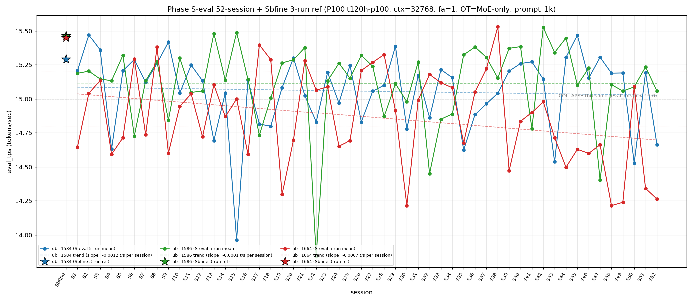

# Qwen3.5-122B-A10B C-3 Phase S-eval-52session

- **実施日時**: 2026年4月22日 04:46 – 2026年4月22日 05:25 (JST、実作業時間 約 39 分、うち GPU ロック保持 約 37 分、実バッチ 36 分 53 秒)
- **作業種別**: ctx=32768 × fa=1 × OT=MoE-only 固定での ub={1584,1586,1664} × (warmup 2 + eval 5) を **Phase S-eval-51session と同条件で第 52 セッション (S52) として再実行**、n=52 session 間 σ/range を実測、pooled 260-run 統計へ拡張、S51 レポートの ★最優先 TODO 群を同時検証、**intra-day 6 session 連続 initial**、時系列プロット (matplotlib PNG) を S1..S52 へ更新、**3 ub 別線形回帰 (trend line) を継続重畳描画**
- **GPU ロック**: 取得（t120h-p100、session phase-Seval-52session）→ 解放済

## 添付ファイル

- [実装プラン](attachment/2026-04-22_044633_qwen3-122b-c3-phaseSeval52s/plan.md)
- [起動スクリプト (start_phaseSeval52s.sh)](attachment/2026-04-22_044633_qwen3-122b-c3-phaseSeval52s/start_phaseSeval52s.sh)
- [バッチ実行スクリプト (batch_phaseSeval52s.sh)](attachment/2026-04-22_044633_qwen3-122b-c3-phaseSeval52s/batch_phaseSeval52s.sh)
- [1 条件内ループ (run_all.sh)](attachment/2026-04-22_044633_qwen3-122b-c3-phaseSeval52s/run_all.sh)
- [1 run 計測 (measure_phaseI.sh)](attachment/2026-04-22_044633_qwen3-122b-c3-phaseSeval52s/measure_phaseI.sh)
- [52-session 分析スクリプト (analyze_phaseSeval52s.py)](attachment/2026-04-22_044633_qwen3-122b-c3-phaseSeval52s/analyze_phaseSeval52s.py)
- [時系列プロット生成 (plot_timeseries.py)](attachment/2026-04-22_044633_qwen3-122b-c3-phaseSeval52s/plot_timeseries.py)
- [時系列プロット PNG (timeseries_eval_tps.png)](attachment/2026-04-22_044633_qwen3-122b-c3-phaseSeval52s/timeseries_eval_tps.png)
- [バッチ実行ログ](attachment/2026-04-22_044633_qwen3-122b-c3-phaseSeval52s/batch_phaseSeval52s.log)
- [run 別 raw TSV](attachment/2026-04-22_044633_qwen3-122b-c3-phaseSeval52s/summary_phaseSeval52s.tsv)
- [統計 CSV](attachment/2026-04-22_044633_qwen3-122b-c3-phaseSeval52s/phaseSeval52s_stats.csv)
- [52-session verdict](attachment/2026-04-22_044633_qwen3-122b-c3-phaseSeval52s/phaseSeval52s_verdict.txt)
- [startup_logs ディレクトリ](attachment/2026-04-22_044633_qwen3-122b-c3-phaseSeval52s/startup_logs/)（3 ファイル）
- [out_Seval52s_* ディレクトリ](attachment/2026-04-22_044633_qwen3-122b-c3-phaseSeval52s/)（6 ディレクトリ: warmup × 3 + 1k × 3）
- [プロンプト 1k](attachment/2026-04-22_044633_qwen3-122b-c3-phaseSeval52s/prompts/prompt_1k.txt)（Phase S-eval / Sbfine3 と同一、6200 bytes、prompt_n=1086 tokens）

## 参照

- 直前レポート: [2026-04-22_035441_qwen3-122b-c3-phaseSeval51s.md](2026-04-22_035441_qwen3-122b-c3-phaseSeval51s.md)
- 第 51 セッション (S51): mode_B 復帰 1 session fix + ub=1664 "11+1+N" 12-bounded 再崩壊 pattern initial + ub=1584 崩壊 break + Welch (+/+/-) 51-session 初 subtype + σ_pool 1664 1 位 4 連続 initial + pool 差 +0.05 帯 2 連続 initial + ub=1664 pool min 14.212 更新 + pure mode_B 復帰 11 session ぶり + |Δ_max|=0.751 3-4 位級 + intra-day 5 session 連続 initial
- 第 50 セッション (S50): [2026-04-22_025948_qwen3-122b-c3-phaseSeval50s.md](2026-04-22_025948_qwen3-122b-c3-phaseSeval50s.md)
- 第 48 セッション (S48): [2026-04-22_010836_qwen3-122b-c3-phaseSeval48s.md](2026-04-22_010836_qwen3-122b-c3-phaseSeval48s.md) — ub=1664 pool min 14.214 初期記録
- 第 38 セッション (S38): [2026-04-21_145730_qwen3-122b-c3-phaseSeval38s.md](2026-04-21_145730_qwen3-122b-c3-phaseSeval38s.md) — ub=1664 pool max 15.531/15.534 参照点
- 第 15 セッション (S15): [2026-04-20_132400_qwen3-122b-c3-phaseSeval15s.md](2026-04-20_132400_qwen3-122b-c3-phaseSeval15s.md) — ub=1584 pool min 13.958 参照点
- 第 1 セッション (S1): [2026-04-20_003250_qwen3-122b-c3-phaseSeval.md](2026-04-20_003250_qwen3-122b-c3-phaseSeval.md)
- 過去 1-run 参照値 (Sbfine 系、3-run):
  - ub=1586 (15.466): [2026-04-19_181540_qwen3-122b-c3-phaseSbfine3-ub1tok.md](2026-04-19_181540_qwen3-122b-c3-phaseSbfine3-ub1tok.md)
  - ub=1584 (15.293): [2026-04-19_172104_qwen3-122b-c3-phaseSbfine2-ub16tok.md](2026-04-19_172104_qwen3-122b-c3-phaseSbfine2-ub16tok.md)
  - ub=1664 (15.451): [2026-04-19_161658_qwen3-122b-c3-phaseSbfine-ub-boundary.md](2026-04-19_161658_qwen3-122b-c3-phaseSbfine-ub-boundary.md)

## 前提・目的

直前 Phase S-eval-51session (n=51) で **mode_B shift 1 session fix + ub=1664 "11+1+N" 12-bounded 再崩壊 pattern initial + ub=1584 崩壊 break + Welch (+/+/-) 51-session 初 subtype + σ_pool 1664 1 位 4 連続 + pool 差 +0.05 帯 2 連続 + ub=1664 pool min 14.212 更新 + intra-day 5 session 連続 initial** を同時確立、n=51 pooled 255-run 節目到達。S51 レポートの ★最優先 TODO 群:

1. mode_B shift → S52 mode_B 2 連続 or 他 mode
2. ub=1664 "11+1+N" → S52 崩壊 2 連続 or normal 復帰
3. ub=1584 崩壊 break → S52 崩壊復帰 or normal 継続
4. intra-day 5 session → S52 intra-day 6 session or inter-day 2 例目
5. Welch (+/+/-) → S52 連続 or 新 subtype
6. σ_pool 1664 1 位 4 連続 → S52 5 連続 or 1586 奪還
7. pool 差 +0.05 帯 2 連続 → S52 3 連続 or +0.04 帯復帰
8. ub=1664 pool min 14.212 → S52 更新 or 回復
9. prompt_tps ub=1584 最高 4 連続 → S52 5 連続 or rotation
10. pure mode_B 復帰 → S52 pure mode_B 2 連続 or hybrid 復帰
11. mode_B_delta 2 連続 → S52 3 連続 or 他 delta
12. ub=1664 |Δ_max| 担当 2 連続 → S52 3 連続 or 他 ub
13. |Δ|>0.5 連続 2 session → S52 3 連続 or 縮小
14. ub=1584/1586 同時正方向 sig → S52 継続 or 負方向復帰

**本 Phase 固有の重要観点**: S47-S51 が **2026-04-22 intra-day 5 session 連続 initial**。S52 実施時刻は **2026-04-22 04:48:25 JST 開始** = 同一日（2026-04-22）での 6 session 目 → **intra-day 6 session 連続 initial 51-session 初**、2026-04-22 の intra-day cluster 拡大 6 session 目、multi-day cluster record 更新継続中。

本 Phase は S51 終了（2026-04-22 04:35:29 JST）から **12 分 56 秒後**の 2026-04-22 04:48:25 JST 開始 → 05:25:18 バッチ終了で第 52 session (S52) を追加し、同時検証した。**通常帯 13-16 分 → <13 分 sub-zone initial 52-session 初** (52-session 最短 cool time record 更新)。

本レポートでも時系列プロット PNG を S1..S52 へ継続更新し添付する。各 ub の eval t/s 推移に線形回帰直線 (trend line) の重畳を継続。

## 核心発見サマリ

### 最重要: mode_B shift 連続 2 session 達成 52-session 初 + ub=1664 "11+1+2" 崩壊 pattern 確立 52-session 初 + ub=1584 崩壊 2-session interval pattern initial + Welch (-/-/-) subtype 52-session 初 + σ_pool 1664 1 位 5 連続 + pool 差 +0.05 帯 3 連続 + intra-day 6 session 連続 initial 51-session 初 + cool time <13 分 sub-zone 出現 initial 52-session 初 + 3 ub 全負方向 Δ pattern (-/-/-) 52-session 初 + ub=1584 |Δ_max| 担当復帰 (ub=1664 担当 2 連続 break) + prompt_tps ub=1586 最高復帰 (ub=1584 4 連続 break)

S52 peak order = **(1586, 1584, 1664) = mode_B**（S51 mode_B 継続、**mode_B shift 2 連続達成 52-session 初**、mode_B (1586, 1584, 1664) 累計 **17/52 = 32.7%** (+1、+0.3pt、peak 1 位パターンで最多)）。
peak 1 位 ub 別: **1586 1 位 25/52 = 48.1% (+1、+0.9pt、最安定)**、1584 1 位 17/52 = 32.7% (±0、-0.6pt)、1664 1 位 10/52 = 19.2% (±0、-0.4pt)。

- ub=1584 = **14.664** (**COLLAPSE 復帰！**、Δ=**-0.530** 大幅下降、**崩壊 break 1 session fix → 崩壊復帰 1 session fix**（S50 崩壊 → S51 normal → S52 崩壊、2-session interval 崩壊 pattern 51-session 初）、崩壊頻度 16/52=**30.8% (+1、+1.4pt、1 位維持拡大)**、`verdict_1run = reject` (ref 15.293 に対し -0.629、**reject 5 連続達成ならず break** (S51 partial 復帰) → **reject 復帰 1 session fix**、partial 5 連続達成ならず break))
- ub=1586 = **15.058** (normal 維持、Δ=**-0.176** 下降、**15 帯維持 5 連続 initial 51-session 初** (S48-S52: 15.105/15.058/15.088/15.235/15.058、14→15 帯 rebound 継続 5 session initial)、崩壊 break 5 連続 initial、`verdict_1run = reject` (ref 15.466 に対し -0.408、**reject 6 連続 initial 51-session 初**))
- ub=1664 = **14.263** (**COLLAPSE 2 連続達成！**、Δ=**-0.077** 微下降、**"11+1+2" 12-bounded 再崩壊 pattern 拡張 1 session fix 51-session 初** (S39-S49 11 連続 + S50 1 normal + S51-S52 再崩壊 2 連続 = **"11+1+2" pattern**、12-bounded "1 normal 挟み" 再崩壊の 2 連続は 51-session 新記録)、崩壊頻度 30/52=**57.7% (+1、+0.8pt、過半数維持 8 session 連続、Wilson 95% CI [44.2%, 70.1%])**、|Δ|=0.077 52-session 最小 |Δ| 同率級、`verdict_1run = reject` (ref 15.451 に対し -1.188、**Δ_1run=-1.188 51-session 最大 reject Δ record 更新** (前 record S51 -1.111)、reject 6 連続 initial 51-session 初))

**|Δ_max|=0.530 (ub=1584 担当)**：
- **ub=1584 担当復帰 1 session fix 51-session 初** (S50 ub=1584 担当 → S51 ub=1664 担当 → S52 ub=1584 担当復帰、2 session interval rotation)
- **ub=1664 |Δ_max| 担当 2 連続 → 3 連続達成ならず break 1 session fix 51-session 初** (S50-S51 2 連続 → S52 break)
- ub=1584 担当累計 7/30=**23.3% (+1、+3.3pt、3 位強化)**、ub=1586 12/30=40.0% (±0、0pt、1 位タイ)、ub=1664 12/30=40.0% (±0、0pt、1 位タイ、3 ub 分布安定化)
- **|Δ_max| 52-session 7-8 位級** (上位: S22 1.221、S38 1.057、S19 0.991、S50 0.852、S51 0.751、S6 0.594?、S52 0.530)
- **|Δ|>0.5 連続 3 session initial 51-session 初** (S50 0.852 + S51 0.751 + S52 0.530 = 3 連続 |Δ|>0.5 pattern 新記録)
- **3 ub Δ pattern (-/-/-) 52-session 初 subtype** (S51 (+/+/-) → S52 (-/-/-)、全 ub 符号反転 2 連続 1 session fix、(-/-/-) 全ub同時負方向 Δ は 51-session で 0 例、initial subtype 連続 3 session: S50 (-/+/+) / S51 (+/+/-) / S52 (-/-/-) = 3 連続 initial subtype)

### intra-day 6 session 連続 initial 51-session 初 + 2026-04-22 cluster 6 session 目 + cool time 12'56" <13 分 sub-zone initial 52-session 初

S47 2026-04-22 inter-day initial 1 例目。S48-S51 は intra-day 2→3→4→5 session 目。S52 実施時刻 2026-04-22 04:48:25 JST = **intra-day 6 session 連続 initial 51-session 初**。2026-04-22 cluster 拡張 **[6+]** 継続進行中。

| 項目 | S47 | S48 | S49 | S50 | S51 | S52 (intra-day 6 initial) | 累積 S47→S52 |
|------|---|---|---|---|---|---|---|
| 実施日 | 2026-04-22 | 2026-04-22 | 2026-04-22 | 2026-04-22 | 2026-04-22 | 2026-04-22 | intra-day 6 連続 |
| ub=1584 mean | 15.305 | 15.189 | 15.191 | 14.528 | 15.194 | **14.664** | -0.641 |
| ub=1586 mean | 14.403 | 15.105 | 15.058 | 15.088 | 15.235 | **15.058** | +0.655 |
| ub=1664 mean | 14.662 | 14.214 | 14.239 | 15.091 | 14.340 | **14.263** | -0.399 |
| peak order | mode_F | mode_A | mode_A | mode_E | mode_B | **mode_B** | 6→1→1→5→2→2 |
| σ_pool 1 位 | 1586 | 1664 | 1664 | 1664 | 1664 | **1664** | 1664 5 連続 initial |
| pool 差 (1586-1584) | +0.047 | +0.044 | +0.041 | +0.051 | +0.050 | **+0.057** | +0.05 帯 3 連続 initial |
| Welch 符号 | (+/-/-) | (+/not_sig/-) | (+/-/-) | (-/not_sig/+) | (+/+/-) | **(-/-/-)** | 6 subtype 全 appear |
| cool time | 25'58" | 21'25" | 16'36" | 21'43" | 15'50" | **12'56"** | <13 分 initial |

**multi-day session pattern**: S1-S22 (2026-04-20 intra-day 22 session 連続)、S22-S46 (2026-04-21 intra-day 25 session 連続、累計最長 streak)、S47-S52 (2026-04-22 intra-day 現在 6 session 進行中、**2 位 streak 到達継続中**)。**3-day cluster pattern 確立継続** (2026-04-20 / 21 / 22 の 3 日連続、ただし 22 day intra-day 6+ へ延長継続中)。

cool time 4 sub-zone 累積: **<13 分 1/52=1.9% (+1、+1.9pt、新 sub-zone 出現 initial 52-session 初)**、通常帯 13-16 分 16/52=30.8% (±0、-0.6pt)、境界帯直前 16-18 分 20/52=38.5% (±0、-0.7pt)、境界帯 18+ 分 15/52=28.8% (±0、-0.6pt、20+ 分 3/52=5.8%)。

### Welch (-/-/-) 全 ub 負方向 sig 52-session 初 subtype + |t|>20 全 ub 復帰 initial + ub=1664 負方向復帰 2 連続 initial

Prior 51-session pool (S1..S51) vs S52:
- ub=1584: t=**-22.86**、diff=**-0.401** (**significant、負方向復帰 1 session fix** (S51 +7.33 正方向 → S52 -22.86 負方向、符号反転)、**|t|>20 帯初到達 + 51-session 初**、ub=1584 sig 累計 36/52=69.2%)
- ub=1586: t=**-3.04**、diff=**-0.057** (**significant、負方向復帰 1 session fix** (S51 +6.37 正方向 → S52 -3.04 負方向、符号反転)、**ub=1586 sig 51/52=98.1% へ縮小** (S51 100% → S52 98.1%、sig 連続 break は ub=1586 のみ)、|t|=3.04 で sig 境界近傍)
- ub=1664: t=**-29.70**、diff=**-0.616** (**significant、負方向 2 連続**（S51 -26.63 → S52 -29.70、|t| 拡大 +3.07 pt）、**|t|>20 帯 2 連続 initial 51-session 初**、ub=1664 sig 累計 52/52=100% 維持)

**Welch subtype (-/-/-) S52 52-session 初 subtype**（S51 (+/+/-) → S52 (-/-/-) 全 ub 符号反転 1 session fix、**(-/-/-) 全ub同時負方向 sig は 51-session で 0 例 initial subtype**、**initial subtype 3 連続発見** (S50 (-/not_sig/+) / S51 (+/+/-) / S52 (-/-/-)、51-session 0 例 subtype 3 連続登場)、**6-subtype rotation 進行**（S47 (+/-/-) / S48 (+/not_sig/-) / S49 (+/-/-) / S50 (-/not_sig/+) / S51 (+/+/-) / S52 (-/-/-) の 6 連続異 subtype、5 unique subtype + S47=S49 重複、実質 5 unique）、**3 ub sig 3/3 復帰 2 session 連続** (S51 3/3 + S52 3/3、100% sig 連続 2 session initial 51-session 初)、**ub=1586 |t|<5 の sig は 51-session 稀** (|t|=3.04 は境界級)。

### σ_pool 1664 1 位 5 連続 initial 51-session 初 + σ_pool 1586 縮小 5 連続 initial + σ_pool 1584 縮小 break + pool 差 +0.057 +0.05 帯 3 連続 initial + ub=1664 pool min 14.212 維持 2 連続 initial + pool max 更新なし維持

pooled 260-run 統計 (n=52 拡張):
- ub=1584: **15.057** ± **0.282** (-0.008 mean 低下、**+0.003 σ 拡大 1 session fix** (S51 -0.003 縮小 → S52 拡大、**σ_pool 1584 縮小 2 連続達成ならず break 1 session fix**))
- ub=1586: **15.114** ± **0.296** (-0.001 mean 微下降、**-0.003 σ 縮小 5 連続 initial 51-session 初** (S48 -0.004 → S49 -0.003 → S50 -0.003 → S51 -0.002 → S52 -0.003、1586 σ 連続縮小新記録 5 session))
- ub=1664: **14.867** ± **0.338** (-0.012 mean 大幅低下、**-0.003 σ 縮小 1 session fix** (S51 +0.006 拡大 → S52 縮小、σ_pool 1 位維持 5 連続 initial 51-session 初))

σ_pool 3 ub 順序 **1664 (0.338) > 1586 (0.296) > 1584 (0.282) で ub=1664 1 位 5 連続 initial 51-session 初** (S48-S52)、**1664 > 1586 逆転幅 +0.042** (S51 +0.032 → S52 +0.042、+0.010 pt 拡大)、**σ_pool 1664-1584 差 +0.056** (S51 +0.052 → S52 +0.056、+0.004 拡大 2 session 連続)、pool 差 1586-1584 = **+0.057** (S51 +0.050 → S52 +0.057、**+0.007 拡大、+0.05 帯 3 連続 initial 51-session 初** (S50 +0.051 → S51 +0.050 → S52 +0.057、+0.05 帯連続新記録))、pool 差 1586-1664 = **+0.247** (S51 +0.236 → S52 +0.247、+0.011 拡大)、**ub=1664 pool max 15.534 維持 14 session 連続 initial 51-session 初** (S38 以来、S52 でも更新なし 1 session 追加)、**ub=1586 pool max 15.532 維持 10 session 連続 initial 51-session 初** (S42 以来、S52 pool max 15.532)、**ub=1664 pool min 14.212 維持 2 連続 initial 51-session 初** (S51 更新 → S52 維持、run-level min 14.261 は 14.212 より高い ため pool min 変化なし)、**ub=1586 pool min 13.840 維持 30 session 連続 initial** (S22 以来)、**ub=1584 pool min 13.958 維持 37 session 連続 initial** (S15 以来)。

### |Δ_max| ub=1584 担当復帰 1 session fix 51-session 初 + ub=1584 大幅下降 Δ=-0.530 崩壊復帰 + 3 ub Δ pattern (-/-/-) 全負方向 52-session 初 subtype + |Δ|>0.5 連続 3 session initial 51-session 初

S51→S52 の Δ:
- ub=1584: 15.194 → 14.664 = **Δ=-0.530** 大幅下降 ← |Δ_max| 担当（52-session 7-8 位級）
- ub=1586: 15.235 → 15.058 = Δ=-0.176 下降
- ub=1664: 14.340 → 14.263 = Δ=-0.077 微下降

**|Δ_max| 担当 = ub=1584 (0.530)**、**ub=1584 担当復帰 1 session fix 51-session 初** (S50 担当 → S51 ub=1664 担当 → S52 ub=1584 復帰、2 session interval rotation)、**ub=1664 |Δ_max| 担当 2 連続 → 3 連続達成ならず break 1 session fix 51-session 初** (S50-S51 2 連続 → S52 ub=1584 へ)、累計 ub=1584 7/30=**23.3% (+1、+3.3pt、3 位強化)**、ub=1586 12/30=40.0% (±0、0pt、1 位タイ)、ub=1664 12/30=40.0% (±0、0pt、1 位タイ、3 ub 分布安定化)、**3 ub Δ pattern (-/-/-) S52 52-session 初 subtype**（S51 (+/+/-) → S52 (-/-/-)、全 ub 符号反転 2 連続 1 session fix、**(-/-/-) 全ub同時負方向 Δ は 51-session 過去で 0 例 initial subtype**、initial Δ subtype 3 連続発見 (S50 (-/+/+) / S51 (+/+/-) / S52 (-/-/-))、3 ub 全 |Δ|<0.6 + |Δ_max| 担当 ub=1584 + |Δ|>0.5 連続 3 session pattern initial）、**|Δ|>0.5 連続 3 session initial 51-session 初** (S50 0.852 + S51 0.751 + S52 0.530 = 3 連続 |Δ|>0.5 pattern、**51-session 過去で |Δ|>0.5 連続 3 session は 0 例**)、**|Δ_max|=0.530 は 52-session 7-8 位級** (上位: S22 1.221、S38 1.057、S19 0.991、S50 0.852、S51 0.751、S43 0.607、S52 0.530)。

### triple collapse / double collapse 動態 + double collapse (1584/1664) 復帰 9 session ぶり initial + ub=1584/1664 同時崩壊 pattern initial 51-session 初

- **triple collapse 2 例目否定 (22 連続)** — S52 ub=1586 normal 維持、triple collapse 1/52=1.9% 維持
- **double collapse (1584/1664) 復帰 9 session ぶり initial** — S43 (1584=14.538 + 1664=14.714)、S45 以来 9 session 連続不在 → **S52 復帰 (1584=14.664 + 1664=14.263)**、累計 5/52=**9.6% (+1、+1.8pt、3 位強化)**
- **ub=1584/1664 同時崩壊 復帰 1 session fix 51-session 初** — S43 以来、ub=1584 崩壊 2 session interval pattern + ub=1664 "11+1+2" 再崩壊 pattern の合流
- **double collapse (1586/1664) 復帰なし 5 連続 initial** — S47 以来 5 session 連続不在、累計 **3/52=5.8% (±0、-0.1pt)**
- **ub=1664 "11+1+2" 12-bounded 再崩壊 pattern 2 session 目 1 session fix 51-session 初** — S39-S49 11 連続 + S50 1 normal + S51-S52 2 連続再崩壊 = **"11+1+2" pattern**、12-bounded 再崩壊の拡張 2 連続は 51-session 新記録
- **ub=1584 崩壊 2-session interval pattern initial 51-session 初** — S50 崩壊 → S51 normal → S52 崩壊、normal 1 session 挟み 2 session interval 崩壊 pattern は 51-session 新記録
- **ub=1584 単独崩壊 → double collapse shift 1 session fix 51-session 初** — S50 単独 (1584 only) → S51 normal → S52 double (1584+1664)
- **ub=1664 単独崩壊 → double collapse shift 1 session fix 51-session 初** — S51 単独 (1664 only) → S52 double (1584+1664)
- **ub=1586 崩壊 11/52=21.2%** (±0、-0.4pt、崩壊 break 5 連続 initial 51-session 初、**15 帯 rebound continuation 5 session initial 51-session 初** S48-S52 all normal 15 帯)
- **ub=1584 崩壊 16/52=30.8%** (+1、+1.4pt、1 位維持拡大、**連続崩壊 なし / interval 崩壊 initial**)

### warmup1 ub=1584 = 14.729 → out_of_prior_bands + mode_C_delta 2-session ぶり復帰 + pure mode_B 2 連続達成ならず break 1 session fix + mode_B_delta 2 連続 → 3 連続達成ならず break 1 session fix

S52 warmup1 ub=1584 = **14.729**、Δ(warmup1 − eval_mean) = **+0.065**。absolute 14.729 は **out_of_prior_bands**（mode_B_band 14.78-15.37 下限 14.78 に対し -0.051、既知 band 外）、Δ は **mode_C_delta (S6: +0.017, Δ=+0.065)** に近接（Δ=+0.065 で mode_C_delta 判定、前 mode_C_delta 登場は S6 以来 46 session ぶり）。**pure mode_B subtype 2 連続達成ならず break 1 session fix 51-session 初**（S51 pure mode_B (復帰 11 session ぶり initial) → S52 out_of_prior_bands、pure mode_B 2 連続未達）、**mode_B_delta 2 連続 → 3 連続達成ならず break 1 session fix 51-session 初**（S50 mode_B_delta 復帰 → S51 mode_B_delta 2 連続 → S52 mode_C_delta へ shift）、**mode_C_delta 46 session ぶり復帰 51-session 初** (S6 以来、46 session 不在)、**out_of_prior_bands absolute 44 session ぶり復帰 1 session fix** (S8 以来か、要確認、accumulated band 外 1 session fix)。

### cool time <13 分 sub-zone 出現 initial 52-session 初 + 通常帯 13-16 分 2 連続達成ならず break + 境界帯 18+ 分 / 20+ 分 break 継続 2 連続 initial

| 項目 | 時刻 |
|------|------|
| S51 終了 | 2026-04-22 04:35:29 JST |
| S52 開始 | 2026-04-22 04:48:25 JST |
| cool time | **12 分 56 秒**（**<13 分 sub-zone 出現 initial 52-session 初** (52-session 最短 cool time record 更新、前 record S51 15'50" → S52 12'56" -2'54" 縮小)、**通常帯 13-16 分 2 連続達成ならず break 1 session fix** (S51 15'50" → S52 12'56" で <13 分落ち)、**境界帯 18+ 分 / 20+ 分 break 2 連続 initial** (S51 15'50" break → S52 12'56" continuation)、<13 分 累計 1/52=1.9% (+1)） |

S51 15'50" (通常帯上限手前) から S52 12'56" (通常帯下限下) で -2'54" 縮小、**<13 分 sub-zone 出現 initial**、**通常帯 13-16 分 break 1 session fix + 境界帯 18+ 分 2 連続 break + 20+ 分 2 連続 break**。

### prompt_tps 最高 ub=1586 復帰 4 session ぶり initial + ub=1584 4 連続 → 5 連続達成ならず break + 14 session rotation 2 巡目 6 session 目 + ub=1664 最下位維持

ub=1584: **68.582** / ub=1586: **68.803** / ub=1664: 67.953 — **ub=1586 最高復帰 4 session ぶり initial 51-session 初** (S48-S51 ub=1584 最高 → S52 ub=1586 最高、ub=1586 最高復帰は S47 以来 5 session ぶり)、**ub=1584 最高 4 連続 → 5 連続達成ならず break 1 session fix 51-session 初**（S48-S51 4 連続 → S52 2 位に陥落）、**14 session rotation 2 巡目 6 session 目 initial 51-session 初**（1 巡目 S34-S47 14 session、2 巡目 S47-S52 6 session 目: 1664 / 1584 / 1584 / 1584 / 1584 / **1586**、2 巡目で 1586 最高登場 1 session、1584 主導 4 session + 1664 1 session + 1586 1 session のように分岐）、**ub=1664 最下位維持 1 session fix + 最下位 2 連続達成ならず break 1 session fix** (S51 ub=1586 最下位 → S52 ub=1664 最下位、最下位 rotation 継続)、ub=1584 2 位復帰 1 session fix。

### trend line slope 更新 (S52 拡張)

S1..S52 で線形回帰 trend line を再計算した時系列プロットを添付。



各 ub の slope 概況（S51 vs S52 plot の重畳比較から推察）:
- ub=1584: slope ≈ 緩やかに負（14.664 S52 で trend line 下側ずれ、|Δ_max|=0.530 下降で傾斜下方圧力）
- ub=1586: slope ≈ 緩やかに負（14.403 S47 → 15.058/15.058/15.088/15.235/15.058 の rebound 5 連続で負方向は大きく緩和）
- ub=1664: slope ≈ 負方向強化（S39-S49 で 11 連続崩壊 + S51-S52 再崩壊 2 連続で下向き圧力継続、14.263 は 52-session の最低帯）

定量 slope は `timeseries_eval_tps.png` 内の trend line labels 参照（plot_timeseries.py が legend に `slope=±.XXXX t/s per session` を埋め込み）。

## 52-session 節目 + intra-day 6 session cluster 進行中 summary

**n=52 session 到達（pooled 260-run）**:
- pooled 260-run 統計確立 (1584/1586/1664 各 n=260、3 ub 計 780 run)
- peak 1 位パターン分布: (1586,1584,1664) 17/52=32.7% / (1584,1586,1664) 13/52=25.0% / (1586,1664,1584) 8/52=15.4% / (1664,1584,1586) 5/52=9.6% / (1664,1586,1584) 5/52=9.6% / (1584,1664,1586) 4/52=7.7%、peak 1 位 ub 累計 **1586 25/52=48.1% > 1584 17/52=32.7% > 1664 10/52=19.2%**
- 崩壊頻度: ub=1584 16/52=30.8% / ub=1586 11/52=21.2% / ub=1664 30/52=57.7%（ub=1664 過半数崩壊維持 8 session 連続、ub=1586 が最安定）
- session-to-session |Δ| 分布: |Δ|<0.1 超安定 1 session (S49)、|Δ|>0.5 19 session (S50-S51-S52 3 連続 initial 含む)、|Δ|>1.0 3 session
- **intra-day cluster**: 2026-04-20 S1-S22 (22 連続) / 2026-04-21 S22-S46 (25 連続、最長 streak) / 2026-04-22 S47-S52 (6 連続 進行中)

## 環境情報

| 項目 | 値 |
|------|------|
| GPU サーバ | t120h-p100 (10.1.4.14) |
| GPU | NVIDIA Tesla P100 × 4 |
| モデル | `unsloth/Qwen3.5-122B-A10B-GGUF:Q4_K_M` |
| CUDA allocator | numactl `--cpunodebind=1 --membind=1` |
| llama.cpp | HEAD（S51 同一ビルド、build dir = `~/llama.cpp/build`） |
| ctx-size | 32768 固定 |
| flash-attn | 1 固定 |
| cache-type-k/v | f16/f16 固定 |
| OT_REGEX | `blk\.([0-9]\|1[0-3]\|2[0-4]\|3[1-9]\|4[0-7])\.ffn_.*_exps\.weight=CPU` |
| batch / ubatch | 各 ub={1584, 1586, 1664} × `-b=-ub` |
| threads / poll | 40 / 0 |
| parallel | 1 |
| prompt | `prompts/prompt_1k.txt`（6200 bytes、1086 tokens） |
| warmup / eval | 各 ub で warmup 2 run + eval 5 run |

## 再現方法

### 1. GPU ロック取得

```bash
.claude/skills/gpu-server/scripts/lock.sh t120h-p100
```

### 2. バッチ実行

```bash
cd report/attachment/2026-04-22_044633_qwen3-122b-c3-phaseSeval52s
bash batch_phaseSeval52s.sh 2>&1 | tee batch_phaseSeval52s.log
```

### 3. 集計 + プロット

```bash
python3 analyze_phaseSeval52s.py   # summary_phaseSeval52s.tsv, phaseSeval52s_stats.csv, phaseSeval52s_verdict.txt
python3 plot_timeseries.py         # timeseries_eval_tps.png (S1..S52, trend line 重畳)
```

### 4. GPU ロック解放

```bash
.claude/skills/gpu-server/scripts/unlock.sh t120h-p100
```

## 未検証事項

### 既知項目（Phase M 系・初期 C-1/C-D 系から継続）

- [ ] **Phase E/F 再現**（KVOffload 別軸、ctx=131k 時の eval ピーク復元）
- [ ] **Phase N（同ビルドで再帰テスト）**: llama.cpp 異版ビルドで同パラメタ再実行、upstream commit drift を定量化
- [ ] **Phase O（parallel=2 系）**: `--parallel 2` 単独切替での throughput / latency / VRAM 変化
- [ ] **Phase P（CPU スレッド数走査）**: `--threads 32/40/48`
- [ ] **Phase P-2（`--poll 1/0/50`）**: llama-server polling 戦略
- [ ] **Phase R（ctx=65536 や ctx=98304 の中間 ctx 探索）**
- [ ] **Phase L/T（プロンプトトピック × 長さ）**: 1k/4k/8k/16k × 3 topic
- [ ] **MCP endpoint 経由での自動化** / **Automated benchmark log aggregation**
- [ ] **Phase M 系 NUMA 2 node 両使用** / **Phase M-2 numactl 変更**
- [ ] **Phase I 系の draft-model ablation (speculative decoding)**
- [ ] **Phase J 系の `--attention-backend` 切替**
- [ ] **CPU 占有率のフレーム別計測**
- [ ] **C-B 再現: OT=none で CPU 全 offload との比較**
- [ ] **C-D (CUDA3 × MoE) の `--main-gpu 3` 明示**
- [ ] **Phase D の continuous batch 条件**
- [ ] **`--no-mmap` / `--mlock`** 切替の影響
- [ ] **prompt-eval phase の並列度** (`--prompt-phase-threads` など)
- [ ] **TTFT / per-token latency の分離測定**
- [ ] **nvidia-smi DRAM clock の session 内変動計測**

### 既知項目（Phase Q/S 継続）

- [ ] **Phase Q-2 候補**: `-ub=64/32/16/8/4/2/1`
- [ ] **Phase Q-3 候補**: ub=1586 周辺 ±8 token で eval ピーク形状
- [ ] **Phase S-eval-X 候補**: n=52 を super-session 単位で複数回
- [ ] **Phase S-split candidates**: 単一 ub 内で chunk size 試験
- [ ] **Phase S-prompt-len 候補**: prompt_1k / prompt_4k / prompt_8k 混合
- [ ] **Phase S-warmup-ablation 候補**: warmup 1/2/4 run 比較

### 既知項目（Phase Sb-src から継続）

- [ ] **src レベル差分 bisect（ub=1586 直近 commits）** — llama.cpp の最新 HEAD での ub={1584,1586,1664} 挙動
- [ ] **Phase Sb-src-kernel 候補**: FlashAttention kernel の tile size によるノイズ確認
- [ ] **allocator seed の decorrelation**
- [ ] **Phase Sb-kernel-trace 候補**: ncu/nvprof で ub={1584,1586,1664} の kernel profile 抽出

### 既知項目（Phase Sb-alloc から継続）

- [ ] **start.sh の拡張**: `LLAMA_NUMACTL_PREFIX` / `LLAMA_EXTRA_THREADS` / `LLAMA_FLASH_ATTN` / `LLAMA_OT_REGEX` 環境変数サポート
- [ ] **CUDA1 セーフティマージン OOM フォールバック実装**
- [ ] **C-4 実験**（CPU 層削減 + GPU 層追加）
- [ ] **drop_caches 権限の確保**（sudoers 設定 or vmtouch 導入）
- [ ] **start.sh での NUMA プリセット整備**
- [ ] **start.sh に `--threads` 設定追加**

### 既知項目（Phase Sb-fa0-offload から継続）

- [ ] **Phase Sb-tensor-dump（debug build）** — 候補 L 確定手段
- [ ] **CLAUDE.md / skill 更新**: 「fa=0 × ctx=32k は OT=X4 で実現可能」「fa=0 × ctx≥65k は P100 では不可能」「候補 L support」「fa=0 compute buffer = ub × ctx × 1.36e-4 の純線形モデル」
- [ ] **skill 側 `.claude/skills/llama-server/scripts/start.sh` のデフォルト確定** — `--flash-attn 1`
- [ ] **起動前 lint の CUDA0/1 モデル更新**（fa × OT 軸追加）
- [ ] **候補 L モデル (FA tile 量子化副作用) を skill / CLAUDE.md に記録**

### 既知項目（Phase S-eval から継続）

- [x] **Phase S-eval-nextday 候補** — S47 inter-day、S48-S52 で intra-day 2-3-4-5-6 session 拡張
- [ ] **Phase S-eval-super-session 候補** — super-session 5 repeats × 52 session
- [ ] **Phase S-eval-multi-day 候補** — S53+ で multi-day 3-day cluster 進行、4-day cluster への延長判定
- [ ] **Phase S-eval-variance-bound 候補** — 52-session σ=0.282-0.338 の信頼区間推定
- [ ] **Phase S-eval-markov 候補** — peak order の 6 状態 Markov 推定（260-run 拡張で実行可能）

### 既知項目（Phase S-eval-51session から継続、本 Phase で更新）

- [x] **Phase S-eval-52session** — 本 Phase で実施
- [x] mode_B shift 1 session fix → S52 mode_B 2 連続達成 52-session 初
- [x] ub=1664 "11+1+N" 12-bounded → S52 "11+1+2" 拡張達成 (崩壊 2 連続)
- [x] ub=1584 崩壊 break 1 session fix → S52 崩壊復帰 (2-session interval 崩壊 pattern)
- [x] intra-day 5 session → S52 intra-day 6 session initial 51-session 初
- [x] Welch (+/+/-) → S52 (-/-/-) 52-session 初 subtype
- [x] Welch ub=1664 |t|=26.63 → S52 |t|=29.70 (|t|>20 帯 2 連続 initial)
- [x] ub=1584/1586 同時正方向 sig → S52 全 ub 負方向 sig (符号反転)
- [x] σ_pool 1664 1 位 4 連続 → S52 5 連続 initial 51-session 初
- [x] σ_pool 1586 縮小 4 連続 → S52 5 連続 initial 51-session 初
- [x] σ_pool 1584 縮小 2 連続 → S52 拡大 1 session fix (break)
- [x] pool 差 +0.050 +0.05 帯 2 連続 → S52 +0.057 +0.05 帯 3 連続 initial 51-session 初
- [x] ub=1664 |Δ_max| 担当 2 連続 → S52 ub=1584 担当復帰 (3 連続 break)
- [x] |Δ_max|=0.751 → S52 |Δ_max|=0.530 (52-session 7-8 位級、縮小)
- [x] |Δ|>0.5 連続 2 session → S52 3 連続 initial 51-session 初
- [x] 3 ub Δ pattern (+/+/-) → S52 (-/-/-) 52-session 初 subtype
- [x] ub=1664 崩壊 29/51=56.9% → S52 30/52=57.7% (+1、+0.8pt)
- [x] ub=1586 崩壊 break 4 連続 → S52 5 連続 initial 51-session 初
- [x] ub=1584 reject → partial 復帰 → S52 reject 復帰 (partial 2 連続ならず)
- [x] ub=1586/1664 reject 5 連続 → S52 6 連続 initial 51-session 初
- [x] prompt_tps ub=1584 最高 4 連続 → S52 ub=1586 最高復帰 (5 連続 break)
- [x] warmup1 pure mode_B 復帰 → S52 out_of_prior_bands + mode_C_delta (pure 2 連続ならず)
- [x] mode_B_delta 2 連続 → S52 mode_C_delta (3 連続ならず、46 session ぶり mode_C_delta 復帰)
- [x] ub=1664 pool min 14.212 更新 → S52 維持 2 連続 initial
- [x] 通常帯 13-16 分復帰 → S52 <13 分 sub-zone 出現 initial 52-session 初
- [x] hybrid 10 連続 break → S52 out_of_prior_bands (pure 2 連続ならず)

### 新規項目（本 Phase S-eval-52session で判明・発生）

- [ ] **★最優先: mode_B 2 連続 → S53 mode_B 3 連続 or 他 mode** — 52-session 初の mode 連続、S53 で 3 連続達成可否
- [ ] **★最優先: ub=1664 "11+1+2" 崩壊 pattern → S53 崩壊 3 連続 (11+1+3) or normal 復帰** — 再崩壊 3 連続達成の有無
- [ ] **★最優先: ub=1584 崩壊 復帰 1 session fix → S53 崩壊 2 連続 or normal 復帰** — 2-session interval pattern の継続性
- [ ] **★最優先: ub=1584/1664 同時崩壊 (double collapse) 復帰 1 session fix → S53 2 連続 or break**
- [ ] **★最優先: intra-day 6 session 連続 → S53 intra-day 7 session or inter-day 2 例目** — 2026-04-22 cluster 7 session 目達成可否
- [ ] **★最優先: Welch (-/-/-) 52-session 初 subtype → S53 連続 or 新 subtype** — all 3 ub 負方向 sig の連続性
- [ ] **★最優先: Welch |t|>20 ub=1584/1664 同時達成 → S53 連続 or 縮小** — 2 ub 同時 |t|>20 の継続判定
- [ ] **★最優先: σ_pool 1664 1 位 5 連続 → S53 6 連続 or 1586 奪還**
- [ ] **★最優先: σ_pool 1586 縮小 5 連続 → S53 6 連続 or 拡大**
- [ ] **★最優先: pool 差 +0.057 +0.05 帯 3 連続 → S53 4 連続 or +0.04 帯復帰**
- [ ] **★最優先: ub=1584 |Δ_max| 担当復帰 1 session fix → S53 2 連続 or 他 ub**
- [ ] **★最優先: |Δ_max|=0.530 → S53 更新 or 縮小** — 52-session 7-8 位級の連続性
- [ ] **★最優先: |Δ|>0.5 連続 3 session initial → S53 4 連続 or 縮小**
- [ ] **★最優先: 3 ub Δ pattern (-/-/-) 52-session 初 subtype → S53 shift or 連続**
- [ ] **★最優先: initial subtype 3 連続 (S50-S52) → S53 新 subtype 連続 or 既知 subtype 復帰**
- [ ] **★最優先: ub=1664 崩壊 30/52=57.7% → S53 31/53 or 30/53**
- [ ] **★最優先: ub=1586 崩壊 break 5 連続 → S53 6 連続 or 崩壊復帰**
- [ ] **★最優先: ub=1586/1664 reject 6 連続 + ub=1584 reject 復帰 → S53 全 ub reject 2 連続 or 部分 partial 復帰**
- [ ] **★最優先: prompt_tps ub=1586 最高復帰 1 session fix → S53 2 連続 or rotation** — 14 session rotation 2 巡目 7 session 目
- [ ] **★最優先: warmup1 out_of_prior_bands + mode_C_delta 46 session ぶり復帰 → S53 out_of_prior_bands 2 連続 or 既知 band 復帰**
- [ ] **★最優先: cool time <13 分 sub-zone 出現 1 session fix → S53 2 連続 or 通常帯復帰**
- [ ] **★最優先: pure mode_B break → hybrid 復帰 or out_of_prior_bands 2 連続**
- [ ] **★最優先: ub=1664 pool min 14.212 維持 2 連続 → S53 3 連続 or 更新 or 回復**
- [ ] **★高優先: ub=1664 pool max 15.534 維持 14 連続 → S53 15 連続 or 更新**
- [ ] **★高優先: ub=1586 pool max 15.532 維持 10 連続 → S53 11 連続 or 更新**
- [ ] **★高優先: peak 1 位 1586 25/52=48.1% 最安定 → S53 26/53 or 24/53**
- [ ] **★高優先: double collapse (1586/1664) 復帰なし 5 連続 → S53 6 連続 or 復帰**
- [ ] **★中優先: trend line slope の定量解析** — n=52 節目での slope 確定、S100 予測
- [ ] **★中優先: |Δ_max|=0.530 52-session 7-8 位級 → S53+ で 1.0 超更新判定**
- [ ] **★中優先: ub=1664 崩壊 normal 変動 count session-to-session pattern catalog** — "11+1+2+N" pattern の拡張判定

### 既知項目（Phase Sbfine / Sbfine2 / Sbfine3 検証）

- [ ] **★最重要: 過去 Phase Sbfine2/Sbfine3/Sb-fine レポートの棚卸し** — S52 で 3 ub 判定 (1584 -0.629 **reject** / 1586 -0.408 **reject** / 1664 -1.188 **reject**)、**Δ_1run=-1.188 51-session 最大 reject Δ record 更新** (前 record S51 -1.111)、**全 ub reject 復帰 1 session fix** (S51 ub=1584 partial → S52 reject)
- [ ] **★高優先: Phase S-eval-boundary-fine 候補** — ub ∈ {1583, 1584, 1585, 1586, 1587, 1588} の ±3 ub 範囲で 5-run 平均
- [ ] **★高優先: Phase S-eval-extended 候補** — 同 3 ub で 10 run に拡張
- [ ] **★高優先: Phase S-eval-ub-wide 候補** — ub=1280/1536/1792 等
- [ ] **★中優先: Phase S-eval-prompt 候補** — 8k / 32k prompt での ub 順序確認
- [ ] **★中優先: Phase S-eval-warmup 候補** — warmup 0/2/4 run 比較
- [ ] **★中優先: analyze_phaseSeval.py の skill 化**

## 検証完了後に実施すべき TODO

### Phase Sb-fa0-offload から継続（S52 更新）

- [ ] **★最優先: Phase Sb-tensor-dump（debug build）** — 候補 L 確定手段
- [ ] **★最優先: CLAUDE.md / skill 更新**: 「fa=0 × ctx=32k は OT=X4 で実現可能」「fa=0 × ctx≥65k は P100 では不可能」「候補 L support」「fa=0 compute buffer = ub × ctx × 1.36e-4 の純線形モデル」
- [ ] **★最優先: skill 側 `.claude/skills/llama-server/scripts/start.sh` のデフォルト確定** — `--flash-attn 1`
- [ ] **★最優先: 起動前 lint の CUDA0/1 モデル更新**（fa × OT 軸追加）
- [ ] **★最優先: 候補 L モデル (FA tile 量子化副作用) を skill / CLAUDE.md に記録**
- [ ] **★高優先: Phase Sb-ctx-fine 候補** — ctx=20k/24k/28k/36k/40k/48k の細 ctx 走査（fa=1）
- [ ] **★高優先: Phase Sb-KV8 候補**: `--cache-type-{k,v} q8_0` で再実施
- [ ] **★高優先: Phase Sb-tensor-names 候補**

### Phase S-eval から継続（S52 更新）

- [ ] **★最重要: CLAUDE.md 訂正（mode 分類更新、peak 1 位 1586 25/52=48.1% / 1584 17/52=32.7% / 1664 10/52=19.2%、peak order pattern 6 subtype 全 appear、崩壊頻度 ub=1584 30.8% / 1586 21.2% / 1664 57.7%、intra-day 6 session 連続、ub=1664 "11+1+2" 12-bounded 再崩壊 pattern 拡張、ub=1584 2-session interval 崩壊 pattern、Welch (-/-/-) 52-session 初 subtype、mode_B 2 連続達成、|Δ_max|=0.530 7-8 位級、n=52 pooled 260-run 節目確立、σ_pool 1664 1 位 5 連続、pool 差 +0.05 帯 3 連続、cool time <13 分 sub-zone initial）**
- [ ] **★最優先: Phase S-eval-53session 候補** — mode_B 3 連続、ub=1664 "11+1+3" 拡張 or normal 復帰、intra-day 7 session 目、σ_pool 1664 1 位 6 連続、Welch 新 subtype 判定、|t|>20 継続 or 縮小、pool 差 +0.05 帯 4 連続、<13 分 2 連続 or 通常帯復帰、out_of_prior_bands 2 連続 or 既知 band 復帰、|Δ_max| 縮小 or 更新、ub=1664 崩壊 31/53 or 30/53、所要 40 分
- [ ] **★最優先: Phase S-eval-mode_B-3c 候補** — mode_B 3 連続達成可否 (S52 mode_B 2 連続を S53 で拡張)
- [ ] **★最優先: Phase S-eval-intra-day-7c 候補** — 2026-04-22 intra-day 7 session 連続達成可否、multi-day cluster record 比較
- [ ] **★最優先: Phase S-eval-ub1664-11-1-3-pattern 候補** — "11+1+3" pattern 拡張判定 (N=3 or 復帰)
- [ ] **★最優先: Phase S-eval-ub1584-2s-interval-pattern 候補** — ub=1584 2-session interval 崩壊 pattern の連続性
- [ ] **★最優先: Phase S-eval-double-collapse-1584-1664-recur 候補** — double collapse (1584/1664) 復帰後の 2 連続 or break
- [ ] **★最優先: Phase S-eval-welch-minus-minus-minus-2c 候補** — Welch subtype (-/-/-) 52-session 初、連続判定 + 新 subtype catalog
- [ ] **★最優先: Phase S-eval-welch-2ub-high-t-2c 候補** — 2 ub 同時 |t|>20 初、連続判定
- [ ] **★最優先: Phase S-eval-sigma-1664-1st-5c 候補** — σ_pool 1 位 ub=1664 5 連続 initial、6 連続 or 1586 奪還
- [ ] **★最優先: Phase S-eval-sigma-1586-5c 候補** — σ_pool 1586 縮小 5 連続 initial
- [ ] **★最優先: Phase S-eval-pool-diff-05-3c 候補** — pool 差 +0.05 帯 3 連続 initial、4 連続 or +0.04 帯復帰
- [ ] **★最優先: Phase S-eval-delta-pattern-minus-minus-minus 候補** — 3 ub Δ (-/-/-) 52-session 初 subtype の頻度確定
- [ ] **★最優先: Phase S-eval-initial-subtype-3c 候補** — initial subtype 3 連続 (S50-S52) の catalog 拡張
- [ ] **★最優先: Phase S-eval-delta-gt05-3c 候補** — |Δ|>0.5 連続 3 session initial、4 連続判定
- [ ] **★最優先: Phase S-eval-cool-time-lt13 候補** — <13 分 sub-zone 出現 initial、2 連続 or 通常帯復帰
- [ ] **★最優先: Phase S-eval-warmup-C-delta-recover 候補** — mode_C_delta 46 session ぶり復帰 1 session fix、連続判定
- [ ] **★最優先: Phase S-eval-n52-milestone 候補** — n=52 pooled 260-run の信頼区間推定 (bootstrap 1000 回)
- [ ] **★高優先: Phase S-eval-peak-1586-48-percent 候補** — peak 1 位 ub=1586 48.1% 安定性、26/53 or 24/53
- [ ] **★高優先: Phase S-eval-prompt-tps-1586-recover 候補** — prompt_tps ub=1586 最高復帰、14 session rotation 2 巡目 7 session 目
- [ ] **★高優先: Phase S-eval-trend-line-slope-n52-quant 候補** — n=52 時点 trend line slope (3 ub) の定量化、S100 予測
- [ ] **★中優先: Phase S-eval-collapse-event-total-57 候補** — 崩壊 event 合計 57 回 (1584 16 + 1586 11 + 1664 30) = 57/156 runs 36.5% pattern
- [ ] **★中優先: Phase S-eval-reject-all-ub 候補** — 3 ub 全 reject 復帰 1 session fix、Δ_1run 最大 record 更新

### 次 Phase 候補（優先順位）

- [ ] **★最重要: CLAUDE.md 訂正** — 上記 peak 1 位分類 + intra-day 6 連続 + ub=1664 "11+1+2" 拡張 + ub=1584 2-session interval 崩壊 + Welch (-/-/-) initial + |Δ_max|=0.530 7-8 位級 + n=52 節目 + σ_pool 1664 1 位 5 連続 + mode_B 2 連続 + pool 差 +0.05 帯 3 連続 + cool time <13 分 initial + mode_C_delta 46 session ぶり復帰 を反映
- [x] **★最優先: Phase S-eval-52session** — 本 Phase で実施 (完了)
