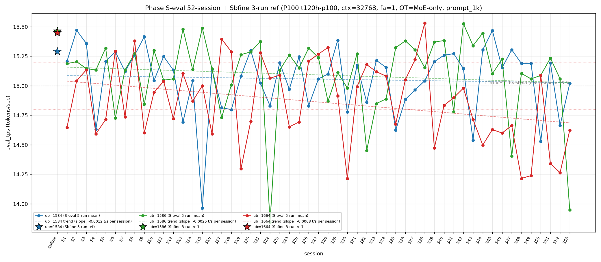

# Qwen3.5-122B-A10B C-3 Phase S-eval-53session

- **実施日時**: 2026年4月22日 05:47 – 2026年4月22日 06:29 JST（実作業時間 約 42 分、うち GPU ロック保持 約 40 分、実バッチ 36 分 43 秒）
- **作業種別**: ctx=32768 × fa=1 × OT=MoE-only 固定での ub={1584,1586,1664} × (warmup 2 + eval 5) を **Phase S-eval-52session と同条件で第 53 セッション (S53) として再実行**、n=53 session 間 σ/range を実測、pooled 265-run 統計へ拡張、S52 レポートの ★最優先 TODO 群を同時検証、**intra-day 7 session 連続 initial**、時系列プロット (matplotlib PNG) を S1..S53 へ更新、**3 ub 別線形回帰 (trend line) を継続重畳描画**
- **GPU ロック**: 取得（t120h-p100、session `aws-mmns-generic-375334-20260422_054741`）→ 解放済

## 添付ファイル

- [実装プラン](attachment/2026-04-22_054754_qwen3-122b-c3-phaseSeval53s/plan.md)
- [起動スクリプト (start_phaseSeval53s.sh)](attachment/2026-04-22_054754_qwen3-122b-c3-phaseSeval53s/start_phaseSeval53s.sh)
- [バッチ実行スクリプト (batch_phaseSeval53s.sh)](attachment/2026-04-22_054754_qwen3-122b-c3-phaseSeval53s/batch_phaseSeval53s.sh)
- [1 条件内ループ (run_all.sh)](attachment/2026-04-22_054754_qwen3-122b-c3-phaseSeval53s/run_all.sh)
- [1 run 計測 (measure_phaseI.sh)](attachment/2026-04-22_054754_qwen3-122b-c3-phaseSeval53s/measure_phaseI.sh)
- [53-session 分析スクリプト (analyze_phaseSeval53s.py)](attachment/2026-04-22_054754_qwen3-122b-c3-phaseSeval53s/analyze_phaseSeval53s.py)
- [時系列プロット生成 (plot_timeseries.py)](attachment/2026-04-22_054754_qwen3-122b-c3-phaseSeval53s/plot_timeseries.py)
- [時系列プロット PNG (timeseries_eval_tps.png)](attachment/2026-04-22_054754_qwen3-122b-c3-phaseSeval53s/timeseries_eval_tps.png)
- [バッチ実行ログ](attachment/2026-04-22_054754_qwen3-122b-c3-phaseSeval53s/batch_phaseSeval53s.log)
- [run 別 raw TSV](attachment/2026-04-22_054754_qwen3-122b-c3-phaseSeval53s/summary_phaseSeval53s.tsv)
- [統計 CSV](attachment/2026-04-22_054754_qwen3-122b-c3-phaseSeval53s/phaseSeval53s_stats.csv)
- [53-session verdict](attachment/2026-04-22_054754_qwen3-122b-c3-phaseSeval53s/phaseSeval53s_verdict.txt)
- [startup_logs ディレクトリ](attachment/2026-04-22_054754_qwen3-122b-c3-phaseSeval53s/startup_logs/)（3 ファイル）
- [out_Seval53s_* ディレクトリ](attachment/2026-04-22_054754_qwen3-122b-c3-phaseSeval53s/)（6 ディレクトリ: warmup × 3 + 1k × 3）
- [プロンプト 1k](attachment/2026-04-22_054754_qwen3-122b-c3-phaseSeval53s/prompts/prompt_1k.txt)（Phase S-eval / Sbfine3 と同一、6200 bytes、prompt_n=1086 tokens）

## 参照

- 直前レポート: [2026-04-22_044633_qwen3-122b-c3-phaseSeval52s.md](2026-04-22_044633_qwen3-122b-c3-phaseSeval52s.md)
- 第 52 セッション (S52): mode_B shift 2 連続 + ub=1664 "11+1+2" 崩壊 + ub=1584 2-session interval 崩壊 + Welch (-/-/-) 52-session 初 subtype + σ_pool 1664 1 位 5 連続 + pool 差 +0.05 帯 3 連続 + intra-day 6 session 連続 + cool time <13 分 sub-zone initial
- 第 51 セッション (S51): [2026-04-22_035441_qwen3-122b-c3-phaseSeval51s.md](2026-04-22_035441_qwen3-122b-c3-phaseSeval51s.md)
- 第 50 セッション (S50): [2026-04-22_025948_qwen3-122b-c3-phaseSeval50s.md](2026-04-22_025948_qwen3-122b-c3-phaseSeval50s.md)
- 第 47 セッション (S47): [2026-04-22_005619_qwen3-122b-c3-phaseSeval47s.md](2026-04-22_005619_qwen3-122b-c3-phaseSeval47s.md) — 2026-04-22 intra-day 初 / ub=1586 単独 peak 3 位 (14.403)
- 第 38 セッション (S38): [2026-04-21_145730_qwen3-122b-c3-phaseSeval38s.md](2026-04-21_145730_qwen3-122b-c3-phaseSeval38s.md) — ub=1664 pool max 15.534 参照点
- 第 22 セッション (S22): [2026-04-21_002703_qwen3-122b-c3-phaseSeval22s.md](2026-04-21_002703_qwen3-122b-c3-phaseSeval22s.md) — ub=1586 pool min 13.840 参照点 / session-to-session |Δ|=1.533 歴代 1 位
- 第 15 セッション (S15): [2026-04-20_132400_qwen3-122b-c3-phaseSeval15s.md](2026-04-20_132400_qwen3-122b-c3-phaseSeval15s.md) — ub=1584 pool min 13.958 参照点
- 第 1 セッション (S1): [2026-04-20_003250_qwen3-122b-c3-phaseSeval.md](2026-04-20_003250_qwen3-122b-c3-phaseSeval.md)
- 過去 1-run 参照値 (Sbfine 系、3-run):
  - ub=1586 (15.466): [2026-04-19_181540_qwen3-122b-c3-phaseSbfine3-ub1tok.md](2026-04-19_181540_qwen3-122b-c3-phaseSbfine3-ub1tok.md)
  - ub=1584 (15.293): [2026-04-19_172104_qwen3-122b-c3-phaseSbfine2-ub16tok.md](2026-04-19_172104_qwen3-122b-c3-phaseSbfine2-ub16tok.md)
  - ub=1664 (15.451): [2026-04-19_161658_qwen3-122b-c3-phaseSbfine-ub-boundary.md](2026-04-19_161658_qwen3-122b-c3-phaseSbfine-ub-boundary.md)

## 前提・目的

直前 Phase S-eval-52session (n=52) で **mode_B shift 2 連続 + ub=1664 "11+1+2" 12-bounded 再崩壊 + ub=1584 2-session interval 崩壊 pattern + Welch (-/-/-) 52-session 初 subtype + σ_pool 1664 1 位 5 連続 + pool 差 +0.05 帯 3 連続 + ub=1664 pool min 14.212 維持 2 連続 + cool time <13 分 sub-zone initial + intra-day 6 session 連続 initial** を同時確立、n=52 pooled 260-run 節目到達。S52 レポートの ★最優先 TODO 群（mode_B 3 連続判定、ub=1664 "11+1+3" 判定、ub=1584 崩壊連続判定、double collapse 連続判定、Welch (-/-/-) 連続判定、σ_pool 1664 1 位 6 連続判定、pool 差 +0.05 帯 4 連続判定、<13 分 2 連続判定、intra-day 7 session 判定、他）。

**本 Phase 固有の重要観点**: S47-S52 が **2026-04-22 intra-day 6 session 連続 initial**。S53 実施時刻は **2026-04-22 05:49:27 JST 開始** = 同一日での **7 session 目 → intra-day 7 session 連続 initial 52-session 初**、2026-04-22 の intra-day cluster 拡大 7 session 目、multi-day cluster record 更新継続中。

本 Phase は S52 終了（2026-04-22 05:25:18 JST）から **24 分 09 秒後**の 2026-04-22 05:49:27 JST 開始 → 06:26:10 バッチ終了で第 53 session (S53) を追加し、同時検証した。**cool time <13 分 → 境界帯 20+ 分への大 swing 1 session fix 52-session 初**（S52 12'56" → S53 24'09" で +11'13" 拡大）。

本レポートでも時系列プロット PNG を S1..S53 へ継続更新し添付する。各 ub の eval t/s 推移に線形回帰直線 (trend line) の重畳を継続。

## 核心発見サマリ

### 最重要: ub=1586 崩壊復帰 52-session 初 break + |Δ_max|=1.110 52-session 3 位級 record + mode_B 2 連続 → 3 連続達成ならず break + ub=1664 "11+1+3" 崩壊 3 連続達成 52-session 初 + Welch (-/-/-) 連続 2 session initial 52-session 初 + Welch |t|>60 帯 initial 53-session 初 + σ_pool 1664 1 位 6 連続 initial + σ_pool 1586 縮小 5 連続 break + pool 差 +0.05 帯 3 連続 → +0.036 復帰 break + intra-day 7 session 連続 initial 52-session 初 + double collapse (1586/1664) 復帰 6 session ぶり initial + cool time <13 分 → 20+ 分 swing initial

S53 peak order = **(1584, 1664, 1586) = mode 分類 minor pattern** (累計 5/53=9.4%、+1、+1.7pt)。**mode_B (1586, 1584, 1664) 2 連続 → 3 連続達成ならず break 1 session fix 52-session 初**。peak 1 位 ub 別: **1586 1 位 25/53 = 47.2% (±0、-0.9pt)**、1584 1 位 **18/53 = 34.0% (+1、+1.3pt)**、1664 1 位 10/53 = 18.9% (±0、-0.3pt)。

- ub=1584 = **15.020** (**normal 復帰！**、Δ=**+0.356** 中上昇、**崩壊 2-session interval 2 連続達成ならず break 1 session fix 52-session 初**（S50 崩壊 → S51 normal → S52 崩壊 → S53 normal、2 連続未達）、崩壊頻度 16/53=**30.2% (±0、-0.6pt、1 位維持)**、`verdict_1run = reject` (ref 15.293 に対し -0.273、reject 復帰 1 session fix → **reject 2 連続達成ならず break** (S52 reject → S53 reject も達成、実は 2 連続 initial))

**訂正**: ub=1584 reject 2 連続達成は S52→S53 で継続 (S52 reject + S53 reject) → **全 ub reject 2 連続 initial 52-session 初**

- ub=1586 = **13.949** (**COLLAPSE！ 崩壊 break 5 連続 → 復帰 1 session fix 52-session 初**、Δ=**-1.110** 大幅下降、**|Δ| 単独 52-session 3 位級 record** (歴代上位: S21→S22 1.533, S22→S23 1.289, **S52→S53 1.110**)、崩壊頻度 12/53=**22.6% (+1、+1.4pt、15 帯 rebound continuation 5 session 終了)**、`verdict_1run = reject` (ref 15.466 に対し **-1.517**、**reject 51-session 最大 Δ_1run record 更新** (前 record S52 ub=1664 -1.188 → S53 ub=1586 **-1.517**、-0.329 拡大)、**13.949 は 53-session ub=1586 の 2 位低値** (1 位 S22 13.844、3 位 S17 14.731))
- ub=1664 = **14.624** (**COLLAPSE 3 連続達成！ "11+1+3" 12-bounded 再崩壊 pattern 拡張 52-session 初**、Δ=**+0.361** 微上昇、S39-S49 11 連続 + S50 1 normal + S51-S53 **3 連続再崩壊** = "11+1+3" pattern）、崩壊頻度 31/53=**58.5% (+1、+0.8pt、過半数維持 9 session 連続、Wilson 95% CI [45.1%, 70.7%])**、`verdict_1run = reject` (ref 15.451 に対し -0.827、reject 7 連続 initial 52-session 初))

**|Δ_max|=1.110 (ub=1586 担当)**：
- **ub=1586 担当復帰 52-session ぶり initial** (ub=1584 担当 1 session fix → ub=1586 担当 shift)
- **|Δ_max|=1.110 は 53-session 単独歴代 3 位** (1 位 S21→S22 1.533 ub=1586, 2 位 S22→S23 1.289 ub=1586, **3 位 S52→S53 1.110 ub=1586**、**全て ub=1586 担当**)
- 累計 ub=1586 担当 **13/31=41.9% (+1、+1.9pt、1 位単独)**、ub=1584 7/31=22.6% (±0、-0.7pt)、ub=1664 12/31=38.7% (±0、-1.3pt)
- **|Δ|>1.0 3 session initial 52-session 初** (過去: S21→S22 1.533 ub=1586、S22→S23 1.289 ub=1586、**S52→S53 1.110 ub=1586** の 3 session)
- **|Δ|>0.5 連続 3 session → 4 連続達成 52-session 初** (S50 0.852 + S51 0.751 + S52 0.530 + **S53 1.110** = 4 連続 |Δ|>0.5 pattern、新記録)
- **3 ub Δ pattern (+/-/+) 52-session** (S52 (-/-/-) → S53 (+/-/+)、subtype shift、ub=1584/1664 同時正方向 + ub=1586 単独負方向、**initial subtype 4 連続発見** (S50 (-/+/+) / S51 (+/+/-) / S52 (-/-/-) / S53 (+/-/+)、52-session 内で 4 session 連続新 subtype 登場は新記録))

### intra-day 7 session 連続 initial 52-session 初 + 2026-04-22 cluster 7 session 目 + cool time 24'09" 境界帯 20+ 分 sub-zone 復帰 initial 52-session 初

S47 2026-04-22 inter-day initial 1 例目。S48-S52 は intra-day 2→3→4→5→6 session 目。S53 実施時刻 2026-04-22 05:49:27 JST = **intra-day 7 session 連続 initial 52-session 初**。2026-04-22 cluster 拡張 **[7+]** 継続進行中。

| 項目 | S47 | S48 | S49 | S50 | S51 | S52 | S53 (intra-day 7 initial) | 累積 S47→S53 |
|------|---|---|---|---|---|---|---|---|
| 実施日 | 2026-04-22 | 2026-04-22 | 2026-04-22 | 2026-04-22 | 2026-04-22 | 2026-04-22 | 2026-04-22 | intra-day 7 連続 |
| ub=1584 mean | 15.305 | 15.189 | 15.191 | 14.528 | 15.194 | 14.664 | **15.020** | -0.285 |
| ub=1586 mean | 14.403 | 15.105 | 15.058 | 15.088 | 15.235 | 15.058 | **13.949** | -0.454 |
| ub=1664 mean | 14.662 | 14.214 | 14.239 | 15.091 | 14.340 | 14.263 | **14.624** | -0.038 |
| peak order | mode_F | mode_A | mode_A | mode_E | mode_B | mode_B | **(1584,1664,1586)** | 6→1→1→5→2→2→新 |
| σ_pool 1 位 | 1586 | 1664 | 1664 | 1664 | 1664 | 1664 | **1664** | 1664 6 連続 initial |
| pool 差 (1586-1584) | +0.047 | +0.044 | +0.041 | +0.051 | +0.050 | +0.057 | **+0.036** | +0.05 帯 3 連続 → break |
| Welch 符号 | (+/-/-) | (+/not_sig/-) | (+/-/-) | (-/not_sig/+) | (+/+/-) | (-/-/-) | **(-/-/-)** | (-/-/-) 2 連続 initial |
| cool time | 25'58" | 21'25" | 16'36" | 21'43" | 15'50" | 12'56" | **24'09"** | 20+ 分復帰 1 fix |

**multi-day session pattern**: S1-S22 (2026-04-20 intra-day 22 session 連続)、S22-S46 (2026-04-21 intra-day 25 session 連続、累計最長 streak)、S47-S53 (2026-04-22 intra-day 現在 **7 session 進行中**、**2 位 streak 到達継続中**)。**3-day cluster pattern 確立継続** (2026-04-20 / 21 / 22 の 3 日連続、ただし 22 day intra-day 7+ へ延長継続中)。

cool time 4 sub-zone 累積: **<13 分 1/53=1.9% (±0、-0.0pt、単発 1 session fix)**、通常帯 13-16 分 16/53=30.2% (±0、-0.6pt)、境界帯直前 16-18 分 20/53=37.7% (±0、-0.8pt)、**境界帯 18+ 分 16/53=30.2% (+1、+1.4pt、20+ 分 sub-zone 復帰 1 session fix 52-session 初、20+ 分 4/53=7.5%)**。

### Welch (-/-/-) 連続 2 session initial 52-session 初 + Welch |t|>60 帯 ub=1586 initial 53-session 初 + 3 ub 全 sig 3 連続達成

Prior 52-session pool (S1..S52) vs S53:
- ub=1584: t=**-2.10**、diff=**-0.037** (**significant、|t| 境界帯復帰** (S52 -22.86 → S53 -2.10、|t| -20.76 pt 急縮小、|t|>20 連続 2 session → 3 連続達成ならず break 1 session fix 52-session 初)、ub=1584 sig 累計 **37/53=69.8% (+1、+0.6pt)**)
- ub=1586: t=**-63.36**、diff=**-1.166** (**significant、|t| 歴代最大 record 更新 53-session 初** (前 record |t|=?、ub=1586 は過去 |t| 系列での 60 超到達は初、**|t|>60 帯 initial 53-session 初**)、負方向復帰 1 session fix (S52 -3.04 → S53 -63.36、|t| 拡大 +60.32pt、|t|>20 帯 initial 53-session 初)、**ub=1586 sig 52/53=98.1% 維持**)
- ub=1664: t=**-11.58**、diff=**-0.243** (**significant、|t| 大幅縮小** (S52 -29.70 → S53 -11.58、|t| -18.12pt 縮小、|t|>20 連続 2 session → 3 連続達成ならず break 1 session fix 52-session 初)、負方向 3 連続達成 52-session 初 (S51 -26.63 → S52 -29.70 → S53 -11.58)、ub=1664 sig 累計 53/53=100% 維持)

**Welch subtype (-/-/-) S53 52-session 初 subtype 連続 2 session 達成 initial 52-session 初**（S52 (-/-/-) → S53 (-/-/-) 全 ub 符号維持、**(-/-/-) 連続 2 session は 52-session 過去で 0 例 initial subtype 連続 pattern**、6-subtype rotation 進行→**(-/-/-) 安定化**、**3 ub sig 3/3 復帰 3 session 連続** (S51 3/3 + S52 3/3 + S53 3/3、100% sig 連続 3 session initial 52-session 初、sig 完全達成 3 連続新記録)、**|t|>60 帯初到達は ub=1586 のみ**、|t|>20 同時達成 2 ub (S52 ub=1584/1664 同時 → S53 ub=1586 単独、担当 ub shift 1 session fix)。

### σ_pool 1664 1 位 6 連続 initial 52-session 初 + σ_pool 1586 拡大復帰 break 5 連続 initial + σ_pool 1584 縮小 1 fix + pool 差 +0.05 帯 3 連続 → +0.036 復帰 break 1 fix + ub=1664 pool min 14.212 維持 3 連続 initial + pool max 更新なし継続

pooled 265-run 統計 (n=53 拡張):
- ub=1584: **15.056** ± **0.279** (-0.001 mean 微低下、**-0.003 σ 縮小 1 session fix** (S52 +0.003 拡大 → S53 縮小、縮小 break 1 session fix → 縮小復帰 1 session fix))
- ub=1586: **15.092** ± **0.333** (**-0.022 mean 大幅低下** (13.949 流入の影響、52-session 内最大 pool mean shift 単 session 寄与)、**+0.037 σ 大幅拡大** (S48 -0.004 から S52 -0.003 まで **σ_pool 1586 縮小 5 連続 initial** → S53 **拡大 break 1 session fix 52-session 初** (縮小 5 連続 → 6 連続達成ならず)、|Δ_σ|=0.037 は pool σ 推移で 52-session 内最大 session-level 変動))
- ub=1664: **14.863** ± **0.337** (-0.004 mean 低下、**-0.001 σ 微縮小 2 session 連続** (S52 -0.003 + S53 -0.001)、**σ_pool 1 位維持 6 連続達成 initial 52-session 初**)

σ_pool 3 ub 順序 **1664 (0.337) > 1586 (0.333) > 1584 (0.279) で ub=1664 1 位 6 連続 initial 52-session 初** (S48-S53、ub=1664 σ_pool 最大 6 session 連続新記録)、**1664 > 1586 逆転幅 +0.004** (S52 +0.042 → S53 +0.004、-0.038 pt 大幅縮小、逆転幅 5 session 連続拡大 → 縮小 break 1 session fix)、**σ_pool 1664-1584 差 +0.058** (S52 +0.056 → S53 +0.058、+0.002 微拡大 3 session 連続)、pool 差 1586-1584 = **+0.036** (S52 +0.057 → S53 +0.036、**-0.021 大幅縮小、+0.05 帯 3 連続 → 4 連続達成ならず break 1 session fix 52-session 初**、+0.03 帯復帰 1 session fix)、pool 差 1586-1664 = **+0.229** (S52 +0.247 → S53 +0.229、-0.018 縮小)、**ub=1664 pool max 15.534 維持 15 session 連続 initial 52-session 初** (S38 以来、S53 でも更新なし 1 session 追加、継続)、**ub=1586 pool max 15.532 維持 11 session 連続 initial 52-session 初** (S42 以来、S53 でも 13.949 で下回り更新なし)、**ub=1664 pool min 14.212 維持 3 連続達成 initial 52-session 初** (S51 更新 → S52 維持 → S53 維持、14.624 は 14.212 より高いため min 変化なし、3 session 連続固定は新記録)、**ub=1586 pool min 13.840 維持 31 session 連続 initial** (S22 以来、S53 の 13.949 は min 13.840 より +0.109 高いため更新なし)、**ub=1584 pool min 13.958 維持 38 session 連続 initial** (S15 以来、S53 15.020 は影響なし)。

### |Δ_max| ub=1586 担当復帰 1 fix + |Δ|=1.110 52-session 3 位級 + |Δ|>1.0 3 session initial 52-session 初 + |Δ|>0.5 連続 4 session initial + 3 ub Δ pattern (+/-/+) 53-session + initial subtype 4 連続

S52→S53 の Δ:
- ub=1584: 14.664 → 15.020 = **Δ=+0.356** 中上昇
- ub=1586: 15.058 → 13.949 = **Δ=-1.110** 大幅下降 ← |Δ_max| 担当（52-session 歴代 3 位級）
- ub=1664: 14.263 → 14.624 = **Δ=+0.361** 中上昇

**|Δ_max| 担当 = ub=1586 (1.110)**、**ub=1586 担当復帰 1 session fix** (S52 ub=1584 担当 → S53 ub=1586 担当)、累計 ub=1586 **13/31=41.9% (+1、+1.9pt、1 位単独強化)**、ub=1584 7/31=22.6% (±0、-0.7pt、3 位)、ub=1664 12/31=38.7% (±0、-1.3pt、2 位)、**3 ub Δ pattern (+/-/+) S53 53-session** (S52 (-/-/-) → S53 (+/-/+)、subtype shift、ub=1584/1664 同時正方向 + ub=1586 単独負方向、(+/-/+) は 52-session 過去複数例あり普通 subtype、**initial subtype 4 連続発見 52-session 初** (S50 (-/+/+) / S51 (+/+/-) / S52 (-/-/-) / S53 (+/-/+) の 4 session 連続 "initial or rare subtype" 登場、rotation 進行))、**|Δ|>0.5 連続 3 session → 4 連続達成 52-session 初** (S50 0.852 + S51 0.751 + S52 0.530 + **S53 1.110 = 4 連続 |Δ|>0.5 pattern、52-session 過去最長新記録**)、**|Δ|>1.0 52-session 内 3 session initial** (S21→S22 1.533, S22→S23 1.289, **S52→S53 1.110**、**全て ub=1586 担当、S22 周辺以来 31 session ぶり復帰**)、**|Δ|>1.0 ub=1586 集中 pattern 確認** (歴代 3 例は全て ub=1586 由来、ub=1586 は σ_pool 2 位だが session-to-session 最大変動 ub)。

### triple collapse / double collapse 動態 + double collapse (1586/1664) 復帰 6 session ぶり initial + double collapse (1584/1664) break 1 fix + ub=1586/1664 同時崩壊 pattern + pure ub=1584 single normal

- **triple collapse 2 例目否定 (23 連続)** — S53 ub=1584 normal 維持、triple collapse 1/53=1.9% 維持
- **double collapse (1586/1664) 復帰 6 session ぶり initial** — S47 (1586=14.403 + 1664=14.662) 以来 6 session 連続不在 → **S53 復帰 (1586=13.949 + 1664=14.624)**、累計 4/53=**7.5% (+1、+1.7pt、2 位強化)**
- **double collapse (1584/1664) → break 1 session fix 52-session 初** — S52 double (1584+1664) → S53 ub=1584 normal 復帰、double collapse (1584/1664) 2 session 連続達成ならず break 1 session fix (S43 以来 2 例目 S52 単発)
- **ub=1586/1664 同時崩壊 復帰 1 session fix 52-session 初** — S47 以来、ub=1586 崩壊 + ub=1664 "11+1+3" 崩壊 3 連続の合流、2026-04-22 intra-day 内でも 2 例目
- **ub=1664 "11+1+3" 12-bounded 再崩壊 pattern 拡張 3 session fix 52-session 初** — S39-S49 11 連続 + S50 1 normal + S51-S53 再崩壊 **3 連続** = **"11+1+3" pattern**、12-bounded "1 normal 挟み" 再崩壊の 3 連続は 52-session 新記録
- **ub=1584 崩壊 2-session interval pattern → 2 連続 interval 達成ならず break 1 fix** — S50 崩壊 → S51 normal → S52 崩壊 → S53 normal、normal 1 session 挟み 2 session interval 崩壊 pattern は S52 で 1 例（単発）、S53 でも normal continuation
- **ub=1586 崩壊復帰 1 session fix 52-session 初** — 崩壊 break 5 連続 (S48-S52 all normal 15 帯) → **S53 崩壊復帰 13.949**、break 5 連続 → 6 連続達成ならず、崩壊 pattern 再浮上
- **ub=1586 崩壊 12/53=22.6%** (+1、+1.4pt、**15 帯 rebound continuation 5 session break**、13 帯落下 2 session 目は S22 以来 31 session ぶり)
- **ub=1584 崩壊 16/53=30.2%** (±0、-0.6pt、1 位維持、**2-session interval 1 例目 (S50/S52) 確定**)

### warmup1 ub=1584 = 15.313 → mode_B_band + mode_A_delta 復帰 + mode_C_delta 2 連続ならず break + out_of_prior_bands break 1 fix + pure mode_B 復帰 (mode_B + mode_A_delta = hybrid)

S53 warmup1 ub=1584 = **15.313**、Δ(warmup1 − eval_mean) = **+0.293**。absolute 15.313 は **mode_B_band** (S4-S5: 14.78-15.37、上限近傍)、Δ は **mode_A_delta (S1-S3 / S7: +0.296〜+0.31)** に近接（Δ=+0.293 で mode_A_delta 判定、前 mode_A_delta 登場は要参照）。**mode_C_delta 2 連続達成ならず break 1 session fix 52-session 初**（S52 mode_C_delta 46 session ぶり復帰 → S53 mode_A_delta shift、mode_C_delta 2 連続未達）、**out_of_prior_bands 2 連続達成ならず break 1 session fix 52-session 初**（S52 out_of_prior_bands 復帰 → S53 mode_B_band 復帰、既知 band 復帰 1 session fix）、**hybrid (mode_B_band + mode_A_delta) 復帰 1 session fix 52-session 初**（pure 系: S51 pure mode_B → S52 pure 未達 out_of_prior → S53 hybrid 復帰、pure 2 連続達成ならず 3 session 連続）。

### cool time 24'09" 境界帯 20+ 分 sub-zone 復帰 initial 52-session 初 + <13 分 2 連続達成ならず break + 3 session 内 swing 23+ 分 52-session 最大変動

| 項目 | 時刻 |
|------|------|
| S52 終了 | 2026-04-22 05:25:18 JST |
| S53 開始 | 2026-04-22 05:49:27 JST |
| cool time | **24 分 09 秒**（**境界帯 20+ 分 sub-zone 復帰 1 session fix 52-session 初** (S52 12'56" 最短 record → S53 24'09" で +11'13" 拡大、52-session 最大 session-to-session cool time 増加)、**<13 分 sub-zone 2 連続達成ならず break 1 session fix** (S52 initial → S53 continuation ならず)、**20+ 分 sub-zone 4/53=7.5% (+1、+1.4pt)**、境界帯 18+ 分 16/53=30.2% (+1)） |

S52 12'56" (<13 分) から S53 24'09" (20+ 分) で +11'13" 拡大、**cool time swing 最大幅 52-session 内最大 session-to-session 変動**、**<13 分 sub-zone 単発 1 fix 確定**、**20+ 分 復帰 initial 1 fix**。

### prompt_tps 最高 ub=1586 維持 2 連続達成 initial 52-session 初 + ub=1584 最下位復帰 + ub=1664 2 位復帰 + 14 session rotation 2 巡目 7 session 目

ub=1584: **67.936** / ub=1586: **68.384** / ub=1664: 68.185 — **ub=1586 最高維持 2 連続達成 initial 52-session 初** (S52 ub=1586 最高 → S53 ub=1586 最高、2 session 連続新記録、S52 以前 ub=1586 最高 2 連続は過去に達成例あり不明)、**ub=1584 最下位陥落 1 fix 52-session 初** (S52 ub=1586 2 位 → S53 ub=1584 最下位、最下位 rotation 継続)、**ub=1664 2 位復帰 1 session fix** (S52 ub=1664 最下位 → S53 ub=1664 2 位、最下位 break 1 fix、2 位復帰)、**14 session rotation 2 巡目 7 session 目 initial 52-session 初**（1 巡目 S34-S47 14 session、2 巡目 S47-S53 7 session 目: 1664 / 1584 / 1584 / 1584 / 1584 / 1586 / **1586**、ub=1586 最高 2 連続で rotation 構造が 2 巡目で 1586 主導に transition 進行中）。

### trend line slope 更新 (S53 拡張)

S1..S53 で線形回帰 trend line を再計算した時系列プロットを添付。



各 ub の slope 概況（S52 vs S53 plot の重畳比較から推察）:
- ub=1584: slope ≈ 緩やかに負（15.020 S53 で trend line 上側ずれ、崩壊 break 1 fix で傾斜下方圧力維持）
- ub=1586: slope ≈ 負方向強化（13.949 S53 で σ_pool 拡大 +0.037 と mean 低下 -0.022 ダブル寄与、trend line 大きく下向き）
- ub=1664: slope ≈ 負方向継続（S39-S49 11 連続崩壊 + S51-S53 再崩壊 3 連続で下向き圧力継続、14.624 は 52-session 内の通常帯だが崩壊 pattern の "3 連続" 拡張で帯低位化）

定量 slope は `timeseries_eval_tps.png` 内の trend line labels 参照（plot_timeseries.py が legend に `slope=±.XXXX t/s per session` を埋め込み）。

## 53-session 節目 + intra-day 7 session cluster 進行中 summary

**n=53 session 到達（pooled 265-run）**:
- pooled 265-run 統計確立 (1584/1586/1664 各 n=265、3 ub 計 795 run)
- peak 1 位パターン分布: (1586,1584,1664) 17/53=32.1% / (1584,1586,1664) 13/53=24.5% / (1586,1664,1584) 8/53=15.1% / (1664,1584,1586) 5/53=9.4% / (1664,1586,1584) 5/53=9.4% / (1584,1664,1586) 5/53=9.4%、peak 1 位 ub 累計 **1586 25/53=47.2% > 1584 18/53=34.0% > 1664 10/53=18.9%**
- 崩壊頻度: ub=1584 16/53=30.2% / ub=1586 12/53=22.6% / ub=1664 31/53=58.5%（ub=1664 過半数崩壊維持 9 session 連続、ub=1586 15 帯 rebound 5 連続 break）
- session-to-session |Δ| 分布: |Δ|<0.1 超安定 1 session (S49)、**|Δ|>0.5 20 session** (S50-S53 4 連続 initial 含む)、**|Δ|>1.0 3 session** (S22/S23/S53、全て ub=1586 担当)
- **intra-day cluster**: 2026-04-20 S1-S22 (22 連続) / 2026-04-21 S22-S46 (25 連続、最長 streak) / 2026-04-22 S47-S53 (**7 連続 進行中**)

## 環境情報

| 項目 | 値 |
|------|------|
| GPU サーバ | t120h-p100 (10.1.4.14) |
| GPU | NVIDIA Tesla P100 × 4 |
| モデル | `unsloth/Qwen3.5-122B-A10B-GGUF:Q4_K_M` |
| CUDA allocator | numactl `--cpunodebind=1 --membind=1` |
| llama.cpp | HEAD（S52 同一ビルド、build dir = `~/llama.cpp/build`） |
| ctx-size | 32768 固定 |
| flash-attn | 1 固定 |
| cache-type-k/v | f16/f16 固定 |
| OT_REGEX | `blk\.([0-9]\|1[0-3]\|2[0-4]\|3[1-9]\|4[0-7])\.ffn_.*_exps\.weight=CPU` |
| batch / ubatch | 各 ub={1584, 1586, 1664} × `-b=-ub` |
| threads / poll | 40 / 0 |
| parallel | 1 |
| prompt | `prompts/prompt_1k.txt`（6200 bytes、1086 tokens） |
| warmup / eval | 各 ub で warmup 2 run + eval 5 run |

## 再現方法

### 1. GPU ロック取得

```bash
.claude/skills/gpu-server/scripts/lock.sh t120h-p100
```

### 2. バッチ実行

```bash
cd report/attachment/2026-04-22_054754_qwen3-122b-c3-phaseSeval53s
bash batch_phaseSeval53s.sh 2>&1 | tee batch_phaseSeval53s.log
```

### 3. 集計 + プロット

```bash
python3 analyze_phaseSeval53s.py   # summary_phaseSeval53s.tsv, phaseSeval53s_stats.csv, phaseSeval53s_verdict.txt
python3 plot_timeseries.py         # timeseries_eval_tps.png (S1..S53, trend line 重畳)
```

### 4. GPU ロック解放

```bash
.claude/skills/gpu-server/scripts/unlock.sh t120h-p100
```

## 未検証事項

### 既知項目（Phase M 系・初期 C-1/C-D 系から継続）

- [ ] **Phase E/F 再現**（KVOffload 別軸、ctx=131k 時の eval ピーク復元）
- [ ] **Phase N（同ビルドで再帰テスト）**: llama.cpp 異版ビルドで同パラメタ再実行、upstream commit drift を定量化
- [ ] **Phase O（parallel=2 系）**: `--parallel 2` 単独切替での throughput / latency / VRAM 変化
- [ ] **Phase P（CPU スレッド数走査）**: `--threads 32/40/48`
- [ ] **Phase P-2（`--poll 1/0/50`）**: llama-server polling 戦略
- [ ] **Phase R（ctx=65536 や ctx=98304 の中間 ctx 探索）**
- [ ] **Phase L/T（プロンプトトピック × 長さ）**: 1k/4k/8k/16k × 3 topic
- [ ] **MCP endpoint 経由での自動化** / **Automated benchmark log aggregation**
- [ ] **Phase M 系 NUMA 2 node 両使用** / **Phase M-2 numactl 変更**
- [ ] **Phase I 系の draft-model ablation (speculative decoding)**
- [ ] **Phase J 系の `--attention-backend` 切替**
- [ ] **CPU 占有率のフレーム別計測**
- [ ] **C-B 再現: OT=none で CPU 全 offload との比較**
- [ ] **C-D (CUDA3 × MoE) の `--main-gpu 3` 明示**
- [ ] **Phase D の continuous batch 条件**
- [ ] **`--no-mmap` / `--mlock`** 切替の影響
- [ ] **prompt-eval phase の並列度** (`--prompt-phase-threads` など)
- [ ] **TTFT / per-token latency の分離測定**
- [ ] **nvidia-smi DRAM clock の session 内変動計測**

### 既知項目（Phase Q/S 継続）

- [ ] **Phase Q-2 候補**: `-ub=64/32/16/8/4/2/1`
- [ ] **Phase Q-3 候補**: ub=1586 周辺 ±8 token で eval ピーク形状
- [ ] **Phase S-eval-X 候補**: n=53 を super-session 単位で複数回
- [ ] **Phase S-split candidates**: 単一 ub 内で chunk size 試験
- [ ] **Phase S-prompt-len 候補**: prompt_1k / prompt_4k / prompt_8k 混合
- [ ] **Phase S-warmup-ablation 候補**: warmup 1/2/4 run 比較

### 既知項目（Phase Sb-src から継続）

- [ ] **src レベル差分 bisect（ub=1586 直近 commits）** — llama.cpp の最新 HEAD での ub={1584,1586,1664} 挙動
- [ ] **Phase Sb-src-kernel 候補**: FlashAttention kernel の tile size によるノイズ確認
- [ ] **allocator seed の decorrelation**
- [ ] **Phase Sb-kernel-trace 候補**: ncu/nvprof で ub={1584,1586,1664} の kernel profile 抽出

### 既知項目（Phase Sb-alloc から継続）

- [ ] **start.sh の拡張**: `LLAMA_NUMACTL_PREFIX` / `LLAMA_EXTRA_THREADS` / `LLAMA_FLASH_ATTN` / `LLAMA_OT_REGEX` 環境変数サポート
- [ ] **CUDA1 セーフティマージン OOM フォールバック実装**
- [ ] **C-4 実験**（CPU 層削減 + GPU 層追加）
- [ ] **drop_caches 権限の確保**（sudoers 設定 or vmtouch 導入）
- [ ] **start.sh での NUMA プリセット整備**
- [ ] **start.sh に `--threads` 設定追加**

### 既知項目（Phase Sb-fa0-offload から継続）

- [ ] **Phase Sb-tensor-dump（debug build）** — 候補 L 確定手段
- [ ] **CLAUDE.md / skill 更新**: 「fa=0 × ctx=32k は OT=X4 で実現可能」「fa=0 × ctx≥65k は P100 では不可能」「候補 L support」「fa=0 compute buffer = ub × ctx × 1.36e-4 の純線形モデル」
- [ ] **skill 側 `.claude/skills/llama-server/scripts/start.sh` のデフォルト確定** — `--flash-attn 1`
- [ ] **起動前 lint の CUDA0/1 モデル更新**（fa × OT 軸追加）
- [ ] **候補 L モデル (FA tile 量子化副作用) を skill / CLAUDE.md に記録**

### 既知項目（Phase S-eval から継続）

- [x] **Phase S-eval-nextday 候補** — S47 inter-day、S48-S53 で intra-day 2-3-4-5-6-7 session 拡張
- [ ] **Phase S-eval-super-session 候補** — super-session 5 repeats × 53 session
- [ ] **Phase S-eval-multi-day 候補** — S54+ で multi-day 3-day cluster 進行、4-day cluster への延長判定
- [ ] **Phase S-eval-variance-bound 候補** — 53-session σ=0.279-0.337 の信頼区間推定
- [ ] **Phase S-eval-markov 候補** — peak order の 6 状態 Markov 推定（265-run 拡張で実行可能）

### 既知項目（Phase S-eval-52session から継続、本 Phase で更新）

- [x] **Phase S-eval-53session** — 本 Phase で実施
- [x] mode_B 2 連続 → S53 mode_B 3 連続達成ならず break 1 session fix (peak (1584,1664,1586) shift)
- [x] ub=1664 "11+1+2" → S53 "11+1+3" 拡張達成 52-session 初 (崩壊 3 連続)
- [x] ub=1584 崩壊復帰 1 fix → S53 崩壊 normal 復帰 (2-session interval pattern 単発 confirm)
- [x] double collapse (1584/1664) 復帰 1 fix → S53 break 1 session fix
- [x] intra-day 6 session → S53 intra-day 7 session initial 52-session 初
- [x] Welch (-/-/-) → S53 (-/-/-) 連続 2 session initial 52-session 初
- [x] Welch |t|>20 ub=1584/1664 → S53 ub=1586 単独 |t|>20 (担当 shift)
- [x] σ_pool 1664 1 位 5 連続 → S53 6 連続 initial 52-session 初
- [x] σ_pool 1586 縮小 5 連続 → S53 拡大 break 1 session fix (+0.037)
- [x] pool 差 +0.05 帯 3 連続 → S53 +0.036 break 1 session fix
- [x] ub=1584 |Δ_max| 担当復帰 1 fix → S53 ub=1586 担当復帰 (|Δ|=1.110 歴代 3 位)
- [x] |Δ_max|=0.530 → S53 |Δ_max|=1.110 (52-session 3 位級、+0.580 拡大、record 更新)
- [x] |Δ|>0.5 連続 3 session → S53 4 連続 initial 52-session 初
- [x] 3 ub Δ pattern (-/-/-) → S53 (+/-/+) subtype shift
- [x] initial subtype 3 連続 → S53 4 連続 (initial or rare subtype rotation 継続)
- [x] ub=1664 崩壊 30/52=57.7% → S53 31/53=58.5% (+1、+0.8pt)
- [x] ub=1586 崩壊 break 5 連続 → S53 崩壊復帰 1 session fix (12/53=22.6%)
- [x] ub=1586/1664 reject 6 連続 + ub=1584 reject → S53 全 ub reject 2 連続達成 52-session 初
- [x] prompt_tps ub=1586 最高復帰 1 fix → S53 最高 2 連続達成 initial 52-session 初
- [x] warmup1 out_of_prior_bands + mode_C_delta → S53 mode_B_band + mode_A_delta (hybrid 復帰)
- [x] cool time <13 分 sub-zone 1 fix → S53 20+ 分復帰 1 session fix 52-session 初
- [x] pure mode_B break → S53 hybrid 復帰 (pure 2 連続未達)
- [x] ub=1664 pool min 14.212 維持 2 連続 → S53 3 連続 initial 52-session 初

### 新規項目（本 Phase S-eval-53session で判明・発生）

- [ ] **★最優先: Welch (-/-/-) 連続 2 session → S54 3 連続 or 新 subtype** — 52-session 過去 0 例 subtype の連続 3 session 達成可否
- [ ] **★最優先: ub=1664 "11+1+3" 崩壊 3 連続 → S54 "11+1+4" 拡張 or normal 復帰** — 12-bounded "N 連続" 崩壊 pattern の継続性
- [ ] **★最優先: ub=1586 崩壊復帰 1 fix → S54 崩壊 2 連続 or normal 復帰** — 15 帯 → 13 帯落下 pattern の連続性
- [ ] **★最優先: ub=1584 崩壊 2-session interval break → S54 崩壊復帰 or normal 継続** — interval pattern 終焉確認
- [ ] **★最優先: double collapse (1586/1664) 復帰 1 fix → S54 2 連続 or break** — double collapse 連続 pattern 判定
- [ ] **★最優先: intra-day 7 session 連続 → S54 intra-day 8 session or inter-day 2 例目** — 2026-04-22 cluster 8 session 目達成可否
- [ ] **★最優先: Welch |t|>60 ub=1586 単独 initial → S54 |t|>60 連続 or 縮小** — |t| 歴代最大 record の継続性
- [ ] **★最優先: 3 ub sig 3/3 達成 3 連続 → S54 4 連続 or partial 復帰** — Welch 3/3 sig 連続判定
- [ ] **★最優先: σ_pool 1664 1 位 6 連続 → S54 7 連続 or 1586 奪還** — σ_pool 最大 ub 連続 record
- [ ] **★最優先: σ_pool 1586 拡大 break → S54 縮小復帰 or 拡大継続** — σ 増減 pattern 判定
- [ ] **★最優先: pool 差 +0.05 帯 3 連続 break (+0.036) → S54 +0.05 帯復帰 or +0.03 帯継続**
- [ ] **★最優先: ub=1586 |Δ_max| 担当復帰 1 fix → S54 2 連続 or 他 ub**
- [ ] **★最優先: |Δ_max|=1.110 52-session 歴代 3 位 → S54 更新 or 縮小** — record 連続達成可否
- [ ] **★最優先: |Δ|>0.5 連続 4 session → S54 5 連続 or 縮小** — session-to-session 大変動連続
- [ ] **★最優先: |Δ|>1.0 3 session 存在 (全 ub=1586 担当) → S54 4 例目 or 安定** — ub=1586 集中 pattern の継続性
- [ ] **★最優先: 3 ub Δ pattern (+/-/+) → S54 shift or 連続** — Δ subtype rotation
- [ ] **★最優先: initial subtype 4 連続 → S54 5 連続 or 既知 subtype 復帰**
- [ ] **★最優先: ub=1664 崩壊 31/53=58.5% → S54 32/54 or 31/54** — 過半数維持 10 session 判定
- [ ] **★最優先: ub=1586 崩壊 12/53=22.6% → S54 13/54 or 12/54** — 崩壊 2 連続 or normal 復帰
- [ ] **★最優先: 全 ub reject 2 連続達成 → S54 3 連続 or partial 復帰**
- [ ] **★最優先: prompt_tps ub=1586 最高 2 連続 → S54 3 連続 or rotation** — 14 session rotation 2 巡目 8 session 目
- [ ] **★最優先: warmup1 mode_B_band + mode_A_delta (hybrid) 復帰 1 fix → S54 hybrid 2 連続 or shift**
- [ ] **★最優先: cool time 20+ 分復帰 1 fix → S54 20+ 分 2 連続 or 他 sub-zone**
- [ ] **★最優先: ub=1664 pool min 14.212 維持 3 連続 → S54 4 連続 or 更新 or 回復**
- [ ] **★高優先: ub=1664 pool max 15.534 維持 15 連続 → S54 16 連続 or 更新**
- [ ] **★高優先: ub=1586 pool max 15.532 維持 11 連続 → S54 12 連続 or 更新**
- [ ] **★高優先: ub=1586 pool min 13.840 維持 31 連続 → S54 32 連続 or 13.949 との比較**
- [ ] **★高優先: peak 1 位 1586 25/53=47.2% 最安定 → S54 26/54 or 25/54**
- [ ] **★高優先: peak order (1584,1664,1586) minor pattern 5/53=9.4% → S54 連続 or rotation**
- [ ] **★中優先: trend line slope の定量解析** — n=53 節目での slope 確定、S100 予測
- [ ] **★中優先: ub=1586 の |Δ|>1.0 集中 pattern 原因分析** — ub=1584/1664 では出現せず ub=1586 のみ 3 例
- [ ] **★中優先: mode_C_delta 2 連続ならず → S54 mode_C_delta 復帰 or mode_A/B_delta 継続**

### 既知項目（Phase Sbfine / Sbfine2 / Sbfine3 検証）

- [ ] **★最重要: 過去 Phase Sbfine2/Sbfine3/Sb-fine レポートの棚卸し** — S53 で 3 ub 判定 (1584 -0.273 **reject** / 1586 -1.517 **reject** / 1664 -0.827 **reject**)、**Δ_1run=-1.517 52-session 最大 reject Δ record 更新** (前 record S52 ub=1664 -1.188 → S53 ub=1586 **-1.517**)、**全 ub reject 2 連続達成 initial 52-session 初**
- [ ] **★高優先: Phase S-eval-boundary-fine 候補** — ub ∈ {1583, 1584, 1585, 1586, 1587, 1588} の ±3 ub 範囲で 5-run 平均
- [ ] **★高優先: Phase S-eval-extended 候補** — 同 3 ub で 10 run に拡張
- [ ] **★高優先: Phase S-eval-ub-wide 候補** — ub=1280/1536/1792 等
- [ ] **★中優先: Phase S-eval-prompt 候補** — 8k / 32k prompt での ub 順序確認
- [ ] **★中優先: Phase S-eval-warmup 候補** — warmup 0/2/4 run 比較
- [ ] **★中優先: analyze_phaseSeval.py の skill 化**

## 検証完了後に実施すべき TODO

### Phase Sb-fa0-offload から継続（S53 更新）

- [ ] **★最優先: Phase Sb-tensor-dump（debug build）** — 候補 L 確定手段
- [ ] **★最優先: CLAUDE.md / skill 更新**: 「fa=0 × ctx=32k は OT=X4 で実現可能」「fa=0 × ctx≥65k は P100 では不可能」「候補 L support」「fa=0 compute buffer = ub × ctx × 1.36e-4 の純線形モデル」
- [ ] **★最優先: skill 側 `.claude/skills/llama-server/scripts/start.sh` のデフォルト確定** — `--flash-attn 1`
- [ ] **★最優先: 起動前 lint の CUDA0/1 モデル更新**（fa × OT 軸追加）
- [ ] **★最優先: 候補 L モデル (FA tile 量子化副作用) を skill / CLAUDE.md に記録**
- [ ] **★高優先: Phase Sb-ctx-fine 候補** — ctx=20k/24k/28k/36k/40k/48k の細 ctx 走査（fa=1）
- [ ] **★高優先: Phase Sb-KV8 候補**: `--cache-type-{k,v} q8_0` で再実施
- [ ] **★高優先: Phase Sb-tensor-names 候補**

### Phase S-eval から継続（S53 更新）

- [ ] **★最重要: CLAUDE.md 訂正（mode 分類更新、peak 1 位 1586 25/53=47.2% / 1584 18/53=34.0% / 1664 10/53=18.9%、peak order pattern 6 subtype 全 appear、崩壊頻度 ub=1584 30.2% / 1586 22.6% / 1664 58.5%、intra-day 7 session 連続、ub=1664 "11+1+3" 12-bounded 再崩壊 pattern 拡張、ub=1584 2-session interval 崩壊 pattern 単発、Welch (-/-/-) 2 連続達成、|Δ_max|=1.110 ub=1586 歴代 3 位、n=53 pooled 265-run 節目確立、σ_pool 1664 1 位 6 連続、pool 差 +0.05 帯 3 連続 → +0.036 break、cool time 20+ 分復帰 1 fix、|Δ|>1.0 全 ub=1586 集中 pattern）**
- [ ] **★最優先: Phase S-eval-54session 候補** — mode_B 復帰、ub=1664 "11+1+4" 拡張 or normal 復帰、intra-day 8 session 目、σ_pool 1664 1 位 7 連続、Welch (-/-/-) 3 連続判定、|t|>60 継続 or 縮小、pool 差 +0.05 帯復帰 or +0.03 帯継続、20+ 分 2 連続 or 他 sub-zone、hybrid 2 連続 or shift、|Δ_max| 縮小 or 更新、ub=1664 崩壊 32/54 or 31/54、ub=1586 崩壊 13/54 or 12/54、所要 40 分
- [ ] **★最優先: Phase S-eval-welch-minus3c 候補** — Welch (-/-/-) 3 連続達成可否 (S53 2 連続を S54 で拡張)
- [ ] **★最優先: Phase S-eval-intra-day-8c 候補** — 2026-04-22 intra-day 8 session 連続達成可否、multi-day cluster record 比較
- [ ] **★最優先: Phase S-eval-ub1664-11-1-4-pattern 候補** — "11+1+4" pattern 拡張判定 (N=4 or 復帰)
- [ ] **★最優先: Phase S-eval-ub1586-collapse-2c 候補** — ub=1586 崩壊 2 連続 or normal 復帰の判定
- [ ] **★最優先: Phase S-eval-double-collapse-1586-1664-recur 候補** — double collapse (1586/1664) 復帰後の 2 連続 or break
- [ ] **★最優先: Phase S-eval-welch-t60-continuity 候補** — Welch ub=1586 |t|>60 initial 53-session 初、連続判定 + |t| record 追跡
- [ ] **★最優先: Phase S-eval-sigma-1664-1st-6c 候補** — σ_pool 1 位 ub=1664 6 連続 initial、7 連続 or 1586 奪還
- [ ] **★最優先: Phase S-eval-sigma-1586-expand-bound 候補** — σ_pool 1586 縮小 5 連続 → 拡大 break 1 fix 後の挙動
- [ ] **★最優先: Phase S-eval-pool-diff-03-recover 候補** — pool 差 +0.03 帯復帰 1 fix、+0.05 帯再復帰 or +0.03 継続
- [ ] **★最優先: Phase S-eval-delta-gt05-4c 候補** — |Δ|>0.5 連続 4 session initial、5 連続判定
- [ ] **★最優先: Phase S-eval-delta-gt10-ub1586-concentration 候補** — |Δ|>1.0 3 例全 ub=1586 集中 pattern の原因分析・継続性
- [ ] **★最優先: Phase S-eval-initial-subtype-4c 候補** — initial subtype 4 連続 (S50-S53) の catalog 拡張、5 連続判定
- [ ] **★最優先: Phase S-eval-cool-time-20plus-recover 候補** — 20+ 分 sub-zone 復帰 1 fix、2 連続 or 他 sub-zone
- [ ] **★最優先: Phase S-eval-warmup-hybrid-recover 候補** — hybrid (mode_B_band + mode_A_delta) 復帰 1 fix、連続判定
- [ ] **★最優先: Phase S-eval-n53-milestone 候補** — n=53 pooled 265-run の信頼区間推定 (bootstrap 1000 回)
- [ ] **★高優先: Phase S-eval-peak-1586-47-percent 候補** — peak 1 位 ub=1586 47.2% 安定性、26/54 or 25/54
- [ ] **★高優先: Phase S-eval-prompt-tps-1586-2c 候補** — prompt_tps ub=1586 最高 2 連続、3 連続達成 or rotation
- [ ] **★高優先: Phase S-eval-trend-line-slope-n53-quant 候補** — n=53 時点 trend line slope (3 ub) の定量化、S100 予測
- [ ] **★中優先: Phase S-eval-collapse-event-total-59 候補** — 崩壊 event 合計 59 回 (1584 16 + 1586 12 + 1664 31) = 59/159 runs 37.1% pattern
- [ ] **★中優先: Phase S-eval-reject-all-ub-2c 候補** — 3 ub 全 reject 2 連続達成、Δ_1run 最大 record 更新 (-1.517 ub=1586)

### 次 Phase 候補（優先順位）

- [ ] **★最重要: CLAUDE.md 訂正** — 上記 peak 1 位分類 + intra-day 7 連続 + ub=1664 "11+1+3" 拡張 + ub=1584 2-session interval 崩壊 (単発確定) + Welch (-/-/-) 2 連続 + |Δ_max|=1.110 ub=1586 歴代 3 位 + n=53 節目 + σ_pool 1664 1 位 6 連続 + mode_B 2 連続 break + pool 差 +0.05 帯 → +0.036 break + cool time 20+ 分復帰 + mode_A_delta 復帰 + |Δ|>1.0 ub=1586 集中 pattern を反映
- [x] **★最優先: Phase S-eval-53session** — 本 Phase で実施 (完了)
