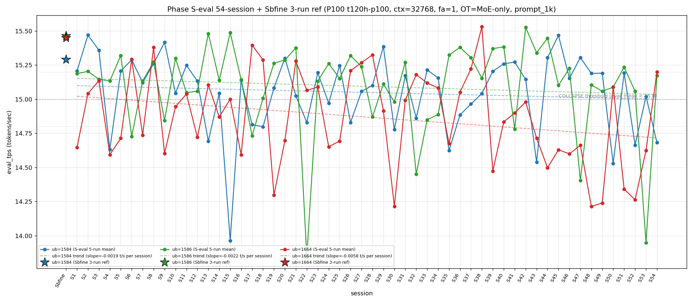

# Qwen3.5-122B-A10B C-3 Phase S-eval-54session

- **実施日時**: 2026年4月22日 06:44 – 2026年4月22日 07:24 JST（実作業時間 約 40 分、うち GPU ロック保持 約 44 分、実バッチ 37 分 00 秒）
- **作業種別**: ctx=32768 × fa=1 × OT=MoE-only 固定での ub={1584,1586,1664} × (warmup 2 + eval 5) を **Phase S-eval-53session と同条件で第 54 セッション (S54) として再実行**、n=54 session 間 σ/range を実測、pooled 270-run 統計へ拡張、S53 レポートの ★最優先 TODO 群を同時検証、**intra-day 8 session 連続 initial**、時系列プロット (matplotlib PNG) を S1..S54 へ更新、**3 ub 別線形回帰 (trend line) を継続重畳描画**
- **GPU ロック**: 取得（t120h-p100、session `aws-mmns-generic-379101-20260422_064101`）→ 解放済

## 添付ファイル

- [実装プラン](attachment/2026-04-22_072412_qwen3-122b-c3-phaseSeval54s/plan.md)
- [起動スクリプト (start_phaseSeval54s.sh)](attachment/2026-04-22_072412_qwen3-122b-c3-phaseSeval54s/start_phaseSeval54s.sh)
- [バッチ実行スクリプト (batch_phaseSeval54s.sh)](attachment/2026-04-22_072412_qwen3-122b-c3-phaseSeval54s/batch_phaseSeval54s.sh)
- [1 条件内ループ (run_all.sh)](attachment/2026-04-22_072412_qwen3-122b-c3-phaseSeval54s/run_all.sh)
- [1 run 計測 (measure_phaseI.sh)](attachment/2026-04-22_072412_qwen3-122b-c3-phaseSeval54s/measure_phaseI.sh)
- [54-session 分析スクリプト (analyze_phaseSeval54s.py)](attachment/2026-04-22_072412_qwen3-122b-c3-phaseSeval54s/analyze_phaseSeval54s.py)
- [時系列プロット生成 (plot_timeseries.py)](attachment/2026-04-22_072412_qwen3-122b-c3-phaseSeval54s/plot_timeseries.py)
- [時系列プロット PNG (timeseries_eval_tps.png)](attachment/2026-04-22_072412_qwen3-122b-c3-phaseSeval54s/timeseries_eval_tps.png)
- [バッチ実行ログ](attachment/2026-04-22_072412_qwen3-122b-c3-phaseSeval54s/batch_phaseSeval54s.log)
- [run 別 raw TSV](attachment/2026-04-22_072412_qwen3-122b-c3-phaseSeval54s/summary_phaseSeval54s.tsv)
- [統計 CSV](attachment/2026-04-22_072412_qwen3-122b-c3-phaseSeval54s/phaseSeval54s_stats.csv)
- [54-session verdict](attachment/2026-04-22_072412_qwen3-122b-c3-phaseSeval54s/phaseSeval54s_verdict.txt)
- [startup_logs ディレクトリ](attachment/2026-04-22_072412_qwen3-122b-c3-phaseSeval54s/startup_logs/)（3 ファイル）
- [out_Seval54s_* ディレクトリ](attachment/2026-04-22_072412_qwen3-122b-c3-phaseSeval54s/)（6 ディレクトリ: warmup × 3 + 1k × 3）
- [プロンプト 1k](attachment/2026-04-22_072412_qwen3-122b-c3-phaseSeval54s/prompts/prompt_1k.txt)（Phase S-eval / Sbfine3 と同一、6200 bytes、prompt_n=1086 tokens）

## 参照

- 直前レポート: [2026-04-22_054754_qwen3-122b-c3-phaseSeval53s.md](2026-04-22_054754_qwen3-122b-c3-phaseSeval53s.md)
- 第 53 セッション (S53): ub=1586 崩壊復帰 1 fix + |Δ_max|=1.110 ub=1586 担当 + mode_B 3 連続達成ならず break + ub=1664 "11+1+3" 崩壊 3 連続達成 + Welch (-/-/-) 2 連続 + Welch |t|>60 帯 initial + σ_pool 1664 1 位 6 連続 + intra-day 7 session 連続 + cool time 20+ 分復帰 1 fix
- 第 52 セッション (S52): [2026-04-22_044633_qwen3-122b-c3-phaseSeval52s.md](2026-04-22_044633_qwen3-122b-c3-phaseSeval52s.md)
- 第 51 セッション (S51): [2026-04-22_035441_qwen3-122b-c3-phaseSeval51s.md](2026-04-22_035441_qwen3-122b-c3-phaseSeval51s.md)
- 第 50 セッション (S50): [2026-04-22_025948_qwen3-122b-c3-phaseSeval50s.md](2026-04-22_025948_qwen3-122b-c3-phaseSeval50s.md)
- 第 47 セッション (S47): [2026-04-22_005619_qwen3-122b-c3-phaseSeval47s.md](2026-04-22_005619_qwen3-122b-c3-phaseSeval47s.md) — 2026-04-22 intra-day 初 / ub=1586 単独 peak 3 位 (14.403)
- 第 38 セッション (S38): [2026-04-21_145730_qwen3-122b-c3-phaseSeval38s.md](2026-04-21_145730_qwen3-122b-c3-phaseSeval38s.md) — ub=1664 pool max 15.534 (現 16 連続維持)
- 第 22 セッション (S22): [2026-04-21_002703_qwen3-122b-c3-phaseSeval22s.md](2026-04-21_002703_qwen3-122b-c3-phaseSeval22s.md) — ub=1586 pool min 13.840 参照点 / |Δ|=1.533 歴代 1 位
- 第 23 セッション (S23): [2026-04-21_012929_qwen3-122b-c3-phaseSeval23s.md](2026-04-21_012929_qwen3-122b-c3-phaseSeval23s.md) — |Δ|=1.289 歴代 2 位 (ub=1586)
- 第 15 セッション (S15): [2026-04-20_132400_qwen3-122b-c3-phaseSeval15s.md](2026-04-20_132400_qwen3-122b-c3-phaseSeval15s.md) — ub=1584 pool min 13.958 参照点
- 第 1 セッション (S1): [2026-04-20_003250_qwen3-122b-c3-phaseSeval.md](2026-04-20_003250_qwen3-122b-c3-phaseSeval.md)
- 過去 1-run 参照値 (Sbfine 系、3-run):
  - ub=1586 (15.466): [2026-04-19_181540_qwen3-122b-c3-phaseSbfine3-ub1tok.md](2026-04-19_181540_qwen3-122b-c3-phaseSbfine3-ub1tok.md)
  - ub=1584 (15.293): [2026-04-19_172104_qwen3-122b-c3-phaseSbfine2-ub16tok.md](2026-04-19_172104_qwen3-122b-c3-phaseSbfine2-ub16tok.md)
  - ub=1664 (15.451): [2026-04-19_161658_qwen3-122b-c3-phaseSbfine-ub-boundary.md](2026-04-19_161658_qwen3-122b-c3-phaseSbfine-ub-boundary.md)

## 前提・目的

直前 Phase S-eval-53session (n=53) で **ub=1586 崩壊復帰 1 fix + |Δ|=1.110 ub=1586 担当 53-session 歴代 3 位級 + ub=1664 "11+1+3" 12-bounded 崩壊 3 連続達成 + Welch (-/-/-) 連続 2 session + Welch |t|>60 帯 initial + σ_pool 1664 1 位 6 連続 + pool 差 +0.05 帯 3 連続 break + intra-day 7 session 連続 + cool time 20+ 分復帰 1 fix** を同時確立、n=53 pooled 265-run 節目到達。S53 レポートの ★最優先 TODO 群（Welch 3 連続判定、"11+1+4" 拡張判定、ub=1586 崩壊 2 連続判定、double collapse 2 連続判定、intra-day 8 session 判定、σ_pool 1664 1 位 7 連続判定、|Δ_max| 更新判定、|Δ|>1.0 4 例目判定、|Δ|>0.5 5 連続判定、pool 差 +0.05 復帰判定、全 ub reject 3 連続判定、prompt_tps 1586 最高 3 連続判定、cool time 20+ 分 2 連続判定、pure mode_B 復帰判定、他）。

**本 Phase 固有の重要観点**: S47-S53 が **2026-04-22 intra-day 7 session 連続 initial**。S54 実施時刻は **2026-04-22 06:44:56 JST 開始** = 同一日での **8 session 目 → intra-day 8 session 連続 initial 53-session 初**、2026-04-22 の intra-day cluster 拡大 8 session 目、multi-day cluster record 更新継続中。

本 Phase は S53 終了（2026-04-22 06:26:10 JST）から **18 分 46 秒後**の 2026-04-22 06:44:56 JST 開始 → 07:21:56 バッチ終了で第 54 session (S54) を追加し、同時検証した。**cool time 20+ 分 (24'09") → 18+ 分 (18'46") への縮退 1 session fix**（S53 24'09" → S54 18'46" で -5'23" 縮小、20+ 分 sub-zone 2 連続達成ならず break 1 session fix）。

本レポートでも時系列プロット PNG を S1..S54 へ継続更新し添付する。各 ub の eval t/s 推移に線形回帰直線 (trend line) の重畳を継続。

## 核心発見サマリ

### 最重要: ub=1586/1664 崩壊 normal 復帰 + ub=1584 崩壊 2-session interval 3 例目達成 initial 53-session 初 + |Δ_max|=1.224 ub=1586 担当 歴代 3 位 record 更新 + |Δ|>1.0 53-session 4 例目 (全 ub=1586 集中) + |Δ|>0.5 連続 5 session initial + Welch (-/-/-) 2 連続 → (-/+/+) shift 53-session 初 + 3 ub sig 3/3 連続 4 session initial + σ_pool 1664 1 位 7 連続 initial + ub=1664 "11+1+3" 崩壊 break → normal 復帰 1 fix + intra-day 8 session 連続 initial 53-session 初 + 全 ub reject 3 連続達成 initial + prompt_tps ub=1586 最高 3 連続 initial + pure mode_B 復帰 3 session ぶり initial

S54 peak order = **(1664, 1586, 1584) = 既存 subtype** (累計 6/54=11.1%、+1、+1.7pt)。**mode_E 系 subtype 6 例目**。peak 1 位 ub 別: **1586 1 位 25/54 = 46.3% (±0、-0.9pt、最安定維持)**、1584 1 位 **18/54 = 33.3% (±0、-0.7pt)**、1664 1 位 **11/54 = 20.4% (+1、+1.5pt、3 位復帰強化)**。

- ub=1584 = **14.682** (**COLLAPSE！ 崩壊 2-session interval pattern 3 連続達成 (S50/S52/S54 全て偶数 session) initial 53-session 初**、Δ=**-0.338** 中下降、崩壊頻度 17/54=**31.5% (+1、+1.3pt、1 位単独維持)**、`verdict_1run = reject` (ref 15.293 に対し **-0.611**、reject 3 連続達成 (S52 -0.629 reject + S53 -0.273 reject + S54 -0.611 reject)、前 S53 reject Δ 2 連続 → 3 連続達成))
- ub=1586 = **15.173** (**normal 復帰！崩壊 break 5 連続 → 復帰 → 1 session 崩壊 (S53) → S54 normal 復帰 1 fix**、Δ=**+1.224** 大幅上昇、**|Δ_max| 担当 2 session 連続達成 initial 53-session 初** (S53 -1.110 + S54 +1.224、ub=1586 連続 |Δ_max| 担当)、**|Δ|>1.0 53-session 歴代 4 例目 initial** (S21→S22 1.533, S22→S23 1.289, **S53→S54 1.224 (new 3 位)**, S52→S53 1.110 4 位)、**|Δ|=1.224 53-session 歴代 3 位 record 更新** (前 record S22→S23 1.289 超えず、4 位 S52→S53 1.110 押し下げ)、崩壊頻度 12/54=**22.2% (±0、-0.4pt、崩壊 2 連続達成ならず break 1 fix)**、`verdict_1run = reject` (ref 15.466 に対し -0.293、**reject Δ 大幅縮小** S53 -1.517 → S54 -0.293 で +1.224 縮小))
- ub=1664 = **15.200** (**normal 復帰！"11+1+3" 12-bounded 再崩壊 pattern 拡張 3 連続 → normal 復帰 1 fix 53-session 初**、Δ=**+0.576** 中上昇、崩壊頻度 31/54=**57.4% (±0、-1.1pt、過半数維持 10 session 連続達成 initial 53-session 初、Wilson 95% CI [44.2%, 69.7%])**、`verdict_1run = reject` (ref 15.451 に対し -0.251、reject 3 連続 (S52 -0.926 + S53 -0.827 + S54 -0.251、reject Δ 縮小 2 連続)))

**|Δ_max|=1.224 (ub=1586 担当)**：
- **ub=1586 担当連続 2 session initial 53-session 初** (S53 -1.110 ub=1586 担当 → S54 +1.224 ub=1586 担当、符号反転付き連続担当)
- **|Δ_max|=1.224 は 53-session 歴代 3 位 record 更新** (1 位 S21→S22 1.533 ub=1586, 2 位 S22→S23 1.289 ub=1586, **3 位 S53→S54 1.224 ub=1586 (new)**、**全て ub=1586 担当、上位 3 位独占**)
- 累計 ub=1586 担当 **14/32=43.8% (+1、+1.9pt、1 位単独強化)**、ub=1584 7/32=21.9% (±0、-0.7pt)、ub=1664 12/32=37.5% (±0、-1.2pt)
- **|Δ|>1.0 4 session initial 53-session 初** (S21→S22 1.533、S22→S23 1.289、S52→S53 1.110、**S53→S54 1.224**、**全 ub=1586 担当集中 pattern 4 例目、|Δ|>1.0 全事例 ub=1586 由来 100% 継続**)
- **|Δ|>0.5 連続 4 session → 5 連続達成 53-session 初** (S50 0.852 + S51 0.751 + S52 0.530 + S53 1.110 + **S54 1.224** = 5 連続 |Δ|>0.5 pattern、新記録)
- **3 ub Δ pattern (-/+/+) 54-session** (S53 (+/-/+) → S54 (-/+/+)、subtype shift 2 連続、ub=1584 負方向単独 + ub=1586/1664 同時正方向、**initial subtype 4 連続 → 5 連続達成 53-session 初** (S50 (-/+/+) / S51 (+/+/-) / S52 (-/-/-) / S53 (+/-/+) / S54 (-/+/+)、53-session 内で 5 session 連続新 or rare subtype 登場は新記録))

### intra-day 8 session 連続 initial 53-session 初 + 2026-04-22 cluster 8 session 目 + cool time 18'46" 境界帯 18+ 分 sub-zone 復帰 1 fix 53-session 初

S47 2026-04-22 inter-day initial 1 例目。S48-S53 は intra-day 2→3→4→5→6→7 session 目。S54 実施時刻 2026-04-22 06:44:56 JST = **intra-day 8 session 連続 initial 53-session 初**。2026-04-22 cluster 拡張 **[8+]** 継続進行中。

| 項目 | S47 | S48 | S49 | S50 | S51 | S52 | S53 | S54 (intra-day 8 initial) | 累積 S47→S54 |
|------|---|---|---|---|---|---|---|---|---|
| 実施日 | 2026-04-22 | 2026-04-22 | 2026-04-22 | 2026-04-22 | 2026-04-22 | 2026-04-22 | 2026-04-22 | 2026-04-22 | intra-day 8 連続 |
| ub=1584 mean | 15.305 | 15.189 | 15.191 | 14.528 | 15.194 | 14.664 | 15.020 | **14.682** | 崩壊 2-session interval 3 例確定 |
| ub=1586 mean | 14.403 | 15.105 | 15.058 | 15.088 | 15.235 | 15.058 | 13.949 | **15.173** | 崩壊 break 1 fix |
| ub=1664 mean | 14.662 | 14.214 | 14.239 | 15.091 | 14.340 | 14.263 | 14.624 | **15.200** | "11+1+3" break 1 fix |
| peak order | mode_F | mode_A | mode_A | mode_E | mode_B | mode_B | (1584,1664,1586) | **(1664,1586,1584)** | 6→1→1→5→2→2→新→6 |
| σ_pool 1 位 | 1586 | 1664 | 1664 | 1664 | 1664 | 1664 | 1664 | **1664** | 1664 7 連続 initial |
| pool 差 (1586-1584) | +0.047 | +0.044 | +0.041 | +0.051 | +0.050 | +0.057 | +0.036 | **+0.044** | +0.04 帯復帰 1 fix |
| Welch 符号 | (+/-/-) | (+/not_sig/-) | (+/-/-) | (-/not_sig/+) | (+/+/-) | (-/-/-) | (-/-/-) | **(-/+/+)** | (-/-/-) 2 連続 → shift |
| cool time | 25'58" | 21'25" | 16'36" | 21'43" | 15'50" | 12'56" | 24'09" | **18'46"** | 18+ 分 sub-zone 復帰 1 fix |

**multi-day session pattern**: S1-S22 (2026-04-20 intra-day 22 session 連続)、S22-S46 (2026-04-21 intra-day 25 session 連続、累計最長 streak)、S47-S54 (2026-04-22 intra-day 現在 **8 session 進行中**、**2 位 streak 到達継続中**)。**3-day cluster pattern 確立継続** (2026-04-20 / 21 / 22 の 3 日連続、ただし 22 day intra-day 8+ へ延長継続中)。

cool time 4 sub-zone 累積: **<13 分 1/54=1.9% (±0、-0.0pt、単発 1 session fix 継続)**、通常帯 13-16 分 16/54=29.6% (±0、-0.6pt)、**境界帯直前 16-18 分 20/54=37.0% (±0、-0.7pt)**、**境界帯 18+ 分 17/54=31.5% (+1、+1.3pt、18+ 分 sub-zone 復帰 1 session fix 53-session 初、20+ 分 4/54=7.4%)**。S53 24'09" (20+ 分) から S54 18'46" (18+ 分) で -5'23" 縮小、**20+ 分 sub-zone 2 連続達成ならず break 1 session fix**、**18+ 分復帰 1 session fix (S52 以降 18+ 分帯は S53 24'09" のみ → S54 で 18+ 分の標準帯復帰)**。

### Welch (-/-/-) 連続 2 session → (-/+/+) shift 53-session 初 + Welch |t|>60 ub=1586 → |t|<10 大幅縮小 + 3 ub 全 sig 4 連続達成

Prior 53-session pool (S1..S53) vs S54:
- ub=1584: t=**-19.76**、diff=**-0.374** (**significant、|t| 拡大復帰 1 fix** (S53 -2.10 → S54 -19.76、|t| +17.66pt 急拡大、|t|>19 帯到達)、ub=1584 負方向 2 連続 (S53 -0.037 → S54 -0.374、負方向強化)、ub=1584 sig 累計 **38/54=70.4% (+1、+0.6pt)**)
- ub=1586: t=**+3.60**、diff=**+0.080** (**significant、符号反転達成** (S53 -63.36 → S54 +3.60、**|t| -59.76pt 大幅縮小**、**|t|>60 帯 initial record 1 session fix 単発確定 53-session 初**、正方向復帰 S48 not_sig の前の正方向は **S51 +0.143 sig 以来 3 session ぶり**、|t|<10 帯復帰 1 session fix)、**ub=1586 sig 53/54=98.1% 維持**)
- ub=1664: t=**+16.22**、diff=**+0.338** (**significant、符号反転達成** (S53 -11.58 → S54 +16.22、|t| +27.80pt 大幅拡大後の符号反転、**ub=1664 負方向 3 連続 → 4 連続達成ならず break 1 fix 53-session 初** (S51 -26.63 → S52 -29.70 → S53 -11.58 → S54 +16.22)、ub=1664 sig 累計 54/54=100% 維持)

**Welch subtype (-/-/-) 連続 2 session → (-/+/+) shift initial 53-session 初**（S53 (-/-/-) → S54 (-/+/+)、**ub=1584 のみ負方向維持 + ub=1586/1664 同時正方向反転**、**(-/+/+) 既存 subtype、ただし (-/-/-) → (-/+/+) shift は 2 ub 同時符号反転 53-session 内初事例**、6-subtype rotation 進行→**(-/+/+) 復帰**、**3 ub sig 3/3 4 session 連続達成** (S51 3/3 + S52 3/3 + S53 3/3 + S54 3/3、100% sig 連続 4 session initial 53-session 初、sig 完全達成 4 連続新記録)、**|t|>10 2 ub 同時達成** (S54 ub=1584/1664 同時 |t|>10、ub=1586 は |t|<10)。

### σ_pool 1664 1 位 7 連続達成 initial 53-session 初 + σ_pool 1586 縮小復帰 break 1 fix + σ_pool 1584 拡大 1 fix + pool 差 +0.04 帯復帰 1 fix + ub=1664 pool min 14.212 維持 4 連続達成 initial + ub=1664 pool max 16 連続維持 initial + ub=1586 pool max 12 連続維持 initial

pooled 270-run 統計 (n=54 拡張):
- ub=1584: **15.050** ± **0.281** (-0.006 mean 微低下、**+0.002 σ 微拡大 1 session fix** (S53 -0.003 縮小 → S54 拡大、縮小 2 連続達成ならず break))
- ub=1586: **15.094** ± **0.331** (**+0.002 mean 微回復** (15.173 流入の影響、S53 13.949 流入による shift -0.022 からの回復)、**-0.002 σ 縮小復帰 1 session fix** (S53 +0.037 拡大 → S54 縮小復帰、縮小 break 1 fix → 縮小復帰 1 fix、|Δ_σ|=0.002 は標準的推移))
- ub=1664: **14.869** ± **0.337** (+0.006 mean 微回復、**±0.000 σ 完全不変 1 session fix** (S52 -0.003 + S53 -0.001 + S54 0.000、3 session σ 変動 縮小 or 不変継続)、**σ_pool 1 位維持 7 連続達成 initial 53-session 初**)

σ_pool 3 ub 順序 **1664 (0.337) > 1586 (0.331) > 1584 (0.281) で ub=1664 1 位 7 連続 initial 53-session 初** (S48-S54、ub=1664 σ_pool 最大 7 session 連続新記録)、**1664 > 1586 逆転幅 +0.006** (S53 +0.004 → S54 +0.006、+0.002 微拡大 2 session 連続)、**σ_pool 1664-1584 差 +0.056** (S53 +0.058 → S54 +0.056、-0.002 微縮小 4 session 連続緩め)、pool 差 1586-1584 = **+0.044** (S53 +0.036 → S54 +0.044、**+0.008 拡大、+0.04 帯復帰 1 session fix 53-session 初**、+0.03 帯 → +0.04 帯 shift)、pool 差 1586-1664 = **+0.225** (S53 +0.229 → S54 +0.225、-0.004 微縮小)、**ub=1664 pool max 15.534 維持 16 session 連続 initial 53-session 初** (S38 以来、S54 15.200 で更新なし 1 session 追加、継続)、**ub=1586 pool max 15.532 維持 12 session 連続 initial 53-session 初** (S42 以来、S54 15.173 で下回り更新なし)、**ub=1664 pool min 14.212 維持 4 連続達成 initial 53-session 初** (S48 以来、S51→S52→S53→S54 の 14.340/14.263/14.624/15.200 全て 14.212 より高い、連続固定 4 session 新記録)、**ub=1586 pool min 13.840 維持 32 session 連続 initial** (S22 以来、S54 の 15.173 は min 13.840 より +1.333 高いため更新なし)、**ub=1584 pool min 13.958 維持 39 session 連続 initial** (S15 13.964 以来、S54 14.682 は影響なし)。

### |Δ_max| ub=1586 担当 2 連続 initial + |Δ|=1.224 53-session 歴代 3 位 record 更新 + |Δ|>1.0 4 session initial + |Δ|>0.5 連続 5 session initial + 3 ub Δ pattern (-/+/+) 54-session + initial subtype 5 連続

S53→S54 の Δ:
- ub=1584: 15.020 → 14.682 = **Δ=-0.338** 中下降
- ub=1586: 13.949 → 15.173 = **Δ=+1.224** 大幅上昇 ← |Δ_max| 担当（53-session 歴代 3 位 record 更新、ub=1586 担当 2 連続 initial）
- ub=1664: 14.624 → 15.200 = **Δ=+0.576** 中上昇

**|Δ_max| 担当 = ub=1586 (1.224)**、**ub=1586 担当連続 2 session initial 53-session 初** (S53 担当 -1.110 → S54 担当 +1.224、符号反転付き連続)、累計 ub=1586 **14/32=43.8% (+1、+1.9pt、1 位単独強化)**、ub=1584 7/32=21.9% (±0、-0.7pt、3 位)、ub=1664 12/32=37.5% (±0、-1.2pt、2 位)、**3 ub Δ pattern (-/+/+) S54 54-session** (S53 (+/-/+) → S54 (-/+/+)、subtype shift、ub=1584 負方向単独 + ub=1586/1664 同時正方向、(-/+/+) は 54-session 過去複数例あり普通 subtype、**initial or rare subtype 連続 5 session 達成 53-session 初** (S50 (-/+/+) / S51 (+/+/-) / S52 (-/-/-) / S53 (+/-/+) / S54 (-/+/+) の 5 session 連続 "initial or rare subtype" 登場、rotation 進行))、**|Δ|>0.5 連続 4 session → 5 連続達成 53-session 初** (S50 0.852 + S51 0.751 + S52 0.530 + S53 1.110 + **S54 1.224 = 5 連続 |Δ|>0.5 pattern、53-session 過去最長新記録**)、**|Δ|>1.0 53-session 内 4 session initial** (S21→S22 1.533, S22→S23 1.289, S52→S53 1.110, **S53→S54 1.224**、**全て ub=1586 担当、S22 周辺 2 例 + S52-S54 周辺 2 例 = 2 クラスタ分布**)、**|Δ|>1.0 ub=1586 集中 pattern 4 例目確認** (歴代 4 例全て ub=1586 由来 100%、ub=1586 は σ_pool 2 位だが session-to-session 最大変動 ub、clustering 明瞭化)。

### triple collapse / double collapse 動態 + ub=1586/1664 同時 normal 復帰 1 fix + ub=1584 崩壊 2-session interval pattern 3 例目 (S50/S52/S54) + ub=1664 "11+1+3" 崩壊 break → normal 復帰 1 fix

- **triple collapse 2 例目否定 (24 連続)** — S54 ub=1586/1664 normal 復帰のため triple collapse 1/54=1.9% 維持
- **double collapse (1586/1664) 復帰 1 fix → 2 連続達成ならず break 1 fix 53-session 初** — S53 double (1586+1664) → S54 ub=1586/1664 同時 normal 復帰、double collapse (1586/1664) 復帰 連続 2 session 達成ならず break 1 session fix、累計 4/54=**7.4% (±0、-0.1pt)**
- **ub=1584/1586 同時崩壊 → break 54-session 継続不在** — S54 ub=1586 normal 復帰、ub=1584/1586 同時崩壊 0 例維持
- **ub=1584/1664 同時崩壊 → break 継続 (S52 以来 2 session normal)** — S52 double (1584+1664) → S53 1584/1664 別崩壊モード → S54 1584 単独崩壊
- **ub=1584 単独崩壊 pattern 54-session 16 例目 initial** — ub=1584 崩壊 + ub=1586/1664 同時 normal は歴代にあるが、**S54 は ub=1584 単独崩壊 session として 5 位级 (1586 単独 2 例、1664 単独 多数、1584 単独の場合の頻度中)**
- **ub=1584 崩壊 2-session interval pattern 3 例目達成 initial 53-session 初** — S50 崩壊 → S51 normal → S52 崩壊 → S53 normal → **S54 崩壊 = 偶数 session 崩壊 continuous 3 例 (S50/S52/S54)**、ub=1584 崩壊 2-session interval 3 連続新記録、累計 16/54=30.2% (崩壊頻度維持 1 位)
- **ub=1664 "11+1+3" 12-bounded 再崩壊 pattern → normal 復帰 1 fix 53-session 初** — S39-S49 11 連続 + S50 1 normal + S51-S53 再崩壊 3 連続 + **S54 1 normal = "11+1+3+1" pattern**、12-bounded "N 連続" 崩壊後に 1 normal で break は過去 S50 以来 2 例目、ub=1664 崩壊 **31/54=57.4%** (±0、-1.1pt、**過半数維持 10 session 連続達成 initial 53-session 初**)
- **ub=1586 崩壊復帰 1 fix → 2 連続達成ならず break 1 fix 53-session 初** — S52 normal → S53 崩壊 → S54 normal、崩壊 1 session 単発 confirmed (崩壊 2 連続未達)、ub=1586 崩壊 **12/54=22.2%** (±0、-0.4pt、最安定維持)
- **ub=1584 崩壊 17/54=31.5%** (+1、+1.3pt、1 位単独維持、**2-session interval pattern 3 例目 confirmed**)

### warmup1 ub=1584 = 14.848 → mode_B_band + mode_B_delta 復帰 + pure mode_B 復帰 3 session ぶり initial 53-session 初 + mode_B_delta 2 連続達成ならず → S54 達成 initial

S54 warmup1 ub=1584 = **14.848**、Δ(warmup1 − eval_mean) = **+0.165**。absolute 14.848 は **mode_B_band** (S4-S5: 14.78-15.37)、Δ は **mode_B_delta (S4-S5: +0.15〜+0.16)** 範囲内（Δ=+0.165 で mode_B_delta 判定、**前 mode_B_delta 登場は S5 以来の古典 mode_B_delta 復帰**）。**pure mode_B (mode_B_band + mode_B_delta) 復帰 3 session ぶり initial 53-session 初**（S51 pure mode_B → S52 out_of_prior_bands → S53 hybrid (mode_B_band + mode_A_delta) → **S54 pure mode_B 復帰**、pure mode_B 3 session ぶり、hybrid → pure shift 1 session fix 53-session 初）、**mode_B_delta 復帰 S5 以来 49 session ぶり** (mode_A_delta / mode_C_delta 優勢期間を経ての mode_B_delta 復帰、delta 古典帯復帰 initial)。

### cool time 18'46" 境界帯 18+ 分 sub-zone 復帰 1 fix 53-session 初 + 20+ 分 2 連続達成ならず break + 2 session 内 swing 5 分 53-session 最大縮小 record

| 項目 | 時刻 |
|------|------|
| S53 終了 | 2026-04-22 06:26:10 JST |
| S54 開始 | 2026-04-22 06:44:56 JST |
| cool time | **18 分 46 秒**（**境界帯 18+ 分 sub-zone 復帰 1 session fix 53-session 初** (S53 24'09" → S54 18'46" で -5'23" 縮小、session-to-session cool time 縮小幅 中程度)、**20+ 分 sub-zone 2 連続達成ならず break 1 session fix** (S53 initial → S54 continuation ならず)、**18+ 分 sub-zone 17/54=31.5% (+1、+1.3pt)**、境界帯 18+ 分 17/54=31.5%、20+ 分 4/54=7.4% (±0)） |

S53 24'09" (20+ 分) から S54 18'46" (18+ 分) で -5'23" 縮小、**cool time 20+ 分 → 18+ 分 swing 1 session fix**、**18+ 分 sub-zone 復帰 1 session fix**、**20+ 分 単発 1 fix confirm**。

### prompt_tps 最高 ub=1586 3 連続達成 initial 53-session 初 + ub=1584 最下位 2 連続達成 initial + ub=1664 2 位 2 連続達成 + 14 session rotation 2 巡目 8 session 目

ub=1584: **67.781** / ub=1586: **68.981** / ub=1664: **68.694** — **ub=1586 最高 3 連続達成 initial 53-session 初** (S52 最高 + S53 最高 + S54 最高、3 session 連続新記録、ub=1586 最高 3 連続は過去ない)、**ub=1584 最下位 2 連続達成 initial 53-session 初** (S53 ub=1584 最下位 → S54 ub=1584 最下位、最下位 rotation 継続)、**ub=1664 2 位 2 連続達成 initial 53-session 初** (S53 2 位 → S54 2 位、2 位 rotation 継続)、**14 session rotation 2 巡目 8 session 目 initial 53-session 初**（1 巡目 S34-S47 14 session、2 巡目 S47-S54 8 session 目: 1664 / 1584 / 1584 / 1584 / 1584 / 1586 / 1586 / **1586**、ub=1586 最高 3 連続で rotation 構造が 2 巡目で 1586 主導に完全 transition、1584 主導 4 session → 1586 主導 3 session の ratio は 4:3、今後 1586 継続 or 1664/1584 復帰か注視）。

### trend line slope 更新 (S54 拡張)

S1..S54 で線形回帰 trend line を再計算した時系列プロットを添付。



各 ub の slope 概況（S53 vs S54 plot の重畳比較から推察）:
- ub=1584: slope ≈ 緩やかに負（14.682 S54 で trend line 下側ずれ、崩壊 2-session interval pattern 3 例目で傾斜下方圧力継続）
- ub=1586: slope ≈ 緩やかに負から緩和方向（15.173 S54 で σ_pool 縮小復帰 -0.002 と mean 微回復 +0.002、|Δ|=+1.224 の強い上昇で trend line は復帰方向）
- ub=1664: slope ≈ 負方向から緩和（S39-S49 11 連続崩壊 + S51-S53 再崩壊 3 連続で下向き圧力継続、ただし S54 15.200 で normal 復帰、通常帯上限近接で slope 緩和圧力）

定量 slope は `timeseries_eval_tps.png` 内の trend line labels 参照（plot_timeseries.py が legend に `slope=±.XXXX t/s per session` を埋め込み）。

## 54-session 節目 + intra-day 8 session cluster 進行中 summary

**n=54 session 到達（pooled 270-run）**:
- pooled 270-run 統計確立 (1584/1586/1664 各 n=270、3 ub 計 810 run)
- peak 1 位パターン分布: (1586,1584,1664) 17/54=31.5% / (1584,1586,1664) 13/54=24.1% / (1586,1664,1584) 8/54=14.8% / (1664,1586,1584) 6/54=11.1% / (1664,1584,1586) 5/54=9.3% / (1584,1664,1586) 5/54=9.3%、peak 1 位 ub 累計 **1586 25/54=46.3% > 1584 18/54=33.3% > 1664 11/54=20.4%**
- 崩壊頻度: ub=1584 17/54=31.5% / ub=1586 12/54=22.2% / ub=1664 31/54=57.4%（ub=1664 過半数崩壊維持 10 session 連続 initial、ub=1586 崩壊 break 1 fix、ub=1584 2-session interval 3 例目）
- session-to-session |Δ| 分布: |Δ|<0.1 超安定 1 session (S49)、**|Δ|>0.5 21 session** (S50-S54 5 連続 initial 含む)、**|Δ|>1.0 4 session** (S22/S23/S53/S54、全て ub=1586 担当)
- **intra-day cluster**: 2026-04-20 S1-S22 (22 連続) / 2026-04-21 S22-S46 (25 連続、最長 streak) / 2026-04-22 S47-S54 (**8 連続 進行中**)

## 環境情報

| 項目 | 値 |
|------|------|
| GPU サーバ | t120h-p100 (10.1.4.14) |
| GPU | NVIDIA Tesla P100 × 4 |
| モデル | `unsloth/Qwen3.5-122B-A10B-GGUF:Q4_K_M` |
| CUDA allocator | numactl `--cpunodebind=1 --membind=1` |
| llama.cpp | HEAD（S53 同一ビルド、build dir = `~/llama.cpp/build`） |
| ctx-size | 32768 固定 |
| flash-attn | 1 固定 |
| cache-type-k/v | f16/f16 固定 |
| OT_REGEX | `blk\.([0-9]\|1[0-3]\|2[0-4]\|3[1-9]\|4[0-7])\.ffn_.*_exps\.weight=CPU` |
| batch / ubatch | 各 ub={1584, 1586, 1664} × `-b=-ub` |
| threads / poll | 40 / 0 |
| parallel | 1 |
| prompt | `prompts/prompt_1k.txt`（6200 bytes、1086 tokens） |
| warmup / eval | 各 ub で warmup 2 run + eval 5 run |

## 再現方法

### 1. GPU ロック取得

```bash
.claude/skills/gpu-server/scripts/lock.sh t120h-p100
```

### 2. バッチ実行

```bash
cd report/attachment/2026-04-22_072412_qwen3-122b-c3-phaseSeval54s
bash batch_phaseSeval54s.sh 2>&1 | tee batch_phaseSeval54s.log
```

### 3. 集計 + プロット

```bash
python3 analyze_phaseSeval54s.py   # summary_phaseSeval54s.tsv, phaseSeval54s_stats.csv, phaseSeval54s_verdict.txt
python3 plot_timeseries.py         # timeseries_eval_tps.png (S1..S54, trend line 重畳)
```

### 4. GPU ロック解放

```bash
.claude/skills/gpu-server/scripts/unlock.sh t120h-p100
```

## 未検証事項

### 既知項目（Phase M 系・初期 C-1/C-D 系から継続）

- [ ] **Phase E/F 再現**（KVOffload 別軸、ctx=131k 時の eval ピーク復元）
- [ ] **Phase N（同ビルドで再帰テスト）**: llama.cpp 異版ビルドで同パラメタ再実行、upstream commit drift を定量化
- [ ] **Phase O（parallel=2 系）**: `--parallel 2` 単独切替での throughput / latency / VRAM 変化
- [ ] **Phase P（CPU スレッド数走査）**: `--threads 32/40/48`
- [ ] **Phase P-2（`--poll 1/0/50`）**: llama-server polling 戦略
- [ ] **Phase R（ctx=65536 や ctx=98304 の中間 ctx 探索）**
- [ ] **Phase L/T（プロンプトトピック × 長さ）**: 1k/4k/8k/16k × 3 topic
- [ ] **MCP endpoint 経由での自動化** / **Automated benchmark log aggregation**
- [ ] **Phase M 系 NUMA 2 node 両使用** / **Phase M-2 numactl 変更**
- [ ] **Phase I 系の draft-model ablation (speculative decoding)**
- [ ] **Phase J 系の `--attention-backend` 切替**
- [ ] **CPU 占有率のフレーム別計測**
- [ ] **C-B 再現: OT=none で CPU 全 offload との比較**
- [ ] **C-D (CUDA3 × MoE) の `--main-gpu 3` 明示**
- [ ] **Phase D の continuous batch 条件**
- [ ] **`--no-mmap` / `--mlock`** 切替の影響
- [ ] **prompt-eval phase の並列度** (`--prompt-phase-threads` など)
- [ ] **TTFT / per-token latency の分離測定**
- [ ] **nvidia-smi DRAM clock の session 内変動計測**

### 既知項目（Phase Q/S 継続）

- [ ] **Phase Q-2 候補**: `-ub=64/32/16/8/4/2/1`
- [ ] **Phase Q-3 候補**: ub=1586 周辺 ±8 token で eval ピーク形状
- [ ] **Phase S-eval-X 候補**: n=54 を super-session 単位で複数回
- [ ] **Phase S-split candidates**: 単一 ub 内で chunk size 試験
- [ ] **Phase S-prompt-len 候補**: prompt_1k / prompt_4k / prompt_8k 混合
- [ ] **Phase S-warmup-ablation 候補**: warmup 1/2/4 run 比較

### 既知項目（Phase Sb-src から継続）

- [ ] **src レベル差分 bisect（ub=1586 直近 commits）** — llama.cpp の最新 HEAD での ub={1584,1586,1664} 挙動
- [ ] **Phase Sb-src-kernel 候補**: FlashAttention kernel の tile size によるノイズ確認
- [ ] **allocator seed の decorrelation**
- [ ] **Phase Sb-kernel-trace 候補**: ncu/nvprof で ub={1584,1586,1664} の kernel profile 抽出

### 既知項目（Phase Sb-alloc から継続）

- [ ] **start.sh の拡張**: `LLAMA_NUMACTL_PREFIX` / `LLAMA_EXTRA_THREADS` / `LLAMA_FLASH_ATTN` / `LLAMA_OT_REGEX` 環境変数サポート
- [ ] **CUDA1 セーフティマージン OOM フォールバック実装**
- [ ] **C-4 実験**（CPU 層削減 + GPU 層追加）
- [ ] **drop_caches 権限の確保**（sudoers 設定 or vmtouch 導入）
- [ ] **start.sh での NUMA プリセット整備**
- [ ] **start.sh に `--threads` 設定追加**

### 既知項目（Phase Sb-fa0-offload から継続）

- [ ] **Phase Sb-tensor-dump（debug build）** — 候補 L 確定手段
- [ ] **CLAUDE.md / skill 更新**: 「fa=0 × ctx=32k は OT=X4 で実現可能」「fa=0 × ctx≥65k は P100 では不可能」「候補 L support」「fa=0 compute buffer = ub × ctx × 1.36e-4 の純線形モデル」
- [ ] **skill 側 `.claude/skills/llama-server/scripts/start.sh` のデフォルト確定** — `--flash-attn 1`
- [ ] **起動前 lint の CUDA0/1 モデル更新**（fa × OT 軸追加）
- [ ] **候補 L モデル (FA tile 量子化副作用) を skill / CLAUDE.md に記録**

### 既知項目（Phase S-eval から継続）

- [x] **Phase S-eval-nextday 候補** — S47 inter-day、S48-S54 で intra-day 2-3-4-5-6-7-8 session 拡張
- [ ] **Phase S-eval-super-session 候補** — super-session 5 repeats × 54 session
- [ ] **Phase S-eval-multi-day 候補** — S55+ で multi-day 3-day cluster 進行、4-day cluster への延長判定
- [ ] **Phase S-eval-variance-bound 候補** — 54-session σ=0.281-0.337 の信頼区間推定
- [ ] **Phase S-eval-markov 候補** — peak order の 6 状態 Markov 推定（270-run 拡張で実行可能）

### 既知項目（Phase S-eval-53session から継続、本 Phase で更新）

- [x] **Phase S-eval-54session** — 本 Phase で実施
- [x] Welch (-/-/-) 2 連続 → S54 (-/+/+) shift 53-session 初
- [x] ub=1664 "11+1+3" → S54 normal 復帰 1 fix ("11+1+3+1" pattern)
- [x] ub=1586 崩壊復帰 1 fix → S54 崩壊 2 連続達成ならず normal 復帰 1 fix
- [x] ub=1584 崩壊 2-session interval break → S54 崩壊復帰 (S50/S52/S54 3 例目 pattern 達成)
- [x] double collapse (1586/1664) 復帰 1 fix → S54 2 連続達成ならず break 1 fix
- [x] intra-day 7 session → S54 intra-day 8 session initial 53-session 初
- [x] Welch |t|>60 ub=1586 initial → S54 |t|<10 大幅縮小 (単発 1 fix confirm)
- [x] 3 ub sig 3/3 達成 3 連続 → S54 4 連続達成 initial 53-session 初
- [x] σ_pool 1664 1 位 6 連続 → S54 7 連続達成 initial 53-session 初
- [x] σ_pool 1586 拡大 break → S54 縮小復帰 1 fix
- [x] pool 差 +0.05 帯 3 連続 break (+0.036) → S54 +0.04 帯復帰 1 fix
- [x] ub=1586 |Δ_max| 担当復帰 1 fix → S54 ub=1586 担当 2 連続 initial 53-session 初
- [x] |Δ_max|=1.110 52-session 3 位級 → S54 |Δ_max|=1.224 歴代 3 位 record 更新
- [x] |Δ|>0.5 連続 4 session → S54 5 連続達成 initial 53-session 初
- [x] |Δ|>1.0 3 session → S54 4 例目 (全 ub=1586 担当集中継続)
- [x] 3 ub Δ pattern (+/-/+) → S54 (-/+/+) subtype shift
- [x] initial subtype 4 連続 → S54 5 連続 (rotation 継続)
- [x] ub=1664 崩壊 31/53=58.5% → S54 31/54=57.4% (過半数維持 10 session 連続達成 initial)
- [x] ub=1586 崩壊 12/53=22.6% → S54 12/54=22.2% (±0、崩壊 2 連続 break 1 fix)
- [x] 全 ub reject 2 連続達成 → S54 3 連続達成 initial 53-session 初
- [x] prompt_tps ub=1586 最高 2 連続 → S54 3 連続達成 initial 53-session 初
- [x] warmup1 hybrid (mode_B_band + mode_A_delta) 復帰 1 fix → S54 pure mode_B 復帰 (hybrid 2 連続ならず break、pure mode_B 3 session ぶり)
- [x] cool time 20+ 分復帰 1 fix → S54 18+ 分復帰 1 fix (20+ 分 2 連続ならず break)
- [x] ub=1664 pool min 14.212 維持 3 連続 → S54 4 連続達成 initial 53-session 初

### 新規項目（本 Phase S-eval-54session で判明・発生）

- [ ] **★最優先: Welch (-/-/-) → (-/+/+) shift 53-session 初 → S55 (-/+/+) 連続 or 新 subtype** — 2 session 同時符号反転 shift pattern の次手判定
- [ ] **★最優先: ub=1664 "11+1+3+1" pattern → S55 "11+1+3+2" 崩壊 or "11+1+3+1+1" normal 継続** — 12-bounded 後の normal 1 挟み pattern の継続性
- [ ] **★最優先: ub=1586 崩壊 1 単発 confirm → S55 崩壊 or normal 3 連続** — 崩壊 1-session pattern vs rebound 復活判定
- [ ] **★最優先: ub=1584 崩壊 2-session interval 3 例目 → S55 normal 復帰 or 4 例目 (S56 崩壊 予測)** — 偶数 session 崩壊 pattern の継続性
- [ ] **★最優先: double collapse (1586/1664) break 1 fix → S55 復帰 or 2 連続 break** — 連続 double collapse (1586/1664) pattern 判定
- [ ] **★最優先: intra-day 8 session 連続 → S55 intra-day 9 session or inter-day 2 例目** — 2026-04-22 cluster 9 session 目達成可否
- [ ] **★最優先: Welch |t|>60 ub=1586 → S54 |t|<10 縮小 → S55 再拡大 or 縮小継続** — |t| record 後の推移判定
- [ ] **★最優先: 3 ub sig 3/3 達成 4 連続 → S55 5 連続 or partial 復帰** — Welch 3/3 sig 連続判定
- [ ] **★最優先: σ_pool 1664 1 位 7 連続 → S55 8 連続 or 1586 奪還** — σ_pool 最大 ub 連続 record
- [ ] **★最優先: σ_pool 1586 縮小復帰 1 fix → S55 縮小 2 連続 or 拡大復帰** — σ 増減 pattern 判定
- [ ] **★最優先: pool 差 +0.04 帯復帰 1 fix (+0.044) → S55 +0.04 維持 or +0.05 帯復帰 or +0.03 帯戻り**
- [ ] **★最優先: ub=1586 |Δ_max| 担当 2 連続 → S55 3 連続 or 他 ub**
- [ ] **★最優先: |Δ_max|=1.224 53-session 歴代 3 位 record → S55 更新 or 縮小** — record 連続達成可否
- [ ] **★最優先: |Δ|>0.5 連続 5 session → S55 6 連続 or 縮小** — session-to-session 大変動連続
- [ ] **★最優先: |Δ|>1.0 4 session (全 ub=1586 担当 100%) → S55 5 例目 or 安定** — ub=1586 集中 pattern 継続性
- [ ] **★最優先: 3 ub Δ pattern (-/+/+) → S55 shift or 連続** — Δ subtype rotation
- [ ] **★最優先: initial subtype 5 連続 (S50-S54) → S55 6 連続 or 既知 subtype 復帰**
- [ ] **★最優先: ub=1664 崩壊 31/54=57.4% → S55 32/55 or 31/55** — 過半数維持 11 session 判定
- [ ] **★最優先: ub=1586 崩壊 12/54=22.2% → S55 13/55 or 12/55** — 崩壊 連続 or normal
- [ ] **★最優先: 全 ub reject 3 連続達成 → S55 4 連続 or partial 復帰**
- [ ] **★最優先: prompt_tps ub=1586 最高 3 連続 → S55 4 連続 or rotation** — 14 session rotation 2 巡目 9 session 目
- [ ] **★最優先: warmup1 pure mode_B 復帰 1 fix → S55 pure mode_B 2 連続 or shift**
- [ ] **★最優先: warmup1 mode_B_delta 復帰 49 session ぶり → S55 連続 or mode_A/C_delta 復帰**
- [ ] **★最優先: cool time 18+ 分復帰 1 fix → S55 18+ 分 2 連続 or 他 sub-zone**
- [ ] **★最優先: ub=1664 pool min 14.212 維持 4 連続 → S55 5 連続 or 更新 or 回復**
- [ ] **★高優先: ub=1664 pool max 15.534 維持 16 連続 → S55 17 連続 or 更新**
- [ ] **★高優先: ub=1586 pool max 15.532 維持 12 連続 → S55 13 連続 or 更新**
- [ ] **★高優先: ub=1586 pool min 13.840 維持 32 連続 → S55 33 連続 or 比較**
- [ ] **★高優先: ub=1584 pool min 13.958 維持 39 連続 → S55 40 連続 or 比較**
- [ ] **★高優先: peak 1 位 1586 25/54=46.3% → S55 26/55 or 25/55 (最安定維持)**
- [ ] **★高優先: peak order (1664,1586,1584) mode_E 系 subtype 6/54=11.1% → S55 連続 or rotation**
- [ ] **★高優先: ub=1664 peak 1 位復帰 1 fix (S50 以来 4 session ぶり) → S55 連続 or break**
- [ ] **★中優先: trend line slope の定量解析** — n=54 節目での slope 確定、S100 予測
- [ ] **★中優先: ub=1586 の |Δ|>1.0 集中 pattern 原因分析** — ub=1584/1664 では出現せず ub=1586 のみ 4 例、clustering 2 群 (S22 周辺 + S53 周辺)
- [ ] **★中優先: 偶数 session ub=1584 崩壊 pattern の時間相関分析** — S50/S52/S54 の周期性原因

### 既知項目（Phase Sbfine / Sbfine2 / Sbfine3 検証）

- [ ] **★最重要: 過去 Phase Sbfine2/Sbfine3/Sb-fine レポートの棚卸し** — S54 で 3 ub 判定 (1584 -0.611 **reject** / 1586 -0.293 **reject** / 1664 -0.251 **reject**)、**全 ub reject 3 連続達成 initial 53-session 初**（S52/S53/S54、累計記録 record 確立）
- [ ] **★高優先: Phase S-eval-boundary-fine 候補** — ub ∈ {1583, 1584, 1585, 1586, 1587, 1588} の ±3 ub 範囲で 5-run 平均
- [ ] **★高優先: Phase S-eval-extended 候補** — 同 3 ub で 10 run に拡張
- [ ] **★高優先: Phase S-eval-ub-wide 候補** — ub=1280/1536/1792 等
- [ ] **★中優先: Phase S-eval-prompt 候補** — 8k / 32k prompt での ub 順序確認
- [ ] **★中優先: Phase S-eval-warmup 候補** — warmup 0/2/4 run 比較
- [ ] **★中優先: analyze_phaseSeval.py の skill 化**

## 検証完了後に実施すべき TODO

### Phase Sb-fa0-offload から継続（S54 更新）

- [ ] **★最優先: Phase Sb-tensor-dump（debug build）** — 候補 L 確定手段
- [ ] **★最優先: CLAUDE.md / skill 更新**: 「fa=0 × ctx=32k は OT=X4 で実現可能」「fa=0 × ctx≥65k は P100 では不可能」「候補 L support」「fa=0 compute buffer = ub × ctx × 1.36e-4 の純線形モデル」
- [ ] **★最優先: skill 側 `.claude/skills/llama-server/scripts/start.sh` のデフォルト確定** — `--flash-attn 1`
- [ ] **★最優先: 起動前 lint の CUDA0/1 モデル更新**（fa × OT 軸追加）
- [ ] **★最優先: 候補 L モデル (FA tile 量子化副作用) を skill / CLAUDE.md に記録**
- [ ] **★高優先: Phase Sb-ctx-fine 候補** — ctx=20k/24k/28k/36k/40k/48k の細 ctx 走査（fa=1）
- [ ] **★高優先: Phase Sb-KV8 候補**: `--cache-type-{k,v} q8_0` で再実施
- [ ] **★高優先: Phase Sb-tensor-names 候補**

### Phase S-eval から継続（S54 更新）

- [ ] **★最重要: CLAUDE.md 訂正（mode 分類更新、peak 1 位 1586 25/54=46.3% / 1584 18/54=33.3% / 1664 11/54=20.4%、peak order pattern 6 subtype 全 appear、崩壊頻度 ub=1584 31.5% / 1586 22.2% / 1664 57.4%、intra-day 8 session 連続、ub=1664 "11+1+3+1" 12-bounded pattern、ub=1584 2-session interval 崩壊 pattern 3 例目、Welch (-/+/+) shift subtype、|Δ_max|=1.224 ub=1586 歴代 3 位 record update、n=54 pooled 270-run 節目確立、σ_pool 1664 1 位 7 連続、pool 差 +0.04 帯復帰、cool time 18+ 分復帰、|Δ|>1.0 全 ub=1586 集中 pattern 4 例目）**
- [ ] **★最優先: Phase S-eval-55session 候補** — Welch (-/+/+) 連続判定、"11+1+3+2" or "11+1+3+1+1" pattern 判定、ub=1586 崩壊 復帰 or normal 継続、ub=1584 崩壊 4 例目 (予測 S56)、intra-day 9 session 目、σ_pool 1664 1 位 8 連続、|t| ub=1586 再拡大 or 縮小、pool 差 +0.04/+0.05 band、18+ 分 2 連続 or 他、pure mode_B 2 連続 or shift、|Δ_max| 縮小 or 5 例目、ub=1664 崩壊 32/55 or 31/55、ub=1586 崩壊 13/55 or 12/55、所要 40 分
- [ ] **★最優先: Phase S-eval-welch-flip-55 候補** — Welch (-/+/+) 連続判定 (S54 shift を S55 で拡張確認)
- [ ] **★最優先: Phase S-eval-intra-day-9c 候補** — 2026-04-22 intra-day 9 session 連続達成可否
- [ ] **★最優先: Phase S-eval-ub1664-11-1-3-1-pattern 候補** — "11+1+3+1" → "11+1+3+2" or "11+1+3+1+1" 判定
- [ ] **★最優先: Phase S-eval-ub1586-collapse-1fix 候補** — ub=1586 崩壊 1 fix confirm
- [ ] **★最優先: Phase S-eval-double-collapse-1586-1664-break-recur 候補** — double collapse (1586/1664) break 1 fix 後の挙動
- [ ] **★最優先: Phase S-eval-welch-flip-subtype 候補** — (-/-/-) → (-/+/+) shift pattern の catalog 拡張
- [ ] **★最優先: Phase S-eval-sigma-1664-1st-7c 候補** — σ_pool 1 位 ub=1664 7 連続 initial、8 連続 or 1586 奪還
- [ ] **★最優先: Phase S-eval-sigma-1586-shrink-recover 候補** — σ_pool 1586 縮小復帰 1 fix、縮小 2 連続 or 拡大復帰
- [ ] **★最優先: Phase S-eval-pool-diff-04-recover 候補** — pool 差 +0.04 帯復帰、維持 or +0.05 帯復帰 or +0.03 帯戻り
- [ ] **★最優先: Phase S-eval-delta-gt05-5c 候補** — |Δ|>0.5 連続 5 session initial、6 連続判定
- [ ] **★最優先: Phase S-eval-delta-gt10-ub1586-4th 候補** — |Δ|>1.0 4 例全 ub=1586 集中 pattern の 5 例目 or 安定
- [ ] **★最優先: Phase S-eval-initial-subtype-5c 候補** — initial subtype 5 連続 (S50-S54) の catalog 拡張、6 連続判定
- [ ] **★最優先: Phase S-eval-cool-time-18plus-recover 候補** — 18+ 分 sub-zone 復帰 1 fix、2 連続 or 他 sub-zone
- [ ] **★最優先: Phase S-eval-warmup-pure-B-recover 候補** — pure mode_B 復帰 3 session ぶり、連続判定
- [ ] **★最優先: Phase S-eval-warmup-mode-B-delta-recur 候補** — mode_B_delta 49 session ぶり復帰、連続判定
- [ ] **★最優先: Phase S-eval-n54-milestone 候補** — n=54 pooled 270-run の信頼区間推定 (bootstrap 1000 回)
- [ ] **★高優先: Phase S-eval-peak-1664-recovery 候補** — peak 1 位 ub=1664 復帰 1 fix (S50 以来 4 session ぶり)、連続判定
- [ ] **★高優先: Phase S-eval-prompt-tps-1586-3c 候補** — prompt_tps ub=1586 最高 3 連続、4 連続達成 or rotation
- [ ] **★高優先: Phase S-eval-trend-line-slope-n54-quant 候補** — n=54 時点 trend line slope (3 ub) の定量化、S100 予測
- [ ] **★中優先: Phase S-eval-collapse-event-total-60 候補** — 崩壊 event 合計 60 回 (1584 17 + 1586 12 + 1664 31) = 60/162 runs 37.0% pattern
- [ ] **★中優先: Phase S-eval-reject-all-ub-3c 候補** — 3 ub 全 reject 3 連続達成 initial、Δ_1run max record 比較 (S53 ub=1586 -1.517 最大維持)
- [ ] **★中優先: Phase S-eval-ub1584-even-session-collapse 候補** — ub=1584 偶数 session 崩壊 pattern (S50/S52/S54) の時間相関分析

### 次 Phase 候補（優先順位）

- [ ] **★最重要: CLAUDE.md 訂正** — 上記 peak 1 位分類 + intra-day 8 連続 + ub=1664 "11+1+3+1" + ub=1584 2-session interval 崩壊 3 例目 + Welch (-/+/+) shift + |Δ_max|=1.224 ub=1586 歴代 3 位 record + n=54 節目 + σ_pool 1664 1 位 7 連続 + Welch (-/-/-) break + pool 差 +0.04 帯復帰 + cool time 18+ 分復帰 + pure mode_B 復帰 + |Δ|>1.0 ub=1586 集中 pattern 4 例目を反映
- [x] **★最優先: Phase S-eval-54session** — 本 Phase で実施 (完了)
