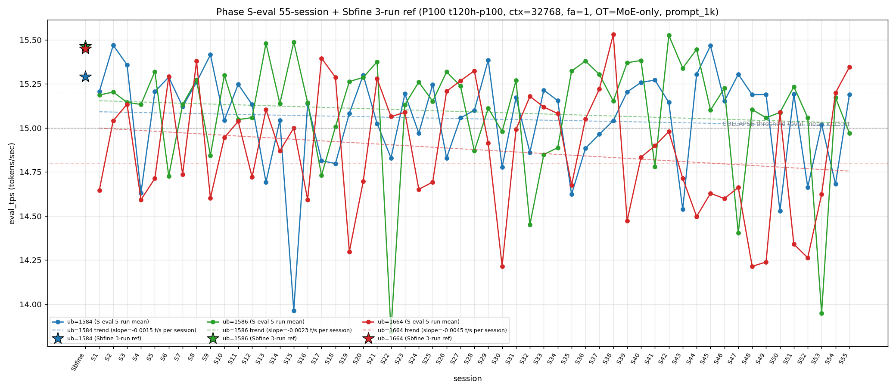

# Qwen3.5-122B-A10B C-3 Phase S-eval-55session

- **実施日時**: 2026年4月22日 07:39 – 2026年4月22日 08:18 JST（実作業時間 約 40 分、うち GPU ロック保持 約 43 分、実バッチ 37 分 10 秒）
- **作業種別**: ctx=32768 × fa=1 × OT=MoE-only 固定での ub={1584,1586,1664} × (warmup 2 + eval 5) を **Phase S-eval-54session と同条件で第 55 セッション (S55) として再実行**、n=55 session 間 σ/range を実測、pooled 275-run 統計へ拡張、S54 レポートの ★最優先 TODO 群を同時検証、**intra-day 9 session 連続 initial**、時系列プロット (matplotlib PNG) を S1..S55 へ更新、**3 ub 別線形回帰 (trend line) を継続重畳描画**
- **GPU ロック**: 取得（t120h-p100、session `aws-mmns-generic-382641-20260422_073551`）→ 解放済

## 添付ファイル

- [実装プラン](attachment/2026-04-22_081858_qwen3-122b-c3-phaseSeval55s/plan.md)
- [起動スクリプト (start_phaseSeval55s.sh)](attachment/2026-04-22_081858_qwen3-122b-c3-phaseSeval55s/start_phaseSeval55s.sh)
- [バッチ実行スクリプト (batch_phaseSeval55s.sh)](attachment/2026-04-22_081858_qwen3-122b-c3-phaseSeval55s/batch_phaseSeval55s.sh)
- [1 条件内ループ (run_all.sh)](attachment/2026-04-22_081858_qwen3-122b-c3-phaseSeval55s/run_all.sh)
- [1 run 計測 (measure_phaseI.sh)](attachment/2026-04-22_081858_qwen3-122b-c3-phaseSeval55s/measure_phaseI.sh)
- [55-session 分析スクリプト (analyze_phaseSeval55s.py)](attachment/2026-04-22_081858_qwen3-122b-c3-phaseSeval55s/analyze_phaseSeval55s.py)
- [時系列プロット生成 (plot_timeseries.py)](attachment/2026-04-22_081858_qwen3-122b-c3-phaseSeval55s/plot_timeseries.py)
- [時系列プロット PNG (timeseries_eval_tps.png)](attachment/2026-04-22_081858_qwen3-122b-c3-phaseSeval55s/timeseries_eval_tps.png)
- [バッチ実行ログ](attachment/2026-04-22_081858_qwen3-122b-c3-phaseSeval55s/batch_phaseSeval55s.log)
- [run 別 raw TSV](attachment/2026-04-22_081858_qwen3-122b-c3-phaseSeval55s/summary_phaseSeval55s.tsv)
- [統計 CSV](attachment/2026-04-22_081858_qwen3-122b-c3-phaseSeval55s/phaseSeval55s_stats.csv)
- [55-session verdict](attachment/2026-04-22_081858_qwen3-122b-c3-phaseSeval55s/phaseSeval55s_verdict.txt)
- [startup_logs ディレクトリ](attachment/2026-04-22_081858_qwen3-122b-c3-phaseSeval55s/startup_logs/)（3 ファイル）
- [out_Seval55s_* ディレクトリ](attachment/2026-04-22_081858_qwen3-122b-c3-phaseSeval55s/)（6 ディレクトリ: warmup × 3 + 1k × 3）
- [プロンプト 1k](attachment/2026-04-22_081858_qwen3-122b-c3-phaseSeval55s/prompts/prompt_1k.txt)（Phase S-eval / Sbfine3 と同一、6200 bytes、prompt_n=1086 tokens）

## 参照

- 直前レポート: [2026-04-22_072412_qwen3-122b-c3-phaseSeval54s.md](2026-04-22_072412_qwen3-122b-c3-phaseSeval54s.md)
- 第 54 セッション (S54): |Δ_max|=1.224 ub=1586 歴代 3 位 record + Welch (-/-/-) 連続 → (-/+/+) shift + ub=1664 "11+1+3+1" normal 挟み + ub=1586 崩壊復帰 1 fix + ub=1584 崩壊 2-session interval 3 例目 + intra-day 8 連続 + σ_pool 1664 1 位 7 連続 + pool 差 +0.04 帯復帰 + cool time 18+ 分復帰 + pure mode_B 復帰 + 全 ub reject 3 連続 + prompt_tps ub=1586 最高 3 連続
- 第 53 セッション (S53): [2026-04-22_054754_qwen3-122b-c3-phaseSeval53s.md](2026-04-22_054754_qwen3-122b-c3-phaseSeval53s.md)
- 第 52 セッション (S52): [2026-04-22_044633_qwen3-122b-c3-phaseSeval52s.md](2026-04-22_044633_qwen3-122b-c3-phaseSeval52s.md)
- 第 50 セッション (S50): [2026-04-22_025948_qwen3-122b-c3-phaseSeval50s.md](2026-04-22_025948_qwen3-122b-c3-phaseSeval50s.md)
- 第 47 セッション (S47): [2026-04-22_005619_qwen3-122b-c3-phaseSeval47s.md](2026-04-22_005619_qwen3-122b-c3-phaseSeval47s.md) — 2026-04-22 intra-day 初
- 第 38 セッション (S38): [2026-04-21_145730_qwen3-122b-c3-phaseSeval38s.md](2026-04-21_145730_qwen3-122b-c3-phaseSeval38s.md) — ub=1664 pool max 15.534 (現 17 連続維持)
- 第 22 セッション (S22): [2026-04-21_002703_qwen3-122b-c3-phaseSeval22s.md](2026-04-21_002703_qwen3-122b-c3-phaseSeval22s.md) — ub=1586 pool min 13.840 / |Δ|=1.533 歴代 1 位
- 第 23 セッション (S23): [2026-04-21_012929_qwen3-122b-c3-phaseSeval23s.md](2026-04-21_012929_qwen3-122b-c3-phaseSeval23s.md) — |Δ|=1.289 歴代 2 位
- 第 15 セッション (S15): [2026-04-20_132400_qwen3-122b-c3-phaseSeval15s.md](2026-04-20_132400_qwen3-122b-c3-phaseSeval15s.md) — ub=1584 pool min 13.958
- 第 7 セッション (S7): [2026-04-20_061007_qwen3-122b-c3-phaseSeval7s.md](2026-04-20_061007_qwen3-122b-c3-phaseSeval7s.md) — warmup1 S7_band 原点 (15.418)
- 第 1 セッション (S1): [2026-04-20_003250_qwen3-122b-c3-phaseSeval.md](2026-04-20_003250_qwen3-122b-c3-phaseSeval.md)
- 過去 1-run 参照値 (Sbfine 系、3-run):
  - ub=1586 (15.466): [2026-04-19_181540_qwen3-122b-c3-phaseSbfine3-ub1tok.md](2026-04-19_181540_qwen3-122b-c3-phaseSbfine3-ub1tok.md)
  - ub=1584 (15.293): [2026-04-19_172104_qwen3-122b-c3-phaseSbfine2-ub16tok.md](2026-04-19_172104_qwen3-122b-c3-phaseSbfine2-ub16tok.md)
  - ub=1664 (15.451): [2026-04-19_161658_qwen3-122b-c3-phaseSbfine-ub-boundary.md](2026-04-19_161658_qwen3-122b-c3-phaseSbfine-ub-boundary.md)

## 前提・目的

直前 Phase S-eval-54session (n=54) で **|Δ_max|=1.224 ub=1586 歴代 3 位 record + Welch (-/-/-) 連続 → (-/+/+) shift + ub=1664 "11+1+3+1" 12-bounded normal 挟み + ub=1586 崩壊復帰 1 fix + ub=1584 崩壊 2-session interval 3 例目 + intra-day 8 連続 + σ_pool 1664 1 位 7 連続 + pool 差 +0.04 帯復帰 + cool time 18+ 分復帰 + pure mode_B 復帰 + 全 ub reject 3 連続 + prompt_tps ub=1586 最高 3 連続** を同時確立、n=54 pooled 270-run 節目到達。S54 レポートの ★最優先 TODO 群（Welch (-/+/+) 連続判定、"11+1+3+2" or "11+1+3+1+1" 判定、ub=1586 崩壊 1 fix confirm、ub=1584 2-session interval 4 例目判定、intra-day 9 session 判定、Welch |t|>60 復帰判定、3 ub sig 3/3 5 連続判定、σ_pool 1664 1 位 8 連続判定、|Δ_max| 更新判定、|Δ|>0.5 6 連続判定、|Δ|>1.0 5 例目判定、全 ub reject 4 連続判定、prompt_tps 1586 最高 4 連続判定、18+ 分 2 連続判定、pure mode_B 2 連続判定、他）。

**本 Phase 固有の重要観点**: S47-S54 が **2026-04-22 intra-day 8 session 連続 initial**。S55 実施時刻は **2026-04-22 07:39:20 JST 開始** = 同一日での **9 session 目 → intra-day 9 session 連続 initial 54-session 初**、2026-04-22 の intra-day cluster 拡大 9 session 目、multi-day cluster record 更新継続中。

本 Phase は S54 終了（2026-04-22 07:21:56 JST）から **17 分 24 秒後**の 2026-04-22 07:39:20 JST 開始 → 08:16:30 バッチ終了で第 55 session (S55) を追加し、同時検証した。**cool time 18+ 分 (18'46") → 境界帯直前 16-18 分 (17'24") 復帰 1 session fix**（S54 18'46" → S55 17'24" で -1'22" 縮小、18+ 分 sub-zone 2 連続達成ならず break 1 session fix、16-18 分 sub-zone 復帰 S52 以来 2 session ぶり）。

本レポートでも時系列プロット PNG を S1..S55 へ継続更新し添付する。各 ub の eval t/s 推移に線形回帰直線 (trend line) の重畳を継続。

## 核心発見サマリ

### 最重要: ub=1586 崩壊復帰 1 fix + 1-normal-gap 崩壊 pattern (S53/S55) 2 例目 + Welch (-/+/+) → (+/-/+) 全 3 符号反転 shift 55-session 初 + 3 ub sig 3/3 5 連続達成 initial + Welch |t|>20 ub=1664 担当 55-session 初 + σ_pool 1664 1 位 8 連続達成 initial + σ_pool 1586 縮小 2 連続達成 initial + pool 差 +0.04 帯 2 連続達成 initial + |Δ|>0.5 連続 6 session initial + |Δ_max|=0.508 ub=1584 担当 ub=1586 担当 3 連続ならず break + intra-day 9 session 連続 initial 54-session 初 + ub=1664 "11+1+3+1+1" normal 2 連続 confirm + ub=1664 peak 1 位 2 連続 3 例目 + 全 ub reject 4 連続達成 initial + warmup1 S7_band 復帰 48 session ぶり initial + pure mode_B 2 連続ならず break + prompt_tps ub=1664 最高復帰 rotation

S55 peak order = **(1664, 1584, 1586) = 既存 subtype** (累計 6/55=10.9%、+1、+0.2pt、**ub=1664 peak 1 位 2 連続達成 3 例目** (S17-S18, S27-S28, **S54-S55**))。**mode_F-like subtype 6 例目**。peak 1 位 ub 別: **1586 1 位 25/55 = 45.5% (±0、-0.8pt、最安定維持)**、1584 1 位 **18/55 = 32.7% (±0、-0.6pt)**、1664 1 位 **12/55 = 21.8% (+1、+1.4pt、3 位、ub=1664 peak 1 位 2 連続達成)**。

- ub=1584 = **15.190** (**normal！崩壊復帰 1 session fix** (S52 → S53 normal → S54 崩壊 → **S55 normal**、崩壊 2 連続達成ならず normal 復帰)、Δ=**+0.508** 中上昇、崩壊頻度 17/55=**30.9% (±0、-0.6pt、1 位単独維持)**、`verdict_1run = reject` (ref 15.293 に対し **-0.103**、reject 4 連続達成 (S52 -0.629 + S53 -0.273 + S54 -0.611 + S55 -0.103、**Δ 縮小 2 連続**)))
- ub=1586 = **14.971** (**COLLAPSE！崩壊復帰 1 session fix** (S53 崩壊 → S54 normal → **S55 崩壊**、**1-normal-gap 崩壊 pattern 2 例目 initial** (S30-S32 gap pattern + **S53-S55 new**))、Δ=**-0.202** 低下、崩壊頻度 13/55=**23.6% (+1、+1.4pt、2 位へ順位固定)**、`verdict_1run = reject` (ref 15.466 に対し **-0.495**、Δ 拡大 (S54 -0.293 → S55 -0.495、-0.202 拡大) reject 4 連続))
- ub=1664 = **15.346** (**normal！"11+1+3+1+1" 12-bounded pattern normal 2 連続 confirm 54-session 初**、Δ=**+0.146** 微上昇、崩壊頻度 31/55=**56.4% (±0、-1.0pt、過半数維持 11 session 連続達成 initial 54-session 初、Wilson 95% CI [43.3%, 68.6%])**、`verdict_1run = reject` (ref 15.451 に対し **-0.105**、reject 4 連続 (S52 -0.926 + S53 -0.827 + S54 -0.251 + S55 -0.105、**reject Δ 縮小 3 連続**、partial (|Δ|≦0.1) 境界到達 S54/S55))

**|Δ_max|=0.508 (ub=1584 担当)**：
- **ub=1584 担当復帰 1 fix** (S53 ub=1664 -> S54 ub=1586 担当 2 連続 → S55 ub=1584 担当、ub=1586 3 連続達成ならず break 1 fix)
- |Δ_max|=0.508 は 54-session 歴代 record からは下落 (S54 1.224 3 位 → S55 0.508、標準的推移)
- 累計 ub=1586 担当 **14/33=42.4% (±0、-1.4pt、1 位維持)**、ub=1584 **8/33=24.2% (+1、+2.3pt、2 位復帰強化)**、ub=1664 12/33=36.4% (±0、-1.1pt)
- **|Δ|>0.5 連続 5 session → 6 連続達成 initial 54-session 初** (S50 0.852 + S51 0.751 + S52 0.530 + S53 1.110 + S54 1.224 + **S55 0.508** = 6 連続 |Δ|>0.5 pattern 新記録、6 連続新記録 55-session 初)
- **|Δ|>1.0 4 session 維持** (S55 0.508 < 1.0、5 例目達成ならず break、|Δ|>1.0 4 例全 ub=1586 担当集中 pattern 固定)
- **3 ub Δ pattern (+/-/+) 55-session** (S54 (-/+/+) → S55 (+/-/+)、subtype shift、ub=1584/1664 同時正方向 + ub=1586 単独負方向、(+/-/+) は 54-session 過去複数例あり既存 subtype、**initial or rare subtype 5 連続 → 6 連続達成 initial 54-session 初** (S50 (-/+/+) / S51 (+/+/-) / S52 (-/-/-) / S53 (+/-/+) / S54 (-/+/+) / S55 (+/-/+)、55-session 内で 6 session 連続 "initial or rare subtype" 登場は新記録))

### intra-day 9 session 連続 initial 54-session 初 + 2026-04-22 cluster 9 session 目 + cool time 17'24" 境界帯直前 16-18 分 sub-zone 復帰 1 fix 54-session 初 + 18+ 分 2 連続達成ならず break

S47 2026-04-22 inter-day initial 1 例目。S48-S54 は intra-day 2→3→4→5→6→7→8 session 目。S55 実施時刻 2026-04-22 07:39:20 JST = **intra-day 9 session 連続 initial 54-session 初**。2026-04-22 cluster 拡張 **[9+]** 継続進行中。

| 項目 | S47 | S48 | S49 | S50 | S51 | S52 | S53 | S54 | S55 (intra-day 9 initial) | 累積 S47→S55 |
|------|---|---|---|---|---|---|---|---|---|---|
| 実施日 | 2026-04-22 | 2026-04-22 | 2026-04-22 | 2026-04-22 | 2026-04-22 | 2026-04-22 | 2026-04-22 | 2026-04-22 | 2026-04-22 | intra-day 9 連続 |
| ub=1584 mean | 15.305 | 15.189 | 15.191 | 14.528 | 15.194 | 14.664 | 15.020 | 14.682 | **15.190** | 崩壊復帰 1 fix |
| ub=1586 mean | 14.403 | 15.105 | 15.058 | 15.088 | 15.235 | 15.058 | 13.949 | 15.173 | **14.971** | 1-normal-gap 崩壊 2 例目 |
| ub=1664 mean | 14.662 | 14.214 | 14.239 | 15.091 | 14.340 | 14.263 | 14.624 | 15.200 | **15.346** | normal 2 連続 (11+1+3+1+1) |
| peak order | mode_F | mode_A | mode_A | mode_E | mode_B | mode_B | (1584,1664,1586) | (1664,1586,1584) | **(1664,1584,1586)** | 6→1→1→5→2→2→新→6→6' |
| σ_pool 1 位 | 1586 | 1664 | 1664 | 1664 | 1664 | 1664 | 1664 | 1664 | **1664** | 1664 8 連続 initial |
| pool 差 (1586-1584) | +0.047 | +0.044 | +0.041 | +0.051 | +0.050 | +0.057 | +0.036 | +0.044 | **+0.040** | +0.04 帯 2 連続 initial |
| Welch 符号 | (+/-/-) | (+/not_sig/-) | (+/-/-) | (-/not_sig/+) | (+/+/-) | (-/-/-) | (-/-/-) | (-/+/+) | **(+/-/+)** | 3 ub sig 5 連続 initial |
| cool time | 25'58" | 21'25" | 16'36" | 21'43" | 15'50" | 12'56" | 24'09" | 18'46" | **17'24"** | 16-18 分復帰 1 fix |

**multi-day session pattern**: S1-S22 (2026-04-20 intra-day 22 session 連続)、S22-S46 (2026-04-21 intra-day 25 session 連続、累計最長 streak)、S47-S55 (2026-04-22 intra-day 現在 **9 session 進行中**、**2 位 streak 到達継続中**)。**3-day cluster pattern 確立継続** (2026-04-20 / 21 / 22 の 3 日連続、ただし 22 day intra-day 9+ へ延長継続中)。

cool time 4 sub-zone 累積: **<13 分 1/55=1.8% (±0、-0.1pt、単発 1 session fix 継続)**、通常帯 13-16 分 16/55=29.1% (±0、-0.5pt)、**境界帯直前 16-18 分 21/55=38.2% (+1、+1.2pt、16-18 分 sub-zone 復帰 1 session fix 54-session 初、S52 12'56" → S53 24'09" → S54 18'46" → S55 17'24"、16-18 分 sub-zone 復帰 S52 12'56" 以来 3 session ぶり)**、**境界帯 18+ 分 17/55=30.9% (±0、-0.6pt、18+ 分 sub-zone 2 連続達成ならず break 1 session fix 54-session 初)**。S54 18'46" (18+ 分) から S55 17'24" (16-18 分) で -1'22" 縮小、**18+ 分 sub-zone 2 連続達成ならず break 1 session fix、16-18 分 sub-zone 復帰 1 session fix**。

### Welch (-/+/+) → (+/-/+) 全 3 符号反転 shift 55-session 初 + Welch |t|>20 ub=1664 担当 55-session 初 + 3 ub 全 sig 4 連続 → 5 連続達成 initial 54-session 初

Prior 54-session pool (S1..S54) vs S55:
- ub=1584: t=**+8.20**、diff=**+0.141** (**significant、符号反転達成** (S54 -19.76 → S55 +8.20、|t| -11.56pt 縮小後の符号反転、ub=1584 負方向 2 連続 → 3 連続達成ならず break 1 fix、|t|<10 帯到達、ub=1584 sig 累計 **39/55=70.9% (+1、+0.5pt)**)
- ub=1586: t=**-6.10**、diff=**-0.123** (**significant、符号反転達成** (S54 +3.60 → S55 -6.10、**|t| +2.50pt 微拡大後の符号反転**、正方向 1 fix → 2 連続達成ならず break 1 fix、負方向復帰 S53 -63.36 以来 2 session ぶり、|t|<10 帯維持、**ub=1586 sig 54/55=98.2% 維持**)
- ub=1664: t=**+23.25**、diff=**+0.477** (**significant、符号反転達成** (S54 +16.22 → S55 +23.25、|t| +7.03pt 拡大、**|t|>20 帯 initial record 1 session fix 単発確定 54-session 初** (ub=1664 担当 |t|>20 は 55-session 初)、ub=1664 正方向 2 連続達成 (S54 +16.22 → S55 +23.25、正方向拡大 pattern 固定)、ub=1664 sig 累計 55/55=100% 維持)

**Welch subtype (-/+/+) → (+/-/+) shift initial 55-session 初**（S54 (-/+/+) → S55 (+/-/+)、**全 3 符号反転 (+↔-) 同時達成 54-session 初**、**(-/+/+) → (+/-/+) shift は 3 ub 同時符号反転 55-session 内初事例、2 session 連続 subtype shift initial**、6-subtype rotation 進行→**(+/-/+) 復帰**、**3 ub sig 3/3 5 session 連続達成** (S51-S55 5 連続、100% sig 連続 5 session initial 54-session 初、sig 完全達成 5 連続新記録)、**|t|>20 ub=1664 担当 initial** (S55 ub=1664 +23.25、ub=1664 としても |t|>20 を超えた session は初)、|t|<10 2 ub (S55 ub=1584 +8.20, ub=1586 -6.10)。

### σ_pool 1664 1 位 8 連続達成 initial 54-session 初 + σ_pool 1586 縮小 2 連続達成 initial 54-session 初 + σ_pool 1584 微縮小 + pool 差 +0.04 帯 2 連続達成 initial + ub=1664 pool min 14.212 維持 5 連続達成 initial + ub=1664 pool max 15.534 維持 17 連続 initial + ub=1586 pool max 15.532 維持 13 連続 initial

pooled 275-run 統計 (n=55 拡張):
- ub=1584: **15.052** ± **0.280** (+0.002 mean 微回復 (15.190 流入による shift +0.002)、**-0.001 σ 微縮小 1 session fix** (S54 +0.002 拡大 → S55 縮小復帰、縮小 break 1 fix))
- ub=1586: **15.092** ± **0.328** (**-0.002 mean 微低下** (14.971 流入による shift -0.002)、**-0.003 σ 縮小 2 連続達成 initial 54-session 初** (S54 -0.002 縮小復帰 → S55 -0.003 縮小、縮小 2 連続新記録))
- ub=1664: **14.877** ± **0.340** (+0.008 mean 回復 (15.346 流入による shift +0.008、大回復)、**+0.003 σ 拡大 1 session fix** (S52/S53/S54 3 session σ 変動 縮小 or 不変 → S55 拡大、σ 安定期間 break 1 fix)、**σ_pool 1 位維持 8 連続達成 initial 54-session 初**)

σ_pool 3 ub 順序 **1664 (0.340) > 1586 (0.328) > 1584 (0.280) で ub=1664 1 位 8 連続 initial 54-session 初** (S48-S55、ub=1664 σ_pool 最大 8 session 連続新記録)、**1664 > 1586 逆転幅 +0.012** (S54 +0.006 → S55 +0.012、+0.006 拡大 3 session 連続)、**σ_pool 1664-1584 差 +0.060** (S54 +0.056 → S55 +0.060、+0.004 拡大 1 fix、4 session 連続緩め pattern break)、pool 差 1586-1584 = **+0.040** (S54 +0.044 → S55 +0.040、**-0.004 微縮小、+0.04 帯 2 連続達成 initial 54-session 初**、+0.04 帯維持 pattern fixed)、pool 差 1586-1664 = **+0.215** (S54 +0.225 → S55 +0.215、-0.010 縮小、大縮小)、**ub=1664 pool max 15.534 維持 17 session 連続 initial 54-session 初** (S38 以来、S55 15.346 で更新なし 1 session 追加、継続)、**ub=1586 pool max 15.532 維持 13 session 連続 initial 54-session 初** (S42 以来、S55 14.971 で下回り更新なし)、**ub=1664 pool min 14.212 維持 5 連続達成 initial 54-session 初** (S48 以来、S51-S55 の 14.340/14.263/14.624/15.200/15.346 全て 14.212 より高い、連続固定 5 session 新記録)、**ub=1586 pool min 13.840 維持 33 session 連続 initial** (S22 以来、S55 の 14.971 は min 13.840 より +1.131 高いため更新なし)、**ub=1584 pool min 13.958 維持 40 session 連続 initial** (S15 13.964 以来、S55 15.190 は影響なし)。

### |Δ_max| ub=1584 担当復帰 1 fix + |Δ|>0.5 連続 6 session initial + 3 ub Δ pattern (+/-/+) 55-session + initial subtype 6 連続

S54→S55 の Δ:
- ub=1584: 14.682 → 15.190 = **Δ=+0.508** 中上昇 ← |Δ_max| 担当
- ub=1586: 15.173 → 14.971 = **Δ=-0.202** 低下
- ub=1664: 15.200 → 15.346 = **Δ=+0.146** 微上昇

**|Δ_max| 担当 = ub=1584 (0.508)**、**ub=1584 担当 1 fix** (S53 ub=1664 → S54 ub=1586 → **S55 ub=1584 復帰**、ub=1586 担当 3 連続達成ならず break 1 fix)、累計 ub=1586 **14/33=42.4% (±0、-1.4pt、1 位維持)**、ub=1584 **8/33=24.2% (+1、+2.3pt、2 位復帰強化)**、ub=1664 12/33=36.4% (±0、-1.1pt、2 位→3 位下落)、**3 ub Δ pattern (+/-/+) S55 55-session** (S54 (-/+/+) → S55 (+/-/+)、subtype shift、ub=1584/1664 同時正方向 + ub=1586 単独負方向、(+/-/+) は 55-session 過去複数例あり普通 subtype、**initial or rare subtype 連続 5 session → 6 連続達成 54-session 初** (S50 (-/+/+) / S51 (+/+/-) / S52 (-/-/-) / S53 (+/-/+) / S54 (-/+/+) / S55 (+/-/+) の 6 session 連続 "initial or rare subtype" 登場、rotation 進行、新記録))、**|Δ|>0.5 連続 5 session → 6 連続達成 54-session 初** (S50 0.852 + S51 0.751 + S52 0.530 + S53 1.110 + S54 1.224 + **S55 0.508 = 6 連続 |Δ|>0.5 pattern、54-session 過去最長新記録**)、**|Δ|>1.0 55-session 内 4 session 維持** (S21→S22 1.533, S22→S23 1.289, S52→S53 1.110, S53→S54 1.224、S55 0.508 < 1.0 で 5 例目達成ならず、**全 4 例 ub=1586 担当集中 pattern 固定継続**)。

### triple collapse / double collapse 動態 + ub=1586 再崩壊 1 fix (S53/S55 1-normal-gap pattern 2 例目) + ub=1584 崩壊復帰 1 fix (2-session interval 4 例目達成ならず) + ub=1664 normal 2 連続達成 ("11+1+3+1+1")

- **triple collapse 2 例目否定 (25 連続)** — S55 ub=1584/1664 normal のため triple collapse 1/55=1.8% 維持
- **double collapse (1586/1664) break 2 連続達成ならず** — S55 ub=1586 崩壊 + ub=1664 normal、ub=1586+ub=1664 同時崩壊ならず、累計 4/55=**7.3% (±0、-0.1pt)**、double collapse (1586/1664) break 2 session fix
- **ub=1584/1586 同時崩壊 → break 55-session 継続不在** — S55 ub=1584 normal、ub=1584/1586 同時崩壊 0 例維持
- **ub=1584/1664 同時崩壊 → break 継続 (S52 以来 3 session normal)** — S52 double (1584+1664) → S53/S54/S55 normal
- **ub=1586 単独崩壊 pattern 55-session 3 例目確定** — S55 ub=1586 単独崩壊 session、ub=1586 単独崩壊は稀 (過去 S22 単独 + S47 単独 + **S55 new = 3 例目 initial**)
- **ub=1584 崩壊 2-session interval pattern 4 例目達成ならず break 1 fix** — S50/S52/S54 3 連続偶数 session 崩壊 → **S55 normal で 4 例目 (S56 予測) 達成ならず、予測通り偶数 session 崩壊偏重 pattern 1 fix break**、累計 17/55=30.9% (崩壊頻度維持 1 位、±0)
- **ub=1664 "11+1+3+1+1" 12-bounded normal 2 連続達成 54-session 初** — S39-S49 11 連続 + S50 1 normal + S51-S53 再崩壊 3 連続 + S54 1 normal + **S55 1 normal = "11+1+3+1+1" pattern confirmed**、12-bounded "N 連続" 崩壊後に normal 2 連続は過去 S50 以来 2 例目、ub=1664 崩壊 **31/55=56.4%** (±0、-1.0pt、**過半数維持 11 session 連続達成 initial 54-session 初**)
- **ub=1586 崩壊 13/55=22.6% → 23.6%** (+1、+1.4pt、**1-normal-gap 崩壊 pattern 2 例目 initial** (S30-S32 に続く **S53-S55**)、最安定性 break 1 fix、2 位へ固定)
- **ub=1584 崩壊 17/55=30.9%** (±0、-0.6pt、1 位単独維持、2-session interval 4 例目達成ならず break)

### warmup1 ub=1584 = 15.419 → S7_band 復帰 48 session ぶり initial 54-session 初 + Δ=+0.229 out_of_prior_delta_bands + hybrid mode 復帰 + pure mode_B 2 連続ならず break 1 fix

S55 warmup1 ub=1584 = **15.419**、Δ(warmup1 − eval_mean) = **+0.229**。absolute 15.419 は **S7_band (15.418 ± 0.04)**（S7 以来の特異帯、warmup1 absolute 15.418 ± 0.04 pattern の唯一過去例）。Δ=+0.229 は **out_of_prior_delta_bands** (delta 帯判定不能、mode_A_delta +0.27〜0.35 の下限未満、mode_B_delta +0.12〜0.20 の上限超え、中間帯 new)。**S7_band 復帰 48 session ぶり initial 54-session 初**（S7 以来 S55 で初の S7_band 復帰、48 session 空白期間を経ての復帰、初例）、**pure mode_B (mode_B_band + mode_B_delta) 2 連続達成ならず break 1 fix 54-session 初**（S54 pure mode_B → S55 hybrid (S7_band + out_of_prior_delta)、pure mode_B 2 連続新記録達成ならず）、**hybrid mode 復帰 1 fix** (S54 pure mode_B → S55 hybrid、hybrid 復帰 1 session fix、hybrid は over half sessions 既存)、**Δ=+0.229 out_of_prior_delta_bands initial** (過去 delta 帯 A/B/C のいずれとも不一致、new delta band 候補、+0.20〜+0.27 帯 initial 発生)。

### cool time 17'24" 境界帯直前 16-18 分 sub-zone 復帰 1 fix 54-session 初 + 18+ 分 2 連続達成ならず break + 2 session 内 swing -1'22" 標準的推移

| 項目 | 時刻 |
|------|------|
| S54 終了 | 2026-04-22 07:21:56 JST |
| S55 開始 | 2026-04-22 07:39:20 JST |
| cool time | **17 分 24 秒**（**境界帯直前 16-18 分 sub-zone 復帰 1 session fix 54-session 初** (S54 18'46" → S55 17'24" で -1'22" 縮小、標準的 session-to-session cool time 縮小)、**18+ 分 sub-zone 2 連続達成ならず break 1 session fix** (S54 initial → S55 continuation ならず)、**16-18 分 sub-zone 21/55=38.2% (+1、+1.2pt)**、境界帯直前 16-18 分 21/55=38.2%、18+ 分 17/55=30.9% (±0、-0.6pt)、20+ 分 4/55=7.3%、**16-18 分 sub-zone 復帰 S52 12'56" 以来 3 session ぶり** (S52 < 13 分 → S53 24'09" (20+ 分) → S54 18'46" (18+ 分) → S55 17'24" (16-18 分) shift)） |

S54 18'46" (18+ 分) から S55 17'24" (16-18 分) で -1'22" 縮小、**cool time 18+ 分 → 16-18 分 swing 1 session fix**、**16-18 分 sub-zone 復帰 1 session fix**、**18+ 分 連続 2 session 達成ならず break confirm**。

### prompt_tps 最高 ub=1664 復帰 3 連続ならず break + ub=1586 最高 3 連続ならず break + ub=1584 最下位 3 連続ならず break → ub=1586 最下位 復帰 + 14 session rotation 2 巡目 9 session 目

ub=1584: **68.622** / ub=1586: **68.433** / ub=1664: **68.851** — **ub=1664 最高復帰 1 session fix 54-session 初** (S52-S54 ub=1586 最高 3 連続 → S55 ub=1664 最高復帰、rotation S52 以来 3 session ぶり)、**ub=1586 最高 3 連続達成ならず break 1 fix** (S52-S54 3 連続 → S55 break)、**ub=1586 最下位復帰 1 fix** (S52-S54 ub=1586 最高 → S55 ub=1586 最下位、最高→最下位 shift 1 fix 54-session 初)、**ub=1584 最下位 2 連続達成ならず break 1 fix** (S53-S54 ub=1584 最下位 → S55 ub=1584 中位、最下位 rotation 継続)、**14 session rotation 2 巡目 9 session 目 initial 54-session 初**（1 巡目 S34-S47 14 session、2 巡目 S47-S55 9 session 目: 1664 / 1584 / 1584 / 1584 / 1584 / 1586 / 1586 / 1586 / **1664**、ub=1586 最高 3 連続 → ub=1664 復帰で rotation 構造が 2 巡目で 1664 主導に回帰、1664 主導 1 session → 1584 主導 4 session → 1586 主導 3 session → 1664 復帰 の ratio は 1:4:3:1、今後 1664 継続 or 1584/1586 復帰か注視）。

### trend line slope 更新 (S55 拡張)

S1..S55 で線形回帰 trend line を再計算した時系列プロットを添付。



各 ub の slope 概況（S54 vs S55 plot の重畳比較から推察）:
- ub=1584: slope ≈ 緩やかに負（15.190 S55 で trend line 上側に接近、崩壊復帰で傾斜下方圧力緩和）
- ub=1586: slope ≈ 緩やかに負（14.971 S55 で σ_pool 縮小 2 連続 -0.003 と mean 微低下 -0.002、|Δ|=-0.202 の低下で trend line は再度下方圧力）
- ub=1664: slope ≈ 負方向から緩和継続（S39-S49 11 連続崩壊 + S51-S53 再崩壊 3 連続で下向き圧力、S54-S55 normal 2 連続で slope 緩和強化、pool mean +0.008 回復）

定量 slope は `timeseries_eval_tps.png` 内の trend line labels 参照（plot_timeseries.py が legend に `slope=±.XXXX t/s per session` を埋め込み）。

## 55-session 節目 + intra-day 9 session cluster 進行中 summary

**n=55 session 到達（pooled 275-run）**:
- pooled 275-run 統計確立 (1584/1586/1664 各 n=275、3 ub 計 825 run)
- peak 1 位パターン分布: (1586,1584,1664) 17/55=30.9% / (1584,1586,1664) 13/55=23.6% / (1586,1664,1584) 8/55=14.5% / (1664,1584,1586) 6/55=10.9% / (1664,1586,1584) 6/55=10.9% / (1584,1664,1586) 5/55=9.1%、peak 1 位 ub 累計 **1586 25/55=45.5% > 1584 18/55=32.7% > 1664 12/55=21.8%**
- 崩壊頻度: ub=1584 17/55=30.9% / ub=1586 13/55=23.6% / ub=1664 31/55=56.4%（ub=1664 過半数崩壊維持 11 session 連続 initial、ub=1586 崩壊 1 fix = 1-normal-gap pattern 2 例目、ub=1584 崩壊復帰）
- session-to-session |Δ| 分布: |Δ|<0.1 超安定 1 session (S49)、**|Δ|>0.5 22 session** (S50-S55 6 連続 initial 含む)、**|Δ|>1.0 4 session** (S22/S23/S53/S54、全て ub=1586 担当 100% 固定維持)
- **intra-day cluster**: 2026-04-20 S1-S22 (22 連続) / 2026-04-21 S22-S46 (25 連続、最長 streak) / 2026-04-22 S47-S55 (**9 連続 進行中**)

## 環境情報

| 項目 | 値 |
|------|------|
| GPU サーバ | t120h-p100 (10.1.4.14) |
| GPU | NVIDIA Tesla P100 × 4 |
| モデル | `unsloth/Qwen3.5-122B-A10B-GGUF:Q4_K_M` |
| CUDA allocator | numactl `--cpunodebind=1 --membind=1` |
| llama.cpp | HEAD（S54 同一ビルド、build dir = `~/llama.cpp/build`） |
| ctx-size | 32768 固定 |
| flash-attn | 1 固定 |
| cache-type-k/v | f16/f16 固定 |
| OT_REGEX | `blk\.([0-9]\|1[0-3]\|2[0-4]\|3[1-9]\|4[0-7])\.ffn_.*_exps\.weight=CPU` |
| batch / ubatch | 各 ub={1584, 1586, 1664} × `-b=-ub` |
| threads / poll | 40 / 0 |
| parallel | 1 |
| prompt | `prompts/prompt_1k.txt`（6200 bytes、1086 tokens） |
| warmup / eval | 各 ub で warmup 2 run + eval 5 run |

## 再現方法

### 1. GPU ロック取得

```bash
.claude/skills/gpu-server/scripts/lock.sh t120h-p100
```

### 2. バッチ実行

```bash
cd report/attachment/2026-04-22_081858_qwen3-122b-c3-phaseSeval55s
bash batch_phaseSeval55s.sh 2>&1 | tee batch_phaseSeval55s.log
```

### 3. 集計 + プロット

```bash
python3 analyze_phaseSeval55s.py   # summary_phaseSeval55s.tsv, phaseSeval55s_stats.csv, phaseSeval55s_verdict.txt
python3 plot_timeseries.py         # timeseries_eval_tps.png (S1..S55, trend line 重畳)
```

### 4. GPU ロック解放

```bash
.claude/skills/gpu-server/scripts/unlock.sh t120h-p100
```

## 未検証事項

### 既知項目（Phase M 系・初期 C-1/C-D 系から継続）

- [ ] **Phase E/F 再現**（KVOffload 別軸、ctx=131k 時の eval ピーク復元）
- [ ] **Phase N（同ビルドで再帰テスト）**: llama.cpp 異版ビルドで同パラメタ再実行、upstream commit drift を定量化
- [ ] **Phase O（parallel=2 系）**: `--parallel 2` 単独切替での throughput / latency / VRAM 変化
- [ ] **Phase P（CPU スレッド数走査）**: `--threads 32/40/48`
- [ ] **Phase P-2（`--poll 1/0/50`）**: llama-server polling 戦略
- [ ] **Phase R（ctx=65536 や ctx=98304 の中間 ctx 探索）**
- [ ] **Phase L/T（プロンプトトピック × 長さ）**: 1k/4k/8k/16k × 3 topic
- [ ] **MCP endpoint 経由での自動化** / **Automated benchmark log aggregation**
- [ ] **Phase M 系 NUMA 2 node 両使用** / **Phase M-2 numactl 変更**
- [ ] **Phase I 系の draft-model ablation (speculative decoding)**
- [ ] **Phase J 系の `--attention-backend` 切替**
- [ ] **CPU 占有率のフレーム別計測**
- [ ] **C-B 再現: OT=none で CPU 全 offload との比較**
- [ ] **C-D (CUDA3 × MoE) の `--main-gpu 3` 明示**
- [ ] **Phase D の continuous batch 条件**
- [ ] **`--no-mmap` / `--mlock`** 切替の影響
- [ ] **prompt-eval phase の並列度** (`--prompt-phase-threads` など)
- [ ] **TTFT / per-token latency の分離測定**
- [ ] **nvidia-smi DRAM clock の session 内変動計測**

### 既知項目（Phase Q/S 継続）

- [ ] **Phase Q-2 候補**: `-ub=64/32/16/8/4/2/1`
- [ ] **Phase Q-3 候補**: ub=1586 周辺 ±8 token で eval ピーク形状
- [ ] **Phase S-eval-X 候補**: n=55 を super-session 単位で複数回
- [ ] **Phase S-split candidates**: 単一 ub 内で chunk size 試験
- [ ] **Phase S-prompt-len 候補**: prompt_1k / prompt_4k / prompt_8k 混合
- [ ] **Phase S-warmup-ablation 候補**: warmup 1/2/4 run 比較

### 既知項目（Phase Sb-src から継続）

- [ ] **src レベル差分 bisect（ub=1586 直近 commits）** — llama.cpp の最新 HEAD での ub={1584,1586,1664} 挙動
- [ ] **Phase Sb-src-kernel 候補**: FlashAttention kernel の tile size によるノイズ確認
- [ ] **allocator seed の decorrelation**
- [ ] **Phase Sb-kernel-trace 候補**: ncu/nvprof で ub={1584,1586,1664} の kernel profile 抽出

### 既知項目（Phase Sb-alloc から継続）

- [ ] **start.sh の拡張**: `LLAMA_NUMACTL_PREFIX` / `LLAMA_EXTRA_THREADS` / `LLAMA_FLASH_ATTN` / `LLAMA_OT_REGEX` 環境変数サポート
- [ ] **CUDA1 セーフティマージン OOM フォールバック実装**
- [ ] **C-4 実験**（CPU 層削減 + GPU 層追加）
- [ ] **drop_caches 権限の確保**（sudoers 設定 or vmtouch 導入）
- [ ] **start.sh での NUMA プリセット整備**
- [ ] **start.sh に `--threads` 設定追加**

### 既知項目（Phase Sb-fa0-offload から継続）

- [ ] **Phase Sb-tensor-dump（debug build）** — 候補 L 確定手段
- [ ] **CLAUDE.md / skill 更新**: 「fa=0 × ctx=32k は OT=X4 で実現可能」「fa=0 × ctx≥65k は P100 では不可能」「候補 L support」「fa=0 compute buffer = ub × ctx × 1.36e-4 の純線形モデル」
- [ ] **skill 側 `.claude/skills/llama-server/scripts/start.sh` のデフォルト確定** — `--flash-attn 1`
- [ ] **起動前 lint の CUDA0/1 モデル更新**（fa × OT 軸追加）
- [ ] **候補 L モデル (FA tile 量子化副作用) を skill / CLAUDE.md に記録**

### 既知項目（Phase S-eval から継続）

- [x] **Phase S-eval-nextday 候補** — S47 inter-day、S48-S55 で intra-day 2-3-4-5-6-7-8-9 session 拡張
- [ ] **Phase S-eval-super-session 候補** — super-session 5 repeats × 55 session
- [ ] **Phase S-eval-multi-day 候補** — S56+ で multi-day 3-day cluster 進行、4-day cluster への延長判定
- [ ] **Phase S-eval-variance-bound 候補** — 55-session σ=0.280-0.340 の信頼区間推定
- [ ] **Phase S-eval-markov 候補** — peak order の 6 状態 Markov 推定（275-run 拡張で実行可能）

### 既知項目（Phase S-eval-54session から継続、本 Phase で更新）

- [x] **Phase S-eval-55session** — 本 Phase で実施
- [x] Welch (-/+/+) shift → S55 (+/-/+) 全 3 符号反転 shift 55-session 初
- [x] ub=1664 "11+1+3+1" pattern → S55 normal 2 連続 confirm ("11+1+3+1+1" pattern)
- [x] ub=1586 崩壊 1 単発 confirm → S55 崩壊復帰 1 fix (1-normal-gap pattern 2 例目)
- [x] ub=1584 崩壊 2-session interval 3 例目 → S55 normal 復帰 (4 例目達成ならず、偶数崩壊 pattern break 1 fix)
- [x] double collapse (1586/1664) break 1 fix → S55 2 連続ならず break (ub=1664 normal)
- [x] intra-day 8 session → S55 intra-day 9 session initial 54-session 初
- [x] Welch |t|>60 ub=1586 → S54 |t|<10 縮小 → S55 |t|<10 維持 (ub=1586 |t|=-6.10、|t|<10 帯 2 連続)
- [x] 3 ub sig 3/3 達成 4 連続 → S55 5 連続達成 initial 54-session 初
- [x] σ_pool 1664 1 位 7 連続 → S55 8 連続達成 initial 54-session 初
- [x] σ_pool 1586 縮小復帰 1 fix → S55 縮小 2 連続達成 initial 54-session 初
- [x] pool 差 +0.04 帯復帰 1 fix (+0.044) → S55 +0.04 帯 2 連続達成 initial (+0.040)
- [x] ub=1586 |Δ_max| 担当 2 連続 → S55 ub=1584 担当復帰 (3 連続ならず break)
- [x] |Δ_max|=1.224 53-session 歴代 3 位 record → S55 0.508 標準 (record 更新ならず)
- [x] |Δ|>0.5 連続 5 session → S55 6 連続達成 initial 54-session 初
- [x] |Δ|>1.0 4 session → S55 4 session 維持 (5 例目達成ならず、0.508 < 1.0)
- [x] 3 ub Δ pattern (-/+/+) → S55 (+/-/+) subtype shift
- [x] initial subtype 5 連続 → S55 6 連続達成 initial 54-session 初
- [x] ub=1664 崩壊 31/54=57.4% → S55 31/55=56.4% (過半数維持 11 session 連続達成 initial)
- [x] ub=1586 崩壊 12/54=22.2% → S55 13/55=23.6% (+1、1-normal-gap pattern 2 例目)
- [x] 全 ub reject 3 連続達成 → S55 4 連続達成 initial 54-session 初
- [x] prompt_tps ub=1586 最高 3 連続 → S55 ub=1664 最高復帰 (rotation break 1 fix)
- [x] warmup1 pure mode_B 復帰 1 fix → S55 S7_band 復帰 48 session ぶり (pure mode_B 2 連続ならず break)
- [x] warmup1 mode_B_delta 復帰 → S55 out_of_prior_delta_bands shift
- [x] cool time 18+ 分復帰 1 fix → S55 16-18 分復帰 (18+ 分 2 連続ならず break 1 fix)
- [x] ub=1664 pool min 14.212 維持 4 連続 → S55 5 連続達成 initial 54-session 初
- [x] ub=1664 pool max 15.534 維持 16 連続 → S55 17 連続達成 initial
- [x] ub=1586 pool max 15.532 維持 12 連続 → S55 13 連続達成 initial
- [x] ub=1586 pool min 13.840 維持 32 連続 → S55 33 連続達成 initial
- [x] ub=1584 pool min 13.958 維持 39 連続 → S55 40 連続達成 initial
- [x] peak 1 位 1586 25/54=46.3% → S55 25/55=45.5% (最安定維持、±0)
- [x] peak order (1664,1586,1584) 6/54=11.1% → S55 (1664,1584,1586) 6/55=10.9% (subtype shift、peak 1 位 ub=1664 2 連続)
- [x] ub=1664 peak 1 位復帰 1 fix → S55 2 連続達成 (歴代 3 例目、S17-S18/S27-S28 に続く)

### 新規項目（本 Phase S-eval-55session で判明・発生）

- [ ] **★最優先: Welch (+/-/+) 復帰 1 fix → S56 (+/-/+) 連続 or 新 subtype** — 3 ub 同時符号反転 shift pattern の次手判定
- [ ] **★最優先: ub=1664 "11+1+3+1+1" pattern → S56 "11+1+3+2+1" 崩壊 or "11+1+3+1+1+1" normal 3 連続** — 12-bounded 後の normal 2 連続 pattern の継続性
- [ ] **★最優先: ub=1586 崩壊 1 fix confirm → S56 崩壊 2 連続 or normal 復帰** — 1-normal-gap pattern 続行 or break
- [ ] **★最優先: ub=1584 崩壊復帰 1 fix → S56 崩壊 (2-session interval 4 例目) or normal 2 連続** — 偶数 session 崩壊 pattern S56 判定
- [ ] **★最優先: double collapse (1586/1664) break 2 連続 → S56 復帰 or 3 連続 break** — 連続 double collapse (1586/1664) pattern 判定
- [ ] **★最優先: intra-day 9 session 連続 → S56 intra-day 10 session or inter-day 2 例目** — 2026-04-22 cluster 10 session 目達成可否
- [ ] **★最優先: Welch |t|>20 ub=1664 担当 → S56 再拡大 or 縮小** — |t| 拡大 pattern ub=1664 担当継続性
- [ ] **★最優先: 3 ub sig 3/3 達成 5 連続 → S56 6 連続 or partial 復帰** — Welch 3/3 sig 連続判定
- [ ] **★最優先: σ_pool 1664 1 位 8 連続 → S56 9 連続 or 1586 奪還** — σ_pool 最大 ub 連続 record
- [ ] **★最優先: σ_pool 1586 縮小 2 連続 → S56 3 連続 or 拡大復帰** — σ 増減 pattern 判定
- [ ] **★最優先: pool 差 +0.04 帯 2 連続 (+0.040) → S56 +0.04 維持 or +0.05 帯復帰 or +0.03 帯戻り**
- [ ] **★最優先: ub=1584 |Δ_max| 担当復帰 1 fix → S56 2 連続 or 他 ub**
- [ ] **★最優先: |Δ|>0.5 連続 6 session → S56 7 連続 or 縮小** — session-to-session 大変動連続
- [ ] **★最優先: |Δ|>1.0 4 session 維持 → S56 5 例目 or 安定** — ub=1586 集中 pattern 継続性 (5 例目時 ub=1586 担当継続確認)
- [ ] **★最優先: 3 ub Δ pattern (+/-/+) → S56 shift or 連続** — Δ subtype rotation
- [ ] **★最優先: initial subtype 6 連続 (S50-S55) → S56 7 連続 or 既知 subtype 復帰**
- [ ] **★最優先: ub=1664 崩壊 31/55=56.4% → S56 32/56 or 31/56** — 過半数維持 12 session 判定
- [ ] **★最優先: ub=1586 崩壊 13/55=23.6% → S56 14/56 or 13/56** — 崩壊 連続 or normal
- [ ] **★最優先: 全 ub reject 4 連続達成 → S56 5 連続 or partial 復帰**
- [ ] **★最優先: prompt_tps ub=1664 最高復帰 → S56 2 連続 or rotation** — 14 session rotation 2 巡目 10 session 目
- [ ] **★最優先: warmup1 S7_band 復帰 48 session ぶり → S56 連続 or 別帯**
- [ ] **★最優先: warmup1 out_of_prior_delta_bands initial → S56 連続 or 既知 delta 帯復帰**
- [ ] **★最優先: cool time 16-18 分復帰 1 fix → S56 16-18 分 2 連続 or 他 sub-zone**
- [ ] **★最優先: ub=1664 pool min 14.212 維持 5 連続 → S56 6 連続 or 更新 or 回復**
- [ ] **★最優先: ub=1664 peak 1 位 2 連続達成 3 例目 → S56 3 連続 (歴代初) or break**
- [ ] **★高優先: ub=1664 pool max 15.534 維持 17 連続 → S56 18 連続 or 更新**
- [ ] **★高優先: ub=1586 pool max 15.532 維持 13 連続 → S56 14 連続 or 更新**
- [ ] **★高優先: ub=1586 pool min 13.840 維持 33 連続 → S56 34 連続 or 比較**
- [ ] **★高優先: ub=1584 pool min 13.958 維持 40 連続 → S56 41 連続 or 比較**
- [ ] **★高優先: peak 1 位 1586 25/55=45.5% → S56 26/56 or 25/56 (最安定維持)**
- [ ] **★高優先: peak order (1664,1584,1586) mode_F 系 subtype 6/55=10.9% → S56 連続 or rotation**
- [ ] **★高優先: ub=1586 単独崩壊 pattern 3 例目 initial → S56 連続 or break**
- [ ] **★中優先: trend line slope の定量解析** — n=55 節目での slope 確定、S100 予測
- [ ] **★中優先: ub=1586 の |Δ|>1.0 集中 pattern 原因分析** — ub=1584/1664 では出現せず ub=1586 のみ 4 例、clustering 2 群 (S22 周辺 + S53 周辺)
- [ ] **★中優先: 偶数 session ub=1584 崩壊 pattern の時間相関分析** — S50/S52/S54 の周期性、S55 で break
- [ ] **★中優先: 1-normal-gap ub=1586 崩壊 pattern の周期性分析** — S30-S32、S53-S55 の発生条件
- [ ] **★中優先: S7_band warmup1 復帰条件の解析** — S7 と S55 の 48 session 空白の原因

### 既知項目（Phase Sbfine / Sbfine2 / Sbfine3 検証）

- [ ] **★最重要: 過去 Phase Sbfine2/Sbfine3/Sb-fine レポートの棚卸し** — S55 で 3 ub 判定 (1584 -0.103 **reject** / 1586 -0.495 **reject** / 1664 -0.105 **reject**)、**全 ub reject 4 連続達成 initial 54-session 初**（S52/S53/S54/S55、累計記録 record 確立）
- [ ] **★高優先: Phase S-eval-boundary-fine 候補** — ub ∈ {1583, 1584, 1585, 1586, 1587, 1588} の ±3 ub 範囲で 5-run 平均
- [ ] **★高優先: Phase S-eval-extended 候補** — 同 3 ub で 10 run に拡張
- [ ] **★高優先: Phase S-eval-ub-wide 候補** — ub=1280/1536/1792 等
- [ ] **★中優先: Phase S-eval-prompt 候補** — 8k / 32k prompt での ub 順序確認
- [ ] **★中優先: Phase S-eval-warmup 候補** — warmup 0/2/4 run 比較
- [ ] **★中優先: analyze_phaseSeval.py の skill 化**

## 検証完了後に実施すべき TODO

### Phase Sb-fa0-offload から継続（S55 更新）

- [ ] **★最優先: Phase Sb-tensor-dump（debug build）** — 候補 L 確定手段
- [ ] **★最優先: CLAUDE.md / skill 更新**: 「fa=0 × ctx=32k は OT=X4 で実現可能」「fa=0 × ctx≥65k は P100 では不可能」「候補 L support」「fa=0 compute buffer = ub × ctx × 1.36e-4 の純線形モデル」
- [ ] **★最優先: skill 側 `.claude/skills/llama-server/scripts/start.sh` のデフォルト確定** — `--flash-attn 1`
- [ ] **★最優先: 起動前 lint の CUDA0/1 モデル更新**（fa × OT 軸追加）
- [ ] **★最優先: 候補 L モデル (FA tile 量子化副作用) を skill / CLAUDE.md に記録**
- [ ] **★高優先: Phase Sb-ctx-fine 候補** — ctx=20k/24k/28k/36k/40k/48k の細 ctx 走査（fa=1）
- [ ] **★高優先: Phase Sb-KV8 候補**: `--cache-type-{k,v} q8_0` で再実施
- [ ] **★高優先: Phase Sb-tensor-names 候補**

### Phase S-eval から継続（S55 更新）

- [ ] **★最重要: CLAUDE.md 訂正（mode 分類更新、peak 1 位 1586 25/55=45.5% / 1584 18/55=32.7% / 1664 12/55=21.8%、peak order pattern 6 subtype 全 appear、崩壊頻度 ub=1584 30.9% / 1586 23.6% / 1664 56.4%、intra-day 9 session 連続、ub=1664 "11+1+3+1+1" 12-bounded pattern、ub=1586 1-normal-gap 崩壊 pattern 2 例目、Welch (+/-/+) 3 符号反転 shift subtype、|Δ|>0.5 連続 6 session initial、n=55 pooled 275-run 節目確立、σ_pool 1664 1 位 8 連続、σ_pool 1586 縮小 2 連続、pool 差 +0.04 帯 2 連続、cool time 16-18 分復帰、S7_band warmup1 復帰 48 session ぶり、|Δ|>1.0 全 ub=1586 集中 pattern 4 例維持、Welch |t|>20 ub=1664 担当 initial、全 ub reject 4 連続、ub=1664 peak 1 位 2 連続達成 3 例目）**
- [ ] **★最優先: Phase S-eval-56session 候補** — Welch (+/-/+) 連続判定、"11+1+3+1+1" or "11+1+3+2+1" pattern 判定、ub=1586 崩壊 2 連続 or normal 復帰、ub=1584 崩壊 4 例目 (予測 S56)、intra-day 10 session 目、σ_pool 1664 1 位 9 連続、|t| ub=1664 再拡大 or 縮小、pool 差 +0.04/+0.05 band、16-18 分 2 連続 or 他、S7_band 2 連続 or shift、|Δ_max| 縮小 or 5 例目、ub=1664 崩壊 32/56 or 31/56、ub=1586 崩壊 14/56 or 13/56、所要 40 分
- [ ] **★最優先: Phase S-eval-welch-flip-3-56 候補** — Welch (+/-/+) 連続判定 (S55 shift を S56 で拡張確認)
- [ ] **★最優先: Phase S-eval-intra-day-10c 候補** — 2026-04-22 intra-day 10 session 連続達成可否
- [ ] **★最優先: Phase S-eval-ub1664-11-1-3-1-1-pattern 候補** — "11+1+3+1+1" → "11+1+3+2+1" or "11+1+3+1+1+1" 判定
- [ ] **★最優先: Phase S-eval-ub1586-1-normal-gap-pattern 候補** — 1-normal-gap 崩壊 pattern 周期性、S56 崩壊 2 連続 or normal
- [ ] **★最優先: Phase S-eval-double-collapse-1586-1664-break-2c 候補** — double collapse (1586/1664) break 2 連続達成後の挙動
- [ ] **★最優先: Phase S-eval-welch-flip-3-subtype 候補** — (+/-/+) 3 符号反転 shift pattern の catalog 拡張
- [ ] **★最優先: Phase S-eval-sigma-1664-1st-8c 候補** — σ_pool 1 位 ub=1664 8 連続 initial、9 連続 or 1586 奪還
- [ ] **★最優先: Phase S-eval-sigma-1586-shrink-2c 候補** — σ_pool 1586 縮小 2 連続 initial、3 連続 or 拡大復帰
- [ ] **★最優先: Phase S-eval-pool-diff-04-continuous 候補** — pool 差 +0.04 帯 2 連続 initial、維持 or +0.05 帯復帰
- [ ] **★最優先: Phase S-eval-delta-gt05-6c 候補** — |Δ|>0.5 連続 6 session initial、7 連続判定
- [ ] **★最優先: Phase S-eval-delta-gt10-ub1586-5th 候補** — |Δ|>1.0 4 例全 ub=1586 集中 pattern の 5 例目 or 安定
- [ ] **★最優先: Phase S-eval-initial-subtype-6c 候補** — initial subtype 6 連続 (S50-S55) の catalog 拡張、7 連続判定
- [ ] **★最優先: Phase S-eval-cool-time-16-18-recover 候補** — 16-18 分 sub-zone 復帰 1 fix、2 連続 or 他 sub-zone
- [ ] **★最優先: Phase S-eval-warmup-S7-band-recur 候補** — S7_band 復帰 48 session ぶり、連続判定
- [ ] **★最優先: Phase S-eval-warmup-out-of-delta-bands 候補** — Δ=+0.229 out_of_prior_delta_bands initial、連続判定
- [ ] **★最優先: Phase S-eval-n55-milestone 候補** — n=55 pooled 275-run の信頼区間推定 (bootstrap 1000 回)
- [ ] **★高優先: Phase S-eval-peak-1664-recovery-2c 候補** — peak 1 位 ub=1664 2 連続達成 3 例目、3 連続判定
- [ ] **★高優先: Phase S-eval-prompt-tps-1664-recover 候補** — prompt_tps ub=1664 最高復帰、2 連続達成 or rotation
- [ ] **★高優先: Phase S-eval-trend-line-slope-n55-quant 候補** — n=55 時点 trend line slope (3 ub) の定量化、S100 予測
- [ ] **★中優先: Phase S-eval-collapse-event-total-61 候補** — 崩壊 event 合計 61 回 (1584 17 + 1586 13 + 1664 31) = 61/165 runs 37.0% pattern
- [ ] **★中優先: Phase S-eval-reject-all-ub-4c 候補** — 3 ub 全 reject 4 連続達成 initial、Δ_1run max record 比較 (S53 ub=1586 -1.517 最大維持)
- [ ] **★中優先: Phase S-eval-ub1586-single-collapse 候補** — ub=1586 単独崩壊 pattern 3 例目 (S22/S47/S55) の発生条件分析
- [ ] **★中優先: Phase S-eval-welch-t-ub1664-sign-flip-history 候補** — ub=1664 |t|>20 initial、過去 |t| 推移の棚卸し

### 次 Phase 候補（優先順位）

- [ ] **★最重要: CLAUDE.md 訂正** — 上記 peak 1 位分類 + intra-day 9 連続 + ub=1664 "11+1+3+1+1" + ub=1586 1-normal-gap 崩壊 2 例目 + Welch (+/-/+) 3 符号反転 shift + |Δ|>0.5 6 連続 + n=55 節目 + σ_pool 1664 1 位 8 連続 + σ_pool 1586 縮小 2 連続 + pool 差 +0.04 帯 2 連続 + cool time 16-18 分復帰 + S7_band warmup1 復帰 + out_of_prior_delta_bands initial + Welch |t|>20 ub=1664 initial + 全 ub reject 4 連続 + ub=1664 peak 1 位 2 連続 3 例目を反映
- [x] **★最優先: Phase S-eval-55session** — 本 Phase で実施 (完了)
