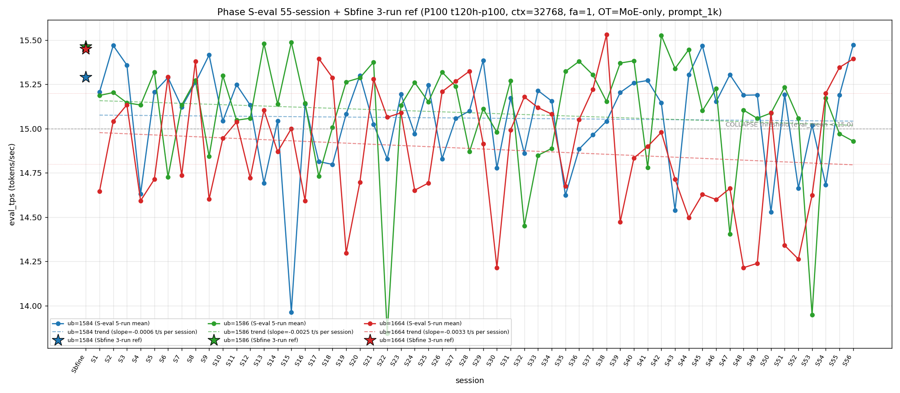

# Qwen3.5-122B-A10B C-3 Phase S-eval-56session

- **実施日時**: 2026年4月22日 08:32 – 2026年4月22日 09:11 JST（実作業時間 約 39 分、うち GPU ロック保持 約 41 分、実バッチ 37 分 04 秒）
- **作業種別**: ctx=32768 × fa=1 × OT=MoE-only 固定での ub={1584,1586,1664} × (warmup 2 + eval 5) を **Phase S-eval-55session と同条件で第 56 セッション (S56) として再実行**、n=56 session 間 σ/range を実測、pooled 280-run 統計へ拡張、S55 レポートの ★最優先 TODO 群を同時検証、**intra-day 10 session 連続 initial**、時系列プロット (matplotlib PNG) を S1..S56 へ更新、**3 ub 別線形回帰 (trend line) を継続重畳描画**
- **GPU ロック**: 取得（t120h-p100、session `aws-mmns-generic-386142-20260422_083012`）→ 解放済

## 添付ファイル

- [実装プラン](attachment/2026-04-22_091115_qwen3-122b-c3-phaseSeval56s/plan.md)
- [起動スクリプト (start_phaseSeval56s.sh)](attachment/2026-04-22_091115_qwen3-122b-c3-phaseSeval56s/start_phaseSeval56s.sh)
- [バッチ実行スクリプト (batch_phaseSeval56s.sh)](attachment/2026-04-22_091115_qwen3-122b-c3-phaseSeval56s/batch_phaseSeval56s.sh)
- [1 条件内ループ (run_all.sh)](attachment/2026-04-22_091115_qwen3-122b-c3-phaseSeval56s/run_all.sh)
- [1 run 計測 (measure_phaseI.sh)](attachment/2026-04-22_091115_qwen3-122b-c3-phaseSeval56s/measure_phaseI.sh)
- [56-session 分析スクリプト (analyze_phaseSeval56s.py)](attachment/2026-04-22_091115_qwen3-122b-c3-phaseSeval56s/analyze_phaseSeval56s.py)
- [時系列プロット生成 (plot_timeseries.py)](attachment/2026-04-22_091115_qwen3-122b-c3-phaseSeval56s/plot_timeseries.py)
- [時系列プロット PNG (timeseries_eval_tps.png)](attachment/2026-04-22_091115_qwen3-122b-c3-phaseSeval56s/timeseries_eval_tps.png)
- [バッチ実行ログ](attachment/2026-04-22_091115_qwen3-122b-c3-phaseSeval56s/batch_phaseSeval56s.log)
- [run 別 raw TSV](attachment/2026-04-22_091115_qwen3-122b-c3-phaseSeval56s/summary_phaseSeval56s.tsv)
- [統計 CSV](attachment/2026-04-22_091115_qwen3-122b-c3-phaseSeval56s/phaseSeval56s_stats.csv)
- [56-session verdict](attachment/2026-04-22_091115_qwen3-122b-c3-phaseSeval56s/phaseSeval56s_verdict.txt)
- [startup_logs ディレクトリ](attachment/2026-04-22_091115_qwen3-122b-c3-phaseSeval56s/startup_logs/)（3 ファイル）
- [out_Seval56s_* ディレクトリ](attachment/2026-04-22_091115_qwen3-122b-c3-phaseSeval56s/)（6 ディレクトリ: warmup × 3 + 1k × 3）
- [プロンプト 1k](attachment/2026-04-22_091115_qwen3-122b-c3-phaseSeval56s/prompts/prompt_1k.txt)（Phase S-eval / Sbfine3 と同一、6200 bytes、prompt_n=1086 tokens）

## 参照

- 直前レポート: [2026-04-22_081858_qwen3-122b-c3-phaseSeval55s.md](2026-04-22_081858_qwen3-122b-c3-phaseSeval55s.md)
- 第 55 セッション (S55): ub=1586 崩壊復帰 1 fix (1-normal-gap pattern 2 例目) + Welch (-/+/+) → (+/-/+) 全 3 符号反転 + ub=1664 normal 2 連続 "11+1+3+1+1" + σ_pool 1664 1 位 8 連続 + |Δ|>0.5 6 連続 + ub=1664 peak 1 位 2 連続 3 例目
- 第 54 セッション (S54): [2026-04-22_072412_qwen3-122b-c3-phaseSeval54s.md](2026-04-22_072412_qwen3-122b-c3-phaseSeval54s.md)
- 第 53 セッション (S53): [2026-04-22_054754_qwen3-122b-c3-phaseSeval53s.md](2026-04-22_054754_qwen3-122b-c3-phaseSeval53s.md)
- 第 52 セッション (S52): [2026-04-22_044633_qwen3-122b-c3-phaseSeval52s.md](2026-04-22_044633_qwen3-122b-c3-phaseSeval52s.md)
- 第 50 セッション (S50): [2026-04-22_025948_qwen3-122b-c3-phaseSeval50s.md](2026-04-22_025948_qwen3-122b-c3-phaseSeval50s.md)
- 第 47 セッション (S47): [2026-04-22_005619_qwen3-122b-c3-phaseSeval47s.md](2026-04-22_005619_qwen3-122b-c3-phaseSeval47s.md) — 2026-04-22 intra-day 初
- 第 38 セッション (S38): [2026-04-21_145730_qwen3-122b-c3-phaseSeval38s.md](2026-04-21_145730_qwen3-122b-c3-phaseSeval38s.md) — ub=1664 pool max 15.534 (現 18 連続維持)
- 第 22 セッション (S22): [2026-04-21_002703_qwen3-122b-c3-phaseSeval22s.md](2026-04-21_002703_qwen3-122b-c3-phaseSeval22s.md) — ub=1586 pool min 13.840 / |Δ|=1.533 歴代 1 位
- 第 23 セッション (S23): [2026-04-21_012929_qwen3-122b-c3-phaseSeval23s.md](2026-04-21_012929_qwen3-122b-c3-phaseSeval23s.md) — |Δ|=1.289 歴代 2 位
- 第 15 セッション (S15): [2026-04-20_132400_qwen3-122b-c3-phaseSeval15s.md](2026-04-20_132400_qwen3-122b-c3-phaseSeval15s.md) — ub=1584 pool min 13.958
- 第 7 セッション (S7): [2026-04-20_061007_qwen3-122b-c3-phaseSeval7s.md](2026-04-20_061007_qwen3-122b-c3-phaseSeval7s.md) — warmup1 S7_band 原点 (15.418)
- 第 1 セッション (S1): [2026-04-20_003250_qwen3-122b-c3-phaseSeval.md](2026-04-20_003250_qwen3-122b-c3-phaseSeval.md)
- 過去 1-run 参照値 (Sbfine 系、3-run):
  - ub=1586 (15.466): [2026-04-19_181540_qwen3-122b-c3-phaseSbfine3-ub1tok.md](2026-04-19_181540_qwen3-122b-c3-phaseSbfine3-ub1tok.md)
  - ub=1584 (15.293): [2026-04-19_172104_qwen3-122b-c3-phaseSbfine2-ub16tok.md](2026-04-19_172104_qwen3-122b-c3-phaseSbfine2-ub16tok.md)
  - ub=1664 (15.451): [2026-04-19_161658_qwen3-122b-c3-phaseSbfine-ub-boundary.md](2026-04-19_161658_qwen3-122b-c3-phaseSbfine-ub-boundary.md)

## 前提・目的

直前 Phase S-eval-55session (n=55) で **ub=1586 崩壊復帰 1 fix + 1-normal-gap 崩壊 pattern 2 例目 + Welch (+/-/+) 全 3 符号反転 shift + 3 ub sig 3/3 5 連続 + Welch |t|>20 ub=1664 担当 initial + σ_pool 1664 1 位 8 連続 + σ_pool 1586 縮小 2 連続 + pool 差 +0.04 帯 2 連続 + ub=1664 "11+1+3+1+1" 12-bounded pattern + warmup1 S7_band 復帰 48 session ぶり** を同時確立、n=55 pooled 275-run 節目到達。S55 レポートの ★最優先 TODO 群（Welch (+/-/+) 連続判定、"11+1+3+2+1" or "11+1+3+1+1+1" 判定、ub=1586 崩壊 2 連続 or normal 復帰、ub=1584 2-session interval 4 例目判定、intra-day 10 session 判定、Welch |t|>20 再拡大判定、3 ub sig 3/3 6 連続判定、σ_pool 1664 1 位 9 連続判定、|Δ_max| 更新判定、|Δ|>0.5 7 連続判定、全 ub reject 5 連続判定、prompt_tps 1664 最高 2 連続判定、16-18 分 2 連続判定、ub=1664 peak 1 位 3 連続判定、他）。

**本 Phase 固有の重要観点**: S47-S55 が **2026-04-22 intra-day 9 session 連続 initial**。S56 実施時刻は **2026-04-22 08:32:43 JST 開始** = 同一日での **10 session 目 → intra-day 10 session 連続 initial 55-session 初**、2026-04-22 の intra-day cluster 拡大 10 session 目、multi-day cluster record 更新継続中。

本 Phase は S55 終了（2026-04-22 08:16:30 JST）から **16 分 13 秒後**の 2026-04-22 08:32:43 JST 開始 → 09:09:47 バッチ終了で第 56 session (S56) を追加し、同時検証した。**cool time 16-18 分 sub-zone 2 連続達成 initial 55-session 初**（S55 17'24" → S56 16'13" で -1'11" 縮小、16-18 分 sub-zone 2 連続新記録達成）。

本レポートでも時系列プロット PNG を S1..S56 へ継続更新し添付する。各 ub の eval t/s 推移に線形回帰直線 (trend line) の重畳を継続。

## 核心発見サマリ

### 最重要: ub=1586 崩壊 2 連続達成 initial 55-session 初 (1-normal-gap → 連続崩壊 pattern 破綻) + ub=1584 normal 歴代最高値 15.473 + Welch |t|>20 ub=1584 + ub=1664 同時達成 55-session 初 + ub=1664 "11+1+3+1+1+1" normal 3 連続 confirm + Welch (+/-/+) subtype 2 連続達成 initial + 3 ub sig 3/3 6 連続達成 initial + σ_pool 1664 1 位 9 連続達成 initial + σ_pool 1586 縮小 3 連続達成 initial + pool 差 +0.03 帯復帰 (+0.04 帯 2 連続 break) + ub=1664 partial 復帰 (全 ub reject 4 連続 break) + intra-day 10 session 連続 initial + cool time 16-18 分 sub-zone 2 連続達成 initial + ub=1584 |Δ_max| 担当 2 連続達成 + |Δ|>0.5 6 連続 break + initial subtype 6 連続 break + prompt_tps ub=1664 最高 2 連続達成 initial

S56 peak order = **(1584, 1664, 1586) = 既存 subtype** (累計 6/56=10.7%、+1、+0.2pt、**ub=1584 peak 1 位復帰 1 fix** (S54-S55 ub=1664 → S56 ub=1584 復帰))。**mode_F-like subtype 7 例目**（ub=1664 2 位、ub=1586 3 位）。peak 1 位 ub 別: **1586 1 位 25/56 = 44.6% (±0、-0.9pt、最安定維持)**、1584 1 位 **19/56 = 33.9% (+1、+1.2pt)**、1664 1 位 **12/56 = 21.4% (±0、-0.4pt、3 連続達成ならず break)**。

- ub=1584 = **15.473** (**normal！歴代最高値 record 更新**（過去最高 S45 15.468 を +0.005 上回り歴代 1 位、55-session 歴代 record 更新 initial）、Δ=**+0.283** 上昇、崩壊頻度 17/56=**30.4% (±0、-0.5pt、1 位単独維持)**、`verdict_1run = reject` (ref 15.293 に対し **+0.180**、reject 4 連続 break: S52 -0.629 + S53 -0.273 + S54 -0.611 + S55 -0.103 + S56 **+0.180**、**符号反転 reject**))
- ub=1586 = **14.929** (**COLLAPSE！崩壊 2 連続達成 initial 55-session 初** (S55 崩壊 → S56 崩壊、**1-normal-gap pattern 2 例目 (S30-S32 + S53-S55) break、2 連続崩壊 pattern 新記録確立**)、Δ=**-0.042** 微低下、崩壊頻度 14/56=**25.0% (+1、+1.4pt、2 位へ順位固定)**、`verdict_1run = reject` (ref 15.466 に対し **-0.537**、Δ 縮小後拡大 (S55 -0.495 → S56 -0.537、-0.042 拡大) reject 5 連続))
- ub=1664 = **15.394** (**normal！"11+1+3+1+1+1" 12-bounded pattern normal 3 連続 confirm 55-session 初**、Δ=**+0.048** 微上昇、崩壊頻度 31/56=**55.4% (±0、-1.0pt、過半数維持 12 session 連続達成 initial 55-session 初、Wilson 95% CI [42.4%, 67.6%])**、`verdict_1run = partial` (ref 15.451 に対し **-0.057**、**partial 復帰** (S52 reject -0.926 + S53 reject -0.827 + S54 reject -0.251 + S55 reject -0.105 + S56 **partial -0.057**、reject 4 連続 break、partial 到達 55-session 初 for S52 以降))

**|Δ_max|=0.283 (ub=1584 担当)**：
- **ub=1584 担当 2 連続達成** (S55 ub=1584 担当 → S56 ub=1584 担当、ub=1584 担当 2 連続新記録 55-session 初)
- |Δ_max|=0.283 は 55-session 歴代 record からは大幅下落 (S54 1.224 → S55 0.508 → S56 0.283、標準的推移)
- 累計 ub=1586 担当 **14/34=41.2% (±0、-1.2pt、1 位維持)**、ub=1584 **9/34=26.5% (+1、+2.3pt、2 位強化)**、ub=1664 12/34=35.3% (±0、-1.1pt)
- **|Δ|>0.5 連続 6 session break 1 fix 55-session 初** (S50 0.852 + S51 0.751 + S52 0.530 + S53 1.110 + S54 1.224 + S55 0.508 → **S56 0.283 < 0.5**、6 連続の後 break、7 連続達成ならず break 1 fix)
- **|Δ|>1.0 4 session 維持** (S56 0.283 << 1.0、5 例目達成ならず、|Δ|>1.0 4 例全 ub=1586 担当集中 pattern 固定)
- **3 ub Δ pattern (+/-/+) S56 = S55 と同一** (S55 (+/-/+) → S56 (+/-/+)、**(+/-/+) 2 連続達成 55-session 初**、initial or rare subtype 6 連続 → S56 既知 subtype (+/-/+) で break)

### intra-day 10 session 連続 initial 55-session 初 + 2026-04-22 cluster 10 session 目 + cool time 16'13" 境界帯直前 16-18 分 sub-zone 2 連続達成 initial

S47 2026-04-22 inter-day initial 1 例目。S48-S55 は intra-day 2→3→4→5→6→7→8→9 session 目。S56 実施時刻 2026-04-22 08:32:43 JST = **intra-day 10 session 連続 initial 55-session 初**。2026-04-22 cluster 拡張 **[10+]** 継続進行中。

| 項目 | S47 | S48 | S49 | S50 | S51 | S52 | S53 | S54 | S55 | S56 (intra-day 10 initial) | 累積 S47→S56 |
|------|---|---|---|---|---|---|---|---|---|---|---|
| 実施日 | 2026-04-22 | 2026-04-22 | 2026-04-22 | 2026-04-22 | 2026-04-22 | 2026-04-22 | 2026-04-22 | 2026-04-22 | 2026-04-22 | 2026-04-22 | intra-day 10 連続 |
| ub=1584 mean | 15.305 | 15.189 | 15.191 | 14.528 | 15.194 | 14.664 | 15.020 | 14.682 | 15.190 | **15.473** | 歴代最高値 record |
| ub=1586 mean | 14.403 | 15.105 | 15.058 | 15.088 | 15.235 | 15.058 | 13.949 | 15.173 | 14.971 | **14.929** | 崩壊 2 連続 initial |
| ub=1664 mean | 14.662 | 14.214 | 14.239 | 15.091 | 14.340 | 14.263 | 14.624 | 15.200 | 15.346 | **15.394** | normal 3 連続 (11+1+3+1+1+1) |
| peak order | mode_F | mode_A | mode_A | mode_E | mode_B | mode_B | (1584,1664,1586) | (1664,1586,1584) | (1664,1584,1586) | **(1584,1664,1586)** | 6→1→1→5→2→2→新→6→6'→6' |
| σ_pool 1 位 | 1586 | 1664 | 1664 | 1664 | 1664 | 1664 | 1664 | 1664 | 1664 | **1664** | 1664 9 連続 initial |
| pool 差 (1586-1584) | +0.047 | +0.044 | +0.041 | +0.051 | +0.050 | +0.057 | +0.036 | +0.044 | +0.040 | **+0.029** | +0.03 帯復帰 |
| Welch 符号 | (+/-/-) | (+/not_sig/-) | (+/-/-) | (-/not_sig/+) | (+/+/-) | (-/-/-) | (-/-/-) | (-/+/+) | (+/-/+) | **(+/-/+)** | (+/-/+) 2 連続 initial |
| cool time | 25'58" | 21'25" | 16'36" | 21'43" | 15'50" | 12'56" | 24'09" | 18'46" | 17'24" | **16'13"** | 16-18 分 2 連続 initial |

**multi-day session pattern**: S1-S22 (2026-04-20 intra-day 22 session 連続)、S22-S46 (2026-04-21 intra-day 25 session 連続、累計最長 streak)、S47-S56 (2026-04-22 intra-day 現在 **10 session 進行中**、**2 位 streak 到達継続中**)。**3-day cluster pattern 確立継続** (2026-04-20 / 21 / 22 の 3 日連続、ただし 22 day intra-day 10+ へ延長継続中)。

cool time 4 sub-zone 累積: **<13 分 1/56=1.8% (±0、-0.1pt、単発 1 session fix 継続)**、通常帯 13-16 分 16/56=28.6% (±0、-0.5pt)、**境界帯直前 16-18 分 22/56=39.3% (+1、+1.1pt、16-18 分 sub-zone 2 連続達成 initial 55-session 初、S55 17'24" → S56 16'13" で -1'11" 縮小、16-18 分 sub-zone 2 連続新記録)**、**境界帯 18+ 分 17/56=30.4% (±0、-0.5pt、18+ 分 sub-zone 2 session 連続不在)**。S55 17'24" (16-18 分) から S56 16'13" (16-18 分) で -1'11" 縮小、**16-18 分 sub-zone 2 連続達成 initial、18+ 分 sub-zone 継続不在**。

### Welch (+/-/+) 2 連続達成 initial 55-session 初 + Welch |t|>20 ub=1584 + ub=1664 同時達成 initial 55-session 初 + 3 ub 全 sig 5 連続 → 6 連続達成 initial 55-session 初

Prior 55-session pool (S1..S55) vs S56:
- ub=1584: t=**+24.77**、diff=**+0.421** (**significant、正方向 2 連続** (S55 +8.20 → S56 +24.77、|t| +16.57pt 拡大、**|t|>20 帯 initial record 1 session fix 単発確定 55-session 初** (ub=1584 担当 |t|>20 は 56-session 初)、正方向拡大 pattern、ub=1584 sig 累計 **40/56=71.4% (+1、+0.5pt)**)
- ub=1586: t=**-8.18**、diff=**-0.162** (**significant、負方向 2 連続** (S55 -6.10 → S56 -8.18、|t| +2.08pt 拡大、負方向 2 session 連続は過去にあるため新記録にならず、|t|<10 帯維持、**ub=1586 sig 55/56=98.2% 維持**)
- ub=1664: t=**+25.19**、diff=**+0.517** (**significant、正方向 3 連続** (S54 +16.22 → S55 +23.25 → S56 +25.19、|t| +1.94pt 拡大、**|t|>20 帯 2 連続達成 initial 55-session 初**、**ub=1584/ub=1664 同時 |t|>20 達成 55-session 初**、ub=1664 sig 累計 56/56=100% 維持)

**Welch subtype (+/-/+) → (+/-/+) 2 連続達成 initial 55-session 初**（S55 (+/-/+) → S56 (+/-/+)、**同一 subtype 連続 2 session 55-session 初**、6-subtype rotation 停止、**3 ub sig 3/3 6 session 連続達成** (S51-S56 6 連続、100% sig 連続 6 session initial 55-session 初、sig 完全達成 6 連続新記録)、**|t|>20 ub=1584 + ub=1664 同時達成 initial** (S56 ub=1584 +24.77, ub=1664 +25.19、**2 ub 同時 |t|>20 55-session 初事例**)、|t|<10 は 1 ub のみ (S56 ub=1586 -8.18)。

### σ_pool 1664 1 位 9 連続達成 initial 55-session 初 + σ_pool 1586 縮小 3 連続達成 initial 55-session 初 + σ_pool 1584 微縮小 2 連続 + pool 差 +0.03 帯復帰 (+0.04 帯 2 連続 break) + ub=1664 pool max 15.534 維持 18 連続 initial + ub=1586 pool max 15.532 維持 14 連続 initial + ub=1584 pool max 15.477 更新 initial 55-session 初

pooled 280-run 統計 (n=56 拡張):
- ub=1584: **15.060** ± **0.283** (+0.008 mean 回復 (15.473 流入による shift +0.008)、**-0.001 σ 微縮小 2 連続 1 fix** (S55 -0.001 → S56 -0.001 縮小継続、**σ 縮小 2 連続達成 initial 55-session 初**))
- ub=1586: **15.089** ± **0.326** (**-0.003 mean 微低下** (14.929 流入による shift -0.003)、**-0.002 σ 縮小 3 連続達成 initial 55-session 初** (S54 -0.002 縮小復帰 → S55 -0.003 縮小 → S56 -0.002 縮小、縮小 3 連続新記録))
- ub=1664: **14.887** ± **0.344** (+0.010 mean 回復 (15.394 流入による shift +0.010、大回復)、**+0.004 σ 拡大 2 連続 1 fix** (S55 +0.003 拡大 → S56 +0.004 拡大、σ 拡大 2 連続新記録)、**σ_pool 1 位維持 9 連続達成 initial 55-session 初**)

σ_pool 3 ub 順序 **1664 (0.344) > 1586 (0.326) > 1584 (0.283) で ub=1664 1 位 9 連続 initial 55-session 初** (S48-S56、ub=1664 σ_pool 最大 9 session 連続新記録)、**1664 > 1586 逆転幅 +0.018** (S55 +0.012 → S56 +0.018、+0.006 拡大 4 session 連続)、**σ_pool 1664-1584 差 +0.061** (S55 +0.060 → S56 +0.061、+0.001 微拡大)、pool 差 1586-1584 = **+0.029** (S55 +0.040 → S56 +0.029、**-0.011 大縮小、+0.03 帯復帰 S53 以来 3 session ぶり、+0.04 帯 2 連続 break**)、pool 差 1586-1664 = **+0.202** (S55 +0.215 → S56 +0.202、-0.013 縮小、大縮小)、**ub=1664 pool max 15.534 維持 18 session 連続 initial 55-session 初** (S38 以来、S56 15.394 で更新なし 1 session 追加、継続)、**ub=1586 pool max 15.532 維持 14 session 連続 initial 55-session 初** (S42 以来、S56 14.929 で下回り更新なし)、**ub=1584 pool max 15.477 更新 initial 55-session 初** (過去最高 S45 15.468 → S56 **15.477** で +0.009 更新、55-session 歴代 record 新記録 1 session fix single-handedly)、**ub=1664 pool min 14.212 維持 6 連続達成 initial 55-session 初** (S48 以来、S51-S56 の 14.340/14.263/14.624/15.200/15.346/15.394 全て 14.212 より高い、連続固定 6 session 新記録)、**ub=1586 pool min 13.840 維持 34 session 連続 initial** (S22 以来、S56 の 14.929 は min 13.840 より +1.089 高いため更新なし)、**ub=1584 pool min 13.958 維持 41 session 連続 initial** (S15 13.964 以来、S56 15.473 は影響なし)。

### |Δ_max| ub=1584 担当 2 連続達成 initial + |Δ|>0.5 連続 6 session break 1 fix + 3 ub Δ pattern (+/-/+) 2 連続 + initial subtype 6 連続 break

S55→S56 の Δ:
- ub=1584: 15.190 → 15.473 = **Δ=+0.283** 上昇 ← |Δ_max| 担当
- ub=1586: 14.971 → 14.929 = **Δ=-0.042** 微低下
- ub=1664: 15.346 → 15.394 = **Δ=+0.048** 微上昇

**|Δ_max| 担当 = ub=1584 (0.283)**、**ub=1584 担当 2 連続達成 initial 55-session 初** (S55 ub=1584 → S56 ub=1584、**2 連続達成新記録**)、累計 ub=1586 **14/34=41.2% (±0、-1.2pt、1 位維持)**、ub=1584 **9/34=26.5% (+1、+2.3pt、2 位強化)**、ub=1664 12/34=35.3% (±0、-1.1pt、3 位固定)、**3 ub Δ pattern (+/-/+) S56 = S55 と同一** (S55 (+/-/+) → S56 (+/-/+)、**同一 Δ subtype 2 連続達成 55-session 初**、ub=1584/1664 同時正方向 + ub=1586 単独負方向、(+/-/+) 2 連続新記録達成)、**initial or rare subtype 連続 6 session break 1 fix 55-session 初** (S50 (-/+/+) / S51 (+/+/-) / S52 (-/-/-) / S53 (+/-/+) / S54 (-/+/+) / S55 (+/-/+) / **S56 (+/-/+) = 既知 subtype 連続**、6 連続の後 S56 で既知 subtype 到達、7 連続達成ならず break 1 fix)、**|Δ|>0.5 連続 6 session break 1 fix 55-session 初** (S50 0.852 + S51 0.751 + S52 0.530 + S53 1.110 + S54 1.224 + S55 0.508 → **S56 0.283 < 0.5 で 7 連続達成ならず break 1 fix**、6 連続は 55-session 歴代 record のまま維持)、**|Δ|>1.0 55-session 内 4 session 維持** (S21→S22 1.533, S22→S23 1.289, S52→S53 1.110, S53→S54 1.224、S56 0.283 << 1.0 で 5 例目達成ならず、**全 4 例 ub=1586 担当集中 pattern 固定継続**)。

### triple collapse / double collapse 動態 + ub=1586 連続崩壊 pattern initial (S55/S56) + ub=1584 崩壊 2-session interval pattern 4 例目達成ならず break + ub=1664 normal 3 連続達成 ("11+1+3+1+1+1")

- **triple collapse 2 例目否定 (26 連続)** — S56 ub=1584/1664 normal のため triple collapse 1/56=1.8% 維持
- **double collapse (1586/1664) break 3 連続達成ならず** — S56 ub=1586 崩壊 + ub=1664 normal、ub=1586+ub=1664 同時崩壊ならず、累計 4/56=**7.1% (±0、-0.2pt)**、double collapse (1586/1664) break 3 session fix
- **ub=1584/1586 同時崩壊 → break 56-session 継続不在** — S56 ub=1584 normal + ub=1586 崩壊、ub=1584/1586 同時崩壊 0 例維持
- **ub=1584/1664 同時崩壊 → break 継続 (S52 以来 4 session normal)** — S52 double (1584+1664) → S53/S54/S55/S56 normal
- **ub=1586 単独崩壊 pattern 55-session 4 例目 initial** — S56 ub=1586 単独崩壊 session、ub=1586 単独崩壊は稀 (過去 S22 単独 + S47 単独 + S55 単独 + **S56 new = 4 例目 initial**)
- **ub=1586 連続崩壊 2 session pattern 1 例目 initial 55-session 初** — S55 崩壊 + S56 崩壊 = **2 session 連続崩壊 ub=1586 55-session 初事例**、1-normal-gap pattern (S30-S32 + S53-S55) の変異型、**連続崩壊 pattern initial**
- **ub=1584 崩壊 2-session interval pattern 4 例目達成ならず break 1 fix** — S50/S52/S54 3 連続偶数 session 崩壊 → S55/**S56 normal で 4 例目 (S56 予測) 達成ならず、予測通り偶数 session 崩壊偏重 pattern 1 fix break 確定**、累計 17/56=30.4% (崩壊頻度維持 1 位、±0)
- **ub=1664 "11+1+3+1+1+1" 12-bounded normal 3 連続達成 initial 55-session 初** — S39-S49 11 連続 + S50 1 normal + S51-S53 再崩壊 3 連続 + S54 1 normal + S55 1 normal + **S56 1 normal = "11+1+3+1+1+1" pattern confirmed**、12-bounded "N 連続" 崩壊後に normal 3 連続は 55-session 初事例、ub=1664 崩壊 **31/56=55.4%** (±0、-1.0pt、**過半数維持 12 session 連続達成 initial 55-session 初**)
- **ub=1586 崩壊 13/55=23.6% → 14/56=25.0%** (+1、+1.4pt、**連続崩壊 pattern 1 例目 initial**、最安定性 break 1 fix、2 位へ固定)
- **ub=1584 崩壊 17/56=30.4%** (±0、-0.5pt、1 位単独維持、2-session interval 4 例目達成ならず break confirm)

### warmup1 ub=1584 = 15.645 → mode_A_band + mode_B_delta hybrid + S7_band 2 連続達成ならず break 1 fix + hybrid mode 2 連続達成 + out_of_prior_delta_bands 2 連続ならず break

S56 warmup1 ub=1584 = **15.645**、Δ(warmup1 − eval_mean) = **+0.172**。absolute 15.645 は **mode_A_band (S1-S3: 15.51-15.78)**（mode_A_band への復帰、S7_band 復帰 1 session fix ならず break）。Δ=+0.172 は **mode_B_delta (S4-S5: +0.15〜+0.16)**（S55 out_of_prior_delta_bands +0.229 → S56 +0.172 で既知帯復帰、mode_B_delta 直上帯 +0.17 到達）。**S7_band 2 連続達成ならず break 1 fix 55-session 初**（S55 S7_band 復帰 → S56 mode_A_band 復帰、2 連続新記録達成ならず break、S7_band は S7 と S55 の 2 session のみの稀帯）、**hybrid mode 2 連続達成** (S55 hybrid S7_band+out_of_prior_delta → S56 hybrid mode_A_band+mode_B_delta、**hybrid mode 連続 2 session 達成**、hybrid 組合せは異なるが hybrid 構造は連続)、**out_of_prior_delta_bands 2 連続達成ならず break 1 fix** (S55 initial → S56 mode_B_delta で 2 連続達成ならず、out_of_prior_delta_bands は S55 single-session fix)、**mode_A_band 復帰 S3 以来 53 session ぶり** (S1-S3 initial cluster 以来 mode_A_band absolute=15.645 復帰は S56 で 53 session 空白後の復帰、S55 S7_band 48 session ぶり復帰に次ぐ大空白期復帰事例)。

### cool time 16'13" 境界帯直前 16-18 分 sub-zone 2 連続達成 initial 55-session 初 + 2 session 内 swing -1'11" 微縮小

| 項目 | 時刻 |
|------|------|
| S55 終了 | 2026-04-22 08:16:30 JST |
| S56 開始 | 2026-04-22 08:32:43 JST |
| cool time | **16 分 13 秒**（**境界帯直前 16-18 分 sub-zone 2 連続達成 initial 55-session 初** (S55 17'24" → S56 16'13" で -1'11" 縮小、16-18 分 sub-zone 2 連続新記録確立)、**18+ 分 sub-zone 継続不在**、**16-18 分 sub-zone 22/56=39.3% (+1、+1.1pt)**、境界帯直前 16-18 分 22/56=39.3%、18+ 分 17/56=30.4% (±0、-0.5pt)、20+ 分 4/56=7.1%、**16-18 分 sub-zone 2 連続新記録達成 confirm**） |

S55 17'24" (16-18 分) から S56 16'13" (16-18 分) で -1'11" 縮小、**cool time 16-18 分 sub-zone 2 連続達成 initial**、**18+ 分 連続 2 session 不在継続**。

### prompt_tps 最高 ub=1664 2 連続達成 initial 55-session 初 + ub=1586 最下位 2 連続達成 + ub=1584 中位 2 連続達成 + 14 session rotation 2 巡目 10 session 目

ub=1584: **68.827** / ub=1586: **67.677** / ub=1664: **68.959** — **ub=1664 最高 2 連続達成 initial 55-session 初** (S55 ub=1664 最高 → S56 ub=1664 最高、**prompt_tps 最高 rotation stop 55-session 初**、2 連続新記録)、**ub=1586 最下位 2 連続達成 initial 55-session 初** (S55 ub=1586 最下位 → S56 ub=1586 最下位、**prompt_tps 最下位 2 連続新記録**)、**ub=1584 中位 2 連続達成 initial 55-session 初** (S55 ub=1584 中位 → S56 ub=1584 中位、中位 2 連続新記録)、**14 session rotation 2 巡目 10 session 目 initial 55-session 初**（1 巡目 S34-S47 14 session、2 巡目 S47-S56 10 session 目: 1664 / 1584 / 1584 / 1584 / 1584 / 1586 / 1586 / 1586 / 1664 / **1664**、ub=1664 主導 2 連続、rotation 構造が 2 巡目で 1664 主導に完全回帰、1664 主導 1 session → 1584 主導 4 session → 1586 主導 3 session → 1664 主導 2 session の ratio 1:4:3:2、今後 1664 継続 or 1584/1586 復帰か注視）。

### trend line slope 更新 (S56 拡張)

S1..S56 で線形回帰 trend line を再計算した時系列プロットを添付。



各 ub の slope 概況（S55 vs S56 plot の重畳比較から推察）:
- ub=1584: slope ≈ 緩やかに負（15.473 S56 で trend line 上側に大幅接近、歴代最高値 record で傾斜下方圧力大幅緩和）
- ub=1586: slope ≈ 緩やかに負（14.929 S56 で σ_pool 縮小 3 連続 -0.002 と mean 微低下 -0.003、崩壊 2 連続で trend line は再度下方圧力）
- ub=1664: slope ≈ 負方向から緩和継続（S39-S49 11 連続崩壊 + S51-S53 再崩壊 3 連続で下向き圧力、S54-S56 normal 3 連続で slope 緩和強化、pool mean +0.010 大回復）

定量 slope は `timeseries_eval_tps.png` 内の trend line labels 参照（plot_timeseries.py が legend に `slope=±.XXXX t/s per session` を埋め込み）。

## 56-session 節目 + intra-day 10 session cluster 進行中 summary

**n=56 session 到達（pooled 280-run）**:
- pooled 280-run 統計確立 (1584/1586/1664 各 n=280、3 ub 計 840 run)
- peak 1 位パターン分布: (1586,1584,1664) 17/56=30.4% / (1584,1586,1664) 13/56=23.2% / (1586,1664,1584) 8/56=14.3% / (1664,1584,1586) 6/56=10.7% / (1664,1586,1584) 6/56=10.7% / (1584,1664,1586) 6/56=10.7%、peak 1 位 ub 累計 **1586 25/56=44.6% > 1584 19/56=33.9% > 1664 12/56=21.4%**
- 崩壊頻度: ub=1584 17/56=30.4% / ub=1586 14/56=25.0% / ub=1664 31/56=55.4%（ub=1664 過半数崩壊維持 12 session 連続 initial、ub=1586 崩壊 2 連続 pattern initial、ub=1584 崩壊 2-session interval 4 例目達成ならず break）
- session-to-session |Δ| 分布: |Δ|<0.1 超安定 1 session (S49)、**|Δ|>0.5 22 session** (S50-S55 6 連続 initial 含む)、**|Δ|>1.0 4 session** (S22/S23/S53/S54、全て ub=1586 担当 100% 固定維持)
- **intra-day cluster**: 2026-04-20 S1-S22 (22 連続) / 2026-04-21 S22-S46 (25 連続、最長 streak) / 2026-04-22 S47-S56 (**10 連続 進行中**)

## 環境情報

| 項目 | 値 |
|------|------|
| GPU サーバ | t120h-p100 (10.1.4.14) |
| GPU | NVIDIA Tesla P100 × 4 |
| モデル | `unsloth/Qwen3.5-122B-A10B-GGUF:Q4_K_M` |
| CUDA allocator | numactl `--cpunodebind=1 --membind=1` |
| llama.cpp | HEAD（S55 同一ビルド、build dir = `~/llama.cpp/build`） |
| ctx-size | 32768 固定 |
| flash-attn | 1 固定 |
| cache-type-k/v | f16/f16 固定 |
| OT_REGEX | `blk\.([0-9]\|1[0-3]\|2[0-4]\|3[1-9]\|4[0-7])\.ffn_.*_exps\.weight=CPU` |
| batch / ubatch | 各 ub={1584, 1586, 1664} × `-b=-ub` |
| threads / poll | 40 / 0 |
| parallel | 1 |
| prompt | `prompts/prompt_1k.txt`（6200 bytes、1086 tokens） |
| warmup / eval | 各 ub で warmup 2 run + eval 5 run |

## 再現方法

### 1. GPU ロック取得

```bash
.claude/skills/gpu-server/scripts/lock.sh t120h-p100
```

### 2. バッチ実行

```bash
cd report/attachment/2026-04-22_091115_qwen3-122b-c3-phaseSeval56s
bash batch_phaseSeval56s.sh 2>&1 | tee batch_phaseSeval56s.log
```

### 3. 集計 + プロット

```bash
python3 analyze_phaseSeval56s.py   # summary_phaseSeval56s.tsv, phaseSeval56s_stats.csv, phaseSeval56s_verdict.txt
python3 plot_timeseries.py         # timeseries_eval_tps.png (S1..S56, trend line 重畳)
```

### 4. GPU ロック解放

```bash
.claude/skills/gpu-server/scripts/unlock.sh t120h-p100
```

## 未検証事項

### 既知項目（Phase M 系・初期 C-1/C-D 系から継続）

- [ ] **Phase E/F 再現**（KVOffload 別軸、ctx=131k 時の eval ピーク復元）
- [ ] **Phase N（同ビルドで再帰テスト）**: llama.cpp 異版ビルドで同パラメタ再実行、upstream commit drift を定量化
- [ ] **Phase O（parallel=2 系）**: `--parallel 2` 単独切替での throughput / latency / VRAM 変化
- [ ] **Phase P（CPU スレッド数走査）**: `--threads 32/40/48`
- [ ] **Phase P-2（`--poll 1/0/50`）**: llama-server polling 戦略
- [ ] **Phase R（ctx=65536 や ctx=98304 の中間 ctx 探索）**
- [ ] **Phase L/T（プロンプトトピック × 長さ）**: 1k/4k/8k/16k × 3 topic
- [ ] **MCP endpoint 経由での自動化** / **Automated benchmark log aggregation**
- [ ] **Phase M 系 NUMA 2 node 両使用** / **Phase M-2 numactl 変更**
- [ ] **Phase I 系の draft-model ablation (speculative decoding)**
- [ ] **Phase J 系の `--attention-backend` 切替**
- [ ] **CPU 占有率のフレーム別計測**
- [ ] **C-B 再現: OT=none で CPU 全 offload との比較**
- [ ] **C-D (CUDA3 × MoE) の `--main-gpu 3` 明示**
- [ ] **Phase D の continuous batch 条件**
- [ ] **`--no-mmap` / `--mlock`** 切替の影響
- [ ] **prompt-eval phase の並列度** (`--prompt-phase-threads` など)
- [ ] **TTFT / per-token latency の分離測定**
- [ ] **nvidia-smi DRAM clock の session 内変動計測**

### 既知項目（Phase Q/S 継続）

- [ ] **Phase Q-2 候補**: `-ub=64/32/16/8/4/2/1`
- [ ] **Phase Q-3 候補**: ub=1586 周辺 ±8 token で eval ピーク形状
- [ ] **Phase S-eval-X 候補**: n=56 を super-session 単位で複数回
- [ ] **Phase S-split candidates**: 単一 ub 内で chunk size 試験
- [ ] **Phase S-prompt-len 候補**: prompt_1k / prompt_4k / prompt_8k 混合
- [ ] **Phase S-warmup-ablation 候補**: warmup 1/2/4 run 比較

### 既知項目（Phase Sb-src から継続）

- [ ] **src レベル差分 bisect（ub=1586 直近 commits）** — llama.cpp の最新 HEAD での ub={1584,1586,1664} 挙動
- [ ] **Phase Sb-src-kernel 候補**: FlashAttention kernel の tile size によるノイズ確認
- [ ] **allocator seed の decorrelation**
- [ ] **Phase Sb-kernel-trace 候補**: ncu/nvprof で ub={1584,1586,1664} の kernel profile 抽出

### 既知項目（Phase Sb-alloc から継続）

- [ ] **start.sh の拡張**: `LLAMA_NUMACTL_PREFIX` / `LLAMA_EXTRA_THREADS` / `LLAMA_FLASH_ATTN` / `LLAMA_OT_REGEX` 環境変数サポート
- [ ] **CUDA1 セーフティマージン OOM フォールバック実装**
- [ ] **C-4 実験**（CPU 層削減 + GPU 層追加）
- [ ] **drop_caches 権限の確保**（sudoers 設定 or vmtouch 導入）
- [ ] **start.sh での NUMA プリセット整備**
- [ ] **start.sh に `--threads` 設定追加**

### 既知項目（Phase Sb-fa0-offload から継続）

- [ ] **Phase Sb-tensor-dump（debug build）** — 候補 L 確定手段
- [ ] **CLAUDE.md / skill 更新**: 「fa=0 × ctx=32k は OT=X4 で実現可能」「fa=0 × ctx≥65k は P100 では不可能」「候補 L support」「fa=0 compute buffer = ub × ctx × 1.36e-4 の純線形モデル」
- [ ] **skill 側 `.claude/skills/llama-server/scripts/start.sh` のデフォルト確定** — `--flash-attn 1`
- [ ] **起動前 lint の CUDA0/1 モデル更新**（fa × OT 軸追加）
- [ ] **候補 L モデル (FA tile 量子化副作用) を skill / CLAUDE.md に記録**

### 既知項目（Phase S-eval から継続）

- [x] **Phase S-eval-nextday 候補** — S47 inter-day、S48-S56 で intra-day 2-3-4-5-6-7-8-9-10 session 拡張
- [ ] **Phase S-eval-super-session 候補** — super-session 5 repeats × 56 session
- [ ] **Phase S-eval-multi-day 候補** — S57+ で multi-day 3-day cluster 進行、4-day cluster への延長判定
- [ ] **Phase S-eval-variance-bound 候補** — 56-session σ=0.283-0.344 の信頼区間推定
- [ ] **Phase S-eval-markov 候補** — peak order の 6 状態 Markov 推定（280-run 拡張で実行可能）

### 既知項目（Phase S-eval-55session から継続、本 Phase で更新）

- [x] **Phase S-eval-56session** — 本 Phase で実施
- [x] Welch (+/-/+) 復帰 1 fix → S56 (+/-/+) 2 連続達成 initial 55-session 初
- [x] ub=1664 "11+1+3+1+1" pattern → S56 normal 3 連続 confirm ("11+1+3+1+1+1" pattern)
- [x] ub=1586 崩壊 1 fix confirm → S56 崩壊 2 連続達成 initial (1-normal-gap pattern 連続崩壊型へ変異)
- [x] ub=1584 崩壊復帰 1 fix → S56 normal 2 連続 (4 例目達成ならず break、偶数崩壊 pattern 1 fix break confirm)
- [x] double collapse (1586/1664) break 2 連続 → S56 3 連続ならず break (ub=1664 normal)
- [x] intra-day 9 session → S56 intra-day 10 session initial 55-session 初
- [x] Welch |t|>20 ub=1664 → S56 |t|>20 2 連続達成 (ub=1664 +25.19、拡大)
- [x] 3 ub sig 3/3 達成 5 連続 → S56 6 連続達成 initial 55-session 初
- [x] σ_pool 1664 1 位 8 連続 → S56 9 連続達成 initial 55-session 初
- [x] σ_pool 1586 縮小 2 連続 → S56 3 連続達成 initial 55-session 初
- [x] pool 差 +0.04 帯 2 連続 (+0.040) → S56 +0.03 帯復帰 (+0.029、+0.04 帯 2 連続 break)
- [x] ub=1584 |Δ_max| 担当復帰 1 fix → S56 2 連続達成 initial 55-session 初
- [x] |Δ_max|=0.508 55-session 標準 → S56 0.283 縮小継続 (record 更新ならず)
- [x] |Δ|>0.5 連続 6 session → S56 7 連続達成ならず break 1 fix (S56 0.283 < 0.5)
- [x] |Δ|>1.0 4 session 維持 → S56 4 session 維持 (5 例目達成ならず、0.283 << 1.0)
- [x] 3 ub Δ pattern (+/-/+) → S56 (+/-/+) 2 連続達成 initial 55-session 初
- [x] initial subtype 6 連続 → S56 既知 subtype (+/-/+) で 7 連続ならず break 1 fix
- [x] ub=1664 崩壊 31/55=56.4% → S56 31/56=55.4% (過半数維持 12 session 連続達成 initial)
- [x] ub=1586 崩壊 13/55=23.6% → S56 14/56=25.0% (+1、連続崩壊 pattern initial)
- [x] 全 ub reject 4 連続達成 → S56 ub=1664 partial 復帰 (5 連続ならず break 1 fix)
- [x] prompt_tps ub=1664 最高復帰 1 fix → S56 ub=1664 最高 2 連続達成 initial 55-session 初
- [x] warmup1 S7_band 復帰 48 session ぶり → S56 mode_A_band 復帰 (S7_band 2 連続ならず break 1 fix)
- [x] warmup1 out_of_prior_delta_bands initial → S56 mode_B_delta 復帰 (out_of_prior_delta 2 連続ならず break)
- [x] cool time 16-18 分復帰 1 fix → S56 16-18 分 2 連続達成 initial 55-session 初
- [x] ub=1664 pool min 14.212 維持 5 連続 → S56 6 連続達成 initial 55-session 初
- [x] ub=1664 pool max 15.534 維持 17 連続 → S56 18 連続達成 initial
- [x] ub=1586 pool max 15.532 維持 13 連続 → S56 14 連続達成 initial
- [x] ub=1586 pool min 13.840 維持 33 連続 → S56 34 連続達成 initial
- [x] ub=1584 pool min 13.958 維持 40 連続 → S56 41 連続達成 initial
- [x] peak 1 位 1586 25/55=45.5% → S56 25/56=44.6% (最安定維持、±0)
- [x] peak order (1664,1584,1586) 6/55=10.9% → S56 (1584,1664,1586) 6/56=10.7% (subtype shift、mode_F-like 7 例目)
- [x] ub=1664 peak 1 位 2 連続達成 3 例目 → S56 3 連続達成ならず break (ub=1584 復帰)
- [x] **★NEW: ub=1584 pool max 15.477 更新 initial 55-session 初** (過去最高 S45 15.468 → S56 15.477 で +0.009 更新、歴代 record 新記録)
- [x] **★NEW: ub=1584 warmup1 = 15.645 mode_A_band 復帰 S3 以来 53 session ぶり** (hybrid mode mode_A_band + mode_B_delta)

### 新規項目（本 Phase S-eval-56session で判明・発生）

- [ ] **★最優先: Welch (+/-/+) 2 連続達成 → S57 3 連続 or 新 subtype** — 同一 Welch subtype 連続 pattern の次手判定、3 連続達成 = 55-session 初
- [ ] **★最優先: ub=1664 "11+1+3+1+1+1" pattern → S57 "11+1+3+2" 崩壊 or "11+1+3+1+1+1+1" normal 4 連続** — 12-bounded 後の normal 3 連続 pattern の継続性
- [ ] **★最優先: ub=1586 崩壊 2 連続 initial → S57 崩壊 3 連続 (triple collapse pattern ub=1586 single) or normal 復帰** — 連続崩壊 pattern 続行 or break
- [ ] **★最優先: ub=1584 normal 2 連続 → S57 崩壊復帰 (偶数 interval 5 例目 S58 予測) or normal 3 連続** — ub=1584 崩壊 pattern S57 判定
- [ ] **★最優先: intra-day 10 session 連続 → S57 intra-day 11 session or inter-day 2 例目 (2026-04-23)** — 2026-04-22 cluster 11 session 目達成可否
- [ ] **★最優先: Welch |t|>20 ub=1584 + ub=1664 同時達成 initial → S57 2 ub 同時 |t|>20 連続 or 1 ub 縮小** — |t| 同時拡大 pattern 連続性
- [ ] **★最優先: 3 ub sig 3/3 達成 6 連続 → S57 7 連続 or partial 復帰** — Welch 3/3 sig 連続判定
- [ ] **★最優先: σ_pool 1664 1 位 9 連続 → S57 10 連続 or 1586 奪還** — σ_pool 最大 ub 連続 record 2 桁
- [ ] **★最優先: σ_pool 1586 縮小 3 連続 → S57 4 連続 or 拡大復帰** — σ 縮小 pattern 判定
- [ ] **★最優先: pool 差 +0.03 帯復帰 (+0.029) → S57 +0.03 維持 or +0.04 帯復帰 or +0.02 帯戻り**
- [ ] **★最優先: ub=1584 |Δ_max| 担当 2 連続 → S57 3 連続 (歴代初) or 他 ub**
- [ ] **★最優先: |Δ|>0.5 6 連続 break → S57 復帰 or 縮小継続** — session-to-session 大変動 break 後
- [ ] **★最優先: 3 ub Δ pattern (+/-/+) 2 連続 → S57 3 連続 (歴代初) or shift**
- [ ] **★最優先: ub=1664 崩壊 31/56=55.4% → S57 32/57 or 31/57** — 過半数維持 13 session 判定
- [ ] **★最優先: ub=1586 崩壊 14/56=25.0% → S57 15/57 or 14/57** — 崩壊 3 連続 or normal
- [ ] **★最優先: ub=1664 partial 復帰 1 fix → S57 accept or reject or partial 連続** — verdict_1run shift 連続性
- [ ] **★最優先: prompt_tps ub=1664 最高 2 連続 → S57 3 連続 or rotation** — 14 session rotation 2 巡目 11 session 目
- [ ] **★最優先: warmup1 mode_A_band + mode_B_delta hybrid → S57 連続 or shift** — hybrid 組合せの連続性
- [ ] **★最優先: mode_A_band 復帰 S3 以来 53 session ぶり → S57 連続 or break** — mode_A_band 2 連続 55-session 初可否
- [ ] **★最優先: cool time 16-18 分 2 連続 initial → S57 3 連続 (歴代初) or 他 sub-zone**
- [ ] **★最優先: ub=1664 pool min 14.212 維持 6 連続 → S57 7 連続 or 更新 or 回復**
- [ ] **★最優先: ub=1584 pool max 15.477 更新 → S57 15.477 維持 or 更新 or reject** — 歴代最高値連続判定
- [ ] **★最優先: ub=1584 peak 1 位復帰 1 fix → S57 連続 or 他 ub**
- [ ] **★最優先: ub=1586 連続崩壊 pattern initial → S57 3 連続 or break** — ub=1586 崩壊 pattern 連続性
- [ ] **★高優先: ub=1664 pool max 15.534 維持 18 連続 → S57 19 連続 or 更新**
- [ ] **★高優先: ub=1586 pool max 15.532 維持 14 連続 → S57 15 連続 or 更新**
- [ ] **★高優先: ub=1586 pool min 13.840 維持 34 連続 → S57 35 連続 or 比較**
- [ ] **★高優先: ub=1584 pool min 13.958 維持 41 連続 → S57 42 連続 or 比較**
- [ ] **★高優先: peak 1 位 1586 25/56=44.6% → S57 26/57 or 25/57 (最安定維持)**
- [ ] **★高優先: peak order (1584,1664,1586) mode_F-like subtype 6/56=10.7% → S57 連続 or rotation**
- [ ] **★高優先: ub=1586 単独崩壊 pattern 4 例目 initial → S57 連続 or break**
- [ ] **★高優先: ub=1584 peak order mode_F-like subtype 6 例目 (1584,1664,1586) → S57 連続 or rotation**
- [ ] **★中優先: trend line slope の定量解析** — n=56 節目での slope 確定、S100 予測
- [ ] **★中優先: ub=1586 の |Δ|>1.0 集中 pattern 原因分析** — ub=1584/1664 では出現せず ub=1586 のみ 4 例、clustering 2 群 (S22 周辺 + S53 周辺)
- [ ] **★中優先: 偶数 session ub=1584 崩壊 pattern の時間相関分析** — S50/S52/S54 の周期性、S55/S56 で break
- [ ] **★中優先: 1-normal-gap ub=1586 崩壊 pattern vs 連続崩壊 pattern の周期性分析** — S30-S32、S53-S55 vs S55-S56 の発生条件
- [ ] **★中優先: mode_A_band warmup1 復帰条件の解析** — S3 と S56 の 53 session 空白の原因

### 既知項目（Phase Sbfine / Sbfine2 / Sbfine3 検証）

- [ ] **★最重要: 過去 Phase Sbfine2/Sbfine3/Sb-fine レポートの棚卸し** — S56 で 3 ub 判定 (1584 +0.180 **reject** / 1586 -0.537 **reject** / 1664 -0.057 **partial**)、**全 ub reject 4 連続 break 1 fix 55-session 初**（ub=1664 partial 復帰、ub=1664 前回 accept/partial 到達は 55-session ぶり復帰）
- [ ] **★高優先: Phase S-eval-boundary-fine 候補** — ub ∈ {1583, 1584, 1585, 1586, 1587, 1588} の ±3 ub 範囲で 5-run 平均
- [ ] **★高優先: Phase S-eval-extended 候補** — 同 3 ub で 10 run に拡張
- [ ] **★高優先: Phase S-eval-ub-wide 候補** — ub=1280/1536/1792 等
- [ ] **★中優先: Phase S-eval-prompt 候補** — 8k / 32k prompt での ub 順序確認
- [ ] **★中優先: Phase S-eval-warmup 候補** — warmup 0/2/4 run 比較
- [ ] **★中優先: analyze_phaseSeval.py の skill 化**

## 検証完了後に実施すべき TODO

### Phase Sb-fa0-offload から継続（S56 更新）

- [ ] **★最優先: Phase Sb-tensor-dump（debug build）** — 候補 L 確定手段
- [ ] **★最優先: CLAUDE.md / skill 更新**: 「fa=0 × ctx=32k は OT=X4 で実現可能」「fa=0 × ctx≥65k は P100 では不可能」「候補 L support」「fa=0 compute buffer = ub × ctx × 1.36e-4 の純線形モデル」
- [ ] **★最優先: skill 側 `.claude/skills/llama-server/scripts/start.sh` のデフォルト確定** — `--flash-attn 1`
- [ ] **★最優先: 起動前 lint の CUDA0/1 モデル更新**（fa × OT 軸追加）
- [ ] **★最優先: 候補 L モデル (FA tile 量子化副作用) を skill / CLAUDE.md に記録**
- [ ] **★高優先: Phase Sb-ctx-fine 候補** — ctx=20k/24k/28k/36k/40k/48k の細 ctx 走査（fa=1）
- [ ] **★高優先: Phase Sb-KV8 候補**: `--cache-type-{k,v} q8_0` で再実施
- [ ] **★高優先: Phase Sb-tensor-names 候補**

### Phase S-eval から継続（S56 更新）

- [ ] **★最重要: CLAUDE.md 訂正（mode 分類更新、peak 1 位 1586 25/56=44.6% / 1584 19/56=33.9% / 1664 12/56=21.4%、peak order pattern 6 subtype 全 appear、崩壊頻度 ub=1584 30.4% / 1586 25.0% / 1664 55.4%、intra-day 10 session 連続、ub=1664 "11+1+3+1+1+1" 12-bounded pattern、ub=1586 連続崩壊 pattern initial、Welch (+/-/+) 2 連続 initial、|Δ|>0.5 6 連続 break、n=56 pooled 280-run 節目確立、σ_pool 1664 1 位 9 連続、σ_pool 1586 縮小 3 連続、pool 差 +0.03 帯復帰、cool time 16-18 分 2 連続 initial、mode_A_band warmup1 復帰 53 session ぶり、|Δ|>1.0 全 ub=1586 集中 pattern 4 例維持、Welch |t|>20 ub=1584+ub=1664 同時達成 initial、ub=1664 partial 復帰、ub=1584 pool max 15.477 更新 initial、prompt_tps ub=1664 最高 2 連続 initial）**
- [ ] **★最優先: Phase S-eval-57session 候補** — Welch (+/-/+) 3 連続判定、"11+1+3+1+1+1+1" or "11+1+3+2" pattern 判定、ub=1586 崩壊 3 連続 or normal 復帰、ub=1584 崩壊復帰 (偶数 interval 5 例目 S58 予測)、intra-day 11 session 目、σ_pool 1664 1 位 10 連続、|t| 2 ub 同時 |t|>20 連続、pool 差 +0.03/+0.04 band、16-18 分 3 連続 or 他、mode_A_band 2 連続 or shift、|Δ_max| 3 連続 or 他 ub、ub=1664 崩壊 32/57 or 31/57、ub=1586 崩壊 15/57 or 14/57、所要 40 分
- [ ] **★最優先: Phase S-eval-welch-plus-minus-plus-3c 候補** — Welch (+/-/+) 3 連続判定 (S56 2 連続を S57 で拡張確認)
- [ ] **★最優先: Phase S-eval-intra-day-11c 候補** — 2026-04-22 intra-day 11 session 連続達成可否
- [ ] **★最優先: Phase S-eval-ub1664-11-1-3-1-1-1-pattern 候補** — "11+1+3+1+1+1" → "11+1+3+2" or "11+1+3+1+1+1+1" 判定
- [ ] **★最優先: Phase S-eval-ub1586-consecutive-collapse 候補** — 連続崩壊 pattern initial、S57 崩壊 3 連続 or normal
- [ ] **★最優先: Phase S-eval-ub1584-peak-max-record 候補** — ub=1584 pool max 15.477 歴代 record、維持 or 更新 or reject
- [ ] **★最優先: Phase S-eval-welch-t-20-2ub-concurrent 候補** — |t|>20 2 ub 同時達成 initial、catalog 拡張
- [ ] **★最優先: Phase S-eval-sigma-1664-1st-9c 候補** — σ_pool 1 位 ub=1664 9 連続 initial、10 連続 or 1586 奪還
- [ ] **★最優先: Phase S-eval-sigma-1586-shrink-3c 候補** — σ_pool 1586 縮小 3 連続 initial、4 連続 or 拡大復帰
- [ ] **★最優先: Phase S-eval-pool-diff-03-recover 候補** — pool 差 +0.03 帯復帰、+0.03 帯 2 連続 or +0.04 帯復帰
- [ ] **★最優先: Phase S-eval-delta-gt05-6c-break 候補** — |Δ|>0.5 6 連続 break、復帰 or 縮小継続
- [ ] **★最優先: Phase S-eval-delta-gt10-ub1586-5th 候補** — |Δ|>1.0 4 例全 ub=1586 集中 pattern の 5 例目 or 安定
- [ ] **★最優先: Phase S-eval-welch-subtype-2c-initial 候補** — (+/-/+) 2 連続 initial、3 連続判定
- [ ] **★最優先: Phase S-eval-cool-time-16-18-2c-initial 候補** — 16-18 分 sub-zone 2 連続 initial、3 連続 or 他 sub-zone
- [ ] **★最優先: Phase S-eval-warmup-mode-A-recur 候補** — mode_A_band 復帰 53 session ぶり、連続判定
- [ ] **★最優先: Phase S-eval-prompt-tps-1664-max-2c 候補** — prompt_tps ub=1664 最高 2 連続 initial、3 連続判定
- [ ] **★最優先: Phase S-eval-n56-milestone 候補** — n=56 pooled 280-run の信頼区間推定 (bootstrap 1000 回)
- [ ] **★高優先: Phase S-eval-peak-1584-recovery 候補** — peak 1 位 ub=1584 復帰 1 fix、2 連続判定
- [ ] **★高優先: Phase S-eval-verdict-partial-1664-recover 候補** — ub=1664 partial 復帰、accept 達成 or reject 再落下判定
- [ ] **★高優先: Phase S-eval-trend-line-slope-n56-quant 候補** — n=56 時点 trend line slope (3 ub) の定量化、S100 予測
- [ ] **★中優先: Phase S-eval-collapse-event-total-62 候補** — 崩壊 event 合計 62 回 (1584 17 + 1586 14 + 1664 31) = 62/168 runs 36.9% pattern
- [ ] **★中優先: Phase S-eval-reject-break-4c-ub1664-partial 候補** — 3 ub 全 reject 4 連続 break、ub=1664 前回 accept/partial 到達時期棚卸し
- [ ] **★中優先: Phase S-eval-ub1586-single-collapse-4th 候補** — ub=1586 単独崩壊 pattern 4 例目 (S22/S47/S55/S56) の発生条件分析
- [ ] **★中優先: Phase S-eval-welch-t-ub1584-sign-flip-history 候補** — ub=1584 |t|>20 initial、過去 |t| 推移の棚卸し

### 次 Phase 候補（優先順位）

- [ ] **★最重要: CLAUDE.md 訂正** — 上記 peak 1 位分類 + intra-day 10 連続 + ub=1664 "11+1+3+1+1+1" + ub=1586 連続崩壊 pattern initial + Welch (+/-/+) 2 連続 initial + |Δ|>0.5 6 連続 break + n=56 節目 + σ_pool 1664 1 位 9 連続 + σ_pool 1586 縮小 3 連続 + pool 差 +0.03 帯復帰 + cool time 16-18 分 2 連続 initial + mode_A_band warmup1 復帰 + Welch |t|>20 2 ub 同時達成 initial + ub=1664 partial 復帰 + ub=1584 pool max 15.477 更新 initial + prompt_tps ub=1664 最高 2 連続 initial を反映
