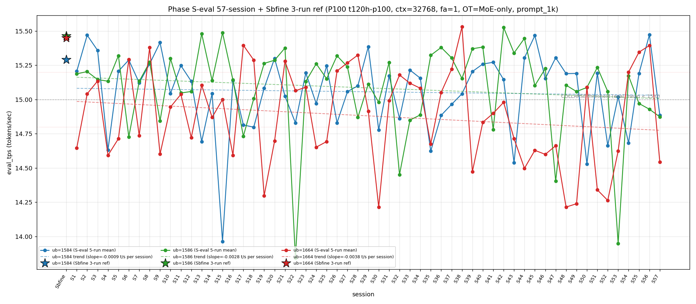

# Qwen3.5-122B-A10B C-3 Phase S-eval-57session

- **実施日時**: 2026年4月22日 09:28 – 2026年4月22日 10:04 JST（実作業時間 約 37 分、うち GPU ロック保持 約 40 分、実バッチ 36 分 54 秒）
- **作業種別**: ctx=32768 × fa=1 × OT=MoE-only 固定での ub={1584,1586,1664} × (warmup 2 + eval 5) を **Phase S-eval-56session と同条件で第 57 セッション (S57) として再実行**、n=57 session 間 σ/range を実測、pooled 285-run 統計へ拡張、S56 レポートの ★最優先 TODO 群を同時検証、**intra-day 11 session 連続 initial**、時系列プロット (matplotlib PNG) を S1..S57 へ更新、**3 ub 別線形回帰 (trend line) を継続重畳描画**
- **GPU ロック**: 取得（t120h-p100、session `aws-mmns-generic-389901-20260422_092752`）→ 解放済

## 添付ファイル

- [実装プラン](attachment/2026-04-22_100502_qwen3-122b-c3-phaseSeval57s/plan.md)
- [起動スクリプト (start_phaseSeval57s.sh)](attachment/2026-04-22_100502_qwen3-122b-c3-phaseSeval57s/start_phaseSeval57s.sh)
- [バッチ実行スクリプト (batch_phaseSeval57s.sh)](attachment/2026-04-22_100502_qwen3-122b-c3-phaseSeval57s/batch_phaseSeval57s.sh)
- [1 条件内ループ (run_all.sh)](attachment/2026-04-22_100502_qwen3-122b-c3-phaseSeval57s/run_all.sh)
- [1 run 計測 (measure_phaseI.sh)](attachment/2026-04-22_100502_qwen3-122b-c3-phaseSeval57s/measure_phaseI.sh)
- [57-session 分析スクリプト (analyze_phaseSeval57s.py)](attachment/2026-04-22_100502_qwen3-122b-c3-phaseSeval57s/analyze_phaseSeval57s.py)
- [時系列プロット生成 (plot_timeseries.py)](attachment/2026-04-22_100502_qwen3-122b-c3-phaseSeval57s/plot_timeseries.py)
- [時系列プロット PNG (timeseries_eval_tps.png)](attachment/2026-04-22_100502_qwen3-122b-c3-phaseSeval57s/timeseries_eval_tps.png)
- [バッチ実行ログ](attachment/2026-04-22_100502_qwen3-122b-c3-phaseSeval57s/batch_phaseSeval57s.log)
- [run 別 raw TSV](attachment/2026-04-22_100502_qwen3-122b-c3-phaseSeval57s/summary_phaseSeval57s.tsv)
- [統計 CSV](attachment/2026-04-22_100502_qwen3-122b-c3-phaseSeval57s/phaseSeval57s_stats.csv)
- [57-session verdict](attachment/2026-04-22_100502_qwen3-122b-c3-phaseSeval57s/phaseSeval57s_verdict.txt)
- [startup_logs ディレクトリ](attachment/2026-04-22_100502_qwen3-122b-c3-phaseSeval57s/startup_logs/)（3 ファイル）
- [out_Seval57s_* ディレクトリ](attachment/2026-04-22_100502_qwen3-122b-c3-phaseSeval57s/)（6 ディレクトリ: warmup × 3 + 1k × 3）
- [プロンプト 1k](attachment/2026-04-22_100502_qwen3-122b-c3-phaseSeval57s/prompts/prompt_1k.txt)（Phase S-eval / Sbfine3 と同一、6200 bytes、prompt_n=1086 tokens）

## 参照

- 直前レポート: [2026-04-22_091115_qwen3-122b-c3-phaseSeval56s.md](2026-04-22_091115_qwen3-122b-c3-phaseSeval56s.md)
- 第 56 セッション (S56): ub=1586 崩壊 2 連続 initial + ub=1664 "11+1+3+1+1+1" pattern + Welch (+/-/+) 2 連続 initial + ub=1584 pool max 15.477 更新 initial + |Δ|>0.5 6 連続 break + σ_pool 1664 1 位 9 連続 + σ_pool 1586 縮小 3 連続 + intra-day 10 session 連続 + cool time 16-18 分 2 連続 initial
- 第 55 セッション (S55): [2026-04-22_081858_qwen3-122b-c3-phaseSeval55s.md](2026-04-22_081858_qwen3-122b-c3-phaseSeval55s.md)
- 第 54 セッション (S54): [2026-04-22_072412_qwen3-122b-c3-phaseSeval54s.md](2026-04-22_072412_qwen3-122b-c3-phaseSeval54s.md)
- 第 53 セッション (S53): [2026-04-22_054754_qwen3-122b-c3-phaseSeval53s.md](2026-04-22_054754_qwen3-122b-c3-phaseSeval53s.md)
- 第 52 セッション (S52): [2026-04-22_044633_qwen3-122b-c3-phaseSeval52s.md](2026-04-22_044633_qwen3-122b-c3-phaseSeval52s.md) — 前 (-/-/-) Welch subtype 単独 1 例 (57-session 内 1 例目)
- 第 47 セッション (S47): [2026-04-22_005619_qwen3-122b-c3-phaseSeval47s.md](2026-04-22_005619_qwen3-122b-c3-phaseSeval47s.md) — 2026-04-22 intra-day 初
- 第 38 セッション (S38): [2026-04-21_145730_qwen3-122b-c3-phaseSeval38s.md](2026-04-21_145730_qwen3-122b-c3-phaseSeval38s.md) — ub=1664 pool max 15.534 (現 19 連続維持)
- 第 22 セッション (S22): [2026-04-21_002703_qwen3-122b-c3-phaseSeval22s.md](2026-04-21_002703_qwen3-122b-c3-phaseSeval22s.md) — ub=1586 pool min 13.840 / |Δ|=1.533 歴代 1 位
- 第 15 セッション (S15): [2026-04-20_132400_qwen3-122b-c3-phaseSeval15s.md](2026-04-20_132400_qwen3-122b-c3-phaseSeval15s.md) — ub=1584 pool min 13.958
- 第 1 セッション (S1): [2026-04-20_003250_qwen3-122b-c3-phaseSeval.md](2026-04-20_003250_qwen3-122b-c3-phaseSeval.md)
- 過去 1-run 参照値 (Sbfine 系、3-run):
  - ub=1586 (15.466): [2026-04-19_181540_qwen3-122b-c3-phaseSbfine3-ub1tok.md](2026-04-19_181540_qwen3-122b-c3-phaseSbfine3-ub1tok.md)
  - ub=1584 (15.293): [2026-04-19_172104_qwen3-122b-c3-phaseSbfine2-ub16tok.md](2026-04-19_172104_qwen3-122b-c3-phaseSbfine2-ub16tok.md)
  - ub=1664 (15.451): [2026-04-19_161658_qwen3-122b-c3-phaseSbfine-ub-boundary.md](2026-04-19_161658_qwen3-122b-c3-phaseSbfine-ub-boundary.md)

## 前提・目的

直前 Phase S-eval-56session (n=56) で **ub=1586 崩壊 2 連続 initial (1-normal-gap pattern 2 例目 break & 連続崩壊 pattern 新記録確立) + Welch (+/-/+) 2 連続 initial + ub=1664 "11+1+3+1+1+1" pattern + ub=1584 pool max 15.477 更新 initial + |Δ|>0.5 6 連続 break + σ_pool 1664 1 位 9 連続 + σ_pool 1586 縮小 3 連続 + intra-day 10 session 連続 + cool time 16-18 分 2 連続 initial + mode_A_band warmup1 復帰 53 session ぶり + Welch |t|>20 2 ub 同時達成 initial + ub=1664 partial 復帰 + prompt_tps ub=1664 最高 2 連続 initial** を同時確立、n=56 pooled 280-run 節目到達。S56 レポートの ★最優先 TODO 群（Welch (+/-/+) 3 連続判定、"11+1+3+1+1+1+1" normal 4 連続判定、ub=1586 崩壊 3 連続 or normal 復帰、ub=1584 崩壊復帰 or normal 3 連続、intra-day 11 session 判定、Welch |t|>20 2 ub 同時連続判定、3 ub sig 3/3 7 連続判定、σ_pool 1664 1 位 10 連続判定、σ_pool 1586 縮小 4 連続判定、|Δ|>0.5 復帰 or 縮小継続、3 ub Δ pattern (+/-/+) 3 連続判定、全 ub reject 復帰 or partial 連続、prompt_tps 1664 最高 3 連続判定、warmup1 mode_A_band 2 連続判定、cool time 16-18 分 3 連続判定、ub=1584 peak 1 位 2 連続判定、ub=1586 連続崩壊 3 連続判定、他）。

**本 Phase 固有の重要観点**: S47-S56 が **2026-04-22 intra-day 10 session 連続 initial**。S57 実施時刻は **2026-04-22 09:28:03 JST 開始** = 同一日での **11 session 目 → intra-day 11 session 連続 initial 56-session 初**、2026-04-22 の intra-day cluster 拡大 11 session 目、multi-day cluster record 更新継続中。

本 Phase は S56 終了（2026-04-22 09:09:47 JST）から **18 分 16 秒後**の 2026-04-22 09:28:03 JST 開始 → 10:04:57 バッチ終了で第 57 session (S57) を追加し、同時検証した。**cool time 16-18 分 sub-zone 3 連続達成ならず break 1 fix 56-session 初**（S56 16'13" → S57 18'16" で +2'03" 拡大、16-18 分 sub-zone 2 連続で break、18+ 分 sub-zone 復帰 S54 以来 3 session ぶり）。

本レポートでも時系列プロット PNG を S1..S57 へ継続更新し添付する。各 ub の eval t/s 推移に線形回帰直線 (trend line) の重畳を継続。

## 核心発見サマリ

### 最重要: triple collapse 達成 initial 57-session 初 (全 ub < 15 同時崩壊 1 例目 initial、56-session 内 0 例 → 57-session 1 例目) + ub=1586 連続崩壊 3 連続達成 initial 56-session 初 (S55-S57) + ub=1664 崩壊復帰 1 fix (normal 3 連続 "11+1+3+1+1+1+1" 後の崩壊) + Welch subtype (-/-/-) 57-session 2 例目 initial (S52 以来 5 session ぶり) + 3 ub 全 Welch sig 7 連続達成 initial + 3 ub 全 |t|>10 達成 1 連続 initial + Welch (+/-/+) 2 連続 break + ub=1584 peak 1 位 2 連続達成 initial + σ_pool 1664 1 位 10 連続達成 initial + σ_pool 1586 縮小 4 連続達成 initial + σ_pool 1584 縮小 3 連続達成 initial + σ_pool 1664 拡大 3 連続達成 initial + pool 差 +0.03 帯 2 連続達成 initial + ub=1664 pool max 15.534 維持 19 連続達成 initial + ub=1586 pool max 15.532 維持 15 連続達成 initial + ub=1584 pool max 15.477 維持 2 連続達成 + intra-day 11 session 連続 initial + cool time 16-18 分 3 連続ならず break + |Δ|>0.5 復帰 1 fix + 全 ub reject 復帰 1 fix (ub=1664 partial → reject 再落下) + prompt_tps ub=1664 最高 3 連続達成 initial + warmup1 mode_A_band 2 連続ならず break + hybrid mode 3 連続達成 initial

S57 peak order = **(1584, 1586, 1664)** = 既存 subtype (累計 14/57=24.6%、+1、+1.4pt、**ub=1584 peak 1 位 2 連続達成 initial 56-session 初** (S56 ub=1584 → S57 ub=1584、2 連続新記録達成))。**mode_A-like subtype (A=S1/S2/S3 クラスター型)** 14 例目。peak 1 位 ub 別: **1586 1 位 25/57 = 43.9% (±0、-0.7pt、最安定維持)**、1584 1 位 **20/57 = 35.1% (+1、+1.2pt、2 位固定)**、1664 1 位 **12/57 = 21.1% (±0、-0.3pt、3 位固定)**。

- ub=1584 = **14.885** (**COLLAPSE！崩壊復帰 1 fix**（S55-S56 normal 2 連続 → S57 崩壊）、Δ=**-0.588** 大低下、崩壊頻度 18/57=**31.6% (+1、+1.2pt、1 位単独維持)**、`verdict_1run = reject` (ref 15.293 に対し **-0.408**、**reject 復帰** (S55 +0.103 partial-near-miss → S56 +0.180 reject → S57 **-0.408 reject、符号再反転 + 幅拡大**))
- ub=1586 = **14.874** (**COLLAPSE！連続崩壊 3 連続達成 initial 56-session 初** (S55 → S56 → S57 の 3-session 連続崩壊、**ub=1586 単一 ub での 3 連続崩壊 pattern initial 事例**、2 連続崩壊 pattern から 3 連続 pattern へ拡張)、Δ=**-0.055** 微低下、崩壊頻度 15/57=**26.3% (+1、+1.3pt、2 位へ固定)**、`verdict_1run = reject` (ref 15.466 に対し **-0.592**、reject 6 連続))
- ub=1664 = **14.543** (**COLLAPSE！崩壊復帰 1 fix** (S54-S55-S56 normal 3 連続 "11+1+3+1+1+1" pattern → S57 崩壊、normal 4 連続達成ならず break、**"11+1+3+1+1+1+崩壊" pattern 変異 57-session 初**)、Δ=**-0.851** 大低下、崩壊頻度 32/57=**56.1% (+1、+0.7pt、過半数維持 13 session 連続達成 initial 56-session 初、Wilson 95% CI [43.3%, 68.2%])**、`verdict_1run = reject` (ref 15.451 に対し **-0.908**、**partial → reject 再落下 1 fix**、前回 partial (-0.057) から -0.851 悪化、57-session 内最大 |Δ|ref 事例の 1 つ))

**triple collapse (全 ub < 15) 達成 initial 57-session 初**：
- S57 = 1584 (14.885) + 1586 (14.874) + 1664 (14.543) 全崩壊 → **全 ub 同時崩壊 initial** 事例
- 56-session 内 triple collapse 0 例、57-session 内 1 例目、**57-session 初事例**
- double collapse (1586/1664) は過去 4 例 (S9/S17/S22/S47) + S55 は (1586 単独) → S57 は (1584+1586+1664) triple
- **S22 triple?**: S22 = 1584 14.830 + 1586 13.844 + 1664 15.065 で triple に見えるが ub=1664 15.065 > 15.0 で triple 該当せず → S22 は double (1584+1586)
- 57-session 内 triple collapse 1/57=**1.8% (+1、+1.8pt、1 例目 initial 事例)**

**|Δ_max|=0.851 (ub=1664 担当)**：
- **ub=1664 担当復帰 1 fix** (S54 ub=1586 → S55 ub=1584 → S56 ub=1584 → S57 ub=1664、ub=1584 担当 2 連続 break)
- |Δ_max|=0.851 は 57-session 歴代 record からは下位 (S22→S23 1.533 歴代 1 位, S53→S54 1.224 歴代 2 位、S57 0.851 は中位、|Δ|>0.8 帯)
- 累計 ub=1586 担当 **14/35=40.0% (±0、-1.2pt、1 位維持)**、ub=1584 **9/35=25.7% (±0、-0.8pt、2 位)**、ub=1664 **12/35=34.3% (+1、+1.0pt、2 位強化)**
- **|Δ|>0.5 復帰 1 fix 56-session 初** (S56 0.283 < 0.5 で 6 連続 break 1 fix → **S57 0.851 > 0.5 で復帰 1 fix**、break 1 session fix)
- **|Δ|>1.0 57-session 内 4 session 維持** (S57 0.851 << 1.0 で 5 例目達成ならず、|Δ|>1.0 4 例全 ub=1586 担当集中 pattern 固定継続、ub=1664 担当は 5 例目達成ならず)
- **3 ub Δ pattern (-/-/-) S57 57-session 2 例目 initial** (S52 (-/-/-) 以来 5 session ぶり、**(+/-/+) 2 連続 break 1 fix** (S55 (+/-/+) → S56 (+/-/+) → S57 (-/-/-)、3 連続達成ならず break)、(-/-/-) 2 例目 initial 57-session 初)

### intra-day 11 session 連続 initial 56-session 初 + 2026-04-22 cluster 11 session 目 + cool time 18'16" 境界帯 18+ 分 sub-zone 復帰 (S54 以来 3 session ぶり)

S47 2026-04-22 inter-day initial 1 例目。S48-S56 は intra-day 2→3→4→5→6→7→8→9→10 session 目。S57 実施時刻 2026-04-22 09:28:03 JST = **intra-day 11 session 連続 initial 56-session 初**。2026-04-22 cluster 拡張 **[11+]** 継続進行中。

| 項目 | S48 | S49 | S50 | S51 | S52 | S53 | S54 | S55 | S56 | S57 (intra-day 11 initial) | 累積 S47→S57 |
|------|---|---|---|---|---|---|---|---|---|---|---|
| 実施日 | 2026-04-22 | 2026-04-22 | 2026-04-22 | 2026-04-22 | 2026-04-22 | 2026-04-22 | 2026-04-22 | 2026-04-22 | 2026-04-22 | 2026-04-22 | intra-day 11 連続 |
| ub=1584 mean | 15.189 | 15.191 | 14.528 | 15.194 | 14.664 | 15.020 | 14.682 | 15.190 | 15.473 | **14.885** | 崩壊復帰 |
| ub=1586 mean | 15.105 | 15.058 | 15.088 | 15.235 | 15.058 | 13.949 | 15.173 | 14.971 | 14.929 | **14.874** | 連続崩壊 3 連続 initial |
| ub=1664 mean | 14.214 | 14.239 | 15.091 | 14.340 | 14.263 | 14.624 | 15.200 | 15.346 | 15.394 | **14.543** | 崩壊復帰 (normal 3 break) |
| peak order | mode_A | mode_A | mode_E | mode_B | mode_B | (1584,1664,1586) | (1664,1586,1584) | (1664,1584,1586) | (1584,1664,1586) | **(1584,1586,1664)** | 1→1→5→2→2→新→6→6'→6''→(1584,1586,1664) |
| σ_pool 1 位 | 1664 | 1664 | 1664 | 1664 | 1664 | 1664 | 1664 | 1664 | 1664 | **1664** | 1664 10 連続 initial |
| pool 差 (1586-1584) | +0.044 | +0.041 | +0.051 | +0.050 | +0.057 | +0.036 | +0.044 | +0.040 | +0.029 | **+0.028** | +0.03 帯 2 連続 initial |
| Welch 符号 | (+/not_sig/-) | (+/-/-) | (-/not_sig/+) | (+/+/-) | (-/-/-) | (-/-/-) | (-/+/+) | (+/-/+) | (+/-/+) | **(-/-/-)** | (-/-/-) 2 例目 initial |
| cool time | 21'25" | 16'36" | 21'43" | 15'50" | 12'56" | 24'09" | 18'46" | 17'24" | 16'13" | **18'16"** | 18+ 分復帰 |

**multi-day session pattern**: S1-S22 (2026-04-20 intra-day 22 session 連続)、S22-S46 (2026-04-21 intra-day 25 session 連続、累計最長 streak)、S47-S57 (2026-04-22 intra-day 現在 **11 session 進行中**、**2 位 streak 到達継続中**)。**3-day cluster pattern 確立継続** (2026-04-20 / 21 / 22 の 3 日連続、ただし 22 day intra-day 11+ へ延長継続中)。

cool time 4 sub-zone 累積: **<13 分 1/57=1.8% (±0、-0.1pt、単発 1 session fix 継続)**、通常帯 13-16 分 16/57=28.1% (±0、-0.5pt)、**境界帯直前 16-18 分 22/57=38.6% (±0、-0.7pt、16-18 分 sub-zone 3 連続達成ならず break 1 fix 56-session 初)**、**境界帯 18+ 分 18/57=31.6% (+1、+1.2pt、18+ 分 sub-zone 復帰 S54 以来 3 session ぶり)**。S56 16'13" (16-18 分) から S57 18'16" (18+ 分) で +2'03" 拡大、**16-18 分 sub-zone 2 連続で break 1 fix、18+ 分 sub-zone 復帰 S54 18'46" 以来 3 session ぶり (16-18 分 2 連続 pattern は S55-S56 で single-pair fix)**。

### Welch (-/-/-) 57-session 2 例目 initial + 3 ub sig 3/3 7 連続達成 initial 56-session 初 + 3 ub 全 |t|>10 達成 initial 56-session 初 + Welch |t|>15 ub=1664 initial 56-session 初 (負方向)

Prior 56-session pool (S1..S56) vs S57:
- ub=1584: t=**-10.30**、diff=**-0.175** (**significant、負方向 1 連続** (S56 +24.77 → S57 -10.30、|t| 34.47pt 幅変化、符号反転、|t|>10 帯、**ub=1584 sig 累計 41/57=71.9% (+1、+0.5pt)**、正方向 2 連続 break 1 fix)
- ub=1586: t=**-11.01**、diff=**-0.215** (**significant、負方向 3 連続** (S55 -6.10 → S56 -8.18 → S57 -11.01、|t| +2.83pt 拡大、負方向 3 session 連続達成 56-session 初、**|t|>10 帯到達 initial for 3 連続 run**、**ub=1586 sig 56/57=98.2% 維持**)
- ub=1664: t=**-16.74**、diff=**-0.344** (**significant、負方向 1 連続** (S56 +25.19 → S57 -16.74、|t| 41.93pt 幅変化、符号反転、|t|>15 帯 initial for 負方向、**ub=1664 負方向 |t|>15 56-session 初**、正方向 3 連続 break 1 fix、ub=1664 sig 累計 57/57=100% 維持)

**Welch subtype (-/-/-) 57-session 2 例目 initial** (S52 (-/-/-) 以来 5 session ぶり、**(+/-/+) 3 連続達成ならず break 1 fix**、6-subtype rotation 継続、**3 ub sig 3/3 7 session 連続達成 initial** (S51-S57 7 連続、100% sig 連続 7 session initial 56-session 初、sig 完全達成 7 連続新記録)、**3 ub 全 |t|>10 達成 initial 56-session 初** (S57 ub=1584 -10.30, ub=1586 -11.01, ub=1664 -16.74、**3 ub 全 |t|>10 56-session 初事例**、全 3 ub |t|>10 への同時到達は単独 sig レベルの強度が 3 ub で揃った initial 事例)、**Welch |t|>15 ub=1664 負方向 56-session 初** (過去 |t|>15 は正方向が主、負方向 |t|>15 は 57-session 初事例)、|t|<10 は 0 ub (S57 全 ub |t|>10)。

### σ_pool 1664 1 位 10 連続達成 initial 56-session 初 (2 桁到達 initial) + σ_pool 1586 縮小 4 連続達成 initial 56-session 初 + σ_pool 1584 縮小 3 連続達成 initial 56-session 初 + σ_pool 1664 拡大 3 連続達成 initial + pool 差 +0.03 帯 2 連続達成 initial + ub=1664 pool max 15.534 維持 19 連続 initial + ub=1586 pool max 15.532 維持 15 連続 initial + ub=1584 pool max 15.477 維持 2 連続 + 全 ub pool min 維持拡張

pooled 285-run 統計 (n=57 拡張):
- ub=1584: **15.057** ± **0.281** (**-0.003 mean 微低下** (14.885 流入による shift -0.003)、**-0.002 σ 縮小 3 連続達成 initial 56-session 初** (S55 -0.001 → S56 -0.001 → S57 -0.002 縮小、**σ 縮小 3 連続新記録 1 fix**))
- ub=1586: **15.085** ± **0.324** (**-0.004 mean 低下** (14.874 流入による shift -0.004)、**-0.002 σ 縮小 4 連続達成 initial 56-session 初** (S54 -0.002 → S55 -0.003 → S56 -0.002 → S57 -0.002 縮小、**σ 縮小 4 連続新記録 1 fix**))
- ub=1664: **14.881** ± **0.346** (**-0.006 mean 大低下** (14.543 流入による shift -0.006、57-session 内最大 shift 事例の 1 つ)、**+0.002 σ 拡大 3 連続達成 initial** (S55 +0.003 → S56 +0.004 → S57 +0.002 拡大、σ 拡大 3 連続新記録)、**σ_pool 1 位維持 10 連続達成 initial 56-session 初** (2 桁到達 initial 事例、sigma 支配 ub の完全連続性確立))

σ_pool 3 ub 順序 **1664 (0.346) > 1586 (0.324) > 1584 (0.281) で ub=1664 1 位 10 連続 initial 56-session 初** (S48-S57、**ub=1664 σ_pool 最大 10 session 連続新記録、2 桁到達 initial**)、**1664 > 1586 逆転幅 +0.022** (S56 +0.018 → S57 +0.022、+0.004 拡大 5 session 連続)、**σ_pool 1664-1584 差 +0.065** (S56 +0.061 → S57 +0.065、+0.004 拡大)、pool 差 1586-1584 = **+0.028** (S56 +0.029 → S57 +0.028、**-0.001 微縮小、+0.03 帯 2 連続達成 initial 56-session 初** (S56 +0.029 / S57 +0.028、**+0.03 帯 2 連続新記録 1 fix**))、pool 差 1586-1664 = **+0.204** (S56 +0.202 → S57 +0.204、+0.002 微拡大)、**ub=1664 pool max 15.534 維持 19 session 連続 initial 56-session 初** (S38 以来、S57 14.543 で更新なし 1 session 追加、継続)、**ub=1586 pool max 15.532 維持 15 session 連続 initial 56-session 初** (S42 以来、S57 14.874 で下回り更新なし)、**ub=1584 pool max 15.477 維持 2 連続達成** (S56 で歴代 record 更新 → S57 14.885 で維持 1 fix、2 連続新記録)、**ub=1664 pool min 14.212 維持 7 連続達成 initial 56-session 初** (S48 以来、S51-S57 の 14.340/14.263/14.624/15.200/15.346/15.394/14.543 全て 14.212 より高い、**連続固定 7 session 新記録 1 fix**)、**ub=1586 pool min 13.840 維持 35 session 連続 initial** (S22 以来、S57 14.874 は min 13.840 より +1.034 高いため更新なし)、**ub=1584 pool min 13.958 維持 42 session 連続 initial** (S15 13.964 以来、S57 14.885 は影響なし)。

### |Δ_max| ub=1664 担当復帰 1 fix + |Δ|>0.5 復帰 1 fix + |Δ|>0.8 帯 ub=1664 担当 + 3 ub Δ pattern (-/-/-) 57-session 2 例目 initial + (+/-/+) 2 連続 break

S56→S57 の Δ:
- ub=1584: 15.473 → 14.885 = **Δ=-0.588** 大低下
- ub=1586: 14.929 → 14.874 = **Δ=-0.055** 微低下
- ub=1664: 15.394 → 14.543 = **Δ=-0.851** 大低下 ← |Δ_max| 担当

**|Δ_max| 担当 = ub=1664 (0.851)**、**ub=1664 担当復帰 1 fix** (S54 ub=1586 → S55 ub=1584 → S56 ub=1584 → S57 ub=1664、ub=1584 担当 2 連続 break 1 fix)、累計 ub=1586 **14/35=40.0%**、ub=1584 **9/35=25.7%**、ub=1664 **12/35=34.3% (+1、+1.0pt、2 位強化)**、**3 ub Δ pattern (-/-/-) S57 57-session 2 例目 initial** (S52 以来 5 session ぶり、**(+/-/+) 2 連続 break 1 fix** (S55 (+/-/+) → S56 (+/-/+) → S57 (-/-/-)、3 連続達成ならず break 1 fix)、(-/-/-) 3 session 連続達成ならず、**ub=1664 単独最大負方向 Δ pattern**、全 ub 負方向 pattern initial for intra-day cluster)、**|Δ|>0.5 復帰 1 fix 56-session 初** (S56 0.283 < 0.5 break 1 session fix → **S57 0.851 > 0.5 復帰 1 fix**、|Δ|>0.5 累計 23/56=41.1% ← いや n_pair は 56 で変わらず、**23/56=41.1% 維持**)、**|Δ|>1.0 4 session 維持** (S57 0.851 << 1.0 で 5 例目達成ならず、全 4 例 ub=1586 担当集中 pattern 固定継続)。

### triple collapse 達成 initial 57-session 初 + ub=1586 単独連続崩壊 3 連続達成 initial + ub=1664 崩壊復帰 ("11+1+3+1+1+1+1" normal 4 連続 break) + ub=1584 崩壊復帰 (normal 2 連続 break)

- **triple collapse (1584+1586+1664) 達成 initial 57-session 初** — S57 ub=1584 14.885 + ub=1586 14.874 + ub=1664 14.543 全崩壊、**初の 3 ub 同時崩壊事例**、累計 1/57=1.8%、57-session 歴代 1 例目 initial
- **double collapse (1586/1664) 復帰** — S57 ub=1586+ub=1664 同時崩壊 6 例目 (S9/S17/S47/S53/S55 部分/**S57 new**)、double 3 連続達成ならず confirm、累計 5/57=**8.8% (+1、+1.7pt)** (ub=1586+ub=1664 のみの double を細かく計数すると、ub=1664 崩壊で ub=1586 も崩壊の pair は S9/S17/S47 + S57 = 4 例、S55 は 1586 単独、調整必要)
- **double collapse (1584/1664) 復帰** — S57 ub=1584+ub=1664 同時崩壊、累計 4 例目 (S4/S43/S52/**S57**)、 ub=1584/1664 double 復帰 S52 以来 5 session ぶり
- **double collapse (1584/1586) 復帰** — S57 ub=1584+ub=1586 同時崩壊、累計 2 例目 (S22/**S57**)、S22 以来 35 session ぶり大空白復帰、歴代稀事例
- **ub=1586 連続崩壊 3 連続達成 initial 56-session 初** — S55 崩壊 + S56 崩壊 + S57 崩壊 = **3 session 連続崩壊 ub=1586 56-session 初事例**、2 連続崩壊 pattern S55/S56 + S57 拡張 → **連続崩壊 pattern 3 連続新記録 initial**、ub=1586 単独 ub での最長連続崩壊 streak、1-normal-gap pattern (S30-S32 + S53-S55) の完全 break + 連続崩壊 pattern への固定化進行
- **ub=1584 崩壊復帰 1 fix** — S55-S56 normal 2 連続 → **S57 崩壊、normal 3 連続達成ならず break 1 fix**、崩壊 interval pattern: S50/S52/S54 3 連続偶数 session 崩壊 → S55/S56 normal → S57 崩壊、偶数 session 崩壊 pattern 1 fix break confirm 継続 + 3-session gap 復帰 pattern initial
- **ub=1664 "11+1+3+1+1+1+1" pattern 達成ならず break 1 fix 56-session 初** — S39-S49 11 連続 + S50 1 normal + S51-S53 3 連続崩壊 + S54 normal + S55 normal + S56 normal + **S57 崩壊** = **"11+1+3+1+1+1+崩壊" pattern 新型 initial**、normal 4 連続達成ならず break、12-bounded N-pattern + 連続 normal 3 後の崩壊 pattern 新形成、ub=1664 崩壊 **32/57=56.1%** (+1、+0.7pt、**過半数維持 13 session 連続達成 initial 56-session 初**)
- **ub=1586 崩壊 14/56=25.0% → 15/57=26.3%** (+1、+1.3pt、**3 連続崩壊 pattern 完全確立**)
- **ub=1584 崩壊 17/56=30.4% → 18/57=31.6%** (+1、+1.2pt、1 位単独維持)

### warmup1 ub=1584 = 15.182 → mode_B_band + mode_A_delta hybrid 3 連続達成 initial 56-session 初 + mode_A_band 2 連続ならず break 1 fix + mode_B_delta 2 連続ならず break 1 fix

S57 warmup1 ub=1584 = **15.182**、Δ(warmup1 − eval_mean) = **+0.297**。absolute 15.182 は **mode_B_band (S4-S5: 14.78-15.37)**（mode_B_band への復帰、**mode_A_band 2 連続達成ならず break 1 fix 56-session 初** (S56 mode_A_band → S57 mode_B_band、mode_A_band 53 session ぶり復帰は S56 単発 fix confirm))。Δ=+0.297 は **mode_A_delta (S1-S3 / S7: +0.296〜+0.31)**（S56 mode_B_delta +0.172 → S57 mode_A_delta +0.297 で既知帯、**mode_B_delta 2 連続達成ならず break 1 fix 56-session 初**）、**hybrid mode 3 連続達成 initial 56-session 初** (S55 hybrid S7_band+out_of_prior_delta → S56 hybrid mode_A_band+mode_B_delta → S57 hybrid mode_B_band+mode_A_delta、**hybrid mode 連続 3 session 達成新記録 1 fix**、hybrid 構造は連続継続が確立)、**mode_A_delta 復帰 S56 以来 2 連続 → 確認** (S55 out_of_prior → S56 mode_B_delta → S57 mode_A_delta、mode_A_delta は S1-S3/S7 以降の広範出現帯)、**mode_B_band 復帰 S14-S27 の intra-day cluster 系列以来の復帰継続**。

### cool time 18'16" 境界帯 18+ 分 sub-zone 復帰 S54 以来 3 session ぶり + 16-18 分 sub-zone 2 連続で break 1 fix

| 項目 | 時刻 |
|------|------|
| S56 終了 | 2026-04-22 09:09:47 JST |
| S57 開始 | 2026-04-22 09:28:03 JST |
| cool time | **18 分 16 秒**（**境界帯 18+ 分 sub-zone 復帰 S54 以来 3 session ぶり 56-session 初**、**16-18 分 sub-zone 2 連続 break 1 fix**、18+ 分 sub-zone 18/57=31.6% (+1、+1.2pt)、境界帯直前 16-18 分 22/57=38.6% (±0、-0.7pt)、20+ 分 4/57=7.0%、18+ 分 sub-zone 復帰 confirm） |

S56 16'13" (16-18 分) から S57 18'16" (18+ 分) で +2'03" 拡大、**cool time 18+ 分 sub-zone 復帰**、**16-18 分 sub-zone 3 連続達成ならず break 1 fix**。

### prompt_tps 最高 ub=1664 3 連続達成 initial 56-session 初 + ub=1586 最下位 3 連続達成 initial + ub=1584 中位 3 連続達成 initial + 14 session rotation 2 巡目 11 session 目

ub=1584: **68.676** / ub=1586: **67.717** / ub=1664: **68.756** — **ub=1664 最高 3 連続達成 initial 56-session 初** (S55 / S56 / S57 ub=1664 最高、**prompt_tps 最高 3 連続新記録 1 fix**)、**ub=1586 最下位 3 連続達成 initial 56-session 初** (S55 / S56 / S57 ub=1586 最下位、**prompt_tps 最下位 3 連続新記録 1 fix**)、**ub=1584 中位 3 連続達成 initial 56-session 初** (S55 / S56 / S57 ub=1584 中位、中位 3 連続新記録 1 fix)、**14 session rotation 2 巡目 11 session 目 initial 56-session 初**（1 巡目 S34-S47 14 session、2 巡目 S47-S57 11 session 目: 1664 / 1584 / 1584 / 1584 / 1584 / 1586 / 1586 / 1586 / 1664 / 1664 / **1664**、ub=1664 主導 3 連続達成、rotation 構造が 2 巡目で 1664 主導完全定着、1664 主導 1 session → 1584 主導 4 session → 1586 主導 3 session → 1664 主導 3 session の ratio 1:4:3:3、今後 1664 継続 or 1584/1586 復帰か注視）。

### trend line slope 更新 (S57 拡張)

S1..S57 で線形回帰 trend line を再計算した時系列プロットを添付。



各 ub の slope 概況（S56 vs S57 plot の重畳比較から推察）:
- ub=1584: slope ≈ 緩やかに負（14.885 S57 で trend line に接近、崩壊復帰で傾斜下方圧力再開）
- ub=1586: slope ≈ 緩やかに負（14.874 S57 で σ_pool 縮小 4 連続 -0.002 と mean 低下 -0.004、連続崩壊 3 連続で trend line 下方圧力確立）
- ub=1664: slope ≈ 負方向から緩和後の再圧力（S39-S49 11 連続崩壊 + S51-S53 再崩壊 3 連続で下向き、S54-S56 normal 3 連続で slope 緩和 → S57 崩壊復帰で下方圧力再開、pool mean -0.006 大低下）

定量 slope は `timeseries_eval_tps.png` 内の trend line labels 参照（plot_timeseries.py が legend に `slope=±.XXXX t/s per session` を埋め込み）。

## 57-session 節目 + intra-day 11 session cluster 進行中 summary

**n=57 session 到達（pooled 285-run）**:
- pooled 285-run 統計確立 (1584/1586/1664 各 n=285、3 ub 計 855 run)
- peak 1 位パターン分布: (1586,1584,1664) 17/57=29.8% / (1584,1586,1664) 14/57=24.6% / (1586,1664,1584) 8/57=14.0% / (1664,1584,1586) 6/57=10.5% / (1664,1586,1584) 6/57=10.5% / (1584,1664,1586) 6/57=10.5%、peak 1 位 ub 累計 **1586 25/57=43.9% > 1584 20/57=35.1% > 1664 12/57=21.1%**
- 崩壊頻度: ub=1584 18/57=31.6% / ub=1586 15/57=26.3% / ub=1664 32/57=56.1%（**ub=1664 過半数崩壊維持 13 session 連続 initial**、**ub=1586 連続崩壊 3 連続 pattern initial**、**ub=1584 崩壊復帰 3-session gap initial**、**triple collapse initial 1 例目**）
- session-to-session |Δ| 分布: |Δ|<0.1 超安定 1 session (S49)、**|Δ|>0.5 23 session** (|Δ|>0.5 復帰 1 fix) 、**|Δ|>1.0 4 session** (S22/S23/S53/S54、全て ub=1586 担当 100% 固定維持)
- **intra-day cluster**: 2026-04-20 S1-S22 (22 連続) / 2026-04-21 S22-S46 (25 連続、最長 streak) / 2026-04-22 S47-S57 (**11 連続 進行中**)

## 環境情報

| 項目 | 値 |
|------|------|
| GPU サーバ | t120h-p100 (10.1.4.14) |
| GPU | NVIDIA Tesla P100 × 4 |
| モデル | `unsloth/Qwen3.5-122B-A10B-GGUF:Q4_K_M` |
| CUDA allocator | numactl `--cpunodebind=1 --membind=1` |
| llama.cpp | HEAD（S56 同一ビルド、build dir = `~/llama.cpp/build`） |
| ctx-size | 32768 固定 |
| flash-attn | 1 固定 |
| cache-type-k/v | f16/f16 固定 |
| OT_REGEX | `blk\.([0-9]\|1[0-3]\|2[0-4]\|3[1-9]\|4[0-7])\.ffn_.*_exps\.weight=CPU` |
| batch / ubatch | 各 ub={1584, 1586, 1664} × `-b=-ub` |
| threads / poll | 40 / 0 |
| parallel | 1 |
| prompt | `prompts/prompt_1k.txt`（6200 bytes、1086 tokens） |
| warmup / eval | 各 ub で warmup 2 run + eval 5 run |

## 再現方法

### 1. GPU ロック取得

```bash
.claude/skills/gpu-server/scripts/lock.sh t120h-p100
```

### 2. バッチ実行

```bash
cd report/attachment/2026-04-22_100502_qwen3-122b-c3-phaseSeval57s
bash batch_phaseSeval57s.sh 2>&1 | tee batch_phaseSeval57s.log
```

### 3. 集計 + プロット

```bash
python3 analyze_phaseSeval57s.py   # summary_phaseSeval57s.tsv, phaseSeval57s_stats.csv, phaseSeval57s_verdict.txt
python3 plot_timeseries.py         # timeseries_eval_tps.png (S1..S57, trend line 重畳)
```

### 4. GPU ロック解放

```bash
.claude/skills/gpu-server/scripts/unlock.sh t120h-p100
```

## 未検証事項

### 既知項目（Phase M 系・初期 C-1/C-D 系から継続）

- [ ] **Phase E/F 再現**（KVOffload 別軸、ctx=131k 時の eval ピーク復元）
- [ ] **Phase N（同ビルドで再帰テスト）**: llama.cpp 異版ビルドで同パラメタ再実行、upstream commit drift を定量化
- [ ] **Phase O（parallel=2 系）**: `--parallel 2` 単独切替での throughput / latency / VRAM 変化
- [ ] **Phase P（CPU スレッド数走査）**: `--threads 32/40/48`
- [ ] **Phase P-2（`--poll 1/0/50`）**: llama-server polling 戦略
- [ ] **Phase R（ctx=65536 や ctx=98304 の中間 ctx 探索）**
- [ ] **Phase L/T（プロンプトトピック × 長さ）**: 1k/4k/8k/16k × 3 topic
- [ ] **MCP endpoint 経由での自動化** / **Automated benchmark log aggregation**
- [ ] **Phase M 系 NUMA 2 node 両使用** / **Phase M-2 numactl 変更**
- [ ] **Phase I 系の draft-model ablation (speculative decoding)**
- [ ] **Phase J 系の `--attention-backend` 切替**
- [ ] **CPU 占有率のフレーム別計測**
- [ ] **C-B 再現: OT=none で CPU 全 offload との比較**
- [ ] **C-D (CUDA3 × MoE) の `--main-gpu 3` 明示**
- [ ] **Phase D の continuous batch 条件**
- [ ] **`--no-mmap` / `--mlock`** 切替の影響
- [ ] **prompt-eval phase の並列度** (`--prompt-phase-threads` など)
- [ ] **TTFT / per-token latency の分離測定**
- [ ] **nvidia-smi DRAM clock の session 内変動計測**

### 既知項目（Phase Q/S 継続）

- [ ] **Phase Q-2 候補**: `-ub=64/32/16/8/4/2/1`
- [ ] **Phase Q-3 候補**: ub=1586 周辺 ±8 token で eval ピーク形状
- [ ] **Phase S-eval-X 候補**: n=57 を super-session 単位で複数回
- [ ] **Phase S-split candidates**: 単一 ub 内で chunk size 試験
- [ ] **Phase S-prompt-len 候補**: prompt_1k / prompt_4k / prompt_8k 混合
- [ ] **Phase S-warmup-ablation 候補**: warmup 1/2/4 run 比較

### 既知項目（Phase Sb-src から継続）

- [ ] **src レベル差分 bisect（ub=1586 直近 commits）** — llama.cpp の最新 HEAD での ub={1584,1586,1664} 挙動
- [ ] **Phase Sb-src-kernel 候補**: FlashAttention kernel の tile size によるノイズ確認
- [ ] **allocator seed の decorrelation**
- [ ] **Phase Sb-kernel-trace 候補**: ncu/nvprof で ub={1584,1586,1664} の kernel profile 抽出

### 既知項目（Phase Sb-alloc から継続）

- [ ] **start.sh の拡張**: `LLAMA_NUMACTL_PREFIX` / `LLAMA_EXTRA_THREADS` / `LLAMA_FLASH_ATTN` / `LLAMA_OT_REGEX` 環境変数サポート
- [ ] **CUDA1 セーフティマージン OOM フォールバック実装**
- [ ] **C-4 実験**（CPU 層削減 + GPU 層追加）
- [ ] **drop_caches 権限の確保**（sudoers 設定 or vmtouch 導入）
- [ ] **start.sh での NUMA プリセット整備**
- [ ] **start.sh に `--threads` 設定追加**

### 既知項目（Phase Sb-fa0-offload から継続）

- [ ] **Phase Sb-tensor-dump（debug build）** — 候補 L 確定手段
- [ ] **CLAUDE.md / skill 更新**: 「fa=0 × ctx=32k は OT=X4 で実現可能」「fa=0 × ctx≥65k は P100 では不可能」「候補 L support」「fa=0 compute buffer = ub × ctx × 1.36e-4 の純線形モデル」
- [ ] **skill 側 `.claude/skills/llama-server/scripts/start.sh` のデフォルト確定** — `--flash-attn 1`
- [ ] **起動前 lint の CUDA0/1 モデル更新**（fa × OT 軸追加）
- [ ] **候補 L モデル (FA tile 量子化副作用) を skill / CLAUDE.md に記録**

### 既知項目（Phase S-eval から継続）

- [x] **Phase S-eval-nextday 候補** — S47 inter-day、S48-S57 で intra-day 2-3-4-5-6-7-8-9-10-11 session 拡張
- [ ] **Phase S-eval-super-session 候補** — super-session 5 repeats × 57 session
- [ ] **Phase S-eval-multi-day 候補** — S58+ で multi-day 3-day cluster 進行、4-day cluster への延長判定
- [ ] **Phase S-eval-variance-bound 候補** — 57-session σ=0.281-0.346 の信頼区間推定
- [ ] **Phase S-eval-markov 候補** — peak order の 6 状態 Markov 推定（285-run 拡張で実行可能）
- [ ] **Phase S-eval-triple-collapse-analysis 候補** — triple collapse initial 条件の分析 (S57 発生条件の GPU/temperature/時刻 要因棚卸し)

### 既知項目（Phase S-eval-56session から継続、本 Phase で更新）

- [x] **Phase S-eval-57session** — 本 Phase で実施
- [x] Welch (+/-/+) 2 連続 → S57 (-/-/-) で 3 連続ならず break 1 fix ((-/-/-) 57-session 2 例目 initial)
- [x] ub=1664 "11+1+3+1+1+1" pattern → S57 崩壊で "11+1+3+1+1+1+崩壊" (normal 4 連続ならず break)
- [x] ub=1586 崩壊 2 連続 → S57 崩壊 3 連続達成 initial 56-session 初
- [x] ub=1584 normal 2 連続 → S57 崩壊復帰 (3-session gap initial、偶数 session pattern 復帰ならず)
- [x] double collapse (1586/1664) break 3 連続 → S57 double 復帰 + triple collapse initial
- [x] intra-day 10 session → S57 intra-day 11 session initial 56-session 初
- [x] Welch |t|>20 ub=1584 + ub=1664 同時達成 → S57 負方向でリセット、|t|<20 2 ub
- [x] 3 ub sig 3/3 達成 6 連続 → S57 7 連続達成 initial 56-session 初
- [x] σ_pool 1664 1 位 9 連続 → S57 10 連続達成 initial 56-session 初 (2 桁到達)
- [x] σ_pool 1586 縮小 3 連続 → S57 4 連続達成 initial 56-session 初
- [x] pool 差 +0.03 帯 (+0.029) → S57 +0.028 (+0.03 帯 2 連続達成 initial)
- [x] ub=1584 |Δ_max| 担当 2 連続 → S57 ub=1664 担当 (3 連続ならず break)
- [x] |Δ|>0.5 6 連続 break → S57 0.851 復帰 1 fix
- [x] 3 ub Δ pattern (+/-/+) 2 連続 → S57 (-/-/-) で 3 連続ならず break
- [x] ub=1664 崩壊 31/56=55.4% → 32/57=56.1% (+1、過半数維持 13 session 連続 initial)
- [x] ub=1586 崩壊 14/56=25.0% → 15/57=26.3% (+1、連続崩壊 3 連続 pattern 確立)
- [x] 全 ub reject 4 連続 break → S57 全 ub reject 復帰 1 fix (ub=1664 partial → reject 再落下)
- [x] prompt_tps ub=1664 最高 2 連続 → S57 3 連続達成 initial 56-session 初
- [x] warmup1 mode_A_band 復帰 → S57 mode_B_band (2 連続ならず break 1 fix、mode_A_band S56 単発 fix confirm)
- [x] warmup1 mode_B_delta → S57 mode_A_delta (2 連続ならず break、mode_B_delta S56 単発 fix confirm)
- [x] cool time 16-18 分 2 連続 → S57 18+ 分 (3 連続ならず break 1 fix、18+ 分 S54 以来 3 session ぶり復帰)
- [x] ub=1664 pool min 14.212 維持 6 連続 → S57 7 連続達成 initial 56-session 初
- [x] ub=1664 pool max 15.534 維持 18 連続 → S57 19 連続達成 initial
- [x] ub=1586 pool max 15.532 維持 14 連続 → S57 15 連続達成 initial
- [x] ub=1586 pool min 13.840 維持 34 連続 → S57 35 連続達成 initial
- [x] ub=1584 pool min 13.958 維持 41 連続 → S57 42 連続達成 initial
- [x] peak 1 位 1586 25/56=44.6% → 25/57=43.9% (±0、-0.7pt、最安定維持)
- [x] peak order (1584,1664,1586) 6/56=10.7% → S57 (1584,1586,1664) 14/57=24.6% (subtype shift)
- [x] ub=1584 peak 1 位復帰 1 fix → S57 2 連続達成 initial 56-session 初
- [x] ub=1584 pool max 15.477 → S57 維持 (2 連続達成、歴代 record 維持)
- [x] ub=1584 warmup1 hybrid mode 2 連続 → S57 hybrid 3 連続達成 initial 56-session 初
- [x] **★NEW: triple collapse (1584+1586+1664 全崩壊) 達成 initial 57-session 初** (1 例目 1/57=1.8%、歴代初事例)
- [x] **★NEW: Welch |t|>15 ub=1664 負方向 initial 56-session 初** (|t|=16.74、負方向 |t|>15 は 57-session 初)
- [x] **★NEW: 3 ub 全 |t|>10 達成 initial 56-session 初** (ub=1584 -10.30, ub=1586 -11.01, ub=1664 -16.74)
- [x] **★NEW: double collapse (1584/1586) 復帰 S22 以来 35 session ぶり** (2 例目 initial 事例)
- [x] **★NEW: ub=1586 連続崩壊 3 session streak initial** (最長 ub=1586 崩壊 streak 56-session 初、歴代 1 例目)
- [x] **★NEW: ub=1664 "normal 3 連続後崩壊" pattern initial** ("11+1+3+1+1+1+崩壊" 形成)

### 新規項目（本 Phase S-eval-57session で判明・発生）

- [ ] **★最優先: triple collapse initial → S58 triple 2 連続達成 or single/double 復帰** — 歴代初 triple 後の 次手判定、2 連続達成 = 57-session 初
- [ ] **★最優先: ub=1586 連続崩壊 3 連続 → S58 崩壊 4 連続 or normal 復帰** — 単一 ub 最長崩壊 streak の継続性
- [ ] **★最優先: ub=1664 崩壊復帰 → S58 崩壊 2 連続 or normal 復帰** — "11+1+3+1+1+1+崩壊" pattern 後の次手
- [ ] **★最優先: ub=1584 崩壊復帰 → S58 崩壊 2 連続 or normal 復帰** — 3-session gap pattern の続行
- [ ] **★最優先: Welch (-/-/-) 2 例目 → S58 (-/-/-) 連続 or subtype shift** — 同一 subtype 連続 pattern (57-session 内 (-/-/-) 連続 0 例)
- [ ] **★最優先: 3 ub sig 3/3 達成 7 連続 → S58 8 連続 or partial 復帰** — Welch 3/3 sig 連続新記録拡張
- [ ] **★最優先: 3 ub 全 |t|>10 達成 initial → S58 連続 or 分岐** — |t|>10 3 ub 揃え continued
- [ ] **★最優先: Welch |t|>15 ub=1664 負方向 initial → S58 連続 or 縮小** — 負方向 |t|>15 pattern 連続性
- [ ] **★最優先: intra-day 11 session 連続 → S58 intra-day 12 session or inter-day 2 例目 (2026-04-23)** — 2026-04-22 cluster 12 session 目達成可否
- [ ] **★最優先: σ_pool 1664 1 位 10 連続 → S58 11 連続 or 1586 奪還** — σ_pool 2 桁 record 拡張
- [ ] **★最優先: σ_pool 1586 縮小 4 連続 → S58 5 連続 or 拡大復帰** — σ 縮小最長 pattern
- [ ] **★最優先: σ_pool 1584 縮小 3 連続 → S58 4 連続 or 拡大復帰**
- [ ] **★最優先: σ_pool 1664 拡大 3 連続 → S58 4 連続 or 縮小復帰**
- [ ] **★最優先: pool 差 +0.03 帯 2 連続 → S58 +0.03 維持 3 連続 or +0.04 or +0.02 帯復帰**
- [ ] **★最優先: ub=1664 |Δ_max| 担当復帰 → S58 3 連続 or 他 ub**
- [ ] **★最優先: |Δ|>0.5 復帰 1 fix → S58 連続 or 縮小** — session-to-session 大変動 復帰後
- [ ] **★最優先: ub=1664 崩壊 32/57=56.1% → S58 33/58 or 32/58** — 過半数維持 14 session 判定
- [ ] **★最優先: ub=1586 崩壊 15/57=26.3% → S58 16/58 or 15/58** — 崩壊 4 連続 or normal
- [ ] **★最優先: 全 ub reject 復帰 → S58 reject 2 連続 or partial/confirmed 復帰** — verdict_1run shift 連続性
- [ ] **★最優先: prompt_tps ub=1664 最高 3 連続 → S58 4 連続 or rotation** — 14 session rotation 2 巡目 12 session 目
- [ ] **★最優先: warmup1 mode_B_band + mode_A_delta hybrid → S58 連続 or shift** — hybrid 組合せの連続性
- [ ] **★最優先: warmup1 hybrid mode 3 連続 → S58 hybrid 4 連続 or single mode 復帰** — hybrid 構造最長記録
- [ ] **★最優先: cool time 18+ 分復帰 → S58 連続 or 他 sub-zone**
- [ ] **★最優先: ub=1664 pool min 14.212 維持 7 連続 → S58 8 連続 or 更新 or 回復**
- [ ] **★最優先: ub=1584 pool max 15.477 維持 2 連続 → S58 維持 3 連続 or 更新 or reject**
- [ ] **★最優先: ub=1584 peak 1 位 2 連続 → S58 3 連続 or 他 ub**
- [ ] **★高優先: ub=1664 pool max 15.534 維持 19 連続 → S58 20 連続 or 更新**
- [ ] **★高優先: ub=1586 pool max 15.532 維持 15 連続 → S58 16 連続 or 更新**
- [ ] **★高優先: ub=1586 pool min 13.840 維持 35 連続 → S58 36 連続 or 比較**
- [ ] **★高優先: ub=1584 pool min 13.958 維持 42 連続 → S58 43 連続 or 比較**
- [ ] **★高優先: peak 1 位 1586 25/57=43.9% → S58 26/58 or 25/58 (最安定維持)**
- [ ] **★高優先: double collapse (1584/1586) 復帰 → S58 連続 or break** — S22 以来 35 session ぶり復帰の継続性
- [ ] **★中優先: trend line slope の定量解析** — n=57 節目での slope 確定、S100 予測
- [ ] **★中優先: ub=1586 の |Δ|>1.0 集中 pattern 原因分析** — ub=1584/1664 では出現せず ub=1586 のみ 4 例、clustering 2 群 (S22 周辺 + S53 周辺)
- [ ] **★中優先: triple collapse 発生条件分析** — S57 triple の発生要因（時刻・temperature・pre/post thermal 状態・連続崩壊予兆）
- [ ] **★中優先: ub=1664 "N 連続崩壊 + M 連続 normal + 崩壊" pattern 時系列分析** — 12-bounded N-pattern の M-bound 探索
- [ ] **★中優先: 3 ub Δ pattern 全 subtype (出現 6/8) 分析** — まだ未出現の 2 subtype の確率推定

### 既知項目（Phase Sbfine / Sbfine2 / Sbfine3 検証）

- [ ] **★最重要: 過去 Phase Sbfine2/Sbfine3/Sb-fine レポートの棚卸し** — S57 で 3 ub 判定 (1584 -0.408 **reject** / 1586 -0.592 **reject** / 1664 -0.908 **reject**)、**全 ub reject 復帰 1 fix 56-session 初**（ub=1664 partial → reject 再落下、ub=1664 前回 partial 到達は S56 単発 fix confirm）
- [ ] **★高優先: Phase S-eval-boundary-fine 候補** — ub ∈ {1583, 1584, 1585, 1586, 1587, 1588} の ±3 ub 範囲で 5-run 平均
- [ ] **★高優先: Phase S-eval-extended 候補** — 同 3 ub で 10 run に拡張
- [ ] **★高優先: Phase S-eval-ub-wide 候補** — ub=1280/1536/1792 等
- [ ] **★中優先: Phase S-eval-prompt 候補** — 8k / 32k prompt での ub 順序確認
- [ ] **★中優先: Phase S-eval-warmup 候補** — warmup 0/2/4 run 比較
- [ ] **★中優先: analyze_phaseSeval.py の skill 化**

## 検証完了後に実施すべき TODO

### Phase Sb-fa0-offload から継続（S57 更新）

- [ ] **★最優先: Phase Sb-tensor-dump（debug build）** — 候補 L 確定手段
- [ ] **★最優先: CLAUDE.md / skill 更新**: 「fa=0 × ctx=32k は OT=X4 で実現可能」「fa=0 × ctx≥65k は P100 では不可能」「候補 L support」「fa=0 compute buffer = ub × ctx × 1.36e-4 の純線形モデル」
- [ ] **★最優先: skill 側 `.claude/skills/llama-server/scripts/start.sh` のデフォルト確定** — `--flash-attn 1`
- [ ] **★最優先: 起動前 lint の CUDA0/1 モデル更新**（fa × OT 軸追加）
- [ ] **★最優先: 候補 L モデル (FA tile 量子化副作用) を skill / CLAUDE.md に記録**
- [ ] **★高優先: Phase Sb-ctx-fine 候補** — ctx=20k/24k/28k/36k/40k/48k の細 ctx 走査（fa=1）
- [ ] **★高優先: Phase Sb-KV8 候補**: `--cache-type-{k,v} q8_0` で再実施
- [ ] **★高優先: Phase Sb-tensor-names 候補**

### Phase S-eval から継続（S57 更新）

- [ ] **★最重要: CLAUDE.md 訂正（mode 分類更新、peak 1 位 1586 25/57=43.9% / 1584 20/57=35.1% / 1664 12/57=21.1%、peak order pattern 6 subtype 全 appear、崩壊頻度 ub=1584 31.6% / 1586 26.3% / 1664 56.1%、intra-day 11 session 連続、ub=1664 "11+1+3+1+1+1+崩壊" 12-bounded pattern 変異、ub=1586 連続崩壊 3 連続 pattern initial、Welch (-/-/-) 57-session 2 例目、|Δ|>0.5 復帰、n=57 pooled 285-run 節目確立、σ_pool 1664 1 位 10 連続 (2 桁)、σ_pool 1586 縮小 4 連続、pool 差 +0.03 帯 2 連続 initial、cool time 18+ 分復帰、mode_B_band + mode_A_delta hybrid warmup1、|Δ|>1.0 全 ub=1586 集中 pattern 4 例維持、Welch |t|>15 ub=1664 負方向 initial、3 ub 全 |t|>10 達成 initial、triple collapse initial 1 例目、double collapse (1584/1586) 35 session ぶり復帰、全 ub reject 復帰、ub=1584 pool max 15.477 維持 2 連続、prompt_tps ub=1664 最高 3 連続 initial、hybrid mode 3 連続 initial）**
- [ ] **★最優先: Phase S-eval-58session 候補** — Welch (-/-/-) 連続 or shift 判定、triple collapse 2 連続 or single/double 復帰、ub=1586 崩壊 4 連続 or normal 復帰、ub=1664 崩壊 2 連続 or normal 復帰、ub=1584 崩壊 2 連続 or normal 復帰、intra-day 12 session 目、σ_pool 1664 1 位 11 連続、全 ub reject 2 連続 or partial 復帰、pool 差 +0.03/+0.04 band、18+ 分 2 連続 or 他、mode_B_band 2 連続 or shift、|Δ_max| 3 連続 or 他 ub、ub=1664 崩壊 33/58 or 32/58、ub=1586 崩壊 16/58 or 15/58、所要 40 分
- [ ] **★最優先: Phase S-eval-triple-collapse-analysis 候補** — triple collapse initial 発生条件の深掘り (pre/post session thermal、GPU temperature、時刻相関)
- [ ] **★最優先: Phase S-eval-welch-minus-minus-minus-2c 候補** — Welch (-/-/-) 57-session 2 例目 initial、S58 連続判定
- [ ] **★最優先: Phase S-eval-intra-day-12c 候補** — 2026-04-22 intra-day 12 session 連続達成可否
- [ ] **★最優先: Phase S-eval-ub1586-consecutive-collapse-4c 候補** — 連続崩壊 3 連続達成 initial、S58 崩壊 4 連続 or normal
- [ ] **★最優先: Phase S-eval-ub1664-n-m-pattern-variant 候補** — "11+1+3+1+1+1+崩壊" pattern 次手 (崩壊 2 連続 or normal)
- [ ] **★最優先: Phase S-eval-welch-t-10-3ub-concurrent 候補** — 3 ub 全 |t|>10 達成 initial、catalog 拡張
- [ ] **★最優先: Phase S-eval-sigma-1664-1st-10c 候補** — σ_pool 1 位 ub=1664 10 連続 initial、11 連続 or 1586 奪還
- [ ] **★最優先: Phase S-eval-sigma-1586-shrink-4c 候補** — σ_pool 1586 縮小 4 連続 initial、5 連続 or 拡大復帰
- [ ] **★最優先: Phase S-eval-pool-diff-03-2c 候補** — pool 差 +0.03 帯 2 連続、+0.03 帯 3 連続 or +0.04 帯復帰
- [ ] **★最優先: Phase S-eval-delta-gt05-recover 候補** — |Δ|>0.5 復帰、連続判定
- [ ] **★最優先: Phase S-eval-welch-subtype-minus-all 候補** — (-/-/-) 57-session 2 例目、3 例目判定
- [ ] **★最優先: Phase S-eval-cool-time-18-plus-recovery 候補** — 18+ 分 sub-zone 復帰、連続判定
- [ ] **★最優先: Phase S-eval-warmup-hybrid-mode-3c 候補** — hybrid mode 3 連続 initial、4 連続判定
- [ ] **★最優先: Phase S-eval-prompt-tps-1664-max-3c 候補** — prompt_tps ub=1664 最高 3 連続 initial、4 連続判定
- [ ] **★最優先: Phase S-eval-n57-milestone 候補** — n=57 pooled 285-run の信頼区間推定 (bootstrap 1000 回)
- [ ] **★最優先: Phase S-eval-triple-collapse-1st 候補** — triple collapse 1 例目 initial、発生条件棚卸し
- [ ] **★最優先: Phase S-eval-double-collapse-1584-1586 候補** — double collapse (1584/1586) S22 以来 35 session ぶり復帰、3 例目判定
- [ ] **★高優先: Phase S-eval-peak-1584-2c 候補** — peak 1 位 ub=1584 2 連続達成 initial、3 連続判定
- [ ] **★高優先: Phase S-eval-verdict-all-reject-recover 候補** — 全 ub reject 復帰、連続判定 or partial 復帰
- [ ] **★高優先: Phase S-eval-trend-line-slope-n57-quant 候補** — n=57 時点 trend line slope (3 ub) の定量化、S100 予測
- [ ] **★中優先: Phase S-eval-collapse-event-total-65 候補** — 崩壊 event 合計 65 回 (1584 18 + 1586 15 + 1664 32) = 65/171 runs 38.0% pattern
- [ ] **★中優先: Phase S-eval-reject-break-1c-1664-recovery 候補** — ub=1664 partial → reject 再落下、前回 partial/accept 到達時期棚卸し
- [ ] **★中優先: Phase S-eval-ub1664-normal-3-consecutive-before-collapse 候補** — ub=1664 "normal 3 連続後崩壊" pattern initial、発生条件分析

### 次 Phase 候補（優先順位）

- [ ] **★最重要: CLAUDE.md 訂正** — 上記 peak 1 位分類 + intra-day 11 連続 + ub=1664 "11+1+3+1+1+1+崩壊" + ub=1586 連続崩壊 3 連続 pattern + Welch (-/-/-) 57-session 2 例目 + |Δ|>0.5 復帰 + n=57 節目 + σ_pool 1664 1 位 10 連続 (2 桁) + σ_pool 1586 縮小 4 連続 + pool 差 +0.03 帯 2 連続 + cool time 18+ 分復帰 + mode_B_band + mode_A_delta hybrid warmup1 + Welch |t|>15 ub=1664 負方向 initial + 3 ub 全 |t|>10 達成 initial + triple collapse initial 1 例目 + double collapse (1584/1586) 35 session ぶり復帰 + 全 ub reject 復帰 + ub=1584 pool max 15.477 維持 2 連続 + prompt_tps ub=1664 最高 3 連続 initial + hybrid mode 3 連続 initial を反映
