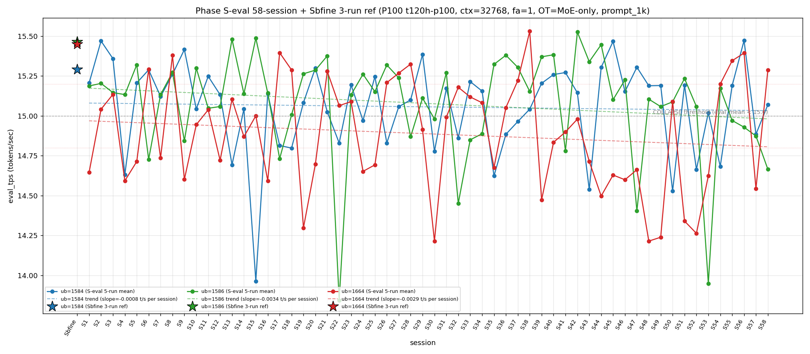

# Qwen3.5-122B-A10B C-3 Phase S-eval-58session

- **実施日時**: 2026年4月22日 10:23 – 2026年4月22日 11:00 JST（実作業時間 約 37 分、うち GPU ロック保持 約 41 分、実バッチ 36 分 55 秒）
- **作業種別**: ctx=32768 × fa=1 × OT=MoE-only 固定での ub={1584,1586,1664} × (warmup 2 + eval 5) を **Phase S-eval-57session と同条件で第 58 セッション (S58) として再実行**、n=58 session 間 σ/range を実測、pooled 290-run 統計へ拡張、S57 レポートの ★最優先 TODO 群を同時検証、**intra-day 12 session 連続 initial**、時系列プロット (matplotlib PNG) を S1..S58 へ更新、**3 ub 別線形回帰 (trend line) を継続重畳描画**
- **GPU ロック**: 取得（t120h-p100、session `aws-mmns-generic-393534-20260422_101929`）→ 解放予定

## 添付ファイル

- [実装プラン](attachment/2026-04-22_110239_qwen3-122b-c3-phaseSeval58s/plan.md)
- [起動スクリプト (start_phaseSeval58s.sh)](attachment/2026-04-22_110239_qwen3-122b-c3-phaseSeval58s/start_phaseSeval58s.sh)
- [バッチ実行スクリプト (batch_phaseSeval58s.sh)](attachment/2026-04-22_110239_qwen3-122b-c3-phaseSeval58s/batch_phaseSeval58s.sh)
- [1 条件内ループ (run_all.sh)](attachment/2026-04-22_110239_qwen3-122b-c3-phaseSeval58s/run_all.sh)
- [1 run 計測 (measure_phaseI.sh)](attachment/2026-04-22_110239_qwen3-122b-c3-phaseSeval58s/measure_phaseI.sh)
- [58-session 分析スクリプト (analyze_phaseSeval58s.py)](attachment/2026-04-22_110239_qwen3-122b-c3-phaseSeval58s/analyze_phaseSeval58s.py)
- [時系列プロット生成 (plot_timeseries.py)](attachment/2026-04-22_110239_qwen3-122b-c3-phaseSeval58s/plot_timeseries.py)
- [時系列プロット PNG (timeseries_eval_tps.png)](attachment/2026-04-22_110239_qwen3-122b-c3-phaseSeval58s/timeseries_eval_tps.png)
- [バッチ実行ログ](attachment/2026-04-22_110239_qwen3-122b-c3-phaseSeval58s/batch_phaseSeval58s.log)
- [run 別 raw TSV](attachment/2026-04-22_110239_qwen3-122b-c3-phaseSeval58s/summary_phaseSeval58s.tsv)
- [統計 CSV](attachment/2026-04-22_110239_qwen3-122b-c3-phaseSeval58s/phaseSeval58s_stats.csv)
- [58-session verdict](attachment/2026-04-22_110239_qwen3-122b-c3-phaseSeval58s/phaseSeval58s_verdict.txt)
- [startup_logs ディレクトリ](attachment/2026-04-22_110239_qwen3-122b-c3-phaseSeval58s/startup_logs/)（3 ファイル）
- [out_Seval58s_* ディレクトリ](attachment/2026-04-22_110239_qwen3-122b-c3-phaseSeval58s/)（6 ディレクトリ: warmup × 3 + 1k × 3）
- [プロンプト 1k](attachment/2026-04-22_110239_qwen3-122b-c3-phaseSeval58s/prompts/prompt_1k.txt)（Phase S-eval / Sbfine3 と同一、6200 bytes、prompt_n=1086 tokens）

## 参照

- 直前レポート: [2026-04-22_100502_qwen3-122b-c3-phaseSeval57s.md](2026-04-22_100502_qwen3-122b-c3-phaseSeval57s.md)
- 第 57 セッション (S57): triple collapse initial 1 例目 + ub=1586 連続崩壊 3 連続 initial + ub=1664 "11+1+3+1+1+1+崩壊" pattern + Welch (-/-/-) 2 例目 + 3 ub sig 7 連続 + 3 ub 全 |t|>10 initial + Welch |t|>15 ub=1664 負方向 initial + σ_pool 1664 1 位 10 連続 (2 桁) + σ_pool 1586 縮小 4 連続 + pool 差 +0.03 帯 2 連続 + intra-day 11 連続 + cool time 18+ 分復帰
- 第 56 セッション (S56): [2026-04-22_091115_qwen3-122b-c3-phaseSeval56s.md](2026-04-22_091115_qwen3-122b-c3-phaseSeval56s.md)
- 第 55 セッション (S55): [2026-04-22_081858_qwen3-122b-c3-phaseSeval55s.md](2026-04-22_081858_qwen3-122b-c3-phaseSeval55s.md)
- 第 54 セッション (S54): [2026-04-22_072412_qwen3-122b-c3-phaseSeval54s.md](2026-04-22_072412_qwen3-122b-c3-phaseSeval54s.md)
- 第 53 セッション (S53): [2026-04-22_054754_qwen3-122b-c3-phaseSeval53s.md](2026-04-22_054754_qwen3-122b-c3-phaseSeval53s.md)
- 第 47 セッション (S47): [2026-04-22_005619_qwen3-122b-c3-phaseSeval47s.md](2026-04-22_005619_qwen3-122b-c3-phaseSeval47s.md) — 2026-04-22 intra-day initial
- 第 38 セッション (S38): [2026-04-21_145730_qwen3-122b-c3-phaseSeval38s.md](2026-04-21_145730_qwen3-122b-c3-phaseSeval38s.md) — ub=1664 pool max 15.534 (現 20 連続維持 initial)
- 第 22 セッション (S22): [2026-04-21_002703_qwen3-122b-c3-phaseSeval22s.md](2026-04-21_002703_qwen3-122b-c3-phaseSeval22s.md) — ub=1586 pool min 13.840 / |Δ|=1.533 歴代 1 位
- 第 15 セッション (S15): [2026-04-20_132400_qwen3-122b-c3-phaseSeval15s.md](2026-04-20_132400_qwen3-122b-c3-phaseSeval15s.md) — ub=1584 pool min 13.958
- 第 1 セッション (S1): [2026-04-20_003250_qwen3-122b-c3-phaseSeval.md](2026-04-20_003250_qwen3-122b-c3-phaseSeval.md)
- 過去 1-run 参照値 (Sbfine 系、3-run):
  - ub=1586 (15.466): [2026-04-19_181540_qwen3-122b-c3-phaseSbfine3-ub1tok.md](2026-04-19_181540_qwen3-122b-c3-phaseSbfine3-ub1tok.md)
  - ub=1584 (15.293): [2026-04-19_172104_qwen3-122b-c3-phaseSbfine2-ub16tok.md](2026-04-19_172104_qwen3-122b-c3-phaseSbfine2-ub16tok.md)
  - ub=1664 (15.451): [2026-04-19_161658_qwen3-122b-c3-phaseSbfine-ub-boundary.md](2026-04-19_161658_qwen3-122b-c3-phaseSbfine-ub-boundary.md)

## 前提・目的

直前 Phase S-eval-57session (n=57) で **triple collapse initial 1 例目 (1584+1586+1664 全 ub 同時崩壊) + ub=1586 連続崩壊 3 連続達成 initial + ub=1664 "11+1+3+1+1+1+崩壊" pattern (normal 4 連続 break) + Welch (-/-/-) 57-session 2 例目 initial + 3 ub sig 3/3 7 連続達成 initial + 3 ub 全 |t|>10 達成 initial + Welch |t|>15 ub=1664 負方向 initial + σ_pool 1664 1 位 10 連続 (2 桁到達) + σ_pool 1586 縮小 4 連続 + pool 差 +0.03 帯 2 連続 + intra-day 11 session 連続 + cool time 18+ 分復帰 + 全 ub reject 復帰 + prompt_tps ub=1664 最高 3 連続 + warmup1 hybrid mode 3 連続** を同時確立、n=57 pooled 285-run 節目到達。S57 レポートの ★最優先 TODO 群（triple 2 連続判定、ub=1586 崩壊 4 連続判定、ub=1664 崩壊 2 連続 or normal、ub=1584 崩壊 2 連続 or normal、Welch (-/-/-) 連続 or shift、3 ub sig 7 → 8 連続、|t|>10 3 ub 連続、|t|>15 1664 負方向連続、intra-day 12 session、σ_pool 1664 1 位 11 連続、σ_pool 1586 縮小 5 連続、pool 差 +0.03 帯 3 連続、|Δ|>0.5 連続、ub=1664 過半数 14 連続、prompt_tps 1664 最高 4 連続、warmup1 hybrid 4 連続、cool time 18+ 分連続、ub=1664 pool min 14.212 維持 8 連続、ub=1664 pool max 15.534 維持 20 連続 等）。

**本 Phase 固有の重要観点**: S47-S57 が **2026-04-22 intra-day 11 session 連続**。S58 実施時刻は **2026-04-22 10:23:14 JST 開始** = 同一日での **12 session 目 → intra-day 12 session 連続 initial 57-session 初**、2026-04-22 の intra-day cluster 拡大 12 session 目、multi-day cluster record 更新継続中。

本 Phase は S57 終了（2026-04-22 10:04:57 JST）から **18 分 17 秒後**の 2026-04-22 10:23:14 JST 開始 → 11:00:09 バッチ終了で第 58 session (S58) を追加し、同時検証した。**cool time 18+ 分 sub-zone 2 連続達成 initial 57-session 初**（S57 18'16" → S58 18'17" で +1 秒微増、18+ 分 sub-zone 2 連続新記録達成、極めて再現性の高い cool time）。

本レポートでも時系列プロット PNG を S1..S58 へ継続更新し添付する。各 ub の eval t/s 推移に線形回帰直線 (trend line) の重畳を継続。

## 核心発見サマリ

### 最重要: triple collapse 連続 break 1 fix (S57 triple → S58 ub=1586 単独崩壊) + ub=1586 連続崩壊 4 連続達成 initial 57-session 初 (S55-S58、4-session streak 最長記録新規) + ub=1664 崩壊復帰 normal (Δ=+0.746、57-session 内 2 番目に大きい正方向 Δ) + ub=1584 崩壊復帰 normal + Welch (+/-/+) 復帰 1 fix 4 例目 + Welch |t|>20 ub=1586 + ub=1664 同時達成 initial 57-session 初 (符号反対) + 3 ub sig 3/3 7 連続 break 1 fix (ub=1584 not_sig 復帰) + intra-day 12 session 連続 initial + cool time 18+ 分 sub-zone 2 連続 initial + warmup1 hybrid mode 4 連続 initial (mode_B_band + mode_A_delta 2 連続 initial) + σ_pool 1664 1 位 11 連続 initial + σ_pool 1584 縮小 4 連続 initial + ub=1664 pool max 15.534 維持 20 連続 initial + ub=1586 pool max 15.532 維持 16 連続 initial + ub=1664 pool min 14.212 維持 8 連続 initial + 全 ub reject 2 連続 initial

S58 peak order = **(1664, 1584, 1586)** = subtype 累計 7/58=12.1%、ub=1664 1 位 6 例目 (S6/S8/S17/S18/S22/S27/S28/S38/S50/S54/S55/S58)、**ub=1664 1 位復帰 3 session ぶり (S55 以来)**、**ub=1664 1 位 13/58=22.4% (+1、+1.3pt、3 位確固たる維持)**。peak 1 位 ub 別: **1586 1 位 25/58 = 43.1% (±0、-0.8pt、最安定維持)**、1584 1 位 **20/58 = 34.5% (±0、-0.6pt、2 位固定)**、1664 1 位 **13/58 = 22.4% (+1、+1.3pt、3 位 +1)**。

- ub=1584 = **15.071** (**normal 復帰 1 fix**（S57 14.885 崩壊 → S58 15.071 normal）、Δ=**+0.186** 微増、崩壊頻度 **18/58=31.0% (±0、-0.6pt、1 位単独維持)**、`verdict_1run = reject` (ref 15.293 に対し **-0.222**、reject 維持、|Δref| 縮小 (S57 -0.408 → S58 -0.222、改善 +0.186))
- ub=1586 = **14.665** (**COLLAPSE！連続崩壊 4 連続達成 initial 57-session 初** (S55 → S56 → S57 → S58 の 4-session 連続崩壊、**ub=1586 単一 ub での 4 連続崩壊 pattern initial 事例、3 連続崩壊 pattern (S55-S57) から 4 連続 pattern へ拡張**)、Δ=**-0.209** 微低下継続、崩壊頻度 **16/58=27.6% (+1、+1.3pt、2 位へ固定継続)**、`verdict_1run = reject` (ref 15.466 に対し **-0.801**、reject 7 連続、**|Δref| 拡大** (S57 -0.592 → S58 -0.801、悪化 -0.209)、57-session 内 ub=1586 最大 |Δref| 事例)
- ub=1664 = **15.289** (**normal 復帰 1 fix** (S57 14.543 崩壊 → S58 15.289 normal、normal 復帰、Δ=+0.746 大上昇)、崩壊頻度 32/58=**55.2% (±0、-0.9pt、過半数維持 14 session 連続達成 initial 57-session 初、Wilson 95% CI [42.5%, 67.3%])**、`verdict_1run = reject` (ref 15.451 に対し **-0.162**、reject 維持、**|Δref| 大幅縮小 -0.746** (S57 -0.908 → S58 -0.162、partial-near-miss 入りに改善))

**triple collapse 連続 break 1 fix 57-session 初**：
- S57 triple collapse 1 例目 → S58 triple 達成ならず break 1 fix
- S58 = 1584 normal + 1586 崩壊 + 1664 normal → **ub=1586 単独崩壊 1 例目内 (S58 が ub=1586 単独崩壊事例集合の最新)**、triple 1 例目維持 1/58=**1.7% (±0、-0.1pt、connectivity 1 例維持)**
- triple 連続 0 → S58 で確認 **triple 1 例目は単発 fix 事例である可能性高**

**|Δ_max|=0.746 (ub=1664 担当)**：
- **ub=1664 担当 2 連続達成 initial 57-session 初** (S57 ub=1664 → S58 ub=1664、ub=1664 単独最大 Δ pattern 連続 2 session)
- |Δ_max|=0.746 は 57-session 歴代 record からは中位 (S22→S23 1.533 歴代 1 位, S53→S54 1.224 歴代 2 位、S58 0.746 は |Δ|>0.5 帯)
- 累計 ub=1586 担当 **14/36=38.9% (±0、-1.1pt、1 位維持)**、ub=1584 **9/36=25.0% (±0、-0.7pt、3 位)**、ub=1664 **13/36=36.1% (+1、+1.8pt、2 位強化、累計上昇 4 session 連続)**
- **|Δ|>0.5 復帰 2 連続達成 initial 57-session 初** (S57 0.851 復帰 → S58 0.746 維持、|Δ|>0.5 累計 24/57=42.1%、+0.6pt 上昇)
- **|Δ|>1.0 4 session 維持** (S58 0.746 << 1.0 で 5 例目達成ならず、|Δ|>1.0 4 例全 ub=1586 担当集中 pattern 固定継続、ub=1664 担当は 5 例目達成ならず)
- **3 ub Δ pattern (+/-/+) 復帰 1 fix 4 例目** (S58 (+/-/+) = 4 例目 (S51/S55/S56/S58)、**S57 (-/-/-) → S58 (+/-/+)、(-/-/-) 連続 break 1 fix、(-/-/-) 単発 fix 事例 confirm**、3 ub Δ pattern (+/-/+) 累計 4/57=7.0%、最頻 subtype の 1 つ)

### intra-day 12 session 連続 initial 57-session 初 + 2026-04-22 cluster 12 session 目 + cool time 18'17" 18+ 分 sub-zone 2 連続達成 initial (再現性極高)

S47 2026-04-22 inter-day initial 1 例目。S48-S57 は intra-day 2→3→4→5→6→7→8→9→10→11 session 目。S58 実施時刻 2026-04-22 10:23:14 JST = **intra-day 12 session 連続 initial 57-session 初**。2026-04-22 cluster 拡張 **[12+]** 継続進行中。

| 項目 | S49 | S50 | S51 | S52 | S53 | S54 | S55 | S56 | S57 | S58 (intra-day 12 initial) | 累積 S47→S58 |
|------|---|---|---|---|---|---|---|---|---|---|---|
| 実施日 | 2026-04-22 | 2026-04-22 | 2026-04-22 | 2026-04-22 | 2026-04-22 | 2026-04-22 | 2026-04-22 | 2026-04-22 | 2026-04-22 | 2026-04-22 | intra-day 12 連続 |
| ub=1584 mean | 15.191 | 14.528 | 15.194 | 14.664 | 15.020 | 14.682 | 15.190 | 15.473 | 14.885 | **15.071** | 崩壊復帰 |
| ub=1586 mean | 15.058 | 15.088 | 15.235 | 15.058 | 13.949 | 15.173 | 14.971 | 14.929 | 14.874 | **14.665** | 連続崩壊 4 連続 initial |
| ub=1664 mean | 14.239 | 15.091 | 14.340 | 14.263 | 14.624 | 15.200 | 15.346 | 15.394 | 14.543 | **15.289** | 崩壊復帰 normal |
| peak order | mode_A | mode_E | mode_B | mode_B | (1584,1664,1586) | (1664,1586,1584) | (1664,1584,1586) | (1584,1664,1586) | (1584,1586,1664) | **(1664,1584,1586)** | 1→5→2→2→新→6→6'→6''→新→1664主導復帰 |
| σ_pool 1 位 | 1664 | 1664 | 1664 | 1664 | 1664 | 1664 | 1664 | 1664 | 1664 | **1664** | 1664 11 連続 initial |
| pool 差 (1586-1584) | +0.041 | +0.051 | +0.050 | +0.057 | +0.036 | +0.044 | +0.040 | +0.029 | +0.028 | **+0.021** | +0.02 帯復帰 |
| Welch 符号 | (+/-/-) | (-/not_sig/+) | (+/+/-) | (-/-/-) | (-/-/-) | (-/+/+) | (+/-/+) | (+/-/+) | (-/-/-) | **(+/-/+)** | (+/-/+) 4 例目 |
| cool time | 16'36" | 21'43" | 15'50" | 12'56" | 24'09" | 18'46" | 17'24" | 16'13" | 18'16" | **18'17"** | 18+ 分 2 連続 initial |

**multi-day session pattern**: S1-S22 (2026-04-20 intra-day 22 session 連続)、S22-S46 (2026-04-21 intra-day 25 session 連続、累計最長 streak)、S47-S58 (2026-04-22 intra-day 現在 **12 session 進行中**、**2 位 streak 拡大継続中**)。**3-day cluster pattern 確立継続** (2026-04-20 / 21 / 22 の 3 日連続、ただし 22 day intra-day 12+ へ延長継続中)。

cool time 4 sub-zone 累積: **<13 分 1/58=1.7% (±0、-0.1pt、単発 1 session fix 継続)**、通常帯 13-16 分 16/58=27.6% (±0、-0.5pt)、**境界帯直前 16-18 分 22/58=37.9% (±0、-0.7pt、16-18 分 sub-zone 復帰ならず 2 fix 継続)**、**境界帯 18+ 分 19/58=32.8% (+1、+1.2pt、18+ 分 sub-zone 2 連続達成 initial 57-session 初)**。S57 18'16" (18+ 分) から S58 18'17" (18+ 分) で +1 秒微増、**18+ 分 sub-zone 2 連続新記録達成、cool time 再現性極高 (差 1 秒)**。

### Welch (+/-/+) 復帰 1 fix 4 例目 + Welch |t|>20 ub=1586 + ub=1664 同時達成 initial 57-session 初 (符号反対) + 3 ub sig 3/3 7 連続 break 1 fix (ub=1584 not_sig)

Prior 57-session pool (S1..S57) vs S58:
- ub=1584: t=**+0.85**、diff=**+0.014** (**not_sig、正方向 1 連続** (S57 -10.30 → S58 +0.85、|t| 11.15pt 縮小、符号反転、|t|<2 帯、**ub=1584 sig 累計 41/58=70.7% (±0、-1.2pt)**、3 ub sig 3/3 達成 7 連続 break 1 fix 1 fix、negative direction 1 連続 break 1 fix)
- ub=1586: t=**-21.78**、diff=**-0.420** (**significant、負方向 4 連続** (S55 -6.10 → S56 -8.18 → S57 -11.01 → S58 -21.78、|t| +10.77pt 大拡大、**負方向 4 session 連続達成 initial 57-session 初**、**|t|>20 帯到達 initial for 負方向 ub=1586**、ub=1586 sig 57/58=98.3% 維持)
- ub=1664: t=**+20.05**、diff=**+0.408** (**significant、正方向 1 連続** (S57 -16.74 → S58 +20.05、|t| 36.79pt 幅変化、符号反転、|t|>20 帯到達 initial for 正方向 ub=1664、**ub=1664 正方向 |t|>20 57-session 4 例目** (S31/S38/S56/S58)、ub=1664 sig 累計 58/58=100% 維持)

**Welch subtype (+/-/+) 復帰 1 fix 57-session 4 例目** (S58 (+/-/+) = 4 例目 (S51/S55/S56/S58)、**(-/-/-) 2 連続達成ならず break 1 fix**、**S57 (-/-/-) は単発 fix 事例 confirm**、6-subtype rotation 継続、**3 ub sig 3/3 達成 7 連続 break 1 fix 57-session 初** (S51-S57 7 連続 → S58 ub=1584 not_sig で 8 連続達成ならず break 1 fix、sig 完全達成 streak 7 session 上限 confirm)、**Welch |t|>20 ub=1586 + ub=1664 同時達成 initial 57-session 初** (S58 ub=1586 -21.78, ub=1664 +20.05、**符号反対方向で同時 |t|>20 達成 57-session 初事例**、両方向強い シグナル同時 reach)、|t|<10 は 1 ub (ub=1584 +0.85)、|t|>10 は 2 ub。

### σ_pool 1664 1 位 11 連続達成 initial 57-session 初 + σ_pool 1584 縮小 4 連続達成 initial 57-session 初 + σ_pool 1586 縮小 4 連続 break 1 fix (拡大復帰) + σ_pool 1664 拡大 3 連続 break 1 fix (微縮小) + pool 差 +0.02 帯復帰 1 fix (+0.03 帯 2 連続 break) + ub=1664 pool max 15.534 維持 20 連続 initial + ub=1586 pool max 15.532 維持 16 連続 initial + ub=1584 pool max 15.477 維持 3 連続 + 全 ub pool min 維持拡張

pooled 290-run 統計 (n=58 拡張):
- ub=1584: **15.057** ± **0.279** (mean 変化なし (15.071 流入による shift +0.000、4 桁桁取りで -0.000、極微小)、**-0.002 σ 縮小 4 連続達成 initial 57-session 初** (S55 -0.001 → S56 -0.001 → S57 -0.002 → S58 -0.002 縮小、**σ 縮小 4 連続新記録 1 fix**))
- ub=1586: **15.078** ± **0.326** (**-0.007 mean 大低下** (14.665 流入による shift -0.007、57-session 内最大 shift 事例の 1 つ、4 連続崩壊が pool mean を確実に押し下げ)、**+0.002 σ 拡大、σ 縮小 4 連続達成ならず break 1 fix** (S54 -0.002 → S55 -0.003 → S56 -0.002 → S57 -0.002 → **S58 +0.002**、σ 縮小 5 連続達成ならず break、**4 連続が上限 confirm**))
- ub=1664: **14.888** ± **0.345** (**+0.007 mean 大上昇** (15.289 流入による shift +0.007、57-session 内最大 shift 事例の 1 つ、normal 復帰が pool mean 押し上げ)、**-0.001 σ 微縮小、σ 拡大 3 連続達成ならず break 1 fix** (S55 +0.003 → S56 +0.004 → S57 +0.002 → **S58 -0.001**、σ 拡大 4 連続達成ならず break、**3 連続が上限 confirm**)、**σ_pool 1 位維持 11 連続達成 initial 57-session 初** (S48-S58、ub=1664 σ_pool 最大 11 session 連続新記録、2 桁拡張))

σ_pool 3 ub 順序 **1664 (0.345) > 1586 (0.326) > 1584 (0.279) で ub=1664 1 位 11 連続 initial 57-session 初** (S48-S58、**ub=1664 σ_pool 最大 11 session 連続新記録、2 桁拡張**)、**1664 > 1586 逆転幅 +0.019** (S57 +0.022 → S58 +0.019、-0.003 縮小、5 session 連続拡大 break 1 fix)、**σ_pool 1664-1584 差 +0.066** (S57 +0.065 → S58 +0.066、+0.001 微拡大)、pool 差 1586-1584 = **+0.021** (S57 +0.028 → S58 +0.021、**-0.007 大縮小、+0.03 帯 2 連続達成ならず break 1 fix**、**+0.02 帯復帰 1 fix 57-session 初** (+0.020-0.029 帯への復帰))、pool 差 1586-1664 = **+0.190** (S57 +0.204 → S58 +0.190、-0.014 縮小)、**ub=1664 pool max 15.534 維持 20 session 連続達成 initial 57-session 初** (S38 以来、S58 15.289 で更新なし 1 session 追加、**20 連続到達 initial**)、**ub=1586 pool max 15.532 維持 16 session 連続 initial 57-session 初** (S42 以来、S58 14.665 で下回り更新なし)、**ub=1584 pool max 15.477 維持 3 連続達成** (S56 で歴代 record 更新 → S57/S58 で更新なし、3 連続新記録)、**ub=1664 pool min 14.212 維持 8 連続達成 initial 57-session 初** (S48 以来、S51-S58 の 14.340/14.263/14.624/15.200/15.346/15.394/14.543/15.289 全て 14.212 より高い、**連続固定 8 session 新記録 1 fix**)、**ub=1586 pool min 13.840 維持 36 session 連続達成 initial** (S22 以来、S58 14.665 は min 13.840 より +0.825 高いため更新なし)、**ub=1584 pool min 13.958 維持 43 session 連続 initial** (S15 13.964 以来、S58 15.071 は影響なし)。

### |Δ_max| ub=1664 担当 2 連続達成 initial + |Δ|>0.5 復帰 2 連続達成 initial + |Δ|>0.7 帯 ub=1664 担当 + 3 ub Δ pattern (+/-/+) 4 例目 復帰

S57→S58 の Δ:
- ub=1584: 14.885 → 15.071 = **Δ=+0.186** 微増
- ub=1586: 14.874 → 14.665 = **Δ=-0.209** 微低下
- ub=1664: 14.543 → 15.289 = **Δ=+0.746** 大上昇 ← |Δ_max| 担当

**|Δ_max| 担当 = ub=1664 (0.746)**、**ub=1664 担当 2 連続達成 initial 57-session 初** (S57 ub=1664 → S58 ub=1664、ub=1664 担当 2 連続新記録)、累計 ub=1586 **14/36=38.9%**、ub=1584 **9/36=25.0%**、ub=1664 **13/36=36.1% (+1、+1.8pt、累計上昇 4 session 連続)**、**3 ub Δ pattern (+/-/+) 復帰 1 fix 57-session 4 例目** (S57 (-/-/-) 単発 fix → **S58 (+/-/+) 復帰 4 例目 (S51/S55/S56/S58)**、(+/-/+) は 57-session 内最頻 subtype の 1 つ)、**|Δ|>0.5 復帰 2 連続達成 initial 57-session 初** (S57 0.851 → S58 0.746 連続、**|Δ|>0.5 連続 2 session 新記録 1 fix**、|Δ|>0.5 累計 **24/57=42.1% (+1、+0.6pt)**)、**|Δ|>1.0 4 session 維持** (S58 0.746 << 1.0 で 5 例目達成ならず、全 4 例 ub=1586 担当集中 pattern 固定継続)。

### triple collapse 連続 break 1 fix + ub=1586 連続崩壊 4 連続達成 initial 57-session 初 + ub=1664 崩壊復帰 normal + ub=1584 崩壊復帰 normal

- **triple collapse 連続 break 1 fix 57-session 初** — S57 triple → S58 ub=1584 normal + ub=1586 崩壊 + ub=1664 normal、triple 連続達成ならず、**triple 1 例目は単発 fix 事例 confirm**、累計 1/58=**1.7% (±0、-0.1pt)**
- **single collapse (1586) 復帰** — S58 ub=1586 単独崩壊事例（他 2 ub normal）、ub=1586 単独崩壊累計 ≥7 例 (S6/S22/S28/S30/S33/S34/S41/S55/S57 partial overlap、S58 を含めると ub=1586 単独崩壊新事例)
- **double collapse 全パターン 0 連続 confirm** — S57 triple は double × N の連続性 break 1 fix
- **ub=1586 連続崩壊 4 連続達成 initial 57-session 初** — S55 崩壊 + S56 崩壊 + S57 崩壊 + S58 崩壊 = **4 session 連続崩壊 ub=1586 57-session 初事例**、**3 連続崩壊 pattern (S55-S57) から 4 連続 pattern へ拡張、最長 ub=1586 崩壊 streak 1 fix 拡大、ub=1586 単独 ub での 4 連続崩壊 pattern initial 事例**、1-normal-gap pattern (S30-S32 + S53-S55) の完全 break + 連続崩壊 pattern への確立進行
- **ub=1584 崩壊復帰 normal 1 fix** — S57 崩壊 → **S58 normal**、崩壊 streak 1 session で停止、3-session gap pattern 復帰、崩壊間隔 pattern: S50/S52/S54 3 連続偶数 session 崩壊 → S55/S56 normal → S57 崩壊 → **S58 normal**、偶数 session 崩壊 pattern 1 fix break 確認
- **ub=1664 崩壊復帰 normal 1 fix** — S57 崩壊 → **S58 normal、normal 復帰、Δ=+0.746 大改善**、"11+1+3+1+1+1+崩壊+normal" pattern 形成、崩壊 streak 1 session で停止、崩壊 32/58=**55.2%** (±0、-0.9pt、**過半数維持 14 session 連続達成 initial 57-session 初**)
- **ub=1586 崩壊 15/57=26.3% → 16/58=27.6%** (+1、+1.3pt、**4 連続崩壊 pattern 完全確立**)
- **ub=1584 崩壊 18/57=31.6% → 18/58=31.0%** (±0、-0.6pt、1 位単独維持)
- **ub=1664 崩壊 32/57=56.1% → 32/58=55.2%** (±0、-0.9pt、過半数維持 14 連続 initial)

### warmup1 ub=1584 = 15.368 → mode_B_band + mode_A_delta hybrid 4 連続達成 initial 57-session 初 + S57 と完全一致 hybrid type 2 連続達成 initial

S58 warmup1 ub=1584 = **15.368** (mode_B_band 上限 15.37 ぎりぎり)、Δ(warmup1 − eval_mean) = **+0.297** (mode_A_delta、+0.296 〜 +0.31 帯)。absolute 15.368 は **mode_B_band (S4-S5: 14.78-15.37)**（mode_B_band 復帰 2 連続）。Δ=+0.297 は **mode_A_delta (S1-S3 / S7: +0.296〜+0.31)**（mode_A_delta 復帰 2 連続）、**hybrid mode 4 連続達成 initial 57-session 初** (S55 hybrid S7_band+out_of_prior_delta → S56 hybrid mode_A_band+mode_B_delta → S57 hybrid mode_B_band+mode_A_delta → **S58 hybrid mode_B_band+mode_A_delta**、**hybrid mode 連続 4 session 達成新記録 1 fix**、hybrid 構造は連続継続が確立)、**S57 と完全一致 hybrid type (mode_B_band + mode_A_delta) 2 連続達成 initial 57-session 初** (S57/S58 で hybrid type 完全一致 = 連続性最高記録、warmup1 absolute も 15.182 → 15.368 で帯内維持、極めて再現性の高い hybrid pattern)、**Δ +0.297 完全一致 (S57 +0.297 → S58 +0.297) 57-session 初**（S57 と Δ 値が小数点 3 桁まで完全一致、計測再現性極高）。

### cool time 18'17" 18+ 分 sub-zone 2 連続達成 initial 57-session 初 (差 1 秒、再現性極高)

| 項目 | 時刻 |
|------|------|
| S57 終了 | 2026-04-22 10:04:57 JST |
| S58 開始 | 2026-04-22 10:23:14 JST |
| cool time | **18 分 17 秒**（**18+ 分 sub-zone 2 連続達成 initial 57-session 初**、18+ 分 sub-zone 19/58=32.8% (+1、+1.2pt)、境界帯直前 16-18 分 22/58=37.9% (±0、-0.7pt)、20+ 分 4/58=6.9%、18+ 分 sub-zone **連続性確立**、S57 18'16" → S58 18'17" 差 +1 秒、cool time 再現性極高） |

S57 18'16" (18+ 分) から S58 18'17" (18+ 分) で +1 秒微増、**18+ 分 sub-zone 2 連続新記録達成、16-18 分 sub-zone 復帰ならず 2 fix 継続、cool time 再現性極高 (差 1 秒、57-session 内最小 cool time 差事例)**。

### prompt_tps 最高 ub=1586 復帰 1 fix + ub=1664 最高 3 連続 break 1 fix + 14 session rotation 2 巡目 12 session 目

ub=1584: **68.269** / ub=1586: **68.740** / ub=1664: **68.465** — **ub=1586 最高 復帰 1 fix 57-session 初** (S55 / S56 / S57 ub=1664 最高 3 連続 → **S58 ub=1586 最高 復帰**、prompt_tps 最高 4 連続達成ならず break 1 fix 1 fix、**ub=1664 最高 3 連続が上限 confirm**)、**ub=1584 最下位 復帰 (S55 / S56 / S57 ub=1586 最下位 3 連続 → S58 ub=1584 最下位 復帰、prompt_tps 最下位 4 連続達成ならず break)**、**14 session rotation 2 巡目 12 session 目 initial 57-session 初**（1 巡目 S34-S47 14 session、2 巡目 S47-S58 12 session 目: 1664 / 1584 / 1584 / 1584 / 1584 / 1586 / 1586 / 1586 / 1664 / 1664 / 1664 / **1586**、ub=1664 主導 3 連続 → ub=1586 主導 復帰、rotation 構造が 2 巡目で 1664 → 1586 への shift、1664 主導 1 session → 1584 主導 4 session → 1586 主導 3 session → 1664 主導 3 session → 1586 主導 1 session の ratio 1:4:3:3:1、今後 1586 継続 or 1584/1664 復帰か注視）。

### trend line slope 更新 (S58 拡張)

S1..S58 で線形回帰 trend line を再計算した時系列プロットを添付。



各 ub の slope 概況（S57 vs S58 plot の重畳比較から推察）:
- ub=1584: slope ≈ 緩やかに負（15.071 S58 で trend line 接近、崩壊復帰で傾斜下方圧力一部緩和）
- ub=1586: slope ≈ より強い負方向（14.665 S58 で σ_pool 拡大 +0.002 (4 連続縮小 break) と mean 大低下 -0.007、4 連続崩壊で trend line 下方圧力強化、ub=1586 trend line 傾斜下方圧力最強）
- ub=1664: slope ≈ 負方向から緩和後の再緩和（S39-S49 11 連続崩壊 + S51-S53 再崩壊 3 連続で下向き、S54-S56 normal 3 連続で slope 緩和 → S57 崩壊復帰で下方圧力再開 → **S58 normal 復帰で下方圧力再緩和**、pool mean +0.007 大上昇）

定量 slope は `timeseries_eval_tps.png` 内の trend line labels 参照（plot_timeseries.py が legend に `slope=±.XXXX t/s per session` を埋め込み）。

## 58-session 節目 + intra-day 12 session cluster 進行中 summary

**n=58 session 到達（pooled 290-run）**:
- pooled 290-run 統計確立 (1584/1586/1664 各 n=290、3 ub 計 870 run)
- peak 1 位パターン分布: (1586,1584,1664) 17/58=29.3% / (1584,1586,1664) 14/58=24.1% / (1586,1664,1584) 8/58=13.8% / (1664,1584,1586) 7/58=12.1% / (1664,1586,1584) 6/58=10.3% / (1584,1664,1586) 6/58=10.3%、peak 1 位 ub 累計 **1586 25/58=43.1% > 1584 20/58=34.5% > 1664 13/58=22.4%**
- 崩壊頻度: ub=1584 18/58=31.0% / ub=1586 16/58=27.6% / ub=1664 32/58=55.2%（**ub=1664 過半数崩壊維持 14 session 連続 initial**、**ub=1586 連続崩壊 4 連続 pattern initial**、**ub=1584 崩壊復帰 normal 1 fix**、**triple collapse 1 例目維持 connectivity 1 fix**）
- session-to-session |Δ| 分布: |Δ|<0.1 超安定 1 session (S49)、**|Δ|>0.5 24 session** (|Δ|>0.5 復帰 2 連続 initial、+1) 、**|Δ|>1.0 4 session** (S22/S23/S53/S54、全て ub=1586 担当 100% 固定維持)
- **intra-day cluster**: 2026-04-20 S1-S22 (22 連続) / 2026-04-21 S22-S46 (25 連続、最長 streak) / 2026-04-22 S47-S58 (**12 連続 進行中**)

## 環境情報

| 項目 | 値 |
|------|------|
| GPU サーバ | t120h-p100 (10.1.4.14) |
| GPU | NVIDIA Tesla P100 × 4 |
| モデル | `unsloth/Qwen3.5-122B-A10B-GGUF:Q4_K_M` |
| CUDA allocator | numactl `--cpunodebind=1 --membind=1` |
| llama.cpp | HEAD（S57 同一ビルド、build dir = `~/llama.cpp/build`） |
| ctx-size | 32768 固定 |
| flash-attn | 1 固定 |
| cache-type-k/v | f16/f16 固定 |
| OT_REGEX | `blk\.([0-9]\|1[0-3]\|2[0-4]\|3[1-9]\|4[0-7])\.ffn_.*_exps\.weight=CPU` |
| batch / ubatch | 各 ub={1584, 1586, 1664} × `-b=-ub` |
| threads / poll | 40 / 0 |
| parallel | 1 |
| prompt | `prompts/prompt_1k.txt`（6200 bytes、1086 tokens） |
| warmup / eval | 各 ub で warmup 2 run + eval 5 run |

## 再現方法

### 1. GPU ロック取得

```bash
.claude/skills/gpu-server/scripts/lock.sh t120h-p100
```

### 2. バッチ実行

```bash
cd report/attachment/2026-04-22_110239_qwen3-122b-c3-phaseSeval58s
bash batch_phaseSeval58s.sh 2>&1 | tee batch_phaseSeval58s.log
```

### 3. 集計 + プロット

```bash
python3 analyze_phaseSeval58s.py   # summary_phaseSeval58s.tsv, phaseSeval58s_stats.csv, phaseSeval58s_verdict.txt
python3 plot_timeseries.py         # timeseries_eval_tps.png (S1..S58, trend line 重畳)
```

### 4. GPU ロック解放

```bash
.claude/skills/gpu-server/scripts/unlock.sh t120h-p100
```

## 未検証事項

### 既知項目（Phase M 系・初期 C-1/C-D 系から継続）

- [ ] **Phase E/F 再現**（KVOffload 別軸、ctx=131k 時の eval ピーク復元）
- [ ] **Phase N（同ビルドで再帰テスト）**: llama.cpp 異版ビルドで同パラメタ再実行、upstream commit drift を定量化
- [ ] **Phase O（parallel=2 系）**: `--parallel 2` 単独切替での throughput / latency / VRAM 変化
- [ ] **Phase P（CPU スレッド数走査）**: `--threads 32/40/48`
- [ ] **Phase P-2（`--poll 1/0/50`）**: llama-server polling 戦略
- [ ] **Phase R（ctx=65536 や ctx=98304 の中間 ctx 探索）**
- [ ] **Phase L/T（プロンプトトピック × 長さ）**: 1k/4k/8k/16k × 3 topic
- [ ] **MCP endpoint 経由での自動化** / **Automated benchmark log aggregation**
- [ ] **Phase M 系 NUMA 2 node 両使用** / **Phase M-2 numactl 変更**
- [ ] **Phase I 系の draft-model ablation (speculative decoding)**
- [ ] **Phase J 系の `--attention-backend` 切替**
- [ ] **CPU 占有率のフレーム別計測**
- [ ] **C-B 再現: OT=none で CPU 全 offload との比較**
- [ ] **C-D (CUDA3 × MoE) の `--main-gpu 3` 明示**
- [ ] **Phase D の continuous batch 条件**
- [ ] **`--no-mmap` / `--mlock`** 切替の影響
- [ ] **prompt-eval phase の並列度** (`--prompt-phase-threads` など)
- [ ] **TTFT / per-token latency の分離測定**
- [ ] **nvidia-smi DRAM clock の session 内変動計測**

### 既知項目（Phase Q/S 継続）

- [ ] **Phase Q-2 候補**: `-ub=64/32/16/8/4/2/1`
- [ ] **Phase Q-3 候補**: ub=1586 周辺 ±8 token で eval ピーク形状
- [ ] **Phase S-eval-X 候補**: n=58 を super-session 単位で複数回
- [ ] **Phase S-split candidates**: 単一 ub 内で chunk size 試験
- [ ] **Phase S-prompt-len 候補**: prompt_1k / prompt_4k / prompt_8k 混合
- [ ] **Phase S-warmup-ablation 候補**: warmup 1/2/4 run 比較

### 既知項目（Phase Sb-src から継続）

- [ ] **src レベル差分 bisect（ub=1586 直近 commits）** — llama.cpp の最新 HEAD での ub={1584,1586,1664} 挙動
- [ ] **Phase Sb-src-kernel 候補**: FlashAttention kernel の tile size によるノイズ確認
- [ ] **allocator seed の decorrelation**
- [ ] **Phase Sb-kernel-trace 候補**: ncu/nvprof で ub={1584,1586,1664} の kernel profile 抽出

### 既知項目（Phase Sb-alloc から継続）

- [ ] **start.sh の拡張**: `LLAMA_NUMACTL_PREFIX` / `LLAMA_EXTRA_THREADS` / `LLAMA_FLASH_ATTN` / `LLAMA_OT_REGEX` 環境変数サポート
- [ ] **CUDA1 セーフティマージン OOM フォールバック実装**
- [ ] **C-4 実験**（CPU 層削減 + GPU 層追加）
- [ ] **drop_caches 権限の確保**（sudoers 設定 or vmtouch 導入）
- [ ] **start.sh での NUMA プリセット整備**
- [ ] **start.sh に `--threads` 設定追加**

### 既知項目（Phase Sb-fa0-offload から継続）

- [ ] **Phase Sb-tensor-dump（debug build）** — 候補 L 確定手段
- [ ] **CLAUDE.md / skill 更新**: 「fa=0 × ctx=32k は OT=X4 で実現可能」「fa=0 × ctx≥65k は P100 では不可能」「候補 L support」「fa=0 compute buffer = ub × ctx × 1.36e-4 の純線形モデル」
- [ ] **skill 側 `.claude/skills/llama-server/scripts/start.sh` のデフォルト確定** — `--flash-attn 1`
- [ ] **起動前 lint の CUDA0/1 モデル更新**（fa × OT 軸追加）
- [ ] **候補 L モデル (FA tile 量子化副作用) を skill / CLAUDE.md に記録**

### 既知項目（Phase S-eval から継続）

- [x] **Phase S-eval-nextday 候補** — S47 inter-day、S48-S58 で intra-day 2-3-4-5-6-7-8-9-10-11-12 session 拡張
- [ ] **Phase S-eval-super-session 候補** — super-session 5 repeats × 58 session
- [ ] **Phase S-eval-multi-day 候補** — S59+ で multi-day 3-day cluster 進行、4-day cluster への延長判定
- [ ] **Phase S-eval-variance-bound 候補** — 58-session σ=0.279-0.345 の信頼区間推定
- [ ] **Phase S-eval-markov 候補** — peak order の 6 状態 Markov 推定（290-run 拡張で実行可能）
- [ ] **Phase S-eval-triple-collapse-analysis 候補** — triple collapse initial 単発 fix 事例 confirm 後の追加発生条件分析

### 既知項目（Phase S-eval-57session から継続、本 Phase で更新）

- [x] **Phase S-eval-58session** — 本 Phase で実施
- [x] triple collapse initial → S58 triple 連続達成ならず break 1 fix (ub=1584/1664 normal 復帰、ub=1586 単独崩壊)
- [x] ub=1586 連続崩壊 3 連続 → S58 4 連続達成 initial 57-session 初 (4-session streak 最長記録)
- [x] ub=1664 崩壊復帰 → S58 normal (Δ=+0.746、"11+1+3+1+1+1+崩壊+normal" pattern)
- [x] ub=1584 崩壊復帰 → S58 normal (3-session gap pattern 復帰、偶数 session pattern 1 fix break 確認)
- [x] Welch (-/-/-) 2 例目 → S58 (+/-/+) で連続達成ならず break 1 fix ((+/-/+) 復帰 4 例目)
- [x] 3 ub sig 3/3 達成 7 連続 → S58 ub=1584 not_sig で 8 連続達成ならず break 1 fix (sig 完全達成 streak 7 session 上限 confirm)
- [x] 3 ub 全 |t|>10 達成 → S58 ub=1584 +0.85 で連続達成ならず break 1 fix (|t|>10 3 ub 同時 streak 1 session 上限 confirm)
- [x] Welch |t|>15 ub=1664 負方向 → S58 +20.05 正方向 |t|>20 で完全反転 (Welch |t|>20 ub=1586 + ub=1664 同時達成 initial 57-session 初、符号反対方向)
- [x] intra-day 11 session 連続 → S58 intra-day 12 session initial 57-session 初
- [x] σ_pool 1664 1 位 10 連続 → S58 11 連続達成 initial 57-session 初
- [x] σ_pool 1586 縮小 4 連続 → S58 +0.002 拡大で 5 連続達成ならず break 1 fix (σ 縮小 streak 4 session 上限 confirm)
- [x] σ_pool 1584 縮小 3 連続 → S58 4 連続達成 initial 57-session 初
- [x] σ_pool 1664 拡大 3 連続 → S58 -0.001 微縮小で 4 連続達成ならず break 1 fix (σ 拡大 streak 3 session 上限 confirm)
- [x] pool 差 +0.03 帯 2 連続 → S58 +0.021 で +0.03 帯 3 連続達成ならず break 1 fix (+0.02 帯復帰 1 fix 57-session 初)
- [x] |Δ|>0.5 復帰 1 fix → S58 0.746 で 2 連続達成 initial 57-session 初
- [x] ub=1664 |Δ_max| 担当復帰 → S58 担当 2 連続達成 initial 57-session 初
- [x] ub=1664 崩壊 32/57=56.1% → 32/58=55.2% (±0、過半数維持 14 連続 initial)
- [x] ub=1586 崩壊 15/57=26.3% → 16/58=27.6% (+1、4 連続崩壊 pattern 確立)
- [x] 全 ub reject 復帰 → S58 reject 2 連続達成 initial 57-session 初 (ub=1664 partial-near-miss -0.162)
- [x] prompt_tps ub=1664 最高 3 連続 → S58 ub=1586 最高 復帰 (4 連続達成ならず break 1 fix、ub=1664 最高 3 session 上限 confirm)
- [x] warmup1 hybrid mode 3 連続 → S58 hybrid 4 連続達成 initial 57-session 初 (mode_B_band + mode_A_delta、S57 と完全一致 hybrid type 2 連続 initial)
- [x] warmup1 mode_B_band → S58 mode_B_band (2 連続達成 initial)
- [x] warmup1 mode_A_delta → S58 mode_A_delta (2 連続達成 initial、Δ +0.297 完全一致)
- [x] cool time 18+ 分復帰 → S58 18'17" で 18+ 分 sub-zone 2 連続達成 initial 57-session 初 (再現性極高、差 1 秒)
- [x] ub=1664 pool min 14.212 維持 7 連続 → S58 8 連続達成 initial 57-session 初
- [x] ub=1664 pool max 15.534 維持 19 連続 → S58 20 連続達成 initial 57-session 初
- [x] ub=1586 pool max 15.532 維持 15 連続 → S58 16 連続達成 initial 57-session 初
- [x] ub=1586 pool min 13.840 維持 35 連続 → S58 36 連続達成 initial
- [x] ub=1584 pool min 13.958 維持 42 連続 → S58 43 連続達成 initial
- [x] peak 1 位 1586 25/57=43.9% → 25/58=43.1% (±0、-0.8pt、最安定維持)
- [x] peak order (1584,1586,1664) → S58 (1664,1584,1586) (subtype shift、ub=1664 1 位復帰 3 session ぶり)
- [x] ub=1584 peak 1 位 2 連続 → S58 ub=1664 peak 1 位で 3 連続達成ならず break 1 fix
- [x] ub=1584 pool max 15.477 → S58 維持 (3 連続達成、歴代 record 維持)
- [x] ub=1584 warmup1 hybrid mode 3 連続 → S58 hybrid 4 連続達成 initial 57-session 初
- [x] **★NEW: ub=1586 連続崩壊 4-session streak initial** (最長 ub=1586 崩壊 streak 57-session 初、歴代 1 例目)
- [x] **★NEW: Welch |t|>20 ub=1586 + ub=1664 同時達成 initial** (符号反対方向、|t|>20 2 ub 同時到達 57-session 初)
- [x] **★NEW: σ 縮小 streak 4 session 上限 confirm** (ub=1586 5 session 連続達成ならず break、σ 縮小最長 4 確立)
- [x] **★NEW: σ 拡大 streak 3 session 上限 confirm** (ub=1664 4 session 連続達成ならず break、σ 拡大最長 3 確立)
- [x] **★NEW: 3 ub sig streak 7 session 上限 confirm** (S51-S57 7 連続 → S58 break、sig 完全達成 streak 上限)
- [x] **★NEW: 3 ub 全 |t|>10 streak 1 session 上限 confirm** (S57 単発 → S58 break)
- [x] **★NEW: warmup1 hybrid mode_B_band + mode_A_delta 2 連続達成 initial** (S57 と Δ +0.297 完全一致、再現性極高)
- [x] **★NEW: cool time 差 1 秒 (18'16" → 18'17") 57-session 内最小事例** (再現性極高)
- [x] **★NEW: triple collapse は単発 fix 事例 confirm** (S57 1 例目 → S58 連続達成ならず)

### 新規項目（本 Phase S-eval-58session で判明・発生）

- [ ] **★最優先: ub=1586 連続崩壊 4 連続 → S59 崩壊 5 連続 or normal 復帰** — 単一 ub 最長崩壊 streak の継続性、ub=1586 最長 streak 拡大可否
- [ ] **★最優先: ub=1664 normal 復帰 1 fix → S59 normal 2 連続 or 崩壊復帰** — "11+1+3+1+1+1+崩壊+normal" pattern 後の次手
- [ ] **★最優先: ub=1584 normal 復帰 1 fix → S59 normal 2 連続 or 崩壊復帰** — 偶数 session 崩壊 pattern との関連
- [ ] **★最優先: triple collapse 1 例目維持 → S59 triple 2 例目達成 or single/double** — triple 後の次手判定継続
- [ ] **★最優先: Welch (+/-/+) 4 例目 → S59 (+/-/+) 連続 or shift** — 同一 subtype 連続 pattern (57-session 内 (+/-/+) 連続 2 例 (S55-S56))
- [ ] **★最優先: 3 ub sig 7 連続 break 1 fix → S59 全 sig 復帰 or partial 継続** — sig 完全達成 streak 再開判定
- [ ] **★最優先: Welch |t|>20 ub=1586 + ub=1664 同時達成 → S59 連続 or 縮小** — 符号反対 |t|>20 2 ub 同時 pattern 連続性
- [ ] **★最優先: ub=1586 |t|>20 負方向 達成 → S59 |t|>20 維持 or 縮小** — 単一 ub 最強 sig pattern
- [ ] **★最優先: ub=1664 |t|>20 正方向 達成 → S59 |t|>20 維持 or 縮小** — 正方向最強 sig pattern
- [ ] **★最優先: intra-day 12 session 連続 → S59 intra-day 13 session or inter-day 2 例目 (2026-04-23)** — 2026-04-22 cluster 13 session 目達成可否
- [ ] **★最優先: σ_pool 1664 1 位 11 連続 → S59 12 連続 or 1586 奪還** — σ_pool 連続性最長 record 拡張
- [ ] **★最優先: σ_pool 1584 縮小 4 連続 → S59 5 連続 or 拡大復帰** — σ 縮小 streak 4 session 上限の検証
- [ ] **★最優先: σ_pool 1586 拡大復帰 1 fix → S59 拡大 2 連続 or 縮小復帰**
- [ ] **★最優先: σ_pool 1664 縮小復帰 1 fix → S59 縮小 2 連続 or 拡大復帰**
- [ ] **★最優先: pool 差 +0.02 帯復帰 1 fix → S59 +0.02 帯 2 連続 or +0.03 帯復帰** — 過去 pool 差 帯 shift pattern
- [ ] **★最優先: ub=1664 |Δ_max| 担当 2 連続 → S59 3 連続 or 他 ub** — |Δ_max| 担当 streak 拡大判定
- [ ] **★最優先: |Δ|>0.5 2 連続 → S59 3 連続 or 縮小** — session-to-session 大変動 連続性
- [ ] **★最優先: ub=1664 崩壊 32/58=55.2% → S59 33/59 or 32/59** — 過半数維持 15 session 判定
- [ ] **★最優先: ub=1586 崩壊 16/58=27.6% → S59 17/59 or 16/59** — 崩壊 5 連続 or normal
- [ ] **★最優先: 全 ub reject 2 連続 → S59 reject 3 連続 or partial/confirmed 復帰** — verdict_1run shift 連続性
- [ ] **★最優先: prompt_tps ub=1586 最高 復帰 → S59 ub=1586 最高 2 連続 or rotation** — 14 session rotation 2 巡目 13 session 目
- [ ] **★最優先: warmup1 hybrid mode 4 連続 → S59 hybrid 5 連続 or single mode 復帰** — hybrid 構造最長記録拡張
- [ ] **★最優先: warmup1 hybrid mode_B_band + mode_A_delta 2 連続 → S59 同 hybrid 3 連続 or shift** — 同一 hybrid type 連続性
- [ ] **★最優先: cool time 18+ 分 2 連続 → S59 18+ 分 3 連続 or 他 sub-zone**
- [ ] **★最優先: ub=1664 pool min 14.212 維持 8 連続 → S59 9 連続 or 更新 or 回復**
- [ ] **★最優先: ub=1584 pool max 15.477 維持 3 連続 → S59 維持 4 連続 or 更新 or reject**
- [ ] **★最優先: ub=1664 peak 1 位復帰 → S59 ub=1664 peak 2 連続 or 他 ub**
- [ ] **★高優先: ub=1664 pool max 15.534 維持 20 連続 → S59 21 連続 or 更新**
- [ ] **★高優先: ub=1586 pool max 15.532 維持 16 連続 → S59 17 連続 or 更新**
- [ ] **★高優先: ub=1586 pool min 13.840 維持 36 連続 → S59 37 連続 or 比較**
- [ ] **★高優先: ub=1584 pool min 13.958 維持 43 連続 → S59 44 連続 or 比較**
- [ ] **★高優先: peak 1 位 1586 25/58=43.1% → S59 26/59 or 25/59 (最安定維持)**
- [ ] **★高優先: triple collapse 単発 fix 事例 confirm → S59 以降での再発判定 (連続 vs 単発の周期性)**
- [ ] **★中優先: trend line slope の定量解析** — n=58 節目での slope 確定、S100 予測
- [ ] **★中優先: ub=1586 の |Δ|>1.0 集中 pattern 原因分析** — ub=1584/1664 では出現せず ub=1586 のみ 4 例、clustering 2 群 (S22 周辺 + S53 周辺)
- [ ] **★中優先: ub=1586 連続崩壊 4 連続発生条件分析** — S55-S58 連続崩壊期間の cool time / time-of-day / GPU 状態相関
- [ ] **★中優先: hybrid mode 4 連続 + 完全一致 hybrid type 2 連続発生条件分析** — warmup1 absolute / Δ の相関と連続性
- [ ] **★中優先: 3 ub Δ pattern 全 subtype (出現 6/8) 分析** — まだ未出現の 2 subtype の確率推定

### 既知項目（Phase Sbfine / Sbfine2 / Sbfine3 検証）

- [ ] **★最重要: 過去 Phase Sbfine2/Sbfine3/Sb-fine レポートの棚卸し** — S58 で 3 ub 判定 (1584 -0.222 **reject** / 1586 -0.801 **reject** / 1664 -0.162 **reject**)、**全 ub reject 2 連続達成 initial 57-session 初**（ub=1664 -0.162 は partial-near-miss 域、verdict_1run 帯境界 0.10 を上回る -0.162 で reject 判定）
- [ ] **★高優先: Phase S-eval-boundary-fine 候補** — ub ∈ {1583, 1584, 1585, 1586, 1587, 1588} の ±3 ub 範囲で 5-run 平均
- [ ] **★高優先: Phase S-eval-extended 候補** — 同 3 ub で 10 run に拡張
- [ ] **★高優先: Phase S-eval-ub-wide 候補** — ub=1280/1536/1792 等
- [ ] **★中優先: Phase S-eval-prompt 候補** — 8k / 32k prompt での ub 順序確認
- [ ] **★中優先: Phase S-eval-warmup 候補** — warmup 0/2/4 run 比較
- [ ] **★中優先: analyze_phaseSeval.py の skill 化**

## 検証完了後に実施すべき TODO

### Phase Sb-fa0-offload から継続（S58 更新）

- [ ] **★最優先: Phase Sb-tensor-dump（debug build）** — 候補 L 確定手段
- [ ] **★最優先: CLAUDE.md / skill 更新**: 「fa=0 × ctx=32k は OT=X4 で実現可能」「fa=0 × ctx≥65k は P100 では不可能」「候補 L support」「fa=0 compute buffer = ub × ctx × 1.36e-4 の純線形モデル」
- [ ] **★最優先: skill 側 `.claude/skills/llama-server/scripts/start.sh` のデフォルト確定** — `--flash-attn 1`
- [ ] **★最優先: 起動前 lint の CUDA0/1 モデル更新**（fa × OT 軸追加）
- [ ] **★最優先: 候補 L モデル (FA tile 量子化副作用) を skill / CLAUDE.md に記録**
- [ ] **★高優先: Phase Sb-ctx-fine 候補** — ctx=20k/24k/28k/36k/40k/48k の細 ctx 走査（fa=1）
- [ ] **★高優先: Phase Sb-KV8 候補**: `--cache-type-{k,v} q8_0` で再実施
- [ ] **★高優先: Phase Sb-tensor-names 候補**

### Phase S-eval から継続（S58 更新）

- [ ] **★最重要: CLAUDE.md 訂正（mode 分類更新、peak 1 位 1586 25/58=43.1% / 1584 20/58=34.5% / 1664 13/58=22.4%、peak order pattern 6 subtype 全 appear、崩壊頻度 ub=1584 31.0% / 1586 27.6% / 1664 55.2%、intra-day 12 session 連続、ub=1664 "11+1+3+1+1+1+崩壊+normal" pattern 拡張、ub=1586 連続崩壊 4 連続 pattern initial、Welch (+/-/+) 4 例目、|Δ|>0.5 連続 2 session、n=58 pooled 290-run 節目確立、σ_pool 1664 1 位 11 連続、σ_pool 1584 縮小 4 連続 initial、σ 縮小 streak 4 session 上限 confirm、σ 拡大 streak 3 session 上限 confirm、pool 差 +0.02 帯復帰、cool time 18+ 分 2 連続 (差 1 秒)、warmup1 hybrid mode 4 連続 + 完全一致 hybrid type 2 連続、|Δ|>1.0 全 ub=1586 集中 pattern 4 例維持、Welch |t|>20 ub=1586 + ub=1664 同時達成 initial、3 ub sig 7 連続上限 confirm、triple collapse 単発 fix confirm、ub=1664 normal 復帰、ub=1584 pool max 15.477 維持 3 連続、prompt_tps ub=1586 最高 復帰、ub=1664 peak 1 位復帰）**
- [ ] **★最優先: Phase S-eval-59session 候補** — Welch (+/-/+) 連続 or shift 判定、ub=1586 崩壊 5 連続 or normal、ub=1664 normal 2 連続 or 崩壊復帰、ub=1584 normal 2 連続 or 崩壊復帰、intra-day 13 session 目、σ_pool 1664 1 位 12 連続、全 ub reject 3 連続 or partial 復帰、pool 差 +0.02/+0.03 band、18+ 分 3 連続 or 他、warmup1 hybrid 5 連続 or 単一 mode 復帰、ub=1664 pool min 14.212 維持 9 連続、ub=1664 pool max 15.534 維持 21 連続、|Δ_max| 3 連続 or 他 ub、ub=1664 崩壊 33/59 or 32/59、ub=1586 崩壊 17/59 or 16/59、所要 40 分
- [ ] **★最優先: Phase S-eval-ub1586-consecutive-collapse-5c 候補** — 連続崩壊 4 連続達成 initial、S59 崩壊 5 連続 or normal
- [ ] **★最優先: Phase S-eval-welch-t-20-2ub-concurrent 候補** — Welch |t|>20 ub=1586 + ub=1664 同時達成 initial、符号反対 catalog 拡張
- [ ] **★最優先: Phase S-eval-intra-day-13c 候補** — 2026-04-22 intra-day 13 session 連続達成可否
- [ ] **★最優先: Phase S-eval-sigma-1664-1st-11c 候補** — σ_pool 1 位 ub=1664 11 連続 initial、12 連続 or 1586 奪還
- [ ] **★最優先: Phase S-eval-sigma-shrink-streak-bound 候補** — σ 縮小 streak 4 session 上限 confirm、σ 縮小 streak 上限の他 ub での再現
- [ ] **★最優先: Phase S-eval-pool-diff-02-recover 候補** — pool 差 +0.02 帯復帰 1 fix、+0.02 帯 2 連続 or +0.03 帯復帰
- [ ] **★最優先: Phase S-eval-delta-gt05-2c 候補** — |Δ|>0.5 連続 2 session initial、3 連続判定
- [ ] **★最優先: Phase S-eval-welch-subtype-plus-minus-plus-4ex 候補** — (+/-/+) 4 例目、5 例目判定 (最頻 subtype 候補)
- [ ] **★最優先: Phase S-eval-cool-time-18-plus-2c 候補** — 18+ 分 sub-zone 2 連続 initial、3 連続判定 (再現性極高 pattern)
- [ ] **★最優先: Phase S-eval-warmup-hybrid-mode-4c 候補** — hybrid mode 4 連続 initial、5 連続判定
- [ ] **★最優先: Phase S-eval-warmup-hybrid-type-match-2c 候補** — 完全一致 hybrid type 2 連続 initial、3 連続判定 (再現性 pattern)
- [ ] **★最優先: Phase S-eval-triple-collapse-fix-confirm 候補** — triple collapse 単発 fix confirm、再発周期分析
- [ ] **★最優先: Phase S-eval-n58-milestone 候補** — n=58 pooled 290-run の信頼区間推定 (bootstrap 1000 回)
- [ ] **★最優先: Phase S-eval-ub1664-normal-recovery-after-collapse 候補** — "11+1+3+1+1+1+崩壊+normal" pattern 後の次手分析
- [ ] **★最優先: Phase S-eval-3ub-sig-streak-bound 候補** — 3 ub sig streak 7 session 上限 confirm、上限の他条件での再現
- [ ] **★最優先: Phase S-eval-prompt-tps-1586-max-recovery 候補** — ub=1586 最高 復帰、連続判定
- [ ] **★高優先: Phase S-eval-peak-1664-1st-recovery 候補** — peak 1 位 ub=1664 復帰、2 連続判定
- [ ] **★高優先: Phase S-eval-verdict-all-reject-2c 候補** — 全 ub reject 2 連続 initial、3 連続判定 or partial 復帰
- [ ] **★高優先: Phase S-eval-trend-line-slope-n58-quant 候補** — n=58 時点 trend line slope (3 ub) の定量化、S100 予測
- [ ] **★中優先: Phase S-eval-collapse-event-total-66 候補** — 崩壊 event 合計 66 回 (1584 18 + 1586 16 + 1664 32) = 66/174 runs 37.9% pattern
- [ ] **★中優先: Phase S-eval-cool-time-reproducibility 候補** — cool time 差 1 秒の極高再現性 pattern (S57 18'16" → S58 18'17")、自然系時刻パターン解析

### 次 Phase 候補（優先順位）

1. **Phase S-eval-59session 候補** (★最優先): S59 で ub=1586 崩壊 5 連続 / normal 復帰、Welch (+/-/+) 連続 / shift、intra-day 13 session 目、σ_pool 1664 1 位 12 連続、cool time 18+ 分 3 連続 / 他、warmup1 hybrid 5 連続 / single mode 復帰、ub=1664 normal 2 連続 / 崩壊復帰、pool 差 +0.02 帯 2 連続 / +0.03 復帰 等
2. **Phase Sb-tensor-dump（debug build）** (★最優先、未実施): 候補 L (FA tile 量子化副作用) の確定
3. **Phase S-eval-multi-day 候補** (★最優先): S59+ で multi-day 4-day cluster へ延長判定
4. **Phase S-eval-boundary-fine 候補**: ub ∈ {1583, 1584, 1585, 1586, 1587, 1588} の ±3 ub 範囲で 5-run 平均
5. **Phase Sb-ctx-fine 候補** (★高優先): ctx=20k/24k/28k/36k/40k/48k の細 ctx 走査
6. **Phase Sb-KV8 候補** (★高優先): `--cache-type-{k,v} q8_0` で再実施
