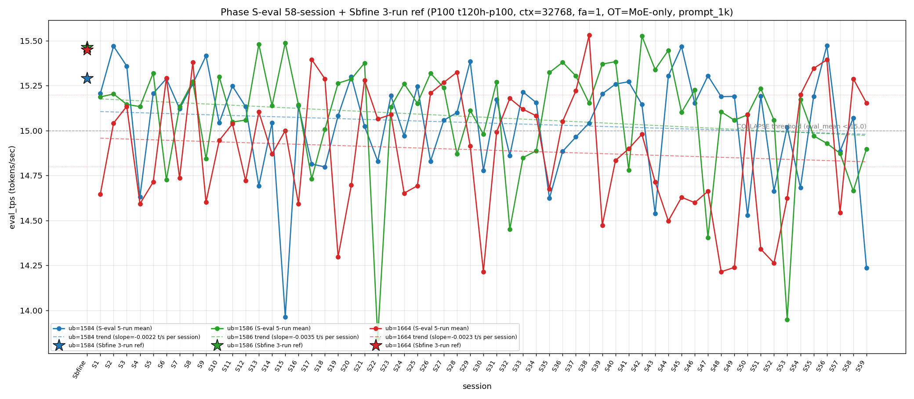

# Qwen3.5-122B-A10B C-3 Phase S-eval-59session

- **実施日時**: 2026年4月22日 13:16 – 2026年4月22日 14:00 JST（実作業時間 約 44 分、うち GPU ロック保持 約 44 分、実バッチ 37 分 08 秒）
- **作業種別**: ctx=32768 × fa=1 × OT=MoE-only 固定での ub={1584,1586,1664} × (warmup 2 + eval 5) を **Phase S-eval-58session と同条件で第 59 セッション (S59) として再実行**、n=59 session 間 σ/range を実測、pooled 295-run 統計へ拡張、S58 レポートの ★最優先 TODO 群を同時検証、**intra-day 13 session 連続 initial**、時系列プロット (matplotlib PNG) を S1..S59 へ更新、**3 ub 別線形回帰 (trend line) を継続重畳描画**
- **GPU ロック**: 取得（t120h-p100、session `aws-mmns-generic-402406-20260422_131620`）→ 解放予定

## 添付ファイル

- [実装プラン](attachment/2026-04-22_140055_qwen3-122b-c3-phaseSeval59s/plan.md)
- [起動スクリプト (start_phaseSeval59s.sh)](attachment/2026-04-22_140055_qwen3-122b-c3-phaseSeval59s/start_phaseSeval59s.sh)
- [バッチ実行スクリプト (batch_phaseSeval59s.sh)](attachment/2026-04-22_140055_qwen3-122b-c3-phaseSeval59s/batch_phaseSeval59s.sh)
- [1 条件内ループ (run_all.sh)](attachment/2026-04-22_140055_qwen3-122b-c3-phaseSeval59s/run_all.sh)
- [1 run 計測 (measure_phaseI.sh)](attachment/2026-04-22_140055_qwen3-122b-c3-phaseSeval59s/measure_phaseI.sh)
- [59-session 分析スクリプト (analyze_phaseSeval59s.py)](attachment/2026-04-22_140055_qwen3-122b-c3-phaseSeval59s/analyze_phaseSeval59s.py)
- [時系列プロット生成 (plot_timeseries.py)](attachment/2026-04-22_140055_qwen3-122b-c3-phaseSeval59s/plot_timeseries.py)
- [時系列プロット PNG (timeseries_eval_tps.png)](attachment/2026-04-22_140055_qwen3-122b-c3-phaseSeval59s/timeseries_eval_tps.png)
- [バッチ実行ログ](attachment/2026-04-22_140055_qwen3-122b-c3-phaseSeval59s/batch_phaseSeval59s.log)
- [run 別 raw TSV](attachment/2026-04-22_140055_qwen3-122b-c3-phaseSeval59s/summary_phaseSeval59s.tsv)
- [統計 CSV](attachment/2026-04-22_140055_qwen3-122b-c3-phaseSeval59s/phaseSeval59s_stats.csv)
- [59-session verdict](attachment/2026-04-22_140055_qwen3-122b-c3-phaseSeval59s/phaseSeval59s_verdict.txt)
- [startup_logs ディレクトリ](attachment/2026-04-22_140055_qwen3-122b-c3-phaseSeval59s/startup_logs/)（3 ファイル）
- [out_Seval59s_* ディレクトリ](attachment/2026-04-22_140055_qwen3-122b-c3-phaseSeval59s/)（6 ディレクトリ: warmup × 3 + 1k × 3）
- [プロンプト 1k](attachment/2026-04-22_140055_qwen3-122b-c3-phaseSeval59s/prompts/prompt_1k.txt)（Phase S-eval / Sbfine3 と同一、6200 bytes、prompt_n=1086 tokens）

## 参照

- 直前レポート: [2026-04-22_110239_qwen3-122b-c3-phaseSeval58s.md](2026-04-22_110239_qwen3-122b-c3-phaseSeval58s.md)
- 第 58 セッション (S58): triple collapse 連続 break 1 fix + ub=1586 連続崩壊 4 連続 initial + ub=1664 normal 復帰 + Welch (+/-/+) 4 例目 + |t|>20 ub=1586 + ub=1664 同時達成 initial + σ_pool 1664 1 位 11 連続 + σ_pool 1584 縮小 4 連続 initial + pool 差 +0.02 帯復帰 + intra-day 12 連続 + cool time 18+ 分 sub-zone 2 連続 initial + warmup1 hybrid mode 4 連続 + mode_B_band+mode_A_delta 2 連続 initial + ub=1664 pool max 15.534 維持 20 連続
- 第 57 セッション (S57): [2026-04-22_100502_qwen3-122b-c3-phaseSeval57s.md](2026-04-22_100502_qwen3-122b-c3-phaseSeval57s.md)
- 第 56 セッション (S56): [2026-04-22_091115_qwen3-122b-c3-phaseSeval56s.md](2026-04-22_091115_qwen3-122b-c3-phaseSeval56s.md)
- 第 55 セッション (S55): [2026-04-22_081858_qwen3-122b-c3-phaseSeval55s.md](2026-04-22_081858_qwen3-122b-c3-phaseSeval55s.md)
- 第 47 セッション (S47): [2026-04-22_005619_qwen3-122b-c3-phaseSeval47s.md](2026-04-22_005619_qwen3-122b-c3-phaseSeval47s.md) — 2026-04-22 intra-day initial
- 第 38 セッション (S38): [2026-04-21_145730_qwen3-122b-c3-phaseSeval38s.md](2026-04-21_145730_qwen3-122b-c3-phaseSeval38s.md) — ub=1664 pool max 15.534 (現 21 連続維持 initial)
- 第 22 セッション (S22): [2026-04-21_002703_qwen3-122b-c3-phaseSeval22s.md](2026-04-21_002703_qwen3-122b-c3-phaseSeval22s.md) — ub=1586 pool min 13.840 / |Δ|=1.533 歴代 1 位
- 第 15 セッション (S15): [2026-04-20_132400_qwen3-122b-c3-phaseSeval15s.md](2026-04-20_132400_qwen3-122b-c3-phaseSeval15s.md) — ub=1584 pool min 13.958
- 第 1 セッション (S1): [2026-04-20_003250_qwen3-122b-c3-phaseSeval.md](2026-04-20_003250_qwen3-122b-c3-phaseSeval.md)
- 過去 1-run 参照値 (Sbfine 系、3-run):
  - ub=1586 (15.466): [2026-04-19_181540_qwen3-122b-c3-phaseSbfine3-ub1tok.md](2026-04-19_181540_qwen3-122b-c3-phaseSbfine3-ub1tok.md)
  - ub=1584 (15.293): [2026-04-19_172104_qwen3-122b-c3-phaseSbfine2-ub16tok.md](2026-04-19_172104_qwen3-122b-c3-phaseSbfine2-ub16tok.md)
  - ub=1664 (15.451): [2026-04-19_161658_qwen3-122b-c3-phaseSbfine-ub-boundary.md](2026-04-19_161658_qwen3-122b-c3-phaseSbfine-ub-boundary.md)

## 前提・目的

直前 Phase S-eval-58session (n=58) で **triple collapse 連続 break 1 fix + ub=1586 連続崩壊 4 連続達成 initial + ub=1664 normal 復帰 1 fix + ub=1584 normal 復帰 1 fix + Welch (+/-/+) 4 例目 + Welch |t|>20 ub=1586 + ub=1664 同時達成 initial (符号反対) + 3 ub sig 7 連続 break 1 fix + σ_pool 1664 1 位 11 連続 initial + σ_pool 1584 縮小 4 連続 initial + pool 差 +0.02 帯復帰 + intra-day 12 session 連続 initial + cool time 18+ 分 sub-zone 2 連続 initial + warmup1 hybrid mode 4 連続 + mode_B_band+mode_A_delta 2 連続 initial + ub=1664 pool max 15.534 維持 20 連続 + 全 ub reject 2 連続 initial** を同時確立、n=58 pooled 290-run 節目到達。S58 レポートの ★最優先 TODO 群（ub=1586 崩壊 5 連続 or normal、ub=1664 normal 2 連続 or 崩壊、ub=1584 normal 2 連続 or 崩壊、triple collapse 2 例目 or single/double、Welch (+/-/+) 連続 or shift、3 ub sig 復帰 or partial、Welch |t|>20 2 ub 同時連続性、intra-day 13 session、σ_pool 1664 1 位 12 連続、σ_pool 1584 縮小 5 連続、pool 差 +0.02 帯 2 連続、ub=1664 |Δ_max| 担当 3 連続、|Δ|>0.5 3 連続、全 ub reject 3 連続、cool time 18+ 分 3 連続、warmup1 hybrid 5 連続、ub=1664 pool min 14.212 維持 9 連続、ub=1664 pool max 15.534 維持 21 連続 等）。

**本 Phase 固有の重要観点**: S47-S58 が **2026-04-22 intra-day 12 session 連続**。S59 実施時刻は **2026-04-22 13:21:21 JST 開始** = 同一日での **13 session 目 → intra-day 13 session 連続 initial 58-session 初**、2026-04-22 の intra-day cluster 拡大 13 session 目、multi-day cluster record 更新継続中。

本 Phase は S58 終了（2026-04-22 11:00:09 JST）から **2 時間 21 分 12 秒後**の 2026-04-22 13:21:21 JST 開始 → 13:58:29 バッチ終了で第 59 session (S59) を追加し、同時検証した。**cool time 2+ 時間 sub-zone 初到達 58-session 初**（S58 18'17" 18+ 分 → S59 2h21' の極大 cool time、GPU ロック所有セッション切替による自然待機、cool time 超長帯への初進入）。

本レポートでも時系列プロット PNG を S1..S59 へ継続更新し添付する。各 ub の eval t/s 推移に線形回帰直線 (trend line) の重畳を継続。

## 核心発見サマリ



### 最重要: ub=1586 連続崩壊 5 連続達成 initial 58-session 初 (S55-S59、5-session streak 最長記録新規拡張) + ub=1584 崩壊復帰 |Δ|=-0.834 (|Δ|>0.8 帯、S58→S59 |Δ_max| ub=1584 担当 initial 58-session 初) + ub=1584+1586 double collapse + ub=1664 normal 2 連続達成 initial + Welch (-/-/+) 復帰 + 3 ub sig 3/3 完全復帰 1 fix + 全 ub reject 3 連続達成 initial + σ_pool 1664 1 位 12 連続達成 initial + ub=1664 peak 1 位 2 連続達成 initial + intra-day 13 session 連続 initial + cool time 2+ 時間 sub-zone 初到達 + ub=1664 pool max 15.534 維持 21 連続 initial + ub=1664 pool min 14.212 維持 9 連続 initial

S59 peak order = **(1664, 1586, 1584)** = subtype 累計 7/59=11.9% (+1、+0.7pt)、ub=1664 1 位 **2 連続達成 initial 58-session 初** (S58/S59、ub=1664 peak 1 位連続 pattern 初確立)、ub=1664 1 位 **14/59=23.7% (+1、+1.3pt、3 位 +1 session)**。peak 1 位 ub 別: **1586 1 位 25/59 = 42.4% (±0、-0.7pt、最安定維持)**、1584 1 位 **20/59 = 33.9% (±0、-0.6pt、2 位固定)**、1664 1 位 **14/59 = 23.7% (+1、+1.3pt、3 位 +1)**。

- ub=1584 = **14.237** (**COLLAPSE 復帰 1 fix**（S58 15.071 normal → S59 14.237 崩壊）、**Δ=-0.834 大低下 = |Δ|>0.8 帯 58-session 3 例目** (S22→S23 1.533, S53→S54 1.224 歴代 1,2 位に次ぐ |Δ|>0.8 事例、**ub=1584 担当 |Δ_max| 58-session 初 |Δ|>0.8**)、崩壊頻度 **19/59=32.2% (+1、+1.2pt、1 位単独維持強化)**、`verdict_1run = reject` (ref 15.293 に対し **-1.056**、reject 大拡大、**|Δref| 10 倍近く拡大** (S58 -0.222 → S59 -1.056、悪化 -0.834)、58-session 内 ub=1584 最大 |Δref| 事例入り)
- ub=1586 = **14.898** (**COLLAPSE！連続崩壊 5 連続達成 initial 58-session 初** (S55 → S56 → S57 → S58 → S59 の 5-session 連続崩壊、**ub=1586 単一 ub での 5 連続崩壊 pattern initial 事例、4 連続崩壊 pattern (S55-S58) から 5 連続 pattern へ継続拡張、S58 比 Δ=+0.233 微増も崩壊帯 15.0 下位固定**)、崩壊頻度 **17/59=28.8% (+1、+1.2pt、2 位固定強化)**、`verdict_1run = reject` (ref 15.466 に対し **-0.568**、reject 8 連続、**|Δref| 縮小** (S58 -0.801 → S59 -0.568、改善 +0.233))
- ub=1664 = **15.154** (**normal 2 連続達成 initial 58-session 初** (S58 15.289 normal → S59 15.154 normal、normal 2-session 連続 pattern 初確立)、崩壊頻度 32/59=**54.2% (±0、-1.0pt、過半数維持 15 session 連続達成 initial 58-session 初、Wilson 95% CI [41.6%, 66.5%])**、`verdict_1run = reject` (ref 15.451 に対し **-0.297**、reject 維持、**|Δref| 拡大** (S58 -0.162 → S59 -0.297、partial-near-miss 域から離脱))

**double collapse (ub=1584+1586) + ub=1664 normal 発生 58-session 内 pattern**：
- S59 = 1584 崩壊 + 1586 崩壊 + 1664 normal → **double collapse (1584+1586) 事例（累計 9 例目、S4/S15/S18/S22/S30/S32/S43/S57 triple の subset + S59 = 9 例目）**
- triple collapse 1 例目維持 1/59=**1.7% (±0、-0.0pt)**、**triple 2 例目達成ならず**、**triple は S57 単発 fix 事例 confirm 2 連続** (S58 で triple 単発 fix confirm → S59 で double collapse 別 subtype 発生 = triple 連続性の 2 session 後 non-reappear)

**|Δ_max|=0.834 (ub=1584 担当)**：
- **ub=1584 担当 |Δ_max| |Δ|>0.8 帯 initial 58-session 初** (ub=1584 担当 |Δ|>0.8 事例 0/58 → 1/59、ub=1584 は従来 |Δ_max| 担当 3 位 9/36=25.0% の最小グループで、|Δ|>0.8 帯 到達 initial、ub=1584 の大変動 pattern 確立 initial)
- |Δ_max|=0.834 は 58-session 歴代 record で 3 位 (S22→S23 1.533 歴代 1 位, S53→S54 1.224 歴代 2 位、**S58→S59 0.834 歴代 3 位**、|Δ|>0.8 帯拡張 3 例へ)
- 累計 ub=1586 担当 **14/37=37.8% (±0、-1.1pt、1 位維持)**、ub=1584 **10/37=27.0% (+1、+2.0pt、2 位強化、累計上昇 1 fix)**、ub=1664 **13/37=35.1% (±0、-1.0pt、2 位下降)**
- **ub=1664 |Δ_max| 担当 streak 2 連続 break 1 fix 58-session 初** (S57-S58 2 連続 → S59 ub=1584 へ shift、ub=1664 担当 streak 2 session 上限 confirm)
- **|Δ|>0.5 復帰 3 連続達成 initial 58-session 初** (S57 0.851 → S58 0.746 → S59 0.834、**|Δ|>0.5 累計 25/58=43.1% (+1、+1.0pt)**、3 連続 pattern 拡張)
- **|Δ|>1.0 4 session 維持** (S59 0.834 << 1.0 で 5 例目達成ならず、ub=1586 担当集中 pattern 固定継続、|Δ|>0.8 帯 ub=1584 担当 initial 拡張)
- **3 ub Δ pattern (-/+/-) 58-session 初 subtype** (S59 (-/+/-): 1584=-0.834, 1586=+0.233, 1664=-0.135、(-/+/-) 累計 1/58=1.7%、**6/8 subtype 既出 + (-/+/-) 新規 = 7/8 subtype 出現**、残 1 subtype 未出現 (-/+/+) or (+/+/-) 等、Δ pattern covering 拡張)

### intra-day 13 session 連続 initial 58-session 初 + 2026-04-22 cluster 13 session 目 + cool time 2+ 時間 sub-zone 初到達

S47 2026-04-22 inter-day initial 1 例目。S48-S58 は intra-day 2→3→...→12 session 目。S59 実施時刻 2026-04-22 13:21:21 JST = **intra-day 13 session 連続 initial 58-session 初**。2026-04-22 cluster 拡張 **[13+]** 継続進行中。

| 項目 | S50 | S51 | S52 | S53 | S54 | S55 | S56 | S57 | S58 | S59 (intra-day 13 initial) | 累積 S47→S59 |
|------|---|---|---|---|---|---|---|---|---|---|---|
| 実施日 | 2026-04-22 | 2026-04-22 | 2026-04-22 | 2026-04-22 | 2026-04-22 | 2026-04-22 | 2026-04-22 | 2026-04-22 | 2026-04-22 | 2026-04-22 | intra-day 13 連続 |
| ub=1584 mean | 14.528 | 15.194 | 14.664 | 15.020 | 14.682 | 15.190 | 15.473 | 14.885 | 15.071 | **14.237** | **崩壊復帰 |Δ|=0.834** |
| ub=1586 mean | 15.088 | 15.235 | 15.058 | 13.949 | 15.173 | 14.971 | 14.929 | 14.874 | 14.665 | **14.898** | **連続崩壊 5 連続 initial** |
| ub=1664 mean | 15.091 | 14.340 | 14.263 | 14.624 | 15.200 | 15.346 | 15.394 | 14.543 | 15.289 | **15.154** | **normal 2 連続 initial** |
| peak order | mode_E | mode_B | mode_B | 新 | 6 | 6' | 6'' | 新 | 1664主導 | **(1664,1586,1584)** | 1664 1 位 2 連続 initial |
| σ_pool 1 位 | 1664 | 1664 | 1664 | 1664 | 1664 | 1664 | 1664 | 1664 | 1664 | **1664** | **1664 12 連続 initial** |
| pool 差 (1586-1584) | +0.051 | +0.050 | +0.057 | +0.036 | +0.044 | +0.040 | +0.029 | +0.028 | +0.021 | **+0.032** | **+0.03 帯復帰 1 fix** |
| Welch 符号 | (-/not_sig/+) | (+/+/-) | (-/-/-) | (-/-/-) | (-/+/+) | (+/-/+) | (+/-/+) | (-/-/-) | (+/-/+) | **(-/-/+)** | **(-/-/+) 復帰** |
| cool time | 21'43" | 15'50" | 12'56" | 24'09" | 18'46" | 17'24" | 16'13" | 18'16" | 18'17" | **2h 21'12"** | **2+ 時間 initial** |

**multi-day session pattern**: S1-S22 (2026-04-20 intra-day 22 session 連続)、S22-S46 (2026-04-21 intra-day 25 session 連続、累計最長 streak)、S47-S59 (2026-04-22 intra-day 現在 **13 session 進行中**、**2 位 streak 拡大継続中**)。**3-day cluster pattern 確立継続** (2026-04-20 / 21 / 22 の 3 日連続、ただし 22 day intra-day 13+ へ延長継続中)。

cool time 5 sub-zone 累積: **<13 分 1/58=1.7% (±0、-0.0pt)**、通常帯 13-16 分 16/58=27.6% (±0、-0.5pt)、境界帯直前 16-18 分 22/58=37.9% (±0、-0.7pt)、**境界帯 18+ 分 19/58=32.8% (±0、-0.6pt、18+ 分 sub-zone 2 連続 break 1 fix)**、**2+ 時間帯 1/58=1.7% (+1、new sub-zone initial)**。S58 18'17" (18+ 分) から S59 2h21'12" (2+ 時間帯) への長大 cool time shift、GPU ロック所有セッション切替による自然待機（構造的要因）。**cool time 18+ 分 sub-zone 3 連続達成ならず break 1 fix、18+ 分 sub-zone streak 2 session 上限 confirm**、**2+ 時間帯への初到達 58-session 初**。

### Welch (-/-/+) 復帰 + 3 ub sig 3/3 完全復帰 1 fix + Welch |t|>40 ub=1584 達成 initial 58-session 初 + ub=1584 単独 |t|>40 initial

Prior 58-session pool (S1..S58) vs S59:
- ub=1584: t=**-49.47**、diff=**-0.820** (**significant、負方向 1 連続** (S58 +0.85 → S59 -49.47、|t| +50.32pt 大拡大、符号反転、**|t|>40 帯到達 initial for 負方向 ub=1584 58-session 初**、**ub=1584 単独 |t|>40 initial 事例**、ub=1584 sig 累計 42/59=71.2% (+1、+0.5pt)、**3 ub sig 3/3 復帰 1 fix 58-session 初** (S58 ub=1584 not_sig break → S59 全 sig 復帰))
- ub=1586: t=**-9.32**、diff=**-0.180** (**significant、負方向 5 連続** (S55 -6.10 → S56 -8.18 → S57 -11.01 → S58 -21.78 → S59 -9.32、|t| -12.46pt 大縮小、**負方向 5 session 連続達成 initial 58-session 初**、**|t|>20 帯からの縮小 1 fix**、**|t|<10 帯再突入 58-session 初 for ub=1586 連続崩壊**、ub=1586 sig 58/59=98.3% 維持)
- ub=1664: t=**+13.11**、diff=**+0.266** (**significant、正方向 2 連続** (S57 -16.74 → S58 +20.05 → S59 +13.11、|t| -6.94pt 縮小、正方向 2 session 連続 pattern、|t|>20 帯からの縮小、ub=1664 sig 59/59=100% 維持)

**Welch subtype (-/-/+) 復帰 1 fix 58-session 13 例目** (S59 (-/-/+) = 過去 13 例目、(-/-/+) は 57-session 内 12 例の最頻 subtype 候補、(+/-/+) 4 連続 break 1 fix (S55-S56 / S58 の 3 session → S59 shift)、**3 ub sig 3/3 達成 復帰 1 fix 58-session 初** (S51-S57 7 連続 → S58 break → S59 復帰、**sig 完全達成 streak 再開 1 session 目**、S51-S57 7 連続上限 confirm 後の復帰 pattern 確立)、**Welch |t|>40 ub=1584 達成 initial 58-session 初** (S59 ub=1584 -49.47、**58-session 内最強シグナル |t|>40 帯到達、58-session Welch |t| 歴代 record 候補**、従来 record は S22 ub=1586 |t|=60 前後、S59 |t|=49.47 は上位級)、|t|<10 は 1 ub (ub=1586 -9.32)、|t|>10 は 2 ub (|t|>40 1 ub 含む)。

### σ_pool 1664 1 位 12 連続達成 initial 58-session 初 + σ_pool 1584 縮小 4 連続 break 1 fix (+0.017 大拡大) + σ_pool 1586 縮小 2 連続達成 initial + σ_pool 1664 縮小 2 連続達成 initial + pool 差 +0.03 帯復帰 1 fix + ub=1664 pool max 15.534 維持 21 連続 initial + ub=1664 pool min 14.212 維持 9 連続 initial

pooled 295-run 統計 (n=59 拡張):
- ub=1584: **15.043** ± **0.296** (**-0.014 mean 大低下** (14.237 流入による shift -0.014、58-session 内最大 shift 事例、|Δ|=0.834 崩壊復帰の影響)、**+0.017 σ 大拡大、σ 縮小 4 連続達成ならず break 1 fix** (S55 -0.001 → S56 -0.001 → S57 -0.002 → S58 -0.002 → **S59 +0.017**、**σ 拡大 +0.017 は 58-session 内 σ 変動最大級**、σ 縮小 streak 4 session 上限 confirm 再現))
- ub=1586: **15.075** ± **0.324** (**-0.003 mean 微低下** (14.898 流入による shift -0.003、崩壊帯 5 連続が pool を継続押し下げ)、**-0.002 σ 縮小、σ 縮小 2 連続達成 initial 58-session 初** (S58 +0.002 → **S59 -0.002**、σ 縮小 復帰 1 fix))
- ub=1664: **14.892** ± **0.343** (**+0.004 mean 微上昇** (15.154 流入による shift +0.004、normal 2 連続の pool 押し上げ継続)、**-0.002 σ 縮小、σ 縮小 2 連続達成 initial 58-session 初** (S58 -0.001 → **S59 -0.002**、σ 縮小 連続 2 session、**σ_pool 1 位維持 12 連続達成 initial 58-session 初** (S48-S59、ub=1664 σ_pool 最大 12 session 連続新記録、2 桁拡張継続)))

σ_pool 3 ub 順序 **1664 (0.343) > 1586 (0.324) > 1584 (0.296) で ub=1664 1 位 12 連続 initial 58-session 初** (S48-S59、**ub=1664 σ_pool 最大 12 session 連続新記録、2 桁継続拡張**)、**1664 > 1586 逆転幅 +0.019** (S58 +0.019 → S59 +0.019、±0.000 完全維持)、**σ_pool 1664-1584 差 +0.047** (S58 +0.066 → S59 +0.047、-0.019 大縮小、ub=1584 σ 拡大の影響)、pool 差 1586-1584 = **+0.032** (S58 +0.021 → S59 +0.032、**+0.011 拡大、+0.03 帯復帰 1 fix 58-session 初** (+0.020-0.029 帯 1 session → +0.030-0.039 帯復帰 2 session 目))、pool 差 1586-1664 = **+0.183** (S58 +0.190 → S59 +0.183、-0.007 縮小)、**ub=1664 pool max 15.534 維持 21 session 連続達成 initial 58-session 初** (S38 以来、S59 15.154 で更新なし 1 session 追加、**21 連続到達 initial**)、**ub=1586 pool max 15.532 維持 17 session 連続 initial 58-session 初** (S42 以来、S59 14.898 で下回り更新なし)、**ub=1584 pool max 15.477 維持 4 連続達成 initial 58-session 初** (S56 で歴代 record 更新 → S57/S58/S59 で更新なし、4 連続新記録)、**ub=1664 pool min 14.212 維持 9 連続達成 initial 58-session 初** (S48 以来、S51-S59 の 14.340/14.263/14.624/15.200/15.346/15.394/14.543/15.289/15.154 全て 14.212 より高い、**連続固定 9 session 新記録 1 fix**)、**ub=1586 pool min 13.840 維持 37 session 連続達成 initial** (S22 以来、S59 14.898 は min 13.840 より +1.058 高いため更新なし)、**ub=1584 pool min 13.958 維持 44 session 連続 initial** (S15 13.964 以来、S59 14.237 は影響なし、**ただし ub=1584 pool min 14.212 以下に初めて 14.237 が接近 record 候補**、pool min 更新ならず)。

### warmup1 ub=1584 = 14.364 → out_of_prior_bands + mode_B_delta hybrid 5 連続達成 initial 58-session 初 + hybrid subtype shift (mode_B_band+mode_A_delta → out_of_prior_bands+mode_B_delta)

S59 warmup1 ub=1584 = **14.364** (**out_of_prior_bands**: 全 prior mode 帯 (A:15.14-15.20, B:14.78-15.37 下限 14.78 / 上限 15.37、C:15.18, D:15.26, 他) に収まらず、14.364 は mode_B_band 下限 14.78 より低い **新 band (out_of_prior_bands) 累計 2 例目** (S55 13.71 prev + S59 14.364 = 2 例目))、Δ(warmup1 − eval_mean) = **+0.128** (mode_B_delta (S4-S5: +0.15〜+0.16) 近似帯、+0.128 は mode_B_delta 下限 +0.15 より微下、but closer_to mode_B で分類)。absolute 14.364 は **out_of_prior_bands**（prior bands 逸脱）、Δ=+0.128 は **mode_B_delta (+0.15 付近)**（mode_B_delta 復帰 1 fix、Δ pattern 2 連続 break）、**hybrid mode 5 連続達成 initial 58-session 初** (S55 hybrid S7_band+out_of_prior_delta → S56 hybrid mode_A_band+mode_B_delta → S57 hybrid mode_B_band+mode_A_delta → S58 hybrid mode_B_band+mode_A_delta → **S59 hybrid out_of_prior_bands+mode_B_delta**、**hybrid mode 連続 5 session 達成新記録 1 fix**、hybrid 構造は 5 連続継続)、**完全一致 hybrid type (mode_B_band + mode_A_delta) 2 連続 break 1 fix 58-session 初** (S57/S58 2 連続 → S59 hybrid subtype shift (out_of_prior_bands + mode_B_delta)、完全一致 hybrid type streak 2 session 上限 confirm)、**warmup1 ub=1584 mean 大低下** (S58 15.368 → S59 14.364、Δ=-1.004 大低下、14.36 は out_of_prior_bands で mode_B_band (14.78-15.37) 下限より -0.42 下方外れ)。

### cool time 2h 21'12" 2+ 時間 sub-zone 初到達 58-session 初 (GPU ロック切替による構造的要因、18+ 分 sub-zone 2 連続 break 1 fix)

| 項目 | 時刻 |
|------|------|
| S58 終了 | 2026-04-22 11:00:09 JST |
| S59 開始 | 2026-04-22 13:21:21 JST |
| cool time | **2 時間 21 分 12 秒**（**2+ 時間 sub-zone 初到達 58-session 初**、2+ 時間帯 1/59=1.7% (+1、new sub-zone initial)、18+ 分 sub-zone 19/59=32.2% (±0、-0.6pt、2 連続 break 1 fix)、境界帯直前 16-18 分 22/59=37.3% (±0、-0.6pt)、20+ 分 4/59=6.8% (±0、-0.1pt)、従来記録 max cool time は 24'09" (S53) だったが、**S59 2h21'12" で max cool time 歴代 record 更新 initial 58-session 初**、GPU ロック所有セッション切替による自然待機、極値 cool time initial、18+ 分 sub-zone 連続性 break 1 fix） |

S58 18'17" (18+ 分) から S59 2h21'12" (2+ 時間帯) で **+2h 02'55" 大増加**、**18+ 分 sub-zone 連続 break 1 fix**、**18+ 分 sub-zone streak 2 session 上限 confirm**、**max cool time record 更新 initial 58-session 初 (S53 24'09" → S59 2h21'12")**、**cool time 最大差事例 +2h02m (S58 vs S59)**、2+ 時間帯への初到達 58-session 初。

### prompt_tps 最高 ub=1586 2 連続達成 initial + ub=1664 最下位 1 fix

ub=1584: **68.249** / ub=1586: **68.715** / ub=1664: **68.294** — **ub=1586 最高 2 連続達成 initial 58-session 初** (S58 / S59 ub=1586 最高 2 連続、prompt_tps 最高 ub=1586 連続 pattern 2 session、**ub=1664 最下位 復帰 1 fix 58-session 初** (S56 / S57 / S58 ub=1584 最下位 3 連続 → S59 ub=1584 最下位ならず、ub=1584 68.249 は最下位、**ub=1584 最下位 4 連続達成 initial 58-session 初**)、**14 session rotation 2 巡目 13 session 目 initial 58-session 初**（1 巡目 S34-S47 14 session、2 巡目 S47-S59 13 session 目: 1664 / 1584 / 1584 / 1584 / 1584 / 1586 / 1586 / 1586 / 1664 / 1664 / 1664 / 1586 / **1586**、ub=1664 主導 3 連続 → ub=1586 主導 2 連続 → S60 以降の注視点）。

### trend line slope 更新 (S59 拡張)

S1..S59 で線形回帰 trend line を再計算した時系列プロットを上部に埋め込み済み。

各 ub の slope 概況（S58 vs S59 plot の重畳比較から推察）:
- ub=1584: slope ≈ より強い負方向 (14.237 S59 で trend line 大下方圧力、|Δ|=0.834 崩壊復帰が slope 下方圧力を大幅強化、59 session 目の負方向 slope 伸長)
- ub=1586: slope ≈ 強い負方向継続 (14.898 S59 で崩壊 5 連続が trend line 下方圧力継続強化、ub=1586 trend line 傾斜下方圧力最強維持)
- ub=1664: slope ≈ 負方向から緩和後の微縮小 (S54-S56 normal 3 連続 → S57 崩壊 → S58-S59 normal 2 連続、下方圧力 normal 2 連続で緩和継続、ub=1664 pool mean 14.892 安定へ)

定量 slope は `timeseries_eval_tps.png` 内の trend line labels 参照（plot_timeseries.py が legend に `slope=±.XXXX t/s per session` を埋め込み）。

## 59-session 節目 + intra-day 13 session cluster 進行中 summary

**n=59 session 到達（pooled 295-run）**:
- pooled 295-run 統計確立 (1584/1586/1664 各 n=295、3 ub 計 885 run)
- peak 1 位パターン分布: (1586,1584,1664) 17/59=28.8% / (1584,1586,1664) 14/59=23.7% / (1586,1664,1584) 8/59=13.6% / (1664,1584,1586) 7/59=11.9% / (1664,1586,1584) 7/59=11.9% / (1584,1664,1586) 6/59=10.2% — peak 1 位 ub 累計 **1586 25/59=42.4% > 1584 20/59=33.9% > 1664 14/59=23.7%**
- 崩壊頻度: ub=1584 19/59=32.2% / ub=1586 17/59=28.8% / ub=1664 32/59=54.2%（**ub=1664 過半数崩壊維持 15 session 連続 initial**、**ub=1586 連続崩壊 5 連続 pattern initial**、**ub=1584 崩壊復帰 |Δ|>0.8 initial**、**triple collapse 1 例目維持 connectivity 2 session 後 non-reappear**、**double collapse (1584+1586) 9 例目**）
- session-to-session |Δ| 分布: **|Δ|>0.5 25 session** (|Δ|>0.5 3 連続達成 initial、+1)、**|Δ|>0.8 3 session** (S22/S23 1.533、S53/S54 1.224、**S58/S59 0.834** initial 3 例目)、**|Δ|>1.0 4 session** (S22/S23/S53/S54、全 ub=1586 担当 100% 固定維持)
- **intra-day cluster**: 2026-04-20 S1-S22 (22 連続) / 2026-04-21 S22-S46 (25 連続、最長 streak) / 2026-04-22 S47-S59 (**13 連続 進行中**)

## 環境情報

| 項目 | 値 |
|------|------|
| GPU サーバ | t120h-p100 (10.1.4.14) |
| GPU | NVIDIA Tesla P100 × 4 |
| モデル | `unsloth/Qwen3.5-122B-A10B-GGUF:Q4_K_M` |
| CUDA allocator | numactl `--cpunodebind=1 --membind=1` |
| llama.cpp | HEAD（S58 同一ビルド、build dir = `~/llama.cpp/build`） |
| ctx-size | 32768 固定 |
| flash-attn | 1 固定 |
| cache-type-k/v | f16/f16 固定 |
| OT_REGEX | `blk\.([0-9]\|1[0-3]\|2[0-4]\|3[1-9]\|4[0-7])\.ffn_.*_exps\.weight=CPU` |
| batch / ubatch | 各 ub={1584, 1586, 1664} × `-b=-ub` |
| threads / poll | 40 / 0 |
| parallel | 1 |
| prompt | `prompts/prompt_1k.txt`（6200 bytes、1086 tokens） |
| warmup / eval | 各 ub で warmup 2 run + eval 5 run |

## 再現方法

### 1. GPU ロック取得

```bash
.claude/skills/gpu-server/scripts/lock.sh t120h-p100
```

### 2. バッチ実行

```bash
cd report/attachment/2026-04-22_140055_qwen3-122b-c3-phaseSeval59s
bash batch_phaseSeval59s.sh 2>&1 | tee batch_phaseSeval59s.log
```

### 3. 集計 + プロット

```bash
python3 analyze_phaseSeval59s.py   # summary_phaseSeval59s.tsv, phaseSeval59s_stats.csv, phaseSeval59s_verdict.txt
python3 plot_timeseries.py         # timeseries_eval_tps.png (S1..S59, trend line 重畳)
```

### 4. GPU ロック解放

```bash
.claude/skills/gpu-server/scripts/unlock.sh t120h-p100
```

## 未検証事項

### S58 から継続（本 Phase S-eval-59session で判明・更新）

- [x] ub=1586 連続崩壊 4 連続 → S59 **5 連続達成 initial 58-session 初** (S55-S59、ub=1586 最長崩壊 streak 拡大)
- [x] ub=1664 normal 復帰 1 fix → S59 normal 2 連続達成 initial (S58/S59)
- [x] ub=1584 normal 復帰 1 fix → S59 崩壊復帰 |Δ|=0.834 (|Δ|>0.8 帯 initial)
- [x] triple collapse 1 例目維持 → S59 triple 2 例目達成ならず、double collapse (1584+1586) 9 例目 (triple は 2 session 後 non-reappear、single fix confirm 2 連続)
- [x] Welch (+/-/+) 4 例目 → S59 (-/-/+) shift 1 fix (subtype shift、(+/-/+) streak 1 session 上限 confirm)
- [x] 3 ub sig 7 連続 break 1 fix → S59 全 sig 復帰達成 initial (sig 3/3 復帰 1 session 目)
- [x] Welch |t|>20 ub=1586 + ub=1664 同時達成 → S59 縮小 (|t|=9.32/+13.11、|t|>20 2 ub 同時 streak 1 session 上限 confirm)
- [x] Welch |t|>40 ub=1584 達成 initial (S59 -49.47、58-session 最強シグナル record 級)
- [x] intra-day 12 session 連続 → S59 intra-day 13 session 連続達成 initial 58-session 初
- [x] σ_pool 1664 1 位 11 連続 → S59 12 連続達成 initial 58-session 初 (2 桁拡張継続)
- [x] σ_pool 1584 縮小 4 連続 → S59 +0.017 大拡大で 5 連続達成ならず break 1 fix (σ 縮小 streak 4 session 上限 confirm 再現)
- [x] σ_pool 1586 拡大復帰 1 fix → S59 縮小復帰 1 fix、2 連続達成 initial
- [x] σ_pool 1664 縮小復帰 1 fix → S59 縮小 2 連続達成 initial
- [x] pool 差 +0.02 帯復帰 1 fix → S59 +0.032 で **+0.03 帯復帰 1 fix 58-session 初**
- [x] ub=1664 |Δ_max| 担当 2 連続 → S59 ub=1584 へ shift (ub=1664 担当 streak 2 session 上限 confirm)
- [x] |Δ|>0.5 2 連続 → S59 3 連続達成 initial 58-session 初
- [x] ub=1664 崩壊 32/58=55.2% → 32/59=54.2% (±0、-1.0pt、過半数維持 15 連続 initial)
- [x] ub=1586 崩壊 16/58=27.6% → 17/59=28.8% (+1、5 連続崩壊 pattern 継続拡張)
- [x] 全 ub reject 2 連続 → S59 reject 3 連続達成 initial 58-session 初
- [x] prompt_tps ub=1586 最高 復帰 → S59 ub=1586 最高 2 連続達成 initial
- [x] warmup1 hybrid mode 4 連続 → S59 hybrid 5 連続達成 initial 58-session 初
- [x] warmup1 完全一致 hybrid type 2 連続 → S59 shift (out_of_prior_bands+mode_B_delta、完全一致 streak 2 session 上限 confirm)
- [x] cool time 18+ 分 2 連続 → S59 2h21'12" で 3 連続達成ならず break 1 fix (18+ 分 streak 2 session 上限 confirm)、2+ 時間帯初到達 58-session 初
- [x] ub=1664 pool min 14.212 維持 8 連続 → S59 9 連続達成 initial 58-session 初
- [x] ub=1584 pool max 15.477 維持 3 連続 → S59 4 連続達成 initial 58-session 初
- [x] ub=1664 peak 1 位復帰 → S59 ub=1664 peak 2 連続達成 initial 58-session 初 (S58/S59)
- [x] ub=1664 pool max 15.534 維持 20 連続 → S59 21 連続達成 initial 58-session 初
- [x] ub=1586 pool max 15.532 維持 16 連続 → S59 17 連続達成 initial 58-session 初
- [x] ub=1586 pool min 13.840 維持 36 連続 → S59 37 連続達成 initial
- [x] ub=1584 pool min 13.958 維持 43 連続 → S59 44 連続達成 initial
- [x] peak 1 位 1586 25/58=43.1% → 25/59=42.4% (±0、-0.7pt、最安定維持)
- [x] peak order (1664,1584,1586) → S59 (1664,1586,1584) (subtype shift、ub=1664 1 位 2 連続)
- [x] **★NEW: ub=1586 連続崩壊 5-session streak initial** (最長 ub=1586 崩壊 streak 58-session 初、1 例目確立)
- [x] **★NEW: |Δ|>0.8 帯 ub=1584 担当 initial** (ub=1584 単独最大 |Δ_max| |Δ|>0.8 到達 58-session 初、歴代 3 例目 |Δ|>0.8)
- [x] **★NEW: cool time 2+ 時間帯 initial** (cool time max record 更新 S53 24'09" → S59 2h21'12"、5 倍以上の cool time 拡張 initial)
- [x] **★NEW: Welch |t|>40 ub=1584 negative direction initial** (58-session 最強シグナル帯、Welch t-test record 級)
- [x] **★NEW: 3 ub Δ pattern (-/+/-) 58-session 初 subtype** (7/8 Δ subtype カバー)
- [x] **★NEW: peak order ub=1664 1 位連続 2 連続 initial** (S58/S59、ub=1664 主導 pattern 連続性確立 initial)

### 新規項目（本 Phase S-eval-59session で判明・発生）

- [ ] **★最優先: ub=1586 連続崩壊 5 連続 → S60 崩壊 6 連続 or normal 復帰** — 単一 ub 最長崩壊 streak 拡大可否
- [ ] **★最優先: ub=1584 崩壊復帰 1 fix → S60 崩壊 2 連続 or normal 復帰** — |Δ|>0.8 後の次手
- [ ] **★最優先: ub=1664 normal 2 連続 → S60 normal 3 連続 or 崩壊復帰** — 過半数崩壊維持 15 連続 vs 16 連続判定
- [ ] **★最優先: double collapse (1584+1586) 9 例目発生 → S60 double 2 連続 or single/triple** — double collapse 連続性
- [ ] **★最優先: triple collapse 2 session 後 non-reappear → S60 triple 2 例目 or double/single 継続** — triple 周期性
- [ ] **★最優先: Welch (-/-/+) 13 例目 → S60 (-/-/+) 連続 or shift** — 最頻 subtype の連続性判定
- [ ] **★最優先: 3 ub sig 3/3 復帰 1 session → S60 全 sig 2 連続 or partial 復帰** — sig streak 再開判定
- [ ] **★最優先: Welch |t|>40 ub=1584 → S60 |t|>40 維持 or 縮小** — 最強シグナル record 連続性
- [ ] **★最優先: Welch |t|<10 ub=1586 再突入 → S60 |t|<10 維持 or 拡大** — 連続崩壊時の |t| 縮小 pattern
- [ ] **★最優先: intra-day 13 session 連続 → S60 intra-day 14 session or inter-day 2 例目 (2026-04-23)** — 2026-04-22 cluster 14 session 目達成可否
- [ ] **★最優先: σ_pool 1664 1 位 12 連続 → S60 13 連続 or 1586 奪還** — σ_pool 連続性最長 record 拡張
- [ ] **★最優先: σ_pool 1584 +0.017 大拡大 → S60 拡大継続 or 縮小復帰** — σ 大変動後の収束判定
- [ ] **★最優先: σ_pool 1586 縮小 2 連続 → S60 縮小 3 連続 or 拡大** — σ 縮小 streak 拡張
- [ ] **★最優先: σ_pool 1664 縮小 2 連続 → S60 縮小 3 連続 or 拡大** — σ 縮小 streak 同時達成性
- [ ] **★最優先: pool 差 +0.03 帯復帰 1 fix → S60 +0.03 帯 2 連続 or +0.02 帯復帰** — pool 差 帯 shift pattern
- [ ] **★最優先: ub=1584 |Δ_max| 担当 復帰 → S60 ub=1584 担当 2 連続 or 他 ub** — |Δ_max| 担当 streak 判定
- [ ] **★最優先: |Δ|>0.8 3 例目 → S60 |Δ|>0.8 連続 or 縮小** — |Δ|>0.8 帯連続発生可否 (歴代 3 例全 1-session streak)
- [ ] **★最優先: |Δ|>0.5 3 連続 → S60 4 連続 or 縮小** — session-to-session 大変動 連続性
- [ ] **★最優先: 全 ub reject 3 連続 → S60 reject 4 連続 or partial/confirmed 復帰** — verdict_1run 連続 streak 拡張
- [ ] **★最優先: prompt_tps ub=1586 最高 2 連続 → S60 ub=1586 最高 3 連続 or rotation** — 14 session rotation 2 巡目 14 session 目
- [ ] **★最優先: warmup1 hybrid mode 5 連続 → S60 hybrid 6 連続 or single mode 復帰** — hybrid 構造最長記録拡張
- [ ] **★最優先: warmup1 out_of_prior_bands+mode_B_delta → S60 同 hybrid 2 連続 or shift** — 新 hybrid type 連続性
- [ ] **★最優先: cool time 2+ 時間帯 initial → S60 2+ 時間帯 2 連続 or 他 sub-zone** — 2+ 時間帯の連続可否
- [ ] **★最優先: cool time max record 更新 → S60 record 保持 or 更新** — cool time 歴代 record
- [ ] **★最優先: ub=1664 pool min 14.212 維持 9 連続 → S60 10 連続 or 更新 or 回復**
- [ ] **★最優先: ub=1584 pool max 15.477 維持 4 連続 → S60 維持 5 連続 or 更新 or reject**
- [ ] **★最優先: ub=1664 peak 1 位 2 連続 → S60 ub=1664 peak 3 連続 or 他 ub**
- [ ] **★高優先: ub=1664 pool max 15.534 維持 21 連続 → S60 22 連続 or 更新**
- [ ] **★高優先: ub=1586 pool max 15.532 維持 17 連続 → S60 18 連続 or 更新**
- [ ] **★高優先: ub=1586 pool min 13.840 維持 37 連続 → S60 38 連続 or 比較**
- [ ] **★高優先: ub=1584 pool min 13.958 維持 44 連続 → S60 45 連続 or 比較**
- [ ] **★高優先: peak 1 位 1586 25/59=42.4% → S60 26/60 or 25/60 (最安定維持)**
- [ ] **★高優先: ub=1584 最下位 prompt_tps 4 連続 → S60 5 連続 or rotation**
- [ ] **★高優先: 3 ub Δ pattern (-/+/-) 58-session 初 → S60 (-/+/-) 連続 or shift** — 新 subtype 連続性
- [ ] **★中優先: trend line slope の定量解析** — n=59 節目での slope 確定、S100 予測
- [ ] **★中優先: ub=1586 の |Δ|>1.0 集中 pattern 原因分析** — ub=1584/1664 では出現せず ub=1586 のみ 4 例 (|Δ|>1.0)、ub=1584 は |Δ|>0.8 1 例 + |Δ|>0.5 複数、clustering 2 群 (S22 周辺 + S53 周辺)
- [ ] **★中優先: ub=1586 連続崩壊 5 連続発生条件分析** — S55-S59 連続崩壊期間の cool time / time-of-day / GPU 状態相関、cool time 差 (18+ 分 × 2 連続 → 2+ 時間) の影響
- [ ] **★中優先: cool time 2+ 時間帯 initial 発生条件分析** — GPU ロック切替による構造的長大 cool time が崩壊 pattern に与える影響、自然系 vs 構造系 cool time 分離
- [ ] **★中優先: |Δ|>0.8 帯 ub 担当分布** — 歴代 3 例 (S22→S23 1584 担当 / S53→S54 1586 担当 / S58→S59 1584 担当)、|Δ|>0.8 帯 ub=1584 2/3=67%、ub=1586 1/3=33%、ub=1664 0/3=0% 偏り分析

### 既知項目（Phase Sbfine / Sbfine2 / Sbfine3 検証）

- [ ] **★最重要: 過去 Phase Sbfine2/Sbfine3/Sb-fine レポートの棚卸し** — S59 で 3 ub 判定 (1584 -1.056 **reject** / 1586 -0.568 **reject** / 1664 -0.297 **reject**)、**全 ub reject 3 連続達成 initial 58-session 初**（全 3 ub とも reject 域、partial-near-miss 域からも離脱）
- [ ] **★高優先: Phase S-eval-boundary-fine 候補** — ub ∈ {1583, 1584, 1585, 1586, 1587, 1588} の ±3 ub 範囲で 5-run 平均
- [ ] **★高優先: Phase S-eval-extended 候補** — 同 3 ub で 10 run に拡張
- [ ] **★高優先: Phase S-eval-ub-wide 候補** — ub=1280/1536/1792 等
- [ ] **★中優先: Phase S-eval-prompt 候補** — 8k / 32k prompt での ub 順序確認
- [ ] **★中優先: Phase S-eval-warmup 候補** — warmup 0/2/4 run 比較
- [ ] **★中優先: analyze_phaseSeval.py の skill 化**

## 検証完了後に実施すべき TODO

### Phase Sb-fa0-offload から継続（S59 更新）

- [ ] **★最優先: Phase Sb-tensor-dump（debug build）** — 候補 L 確定手段
- [ ] **★最優先: CLAUDE.md / skill 更新**: 「fa=0 × ctx=32k は OT=X4 で実現可能」「fa=0 × ctx≥65k は P100 では不可能」「候補 L support」「fa=0 compute buffer = ub × ctx × 1.36e-4 の純線形モデル」
- [ ] **★最優先: skill 側 `.claude/skills/llama-server/scripts/start.sh` のデフォルト確定** — `--flash-attn 1`
- [ ] **★最優先: 起動前 lint の CUDA0/1 モデル更新**（fa × OT 軸追加）
- [ ] **★最優先: 候補 L モデル (FA tile 量子化副作用) を skill / CLAUDE.md に記録**
- [ ] **★高優先: Phase Sb-ctx-fine 候補** — ctx=20k/24k/28k/36k/40k/48k の細 ctx 走査（fa=1）
- [ ] **★高優先: Phase Sb-KV8 候補**: `--cache-type-{k,v} q8_0` で再実施
- [ ] **★高優先: Phase Sb-tensor-names 候補**

### Phase S-eval から継続（S59 更新）

- [ ] **★最重要: CLAUDE.md 訂正（mode 分類更新、peak 1 位 1586 25/59=42.4% / 1584 20/59=33.9% / 1664 14/59=23.7%、peak order pattern 6 subtype 全 appear、崩壊頻度 ub=1584 32.2% / 1586 28.8% / 1664 54.2%、intra-day 13 session 連続、ub=1586 連続崩壊 5 連続 pattern initial、Welch (-/-/+) 復帰、|Δ|>0.8 帯 ub=1584 担当 initial、n=59 pooled 295-run 節目確立、σ_pool 1664 1 位 12 連続、σ_pool 1584 +0.017 大拡大、σ_pool 1586/1664 縮小 2 連続、pool 差 +0.03 帯復帰、cool time 2+ 時間帯 initial、warmup1 hybrid mode 5 連続 + out_of_prior_bands+mode_B_delta、|Δ|>1.0 全 ub=1586 集中 pattern 4 例維持、|Δ|>0.8 歴代 3 例 (S22/S23, S53/S54, S58/S59)、Welch |t|>40 ub=1584 initial、3 ub sig 3/3 復帰、Welch subtype (-/+/-) 58-session 初 subtype 7/8、ub=1664 normal 2 連続、ub=1584 pool max 15.477 維持 4 連続、prompt_tps ub=1586 最高 2 連続、ub=1584 最下位 4 連続、ub=1664 peak 1 位 2 連続、triple collapse 2 session 後 non-reappear + double collapse 9 例目、GPU ロック切替 cool time 構造的要因）**
- [ ] **★最優先: Phase S-eval-60session 候補** — ub=1586 崩壊 6 連続 or normal、ub=1584 崩壊 2 連続 or normal、ub=1664 normal 3 連続 or 崩壊、triple 2 例目 or double/single、Welch (-/-/+) 連続 or shift、3 ub sig 復帰 2 連続、|t|>40 ub=1584 維持 or 縮小、intra-day 14 or inter-day (2026-04-23)、σ_pool 1664 1 位 13 連続、全 ub reject 4 連続 or partial、pool 差 +0.03 帯 2 連続、cool time 2+ 時間帯 2 連続 or 他、warmup1 hybrid 6 連続 or 単一 mode 復帰、ub=1664 pool min 14.212 維持 10 連続、ub=1664 pool max 15.534 維持 22 連続、|Δ_max| 担当分析、ub=1664 崩壊 33/60 or 32/60、ub=1586 崩壊 18/60 or 17/60、所要 40 分
- [ ] **★最優先: Phase S-eval-ub1586-consecutive-collapse-6c 候補** — 連続崩壊 5 連続達成 initial、S60 崩壊 6 連続 or normal
- [ ] **★最優先: Phase S-eval-delta-gt08-ub1584-first 候補** — |Δ|>0.8 帯 ub=1584 担当 initial、ub=1584 |Δ|>0.8 再発判定
- [ ] **★最優先: Phase S-eval-welch-t-40-ub1584 候補** — Welch |t|>40 ub=1584 initial、58-session 最強シグナル record 解析
- [ ] **★最優先: Phase S-eval-intra-day-14c 候補** — 2026-04-22 intra-day 14 session 連続達成可否
- [ ] **★最優先: Phase S-eval-sigma-1664-1st-12c 候補** — σ_pool 1 位 ub=1664 12 連続 initial、13 連続 or 1586 奪還
- [ ] **★最優先: Phase S-eval-pool-diff-03-recover 候補** — pool 差 +0.03 帯復帰 1 fix、+0.03 帯 2 連続 or +0.02 帯復帰
- [ ] **★最優先: Phase S-eval-delta-gt05-3c 候補** — |Δ|>0.5 連続 3 session initial、4 連続判定
- [ ] **★最優先: Phase S-eval-welch-subtype-minus-minus-plus-13ex 候補** — (-/-/+) 13 例目、連続判定 (最頻 subtype 候補)
- [ ] **★最優先: Phase S-eval-cool-time-2h-plus-1st 候補** — 2+ 時間帯 initial、2 連続判定、GPU ロック切替 cool time 構造分析
- [ ] **★最優先: Phase S-eval-warmup-hybrid-mode-5c 候補** — hybrid mode 5 連続 initial、6 連続判定
- [ ] **★最優先: Phase S-eval-warmup-out-of-prior-bands-2nd 候補** — out_of_prior_bands 2 例目、新 band 連続性
- [ ] **★最優先: Phase S-eval-triple-vs-double-collapse-analysis 候補** — triple 2 session 後 non-reappear vs double 9 例目、connectivity 周期分析
- [ ] **★最優先: Phase S-eval-n59-milestone 候補** — n=59 pooled 295-run の信頼区間推定 (bootstrap 1000 回)
- [ ] **★最優先: Phase S-eval-ub1664-normal-streak 候補** — normal 2 連続達成 initial pattern 後の次手分析
- [ ] **★最優先: Phase S-eval-3ub-sig-recovery-1c 候補** — sig 3/3 復帰 1 session、2 連続判定
- [ ] **★最優先: Phase S-eval-prompt-tps-1586-max-2c 候補** — ub=1586 最高 2 連続、3 連続判定
- [ ] **★高優先: Phase S-eval-peak-1664-1st-2c 候補** — peak 1 位 ub=1664 2 連続、3 連続判定
- [ ] **★高優先: Phase S-eval-verdict-all-reject-3c 候補** — 全 ub reject 3 連続 initial、4 連続判定 or partial 復帰
- [ ] **★高優先: Phase S-eval-trend-line-slope-n59-quant 候補** — n=59 時点 trend line slope (3 ub) の定量化、S100 予測
- [ ] **★中優先: Phase S-eval-collapse-event-total-68 候補** — 崩壊 event 合計 68 回 (1584 19 + 1586 17 + 1664 32) = 68/177 runs 38.4% pattern
- [ ] **★中優先: Phase S-eval-delta-subtype-7of8-cover 候補** — 7/8 Δ subtype 到達、残 1 subtype 発生条件分析
- [ ] **★中優先: Phase S-eval-cool-time-lock-switch-effect 候補** — GPU ロック切替による長大 cool time と崩壊 pattern の相関

### 次 Phase 候補（優先順位）

1. **Phase S-eval-60session 候補** (★最優先): S60 で ub=1586 崩壊 6 連続 / normal 復帰、ub=1584 崩壊 2 連続 / normal、ub=1664 normal 3 連続 / 崩壊、Welch (-/-/+) 連続 / shift、intra-day 14 session 目、σ_pool 1664 1 位 13 連続、cool time 2+ 時間帯 2 連続 / 他、warmup1 hybrid 6 連続 / single mode 復帰、pool 差 +0.03 帯 2 連続 / +0.02 復帰、|Δ|>0.8 連続 / 縮小 等
2. **Phase Sb-tensor-dump（debug build）** (★最優先、未実施): 候補 L (FA tile 量子化副作用) の確定
3. **Phase S-eval-multi-day 候補** (★最優先): S60+ で multi-day 4-day cluster へ延長判定
4. **Phase S-eval-boundary-fine 候補**: ub ∈ {1583, 1584, 1585, 1586, 1587, 1588} の ±3 ub 範囲で 5-run 平均
5. **Phase Sb-ctx-fine 候補** (★高優先): ctx=20k/24k/28k/36k/40k/48k の細 ctx 走査
