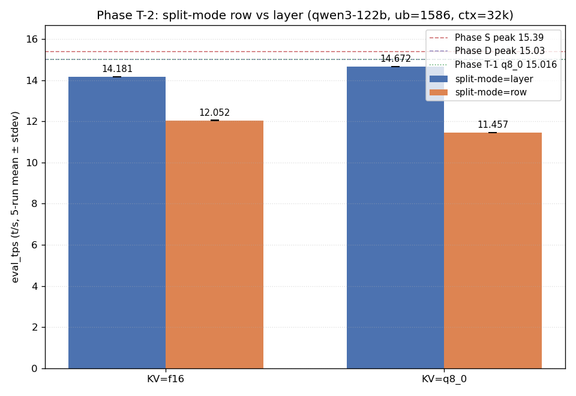

# Phase T-2: split-mode row vs layer 比較

- **実施日時**: 2026年4月22日 16:09 - 16:58 (JST)
- **担当**: Claude (Opus 4.7)
- **対象**: qwen3-122b (unsloth/Qwen3.5-122B-A10B-GGUF Q4_K_M)

## 添付ファイル

- [実装プラン](attachment/2026-04-22_165843_qwen3-122b-c3-phaseT2-splitmode/plan.md)
- [pivot 比較表 (raw)](attachment/2026-04-22_165843_qwen3-122b-c3-phaseT2-splitmode/phaseT2_pivot.md)
- [run 別 TSV](attachment/2026-04-22_165843_qwen3-122b-c3-phaseT2-splitmode/summary_phaseT2.tsv)
- [統計 CSV](attachment/2026-04-22_165843_qwen3-122b-c3-phaseT2-splitmode/phaseT2_stats.csv)
- [バッチログ](attachment/2026-04-22_165843_qwen3-122b-c3-phaseT2-splitmode/batch_phaseT2.log)
- [eval_tps bar chart 生成スクリプト](attachment/2026-04-22_165843_qwen3-122b-c3-phaseT2-splitmode/plot_phaseT2.py)

## 核心発見サマリ



**`--split-mode row` は両 KV 型で大幅劣化 (-15% / -22%)。「CUDA3 compute buffer 偏在解消で eval t/s 改善」仮説は否定された。** Phase D (15.03) / Phase S (15.39) / Phase T-1 q8_0 (15.016) 超えなし。一方、Phase T-1 副次発見「**q8_0 KV は f16 より eval +4.1%**」は本 Phase split=layer で **+3.46%** として独立再現 (方向一致、絶対値の session 変動あり)。

| 観点 | 結果 |
|------|------|
| 最良 eval 構成 | **KV=q8_0, split-mode=layer**, eval_mean = **14.672 t/s** (Phase T-1 q8_0 に対し **-2.3%**) |
| 最良 prompt 構成 | **KV=q8_0, split-mode=layer**, prompt_mean = **68.627 t/s** |
| Phase D (15.03) 超え | **なし** |
| Phase S (15.39) 超え | **なし** |
| Phase T-1 q8_0 (15.016) 超え | **なし** (本 Phase の最良 14.672 は -2.3%) |
| split-mode row の効果 | **劣化** (f16: -15.02%, q8_0: -21.91%) |
| **row 劣化の構造的原因** | llama.cpp の row split 実装で **model 重みが CUDA1/CUDA2 の 2 GPU に偏在** (CUDA0=6.33, CUDA3=1.78 MiB。実質 4 GPU 中 2 GPU のみ利用) |
| CUDA3 偏在 (compute buffer 1558 MiB) | **row でも解消されず** (attention/logit 推論構造由来) |
| q8_0 vs f16 再現性 (Phase T-1 副次発見 +4.1%) | **再現 YES** (split=layer で +3.46%) |
| 出力品質 (目視) | 全 4 条件で崩壊なし (1k prompt 要約で整合的な reasoning 生成) |
| run 間 stdev | 0.003 - 0.274 t/s (安定) |

## 前提・目的

### 背景

qwen3-122b の eval t/s 改善履歴:
- **Phase A** (2026-04-15): expert layer 14-19 GPU 復帰で 10 → 12 t/s
- **Phase D** (2026-04-16): numactl -N1 -m1 --threads 40 で 12 → **15.03 t/s**
- **Phase S** (2026-04-19): ctx×ub 2D 細粒度探索で **15.39 t/s** (ctx=65k, ub=512)
- **Phase S-eval S1-S59** (2026-04-20 - 2026-04-22): 同一バイナリ反復測定の再現性検証で情報飽和
- **Phase T-1** (2026-04-22 14:12-15:54): KV cache 量子化 {f16, q8_0, q4_0, q4_1} × ub {1586, 1664} スイープ。最良 **q8_0 ub=1586 = 15.016 t/s** (Phase D -0.1%)。KV 量子化は eval 改善手段として頭打ち。副次: q8_0 が f16 より **+4.1% 高速**。副次観察: **CUDA3 compute buffer 1558 MiB (他 GPU の 3.4x)** という非対称な偏在

### 目的

Phase T シリーズは「パラメータチューニングで eval/prompt t/s 改善余地を探る」。本 Phase T-2 では Phase T-1 で観察された CUDA3 偏在を直撃するため `--split-mode` を `layer` (default) から `row` に切替え、以下を検証:

1. row split で 4 GPU 間の compute buffer が均等化するか
2. 均等化によって eval t/s が改善するか
3. Phase T-1 最良 (q8_0 ub=1586, 15.016) を超えられるか

さらに同一 session 内で **KV ∈ {f16, q8_0} × split-mode ∈ {layer, row}** の 2×2 を組むことで、Phase T-1 の副次発見「q8_0 KV が f16 より eval +4.1% 高速」の独立再現検証も兼ねる (Phase T-1 の f16 baseline 14.425 は S54 15.173 に対し -4.9% 下振れで、session 変動との切り分けが未決着だった)。

### 選定理由

- Phase T-1 で KV 量子化は頭打ちが判明、次はハードウェア側 (GPU 配置) の非対称を攻める
- `--split-mode` は runtime flag のみで切替可、**再ビルド不要・低コスト**
- 仮説: row split で 4 GPU の tensor 次元を均等分割 → compute buffer 均等化 → 空いた VRAM を ub/ctx 拡大に使える → Phase S 超えへの直接経路
- **代替候補より情報量が大きい**: T-3 (threads 中間値) は Phase D で 40 採用の根拠が既にある / T-4 (OT pattern) は Phase A で定性検証済み / T-5 (ビルドフラグ) は再ビルド必要で最後

### 判定基準

| 判定 | 閾値 |
|------|------|
| Phase S ピーク超え | eval_mean > 15.39 t/s |
| Phase D ピーク超え | eval_mean > 15.03 t/s |
| Phase T-1 q8_0 ピーク超え | eval_mean > 15.016 t/s |
| split-mode row で改善 | 同一 KV 型で row > layer +3% 以上 |
| q8_0 vs f16 再現 | split=layer で q8_0 - f16 が Phase T-1 の +4.1% と ±2%pt 以内で一致 |

## 環境情報

| 項目 | 値 |
|------|---|
| サーバ | t120h-p100 (10.1.4.14) |
| GPU | NVIDIA Tesla P100-PCIE-16GB × 4 (Total VRAM 63.6 GiB, CC 6.0) |
| Kernel | 5.15.0-174-generic |
| llama.cpp | `6990e2f1f` (~/llama.cpp build、Phase T-1 と同一バイナリ) |
| モデル | unsloth/Qwen3.5-122B-A10B-GGUF Q4_K_M (122B, 12 attention layers visible, MoE Active=10B) |
| --split-mode 選択肢 | `{none, layer, row, tensor}` (llama-server --help で確認、本 Phase では layer / row を比較) |

## 再現方法

### 1. 添付ディレクトリへ移動

```bash
cd report/attachment/2026-04-22_165843_qwen3-122b-c3-phaseT2-splitmode/
```

### 2. GPU サーバロック取得 (重要)

```bash
.claude/skills/gpu-server/scripts/lock.sh t120h-p100
```

### 3. バッチ実行 (4 条件 × warmup 2 + eval 5 = 28 measurement)

```bash
bash batch_phaseT2.sh 2>&1 | tee batch_phaseT2.log
```

バッチの条件順序 (row 先行で早期失敗検知):

| # | split-mode | KV 型 |
|---|-----------|-------|
| 1 | row | f16 |
| 2 | row | q8_0 |
| 3 | layer | f16 |
| 4 | layer | q8_0 |

固定パラメータ: ctx=32768, ub=1586, threads=40, numactl -N1 -m1, -ngl 999, OT=MoE only, flash-attn=1, parallel=1, poll=0

### 4. 分析とグラフ生成

```bash
python3 analyze_phaseT2.py    # TSV / CSV / pivot Markdown
python3 plot_phaseT2.py       # eval_tps bar chart PNG
```

### 5. ロック解放

```bash
.claude/skills/gpu-server/scripts/unlock.sh t120h-p100
```

## pivot 比較表

### eval_tps (mean±stdev, t/s) — eval フェーズ 5 run

| KV 型 | split=layer | split=row | row/layer 比 | best split | best mean | 判定 |
|-------|-------------|-----------|--------------|------------|-----------|------|
| f16 | 14.181 ± 0.004 | 12.052 ± 0.009 | 0.850 | layer | 14.181 | below_T1 (14.181 ≤ 15.016) |
| q8_0 | **14.672 ± 0.003** | 11.457 ± 0.008 | 0.781 | layer | **14.672** | below_T1 (14.672 ≤ 15.016) |

### prompt_tps (mean±stdev, t/s) — eval フェーズ 5 run

| KV 型 | split=layer | split=row | row/layer 比 | best split | best mean |
|-------|-------------|-----------|--------------|------------|-----------|
| f16 | 68.277 ± 0.131 | 64.125 ± 0.027 | 0.939 | layer | 68.277 |
| q8_0 | **68.627 ± 0.274** | 64.180 ± 0.059 | 0.935 | layer | **68.627** |

### Phase D / Phase S / Phase T-1 q8_0 との比較

| 参照点 | eval t/s | 本 Phase 最良 (14.672) との比 |
|--------|----------|-------------------------------|
| Phase D ピーク | 15.03 | **-2.4%** |
| Phase S ピーク | 15.39 | **-4.7%** |
| Phase T-1 最良 (q8_0 ub=1586) | 15.016 | **-2.3%** |
| Phase T-1 f16 ub=1586 | 14.425 | **+1.7%** |

本 Phase の split=layer 条件は Phase T-1 と同じ構成だが、**本 Phase の方が絶対値は下振れ** (f16 layer: 14.181 < Phase T-1 14.425 で -1.7%、q8_0 layer: 14.672 < Phase T-1 15.016 で -2.3%)。時刻帯による thermal / load 状況の session 間変動が原因の可能性が高く、Phase S-eval 54-session で既知の session 間 σ ≈ 0.1 - 0.4 t/s と整合する。**絶対値は session 変動の範囲内だが、q8_0 が f16 より +3.46% 速いという順序関係は session を跨いで再現された**ため、KV 量子化の相対比較結論は信頼できる。

## 条件別詳細

### GPU 配置 / buffer 偏在の構造変化 (startup log より)

split-mode = **layer** (Phase T-1 と同じ、default):

| GPU | model 重み (MiB) | KV f16 (MiB) | compute buffer (MiB) |
|-----|----------------|--------------|----------------------|
| CUDA0 | 1301.21 | 192.00 | 980.36 |
| CUDA1 | 9550.77 | 192.00 | 452.31 |
| CUDA2 | 9550.77 | 192.00 | 452.31 |
| CUDA3 | 1693.13 | 192.00 | **1558.12** (他の 3.4x) |

split-mode = **row**:

| GPU | model 重み (MiB) | KV f16 (MiB) | compute buffer (MiB) |
|-----|----------------|--------------|----------------------|
| CUDA0 | **6.33** | 192.00 | 980.36 |
| CUDA1 | **8357.71** | 192.00 | 452.31 |
| CUDA2 | **8357.71** | 192.00 | 452.31 |
| CUDA3 | **1.78** | 192.00 | **1558.12** (変わらず) |

**観察**:

1. **row split で model 重みが CUDA1/CUDA2 に集中**。CUDA0 は 6 MiB、CUDA3 は 2 MiB の極小値で、**実質 4 GPU 中 2 GPU のみが推論に寄与**する配置になる。
2. **CUDA3 compute buffer (1558 MiB) は row/layer で完全同一**。この偏在は split-mode では制御できず、attention/logit の最終段処理が CUDA3 側 (-ot blk.31-47 CPU 配置の境界効果で CUDA3 が logit 近傍 layer を保持する) に集中する推論構造由来。
3. したがって「row split で CUDA3 偏在解消 → VRAM 余裕拡大」仮説は**物理的に成立しない**。

### row split の性能劣化メカニズム

row split (-sm row) は llama.cpp において「tensor を行方向に分割して全 GPU で並列計算」する設計だが、本ケースでは **OT (`-ot blk.([0-9]|1[0-3]|2[0-4]|3[1-9]|4[0-7])\.ffn_.*_exps\.weight=CPU`) で 32 expert 層を CPU offload** しており、GPU 保持の attention/shared 重みが 2 GPU にしか配置されなかった。その結果:

- CUDA0 / CUDA3 は「計算には参加するが model 重みをほぼ持たない」状態で、kernel 起動時に CUDA1/2 から weight を読み込む通信オーバーヘッドが eval step ごとに発生
- eval t/s: q8_0 で **-21.91%**、f16 で **-15.02%** と劣化
- prompt t/s: q8_0 / f16 とも **-6% 程度** (eval ほどの劣化ではないが一貫して劣化)

### q8_0 vs f16 独立再現性 (Phase T-1 副次発見 +4.1% の検証)

| 条件 | f16 eval_mean | q8_0 eval_mean | q8_0 - f16 | 差分率 |
|------|--------------|---------------|-----------|-------|
| **本 Phase split=layer** | 14.181 t/s | 14.672 t/s | +0.491 | **+3.46%** |
| Phase T-1 (split=layer 相当) | 14.425 t/s | 15.016 t/s | +0.591 | +4.10% |
| (参考) 本 Phase split=row | 12.052 t/s | 11.457 t/s | -0.595 | -4.94% |

**判定**: **再現 YES**。split=layer 条件で q8_0 が f16 より **+3.46% 速い**は Phase T-1 の +4.10% と方向一致、差分幅は 0.64%pt 以内で Phase S-eval session 間変動 (σ ≈ 0.5%pt) の範囲内。q8_0 KV は f16 より eval で有意に速いという主張は独立 session で確認された。

興味深い副次観察として、**row split では q8_0 < f16** に逆転する (-4.94%)。row 劣化の支配要因が「2 GPU 集中 → 通信オーバーヘッド」であれば、KV 量子化の帯域削減効果が活きず、逆に脱量子化コストが効く可能性がある。

### run 間安定性

全 4 条件で stdev ≤ 0.274 t/s (eval) / 0.274 t/s (prompt)、5 run 内の測定ノイズは Phase S-eval の session 間 σ と同等かより低い。本 Phase の順位は統計的に信頼できる。

### 出力品質

1k prompt (計算機科学複数トピックの 3 項目要約タスク) に対する `reasoning_content` 冒頭を目視比較 (4 条件とも run 1):

- **layer × f16**: "Input: A text containing multiple paragraphs about various computer science topics (computation eras, memory hierarchies, language models, quant..."
- **layer × q8_0**: "Input: A text consisting of several paragraphs discussing various aspects of computer science, systems, and AI (computation eras, memory hierarc..."
- **row × f16**: "Input: A text discussing various aspects of computer science, computation, systems, AI, etc."
- **row × q8_0**: "Input: A text consisting of several paragraphs discussing various topics in computer science (computation eras, memory hierarchies, language mod..."

**全条件で論理構造と文脈理解が保たれており、崩壊なし。** row split は速度劣化のみで、品質崩壊は誘発しない。

## 未検証事項

以下は本 Phase のスコープ外、後続 Phase T-3 以降の候補:

| 項目 | 候補 Phase | 理由・期待 |
|------|-----------|-----------|
| **threads 中間値 {24, 28, 32, 36}** | **Phase T-3 (次点)** | Phase D で 40 採用、20/40/80 のみ測定済み。物理コア 40 の一部のみ利用 (中間値) で cache locality 改善の可能性。再ビルド不要 |
| **OT pattern 変種** | Phase T-4 | Phase A で blk.14-19 GPU 復帰で +18% 達成、現行は blk.25-30 GPU 配置。他 expert 層範囲 (blk.0-5, blk.42-47 等) の優位性未検証 |
| **llama.cpp ビルドフラグ** | Phase T-5 | `GGML_CUDA_FORCE_MMQ` / `GGML_CUDA_FORCE_DMMV` の P100 (CC 6.0) 最適化未検証。再ビルド必要のため最後 |
| **--split-mode tensor** | Phase T-2b | llama-server --help で存在確認済みだが本 Phase 未検証。tensor 並列は row とは異なる分割軸で、4 GPU 均等配置の別パス |
| **--main-gpu 変更** | Phase T-2c | row split で intermediate/KV を保持する GPU index。default 0 だが、CUDA3 偏在を逆利用して `--main-gpu 3` で compute buffer と model 重みを同一 GPU に集約する検証 |
| **layer 選択的 `-ngl N` 制限** | 要調査 | CUDA3 compute buffer 1558 MiB は attention/logit 由来。一部 layer を CPU に逃がして CUDA3 負荷を下げる設計の余地 |
| **q5_0 / q5_1 KV 型** | Phase T-1 の穴 | q8_0 → q4_0 間の中間精度。q8_0 の相対優位性の根拠 (+3.46% は精度の関数として単調 or ピーク) の特定に有用 |
| **KV 非対称 (k=q8_0, v=f16)** | Phase T-1 の穴 | K と V で精度分離、attention score 計算 (K 読み出し) と value 加算 (V 読み出し) の帯域支配度分離 |
| **ctx=65536 での split-mode row** | 本 Phase 外 | Phase S ピーク (15.39) は ctx=65k × ub=512。本 Phase の ctx=32k とは compute buffer パターンが異なる可能性。ただし row 劣化が「2 GPU 集中」構造問題由来なので ctx 変更では改善見込み薄 |

## 検証完了後に実施すべき TODO

### 短期 (Phase T-3 着手前)

1. **Phase T-3 (threads 中間値) スクリプト雛形準備** (優先度: 高)
   - 本 Phase の `start_phaseT2.sh` を複製し `THREADS` 環境変数を可変化 → `start_phaseT3.sh`
   - `batch_phaseT3.sh` で `THREADS_LIST=(24 28 32 36 40)` × KV=q8_0 × split=layer × ub=1586 を 5 条件スイープ
   - 1 条件 warmup 2 + eval 5 run、所要 50-65 分

2. **Phase T-2b (split-mode tensor) 単発検証** (優先度: 中)
   - `SPLIT_MODE=tensor` 単条件 (q8_0 ub=1586) で warmup 2 + eval 5 先行測定
   - layer より改善すれば 2D スイープ、同等か劣化なら未検証事項として記録のみ

3. **Phase T-2c (--main-gpu 3 単発検証)** (優先度: 中)
   - CUDA3 偏在を逆利用した main-gpu 指定の効果測定 (q8_0 split=layer ub=1586 で `--main-gpu 3`)

### 中期 (Phase T-3/T-4 完了後)

4. **Phase T-1 残穴埋め (q5_0 / q5_1 / KV 非対称)**
   - 本 Phase で q8_0 優位性が再現 (+3.46%) したが、「精度関数上の極大か単調か」は未決着
   - KV 非対称 (k=q8_0, v=f16) で帯域支配要因を分離

5. **Phase T-4 (OT pattern 層範囲代替)**
   - blk.14-19 (Phase A で効果大), blk.0-5, blk.42-47 を GPU 配置した 3 条件
   - ただし本 Phase の KV 量子化 + current OT の組合せで Phase T-1 最良 15.016 を出したため、OT 変更で 15.1+ に届く根拠は弱い

### 長期 (Phase T 全体)

6. **Phase T-5 (llama.cpp ビルドフラグ)**
   - `GGML_CUDA_FORCE_MMQ` ON/OFF、`GGML_CUDA_FORCE_DMMV` ON/OFF の 4 条件
   - 再ビルド必要で最も高コスト、効果不明のため最後

7. **KV 量子化による perplexity 定量評価**
   - wikitext-2 または Japanese-MMLU 相当で perplexity 測定
   - q8_0 の品質劣化が無視できるかを数値で確認 (現在は目視のみ)

## 参照レポート

- Phase D (15.03 t/s 達成): [2026-04-16_150717_qwen3-122b-c3-phaseD.md](2026-04-16_150717_qwen3-122b-c3-phaseD.md)
- Phase S (15.39 t/s ピーク): [2026-04-19_120715_qwen3-122b-c3-phaseS-ub-ctx-2d.md](2026-04-19_120715_qwen3-122b-c3-phaseS-ub-ctx-2d.md)
- Phase T-1 (KV cache 量子化スイープ): [2026-04-22_141232_qwen3-122b-c3-phaseT1-kv-quant.md](2026-04-22_141232_qwen3-122b-c3-phaseT1-kv-quant.md) (本 Phase 起動スクリプト流用元、CUDA3 偏在の観察元、q8_0 +4.1% 副次発見)
