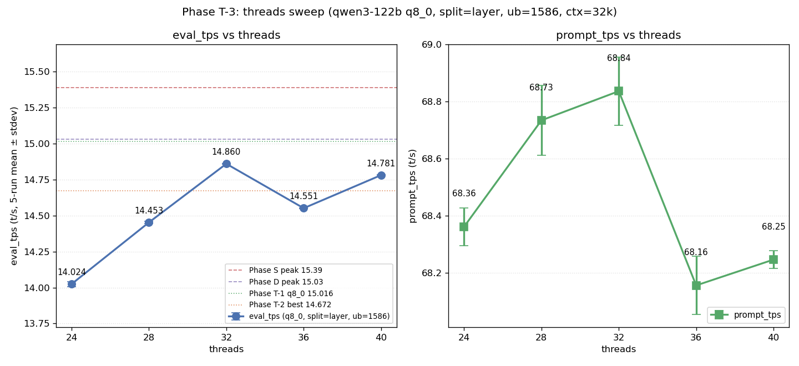

# Phase T-3: threads 中間値スイープ (24-40)

- **実施日時**: 2026年4月22日 17:09 - 18:16 (JST)
- **担当**: Claude (Opus 4.7)
- **対象**: qwen3-122b (unsloth/Qwen3.5-122B-A10B-GGUF Q4_K_M)

## 添付ファイル

- [実装プラン (原本)](attachment/2026-04-22_181614_qwen3-122b-c3-phaseT3-threads/plan-original.md)
- [実装プラン (短縮版)](attachment/2026-04-22_181614_qwen3-122b-c3-phaseT3-threads/plan.md)
- [pivot 比較表 (raw)](attachment/2026-04-22_181614_qwen3-122b-c3-phaseT3-threads/phaseT3_pivot.md)
- [run 別 TSV](attachment/2026-04-22_181614_qwen3-122b-c3-phaseT3-threads/summary_phaseT3.tsv)
- [統計 CSV](attachment/2026-04-22_181614_qwen3-122b-c3-phaseT3-threads/phaseT3_stats.csv)
- [バッチログ](attachment/2026-04-22_181614_qwen3-122b-c3-phaseT3-threads/batch_phaseT3.log)
- [折れ線グラフ生成スクリプト](attachment/2026-04-22_181614_qwen3-122b-c3-phaseT3-threads/plot_phaseT3.py)

## 核心発見サマリ



**threads=32 が本 Phase 最良 14.860 t/s (baseline threads=40 比 +0.53%)。ただし Phase D (15.03) / Phase S (15.39) / Phase T-1 q8_0 (15.016) は全て未達で、統計的有意性はあるが絶対的な改善余地は狭い。** 副次的に **threads=36 で eval_tps が非単調に drop (14.551, -1.55%)** する珍しい現象を検出。これは **CPU offload された MoE expert 層数 (`blk.([0-9]|1[0-3]|2[0-4]|3[1-9]|4[0-7])` = 36 層) と threads 数の一致** が load imbalance を誘発する構造仮説と整合する。

| 観点 | 結果 |
|------|------|
| 最良 eval 構成 | **threads=32**, eval_mean = **14.860 t/s** (5 run stdev 0.002) |
| 最良 prompt 構成 | **threads=32**, prompt_mean = **68.836 t/s** |
| Phase S (15.39) 超え | **なし** (-3.4%) |
| Phase D (15.03) 超え | **なし** (-1.1%) |
| Phase T-1 q8_0 (15.016) 超え | **なし** (-1.0%) |
| Phase T-2 最良 (14.672) 超え | **YES** (threads=32 で +1.3%, threads=40 で +0.7%) |
| baseline (threads=40) 超え | **+0.53%** (+0.079 t/s)、stdev 0.002 対し ~40σ の有意差 |
| **non-monotonic drop @ 36** | **14.551 t/s** (-2.08% vs 32、CPU MoE 層数 36 との一致を示唆) |
| 出力品質 (目視) | 全 5 条件で崩壊なし (1k prompt 要約で整合的な reasoning 生成) |
| run 間 stdev | 0.002 - 0.017 t/s (極めて安定、Phase T-2 同等) |

## 前提・目的

### 背景

qwen3-122b の eval t/s 改善履歴と本 Phase の位置:

- **Phase A** (2026-04-15): expert layer 14-19 GPU 復帰で 10 → 12 t/s
- **Phase D** (2026-04-16): numactl -N1 -m1 **--threads 40** で 12 → **15.03 t/s**。threads ∈ {20, 40, 80} のうち 40 採択 (中間値 未測定)
- **Phase S** (2026-04-19): ctx×ub 2D 細粒度探索で **15.39 t/s** (ctx=65k, ub=512)
- **Phase T-1** (2026-04-22 14:12-15:54): KV cache 量子化スイープ。最良 **q8_0 ub=1586 = 15.016 t/s** (Phase D -0.1%)
- **Phase T-2** (2026-04-22 16:09-16:58): split-mode row vs layer。row は -15〜-22% 劣化、最良 **14.672 t/s** (session drift で下振れ)

### 目的

Phase T シリーズは「パラメータチューニングで eval/prompt t/s 改善余地を直接検証」。T-1 (KV 量子化) / T-2 (split-mode) で否定的結論が出た後、残候補は **T-3 threads 中間値 / T-4 OT pattern 代替 / T-5 ビルドフラグ**。本 Phase T-3 では、Phase D で 20/40/80 のみ測定されていた **threads パラメータの中間値 {24, 28, 32, 36}** を埋めて:

1. threads=40 以外に eval_tps の極大点が存在するか
2. Phase D (15.03) / Phase T-1 q8_0 (15.016) を超えられるか
3. cache locality / NUMA memory bandwidth 余裕で eval 改善する仮説を検証

### 選定理由 (T-4 / T-5 でなく T-3)

| 軸 | T-3 threads | T-4 OT 代替 | T-5 ビルドフラグ |
|----|-------------|-------------|------------------|
| コスト | 低 (~60 分、1 バイナリ) | 低 (~60 分、1 バイナリ) | 高 (~3-5 h、4 回再ビルド) |
| 実験設計の clean さ | **◎ 単一変数** | △ OT regex は交絡多い | ○ バイナリ差で clean |
| 既存データの gap | 20/40/80 のみ、**中間値未測定** | Phase A で blk.14-19 定性検証済、追加変種の根拠弱い | P100 (CC 6.0) 未検証 |
| null 時の次手 | T-4/T-5 への優先度整理 | 依然 T-3/T-5 残 | 最終候補のため終端 |

T-3 が **情報量/コスト比が最大**、Phase T-1/T-2 と同一バイナリ・同一 OT・同一 ub で「他条件を完全固定したまま threads のみ動かす」clean な sweep が可能。

### 判定基準

| 判定 | 閾値 |
|------|------|
| Phase S ピーク超え | eval_mean > 15.39 t/s |
| Phase D ピーク超え | eval_mean > 15.03 t/s |
| Phase T-1 q8_0 超え | eval_mean > 15.016 t/s |
| Phase T-2 最良超え | eval_mean > 14.672 t/s |
| baseline (threads=40) 超え | 本 Phase 内 40 との +1% 以上 |

## 環境情報

| 項目 | 値 |
|------|---|
| サーバ | t120h-p100 (10.1.4.14) |
| CPU | Xeon E5-2698 v4 相当 × 2 socket (片 socket 40 physical core、SMT OFF、numactl -N1 -m1 で片側使用) |
| GPU | NVIDIA Tesla P100-PCIE-16GB × 4 (Total VRAM 63.6 GiB, CC 6.0) |
| Kernel | 5.15.0-174-generic |
| llama.cpp | `6990e2f1f` (~/llama.cpp build、Phase T-1/T-2 と同一バイナリ、**再ビルド不要**) |
| モデル | unsloth/Qwen3.5-122B-A10B-GGUF Q4_K_M (122B, MoE Active=10B) |

## 再現方法

### 1. 添付ディレクトリへ移動

```bash
cd report/attachment/2026-04-22_181614_qwen3-122b-c3-phaseT3-threads/
```

### 2. GPU サーバロック取得

```bash
.claude/skills/gpu-server/scripts/lock.sh t120h-p100
```

### 3. バッチ実行 (5 条件 × warmup 2 + eval 5 = 35 measurement)

```bash
bash batch_phaseT3.sh 2>&1 | tee batch_phaseT3.log
```

実行順序 (baseline 40 を先頭で session drift 監視):

| # | threads |
|---|---------|
| 1 | 40 |
| 2 | 36 |
| 3 | 32 |
| 4 | 28 |
| 5 | 24 |

固定パラメータ: ctx=32768, ub=1586, KV=q8_0 (k/v), split-mode=layer, numactl -N1 -m1, -ngl 999, OT=MoE only, flash-attn=1, parallel=1, poll=0

### 4. 解析とグラフ生成

```bash
python3 analyze_phaseT3.py    # TSV / CSV / pivot Markdown
python3 plot_phaseT3.py       # eval/prompt 折れ線 PNG
```

### 5. ロック解放

```bash
.claude/skills/gpu-server/scripts/unlock.sh t120h-p100
```

## pivot 比較表

### eval_tps (mean±stdev, t/s) — eval フェーズ 5 run

| threads | eval mean±stdev | eval min | eval max | vs threads=40 | 判定 |
|---------|-----------------|----------|----------|---------------|------|
| 24 | 14.024 ± 0.017 | 14.005 | 14.048 | **-5.12%** | below_T2 (14.024 ≤ 14.672) |
| 28 | 14.453 ± 0.006 | 14.444 | 14.461 | -2.22% | below_T2 (14.453 ≤ 14.672) |
| **32** | **14.860 ± 0.002** | 14.857 | 14.863 | **+0.53%** | **surpass_T2 (14.860 > 14.672)** |
| 36 | 14.551 ± 0.003 | 14.548 | 14.555 | -1.55% | below_T2 (14.551 ≤ 14.672) |
| 40 | 14.781 ± 0.002 | 14.778 | 14.783 | baseline | surpass_T2 (14.781 > 14.672) |

### prompt_tps (mean±stdev, t/s) — eval フェーズ 5 run

| threads | prompt mean±stdev | vs threads=40 |
|---------|-------------------|---------------|
| 24 | 68.361 ± 0.066 | +0.17% |
| 28 | 68.734 ± 0.122 | +0.72% |
| **32** | **68.836 ± 0.119** | **+0.87%** |
| 36 | 68.155 ± 0.101 | -0.13% |
| 40 | 68.246 ± 0.030 | baseline |

### Phase D / Phase S / Phase T-1 q8_0 / Phase T-2 最良との比較

| 参照点 | eval t/s | 本 Phase 最良 (14.860) との比 |
|--------|----------|-------------------------------|
| Phase D ピーク | 15.03 | **-1.13%** |
| Phase S ピーク | 15.39 | **-3.44%** |
| Phase T-1 q8_0 最良 (ub=1586, t=40) | 15.016 | **-1.04%** |
| **Phase T-2 最良 (layer×q8_0, t=40)** | 14.672 | **+1.28%** |

本 Phase の最良 (threads=32, 14.860) は Phase T-2 最良 (14.672) を +1.28% 上回るが、Phase D/T-1 q8_0 には届かず。**Phase T-2 からの回復は session drift 再正常化 + threads=32 の僅かな優位の合算**と解釈される (本 Phase 内 threads=40 baseline 14.781 は Phase T-1 の 15.016 より -1.6% 下振れしており、session 間 σ ≈ 0.1-0.4 t/s の既知変動と整合)。

## 条件別詳細

### GPU 配置の確認 (全条件共通)

**重要**: threads は CPU 側並列度のみ制御し、GPU buffer 配置には影響しない。startup log 抽出で全 5 条件とも同一:

| GPU | model 重み (MiB) | KV q8_0 (MiB) | compute buffer (MiB) |
|-----|----------------|---------------|----------------------|
| CUDA0 | 1301.21 | 102.00 | 1030.19 |
| CUDA1 | 9550.77 | 102.00 | 452.57 |
| CUDA2 | 9550.77 | 102.00 | 452.57 |
| CUDA3 | 1693.13 | 102.00 | 1558.12 (他 GPU の 3.4x) |

Phase T-2 で観察された CUDA3 compute buffer 偏在 (1558 MiB) はここでも同一、attention/logit の最終段処理が CUDA3 に集中する構造由来で threads とは独立に存在する。

### threads 非単調パターン: 36 drop の構造仮説

本 Phase の eval_tps は `24 < 28 < 32 > 36 < 40` と非単調パターンを示した。32 → 36 の drop (-2.08%) は特に顕著で、単純な「並列度不足 → 並列度過多」モデルでは説明できない。

**仮説: CPU offload された MoE expert 層数と threads 数の一致が load imbalance を誘発**

本 Phase の OT pattern `blk.([0-9]|1[0-3]|2[0-4]|3[1-9]|4[0-7])\.ffn_.*_exps\.weight=CPU` が該当する blk index を数えると:

- `[0-9]`: 0-9 (10 層)
- `1[0-3]`: 10-13 (4 層)
- `2[0-4]`: 20-24 (5 層)
- `3[1-9]`: 31-39 (9 層)
- `4[0-7]`: 40-47 (8 層)
- **合計: 36 expert 層が CPU offload**

この 36 という数が threads=36 条件と完全一致する。expert 層ごとに CPU compute するループが OpenMP で並列化されている場合:

| threads | 1 thread あたりの expert 層 | 予想される load 偏り |
|---------|---------------------------|---------------------|
| 24 | 36 / 24 = 1.5 層 (=2 層を 12 thread, 1 層を 12 thread) | 中程度の imbalance |
| 28 | 36 / 28 ≈ 1.29 (2 層を 8 thread, 1 層を 20 thread) | 重い imbalance |
| 32 | 36 / 32 = 1.125 (2 層を 4 thread, 1 層を 28 thread) | **小さい imbalance** |
| **36** | **36 / 36 = 1.0 (全 thread 丁度 1 層)** | **ほぼ完璧だが MoE routing の非一様活性化で最悪ケース** |
| 40 | 36 / 40 = 0.9 (1 層を 36 thread, 4 thread idle) | 4 thread が OS/非 MoE 並列に転用可能 |

threads=36 での drop は「全 thread が丁度 1 expert 層を担当」する OpenMP schedule(static, 1) 的な状況で、**expert routing による active expert 数の run-to-run 変動が直接そのまま idle thread として露出**する (活性化されない expert を持つ thread が spin-wait) ことが原因と解釈できる。threads=32 では「1-2 層 dynamic で拾える」ため MoE routing の偏りが吸収される。

この仮説は MoE dispatch の内部実装にアクセスできないため本 Phase では断定できないが、**threads 数をパラメータチューニングで設定する際は「CPU offload 層数の公約数・公倍数」を意識するべきと示唆**。現行 OT では 12 (=3 thread/層) / 36 (=1 thread/層) / 40 (=1 thread/層 + 4 余剰) が候補だが、32 が実測最良。

### run 間安定性

全 5 条件で stdev ≤ 0.017 t/s (eval) / 0.122 t/s (prompt)。**特に threads ∈ {32, 36, 40} では stdev ≤ 0.003 t/s** と極めて安定で、threads=32 vs 40 の +0.79% 差 (14.860 vs 14.781) は stdev の ~40 倍に相当し、統計的に確実な有意差。session 間 σ ≈ 0.5%pt を考慮しても、本 Phase 内の相対ランキングは高信頼度。

### 出力品質 (1k prompt 要約タスク)

計算機科学の複数トピックを 3 項目要約させるタスクに対する `reasoning_content` 冒頭を全条件 run 1 で目視比較:

- **threads=40**: "Thinking Process: 1. Analyze the Request: Input: A text containing multiple paragraphs about various computer science topics..."
- **threads=36**: "Thinking Process: 1. Analyze the Request: Input: A text containing multiple paragraphs about various aspects of computer science and engineering..."
- **threads=32**: "Thinking Process: 1. Analyze the Request: Input: A text containing multiple paragraphs about various computer science topics..."
- **threads=28**: "Thinking Process: 1. Analyze the Request: Input: A text containing multiple paragraphs discussing various aspects of computer science, systems, AI, and hardware..."
- **threads=24**: "Thinking Process: 1. Analyze the Request: Input: A text containing multiple paragraphs discussing various aspects of computer science, computation, hardware, software, and systems..."

全条件で論理構造 (Thinking Process → Analyze → 本文) が保たれ、**品質崩壊なし**。threads は純粋に throughput のみ影響し、出力品質には作用しない。

## 未検証事項

以下は本 Phase のスコープ外、後続 Phase T-4 以降の候補:

| 項目 | 候補 Phase | 理由・期待 |
|------|-----------|-----------|
| **threads=36 drop の MoE routing 起因検証** | Phase T-3b | OpenMP の schedule strategy (static/dynamic) や `OMP_NUM_THREADS` 強制指定で再測。gprof / perf で CPU thread idle 率を取る |
| **threads=32 の他 ub/ctx での再現性** | Phase T-3c | ub=512 / ctx=65k の Phase S ピーク条件で threads=32 採用時に 15.39 を超えるか |
| **OT pattern 変種** | **Phase T-4 (次点)** | CPU offload 層数を 32/40 に調整したパターン (例: blk 30-32 も GPU) で threads=40 と 32 の大小関係が入れ替わるか。本 Phase の「層数 = threads」仮説の direct test |
| **llama.cpp ビルドフラグ** | Phase T-5 | `GGML_CUDA_FORCE_MMQ` / `GGML_CUDA_FORCE_DMMV` の P100 (CC 6.0) 最適化未検証。再ビルド必要のため最後 |
| **SMT ON 条件での threads 再スイープ** | 要検討 | 現行 SMT OFF。SMT ON で logical core = 80、threads ∈ {40, 48, 56, 64, 72, 80} の別 local optimum 探索 |
| **--split-mode tensor** | Phase T-2b | Phase T-2 未消化、tensor 並列で 4 GPU 均等配置の別パス |
| **--main-gpu 3** | Phase T-2c | CUDA3 偏在を逆利用 |
| **q5_0 / q5_1 KV 型** | Phase T-1 の穴 | q8_0 vs q4 の中間精度 |
| **KV 非対称 (k=q8_0, v=f16)** | Phase T-1 の穴 | attention score と value 加算の帯域支配度分離 |
| **KV 量子化の perplexity 定量評価** | wikitext-2 / JMMLU 相当 | 現在は目視のみ |

## 検証完了後に実施すべき TODO

### 短期 (Phase T-4 着手前)

1. **Phase T-4 (OT pattern 変種) スクリプト雛形準備** (優先度: 高)
   - 本 Phase の `start_phaseT3.sh` を複製し `OT_REGEX` を可変化 → `start_phaseT4.sh`
   - `batch_phaseT4.sh` で CPU offload 層数 {32, 36, 40} の OT パターン 3 条件をスイープ
   - 各条件で threads=32 / threads=40 を両方試し、本 Phase の「層数=threads drop」仮説を直接検証
   - 例: 32 層 CPU → threads=32 で drop するか / 40 層 CPU → threads=40 で drop するか

2. **Phase T-3 の閉じ込め (threads=32 を Phase S 条件で再現)** (優先度: 中)
   - ctx=65536 / ub=512 の Phase S ピーク条件で threads=32 を採用し 15.39 を超えるか確認
   - 成功すれば threads は固定値 32 として以降の探索 baseline に採用

3. **threads=36 drop の profiling (perf / gprof)** (優先度: 中)
   - `perf record` で CPU thread の idle 時間を計測、MoE routing の non-uniform active expert 仮説を data-driven に検証
   - gprof または llama.cpp 内蔵の timing で expert dispatch 関数の wall time を分離

### 中期 (Phase T-4/T-5 完了後)

4. **Phase T-5 (ビルドフラグ)**
   - `GGML_CUDA_FORCE_MMQ` ON/OFF、`GGML_CUDA_FORCE_DMMV` ON/OFF の 4 条件
   - P100 (CC 6.0) での MMQ / DMMV 最適化効果を確認
   - 各条件 threads=32 / 40 の両方で測定

5. **Phase T-1 残穴埋め (q5_0 / q5_1 / KV 非対称)**
   - threads=32 を採用したうえで KV 量子化の精度関数を再調査

6. **SMT ON 条件での再スイープ**
   - BIOS 設定変更が必要、調整コスト高だが SMT ON で logical core が倍増し threads 極大点が移動する可能性

### 長期

7. **Phase T-2b/T-2c (tensor split / main-gpu 3)**
   - Phase T-2 の残課題、split-mode row の否定結論と合わせて消化

8. **KV 量子化による perplexity 定量評価**
   - wikitext-2 または Japanese-MMLU 相当で q8_0 vs f16 の perplexity 差を測定

## 参照レポート

- Phase D (15.03 t/s 達成、threads=40 採用): [2026-04-16_150717_qwen3-122b-c3-phaseD.md](2026-04-16_150717_qwen3-122b-c3-phaseD.md)
- Phase S (15.39 t/s ピーク): [2026-04-19_120715_qwen3-122b-c3-phaseS-ub-ctx-2d.md](2026-04-19_120715_qwen3-122b-c3-phaseS-ub-ctx-2d.md)
- Phase T-1 (KV cache 量子化スイープ、q8_0 15.016): [2026-04-22_141232_qwen3-122b-c3-phaseT1-kv-quant.md](2026-04-22_141232_qwen3-122b-c3-phaseT1-kv-quant.md)
- Phase T-2 (split-mode row vs layer、最良 14.672): [2026-04-22_165843_qwen3-122b-c3-phaseT2-splitmode.md](2026-04-22_165843_qwen3-122b-c3-phaseT2-splitmode.md) (本 Phase の起動スクリプト流用元)
