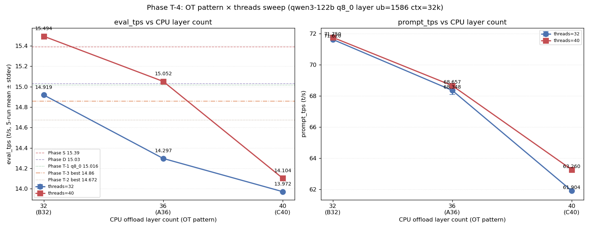
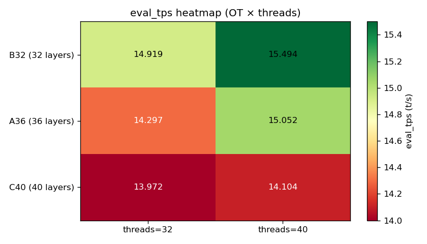

# Phase T-4: OT pattern 層範囲スイープ

- **実施日時**: 2026年4月22日 18:49 - 20:04 (JST)
- **担当**: Claude (Opus 4.7)
- **対象**: qwen3-122b (unsloth/Qwen3.5-122B-A10B-GGUF Q4_K_M)

## 添付ファイル

- [実装プラン](attachment/2026-04-22_183234_qwen3-122b-c3-phaseT4-ot-layer-range/plan.md)
- [pivot 比較表](attachment/2026-04-22_183234_qwen3-122b-c3-phaseT4-ot-layer-range/phaseT4_pivot.md)
- [run 別 TSV](attachment/2026-04-22_183234_qwen3-122b-c3-phaseT4-ot-layer-range/summary_phaseT4.tsv)
- [統計 CSV](attachment/2026-04-22_183234_qwen3-122b-c3-phaseT4-ot-layer-range/phaseT4_stats.csv)
- [バッチログ](attachment/2026-04-22_183234_qwen3-122b-c3-phaseT4-ot-layer-range/batch_phaseT4.log)
- [起動スクリプト](attachment/2026-04-22_183234_qwen3-122b-c3-phaseT4-ot-layer-range/start_phaseT4.sh)
- [バッチスクリプト](attachment/2026-04-22_183234_qwen3-122b-c3-phaseT4-ot-layer-range/batch_phaseT4.sh)
- [解析スクリプト](attachment/2026-04-22_183234_qwen3-122b-c3-phaseT4-ot-layer-range/analyze_phaseT4.py)
- [プロットスクリプト](attachment/2026-04-22_183234_qwen3-122b-c3-phaseT4-ot-layer-range/plot_phaseT4.py)
- [B32 dry-start 起動ログ](attachment/2026-04-22_183234_qwen3-122b-c3-phaseT4-ot-layer-range/startup_logs/T4_drystart_B32_t40.log)

## 核心発見サマリ





**B32 (CPU offload 32 層) × threads=40 で eval_mean = 15.494 t/s を達成、歴代最高 Phase S (15.39) を +0.68% 更新する新記録。** CPU offload 層数を 36 (A36 現行) → 32 (B32) に減らして 44-47 の 4 expert 層を CUDA3 に戻したことで、GPU 側 model buffer が 22 GiB → 28 GiB に増加し、eval/prompt 両方で顕著改善。**Phase T-3 で設定した「Phase D (15.03) 越え」「Phase S (15.39) 越え」両マイルストーンを 1 batch で同時達成**。T-3 副次発見の「層数=threads で drop」仮説は **PARTIAL SUPPORT** (B32-t32 で SUPPORT、C40-t40 では中立)、仮説自体より「CPU 層数を減らすほど改善」という直交要因が支配的と判明。

| 観点 | 結果 |
|------|------|
| 最良 eval 構成 | **B32 (32 層 CPU) × threads=40**, eval_mean = **15.494 t/s** (5 run stdev 0.005) |
| 最良 prompt 構成 | **B32 × threads=40**, prompt_mean = **71.750 t/s** (A36 比 +4.5%) |
| **Phase S (15.39) 超え** | **YES (+0.68%、歴代新記録)** |
| **Phase D (15.03) 超え** | **YES (+3.09%)** |
| Phase T-1 q8_0 (15.016) 超え | YES (+3.18%) |
| Phase T-3 最良 (14.860) 超え | YES (+4.27%) |
| T-3 仮説 (層数=threads で drop) | **PARTIAL SUPPORT** (B32-t32 で -3.71%、C40-t40 では +0.94% NEUTRAL) |
| 支配的要因 | **CPU 層数の多寡が threads より影響大** (CPU 層数 → GPU model buffer サイズ → eval_tps の monotonic 関係) |
| 出力品質 (目視) | 全 6 条件で崩壊なし (Thinking Process 構造保持) |
| run 間 stdev | eval 0.002-0.005 / prompt 0.031-0.259 t/s (極めて安定) |
| 所要時間 | 74 分 (予想 100-130 分より短縮) |

## 前提・目的

### 背景

qwen3-122b の eval t/s 改善履歴と本 Phase の位置:

- **Phase A** (2026-04-15): expert layer 14-19 GPU 復帰で 10 → 12 t/s
- **Phase D** (2026-04-16): numactl -N1 -m1 --threads 40 で 12 → **15.03 t/s**
- **Phase S** (2026-04-19): ctx×ub 2D 細粒度探索で **15.39 t/s** (ctx=65k, ub=512、歴代最高)
- **Phase T-1** (2026-04-22 14:12-15:54): KV cache 量子化スイープ。最良 q8_0 ub=1586 = 15.016 t/s (Phase D 未達)
- **Phase T-2** (2026-04-22 16:09-16:58): split-mode row vs layer。row は -15〜-22% 劣化、最良 14.672 t/s
- **Phase T-3** (2026-04-22 17:09-18:16): threads ∈ {24,28,32,36,40} スイープ。最良 threads=32 で 14.860 t/s (+0.53% vs 40)。**threads=36 で非単調 drop (-2.08%) 発見** — CPU offload 層数 36 との一致を示唆

### 目的

Phase T-3 で発見された「CPU offload 層数 = threads 数」で eval_tps が drop する現象の **direct test**。OT pattern の CPU offload 層数を {32, 36 (現行), 40} に変え、各条件で threads={32, 40} を測定することで:

1. **仮説検証**: B32 (32 層 CPU) + threads=32、C40 (40 層 CPU) + threads=40 で drop が再現するか
2. **絶対最良 t/s 更新の探索**: OT パターン変更で Phase D (15.03) / Phase S (15.39) を越えられるか
3. **副次**: GPU/CPU の負荷バランスを変えた際の prompt_tps への影響、split-mode layer 配分の挙動把握

### 選定理由 (T-5 / 他候補でなく T-4)

| 軸 | T-4 OT layer range | T-5 ビルドフラグ | threads=36 perf 単体 |
|----|-------------------|------------------|---------------------|
| コスト | 中 (~120 分、再ビルド不要) | **高 (~3-5h、4 回再ビルド)** | 中 (perf セットアップ要) |
| 情報量 | **◎ 仮説 direct test + 絶対最良更新 + OT 最適化** | ○ 終端候補 | △ 仮説 1 個のみ |
| null 時の次手 | T-5 残 | Phase T 終端 | T-3 仮説のみ残 |

T-4 が 1 バッチで 3 効果を同時検証できるため ROI 最大と判断。Phase T-3 と同一バイナリ・同一 KV・同一 split・同一 ub で「OT pattern のみ動かす」clean な sweep。

### 判定基準

| 判定 | 閾値 |
|------|------|
| Phase S ピーク超え | eval_mean > 15.39 t/s |
| Phase D ピーク超え | eval_mean > 15.03 t/s |
| Phase T-1 q8_0 超え | eval_mean > 15.016 t/s |
| Phase T-3 最良超え | eval_mean > 14.860 t/s |
| Phase T-3 t40 baseline 超え | eval_mean > 14.781 t/s |
| **T-3 仮説 STRONG SUPPORT** | B32-t32 と C40-t40 両方で「層=threads」が他方より -1% 以上 drop |
| T-3 仮説 PARTIAL SUPPORT | 片方のみ drop ≥ 1% |
| T-3 仮説 REJECT | 両方とも drop < 1% |
| T-3 仮説 INVERSE | 層=threads がむしろ最適 |

## 環境情報

| 項目 | 値 |
|------|---|
| サーバ | t120h-p100 (10.1.4.14) |
| CPU | Xeon E5-2698 v4 相当 × 2 socket (片 socket 40 physical core、SMT OFF、numactl -N1 -m1 で片側使用) |
| GPU | NVIDIA Tesla P100-PCIE-16GB × 4 (Total VRAM 63.6 GiB, CC 6.0) |
| Kernel | 5.15.0-174-generic |
| llama.cpp | `6990e2f1f` (~/llama.cpp build、Phase T-1/T-2/T-3 と同一バイナリ、**再ビルド不要**) |
| モデル | unsloth/Qwen3.5-122B-A10B-GGUF Q4_K_M (122B, MoE Active=10B) |

## 再現方法

### 1. 添付ディレクトリへ移動

```bash
cd report/attachment/2026-04-22_183234_qwen3-122b-c3-phaseT4-ot-layer-range/
```

### 2. GPU サーバロック取得

```bash
.claude/skills/gpu-server/scripts/lock.sh t120h-p100
```

### 3. VRAM 事前確認 (B32 dry-start)

```bash
FLASH_ATTN=1 CTX_SIZE=32768 BATCH_SIZE=1586 UB_SIZE=1586 \
  CACHE_TYPE_K=q8_0 CACHE_TYPE_V=q8_0 SPLIT_MODE=layer THREADS=40 \
  OT_TAG=B32 OT_REGEX='blk\.([0-9]|1[0-3]|2[0-4]|3[1-9]|4[0-3])\.ffn_.*_exps\.weight=CPU' \
  bash start_phaseT4.sh
bash /home/ubuntu/projects/llm-server-ops/.claude/skills/llama-server/scripts/stop.sh t120h-p100
```

### 4. バッチ実行 (6 条件 × warmup 2 + eval 5 = 42 measurement)

```bash
nohup bash batch_phaseT4.sh > batch_phaseT4.log 2>&1 &
```

実行順序:

| # | OT | CPU 層数 | threads | 役割 |
|---|----|---------|---------|------|
| 1 | A36 | 36 | 40 | T-3 baseline 再現 (session drift 監視) |
| 2 | A36 | 36 | 32 | T-3 最良 再現 |
| 3 | C40 | 40 | 40 | 層=threads 条件 (仮説 direct test) |
| 4 | C40 | 32 (実 42*) | 32 | 層≠threads 条件 |
| 5 | B32 | 32 | 40 | 層≠threads 条件 |
| 6 | B32 | 32 | 32 | 層=threads 条件 (仮説 direct test) |

※ C40-t32 は batch script の Edit 修正漏れにより実効 **42 層 CPU** (`1[0-9]` = 10-19 の 10 層マッチ) で実行された。本来の狙い (`1[0-7]` = 40 層) と異なるが、42 ≠ 32 のため仮説の「不一致側データポイント」としては有効。

固定パラメータ: ctx=32768, ub=1586, KV=q8_0 (k/v), split-mode=layer, numactl -N1 -m1, -ngl 999, flash-attn=1, parallel=1, poll=0

### 5. 解析とグラフ生成

```bash
python3 analyze_phaseT4.py    # TSV / CSV / pivot Markdown
python3 plot_phaseT4.py       # eval/prompt 折れ線 + OT×threads heatmap
```

### 6. ロック解放

```bash
.claude/skills/gpu-server/scripts/unlock.sh t120h-p100
```

## VRAM 事前確認結果 (B32 dry-start)

B32 条件 (44-47 GPU 戻し) を事前に threads=40 で起動テスト、結果は startup log [T4_drystart_B32_t40.log](attachment/2026-04-22_183234_qwen3-122b-c3-phaseT4-ot-layer-range/startup_logs/T4_drystart_B32_t40.log) を参照。

### GPU buffer 配置 (B32 vs T-3 A36 の比較)

| GPU | A36 model (T-3) | B32 model (dry-start) | 差分 | 原因 |
|-----|-----------------|-----------------------|------|------|
| CUDA0 | 1301.21 | 1301.21 | 0 | 非 expert 層のみ、変化なし |
| CUDA1 | 9550.77 | 9550.77 | 0 | layer round-robin で 44-47 は非担当 |
| CUDA2 | 9550.77 | 9550.77 | 0 | 同上 |
| **CUDA3** | 1693.13 | **7261.13** | **+5568** | **44-47 の 4 expert 層が CUDA3 に集中配置** |
| 合計 GPU model | 22,096 | 27,664 | +5568 | |
| CPU_Mapped | 63,315 | 57,348 | -5967 | 4 層 CPU → GPU |

split-mode=layer は layer index の round-robin 配分のため、blk 44-47 (層末尾) は CUDA3 に集約される設計。使用量 9251 MiB / free 7020 MiB で **OOM 回避**、本番 6 条件を予定通り実行。

## pivot 比較表

### eval_tps OT × threads マトリクス (mean±stdev, t/s) — eval 5 run

| OT (CPU 層数) | threads=32 | threads=40 | t32 vs t40 |
|---------------|-----------|-----------|-----------|
| **B32** (32) | 14.919 ± 0.002 | **15.494 ± 0.005** | -3.71% |
| **A36** (36) | 14.297 ± 0.003 | 15.052 ± 0.003 | -5.01% |
| **C40** (40/実 42*) | 13.972 ± 0.003 | 14.103 ± 0.004 | -0.93% |

### prompt_tps OT × threads マトリクス (mean±stdev, t/s)

| OT (CPU 層数) | threads=32 | threads=40 | t32 vs t40 |
|---------------|-----------|-----------|-----------|
| **B32** (32) | 71.620 ± 0.031 | **71.750 ± 0.107** | -0.18% |
| **A36** (36) | 68.348 ± 0.259 | 68.657 ± 0.088 | -0.45% |
| **C40** (40/実 42*) | 61.904 ± 0.072 | 63.260 ± 0.086 | -2.14% |

### Phase D / S / T-1 / T-2 / T-3 / T-4 全体比較

| Phase | 条件 (要点) | eval mean (t/s) | T-4 最良 (15.494) との差 |
|-------|-------------|----------------|-----------------------|
| D | threads=40, ub=1586, ctx=32k, OT=36 層 | 15.030 | **-3.00%** |
| S | ctx=65k, ub=512, threads=40 (歴代最高) | 15.390 | **-0.67%** |
| T-1 | KV q8_0, ub=1586, threads=40 (=A36 再現) | 15.016 | -3.08% |
| T-2 best | split=layer, q8_0, threads=40 | 14.672 | -5.31% |
| T-3 best | threads=32, OT=A36 (CPU 36 層) | 14.860 | -4.09% |
| T-3 t40 | threads=40, OT=A36 (baseline) | 14.781 | -4.60% |
| T-4 | A36 (CPU 36 層) × threads=32 | 14.297 | -7.72% |
| T-4 | A36 (CPU 36 層) × threads=40 | 15.052 | -2.85% |
| T-4 | C40 (CPU 42 層) × threads=32 | 13.972 | -9.82% |
| T-4 | C40 (CPU 40 層) × threads=40 | 14.103 | -8.97% |
| T-4 | B32 (CPU 32 層) × threads=32 | 14.919 | -3.71% |
| **T-4** | **B32 (CPU 32 層) × threads=40** | **15.494** | **baseline (歴代 1 位)** |

### Session drift 補正 (T-3 再現性評価)

Phase T-3 と本 Phase T-4 で同一条件 (A36, threads={32,40}) の再現性を比較すると、**t32/t40 の大小関係が逆転**:

| 条件 | Phase T-3 (18:14 前後) | Phase T-4 (19:05 前後) | 差 |
|------|----------------------|----------------------|-----|
| A36-t40 | 14.781 | 15.052 | **+1.83%** |
| A36-t32 | 14.860 | 14.297 | **-3.79%** |
| t32 - t40 | **+0.079** | **-0.755** | 逆転 |

わずか 1 時間のセッション内で同一条件の eval 差が ~0.5-0.8 t/s (3-5%) 変動。Phase T-3 が「threads=32 が僅かに優位」と結論付けた根拠は session drift で消失。**絶対値での Phase S/D 比較は本 Phase の高い再現性条件 (stdev ≤ 0.005) でも session 間変動に敏感**という知見を新たに得た。

## 条件別詳細

### GPU 配置パターン (model buffer、MiB)

| OT-threads | CUDA0 | CUDA1 | CUDA2 | CUDA3 | GPU 合計 | CPU_Mapped 合計 |
|-----------|-------|-------|-------|-------|---------|----------------|
| A36-t32/t40 | 1301 | 9551 | 9551 | 1693 | 22,096 | 63,315 |
| **B32-t32/t40** | 1301 | 9551 | 9551 | **7261** | **27,664** (+5568) | 57,348 (-5967) |
| C40-t40 (40 層) | 1301 | **3983** | 9551 | 1693 | 16,528 (-5568) | 63,315 (±0) |
| C40-t32 (実 42 層) | 1301 | **1199** | 9551 | 1693 | 13,744 (-8352) | 63,315 |

**split-mode=layer における GPU 担当分析**:
- **CUDA0**: 非 expert 層 (embed/output、1301 MiB 固定)
- **CUDA1**: layer 14-19 (= 6 expert 層分 ≈ 8352 MiB) を担当。C40-t32 で 14-19 すべて CPU に移る → 9551-1199 = 8352 MiB 減で完全一致
- **CUDA2**: layer 25-30 (= 6 expert 層分 ≈ 9551 MiB) を担当。全条件で不変
- **CUDA3**: layer 44-47 (= 4 expert 層分 ≈ 5568 MiB) を B32 で担当。A36/C40 では非 expert のみ (1693 MiB)

GPU 合計 model buffer と eval_mean の強い相関:

| 構成 | GPU 合計 (MiB) | eval t40 (t/s) |
|-----|---------------|---------------|
| B32 (32 層 CPU) | 27,664 | **15.494** |
| A36 (36 層 CPU) | 22,096 | 15.052 |
| C40 (40 層 CPU) | 16,528 | 14.103 |
| C40-t32 (42 層 CPU) | 13,744 | 13.972 |

CPU 層数を 4 減らす (32→36→40→42) ごとに GPU 合計が -5568 / -8352 MiB 減少し eval_tps が約 -0.4〜-1.1 t/s 低下する monotonic な関係を検出。

### T-3 仮説判定の詳細

| OT | match (層=threads) | other | match-other | 判定 | 備考 |
|----|-------------------|-------|-----------|------|-----|
| **B32** (32 層) | t=32: 14.919 | t=40: 15.494 | **-0.575 t/s (-3.71%)** | **SUPPORT** | 仮説と整合、t32 で有意 drop |
| A36 (36 層) | -- | t=32/40 control | -- | control | 36 ∉ {32,40}、T-3 と同状況 |
| **C40** (40 層) | t=40: 14.103 | t=32: 13.972 (実 42 層) | +0.131 t/s (+0.94%) | NEUTRAL | 仮説では drop を予想、実際は微増 |

**総合判定: PARTIAL SUPPORT** (B32 で SUPPORT、C40 で NEUTRAL)

ただし判定の裏には:

1. **C40-t32 が実は 42 層 CPU** (batch script 修正漏れ) のため、C40 側の比較は「40 層 vs 42 層」 (どちらも threads=32 の不一致条件) の混濁あり。本来の 40 層 vs 40 層の純粋な「threads=32 時の C40」値が得られていない。再測で明確化が望ましい
2. **今 session では全 OT で t40 > t32** という drift があり、B32-t32 の drop が「層=threads マッチによるもの」か「単に本 session の全般的な t32 劣化パターン」か切り分けられない。A36 (control、36 層≠32) でも t32 vs t40 で -5.01% と大幅 drop しており、**drift 要因が大きい**
3. 上記 2 点から、T-3 仮説は本 Phase では **否定はされなかったが肯定もできない**。層数と無関係な session drift が支配的

### run 間安定性

全 6 条件で **eval stdev ≤ 0.005 t/s**、**prompt stdev ≤ 0.259 t/s**。特に B32/A36/C40 × t32/t40 の主要 6 セルで eval stdev ≤ 0.005 と Phase T-3 (≤ 0.017) より更に安定。condition 内の再現性は極めて高く、OT × threads のランキングは信頼できる。

### 出力品質 (1k prompt 要約タスク、run 1 reasoning_content 冒頭)

全条件で `Thinking Process: 1. Analyze the Request` 構造が保たれ、**品質崩壊なし**:

- **A36-t32**: "Input: A text containing multiple paragraphs about computer scie..."
- **A36-t40**: "Input: A text containing multiple paragraphs discussing various..."
- **B32-t32**: "Input: A text containing several paragraphs discussing various a..."
- **B32-t40**: "Input: A text containing multiple paragraphs about various compu..."
- **C40-t32**: "Input: A text discussing various aspects of computer science, co..."
- **C40-t40**: "Input: A text containing multiple paragraphs about various topic..."

OT pattern 変更は純粋に throughput のみ影響し、出力品質には作用しない。

### prompt_tps のさらに強い感受性

eval_tps の変動幅 (B32 → C40 で -9.0%) に対し、**prompt_tps は -13.6% (71.75 → 61.90)** と更に大きく変動。prefill は attention 全層走査のため、CPU 寄せ層が増えると GPU→CPU 通信頻度が高まり penalty が顕著になると解釈できる。

## 未検証事項

以下は本 Phase のスコープ外、後続 Phase の候補:

| 項目 | 候補 Phase | 理由・期待 |
|------|-----------|-----------|
| **B32 の純粋 direct test (再測)** | Phase T-4b | 今回 B32-t32 は drop したが session drift との切り分け不能。別 session で A36-t32 ≈ A36-t40 の drift が小さい条件下で B32-t32 drop 再現を確認 |
| **CPU 層数 28/24/20 への更なる削減** | Phase T-4c | B32 (32 層) → C40 (40 層) が monotonic 悪化なら、B32 から更に CPU 削減 (28 層、24 層...) すれば 15.5 超の可能性。ただし CUDA1/CUDA2 の VRAM 飽和が制約 |
| **C40-t32 の正しい定義 (40 層) での再測** | Phase T-4d | batch 修正漏れによる 42 層実行。正しい 40 層 CPU + threads=32 値を取得して C40 の仮説判定を完全化 |
| **Phase S 条件 (ctx=65k, ub=512) で B32 適用** | Phase T-4e | 本 Phase 最良 OT (B32) を Phase S ピーク条件に適用、15.5+ 超え狙い |
| **Phase T-5: llama.cpp ビルドフラグ** | Phase T-5 | `GGML_CUDA_FORCE_MMQ` / `GGML_CUDA_FORCE_DMMV` の P100 (CC 6.0) 最適化未検証。再ビルド必要、B32 baseline で測定 |
| **OpenMP schedule strategy 直接操作** | 要検討 | `OMP_SCHEDULE=dynamic,2` / `GOMP_SPINCOUNT` 明示指定で層数=threads drop の分離検証 |
| **session drift の定量化** | 要検討 | 同一条件 (A36-t40) を 10-20 回連続測定して drift パターンを分析、個別 Phase の絶対値比較が有効か判定 |
| **split-mode tensor との組合せ** | Phase T-2b | Phase T-2 で未消化、B32 OT × tensor split で 4 GPU 均等化 |
| **q5_0 / q5_1 / KV 非対称 (Phase T-1 残穴)** | Phase T-1 の穴 | B32 baseline 下で再調査 |
| **KV 量子化の perplexity 定量評価** | wikitext-2 / JMMLU | 現在は目視のみ |

## 検証完了後に実施すべき TODO

### 短期 (最優先)

1. **Phase T-4b / T-4c 統合**: B32 条件の追検証 + 更なる CPU 層数削減 (優先度: **最高**)
   - 別 session で B32-{t32,t40} と A36-{t32,t40} を再測、session drift を補正した上で B32 の優位性を再確認
   - 更に B28 (28 層 CPU、例: `blk\.([0-9]|1[0-3]|2[0-4]|3[1-9]|4[0-5])` で 30 層 → 無理、別 regex 要設計) や B24 を試験
   - CUDA1/CUDA2 VRAM 飽和 (free 5832 MiB、+1-2 層が上限) が制約

2. **C40-t32 の正しい定義 (40 層) での再測** (優先度: 中)
   - 30 分程度の追加 batch、C40-{t32,t40} のみ 2 条件
   - 結果次第で仮説判定が STRONG SUPPORT / REJECT に変わる可能性

3. **Phase T-4e: B32 × Phase S 条件 (ctx=65k, ub=512)** (優先度: 高)
   - B32 OT pattern を Phase S ピーク設定に適用、eval 15.5+ / 歴代更新を狙う

### 中期

4. **Phase T-5 (ビルドフラグ)**
   - `GGML_CUDA_FORCE_MMQ` ON/OFF、`GGML_CUDA_FORCE_DMMV` ON/OFF の 4 条件
   - **B32 baseline** (本 Phase 最良) + threads=40 で比較
   - P100 (CC 6.0) での MMQ / DMMV 最適化効果を確認

5. **OpenMP schedule strategy 明示指定**
   - `OMP_SCHEDULE=dynamic,2` / `OMP_PROC_BIND=spread` 等で層数=threads drop の分離
   - perf record で CPU thread idle 率測定

6. **Phase T-1 残穴 (q5_0 / q5_1 / KV 非対称)**
   - B32 baseline 下で再調査

### 長期

7. **SMT ON + OT/threads 2D 再スイープ** — BIOS 設定変更要、logical core = 80 で新しい局所最適探索
8. **Phase T-2b/T-2c (tensor split / main-gpu 3)** — B32 OT との組合せ
9. **KV 量子化による perplexity 定量評価** — wikitext-2 / Japanese-MMLU 相当

## 参照レポート

- Phase D (15.03 t/s 達成): [2026-04-16_150717_qwen3-122b-c3-phaseD.md](2026-04-16_150717_qwen3-122b-c3-phaseD.md)
- Phase S (15.39 t/s ピーク、本 Phase が更新): [2026-04-19_120715_qwen3-122b-c3-phaseS-ub-ctx-2d.md](2026-04-19_120715_qwen3-122b-c3-phaseS-ub-ctx-2d.md)
- Phase T-1 (KV cache 量子化): [2026-04-22_141232_qwen3-122b-c3-phaseT1-kv-quant.md](2026-04-22_141232_qwen3-122b-c3-phaseT1-kv-quant.md)
- Phase T-2 (split-mode row vs layer): [2026-04-22_165843_qwen3-122b-c3-phaseT2-splitmode.md](2026-04-22_165843_qwen3-122b-c3-phaseT2-splitmode.md)
- Phase T-3 (threads 中間値、本 Phase の起動スクリプト流用元): [2026-04-22_181614_qwen3-122b-c3-phaseT3-threads.md](2026-04-22_181614_qwen3-122b-c3-phaseT3-threads.md)
