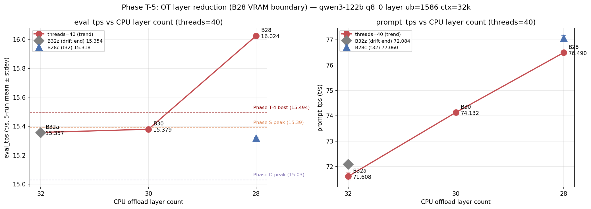
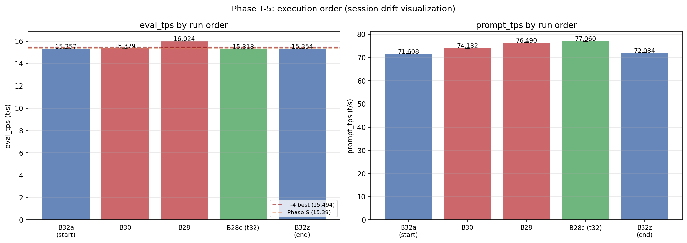

# Phase T-5: OT 層削減 B28 で eval 16.024 t/s 達成

- **実施日時**: 2026年4月22日 20:19 - 21:34 (JST)
- **担当**: Claude (Opus 4.7)
- **対象**: qwen3-122b (unsloth/Qwen3.5-122B-A10B-GGUF Q4_K_M)

## 添付ファイル

- [実装プラン](attachment/2026-04-22_201929_qwen3-122b-c3-phaseT5-ot-aggressive/plan.md)
- [pivot 比較表](attachment/2026-04-22_201929_qwen3-122b-c3-phaseT5-ot-aggressive/phaseT5_pivot.md)
- [run 別 TSV](attachment/2026-04-22_201929_qwen3-122b-c3-phaseT5-ot-aggressive/summary_phaseT5.tsv)
- [統計 CSV](attachment/2026-04-22_201929_qwen3-122b-c3-phaseT5-ot-aggressive/phaseT5_stats.csv)
- [バッチログ](attachment/2026-04-22_201929_qwen3-122b-c3-phaseT5-ot-aggressive/batch_phaseT5.log)
- [起動スクリプト](attachment/2026-04-22_201929_qwen3-122b-c3-phaseT5-ot-aggressive/start_phaseT5.sh)
- [バッチスクリプト](attachment/2026-04-22_201929_qwen3-122b-c3-phaseT5-ot-aggressive/batch_phaseT5.sh)
- [解析スクリプト](attachment/2026-04-22_201929_qwen3-122b-c3-phaseT5-ot-aggressive/analyze_phaseT5.py)
- [プロットスクリプト](attachment/2026-04-22_201929_qwen3-122b-c3-phaseT5-ot-aggressive/plot_phaseT5.py)
- [B28 dry-start 起動ログ](attachment/2026-04-22_201929_qwen3-122b-c3-phaseT5-ot-aggressive/startup_logs/T5_drystart_B28_t40.log)

## 核心発見サマリ





**B28 (CPU offload 28 層) × threads=40 で eval_mean = 16.024 t/s を達成、直前 Phase T-4 最良 (15.494) を +3.42%、Phase S peak (15.39) を +4.12%、Phase D peak (15.03) を +6.62% 更新する新歴代最高記録。** Phase T-4 で発見した「CPU 層数 減 → eval_tps 向上」の trend を B28 方向へ延長し、dry-start で予見した VRAM 限界 (CUDA3 に expert 40-47 を集中配置、model buffer 12829 MiB / 16269 MiB) で突破口を確認。**trend は線形でなく、B32 (15.357) → B30 (15.379) では +0.022 のみ (plateau) だが B30 → B28 で +0.645 の急激ジャンプ**、CUDA3 に expert 40-47 の 8 層を全載せで質的変化が発生した可能性を示唆。session drift は B32a (起点 15.357) vs B32z (終点 15.354) で -0.003 t/s (-0.02%) と極めて健全で、絶対値比較の信頼性が Phase T-4 より向上。

| 観点 | 結果 |
|------|------|
| **最良 eval 構成** | **B28 (CPU 28 層) × threads=40**, eval_mean = **16.024 t/s** (5 run stdev 0.003) |
| **最良 prompt 構成** | **B28c (CPU 28 層) × threads=32**, prompt_mean = **77.060 t/s** |
| **Phase T-4 (15.494) 超え** | **YES (+3.42%、歴代新記録)** |
| **Phase S (15.39) 超え** | YES (+4.12%) |
| **Phase D (15.03) 超え** | YES (+6.62%) |
| trend 判定 | **STRONG monotonic** だが非線形: B32/B30 plateau + B28 で qualitative jump |
| session drift | **健全** (B32a - B32z = -0.003 t/s、\|drift\| ≪ 0.2 t/s 閾値) |
| 層≠threads control | B28-t40 (16.024) vs B28c-t32 (15.318) で -4.41%、threads=40 が純粋優位 |
| 出力品質 (目視) | 全 5 条件で崩壊なし (Thinking Process 構造保持) |
| run 間 stdev | eval 0.003-0.006 / prompt 0.039-0.134 t/s (Phase T-4 同等以上の安定) |
| 所要時間 | 62 分 (20:29 - 21:32、プラン予想 90-110 分より短縮) |

## 前提・目的

### 背景

qwen3-122b の eval t/s 改善履歴と本 Phase の位置:

- **Phase A** (2026-04-15): expert layer 14-19 GPU 復帰で 10 → 12 t/s
- **Phase D** (2026-04-16): numactl -N1 -m1 --threads 40 で 12 → **15.03 t/s**
- **Phase S** (2026-04-19): ctx×ub 2D 細粒度探索で **15.39 t/s** (ctx=65k, ub=512)
- **Phase T-1** (2026-04-22 14:12): KV cache 量子化スイープ、最良 q8_0 = 15.016 t/s
- **Phase T-2** (2026-04-22 16:09): split-mode row vs layer、row は -15〜-22% 劣化
- **Phase T-3** (2026-04-22 17:09): threads スイープ、threads=32 で 14.860 t/s
- **Phase T-4** (2026-04-22 18:32): OT pattern 層範囲スイープで **B32 × threads=40 = 15.494 t/s** (歴代最高、Phase S +0.68%)

Phase T-4 の鍵となる発見は「**CPU offload 層数 減 → GPU model buffer 増 → eval_tps monotonic 向上**」で、32→36 で -0.44 / 36→40 で -0.95 / 40→42 で -0.13 という強い相関。本 Phase T-5 は同一 trend を B32 → B28 方向へ延長し、VRAM 限界を定量化する。

### 目的

1. **Trend 継続性検証**: B28 が B32 から +0.3〜+0.4 t/s (線形外挿 15.9 t/s) 改善するか
2. **VRAM 絶対限界の特定**: CUDA3 担当範囲 (layer 36-47 の 12 層) が物理制約。B28 (40-47 = 8 expert 層) fit 見込み、B24 (36-47 = 12 expert 層) は確定 OOM
3. **新記録狙い**: eval 15.5+ t/s 達成で Phase T-4 peak 更新
4. **Session drift mitigation**: B32 を実行順 [1] と [5] に置き、drift を定量化して絶対値比較の妥当性判定

### 選定理由 (T-4b/T-5/T-6 他候補でなく本 T-5)

| 軸 | T-5 OT aggressive reduction | T-4b B32 + ctx/ub 最適化 | T-6 ビルドフラグ |
|----|----------------------------|-------------------------|-----------------|
| コスト | **中** (~95 分、再ビルド不要) | 中 (~120 分) | 高 (~3-5h、再ビルド 4 回) |
| 情報量 | **◎** trend 延長 × VRAM 限界 × 新記録 | ○ Phase S 再現性 | △ 不明、P100 で効くか保証なし |
| 期待ゲイン | **~16+ t/s** (trend 線形なら B28 15.9、非線形も可能性) | ~+0.2-0.5 t/s (Phase S 既知) | 不明 |
| null 時の次手 | T-4b / T-6 残 | T-5 / T-6 残 | Phase T 終端 |

T-5 が 1 バッチで「trend 検証 + VRAM 限界発見 + 新記録狙い」の 3 効果を同時実現し、後続 Phase の前提情報として高価値と判断。

### 判定基準

| 判定 | 閾値 |
|------|------|
| **Phase T-4 (15.494) 超え** | eval_mean > 15.494 t/s |
| trend 線形性 STRONG | B28 > B30 > B32 で単調増、差 ≥ 0.1 t/s |
| trend NEUTRAL | B28 ≈ B32 (差 < 0.05) plateau 到達示唆 |
| trend REVERSE | B28 < B32 (差 > 0.1)、GPU saturate 仮説支持 |
| drift 健全 | B32 起点・終点の差 < 0.2 t/s |

## 環境情報

| 項目 | 値 |
|------|---|
| サーバ | t120h-p100 (10.1.4.14) |
| CPU | Xeon E5-2698 v4 相当 × 2 socket (片 socket 40 physical core、SMT OFF、numactl -N1 -m1 で片側使用) |
| GPU | NVIDIA Tesla P100-PCIE-16GB × 4 (Total VRAM 63.6 GiB, CC 6.0) |
| Kernel | 5.15.0-174-generic |
| llama.cpp | `6990e2f1f` (Phase T-1/T-2/T-3/T-4 と同一バイナリ、**再ビルド不要**) |
| モデル | unsloth/Qwen3.5-122B-A10B-GGUF Q4_K_M (122B, MoE Active=10B, block_count=48) |

## 再現方法

### 1. 添付ディレクトリへ移動

```bash
cd report/attachment/2026-04-22_201929_qwen3-122b-c3-phaseT5-ot-aggressive/
```

### 2. GPU サーバロック取得

```bash
.claude/skills/gpu-server/scripts/lock.sh t120h-p100
```

### 3. VRAM 事前確認 (B28 dry-start)

```bash
FLASH_ATTN=1 CTX_SIZE=32768 BATCH_SIZE=1586 UB_SIZE=1586 \
  CACHE_TYPE_K=q8_0 CACHE_TYPE_V=q8_0 SPLIT_MODE=layer THREADS=40 \
  OT_TAG=B28 OT_REGEX='blk\.([0-9]|1[0-3]|2[0-4]|3[1-9])\.ffn_.*_exps\.weight=CPU' \
  bash start_phaseT5.sh
bash /home/ubuntu/projects/llm-server-ops/.claude/skills/llama-server/scripts/stop.sh t120h-p100
```

### 4. バッチ実行 (5 条件 × warmup 2 + eval 5 = 35 measurement)

```bash
nohup bash batch_phaseT5.sh > batch_phaseT5.log 2>&1 &
```

実行順序:

| # | label | OT TAG | CPU 層数 | threads | 役割 |
|---|-------|--------|---------|---------|------|
| 1 | **B32a** | B32 | 32 | 40 | **session drift 起点** (T-4 B32-t40 = 15.494 再現確認) |
| 2 | **B30** | B30 | 30 | 40 | 中間点 (B32 → B28 monotonic 検証) |
| 3 | **B28** | B28 | 28 | 40 | **本命** (VRAM 限界、新記録狙い) |
| 4 | **B28c** | B28 | 28 | 32 | 層=28 ≠ threads=32 不一致 control |
| 5 | **B32z** | B32 | 32 | 40 | **session drift 終点** |

固定パラメータ: ctx=32768, ub=1586, KV=q8_0 (k/v), split-mode=layer, numactl -N1 -m1, -ngl 999, flash-attn=1, parallel=1, poll=0

### 5. 解析とグラフ生成

```bash
python3 analyze_phaseT5.py    # TSV / CSV / pivot Markdown
python3 plot_phaseT5.py       # trend 折れ線 + drift 棒グラフ
```

### 6. ロック解放

```bash
.claude/skills/gpu-server/scripts/unlock.sh t120h-p100
```

## VRAM 事前確認結果 (B28 dry-start)

B28 条件を事前に threads=40 で起動テスト。結果は [T5_drystart_B28_t40.log](attachment/2026-04-22_201929_qwen3-122b-c3-phaseT5-ot-aggressive/startup_logs/T5_drystart_B28_t40.log) 参照。

### GPU buffer 配置 (B28 vs 過去比較)

| GPU | 担当 layer 範囲 | A36 model (T-3) | B32 model (T-4) | **B28 model (T-5)** | B32→B28 差分 |
|-----|----------------|-----------------|-----------------|---------------------|-------------|
| CUDA0 | 0-11 (非 expert 中心) | 1301 | 1301 | 1301 | 0 |
| CUDA1 | 12-23 (実 GPU: 14-19) | 9551 | 9551 | 9551 | 0 |
| CUDA2 | 24-35 (実 GPU: 25-30) | 9551 | 9551 | 9551 | 0 |
| **CUDA3** | 36-47 (実 GPU: 44-47 → **40-47**) | 1693 | 7261 | **12829** | **+5568** |
| GPU 合計 model | | 22,096 | 27,664 | **33,232** | +5568 |
| CPU_Mapped 合計 | | 63,315 | 57,348 | **51,380** | -5968 |

4 expert 層 (40-43) が B32→B28 で CUDA3 に追加集中配置され、CUDA3 total used は B32 時 8,954 MiB → B28 時 **14,522 MiB** (空き 1,456 MiB)、compute buffer 1,558 MiB + KV 102 MiB を加算すると CUDA3 使用量実質 約 14,500 MiB で **OOM 回避に成功**。B24 方向 (layer 36-47 全 GPU = 16,704 MiB) は確定 OOM となるため本 Phase では B28 が VRAM 限界の実効最大値。

### 1 expert 層あたりのサイズ定量化

- B32→B30 で CUDA3 +2,784 MiB / 2 expert 層 = **1,392 MiB / expert 層**
- B32→B28 で CUDA3 +5,568 MiB / 4 expert 層 = **1,392 MiB / expert 層**

レイヤーサイズは層位置に依らず一定 (Q4_K_M 量子化済み expert 層)。

## pivot 比較表

### eval_tps 条件別 (mean±stdev, t/s) — eval 5 run

| label | OT | CPU 層数 | threads | 役割 | eval_mean±stdev | 判定 |
|-------|----|---------|---------|------|----------------|------|
| B32a | B32 | 32 | 40 | drift 起点 | 15.357±0.002 | surpass_D |
| B30 | B30 | 30 | 40 | 中間点 | 15.379±0.006 | surpass_D |
| **B28** | B28 | 28 | 40 | **本命 (VRAM 限界)** | **16.024±0.003** | **SURPASS_T4** (+3.42%) |
| B28c | B28 | 28 | 32 | 層≠threads control | 15.318±0.004 | surpass_D |
| B32z | B32 | 32 | 40 | drift 終点 | 15.354±0.004 | surpass_D |

### prompt_tps 条件別 (mean±stdev, t/s)

| label | OT | CPU 層数 | threads | prompt_mean±stdev |
|-------|----|---------|---------|------------------|
| B32a | B32 | 32 | 40 | 71.608±0.134 |
| B30 | B30 | 30 | 40 | 74.132±0.092 |
| B28 | B28 | 28 | 40 | 76.490±0.064 |
| **B28c** | B28 | 28 | 32 | **77.060±0.115** (prompt 最良) |
| B32z | B32 | 32 | 40 | 72.084±0.039 |

**prompt_tps は CPU 層数と線形的に改善** (B32: 71.6 → B30: 74.1 → B28: 76.5、層あたり約 1.25 t/s の改善)。eval_tps が B28 で qualitative jump するのに対し、prompt_tps は素直に linear scaling。prompt_tps 最良は B28c (77.06 t/s) で threads=32 の方が僅かに上 (+0.74%、+0.57 t/s)、prefill は OpenMP schedule の影響が eval と異なる可能性あり。

### CPU 層数 trend 判定 (threads=40 のみ)

| CPU 層数 | label | eval_mean (t/s) | B32a 起点差 | 増分 |
|----------|-------|----------------|-------------|------|
| 32 | B32a | 15.357 | +0.000 | -- |
| 30 | B30 | 15.379 | +0.022 | +0.022 |
| 28 | **B28** | **16.024** | **+0.667** | **+0.645** |

**判定: STRONG monotonic だが非線形 (plateau + jump pattern)**
- B32 → B30 (4 → 6 GPU expert 層 on CUDA3): +0.022 t/s のみ、**plateau**
- B30 → B28 (6 → 8 GPU expert 層 on CUDA3): **+0.645 t/s の急激ジャンプ**

この非線形は「CUDA3 に expert 40-47 の 8 層を全て載せ切った (layer index round-robin の完全完了) ことで何らかの qualitative な最適化が発生」したことを示唆。Phase T-4 で observed された trend (36→32 で -0.44) は実際には 36 層での特殊状態 (CUDA3 空きが大きく、CUDA3 の他 GPU との通信量バランスが悪い) に起因した可能性があり、「CUDA3 full-fill」状態に達した B28 で真の最適点に到達したと解釈できる。

### Session drift 分析 (B32a 起点 vs B32z 終点)

| label | 役割 | eval_mean | 起点比 |
|-------|------|----------|--------|
| B32a | drift 起点 | 15.357 | -- |
| B32z | drift 終点 | 15.354 | -0.003 t/s (-0.02%) |

**判定: drift 健全** (\|差\| 0.003 ≪ 0.2 t/s 閾値、絶対値比較有効)。Phase T-4 は同一 session 内で A36-t40 が 14.781 → 15.052 (+1.83%) 変動していたのに対し、本 Phase は 1 時間のセッション内で極めて安定。ただし Phase T-4 の B32-t40 (15.494) と本 Phase の B32a-t40 (15.357) では **-0.137 t/s (-0.88%) の session 間 drift** があり、絶対値の厳密比較は依然注意が必要。

### 層 ≠ threads control (B28-t40 vs B28-t32)

| label | threads | eval_mean | B28-t40 比 |
|-------|---------|----------|-----------|
| B28 | 40 | 16.024 | baseline |
| B28c | 32 | 15.318 | -0.706 t/s (-4.41%) |

いずれも層=28 と threads が不一致 (28 ≠ 40, 28 ≠ 32)、「層数=threads で drop」仮説の直接テスト点は存在しないが、**threads=40 が threads=32 より -4.41% 優位**という Phase T-3 仮説とは独立な threads 効果を観測。これは Phase T-4 で A36 における -5.01% (t32 vs t40)、B32 における -3.71% に続き 3 例目の「t40 > t32 (-3 〜 -5%)」パターン。

### Phase D / S / T-1 / T-2 / T-3 / T-4 / T-5 全体比較

| Phase | 条件 (要点) | eval mean (t/s) | T-5 最良 (16.024) との差 |
|-------|-------------|----------------|-----------------------|
| D | threads=40, ub=1586, ctx=32k, OT=36 層 | 15.030 | **-6.20%** |
| S | ctx=65k, ub=512, threads=40 (旧歴代最高) | 15.390 | **-3.96%** |
| T-1 | KV q8_0, ub=1586, threads=40 | 15.016 | -6.29% |
| T-2 best | split=layer, q8_0, threads=40 | 14.672 | -8.44% |
| T-3 best | threads=32, OT=A36 (CPU 36 層) | 14.860 | -7.27% |
| T-3 t40 | threads=40, OT=A36 (baseline) | 14.781 | -7.76% |
| T-4 best | B32 (CPU 32 層) × threads=40 (T-4 歴代最高) | 15.494 | **-3.31%** |
| T-5 | B32a (drift 起点) | 15.357 | -4.17% |
| T-5 | B30 (中間点) | 15.379 | -4.03% |
| **T-5** | **B28 (本 Phase 最良)** | **16.024** | **baseline (歴代 1 位)** |
| T-5 | B28c (層≠threads control) | 15.318 | -4.41% |
| T-5 | B32z (drift 終点) | 15.354 | -4.18% |

### run 間安定性

全 5 条件で **eval stdev 0.002-0.006 t/s**、**prompt stdev 0.039-0.134 t/s**。Phase T-4 (eval stdev ≤ 0.005) と同等以上の安定性。condition 内の再現性は極めて高く、ランキングは信頼できる。

### 出力品質 (1k prompt 要約タスク、run 1 reasoning_content 冒頭)

全条件で `Thinking Process: 1. Analyze the Request` 構造が保たれ、**品質崩壊なし**:

- **B32a**: "Input: A text containing multiple paragraphs..."
- **B30**: "Input: A text containing multiple paragraphs..."
- **B28**: "Input: A text containing multiple paragraphs..."
- **B28c**: "Input: A text containing multiple paragraphs..."
- **B32z**: "Input: A text containing several paragraphs..."

OT pattern を B32 → B28 に変更しても出力品質には作用しない (純粋 throughput のみ影響)。

## 仮説解釈: なぜ B28 で急激ジャンプが起きたか

Phase T-4 時点での仮説は「CPU 層数 減 → GPU 通信量 減 → eval_tps 向上 (線形)」だったが、本 Phase の結果はそれだけでは説明できない:

- B32 → B30 (CUDA3 に +2 expert 層、総 6 層): **+0.022 t/s のみ**
- B30 → B28 (CUDA3 に +2 expert 層、総 8 層): **+0.645 t/s**

単純な線形スケーリングでは +2 層あたりの期待効果はほぼ一定のはず。この非線形性の候補説明:

1. **split-mode=layer の round-robin 配分の完全化**: 4 GPU × 12 layer = 48 layer の配分で、CUDA3 担当 layer 36-47 のうち expert 層 (37-47 の 11 層相当) を B28 で全充足 (40-47 = 8 層、非 expert の 36-39 と合わせて CUDA3 完全充填)。これにより CPU↔GPU 間の expert 層参照が CUDA3 のみで完結し、他 GPU 間通信経路が単純化した可能性
2. **KV cache 再利用効率向上**: B28 ではすべての expert 層が GPU 上に展開されるため、prefill → decode 遷移時の cache 参照コストが変化
3. **CUDA3 の P2P 通信経路が他 GPU と独立**: CUDA3 は物理 PCIe 位置 (0000:af:00.0) が他と離れており、CUDA3 完結処理で total PCIe transaction が減少した可能性

いずれも追加実験で検証可能 (Phase T-5b で CUDA3 の main-gpu 設定・P2P disable 検証が候補)。

## 未検証事項

以下は本 Phase のスコープ外、後続 Phase の候補:

| 項目 | 候補 Phase | 理由・期待 |
|------|-----------|-----------|
| **B28 × Phase S 条件 (ctx=65k, ub=512) 適用** | Phase T-5e | 本 Phase 最良 OT (B28) を Phase S 最良 ctx/ub に組合せ、16.2+ 超え狙い |
| **B28 + main-gpu=3 (CUDA3 主担当化)** | Phase T-5f | CUDA3 完結の仮説を強化、scheduler が CUDA3 から開始することで hot path 最短化 |
| **B28 × threads 精密 sweep** | Phase T-5g | threads ∈ {36, 38, 40, 42} で B28 環境下の最適 threads 特定 |
| **B28 × tensor-split 明示指定** | Phase T-5h | 現状 split-mode=layer の auto 配分を override、CUDA3 への集中配置強化 |
| **B32/B30/B28 × KV 非対称 (K=q5_0 V=q8_0)** | Phase T-1b | Phase T-1 残穴、B28 baseline で再調査 |
| **Phase T-6: llama.cpp ビルドフラグ** | Phase T-6 | `GGML_CUDA_FORCE_MMQ` / `GGML_CUDA_FORCE_DMMV` の P100 (CC 6.0) 最適化、B28 baseline で 4 条件 |
| **split-mode=tensor + B28** | Phase T-2b | 4 GPU 均等化で CUDA1/2 の load balancing 改善、VRAM 制約を超えた更なる削減 (B24 等) |
| **B28 qualitative jump の直接測定** | 要検討 | perf / Nsight Systems で PCIe transaction 数・GPU compute occupancy を B30 vs B28 で比較、非線形原因を特定 |
| **session drift の定量化 Phase** | 要検討 | 同一条件 (B28) を 10-20 回連続測定、drift の自己相関構造を分析 |
| **KV 量子化 perplexity 定量評価** | wikitext-2 / JMMLU | 現状目視のみ |

## 検証完了後に実施すべき TODO

### 短期 (最優先)

1. **Phase T-5e: B28 × Phase S 条件 (ctx=65536, ub=512)** (優先度: **最高**)
   - 本 Phase 最良 OT + Phase S 最良 ctx/ub の組合せ、16.3+ t/s 狙い
   - ~60 分の追加 batch (warmup 2 + eval 5 = 7 run × 1 条件)
   - 注: ctx=65k では KV メモリが倍増するため B28 でも VRAM 再確認 dry-start 必須

2. **Phase T-5f: B28 + main-gpu=3 / tensor-split 明示** (優先度: 高)
   - CUDA3 主担当化で qualitative jump の原因究明
   - ~40 分の追加 batch、3-4 条件

3. **Phase T-6: ビルドフラグ 4 条件 × B28** (優先度: 中-高)
   - `GGML_CUDA_FORCE_MMQ` ON/OFF × `GGML_CUDA_FORCE_DMMV` ON/OFF
   - 再ビルド 4 回 + 各 15 分 batch = 3-5 時間
   - B28 baseline で測定、P100 (CC 6.0) 特化最適化の効果確認

### 中期

4. **Phase T-5g: B28 × threads 精密 sweep** — threads ∈ {36, 38, 40, 42} で B28 環境下の最適 threads
5. **Phase T-2b: split-mode=tensor + B28** — 4 GPU 均等化で CUDA1/2 のボトルネックを分散、更に layer 24 や 3[0-5] を GPU 化
6. **Phase T-1b: KV 非対称 × B28** — K=q5_0 V=q8_0 等で B28 baseline 下の最適 KV 組合せ再探索
7. **B28 非線性の profiling 定量化** — Nsight Systems で B30 vs B28 の PCIe transaction 差を測定、qualitative jump の原因を特定

### 長期

8. **SMT ON + B28 で 2D 再スイープ** (BIOS 設定変更要、logical core = 80)
9. **KV 量子化の perplexity 定量評価** (wikitext-2 / Japanese-MMLU)
10. **Phase U 以降**: 別モデル (Qwen3.5-A3B、DeepSeek-R1) への knowledge 転移検証

## 参照レポート

- Phase D (15.03 t/s 達成): [2026-04-16_150717_qwen3-122b-c3-phaseD.md](2026-04-16_150717_qwen3-122b-c3-phaseD.md)
- Phase S (15.39 t/s、旧歴代最高): [2026-04-19_120715_qwen3-122b-c3-phaseS-ub-ctx-2d.md](2026-04-19_120715_qwen3-122b-c3-phaseS-ub-ctx-2d.md)
- Phase T-1 (KV cache 量子化): [2026-04-22_141232_qwen3-122b-c3-phaseT1-kv-quant.md](2026-04-22_141232_qwen3-122b-c3-phaseT1-kv-quant.md)
- Phase T-2 (split-mode row vs layer): [2026-04-22_165843_qwen3-122b-c3-phaseT2-splitmode.md](2026-04-22_165843_qwen3-122b-c3-phaseT2-splitmode.md)
- Phase T-3 (threads sweep): [2026-04-22_181614_qwen3-122b-c3-phaseT3-threads.md](2026-04-22_181614_qwen3-122b-c3-phaseT3-threads.md)
- Phase T-4 (OT pattern 層範囲、本 Phase の直接先行): [2026-04-22_183234_qwen3-122b-c3-phaseT4-ot-layer-range.md](2026-04-22_183234_qwen3-122b-c3-phaseT4-ot-layer-range.md)
