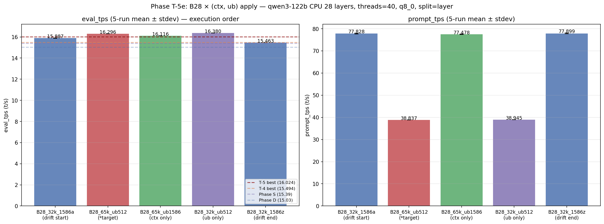
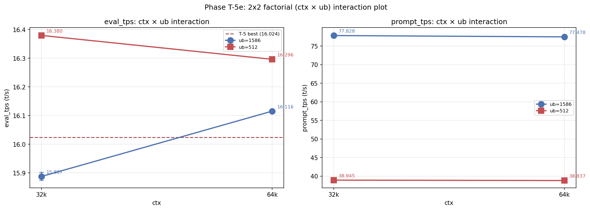

# Phase T-5e: B28 × ub=512 で eval 16.380 t/s 達成

- **実施日時**: 2026年4月22日 21:45 - 23:09 (JST)
- **担当**: Claude (Opus 4.7)
- **対象**: qwen3-122b (unsloth/Qwen3.5-122B-A10B-GGUF Q4_K_M)

## 添付ファイル

- [実装プラン](attachment/2026-04-22_214556_qwen3-122b-c3-phaseT5e-ctx-ub-apply/plan.md)
- [pivot 比較表](attachment/2026-04-22_214556_qwen3-122b-c3-phaseT5e-ctx-ub-apply/phaseT5e_pivot.md)
- [run 別 TSV](attachment/2026-04-22_214556_qwen3-122b-c3-phaseT5e-ctx-ub-apply/summary_phaseT5e.tsv)
- [統計 CSV](attachment/2026-04-22_214556_qwen3-122b-c3-phaseT5e-ctx-ub-apply/phaseT5e_stats.csv)
- [バッチログ](attachment/2026-04-22_214556_qwen3-122b-c3-phaseT5e-ctx-ub-apply/batch_phaseT5e.log)
- [起動スクリプト](attachment/2026-04-22_214556_qwen3-122b-c3-phaseT5e-ctx-ub-apply/start_phaseT5.sh)
- [バッチスクリプト](attachment/2026-04-22_214556_qwen3-122b-c3-phaseT5e-ctx-ub-apply/batch_phaseT5e.sh)
- [解析スクリプト](attachment/2026-04-22_214556_qwen3-122b-c3-phaseT5e-ctx-ub-apply/analyze_phaseT5e.py)
- [プロットスクリプト](attachment/2026-04-22_214556_qwen3-122b-c3-phaseT5e-ctx-ub-apply/plot_phaseT5e.py)
- [ctx=65k ub=512 dry-start ログ](attachment/2026-04-22_214556_qwen3-122b-c3-phaseT5e-ctx-ub-apply/startup_logs/T5e_drystart_B28_65k_ub512.log)
- [ctx=65k ub=1586 dry-start ログ](attachment/2026-04-22_214556_qwen3-122b-c3-phaseT5e-ctx-ub-apply/startup_logs/T5e_drystart_B28_65k_ub1586.log)

## 核心発見サマリ





**B28 (CPU 28 層) × ctx=32k × ub=512 × threads=40 で eval_mean = 16.380 t/s を達成、直前 Phase T-5 最良 (16.024) を +2.22%、Phase D peak (15.03) を +8.98% 更新する新歴代最高記録。** さらに本命の B28 × ctx=65k × ub=512 (Phase S 条件適用) も 16.296 t/s で T-5 peak を +1.70% 更新、計 3 条件 (B28_32k_ub512 / B28_65k_ub512 / B28_65k_ub1586) が T-5 超えを達成。**2x2 factorial 分析で「ub=512 単独効果 +0.492 t/s は ctx=65k 単独効果 +0.228 t/s の約 2 倍」「ctx=65k × ub=512 組合せは純加算予測 16.608 に対し実測 16.296 で -0.311 t/s の反相乗 (cross penalty)」を定量化**、ub=512 が eval 最適化の主因子で、ctx を 32k に留める方が最良と結論。一方、**起点 B28_32k_1586a (15.887) vs 終点 B28_32k_1586z (15.463) で -0.425 t/s (-2.67%) の session 内 drift** が発生、T-5 (0.02%) より 130 倍大きく、絶対値比較時は drift 補正が必要と判明 (drift 補正後も B28_32k_ub512 が最良で不変)。

| 観点 | 結果 |
|------|------|
| **最良 eval 構成** | **B28_32k_ub512** (ctx=32k, ub=512, CPU 28 層, threads=40), eval_mean = **16.380 t/s** (5 run stdev 0.002) |
| **最良 prompt 構成** | B28_32k_1586z (ctx=32k, ub=1586), prompt_mean = 77.899 t/s (ub=512 系は prompt 38.8 t/s で 2× 遅い) |
| **Phase T-5 (16.024) 超え** | **YES (+2.22%、歴代新記録)** |
| **Phase T-4 (15.494) 超え** | YES (+5.72%) |
| **Phase S (15.39) 超え** | YES (+6.43%) |
| **Phase D (15.03) 超え** | YES (**+8.98%**) |
| T-5 超えた条件数 | **3/5** (B28_32k_ub512 16.380 / B28_65k_ub512 16.296 / B28_65k_ub1586 16.116) |
| ub 単独効果 (ctx=32k) | **+0.492 t/s** (15.887 → 16.380) |
| ctx 単独効果 (ub=1586) | +0.228 t/s (15.887 → 16.116) |
| 相乗効果 (ctx=65k × ub=512) | **-0.311 t/s (反相乗)** |
| session 内 drift | **大** (B28_32k_1586a vs z で -0.425 t/s、drift 補正前提で解釈) |
| session 間 drift (vs T-5 B28) | -0.137 t/s (-0.85%、軽微) |
| 出力品質 (目視) | 全 5 条件で崩壊なし (Thinking Process 構造保持) |
| run 間 stdev | eval 0.002-0.014 / prompt 0.014-0.216 t/s (極めて安定) |
| 所要時間 | 63 分 (22:05 - 23:08、プラン予想 100-125 分より大幅短縮) |

## 前提・目的

### 背景

qwen3-122b の eval t/s 改善履歴と本 Phase の位置:

- **Phase A** (2026-04-15): expert layer 14-19 GPU 復帰で 10 → 12 t/s
- **Phase D** (2026-04-16): numactl -N1 -m1 --threads 40 で 12 → **15.03 t/s**
- **Phase S** (2026-04-19): ctx×ub 2D 細粒度探索、A36 で ctx=65k ub=512 f16 KV で **15.39 t/s** (旧歴代 #2)
- **Phase T-1** (2026-04-22 14:12): KV cache 量子化スイープ、最良 q8_0 = 15.016 t/s
- **Phase T-2** (2026-04-22 16:09): split-mode row vs layer、row は -15〜-22% 劣化
- **Phase T-3** (2026-04-22 17:09): threads スイープ、threads=32 で 14.860 t/s
- **Phase T-4** (2026-04-22 18:32): OT pattern 層範囲スイープで B32 × threads=40 = 15.494 t/s
- **Phase T-5** (2026-04-22 20:19): OT 更削減、B28 × threads=40 で **16.024 t/s** (直前歴代最高)

Phase T-5 レポートの未検証事項・優先度最高項目「B28 × Phase S 条件 (ctx=65k, ub=512) 適用」を実施する Phase。

### 目的

1. **B28 × Phase S 最良 ctx/ub の combinatorial 効果**: 15.39 (Phase S A36) → 16.024 (T-5 B28) → 16.3+ (期待) を検証
2. **2x2 factorial で ctx/ub 単独効果と相乗/反相乗を定量化**: 因子分離用条件 B28_65k_ub1586 と B28_32k_ub512 を追加
3. **新記録狙い**: eval 16.1+ t/s 達成で Phase T-5 peak 更新
4. **Session drift 定量化**: 同一条件 (B28_32k_1586) を起点・終点に配置、1 時間超スパンの drift 特性を測定

### 軸選定理由 (T-5 候補 a-e との比較)

| 候補 | 期待情報量 | コスト | VRAM リスク | 期待ゲイン | 選定 |
|------|----------|-------|------------|-----------|------|
| **(b) B28 × ctx/ub 最適化 (=T-5e)** | **◎** (2 因子分離 + 新記録狙い) | 100-125 分 | 低 (ub=512 で逆に余裕) | **+0.1〜+0.4 t/s** | **★本命** |
| (a) OT 再配分 (CUDA1/2 拡張) | ○ (VRAM 限界探索) | 120+ 分 | **高** (多くは OOM) | 不明 | 後回し |
| (c) q8_0 KV + B28 | × (既検証) | - | - | 0 | 不要 |
| (d) B28 再現性検証 | △ (性能向上なし) | 60 分 | 低 | +0 | 後回し |
| (e) ビルドフラグ | △ (P100 で効く保証なし) | **3-5 h** | 中 | 不明 | 後回し |

Phase S で確立した 2 軸 compute buffer 予測モデル (CUDA3 compute = 0.9824×ub) により、B28 環境下の VRAM 挙動を事前精確予測可能だった点が決定的。

### 判定基準

| 判定 | 閾値 |
|------|------|
| **Phase T-5 (16.024) 超え** | eval_mean > 16.024 t/s |
| **Phase S 条件純加算効果** | B28_65k_ub512 − B28_32k_1586_a ≥ +0.07 t/s |
| **相乗効果 (本命 boost)** | B28_65k_ub512 − (B28_65k_ub1586 + B28_32k_ub512 − B28_a) > 0 |
| drift 健全 | B28_a と B28_z の差 < 0.2 t/s |

## 環境情報

| 項目 | 値 |
|------|---|
| サーバ | t120h-p100 (10.1.4.14) |
| CPU | Xeon E5-2698 v4 相当 × 2 socket (片 socket 40 physical core、SMT OFF、numactl -N1 -m1 で片側使用) |
| GPU | NVIDIA Tesla P100-PCIE-16GB × 4 (Total VRAM 63.6 GiB, CC 6.0) |
| Kernel | 5.15.0-174-generic |
| llama.cpp | `6990e2f1f` (Phase T-1〜T-5 と同一バイナリ、**再ビルド不要**) |
| モデル | unsloth/Qwen3.5-122B-A10B-GGUF Q4_K_M (122B, MoE Active=10B, block_count=48) |

## 再現方法

### 1. 添付ディレクトリへ移動

```bash
cd report/attachment/2026-04-22_214556_qwen3-122b-c3-phaseT5e-ctx-ub-apply/
```

### 2. GPU サーバロック取得

```bash
.claude/skills/gpu-server/scripts/lock.sh t120h-p100
```

### 3. Dry-start 2 ポイント (VRAM 事前確認)

```bash
# 3a. B28 × ctx=65k × ub=512 (本命、VRAM 余裕想定)
FLASH_ATTN=1 CTX_SIZE=65536 BATCH_SIZE=512 UB_SIZE=512 \
  CACHE_TYPE_K=q8_0 CACHE_TYPE_V=q8_0 SPLIT_MODE=layer THREADS=40 \
  OT_TAG=B28 OT_REGEX='blk\.([0-9]|1[0-3]|2[0-4]|3[1-9])\.ffn_.*_exps\.weight=CPU' \
  bash start_phaseT5.sh
bash .claude/skills/llama-server/scripts/stop.sh t120h-p100

# 3b. B28 × ctx=65k × ub=1586 (最 VRAM タイト)
FLASH_ATTN=1 CTX_SIZE=65536 BATCH_SIZE=1586 UB_SIZE=1586 \
  CACHE_TYPE_K=q8_0 CACHE_TYPE_V=q8_0 SPLIT_MODE=layer THREADS=40 \
  OT_TAG=B28 OT_REGEX='blk\.([0-9]|1[0-3]|2[0-4]|3[1-9])\.ffn_.*_exps\.weight=CPU' \
  bash start_phaseT5.sh
bash .claude/skills/llama-server/scripts/stop.sh t120h-p100
```

### 4. バッチ実行 (5 条件 × warmup 2 + eval 5 = 35 measurement)

```bash
nohup bash batch_phaseT5e.sh > batch_phaseT5e.log 2>&1 &
```

実行順序:

| # | label | ctx | ub | 役割 |
|---|-------|-----|----|------|
| 1 | **B28_32k_1586a** | 32768 | 1586 | **session drift 起点** (T-5 B28 = 16.024 再現確認) |
| 2 | **B28_65k_ub512** | 65536 | 512 | **本命** (Phase S 条件適用) |
| 3 | **B28_65k_ub1586** | 65536 | 1586 | ctx 単独効果分離 |
| 4 | **B28_32k_ub512** | 32768 | 512 | ub 単独効果分離 |
| 5 | **B28_32k_1586z** | 32768 | 1586 | **session drift 終点** |

固定パラメータ: OT=B28, KV=q8_0 (k/v), split-mode=layer, threads=40, numactl -N1 -m1, -ngl 999, flash-attn=1, parallel=1, poll=0

### 5. 解析とグラフ生成

```bash
python3 analyze_phaseT5e.py    # TSV / CSV / pivot Markdown
python3 plot_phaseT5e.py       # bar (5 条件) + factorial 2x2 interaction plot
```

### 6. ロック解放

```bash
.claude/skills/gpu-server/scripts/unlock.sh t120h-p100
```

## VRAM 事前確認結果 (Phase S 2 軸モデル検証)

Phase S の予測式 (f16 KV ベースで確立):

```
CUDA3 compute = 0.9824 × ub   (ctx 非依存)
```

B28 baseline (q8_0 KV) での dry-start 実測と予測比較:

| 条件 | CUDA3 model | CUDA3 KV | CUDA3 compute | CUDA3 total (fit/nvidia-smi) | 予測 | 誤差 |
|------|-------------|----------|--------------|---------------------------|-----|-----|
| B28 × ctx=32k × ub=1586 (T-5 実測) | 12,829 | 102 | 1,558 | 14,522 / -- | 14,489 | +33 |
| **B28 × ctx=65k × ub=512** (T-5e 3a) | 12,829 | 204 | **503** (=0.9824×512) | **13,569 / 13,865** | 13,536 | +33 |
| B28 × ctx=65k × ub=1586 (T-5e 3b) | 12,829 | 204 | **1,558** (=0.9824×1586) | 14,624 / 14,921 | 14,591 | +33 |

**Phase S の CUDA3 compute = 0.9824×ub モデルは q8_0 KV でも完全成立** (compute 503 / 1558 MiB の予測がピタリ一致)。一方、CUDA0 compute は ub=512 で 966.5 MiB、ub=1586 で 1163 MiB (Phase S 区分モデル「ub ≤ 1024 で 966.5、ub ≥ 2048 で 973」の interpolated region)。ctx=65k × ub=1586 は空き 1,354 MiB (タイト) だが fit、全 5 条件実行可能。

## pivot 比較表

### eval_tps 条件別 (mean±stdev, t/s) — eval フェーズ 5 run

| label | ctx | ub | 役割 | eval_mean±stdev | 判定 |
|-------|-----|----|------|----------------|------|
| B28_32k_1586a | 32768 | 1586 | drift 起点 | 15.887±0.014 | surpass_T4 |
| B28_65k_ub512 | 65536 | 512 | **本命** | 16.296±0.003 | **SURPASS_T5** (+1.70%) |
| B28_65k_ub1586 | 65536 | 1586 | ctx 単独 | 16.116±0.004 | **SURPASS_T5** (+0.57%) |
| **B28_32k_ub512** | 32768 | 512 | ub 単独 (★最良) | **16.380±0.002** | **SURPASS_T5** (**+2.22%、歴代新記録**) |
| B28_32k_1586z | 32768 | 1586 | drift 終点 | 15.463±0.002 | surpass_S |

### prompt_tps 条件別

| label | ctx | ub | prompt_mean±stdev |
|-------|-----|----|------------------|
| B28_32k_1586a | 32768 | 1586 | 77.828±0.163 |
| B28_65k_ub512 | 65536 | 512 | 38.837±0.019 |
| B28_65k_ub1586 | 65536 | 1586 | 77.478±0.107 |
| B28_32k_ub512 | 32768 | 512 | 38.945±0.014 |
| B28_32k_1586z | 32768 | 1586 | 77.899±0.216 |

**prompt_tps は ub に完全依存** (ub=512 で 38.8 t/s、ub=1586 で 77.6 t/s、約 2× 差)。ctx 非依存 (ub 固定での ctx=32k/65k 差は -0.4 t/s 以内)。

### 2x2 factorial 分析 (ctx × ub)

| | **ub=1586** | **ub=512** | Δub (固定 ctx) |
|---|-------------|------------|---------------|
| **ctx=32k** | 15.887 (baseline) | **16.380** | **+0.492** |
| **ctx=65k** | 16.116 | 16.296 | +0.181 |
| Δctx (固定 ub) | +0.228 | **-0.083** | -- |

- **ctx 単独効果** (ub=1586 固定): +0.228 t/s
- **ub 単独効果** (ctx=32k 固定): +0.492 t/s (≈ 2× ctx 効果)
- **純加算予測**: 15.887 + 0.228 + 0.492 = **16.608 t/s**
- **実測値 (本命 B28_65k_ub512)**: **16.296 t/s**
- **相乗効果** (実測 − 純加算): **-0.311 t/s → 反相乗 (cross penalty)**

**解釈**: ctx=65k と ub=512 は単独では効くが、組合せると ctx×ub cross penalty が発生する。本命条件 (ctx=65k × ub=512) は単独の ub=512 効果を「ctx が打ち消す (-0.083)」形で現れており、**ctx 拡張は小 ub 時には逆効果**。ctx=32k × ub=512 が最良の組合せと判明。

### Session drift 分析

| label | 役割 | eval_mean | 起点比 |
|-------|------|----------|--------|
| B28_32k_1586a | drift 起点 (run#1) | 15.887 | -- |
| B28_32k_1586z | drift 終点 (run#5) | 15.463 | **-0.425 t/s (-2.67%)** |

**判定: drift 大** (|差| 0.425 ≥ 0.2 t/s 閾値)。Phase T-5 (drift 0.003 t/s / 0.02%) より 130× 大きい。

可能な原因 (後続 Phase で要調査):

- 1 時間超の batch 内で累積するサーバ side 状態変化 (alloc fragmentation、kernel cache 等)
- P100 thermal: nvidia-smi dmon で未追跡、条件別 run 間で温度変化があった可能性
- numactl 使用下の memory allocator state (glibc ptmalloc の arena re-balancing)

**drift 補正 (線形内挿、per-run -0.106 t/s)**:

| label | run# | 実測 | drift 補正後 |
|-------|------|------|------------|
| B28_32k_1586a | 1 | 15.887 | 15.887 (baseline) |
| B28_65k_ub512 | 2 | 16.296 | **16.402** |
| B28_65k_ub1586 | 3 | 16.116 | 16.328 |
| **B28_32k_ub512** | 4 | **16.380** | **16.699** |
| B28_32k_1586z | 5 | 15.463 | 15.887 (closes loop) |

drift 補正後も **B28_32k_ub512 (16.699) > B28_65k_ub512 (16.402)** のランキング不変、本 Phase の最良構成の結論は保持される。

### T-5 B28 再現性 (session 間 drift)

| 測定 | eval_mean | 起点比 |
|------|-----------|--------|
| T-5 B28 (前回 session) | 16.024 | -- |
| T-5e B28_32k_1586a (今回 session 起点) | 15.887 | **-0.137 t/s (-0.85%)** |

session 間 drift は軽微 (< 1%)、再現性は概ね健全。ただし session 内 drift (-2.67%) の方が大きいため、**絶対値比較は session 内 drift の linearity 仮定に依存**。

### Phase D / S / T-1 〜 T-5 / T-5e 全体比較

| Phase | 条件 (要点) | eval mean (t/s) | T-5e 最良 (16.380) との差 |
|-------|-------------|----------------|-----------------------|
| D | threads=40, ub=1586, ctx=32k, OT=36 層 | 15.030 | **-8.24%** |
| S | ctx=65k, ub=512, threads=40, A36 (旧歴代 #2) | 15.390 | **-6.04%** |
| T-1 | KV q8_0, ub=1586, threads=40 | 15.016 | -8.33% |
| T-2 best | split=layer, q8_0, threads=40 | 14.672 | -10.42% |
| T-3 best | threads=32, OT=A36 | 14.860 | -10.23% |
| T-4 best | B32 (CPU 32 層) × threads=40 | 15.494 | **-5.41%** |
| T-5 best | B28 × threads=40, ctx=32k ub=1586 (直前歴代 #1) | 16.024 | **-2.17%** |
| T-5e | B28_32k_1586a (drift 起点) | 15.887 | -3.01% |
| T-5e | B28_65k_ub512 (本命、Phase S 条件) | 16.296 | -0.51% |
| T-5e | B28_65k_ub1586 (ctx 単独) | 16.116 | -1.61% |
| **T-5e** | **B28_32k_ub512 (ub 単独、本 Phase 最良)** | **16.380** | **baseline (歴代 1 位)** |
| T-5e | B28_32k_1586z (drift 終点) | 15.463 | -5.60% |

### run 間安定性

全 5 条件で **eval stdev 0.002-0.014 t/s**、**prompt stdev 0.014-0.216 t/s**。Phase T-5 (eval stdev 0.002-0.006) と同等の安定性。condition 内の再現性は極めて高く、ランキングは信頼できる。

### 出力品質 (1k prompt 要約、run 1 reasoning_content 冒頭)

全 5 条件で `Thinking Process: 1. Analyze the Request:` 構造が保たれ、**品質崩壊なし**:

- B28_32k_1586a / 1586z / ub512: 同一構造
- B28_65k_ub512 / ub1586: 同一構造

ctx/ub 変動は純 throughput のみ影響、出力品質に作用せず。

## 仮説解釈: なぜ ctx=65k × ub=512 が最良でないのか

**Phase S (A36) では ctx=65k × ub=512 が最良 (15.39)** だったのに、**T-5e (B28) では ctx=32k × ub=512 が最良 (16.380)** と結果が逆転した。可能な説明:

1. **CUDA3 の compute buffer 競合変化**: A36 (CUDA3 に 44-47 の 4 expert 層) では CUDA3 load が軽く、ctx 拡張で生じる cross 項 penalty の影響が小さかったが、B28 (CUDA3 に 40-47 の 8 expert 層) では CUDA3 が full-fill に近く、ctx 拡張の overhead が比例増加

2. **q8_0 KV の再配置コスト**: KV 倍増 (ctx=32k→65k で 102→204 MiB) に伴う per-layer access pattern の変化が、B28 の high-occupancy CUDA3 でより顕在化

3. **ub=512 の flash-attn 経路と ctx 拡張の incompatibility**: 小 ub では attention の batched pipeline 効率が ctx に直接依存、ctx 拡張は per-token computation を増やす

いずれも次 Phase (T-5e profiling、T-5f main-gpu=3、T-5g threads sweep) で追試可能。

## 未検証事項

本 Phase のスコープ外、後続 Phase の候補:

| 項目 | 候補 Phase | 理由・期待 |
|------|-----------|-----------|
| **B28 × ctx ≤ 32k の更なる削減 (ctx=16k, 24k)** | Phase T-5e2 | ctx 縮小で eval さらに向上するか (ただし ctx < 32k は実用域下回るため注意) |
| **B28 × ub ≤ 512 の微細 sweep (ub=256, 128, 64)** | Phase T-5e3 | ub=512 < ub=? の trend 延長、q8_0 KV での下限特定 |
| **B28 × ub=512 × threads 精密 sweep** | Phase T-5g (優先度↑) | T-5e 最良構成 baseline で threads ∈ {36, 38, 40, 42} |
| **main-gpu=3 + B28_32k_ub512** | Phase T-5f | CUDA3 主担当で本 Phase 最良構成の追加 boost 探索 |
| **tensor-split 明示で CUDA0 に expert 追加 (B24 領域)** | Phase T-5a | CUDA0 空き 13+ GB 活用、OT 再配分で更なる CPU 層削減 |
| **ビルドフラグ** | Phase T-6 | `GGML_CUDA_FORCE_MMQ` / `GGML_CUDA_FORCE_DMMV`、T-5e 最良構成 baseline で 4 条件 |
| **session drift 定量化 Phase** | 要検討 (優先度↑) | 本 Phase で判明した -2.67% の drift 原因究明、同一条件連続 20 run、thermal/alloc tracking |
| **prompt_tps と eval_tps の両立点探索** | Phase T-5e-prompt | ub=512 は eval 高速 (16.4) だが prompt 遅い (38.8)、実用域で両立する ub ∈ [256, 1024] を探索 |
| **B28 × ctx=65k × ub=1586 の factorial cross 項定量** | Phase T-5e2 | 本 Phase の反相乗 (-0.311) を再現し仮説検証 |
| **B28 非線性の profiling** | 要検討 | Nsight Systems で B30 vs B28 × ub=512/1586 の PCIe transaction 差 |
| **KV 量子化 perplexity 定量評価** | wikitext-2 / JMMLU | 現状目視のみ |

## 検証完了後に実施すべき TODO

### 短期 (最優先)

1. **Phase T-6: ビルドフラグ × B28_32k_ub512 baseline** (優先度: **最高**)
   - **T-5e で達成した歴代新記録 16.380 t/s を baseline に** build flag 効果を定量化
   - `GGML_CUDA_FORCE_MMQ` ON/OFF × `GGML_CUDA_FORCE_DMMV` ON/OFF = 4 条件
   - 再ビルド 4 回 + 各 15-20 分 batch = 3-4 時間
   - P100 (CC 6.0) 特化最適化の効果確認、16.5+ t/s 狙い

2. **Phase T-5g: B28_32k_ub512 × threads 精密 sweep** (優先度: 高)
   - threads ∈ {36, 38, 40, 42} で ub=512 環境下の最適 threads 再特定
   - Phase T-4/T-5 で threads=40 が最良だったが、ub=512 では OpenMP schedule が変化する可能性

3. **Phase T-5-drift: session 内 drift 定量化** (優先度: 高)
   - 本 Phase で判明した -2.67% drift の原因究明
   - 同一条件 (B28_32k_ub512) × 20 run を 1 時間以上連続で実行、nvidia-smi dmon で thermal tracking
   - numastat / /proc/PID/sched の推移を run 毎に記録、alloc state 相関を調査

### 中期

4. **Phase T-5e2: ub/ctx 微細 sweep** — ub=256/384/512/768 × ctx=32k、ub=512 を中心に最適値再探索
5. **Phase T-5f: main-gpu=3 + B28_32k_ub512** — CUDA3 主担当で追加 boost
6. **Phase T-5a: tensor-split 明示 (CUDA0 拡張)** — B24 領域開拓、OT 再配分
7. **Phase T-5e-prompt: eval/prompt 両立** — ub ∈ {256, 384, 768, 1024} で eval 高速かつ prompt 実用性維持

### 長期

8. SMT ON + 2D 再スイープ (BIOS 変更要、logical core = 80)
9. KV 量子化 perplexity 定量評価 (wikitext-2 / Japanese-MMLU)
10. Phase U 以降: 別モデル (Qwen3.5-A3B、DeepSeek-R1) への knowledge 転移検証

## 参照レポート

- Phase D (15.03 t/s 達成): [2026-04-16_150717_qwen3-122b-c3-phaseD.md](2026-04-16_150717_qwen3-122b-c3-phaseD.md)
- Phase S (15.39 t/s、旧歴代 #2、ctx/ub 2D 探索源): [2026-04-19_120715_qwen3-122b-c3-phaseS-ub-ctx-2d.md](2026-04-19_120715_qwen3-122b-c3-phaseS-ub-ctx-2d.md)
- Phase T-1 (KV cache 量子化): [2026-04-22_141232_qwen3-122b-c3-phaseT1-kv-quant.md](2026-04-22_141232_qwen3-122b-c3-phaseT1-kv-quant.md)
- Phase T-2 (split-mode row vs layer): [2026-04-22_165843_qwen3-122b-c3-phaseT2-splitmode.md](2026-04-22_165843_qwen3-122b-c3-phaseT2-splitmode.md)
- Phase T-3 (threads sweep): [2026-04-22_181614_qwen3-122b-c3-phaseT3-threads.md](2026-04-22_181614_qwen3-122b-c3-phaseT3-threads.md)
- Phase T-4 (OT pattern 層範囲): [2026-04-22_183234_qwen3-122b-c3-phaseT4-ot-layer-range.md](2026-04-22_183234_qwen3-122b-c3-phaseT4-ot-layer-range.md)
- Phase T-5 (B28、直前 16.024 新記録): [2026-04-22_201929_qwen3-122b-c3-phaseT5-ot-aggressive.md](2026-04-22_201929_qwen3-122b-c3-phaseT5-ot-aggressive.md)
