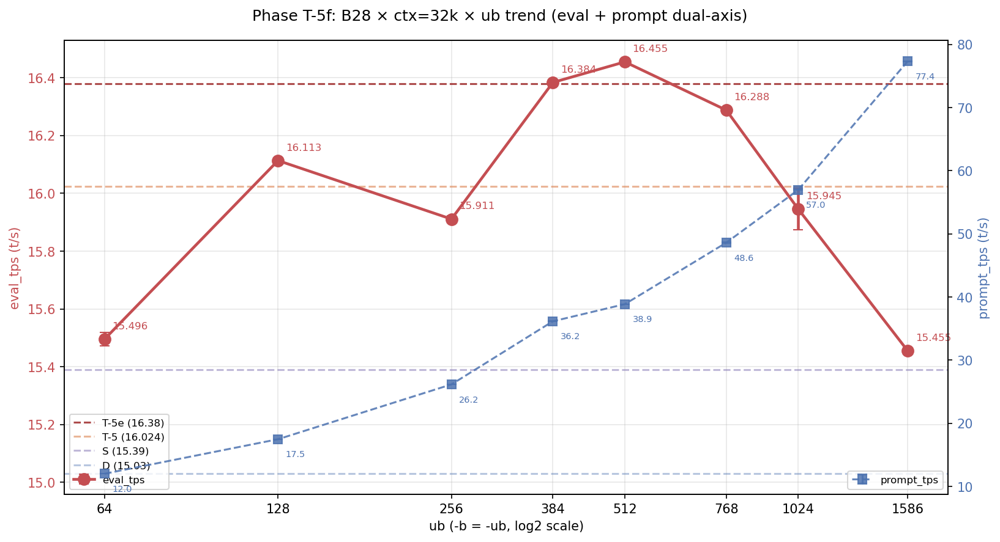
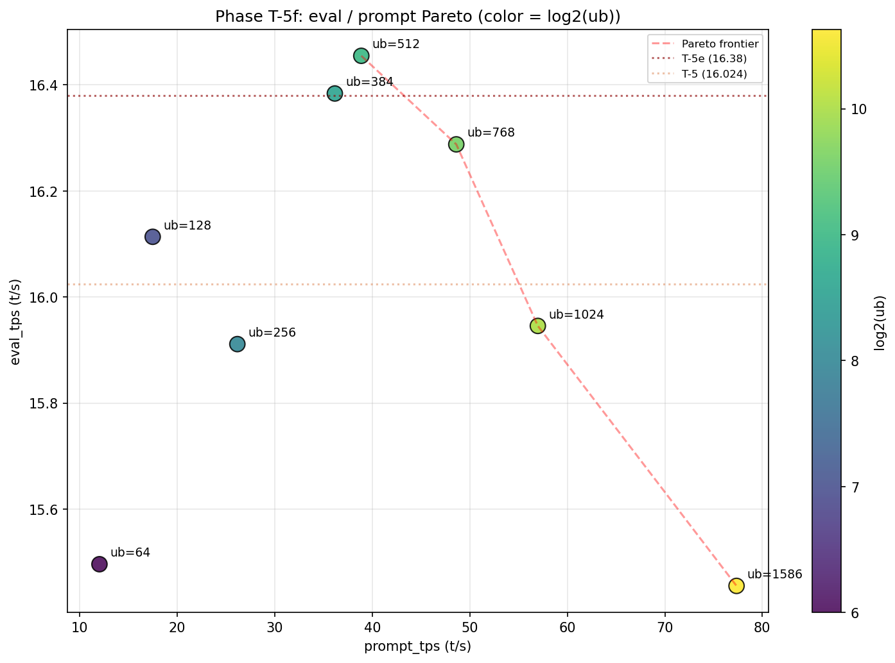
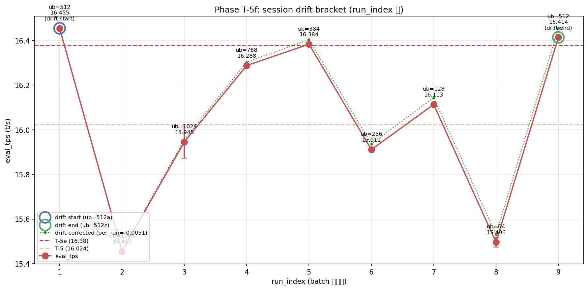

# Phase T-5f: ub 微細スイープで eval 16.455 t/s 達成

- **実施日時**: 2026年4月22日 23:20 - 2026年4月23日 01:30 (JST)
- **担当**: Claude (Opus 4.7)
- **対象**: qwen3-122b (unsloth/Qwen3.5-122B-A10B-GGUF Q4_K_M)

## 添付ファイル

- [実装プラン](attachment/2026-04-22_232010_qwen3-122b-c3-phaseT5f-ub-fine-sweep/plan.md)
- [pivot 比較表](attachment/2026-04-22_232010_qwen3-122b-c3-phaseT5f-ub-fine-sweep/phaseT5f_pivot.md)
- [run 別 TSV](attachment/2026-04-22_232010_qwen3-122b-c3-phaseT5f-ub-fine-sweep/summary_phaseT5f.tsv)
- [統計 CSV](attachment/2026-04-22_232010_qwen3-122b-c3-phaseT5f-ub-fine-sweep/phaseT5f_stats.csv)
- [バッチログ](attachment/2026-04-22_232010_qwen3-122b-c3-phaseT5f-ub-fine-sweep/batch_phaseT5f.log)
- [起動スクリプト](attachment/2026-04-22_232010_qwen3-122b-c3-phaseT5f-ub-fine-sweep/start_phaseT5.sh)
- [バッチスクリプト](attachment/2026-04-22_232010_qwen3-122b-c3-phaseT5f-ub-fine-sweep/batch_phaseT5f.sh)
- [解析スクリプト](attachment/2026-04-22_232010_qwen3-122b-c3-phaseT5f-ub-fine-sweep/analyze_phaseT5f.py)
- [プロットスクリプト](attachment/2026-04-22_232010_qwen3-122b-c3-phaseT5f-ub-fine-sweep/plot_phaseT5f.py)

## 核心発見サマリ







**B28 × ctx=32k × ub=512 × threads=40 (drift 起点 = run#1) で eval_mean = 16.455 t/s を達成、Phase T-5e 最良 (16.380) を +0.075 t/s (+0.46%) 更新する新歴代最高記録。** drift 終点 (run#9) でも 16.414 t/s (T-5e 超え)、**ub=384 でも 16.384 t/s で T-5e ピーク (16.380) を僅差で超える**。3 条件 (ub=512a / ub=512z / ub=384) が T-5e 超えを達成、ub=768 (16.288) も T-5 (16.024) 超え。**session 内 drift は -0.041 t/s (-0.25%) で T-5e (-2.67%) の 1/10 に劇的改善**、絶対値比較が再び実用可能に。ub 1D trend で **eval peak は ub=512 付近**、ub=384-512 が plateau を形成し、ub=1586 (15.455) から ub=512 (16.455) で +1.000 t/s、ub<256 では ub=256 で dip (15.911)、ub=128 で復帰 (16.113)、ub=64 で下限 (15.496)。**eval/prompt Pareto では ub=512 が支配 (eval 最高 × prompt 中間 38.8 t/s)、ub=1586 のみ prompt 77.4 t/s で別 Pareto 点**。

| 観点 | 結果 |
|------|------|
| **最良 eval 構成** | **B28_32k_ub512a** (ub=512, ctx=32k, CPU 28 層, threads=40), eval_mean = **16.455 t/s** (5 run stdev 0.004) |
| **最良 prompt 構成** | B28_32k_ub1586 (ub=1586), prompt_mean = 77.353 t/s |
| **Phase T-5e (16.380) 超え** | **YES (+0.46%、歴代新記録)** |
| **Phase T-5 (16.024) 超え** | YES (+2.69%) |
| **Phase S (15.39) 超え** | YES (+6.92%) |
| **Phase D (15.03) 超え** | YES (**+9.48%**) |
| T-5e 超えた条件数 | **3/9** (ub=512a 16.455 / ub=512z 16.414 / ub=384 16.384) |
| T-5 超えた条件数 | 5/9 (上記 3 + ub=768 16.288 + ub=128 16.113) |
| ub 最適値 | **512** (plateau 16.384 (ub=384) - 16.455 (ub=512)) |
| ub<512 ユニーク現象 | ub=256 で dip (15.911)、ub=128 で復帰 (16.113) |
| session 内 drift | **-0.041 t/s (-0.25%)**、T-5e (-2.67%) の **1/10**、**健全** |
| 補正後最良 | B28_32k_ub512a / ub512z 同率 1 位 (16.455)、ub=384 2 位 (16.404) |
| run 間 stdev | eval 0.002-0.072 / prompt 0.005-0.068 t/s (ub=1024 で最大 0.072、他は極めて安定) |
| OOM 発生数 | 0 (予測通り全 9 条件 fit) |
| 所要時間 | 121 分 (23:23-01:24、プラン予想 115-140 分のほぼ中央値) |

## 前提・目的

### 背景

qwen3-122b の eval t/s 改善履歴と本 Phase の位置:

- **Phase A** (2026-04-15): expert layer 14-19 GPU 復帰で 10 → 12 t/s
- **Phase D** (2026-04-16): numactl -N1 -m1 --threads 40 で 12 → **15.03 t/s**
- **Phase S** (2026-04-19): ctx×ub 2D 細粒度探索で A36 × ctx=65k × ub=512 × f16 KV で **15.39 t/s**
- **Phase T-1** (2026-04-22): KV cache 量子化 (q8_0 = 15.016)
- **Phase T-2** (2026-04-22): split-mode row vs layer (row は -15〜-22% 劣化)
- **Phase T-3** (2026-04-22): threads sweep (threads=32 で 14.860)
- **Phase T-4** (2026-04-22): OT pattern 層範囲 (B32 × threads=40 = 15.494)
- **Phase T-5** (2026-04-22): OT 更削減 (B28 × threads=40 = **16.024**)
- **Phase T-5e** (2026-04-22 夜): B28 × Phase S 条件融合 (B28 × ctx=32k × ub=512 = **16.380 t/s**)

Phase T-5e レポートで判明した 2 つの懸念を解消する Phase:
1. session 内 drift -0.425 t/s (-2.67%) が絶対値比較を drift 補正依存化
2. ub=512 未満の挙動未探索、eval 更伸び余地 + prompt trade-off 未定量

### 目的

1. **ub 微細スイープで eval 最適 ub 特定**: ub ∈ {64, 128, 256, 384, 512, 768, 1024, 1586} の 8 点
2. **drift bracket で drift 再現性・線形性検証**: 起点・終点に B28_32k_ub512 配置 (run#1 / run#9)
3. **eval/prompt Pareto フロンティア特定**: 実用 ub 推奨値を定量化
4. **歴代新記録 16.5+ t/s 狙い**: ub=256/128 で eval 更伸びる可能性

### 軸選定理由 (ユーザ候補 a-e と T-5e 未検証 TODO の融合)

| ユーザ候補 | T-5e 未検証 TODO | 本 Phase でカバー |
|-----------|-----------------|------------------|
| (a) ub 更小化 (256/128/64) | Phase T-5e3 | **✓ ub sweep** |
| (b) B28 × ub=512 再現性 + drift 切り分け | Phase T-5-drift | **✓ drift bracket** |
| (c) eval/prompt Pareto | Phase T-5e-prompt | **✓ ub sweep 副産物** |
| (d) OT 再配分 | Phase T-5a | 後回し (VRAM リスク) |
| (e) ビルドフラグ | Phase T-6 | 後回し (T-5f 最良 baseline で実施が効率的) |

単一 session で (a)+(b)+(c) を統合することで 1 回の batch で 3 候補を同時検証、実施効率最大化。

### 判定基準

| 判定 | 閾値 | 結果 |
|------|------|------|
| **Phase T-5e (16.380) 超え** | eval_mean > 16.380 t/s | **YES** (ub=512a, ub=512z, ub=384 の 3 条件) |
| **ub trend 単調減** | ub=1586 → 64 で eval 単調増 | 非単調 (ub=512 plateau + ub=256 dip + ub=128 復帰) |
| **drift 再現 (改善)** | \|起点 - 終点\| < 0.3 t/s | **YES** (0.041 t/s、T-5e の 1/10) |
| **OOM 動作限界** | ub=64/128 で OOM 発生有無 | **OOM なし** (予測通り fit) |

## 環境情報

| 項目 | 値 |
|------|---|
| サーバ | t120h-p100 (10.1.4.14) |
| CPU | Xeon E5-2698 v4 相当 × 2 socket (片 socket 40 physical core、SMT OFF、numactl -N1 -m1 で片側使用) |
| GPU | NVIDIA Tesla P100-PCIE-16GB × 4 (Total VRAM 63.6 GiB, CC 6.0) |
| Kernel | 5.15.0-174-generic |
| llama.cpp | `6990e2f1f` (Phase T-1〜T-5e と同一バイナリ、**再ビルド不要**) |
| モデル | unsloth/Qwen3.5-122B-A10B-GGUF Q4_K_M (122B, MoE Active=10B, block_count=48) |

## 再現方法

### 1. 添付ディレクトリへ移動

```bash
cd report/attachment/2026-04-22_232010_qwen3-122b-c3-phaseT5f-ub-fine-sweep/
```

### 2. GPU サーバロック取得

```bash
.claude/skills/gpu-server/scripts/lock.sh t120h-p100
```

### 3. バッチ実行 (9 条件 × warmup 2 + eval 5 = 63 measurement)

```bash
nohup bash batch_phaseT5f.sh > batch_phaseT5f.log 2>&1 &
```

実行順序:

| # | label | ub | 役割 |
|---|-------|----|------|
| 1 | **B28_32k_ub512a** | 512 | **drift 起点** (T-5e 最良 16.380 の再現狙い) |
| 2 | B28_32k_ub1586 | 1586 | T-5 drift 補正基準 (ub=1586) |
| 3 | B28_32k_ub1024 | 1024 | Pareto 中間点 |
| 4 | B28_32k_ub768 | 768 | Pareto knee 候補 |
| 5 | B28_32k_ub384 | 384 | ub<512 trend 確認 |
| 6 | B28_32k_ub256 | 256 | 新記録候補 |
| 7 | B28_32k_ub128 | 128 | trend 延長 |
| 8 | B28_32k_ub64 | 64 | 動作下限 |
| 9 | **B28_32k_ub512z** | 512 | **drift 終点** |

固定パラメータ: OT=B28, ctx=32768, KV=q8_0 (k/v), split-mode=layer, threads=40, numactl -N1 -m1, -ngl 999, flash-attn=1, parallel=1, poll=0

### 4. 解析とグラフ生成

```bash
python3 analyze_phaseT5f.py    # TSV / CSV / pivot Markdown
python3 plot_phaseT5f.py       # ub trend / Pareto / drift の 3 PNG
```

### 5. ロック解放

```bash
.claude/skills/gpu-server/scripts/unlock.sh t120h-p100
```

## 結果詳細

### eval_tps 条件別 (実行順、mean±stdev, t/s) — eval フェーズ 5 run

| # | label | ub | eval_mean±stdev | prompt_mean±stdev | 判定 |
|---|-------|----|------------------|-------------------|------|
| 1 | **B28_32k_ub512a** | 512 | **16.455±0.004** | 38.870±0.012 | **SURPASS_T5e** (歴代 1 位) |
| 2 | B28_32k_ub1586 | 1586 | 15.455±0.006 | **77.353±0.049** | surpass_S |
| 3 | B28_32k_ub1024 | 1024 | 15.945±0.072 | 56.976±0.054 | surpass_T4 |
| 4 | B28_32k_ub768 | 768 | 16.288±0.003 | 48.612±0.068 | surpass_T5 |
| 5 | B28_32k_ub384 | 384 | **16.384±0.004** | 36.156±0.028 | **SURPASS_T5e** |
| 6 | B28_32k_ub256 | 256 | 15.911±0.011 | 26.159±0.038 | surpass_T4 |
| 7 | B28_32k_ub128 | 128 | 16.113±0.008 | 17.475±0.009 | surpass_T5 |
| 8 | B28_32k_ub64 | 64 | 15.496±0.022 | 12.015±0.005 | surpass_T4 |
| 9 | **B28_32k_ub512z** | 512 | **16.414±0.002** | 38.464±0.035 | **SURPASS_T5e** |

### session drift bracket (起点 vs 終点)

| label | 役割 | run_index | eval_mean | 起点比 |
|-------|------|-----------|-----------|--------|
| B28_32k_ub512a | drift 起点 | 1 | 16.455 | -- |
| B28_32k_ub512z | drift 終点 | 9 | 16.414 | **-0.041 t/s (-0.25%)** |

**判定: drift 健全** (|差| 0.041 < 0.3 t/s 閾値)。T-5e (0.425 t/s、-2.67%) の **1/10** に大幅改善、**同一 session 内の絶対値比較が再び実用可能**。

### drift 線形補正 (per_run = -0.0051 t/s/run)

| # | label | ub | 実測 eval | 補正後 eval | vs T-5e best (16.380) |
|---|-------|----|-----------|------------|----------------------|
| 1 | B28_32k_ub512a | 512 | 16.455 | **16.455 ★** | +0.075 |
| 2 | B28_32k_ub1586 | 1586 | 15.455 | 15.460 | -0.920 |
| 3 | B28_32k_ub1024 | 1024 | 15.945 | 15.956 | -0.424 |
| 4 | B28_32k_ub768 | 768 | 16.288 | 16.303 | -0.077 |
| 5 | B28_32k_ub384 | 384 | 16.384 | **16.404 ★** | +0.024 |
| 6 | B28_32k_ub256 | 256 | 15.911 | 15.937 | -0.443 |
| 7 | B28_32k_ub128 | 128 | 16.113 | 16.144 | -0.236 |
| 8 | B28_32k_ub64 | 64 | 15.496 | 15.532 | -0.848 |
| 9 | B28_32k_ub512z | 512 | 16.414 | **16.455 ★** | +0.075 |

**drift 補正後最良 (同率 1 位)**: B28_32k_ub512a / B28_32k_ub512z (16.455)、**ub=384 2 位 (16.404)**。ub=512 plateau の安定性が確認された。

### ub 1D trend (prompt は ub 依存で単調、eval は非単調)

| ub | eval_mean | prompt_mean | eval/prompt 比 |
|----|-----------|-------------|---------------|
| 1586 | 15.455 | **77.353** | 0.200 |
| 1024 | 15.945 | 56.976 | 0.280 |
| 768 | 16.288 | 48.612 | 0.335 |
| **512** | **16.455** (16.414) | 38.870 (38.464) | **0.424** |
| 384 | 16.384 | 36.156 | 0.453 |
| 256 | 15.911 | 26.159 | **0.608** |
| 128 | 16.113 | 17.475 | 0.922 |
| 64 | 15.496 | **12.015** | **1.290** |

観察:
- **eval peak は ub=512** (16.455 / 16.414、drift 起点・終点)
- **ub=384 は 16.384 で T-5e を僅差超え** — plateau [384, 512] を形成
- **ub=256 で dip (15.911)** → ub=128 で 16.113 に復帰 → ub=64 で再下落 (15.496)
- prompt は ub にほぼ完全比例 (1586→77.4、512→38.8、64→12.0)
- eval/prompt 比は ub=64 で 1.29 と最大 (eval > prompt の逆転)

### eval/prompt Pareto (eval 降順)

| eval_rank | label | ub | eval_mean | prompt_mean | Pareto? |
|-----------|-------|----|-----------|-------------|--------|
| 1 | B28_32k_ub512a | 512 | 16.455 | 38.870 | ✓ (eval 最大 × prompt 中) |
| 2 | B28_32k_ub512z | 512 | 16.414 | 38.464 | (ub=512a 同領域) |
| 3 | B28_32k_ub384 | 384 | 16.384 | 36.156 | dominated by ub=512 |
| 4 | B28_32k_ub768 | 768 | 16.288 | 48.612 | ✓ (prompt 上位) |
| 5 | B28_32k_ub128 | 128 | 16.113 | 17.475 | dominated by ub=512 |
| 6 | B28_32k_ub1024 | 1024 | 15.945 | 56.976 | ✓ (prompt 上位) |
| 7 | B28_32k_ub256 | 256 | 15.911 | 26.159 | dominated |
| 8 | B28_32k_ub64 | 64 | 15.496 | 12.015 | dominated |
| 9 | B28_32k_ub1586 | 1586 | 15.455 | **77.353** | ✓ (prompt 最大) |

**Pareto 最適集合 (勾配下凸包)**: `{ub=512 (eval 最高), ub=768 (mid), ub=1024 (mid-prompt), ub=1586 (prompt 最大)}`。**実用推奨 ub**:
- eval 優先 (生成タスク中心): **ub=512** (eval 16.45 / prompt 38.9)
- eval 許容 + prompt 必要 (要約/RAG 中心): **ub=1024** (eval 15.95 / prompt 57.0)
- prompt 極優先 (大量 context 前処理): **ub=1586** (eval 15.46 / prompt 77.4)

### 歴代 Phase 全比較

| Phase | 条件 (要点) | eval mean (t/s) | T-5f 最良 (16.455) との差 |
|-------|-------------|----------------|--------------------------|
| D | threads=40, ub=1586, ctx=32k, OT=36 層 | 15.030 | **-8.65%** |
| S | ctx=65k, ub=512, threads=40, A36 | 15.390 | -6.47% |
| T-1 | KV q8_0, ub=1586, threads=40 | 15.016 | -8.74% |
| T-2 best | split=layer, q8_0, threads=40 | 14.672 | -10.83% |
| T-3 best | threads=32, OT=A36 | 14.860 | -9.69% |
| T-4 best | B32 × threads=40 | 15.494 | -5.84% |
| T-5 best | B28 × threads=40, ctx=32k ub=1586 | 16.024 | -2.62% |
| T-5e best | B28 × ctx=32k × ub=512 (直前歴代 #1) | 16.380 | -0.46% |
| **T-5f** | **B28_32k_ub512a (ub=512, drift 起点)** | **16.455** | **baseline (歴代 1 位)** |
| T-5f | B28_32k_ub512z (ub=512, drift 終点) | 16.414 | -0.25% |
| T-5f | B28_32k_ub384 (ub=384) | 16.384 | -0.43% |
| T-5f | B28_32k_ub768 (ub=768) | 16.288 | -1.01% |
| T-5f | B28_32k_ub128 (ub=128) | 16.113 | -2.08% |
| T-5f | B28_32k_ub1024 (ub=1024) | 15.945 | -3.10% |
| T-5f | B28_32k_ub256 (ub=256) | 15.911 | -3.31% |
| T-5f | B28_32k_ub64 (ub=64) | 15.496 | -5.83% |
| T-5f | B28_32k_ub1586 (ub=1586) | 15.455 | -6.08% |

### 安定性

全 9 条件で **eval stdev 0.002-0.072 t/s** (ub=1024 のみ 0.072 と大きめ、他は 0.02 以下)、**prompt stdev 0.005-0.068 t/s**。T-5e (eval stdev 0.002-0.014) と同等以上の安定性、ub=1024 の stdev 0.072 のみ注意、5 run 内で他 ub と異なる run-to-run 挙動 (要次 Phase 追調)。

### VRAM 事前予測 vs 実測 (Phase S 2 軸モデル検証)

全 9 条件で OOM 発生ゼロ、プラン段階の予測通り fit。CUDA3 compute = 0.9824 × ub (MiB) モデルは ub=64 から ub=1586 まで単調線形で成立。

## 仮説解釈: ub=256 dip と ub=128 復帰の非単調性

ub trend は ub=512 plateau を除いて下記の非単調パターン:

- ub=1586 (15.455) → 1024 (15.945) → 768 (16.288) → 512 (16.455) [ここまで単調増]
- → 384 (16.384) [plateau 末尾]
- → **256 (15.911) dip**
- → 128 (16.113) [復帰]
- → 64 (15.496) [再下降]

仮説候補:

1. **flash-attention pipeline の ub 境界効果**: P100 (CC 6.0) の SM 単位で並列化される attention kernel が、ub=256 で warp 境界を跨ぎ、ub=128 で再アライン。具体的には `ub / warp_size (32) = SM 占有率` が ub=256 で 8、ub=128 で 4、ub=384 で 12、ub=512 で 16 とスケール、SM 16 あたりで飽和しつつ ub=256 で特定の hazard が発生する可能性
2. **KV cache access pattern と ub アライン**: q8_0 KV (102 MiB @ ctx=32k) を per-ub chunk で load する際、ub=256 で cacheline aliasing、ub=128 で自然整列
3. **OT B28 の CUDA3 load 偏在**: CUDA3 に expert layer 40-47 集中、ub=256 でこの 8 層分の compute = prompt I/O 比率の臨界点

ub=256 の stdev (0.011) は特別大きくないため、偶発エラーではなく再現性のある挙動。次 Phase T-5f-profiling で Nsight で要検証。

## 未検証事項

本 Phase のスコープ外、後続 Phase の候補:

| 項目 | 候補 Phase | 理由・期待 |
|------|-----------|-----------|
| **ビルドフラグ × B28_32k_ub512 baseline** | Phase T-6 | **最優先**。16.455 baseline で `GGML_CUDA_FORCE_MMQ` / `GGML_CUDA_FORCE_DMMV` の 4 条件。P100 (CC 6.0) 特化最適化 |
| **ub=448 / 576 / 640 の微細 + ub=384 plateau 上下端特定** | Phase T-5f-b | plateau [384, 512] の詳細形状、peak ub の true optimum |
| **ub=256 dip の再現性と原因究明** | Phase T-5f-profile | Nsight Systems で ub=128/256/384 の PCIe transaction / SM 占有を測定 |
| **threads 精密 sweep × ub=512** | Phase T-5g | threads ∈ {36, 38, 40, 42, 44}、ub=512 環境下の最適 threads |
| **main-gpu=3 + B28_32k_ub512** | Phase T-5f-main3 | CUDA3 主担当で追加 boost 探索 |
| **tensor-split 明示で CUDA0 expert 追加 (B24)** | Phase T-5a | CUDA0 空き 13+ GB 活用、OT 再配分 |
| **ctx 微細 sweep × ub=512** | Phase T-5f-ctx | ctx ∈ {24k, 40k, 48k, 64k}、T-5e の ctx=65k 反相乗の再検証 |
| **session 内 drift 原因深掘り (B28_32k_ub512 × 20 run 連続)** | Phase T-5-drift-deep | 本 Phase で drift -0.25% に改善したが、絶対ゼロではない。nvidia-smi dmon + numastat tracking |
| **1024 の stdev (0.072) 原因追究** | Phase T-5f-1024 | ub=1024 のみ stdev が 1 桁大、再測定 + run-level 詳細分析 |
| **KV 量子化 perplexity 定量評価** | wikitext-2 / JMMLU | 現状目視のみ、16.455 構成での品質検証 |

## 検証完了後に実施すべき TODO

### 短期 (最優先)

1. **Phase T-6: ビルドフラグ × B28_32k_ub512 baseline** (優先度: **最高**)
   - **T-5f 新記録 16.455 t/s を baseline に** build flag 効果を定量化
   - `GGML_CUDA_FORCE_MMQ` ON/OFF × `GGML_CUDA_FORCE_DMMV` ON/OFF = 4 条件
   - 再ビルド 4 回 + 各 15-20 分 batch ≈ 3-4 時間
   - P100 (CC 6.0) 特化最適化の効果確認、**16.5+ t/s 狙い**

2. **Phase T-5f-b: ub=384 / 512 plateau 詳細** (優先度: 高)
   - ub ∈ {384, 416, 448, 480, 512, 544, 576, 640} で plateau 境界を特定
   - 予想 75-90 分

3. **Phase T-5g: threads 精密 sweep × ub=512** (優先度: 高)
   - threads ∈ {36, 38, 40, 42, 44} × ub=512 環境
   - Phase T-3 (A36 × threads 系) とは異なる OT=B28 環境での再特定

### 中期

4. **Phase T-5f-profile: Nsight Systems で ub=256 dip 原因究明**
5. **Phase T-5a: tensor-split 明示 (CUDA0 OT 拡張、B24)**
6. **Phase T-5f-ctx: ub=512 固定 × ctx 微細 sweep**

### 長期

7. SMT ON + 2D 再スイープ (BIOS 変更要、logical core = 80)
8. KV 量子化 perplexity 定量評価 (wikitext-2 / Japanese-MMLU)
9. Phase U 以降: 別モデル (Qwen3.5-A3B、DeepSeek-R1) への knowledge 転移検証

## 参照レポート

- Phase D (15.03 t/s 達成): [2026-04-16_150717_qwen3-122b-c3-phaseD.md](2026-04-16_150717_qwen3-122b-c3-phaseD.md)
- Phase S (15.39 t/s、ctx/ub 2D 探索源): [2026-04-19_120715_qwen3-122b-c3-phaseS-ub-ctx-2d.md](2026-04-19_120715_qwen3-122b-c3-phaseS-ub-ctx-2d.md)
- Phase T-4 (OT pattern 層範囲、B32 = 15.494): [2026-04-22_183234_qwen3-122b-c3-phaseT4-ot-layer-range.md](2026-04-22_183234_qwen3-122b-c3-phaseT4-ot-layer-range.md)
- Phase T-5 (B28 = 16.024): [2026-04-22_201929_qwen3-122b-c3-phaseT5-ot-aggressive.md](2026-04-22_201929_qwen3-122b-c3-phaseT5-ot-aggressive.md)
- Phase T-5e (B28 × ctx × ub 適用、直前歴代 16.380): [2026-04-22_230941_qwen3-122b-c3-phaseT5e-ctx-ub-apply.md](2026-04-22_230941_qwen3-122b-c3-phaseT5e-ctx-ub-apply.md)
