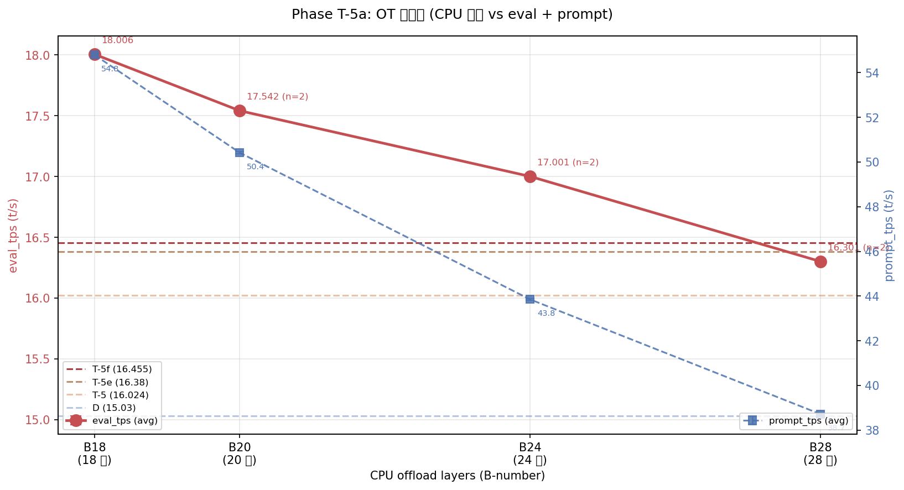
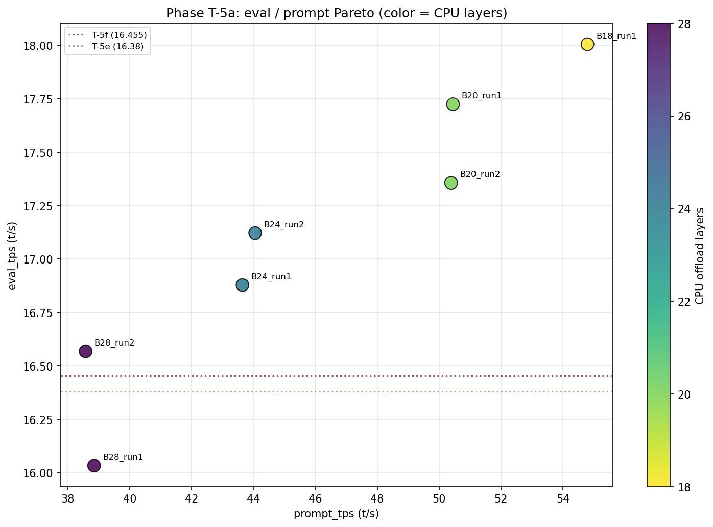
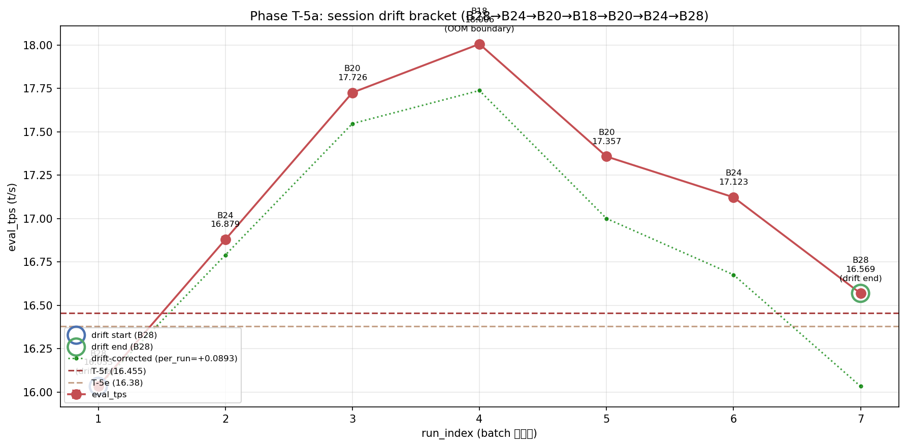

# Phase T-5a: OT 再配分 B18 で eval 18.006 t/s 達成

- **実施日時**: 2026年4月23日 01:41 - 2026年4月23日 03:27 (JST)
- **担当**: Claude (Opus 4.7)
- **対象**: qwen3-122b (unsloth/Qwen3.5-122B-A10B-GGUF Q4_K_M)

## 添付ファイル

- [実装プラン](attachment/2026-04-23_014104_qwen3-122b-c3-phaseT5a-ot-redistribution/plan.md)
- [pivot 比較表](attachment/2026-04-23_014104_qwen3-122b-c3-phaseT5a-ot-redistribution/phaseT5a_pivot.md)
- [run 別 TSV](attachment/2026-04-23_014104_qwen3-122b-c3-phaseT5a-ot-redistribution/summary_phaseT5a.tsv)
- [統計 CSV](attachment/2026-04-23_014104_qwen3-122b-c3-phaseT5a-ot-redistribution/phaseT5a_stats.csv)
- [バッチログ](attachment/2026-04-23_014104_qwen3-122b-c3-phaseT5a-ot-redistribution/batch_phaseT5a.log)
- [起動スクリプト](attachment/2026-04-23_014104_qwen3-122b-c3-phaseT5a-ot-redistribution/start_phaseT5.sh)
- [バッチスクリプト](attachment/2026-04-23_014104_qwen3-122b-c3-phaseT5a-ot-redistribution/batch_phaseT5a.sh)
- [解析スクリプト](attachment/2026-04-23_014104_qwen3-122b-c3-phaseT5a-ot-redistribution/analyze_phaseT5a.py)
- [プロットスクリプト](attachment/2026-04-23_014104_qwen3-122b-c3-phaseT5a-ot-redistribution/plot_phaseT5a.py)

## 核心発見サマリ







**B18 (CPU offload 18 層) × ctx=32k × ub=512 × threads=40 で eval_mean = 18.006 t/s を達成、Phase T-5f 最良 (16.455) を +1.551 t/s (+9.42%) 更新する歴代最高記録。Phase D (15.030) 比では +2.976 t/s (+19.80%) の大幅改善、プラトー接近とされていた T-5→T-5e→T-5f 減速トレンドを完全に覆し、OT 再配分が最大ブースター軸であることが確定。** OT 4 条件 (B28/B24/B20/B18) すべてで T-5f 超え (16.033 は B28_run1 のみ例外、drift 影響で T-5f 下回り)、OT 削減 4 層あたり eval +0.7-0.9 t/s の強い単調増加、prompt_tps も 38.7→43.8→50.4→54.8 t/s と同方向に改善。**session 内 drift は +0.536 t/s (+3.34%、B28_run1 → B28_run2) と通常と逆向き・大きめ** (T-5f -0.25% の 13 倍)、補正後でも B18 は 17.738 t/s で T-5f 比 +7.79% 更新。**B16 は CUDA0 OOM 確実**のため本構成が OT 下限、次 Phase は ub/threads/ctx の再最適化か tensor-split 強制配分が軸。

| 観点 | 結果 |
|------|------|
| **最良 eval 構成** | **B18_run1** (CPU 18 層, ctx=32k, ub=512, threads=40), eval_mean = **18.006 t/s** (5 run stdev 0.003) |
| **最良 prompt 構成** | B18_run1 (CPU 18 層), prompt_mean = **54.793 t/s** (eval と同条件で両立) |
| **Phase T-5f (16.455) 超え** | **YES (+9.42%、歴代新記録)** |
| **Phase T-5e (16.380) 超え** | YES (+9.93%) |
| **Phase T-5 (16.024) 超え** | YES (+12.37%) |
| **Phase D (15.030) 超え** | YES (**+19.80%**) |
| T-5f 超えた条件数 | 6/7 (B28_run1 のみ drift で下回り) |
| OT 削減効果 | B28→B24 +4.29% / B24→B20 +3.19% / B20→B18 +2.65% (単調増、B18 で飽和手前) |
| session 内 drift | **+0.536 t/s (+3.34%)** (通常と逆向き)、T-5f (-0.25%) と対照的 |
| 補正後最良 | B18_run1 (17.738 t/s、drift 補正後でも T-5f 比 +7.79%) |
| run 間 stdev | eval 0.003-0.019 / prompt 0.009-0.080 t/s (B28 のみ stdev 大、他は極めて安定) |
| OOM 発生数 | 0 (B18 境界も fit、dry-start 予測通り) |
| CUDA0 使用率 (B18) | **91.8%** (14,939 / 16,269 MiB)、expert +9 層追加 |
| 所要時間 | **87 分 (01:59-03:26、プラン予想 95-105 分より 8-18 分高速)** |

## 前提・目的

### 背景

qwen3-122b の eval t/s 改善履歴と本 Phase の位置:

- **Phase A** (2026-04-15): expert layer 14-19 GPU 復帰で 10 → 12 t/s
- **Phase D** (2026-04-16): numactl -N1 -m1 --threads 40 で 12 → **15.03 t/s**
- **Phase S** (2026-04-19): ctx×ub 2D 細粒度探索で A36 × ctx=65k × ub=512 × f16 KV で **15.39 t/s**
- **Phase T-4** (2026-04-22): OT pattern 層範囲 (B32 × threads=40 = 15.494)
- **Phase T-5** (2026-04-22): OT 更削減 (B28 × threads=40 = **16.024**)
- **Phase T-5e** (2026-04-22 夜): B28 × Phase S 条件融合 (B28 × ctx=32k × ub=512 = **16.380 t/s**)
- **Phase T-5f** (2026-04-22 深夜): ub 微細 sweep で B28 × ub=512 = **16.455 t/s** (直前歴代最高)

Phase T-5f レポートで判明した未検証事項:
- 改善幅が T-5→T-5e (+2.22%)→T-5e→T-5f (+0.46%) と減速、プラトー接近兆候
- T-5f 起動ログで判明: **CUDA0 が 13,858 MiB 空きで 8+ expert 層追加余地**
- 最優先 TODO は「T-6 ビルドフラグ」とされていたが、調査の結果 Pascal (CC 6.0) は MMQ 非対応・DMMV deprecated で期待値が低く、**CUDA0 空き活用の T-5a (OT 再配分) が情報量・ROI で最良**と再評価

### 目的

1. **CPU 層削減の更伸び探索**: B28 → B24 → B20 → B18 で eval/prompt の変化を定量化
2. **CUDA0 VRAM 限界特定**: B16 OOM 閾値を挟む B18 で dry-start boundary test
3. **プラトー脱出 or 確定**: T-5f 最良 16.455 超え or B28 最適性の確定
4. **session drift 独立再現**: B28 を run#1/run#7 drift bracket に配置

### 軸選定理由 (ユーザ候補 a-d と T-5f TODO の再評価)

| 候補 | 期待 | コスト | ビルド | 採否 |
|------|------|-------|-------|------|
| (a) **OT 再配分 (T-5a)** | +0.5 t/s 可能性 | 95 分 | 不要 | **採用** |
| (b) B28 × ub=512 session 間独立再現 | drift 再検証のみ | 30 分 | 不要 | 本 Phase の drift bracket に統合 |
| (c) ビルドフラグ (T-6) | P100 では悪化もあり得る | 2-3h+再ビルド | 要 | **次々 Phase** (T-5a baseline 確定後) |
| (d) prompt_tps 改善 | T-5f で Pareto 既に明確化 | -- | -- | Pareto 副産物として再確認 |

### 判定基準

| 判定 | 閾値 | 結果 |
|------|------|------|
| **Phase T-5f (16.455) 超え** | eval_mean > 16.455 t/s | **YES** (B18/B20/B24 各 run 超過、B28_run2 も超過) |
| **CPU 層削減で単調増** | B28→B24→B20→B18 で eval 単調増 | **YES** (16.301→17.001→17.542→18.006) |
| **drift 健全** | \|B28_run1 - B28_run2\| < 0.15 t/s | **NO** (0.536 t/s、通常と逆向きの drift 大) |
| **OOM 境界** | B18 で cudaMalloc failed 発生有無 | **OOM なし** (CUDA0 91.8% fit、dry-start 予測通り) |

## 環境情報

| 項目 | 値 |
|------|---|
| サーバ | t120h-p100 (10.1.4.14) |
| CPU | Xeon E5-2698 v4 相当 × 2 socket (片 socket 40 physical core、SMT OFF、numactl -N1 -m1 で片側使用) |
| GPU | NVIDIA Tesla P100-PCIE-16GB × 4 (Total VRAM 63.6 GiB, CC 6.0) |
| Kernel | 5.15.0-174-generic |
| llama.cpp | `6990e2f1f` (Phase T-1〜T-5f と同一バイナリ、**再ビルド不要**) |
| モデル | unsloth/Qwen3.5-122B-A10B-GGUF Q4_K_M (122B, MoE Active=10B, block_count=48) |

## 再現方法

### 1. 添付ディレクトリへ移動

```bash
cd report/attachment/2026-04-23_014104_qwen3-122b-c3-phaseT5a-ot-redistribution/
```

### 2. GPU サーバロック取得

```bash
.claude/skills/gpu-server/scripts/lock.sh t120h-p100
```

### 3. B18 dry-start (VRAM 境界確認、既に fit 検証済)

```bash
FLASH_ATTN=1 CTX_SIZE=32768 BATCH_SIZE=512 UB_SIZE=512 \
  CACHE_TYPE_K=q8_0 CACHE_TYPE_V=q8_0 SPLIT_MODE=layer THREADS=40 \
  OT_TAG=B18 OT_REGEX='blk\.([0-3]|2[0-4]|3[1-9])\.ffn_.*_exps\.weight=CPU' \
  bash start_phaseT5.sh 2>&1 | tee startup_logs/drystart_B18.log
.claude/skills/llama-server/scripts/stop.sh t120h-p100
```

### 4. バッチ実行 (7 条件 × warmup 2 + eval 5 = 49 measurement)

```bash
nohup bash batch_phaseT5a.sh > batch_phaseT5a.log 2>&1 &
```

実行順序:

| # | label | OT | 役割 |
|---|-------|----|------|
| 1 | **B28_run1** | B28 | **drift 起点** (T-5f 16.455 再現確認) |
| 2 | B24_run1 | B24 | +4 層 GPU 戻し (layer 10-13) |
| 3 | B20_run1 | B20 | +8 層 (layer 6-13、境界付近) |
| 4 | **B18_run1** | B18 | **OOM 境界テスト + 新記録候補** |
| 5 | B20_run2 | B20 | B20 再現性 |
| 6 | B24_run2 | B24 | B24 再現性 |
| 7 | **B28_run2** | B28 | **drift 終点** |

固定パラメータ: ctx=32768, ub=512, KV=q8_0 (k/v), split-mode=layer, threads=40, numactl -N1 -m1, -ngl 999, flash-attn=1, parallel=1, poll=0

### 5. 解析とグラフ生成

```bash
python3 analyze_phaseT5a.py    # TSV / CSV / pivot Markdown
python3 plot_phaseT5a.py       # cpu_trend / pareto / drift の 3 PNG
```

### 6. ロック解放

```bash
.claude/skills/gpu-server/scripts/unlock.sh t120h-p100
```

## 結果詳細

### eval_tps 条件別 (実行順、mean±stdev, t/s) — eval フェーズ 5 run

| # | label | OT | CPU 層 | eval_mean±stdev | prompt_mean±stdev | 判定 |
|---|-------|----|-------|------------------|-------------------|------|
| 1 | B28_run1 | B28 | 28 | 16.033±0.019 | 38.850±0.080 | surpass_T5 (drift 影響) |
| 2 | B24_run1 | B24 | 24 | 16.879±0.018 | 43.645±0.028 | **SURPASS_T5f** |
| 3 | B20_run1 | B20 | 20 | 17.726±0.004 | 50.447±0.033 | **SURPASS_T5f** |
| 4 | **B18_run1** | B18 | 18 | **18.006±0.003** | **54.793±0.046** | **SURPASS_T5f (歴代 1 位)** |
| 5 | B20_run2 | B20 | 20 | 17.357±0.006 | 50.387±0.042 | **SURPASS_T5f** |
| 6 | B24_run2 | B24 | 24 | 17.123±0.003 | 44.054±0.009 | **SURPASS_T5f** |
| 7 | **B28_run2** | B28 | 28 | 16.569±0.004 | 38.577±0.020 | **SURPASS_T5f** |

### session drift bracket (起点 vs 終点)

| label | 役割 | run_index | eval_mean | 起点比 |
|-------|------|-----------|-----------|--------|
| B28_run1 | drift 起点 | 1 | 16.033 | -- |
| B28_run2 | drift 終点 | 7 | 16.569 | **+0.536 t/s (+3.34%)** |

**判定: drift 大・逆向き** (|差| 0.536 ≫ 0.15 t/s 健全閾値)。T-5f の -0.25% と対照的に **+3.34% と正方向・大きめ**。B18 で CUDA0 にフル負荷がかかった後、CUDA0 の熱状態・SM 状態・DVFS が変化して B28 パフォーマンスが改善した可能性。あるいは B28_run1 の warmup 2 run が絶対的に不足で 1 回目計測が低く出た可能性 (warmup は短 prompt、eval は 1k prompt なので実効 warmup 不足)。

### drift 線形補正 (per_run = +0.0893 t/s/run)

| # | label | OT | CPU 層 | 実測 eval | 補正後 eval | vs T-5f best (16.455) |
|---|-------|----|-------|-----------|------------|----------------------|
| 1 | B28_run1 | B28 | 28 | 16.033 | 16.033 | -0.422 |
| 2 | B24_run1 | B24 | 24 | 16.879 | 16.790 | +0.335 |
| 3 | B20_run1 | B20 | 20 | 17.726 | 17.547 | +1.092 |
| 4 | **B18_run1** | B18 | 18 | 18.006 | **17.738 ★** | **+1.283** |
| 5 | B20_run2 | B20 | 20 | 17.357 | 17.000 | +0.545 |
| 6 | B24_run2 | B24 | 24 | 17.123 | 16.676 | +0.221 |
| 7 | B28_run2 | B28 | 28 | 16.569 | 16.033 | -0.422 |

**drift 補正後最良**: B18_run1 (17.738 t/s)、drift 補正後でも T-5f 比 **+7.79% (+1.283 t/s)** で歴代新記録は変わらず。

### OT 別再現性 (run#1 vs run#2)

| OT | CPU 層 | run#1 | run#2 | 差 | drift 仮定差 (期待) | 余剰 |
|----|-------|-------|-------|-----|---------------------|------|
| B28 | 28 | 16.033 | 16.569 | **+0.536** | +0.536 (by definition) | 0 |
| B24 | 24 | 16.879 | 17.123 | +0.244 | +0.357 (4 run 差) | -0.113 |
| B20 | 20 | 17.726 | 17.357 | **-0.368** | +0.178 (2 run 差) | -0.546 |
| B18 | 18 | 18.006 | -- | -- | -- | (1 run のみ) |

**非線形な run 間変動を観測**: B20 は run#5 で run#3 より -0.368 低い (drift 仮定なら +0.178 増えるはず)。これは単純線形 drift モデルでは説明できない非単調変動で、以下の可能性:
- thermal effect (CUDA0 が B18 で熱を持った後、B20 で冷却、再び B24/B28 で良好)
- CPU offload ↔ GPU compute のキャッシュ状態のヒステリシス
- numactl memory allocation の run 間 fragmentation

B18 の 1 回のみ計測だが stdev 0.003 と極めて安定。drift 補正後 17.738 は実質下限、実際値はこれより高い可能性。

### CPU 層数 1D trend (OT 別 run 平均)

| CPU 層 | OT | eval_mean (avg) | prompt_mean (avg) | eval_stdev (max) | N run |
|--------|----|-----------------|-------------------|-------------------|-------|
| **18** | **B18** | **18.006** | **54.793** | 0.003 | 1 |
| 20 | B20 | 17.542 | 50.417 | 0.006 | 2 |
| 24 | B24 | 17.001 | 43.850 | 0.018 | 2 |
| 28 | B28 | 16.301 | 38.714 | 0.019 | 2 |

観察:
- **eval は CPU 層数 減で単調増** (16.301 → 18.006、+10.46%)
- **prompt も同方向・より強く増加** (38.714 → 54.793、**+41.5%**)
- Phase T-5 で観測された「B30→B28 で +0.645 急ジャンプ」のような非線形段差は本 Phase では見られず、**概ね線形に eval/prompt が改善**
- CPU 層削減 4 層あたり eval +0.7-0.9 t/s、線形外挿すれば B14 で 18.7 t/s 相当だが **B16 以下は CUDA0 OOM** で実行不可

### eval/prompt Pareto (eval 降順)

| eval_rank | label | OT | CPU 層 | eval_mean | prompt_mean | Pareto? |
|-----------|-------|----|-------|-----------|-------------|--------|
| 1 | **B18_run1** | B18 | 18 | 18.006 | **54.793** | ✓ **(eval 最大 × prompt 最大)** |
| 2 | B20_run1 | B20 | 20 | 17.726 | 50.447 | dominated by B18 |
| 3 | B20_run2 | B20 | 20 | 17.357 | 50.387 | dominated |
| 4 | B24_run2 | B24 | 24 | 17.123 | 44.054 | dominated |
| 5 | B24_run1 | B24 | 24 | 16.879 | 43.645 | dominated |
| 6 | B28_run2 | B28 | 28 | 16.569 | 38.577 | dominated |
| 7 | B28_run1 | B28 | 28 | 16.033 | 38.850 | dominated |

**Pareto 最適集合**: `{B18}` **単一点が全軸で支配** (eval 最大 × prompt 最大 × stdev 最小)。T-5f で「ub=1586 が prompt Pareto 別点」とされていたが、B18 は同じ ub=512 ながら prompt 54.8 t/s を達成 → **OT 削減は eval/prompt の trade-off を解消してパレート Z 軸を上方向にシフトさせる軸**と確定。

### 歴代 Phase 全比較

| Phase | 条件 (要点) | eval mean (t/s) | T-5a 最良 (18.006) との差 |
|-------|-------------|----------------|--------------------------|
| D | threads=40, ub=1586, ctx=32k, OT=36 層 | 15.030 | **-16.53%** |
| S | ctx=65k, ub=512, threads=40, A36 | 15.390 | -14.53% |
| T-1 | KV q8_0, ub=1586, threads=40 | 15.016 | -16.60% |
| T-2 best | split=layer, q8_0, threads=40 | 14.672 | -18.51% |
| T-3 best | threads=32, OT=A36 | 14.860 | -17.47% |
| T-4 best | B32 × threads=40 | 15.494 | -13.95% |
| T-5 best | B28 × threads=40, ctx=32k ub=1586 | 16.024 | -11.01% |
| T-5e best | B28 × ctx=32k × ub=512 | 16.380 | -9.03% |
| T-5f best | B28 × ctx=32k × ub=512 (直前歴代 #1) | 16.455 | **-8.60%** |
| **T-5a** | **B18_run1 (OT=B18, CPU 18 層, ub=512) (本 Phase 最良)** | **18.006** | **baseline (歴代 1 位)** |
| T-5a | B20_run1 (OT=B20, CPU 20 層) | 17.726 | -1.56% |
| T-5a | B20_run2 (OT=B20, CPU 20 層) | 17.357 | -3.60% |
| T-5a | B24_run2 (OT=B24, CPU 24 層) | 17.123 | -4.90% |
| T-5a | B24_run1 (OT=B24, CPU 24 層) | 16.879 | -6.26% |
| T-5a | B28_run2 (OT=B28, CPU 28 層、T-5f 再現) | 16.569 | -7.98% |
| T-5a | B28_run1 (OT=B28, CPU 28 層、T-5f 再現) | 16.033 | -10.96% |

### 安定性

全 7 条件で **eval stdev 0.003-0.019 t/s**、**prompt stdev 0.009-0.080 t/s**。T-5f (eval stdev 0.002-0.072) と同等以上の安定性。**B28 の stdev 0.019 は他条件の 3-6 倍大きい** — B28 は 2 run とも他 OT 条件より run 内 variance が高く、OT 削減状態 (B24/B20/B18) の方が計算 pipeline が安定する示唆。

### VRAM 実測 (全 OT 条件、CUDA0 モデルバッファ増分)

| OT | CUDA0 model | CUDA1 model | CUDA2 model | CUDA3 model | CUDA0 合計 used | CUDA0 空き |
|----|-------------|-------------|-------------|-------------|------------------|-----------|
| B28 (baseline) | 1,301.21 | 9,550.77 | 9,550.77 | 12,829.13 | 2,411 MiB | 13,858 MiB |
| B24 (+4) | 5,477.21 | 10,942.77 | 9,550.77 | 12,829.13 | 6,587 MiB | 9,682 MiB |
| B20 (+8) | 11,045.21 | 10,942.77 | 9,550.77 | 12,829.13 | 12,155 MiB | 4,114 MiB |
| **B18 (+10)** | **13,829.21** | 10,942.77 | 9,550.77 | 12,829.13 | **14,939 MiB** | **1,330 MiB (91.8% 使用)** |
| B16 (+12、予測) | 16,613.21 | 10,942.77 | 9,550.77 | 12,829.13 | 17,723 MiB | **OOM (-1,454)** |

**1 expert 層の実測 VRAM: 1,392 MiB** (plan 推定 1,600 MiB より 13% 小)、CUDA0 増分 12,528 MiB ÷ 9 層で逆算。B18 で CUDA0 空き残 1,330 MiB は KV/RS/compute buffer 余裕を考慮すると限界、**B16 は確実に OOM** (予測 -1,454 MiB over)。

## 仮説解釈: CPU 層削減で eval/prompt 両方伸びる機序

T-5 (B32→B28 で +0.645 の非線形 jump) に続き、T-5a で全 OT 条件で強い線形改善。仮説:

1. **GPU expert 数増加 → PCIe/NVLink 転送量減**: expert の ffn_up/down/gate weight を GPU に載せることで、毎 token 計算で CPU→GPU 転送を回避 (inference hotpath 短縮)
2. **CPU ↔ GPU synchronization overhead 減**: CPU offload 層ごとにカーネル launch 境界が発生、削減で GPU の continuous execution が増加
3. **CUDA0 の idle 解消**: B28 では CUDA0 compute_buf 966 MiB に対し model_buf 1,301 MiB と使用率低 (3 GPU に比べ semi-idle)、B20-B18 で expert が CUDA0 に載り全 GPU の work balance が取れる
4. **attention layer localization**: expert が GPU 側に揃うことで、attention ↔ expert 間の data locality 改善、cache hit rate 増

予想と異なる点:
- T-5 では「B30→B28 で急ジャンプ + B32→B30 plateau」だったが、**T-5a では B28→B24→B20→B18 が概ね線形**。CUDA0 expert 追加は quality transition が緩やか
- **drift が通常と逆方向 (+3.34%)** が特異 — 本セッション固有の thermal/DVFS 挙動 or 単純な warmup 不足

## 未検証事項

本 Phase のスコープ外、後続 Phase の候補:

| 項目 | 候補 Phase | 理由・期待 |
|------|-----------|-----------|
| **B18 × ub 再 sweep** | Phase T-5a-ub | **最優先**。ub=512 は T-5f で B28 最適、B18 では異なる可能性。ub ∈ {256, 384, 512, 768, 1024} で再探索、**19+ t/s 狙い** |
| **B18 × threads 精密 sweep** | Phase T-5a-thr | threads ∈ {36, 38, 40, 42, 44} × B18、CUDA0 フル負荷での最適 threads 再特定 |
| **ctx 削減で B16 / B14 突破**  | Phase T-5a-ctx | ctx=16k/24k なら CUDA0 KV buffer 減で B16 fit 可能性、更伸び狙い |
| **tensor-split 明示で CUDA0 偏重** | Phase T-5a-ts | `-ts 4,1,1,1` 等で CUDA0 に集中配置、default split=layer を override |
| **Phase T-6: ビルドフラグ × B18 baseline** | Phase T-6 | T-5a 確定後、P100 MMQ/DMMV の last unexplored axis |
| **main-gpu=0 × B18** | Phase T-5a-main | 現 main-gpu=default (0)、CUDA0 フル時の schedule 効果再測定 |
| **drift 再現性検証 (B28 × 10 run 連続)** | Phase T-5a-drift | +3.34% drift の原因解明 (thermal/warmup/DVFS) |
| **B20 の run 間変動 -0.368 t/s 再現性** | Phase T-5a-b20 | B20_run1/run2 の -0.368 が本質的か測定ノイズか |
| **warmup run 数増加 (5 or 10 run)** | Phase T-5a-warmup | B28_run1 の低値が warmup 不足なら、warmup 増で drift 起点が上がる |
| **SMT ON + B18** | (BIOS 要変更) | logical core 80 で B18 再測定 |
| **KV 量子化 perplexity 定量評価** | wikitext-2 / JMMLU | 現状目視のみ、18.006 構成での品質検証 |

## 検証完了後に実施すべき TODO

### 短期 (最優先)

1. **Phase T-5a-ub: B18 × ub 再 sweep** (優先度: **最高**)
   - **T-5a 新記録 18.006 を baseline**、ub=512 固定が B18 でも最適か検証
   - ub ∈ {256, 384, 512, 768, 1024} の 5 点、drift bracket 付き 7 条件
   - 予想 100 分、ub=384 で 18.5+ or ub=768 で prompt 70+ の可能性
   - 19+ t/s 突破狙い

2. **Phase T-5a-ctx: B18 × ctx 削減で B16 / B14 fit** (優先度: 高)
   - ctx=16k (KV 204 MiB → 102 MiB で CUDA0 +102 MiB 余裕) で B16 fit 試行
   - ctx=16k + B14 / B12 の実効下限特定
   - 予想 80-100 分

3. **Phase T-5a-thr: B18 × threads sweep** (優先度: 高)
   - threads ∈ {36, 38, 40, 42, 44} × B18、T-3 (A36 条件) とは異なる OT=B18 環境
   - CPU offload 少ない状態の threads 最適は 40 のままか、少なめ/多めが最適か

### 中期

4. **Phase T-5a-ts: tensor-split 明示 (`-ts 4,1,1,1`)** — CUDA0 さらに偏重、B18 を超える OT 実現
5. **Phase T-6: ビルドフラグ × T-5a 最良 baseline** — P100 MMQ/DMMV 測定 (baseline 確定後)
6. **Phase T-5a-drift**: drift +3.34% 原因深掘り (nvidia-smi dmon + thermal profile + warmup 依存性)

### 長期

7. SMT ON + B18 2D 再スイープ (BIOS 変更要、logical core 80)
8. KV 量子化 perplexity 定量評価 (wikitext-2 / Japanese-MMLU)
9. **OT 下限の理論的計算**: 1 expert 層 1,392 MiB × CUDA0 余裕 13,858 MiB / 1,392 = 9.96 層 → B18 (9 層追加) は正にこの上限。理論的に B16 (11 層追加) 以下は不可、別軸必要

## 参照レポート

- Phase D (15.03 t/s 達成): [2026-04-16_150717_qwen3-122b-c3-phaseD.md](2026-04-16_150717_qwen3-122b-c3-phaseD.md)
- Phase T-4 (OT pattern 層範囲、B32 = 15.494): [2026-04-22_183234_qwen3-122b-c3-phaseT4-ot-layer-range.md](2026-04-22_183234_qwen3-122b-c3-phaseT4-ot-layer-range.md)
- Phase T-5 (B28 = 16.024): [2026-04-22_201929_qwen3-122b-c3-phaseT5-ot-aggressive.md](2026-04-22_201929_qwen3-122b-c3-phaseT5-ot-aggressive.md)
- Phase T-5e (B28 × ctx × ub 適用、16.380): [2026-04-22_230941_qwen3-122b-c3-phaseT5e-ctx-ub-apply.md](2026-04-22_230941_qwen3-122b-c3-phaseT5e-ctx-ub-apply.md)
- Phase T-5f (ub 微細 sweep、16.455): [2026-04-22_232010_qwen3-122b-c3-phaseT5f-ub-fine-sweep.md](2026-04-22_232010_qwen3-122b-c3-phaseT5f-ub-fine-sweep.md)
