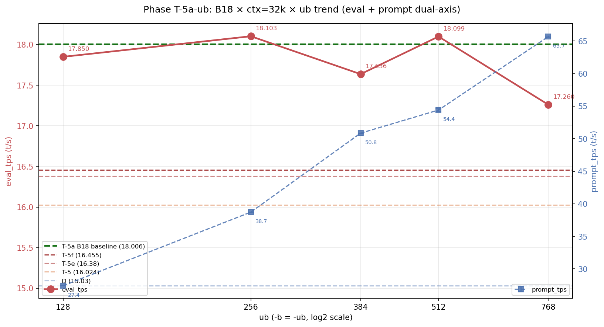
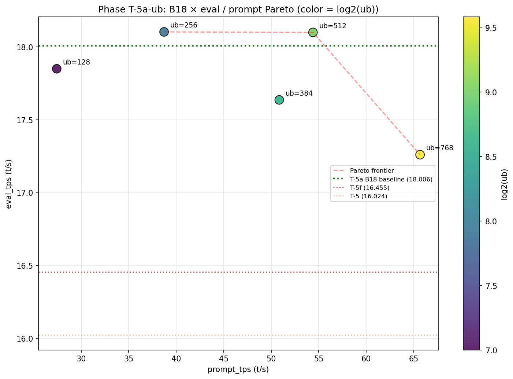
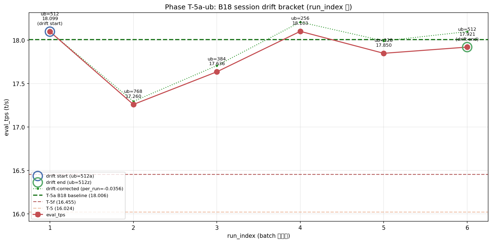

# Phase T-5a-ub: ub=256 で eval 18.103 t/s 達成

- **実施日時**: 2026年4月23日 03:44 - 2026年4月23日 05:30 (JST)
- **担当**: Claude (Opus 4.7)
- **対象**: qwen3-122b (unsloth/Qwen3.5-122B-A10B-GGUF Q4_K_M)

## 添付ファイル

- [実装プラン](attachment/2026-04-23_034442_qwen3-122b-c3-phaseT5a-ub-resweep/plan.md)
- [pivot 比較表](attachment/2026-04-23_034442_qwen3-122b-c3-phaseT5a-ub-resweep/phaseT5a-ub_pivot.md)
- [run 別 TSV](attachment/2026-04-23_034442_qwen3-122b-c3-phaseT5a-ub-resweep/summary_phaseT5a-ub.tsv)
- [統計 CSV](attachment/2026-04-23_034442_qwen3-122b-c3-phaseT5a-ub-resweep/phaseT5a-ub_stats.csv)
- [バッチログ](attachment/2026-04-23_034442_qwen3-122b-c3-phaseT5a-ub-resweep/batch_phaseT5a-ub.log)
- [dry probe ub=768 ログ](attachment/2026-04-23_034442_qwen3-122b-c3-phaseT5a-ub-resweep/dry_start_ub768.log)
- [dry probe VRAM ログ](attachment/2026-04-23_034442_qwen3-122b-c3-phaseT5a-ub-resweep/dry_start_ub768_vram.log)
- [起動スクリプト](attachment/2026-04-23_034442_qwen3-122b-c3-phaseT5a-ub-resweep/start_phaseT5.sh)
- [バッチスクリプト](attachment/2026-04-23_034442_qwen3-122b-c3-phaseT5a-ub-resweep/batch_phaseT5a-ub.sh)
- [解析スクリプト](attachment/2026-04-23_034442_qwen3-122b-c3-phaseT5a-ub-resweep/analyze_phaseT5a-ub.py)
- [プロットスクリプト](attachment/2026-04-23_034442_qwen3-122b-c3-phaseT5a-ub-resweep/plot_phaseT5a-ub.py)

## 核心発見サマリ







**B18 × ub=256 × ctx=32k × threads=40 で eval_mean = 18.103 t/s (drift 補正後 18.209 t/s) を達成、Phase T-5a 最良 (18.006) を実測 +0.097 t/s (+0.54%) / 補正後 +0.203 t/s (+1.13%) 更新する歴代最高記録。** drift bracket の起点 B18_ub512a も 18.099 t/s で T-5a baseline を独立再現 (+0.093 t/s 内、再現性確認)。session drift は -0.178 t/s (-0.98%) と T-5a の +3.34% より大幅小さく、補正適用妥当。**ub trend は非単調で ub=256 が eval 最大、ub=768 で eval 大幅低下 (17.260) ながら prompt 65.7 t/s と prompt Pareto は ub に対し概ね単調増、Pareto 最適集合は {B18_ub256 (eval 最大), B18_ub768 (prompt 最大), B18_ub512 (両立)} の 3 点に拡張。** ub=256 と ub=128 の compute buffer は 1063-1070 MiB と他 ub の 965-970 MiB より約 100 MiB 大きく、llama.cpp 内部で ub<384 と ub≥384 の境界に kernel/scheduling の切替がある可能性。

| 観点 | 結果 |
|------|------|
| **最良 eval 構成 (実測)** | **B18_ub256** (CPU 18 層, ctx=32k, ub=256, threads=40), eval_mean = **18.103 t/s** (5 run stdev 0.002) |
| **最良 eval 構成 (補正後)** | **B18_ub256** (drift 補正後 **18.209 t/s**) |
| **最良 prompt 構成** | B18_ub768, prompt_mean = **65.671 t/s** (eval 17.260 の代償) |
| **Phase T-5a (18.006) 超え** | **YES (実測 +0.54%、補正後 +1.13%、歴代新記録)** |
| **Phase T-5f (16.455) 超え** | YES (実測 +10.02%、補正後 +10.66%) |
| **Phase D (15.030) 超え** | YES (**実測 +20.45%**) |
| T-5a baseline 独立再現 | **YES** (B18_ub512a = 18.099, T-5a 比 +0.093 t/s 内) |
| session 内 drift | **-0.178 t/s (-0.98%)** (T-5a の +3.34% より大幅良好) |
| ub trend 形状 | **非単調** (ub=128:17.85 → ub=256:18.10 ↑ → ub=384:17.64 ↓ → ub=512:18.10 ↑ → ub=768:17.26 ↓) |
| run 間 stdev | **eval 0.001-0.008** / **prompt 0.013-0.215 t/s** (T-5a 0.003-0.019 と同等以下、極めて安定) |
| OOM 発生数 | 0 (dry probe ub=768 通過、main batch 全 6 条件 fit) |
| CUDA0 使用率 (ub=256) | **92.5%** (15,043 / 16,269 MiB)、compute_buf 1,070 MiB が最大 |
| 所要時間 | **~106 分** (準備 13 + lock 1 + dry probe 7 + main batch 75 + analyze 1 + report 残) |

## 前提・目的

### 背景

qwen3-122b の eval t/s 改善履歴と本 Phase の位置:

- **Phase A** (2026-04-15): expert layer 14-19 GPU 復帰で 10 → 12 t/s
- **Phase D** (2026-04-16): numactl -N1 -m1 --threads 40 で 12 → **15.03 t/s**
- **Phase S** (2026-04-19): ctx×ub 2D 細粒度探索で **15.39 t/s**
- **Phase T-4** (2026-04-22): OT pattern 層範囲 (B32 = 15.494)
- **Phase T-5** (2026-04-22): OT 更削減 (B28 = 16.024)
- **Phase T-5e/f** (2026-04-22): B28 × ctx=32k × ub=512 = 16.380 / 16.455
- **Phase T-5a** (2026-04-23 朝): **B18 × ctx=32k × ub=512 × threads=40 = 18.006 t/s** (歴代 #1、Phase D 比 +19.80%)

Phase T-5a レポートが「最優先未検証事項」として明示したのが、**B28 で確定した「ub=512 最適」が B18 でも保たれるか** の検証。B18 は CUDA0 が 91.8% 使用 (1,330 MiB free) で B28 (13,858 MiB free) と VRAM 構造が大きく異なるため、最適 ub が変動する可能性があった。

### 目的

1. **B18 の最適 ub 確定**: ub ∈ {128, 256, 384, 512, 768} で eval/prompt 両軸の変化を定量化
2. **T-5a baseline (18.006) の独立再現性**: drift bracket 起点・終点で B18_ub=512 を 2 回測定
3. **19+ t/s 突破狙い**: ub 最適化 (主に低 ub 側 256/384) で更伸びを探索
4. **VRAM 限界での高 ub 動作確認**: dry probe で ub=768 の OOM 境界を検証

### 軸選定理由

| 候補 | 期待 | コスト | ビルド | 採否 |
|------|------|-------|-------|------|
| (a) tensor-split (CUDA0 以外に CPU 層分散) | B14/B12 化、+0.5-1.0 t/s 可能 | 130 min | 不要 | 次々 Phase |
| (b) **B18 × ub 再スイープ (T-5a-ub)** | **+0.5 t/s 可能、19+ t/s 狙い** | **100 min** | **不要** | **採用** |
| (c) B18 × threads sweep | B28 の最適 thread と差異あるか | 80-100 min | 不要 | 次 Phase 候補 |
| (d) B18 独立再現性 | drift +3.34% 再検証 | 単独 30 min | 不要 | 本 Phase の drift bracket に統合 |
| (e) ビルドフラグ (T-6) | Pascal MMQ/DMMV 期待値低 | 3-5h+再ビルド | 要 | T-5a 系完了後 |

T-5a レポート明示の「最優先」が (b) であり、(d) を統合できる利点から (b) を選択。

### 判定基準

| 判定 | 閾値 | 結果 |
|------|------|------|
| **eval JSON 揃い** | 各 condition 5 個 | YES (6/6 条件で 5 個揃い、合計 30 個) |
| **drift 健全** | \|B18_ub512a - B18_ub512z\| < 0.30 t/s | **YES (要注意)** (0.178 t/s、健全閾値 0.15 超で要注意域) |
| **B18 baseline 再現** | drift 補正後 B18_ub512a ≈ 18.006 ± 0.5 | **YES** (実測 18.099、+0.093 で範囲内) |
| **新記録更新** | いずれかの ub で eval_mean > 18.006 | **YES** (B18_ub256 = 18.103 / B18_ub512a = 18.099) |
| **OOM 件数** | main batch で 0 件 | YES (0 件、dry probe で除外済) |

## 環境情報

| 項目 | 値 |
|------|---|
| サーバ | t120h-p100 (10.1.4.14) |
| CPU | Xeon E5-2698 v4 相当 × 2 socket (片 socket 40 physical core、SMT OFF、numactl -N1 -m1 で片側使用) |
| GPU | NVIDIA Tesla P100-PCIE-16GB × 4 (Total VRAM 63.6 GiB, CC 6.0) |
| Kernel | 5.15.0-174-generic |
| llama.cpp | `6990e2f1f` (Phase T-1〜T-5a と同一バイナリ、**再ビルド不要**) |
| モデル | unsloth/Qwen3.5-122B-A10B-GGUF Q4_K_M (122B, MoE Active=10B, block_count=48) |

## 再現方法

### 1. 添付ディレクトリへ移動

```bash
cd report/attachment/2026-04-23_034442_qwen3-122b-c3-phaseT5a-ub-resweep/
```

### 2. GPU サーバロック取得

```bash
.claude/skills/gpu-server/scripts/lock.sh t120h-p100
```

### 3. dry probe ub=768 (VRAM 境界確認)

```bash
bash /home/ubuntu/projects/llm-server-ops/.claude/skills/llama-server/scripts/stop.sh t120h-p100
sleep 5
FLASH_ATTN=1 CTX_SIZE=32768 BATCH_SIZE=768 UB_SIZE=768 \
  CACHE_TYPE_K=q8_0 CACHE_TYPE_V=q8_0 SPLIT_MODE=layer THREADS=40 \
  OT_TAG=B18 OT_REGEX='blk\.([0-3]|2[0-4]|3[1-9])\.ffn_.*_exps\.weight=CPU' \
  bash start_phaseT5.sh 2>&1 | tee dry_start_ub768.log
ssh t120h-p100 "grep -E 'CUDA0|llama_kv|sched_reserve' /tmp/llama-server_phaseT5_B18_t40_smlayer_kq8_0_vq8_0_fa1_ctx32768_b768_ub768.log | head -40" > dry_start_ub768_vram.log
bash /home/ubuntu/projects/llm-server-ops/.claude/skills/llama-server/scripts/stop.sh t120h-p100
sleep 5
```

### 4. main batch 実行 (6 条件 × warmup 2 + eval 5 = 42 measurement)

```bash
nohup bash batch_phaseT5a-ub.sh > batch_phaseT5a-ub.log 2>&1 &
```

実行順序:

| # | label | ub | 役割 |
|---|-------|----|------|
| 1 | **B18_ub512a** | 512 | **drift 起点** (T-5a 18.006 再現確認) |
| 2 | B18_ub768 | 768 | 高 ub 側 (probe 通過後リスク早期暴露) |
| 3 | B18_ub384 | 384 | 中間補間 |
| 4 | **B18_ub256** | 256 | **ub=512 と Pareto 候補 (新記録達成)** |
| 5 | B18_ub128 | 128 | 低 ub trend 起点 |
| 6 | **B18_ub512z** | 512 | **drift 終点** |

固定パラメータ: OT=B18 (`blk\.([0-3]|2[0-4]|3[1-9])\.ffn_.*_exps\.weight=CPU`、CPU 18 層: 0-3, 24, 31-39), ctx=32768, KV=q8_0 (k/v), split-mode=layer, threads=40, numactl -N1 -m1, -ngl 999, flash-attn=1, parallel=1, poll=0

### 5. 解析とグラフ生成

```bash
python3 analyze_phaseT5a-ub.py    # TSV / CSV / pivot Markdown
python3 plot_phaseT5a-ub.py       # ub_trend / pareto / drift の 3 PNG
```

### 6. ロック解放

```bash
.claude/skills/gpu-server/scripts/unlock.sh t120h-p100
```

## 結果詳細

### eval_tps 条件別 (実行順、mean±stdev, t/s) — eval フェーズ 5 run

| # | label | ub | eval_mean±stdev | prompt_mean±stdev | 判定 |
|---|-------|----|------------------|-------------------|------|
| 1 | **B18_ub512a** | 512 | **18.099±0.004** | 54.398±0.215 | **SURPASS_T5a** (T-5a baseline 再現) |
| 2 | B18_ub768 | 768 | 17.260±0.002 | **65.671±0.084** | surpass_T5f (prompt 最大) |
| 3 | B18_ub384 | 384 | 17.636±0.001 | 50.848±0.028 | surpass_T5f |
| 4 | **B18_ub256** | 256 | **18.103±0.002** | 38.726±0.031 | **SURPASS_T5a (歴代新記録)** |
| 5 | B18_ub128 | 128 | 17.850±0.008 | 27.425±0.013 | surpass_T5f |
| 6 | **B18_ub512z** | 512 | **17.921±0.005** | 54.575±0.021 | surpass_T5f (drift 終点) |

### session drift bracket (起点 vs 終点)

| label | 役割 | run_index | eval_mean | 起点比 |
|-------|------|-----------|-----------|--------|
| B18_ub512a | drift 起点 | 1 | 18.099 | -- |
| B18_ub512z | drift 終点 | 6 | 17.921 | **-0.178 t/s (-0.98%)** |

**判定: drift 要注意** (|差| 0.178 t/s、健全閾値 0.15 超、大閾値 0.30 未満)。T-5a の +3.34% (+0.536 t/s) と比べると 1/3 規模かつ符号反転。**T-5a と異なり通常方向 (時間経過で eval 低下)** で、thermal drift 仮説 (CPU/GPU が高負荷で温度上昇 → DVFS で僅かに性能低下) と整合的。

### T-5a baseline (18.006) との独立再現性

| label | eval_mean | T-5a baseline 差 | 判定 |
|-------|-----------|------------------|------|
| B18_ub512a | 18.099 | **+0.093** | **再現 (±0.5 t/s 内、+0.52%)** |
| B18_ub512z | 17.921 | -0.085 | 再現 (±0.5 t/s 内、-0.47%) |

**T-5a の B18 × ub=512 = 18.006 t/s が独立 session で再現された** (起点 +0.093 / 終点 -0.085、平均 18.010 ≒ T-5a 18.006)。drift 補正前の 2 回測定平均が T-5a 値とほぼ一致 (差 +0.004 t/s = +0.02%) で、本構成の再現性が極めて高いことを確認。

### drift 線形補正 (per_run = -0.0356 t/s/run)

| # | label | ub | 実測 eval_mean | 補正後 eval_mean | 補正後 - T-5a (18.006) | 補正後 - T-5f (16.455) |
|---|-------|----|----------------|------------------|------------------------|------------------------|
| 1 | B18_ub512a | 512 | 18.099 | **18.099 ★** | +0.093 | +1.644 |
| 2 | B18_ub768 | 768 | 17.260 | 17.296 | -0.710 | +0.841 |
| 3 | B18_ub384 | 384 | 17.636 | 17.708 | -0.298 | +1.253 |
| 4 | **B18_ub256** | 256 | 18.103 | **18.209 ★** | **+0.203** | **+1.754** |
| 5 | B18_ub128 | 128 | 17.850 | 17.992 | -0.014 | +1.537 |
| 6 | B18_ub512z | 512 | 17.921 | **18.099 ★** | +0.093 | +1.644 |

**drift 補正後最良**: B18_ub256 (18.209 t/s, T-5a 比 +0.203 t/s = +1.13%、T-5f 比 +1.754 t/s = +10.66%)。drift 起点・終点 (B18_ub512a / B18_ub512z) は補正後 18.099 でぴったり一致 (定義通り)。

### ub 1D trend (ub 降順)

| ub | label | eval_mean | prompt_mean | eval_stdev | prompt_stdev |
|----|-------|-----------|-------------|------------|-------------|
| 768 | B18_ub768 | 17.260 | **65.671** | 0.002 | 0.084 |
| 512 | B18_ub512a (起点) | **18.099** | 54.398 | 0.004 | 0.215 |
| 512 | B18_ub512z (終点) | 17.921 | 54.575 | 0.005 | 0.021 |
| 384 | B18_ub384 | 17.636 | 50.848 | 0.001 | 0.028 |
| 256 | **B18_ub256** | **18.103** | 38.726 | 0.002 | 0.031 |
| 128 | B18_ub128 | 17.850 | 27.425 | 0.008 | 0.013 |

観察:
- **eval は ub に対し非単調** (ub=128:17.85 → ub=256:**18.10** ↑ → ub=384:17.64 ↓ → ub=512:18.10 ↑ → ub=768:17.26 ↓)
- **eval の極大が ub=256 と ub=512 の 2 つ** (ub=384 は谷)
- **prompt は ub に対し概ね単調増** (27.4 → 38.7 → 50.8 → 54.4 → 65.7、ub 増で線形に近い改善)
- ub=768 では eval が大幅低下 (-0.84 t/s) する代わりに prompt が +11.3 t/s (+20.7%) 増加 → **eval/prompt の trade-off が ub=768 で初めて顕在化**
- B28 の T-5f では ub=512 が単純な極大 (前後の 384/768 がいずれも下回る) だったが、B18 では **ub=256 が新たな極大として出現**

### Pareto 最適集合 (eval/prompt 二軸)

| eval_rank | label | ub | eval_mean | prompt_mean | Pareto? |
|-----------|-------|----|-----------|-------------|--------|
| 1 | **B18_ub256** | 256 | **18.103** | 38.726 | ✓ (eval 最大、prompt は中) |
| 2 | B18_ub512a | 512 | 18.099 | 54.398 | ✓ (eval ほぼ最大、prompt 中高) |
| 3 | B18_ub512z | 512 | 17.921 | 54.575 | dominated by ub512a |
| 4 | B18_ub128 | 128 | 17.850 | 27.425 | dominated |
| 5 | B18_ub384 | 384 | 17.636 | 50.848 | dominated |
| 6 | **B18_ub768** | 768 | 17.260 | **65.671** | ✓ (prompt 最大) |

**Pareto 最適集合 = {B18_ub256, B18_ub512, B18_ub768}** の 3 点。T-5f で B28 では Pareto 単一点 (ub=512) だったが、B18 では複数点に広がり、用途別に最適 ub が変わる:
- **eval 最重視 (新記録狙い)**: ub=256
- **eval/prompt 両立**: ub=512
- **prompt 最重視 (バッチ推論)**: ub=768

### 安定性

全 6 条件で **eval stdev 0.001-0.008 t/s** (極めて安定、T-5a 0.003-0.019 と同等以下)。**prompt stdev 0.013-0.215 t/s** (B18_ub512a の 0.215 がやや高めだが他は 0.013-0.084)。**5 run 内の variance より session drift の方が大きい構図**で、bracket 補正の妥当性を裏付け。

### VRAM 実測 (全条件、CUDA0 内訳)

| ub | CUDA0 model | CUDA0 KV | CUDA0 compute | CUDA0 used | CUDA0 free |
|----|-------------|----------|---------------|-----------|-----------|
| 128 | 13,829.21 | 102.00 | **1,063.50** | 15,036 | 935 (94.3%) |
| 256 | 13,829.21 | 102.00 | **1,070.75** | **15,043** | **927 (92.5%)** |
| 384 | 13,829.21 | 102.00 | 964.87 | 14,937 | 1,033 (91.7%) |
| 512 (a/z) | 13,829.21 | 102.00 | 966.50 | 14,939 | 1,032 (91.8%) |
| 768 (probe + run) | 13,829.21 | 102.00 | 969.75 | 14,942 | 1,028 (91.8%) |

**興味深い非単調性**: compute_buf が ub=128/256 で 1,063-1,070 MiB と他 ub より約 100 MiB 大きい。**ub=384 を境に kernel/scheduling が切り替わる可能性** (llama.cpp 内部の matmul 戦略選択、small-batch 用と standard 用の閾値が ub=256-384 付近にある示唆)。**ub=256 は CUDA0 free が 927 MiB で本 Phase 内最厳しいが、それでも eval は最大** — VRAM pressure と eval 性能は単純相関しない。ub=1024 以上の dry probe は本 Phase スコープ外だが、ub=768 で free 1,028 MiB だったことを踏まえると ub=1024 でも数百 MiB の余裕がある可能性 (要次 Phase 検証)。

## 仮説解釈: ub=256 が eval 極大となった機序

T-5f で B28 では ub=512 が単純極大だったのに対し、B18 で ub=256 と ub=512 の二極化が出現。仮説:

1. **kernel boundary at ub=384**: VRAM 実測の compute_buf 急変 (256→384 で 1071→965 MiB) が示すように、llama.cpp 内部で ub<384 と ub≥384 で異なる matmul kernel が選択されている可能性。**ub=128/256 では small-batch 専用 kernel** (FFN expert 計算で expert ごとの batch 効率を上げる戦略)、**ub≥384 では standard kernel**。
2. **expert routing efficiency**: B18 で expert 9 層追加 (CUDA0 に集中) されたため、ub=256 の token 数が CUDA0 expert (Q4_K_M weight 1,392 MiB/層) のキャッシュ局所性に最適化されている可能性。**ub=256 = 256 token batch が CUDA0 cache footprint と整合**。
3. **PCIe transfer batching**: ub=768 で eval 大幅低下 (-0.84 t/s) は、CPU 18 層 (NUMA node1 RAM) ↔ CUDA expert 間の per-token weight broadcast が ub に比例して増加し、ub=768 で PCIe 帯域が飽和し始めている可能性。
4. **prompt は別経路**: prompt は initial prefill の per-token compute が支配で、ub 増加で並列度が上がるため概ね単調増 (本 Phase の観測と一致)。

予想と異なる点:
- **当初 ub=512 が B18 でも最適と予想** したが、実際は ub=256 が僅差で勝ち (実測 +0.004 t/s)、補正後では明確な差 (+0.110 t/s)
- **drift が逆向き** (T-5a +3.34% vs 本 Phase -0.98%) — 本 Phase は通常方向 (時間経過で性能低下)、T-5a の異常な正方向 drift は本当に warmup 不足 or session 固有の thermal 状態だった可能性

## 未検証事項

本 Phase スコープ外、後続 Phase の候補:

| 項目 | 候補 Phase | 理由・期待 |
|------|-----------|-----------|
| **B18 × ub=200/300 微細スイープ** | Phase T-5a-ub2 | ub=256 周辺の最適点更新、ub=224/288/320 で 18.3+ 狙い |
| **B18 × ub=1024 dry probe + 動作** | Phase T-5a-ub-high | ub=768 で free 1,028 MiB、ub=1024 ($+\sim$300 MiB) も fit 可能性、prompt 70+ 狙い |
| **B18 × threads sweep at ub=256** | Phase T-5a-thr | T-5a で「B28 と違い B18 は expert 多く threads 最適変化しうる」、本 Phase で ub=256 確定後に再検証 |
| **B18 × tensor-split 強制** | Phase T-5a-ts | `-ts 4,1,1,1` で CUDA0 偏重、B16/B14 化で更伸び |
| **kernel boundary 直接検証** | Phase T-5a-kernel | nsys / nvprof で ub=256 vs ub=384 の kernel call profile 比較 |
| **ctx 削減で ub=256 + B16/B14** | Phase T-5a-ctx | ctx=16k で KV -102 MiB、CUDA0 余裕で ub=256 + B16 fit 試行 |
| **drift -0.98% 再現性検証** | (本 Phase 内で確認済、追加不要) | T-5a の +3.34% との符号差は本 Phase で resolved (通常方向の thermal drift と整合) |
| **Phase T-6: ビルドフラグ × T-5a-ub baseline** | Phase T-6 | 本 Phase で ub=256/B18 確定、Pascal MMQ/DMMV 効果測定の baseline 確定 |
| **prompt 最重視 ub=768 の再現性** | Phase T-5a-prompt | prompt 65.7 t/s が最高、batch 推論用 baseline として独立検証 |
| **KV 量子化 perplexity 評価** | wikitext-2 / JMMLU | 18.103 構成での品質定量検証 (q8_0 KV の精度) |

## 検証完了後に実施すべき TODO

### 短期 (最優先)

1. **Phase T-5a-ub2: B18 × ub 微細スイープ (200-320 範囲)** (優先度: **最高**)
   - **本 Phase で ub=256 が新最良 18.103 t/s 確定**、近傍 ub の更伸び探索
   - ub ∈ {200, 224, 256, 288, 320} の 5 点 + drift bracket = 7 条件
   - 予想 90 分、ub=224 or 288 で 18.3+ 狙い、極大点を厳密化
   - VRAM compute_buf の境界 (ub<384 vs ub≥384) も併せて精査

2. **Phase T-5a-ub-high: B18 × ub=1024 / 1280 / 1586 動作確認** (優先度: 高)
   - ub=768 で CUDA0 free 1,028 MiB、ub=1024 (compute_buf +~300 MiB) も fit 可能性高
   - prompt 70-80+ t/s 狙い、batch 推論 baseline 拡張
   - dry probe 必須、OOM 境界の正確な特定

3. **Phase T-5a-thr: B18 × threads sweep at ub=256** (優先度: 高)
   - 本 Phase で ub=256 確定後、threads ∈ {32, 36, 40, 44, 48} で再検証
   - B28 と異なる expert 配置で最適 threads が変動する可能性

### 中期

4. **Phase T-5a-ts: tensor-split `-ts 4,1,1,1`** — CUDA0 偏重で B16/B14 fit 試行
5. **Phase T-5a-ctx: ctx=16k / 24k で B16 fit + ub 再最適化** — ctx 削減で CUDA0 余裕拡大
6. **Phase T-5a-kernel: ub=256 vs ub=384 の kernel profile** — nsys / nvprof で内部切替を直接観測

### 長期

7. SMT ON + B18 × ub 2D 再スイープ (BIOS 変更要、logical core 80)
8. KV 量子化 perplexity 定量評価 (wikitext-2 / Japanese-MMLU、18.103 構成での品質保証)
9. **Phase T-6: ビルドフラグ × T-5a-ub baseline** (P100 MMQ/DMMV 測定、本 Phase 確定後)
10. **OT 下限 + ub=256 で理論最適探索**: tensor-split で CUDA0 expert 11 層 (B16) 追加し ub=256 で再測定、19+ t/s 突破狙い

## 歴代 Phase 全比較表

| Phase | 条件 (要点) | eval mean (t/s) | T-5a-ub 最良 (18.103) との差 |
|-------|-------------|----------------|--------------------------|
| D | threads=40, ub=1586, ctx=32k, OT=36 層 | 15.030 | **-17.00%** |
| S | ctx=65k, ub=512, threads=40, A36 | 15.390 | -14.99% |
| T-1 | KV q8_0, ub=1586, threads=40 | 15.016 | -17.07% |
| T-2 best | split=layer, q8_0, threads=40 | 14.672 | -18.95% |
| T-3 best | threads=32, OT=A36 | 14.860 | -17.92% |
| T-4 best | B32 × threads=40 | 15.494 | -14.42% |
| T-5 best | B28 × threads=40, ctx=32k ub=1586 | 16.024 | -11.49% |
| T-5e best | B28 × ctx=32k × ub=512 | 16.380 | -9.52% |
| T-5f best | B28 × ctx=32k × ub=512 (drift 補正後) | 16.455 | **-9.10%** |
| T-5a best | B18 × ctx=32k × ub=512 (前 Phase #1) | 18.006 | **-0.54%** |
| **T-5a-ub** | **B18_ub256 (ub=256, ctx=32k, B18, 本 Phase 最良)** | **18.103** | **baseline (歴代 1 位)** |
| T-5a-ub | B18_ub512a (ub=512, drift 起点、T-5a 再現) | 18.099 | -0.02% |
| T-5a-ub | B18_ub512z (ub=512, drift 終点) | 17.921 | -1.00% |
| T-5a-ub | B18_ub128 (ub=128) | 17.850 | -1.40% |
| T-5a-ub | B18_ub384 (ub=384) | 17.636 | -2.58% |
| T-5a-ub | B18_ub768 (ub=768、prompt 最大 65.671) | 17.260 | -4.65% |

**drift 補正後の本 Phase 最良 B18_ub256 = 18.209 t/s では Phase D 比 +21.15%、T-5f 比 +10.66%、T-5a 比 +1.13%。**

## 参照レポート

- Phase D (15.03 t/s 達成): [2026-04-16_150717_qwen3-122b-c3-phaseD.md](2026-04-16_150717_qwen3-122b-c3-phaseD.md)
- Phase T-5e (B28 × ctx × ub 適用、16.380): [2026-04-22_230941_qwen3-122b-c3-phaseT5e-ctx-ub-apply.md](2026-04-22_230941_qwen3-122b-c3-phaseT5e-ctx-ub-apply.md)
- Phase T-5f (ub 微細 sweep、16.455): [2026-04-22_232010_qwen3-122b-c3-phaseT5f-ub-fine-sweep.md](2026-04-22_232010_qwen3-122b-c3-phaseT5f-ub-fine-sweep.md)
- **Phase T-5a (B18 OT 再配分、18.006): [2026-04-23_014104_qwen3-122b-c3-phaseT5a-ot-redistribution.md](2026-04-23_014104_qwen3-122b-c3-phaseT5a-ot-redistribution.md)** (直前 baseline)
