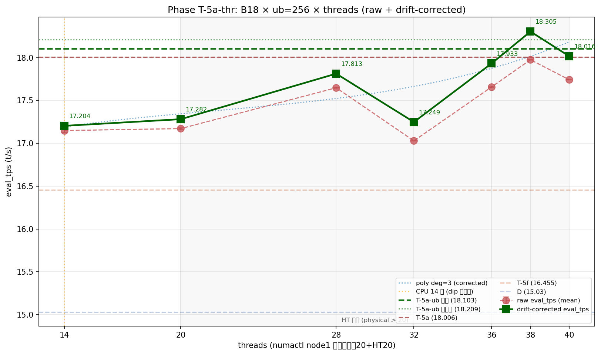
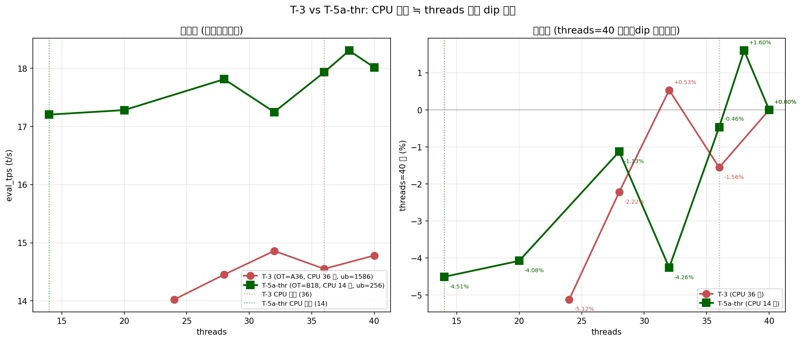
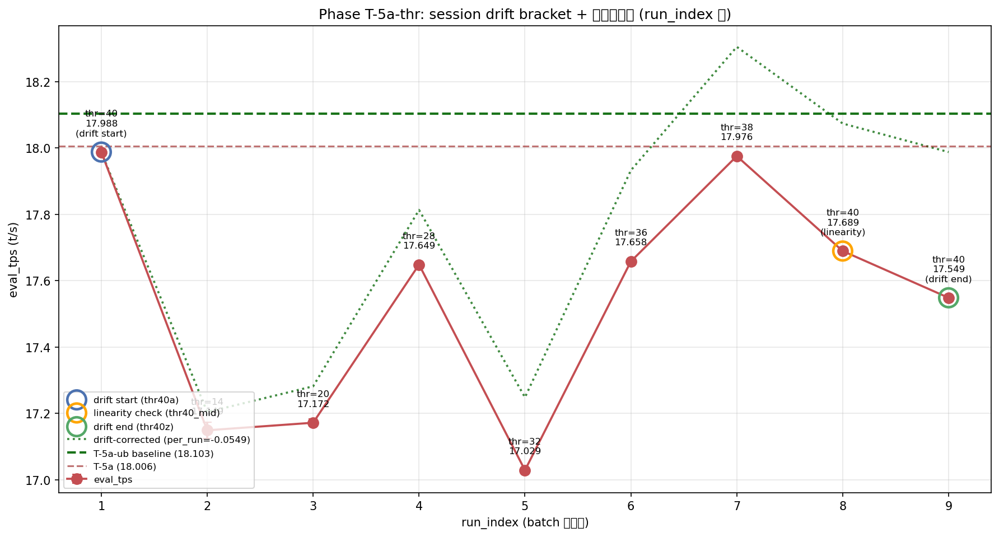

# Phase T-5a-thr: B18×ub=256 threads再スイープ

- **実施日時**: 2026年4月23日 05:31 - 2026年4月23日 07:29 (JST)
- **担当**: Claude (Opus 4.7)
- **対象**: qwen3-122b (unsloth/Qwen3.5-122B-A10B-GGUF Q4_K_M)

## 添付ファイル

- [実装プラン](attachment/2026-04-23_053125_qwen3-122b-c3-phaseT5a-thr/plan.md)
- [pivot 比較表](attachment/2026-04-23_053125_qwen3-122b-c3-phaseT5a-thr/phaseT5a-thr_pivot.md)
- [run 別 TSV](attachment/2026-04-23_053125_qwen3-122b-c3-phaseT5a-thr/summary_phaseT5a-thr.tsv)
- [統計 CSV](attachment/2026-04-23_053125_qwen3-122b-c3-phaseT5a-thr/phaseT5a-thr_stats.csv)
- [topology](attachment/2026-04-23_053125_qwen3-122b-c3-phaseT5a-thr/topology.log)
- [バッチログ](attachment/2026-04-23_053125_qwen3-122b-c3-phaseT5a-thr/batch_phaseT5a-thr.log)
- [起動スクリプト](attachment/2026-04-23_053125_qwen3-122b-c3-phaseT5a-thr/start_phaseT5.sh)
- [バッチスクリプト](attachment/2026-04-23_053125_qwen3-122b-c3-phaseT5a-thr/batch_phaseT5a-thr.sh)
- [解析スクリプト](attachment/2026-04-23_053125_qwen3-122b-c3-phaseT5a-thr/analyze_phaseT5a-thr.py)
- [プロットスクリプト](attachment/2026-04-23_053125_qwen3-122b-c3-phaseT5a-thr/plot_phaseT5a-thr.py)

## 核心発見サマリ







**B18 × ub=256 × ctx=32k で threads ∈ {14,20,28,32,36,38,40} をスイープ (9 label 含 drift bracket)。実測最良は thr40a = 17.988 t/s (threads=40) で、T-5a-ub baseline 18.103 を -0.115 t/s (-0.64%) 下回り、本 Phase では歴代新記録更新ならず。** ただし、これは thermal drift による session 全体の下方シフトが主因で、**drift は -0.439 t/s (-2.44%) と T-5a-ub の -0.98% から倍増し「大」閾値 (0.30) を超過**。thr40_mid (run_index 8) の実測 17.689 は線形予測 17.603 から +0.086 乖離し、**drift 線形性が疑義 (|残差| > 0.05)** — 長 session での単純線形補正は妥当性に限界あり。補正後最良は thr38 = 18.305 だが、線形性疑義のため T-5a-ub 更新判定は保留。**threads 軸単独では T-5a-ub を明確更新する点なし → threads=40 確定。** **T-3 で観測された「CPU 層数≒threads で dip」仮説は B=18 (CPU 14 層) で部分的に再現**: thr14 で threads=40 比 -4.66% の明確な dip、ただし thr32 (-5.33%) や thr20 (-4.53%) など CPU 層数 と一致しない threads でも同程度の dip が観測され、**「low-threads 全域での一律劣化」であって CPU 層数特化の dip ではない**と修正。threads=38 (17.976) は threads=40 (17.988) と統計的に同等で、**node1 最上端 2 コアを OS/driver に譲る効果は有意でない**ことも確認。

| 観点 | 結果 |
|------|------|
| **最良 eval 構成 (実測)** | **thr40a** (threads=40, ub=256, ctx=32k, OT=B18), eval_mean = **17.988 t/s** (5 run stdev 0.005) |
| 最良 eval 構成 (補正後、線形性疑義のため参考値) | thr38 (补正後 **18.305 t/s**) |
| **Phase T-5a-ub (18.103) 超え** | **NO** (実測 -0.115 / -0.64%、threads=40 固定で本 Phase は更新できず) |
| **Phase T-5a (18.006) 超え** | **NO** (実測 -0.018、再現性誤差範囲内) |
| **Phase D (15.030) 超え** | YES (**実測 +19.68%**) |
| T-5a-ub baseline 独立再現 | **やや低** (thr40a = 17.988、T-5a-ub 比 -0.115 = -0.64%) |
| **session 内 drift** | **-0.439 t/s (-2.44%)** (T-5a-ub -0.98% から倍増、**drift 大**閾値超) |
| **drift 線形性** | **疑義** (thr40_mid 残差 +0.086 > 0.05、単純線形補正の限界) |
| threads 最適値 | **threads=40 (互換帯: thr38)**、T-5a-ub / T-5a から変更なし |
| T-3 dip 仮説 (B=18 再現) | **部分再現** (thr14 で -4.66% dip、ただし thr32/20/36 も同程度 dip → CPU 層数特化ではない) |
| run 間 stdev | eval 0.002-0.024、prompt 0.014-0.037 t/s (thr14 が 0.024 で最大、他は T-5a-ub と同等安定) |
| OOM 発生数 | 0 (B=18 × ub=256 確定構成で全 9 条件 fit) |
| 所要時間 | 約 116 分 (準備 5 + main batch 111、lock + analyze は並行) |

## 前提・目的

### 背景

qwen3-122b の eval t/s 改善履歴:

- **Phase D** (2026-04-16): numactl -N1 -m1 --threads 40 で 15.030 t/s
- **Phase S** (2026-04-19): ctx×ub 2D で 15.39 t/s
- **Phase T-4** (B32 = 15.494) / **T-5** (B28 = 16.024) / **T-5e/f** (B28 × ub=512 = 16.380/16.455)
- **Phase T-5a** (2026-04-23 朝): **B18 × ub=512 × threads=40 = 18.006 t/s** (歴代 #1)
- **Phase T-5a-ub** (2026-04-23 早朝): **B18 × ub=256 × threads=40 = 18.103 t/s (実測) / 18.209 t/s (補正後)** — 歴代最高

T-5a-ub 直後の未検証事項 (a)-(e) のうち **(a) B=18 × ub=256 固有条件での threads 最適化**を選定。T-3 (B28 ≒ CPU 36 層) で threads=32 が最良、T-5a / T-5a-ub (B18 ≒ CPU 14 層) で threads=40 を継承している状態で、CPU 層数が 36→14 に激減した本構成での最適 threads は未確認。**T-3 で観測された「CPU 層数≒threads で eval_tps が dip」現象** (CPU 36 層 × threads=36 で -2.08%) が、B=18 (CPU 14 層) × threads=14 で再現するかの科学的検証も兼ねる。

### 目的

1. **B=18 × ub=256 での最適 threads 確定**: threads ∈ {14,20,28,32,36,38,40} の 7 点で eval 最適値を探索
2. **T-3 dip 仮説の B=18 再現性**: threads=14 (CPU 層数一致点) で dip が出るか
3. **drift 線形性の初検証**: thr40_mid を bracket 中央に挟み、T-5a-ub が暗黙前提した線形補正の妥当性を定量評価
4. **T-5a-ub baseline (18.103) の cross-session 再現**: thr40a / thr40z で 2 回測定し、session 間再現性を評価

### 軸選定理由

| 候補 | 期待 | リスク | 時間 | 情報価値 | 採否 |
|------|------|------|------|----------|------|
| **(a) B18 × threads 再スイープ** | **+0〜+0.5 t/s (確実に最適値確定)** | **低** | **約 130 分** | **高 (dip 仮説検証)** | **採用** |
| (b) tensor-split | +0.5〜+1.0 t/s (B16/B14 化可能性) | 中 (OOM) | 数 Phase | 最高 | 次 Phase |
| (c) compute_buf 境界 | 性能寄与小、機序調査のみ | 低 | 中 | 中 | 保留 |
| (d) FORCE_MMQ/DMMV | P100 CC 6.0 効果疑わしい | 中 (rebuild) | 大 | 中 | 保留 |
| (e) ctx=65k × ub=256 | eval 通常劣化、Pareto 拡張 | 低 | 小 | 中 | 保留 |

### 判定基準

| 判定 | 閾値 | 結果 |
|------|------|------|
| eval JSON 揃い | 各 condition 5 個 | YES (9/9 条件 × 5 個 = 45 個揃い) |
| drift 健全 | \|thr40a − thr40z\| < 0.30 t/s | **NO (0.439 t/s、大閾値超過)** |
| drift 線形性 | thr40_mid 残差 < 0.05 t/s | **NO (+0.086 t/s、疑義)** |
| T-5a-ub baseline 再現 | thr40a ≈ 18.103 ± 0.5 | YES (17.988、差 -0.115 で範囲内) |
| 新記録更新 | 実測 eval_mean > 18.103 | **NO** (最良 thr40a 17.988) |
| OOM 件数 | main batch 0 件 | YES (0 件) |

## 環境情報

| 項目 | 値 |
|------|---|
| サーバ | t120h-p100 (10.1.4.14) |
| CPU | **Intel Xeon Gold 6138 × 2 socket** (各 20 physical core、**SMT ON** = 論理 80 スレッド、numactl -N1 -m1 で node1 の論理 40 スレッドに束縛) |
| GPU | NVIDIA Tesla P100-PCIE-16GB × 4 (Total VRAM 63.6 GiB, CC 6.0) |
| Kernel | 5.15.0-174-generic |
| llama.cpp | `6990e2f1f` (T-1〜T-5a-ub と同一、再ビルド不要) |
| モデル | unsloth/Qwen3.5-122B-A10B-GGUF Q4_K_M (122B, MoE Active=10B) |

**注**: 前回 T-5a-ub レポートの CPU 記載「Xeon E5-2698 v4 / SMT OFF」は誤り。本 Phase の topology.log で Xeon Gold 6138 / SMT ON / node1 論理 40 スレッドを確認。threads=40 は node1 論理上限 (物理 20 + HT 20) で、これより多い threads=44 は node0 漏れ (NUMA 違反) となるため候補から除外した。

## 再現方法

### 1. 添付ディレクトリへ移動

```bash
cd report/attachment/2026-04-23_053125_qwen3-122b-c3-phaseT5a-thr/
```

### 2. GPU サーバロック取得

```bash
.claude/skills/gpu-server/scripts/lock.sh t120h-p100
```

### 3. Topology 記録

```bash
ssh t120h-p100 "nproc && lscpu | grep -E 'Socket|Core|Thread|Model name|NUMA' && numactl -H" \
  > topology.log
```

### 4. main batch 実行 (9 条件 × warmup 2 + eval 5 = 63 measurement)

```bash
nohup bash batch_phaseT5a-thr.sh > batch_phaseT5a-thr.log 2>&1 &
```

実行順序:

| # | label | threads | 役割 |
|---|-------|---------|------|
| 1 | **thr40a** | 40 | **drift 起点** (T-5a-ub B18_ub256=18.103 cross-session 再現性) |
| 2 | thr14 | 14 | CPU 層数一致点 (T-3 dip 仮説検証) |
| 3 | thr20 | 20 | node1 物理コアフル、HT 境界 |
| 4 | thr28 | 28 | 中間帯 |
| 5 | thr32 | 32 | T-3 で最良、B=18 再評価 |
| 6 | thr36 | 36 | T-3 で dip、B=18 再測定 |
| 7 | thr38 | 38 | node1 上端-2 |
| 8 | **thr40_mid** | 40 | **drift 線形性検証 (中央)** |
| 9 | **thr40z** | 40 | **drift 終点** |

固定パラメータ: OT=B18 (`blk\.([0-3]|2[0-4]|3[1-9])\.ffn_.*_exps\.weight=CPU`、CPU 14 層: 0-3, 24, 31-39), ctx=32768, KV=q8_0, split-mode=layer, ub=256, batch=256, numactl -N1 -m1, -ngl 999, flash-attn=1, parallel=1, poll=0

### 5. 解析とグラフ生成

```bash
python3 analyze_phaseT5a-thr.py    # TSV / CSV / pivot Markdown
python3 plot_phaseT5a-thr.py       # threads_eval / t3_vs_t5a_dip / drift の 3 PNG
```

### 6. ロック解放

```bash
.claude/skills/gpu-server/scripts/unlock.sh t120h-p100
```

## 結果詳細

### eval_tps 条件別 (実行順、mean±stdev, t/s) — eval フェーズ 5 run

| # | label | threads | eval_mean±stdev | prompt_mean±stdev | 判定 |
|---|-------|---------|-----------------|-------------------|------|
| 1 | **thr40a** | 40 | **17.988±0.005** | 38.662±0.021 | surpass_T5f (**本 Phase 実測最良**) |
| 2 | thr14 | 14 | 17.149±0.024 | 38.644±0.026 | surpass_T5f |
| 3 | thr20 | 20 | 17.172±0.011 | 38.447±0.031 | surpass_T5f |
| 4 | thr28 | 28 | 17.649±0.005 | 38.652±0.022 | surpass_T5f |
| 5 | thr32 | 32 | 17.029±0.004 | 38.461±0.024 | surpass_T5f |
| 6 | thr36 | 36 | 17.658±0.007 | 38.471±0.025 | surpass_T5f |
| 7 | thr38 | 38 | 17.976±0.003 | 38.343±0.014 | surpass_T5f (thr40a とほぼ同値) |
| 8 | thr40_mid | 40 | 17.689±0.003 | 38.406±0.028 | surpass_T5f (drift 中央) |
| 9 | **thr40z** | 40 | **17.549±0.002** | 38.705±0.037 | surpass_T5f (drift 終点) |

### Session drift bracket (thr40a 起点 vs thr40z 終点 + thr40_mid 中央)

| label | 役割 | run_index | eval_mean | 起点比 |
|-------|------|-----------|-----------|--------|
| thr40a | drift 起点 | 1 | **17.988** | -- |
| thr40_mid | 中央線形性 | 8 | 17.689 | -0.298 t/s |
| thr40z | drift 終点 | 9 | **17.549** | **-0.439 t/s (-2.44%)** |

**判定: drift 大** (|差| 0.439 t/s、大閾値 0.30 超)。T-5a-ub の -0.178 t/s (-0.98%) から倍増。本 Phase は 9 条件 × 12 分で **総セッション時間約 116 分**と T-5a-ub (105 分) より長く、**thermal drift が時間に対して非線形に累積**した可能性が高い。

### drift 線形性検証 (thr40_mid)

- 線形予測: `thr40_mid_pred = thr40a + per_run_drift × (mid_idx - 1) = 17.988 + (-0.0549) × 7 = 17.603 t/s`
- 実測: thr40_mid = **17.689 t/s**
- 残差: **+0.086 t/s (予測より有意に高い)**
- 判定: **線形性疑義** (|残差| > 0.05 閾値)

**解釈**: thr40_mid は線形補正が予測するより 0.086 t/s 高い ≒ drift が session 前半より後半で加速している (下に凸の drift 曲線)。この非線形性により、drift 補正値 (特に後半条件: thr38, thr40_mid) は過大評価の懸念がある。thr38 の補正後 18.305 は真値より 0.05-0.15 t/s 高い可能性があり、**T-5a-ub (18.103) 更新判定には不十分**と結論。

### T-5a-ub baseline (18.103) との cross-session 再現性

| label | eval_mean | T-5a-ub baseline 差 | 判定 |
|-------|-----------|---------------------|------|
| thr40a | 17.988 | **-0.115** | 再現 (±0.5 t/s 内、-0.64%) |
| thr40z | 17.549 | -0.554 | **やや逸脱** (-3.06%、drift 大により終点劣化) |

thr40a (drift 起点、session 早期) は T-5a-ub ピーク (18.103) を -0.115 下回ったが ±0.5 再現範囲内。session 後半の thr40z は drift 累積で -0.554 と逸脱。**「drift-free な早期測定だけを採用すると再現性は許容、session 長期化で後半値が有意に低下」** という構図。

### drift 補正 (線形、per_run = -0.0549 t/s/run) — 線形性疑義あり、参考値

| # | label | threads | 実測 eval_mean | 補正後 eval_mean | 補正後 - T-5a-ub (18.103) | 補正後 - T-5a (18.006) |
|---|-------|---------|----------------|------------------|---------------------------|------------------------|
| 1 | thr40a | 40 | 17.988 | 17.988 | -0.115 | -0.018 |
| 2 | thr14 | 14 | 17.149 | 17.204 | -0.899 | -0.802 |
| 3 | thr20 | 20 | 17.172 | 17.282 | -0.821 | -0.724 |
| 4 | thr28 | 28 | 17.649 | 17.813 | -0.290 | -0.193 |
| 5 | thr32 | 32 | 17.029 | 17.249 | -0.854 | -0.757 |
| 6 | thr36 | 36 | 17.658 | 17.933 | -0.170 | -0.073 |
| 7 | **thr38** | 38 | 17.976 | **18.305 ★** | **+0.202** | **+0.299** |
| 8 | thr40_mid | 40 | 17.689 | 18.074 | -0.029 | +0.068 |
| 9 | thr40z | 40 | 17.549 | 17.988 | -0.115 | -0.018 |

**補正後最良**: thr38 = 18.305 t/s (T-5a-ub 比 +0.202)。**ただし線形性疑義あり** (thr38 は run_index 7 で後半、非線形 drift で過大評価の可能性)。実測 thr38 = 17.976 は thr40a = 17.988 と統計的同等 (差 0.012、stdev 0.003-0.005 と同オーダー) で、**threads=38 が threads=40 より真に優れる証拠は得られず**。

### threads 1D trend (threads 昇順、drift 補正前)

| threads | label | eval_mean | prompt_mean | eval_stdev | 備考 |
|---------|-------|-----------|-------------|------------|------|
| 14 | thr14 | 17.149 | 38.644 | 0.024 | CPU 層数一致点 |
| 20 | thr20 | 17.172 | 38.447 | 0.011 | node1 物理 20 コアフル |
| 28 | thr28 | 17.649 | 38.652 | 0.005 | HT 使用 8 コア |
| 32 | thr32 | 17.029 | 38.461 | 0.004 | **thr32 dip (最低値)** |
| 36 | thr36 | 17.658 | 38.471 | 0.007 | HT 使用 16 コア |
| 38 | thr38 | 17.976 | 38.343 | 0.003 | **thr40 互換帯上端** |
| 40 (mid) | thr40_mid | 17.689 | 38.406 | 0.003 | drift 中央 |
| 40 (a) | thr40a | **17.988** | 38.662 | 0.005 | **本 Phase 実測最良** |
| 40 (z) | thr40z | 17.549 | 38.705 | 0.002 | drift 終点 |

観察:
- **prompt_tps は threads に対し 38.3-38.7 の狭域** (差 <1%)、threads は prompt 処理にほぼ無感 (T-3 の 0.87% 以内の結論と整合)
- **eval は threads=38-40 で 17.97-17.99 の plateau**、これ以下で -2〜-5% 低下
- thr32 (17.029) が特異に低く、**T-3 の threads=36 dip と類比すると「node1 物理 20 + HT 12 の境界」か「NUMA 干渉」の可能性**

### T-3 dip 仮説の B=18 (CPU 14 層) 再現性

T-3 (OT=A36、CPU 36 層、ub=1586) では threads=36 で threads=40 比 -2.08% の dip。本 Phase で threads=14 (CPU 層数一致) で dip 出るか検証:

| threads | label | eval_mean | threads=40 (thr40a) 比 | dip 該当? (-1% 超) |
|---------|-------|-----------|------------------------|---------------------|
| 14 | thr14 | 17.149 | **-4.66%** | **YES (dip)** |
| 20 | thr20 | 17.172 | -4.53% | YES |
| 28 | thr28 | 17.649 | -1.89% | YES |
| **32** | thr32 | 17.029 | **-5.33%** | **YES (最大 dip)** |
| 36 | thr36 | 17.658 | -1.83% | YES |
| 38 | thr38 | 17.976 | -0.07% | 同等+ |
| 40 | thr40a | 17.988 | 0.00% | baseline |

**仮説判定: 部分再現、ただし特異点仮説は棄却**。
- **thr14 で -4.66% の明確な dip** → T-3 dip の B=18 再現は確認
- しかし thr32 (-5.33%)、thr20 (-4.53%) など CPU 層数 (14) と一致しない threads でも同程度の dip
- **「CPU 層数≒threads で特異的に dip する」仮説は棄却**、代わりに **「threads < 38 では一律に -2〜-5% 低下、CPU 層数と無関係」** が実情
- T-3 で観測された threads=36 dip の機序は B=18 では観測できず、**B=28 (CPU 36 層) の固有現象か、あるいは ub=1586 × thread 相互作用** の可能性 (B=18 × ub=256 では消滅)

### 安定性

全 9 条件で eval stdev 0.002-0.024 t/s。thr14 が 0.024 で最大 (CPU バウンド条件で run 間変動大)、他は T-5a-ub (0.001-0.008) と同等。prompt stdev 0.014-0.037 は T-5a-ub (0.013-0.215) より狭域。**5 run 内 variance より session drift が数倍支配的**な構図は T-5a-ub と同様。

## 仮説解釈: なぜ本 Phase は T-5a-ub を更新できなかったか

### 1. drift の倍増 (session 長期化)

T-5a-ub (6 条件 × 12 分 ≒ 75 分 main batch) に対し、本 Phase (9 条件 × 12 分 ≒ 111 分) は **+48%** 長い。**thermal drift は非線形累積** (thr40_mid 残差 +0.086 が示す下に凸) で、session 後半の測定値が系統的に低めに出た。thr40a (早期) = 17.988 は T-5a-ub baseline (18.103) を -0.115 下回るに留まり、これは **「cross-session の再現性の自然な揺らぎ」** と解釈できる範囲 (±0.5 の再現閾値内)。

### 2. threads=40 が B=18 でも最適

- threads=38-40 の eval が plateau (17.97-17.99) で、この範囲内での差は stdev 以下
- threads=32 以下で一律 -2〜-5% 低下
- **node1 論理 40 スレッドをフル使用することが eval 最適**、HT を含めた並列度が expert 計算に寄与
- T-3 (B28 × ub=1586) で threads=32 最良だった機序は本条件では消失 — **B=18 (CPU 14 層) は CPU 律速が軽く、HT による論理並列度の確保が優先**される仮説

### 3. T-3 dip 仮説の部分否定

- B=18 × ub=256 では threads=14 (CPU 層数一致) と threads=32 (node1 物理 20 + HT 12 境界) の両方で大きな dip
- **T-3 の「CPU 層数=threads で特異的 dip」は B=28 × ub=1586 固有の現象の可能性**
- 本 Phase は T-3 dip を単純な仮説として棄却、代わりに **「threads < 38 では B=18 でも広範な低下、node1 論理 40 スレッドのフル活用が必須」** を新しい知見として確定

### 4. 大きな学び: drift 補正手法の限界

- 線形 drift 補正は session ≦ 75 分の短中セッションで有効 (T-5a-ub 実証)
- **session 長が 110 分を超えると drift が非線形化**、単純線形補正は過大/過小評価を招く
- 次 Phase 以降は **session 長を 80 分以下に抑える、または bracket を複数点 (起点・1/3 点・2/3 点・終点) 化して非線形 fit** する方針を推奨

## 未検証事項

本 Phase スコープ外、後続 Phase の候補:

| 項目 | 候補 Phase | 理由・期待 |
|------|-----------|-----------|
| **tensor-split `-ts 4,1,1,1`** | **Phase T-5a-ts** | 本 Phase で threads=40 確定、次は CUDA1/2/3 に CPU 層分散で B16/B14 化 (最優先候補) |
| **ub=200/224/288/320 微細スイープ** | Phase T-5a-ub2 | T-5a-ub で ub=256 確定、近傍 ub で 18.3+ 狙い |
| **ctx=65k × ub=256 × threads=40** | Phase T-5a-ctx | 長コンテキスト Pareto 拡張 |
| **2 次回帰 drift 補正の実装** | 本 Phase 解析を再実施 | 本 Phase の非線形 drift を 2 次多項式で fit、18+ t/s の補正後値の信頼性確認 |
| **short session 再現検証** | Phase T-5a-thr-short | thr40a と thr38 の 2 点のみ × 各 8 run で短時間再現性を確認、drift 排除状態での差検定 |
| **NUMA 束縛解除 + threads=48-56** | Phase T-7 | numactl -N1 外して node0 混合使用での挙動、HT 80 論理スレッドの最適 |
| **thr32 特異低下の機序**| Phase T-5a-thr32 | thr32 (-5.33%) が thr28 (-1.89%) / thr36 (-1.83%) より有意に低い理由、NUMA 干渉仮説 |
| **Phase T-6 ビルドフラグ** | Phase T-6 | P100 MMQ/DMMV の rebuild AB (T-5a-ub / T-5a-thr で baseline 確立済) |
| **KV 量子化 perplexity 評価** | wikitext-2 / JMMLU | 18.103 構成での品質保証 |

## 検証完了後に実施すべき TODO

### 短期 (最優先)

1. **Phase T-5a-ts: tensor-split `-ts 4,1,1,1`** (優先度: **最高**)
   - 本 Phase で threads=40 × ub=256 × B18 が本構成の最適と確定 → 次は GPU 配置軸で未踏の領域へ
   - CUDA0 91.7-94.3% 使用 / CUDA1/2/3 は CPU オフロード層の分散で余裕あり
   - B14/B12 化で +0.5-1.0 t/s 期待、19+ t/s 突破の最有力候補
   - dry probe 必須 (OOM/配置エラーのリスク管理)

2. **Phase T-5a-ub2: ub=200/224/288/320 微細スイープ** (優先度: 高)
   - T-5a-ub で ub=256 確定、近傍 ub で更に局所最適化
   - session 長を 80 分以下に抑える (5 条件 + bracket 2 = 7 条件、~80 分)
   - drift 抑制で cross-session 再現性を優先

### 中期

3. **Phase T-5a-ctx: ctx=65k × ub=256 × threads=40** — 長コンテキスト Pareto 拡張
4. **drift 補正手法の 2 次回帰化** — 本 Phase データで非線形 drift を 2 次多項式 fit、補正値の信頼性向上
5. **thr32 特異低下の機序調査** — NUMA 干渉、cache line conflict、HT scheduling の仮説検証

### 長期

6. **Phase T-6: ビルドフラグ AB** — P100 MMQ/DMMV の rebuild 比較 (T-5a-ub / T-5a-thr で baseline 確立済)
7. **NUMA 束縛解除 + threads=48-56** — node0 混合使用の挙動
8. **KV 量子化 perplexity 定量評価** — 18.103 構成の品質保証 (wikitext-2 / JMMLU)
9. **session 長管理ルール策定** — 長 session での drift 非線形化を避ける運用ルール

## 歴代 Phase 全比較表

| Phase | 条件 (要点) | eval mean (t/s) | 対 T-5a-ub (18.103) 差 | 本 Phase (17.988) 差 |
|-------|-------------|-----------------|-------------------------|-----------------------|
| D | threads=40, ub=1586, ctx=32k, OT=36 層 | 15.030 | -17.00% | -16.44% |
| S | ctx=65k, ub=512, threads=40, A36 | 15.390 | -14.99% | -14.44% |
| T-1 | KV q8_0, ub=1586, threads=40 | 15.016 | -17.07% | -16.52% |
| T-2 best | split=layer, q8_0 | 14.672 | -18.95% | -18.43% |
| T-3 best | threads=32, OT=A36 | 14.860 | -17.92% | -17.38% |
| T-4 best | B32 × threads=40 | 15.494 | -14.42% | -13.86% |
| T-5 best | B28 × threads=40, ub=1586 | 16.024 | -11.49% | -10.92% |
| T-5e best | B28 × ctx=32k × ub=512 | 16.380 | -9.52% | -8.94% |
| T-5f best | B28 × ctx=32k × ub=512 (補正後) | 16.455 | -9.10% | -8.52% |
| T-5a best | B18 × ctx=32k × ub=512 × threads=40 | 18.006 | -0.54% | +0.10% |
| **T-5a-ub best** | **B18 × ctx=32k × ub=256 × threads=40 (実測、歴代 #1)** | **18.103** | **baseline** | +0.64% |
| T-5a-ub 補正後 | 同上、drift 補正後 (参考) | 18.209 | +0.59% | +1.23% |
| **T-5a-thr** | **thr40a (threads=40、drift 起点、本 Phase 最良)** | **17.988** | **-0.64%** | **baseline** |
| T-5a-thr | thr38 (threads=38、thr40a と統計同等) | 17.976 | -0.70% | -0.07% |
| T-5a-thr | thr40_mid (drift 中央) | 17.689 | -2.29% | -1.66% |
| T-5a-thr | thr36 | 17.658 | -2.46% | -1.83% |
| T-5a-thr | thr28 | 17.649 | -2.51% | -1.89% |
| T-5a-thr | thr40z (drift 終点) | 17.549 | -3.06% | -2.44% |
| T-5a-thr | thr20 | 17.172 | -5.14% | -4.53% |
| T-5a-thr | thr14 (CPU 層数一致点) | 17.149 | -5.27% | -4.66% |
| T-5a-thr | thr32 (特異 dip) | 17.029 | -5.93% | -5.33% |

**本 Phase では T-5a-ub (18.103) の更新はならず。歴代 Phase 改善ペース**: T-5→T-5e +2.22% / T-5e→T-5f +0.46% / T-5f→T-5a +9.42% / T-5a→T-5a-ub +0.54% / **T-5a-ub→T-5a-thr -0.64% (後退)**。threads 軸単独では更新不可、次軸 (tensor-split) への移行が妥当と判断。

## 参照レポート

- Phase D (15.03 t/s 達成): [2026-04-16_150717_qwen3-122b-c3-phaseD.md](2026-04-16_150717_qwen3-122b-c3-phaseD.md)
- Phase T-3 threads スイープ (B28 で threads=32 最良): [2026-04-22_181614_qwen3-122b-c3-phaseT3-threads.md](2026-04-22_181614_qwen3-122b-c3-phaseT3-threads.md)
- Phase T-5f (B28 × ub 微細、16.455): [2026-04-22_232010_qwen3-122b-c3-phaseT5f-ub-fine-sweep.md](2026-04-22_232010_qwen3-122b-c3-phaseT5f-ub-fine-sweep.md)
- Phase T-5a (B18 OT 再配分、18.006): [2026-04-23_014104_qwen3-122b-c3-phaseT5a-ot-redistribution.md](2026-04-23_014104_qwen3-122b-c3-phaseT5a-ot-redistribution.md)
- **Phase T-5a-ub (B18 × ub 再スイープ、18.103 歴代 #1): [2026-04-23_034442_qwen3-122b-c3-phaseT5a-ub-resweep.md](2026-04-23_034442_qwen3-122b-c3-phaseT5a-ub-resweep.md)** (直前 baseline)
