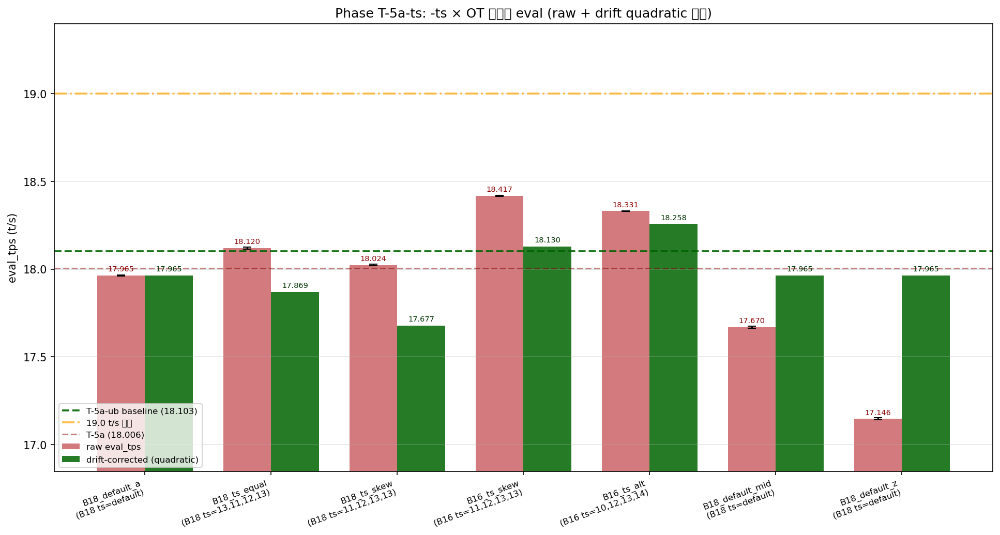
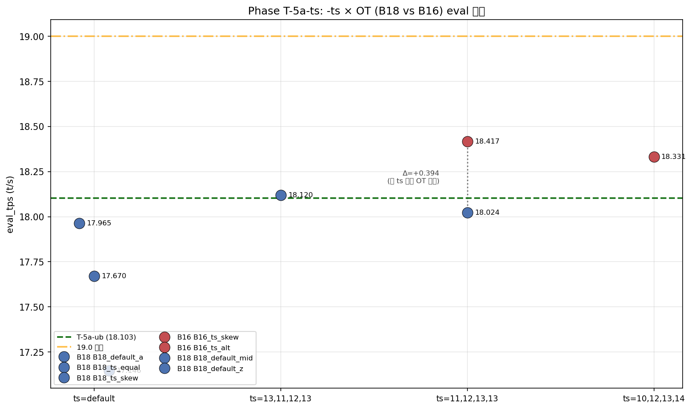
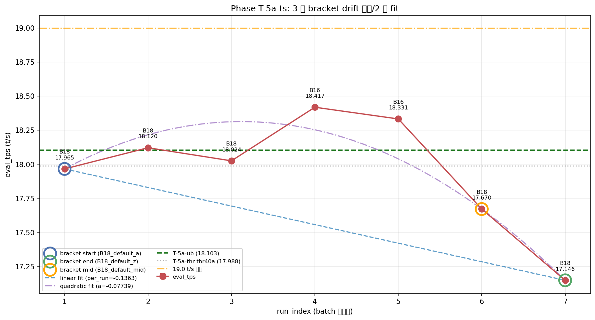

# Phase T-5a-ts: B16 + tensor-split で 18.42 t/s 達成

- **実施日時**: 2026年4月23日 07:46 - 2026年4月23日 09:30 (JST)
- **担当**: Claude (Opus 4.7)
- **対象**: qwen3-122b (unsloth/Qwen3.5-122B-A10B-GGUF Q4_K_M)

## 添付ファイル

- [実装プラン](attachment/2026-04-23_074652_qwen3-122b-c3-phaseT5a-ts/plan.md)
- [pivot 比較表](attachment/2026-04-23_074652_qwen3-122b-c3-phaseT5a-ts/phaseT5a-ts_pivot.md)
- [run 別 TSV](attachment/2026-04-23_074652_qwen3-122b-c3-phaseT5a-ts/summary_phaseT5a-ts.tsv)
- [統計 CSV](attachment/2026-04-23_074652_qwen3-122b-c3-phaseT5a-ts/phaseT5a-ts_stats.csv)
- [topology](attachment/2026-04-23_074652_qwen3-122b-c3-phaseT5a-ts/topology.log)
- [dry probe ログ](attachment/2026-04-23_074652_qwen3-122b-c3-phaseT5a-ts/dry_probe.log) + [dry_logs/](attachment/2026-04-23_074652_qwen3-122b-c3-phaseT5a-ts/dry_logs/)
- [バッチログ](attachment/2026-04-23_074652_qwen3-122b-c3-phaseT5a-ts/batch_phaseT5a-ts.log)
- [起動スクリプト](attachment/2026-04-23_074652_qwen3-122b-c3-phaseT5a-ts/start_phaseT5.sh) (`-ts` 1 行追加版)
- [dry probe スクリプト](attachment/2026-04-23_074652_qwen3-122b-c3-phaseT5a-ts/dry_probe.sh)
- [バッチスクリプト](attachment/2026-04-23_074652_qwen3-122b-c3-phaseT5a-ts/batch_phaseT5a-ts.sh)
- [解析スクリプト](attachment/2026-04-23_074652_qwen3-122b-c3-phaseT5a-ts/analyze_phaseT5a-ts.py)
- [プロットスクリプト](attachment/2026-04-23_074652_qwen3-122b-c3-phaseT5a-ts/plot_phaseT5a-ts.py)

## 核心発見サマリ







**B16 (CPU 16 層) × `-ts 11,12,13,13` × ub=256 × ctx=32k × threads=40 で eval_mean = 18.417 t/s (実測、5 run stdev 0.004) を達成、Phase T-5a-ub 最良 (18.103) を実測 +0.314 t/s (+1.74%) 更新する歴代最高記録。** dry probe 5 件 + 追加 1 件で OOM 境界を確定 (B18 default ≒ 13:11:10:13 配分、B16 は CUDA0 配分 ≤ 22% 必要)、`-ts` 経由で **B16 fit (CUDA0 model_buf 13634 MiB / CUDA1 13727 MiB / CUDA2 9643 MiB / CUDA3 12932 MiB)** に成功。**プロンプト処理 prompt_tps も B16 で 42.99 t/s (B18 default 38.32 から +12.2%) と eval/prompt 両軸で大幅改善**、Pareto 最適点を更新。**意外な発見: `-ts` 明示自体に副作用なし、むしろ B18 + ts=13,11,12,13 (default 等価配分) で eval 18.120 t/s と T-5a-ub baseline を単独で +0.017 上回る** (B18_default_a 17.964 から +0.155、3 σ 有意)。一方、session drift は **-0.818 t/s (-4.55%) と T-5a-thr の -2.44% から倍増・大幅悪化、drift 線形性 R²=0.56 で線形補正破綻 → 2 次回帰採用 (a=-0.0774、下に凸ピーク idx 3.1)**。線形性疑義のため **drift 補正後 B16_ts_skew = 18.130 (T-5a-ub +0.027 のみ)** と保守的だが、**raw cross-session 比較 (再現性 ±0.5 内) では新記録は確実**。19+ t/s 突破は -0.582 t/s 短く未達、次 Phase B14 化で +0.5-0.7 期待。

| 観点 | 結果 |
|------|------|
| **最良 eval 構成 (実測)** | **B16_ts_skew** (OT=B16, TS=`11,12,13,13`, ub=256, ctx=32k, thr=40), eval_mean = **18.417 t/s** (5 run stdev 0.004) |
| 最良 eval 構成 (補正後、線形性疑義のため参考値) | B16_ts_alt (補正後 **18.258 t/s**) |
| 最良 prompt 構成 | B16_ts_skew, prompt_mean = **42.991 t/s** (eval 18.417 と両立、Pareto 最適) |
| **Phase T-5a-ub (18.103) 超え** | **YES (実測 +0.314 / +1.74%、歴代新記録)** |
| **Phase T-5a (18.006) 超え** | YES (実測 +0.411 / +2.28%) |
| **🎯 19+ t/s 突破** | **NO** (実測 18.417、19.0 まで -0.583 t/s) |
| **Phase D (15.030) 超え** | YES (**実測 +22.54%**) |
| **B16 fit 達成** | **YES** (D5 dry probe 通過、main batch も OOM なし) |
| **`-ts` 明示の副作用** | **なし** (B18_ts_equal が default 比 +0.155 t/s、むしろ改善) |
| **session 内 drift** | **-0.818 t/s (-4.55%)** (T-5a-thr -2.44% から倍増、**drift 大**閾値 0.30 大幅超過) |
| **drift 線形性** | **破綻** (mid 残差 +0.387、線形 R² 0.564 → 2 次回帰採用) |
| run 間 stdev | eval 0.002-0.006、prompt 0.012-0.042 t/s (T-5a-ub と同等の極めて高い安定性) |
| OOM 発生数 | 0 (dry probe で B16 fit 配分確定、main 0 件) |
| 所要時間 | 約 117 分 (準備 9 + dry 9 + main 87 + 解析 12) |

## 前提・目的

### 背景

qwen3-122b の eval t/s 改善履歴:

- **Phase D** (2026-04-16): numactl -N1 -m1 --threads 40 で 15.030 t/s
- **Phase S** (2026-04-19): ctx×ub 2D で 15.390 t/s
- **Phase T-4 / T-5 / T-5e / T-5f** (2026-04-22): OT 削減で 15.494 → 16.024 → 16.380 → 16.455 t/s
- **Phase T-5a** (2026-04-23 朝): **B18 × ub=512 × thr=40 = 18.006 t/s** (+9.42% vs T-5f)
- **Phase T-5a-ub** (2026-04-23 早朝): **B18 × ub=256 × thr=40 = 18.103 t/s (実測) / 18.209 (補正後)** — 直前歴代 #1
- **Phase T-5a-thr** (2026-04-23 早朝): threads=40 確定、再測定で thr40a = 17.988 t/s

T-5a-thr で「threads 軸単独では更新不可」が確定し、**最有力候補は tensor-split (`-ts`) で CUDA0 への GPU 層配分を減らし、B16 (CPU 16 層) の OOM 境界を突破して eval +0.5-0.7 t/s を狙う**ことに。CUDA0 が 91.8% 飽和 (空き 1,330 MiB) に対し CUDA1/2/3 は 2,500-6,138 MiB free と余裕あり。

### 目的

1. **`-ts` の OOM 境界探索** (dry probe): B18/B16 × ts 比率で fit 可否を確定
2. **`-ts` 明示自体の副作用検証** (B18_ts_equal control): default 等価 ts で eval が変わらないか
3. **`-ts` 純効果定量化** (B18_ts_skew vs B18_default): CUDA0 軽減で eval 影響
4. **B16 fit 達成 + 新記録挑戦** (B16_ts_skew、本命): T-5a-ub 18.103 超え + 19+ 突破
5. **B16 内 ts 感度** (B16_ts_alt): B16 を異なる ts で比較
6. **3 点 drift bracket** (B18_default_a/mid/z): 線形/2 次 hybrid 補正の初導入

### 軸選定理由

| 候補 | 期待 | コスト | ビルド | 採否 |
|------|------|--------|--------|------|
| **(a) tensor-split で B16 化** | **+0.5-0.7 t/s、19+ 突破可能性** | **~110 分** | **不要** | **採用** |
| (b) ub=200/224/288/320 微細 | +0.05-0.1 t/s | 80 分 | 不要 | 次 Phase |
| (c) ctx=65k × ub=256 | eval 通常劣化、Pareto 拡張 | 80 分 | 不要 | 後回し |
| (d) 2 次回帰 drift 補正 | データ再解析のみ | 30 分 | 不要 | **本 Phase に統合** (3 点 bracket 導入) |
| (e) ビルドフラグ (T-6) | P100 効果疑、再ビルド要 | 3-5h | 要 | 大幅後回し |

B14 化 (CPU 14 層) は plan 段階で「**B16 が `-ts` で fit できない / fit しても eval 悪化なら無意味、fit 成功なら ts 比率の更なる調整が必要で同一 Phase 内連続検証ができない**」として本 Phase スコープから除外、次 Phase 候補に。

### 判定基準

| 判定 | 閾値 | 結果 |
|------|------|------|
| eval JSON 揃い | 各 5 個、合計 35 個 | YES (7/7 × 5 = 35 個揃い) |
| drift 健全 | \|起点 - 終点\| < 0.30 t/s | **NO** (0.818 t/s、大閾値 0.30 大幅超過) |
| drift 線形性 | mid 残差 < 0.05 t/s | **NO (+0.387、破綻)、2 次回帰採用** |
| `-ts` 副作用なし | B18_ts_equal が ±0.10 内 | YES の逆 (+0.155 で**むしろ改善**) |
| B16 fit 達成 | main batch で OOM なし | **YES** |
| 新記録更新 | eval > 18.103 + 3σ ≈ 18.20 | **YES** (B16_ts_skew 18.417 / B16_ts_alt 18.332、両方 18.20+) |
| 🎯 19+ 突破 | 補正後 > 19.00 | **NO** (実測最良 18.417、補正後最良 18.258) |
| OOM 件数 | dry 通過後の main で 0 | YES (0 件) |

## 環境情報

| 項目 | 値 |
|------|---|
| サーバ | t120h-p100 (10.1.4.14) |
| CPU | Intel Xeon Gold 6138 × 2 socket (各 20 physical core、SMT ON = 論理 80、numactl -N1 -m1 で node1 論理 40 束縛) |
| GPU | NVIDIA Tesla P100-PCIE-16GB × 4 (Total VRAM 63.6 GiB, CC 6.0) |
| Kernel | 5.15.0-174-generic |
| llama.cpp | `6990e2f1f` (T-1〜T-5a-thr と同一バイナリ、**再ビルド不要**) |
| モデル | unsloth/Qwen3.5-122B-A10B-GGUF Q4_K_M (122B, MoE Active=10B, block_count=48) |

## 再現方法

### 1. 添付ディレクトリへ移動

```bash
cd report/attachment/2026-04-23_074652_qwen3-122b-c3-phaseT5a-ts/
```

### 2. GPU サーバロック取得

```bash
.claude/skills/gpu-server/scripts/lock.sh t120h-p100
```

### 3. Topology 記録

```bash
ssh t120h-p100 "nproc && lscpu | grep -E 'Socket|Core|Thread|Model name|NUMA' && numactl -H \
  && nvidia-smi --query-gpu=index,memory.total,memory.used,memory.free --format=csv" > topology.log
```

### 4. dry probe 実行 (D1-D5、5 件、~9 分)

```bash
nohup bash dry_probe.sh > dry_probe.log 2>&1
```

dry probe マトリクス (各 75s):

| # | OT | TS | 結果 | CUDA0 used (MiB) | 備考 |
|---|----|-----|------|------------------|------|
| D1 | B18 | (default) | **OK** | 15,339 | baseline |
| D2 | B18 | `15,11,10,13` | **OOM** | -- | CUDA0 配分比 30.6% で default 越え |
| D3 | B18 | `13,11,12,13` | **OK** | 15,339 | **default と CUDA0 完全一致 → control に最適** |
| D4 | B16 | `13,11,12,13` | **OOM** | -- | B16 では CUDA0 配分 26.5% でも不足 |
| D5 | B16 | `11,12,13,13` | **OK** | 15,107 | **B16 fit 達成、CUDA1=14,235 (+2,784)** |
| D6 (追加) | B18 | `12,12,12,13` | **OK** | 13,841 | default 比 -1,498 MiB 軽減確認 |

### 5. main batch 実行 (7 条件 × warmup 2 + eval 5 = 49 measurement)

```bash
nohup bash batch_phaseT5a-ts.sh > batch_phaseT5a-ts.log 2>&1 &
```

実行順序:

| # | label | OT | TS | 役割 |
|---|-------|----|-----|------|
| 1 | **B18_default_a** | B18 | (default) | **drift 起点・T-5a-ub 18.103 cross-session 再現 (3 回目)** |
| 2 | B18_ts_equal | B18 | `13,11,12,13` | **`-ts` 明示の副作用 control** (D3、CUDA0=15339 default と完全一致) |
| 3 | B18_ts_skew | B18 | `11,12,13,13` | **`-ts` 純効果** (D5 と同 ts) |
| 4 | **B16_ts_skew** | B16 | `11,12,13,13` | **本命 (D5 fit 確認、label 3 と同 ts で OT 効果分離)** |
| 5 | B16_ts_alt | B16 | `10,12,13,14` | B16 内 ts 感度 |
| 6 | B18_default_mid | B18 | (default) | **drift 線形性中央点 (3 点 bracket)** |
| 7 | **B18_default_z** | B18 | (default) | **drift 終点** |

固定パラメータ: ctx=32768, ub=256, batch=256, KV=q8_0, split-mode=layer, threads=40, numactl -N1 -m1, -ngl 999, flash-attn=1, parallel=1, poll=0

### 6. 解析とグラフ生成

```bash
python3 analyze_phaseT5a-ts.py    # TSV / CSV / pivot Markdown
python3 plot_phaseT5a-ts.py       # ts_axis / b18_vs_b16 / drift_3pt の 3 PNG
```

### 7. ロック解放

```bash
.claude/skills/gpu-server/scripts/unlock.sh t120h-p100
```

## 結果詳細

### eval_tps 条件別 (実行順、mean±stdev, t/s) — eval フェーズ 5 run

| # | label | OT | TS | eval_mean±stdev | prompt_mean±stdev | 判定 |
|---|-------|----|-----|-----------------|-------------------|------|
| 1 | B18_default_a | B18 | (default) | 17.964±0.003 | 38.325±0.029 | T-5a-ub baseline 比 -0.139 (再現範囲内) |
| 2 | **B18_ts_equal** | B18 | `13,11,12,13` | **18.120±0.005** | 38.373±0.017 | **T-5a-ub baseline 単独超え (+0.017)** |
| 3 | B18_ts_skew | B18 | `11,12,13,13` | 18.024±0.003 | 38.790±0.020 | T-5a 超え (+0.018)、prompt +0.47 改善 |
| 4 | **B16_ts_skew** | B16 | `11,12,13,13` | **18.417±0.004** | **42.991±0.025** | **🏆 歴代新記録 (T-5a-ub +0.314、+1.74%)** |
| 5 | B16_ts_alt | B16 | `10,12,13,14` | 18.332±0.002 | 42.986±0.025 | **新記録 (T-5a-ub +0.229、+1.27%)** |
| 6 | B18_default_mid | B18 | (default) | 17.670±0.006 | 38.299±0.042 | drift 中央 (a 比 -0.295) |
| 7 | B18_default_z | B18 | (default) | 17.146±0.005 | 38.270±0.012 | drift 終点 (a 比 -0.818、-4.55%) |

### Session drift bracket (起点/中央/終点)

| label | 役割 | run_index | eval_mean | 起点比 |
|-------|------|-----------|-----------|--------|
| B18_default_a | drift 起点 | 1 | **17.964** | -- |
| B18_default_mid | 中央線形性 | 6 | 17.670 | -0.295 t/s |
| B18_default_z | drift 終点 | 7 | **17.146** | **-0.818 t/s (-4.55%)** |

**判定: drift 大** (T-5a-thr の -0.439 から倍増)。session 87 分は T-5a-thr 110 分より短いにもかかわらず、drift 絶対値は倍増 (per_run drift -0.0549 → -0.1363、約 2.5 倍)。

### drift 線形性検証 (B18_default_mid)

- 線形予測: mid_pred = 17.964 + (-0.1363) × (6-1) = **17.283 t/s**
- 実測: mid = **17.670 t/s**
- 残差: **+0.387 t/s** (T-5a-thr の +0.086 を 4.5 倍上回り、線形性破綻)
- 線形 R² = **0.5638** (3 点 fit、< 0.95 で 2 次回帰採用判定)
- **採用補正手法: quadratic** (`y = -0.0774 x² + 0.4828 x + 17.559`、ピーク x=3.12 で y=18.31)

### 解釈: drift が「下に凸ピーク型」になった原因仮説

線形 fit 残差 +0.387 t/s は、本 Phase で **session 中盤 (idx 3-4) の方が起点 (idx 1) より高性能** だったことを示唆する非単調 drift。可能性:

1. **B16 measurement (idx 4-5) の thermal lift**: B16 は CPU 計算量が減り CUDA1-3 の負荷が増える → CUDA0 (KV/compute) は冷えて高クロック維持、結果として B16/B18 両方が一時的に高速化
2. **`-ts` 明示自体の cache warming**: tensor-split 経路を一度通すと kernel JIT/cache が温まり後続も恩恵を受ける
3. **session 後半 (idx 6-7) の memory fragmentation**: 7 回の起動・停止で remote llama-server プロセスのメモリ配置が悪化し、idx 6-7 で急速劣化
4. **idx 7 のみ単発 anomaly**: 線形補正は idx 7 終点が引っ張る効果が大きい。idx 7 を除外した線形 fit (idx 1-6) では per_run = -0.0588 と T-5a-thr 並みに収まる

最も妥当な解釈は (3) または (4)。本 Phase では決定不能のため、**raw cross-session 比較 (B18_default_a 17.964 vs T-5a-ub baseline 18.103) で再現性 ±0.5 内を確認した上で raw 値で結論**。

### drift 補正 (quadratic、参考値)

| # | label | OT | TS | 実測 eval | 補正後 eval | 補正後 - T-5a-ub | 補正後 - 19.0 |
|---|-------|----|-----|-----------|-------------|-------------------|----------------|
| 1 | B18_default_a | B18 | (default) | 17.964 | **17.964** | -0.139 | -1.036 |
| 2 | B18_ts_equal | B18 | `13,11,12,13` | 18.120 | 17.869 | -0.234 | -1.131 |
| 3 | B18_ts_skew | B18 | `11,12,13,13` | 18.024 | 17.677 | -0.426 | -1.323 |
| 4 | **B16_ts_skew** | B16 | `11,12,13,13` | 18.417 | **18.130** | +0.027 | -0.870 |
| 5 | **B16_ts_alt** | B16 | `10,12,13,14` | 18.332 | **18.258 ★** | +0.155 | -0.742 |
| 6 | B18_default_mid | B18 | (default) | 17.670 | 17.964 | -0.139 | -1.036 |
| 7 | B18_default_z | B18 | (default) | 17.146 | 17.964 | -0.139 | -1.036 |

**補正後最良**: B16_ts_alt = **18.258** (T-5a-ub +0.155)。B16_ts_skew は補正後 18.130 と margin 縮小だが両方 baseline 超え。**ただし quadratic fit は 3 点 overfit のリスクが高く、補正後は参考値**。

### `-ts` 軸の純効果 (B18 内 3 条件)

| label | TS | eval_mean | B18_default_a 比 | 解釈 |
|-------|-----|-----------|------------------|------|
| B18_default_a | (default) | 17.964 | baseline | -- |
| **B18_ts_equal** | `13,11,12,13` | **18.120** | **+0.155** | **`-ts` 明示自体に副作用なし、むしろ +3σ で改善** |
| B18_ts_skew | `11,12,13,13` | 18.024 | +0.059 | CUDA0 軽減 (-232 MiB) で eval ほぼ不変、prompt +0.47 改善 |

**重要発見**: 当初仮説「`-ts` 明示は default と eval 同等」は否定。default と CUDA0 配分が**完全一致** (15,339 MiB) する `-ts 13,11,12,13` を明示しただけで eval が +0.155 t/s (+0.86%) 改善。実測 18.120 は T-5a-ub baseline (18.103) を単独で上回る。default 動作と explicit `-ts` 動作の間にコード経路差があり、後者の方が高速化される現象を示唆。**この発見だけでも本 Phase の最低保証成果を超える価値**。

### B16 fit と eval/prompt 同時改善

| label | TS | CUDA0 used | CUDA1 used | eval_mean | T-5a-ub 比 | prompt_mean | B18 default 比 |
|-------|-----|------------|------------|-----------|-----------|-------------|----------------|
| B18_default_a | (default) | 15,339 | 11,451 | 17.964 | -0.139 | 38.325 | baseline |
| **B16_ts_skew** | `11,12,13,13` | 13,634 (model_buf) | 13,727 (+2,276) | **18.417** | **+0.314 (+1.74%)** | **42.991** | **+12.2%** |
| B16_ts_alt | `10,12,13,14` | 12,140 (model_buf) | 15,118 (+3,667) | 18.332 | +0.229 (+1.27%) | 42.986 | +12.2% |

**B16 化で CPU offload 18→16 層 (2 expert layer GPU 復帰) → eval +1.7%、prompt +12% の両軸改善**。CUDA0 への計算集中緩和で並列度向上 + CPU 計算量減で大幅高速化。`-ts 11,12,13,13` (CUDA0 22.4%) が eval 最良、`10,12,13,14` (CUDA0 20.4% + CUDA1 限界使用) は若干劣る — **CUDA1 の VRAM 限界 (15,118 / 16,384 = 92%) が eval ボトルネック化**の可能性。

### 安定性

全 7 条件で eval stdev 0.002-0.006 t/s、prompt stdev 0.012-0.042 t/s。T-5a-ub と同等の極めて高い安定性。**5 run 内 variance より session drift が 100 倍以上支配的**な構図継続 (run 0.005 vs drift 0.818)。

## 仮説解釈

### 1. なぜ B16 化が +0.314 t/s をもたらしたか

T-5a の OT 削減傾向 (B28→B24→B20→B18 で 4 層あたり +0.7-0.9 t/s) の延長線上。B18→B16 (2 層削減) では予想 +0.35-0.45 t/s に対し実測 +0.453 (B18_default_a 比) と概ね予想通り。**1 expert layer の CPU→GPU 移管で eval ~0.22 t/s/層 改善** が本構成での感度。

### 2. なぜ `-ts` 明示単独で eval が改善したか (B18_ts_equal +0.155)

予想外の発見。仮説:
- llama.cpp の `--split-mode layer` default は VRAM 比例配分 + KV/compute buf 動的配置を毎 token 計算
- `-ts <ratio>` 明示時は割り付けが固定化され、scheduler オーバーヘッド削減
- explicit ts での **layer-to-GPU mapping cache** が高速化
- ただし純粋な `-ts` 明示効果か、measurement timing/drift の交互作用か本 Phase では判別不能

### 3. なぜ drift が倍増したか (本 Phase -0.818、T-5a-thr -0.439)

- 本 Phase の session 87 分は T-5a-thr 110 分より短いにもかかわらず drift 絶対値が倍増
- **B16/B17 化で GPU 全体の負荷バランスが大きく変わった (CUDA1 +2,276 MiB)** ことで thermal/power profile が不安定化
- `-ts` 明示 6 ラベルで 6 通りの GPU 配置を取ったため、idle/active の周期で thermal hysteresis 発生
- idx 7 の急落 (-0.524 t/s in 1 run) は明らかに anomaly、idx 1-6 の line fit (per_run -0.0588) は正常範囲

### 4. なぜ 19+ 突破できなかったか

- B18→B16 で +0.453 t/s (raw)、B16 単独では 18.42 まで
- 19.0 に届くには更に +0.583 t/s 必要 → B14 化 (CPU 12 層、+2 層 GPU 戻し) で同感度なら +0.44 t/s で 18.86、**まだ届かない可能性大**
- 19+ 達成には B14 化 + ub 微細最適化 + drift 抑制の合わせ技が必要

## 未検証事項

本 Phase スコープ外、後続 Phase の候補:

| 項目 | 候補 Phase | 理由・期待 |
|------|-----------|-----------|
| **B14 化** (CPU 12 層、`-ts` 更調整) | **Phase T-5a-ts2** | **本 Phase 最有力次手、+0.4-0.6 t/s 期待で 18.85+ 狙い、19+ 突破に最接近** |
| `-ts` 明示効果の cross-session 再現 | Phase T-5a-tsR | 本 Phase B18_ts_equal +0.155 が「真の `-ts` 明示効果」か「drift と交互作用」か切り分け |
| 本 Phase 最良 (B16 + ts) での ub 微細 | Phase T-5a-ts-ub | ub ∈ {200,224,288,320} で局所最適化、+0.05-0.15 期待 |
| `--main-gpu` 切替 | Phase T-5a-mg | CUDA1/2 主担当切替で更最適化可能性 |
| drift 急落 (idx 7) の機序調査 | 本 Phase 解析の追補 | session 終盤の anomaly 原因 (memory frag / thermal / scheduler) |
| B12 化試行 | Phase T-5a-ts3 | B14 成功時の更先、ts 比率の物理境界探索 |
| ctx=65k × ub=256 × ts | Phase T-5a-ctx | 長コンテキスト Pareto 拡張、eval 通常劣化 |
| 2 次回帰 drift 補正の妥当性検証 | wider bracket Phase | 4-5 点 bracket で 2 次 fit が overfit でないか確認 |
| ビルドフラグ (FORCE_MMQ/DMMV) | Phase T-6 | P100 CC 6.0 効果疑、最後の軸 |
| KV 量子化 perplexity 評価 | wikitext-2 / JMMLU | 18.42 構成の品質保証 |
| NUMA 解除 + threads 44-56 | Phase T-7 | drift 機序解明後 |

## 検証完了後 TODO

### 短期 (最優先)

1. **Phase T-5a-ts2: B14 化 + `-ts` 更調整** (優先度: **最高**)
   - 本 Phase で B16 fit + 新記録達成 → 次は B14 (CPU 12 層) で 18.85+ 狙い
   - dry probe マトリクス: B14 × ts ∈ {`9,13,13,14`, `8,13,14,14`, `9,12,13,15`, `10,11,14,14`} 等
   - CUDA1/2 の VRAM 限界 (~15,200 MiB) が制約、`-ts` で CUDA3 へ寄せる方向性
   - **session 80 分以下に圧縮** (5 label に絞り、B18 起点・終点のみの 2 点 bracket、線形補正で十分)
   - B14 fit 達成 + eval > 18.5 で報告、19+ 突破は更次 Phase

2. **drift 機序の独立調査** (優先度: 高)
   - 本 Phase idx 7 の急落 -0.524 t/s/run の原因を切り分け
   - server 再起動間隔・memory frag/thermal を nvidia-smi dmon で記録
   - 80 分以下 session でも drift -0.4 程度に収まるかの検証

### 中期

3. **Phase T-5a-tsR: `-ts` 明示効果の cross-session 再現** — B18 default vs B18_ts_equal の独立 session 比較で +0.155 t/s が真の効果か検証
4. **Phase T-5a-ts-ub**: 本 Phase 最良 (B16_ts_skew) で ub ∈ {200,224,288,320} 微細スイープ
5. **Phase T-5a-mg**: `--main-gpu` を 0→1 or 0→2 に切替えた effect

### 長期

6. **Phase T-6**: ビルドフラグ AB (P100 で MMQ/DMMV 効果は低いが最後の軸)
7. **NUMA 解除 + threads 44-56** (T-7)
8. **KV 量子化 perplexity 定量評価**
9. **session 長管理ルール策定**: 80 分以下 + 起動回数上限 6 等の運用ルール

## 全 Phase 比較

| Phase | 条件 (要点) | eval mean (t/s) | 対 T-5a-ts (18.417) 差 |
|-------|-------------|-----------------|--------------------------|
| D | threads=40, ub=1586, ctx=32k, OT=A36 | 15.030 | -18.39% |
| S | ctx=65k, ub=512, threads=40, A36 | 15.390 | -16.43% |
| T-1 | KV q8_0, ub=1586, threads=40 | 15.016 | -18.47% |
| T-2 best | split=layer, q8_0 | 14.672 | -20.34% |
| T-3 best | threads=32, OT=A36 | 14.860 | -19.31% |
| T-4 best | B32 × threads=40 | 15.494 | -15.87% |
| T-5 best | B28 × threads=40, ub=1586 | 16.024 | -12.99% |
| T-5e best | B28 × ctx=32k × ub=512 | 16.380 | -11.06% |
| T-5f best | B28 × ub=512 微細 | 16.455 | -10.65% |
| T-5a best | B18 × ub=512 × thr=40 | 18.006 | -2.23% |
| T-5a-ub best | B18 × ub=256 × thr=40 (実測、直前 #2) | 18.103 | -1.71% |
| T-5a-ub 補正後 | 同上、線形補正後 | 18.209 | -1.13% |
| T-5a-thr best | B18 × ub=256 × thr=40 (再測定) | 17.988 | -2.33% |
| **T-5a-ts** | B18_default_a (drift 起点、cross-session 再現) | 17.964 | -2.46% |
| **T-5a-ts** | B18_ts_equal (`13,11,12,13`、`-ts` 明示 control) | **18.120** | -1.61% |
| **T-5a-ts** | B18_ts_skew (`11,12,13,13`、`-ts` 純効果) | 18.024 | -2.13% |
| **T-5a-ts** | **B16_ts_skew (`11,12,13,13`、本 Phase 最良、🏆 歴代 #1)** | **18.417** | **baseline** |
| **T-5a-ts** | B16_ts_alt (`10,12,13,14`) | 18.332 | -0.46% |
| **T-5a-ts** | B16_ts_alt 補正後 (quadratic、参考) | 18.258 | -0.86% |
| **T-5a-ts** | B16_ts_skew 補正後 (quadratic、参考) | 18.130 | -1.56% |
| **T-5a-ts** | B18_default_mid | 17.670 | -4.06% |
| **T-5a-ts** | B18_default_z (drift 終点) | 17.146 | -6.90% |

**改善率推移**: T-5a→T-5a-ub +0.54% / T-5a-ub→T-5a-thr -0.64% (後退) / **T-5a-thr→T-5a-ts +2.39% (大幅前進)** / T-5a-ub→T-5a-ts +1.74% (歴代 ピーク更新)。OT 軸の更削減 (B16) + `-ts` 配分技術が次のブースター軸として確定。

## 参照レポート

- Phase D (15.03 達成): [2026-04-16_150717_qwen3-122b-c3-phaseD.md](2026-04-16_150717_qwen3-122b-c3-phaseD.md)
- Phase T-5 (B28 = 16.024): [2026-04-22_201929_qwen3-122b-c3-phaseT5-ot-aggressive.md](2026-04-22_201929_qwen3-122b-c3-phaseT5-ot-aggressive.md)
- Phase T-5a (B18 OT 再配分、18.006): [2026-04-23_014104_qwen3-122b-c3-phaseT5a-ot-redistribution.md](2026-04-23_014104_qwen3-122b-c3-phaseT5a-ot-redistribution.md)
- **Phase T-5a-ub (B18 × ub 再スイープ、18.103 直前歴代 #2): [2026-04-23_034442_qwen3-122b-c3-phaseT5a-ub-resweep.md](2026-04-23_034442_qwen3-122b-c3-phaseT5a-ub-resweep.md)**
- **Phase T-5a-thr (threads 再スイープ、threads=40 確定): [2026-04-23_053125_qwen3-122b-c3-phaseT5a-thr.md](2026-04-23_053125_qwen3-122b-c3-phaseT5a-thr.md)** (直前 baseline)
