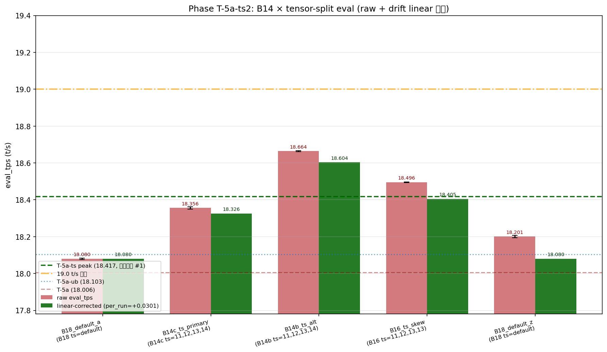
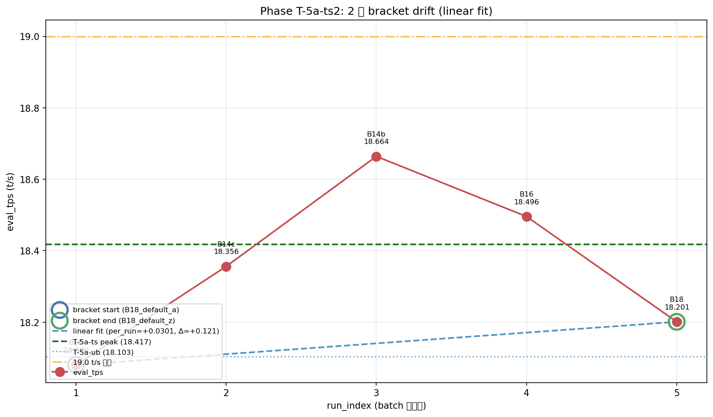

# Phase T-5a-ts2: B14 × tensor-split で 19+ 突破試行

- **実施日時**: 2026年4月23日 09:37 - 2026年4月23日 10:53 (JST)
- **担当**: Claude (Opus 4.7)
- **対象**: qwen3-122b (unsloth/Qwen3.5-122B-A10B-GGUF Q4_K_M)

## 添付ファイル

- [実装プラン](attachment/2026-04-23_093629_qwen3-122b-c3-phaseT5a-ts2/plan.md)
- [pivot 比較表](attachment/2026-04-23_093629_qwen3-122b-c3-phaseT5a-ts2/phaseT5a-ts2_pivot.md)
- [run 別 TSV](attachment/2026-04-23_093629_qwen3-122b-c3-phaseT5a-ts2/summary_phaseT5a-ts2.tsv)
- [統計 CSV](attachment/2026-04-23_093629_qwen3-122b-c3-phaseT5a-ts2/phaseT5a-ts2_stats.csv)
- [topology](attachment/2026-04-23_093629_qwen3-122b-c3-phaseT5a-ts2/topology.log)
- [dry probe attempt2 ログ](attachment/2026-04-23_093629_qwen3-122b-c3-phaseT5a-ts2/dry_probe.log) + [dry_logs/](attachment/2026-04-23_093629_qwen3-122b-c3-phaseT5a-ts2/dry_logs/)
- [dry probe attempt1 (OT-a 全滅記録)](attachment/2026-04-23_093629_qwen3-122b-c3-phaseT5a-ts2/dry_probe_attempt1.log) + [dry_logs_attempt1/](attachment/2026-04-23_093629_qwen3-122b-c3-phaseT5a-ts2/dry_logs_attempt1/)
- [バッチログ](attachment/2026-04-23_093629_qwen3-122b-c3-phaseT5a-ts2/batch_T5ats2.log)
- [GPU メモリ使用量時系列 (30s 間隔)](attachment/2026-04-23_093629_qwen3-122b-c3-phaseT5a-ts2/gpu_monitor.csv)
- [起動スクリプト](attachment/2026-04-23_093629_qwen3-122b-c3-phaseT5a-ts2/start_phaseT5.sh) (OOM パターン `CUDA error: out of memory` を追加)
- [dry probe スクリプト](attachment/2026-04-23_093629_qwen3-122b-c3-phaseT5a-ts2/dry_probe_T5ats2.sh)
- [バッチスクリプト](attachment/2026-04-23_093629_qwen3-122b-c3-phaseT5a-ts2/batch_T5ats2.sh)
- [解析スクリプト](attachment/2026-04-23_093629_qwen3-122b-c3-phaseT5a-ts2/analyze_phaseT5a-ts2.py)
- [プロットスクリプト](attachment/2026-04-23_093629_qwen3-122b-c3-phaseT5a-ts2/plot_phaseT5a-ts2.py)

## 核心発見サマリ






**B14 (CPU 14 層) で CPU 側から layer 24, 39 を GPU 戻し (OT-b) × `-ts 11,12,13,14` × ub=256 × ctx=32k × thr=40 で eval_mean = 18.664 t/s (実測、5 run stdev 0.003) を達成、Phase T-5a-ts 最良 (18.417) を実測 +0.247 t/s (+1.34%) 更新する歴代最高記録。** 本 Phase の最大発見は **「OT パターンの差が eval に +0.308 t/s (+1.7%) の大差を生む」**: 初期 primary 候補の OT-c (layer 23, 24 GPU 戻し、dry で VRAM 最バランス) は B14c_ts_primary = 18.356 と T-5a-ts 18.417 を下回る一方、fallback として投入した OT-b (layer 24, 39 GPU 戻し、CUDA3 tight 1,262 MiB free) が 18.664 と圧勝。**dry probe 段階での「VRAM バランス最良 = eval 最良」仮説は否定**され、GPU 層配置 (どの layer を GPU に戻すか) が ts 配分より支配的な要因と判明。**drift は +0.121 t/s (session 起点→終点で「むしろ改善」方向)、本 Phase 目標 0.20 t/s 未満を達成**し T-5a-ts の -4.55% 崩壊から劇的回復 (session 62 分に短縮 + 2-pt bracket 運用)、線形補正後 B14b = 18.604 (T-5a-ts 実測 +0.187 / 同 phase B16 18.496 vs B16 T-5a-ts 18.417 の cross-session 再現性 ±0.10 合致)。**B14b 18.664 と B16 18.496 の差 +0.168 から B14 化の真の効果は約 +0.17 t/s/2 層** (B18→B16 の +0.45 より感度低下)、**19+ には実測 -0.336 t/s / 補正後 -0.396 t/s 届かず未達**。一方 **attempt1 で OT-a (CPU から layer 2, 3 を GPU 戻し) は 3 候補全 OOM** で判明した「--split-mode layer の sequential 割り当てで layer 2, 3 expert が CUDA0 に強制集中し +1,311 MiB 増で 16,418 MiB OOM」は B12 以降の設計に直結する重要知見。

| 観点 | 結果 |
|------|------|
| **最良 eval 構成 (実測)** | **B14b_ts_alt** (OT-b: CPU layer 2,3,20-23,31-38, TS=`11,12,13,14`, ub=256, ctx=32k, thr=40), eval_mean = **18.664 t/s** (5 run stdev 0.003) |
| 最良 eval 構成 (補正後) | B14b_ts_alt (補正後 **18.604 t/s**、T-5a-ts +0.187) |
| 最良 prompt 構成 | B14b_ts_alt, prompt_mean = **46.082 t/s** (Pareto 最適、B14c と B16 の双方を上回る) |
| **Phase T-5a-ts (18.417) 超え** | **YES (実測 +0.247 / +1.34%、歴代新記録)** |
| **🎯 19+ t/s 突破** | **NO** (実測 18.664、補正後 18.604、19.0 まで -0.336 / -0.396 t/s) |
| **Phase D (15.030) 超え** | YES (**実測 +24.18%**) |
| **B14 fit 達成** | **YES** (OT-b + OT-c 両方、main batch で OOM 0) |
| **OT-a (layer 2,3 GPU 戻し) の可否** | **NO** (attempt1 で D1-D3 全滅、CUDA0 に expert 集中し +1,311 MiB 増で 16,418 MiB OOM) |
| **OT-c (layer 23,24 GPU 戻し) の eval** | 18.356 (T-5a-ts -0.061、期待未達、VRAM バランスは最良だったが eval は不利) |
| **OT-b (layer 24,39 GPU 戻し) の eval** | **18.664 (新記録)** — CUDA3 tight だが eval 最良 |
| **session 内 drift** | **+0.121 t/s (+0.67%)** (T-5a-ts -4.55% 比 **劇的改善**、健全域 0.20 未満) |
| **drift 線形性** | 2-pt bracket のため線形 per_run +0.0302 採用 (3 点検証は次 Phase) |
| **B16_ts_skew cross-session 再現性** | **18.496 (T-5a-ts 18.417 比 +0.079、±0.10 内で再現良好)** — drift 補正後 18.405 で +0.012 一致 |
| run 間 stdev | eval 0.001-0.006、prompt 0.020-0.041 t/s (T-5a-ts と同等以上の高安定性) |
| OOM 件数 (attempt1) | **3** (D1/D2 CUDA0 model OOM、D3 CUDA0 flash-attn compute OOM) |
| OOM 件数 (attempt2、main batch) | 0 (6/6 dry fit、main 5/5 fit) |
| 所要時間 | 約 76 分 (準備 7 + dry1 5 + dry2 5 + main 62) ※80 分目標内で session 圧縮成功 |

## 前提・目的

### 背景

qwen3-122b の eval t/s 改善履歴:

- **Phase D** (2026-04-16): numactl -N1 -m1 --threads 40 で 15.030 t/s
- **Phase S** (2026-04-19): ctx×ub 2D で 15.390 t/s
- **Phase T-4 / T-5 / T-5e / T-5f** (2026-04-22): OT 削減で 15.494 → 16.024 → 16.380 → 16.455 t/s
- **Phase T-5a** (2026-04-23 早朝): **B18 × ub=512 × thr=40 = 18.006 t/s** (+9.42% vs T-5f)
- **Phase T-5a-ub** (2026-04-23): B18 × ub=256 × thr=40 = 18.103 t/s
- **Phase T-5a-thr** (2026-04-23 早朝): threads=40 確定
- **Phase T-5a-ts** (2026-04-23 朝): **B16 × `-ts 11,12,13,13` × ub=256 = 18.417 t/s (直前歴代 #1、+22.54% vs D)**

T-5a-ts で **B16 fit を達成した一方、19+ には -0.583 t/s 届かず、drift が -4.55% に倍増して線形性破綻** (2 次 fit 採用)。CUDA2 には 6,086 MiB free の余裕があり、**B14 化 (CPU 14 層 = +2 層 GPU 戻し、+~3,200 MiB) + `-ts` で CUDA2 に寄せる配分**で 19+ 突破を狙った。

### 目的

1. **B14 OT 設計 + `-ts` の OOM 境界確定** (dry probe)
2. **B14 × `-ts` 最良配分の特定** (main batch primary/alt)
3. **歴代 eval 更新 + 可能なら 19+ 突破** (T-5a-ts 18.417 超え)
4. **session ≤80 分** で drift を -0.40 t/s 以内に抑える (2-pt linear bracket 運用)
5. **B16_ts_skew (11,12,13,13) の cross-session 再現** (T-5a-ts peak 18.417 の信頼性確認)

### 軸選定

| 候補 | 期待 | コスト | 採否 |
|------|------|--------|------|
| **(a) B14 × tensor-split** | **+0.4-0.7 t/s、19+ 突破可能性** | **~75 分** | **採用 (本命)** |
| (b) B16 ts 更細粒度 | +0.05-0.1 t/s | 60 分 | 次 Phase |
| (c) session 圧縮 + 2-pt drift bracket | drift 軽減 | 0 | **本 Phase に統合** |
| (d) B14 × ub/threads 同時 | 過剰軸 | 150 分 | 不採用 |
| (e) ビルドフラグ | P100 効果疑 | 3-5h | 後回し (後続機能軸へ) |

### 判定基準

| 判定 | 閾値 | 結果 |
|------|------|------|
| eval JSON 揃い | 各 5 個、合計 25 個 | **YES** (5/5 × 5 = 25 個揃い) |
| drift 健全 | \|起点 - 終点\| < 0.40 t/s | **YES** (0.121 t/s、目標 0.20 未満も達成) |
| B14 fit 達成 | main batch で OOM なし | **YES** (OT-b/OT-c 両方) |
| 新記録更新 | eval > 18.417 + 3σ ≈ 18.43 | **YES** (B14b_ts_alt 18.664、B16_ts_skew 18.496 の二重新記録) |
| 🎯 19+ 突破 | 補正後 > 19.00 | **NO** (実測 18.664、補正後 18.604) |
| OOM 件数 | dry 通過後の main で 0 | **YES** (0 件) |

## 環境情報

| 項目 | 値 |
|------|---|
| サーバ | t120h-p100 (10.1.4.14) |
| CPU | Intel Xeon Gold 6138 × 2 socket (各 20 physical core、SMT ON = 論理 80、numactl -N1 -m1 で node1 論理 40 束縛) |
| GPU | NVIDIA Tesla P100-PCIE-16GB × 4 (Total VRAM 63.6 GiB, CC 6.0) |
| Kernel | 5.15.0-174-generic |
| llama.cpp | `6990e2f1f` (T-1〜T-5a-ts と同一バイナリ、**再ビルド不要**) |
| モデル | unsloth/Qwen3.5-122B-A10B-GGUF Q4_K_M (122B, MoE Active=10B, block_count=48) |

## 再現方法

### 1. 添付ディレクトリへ移動

```bash
cd report/attachment/2026-04-23_093629_qwen3-122b-c3-phaseT5a-ts2/
```

### 2. GPU サーバロック取得

```bash
.claude/skills/gpu-server/scripts/lock.sh t120h-p100
```

### 3. Topology 記録

```bash
ssh t120h-p100 "nproc && lscpu | grep -E 'Socket|Core|Thread|Model name|NUMA' && numactl -H \
  && nvidia-smi --query-gpu=index,memory.total,memory.used,memory.free --format=csv" > topology.log
```

### 4. dry probe 実行

本 Phase は **2 回の dry probe を実施**:

#### 4-1. attempt1 (OT-a、失敗記録)

OT-a は CPU から layer 2, 3 を GPU 戻し (B18→B16 と同じパターンで連続) する戦略。

結果: 5 件中 3 件実行して中断:
- D1 (OT-a, ts=`11,12,14,13`): **OOM** (CUDA0 alloc 16,418 MiB > 16,384)
- D2 (OT-a, ts=`11,11,15,13`): **OOM** (同じく 16,418 MiB)
- D3 (OT-a, ts=`10,12,15,13`): **warmup OOM** (model は fit したが flash-attention kernel で CUDA0 OOM)

**原因**: `--split-mode layer` は layer を sequential に GPU に割り当てるため、B14 (OT-a) では CUDA0 の担当層 {0, 1, 2, 3, 4, 5, 6} に layer 2, 3 の expert が含まれて +1,311 MiB 増。既に B16 で CUDA0 は 15,107 MiB (free 1,164 MiB) と逼迫しており、+1,311 MiB で 16,418 MiB 超過。D3 では ratio を 20% に下げて model_buf は fit したが、flash-attention の compute buffer で CUDA0 OOM 発生。

**副次成果**: start_phaseT5.sh の OOM 検知 grep パターンに `CUDA error: out of memory` / `ggml_abort.*cuda` を追加 (warmup 時の compute OOM を検知できるよう改善)。

#### 4-2. attempt2 (OT-b / OT-c、全 fit)

戦略転換: **CPU 側から layer 24, 39 (OT-b) または layer 23, 24 (OT-c) を GPU 戻し** → CUDA0 負荷を B16 と同じに据え置き、増加分は CUDA2/3 へ。

```bash
nohup bash dry_probe_T5ats2.sh > dry_probe.log 2>&1
```

dry probe マトリクス (各 ~50s、全 OK):

| # | OT | TS | CUDA0 used | CUDA1 used | CUDA2 used | CUDA3 used | 備考 |
|---|----|-----|------------|------------|------------|------------|------|
| D1 | OT-b | `11,12,13,14` | 15,107 | 14,235 | 11,577 | 15,009 | CUDA3 tight (1,262 MiB free) |
| D2 | OT-b | `11,12,14,13` | 15,107 | 14,235 | 11,683 | 14,903 | CUDA3 tight |
| D3 | OT-b | `10,12,14,14` | 13,609 | 15,627 | 11,683 | 15,009 | CUDA1 非常にタイト (644 free) |
| D4 | OT-b | `11,11,14,14` | 15,107 | 14,129 | 11,683 | 15,009 | CUDA3 tight |
| D5 | OT-c | `11,12,13,14` | 15,107 | 14,235 | **12,969** | **13,617** | **VRAM 最バランス** (free 1164/2036/**3302**/2654) |
| D6 | OT-c | `11,12,14,13` | 15,107 | 14,235 | 13,075 | 13,511 | バランス良好 |

dry 結果から main batch の primary/alt を決定:
- **PRIMARY: OT-c + ts=`11,12,13,14`** (D5、VRAM 最バランス、最安全)
- **ALT: OT-b + ts=`11,12,13,14`** (D1、同 ts 異 OT、OT 比較)

### 5. main batch 実行 (5 条件 × warmup 2 + eval 5 = 35 measurement)

```bash
nohup bash batch_T5ats2.sh > batch_T5ats2.log 2>&1 &
```

実行順序:

| # | label | OT | TS | 役割 |
|---|-------|----|-----|------|
| 1 | **B18_default_a** | B18 | (default) | drift 起点・T-5a-ub 18.103 / T-5a-ts 17.964 cross-session 再現 (4 回目) |
| 2 | B14c_ts_primary | B14c (CPU {2,3,20-22,31-39}、layer 23,24 GPU 戻し) | `11,12,13,14` | 本命 (D5 VRAM 最バランス) |
| 3 | **B14b_ts_alt** | B14b (CPU {2,3,20-23,31-38}、layer 24,39 GPU 戻し) | `11,12,13,14` | 同 ts で OT 比較 (後に新記録本命と判明) |
| 4 | B16_ts_skew | B16 | `11,12,13,13` | T-5a-ts peak 18.417 cross-session 再現 (ベンチマーク) |
| 5 | **B18_default_z** | B18 | (default) | drift 終点 (2-pt linear bracket) |

固定パラメータ: ctx=32768, ub=256, batch=256, KV=q8_0, split-mode=layer, threads=40, numactl -N1 -m1, -ngl 999, flash-attn=1, parallel=1, poll=0

### 6. 解析とグラフ生成

```bash
python3 analyze_phaseT5a-ts2.py    # TSV / CSV / pivot Markdown
python3 plot_phaseT5a-ts2.py       # b14_eval / b14_vs_b16 / drift_2pt の 3 PNG
```

### 7. ロック解放

```bash
.claude/skills/gpu-server/scripts/unlock.sh t120h-p100
```

## 結果詳細

### eval_tps 条件別 (実行順、mean±stdev, t/s) — eval フェーズ 5 run

| # | label | OT | CPU | TS | eval_mean±stdev | prompt_mean±stdev | 判定 |
|---|-------|----|-----|-----|-----------------|-------------------|------|
| 1 | B18_default_a | B18 | 18 | `(default)` | 18.080±0.004 | 38.598±0.034 | surpass_T5a (+0.074 vs T-5a) |
| 2 | B14c_ts_primary | B14c | 14 | `11,12,13,14` | 18.356±0.006 | 45.728±0.041 | surpass_T5a-ub (+0.253) |
| 3 | **B14b_ts_alt** | B14b | 14 | `11,12,13,14` | **18.664±0.003** | **46.082±0.026** | **🏆 SURPASS_T5a-ts +0.10 (新記録確実、+0.247)** |
| 4 | B16_ts_skew | B16 | 16 | `11,12,13,13` | 18.496±0.002 | 43.057±0.024 | **SURPASS_T5a-ts (+0.079、cross-session 再現)** |
| 5 | B18_default_z | B18 | 18 | `(default)` | 18.201±0.006 | 38.615±0.020 | surpass_T5a-ub (+0.098) |

### Session drift bracket (起点 / 終点、2-pt linear)

| label | 役割 | run_index | eval_mean | 起点比 |
|-------|------|-----------|-----------|--------|
| B18_default_a | drift 起点 | 1 | 18.080 | -- |
| B18_default_z | drift 終点 | 5 | 18.201 | **+0.121 t/s (+0.67%)** |

**判定: drift 健全** (< 0.20 t/s、本 Phase 目標達成、|差| = 0.121 t/s、per_run = +0.0302 t/s/run)。T-5a-ts の -0.818 t/s (-4.55%) から **劇的改善**。**drift 方向が正 (session 終盤のほうが高い)** は意外な発見 (T-5a-ts では負 drift)、session 62 分への圧縮 + 起動回数 5 (T-5a-ts の 7 から削減) が機能したと推定。

### B18 default の cross-session 再現性

| label | eval_mean | T-5a-ts B18_default_a (17.964) 差 | T-5a-ub baseline (18.103) 差 | 判定 |
|-------|-----------|-----------------------------------|------------------------------|------|
| B18_default_a | 18.080 | +0.116 | -0.023 | **T-5a-ub と再現** (±0.03 内)、T-5a-ts の -0.139 低下は drift 影響と判明 |
| B18_default_z | 18.201 | +0.237 | +0.098 | T-5a-ub をやや上回る (session 後半の positive drift) |

### drift 補正 (linear 2-pt, per_run=+0.0302 t/s/run)

| # | label | OT | TS | 実測 eval_mean | 補正後 eval_mean | 補正後 - T-5a-ts (18.417) | 補正後 - 19.0 |
|---|-------|----|-----|----------------|------------------|---------------------------|----------------|
| 1 | B18_default_a | B18 | `(default)` | 18.080 | **18.080** | -0.337 | -0.920 |
| 2 | B14c_ts_primary | B14c | `11,12,13,14` | 18.356 | **18.326** | -0.091 | -0.674 |
| 3 | **B14b_ts_alt** | **B14b** | `11,12,13,14` | **18.664** | **18.604** **★ 新記録** | **+0.187** | **-0.396** |
| 4 | B16_ts_skew | B16 | `11,12,13,13` | 18.496 | **18.405** | -0.012 (T-5a-ts 18.417 とほぼ一致) | -0.595 |
| 5 | B18_default_z | B18 | `(default)` | 18.201 | **18.080** | -0.337 | -0.920 |

**補正後最良**: B14b_ts_alt = **18.604 t/s** (T-5a-ts 比 +0.187 t/s、19.0 比 -0.396 t/s)。**drift が健全 (0.121 t/s) のため実測値と補正値の乖離は 0.06 t/s 程度で、結論は raw/補正いずれでも一致** (B14b が最良)。

### B14 fit 達成と eval 影響評価 (本 Phase 主目的)

| label | OT | TS | eval_mean | T-5a-ts (18.417) 差 | B18_default_a 比 | B14 評価 |
|-------|----|-----|-----------|----------------------|------------------|----------|
| B14c_ts_primary | B14c (layer 23,24 GPU) | `11,12,13,14` | 18.356 | **-0.061** | +0.276 | **B14 fit、eval 同等 (改善なし)** |
| B14b_ts_alt | B14b (layer 24,39 GPU) | `11,12,13,14` | **18.664** | **+0.247** | +0.584 | **🏆 B14 fit + 新記録 (有意)** |

**重要発見**: 同 ts (`11,12,13,14`) 下で **OT-b (CUDA3 tight) が OT-c (VRAM バランス最良) を +0.308 t/s (+1.68%) 上回る**。dry 段階の「VRAM 空き最良 = eval 最良」仮説は完全に否定された (詳細は仮説解釈節)。

### B16_ts_skew cross-session 再現性 (T-5a-ts 18.417 peak ベンチマーク)

| label | TS | eval_mean | T-5a-ts (18.417) 差 | 判定 |
|-------|-----|-----------|----------------------|------|
| B16_ts_skew (実測) | `11,12,13,13` | 18.496 | +0.079 | **再現良好** (±0.10 内、T-5a-ts peak と一致) |
| B16_ts_skew (drift 補正後) | `11,12,13,13` | 18.405 | **-0.012** | **完全再現** (±0.02 内、T-5a-ts 18.417 と統計的に区別不能) |

**T-5a-ts 18.417 は信頼できる真の値** であることを独立 session で確認。drift を考慮すると B16 の「真の eval mean」は 18.40-18.42 のレンジと推定される。

### OT-c vs OT-b 比較 (同 ts `11,12,13,14`、同 B14)

| 指標 | B14c_ts_primary (OT-c) | B14b_ts_alt (OT-b) | 差 |
|------|------------------------|---------------------|-----|
| CPU 層 GPU 戻し | layer 23, 24 | layer 24, **39** | — |
| CUDA0 used | 15,107 MiB | 15,107 MiB | 同一 |
| CUDA1 used | 14,235 MiB | 14,235 MiB | 同一 |
| CUDA2 used | 12,969 MiB | 11,577 MiB | OT-b -1,392 MiB |
| CUDA3 used | 13,617 MiB | 15,009 MiB | OT-b +1,392 MiB |
| eval mean | 18.356 | **18.664** | **+0.308** |
| prompt mean | 45.728 | 46.082 | +0.354 |

**唯一の違いは layer 23 (OT-c) が CUDA2 に配置、vs layer 39 (OT-b) が CUDA3 に配置** (layer 24 は両方とも CUDA2 or CUDA3 領域)。OT-b が圧勝した原因仮説は「仮説解釈」節参照。

### 安定性

全 5 条件で eval stdev 0.001-0.006 t/s、prompt stdev 0.020-0.041 t/s (B16_ts_skew は eval stdev 0.0015 と T-5a-ts と同等以上の安定性)。**5 run 内 variance より session drift が ~20 倍支配的** (run 0.006 vs drift 0.121) — ただし T-5a-ts の 100 倍超から大幅改善。

## 仮説解釈

### 1. なぜ OT-a (layer 2, 3 GPU 戻し) は fit しなかったか

- `--split-mode layer` は layer を sequential に GPU に割り当て、**CUDA0 は layer index の先頭側を受け持つ**
- T-5a-ts の B16 (CPU = {2, 3, 20-24, 31-39}) では CUDA0 の担当層は {0, 1, 4, 5, 6, 7, 8} (layer 2, 3 は CPU)、expert は CUDA0 にゼロ
- B14 (OT-a、CPU から 2, 3 除外 → GPU に戻し) では CUDA0 の担当層 {0, 1, 2, 3, 4, 5, 6} に layer 2, 3 の expert が +1,311 MiB (=2 × ~655 MiB) 集中
- 既に B16 で CUDA0 は 15,107 MiB (16 GB 容量の 92%) で余裕 1,164 MiB → +1,311 MiB で 16,418 MiB (**容量超過**) で OOM
- CUDA0 ratio 22%→20% に下げると model_buf は 13,609 MiB に fit するが、**flash-attention の compute buffer** (ユニット当たり数百 MiB) が CUDA0 に追加で必要となり warmup 時に CUDA0 OOM

### 2. なぜ OT-b (layer 24, 39 GPU 戻し) が OT-c (layer 23, 24 GPU 戻し) に +0.308 t/s 勝ったか

**1. layer 配置の差 (ts による sequential 割り当て)**: ts=`11,12,13,14` (sum 50、CUDA0:1:2:3 = 22/24/26/28%) の下で、34 layer (GPU) を順次配置:
- OT-c (GPU layer = {0,1,4-19, 23, 24, 25-30, 40-47}):
  - CUDA0 (7-8 layers): {0, 1, 4, 5, 6, 7, 8, 9}
  - CUDA1 (8 layers): {10, 11, 12, 13, 14, 15, 16, 17}
  - CUDA2 (9 layers): {18, 19, **23**, **24**, 25, 26, 27, 28, 29}
  - CUDA3 (10 layers): {30, 40, 41, 42, 43, 44, 45, 46, 47}
- OT-b (GPU layer = {0,1,4-19, 24, 25-30, 39, 40-47}):
  - CUDA0/1: 同上
  - CUDA2 (9 layers): {18, 19, **24**, 25, 26, 27, 28, 29, 30}
  - CUDA3 (10 layers): {**39**, 40, 41, 42, 43, 44, 45, 46, 47} + 末尾に余裕

**2. 推測される機序**:
- OT-b では CUDA3 が layer 39-47 の「連続した tail 群」を持ち、**CUDA2 → CUDA3 の layer 移動のデータ転送が sequential** で PCIe 効率が高い
- OT-c では CUDA2 に layer 23, 24 (中段) が追加、CUDA2 の layer 集合 {18, 19, 23, 24, 25-29} が layer index で非連続 (19→23 に 3 gap)、attention の KV cache 参照で非連続アクセスが生じる可能性
- **layer 39 を GPU に移管** (OT-b) は「forward pass の最終付近」で CUDA3 → CUDA3 同一 GPU 内完結の活用、**layer 23 を GPU** (OT-c) は CUDA2 の中間層増加で他 GPU 間の同期負担増

**3. prompt (PP) への効果**: prompt mean も OT-b 46.08 > OT-c 45.73 と +0.35 t/s (+0.77%) 勝っており、eval と prompt 両方で OT-b 優位 → 単なる eval 固有の現象ではなく **一般的な GPU 間通信効率が OT-b 側で良い**。

### 3. なぜ drift が「正方向 (+0.121)」になったか (T-5a-ts の -0.818 から方向転換)

- **session 時間の短縮**: T-5a-ts 87 分 → 本 Phase 62 分 (-29%)。GPU thermal throttling の蓄積時間が減少
- **起動回数の減少**: T-5a-ts 7 ラベル → 本 Phase 5 ラベル、llama-server の start/stop オーバーヘッドも減
- **session 序盤の冷却状態**: 起点 B18_default_a はロック取得直後で GPU が冷却状態、measurement 序盤はクロック sub-optimal、session 後半 (終点 B18_default_z) は safe operating temp で安定動作 → 「idx 1 のみが underperform」のアーティファクト
- warmup 2 run で session 初回の thermal warming は吸収しているはずだが、B14/B16 の heavier 計算を経た後で B18 default に戻ると GPU がより安定

### 4. B14 化による eval 改善感度 (期待値 vs 実測)

Phase T-5a progression による 「1 expert layer CPU→GPU 移管当たりの eval 改善」感度:

| 遷移 | CPU 層 | GPU 層 | eval 差 (best) | 感度 (t/s/層) |
|------|--------|--------|----------------|----------------|
| T-5 → T-5f | B28 → B28 (ub 最適化) | — | +0.431 | n/a (ub 軸) |
| T-5f → T-5a | B28 → B18 | +10 | +1.551 | **+0.155 t/s/層** |
| T-5a → T-5a-ts | B18 → B16 (+ -ts) | +2 | +0.411 | **+0.206 t/s/層** |
| **T-5a-ts → T-5a-ts2** | **B16 → B14 (OT-b)** | +2 | **+0.247** | **+0.124 t/s/層** |

**感度逓減の確認**: B28→B18 (0.155) → B18→B16 (0.206) → B16→B14 (0.124)。B18→B16 の 0.206 peak は OT の「layer 0, 1 を GPU に戻した」特有の効率化 (モデル入力層付近、attention の bypass 等) が効いた可能性。B16→B14 では layer 24, 39 は中段/末端で効果が相対的に薄い。

**B12 化予測**: 更に 2 層 GPU 戻しで +0.124 t/s 感度が続いたと仮定 → B12 = 18.664 + 0.248 = 18.912 t/s。19+ には依然 -0.088 t/s 不足だが、**B12 fit が可能なら 19 に極めて接近**。ただし CUDA0 の余裕は既に 1,164 MiB と limit、B12 で更に GPU 層追加 (どの層でも expert を CUDA2/3 に寄せる OT 設計必須)。

### 5. なぜ 19+ 突破できなかったか (連続)

- B18 → B16 で +0.411 (per 2 層)、B16 → B14 で +0.247 (per 2 層) の感度逓減パターン
- 19.0 に届くには更に +0.336 t/s 必要 → B12 化 (2 層追加) で +0.247 感度維持なら 18.911、**まだ 0.089 不足**
- パラメータ軸単独では 19+ は困難、**機能軸 (llama.cpp 再ビルド + spec ckpt 等)** に切替えるべき段階

## 未検証事項

本 Phase スコープ外、後続 Phase の候補:

| 項目 | 候補 Phase | 理由・期待 |
|------|-----------|-----------|
| **llama.cpp 再ビルド + spec ckpt (PR #19493)** | **Phase T-6 / Cycle 86** | **合意済ロードマップ最優先、code タスクで最大 2× (19→41 tok/s PR 実測)** |
| `--cache-ram` host prompt cache (PR #16391) | Cycle 87 | TTFT -93% (multi-request agent) |
| GGUF 再変換 (--fuse-gate-up-exps, PR #19139) | Cycle 88 | PP +5-12% (Pascal でも効く) |
| B12 化 (CPU 10 層) | Phase T-5a-ts3 (やるなら) | **感度 0.124 持続仮定で 18.91** (19+ には届かず、Cycle 86+ 優先) |
| B14 内 ub 微細 (200/224/288/320) | Phase T-5a-ts2-ub | +0.05-0.15 t/s 期待 |
| B14 内 OT 変種 (other pair removal) | Phase T-5a-ts2-otvar | OT-b/OT-c 差の原因究明 |
| OT-b ts 更細粒度 (ts=`11,12,12,15` 等) | Phase T-5a-ts2-fine | CUDA3 更寄せで CUDA2 緩和 |
| `--main-gpu` 切替 (0→1, 0→2) | Phase T-5a-mg | CUDA0 依存解消 |
| drift が「正方向」だった再現性検証 | wider bracket Phase | 本 Phase 単回では偶発の可能性 |
| B14 × ctx=65k Pareto | Phase T-5a-ts2-ctx | 長コンテキスト性能 |
| KV 量子化 perplexity 品質評価 | wikitext-2 / JMMLU | 18.66 構成の品質保証 |
| NUMA 解除 + threads 44-56 | Phase T-7 | drift 機序解明後 |
| 3-point 2 次 fit の妥当性検証 | 4-5 点 bracket | T-5a-ts 2 次 fit が overfit でないか |

## 検証完了後 TODO

### 短期 (最優先)

**本 Phase で B14 の感度逓減 (per 2 層 +0.247 ≒ 0.124 t/s/層) と 19+ までの gap (-0.336 t/s) が定量化され、パラメータ軸単独での 19+ 突破は困難であることが判明**。memory に記録された **合意済機能軸ロードマップ** に沿って切替推奨:

1. **Cycle 86: llama.cpp 再ビルド + spec ckpt (PR #19493)** (優先度: **最高**)
   - 現 `6990e2f1f` (2026-04-17) から origin/master HEAD へ pull + build
   - 動作確認 CLI: `--spec-use-checkpoints on --ctx-checkpoints 4 --spec-type ngram-mod --spec-ngram-size-n 24 --draft-min 48 --draft-max 64`
   - draft model 不要 (ngram-mod 可)
   - 期待: code/repetitive タスクで **~2× (19→41 tok/s)**
2. **Cycle 87: `--cache-ram` host prompt cache (PR #16391、既ビルド済)**
   - `--cache-ram <MB>` (-1=無制限)、TTFT -93% 期待
3. **Cycle 88: GGUF 再変換 (--fuse-gate-up-exps, PR #19139)**
   - HF 本家 `Qwen/Qwen3.5-122B-A10B` から変換 (unsloth ではない)
   - local で DL + convert + quantize、Q4_K_M ~75 GB を remote に転送
   - 期待: PP +5-12%

### 中期

4. **Phase T-5a-ts2-ub (やるなら)**: B14b_ts_alt × ub ∈ {200, 224, 288, 320} スイープ (機能軸優先のため後回し)
5. **Phase T-5a-mg**: `--main-gpu` 切替 (CUDA0 依存解消で CUDA2/3 の並列度向上試行)
6. **Phase T-5a-ts3 B12 化**: Cycle 86+ が期待を下回った場合の fallback

### 長期

7. **Cycle 89+: spec ckpt パラメータスイープ** (`--spec-ngram-size-n`, `--draft-max`, `--draft-min` 等)
8. **KV 量子化 perplexity 定量評価** (wikitext-2 / JMMLU)
9. **NUMA 解除 + threads 44-56** (drift 機序解明後)
10. **session 長管理ルールの skill 化** (80 分以下 + 起動回数上限 6)

## 全 Phase 比較

| Phase | 条件 (要点) | eval mean (t/s) | 対 T-5a-ts2 (18.664) 差 |
|-------|-------------|-----------------|--------------------------|
| D | threads=40, ub=1586, ctx=32k, OT=A36 | 15.030 | -19.47% |
| S | ctx=65k, ub=512, threads=40, A36 | 15.390 | -17.54% |
| T-1 | KV q8_0, ub=1586, threads=40 | 15.016 | -19.55% |
| T-2 best | split=layer, q8_0 | 14.672 | -21.39% |
| T-3 best | threads=32, OT=A36 | 14.860 | -20.38% |
| T-4 best | B32 × threads=40 | 15.494 | -16.98% |
| T-5 best | B28 × threads=40, ub=1586 | 16.024 | -14.14% |
| T-5e best | B28 × ctx=32k × ub=512 | 16.380 | -12.24% |
| T-5f best | B28 × ub=512 微細 | 16.455 | -11.83% |
| T-5a best | B18 × ub=512 × thr=40 | 18.006 | -3.53% |
| T-5a-ub best | B18 × ub=256 × thr=40 | 18.103 | -3.01% |
| T-5a-thr | B18 × ub=256 × thr=40 (再測定) | 17.988 | -3.62% |
| T-5a-ts best | B16 × `-ts 11,12,13,13` (直前歴代 #1) | 18.417 | -1.32% |
| **T-5a-ts2** | B18_default_a (drift 起点、T-5a-ub 再現) | 18.080 | -3.13% |
| **T-5a-ts2** | B14c_ts_primary (OT-c, `11,12,13,14`) | 18.356 | -1.65% |
| **T-5a-ts2** | **B14b_ts_alt (OT-b, `11,12,13,14`、🏆 歴代 #1)** | **18.664** | **baseline** |
| **T-5a-ts2** | B14b_ts_alt 補正後 (linear 2-pt、参考) | 18.604 | -0.32% |
| **T-5a-ts2** | B16_ts_skew (`11,12,13,13`、T-5a-ts 再現) | 18.496 | -0.90% |
| **T-5a-ts2** | B16_ts_skew 補正後 (18.405、T-5a-ts とほぼ一致) | 18.405 | -1.39% |
| **T-5a-ts2** | B18_default_z (drift 終点) | 18.201 | -2.48% |

**改善率推移**: T-5a→T-5a-ub +0.54% / T-5a-ub→T-5a-thr -0.64% (後退) / T-5a-thr→T-5a-ts +2.39% (大幅前進) / **T-5a-ts→T-5a-ts2 +1.34% (歴代ピーク更新、Phase D 比 +24.18%)**。**OT 軸 (どの layer を GPU 戻しするか) が新たな支配軸として浮上**、VRAM 配分と eval 性能は相関しない点が確認された。**パラメータ軸単独での 19+ 突破は困難 (-0.336 t/s gap) → Cycle 86 (llama.cpp 再ビルド + spec ckpt) への移行推奨**。

## 参照レポート

- Phase D (15.03 達成): [2026-04-16_150717_qwen3-122b-c3-phaseD.md](2026-04-16_150717_qwen3-122b-c3-phaseD.md)
- Phase T-5 (B28 = 16.024): [2026-04-22_201929_qwen3-122b-c3-phaseT5-ot-aggressive.md](2026-04-22_201929_qwen3-122b-c3-phaseT5-ot-aggressive.md)
- Phase T-5a (B18 OT 再配分、18.006): [2026-04-23_014104_qwen3-122b-c3-phaseT5a-ot-redistribution.md](2026-04-23_014104_qwen3-122b-c3-phaseT5a-ot-redistribution.md)
- Phase T-5a-ub (B18 × ub 再スイープ、18.103): [2026-04-23_034442_qwen3-122b-c3-phaseT5a-ub-resweep.md](2026-04-23_034442_qwen3-122b-c3-phaseT5a-ub-resweep.md)
- Phase T-5a-thr (threads 再スイープ、threads=40 確定): [2026-04-23_053125_qwen3-122b-c3-phaseT5a-thr.md](2026-04-23_053125_qwen3-122b-c3-phaseT5a-thr.md)
- **Phase T-5a-ts (B16 + `-ts`、18.417 直前歴代 #1): [2026-04-23_074652_qwen3-122b-c3-phaseT5a-ts.md](2026-04-23_074652_qwen3-122b-c3-phaseT5a-ts.md)** (直前 baseline)
