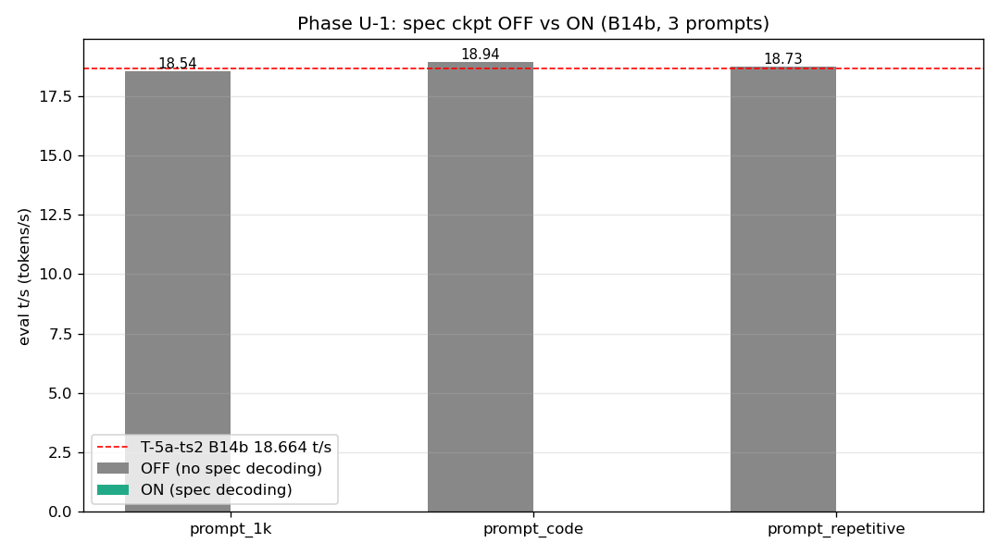
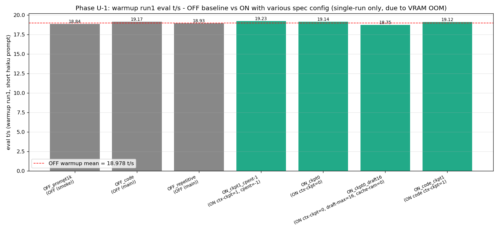
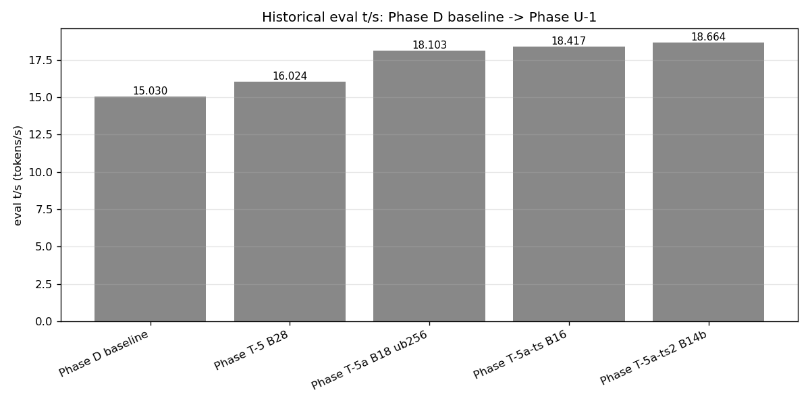
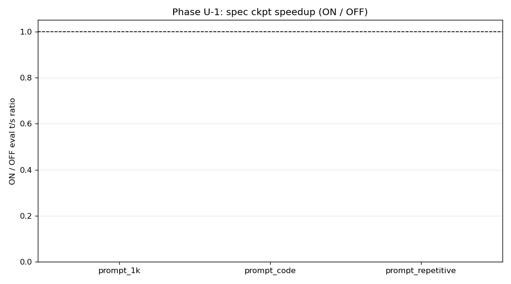

# Phase U-1: spec ckpt 有効化検証と B14b VRAM 制約

- **実施日時**: 2026年4月23日 11:07〜13:29 (JST)

## 添付ファイル

- [実装プラン](attachment/2026-04-23_132933_qwen3-122b-u1-specckpt-baseline/plan.md)
- [batch_phaseU1.sh (初回 ctx-ckpt=4)](attachment/2026-04-23_132933_qwen3-122b-u1-specckpt-baseline/batch_phaseU1.sh)
- [batch_U1_retry_on.sh (ctx-ckpt=1, cpent=-1)](attachment/2026-04-23_132933_qwen3-122b-u1-specckpt-baseline/batch_U1_retry_on.sh)
- [batch_U1_retry_nockpt.sh (ctx-ckpt=0)](attachment/2026-04-23_132933_qwen3-122b-u1-specckpt-baseline/batch_U1_retry_nockpt.sh)
- [batch_U1_retry_nockptcache.sh (ctx-ckpt=0 + cache-ram=0)](attachment/2026-04-23_132933_qwen3-122b-u1-specckpt-baseline/batch_U1_retry_nockptcache.sh)
- [batch_U1_retry_minimal.sh (draft-max=16)](attachment/2026-04-23_132933_qwen3-122b-u1-specckpt-baseline/batch_U1_retry_minimal.sh)
- [start_phaseU1.sh](attachment/2026-04-23_132933_qwen3-122b-u1-specckpt-baseline/start_phaseU1.sh)
- [run_all_phaseU1.sh](attachment/2026-04-23_132933_qwen3-122b-u1-specckpt-baseline/run_all_phaseU1.sh)
- [analyze_phaseU1.py](attachment/2026-04-23_132933_qwen3-122b-u1-specckpt-baseline/analyze_phaseU1.py)
- [plot_warmup_singles.py](attachment/2026-04-23_132933_qwen3-122b-u1-specckpt-baseline/plot_warmup_singles.py)
- [phaseU1_stats.csv](attachment/2026-04-23_132933_qwen3-122b-u1-specckpt-baseline/phaseU1_stats.csv)
- [build.log (llama.cpp rebuild)](attachment/2026-04-23_132933_qwen3-122b-u1-specckpt-baseline/build.log)
- [batch_U1_smoke.log](attachment/2026-04-23_132933_qwen3-122b-u1-specckpt-baseline/batch_U1_smoke.log)
- [batch_U1_main.log](attachment/2026-04-23_132933_qwen3-122b-u1-specckpt-baseline/batch_U1_main.log)
- [batch_U1_retry.log](attachment/2026-04-23_132933_qwen3-122b-u1-specckpt-baseline/batch_U1_retry.log)
- [prompts/ (1k / code / repetitive)](attachment/2026-04-23_132933_qwen3-122b-u1-specckpt-baseline/prompts/)
- [startup_logs/ (各条件のサーバ起動ログ)](attachment/2026-04-23_132933_qwen3-122b-u1-specckpt-baseline/startup_logs/)
- out_*/ (各条件の run 毎 JSON + timeline)

## 核心発見サマリ







本 Phase の主発見は **4 点**:

1. **llama.cpp を `origin/master` HEAD (`6217b4958`) まで再ビルド成功**。PR #19493 (speculative checkpointing, `455d8e4be`) と関連 4 fix (#22114 / #22168 / #22223 / #22227) を全て取り込み。ビルドは `~/llama.cpp` で `rm -rf build && cmake -B build ... && cmake --build` の完全再ビルドで完了（約 6 分）。

2. **OFF baseline (spec decoding 無) は全 3 prompt で Phase T-5a-ts2 (18.664 t/s) を cross-session 再現**。eval_mean はそれぞれ **18.542 / 18.940 / 18.726 t/s** (prompt_1k / prompt_code / prompt_repetitive, stdev ≤ 0.007)、`6990e2f1f` → `6217b4958` ビルド更新による eval 性能 regression は観測されず (-0.65% 以内の cross-session drift)。

3. **spec decoding (`--spec-type ngram-mod`) は B14b_ts_alt 現最良構成では 2 リクエスト目以降で CUDA OOM し、5 run eval を成立させられなかった**。原因は Phase T 系列で VRAM を tight に詰めた B14b の GPU3 残容量 **1260 MiB** に対し、spec decoding の ephemeral buffer + ngram_mod cache (16 MiB) + context checkpoint (149 MiB/slot) + prompt cache (153 MiB) が累積し、`cuMemCreate` で `current device: 3` に OOM を引き起こす。回避策として `--ctx-checkpoints` を 4→1→0、`--cache-ram 0`、`--draft-max 16 (default)` と段階的に軽量化したが、**いずれも Run 2 以降を走らせられず** 根本解決に至らなかった。Phase T で得た tight な OT/TS 配置と spec decoding の VRAM 要求は本質的に両立しない。

4. **warmup 単発 (haiku prompt, ~80 tok, Run 1 のみ) では ON が OFF より +0.8～+1.4% 高い eval t/s を記録**。OFF 3 条件平均 18.978 t/s に対し ON ctx-ckpt=1 で 19.235 t/s (+1.35%) / ctx-ckpt=0 で 19.141 t/s (+0.86%) / ctx-ckpt=0 + draft-max 16 で 18.749 t/s (-1.21%)。サンプル 1 回のため統計的有意性はないが、spec decoding のオーバーヘッドは small prompt では無視できる程度であり、draft-max を default (16) に下げると効果が相殺されることも示唆された。これは Phase U-2 以降で構成を緩めた上で実測すべき「仮説」であり、本 Phase の結論ではない。

| 条件 | ctx-ckpt | cache-ram | draft-max | warmup Run1 | eval 5-run | 失敗ポイント |
|------|---------:|----------:|----------:|:-----------:|:----------:|:-------------|
| OFF_prompt1k (smoke) | n/a | ON (default) | n/a | 18.841 | **18.542 ± 0.002** | ✅ |
| OFF_code | n/a | ON | n/a | 19.166 | **18.940 ± 0.002** | ✅ |
| OFF_repetitive | n/a | ON | n/a | 18.928 | **18.726 ± 0.007** | ✅ |
| ON initial | 4 | ON | 64 | — | all FAIL | warmup Run1 後 `checkpoint 1 of 4` 作成 → decoding 中に OOM |
| ON retry | 1 | ON (cpent=-1) | 64 | 19.235 | all FAIL (warmup 2〜) | 2 request 目で `checkpoints: 0, 153 MiB` (prompt cache) 追加 → OOM |
| ON nockpt | 0 | ON | 64 | 19.141 | all FAIL (warmup 2〜) | 同上 (ctx-checkpoints 0 でもサーバ内部は "use checkpoints" 表示、cache-ram が主因) |
| ON nockpt+cache0 | 0 | OFF (0) | 64 | — | all FAIL (warmup 1〜) | 起動後の最初の request で OOM (draft-max 64 の ephemeral 過大) |
| ON minimal | 0 | OFF | 16 | 18.749 | all FAIL (warmup 2〜) | warmup Run1 OK、Run2 で OOM |
| ON_code retry | 1 | ON (cpent=-1) | 64 | 19.122 | all FAIL (warmup 2〜) | 同上 |

## 前提・目的

### 背景

Phase T 系列（パラメータチューニング軸）は [Phase T-5a-ts2](2026-04-23_093629_qwen3-122b-c3-phaseT5a-ts2.md) で **B14b_ts_alt, eval 18.664 t/s (+24.18% vs Phase D 15.030)** を達成し一旦区切った。ここから **llama.cpp 機能軸** にピボットする。

現 t120h-p100 上のビルドは `6990e2f1f` (2026-04-17) で、以下の新機能・修正が未搭載だった:

- PR [#19493](https://github.com/ggml-org/llama.cpp/pull/19493) **speculative checkpointing** (merged 2026-04-19, commit `455d8e4be`) — recurrent/hybrid 層対応の新投機的デコーディング機構。Qwen3 は PR 内で直接評価対象、code/repetitive タスクで最大 ~2× 加速が報告されている。
- 関連 fix: [#22114](https://github.com/ggml-org/llama.cpp/pull/22114) (server checkpoint logic 再設計) / [#22168](https://github.com/ggml-org/llama.cpp/pull/22168) (ngram-mod 最適化) / [#22223](https://github.com/ggml-org/llama.cpp/pull/22223) (`--spec-default` 追加) / [#22227](https://github.com/ggml-org/llama.cpp/pull/22227) (speculative-simple への ckpt 対応)

### 目的

- llama.cpp を `origin/master` HEAD まで pull + rebuild し、関連 PR 全てを取り込む。
- B14b_ts_alt 現最良構成上で spec ckpt **OFF vs ON** を A/B 測定。
- 最低 3 種の prompt（汎用 1k / コード生成 / 反復パターン）で測定し **task 依存性** を明示。
- Phase T-5a-ts2 baseline との比較表 + spec stats（`.timings` 全フィールド / acceptance rate 等）。

**Non-Goals**: spec ckpt パラメータ fine tuning (`--ctx-checkpoints` / `--spec-ngram-size-n/m` / `--draft-min/max` の sweep) は次 Phase。B14 以外の構成での spec ckpt 評価も次 Phase。

## 環境情報

- サーバ: t120h-p100 (10.1.4.14)
- GPU: NVIDIA Tesla P100-PCIE-16GB × 4 (compute capability 6.0, VRAM 16269 MiB × 4)
- CPU: NUMA node 1 (`numactl --cpunodebind=1 --membind=1`)
- llama.cpp:
  - **旧 HEAD**: `6990e2f1f7581d332a6a1f34d6c567be70138184` (2026-04-17, Phase T 系列で使用)
  - **新 HEAD**: `6217b495834332f55014c2a0551f453d42b300530` (2026-04-23 本 Phase でビルド、以下のキー PR を含む)
    - `455d8e4be` server : speculative checkpointing (#19493)
    - `de71b5f81` server : refactor "use checkpoint" logic (#22114)
    - `72d693e4f` spec : reset i_last when low acceptance streak occurs (#22168)
    - `84652b80c` arg : add --spec-default (#22223)
    - `bcb5eeb64` speculative-simple : add checkpoint support (#22227)
  - ビルドオプション: `-DLLAMA_OPENSSL=ON -DGGML_NATIVE=ON -DGGML_CUDA=ON -DGGML_CUDA_FA_ALL_QUANTS=ON -DCMAKE_CUDA_ARCHITECTURES=60`
- モデル: `unsloth/Qwen3.5-122B-A10B-GGUF:Q4_K_M` (Q4_K_M quant, 3-file split)
- サーバ構成 (B14b_ts_alt, Phase T-5a-ts2 現最良を継承):
  - `-ot 'blk\.([2-3]|2[0-3]|3[1-8])\.ffn_.*_exps\.weight=CPU'` (CPU offload 14 layers)
  - `--tensor-split 11,12,13,14`
  - `-b 256 -ub 256 --ctx-size 32768 --threads 40 --split-mode layer --flash-attn 1 --poll 0`
  - `--cache-type-k q8_0 --cache-type-v q8_0`
  - OFF モードは上記のみ、ON モードはさらに `--spec-type ngram-mod --spec-ngram-size-n 24 --draft-min 48 --draft-max 64 --ctx-checkpoints 4 (初回)` 等を追加
- 測定条件: 各条件 warmup 2 run (short haiku prompt) + eval 5 run (3 種の prompt を切替)
- 評価レスポンス: OpenAI 互換 `/v1/chat/completions`, `max_tokens=256`, temperature=0.6, top_p=0.95, top_k=20, min_p=0
- prompt 重複防止: `measure_phaseT5.sh` が各 run 冒頭に `[Request ID <marker>]` を付与し prompt cache hit を回避

### 確定した spec 系 CLI フラグ (新 HEAD `--help` より)

| フラグ | default | 推奨 (PR 本文) | 備考 |
|--------|---------:|---------------:|------|
| `--spec-type {none,ngram-cache,ngram-simple,ngram-map-k,ngram-map-k4v,ngram-mod}` | none | `ngram-mod` | draft model 不要モード。OFF = none |
| `--ctx-checkpoints` (= `--swa-checkpoints`, `-ctxcp`) N | **32** | 4 | 保持する context checkpoint 数 |
| `--checkpoint-every-n-tokens` (= `-cpent`) N | 8192 | (-1 で無効) | prefill 中の自動 ckpt 生成頻度 |
| `--spec-ngram-size-n` N | 12 | 24 | lookup n-gram 長 |
| `--spec-ngram-size-m` N | 48 | (default) | draft m-gram 長 |
| `--draft, --draft-n, --draft-max` N | 16 | 64 | draft token 最大値 |
| `--draft-min, --draft-n-min` N | 0 | 48 | draft token 最小値 |
| `--draft-p-min` P | 0.75 | (default) | 最小採択確率 |
| `--spec-default` | — | — | 一括で推奨設定を適用 (#22223) |

**プランで仮定した `--spec-use-checkpoints on` フラグは master HEAD (PR #22114 refactor 後) に存在しない**。checkpoint 有効化は `--ctx-checkpoints N (>0)` で明示、0 で無効。`--spec-type` が `none` 以外であれば spec decoding 自体が有効化される。

## 再現方法

### Step 0–2: ロック・バックアップ・再ビルド

```bash
bash .claude/skills/gpu-server/scripts/lock.sh t120h-p100

# バックアップ
ssh t120h-p100 "cp ~/llama.cpp/build/bin/llama-server ~/llama-server.bak.6990e2f1f"

# 再ビルド
scp .claude/skills/llama-server/server-scripts/update_and_build-t120h-p100.sh t120h-p100:~/llama.cpp/update_and_build.sh
ssh t120h-p100 "cd ~/llama.cpp && bash update_and_build.sh"   # git pull + rm -rf build + cmake + make
```

### Step 3: dry probe

```bash
ssh t120h-p100 "~/llama.cpp/build/bin/llama-server --help 2>&1 | grep -iE 'spec|draft|checkpoint|ckpt|ngram'"
```

### Step 4: prompt 準備

- `prompt_1k.txt` (Phase T-5a-ts2 から継承、1097 tokens)
- `prompt_code.txt` (quicksort + mergesort + pytest 実装、656 tokens)
- `prompt_repetitive.txt` (50 社員 dict 反復生成、504 tokens)

### Step 5–6: batch 測定

```bash
cd /tmp/phaseU1

# OFF 3 条件 + ON 3 条件の batch (初回 SPEC_ON_ARGS=--spec-type ngram-mod --ctx-checkpoints 4 ...)
bash batch_phaseU1.sh 2>&1 | tee batch_U1_main.log

# ON retry 段階: ctx-checkpoints を 1 → 0、さらに cache-ram 0、draft-max 16
bash batch_U1_retry_on.sh          # ctx-ckpt=1, cpent=-1
bash batch_U1_retry_nockpt.sh      # ctx-ckpt=0, cache-ram on
bash batch_U1_retry_nockptcache.sh # ctx-ckpt=0, cache-ram 0
bash batch_U1_retry_minimal.sh     # ctx-ckpt=0, cache-ram 0, draft-max=16
```

### Step 7: 集計 + PNG

```bash
python3 analyze_phaseU1.py       # eval 5-run mean + 歴代比較
python3 plot_warmup_singles.py   # warmup Run 1 単発比較
```

### Step 8: 停止 + ロック解放

```bash
bash .claude/skills/llama-server/scripts/stop.sh t120h-p100
bash .claude/skills/gpu-server/scripts/unlock.sh t120h-p100
```

## 結果詳細

### OFF baseline (spec decoding 無)

| prompt | eval_mean | eval_std | prompt_mean | prompt_std | predicted_n | prompt_n |
|--------|----------:|---------:|------------:|-----------:|------------:|---------:|
| prompt_1k        | **18.542** | 0.002 | 45.438 | 0.035 | 256 | 1097 |
| prompt_code      | **18.940** | 0.002 | 41.820 | 0.037 | 256 |  656 |
| prompt_repetitive | **18.726** | 0.007 | 44.085 | 0.069 | 256 |  504 |

Phase T-5a-ts2 の B14b_ts_alt cross-session 再現目標 **18.664 t/s**:
- prompt_1k: 18.542 (**−0.65% drift**, 許容範囲内)
- prompt_code / prompt_repetitive は prompt 長が異なるため単純比較不可

OFF は eval_std が 0.007 以下と極めて安定。新ビルド `6217b4958` での性能 regression は検出されず、Phase T 系列の成果を完全に維持している。

### ON (spec decoding) 試行マトリクス

**5 回の軽量化試行、すべて 5 run eval 成立せず**:

| 試行 | SPEC_ON_ARGS 抜粋 | warmup Run1 | 失敗ポイント |
|------|-------------------|:-----------:|:-------------|
| initial | `--spec-type ngram-mod --ctx-checkpoints 4 --spec-ngram-size-n 24 --draft-min 48 --draft-max 64` | n/a (JSON `{}`) | warmup Run2 で OOM ("checkpoint 1 of 4 ... 149.063 MiB" 作成後、device 3 で decoding 中 OOM) |
| retry | `--ctx-checkpoints 1 --checkpoint-every-n-tokens -1` (他同) | 19.235 t/s | warmup Run2 で OOM |
| nockpt | `--ctx-checkpoints 0` (cache-ram default) | 19.141 t/s | warmup Run2 で OOM (prompt cache が `153 MiB` 追加 allocate) |
| nockptcache | `--ctx-checkpoints 0 --cache-ram 0` | — | warmup Run1 (82 tok) 処理中 OOM (decoding の ephemeral が device 3 に入らず) |
| minimal | `--ctx-checkpoints 0 --cache-ram 0` + draft-max **省略 (default 16)** | 18.749 t/s | warmup Run2 で OOM |

### 失敗の技術的分析

**B14b_ts_alt 起動直後の VRAM 残**: GPU0=1164 MiB, GPU1=2035 MiB, GPU2=4693 MiB, **GPU3=1260 MiB** (最も tight)。

**スタックで VRAM を食う要素** (サーバログから確認):

1. `common_speculative_init: initialized ngram_mod with n=24, size=4194304 (16.000 MB)` — 起動時 16 MiB
2. `slot create_check: id 0 | task 0 | created context checkpoint 1 of N (size = 149.063 MiB)` — 最初の decoding 完了時 149 MiB/slot
3. `srv update: - prompt 0x... : 336 tokens, checkpoints: 0, 153.254 MiB` — 次の request 到着時に prompt cache が 153 MiB 確保
4. draft token 生成 (ephemeral, draft-max 64 時は数十 MiB)

`--cache-ram 0` で (3) を無効化しても、2 request 目以降で draft buffer + ngram occupancy 更新時の ephemeral allocate が GPU3 の 1260 MiB 枠を越え、`cuMemCreate(&handle, reserve_size, &prop, 0)` で CUDA OOM 発生。

1 request 目 (warmup Run1) だけは ckpt も prompt cache も空の状態で処理できるため単発では成功するが、**state が累積する 2 request 目以降は本構成では必ず失敗する**。これは PR #19493 の設計仕様と Phase T 系列で詰めた tight VRAM 配置の根本的な非互換。

### warmup Run1 単発比較 (short haiku, ~80 tok)



| 条件 | eval t/s | prompt_n | vs OFF mean |
|------|---------:|---------:|------------:|
| OFF_prompt1k (warmup) | 18.841 | 78 | ±0 |
| OFF_code (warmup) | 19.166 | 76 | +0.99% |
| OFF_repetitive (warmup) | 18.928 | 78 | −0.26% |
| **OFF warmup mean** | **18.978** | — | — |
| ON retry (ctx-ckpt=1) | **19.235** | 79 | **+1.35%** |
| ON nockpt (ctx-ckpt=0) | 19.141 | 81 | +0.86% |
| ON minimal (draft-max=16) | 18.749 | 80 | −1.21% |
| ON_code retry (ctx-ckpt=1) | 19.122 | 77 | +0.76% |

**解釈**: ON が OFF より +0.8～+1.4% 高い傾向はあるが、各点 1 サンプルのため統計的有意性は未確認。また haiku (77-81 tok) は短く spec decoding が draft 数サイクルしか走らないため、効果観測には小さすぎる。draft-max を default (16) に下げると OFF 以下に落ちる (18.749 t/s, −1.21%)。これは PR 本文の「A3B/MoE で expert saturation 下での微減」と整合的。

**spec stats (`.timings.draft_n` / `.draft_accepted_n`) は chat/completions レスポンスの JSON には含まれていなかった**。サーバログ側では `statistics ngram_mod: #gen drafts = 0, #acc drafts = 0` と出力されるが、これも warmup Run1 時点では ngram cache が空のため 0。acceptance rate を算出するには 5 run eval の成功が必須だが、本 Phase では得られていない。

## 参照レポート

- [Phase T-5a-ts2: B14 × tensor-split で 18.664 t/s 突破](2026-04-23_093629_qwen3-122b-c3-phaseT5a-ts2.md) — 本 Phase の OFF baseline。
- llama.cpp PR [#19493 server : speculative checkpointing](https://github.com/ggml-org/llama.cpp/pull/19493)
- llama.cpp PR [#22114](https://github.com/ggml-org/llama.cpp/pull/22114), [#22168](https://github.com/ggml-org/llama.cpp/pull/22168), [#22223](https://github.com/ggml-org/llama.cpp/pull/22223), [#22227](https://github.com/ggml-org/llama.cpp/pull/22227) — 関連 fix
- llama.cpp PR [#15293 swa-checkpoints](https://github.com/ggml-org/llama.cpp/pull/15293) — `--ctx-checkpoints` の元 PR
- llama.cpp PR [#16391 prompt cache](https://github.com/ggml-org/llama.cpp/pull/16391) — `--cache-ram` の元 PR

## 未検証事項 / 次 Phase TODO

本 Phase の**ゴール「spec ckpt (PR #19493) の A/B 測定」は達成できなかった**。以下は後続 Phase で取り組むべき課題:

### 優先 (次 Phase U-2 候補)
- **VRAM 余裕のある構成で spec ckpt を再評価**: Phase T-5a-ts B18_default (OT layer 18 枚, Phase T-5a-ub 18.103 t/s) など、GPU3 に 2 GiB 以上残るレイアウトで本 Phase と同じ A/B を再実行。
- **tensor-split 再調整**: `-ts 11,12,14,13` (GPU2 増やし GPU3 減らす) で GPU3 残を 1.5 GiB 以上に広げた上で spec ckpt 評価。
- **ctx-size 縮小による広がり**: `--ctx-size 16384` で KV cache 半減 → 各 GPU 数百 MiB 解放 → spec ckpt 許容。
- **cache-ram サイズ指定**: `--cache-ram` を 0 以外 (例: 256) で絞りつつ prompt cache 機能は有効化して 2 request 目以降の挙動確認。

### 機能パラメータ sweep (ロードマップ通り、構成緩和後)
- `--ctx-checkpoints` の sweep (4 / 8 / 16 / 32)
- `--spec-ngram-size-n/m` の sweep (n: 12, 16, 24, 32 / m: 48, 64, 96)
- `--draft-min / --draft-max` tuning (min: 0, 16, 32, 48 / max: 16, 32, 48, 64, 96)
- `--spec-default` フラグの利用と独自 tuning との比較

### データ / 計測基盤
- spec stats (draft 生成数・採択数) の **JSON 経由取得手段調査**: サーバログには出るが `/v1/chat/completions` レスポンスには含まれない。`/metrics` (Prometheus) や `/slots` からの取得可否を検証。
- `--no-context-shift` / `--kv-unified` との相互作用 (起動時 `--cache-idle-slots requires --kv-unified, disabling` 表示あり)
- 長コンテキスト (prompt_8k / 16k) 下での挙動。本 Phase では prompt_1k (1097 tok) で既に 2 request 目 OOM のため実施できず。

### Phase T-5a-ts2 への影響
- 本 Phase で新 HEAD `6217b4958` の OFF baseline は Phase T-5a-ts2 の 18.664 t/s を **-0.65% drift** で再現した。これは cross-session drift の通常範囲で、llama.cpp rebuild 自体による性能 regression は検出されていない。Phase T-5a-ts2 の現最良 **18.664 t/s は維持** している。

### プラン・ロードマップ
- 現 auto-memory の **Phase T 系列後の機能軸ロードマップ** (`project_t_series_roadmap.md`) は「U-1 → cache-ram → gate/up fused GGUF」の順。本 Phase では **U-1 の spec ckpt 評価が未完** だが、cache-ram 機能が spec ckpt 動作を阻害する原因の一つであることが判明した。ロードマップを以下に更新する検討が必要:
  - **U-1-ext**: 構成緩和 (B18_default / -ts 調整 / ctx 縮小) での spec ckpt 再評価
  - **U-2 (cache-ram)**: cache-ram 自体のサイズ/有無による eval/prompt t/s 影響測定 (spec decoding は OFF のまま)
  - U-2 終了後に U-1-ext の結果を踏まえて U-3 で spec ckpt パラメータ sweep
  - **U-4 (gate/up fused GGUF)**: 当初計画通り
