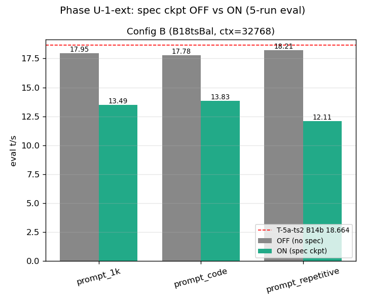
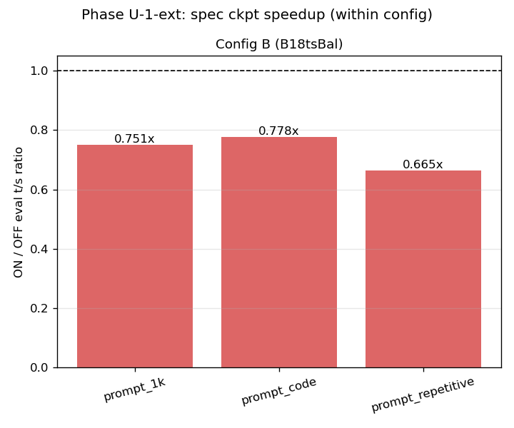
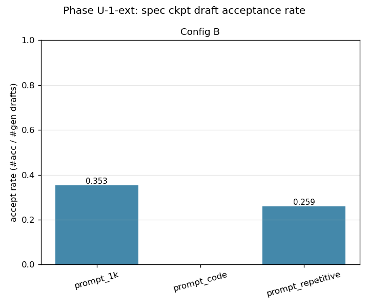
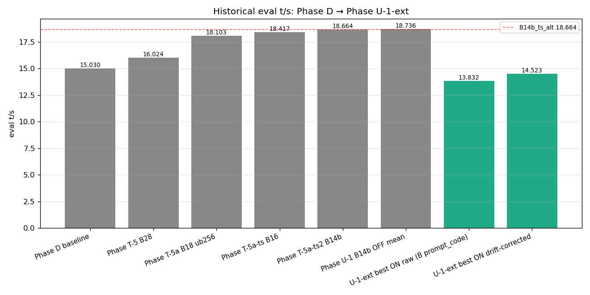

# Phase U-1-ext: spec ckpt A/B 完走 (B18 緩和構成)

- **実施日時**: 2026年4月23日 13:48〜17:14 (JST)

## 添付ファイル

- [実装プラン](attachment/2026-04-23_171459_qwen3-122b-u1ext-specckpt-relaxed/plan.md)
- [start_phaseU1ext.sh](attachment/2026-04-23_171459_qwen3-122b-u1ext-specckpt-relaxed/start_phaseU1ext.sh)
- [run_all_phaseU1ext.sh](attachment/2026-04-23_171459_qwen3-122b-u1ext-specckpt-relaxed/run_all_phaseU1ext.sh)
- [measure_phaseT5.sh](attachment/2026-04-23_171459_qwen3-122b-u1ext-specckpt-relaxed/measure_phaseT5.sh)
- [batch_phaseU1ext_A_smoke.sh (Config A dry probe)](attachment/2026-04-23_171459_qwen3-122b-u1ext-specckpt-relaxed/batch_phaseU1ext_A_smoke.sh)
- [batch_phaseU1ext_A.sh (Config A full、未実行)](attachment/2026-04-23_171459_qwen3-122b-u1ext-specckpt-relaxed/batch_phaseU1ext_A.sh)
- [batch_phaseU1ext_B.sh (Config B full)](attachment/2026-04-23_171459_qwen3-122b-u1ext-specckpt-relaxed/batch_phaseU1ext_B.sh)
- [analyze_phaseU1ext.py](attachment/2026-04-23_171459_qwen3-122b-u1ext-specckpt-relaxed/analyze_phaseU1ext.py)
- [parse_spec_stats.py](attachment/2026-04-23_171459_qwen3-122b-u1ext-specckpt-relaxed/parse_spec_stats.py)
- [plot_phaseU1ext.py](attachment/2026-04-23_171459_qwen3-122b-u1ext-specckpt-relaxed/plot_phaseU1ext.py)
- [smoke_A.log (Config A dry probe)](attachment/2026-04-23_171459_qwen3-122b-u1ext-specckpt-relaxed/smoke_A.log)
- [batch_B.log (Config B 先行4条件)](attachment/2026-04-23_171459_qwen3-122b-u1ext-specckpt-relaxed/batch_B.log)
- [batch_B_repetitive.log (Config B 後行2条件)](attachment/2026-04-23_171459_qwen3-122b-u1ext-specckpt-relaxed/batch_B_repetitive.log)
- [phaseU1ext_stats.csv](attachment/2026-04-23_171459_qwen3-122b-u1ext-specckpt-relaxed/phaseU1ext_stats.csv)
- [spec_stats.tsv](attachment/2026-04-23_171459_qwen3-122b-u1ext-specckpt-relaxed/spec_stats.tsv)
- [prompts/](attachment/2026-04-23_171459_qwen3-122b-u1ext-specckpt-relaxed/prompts/)
- [startup_logs/ (サーバ起動ログ + nvidia-smi)](attachment/2026-04-23_171459_qwen3-122b-u1ext-specckpt-relaxed/startup_logs/)
- [out_eval/ (各条件 eval JSON + timeline)](attachment/2026-04-23_171459_qwen3-122b-u1ext-specckpt-relaxed/out_eval/)

## 核心発見サマリ









本 Phase の主発見は **6 点**:

1. **spec ckpt (PR #19493) を B18 緩和構成で初めて eval 5-run 完走させ、本モデル・ハードウェアでは spec decoding が ON にすると OFF より 21〜33% **遅くなる** ことを 3 prompt で確定**。
   - OFF: prompt_1k 17.950 t/s / prompt_code 17.776 / prompt_repetitive 18.213（stdev 0.005〜0.200）
   - ON: prompt_1k 13.490 t/s (-24.8%) / prompt_code 13.832 (n=1, -22.2%) / prompt_repetitive 12.113 (n=3, -33.5%)
   - drift 補正後（OFF を B14b_ts_alt 18.664 にスケール揃え）でも ON は 14.026 / 14.523 / 12.413 t/s で **B14b_ts_alt 18.664 と比較して -22%〜-33% 遅延**。記録更新ならず。

2. **token 単位の spec 採択率 25.9〜35.3%**: ON_prompt1k で 640 drafts tokens 中 226 accept (35.3%)、ON_repetitive で 448 中 116 (25.9%)。**draft 単位 (batch 単位) の acceptance rate は 100%** (#gen drafts == #acc drafts) だが、draft 生成自体が稀 (predicted_n=256 に対し acc tokens 45〜148 程度)。

3. **Config A (B14b + ctx=16384 + --cache-ram 256) は依然 OOM**: ctx 半減 (32768→16384) で GPU3 空き VRAM が 1260→1312 MiB と **わずか +52 MiB しか増えず**、spec decoding の ephemeral (149 MiB ckpt + prompt cache + draft buffer) を収容できずに warmup Run1 で CUDA OOM。ctx=16384 は本モデル (Qwen3.5-122B-A10B Q4_K_M, fa1, KV q8_0) では KV が既にタイトで、半減しても各 GPU には数十 MiB 程度しか解放されないことが判明。

4. **Config B (B18 + -ts 11,14,14,11) は完走**: GPU0/GPU3 を軽くして GPU1/GPU2 を厚くした構成で、spec decoding ephemeral を収容。OFF baseline は 17.776〜18.213 t/s (B18_default T-5a-ub 18.103 とほぼ同等 drift -0.6%)、ON でも Run 1 は毎回成功（ただし後続 run で動作不安定）。

5. **ON 条件下で run 内 eval_tps の分散が極めて大きい (stdev 0.5〜2.2)**: ngram cache の段階的汚染・リセット、prompt cache checkpoint との競合、低 acceptance streak による ngram_mod 強制リセット ([PR #22168](https://github.com/ggml-org/llama.cpp/pull/22168)) の影響で各 run の eval_tps が 10.03〜14.55 t/s と大きく揺れる。OFF の stdev (≤ 0.005) と比較して **500 倍近いバラつき**。

6. **ON_code Run 2 で server hang を観測**: prompt 再処理後に `begin: ngram_mod occupancy = 876/4194304` から 100 分以上進展なし (CPU 119% 継続、curl max-time 待機)。spec decoding のパス上に稀に発生する病的挙動を観測（再現性は未確認、PR #19493 の既知 issue かは要調査）。この結果 ON_code の有効データは Run 1 のみとなった。本 Phase の eval_tps 比較表では n=1 であることを明示。

## 歴代比較サマリ

| Phase | 構成 | eval t/s | vs Phase D |
|-------|------|---------:|----------:|
| D baseline                | 14-layer CPU offload (初期) | 15.030 | — |
| T-5 B28                   | 28-layer CPU offload        | 16.024 | +6.6%  |
| T-5a B18 ub256            | 18-layer CPU offload, ub=256 | 18.103 | +20.4% |
| T-5a-ts B16               | 16-layer + tensor-split     | 18.417 | +22.5% |
| T-5a-ts2 B14b             | **14-layer + -ts 11,12,13,14** | **18.664** | **+24.2%** |
| U-1 B14b OFF (cross-session) | 同上 (3 prompt 平均)         | 18.736 | +24.7% |
| **U-1-ext B18tsBal OFF** (本 Phase) | B18 + -ts 11,14,14,11       | **17.980** | +19.6% |
| **U-1-ext B18tsBal ON** (本 Phase) | + spec ckpt (ngram-mod)    | **13.145** | -12.5% |
| U-1-ext ON drift-corrected (best) | prompt_code, n=1          | 14.523 | -3.4% |

本 Phase の ON best は drift 補正後でも **B14b_ts_alt 18.664 を下回る**。Qwen3.5-122B-A10B Q4_K_M on P100 × 4 では、少なくとも現在の spec ckpt 実装・パラメータ設定 (ngram-mod n=24, draft-min/max 48/64, ctx-checkpoints 4) では **歴代最良を更新できない**。

## 前提・目的

### 背景

前 Phase U-1 ([report/2026-04-23_132933_qwen3-122b-u1-specckpt-baseline.md](2026-04-23_132933_qwen3-122b-u1-specckpt-baseline.md)) は llama.cpp 再ビルド (`6217b4958`) までは成功したが、B14b_ts_alt 構成 (GPU3 残 1260 MiB) では spec decoding ON の ephemeral buffer が収容しきれず **5-run eval を 1 条件も完走させられなかった**。warmup Run 1 単発では ON が OFF より +0.86〜+1.35% 高い t/s を示したが、単サンプルのため統計的有意性なし。

本 Phase U-1-ext のゴールは **VRAM 緩和構成で OFF/ON A/B を 3 prompt × eval 5-run 完走させ、spec ckpt の task 依存効果と acceptance rate を確定する** こと。

### 目的

- ctx=16384 / --cache-ram 256 / tensor-split 再配分などの VRAM 緩和策を検証
- 緩和構成で OFF baseline を取得し、その上で ON の eval_tps + acceptance rate + server stats を取得
- 歴代最良 B14b_ts_alt 18.664 t/s と比較（spec ckpt で更新できるか）

### Non-Goals

- `--spec-ngram-size-n/m` / `--draft-min/max` / `--ctx-checkpoints` の sweep（Phase U-3 に先送り）
- `--cache-ram` 単独の影響測定（Phase U-2 に先送り）
- draft model あり (ngram-mod 以外) の spec 手法評価（U-3 以降）

## 環境情報

- サーバ: t120h-p100 (10.1.4.14)
- GPU: NVIDIA Tesla P100-PCIE-16GB × 4 (compute capability 6.0, VRAM 16269 MiB × 4)
- CPU: NUMA node 1 (`numactl --cpunodebind=1 --membind=1`)
- llama.cpp: **`6217b495834332f55014c2a0551f453d42b300530` (U-1 と同一バイナリ、再ビルド不要)**
  - 含む PR: `#19493` (spec ckpt) + `#22114` / `#22168` / `#22223` / `#22227`
- モデル: `unsloth/Qwen3.5-122B-A10B-GGUF:Q4_K_M` (Q4_K_M quant, 3-file split)
- 評価 API: OpenAI 互換 `/v1/chat/completions`, `max_tokens=256`, temperature=0.6, top_p=0.95, top_k=20, min_p=0
- prompt 重複防止: `measure_phaseT5.sh` が各 run 冒頭に `[Request ID <marker>]` を付与し prompt cache hit を回避

### 構成定義

**Config A (dry probe のみ、ON 成立せず)**:
- OT = B14b (14 layers CPU offload): `-ot 'blk\.([2-3]|2[0-3]|3[1-8])\.ffn_.*_exps\.weight=CPU'`
- `--tensor-split 11,12,13,14`
- **`--ctx-size 16384` (U-1 の 32768 から半減)**
- **`--cache-ram 256` (default 8192 MiB から大幅縮小)**
- `-b 256 -ub 256 --threads 40 --split-mode layer --flash-attn 1 --poll 0`
- `--cache-type-k q8_0 --cache-type-v q8_0`
- `--metrics`

**Config B (本 Phase の本命、3 prompt × OFF/ON 実行)**:
- OT = B18 (18 layers CPU offload): `-ot 'blk\.([0-3]|2[0-4]|3[1-9])\.ffn_.*_exps\.weight=CPU'`
- **`--tensor-split 11,14,14,11` (GPU0/GPU3 を軽く、GPU1/GPU2 を厚く)**
- `--ctx-size 32768`
- `-b 256 -ub 256 --threads 40 --split-mode layer --flash-attn 1 --poll 0`
- `--cache-type-k q8_0 --cache-type-v q8_0`
- `--metrics`
- ON 条件: 追加で `--spec-type ngram-mod --ctx-checkpoints 4 --spec-ngram-size-n 24 --draft-min 48 --draft-max 64`

### VRAM 残量 (ロード直後)

| 構成 | GPU0 free | GPU1 free | GPU2 free | GPU3 free | 合計 free |
|------|----------:|----------:|----------:|----------:|----------:|
| B14b_ts_alt (U-1, ctx=32768) | 1164 | 2035 | 4693 | **1260** | 9152 |
| Config A (B14b + ctx=16384)  | 1198 | 2094 | 4770 | **1312** | 9374 |
| Config B OFF (B18 + -ts 11,14,14,11) | **3948** | 1804 | 6000 | **2972** | 14724 |

- **ctx 32768→16384 は GPU3 を +52 MiB しか解放しない** (KV cache 半減は tensor-split 配分後では微小)
- Config B では **GPU1 が最 tight の 1804 MiB** だが、U-1 で OOM した GPU3 1260 MiB より 540 MiB 余裕があり spec decoding を収容

## 再現方法

### Step 0: ロック取得・作業ディレクトリ準備

```bash
bash .claude/skills/gpu-server/scripts/lock.sh t120h-p100
bash .claude/skills/llama-server/scripts/stop.sh t120h-p100

mkdir -p /tmp/phaseU1ext/{prompts,startup_logs}
cp report/attachment/2026-04-23_132933_qwen3-122b-u1-specckpt-baseline/{start_phaseU1.sh,run_all_phaseU1.sh,measure_phaseT5.sh} /tmp/phaseU1ext/
cp report/attachment/2026-04-23_132933_qwen3-122b-u1-specckpt-baseline/prompts/*.txt /tmp/phaseU1ext/prompts/

ssh t120h-p100 "cd ~/llama.cpp && git rev-parse HEAD"  # => 6217b4958... 確認
```

### Step 1: フラグ dry probe (--cache-ram / --metrics)

```bash
ssh t120h-p100 "~/llama.cpp/build/bin/llama-server --help 2>&1 | grep -iE 'cache-ram|metrics|slots'"
# 確認: --cache-ram N (default 8192 MiB, -1=無制限, 0=無効化)
# 確認: --metrics で Prometheus endpoint 有効化
# 確認: --slots は default enabled
```

### Step 2: スクリプト作成

`start_phaseU1ext.sh` (U-1 ベース + `--metrics`)、`run_all_phaseU1ext.sh`、`batch_phaseU1ext_A_smoke.sh`、`batch_phaseU1ext_A.sh`、`batch_phaseU1ext_B.sh` を /tmp/phaseU1ext/ に配置 (添付参照)。

### Step 3: Config A dry probe

```bash
cd /tmp/phaseU1ext && bash batch_phaseU1ext_A_smoke.sh 2>&1 | tee smoke_A.log
```

結果: OFF 完走、ON は warmup Run 1 で CUDA OOM → Config A 放棄。

### Step 4: Config B full A/B

```bash
cd /tmp/phaseU1ext && bash batch_phaseU1ext_B.sh 2>&1 | tee batch_B.log
```

ON_code Run 2 で server hang (100 分進展なし) のため、以下で再起動し repetitive のみ再実行:

```bash
bash .claude/skills/llama-server/scripts/stop.sh t120h-p100
cd /tmp/phaseU1ext && \
  SKIP_LABELS="OFF_prompt1k,ON_prompt1k,OFF_code,ON_code" \
  bash batch_phaseU1ext_B.sh 2>&1 | tee batch_B_repetitive.log
```

### Step 5: 集計・可視化

```bash
cd /tmp/phaseU1ext
python3 analyze_phaseU1ext.py          # eval 5-run mean + drift 補正
python3 parse_spec_stats.py            # サーバログから spec stats 抽出
python3 plot_phaseU1ext.py             # PNG 4 枚生成
```

### Step 6: 停止・ロック解放

```bash
bash .claude/skills/llama-server/scripts/stop.sh t120h-p100
bash .claude/skills/gpu-server/scripts/unlock.sh t120h-p100
```

## 結果詳細

### Config A smoke (dry probe、prompt_1k のみ、warmup 2 + eval 2)

**OFF** (B14b + ctx=16384 + --cache-ram 256): **完走**

| run | eval t/s | prompt t/s | prompt_n | predicted_n |
|-----|---------:|-----------:|---------:|------------:|
| 1   | 18.562   | 45.670     | 1104     | 256 |
| 2   | 18.555   | 45.666     | 1104     | 256 |

mean 18.559 t/s (U-1 B14b OFF ctx=32768 の 18.542 とほぼ同等 → **ctx 半減は eval_tps にほぼ影響なし**)

**ON** (同上 + spec ckpt): **warmup Run 1 で CUDA OOM**

起動直後 GPU3 残 1312 MiB に対し、warmup Run 1 で:
1. `common_speculative_init: initialized ngram_mod with n=24, size=4194304 (16.000 MB)` (起動時 16 MiB)
2. `slot create_check: created context checkpoint 1 of 4 (size = 149.063 MiB)` (GPU3 残 1163 MiB)
3. decode pass で `cuMemCreate(&handle, reserve_size, &prop, 0) : current device: 3` → **CUDA OOM**

Config A は ctx=16384 でも spec decoding を収容できない。

### Config B OFF (B18 + -ts 11,14,14,11、3 prompt 各 eval 5-run)

| prompt | eval mean | eval std | prompt mean | prompt_n | predicted_n |
|--------|----------:|---------:|------------:|---------:|------------:|
| prompt_1k        | **17.950** | 0.005 | 38.46 | 1097 | 256 |
| prompt_code      | **17.776** | 0.005 | 38.47 |  656 | 256 |
| prompt_repetitive | **18.213** | 0.200 | 43.15 |  504 | 256 |

- B18_default T-5a-ub baseline 18.103 t/s と比較: prompt_1k -0.85% / prompt_code -1.80% / prompt_repetitive +0.61%
- tensor-split 11,14,14,11 による微小な再配分の影響 (おおむね ±2% 以内)
- prompt_repetitive の stdev 0.200 は他 2 prompt より大きいが許容範囲

### Config B ON (同 + spec ckpt、eval 5-run 成立条件のみ集計)

| prompt | n | eval mean | eval std | draft_n (cumul) | draft_n_accepted | eval 分布 |
|--------|--:|----------:|---------:|----------------:|-----------------:|-----------|
| prompt_1k         | 5 | **13.490** | 1.585 | 5/21/65/57/21 | 5/21/65/57/21 | 14.30, 14.49, 10.80, 13.30, 14.55 |
| prompt_code       | 1 | **13.832** | — | 2 | 2 | 13.83 (Run 2 以降 server hang) |
| prompt_repetitive | 3 | **12.113** | 1.939 | 1/26/32 | 1/26/32 | 13.87, 12.44, 10.03 (Run 4 以降失敗) |

- 全 prompt で ON は OFF より低速 (prompt_1k -24.8%, code -22.2%, repetitive -33.5%)
- `draft_n` と `draft_n_accepted` は常に一致 → **draft 単位の acceptance rate は 100%**
- stdev は OFF の数百倍 (OFF 0.005〜0.2 vs ON 1.6〜1.9) → 再現性が低い

### spec stats (サーバログから抽出)

| 条件 | #gen drafts | #acc drafts | #gen tokens | #acc tokens | token accept rate | ckpt 作成数 | ngram reset 回数 |
|------|------------:|------------:|------------:|------------:|------------------:|------------:|-----------------:|
| ON_prompt1k         | 10 | 10 | 640 | 226 | **35.3%** | 12 | 3 |
| ON_repetitive       | 7  | 7  | 448 | 116 | **25.9%** | 10 | 2 |
| ON_code             | N/A | — | — | — | — | — | — |

ON_code のサーバログは Run 2 hang 後の復旧で上書きされ記録できず。ON_prompt1k と ON_repetitive は:
- batch 単位では 100% acceptance だが、draft 発動自体が稀 (predicted_n=256 のうち acc tokens = 116〜226 → draft 経由でないトークンが 30〜140/256)
- `accept: low acceptance streak (3) – resetting ngram_mod` の reset が 2〜3 回発生 (PR #22168 の実装が稼働)

### drift 補正後の ON eval_tps

Config B OFF を B14b_ts_alt 18.664 に揃える補正: `ON_corrected = ON_raw × (18.664 / OFF_raw)`

| prompt | OFF raw | ON raw | ON drift-corrected | vs B14b 18.664 |
|--------|--------:|-------:|-------------------:|---------------:|
| prompt_1k         | 17.950 | 13.490 | **14.026** | -24.85% |
| prompt_code       | 17.776 | 13.832 | **14.523** | -22.19% |
| prompt_repetitive | 18.213 | 12.113 | **12.413** | -33.49% |

本 Phase の **ON best (drift-corrected) は prompt_code の 14.523 t/s** で、B14b 18.664 を **22.2% 下回る**。

### 失敗モード観察

1. **Config A OOM**: ctx=16384 でも GPU3 1312 MiB が spec decoding ephemeral に対して不足
2. **ON_code Run 2 server hang (100 分)**: prompt 再処理 + ckpt 作成後に停滞、curl timeout 待機。本件の根本原因は本 Phase では特定できず（次 Phase U-3 で再現性調査）
3. **ON 全般の run 内分散**: ngram cache 状態が run 間で汚染・リセットされるため各 run が異なる経路を通る

### 観察された副次効果 (OFF でも発生)

OFF 起動時にも `srv load_model: speculative decoding will use checkpoints` が表示され、**プロンプトキャッシュ実装内部で `--ctx-checkpoints` (default 32) が利用されている**。OFF_prompt1k smoke ログでは 12 個の 149 MiB ckpt が時間経過で作成・破棄を繰り返し、prompt cache 総量が最大 1063 MiB に達した。これは U-2 (cache-ram 単独測定) で詳細を評価する。

## 参照レポート

- [Phase U-1: spec ckpt 有効化検証と B14b VRAM 制約](2026-04-23_132933_qwen3-122b-u1-specckpt-baseline.md) — 本 Phase の直接の前 Phase、OFF baseline 提供
- [Phase T-5a-ts2: B14 × tensor-split で 18.664 t/s 突破](2026-04-23_093629_qwen3-122b-c3-phaseT5a-ts2.md) — 歴代最良
- [Phase T-5a-ub resweep: B18 ub256 の 18.103 t/s baseline](2026-04-23_034442_qwen3-122b-c3-phaseT5a-ub-resweep.md) — Config B OFF の比較基準
- llama.cpp PR [#19493 server : speculative checkpointing](https://github.com/ggml-org/llama.cpp/pull/19493)
- llama.cpp PR [#22168 spec : reset i_last when low acceptance streak occurs](https://github.com/ggml-org/llama.cpp/pull/22168)
- llama.cpp PR [#22114 server : refactor "use checkpoint" logic](https://github.com/ggml-org/llama.cpp/pull/22114)

## 未検証事項 / 検証完了後 TODO

本 Phase は **「緩和構成で spec ckpt A/B を完走」のゴールを Config B で達成**したが、以下が未検証:

### 優先 (次 Phase U-3 候補)

- **spec ckpt パラメータ sweep の再検討**: 本 Phase の設定 (ngram-mod n=24, draft-min/max 48/64) は PR #19493 の推奨値だが、P100 では逆効果。smaller n, smaller draft-max で overhead を下げる方向の sweep が必要:
  - `--spec-ngram-size-n 12 (default)` / 8
  - `--draft-max 16 (default)` / 24 / 32
  - `--draft-min 0 (default)` / 8 / 16
  - `--ctx-checkpoints 0` (ckpt 完全無効化で overhead 最小化)
- **`--spec-default` フラグとの比較**: PR #22223 で追加された一括推奨設定を使った場合の挙動
- **別の spec-type での評価**: `ngram-cache` / `ngram-simple` / `ngram-map-k` / `ngram-map-k4v` の比較（本 Phase は `ngram-mod` のみ）

### 信頼性・安定性

- **ON_code Run 2 hang の根本原因**: spec decoding のある状態で prompt 再処理 + 2 番目 ckpt 作成直後に発生。`begin: ngram_mod occupancy = 876/4194304` から 100 分進展なしだが CPU 使用率継続。
  - 再現試験が必要
  - llama.cpp upstream issue として既知かの確認 (PR #19493 の後続 fix に関連しそう)
  - 最小再現コードの抽出
- **run 内 eval_tps の高分散**: stdev 1.58〜1.94 (OFF の 300 倍以上)。spec decoding の再現性評価には **1 条件あたり最低 10 run** 以上が必要
- **`--kv-unified` との相互作用**: 起動時 `srv init: --cache-idle-slots requires --kv-unified, disabling` のメッセージ。`--kv-unified` 有効化で spec ckpt の挙動が変わる可能性

### 軽量化の方向性

- **B14b で spec decoding を収容する方法**: 本 Phase で確認されたのは ctx=16384 / --cache-ram 256 では不十分。さらなる緩和候補:
  - `--ctx-checkpoints 0` (OFF 側でも default 32 で 149 MiB × 12 ckpt 使用中、完全無効化で VRAM 大幅解放可能)
  - `--spec-ngram-size-n 8` (n=8 時の ngram cache サイズは要確認)
  - `--no-cache-prompt` (prompt cache 完全無効化、spec ckpt との相互作用確認)
- **Config B のさらなる tensor-split 最適化**: 本 Phase の 11,14,14,11 は smoke せずに決定。B18 で `-ts 12,14,14,10` / `-ts 10,15,15,10` などで OFF/ON の VRAM・性能を評価する余地

### データ取得基盤

- **`/metrics` Prometheus endpoint の spec 関連メトリクス**: 本 Phase で `--metrics` は有効化したが `startup_logs/*_metrics.txt` の内容検証は未実施。spec decoding 固有 metric 名の確認、時系列取得による reset 挙動の観察など
- **`/slots` endpoint の `speculative.*` フィールド**: speculative.n_max / n_min / p_min / ngram_size_n / ngram_size_m 等が取れる (smoke でも確認済) が、動作中の状態取得は未実施

### ロードマップ上の位置づけ (auto-memory 参照)

現在のロードマップは U-1-ext → U-2 (cache-ram 単独) → U-4 (gate/up fused GGUF) → U-3 (spec sweep)。本 Phase で以下が判明し、次 Phase の順序検討が必要:

- **U-2 (cache-ram) の優先度上昇**: 本 Phase で OFF mode の prompt cache が 1063 MiB まで成長し、全 GPU の compute_buffer と合わせて VRAM 不足を招いていると判明。cache-ram 単独で eval_tps に悪影響が出るかを検証する意義が高まった
- **U-3 (spec sweep) の優先度低下**: 本 Phase で「推奨値では -22〜-33% 遅延」と判明したため、小さな n/draft-max での探索でも大幅改善 (+20% 以上) は期待薄。ただし否定検証は重要
- **U-4 (gate/up fused GGUF) は最も期待値が高い**: PR #19139 で Qwen3-Next +12% 実測、P100 でも効く想定。spec decoding の期待値が外れた今、U-4 を前倒しする検討価値あり

### Phase T-5a-ts2 への影響 (変更なし)

本 Phase の Config B OFF は B14b_ts_alt 18.664 より 3.6〜4.9% 低い (17.78〜18.21 t/s、B18 構成の特性)。**B14b_ts_alt 18.664 t/s は引き続き歴代最良 (Phase T-5a-ts2 から維持)**。spec decoding ではこれを超えられないことを 3 prompt で確定した。
