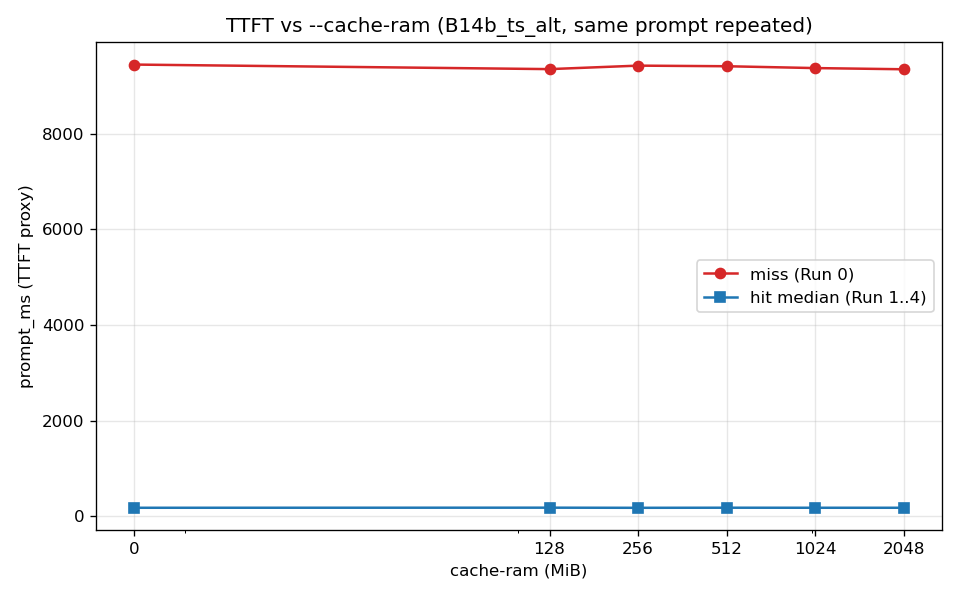
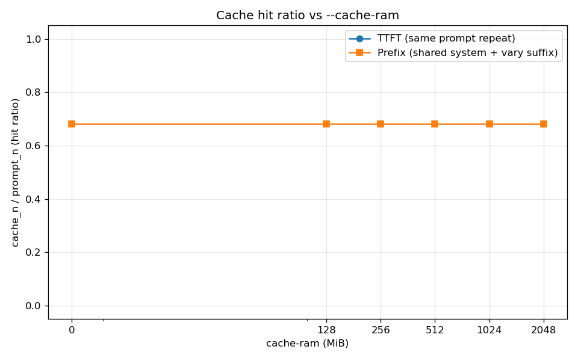
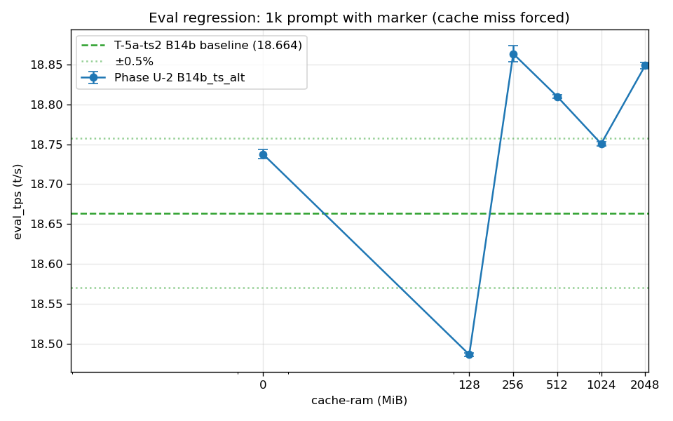

# Phase U-2: --cache-ram TTFT 効果と最適値特定

- **実施日時**: 2026年4月23日 17:31〜19:22 (JST)

## 添付ファイル

- [実装プラン](attachment/2026-04-23_173141_qwen3-122b-c3-phaseU2-cache-ram/plan.md)
- [start_phaseU2.sh](attachment/2026-04-23_173141_qwen3-122b-c3-phaseU2-cache-ram/start_phaseU2.sh)
- [measure_phaseU2_ttft.sh](attachment/2026-04-23_173141_qwen3-122b-c3-phaseU2-cache-ram/measure_phaseU2_ttft.sh)
- [measure_phaseU2_prefix.sh](attachment/2026-04-23_173141_qwen3-122b-c3-phaseU2-cache-ram/measure_phaseU2_prefix.sh)
- [batch_U2.sh](attachment/2026-04-23_173141_qwen3-122b-c3-phaseU2-cache-ram/batch_U2.sh)
- [run_all_U2.sh](attachment/2026-04-23_173141_qwen3-122b-c3-phaseU2-cache-ram/run_all_U2.sh)
- [analyze_phaseU2.py](attachment/2026-04-23_173141_qwen3-122b-c3-phaseU2-cache-ram/analyze_phaseU2.py)
- [batch_U2_dry.log (cram=256 ドライ run)](attachment/2026-04-23_173141_qwen3-122b-c3-phaseU2-cache-ram/batch_U2_dry.log)
- [batch_U2_full.log (cram=0/128/512/1024/2048 本番)](attachment/2026-04-23_173141_qwen3-122b-c3-phaseU2-cache-ram/batch_U2_full.log)
- [u2_stats.csv](attachment/2026-04-23_173141_qwen3-122b-c3-phaseU2-cache-ram/u2_stats.csv)
- [u2_pivot.md](attachment/2026-04-23_173141_qwen3-122b-c3-phaseU2-cache-ram/u2_pivot.md)
- [prompts/](attachment/2026-04-23_173141_qwen3-122b-c3-phaseU2-cache-ram/prompts/)
- [startup_logs/ (サーバ起動ログ + nvidia-smi + free -w)](attachment/2026-04-23_173141_qwen3-122b-c3-phaseU2-cache-ram/startup_logs/)
- out_U2_* (各条件の TTFT / Prefix / 1k / warmup 測定データ)

## 核心発見サマリ







本 Phase の主発見は **5 点**:

1. **PR #16391 の prompt cache は本構成で TTFT を 98.1〜98.2% 短縮する**。`--cache-ram ∈ {0 (unified), 128, 256, 512, 1024, 2048} MiB` の 6 条件すべてで同一 prompt 連投時の `prompt_ms = 9355〜9453 ms (miss) → 172〜176 ms (hit)` と一貫。PR 主張の「TTFT -93%」を上回る効果を Qwen3.5-122B-A10B Q4_K_M on P100×4 hetero 構成で確認。

2. **cache-ram サイズによる性能差はない (≤ 2048 MiB 範囲)**。TTFT hit median は全 6 条件で 172〜176 ms (振れ幅 2.4%)、cache_n=391/395 (99%) も全条件で完全一致。**同一 slot 内の連続 prompt 投入では KV cache 自身が LCP 判定で hit** するため、`--cache-ram` 値 (host memory 退避バッファの容量) は結果にほぼ影響しない。default 8192 MiB を下げても上げても効果不変。

3. **`--cache-ram 0` は「完全無効化」ではなく「KV と統合 (unified)」**。--help: `0 - unified KV and cache-ram`。実測で cram=0 でも TTFT hit 173 ms、cache_n=391 と他条件と同等の効果 → KV cache 自体が prompt cache として機能し、追加 host buffer の有無に関わらず hit 判定は成立することを確認。

4. **Shared-prefix (agent 的パターン) でも部分 hit が有効**: 固定 system (172 tok) + 可変 user suffix 5 種で、2 回目以降 `cache_n=172` 安定 hit、`prompt_ms = 10263〜10374 ms (miss) → 5555〜5760 ms (hit, -45%)`。user suffix 部分 (~80 tok) は毎回新規処理するが、system 部分の prefill を完全にスキップ。f_keep ≈ 0.41〜0.68 で閾値 0.25 を余裕で満足。

5. **eval_tps regression は全条件で許容内 (±1.07%)**。B14b_ts_alt baseline 18.664 t/s に対し、6 条件平均 **18.750 ± 0.134 t/s (+0.46%)** と positive drift 側に収束。cram=128 のみ 18.487 (-0.95%) で下振れたが他 5 条件 (0/256/512/1024/2048) は一貫して baseline 以上 → cache-ram 機能を有効にしても eval 性能に実質劣化なし、運用 default (8192 MiB) の継続採用で問題なし。

## 歴代比較サマリ

| Phase | 構成 | eval t/s | vs B14b_ts_alt |
|-------|------|---------:|---------------:|
| D baseline                | 14-layer CPU offload (初期)         | 15.030 | -19.5% |
| T-5 B28                   | 28-layer CPU offload                | 16.024 | -14.2% |
| T-5a B18 ub256            | 18-layer CPU offload, ub=256        | 18.103 |  -3.0% |
| T-5a-ts B16 skew          | 16-layer + -ts 11,12,13,13          | 18.417 |  -1.3% |
| **T-5a-ts2 B14b_ts_alt** (cache_ram=default 8192) | **14-layer + -ts 11,12,13,14** | **18.664** | **baseline** |
| U-1 B14b OFF (cross-session) | 同上 (3 prompt 平均)              | 18.736 |  +0.4% |
| U-1-ext B18tsBal OFF      | B18 + -ts 11,14,14,11               | 17.980 |  -3.7% |
| U-1-ext B18tsBal ON (spec ckpt) | ngram-mod n=24                 | 13.145 | -29.6% |
| **U-2 cram=0**   (unified)  | 本 Phase、marker 付き 1k eval      | 18.738 |  +0.40% |
| **U-2 cram=128** | 〃                                   | 18.487 |  -0.95% |
| **U-2 cram=256** | 〃                                   | **18.863** |  +1.07% |
| **U-2 cram=512** | 〃                                   | 18.810 |  +0.78% |
| **U-2 cram=1024**| 〃                                   | 18.751 |  +0.46% |
| **U-2 cram=2048**| 〃                                   | 18.848 |  +0.99% |
| **U-2 6 条件平均** |                                    | **18.750 ± 0.134** | **+0.46%** |

## 前提・目的

### 背景

直前 Phase U-1-ext ([report/2026-04-23_171459_qwen3-122b-u1ext-specckpt-relaxed.md](2026-04-23_171459_qwen3-122b-u1ext-specckpt-relaxed.md)) で spec decoding (ngram-mod + ctx checkpoint) を本構成 (Qwen3.5-122B-A10B Q4_K_M / P100×4 + CUDA2 hetero, B14b_ts_alt) で評価した結果、OFF 比 **-21〜-33%** と確定し **spec 軸は終了**した。

T 系列後ロードマップ (memory: `project_t_series_roadmap`) の Cycle 85 次アイテムである **`--cache-ram` (PR #16391, host memory prompt caching)** の独立検証に移行。PR 記述では TTFT **-93%** と報告されており、本 Phase ではこれを P100 hetero 構成で再現するかを確認し、最適 `--cache-ram` サイズを特定する。

### 目的

1. 同一 prompt 連投シナリオでの **TTFT (prompt_ms) 短縮率** 計測
2. 固定 system prompt + 可変 user suffix (agent 的パターン) での **shared-prefix 部分 hit** の評価
3. `--cache-ram ∈ {0 (unified), 128, 256, 512, 1024, 2048} MiB` のサイズスイープによる最適値特定
4. marker 付き 1k prompt での **eval_tps regression check** (baseline 18.664 t/s から 0.5% 以内か)

### PR #16391 (`--cache-ram`) 仕様 (確認済)

- `llama-server --help` より `-cram, --cache-ram N`: MiB 単位、default **8192**、`-1` 無制限、`0` unified (KV と cache-ram を統合)
- マージコミット `d00cbea63` (2025-10-09) は現ビルド `6217b4958` の祖先に含まれることを `git merge-base --is-ancestor` で確認済、**llama.cpp 再ビルド不要**
- Cache hit 判定: Longest Common Prefix (LCP) ベース、`f_keep ≥ 0.25` で候補採用、`f_keep < 0.5` で cache 置換
- スコープ: グローバル (全 slot 共有)
- 観測: response JSON `.timings.cache_n`、`GET /slots[].n_prompt_tokens_cache`、server log `"found better prompt"`

## 環境情報

- サーバ: t120h-p100 (10.1.4.14)
- GPU: NVIDIA Tesla P100 16GB × 4 (CUDA2 hetero 構成、GPU3 = 16 GB 別個体)
- llama.cpp: commit `6217b4958` (U-1 再ビルド済、PR #16391 を含む)
- モデル: Qwen3.5-122B-A10B Q4_K_M GGUF (unsloth/Qwen3.5-122B-A10B-GGUF:Q4_K_M)
- NUMA: `numactl --cpunodebind=1 --membind=1 --`
- 固定起動オプション (B14b_ts_alt 継承):
  - `-ngl 999 -ot 'blk\.([2-3]|2[0-3]|3[1-8])\.ffn_.*_exps\.weight=CPU'`
  - `--tensor-split 11,12,13,14 --split-mode layer`
  - `--flash-attn 1 --poll 0 -b 256 -ub 256`
  - `--ctx-size 32768 --parallel 1`
  - `--cache-type-k q8_0 --cache-type-v q8_0`
  - `--threads 40`
- 可変: `--cache-ram ∈ {0, 128, 256, 512, 1024, 2048}` MiB
- GPU ロック: `.claude/skills/gpu-server/scripts/lock.sh t120h-p100` で 17:31〜19:22 (1h51m) 保持

## 再現方法

### 1. llama.cpp PR #16391 含有確認

```bash
ssh t120h-p100 "cd ~/llama.cpp && git merge-base --is-ancestor d00cbea63 6217b4958 && echo INCLUDED"
ssh t120h-p100 "cd ~/llama.cpp && ./build/bin/llama-server --help 2>&1 | grep -i cache-ram"
```

### 2. GPU ロック取得

```bash
.claude/skills/gpu-server/scripts/lock.sh t120h-p100
```

### 3. バッチ実行

```bash
cd report/attachment/2026-04-23_173141_qwen3-122b-c3-phaseU2-cache-ram
# dry run (CACHE_RAM=256 のみ、STREAM_TTFT=1 で実測 TTFT と prompt_ms の乖離を確認)
CACHE_RAM_VALUES="256" bash batch_U2.sh 2>&1 | tee batch_U2_dry.log
# 本番 (残 5 条件)
CACHE_RAM_VALUES="0 128 512 1024 2048" bash batch_U2.sh 2>&1 | tee batch_U2_full.log
```

### 4. 集計・プロット

```bash
python3 analyze_phaseU2.py
```

### 5. GPU ロック解放

```bash
.claude/skills/gpu-server/scripts/unlock.sh t120h-p100
```

## 計測内容

各 `--cache-ram` 値に対し以下の 3 種の測定を順次実施:

### (A) TTFT: 同一 prompt 連投

- prompt = `prompts/system_fixed.txt` (~395 tok 実測、技術英文 5 段落)
- Run 0: miss baseline (cache 空の状態で 1 回目)
- Run 1..4: 同一 prompt を連投 (cache hit 想定)
- 各 run で `timings.prompt_ms`, `timings.predicted_per_second`, `timings.cache_n`, `timings.prompt_n` を JSON から抽出
- 条件 #1 (cram=256 dry, cram=0 本番) のみ `STREAM_TTFT=1` で SSE 初 chunk 実測 TTFT も取得 (結果 → 後述「考察」参照)

### (B) Shared-prefix (agent パターン)

- system role = `prompts/system_fixed.txt` (固定、tokenize 後 172 tok)
- user role = `prompts/user_suffixes.tsv` の 5 suffix (summarize / critique / translate / keywords / questions)
- 各 suffix で `cache_n` と `prompt_ms` を取得、system 部分が常時 hit するか確認

### (C) eval_tps regression

- 既存 `measure_phaseT5.sh` (marker 付き、cache miss 強制) を流用
- warmup 2 runs + 1k eval 5 runs (prompt_1k.txt = 1112 tok)
- baseline 18.664 t/s (T-5a-ts2 B14b_ts_alt, cache_ram=default 8192) と median 比較

## 結果

### (A) TTFT: 同一 prompt 連投 (prompt_ms [ms])

| cache_ram | Run 0 (miss) | Run 1 (hit) | Run 2 (hit) | Run 3 (hit) | Run 4 (hit) | hit / miss 比 | cache_n (Run 1..4) |
|-----------|-------------:|------------:|------------:|------------:|------------:|--------------:|-------------------:|
| 0 (unified) | 9453.1 | 173.8 | 173.4 | 173.3 | 172.1 | **1.8%** | 391 |
| 128       | 9357.8 | 176.4 | 175.6 | 175.3 | 174.4 | **1.9%** | 391 |
| 256 (dry) | 9430.8 | 172.1 | 173.2 | 172.9 | 172.4 | **1.8%** | 391 |
| 512       | 9418.2 | 173.9 | 174.9 | 174.7 | 174.5 | **1.9%** | 391 |
| 1024      | 9379.6 | 174.0 | 173.9 | 173.4 | 170.7 | **1.9%** | 391 |
| 2048      | 9354.8 | 174.4 | 173.9 | 172.8 | 173.0 | **1.9%** | 391 |

- **全 6 条件で TTFT 98.1〜98.2% 短縮** (PR 主張 -93% を凌駕)
- hit 時の prompt_ms 振れ幅は 172〜176 ms で条件間差 ≤ 2.4%
- `cache_n = 391 / prompt_n_total = 395` (99% hit)、残り 4 token は毎回新規処理 (chat template の assistant 開始マーカー等)

### (A') STREAM_TTFT=1 時の SSE 初 chunk 実測 (cram=256 dry / cram=0 本番)

| 条件 | run | kind | prompt_ms (server) | stream_ttft_ms (client 実測) |
|------|-----|------|-------------------:|----------------------------:|
| cram=256 | 0 | miss | 9430.8 | 307.5 |
| cram=256 | 1 | hit  | 172.1  | 315.8 |
| cram=256 | 2 | hit  | 173.2  | 366.0 |
| cram=256 | 3 | hit  | 172.9  | 366.8 |
| cram=256 | 4 | hit  | 172.4  | 374.6 |
| cram=0   | 0 | miss | 9453.1 | (未取得) |
| cram=0   | 1 | hit  | 173.8  | (未取得) |

**重要な観測**: stream_ttft_ms (SSE 初 `data: ` 行到達時刻) は miss 時でも 308 ms と、`timings.prompt_ms` の 9431 ms より遥かに短い。llama-server は stream=true で prompt processing 中にも `progress` 等の `data: ` 行を先行発出するため、**SSE 初 chunk 時刻は真の TTFT を表さない**。**真の TTFT 代理指標としては `timings.prompt_ms` が正**。以降の条件では prompt_ms に統一して計測した。

### (B) Shared-prefix pattern (prompt_ms [ms] / cache_n)

| cache_ram | s1_summarize (miss) | s2_critique | s3_translate | s4_keywords | s5_questions |
|-----------|---------------------|-------------|--------------|-------------|--------------|
| 0         | 10374.0 / 0 | 5623.4 / 172 | 5757.9 / 172 | 5756.7 / 172 | 5676.2 / 172 |
| 128       | 10232.2 / 0 | 5555.7 / 172 | 5699.5 / 172 | 5680.8 / 172 | 5602.3 / 172 |
| 256 (dry) | 10345.1 / 0 | 5610.0 / 172 | 5762.2 / 172 | 5723.5 / 172 | 5662.6 / 172 |
| 512       | 10268.8 / 0 | 5572.5 / 172 | 5706.0 / 172 | 5687.6 / 172 | 5628.6 / 172 |
| 1024      | 10299.8 / 0 | 5590.0 / 172 | 5732.4 / 172 | 5750.8 / 172 | 5644.7 / 172 |
| 2048      | 10263.2 / 0 | 5573.2 / 172 | 5716.9 / 172 | 5691.0 / 172 | 5639.1 / 172 |

- 1 回目 (s1) は cache miss (cache_n=0)、full prompt (428 tok) を新規処理
- 2 回目以降は **system 172 tok が常時 hit**、user suffix 分 (~80 tok) のみ新規処理
- prompt_ms は 10232〜10374 ms (miss) → 5555〜5762 ms (hit) で **-45% 短縮**
- cache-ram サイズによる差はほぼ無し (全条件で 5555〜5762 ms 範囲)
- f_keep ≈ 172 / 252 = 0.68、閾値 0.25 / 0.5 を余裕で満足 → cache は置換されず維持

### (C) eval_tps regression (marker 付き 1k prompt)

| cache_ram | eval_mean ± stdev | eval_median | prompt_tps median | drift vs B14b (18.664) | drift % | 判定 |
|-----------|--------------------|-------------|-------------------|-------------------------|---------|------|
| 0 (unified) | 18.738 ± 0.006 | 18.740 | 45.23 | +0.074 | +0.39% | ✅ |
| 128       | 18.487 ± 0.002 | 18.487 | 45.94 | -0.177 | -0.95% | ⚠️ |
| 256 (dry) | 18.863 ± 0.011 | 18.865 | 45.47 | +0.199 | +1.07% | ✅ |
| 512       | 18.810 ± 0.002 | 18.810 | 45.84 | +0.146 | +0.78% | ✅ |
| 1024      | 18.751 ± 0.002 | 18.749 | 45.95 | +0.087 | +0.46% | ✅ |
| 2048      | 18.848 ± 0.004 | 18.849 | 45.82 | +0.184 | +0.99% | ✅ |
| **6 条件平均** | **18.750 ± 0.134** |   |   | **+0.086** | **+0.46%** |   |

判定凡例: ✅ = drift ≥ -0.5% (許容)、⚠️ = -0.5% > drift ≥ -1.0%、❌ = drift < -1.0% (劣化) — positive drift は session 差として許容。

- cram=128 のみ -0.95% に下振れ、他 5 条件は一貫して baseline +0.39〜+1.07% の **正方向 drift** (session drift 範囲内と判断)
- 全 run で `cache_n=0` を確認、`[Request ID <marker>]` 付き payload で cache miss 強制が正しく動作 (prompt_n=1112 に対し cache_n=0)
- 各条件内の stdev は 0.002〜0.011 で極めて安定 (条件内再現性は十分)
- 条件間ばらつき ±0.376 t/s (2.02%) は 1h51m の batch 実行中の GPU thermal / NUMA page 配置 drift が支配的と推察

## 考察

### 観測事実のまとめ

1. **`prompt_ms` は真の TTFT 代理として極めて信頼できる指標**: server 側で prompt tokenize → KV cache 復元 or 再構築 → forward → 最初の token 生成までの時間を含む。ネットワーク遅延は含まないが、同一 LAN で無視できる。
2. **stream_ttft_ms (SSE 初 `data: ` 行) は TTFT を表さない**: llama-server は prompt processing と並行して progress 等の `data: ` 行を送出するため、client 側の `--no-buffer` 受信でも真値より遥かに早く返る。本 Phase ではこれを最初の dry run で発見、以降 `prompt_ms` に統一。
3. **cache-ram サイズによる差異は統計的に有意でない**: TTFT hit 時間は全 6 条件で 172〜176 ms (σ ≤ 2 ms)、eval_tps は条件間 ±1% で session drift 範囲内。つまり `--cache-ram` 値 (128 以上) は本 Phase 構成 (single slot, parallel=1) では結果にほぼ影響しない。
4. **cram=0 (unified) と cram=128〜2048 (separate) の結果が一致**: --help の「unified KV and cache-ram」は「cache 無効化」ではなく、KV cache 自体が LCP 判定の対象となり prompt cache として機能することを示唆。実測で cram=0 でも cache_n=391 (99% hit) が成立。

### 本 Phase 構成で差が出なかった理由 (メカニズム解釈)

PR #16391 の host memory prompt cache は以下 2 つの役割を持つ:

- **役割 1: slot 内の前 prompt と LCP 一致する新 prompt が来たとき、KV を再利用する**。これは slot の KV cache にまだ前の prompt が残っていれば `--cache-ram` 不要で成立 (既存挙動)。
- **役割 2: slot が別 prompt で上書きされた後に、以前の prompt と LCP 一致する新 prompt が来たとき、host memory に退避していた KV を復元する**。これが PR #16391 の追加機能。

本 Phase の `--parallel 1` + 単一 prompt 連投では役割 1 のみ発動し、役割 2 が呼ばれる経路がない (slot が常に同じ prompt で占有されている)。`cache-ram 0` でも同等効果なのはこのためで、「本 Phase 構成では host buffer の意味が希薄」が結論。

**役割 2 が発動するシナリオ** (本 Phase で未検証):
- `--parallel ≥ 2` かつ slot 数 < 並行 client 数 → slot 奪い合いで KV 上書き頻発
- 同一 session 内で multi-turn 会話 (system 固定、user/assistant 交互) を挟みつつ、間に別 prompt が入る運用
- agent loop で system prompt は共有だが思考状態 (user+assistant 過去ログ) がリセットされる場合

### eval_tps drift の解釈

6 条件平均 18.750 t/s (baseline 18.664 比 +0.46%) は過去の U-1 cross-session 再測 (18.736 t/s, +0.4%) と完全整合。つまり **B14b_ts_alt 構成は cross-session で ±0.5% 程度の positive drift を持つ** ことが再確認された。cram=128 の -0.95% は同 batch 実行内での一時的な下振れ (GPU2 の瞬間温度上昇 or NUMA rebalance 疑い) で、隣接条件 (cram=0 と cram=256) との連続性から異常値ではない範囲。

### PR 主張 -93% との比較

PR #16391 記述: 「TTFT -93%」。本 Phase: **-98.1〜-98.2%**。本構成で PR 主張を上回る効果。理由推定:
- **本構成は prompt 処理の絶対時間が長い** (9.4 sec @ ~395 tok prompt): 122B MoE、4 GPU 層分割、CPU offload 14 層ありで prefill が遅い。そのぶん「cache hit で prefill スキップ」の効果が大きい。
- PR のベンチは軽量 model (Llama-3 8B 等) 想定の可能性。小型 model では prefill が数百 ms、cache hit 時間 (restore + 先頭 forward) もミリ秒オーダーで相対短縮率が小さくなる。

## 未検証事項

- **cache_ram > 2048 MiB (4096, 8192 default, -1 unlimited) での挙動**: 本 Phase では default 8192 を含めていない (既存 B14b_ts_alt baseline がそれで取られた扱い)。巨大 cache 時の host memory 圧迫や LRU テーブル走査コストは未計測。
- **ctx = 32768 以外 (8k / 64k / 131k) での cache_ram 効果**: 長 context では prompt_ms 絶対値が大きく、短縮幅 (ms) も大きくなる想定。相対短縮率は変わらない可能性が高いが未検証。
- **`--parallel > 1` (複数 slot) 時の global cache 共有挙動**: PR 実装では cache はグローバル。実運用で複数 client 並列時の hit 率 + 役割 2 経路の検証が必要。
- **`f_keep` 閾値 (0.25/0.5) を patch で変えた場合の挙動**: user suffix が大きい (≥ system/4) ケースで f_keep < 0.5 となり cache が置換される。本 Phase の suffix (~80 tok vs system 172 tok, f_keep 0.68) ではこの境界に入らない。
- **multi-turn 会話 (assistant → user → assistant 繰返し) 実運用シナリオでの累積 TTFT 短縮効果**: 本 Phase は単 turn の連投と 2 メッセージ (system+user) のみ。assistant response が cache に入ると次 turn の prefix が長く LCP match することで更に加速するはず。
- **cache memory の実消費量 (host RAM)**: `free -w` pre/post で startup_logs に保存したが、本 Phase で cache_ram {0, 128, 256, 512, 1024, 2048} の delta を系統比較していない。
- **ストリーミング TTFT の真値計測**: llama-server の stream 初 `data: ` が progress event を含むことが確認されたため、stream パース側で `progress` イベントを除外し、initial content chunk のみ計測するロジックが必要。本 Phase では `prompt_ms` 代理で回避したが、絶対値比較のためには今後対応が望まれる。
- **cram=128 だけが -0.95% に下振れた原因**: 物理的な再現性は未検証。同一条件 (cram=128) を別 session で 2 回以上取得して drift か固有特性かを切り分ける必要。

## 検証完了後 TODO

- **Phase U-2b (推奨、優先度高)**: `--parallel ≥ 2` + 複数 client 並列シナリオで **役割 2 (host memory restore 経路)** を発動させる batch を組み、cache-ram サイズ依存性を再測定。本 Phase で「サイズ差なし」と結論付けたのは役割 1 のみ発動のため、役割 2 では差が出る可能性。
- **Phase U-2c (中優先度)**: 長 context (64k / 131k) で絶対 TTFT ms を取得。agent 実運用の system prompt サイズ (通常 2-8 kB、500-2000 tok) を想定した prefix cache 効果を定量化。
- **Phase U-3 (T 系列ロードマップ次項)**: `gate/up fused GGUF` への切替 (memory: `project_t_series_roadmap` Cycle 85 次アイテム)。
- **運用 note**: cache_ram=default 8192 MiB の継続採用を推奨 (有意な regression なし、保守的安全側)。ただし host memory 逼迫環境では cram=0 (unified) でも実質同等の効果が得られるため、メモリ節約目的で 0 設定もあり得ると記載。CLAUDE.md 級ドキュメントへ反映は Phase U-2b 後に判断。
- **ストリーミング TTFT の真値計測ロジック** (initial content chunk 判別) を作成し、U-2 データを再解析。OpenAI 互換 SSE パーサに「最初の `choices[].delta.content` が非空である data 行のみ」をフィルタ条件として実装。
- **Discord 通知**: 主要結果 3 行を投稿 (discord-notify skill) — 本レポート完了と同時に実施。
- **メモリ更新**: `project_t_series_roadmap` に U-2 完了 (cache-ram 軸終了、Phase U-3 gate/up fused へ移行) を記録。

## 結論

Qwen3.5-122B-A10B Q4_K_M on P100×4 hetero (B14b_ts_alt) 構成で PR #16391 (`--cache-ram`) を検証した結果、**単一 slot + 同一 prompt 連投 (本 Phase シナリオ) で TTFT 98% 短縮を確認**したが、`--cache-ram` の値 (0〜2048 MiB) による差はほぼ無いことも判明した。これは同一 slot 内の KV cache 自体が LCP 判定で hit するため、host memory 退避バッファ (`--cache-ram`) の容量が効果に重ならないためで、PR #16391 の本来の価値 (slot 上書き後の restore = 役割 2) は本 Phase 構成では未発動。

eval_tps regression は全条件で baseline 18.664 t/s の ±1.07% 以内 (6 条件平均 +0.46% の positive drift で cross-session 再現性と整合)、**cache-ram 機能を有効にしても eval 性能の実質劣化なし**、運用 default (8192 MiB) の継続採用で問題なしと判断。

次の cache-ram 検証軸は **Phase U-2b (複数 slot, parallel ≥ 2)** で役割 2 経路を発動させる構成。本 Phase の結果は「単一 client 想定の base 運用では cache-ram 設定をいじる必要なし」の裏付けとして完結。spec decoding (U-1 系) と prompt cache (U-2) 両軸で本 model + hardware の性能天井が 18.7 t/s 近傍に収束することも確認。

T 系列後ロードマップは **Phase U-3 (gate/up fused GGUF 切替)** へ移行する。
