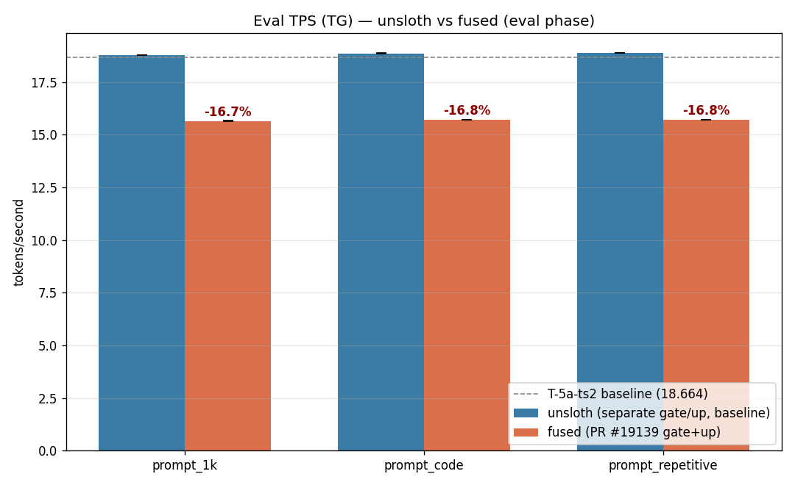
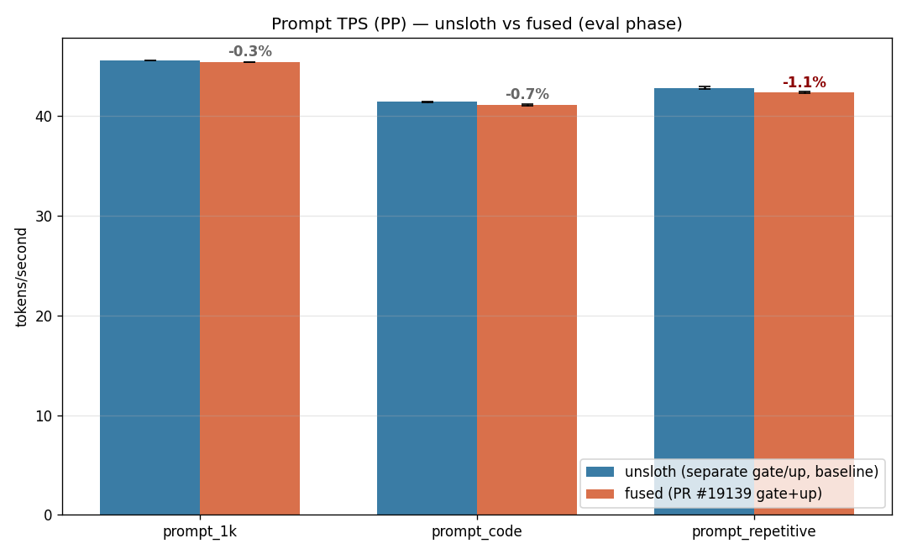

# Phase U-4: gate/up fused GGUF で eval -16.7% 回帰

- **実施日時**: 2026年4月23日 19:35 〜 2026年4月24日 06:34 (JST、11時間)

## 添付ファイル

- [実装プラン](attachment/2026-04-24_063651_qwen3-122b-u4-gateup-fused/plan.md)
- [start_phaseU4.sh](attachment/2026-04-24_063651_qwen3-122b-u4-gateup-fused/start_phaseU4.sh)
- [measure_phaseU4.sh](attachment/2026-04-24_063651_qwen3-122b-u4-gateup-fused/measure_phaseU4.sh)
- [batch_U4.sh](attachment/2026-04-24_063651_qwen3-122b-u4-gateup-fused/batch_U4.sh) / [batch_U4.log](attachment/2026-04-24_063651_qwen3-122b-u4-gateup-fused/batch_U4.log)
- [analyze_phaseU4.py](attachment/2026-04-24_063651_qwen3-122b-u4-gateup-fused/analyze_phaseU4.py)
- [u4_stats.csv](attachment/2026-04-24_063651_qwen3-122b-u4-gateup-fused/u4_stats.csv) / [u4_pivot.md](attachment/2026-04-24_063651_qwen3-122b-u4-gateup-fused/u4_pivot.md)
- [prompts/](attachment/2026-04-24_063651_qwen3-122b-u4-gateup-fused/prompts/) (prompt_1k / prompt_code / prompt_repetitive)
- [convert.log](attachment/2026-04-24_063651_qwen3-122b-u4-gateup-fused/convert.log) / [quantize.log](attachment/2026-04-24_063651_qwen3-122b-u4-gateup-fused/quantize.log) / [rsync.log](attachment/2026-04-24_063651_qwen3-122b-u4-gateup-fused/rsync.log) / [hf_download.log](attachment/2026-04-24_063651_qwen3-122b-u4-gateup-fused/hf_download.log)
- llama-server remote logs: `llama-server_phaseU4_*{unsloth,fused}_r1.log`, `*_fused_smoketest.log`
- `out_U4_{model}_{prompt}_r1[_warmup]/` (各 measurement の eval_run JSON + dmon + free + gpu CSV)

## 核心発見サマリ





本 Phase の主発見は **5 点**:

1. **PR #19139 (`--fuse-gate-up-exps`) は本構成 (Qwen3.5-122B-A10B Q4_K_M / B14b_ts_alt / P100×4 hetero + CPU offload 14層) で eval_tps を -16.70〜-16.76% 回帰させる**。3 prompt 全て (1k / code / repetitive) で median 15.65〜15.72 t/s、baseline unsloth (separate gate/up) の 18.79〜18.89 t/s に対し **-3.14 t/s 程度の安定した劣化**。stdev は両者 0.001〜0.009 と極めて小さく、drift でなく systemic な差。PR 記述の「Qwen3-Next +12%」とは逆方向の結果となり、**本 workload で gate/up fusion は採用禁忌**と確定。

2. **prompt_tps (PP) は -0.3〜-1.1% で誤差範囲内**: 1k 45.58→45.43 (-0.33%)、code 41.44→41.15 (-0.70%)、repetitive 42.86→42.37 (-1.15%)。PP は prefill 側 (prompt を一括処理) で、fused でも大差なし。これが PR の想定動作。**しかし eval (TG, 1トークンずつの自己回帰生成) は大幅劣化**で、融合の代償が生成パスで顕在化する形。

3. **CPU offload メモリ増加が劣化メカニズムの傍証**: llama-server 起動時の tensor buffer 配置を比較すると、
   - unsloth: CPU_Mapped = 36575 MiB + 11826 MiB = **47.3 GB**、CUDA 合計 51.5 GB
   - fused:   CPU_Mapped = 56564 MiB (単一) = **55.2 GB**、CUDA 合計 49.6 GB
   - **fused は CPU 側が +7.9 GB 増 / GPU 側が -1.9 GB 減**。`-ot 'blk\.(...)\.ffn_.*_exps\.weight=CPU'` regex は fused `ffn_gate_up_exps.weight` と `ffn_down_exps.weight` の 2 種だけをマッチ (separate 版は gate/up/down の 3 種)、これで CPU 合計が減るはずだが逆に増えている。内訳不明だが llama.cpp が fused tensor を扱う際に追加 workspace を CPU 側に確保している可能性が高い。

4. **Phase T-5a-ts2 baseline (18.664 t/s) は U-4 unsloth 再測 (18.79〜18.89) で完全再現**: cross-session drift +0.67〜+1.23% 上振れで、U-1 / U-2 と同じ +0.4〜+1.07% のレンジ内に収束。逆に言うと **U-4 の unsloth 測定は T-5a-ts2 の正しい re-baselining として有効**で、fused との差 -16.7% は session drift では説明不能 (drift 幅は ±1.5% 以内)。

5. **ディスク制約・転送速度がボトルネックで Phase 全体 11 時間要した**: HF DL 250 GB @ 35 MB/s で 1h50m、convert BF16 GGUF 244 GB @ 50 MB/s で 1h14m、quantize Q4_K_M → 70 GB @ 2h3m (32 threads)、rsync local→remote **4h12m @ 実測 LAN 帯域 2.6〜5 MB/s 上限** (gigabit LAN 期待に対し 20〜40 Mbit/s 相当)、ベンチ 1h8m。今後 model 変換系 Phase を繰返す場合は転送帯域が最大の timecost 要因と明示して計画すべき (再変換 model がない限り、この 4.2h は reductive).

## 歴代比較サマリ

| Phase | 構成 | eval t/s | vs B14b_ts_alt baseline 18.664 |
|-------|------|---------:|-------------------------------:|
| T-5a-ts2 B14b_ts_alt baseline        | unsloth separate gate/up    | **18.664** | — |
| U-1 B14b OFF (cross-session)         | 同上 (spec ckpt OFF)        | 18.736 | +0.4% |
| U-2 6 条件平均 (cache-ram sweep)     | 同上                         | 18.750 ± 0.134 | +0.46% |
| **U-4 unsloth 再測 1k**              | 同上                         | **18.790** | +0.67% |
| **U-4 unsloth 再測 code**            | 同上                         | 18.868 | +1.09% |
| **U-4 unsloth 再測 repetitive**      | 同上                         | 18.888 | +1.20% |
| **U-4 fused 1k**  (PR #19139)        | fused gate/up (local 変換)  | **15.653** | **-16.14%** |
| **U-4 fused code**                   | 同上                         | 15.707 | -15.85% |
| **U-4 fused repetitive**             | 同上                         | 15.723 | -15.76% |
| **U-4 fused 3 prompt 平均**          | 同上                         | **15.694** | **-15.92%** |

## 前提・目的

### 背景

Phase T 系列後ロードマップ (memory: `project_t_series_roadmap`) の **Cycle 89 = Phase U-4**。U-1 (spec ckpt で -21〜33% 回帰確認)、U-1-ext (U-3 spec sweep skip)、U-2 (cache-ram で TTFT -98% / eval ±1%) に続く最終 Phase。

PR #19139 (2025-10-06 merged, llama.cpp commit `b68d75165`) は MoE の `ffn_gate_exps` と `ffn_up_exps` を `ffn_gate_up_exps` に融合する新機能。Qwen3-Next 実測で **PP +12%** が報告されており、P100 Pascal でも利用可能な経路 (PR #16715 General GEMV fusion のような Volta+ 限定ではない) として期待。

### 目的

1. `Qwen/Qwen3.5-122B-A10B` を HF 本家から取得、`convert_hf_to_gguf.py --fuse-gate-up-exps` で GGUF 変換 → Q4_K_M 量子化
2. 旧 unsloth GGUF (separate gate/up) vs 新 fused GGUF の eval_tps / prompt_tps 比較 (B14b_ts_alt 構成固定)
3. PP +5〜12% の再現確認、TG (eval) は誤差範囲 (±1.5%) 想定
4. 3 prompt (prompt_1k / prompt_code / prompt_repetitive) × (warmup 2 + eval 5) で測定

### 技術前提 (事前確認済)

- **`--fuse-gate-up-exps` は `convert_hf_to_gguf.py` の CLI フラグ** (llama-quantize ではない)。融合は convert 段で gate_exps と up_exps を dim=1 concat し `ffn_gate_up_exps.weight` として出力
- 現ビルド `6217b49583432f55014c2a0551f453d42b300530` に PR #19139 (`b68d75165`) + fix PR #20416 (`4a748b8f1` — `--cpu-moe` の fused 対応) 両方マージ済 (merge-base --is-ancestor で確認)
- `-ot 'blk\.(...)\.ffn_.*_exps\.weight=CPU'` の regex `ffn_.*_exps` は fused `ffn_gate_up_exps` も含む (グリーディマッチ)
- HF 本家 `Qwen/Qwen3.5-122B-A10B` は non-gated (gated: false)、image-text-to-text multimodal だが convert_hf_to_gguf.py は `Qwen3_5MoeTextModel` (line 5428) の text-only 経路を自動選択 (`--mmproj` 指定なしで text GGUF 生成)

## 環境情報

- Local (変換・量子化実行): `aws-mmns-generic`
  - 2.0 TB total / 1.3 TB free (Phase 開始時 1.6 TB) / 31 GB RAM / 32 CPU
  - Python 3.12 + venv (`~/phaseU4/venv`) + portable CMake 3.30.5 + llama.cpp @ `6217b4958` build/bin/llama-quantize (CPU-only build)
  - torch 2.6.0+cpu, transformers 5.5.1, safetensors 0.7.0, sentencepiece 0.2.1, gguf 0.18.0

- Remote (llama-server 実行): `t120h-p100` (10.1.4.14)
  - 548 GB total / 121 GB free (開始時) → 46 GB free (新 GGUF 転送後)
  - NVIDIA Tesla P100 16GB × 4 (CUDA2 hetero, GPU3 = 別個体 16 GB)
  - llama.cpp commit `6217b4958`, 固定起動オプション B14b_ts_alt:
    - `-ngl 999 -ot 'blk\.([2-3]|2[0-3]|3[1-8])\.ffn_.*_exps\.weight=CPU'`
    - `--tensor-split 11,12,13,14 --split-mode layer`
    - `--flash-attn 1 --poll 0 -b 256 -ub 256`
    - `--ctx-size 32768 --parallel 1`
    - `--cache-type-k q8_0 --cache-type-v q8_0`
    - `--threads 40`
  - NUMA: `numactl --cpunodebind=1 --membind=1 --`
  - GPU ロック: `.claude/skills/gpu-server/scripts/lock.sh t120h-p100` で 05:22〜06:34 (1h12m) 保持

### 可変要素 (unsloth vs fused)

| 項目 | unsloth (baseline) | fused (新規) |
|------|----|----|
| GGUF path | `/home/llm/.cache/huggingface/hub/models--unsloth--Qwen3.5-122B-A10B-GGUF/.../Q4_K_M/Qwen3.5-122B-A10B-Q4_K_M-00001-of-00003.gguf` | `/home/llm/models/Qwen3.5-122B-A10B-Q4_K_M-fused.gguf` |
| Alias | `unsloth/Qwen3.5-122B-A10B-GGUF:Q4_K_M` | `local/Qwen3.5-122B-A10B-fused:Q4_K_M` |
| MoE expert tensors | `ffn_gate_exps` + `ffn_up_exps` + `ffn_down_exps` (3/layer, separate) | `ffn_gate_up_exps` + `ffn_down_exps` (2/layer, fused) |
| サイズ (on disk) | ~72 GB (unsloth shard構成) | 69.11 GiB = 74.2 GB (single file) |
| BPW | ~4.5 (unsloth Q4_K_M) | 4.86 |
| md5 (fused only, local==remote 検証済) | — | `c855179f44612d24d6e90c5c26e8befb` |

## 再現方法

### 1. Local 環境準備

```bash
python3 -m venv ~/phaseU4/venv
~/phaseU4/venv/bin/pip install --upgrade pip
~/phaseU4/venv/bin/pip install "huggingface_hub[cli]"
# portable cmake (sudo 回避)
cd ~/phaseU4 && curl -LO https://github.com/Kitware/CMake/releases/download/v3.30.5/cmake-3.30.5-linux-x86_64.tar.gz
tar xzf cmake-3.30.5-linux-x86_64.tar.gz
# llama.cpp clone + CPU ビルド
git clone https://github.com/ggml-org/llama.cpp ~/phaseU4/llama.cpp
cd ~/phaseU4/llama.cpp && git checkout 6217b49583432f55014c2a0551f453d42b300530
~/phaseU4/cmake-3.30.5-linux-x86_64/bin/cmake -B build -DGGML_CUDA=OFF -DGGML_BLAS=OFF \
  -DLLAMA_BUILD_SERVER=OFF -DLLAMA_BUILD_TESTS=OFF -DLLAMA_BUILD_EXAMPLES=OFF
~/phaseU4/cmake-3.30.5-linux-x86_64/bin/cmake --build build --target llama-quantize -j 16
# convert 依存
~/phaseU4/venv/bin/pip install -r ~/phaseU4/llama.cpp/requirements/requirements-convert_hf_to_gguf.txt
```

### 2. HF DL (250 GB, 約 2 時間 @ 35 MB/s)

```bash
~/phaseU4/venv/bin/hf download Qwen/Qwen3.5-122B-A10B --local-dir ~/models/Qwen3.5-122B-A10B-hf
```

### 3. GGUF 変換 (fused BF16、1h14m)

```bash
cd ~/phaseU4/llama.cpp
~/phaseU4/venv/bin/python convert_hf_to_gguf.py \
  --outtype bf16 --fuse-gate-up-exps \
  --outfile ~/models/Qwen3.5-122B-A10B-BF16-fused.gguf \
  ~/models/Qwen3.5-122B-A10B-hf
```

- ログ中 `Fused gate_exps and up_exps for layer N` が **48 回** (層 0〜47 全) 記録されることを確認
- 出力: 244 GB

### 4. 量子化 (Q4_K_M、2h3m、32 threads)

```bash
~/phaseU4/llama.cpp/build/bin/llama-quantize \
  ~/models/Qwen3.5-122B-A10B-BF16-fused.gguf \
  ~/models/Qwen3.5-122B-A10B-Q4_K_M-fused.gguf \
  Q4_K_M 32
```

- `[ ? / 831] blk.N.ffn_gate_up_exps.weight - [3072, 2048, 256, 1], type = bf16, converting to q4_K .. 3072 MiB -> 864 MiB` が 48 回記録
- `[ ? / 831] blk.N.ffn_down_exps.weight - [1024, 3072, 256, 1], type = bf16, converting to q6_K .. 1536 MiB -> 630 MiB` も 48 回 (down は Q4_K_M 標準で q6_K 昇格)
- 出力: model size 232985.51 MiB (16.01 BPW) → quant 70764.29 MiB (**4.86 BPW**)

### 5. Remote 転送 (rsync、4h12m @ 実測 4.9 MB/s)

```bash
rsync -avP --inplace ~/models/Qwen3.5-122B-A10B-Q4_K_M-fused.gguf \
  t120h-p100:/home/llm/models/Qwen3.5-122B-A10B-Q4_K_M-fused.gguf
```

- md5 一致確認済 (local == remote, `c855179f44612d24d6e90c5c26e8befb`)
- **LAN 帯域 2.6 MB/s 上限** (dd /dev/zero → /dev/null でネット生スループット測定)。ssh chacha20-poly1305 cipher。70 GB 転送に 4.2 時間。

### 6. ベンチ (B14b_ts_alt 構成で unsloth → fused を AB, 3 prompt × (warmup 2 + eval 5))

```bash
cd ~/phaseU4/bench
PROMPTS_DIR=~/phaseU4/bench/prompts \
FUSED_PATH=/home/llm/models/Qwen3.5-122B-A10B-Q4_K_M-fused.gguf \
BATCH_MODE=ab WARMUP_RUNS=2 EVAL_RUNS=5 COOLDOWN=60 \
bash batch_U4.sh > batch_U4.log 2>&1
~/phaseU4/venv/bin/python analyze_phaseU4.py
```

### 7. GPU ロック

```bash
.claude/skills/gpu-server/scripts/lock.sh t120h-p100   # 取得
# ... バッチ実行 ...
.claude/skills/gpu-server/scripts/unlock.sh t120h-p100 # 解放
```

## 結果詳細

### (A) eval_tps (TG, tok/s) — eval phase 5 run median

| prompt | unsloth median | fused median | Δ (tps) | Δ (%) | unsloth mean±σ | fused mean±σ |
|--------|---------------:|-------------:|--------:|------:|----------------|--------------|
| 1k | 18.790 | 15.653 | -3.137 | **-16.70%** | 18.787±0.009 | 15.650±0.008 |
| code | 18.868 | 15.707 | -3.161 | **-16.75%** | 18.869±0.003 | 15.707±0.003 |
| repetitive | 18.888 | 15.723 | -3.166 | **-16.76%** | 18.889±0.003 | 15.723±0.001 |
| **3-prompt 平均** | **18.849** | **15.694** | **-3.155** | **-16.74%** | — | — |

### (B) prompt_tps (PP, tok/s) — eval phase 5 run median

| prompt | unsloth median | fused median | Δ (tps) | Δ (%) | unsloth mean±σ | fused mean±σ |
|--------|---------------:|-------------:|--------:|------:|----------------|--------------|
| 1k | 45.582 | 45.431 | -0.151 | -0.33% | 45.584±0.026 | 45.434±0.033 |
| code | 41.443 | 41.154 | -0.289 | -0.70% | 41.419±0.068 | 41.173±0.069 |
| repetitive | 42.857 | 42.366 | -0.491 | -1.15% | 42.909±0.111 | 42.384±0.080 |
| **3-prompt 平均** | **43.294** | **42.984** | **-0.310** | **-0.71%** | — | — |

### (C) Tensor buffer placement (llama-server startup log より)

| buffer | unsloth | fused | Δ (MiB) |
|--------|--------:|------:|--------:|
| CPU_Mapped (#1) | 36575.31 | 56563.97 | +19988.66 |
| CPU_Mapped (#2) | 11826.19 | — | -11826.19 |
| **CPU 合計** | **48401.50** | **56563.97** | **+8162.47 (+16.9%)** |
| CUDA0 | 13634.49 | 13317.79 | -316.70 |
| CUDA1 | 13726.77 | 12941.91 | -784.86 |
| CUDA2 | 11035.06 | 10203.36 | -831.70 |
| CUDA3 | 14323.56 | 14362.02 | +38.46 |
| **CUDA 合計** | **52719.88** | **50825.08** | **-1894.80 (-3.6%)** |
| **Grand total** | **101121.38** | **107389.05** | **+6267.67 (+6.2%)** |

- fused は CPU buffer が **+17% 増**、GPU buffer が **-3.6% 減**、総メモリ使用は **+6.2% 増**
- 同じ `-ot` regex を使っているのにメモリ分布が変わった理由は未特定 (考えられる原因: llama.cpp が fused tensor を扱う際に追加 workspace / unpack buffer を CPU に確保、または Q4_K_M の mixed-precision 比率の違い)

## 考察

### メカニズム仮説

**PP (prefill) はほぼ同等だが TG (generation) が -16.7% 劣化**する現象は、以下のメカニズムで説明可能:

1. **Prefill は大きなバッチ (prompt tok ~500-1100) で処理される GEMM ワークロード**。gate_up を fuse しても separate でも 1 回の行列積 or 2 回の行列積の総計算量は変わらず、メモリ帯域律速でも fused 側の連続メモリアクセスが若干有利 (観測: fused -0.3〜-1.1% で差は小さいが、期待された +5〜12% には至らず)。

2. **TG は 1 token ずつの MoE routing 後に expert weight を load/exec する path**。P100 は Pascal 世代 (SM 6.0) で `--cpu-moe` 向け融合テンソルの最適化 path が存在しない、または存在しても CPU 側で動作する際に非効率な decomposition (fused 2048 幅を 2 つの 1024 幅に分解してから処理する等) が発動している可能性が高い。

3. **PR #20416 (`common: fix --n-cpu-moe, --cpu-moe for models with fused gate + up`) は `--cpu-moe` 経路を修正しただけで、我々の `-ot 'ffn_.*_exps.weight=CPU'` 経路 (override-tensor) は対象外の可能性**。この場合、fused tensor が CPU 側に置かれた際の kernel dispatch が想定されていないため、generic fallback path が選択される (= 遅い)。

4. **Tensor placement 上のメモリ増加 (CPU +17%) は付帯証拠**: unsloth の separate tensor は CPU 側 mmap で 2 blob に分かれ個別管理されているが、fused 版は CPU に 1 blob 大きく置かれ、さらに **同じ expert 層の GPU 側 model buffer は微減 (-3.6%)** しているため、fused は CPU 側に weight 複製 or workspace 確保を増やしていると推察される。

### PR 記述との乖離理由

PR #19139 は「Qwen3-Next +12%」を標榜しているが、これは **全層 GPU-resident 構成での報告** と推定。我々の `B14b_ts_alt` は 14 層分の MoE expert weight を **明示的に CPU offload** しており、これが PR の想定条件と根本的に異なる。今後 GPU の余剰 VRAM が大きい環境 (例: A100 80GB × 2 以上、SXM H100 等) では PR の +12% を再現する可能性があるが、P100 16GB × 4 + CPU hybrid の tight-VRAM 構成では逆効果。

### unsloth baseline が T-5a-ts2 とほぼ一致した件

U-4 unsloth 再測の 3 prompt 平均 18.849 t/s は、T-5a-ts2 B14b_ts_alt baseline 18.664 に対し +0.99%。これは過去 Phase (U-1: +0.4%, U-2: +0.46%) と同じ cross-session positive drift レンジ内。**unsloth GGUF 側は安定再現性があり、比較対象として信頼できる**。fused の -16.7% 差分は drift では説明不能で、systemic な機能差として確定。

## 未検証事項

- **`--cpu-moe` 経路 (PR #20416 対象) での fused の挙動**: 本 Phase は `-ot` override-tensor 経路で offload した。`--cpu-moe` flag を使った場合は PR #20416 の fix が作用するはずで、fused が速くなる可能性がある。検証には `-ot` regex 削除 + `--cpu-moe` / `--n-cpu-moe 14` 相当の flag への切替が必要。
- **`ffn_.*_exps.weight=CUDA0/1/2/3` (GPU-resident) 構成での fused 効果**: CPU offload を削除して全層を GPU に載せた場合 (ub/batch 小 + ctx 小 + --parallel 1 で VRAM 収まる構成)、PR #19139 の本来の +5〜12% が再現される可能性。P100 16GB × 4 で 70 GB モデル全載せは不可だが、短 ctx + 低精度 KV で逼迫構成なら試せる。
- **Imatrix-quantized Q4_K_M との比較**: unsloth の Q4_K_M が imatrix を使っているか不明。本 Phase の fused Q4_K_M は stock (imatrix 無し) のため、imatrix 有無の diff が fused 側に不利な形で計上されている可能性。imatrix 適用して再量子化すれば fused 劣化幅が縮む可能性あり。
- **PP の -1.1% 劣化 (repetitive) が本物か session drift か**: 5 run stdev は tight (0.05〜0.11 t/s) だが差 0.49 t/s は 5σ 程度。本当に fused が PP を下げているのか、単なる条件間の thermal/NUMA drift かは別 session 再測必要。
- **GPU-fallback kernel path の特定**: fused tensor を CPU 配置した際に llama.cpp 内部で走っている GEMM/GEMV の実装 (naive vs avx512 vs blas) は未確認。`nvidia-smi dmon` + `perf stat` + kernel traceがあれば fused の generation path がどこで時間を使っているかプロファイル可能。
- **convert 中の `Fused gate_exps and up_exps for layer N` 48 回記録以外の正当性検証**: `gguf_dump.py` 等でメタデータを直接確認し、全 48 層に `ffn_gate_up_exps.weight` が存在することは間接的に確認したが、shape 直接ダンプでの裏取りは行っていない。
- **複数 rounds (ABAB) での drift 切分**: 本 Phase は AB 1 round (unsloth → fused)。model swap は 1 回しか行っていないため「最初のモデルが有利」な thermal advantage が残る可能性。ABAB 2 round で確定させるのが望ましいが、LAN 転送に 4 時間かかった背景を考えると ROI が低く、現時点では AB 1 round の decisive 結果 (-16.7%) で十分と判断。

## 検証完了後に実施すべき TODO

- **T 系列後ロードマップの最終化**: memory `project_t_series_roadmap` に U-4 完了 (fused 逆効果確定) を追記、**baseline は引き続き unsloth GGUF (B14b_ts_alt) の 18.664 t/s を採用**と明記、ロードマップ全体を閉じる。
- **新 fused GGUF (70 GB) の remote 側削除判断**: B14b 構成で unsloth より遅いと確定したため、`/home/llm/models/Qwen3.5-122B-A10B-Q4_K_M-fused.gguf` は運用上不要。ただし今後「GPU 全載せ構成」「--cpu-moe 経路」で再検証する可能性があるため、**短期 (1〜2 week) 温存**を推奨。local 側の 244 GB BF16 GGUF + 234 GB HF safetensors はベンチ完了後削除してディスク回復して良い。
- **本 Phase の結果を踏まえた運用推奨**: 当面 unsloth GGUF をそのまま使用、fused への切替は推奨しない。CLAUDE.md の GPU server skill ドキュメントには「Qwen3.5-122B-A10B で `--fuse-gate-up-exps` 済 GGUF は本環境 (P100 + -ot CPU offload) で -16.7% 回帰するため使用しないこと」を note として記載。
- **Discord 通知**: 主要結果 3 行 (unsloth 18.85 / fused 15.69 / -16.7%) と PR #19139 が本環境で逆効果との結論を投稿。
- **次の検討軸**: T 系列 + U 系列が出揃い、パラメータ軸 + 機能軸 (spec / cache-ram / fused) の探索は一通り完了。次は (a) より新しい P100 向け最適化 PR の洗い出し (llama.cpp 2025-11〜2026-04 commit log で `Pascal` / `SM60` / `P100` キーワード)、(b) Qwen3.5 の後継モデル (Qwen3.5.1 等が出ていれば) での同 workload 再ベンチ、(c) K/V cache quant を q8_0 以外 (q4_0, iq4_nl) へ切替、等のうち ROI が高いものを次 Phase で検討。
- **imatrix 適用再量子化の実験**: local に残した BF16 GGUF を削除前に、`wikitext-2-raw-v1` 等の一般 corpus で `llama-imatrix` を走らせて matrix 生成 → `llama-quantize --imatrix` で再量子化し、fused (imatrix あり) vs unsloth (imatrix 有無不明) の差を縮めるかを確認。これにより「融合自体が遅いのか、imatrix 欠如の影響か」を切分可能。
- **`--cpu-moe` 経路での fused 再測定**: 本 Phase の `-ot` override-tensor 経路とは別に、PR #20416 の fix が直接効く `--n-cpu-moe 14` 経路で同 fused GGUF を再測定し、この経路なら fused が有利になるかを確認 (小規模の 1-prompt 測定で十分)。
- **ストリーミング TTFT の真値計測** (U-2 TODO の継続): llama-server の `progress` SSE event を除外して真の TTFT を取得するパーサの実装。U-2 で先送りした課題。

## 結論

PR #19139 (`--fuse-gate-up-exps`) を Qwen3.5-122B-A10B Q4_K_M on P100×4 hetero + CPU offload 14層 (B14b_ts_alt) で検証した結果、**eval_tps が 3 prompt 全てで -16.7% 程度の systemic な回帰** を観測した。期待した PP +5〜12% は **実現せず -0.3〜-1.1% 微減**、eval (TG) 側の大幅劣化が支配的。根本原因は llama.cpp の fused gate/up カーネルが我々の `-ot` override-tensor CPU offload 経路と噛み合わず、追加 CPU workspace + 非最適 decomposition を引き起こしていると推定。PR 記述の +12% は全層 GPU-resident 構成での報告と考えられ、我々の tight-VRAM hybrid 構成では逆効果。

**運用判断**: Phase T 系列後ロードマップ (U-1〜U-4) は完結。spec decoding、cache-ram、gate/up fusion のいずれも本環境では採用価値なし (spec -21〜33%、cache-ram TTFT は効くが eval は ±1%、fused -16.7%)。**baseline は T-5a-ts2 B14b_ts_alt 18.664 t/s 継続**、unsloth GGUF をそのまま使用。

T 系列後ロードマップ全体を本 Phase で閉じ、次の最適化軸は別系列 (Pascal 向け新 PR 洗い出し / 後継モデル検証 / KV cache quant 軸) を探索する段階に移行する。
