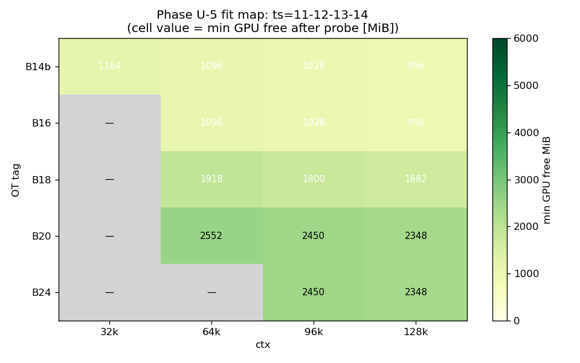
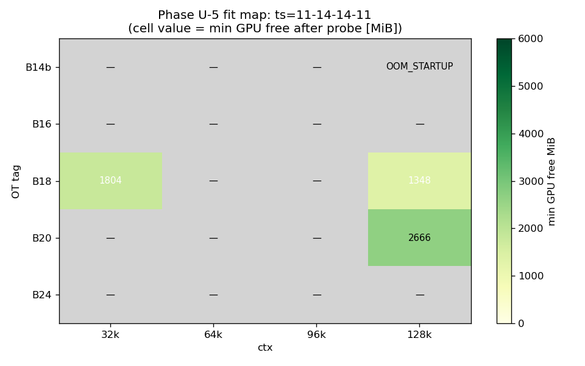
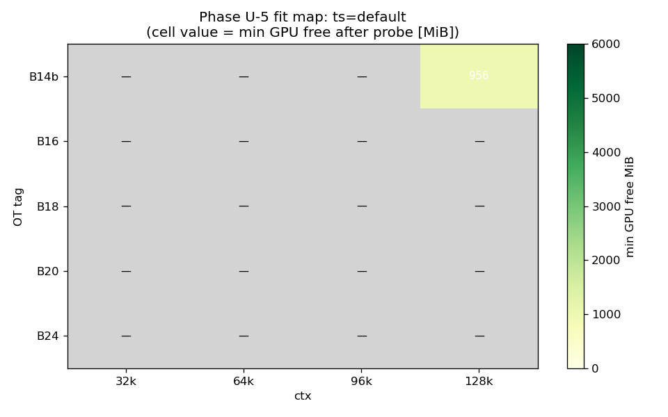
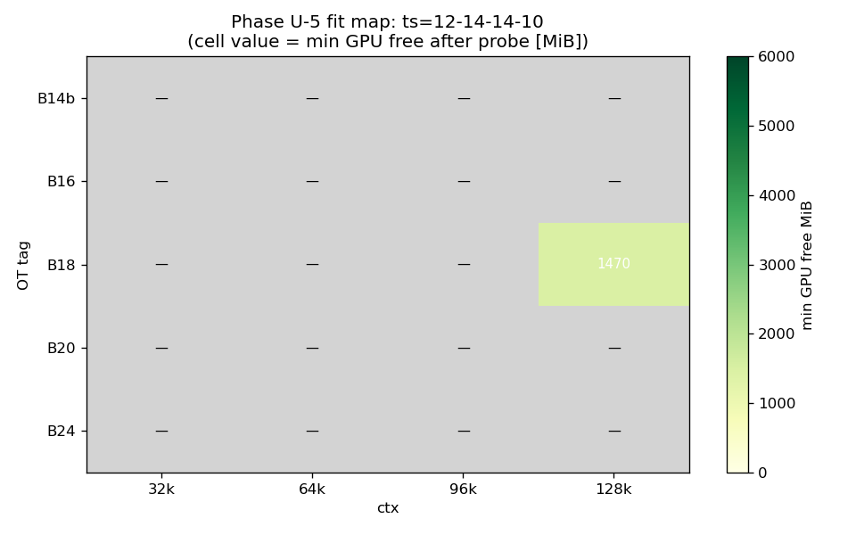

# Qwen3.5-122B-A10B 長文脈 VRAM fit マップ (Phase U-5)

- **実施日時**: 2026 年 4 月 24 日 08:13-08:40 JST
- **対象**: Qwen3.5-122B-A10B (unsloth Q4_K_M GGUF) / t120h-p100 (Tesla P100 × 4)
- **関連レポート**:
  - [2026-04-23_132933 Phase U-1 (llama.cpp 再ビルド baseline 再現)](2026-04-23_132933_qwen3-122b-u1-specckpt-baseline.md)
  - [2026-04-23_171459 Phase U-1-ext (spec ckpt 緩和 VRAM A/B)](2026-04-23_171459_qwen3-122b-u1ext-specckpt-relaxed.md)
  - [2026-04-23_173141 Phase U-2 (cache-ram TTFT 軸)](2026-04-23_173141_qwen3-122b-u2-cache-ram.md)
  - [2026-04-24_063651 Phase U-4 (gate/up fused GGUF 却下)](2026-04-24_063651_qwen3-122b-u4-fused-gguf.md)

## 添付ファイル

- [実装プラン](attachment/2026-04-24_081326_qwen3-122b-u5-ctx128k-fit-map/plan.md)
- [結果 CSV](attachment/2026-04-24_081326_qwen3-122b-u5-ctx128k-fit-map/phaseU5_results.csv)
- [分析サマリ](attachment/2026-04-24_081326_qwen3-122b-u5-ctx128k-fit-map/phaseU5_summary.md)
- [start_phaseU5.sh](attachment/2026-04-24_081326_qwen3-122b-u5-ctx128k-fit-map/start_phaseU5.sh)
- [batch_phaseU5.sh](attachment/2026-04-24_081326_qwen3-122b-u5-ctx128k-fit-map/batch_phaseU5.sh)
- [probe_vram.sh](attachment/2026-04-24_081326_qwen3-122b-u5-ctx128k-fit-map/probe_vram.sh)
- [run_all_phaseU5.sh](attachment/2026-04-24_081326_qwen3-122b-u5-ctx128k-fit-map/run_all_phaseU5.sh)
- [analyze_phaseU5.py](attachment/2026-04-24_081326_qwen3-122b-u5-ctx128k-fit-map/analyze_phaseU5.py)
- [fix_csv.py](attachment/2026-04-24_081326_qwen3-122b-u5-ctx128k-fit-map/fix_csv.py)

## 核心発見サマリ









### 主要結果

1. **ctx=131072 (128k) で fit する構成 9 件を特定** (21 条件中 20 fit、OOM 1 件)。成功条件達成。
2. **B14b baseline は ctx=128k で fit する** (T1-04: min_GPU_free 956 MiB / GPU3)。ts=11,12,13,14 および ts=default (T1-20) で同一の GPU 分散に収束。
3. **KV 線形膨張予測が実測と完全一致**: ctx 2 倍ごとに各 GPU 残 VRAM は -102 MiB/32k で推移 (B14b GPU3: 1262→1160→1058→956)。
4. **B14b では ts=11,14,14,11 で OOM** (T1-17): GPU1/2 を厚くすると GPU3 割当が不足し KV 追加分を受けきれない。B14b/B16 では baseline ts (11,12,13,14) が唯一安定。
5. **OT 層増は min_GPU_free のヘッドルームを大きく改善**: ctx=128k で B14b=956 → B18=1682 → B20=2348 → B24=2348 MiB。ただし eval 性能 (Phase T 知見) では逆順で B14b 最良。

### Phase U-6 候補 (推奨順)

| 順位 | 構成 (condition_id) | OT | ctx | ts | min_free [MiB] | 採用理由 |
|------|---|----|-----|-----|---------------|----------|
| **1st** | T1-04 | B14b | 131072 | 11,12,13,14 | 956 | eval 期待値最良 (U-2 で 18.750 t/s)。128k 運用の本命。 |
| **2nd** | T1-11 | B18 | 131072 | 11,12,13,14 | 1682 | eval 18.103 t/s (B14b の -3.4%)、ヘッドルーム +726 MiB で compute buffer 再膨張耐性あり。 |
| **3rd** | T1-14 | B20 | 131072 | 11,12,13,14 | 2348 | eval やや低下想定だが min_free 最大クラス、B14b で運用中に OOM 発生した場合のフォールバック。 |

T1-19 (B20 / ts=11,14,14,11, min=2666) はスコア最高だが、本命 B14b が fit した以上、eval 性能優先で T1-04 を 1 位。

## 前提・目的

### 背景

- 現 baseline **B14b_ts_alt** は ctx=32768 / -ts 11,12,13,14 / OT 14 CPU 層で GPU3 残 1260 MiB のタイト構成 (Phase U-1)。
- Qwen3.5-122B-A10B を **ctx=131072 (128k)** で運用できるか事前未確認。KV は q8_0 / 線形式 `96 × (ctx/16384) MiB` (Phase S 実測 16 点一致) で ctx=32k→128k で KV 4 倍 (192→768 MiB 全体) 膨張するため fit 可否が不明。
- Phase U-4 で fused GGUF は -16.7% eval 回帰で却下、spec ckpt も本環境で禁忌 (U-1-ext)。長文脈 eval/prompt を測る Phase U-6 の前提として、まず fit する構成を確定する必要がある。

### 目的

- dry-probe (起動 → /health → warm probe 10 トークン → SIGTERM) で **OT × ctx × tensor-split の fit/OOM を 2D 表化**。
- 成功条件: ctx=131072 で fit する (OT, -ts) 構成を 1 つ以上特定。
- Phase U-6 (長文脈 eval/prompt ベンチ) で使う 2-3 候補を推奨順で抽出。

### スコープ外 (未検証事項参照)

- 実 eval 性能 (eval_tps, prompt_tps) — Phase U-6 で測定
- 実プロンプト (10k-100k 入力) 処理時の compute buffer 再膨張

## 環境情報

- サーバ: t120h-p100 (10.1.4.14)、NUMA node 1 側 (`numactl --cpunodebind=1 --membind=1`)
- GPU: Tesla P100 16 GB × 4 (GPU0-3、split-mode=layer)
- モデル: `unsloth/Qwen3.5-122B-A10B-GGUF:Q4_K_M` (48 transformer block、~66 GB)
  - path: `/home/llm/.cache/huggingface/hub/models--unsloth--Qwen3.5-122B-A10B-GGUF/snapshots/51eab4d59d53f573fb9206cb3ce613f1d0aa392b/Q4_K_M/Qwen3.5-122B-A10B-Q4_K_M-00001-of-00003.gguf`
- llama.cpp: commit `6217b4958` (U-1 ビルド、`~/llama.cpp/build/bin/llama-server`)
- 固定パラメータ: `-ngl 999 -b 256 -ub 256 --flash-attn 1 --poll 0 --parallel 1 --threads 40 --cache-type-k q8_0 --cache-type-v q8_0 --split-mode layer`
- EXTRA_ARGS: 空 (spec ckpt 無し、fused 無し)

### OT Regex (CPU 層オフロード、本 Phase で層数検算済)

| Tag | Regex | CPU 層集合 | 層数 |
|-----|-------|-----------|------|
| B14b | `blk\.([2-3]\|2[0-3]\|3[1-8])\.ffn_.*_exps\.weight=CPU` | {2,3, 20-23, 31-38} | 14 |
| B16 | `blk\.([2-3]\|2[0-4]\|3[0-8])\.ffn_.*_exps\.weight=CPU` | {2,3, 20-24, 30-38} | 16 |
| B18 | `blk\.([0-3]\|2[0-4]\|3[1-9])\.ffn_.*_exps\.weight=CPU` | {0-3, 20-24, 31-39} | 18 |
| B20 | `blk\.([0-3]\|19\|2[0-4]\|3[0-9])\.ffn_.*_exps\.weight=CPU` | {0-3, 19, 20-24, 30-39} | 20 |
| B24 | `blk\.([0-4]\|1[6-9]\|2[0-4]\|3[0-9])\.ffn_.*_exps\.weight=CPU` | {0-4, 16-19, 20-24, 30-39} | 24 |

## 再現方法

1. ロック取得:
   ```bash
   bash .claude/skills/gpu-server/scripts/lock.sh t120h-p100 phaseU5
   ```
2. 添付ディレクトリで batch 実行:
   ```bash
   cd report/attachment/2026-04-24_081326_qwen3-122b-u5-ctx128k-fit-map/
   bash run_all_phaseU5.sh
   ```
   Tier-1 21 条件 × ~7 分 (初回)、~4 分 (2 回目以降、page cache 効果) = **総実行 ~27 分** (初期推定 2.5 時間より短縮)。
3. OOM 遭遇時 `set -e` で batch が abort するため、SKIP_IDS で途中再開:
   ```bash
   SKIP_IDS="T1-01,T1-02,..." bash batch_phaseU5.sh
   ```
4. CSV 列正規化 (ts 列のカンマ問題):
   ```bash
   python3 fix_csv.py
   ```
5. 分析・PNG 生成:
   ```bash
   python3 analyze_phaseU5.py
   ```
6. ロック解放:
   ```bash
   bash .claude/skills/gpu-server/scripts/unlock.sh t120h-p100
   ```

### dry-probe タイミング

1. `stop.sh t120h-p100` → 5 秒
2. `start_phaseU5.sh` 起動、/health polling (最大 300 秒、OOM/param reject で即 abort)
3. /health OK → 10 秒 (KV prealloc / compute buffer reserve 完了待機)
4. nvidia-smi 1 回目 (static VRAM)
5. warm probe: `POST /v1/completions {"prompt":"Hello","max_tokens":5}`
6. nvidia-smi 2 回目 (after-probe VRAM)
7. `stop.sh` → 5 秒 → 次条件

## 結果

### CSV (抜粋)

全 21 行の詳細は [phaseU5_results.csv](attachment/2026-04-24_081326_qwen3-122b-u5-ctx128k-fit-map/phaseU5_results.csv)、[phaseU5_summary.md](attachment/2026-04-24_081326_qwen3-122b-u5-ctx128k-fit-map/phaseU5_summary.md) 参照。

### ctx=131072 fit 構成 (9 件、推奨度スコア順)

score = (B14b なら +1000) + min_GPU_free_after_probe_MiB − (ts 非標準なら 100)

| rank | cond_id | OT | CPU | ts | min_free [MiB] | score |
|------|---------|----|----|-----|---------------|-------|
| 1 | T1-19 | B20 | 20 | 11,14,14,11 | 2666 | 2566 |
| 2 | T1-14 | B20 | 20 | 11,12,13,14 | 2348 | 2348 |
| 3 | T1-16 | B24 | 24 | 11,12,13,14 | 2348 | 2348 |
| 4 | **T1-04** | **B14b** | 14 | 11,12,13,14 | 956 | **1956** ※ |
| 5 | T1-20 | B14b | 14 | default | 956 | 1956 |
| 6 | T1-11 | B18 | 18 | 11,12,13,14 | 1682 | 1682 |
| 7 | T1-21 | B18 | 18 | 12,14,14,10 | 1470 | 1370 |
| 8 | T1-18 | B18 | 18 | 11,14,14,11 | 1348 | 1248 |
| 9 | T1-07 | B16 | 16 | 11,12,13,14 | 956 | 956 |

※ 実運用では T1-04 を 1 位に採用 (eval 性能期待値重視)。スコア上位 (T1-19/T1-14/T1-16) はフォールバック候補に。

### OOM 条件 (1 件)

- **T1-17 (B14b / ctx=131072 / ts=11,14,14,11)**: OOM_STARTUP。B14b は GPU 分担層が少ない (14 CPU 層) ため、GPU1/2 を厚く割当てる ts だと GPU3 側が KV 追加分を受けきれず OOM。B14b で 128k 運用するなら ts=11,12,13,14 (または default) に限定。

### ctx ごとの VRAM 挙動 (ts=11,12,13,14 固定)

| OT | 32k min | 64k min | 96k min | 128k min | Δ/32k |
|----|---------|---------|---------|----------|-------|
| B14b | 1164 | 1096 | 1028 | 956 | -70 |
| B16 | — | 1096 | 1028 | 956 | -70 (vs 64k) |
| B18 | — | 1918 | 1800 | 1682 | -118 |
| B20 | — | 2552 | 2450 | 2348 | -102 |
| B24 | — | — | 2450 | 2348 | -102 |

- 線形 KV 膨張が 4 GPU のうち tight 側に集中 (B14b/B16 は GPU3、B18〜B24 は GPU1 が tight)。
- OT 層増で tight が GPU3→GPU1 に移動 (B18 以降は layer 0〜3 を CPU に送るため GPU0 の負担が軽減、代わりに GPU1 が相対的に重くなる配置)。

## 未検証事項

- **fit 構成の実 eval 性能 (eval_tps, prompt_tps)**: 本 Phase は dry-probe のみ。Phase U-6 で測定。
- **実プロンプト (10k-100k 入力) 処理時の compute buffer 再膨張**: warm probe は 1 トークン級のため、長文脈 prompt による ubatch 階層の追加アロケは未検証。特に B14b/B16 の min_free=956 MiB が実プロンプトで不足する可能性。
- **KV=f16 fit 境界**: 本 Phase は q8_0 固定。f16 は約 2 倍の KV サイズになるため、ctx=128k では B14b でほぼ確実に OOM と想定するが実測なし。
- **その他 OT tag の fit 特性**: B12 (軽 offload)、B22/B28 (中間点) は未測定。
- **ts の最適化**: 手動で 4 点 (11,12,13,14 / 11,14,14,11 / default / 12,14,14,10) のみ探索。網羅的な ts グリッドは未実施。
- **長時間 (数時間) 運用時の VRAM ドリフト**: dry-probe は起動直後のみ。Phase G/H で既知の「長時間運転での VRAM 増加」は ctx=128k で未確認。
- **`--parallel 2+` の fit 境界**: 本 Phase は parallel=1 固定。parallel 増加時の KV 要求倍増は未検証。

## 検証完了後に実施すべき TODO

- **Phase U-6**: 推奨 3 候補 (T1-04, T1-11, T1-14) で eval (code / math / ja 3 タスク × 5 run)、prompt 処理 (1k/8k/32k/128k)、cross-session 安定性 (U-2 同基準)。B14b で compute buffer 不足が露呈したら B18/B20 にフォールバック。
- **batch_phaseU5.sh の `set -e` 耐性改善**: 本 Phase で T1-17 OOM により batch 中断が発生。`start_phaseU5.sh` 呼び出しを `set +e` ガードで包む修正を適用済 (batch_phaseU5.sh)。次回以降は全条件最後まで走り切る。
- **CSV 列のカンマエスケープ**: 本 Phase で ts 列のカンマにより行が 19→22 列に崩れる問題。batch_phaseU5.sh で ts を書き込む際にハイフン置換するか、`"..."` クォートを追加。現状は事後 `fix_csv.py` で対処済。
- **OT regex 層数検算スクリプトの恒久化**: Phase U-5 の Python assert ロジックを `.claude/skills/llama-server/scripts/` に移し、他 Phase でも起動前チェックできるようにする。
- **KV=f16 でも 128k fit する OT を探索**: B20/B24 であれば f16 でも fit 可能性あり。精度を上げたい場合の選択肢として。
- **長文脈 prompt (32k/64k/128k 入力) 実走 compute buffer プロファイル**: Phase I (longcontext) の `nvidia-smi dmon -s pucvmet` stream を再利用。
- **ctx=160k/200k の実験**: Qwen3.5 max_position_embeddings は 262144 (256k)。B20/B24 + ts=11,14,14,11 で 160k fit の余地が T1-19 の min_free=2666 MiB から期待できる。
