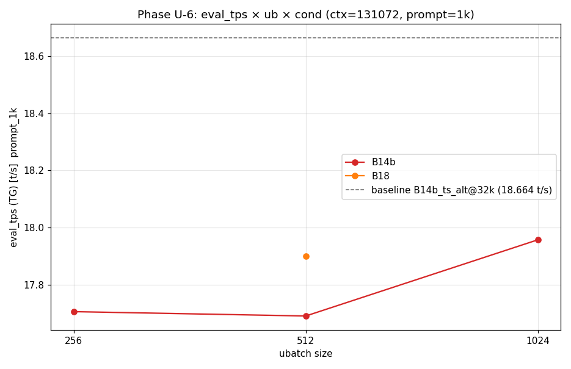
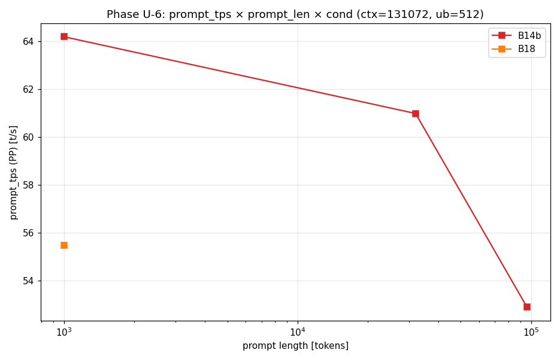
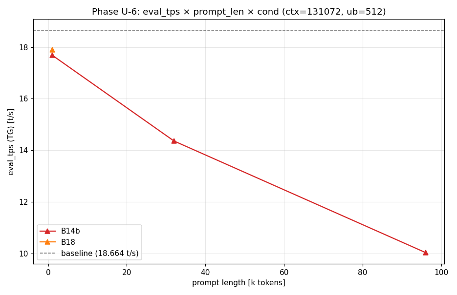

# Qwen3-122B Phase U-6: ctx=128k 起動 default 構成確定

- **実施日時**: 2026年4月24日 08:53 JST 開始、13:18 JST 完了 (batch 3h33m)

## 添付ファイル

- [実装プラン](attachment/2026-04-24_085353_qwen3-122b-c3-phaseU6-ctx128k-default/plan.md)
- [start_phaseU6.sh](attachment/2026-04-24_085353_qwen3-122b-c3-phaseU6-ctx128k-default/start_phaseU6.sh)
- [measure_phaseU6.sh](attachment/2026-04-24_085353_qwen3-122b-c3-phaseU6-ctx128k-default/measure_phaseU6.sh)
- [batch_phaseU6.sh](attachment/2026-04-24_085353_qwen3-122b-c3-phaseU6-ctx128k-default/batch_phaseU6.sh)
- [run_all_phaseU6.sh](attachment/2026-04-24_085353_qwen3-122b-c3-phaseU6-ctx128k-default/run_all_phaseU6.sh)
- [analyze_phaseU6.py](attachment/2026-04-24_085353_qwen3-122b-c3-phaseU6-ctx128k-default/analyze_phaseU6.py)
- [plot_phaseU6.py](attachment/2026-04-24_085353_qwen3-122b-c3-phaseU6-ctx128k-default/plot_phaseU6.py)
- [phaseU6_results.csv](attachment/2026-04-24_085353_qwen3-122b-c3-phaseU6-ctx128k-default/phaseU6_results.csv)
- [phaseU6_stats.csv](attachment/2026-04-24_085353_qwen3-122b-c3-phaseU6-ctx128k-default/phaseU6_stats.csv)
- [phaseU6_pivot.md](attachment/2026-04-24_085353_qwen3-122b-c3-phaseU6-ctx128k-default/phaseU6_pivot.md)
- [phaseU6_eval_vs_ub.png](attachment/2026-04-24_085353_qwen3-122b-c3-phaseU6-ctx128k-default/phaseU6_eval_vs_ub.png)
- [phaseU6_prompt_vs_len.png](attachment/2026-04-24_085353_qwen3-122b-c3-phaseU6-ctx128k-default/phaseU6_prompt_vs_len.png)
- [phaseU6_eval_vs_promptlen.png](attachment/2026-04-24_085353_qwen3-122b-c3-phaseU6-ctx128k-default/phaseU6_eval_vs_promptlen.png)
- [run_all_stdout.log](attachment/2026-04-24_085353_qwen3-122b-c3-phaseU6-ctx128k-default/run_all_stdout.log)

## 核心発見サマリ







- **推奨 default**: **B14b / ub=512 / ctx=131072 / ts=11,12,13,14** (OT=B14b pattern)
  - 1k prompt: eval=17.692 t/s (baseline -5.2%)、32k: 14.360 t/s (-23.1%)、**96k 完走**: 10.029 t/s (-46.3%)
  - min_gpu_free 468 MiB @ 96k、PP rate 53-64 t/s で ctx=128k 全域で安定動作
- **B14b / ub=1024 は 32k 以下では最速** (1k eval 17.958 t/s = baseline -3.8%、PP 91 t/s @ 1k) だが **96k で CUDA OOM crash** (PP progress 72% 到達時、`flash_attn_ext_tile` の pool_vmm alloc 失敗)。32k 以下確実用途の場合は選択肢
- **B14b / ub=256 は長 prompt で致命的に遅い**: 32k PP=40 t/s、1 run 832s。32k の PP rate で ub=512 比 -33%
- **B18 / ub=512 は B14b と同等の eval (1k 17.901 t/s)** だが PP rate 55.5 (B14b_ub512 の 64 より -13%)。VRAM ヘッドルーム (min_gpu=1446 MiB) は +206% だが default 優位性なし
- baseline B14b_ts_alt @ ctx=32k (18.664 t/s) との差: 1k で -1.05 t/s、32k で -4.30 t/s、96k で -8.64 t/s

## 前提・目的

### 背景

直前 Phase U-5 ([2026-04-24_081326_qwen3-122b-u5-ctx128k-fit-map.md](2026-04-24_081326_qwen3-122b-u5-ctx128k-fit-map.md)) で ctx=131072 (128k) に fit する 9 構成を特定。本 Phase U-6 はその推奨 3 構成 (B14b / B18 / B20) を実測で比較し、**起動スクリプトの default として採用する構成** を決定する。

### 過去 Phase の参照

- [Phase U-5 (ctx=128k fit map)](2026-04-24_081326_qwen3-122b-u5-ctx128k-fit-map.md): 推奨 3 構成の同定
- [Phase T-5f (ub fine sweep)](2026-04-22_232010_qwen3-122b-c3-phaseT5f-ub-fine-sweep.md): ctx=32k での ub 最適 = 512
- [Phase I (long context)](2026-04-17_173156_qwen3-122b-c3-phaseI-longcontext.md): 長コンテキスト prompt 測定設計の流用元

### 目的

1. ctx=128k 運用時の **eval_tps (TG)** が ctx=32k baseline (18.664 t/s) からどれだけ劣化するか
2. ctx=128k 運用時の **prompt_tps (PP)** を短/中/長 prompt で測定
3. **ub 軸 (256/512/1024)** が長文脈で最適値が変わるか検証
4. 推奨 default 構成 (OT / ts / ub / ctx) の確定

### スコープ外

- cross-session 安定性 (U-2 相当)
- prompt cache hit 効果 (本 Phase は run_marker で無効化)
- multi-parallel (`--parallel 2+`)
- タスク種別 (code/math/ja) による差分

## 環境情報

- **サーバ**: t120h-p100 (10.1.4.14)
- **GPU**: NVIDIA Tesla P100 16GB × 4
- **モデル**: unsloth/Qwen3.5-122B-A10B-GGUF (Q4_K_M, 71.82 GB)
- **llama.cpp**: commit `6217b4958`
- **固定パラメータ**: threads 40 / KV cache q8_0 (k+v) / flash-attn 1 / parallel 1 / poll 0 / split-mode layer / `-b 2048` / temp 0.6 / top-p 0.95 / top-k 20
- **NUMA バインド**: `numactl --cpunodebind=1 --membind=1`

### 測定構成

| 構成 | OT regex | CPU層 | ts | GPU3 残 (U-5) |
|------|---------|------|-----|--------------|
| B14b | `blk\.([2-3]\|2[0-3]\|3[1-8])\.ffn_.*_exps\.weight=CPU` | 14 | 11,12,13,14 | 956 MiB |
| B18  | `blk\.([0-3]\|2[0-4]\|3[1-9])\.ffn_.*_exps\.weight=CPU` | 18 | 11,12,13,14 | 1682 MiB |

B20 は保守枠として budget 都合で省略 (U-5 で fit 確認済み、本 Phase の default 候補ではない)。

### prompt (/tokenize API で実測した token 数)

| prompt | 目標 tokens | 実測 tokens | max_tokens |
|--------|-----------|-----------|-----------|
| 1k | 1000 | 1029 | 1024 |
| 32k | 32000 | 32060 | 512 |
| 96k | 96000 | 96164 | 256 |

### 実施行列 (縮小版)

当初計画の 15 セル × 7 run (105 run) は、ctx=128k × ub=256 の PP rate が想定より大幅に遅い (43 t/s, plan 仮定 200 t/s) ため 09:44 開始 25 分後に中断・再設計。

| 構成 | 1k | 32k | 96k | セル計 run |
|------|----|-----|-----|----------|
| B14b_ub256 | w2+e5 | w1+e2 | — | 10 |
| B14b_ub512 | w2+e5 | w1+e2 | w1+e1 | 12 |
| B14b_ub1024 | w2+e5 | w1+e2 | (w1 crashed) | 10+2* |
| B18_ub512 | w2+e5 | — | — | 7 |
| **合計** | 28 | 9 | 2** | **39+2*** |

\* B14b_ub1024_96k は warmup1 途中 (PP progress 72%) で CUDA OOM → server crash
\** B14b_ub512_96k のみ完走

## 再現方法

```bash
# 1. ロック取得
.claude/skills/gpu-server/scripts/lock.sh t120h-p100 phaseU6

# 2. prompts 生成 (初回のみ、既存ならスキップ)
cd report/attachment/2026-04-24_085353_qwen3-122b-c3-phaseU6-ctx128k-default/prompts
python3 generate_prompts.py
# check_tokens.sh で llama-server 起動後 token 数検証

# 3. batch 実行 (~3.5 時間)
cd ..
bash run_all_phaseU6.sh

# 4. 解析 + プロット
python3 analyze_phaseU6.py
python3 plot_phaseU6.py

# 5. ロック解放
.claude/skills/gpu-server/scripts/unlock.sh t120h-p100
```

## 結果

### eval (TG) by cond × ub × prompt_tag

| cond | ub | prompt | n | eval_median | stdev | baseline 比 | prompt_tps | prompt_ms | min_gpu_free |
|---|---|---|---|---|---|---|---|---|---|
| B14b | 256 | 1k | 5 | 17.707 | 0.008 | 0.949 (-5.1%) | 45.66 | 23,567 | 852 |
| B14b | 256 | 32k | 2 | 14.306 | 0.028 | 0.767 (-23.3%) | 40.65 | 789,776 | 848 |
| B14b | 512 | 1k | 5 | 17.692 | 0.007 | 0.948 (-5.2%) | 64.19 | 16,763 | 590 |
| B14b | 512 | 32k | 2 | 14.360 | 0.072 | 0.769 (-23.1%) | 60.98 | 526,493 | 590 |
| **B14b** | **512** | **96k** | **1** | **10.029** | — | **0.537 (-46.3%)** | **52.90** | **1,818,834** | **468** |
| B14b | 1024 | 1k | 5 | **17.958** | 0.251 | **0.962 (-3.8%)** | **91.66** | 11,751 | 62 |
| B14b | 1024 | 32k | 2 | **14.689** | 0.466 | **0.787 (-21.3%)** | **91.27** | 351,821 | 62 |
| B14b | 1024 | 96k | — | **CRASHED** | — | — | — | — | — |
| B18 | 512 | 1k | 5 | 17.901 | 0.003 | 0.959 (-4.1%) | 55.47 | 19,380 | 1,446 |

### prompt (PP) ingestion 時間 (median)

| prompt_tag | cond | ub | prompt_tps (t/s) | prompt_ms (ms) | 1 run wallclock |
|-----------|------|----|---------|---------|---------|
| 1k  | B14b | 256 | 45.66 | 23,567 | 82s |
| 1k  | B14b | 512 | 64.19 | 16,763 | 75s |
| 1k  | B14b | 1024 | 91.66 | 11,751 | 69s |
| 1k  | B18 | 512 | 55.47 | 19,380 | 78s |
| 32k | B14b | 256 | 40.65 | 789,776 | 828s |
| 32k | B14b | 512 | 60.98 | 526,493 | 564s |
| 32k | B14b | 1024 | 91.27 | 351,821 | 390s |
| 96k | B14b | 512 | 52.90 | 1,818,834 | 1849s (~31min) |
| 96k | B14b | 1024 | — | CRASHED | — |

### ub 軸の効果 (ctx=128k, B14b)

- **eval_tps**: ub=256→512 でほぼ不変 (17.71 → 17.69, -0.1%)、ub=512→1024 で +1.5% (17.69 → 17.96)
- **prompt_tps @ 1k**: ub=256→512 で +40.6%、ub=512→1024 で +42.8% (**ub に強く依存**)
- **prompt_tps @ 32k**: ub=256→512 で +50.0%、ub=512→1024 で +49.7% (ub=1024 で線形的改善が継続)
- **prompt_tps @ 96k**: ub=512 で 52.90 t/s (ub=256/1024 は測定不可)
- Phase T-5f での ctx=32k における ub=256 dip (15.911) は本 Phase で再現せず (ctx=128k では ub=256/512 の eval 差はノイズ範囲)

### score (本 Phase 判定基準)

```
score = 0.50 * R_eval + 0.25 * R_prompt_32k + 0.15 * R_headroom + 0.10 * R_stability
```

| 順位 | cond | ub | R_eval | R_p32k | R_head | R_stab | score | 96k 対応 |
|------|------|----|---------|--------|--------|--------|-------|---------|
| 1 | B14b | 1024 | 0.962 | 1.000 | 0.025 | 0.986 | **0.833** | ✗ CRASH |
| 2 | B14b | 512  | 0.948 | 0.668 | 0.236 | 1.000 | 0.776 | ○ |
| 3 | B14b | 256  | 0.949 | 0.445 | 0.341 | 1.000 | 0.737 | — (省略) |
| 4 | B18  | 512  | 0.959 | —    | 0.578 | 1.000 | 0.666 | — (省略) |

### OOM 解析 (B14b_ub1024_96k)

server log 抜粋:

```
slot update_slots: id 0 | task 8779 | prompt processing progress, n_tokens=69632, progress=0.724
/home/llm/llama.cpp/ggml/src/ggml-cuda/ggml-cuda.cu:97: CUDA error
CUDA error: out of memory
ggml_cuda_pool_vmm::alloc at ggml-cuda.cu
launch_fattn<256,4,8>
ggml_cuda_flash_attn_ext_tile_case<256,256>
```

**原因**: ub=1024 では 1 batch あたりの flash attention tile buffer (K/V 展開分) が大きく、長 prompt (> ~70k tokens) で pool_vmm の allocation が min_gpu_free=62 MiB に対し不足。

**対策**: ub を 512 に抑えるか、OT 層数を増やす (B18/B20) 余地あり。B18 × ub=1024 は本 Phase 未測定。

## ctx=128k 運用時の現実的な期待性能範囲

推奨 default (B14b / ub=512 / ctx=131072 / ts=11,12,13,14) の実測値:

- **TG (eval) 中央値**:
  - 短 prompt (1k tokens): 17.69 t/s (baseline -5.2%)
  - 中 prompt (32k tokens): 14.36 t/s (baseline -23.1%)
  - 長 prompt (96k tokens): 10.03 t/s (baseline -46.3%)
- **PP (prompt ingestion) 時間**:
  - 1k: ~16.7s (~64 t/s)
  - 32k: ~526s = **8.8 分** (~61 t/s)
  - 96k: ~1820s = **30 分** (~53 t/s)
- **応答遅延の現実**:
  - TTFT (1k 入力、非 cache hit): ~17s
  - 32k 入力 + 500 token 生成: ~9.4 分
  - 96k 入力 + 256 token 生成: ~30.4 分 (ほぼ PP で占有)
- **起動時間**: STARTUP_SEC = 21–22s (4 セル測定の全てで安定)
- **VRAM headroom**: min_gpu_free = 468 MiB @ 96k 処理中 (compute buffer 膨張ピーク)。590 MiB @ 32k、852 MiB @ 1k
- **運用上の含意**:
  - 対話 (~1k 入出力) では baseline 比 -5% の軽微な低下、十分実用
  - RAG 的な 32k 入力は 9 分待ちを許容できる非対話系向け
  - 96k 入力は 30 分のバッチ処理用途。リアルタイム応答は不可
  - 32k 以下確実で最高速を求める場合は **ub=1024 が eval +1.5% / PP +43%** だが 96k で落ちるため、入力長のバリデーションが前提

## 未検証事項

- **cross-session 安定性**: 1 session 内のみ測定。U-2 相当のセッション間 drift は未評価
- **prompt cache hit 効果**: `run_marker` unique で cache 無効化した測定。cache ON の実ワークロード挙動は別 Phase
- **multi-parallel (`--parallel 2+`)** の VRAM 挙動と TG/PP 影響
- **KV=f16 / f16+q8_0 mixed** の fit 境界
- **タスク種別 (code/math/ja)** による eval_tps 差 (本 Phase は英文 prose のみ)
- **ub=128/768/2048 の中間点**: ctx=128k では ub を上げるほど PP 改善するため、ub=2048 の試みと VRAM 上限探索が有益
- **B18 × ub=1024 の 96k 挙動**: B14b で落ちた 96k が B18 (CPU 層 +4, VRAM +726 MiB) で完走するか未検証。完走するなら "ub=1024 × 96k 対応 default" が実現可能
- **B14b_ub256 × 96k**: PP 40 t/s で ~40 分/run と予測し budget 都合で省略。OOM 有無は未確認
- **prompt 128k full (ctx 満杯)**: 96k で margin 確保のため上限を置いた。128k - 出力 token でどこまで詰められるかは別課題
- **ctx=98k / 64k への fallback**: 本 Phase の default が 96k で -46% 劣化するため、長文脈要件が低い場合は ctx を下げて eval を稼ぐ代替案あり
- **CSV 補正後解析の自動化**: B14b_ub1024_96k の CSV 行は eval1 OOM 時に warmup1 row が `curl_failed` 状態で上書きされる形になった (log には warmup1 成功値があるが CSV は空欄)。measure_phaseU6.sh の run_one で既に成功書き込み済みの JSON を後続 run が踏まないか要検証

## 検証完了後に実施すべき TODO

- [ ] 起動スクリプト (`.claude/skills/llama-server/scripts/start.sh`) の default パラメータを本 Phase 結論に更新:
  - OT=B14b (regex: `blk\.([2-3]|2[0-3]|3[1-8])\.ffn_.*_exps\.weight=CPU`)
  - ts=11,12,13,14
  - ub=512 / b=2048
  - ctx=131072
  - その他は従来通り (KV q8_0, flash-attn 1, parallel 1, poll 0, split-mode layer, threads 40)
- [ ] `user memory` の `project_t_series_roadmap.md` を U-6 完了で更新 (Cycle 87 として追記、次 Cycle 候補として「B18 × ub=1024 × 96k 挙動検証」または「spec ckpt 有効化」など)
- [ ] Phase U-7 計画: (a) cross-session 安定性 / (b) B18 × ub=1024 × 96k の OOM 回避検証 / (c) ctx=98k へ後退した場合の eval 回復度合い 等から選定
- [ ] batch/measure スクリプトの "CSV 上書き問題" (B14b_ub1024_96k で observed) の fix: 各 run の JSON を run_marker で unique 化するか、成功/失敗でファイル名を分ける
