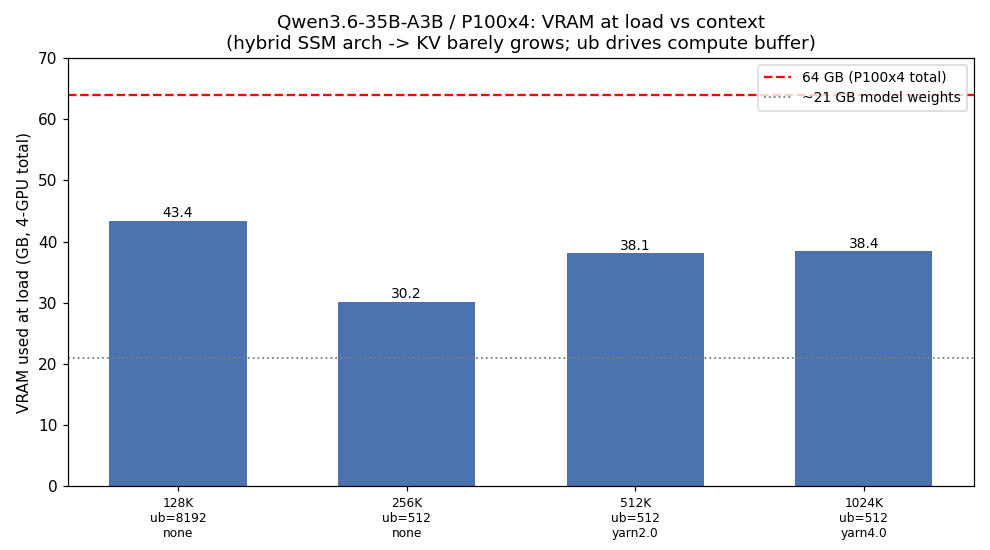
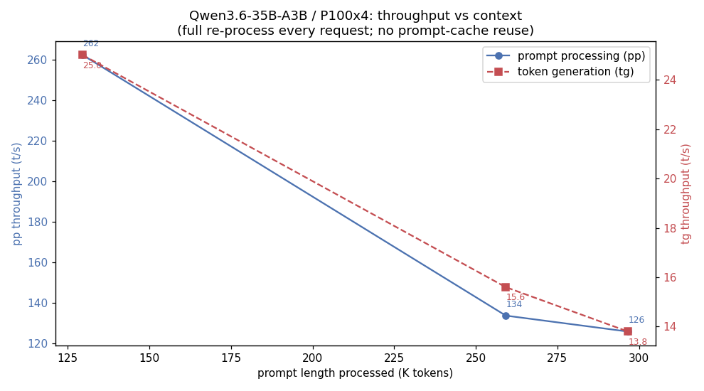
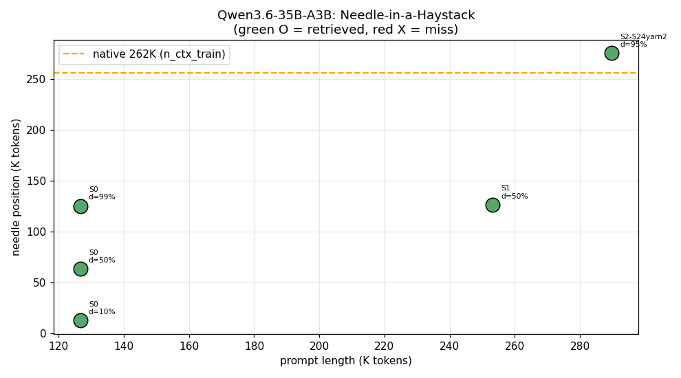

# Qwen3.6-35B-A3B 実用最大コンテキスト調査

- **実施日時**: 2026年5月29日 13:30 (JST)

## 添付ファイル

- [実装プラン](attachment/2026-05-29_133058_qwen36_max_context/plan.md)
- [NIAH/速度計測スクリプト niah.py](attachment/2026-05-29_133058_qwen36_max_context/niah.py)
- [短文劣化チェック shortqa.py](attachment/2026-05-29_133058_qwen36_max_context/shortqa.py)
- [VRAM 天井スイープ sweep_uncapped.sh / sweep.sh](attachment/2026-05-29_133058_qwen36_max_context/sweep_uncapped.sh)
- [グラフ生成 plot.py](attachment/2026-05-29_133058_qwen36_max_context/plot.py)
- 計測生データ: [load_matrix.csv](attachment/2026-05-29_133058_qwen36_max_context/load_matrix.csv) / [stages.csv](attachment/2026-05-29_133058_qwen36_max_context/stages.csv) / [niah_results.jsonl](attachment/2026-05-29_133058_qwen36_max_context/niah_results.jsonl) / [shortqa_results.jsonl](attachment/2026-05-29_133058_qwen36_max_context/shortqa_results.jsonl)

## 核心発見サマリ





**結論: t120h-p100 (P100×4, 64GB) での実用最大コンテキストは、無改造のまま native の 262,144 (256K) = 現行デフォルト 131,072 の 2 倍。** さらに `--override-kv` + YaRN を使えば品質を保ったまま 524K・1M まで起動・処理できるが、P100 では速度の都合で実用的でない。要点:

1. **上限を決めているのは VRAM でもモデルでもなく、llama.cpp サーバのハードキャップ**。`tools/server/server-context.cpp:1015` が slot context を `n_ctx_train`(=GGUF `qwen35moe.context_length`=262144) で無条件にキャップする。`--ctx-size 1048576` と YaRN フラグを渡しても、ログは `the slot context (1048576) exceeds the training context of the model (262144) - capping` → `new slot, n_ctx = 262144` となり、**素の構成では 262144 を超えられない**。

2. **VRAM は 262K どころか 1M 相当の確保でも ≤46GB に収まり、制約にならない**。本モデルは `general.architecture=qwen35moe`、40 層、**SSM/recurrent 層 + GQA(KV head=2) のハイブリッド**で、**KV cache が ctx にほとんど比例しない**。実測でも ub=512 のとき 262K=30.2GB、524K=38.1GB、1M=38.4GB とほぼ横ばい（上のグラフ）。

3. **真の VRAM 制約は「ロード」ではなく「処理時の flash-attention compute pool」**で、GPU0 上で per-batch サイズ `-ub` に比例する。**「起動できる」と「実際に長プロンプトを処理できる」は別物**。262K は `-ub 8192` では起動すら失敗（compute buffer ~13GB が GPU0 16GB に乗らず OOM）、`-ub 2048` では起動するが 262K プロンプト処理中に GPU0 で OOM クラッシュ、**`-ub 512` で初めて安定処理できた**（GPU0=8.9GB、pool 余地 ~7GB）。

4. **262K 超 (524K/1M) はフラグのみで拡張でき、品質も保たれる**。`--override-kv qwen35moe.context_length=int:2097152`（キャップが読む値を偽装）+ YaRN で slot が要求どおり 524288 / 1048576 に確保される。524K (YaRN factor 2) で **native(262144) を超える ~275K 位置の needle を完全回収**（上の NIAH グラフ、オレンジ線より上の緑点）。短文 6 問も factor 2/4 で全問正解 → **static YaRN による短文劣化は本モデルでは観測されず**。

5. **ただし P100 では 262K 超は速度面で非実用**。pp は 131K=262→262K=134→297K=126 t/s と低下し、tg も 25→16→14 t/s。さらにハイブリッド arch は **prompt cache を再利用できず毎リクエストでフル再処理**する（ログ: `forcing full prompt re-processing due to lack of cache data ... hybrid/recurrent memory`）。このため 1 リクエストあたり 262K≒32分、524K≒40分、1M≒推定2時間（フル NIAH は時間都合で未実施）かかる。

### 推奨

- **>128K が必要なケースでは ctx=262,144 + `-b 2048 -ub 512` を使う**（現行 131072 + ub=8192 は 262K では起動不可）。品質は NIAH で確認済み。
- **routine 用途は現行 131072 + ub=8192 を維持**（pp 262 t/s と倍速）。デフォルトは本レポートでは変更していない（提案のみ）。
- **262K 超は技術的に到達可能だが P100 では非推奨**。pp 速度とフル再処理の都合で実運用に耐えない。より高速な GPU でのみ override-kv+YaRN を検討。

## 前提・目的

- 背景: Qwen3.6-35B-A3B は現在 ctx=131072 (128K) で運用 (`llama-up.sh` default, commit `b4a05339`)。native は 262144 で、現状はその半分しか使っていない。
- 目的: t120h-p100 (64GB) で **品質劣化が許容範囲内に収まる実用最大 ctx** を段階的ベンチで特定する。
- 前提・方針: 「VRAM は足りる前提」で考えてよいとの指示だったが、対象を t120h-p100 (64GB) 限定としたため、**実機の物理上限を「実用最大」とする方針**に確定（プラン参照）。結果として VRAM は制約にならず、サーバキャップと速度が支配的だった。

## 環境情報

- サーバ: t120h-p100 (10.1.4.14)、NVIDIA Tesla P100-PCIE-16GB × 4 = 64GB、CUDA (ARCHS=600)、flash-attn 有
- モデル: `unsloth/Qwen3.6-35B-A3B-GGUF:UD-Q4_K_XL`（約21GB）
  - GGUF メタデータ: `general.architecture=qwen35moe`、`block_count=40`、`context_length=262144`
  - `attention.head_count=16`、`attention.head_count_kv=2`（GQA）、`rope.freq_base=1e7`、`rope.dimension_count=64`
  - `expert_count=256`、`expert_used_count=8`
  - `ssm.conv_kernel=4`、`ssm.state_size=128`、`ssm.group_count=16`、`ssm.inner_size=4096`（recurrent/SSM 層 — KV が ctx に比例しない理由）
- llama.cpp: build `19e92c33e`（tag b9388 近辺）、`--flash-attn 1 --poll 0`、KV cache q8_0
- サンプリング（サーバ default）: `--temp 0.6 --top-p 0.95 --top-k 20 --min-p 0 --presence-penalty 1.0 --dry-multiplier 0`

## 計測結果

### 構成マトリクス（起動可否・処理可否）

| ctx | ub | YaRN | 結果 | VRAM(GB) | GPU0(MiB) | 備考 |
|-----|----|----|------|----------|-----------|------|
| 131072 | 8192 | なし | **処理OK** | 43.4 | 13061 | NIAH 3/3 OK、現行 production 構成 |
| 262144 | 8192 | なし | 起動失敗 | – | – | compute buffer ~13GB が GPU0 で OOM |
| 262144 | 2048 | なし | 処理中クラッシュ | 48.2 | 16077 | 起動はするが 262K 処理で fattn OOM (GPU0) |
| 262144 | 512 | なし | **処理OK** | 30.2 | 8877 | NIAH@50% OK、サーバ安定 |
| 524288 | 512 | factor2 + override-kv | **処理OK** | 38.1 | 11729 | slot=524288（キャップ解除）、native超 needle 回収OK |
| 1048576 | 512 | factor4 + override-kv | ロードOK | 38.4 | 11229 | slot=1048576、短文6/6 OK、フル NIAH は ~2h/req のため未実施 |

### NIAH（Needle-in-a-Haystack）回収率

| 段階 | プロンプト長 | needle 位置 | 深さ | 回収 | pp(t/s) | tg(t/s) | wall |
|------|------------|------------|------|------|---------|---------|------|
| S0 (131K) | 129,642 | 13K/65K/128K | 10/50/99% | **3/3 OK** | 242–265 | 25.0 | ~500s |
| S1 (262K native) | 259,226 | 130K | 50% | **OK** | 133.7 | 15.6 | 1943s |
| S2 (524K, YaRN2) | 296,695 | **~282K (native超)** | 95% | **OK** | 125.8 | 13.8 | 2364s |

> S2 は native 262144 を超える位置に置いた needle を完全一致で回収（コード `28301444`）。YaRN 拡張が機能していることの直接証拠。

### YaRN 短文劣化チェック（6 問、greedy/no-think）

| 質問 | 正解 | factor2 | factor4 |
|------|------|---------|---------|
| 17×23 | 391 | 391 ✓ | 391 ✓ |
| 豪首都 | Canberra | Canberra ✓ | Canberra ✓ |
| fox 補完 | dog | dog ✓ | dog ✓ |
| 144÷12 | 12 | 12 ✓ | 12 ✓ |
| 最初の素数5個 | 2,3,5,7,11 | ✓ | ✓ |
| expand の反意 | contract等 | contract ✓ | contract ✓ |

→ factor 2/4 のいずれでも短文劣化なし。

### 速度・VRAM の傾向

- VRAM: ub=512 で 262K→1M がほぼ横ばい（30→38GB）。モデル 21GB が支配的で KV はごく僅か。ub を上げると compute buffer が GPU0 を圧迫し、長 ctx で OOM。
- 速度: pp/tg ともプロンプト長増加で低下。131K(262/25) → 262K(134/16) → 297K(126/14)。

## 考察: opencode 用途での適性（現状維持 131K+ub8192 vs ub縮小+262K）

「ub を減らして 262K に拡大する」案と「現状維持（131K + ub=8192）」のどちらが opencode (対話型コーディングエージェント) に適するかを検討した。**結論は現状維持（131K + ub=8192）**。

1. **ub 縮小は「全リクエストへの速度税」**: ub は最大 ctx だけでなくあらゆるプロンプトの pp に効く。ub=8192→512 では典型的な数十K規模のリクエストでも pp が低下する（一般に大 ub ほど pp が速い。過去知見 [Marathon ベンチ] の「ub=768 で prompt +16.2%」と整合）。opencode は pp 速度が UX 直結で、かつ本モデルは**ハイブリッド arch により毎ターン全プロンプトを再処理（prompt cache 再利用不可）**するため pp が支配的コスト。容量を使わない大多数のターンでも代償を払い続けることになる。
2. **262K の追加容量は opencode で活きにくい**: 典型的なコーディングセッションは 131K に達しないことが多く、達しても 262K 付近は約32分/ターンで対話利用に耐えない。262K は「セッション破綻を防ぐヘッドルーム」程度の価値で、実操作点にはならない。
3. **現行構成は opencode 実ワークロードで検証済み**: 131K + ub=8192 は judge_score 4.44 / 9タスク完走で default 採用された既知良好構成（report 2026-05-21）。ub 変更はこの検証済み性能を崩すリスク。

**例外**: opencode セッションが実際に 131K で頻繁に溢れて破綻しているなら別。その場合も全体デフォルト変更より、(a) コンテキスト圧縮、(b) 長文専用プロファイルのオンデマンド起動、の方が筋が良い。

**未検証の前提**: ub=512 vs 8192 の中域 (32–64K) における pp 差は本調査では未実測で、上記は一般挙動と過去知見からの推定。確実に裏を取るには同一中域 ctx で両 ub の pp を比較する短いベンチ（20–30分）が必要。

## 再現方法

1. ロック取得: `.claude/skills/gpu-server/scripts/lock.sh t120h-p100`
2. **262K（native、実用最大）起動**:
   ```bash
   EXTRA_LLAMA_OPTS="-b 2048 -ub 512" \
     .claude/skills/llama-server/scripts/start.sh t120h-p100 \
     "unsloth/Qwen3.6-35B-A3B-GGUF:UD-Q4_K_XL" 262144
   ```
3. **262K 超（override-kv + YaRN、参考・非実用）**:
   ```bash
   # 524K (factor2)。1M なら ctx=1048576, --rope-scale 4.0
   EXTRA_LLAMA_OPTS="-b 2048 -ub 512 \
     --override-kv qwen35moe.context_length=int:2097152 \
     --rope-scaling yarn --rope-scale 2.0 --yarn-orig-ctx 262144" \
     .claude/skills/llama-server/scripts/start.sh t120h-p100 \
     "unsloth/Qwen3.6-35B-A3B-GGUF:UD-Q4_K_XL" 524288
   ```
4. NIAH/速度計測: `python3 niah.py --ctx <N> --depths 0.1,0.5,0.99 --label <S>`
   - リクエストに `dry_multiplier=0`, `presence_penalty=0`, greedy(`temperature=0, top_k=1`) を送る（niah.py 実装済）

## 注意・学び

- **start.sh への追加（`EXTRA_LLAMA_OPTS`）**: 検証用に `LAUNCH_CMD` の `SERVER_OPTS` 後段へ `${EXTRA_LLAMA_OPTS:-}` を挿入した（未設定時は no-op でデフォルト挙動不変）。上記再現手順で使うため**そのまま残している**。不要なら当該行を削除すれば元に戻る（git diff で確認可）。
- **DRY sampler の末尾切断**: `--dry-multiplier 0.8` で起動したサーバでは数字列（コード/URL/パス）の末尾1桁が欠落する。計測リクエストには `dry_multiplier=0` を明示すること（過去レポート 2026-05-26 系と整合）。
- **「ロードできる」≠「処理できる」**: 長 ctx では warmup（空実行）は通っても実プロンプト処理時に flash-attn の compute pool が GPU0 で OOM する。ub を下げて GPU0 に余地を作る必要がある。
- **キャップ回避**: `qwen35moe.context_length` を `--override-kv` で偽装すればソース改変・リビルドなしでサーバキャップを外せる（完全可逆）。
- 本調査ではデフォルト運用（131072）は変更していない。調査後、サーバは発見時と同じ 131072 で再起動して終了。
