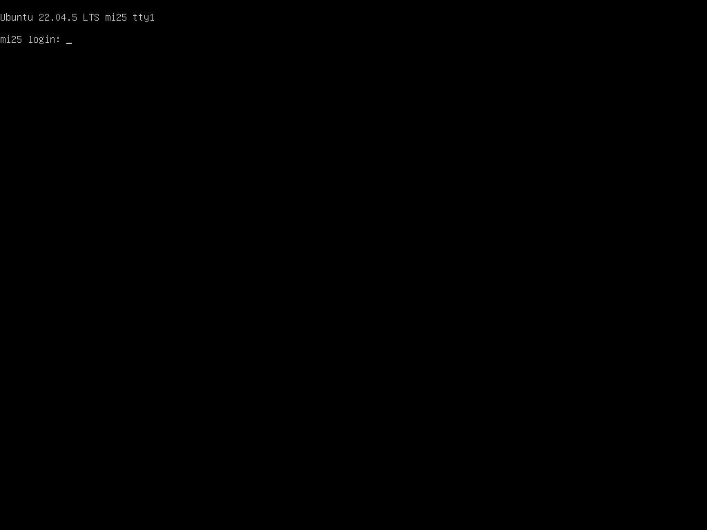
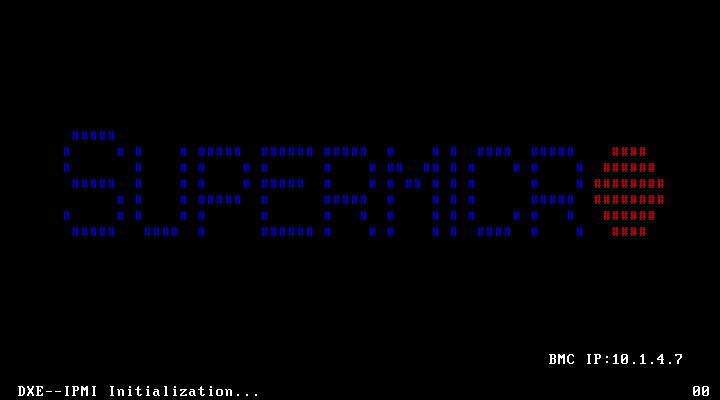
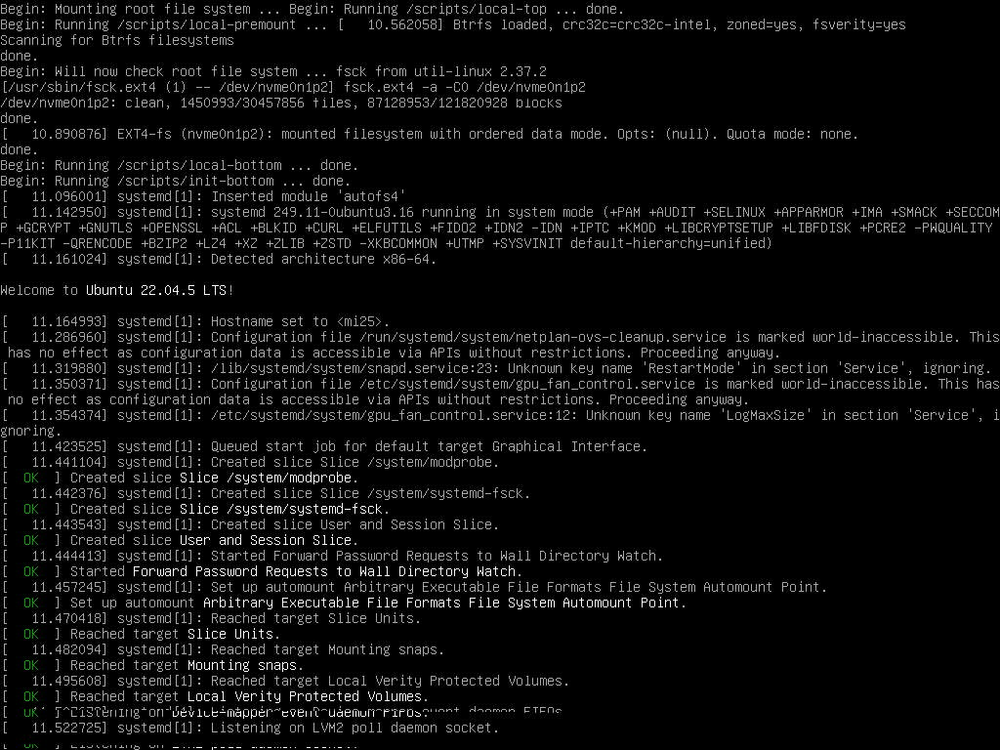

# mi25 BMC 緊急操作（電源リセット + KVM スクショ）整備

- **実施日時**: 2026年6月14日 02:20 (JST)

OS がハング/クラッシュして SSH が効かなくなった事態に備え、mi25（Supermicro X10DRG-Q）を
BMC 経由で復旧・観測する手段を `gpu-server` スキルに整備した。別プロジェクト `pvese` の
Supermicro BMC スキルを流用しつつ、mi25 固有の制約（Redfish ライセンス不可）に合わせて
**電源制御は IPMI**、**スクリーンショットは Playwright canvas** で実装。実機で 10 回超の
スクショ反復と実電源リセット 1 回を行い、すべて成功した。

## 核心発見サマリ

### 1. Redfish は使えず、IPMI が唯一の電源制御手段（設計の分岐点）

mi25 の BMC は Redfish API が **DCMS（SUM DCMS OOB）ライセンス未活性**で、電源・スクショとも
`OemLicenseNotPassed` を返す。pvese の `bmc-power.sh`（Redfish）も gpu-server の `power.sh`
（iLO5 Redfish）も mi25 では機能しない。一方 **IPMI（`ipmitool -I lanplus`）はライセンス不要で
完全動作**。→ Supermicro 機の out-of-band 電源制御は IPMI ベースの新規 `bmc-power.sh` に統一した。

### 2. KVM スクショは実画面を正確に取得（10/10 成功、黒画なし）

X10DRG-Q の HTML5 KVM ビューアは classic noVNC（2D canvas, `#noVNC_canvas`）で、pvese の
`bmc-kvm-interact.py` のセレクタと完全一致。`toDataURL()` で黒画にならず実画面を取得できた。
アイドル時のログインプロンプト例（1024x768）:



### 3. 実電源リセットで POST→ブート→ログイン復帰の全過程を撮影（再起動を boot_id で確定）

`bmc-power.sh mi25 reset`（02:13:50 JST）実行後、約15秒間隔で連続キャプチャ。
時刻はいずれも**リセット発行からの経過秒**。BMC IP を表示する **SUPERMICRO POST 画面**（+23s）から、
**systemd 起動ログ**（+74s）、**ログインプロンプト復帰**（+150s）まで一連を画像化できた。
`boot_id` が `b725658d…` → `7234cd92…` に変化し、実際に再起動したことを確認。

| POST (+23s) | systemd 起動ログ (+74s) | ログイン復帰 (+150s) |
|---|---|---|
|  |  |  |

`uptime -s`=02:15:03 から **カーネル起動はリセット後 約73秒**（4枚GPU列挙・メモリ訓練を含む長めの POST）。
ログインプロンプト復帰は +125〜150s の間（+125s のフレームはまだ起動ログ、+150s でログイン表示）。
起動ログ画面（+74〜125s のフレーム）は 273〜288KB・非黒画素率 最大 6.7% で、idle 時(~12.9KB)と明確に区別できた。

### 4. ⚠ Power Restore Policy が `always-off`（AC 喪失時は自動起動しない）

`chassis status` で **`Power Restore Policy : always-off`** を確認した。これは
**AC 電源が一度落ちると mi25 は自動で起動せず OFF のまま**であることを意味する（手動で
`bmc-power.sh mi25 on` が必要）。今回整備した `reset`/`cycle` は明示的に電源 ON を発行するため
影響しないが、停電・ブレーカ落ち等からの自動復帰を期待する運用では、ポリシー変更
（`ipmitool ... chassis policy always-on` または `previous`）の検討が必要。本タスクでは設定変更は
行っていない（現状維持）。

## 前提・目的

- **背景**: [2026-06-13 mi25 Qwen3.6 128k 調査](2026-06-13_112006_mi25_qwen36_128k.md) の終盤で
  mi25 のルート FS が ext4 ジャーナル破損により read-only 再マウントされ、OS がクラッシュした。
  SSH が効かない状況からの復旧に、OS 非依存の BMC 操作が必要だった。
- **目的**: BMC から (1) 電源リセット、(2) KVM スクリーンショット取得 を行えるようにする。
- **前提条件**: mi25 の BMC（10.1.4.7, claude/Claude123）に LAN 経由で到達可能。

## 環境情報

- **対象サーバ**: mi25（GPU: AMD MI25 ×4 / 64GB, OpenAI API 10.1.4.13）
- **BMC**: 10.1.4.7 — Supermicro X10DRG-Q, BMC FW 3.94, ATEN/AMI, IPMI 2.0
- **ツール**: ipmitool 1.8.19、Python venv（Playwright + Chromium、共有キャッシュ `~/.cache/ms-playwright/`）
- **配置**: `gpu-server` スキル配下に追加。詳細手引きは
  [`.claude/skills/gpu-server/bmc.md`](../.claude/skills/gpu-server/bmc.md)

## 実装内容

`.claude/skills/gpu-server/` 配下に追加:

| ファイル | 役割 |
|----------|------|
| `scripts/bmc-power.sh` | IPMI 電源制御（status/reset/cycle/on/off/soft）。`.env` から認証解決 |
| `scripts/bmc-kvm.py` | KVM スクショ/キー送信（pvese から移植、venv 自動 re-exec） |
| `scripts/bmc-screenshot.sh` | サーバ名指定のスクショ薄ラッパ |
| `scripts/bmc-setup.sh` | BMC 認証情報を `~/.config/gpu-server/.env`（`BMC_<SERVER>_*`, chmod 600）に登録 |
| `scripts/setup-bmc-venv.sh` | uv で venv 構築 + playwright/pillow 導入 |
| `bmc.md` | BMC 操作の手引き（IPMI/Redfish 使い分け、トラブルシュート） |
| `SKILL.md` / `CLAUDE.md` / `.gitignore` | BMC 一覧追記、`.venv/` を gitignore |

- 認証情報はスクリプトにハードコードせず `.env`（gitignore 済み）にのみ保存。
- `power.sh`（Redfish/iLO5, HPE 機）と `bmc-power.sh`（IPMI, Supermicro 機）を役割分担。

**スクショ方式の選定根拠**: ブラウザ不要の軽量経路として `CapturePreview.cgi`（ダッシュボードの
コンソールプレビュー）も調査したが、**CSRF トークン必須**（トークン無しでは `Token Value is not
matched` を返す）でトークン取得経路が firmware 依存・不安定なため不採用とした。代わりに、KVM 自体は
ライセンス不要で動く点を活かし、pvese 実績のある Playwright canvas 方式を採用した。

## 検証結果

| 項目 | 結果 |
|------|------|
| `bmc-power.sh status` ×3 | すべて `System Power: on` |
| KVM スクショ ×10 反復 | **10/10 成功**、サイズ一貫（~12.9KB）、非黒画素率も一定（黒画なし） |
| 実リセット ×1 | 成功。POST→systemd→ログインを撮影、boot_id 変化で再起動確定（uptime: 2:28→4分） |
| エラーパス | exit 2（不正アクション）/ exit 3（到達不能 BMC）/ exit 10（認証未登録）を確認 |

**発見された問題**: happy-path・エラーパスとも修正を要する不具合は無かった。X10 の noVNC が
クリーンな 2D canvas のため、想定していた「canvas 未接続」「`toDataURL()` 黒画」は発生せず。

**副次的知見**: ロックの symlink は対象サーバの `/tmp` 上にあるため、**リセットすると `/tmp` 初期化で
ロックが自動解放**される（リセット後 `unlock.sh` は "No lock exists" を返した）。

## 再現方法

```bash
cd /home/ubuntu/projects/llm-server-ops

# 初回セットアップ（venv + 認証情報）
.claude/skills/gpu-server/scripts/setup-bmc-venv.sh
.claude/skills/gpu-server/scripts/bmc-setup.sh mi25 10.1.4.7 claude Claude123

# 電源操作（実リセットは lock.sh でロック取得後に実施推奨）
.claude/skills/gpu-server/scripts/bmc-power.sh mi25 status
.claude/skills/gpu-server/scripts/bmc-power.sh mi25 reset

# KVM スクリーンショット
.claude/skills/gpu-server/scripts/bmc-screenshot.sh mi25 /tmp/mi25.png

# 再起動の確認（boot_id 変化）
ssh mi25 "cat /proc/sys/kernel/random/boot_id; uptime"
```

## 添付ファイル

- [実装プラン](attachment/2026-06-14_022047_bmc_power_kvm_recovery/plan.md)
- スクリーンショット: `attachment/2026-06-14_022047_bmc_power_kvm_recovery/shots/`
  （post.png / boot_systemd.png / login_recovered.png / idle_login.png）
