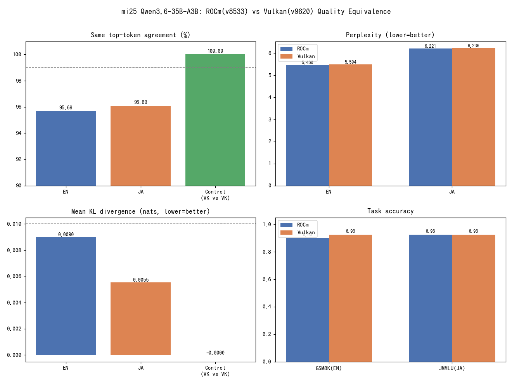

# mi25 Vulkan の品質劣化・出力破損検証（ROCm基準）

- **実施日時**: 2026年6月14日 04:13 (JST)

## 添付ファイル

- [実装プラン](attachment/2026-06-14_041305_mi25_vulkan_backend_quality/plan.md)
- [集計結果 results.json](attachment/2026-06-14_041305_mi25_vulkan_backend_quality/results.json)
- 計測スクリプト: [run_ppl.sh](attachment/2026-06-14_041305_mi25_vulkan_backend_quality/run_ppl.sh)（Phase1 KLD/PPL） / [run_ctrl.sh](attachment/2026-06-14_041305_mi25_vulkan_backend_quality/run_ctrl.sh)（VK自己対照） / [srv.sh](attachment/2026-06-14_041305_mi25_vulkan_backend_quality/srv.sh)（サーバ起動） / [gen_phase2.py](attachment/2026-06-14_041305_mi25_vulkan_backend_quality/gen_phase2.py)（Phase2） / [eval_phase3.py](attachment/2026-06-14_041305_mi25_vulkan_backend_quality/eval_phase3.py)（Phase3） / [make_ja_corpus.py](attachment/2026-06-14_041305_mi25_vulkan_backend_quality/make_ja_corpus.py)（日本語コーパス） / [make_assets.py](attachment/2026-06-14_041305_mi25_vulkan_backend_quality/make_assets.py)（集計・作図）

## 核心発見サマリ



mi25 (MI25/gfx900) の Qwen3.6-35B-A3B (UD-Q4_K_XL, KV q8_0/FA) について、**既知良好な ROCm 構成 (v8533) を基準に Vulkan(RADV) 構成 (v9620) が出力を壊していないか**を、KL-divergence・Perplexity・greedy 生成破綻チェック・実タスク正答率の4軸×日英で検証した。結論は **「Vulkan 構成に品質劣化・出力破損は認められない（本番投入可）」**。

1. **分布はほぼ等価**（Phase 1 / 主指標）。ROCm が出した基準 logits に対する Vulkan の KLD は **Mean KLD 0.0090(英)/0.0055(日)** と量子化ノイズ級、**PPL 比は +0.43%(英)/+0.23%(日)** と1%未満。Vulkan 自己対照（VK vs VK）では **Same-top 100.00%・Mean KLD ≈0（-1e-5）** となり、メトリクスの健全性と Vulkan の **top-token 決定性**を確認した（確率値のみ ~1e-5 の微小な run-to-run 変動。＝下記の差は真の構成間差でノイズではない）。

2. **生成に破綻なし**（Phase 2）。日英10プロンプトを greedy(temp=0) で生成し、**両構成とも 全件 finish=stop・文字化け0・反復ループ0・空応答0**。書式タスク（日英）と一部の短い日本語タスク（コード・要約）では **ROCm と Vulkan の出力が完全一致**（類似度1.000、計4件）。

3. **実タスク正答率も同等**（Phase 3 / 傍証）。**GSM8K(英) ROCm 90% vs Vulkan 92.5%**、**JMMLU(日) 両者 92.5%**。差はサーバ連続バッチングに起因する **greedy の実行間ゆらぎ**の範囲内（ROCm 単独でも 38↔36/40 で変動）。

4. **唯一の差は「長文での文言分岐」**。Same-top が **95.7%(英)/96.1%(日)** と 99% を下回り、長い生成では早い段階の top-token 反転が累積して **ROCm と Vulkan で文言が分かれる**（en/reason 類似度0.26 等）。ただし分岐後も両者とも流暢・整合的・正答で、**品質劣化ではなく「別の妥当な経路を辿る」差**である。日本語も英語と同等以上（劣化なし）。

> **解釈上の注意（重要）**: 本比較は ROCm=**v8533**、Vulkan=**v9620**（1000+ コミット差、gfx900 では ROCm を v9620 にできずバージョンを揃えられない）の比較であり、観測差は「RADV シェーダの数値精度差」と「llama.cpp バージョン差」の合算である。これは**実運用される2構成まるごとの等価性**を見るもので、実用判断としては正しい問い。Same-top が 99% に届かない要因にバージョン差が含まれる可能性があるが、いずれにせよ**実用品質（破綻・正答率・流暢さ）は保たれている**。

## 前提・目的

- **背景**: [mi25 Vulkan レポート](2026-06-14_001107_mi25_vulkan_qwen36_128k.md) で Vulkan(RADV) が ROCm 比 prompt 処理 ~3.3倍と大幅高速化を示した。一方 Vulkan は master 追従・別シェーダ経路であり、数値精度差やシェーダのバグで**出力品質が劣化・破損していないか**が未検証だった（同レポートでは f16 KV 高負荷時のホストダウンも観測）。
- **目的**: モデルの「賢さ」の絶対評価ではなく、**既知良好な ROCm を基準とした Vulkan の出力等価性**を日本語・英語で検証する。「実装の問題で品質劣化・出力破損が起きていないか」を判定する。
- **前提条件**: mi25 利用可。両バックエンドの llama.cpp ビルド（`build/`=ROCm pin v8533、`build-vulkan/`=master v9620）が存在。モデルは両構成で同一 GGUF を共有。

## 環境情報

- **サーバ**: mi25 (10.1.4.13)、ユーザ `llm`、ルートFS `/dev/nvme0n1p2` ext4 rw（空き110GB）
- **GPU**: AMD Radeon Instinct MI25 (gfx900/VEGA10, 16GiB×4物理 / 本計測の実効3枚)。
  - **注意**: 本計測時、ランタイムから見える MI25 は **3枚**だった（`rocm-smi` は4枚を列挙するが、ROCm HIP・Vulkan RADV とも実コンピュートは3枚。Vulkan の4番目は `llvmpipe`=CPU として現れる）。**4枚目がランタイムから脱落**しており、別途要調査（dmesg は sudo 権限なく未取得）。本検証は ROCm/Vulkan **両者を同一の3枚に揃えた**ため等価性比較は成立する。
- **モデル**: `unsloth/Qwen3.6-35B-A3B-GGUF:UD-Q4_K_XL`（22.36GB、両構成で同一ファイル）
- **共通設定**: `--flash-attn 1 --cache-type-k q8_0 --cache-type-v q8_0 -ngl 99`、生成系は temp=0/seed=1/top_k=1、thinking 無効（`chat_template_kwargs.enable_thinking=false`）
- **llama.cpp**: ROCm `build/` = b8533 (`0fac87b15`) / Vulkan `build-vulkan/` = b9620 (`57fe1f07c`)
- **Vulkan デバイス選択**: `GGML_VK_VISIBLE_DEVICES` を**未設定**にすると RADV 3枚のみ（llvmpipe 除外）で起動。`0,1,2` 等のインデックス指定はこの環境では1枚しか拾わず誤動作したため未設定が正。

## Phase 1: KL-divergence / Perplexity（主指標・バイナリ直接）

`llama-perplexity` で ROCm の基準 logits (`--kl-divergence-base`) に対し Vulkan で同一テキストの KLD/PPL を算出（30チャンク、n_ctx=512、FA/q8_0）。

| 指標 | 英語(wikitext-2) | 日本語(ja-wiki) | 対照 VK vs VK(英) | 閾値 |
|------|------------------|-----------------|-------------------|------|
| PPL (ROCm/base) | 5.4802 | 6.2213 | 5.5011 | — |
| PPL (Vulkan) | 5.5038 | 6.2358 | 5.5038 | — |
| **PPL 比** | **1.0043 (+0.43%)** | **1.0023 (+0.23%)** | 1.0005 | ±1% ✓ |
| **Mean KLD** | **0.00902** | **0.00554** | -0.00001 | <0.01 ✓ |
| Median KLD | 0.00383 | 0.00295 | ≈0 | — |
| 99% KLD | 0.0821 | 0.0419 | ≈0 | — |
| Max KLD | 3.129 | 1.009 | 0.000003 | — |
| **Same top token** | **95.69%** | **96.09%** | **100.00%** | >99% △ |

- **KLD 互換性**: ROCm(v8533) 生成の `.kld` を Vulkan(v9620) が問題なく読み込み計算できた（フォーマット互換、当初リスクは杞憂）。
- **対照群が決定的（ノイズフロアの定量）**: VK vs VK は Same-top **100.00%** だが、Mean KLD は厳密な 0 ではなく **≈ -1e-5**（PPL 比 1.0005）。すなわち **Vulkan は run-to-run で確率値にごく僅かな変動がある**（top-token は完全安定）。このノイズフロア(~1e-5) に対し ROCm↔Vulkan の Mean KLD 0.009 は **約900倍**であり、観測差はノイズから明確に分離した**真の構成間差**である。
- **平均は近いが裾に分岐点がある**: Mean/Median KLD は小さい一方、**Max KLD は 3.13(英)/1.01(日)・99.9% KLD は 0.29/0.18** と分布の裾は重い。ごく一部のトークン位置で確率質量が大きく移動しており、これが Same-top の ~4% 反転（長文での文言分岐）の発生源。平均的にはほぼ等価だが、低信頼度の分岐点が散在する構造。
- 日本語は英語より KLD が小さく（Mean 0.0055 < 0.0090、裾も 1.01 < 3.13）、**言語特有の劣化はない**。

## Phase 2: greedy 生成の破綻チェック（API 経由）

日英10プロンプト（知識QA/要約/コード/推論/書式）を temp=0/seed=1/thinking無効で両構成に送出。

- **破綻指標（両構成とも同一・良好）**: finish_reason は全件 `stop`、文字化け率 0、最大n-gram反復 1（ループなし）、空応答 0。**Vulkan 側のみの破綻は皆無**。
- **出力一致（ROCm vs Vulkan 類似度）**: 書式 `ja/format`・`en/format`・コード `ja/code`・要約 `ja/summary` は **1.000（完全一致）**。長い生成ほど分岐（`en/reason` 0.26、`en/qa` 0.50、`ja/qa` 0.61）。分岐は同等品質の言い換えで、破綻ではない。
- **日本語の流暢さ実例**（`ja/qa`「光合成を3文で」）— 両者とも正確・流暢、文言のみ相違:
  - ROCm: 「植物は葉緑体の中の葉緑素を用いて、太陽光のエネルギーを吸収します。…副産物として酸素が放出され…」
  - Vulkan: 「植物は葉緑体の中で太陽光のエネルギーを用いて、二酸化炭素と水からブドウ糖などの有機物を合成します。…地球上の生物が呼吸するために必要な酸素を供給しています。」

## Phase 3: 実タスク正答率（傍証・API 経由）

GSM8K(英) と JMMLU(日) を各40問、thinking無効・greedy で両構成同条件評価。

| ベンチ | ROCm | Vulkan | 差 |
|--------|------|--------|----|
| GSM8K (英, n=40) | 36/40 = 90.0% | 37/40 = 92.5% | +1問 |
| JMMLU (日, n=40) | 37/40 = 92.5% | 37/40 = 92.5% | 0 |

- 差は **greedy のサーバ実行間ゆらぎ**（連続バッチングで浮動小数点の加算順序が変わるため、ROCm 単独でも GSM8K が 38↔36/40 で変動した）の範囲内。**Vulkan による系統的な正答率低下はない**。

## 再現方法

1. ロック取得・作業準備:
   ```bash
   .claude/skills/gpu-server/scripts/lock.sh mi25
   ssh mi25 'mkdir -p ~/bench-quality/ppl; cd ~/llama.cpp && bash scripts/get-wikitext-2.sh'   # 英語コーパス
   # 日本語コーパス(MediaWiki API, datasets不要):
   scp make_ja_corpus.py mi25:~/bench-quality/ && ssh mi25 'cd ~/bench-quality && python3 make_ja_corpus.py ppl/ja-wiki.raw'
   ssh mi25 'cd ~/llama.cpp && cmake --build build --target llama-perplexity && cmake --build build-vulkan --target llama-perplexity'  # 既存なら不要
   ```
2. Phase 1（KLD/PPL、30チャンク、英日）— `GGML_VK_VISIBLE_DEVICES` は未設定（RADV3枚）:
   ```bash
   M=~/.cache/huggingface/hub/models--unsloth--Qwen3.6-35B-A3B-GGUF/snapshots/*/Qwen3.6-35B-A3B-UD-Q4_K_XL.gguf
   OPT="--flash-attn 1 --cache-type-k q8_0 --cache-type-v q8_0 -ngl 99 --chunks 30"
   # ROCm基準 → Vulkan KLD（英: -f wikitext, 日: -f ppl/ja-wiki.raw）
   ~/llama.cpp/build/bin/llama-perplexity        -m $M -f wiki.test.raw $OPT --kl-divergence-base ppl/rocm-en.kld
   ~/llama.cpp/build-vulkan/bin/llama-perplexity -m $M -f wiki.test.raw $OPT --kl-divergence --kl-divergence-base ppl/rocm-en.kld
   ```
3. Phase 2/3（サーバ経由）: `srv.sh start rocm|vulkan` で起動（`build*/bin/llama-server`、unset env、-c 16384）→ `python3 gen_phase2.py <backend>`／`python3 eval_phase3.py <backend> 40` を実行し、バックエンドを切替えて再実行。
4. 集計・可視化: `python3 make_assets.py <dir>` → `results.json` と `summary.png`。
5. `.claude/skills/gpu-server/scripts/unlock.sh mi25`。

## 既知の課題・今後

- **MI25 4枚目のランタイム脱落**: 本計測時、ROCm/Vulkan とも実コンピュートは3枚のみ（rocm-smi は4枚列挙）。`llvmpipe` が Vulkan デバイス3に出現。原因未特定（dmesg は sudo 必要で未確認）。本番運用前に電源リセット等で4枚復旧の確認が望ましい。
- **バージョン交絡**: ROCm v8533 と Vulkan v9620 を揃えられないため、Same-top の 99%未達にバージョン差が混じる。純粋なバックエンド単体差を切り出すには、CPU バックエンドや中間バージョンを参照点に追加する必要がある（今回は未実施。実運用等価性の判断には不要）。
- **greedy の実行間非決定性**: llama-server の連続バッチングにより temp=0 でも数問単位で正答率が揺らぐ。厳密比較が要る場合は単一スロット（`--parallel 1` 等）での再計測を検討。
- **計測規模**: Phase 3 は各40問の傍証規模。より厳密には数百問規模で信頼区間を狭めるべき。
- **計測手法の注意（再現時）**: ① Qwen3.6 の thinking 無効化は `chat_template_kwargs.enable_thinking=false` のみ有効（`/no_think` 文字列は無効）。② JMMLU は thinking 無効時 `max_tokens=64` だと難問で記号到達前に打ち切られ未抽出が多発（256 で解消）。③ mi25 に `datasets` ライブラリが無いため、GSM8K=GitHub raw jsonl・JMMLU=GitHub CSV・日本語コーパス=MediaWiki API で取得した。④ Phase 2 でも Vulkan は生成が高速（prefill 優位、既報と一致）。

## 参照レポート

- [mi25 Vulkan で Qwen3.6-35B-A3B 128k（pin不要・ub非依存）](2026-06-14_001107_mi25_vulkan_qwen36_128k.md)（本検証の比較対象・Vulkan 性能の元レポート）
- [mi25 で Qwen3.6-35B-A3B を 128k 実行（ROCm版）](2026-06-13_112006_mi25_qwen36_128k.md)（ROCm 基準構成）
