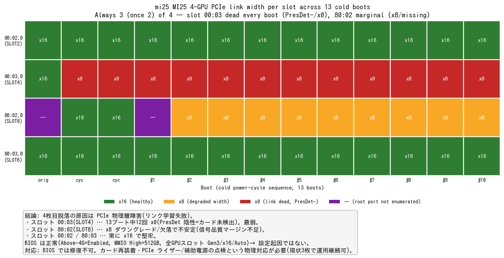

# mi25 4枚目MI25脱落の原因究明 — PCIe物理層障害と確定

- **実施日時**: 2026年6月14日 13:17 (JST)

## 添付ファイル

- [実装プラン](attachment/2026-06-14_131713_mi25_gpu4_pcie_dropout/plan.md)
- [10回サイクル傾向ログ](attachment/2026-06-14_131713_mi25_gpu4_pcie_dropout/cycle_trend.log)
- 計測スクリプト: [mi25_cap.sh](attachment/2026-06-14_131713_mi25_gpu4_pcie_dropout/mi25_cap.sh)（1ブートのトポロジ要約）/ [cycle_loop.sh](attachment/2026-06-14_131713_mi25_gpu4_pcie_dropout/cycle_loop.sh)（コールドサイクル傾向確認）
- BIOS スクショ: [PCIe(Above-4G/MMIO)](attachment/2026-06-14_131713_mi25_gpu4_pcie_dropout/bios-pcie-above4g-mmio.png) / [IIO1 リンク速度](attachment/2026-06-14_131713_mi25_gpu4_pcie_dropout/bios-iio1-linkspeed.png) / [IIO2 リンク速度](attachment/2026-06-14_131713_mi25_gpu4_pcie_dropout/bios-iio2-linkspeed.png)

## 核心発見サマリ



[mi25 Vulkan 品質検証レポート](2026-06-14_041305_mi25_vulkan_backend_quality.md) で「MI25 4枚のうち実効3枚、4枚目がランタイムから脱落（原因未特定）」と記録された件を調査し、**原因を PCIe 物理層障害（リンク学習失敗）と確定**した。

1. **常に3枚（一度2枚）しか PCIe バスに上がらない。脱落は起動時 POST 段階**で、ランタイム脱落ではない（dmesg に PCI removal イベント無し、amdgpu は毎回3デバイスのみ初期化）。前レポートの「rocm-smi は4枚列挙」はカーネル証拠（amdgpu 3枚）と矛盾し誤観測と判断。

2. **コールド電源サイクル13回の傾向（上図）で物理層障害が確定**。`lspci -vv` のリンク幅で見ると、4つの GPU スロット（Intel ルートポート 00:02 / 00:03 / 80:02 / 80:03）のうち:
   - **`00:03`（BIOS SLOT4）が最弱** — 13ブート中12回で **`Width x0`（リンク死）かつ `SltSta: PresDet-`（プレゼンス検出陰性＝カード未検出）**。ここに載る物理カード **GUID 33301** は、00:03 が x16 だった orig（唯一の正常ブート）でのみ列挙され、x0 化した以降の12ブートでは一度も現れていない（＝33301↔SLOT4 の対応の根拠。`dmidecode -t slot` でも現在 SLOT4 は `Available`＝未検出）。
   - **`80:02`（BIOS SLOT8）が限界気味** — `x8`（幅ダウングレード）/ 欠落 / x16 と不安定（信号品質マージン不足）。物理カード GUID 8820。
   - **`00:02` / `80:03` は全13ブートで `x16` 堅牢**。
   - cycle #1 では2枚に低下（00:03 死 + 80:02 欠落）。

3. **BIOS は4枚運用に正しく構成済みで設定起因ではない**（KVM 経由で精査）。**Above 4G Decoding = Enabled**、**MMIO High Size = 512 GB / MMIOHBase = 3 TB**（4×16GB に対し過剰なほど十分）、**全 GPU スロット（SLOT2/4/6/8）= PCI-E 3.0 X16 / Link Speed Gen3 / IOU ポート Auto**、無効化・誤設定なし。→ **MMIO 仮説は完全否定**。

4. **`PresDet-`・`x0`・`x8`ダウングレードはいずれも BIOS では修復不可能な物理事象**。脱落カード/スロットがブートごとに変わる間欠性も合わせ、**カード装着不良 / PCIe ライザーケーブル / PCIe 補助電源の接触不良**が原因。**遠隔修復は不可能で、物理的なハンズオン（再装着・配線点検）が必要**。現状3枚（GUID 29525/54068/8820、48GB VRAM）で正常稼働しており、本番モデル（Qwen3.6 22GB）は3枚に収まるため**当面の運用に支障はない**。

## 前提・目的

- **背景**: [mi25 Vulkan 品質検証レポート](2026-06-14_041305_mi25_vulkan_backend_quality.md) の「既知の課題」で、MI25 4枚のうち4枚目がランタイムから脱落しており、ROCm/Vulkan とも実コンピュートは3枚、原因未特定（当時 dmesg は sudo 権限なく未取得）と記録されていた。
- **目的**: 4枚目脱落の原因を特定し、遠隔で可能な範囲で復旧する。復旧不可なら原因を確定し対応方針を提示する。
- **前提条件**: mi25 利用可。NOPASSWD sudo 設定済み（読み取り診断に使用）。BMC（IPMI）で out-of-band 電源制御・KVM 操作が可能。

## 環境情報

- **サーバ**: mi25（10.1.4.13）、マザーボード **Supermicro X10DRG-Q**、BIOS **AMI 3.2（2019-11-22）**、CPU Xeon E5 v3 ×2（2 NUMA ノード）、RAM 32GB、Ubuntu 22.04.5、カーネル 5.15.0-164、amdgpu 6.8.5
- **GPU**: AMD Radeon Instinct MI25（gfx900/VEGA10、16GiB）**物理4枚**（subsystem Radeon PRO V320）。物理カード GUID = **29525 / 33301 / 54068 / 8820**
- **GPU スロット↔ルートポート対応**:

| BIOS スロット | Intel ルートポート | NUMA | 安定性（13ブート） |
|--------------|-------------------|------|--------------------|
| SLOT2 | `00:02.0` | node0 | x16 安定 |
| **SLOT4** | **`00:03.0`** | node0 | **12/13 で x0（最弱・GUID 33301）** |
| **SLOT8** | **`80:02.0`** | node1 | **x8/欠落で不安定（GUID 8820）** |
| SLOT6 | `80:03.0` | node1 | x16 安定 |

- **BMC**: 10.1.4.7（IPMI、ATEN/AMI）。Redfish は DCMS ライセンス未活性のため IPMI 一択

## 調査詳細

### Phase 1: 状態把握（読み取り専用、ロック不要）

- `lspci` で MI25 は3枚のみ（04/07/84 等、ブートで bus 番号変動）、+ ASPEED オンボード。`rocm-smi` も3枚。
- dmesg（`sudo -n dmesg`）: 当該ブートの amdgpu 初期化は3デバイス分のみ、PCI removal イベント無し → **POST 段階で既に3枚**。
- 起動履歴（`last reboot`）: 2026-06-13 以降の複数回のウォームリブートでも4枚目は復帰せず → **ウォームリブートでは復旧不能**。
  - なお当日のブートには **短時間で終了した「クラッシュ的」なブートが混在**（例: 06-13 18:24–19:46 約1.4h、23:44–翌02:13 約2.5h）。前回の ext4 ジャーナル破損インシデント（2026-06-13）と符合する可能性があり、本機の不安定性を示唆する。
- **PCI トポロジ全体像（非GPU含む）**: 5つの Intel ルートポートのうち GPU 用は4つ（00:02/00:03/80:02/80:03）。残りは `00:01.0→NVMe ブートディスク(Crucial P1、ネイティブ x4)`、`80:00.0→Intel I350 NIC(x4)`。GPU 4スロット以外に GPU を増設できる空きルートポートは無い。
- **MMIO は4枚分に十分**: dmesg では動作中の GPU でも初回 BAR 割り当てが一旦失敗（`BAR 0: failed to assign [mem size 0x400000000 64bit pref]` = 16GB BAR）し、その後カーネル再割り当てで解消していた。これは大きな 64bit BAR に対する Linux の通常のリソース再配置挙動であり、MMIO 空間不足の証ではない（MMIOH 512GB は 4×16GB に対し十分）。最終的に各カードは高位 MMIO（0x37000000000≈3.4TB 等）に 16GB 窓を確保しており、BAR 失敗ログ自体は良性（=脱落の原因ではない）。

### Phase 2: コールド電源サイクル（本命の遠隔復旧手段）

- `bmc-power.sh mi25 cycle 30`（OFF→30秒→ON、全電力ドレイン）で PCIe リンクを再学習。
- 1回目サイクル後も3枚のまま。ただし**列挙される顔ぶれが変化**（04/07/84 → 04/84/87）。→ ウォームリブートでは戻らないが、コールドでも4枚は揃わず、かつ脱落対象が変わる**間欠性**を確認。

### Phase 3: 10回コールドサイクル傾向確認

- `cycle_loop.sh` で10回連続コールドサイクルし、各ブートで4スロットのリンク幅と GPU GUID を記録（[ログ](attachment/2026-06-14_131713_mi25_gpu4_pcie_dropout/cycle_trend.log)）。
- 既存3観測と合わせ13ブート分を集計（核心発見サマリの図）。結論: **00:03 が支配的障害（PresDet-/x0）、80:02 が限界（x8）、他2スロットは堅牢**。「ランダム」ではなく**特定2スロットに集中**。

### Phase 4: BIOS 精査（KVM 経由）

- `bmc-power.sh mi25 reset` 後、`bmc-kvm.py sendkeys Delete`（vkbd パス）連打で BIOS Setup に進入。
- **Advanced → PCIe/PCI/PnP Configuration**: Above 4G Decoding=**Enabled**、MMIO High Size=**512 GB**、MMIOHBase=**3 TB**、各スロット OPROM=Legacy（[スクショ](attachment/2026-06-14_131713_mi25_gpu4_pcie_dropout/bios-pcie-above4g-mmio.png)）。
- **Advanced → Chipset → North Bridge → IIO Configuration → IIO1/IIO2**: 全 GPU スロット Link Speed=**Gen3（8GT/s）**、IOU ポート=**Auto**、無効化なし（[IIO1](attachment/2026-06-14_131713_mi25_gpu4_pcie_dropout/bios-iio1-linkspeed.png) / [IIO2](attachment/2026-06-14_131713_mi25_gpu4_pcie_dropout/bios-iio2-linkspeed.png)）。
- いずれも正常。BIOS で試せる唯一の「調整」（脱落スロットを Gen1 強制）も、主因が `PresDet-`（速度以前にカード未検出）・`80:02` は幅問題のため有効性が極めて低く帯域を損なうのみと判断し、**ユーザ合意のうえ変更せず Discard で終了**。

## 再現方法

```bash
# 0. ロック取得（電源操作は破壊的なため必須）
.claude/skills/gpu-server/scripts/lock.sh mi25

# 1. 現状把握（読み取り専用）
ssh mi25 'lspci | grep "VGA compatible"; rocm-smi --showid | grep -E "GPU\[|GUID"'
ssh mi25 'sudo -n dmesg | grep -E "added device 1002:6860|enabling device"'   # amdgpu 初期化数

# 2. スロット別リンク幅（脱落スロット特定の核心）
ssh mi25 'for rp in 00:02.0 00:03.0 80:02.0 80:03.0; do \
  echo -n "$rp "; sudo -n lspci -vvs $rp | grep -oE "LnkSta:.*Width x[0-9]+|PresDet[+-]"; done'

# 3. コールドサイクル傾向確認（mi25:~/mi25_cap.sh を配置後）
scp mi25_cap.sh mi25:~/ ; bash cycle_loop.sh 10   # 各ブートのトポロジを cycle_trend.log に記録

# 4. BIOS 進入・精査（KVM）
.claude/skills/gpu-server/scripts/bmc-power.sh mi25 reset
.claude/skills/gpu-server/.venv/bin/python .claude/skills/gpu-server/scripts/bmc-kvm.py \
  --bmc-ip 10.1.4.7 --bmc-user claude --bmc-pass Claude123 \
  sendkeys Delete Delete ... --wait 4000 --prefer vkbd --screenshot /tmp/bios.png
# Advanced→PCIe/PCI/PnP（Above-4G/MMIO）, Advanced→Chipset→North Bridge→IIO1/IIO2（Link Speed）を確認

# 5. 解放
.claude/skills/gpu-server/scripts/unlock.sh mi25
```

## 結論・対応

- **原因確定**: 4枚目 MI25 の脱落は **PCIe 物理層障害（リンク学習失敗／プレゼンス未検出）**。`00:03`（SLOT4・GUID 33301）が支配的、`80:02`（SLOT8・GUID 8820）が限界気味。BIOS 設定・MMIO・ドライバは正常で、遠隔（電源サイクル・BIOS）では修復不可能。
- **必要な物理対応（ハンズオン）**:
  1. 全 MI25 と PCIe ライザーケーブルの**確実な再装着**（特に SLOT4・SLOT8）。接点清掃。
  2. 各カードの **PCIe 補助電源（8pin）コネクタの装着確認**。
  3. 可能なら **SLOT4 のカード（GUID 33301）を健全スロットへ入れ替え**、カード個体不良かスロット/ライザー不良かを切り分け。
  4. 再装着後、`cycle_loop.sh` で複数回コールドブートし4枚安定列挙を確認。
- **当面の運用**: 現状3枚（GUID 29525/54068/8820、48GB VRAM）で正常稼働。本番モデル Qwen3.6（22GB）は3枚に収まるため支障なし。

## 既知の課題・今後

- **物理対応はリモート不可**。データセンタ/設置場所での作業が必要。
- ロックは長時間の BIOS 操作待機中に TTL 失効していた（"No lock exists"）。長時間の対話を挟む作業ではロック延長 or 再取得の運用に注意。
- BIOS バージョンは 2019-11-22 と古い。リンク学習に関わる修正が新 BIOS にある可能性は低いが、物理対応で解決しない場合の最後の選択肢。
- **（低優先の注記）NVMe ブートディスクの訂正可能 PCIe エラー**: 長時間稼働した初回ブート（uptime 約2.7h）では NVMe ルートポート `00:01.0` に `CorrErr+` / `CESta: Timeout+`（訂正可能エラーの蓄積）が立っていた。フレッシュブートでは解消（`CorrErr-`/`Timeout-`）し、`Width x4` も x4 SSD のネイティブ幅で異常ではない。直ちに問題ではないが、本機の PCIe 信号品質マージンが全体的にやや弱い可能性を示す弱い兆候。物理対応の際に併せて配線・接点を点検するとよい。

## 参照レポート

- [mi25 Vulkan の品質劣化・出力破損検証（ROCm基準）](2026-06-14_041305_mi25_vulkan_backend_quality.md)（本調査の発端。4枚目脱落の follow-up）
- [mi25 で Qwen3.6-35B-A3B を 128k 実行（ROCm版）](2026-06-13_112006_mi25_qwen36_128k.md)（mi25 固有の落とし穴・BIOS MMIO 設定）
