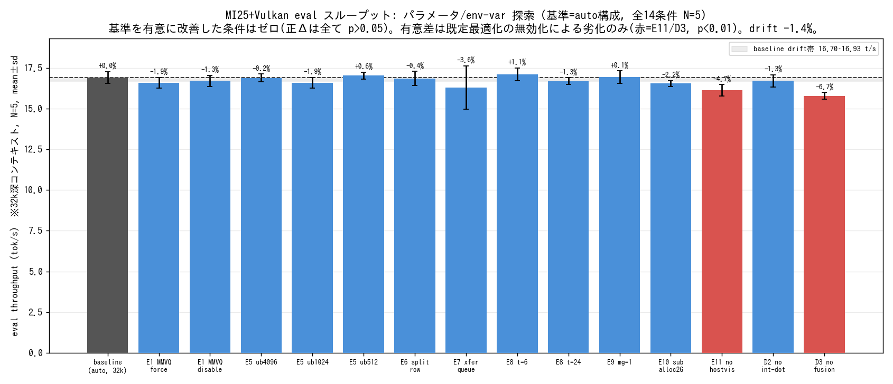

# MI25+Vulkan eval改善パラメータ探索: auto構成が最適と確認

- **作成日時**: 2026年06月18日 08:46 (JST)

## 添付ファイル

- [調査プラン](attachment/2026-06-18_084557_mi25_vulkan_param_sweep/plan.md)
- [計測スクリプト measure.sh](attachment/2026-06-18_084557_mi25_vulkan_param_sweep/measure.sh) / [run_cond.sh](attachment/2026-06-18_084557_mi25_vulkan_param_sweep/run_cond.sh) / [drive.sh](attachment/2026-06-18_084557_mi25_vulkan_param_sweep/drive.sh)
- [集計・統計 analyze.py](attachment/2026-06-18_084557_mi25_vulkan_param_sweep/analyze.py) / [作図 plot_final.py](attachment/2026-06-18_084557_mi25_vulkan_param_sweep/plot_final.py)
- [全測定 CSV sweep.csv](attachment/2026-06-18_084557_mi25_vulkan_param_sweep/sweep.csv)
- [デバイス機能メモ device_features.txt](attachment/2026-06-18_084557_mi25_vulkan_param_sweep/device_features.txt) / [canonical 起動cmd](attachment/2026-06-18_084557_mi25_vulkan_param_sweep/canonical_cmd.txt)

## 前提・目的

- **背景**: 棚卸しレポート [llamacpp_3mo_changes](2026-06-18_051739_llamacpp_3mo_changes_p100_mi25vulkan.md) は過去3ヶ月の llama.cpp 変更をコードリーディングのみで整理したもので、性能効果は未実測(「実測は別途ベンチで行う」)。MI25+Vulkan では **eval(トークン生成)が弱点**(前回 [mi25_vulkan_qwen36_128k](2026-06-14_001107_mi25_vulkan_qwen36_128k.md) で Vulkan eval は ROCm の約0.6倍)とされた。
- **目的**: 過去コミットの寄与分離ではなく、**報告書の知見から、現状ベースラインをさらに改善できる起動パラメータ・設定値(env var / CLI オプション)がまだ無いかを探す**。基準は 2026-06-14 レポートの確定構成。基準値に対し別パラメータを与えて比較し、**改善が外乱でないことを複数回測定(各 N=5)で確認**する。
- **主目標**: eval スループット改善の余地探索(prompt は既に ROCm の3.3倍で良好)。報告書の eval 改善候補は行列ベクトル積(MMV)カーネル系で、これを制御するランタイム・ノブ(MMVQ・整数dot・dot2_f16・融合)が本命。これらは全てリビルド不要で env/引数の差替のみで A/B 可能。

## 環境情報

| 項目 | 値 |
|------|-----|
| サーバ | mi25 (10.1.4.13)、Vulkan/RADV |
| GPU | **実効3枚** = Vulkan0/1/2 = Radeon Instinct MI25 (RADV VEGA10、各16368MiB)。Vulkan3 = llvmpipe(CPU、除外) |
| llama.cpp | master `f3e182816` (2026-06-17) を当日 build-vulkan で再ビルド(pin不要) |
| モデル | unsloth/Qwen3.6-35B-A3B-GGUF:UD-Q4_K_XL(arch qwen35moe、重み Q4_K) |
| 基準構成 | `--jinja -ngl 99 --split-mode layer --flash-attn 1 --poll 0 -b 2048 -ub 2048 --ctx-size 131072 --parallel 1 --cache-type-k/v q8_0 --defrag-thold 0.1`、sampling temp0.6/top-p0.95/top-k20/min-p0/presence1.0/**dry0**、`GGML_VK_VISIBLE_DEVICES=0,1,2` |
| 基準値(本実測) | prompt **407 t/s**(cold, 32k)・eval **16.9 t/s**(32k深)・最大単一GPU VRAM 9993MiB |
| デバイス機能 | `VK_KHR_shader_integer_dot_product` 存在(rev1)。`VK_VALVE_shader_mixed_float_dot_product`(dot2_f16)/ `VK_KHR_cooperative_matrix` / `VK_KHR_shader_bfloat16` は**いずれも非存在**(matrix cores 無し、gfx900 で想定通り) |

**注(基準値の前回比)**: 本実測の基準 eval **16.9 t/s**(3枚, N=5)は、前回 2026-06-14 の**単一試行値 15.2 t/s(4枚時代)を約 +11% 上回る**。要因は ① 前回が単一試行で外乱により低めに出た可能性、または ② 3枚 layer-split は4枚よりパイプライン段数・GPU間同期が減り eval が速い可能性(本ベンチでは切り分けていない)。いずれにせよ「Vulkan eval は ROCm の 0.6倍」という前回の見出しはやや悲観的で、16.9 vs ROCm 24.5(32k)なら**約 0.69倍**。本ベンチの A/B は全条件が同一条件(3枚・現master)のため、この前回比は A/B 比較の妥当性には影響しない。

## 再現方法(計測手法・外乱対策)

```bash
# 1. ロック取得 → 現master を Vulkan 再ビルド(start.sh はビルドのみ流用)
.claude/skills/gpu-server/scripts/lock.sh mi25
MI25_BACKEND=vulkan .claude/skills/llama-server/scripts/start.sh mi25 "unsloth/Qwen3.6-35B-A3B-GGUF:UD-Q4_K_XL" 131072

# 2. 各条件: canonical 起動cmd に env変数を前置 / 上書きフラグを末尾追記して再起動
#    (例) GGML_VK_FORCE_MMVQ=1 GGML_VK_VISIBLE_DEVICES=0,1,2 ./build-vulkan/bin/llama-server <canonical> [-ub 4096 等]
# 3. /v1/chat/completions を 固定プロンプトマーカーで叩く(prompt cache 活用):
#    warmup1 = キャッシュ空=コールドで実 prompt_tps(32k全再処理)を測定、
#    warmup2 + eval1-5 = キャッシュ命中(prompt_n=4)で 32k 深コンテキストの eval_tps を安価測定。
# 4. 各条件 WARMUP=2 / EVAL=5 / max_tokens=256 / COOLDOWN=15s。mean±sd・CV%・Welch t 検定。
#    2点ブラケット(B0 起点/終点)で drift 補正。詳細は attachment の measure.sh / drive.sh。
```

計測は全条件で `timings.predicted_per_second`(eval)/`prompt_per_second`(prompt)を取得。VRAM は各ランで `rocm-smi --showmeminfo vram`。

## 核心発見サマリ



**結論: MI25+Vulkan の eval を、起動パラメータ・Vulkan env-var で改善する余地は無い。現状の auto 構成が既に最適で、eval ≈16.9 t/s は gfx900(GCN5)の HBM2 メモリ帯域の上限。**

1. **改善ノブは皆無**: 報告書由来の eval 候補(MMVQ・整数dot・融合。dot2_f16 は拡張非存在で A/B 対象外→§2)＋標準チューニング軸(ub・split-mode row・転送キュー・threads・main-gpu・suballoc・host-visible vidmem)の**計14条件を各 N=5 で A/B → 基準を有意に改善した条件はゼロ**。基準より速い側(正の Δ=E5c +0.6%/E8a +1.1%/E9 +0.1%)は**全て p>0.05(有意差なし)**で、drift(-1.4%)・ノイズ(CV~2%)に埋もれる。**有意差が出たのは既定 ON の最適化を無効化した E11/D3 の劣化のみ**(§4)。
2. **dot2_f16 は MI25 非該当(報告書の未解決問いへの回答)**: `VK_VALVE_shader_mixed_float_dot_product` 拡張が gfx900/RADV に**非存在**。よって commit `b4e3dc613`(dot2_f16)は**MI25 では無効=非該当**。`GGML_VK_DISABLE_DOT2` の A/B は no-op のため実施せず(vulkaninfo で確定)。
3. **整数dot は eval に寄与せず**: `VK_KHR_shader_integer_dot_product` は存在するが、無効化しても eval 不変(D2: -1.3%, p=0.36)。Q4_K eval 経路はメモリ律速で、計算最適化が効かないことを示す。
4. **fusion / host-visible vidmem は既定が最適(診断)**: 無効化すると有意に劣化(D3 fusion: **-6.7%, p=0.0006**、E11 host-visible vidmem: **-4.7%, p=0.007**)。既定 ON の最適化が実際に効いている裏付け(=改善余地ではなく、既に活用済み)。
5. **eval はコンテキスト長依存**: 1k で 18.8 t/s、32k で 16.9 t/s(+11%, p<0.001)。KV-attention 成分による劣化はあるが、1k でも ROCm の 24.5(32k)に届かず、帯域上限が本質。
6. **基準 eval は前回単一試行を約 +11% 上回る**: 本実測の N=5 基準 16.9 t/s @32k(3枚)は前回の単一試行 15.2 t/s(4枚時代)より高い。前回値が外乱で低めだったか、3枚 layer-split が eval で有利かは未切り分け。「Vulkan eval は ROCm の 0.6倍」はやや悲観的で実測では約 0.69倍(詳細は環境情報の注)。
7. **start.sh のデバイス指定バグを発見(要修正)**: `GGML_VK_VISIBLE_DEVICES=0,1,2,3` は4枚時代の名残で、現在は Vulkan3=llvmpipe(CPU)を含み `ErrorOutOfDeviceMemory` で破綻。**正しくは `0,1,2`**。
8. **VRAM 削減の余地はある(eval とは別軸)**: ub<2048 と split-mode row は最大単一GPU VRAM を基準 9993MiB から削減(ub512→8202、ub1024→8798、row→8392)。ただし ub512 は prompt -11%、row は eval 改善なし。VRAM 逼迫時のオプション。

## 実験マトリクスと結果(32k、各 N=5、mean±sd)

baseline 起点 16.93、終点 16.70(drift -1.4% / 両ブラケット間 約85分)。Δ%・p は起点基準の Welch t 検定。ROCm 値(24.5 等)は前回レポートの単一試行値で、本セッションでは ROCm を再測定していない。

| ID | ノブ | eval t/s | CV% | Δ% | p | prompt | 最大VRAM | 判定 |
|----|------|---------|-----|----|----|--------|---------|------|
| **B0** | 基準(auto) | **16.93±0.35** | 2.1 | — | — | 407.1 | 9993M | 基準 |
| E1a | GGML_VK_FORCE_MMVQ=1 | 16.60±0.32 | 1.9 | -1.94 | 0.16 | 407.1 | 9993M | 改善なし(ns) |
| E1b | GGML_VK_DISABLE_MMVQ=1 | 16.71±0.33 | 2.0 | -1.29 | 0.34 | 406.8 | 9993M | 改善なし(ns) |
| E5a | -ub 4096 | 16.90±0.24 | 1.4 | -0.18 | 0.88 | 407.0 | 9993M | eval/VRAM 不変 |
| E5b | -ub 1024 | 16.60±0.33 | 2.0 | -1.93 | 0.17 | 410.9 | **8798M** | VRAM減・eval不変 |
| E5c | -ub 512 | 17.04±0.21 | 1.2 | +0.62 | 0.58 | **362.6** | **8202M** | VRAM減・prompt-11% |
| E6 | --split-mode row | 16.87±0.44 | 2.6 | -0.39 | 0.80 | 411.9 | **8392M** | VRAM減・eval不変 |
| E7 | GGML_VK_ASYNC_USE_TRANSFER_QUEUE=1 | 16.32±1.33 | 8.1 | -3.64 | 0.37 | 406.8 | 9993M | 改善なし(ノイズ大) |
| E8a | -t 6 | 17.12±0.40 | 2.3 | +1.08 | 0.46 | 407.1 | 9993M | 改善なし(ns) |
| E8b | -t 24 | 16.71±0.20 | 1.2 | -1.30 | 0.27 | 406.6 | 9993M | 改善なし(ns) |
| E9 | -mg 1 | 16.94±0.39 | 2.3 | +0.07 | 0.96 | 406.5 | 9993M | 改善なし(ns) |
| E10 | GGML_VK_SUBALLOCATION_BLOCK_SIZE=2G | 16.55±0.18 | 1.1 | -2.24 | 0.075 | 406.4 | 9993M | 改善なし(ns) |
| E11 | GGML_VK_DISABLE_HOST_VISIBLE_VIDMEM=1 | 16.13±0.36 | 2.2 | **-4.73** | **0.007** | 410.1 | 9993M | **有意劣化**(既定が最適) |
| D2 | GGML_VK_DISABLE_INTEGER_DOT_PRODUCT=1 | 16.71±0.37 | 2.2 | -1.29 | 0.36 | 406.9 | 9993M | 寄与なし |
| D3 | GGML_VK_DISABLE_FUSION=1 | 15.80±0.21 | 1.3 | **-6.71** | **0.0006** | 400.9 | 9993M | **有意劣化**(既定が最適) |
| — | B0 終点(drift) | 16.70±0.22 | 1.3 | -1.38 | 0.24 | (cache) | 9993M | drift基準 |
| — | B0 1k(参考) | 18.80±0.38 | 2.0 | +11.0 | <0.001 | 521.2 | 9993M | コンテキスト依存 |

注: `GGML_VK_DISABLE_DOT2`(D1)は dot2_f16 拡張が gfx900 に非存在のため no-op として未実施(本文 §2)。組合せ追試は、単体で有意改善したノブが皆無のため実施せず。

## 運用への示唆・推奨

- **eval 改善はソフト設定では不可**: gfx900 は HBM2 帯域(~480GB/s 級)律速で、量子化MMV の計算最適化(MMVQ/整数dot/dot2)は効かない。eval を上げるには量子化を軽くする(データ読み出し量の削減)などモデル側の変更が必要で、本探索の範囲外。**現状の auto 構成を維持**するのが最適。
- **start.sh の修正を推奨**: mi25 Vulkan の `ENV_PREFIX` を `GGML_VK_VISIBLE_DEVICES=0,1,2`(実GPUのみ)に変更。現状の `0,1,2,3` は SLOT4 脱落後の3枚構成で llvmpipe を巻き込み OOM 破綻する([参照: mi25 4枚目MI25脱落=PCIe物理層障害](2026-06-14_131713_mi25_gpu4_pcie_dropout.md))。
- **VRAM 逼迫時のみ** ub を 2048→1024 に下げると最大単一GPU VRAM を約1.2GB 削減できる(eval 不変、prompt はほぼ不変)。split-mode row も VRAM を均す効果があるが eval は改善しない。
- **既定最適化(fusion / host-visible vidmem)は無効化しない**: いずれも eval に有意寄与(-6.7% / -4.7%)。

## 参照リンク

- [過去3ヶ月の llama.cpp 主要変更(P100/MI25+Vulkan)](2026-06-18_051739_llamacpp_3mo_changes_p100_mi25vulkan.md)(本ベンチの起点)
- [mi25 Vulkan 性能・pin 不要実証](2026-06-14_001107_mi25_vulkan_qwen36_128k.md)(基準値の出典)
- [mi25 Vulkan バックエンド品質等価検証](2026-06-14_041305_mi25_vulkan_backend_quality.md)
- [mi25 ROCm 基準構成(Qwen3.6 128k)](2026-06-13_112006_mi25_qwen36_128k.md)
