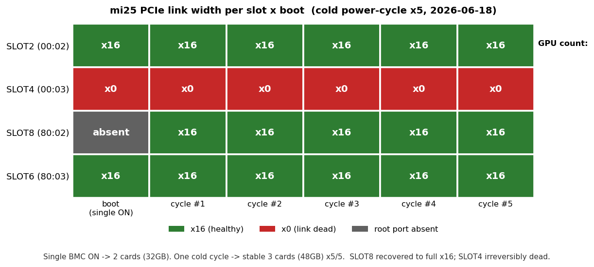

# mi25 コールド電源サイクルで3枚復帰を確認(SLOT8回復・SLOT4不可逆)

- **実施日時**: 2026年6月18日 22:10〜22:29 (JST)

## 添付ファイル

- [電源サイクル5回 観測ログ](attachment/2026-06-19_015028_mi25_coldcycle_3card_recovery/cycle_trend.log)
- [観測スクリプト cycle5.sh](attachment/2026-06-19_015028_mi25_coldcycle_3card_recovery/cycle5.sh)

## 核心発見サマリ



[mi25 4枚目MI25脱落の原因究明レポート](2026-06-14_131713_mi25_gpu4_pcie_dropout.md) で「PCIe物理層障害(SLOT4=00:03が支配的に死、SLOT8=80:02が限界)」と確定した件の follow-up。今回、**BMC単独ONで一旦2枚(32GB)まで落ちた状態から、コールド電源サイクル(ACPIソフトシャットダウン→電力ドレイン30秒→ON)を5回繰り返し、毎回3枚(48GB)で安定復帰することを確認**した。

1. **BMC単独ONでは2枚(32GB)になりうる** — 起動直後の素の状態では SLOT4(00:03)に加え **SLOT8(80:02)もルートポートごとPCIツリーから欠落**し、`VGA_GPU_COUNT=2`(GUID 29525/54068 のみ)。前回レポートの「cycle #1で2枚に低下」と同一の谷を引いた状態。

2. **コールド電源サイクルを1回挟むと3枚(48GB)で安定** — 5サイクル**すべて**で `VGA_GPU_COUNT=3`、生存 GUID は一貫して **29525(SLOT2)/ 54068(SLOT6)/ 8820(SLOT8)**。再現性100%(5/5)。

3. **SLOT8(80:02 / GUID 8820)は完全復活、しかも全回 x16** — 前回レポートでは「x8ダウングレード/欠落で不安定」だったが、今回は5/5で `Width x16` のフル幅。**完全電力ドレインがリンク学習を健全化**したとみられ、前回より状態が改善している。

4. **SLOT4(00:03 / GUID 33301)は不可逆に死亡** — 5/5で `Width x0` / dmidecode `Available`(カード未検出)。前回の「12/13で x0」と完全一致し、電源サイクルでは一切復活しない。**このカードのみ物理ハンズオン(再装着・接点清掃)が必須**。

5. **健全2枚(SLOT2=00:02 / SLOT6=80:03)は全ブートで x16 堅牢** — 単独ON含む全6観測で一度も揺らがず。

> **運用上の結論**: mi25 は「BMC単独ONでは稀に2枚になるが、コールドサイクルを1回挟めば3枚(48GB)で安定する」。今後2枚を検知したら電源サイクルで回復可能。本番モデル Qwen3.6(22GB)は3枚に収まるため運用に支障なし。

## 前提・目的

- **背景**: 本日 mi25 を起動したところ、過去の実効3枚([前回レポート](2026-06-14_131713_mi25_gpu4_pcie_dropout.md))よりさらに1枚少ない**2枚(32GB)**しか認識されなかった。`lspci -vv`・`dmidecode -t slot`・amdgpu初期化数の3点から、SLOT4(00:03、恒常x0)に加えて SLOT8(80:02、ルートポート欠落)も落ちた状態と特定。
- **目的**: この2枚状態が恒久的な悪化なのか、前回確認された間欠故障の「谷」なのかを切り分け、コールド電源サイクルで枚数が回復するか・その再現性を定量化する。
- **前提条件**: mi25 利用可、ロック取得済み。NOPASSWD sudo 設定済み(読み取り診断に使用)。BMC(IPMI)で out-of-band 電源制御が可能。

## 環境情報

- **サーバ**: mi25(10.1.4.13)、マザーボード Supermicro X10DRG-Q、BIOS AMI 3.2(2019-11-22)、Xeon E5 v3 ×2(2 NUMAノード)、RAM 32GB、Ubuntu 22.04.5、カーネル 5.15.0-164、amdgpu 6.8.5
- **GPU**: AMD Radeon Instinct MI25(gfx900/VEGA10、16GiB)物理4枚。物理カード GUID = 29525 / 33301 / 54068 / 8820
- **GPUスロット↔ルートポート対応**(前回レポートより):

| BIOSスロット | Intelルートポート | NUMA | 物理カードGUID | 今回の挙動(6観測) |
|--------------|-------------------|------|----------------|--------------------|
| SLOT2 | `00:02.0` | node0 | 29525 | **x16 安定(6/6)** |
| **SLOT4** | `00:03.0` | node0 | 33301 | **x0 死亡(6/6、不可逆)** |
| **SLOT8** | `80:02.0` | node1 | 8820 | 単独ON時のみ欠落、**サイクル後 x16(5/5)** |
| SLOT6 | `80:03.0` | node1 | 54068 | **x16 安定(6/6)** |

- **BMC**: 10.1.4.7(IPMI、Redfishは DCMS ライセンス未活性のため IPMI 一択)

## 調査詳細

### 観測手順

`cycle5.sh`(添付)で、ACPIソフトシャットダウン→電源OFF確認→30秒電力ドレイン→ON→SSH復帰待ち、を5回繰り返し、各ブートで以下を記録:

- `lspci` の MI25(VGA controller)数 = `VGA_GPU_COUNT`
- 4ルートポート(00:02/00:03/80:02/80:03)の `lspci -vv` リンク幅
- `dmidecode -t slot` の SLOT2/4/6/8 の Current Usage
- `rocm-smi --showid` の生存 GUID 一覧

電力ドレインを確実にするため、ハード電源OFF(FS破損リスク)ではなく **ACPIソフトシャットダウン** を採用。OSがクリーンに停止してから30秒ドレインした。

### 観測結果(全6ブート)

| 観測 | 枚数 | SLOT2(00:02) | SLOT4(00:03) | SLOT8(80:02) | SLOT6(80:03) | 生存GUID |
|------|------|--------------|--------------|--------------|--------------|----------|
| 単独ON(前) | **2** | x16 | x0 | **欠落** | x16 | 29525,54068 |
| cycle #1 | **3** | x16 | x0 | **x16** | x16 | 29525,54068,8820 |
| cycle #2 | **3** | x16 | x0 | **x16** | x16 | 29525,54068,8820 |
| cycle #3 | **3** | x16 | x0 | **x16** | x16 | 29525,54068,8820 |
| cycle #4 | **3** | x16 | x0 | **x16** | x16 | 29525,54068,8820 |
| cycle #5 | **3** | x16 | x0 | **x16** | x16 | 29525,54068,8820 |

### 補足・注意点

- **観測ログの `PresDet-` 表記は誤り**: `cycle5.sh` の `grep -oE "PresDet[+-]" | head -1` が `lspci -vv` 出力の DevCtl 近辺を先頭マッチしてしまい、実際の `SltSta:` の PresDet を取得できていない。枚数判定は **`VGA_GPU_COUNT`・dmidecode の `In Use`・生存GUID** の3点一致で行っており、3枚復帰の結論に影響はない(本起動前の対話で個別に取得した `lspci -vv` では健全スロットが `PresDet+` であることを確認済み)。
- amdgpu はいずれのブートでも POST 段階で該当枚数のみ初期化。ランタイム脱落(PCI removal イベント)は皆無。

## 再現方法

```bash
# 0. ロック取得(電源操作は破壊的なため必須)
.claude/skills/gpu-server/scripts/lock.sh mi25

# 1. 現状の枚数・スロット確認(読み取り専用)
ssh mi25 'lspci | grep -c "VGA compatible controller.*\[AMD/ATI\]"'
ssh mi25 'for rp in 00:02.0 00:03.0 80:02.0 80:03.0; do \
  echo -n "$rp "; sudo -n lspci -vvs $rp 2>/dev/null | grep -oE "LnkSta:.*Width x[0-9]+|PresDet[+-]"; \
  test -z "$(sudo -n lspci -s $rp 2>/dev/null)" && echo ABSENT; done'

# 2. コールド電源サイクル(soft → ドレイン → on)を1回。2枚なら3枚に回復
.claude/skills/gpu-server/scripts/bmc-power.sh mi25 soft     # ACPIシャットダウン
#   電源OFFを確認後、30秒ほど待ってから:
.claude/skills/gpu-server/scripts/bmc-power.sh mi25 on

# 3. 傾向を複数回見るなら添付スクリプト(ローカルから)
bash report/attachment/2026-06-19_015028_mi25_coldcycle_3card_recovery/cycle5.sh
#   ログ: /tmp/mi25_cycle_trend.log

# 4. 解放
.claude/skills/gpu-server/scripts/unlock.sh mi25
```

## 結論・対応

- **3枚復帰は確実かつ再現性100%(5/5)**。BMC単独ONでの2枚は一過性の谷で、コールド電源サイクルを1回挟めば 3枚48GB(GUID 29525/54068/8820)で安定する。
- **SLOT8(80:02)は前回より改善**。完全電力ドレイン後は x8 ではなく x16 フル幅で復活。
- **SLOT4(00:03 / GUID 33301)は不可逆**。電源サイクルでは復活せず、4枚運用には物理ハンズオン(再装着・接点清掃・補助電源確認・健全スロットへの入れ替えによる個体/スロット切り分け)が依然必須。
- **当面の運用**: 3枚48GBで稼働。2枚を検知したらコールドサイクルで回復させる運用とする。

## 既知の課題・今後

- 4枚目(SLOT4)復活はリモート不可。データセンタ/設置場所での物理対応が必要(前回レポートの対応方針を踏襲)。
- `cycle5.sh` の `PresDet` 取得は `SltSta:` 行を対象にする修正が望ましい(今回は枚数判定に影響なし)。
- BMC単独ONで2枚になる頻度は未定量。次回起動時にも `VGA_GPU_COUNT` を確認し、2枚ならサイクルで回復させる。

## 参照レポート

- [mi25 4枚目MI25脱落の原因究明(PCIe物理層障害と確定)](2026-06-14_131713_mi25_gpu4_pcie_dropout.md)(本調査の発端)
