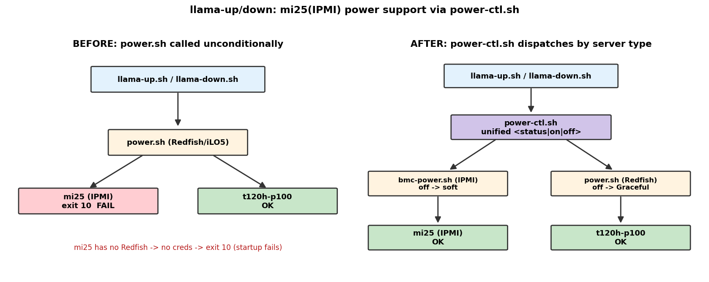

# llama-up/down を mi25(IPMI)対応に — power-ctl.sh 導入

- **実施日時**: 2026年6月19日 06:21 (JST)

## 添付ファイル

- [実装プラン](attachment/2026-06-19_062123_llama_up_down_mi25_ipmi_support/plan.md)

## 核心発見サマリ



llama-server の統合起動/停止スクリプト `llama-up.sh` / `llama-down.sh` が **mi25(Supermicro/IPMI機)で動かない**問題を修正した。原因は電源制御に HPE iLO5/Redfish 専用の `power.sh` を**無条件**で呼んでおり、Redfish 非対応の mi25 では認証情報なしで **exit 10** で失敗していたこと。電源抽象化ディスパッチャ `power-ctl.sh` を新設し、サーバ種別(IPMI/Redfish)を自動判別して `bmc-power.sh`(IPMI)/`power.sh`(Redfish)へ振り分ける構成にした。

1. **新規 `power-ctl.sh <server> <status|on|off>`** が単一の真実源としてサーバ種別を判定。`status` は backend 差異(`On/Off` vs `on/off`)を吸収し **stdout に `On`/`Off`/`Unknown` の1語だけ**を返す(生出力は stderr)。`off` は **グレースフルに統一**(HPE=`power.sh off`=Redfish GracefulShutdown / Supermicro=`bmc-power.sh soft`=ACPI)。Supermicro のハード即時断(`bmc-power.sh off`、FS破損リスク)は使わない。

2. **mi25 実機で全検証パス**: 電源offから `llama-up.sh mi25` が **当初 exit 10 で止まっていた電源確認ステップを通過**し、電源ON→SSH疎通→ビルド→モデルロード→`/health` 200 まで完走(下表)。

3. **t120h-p100 は無停止で回帰確認**: 使用中のため電源を触らず、`power-ctl.sh t120h-p100 status` の読み取りのみで hpe 分岐が従来どおり `On` を返すことを確認。`on`/`off` は `power.sh` をそのまま委譲するためロジック不変。

## 前提・目的

- **背景**: 本セッションで mi25 を起動し `llama-up.sh` を実行したところ、最初の電源確認ステップで `power.sh` が exit 10(iLO認証情報未設定)で失敗した。mi25 は Supermicro X10DRG-Q で Redfish が DCMS ライセンス未活性のため使えず、電源制御は IPMI(`bmc-power.sh`)で行う必要がある([BMC緊急操作](../.claude/skills/gpu-server/bmc.md))。
- **目的**: `llama-up.sh` / `llama-down.sh` を mi25(IPMI)と t120h-p100(iLO5)の両対応にし、mi25 でも統合スクリプトで起動・停止できるようにする。
- **前提条件**: mi25 利用可。t120h-p100 は他セッションで使用中のため**電源・llama-server に触れない**(読み取りの `status` のみ)。

## 環境情報

- **作業対象**: ローカルリポジトリ `/home/ubuntu/projects/llm-server-ops` の `.claude/skills/` スクリプト群
- **検証サーバ**: mi25(10.1.4.13、Supermicro X10DRG-Q、BMC 10.1.4.7 IPMI)。実機で起動(電源off→on)・グレースフル停止(soft)を実施
- **モデル**: `unsloth/Qwen3.6-35B-A3B-GGUF:UD-Q4_K_XL`、ctx=131072(3枚48GB に収まる)
- **参照のみ**: t120h-p100(10.1.4.14、HPE iLO5、BMC 10.1.4.8 Redfish)

## 変更内容

| ファイル | 変更 |
|---------|------|
| `gpu-server/scripts/power-ctl.sh` | **新規**。`<status\|on\|off>` ディスパッチャ。`server_type()` で種別判定、status 正規化、off→soft(supermicro)マップ、下位 exit 伝播 |
| `llama-server/scripts/llama-up.sh` | 電源 status/on の `power.sh` 呼び出しを `power-ctl.sh` に差し替え。status パースを `On/Off` 一致判定に簡潔化(39行の生 echo 削除) |
| `llama-server/scripts/llama-down.sh` | 電源 off の `power.sh` 呼び出しを `power-ctl.sh off`(グレースフル)に差し替え。ヘッダコメント更新 |
| `gpu-server/scripts/install-global.sh` | `PERM_SCRIPTS` に `power-ctl.sh` を追加(グローバルインストール時の allowlist) |
| `gpu-server/SKILL.md` / `gpu-server/bmc.md` / `llama-server/SKILL.md` | `power-ctl.sh` の説明・両対応・off→soft マップを追記 |

### 設計の要点(実装の落とし穴)

- **pipefail 対策**: `set -euo pipefail` 下で status 正規化の `grep -oiE 'on|off'` がマッチ0件だと pipefail でパイプ全体が非ゼロになり代入が落ちる。`|| true` は**パイプライン末尾(`tail` の後)**に置く。
- **下位 exit の伝播**: `OUT="$(bmc-power.sh status)"` をトップレベル代入(関数内 `local` 不使用)にすることで、下位の exit 10/3 を set -e でそのまま伝播させ、`llama-up.sh` が誤起動せず停止するようにした。

## 検証結果

| # | 検証 | 結果 |
|---|------|------|
| 1a | `power-ctl.sh mi25 status` | **OK** stdout=`On`(1語、`cat -A`で確認)、stderr=`mi25: System Power: on` |
| 1b | `power-ctl.sh t120h-p100 status`(無停止) | **OK** stdout=`On`、stderr=`t120h-p100: 電源状態 = On`(電源不変) |
| 2 | `llama-down.sh mi25`(グレースフル停止) | **OK** Step4 が `bmc-power.sh soft`(=「ACPI ソフトシャットダウンを要求しました」)を呼ぶ。ハード off でない。`bmc-power.sh status` が `off` |
| 3 | `llama-up.sh mi25`(電源offから起動) | **OK** Step1 `Off`判定 → 電源ON → SSH疎通(18/60) → build(差分なし) → モデルロード → `/health` **200**。**当初の exit 10 が解消** |
| 4 | t120h-p100 回帰 | **OK** 1b の status 読み取りで確認(電源・llama-server には触れず) |
| 5 | 異常系(認証未設定) | **OK** `GPU_SERVER_ENV` 空で `power-ctl.sh mi25 status` が **exit 10** + `bmc-setup.sh` 案内(stderr) |

## 再現方法

```bash
# 1. status 正規化(読み取りのみ・電源不変)
.claude/skills/gpu-server/scripts/power-ctl.sh mi25 status          # → On / Off の1語
.claude/skills/gpu-server/scripts/power-ctl.sh t120h-p100 status    # → 同上

# 2. mi25 を電源offから統合起動(ロックはサーバ起動後に取得)
.claude/skills/llama-server/scripts/llama-up.sh mi25 \
  "unsloth/Qwen3.6-35B-A3B-GGUF:UD-Q4_K_XL" 131072

# 3. mi25 をグレースフル停止(内部で bmc-power.sh soft)
.claude/skills/llama-server/scripts/llama-down.sh mi25

# 異常系: 認証未設定で exit 10
: > /tmp/empty_env
GPU_SERVER_ENV=/tmp/empty_env .claude/skills/gpu-server/scripts/power-ctl.sh mi25 status; echo $?
```

## 結論・対応

- **mi25(IPMI)で `llama-up.sh` / `llama-down.sh` が動作するようになった**。電源制御は `power-ctl.sh` がサーバ種別を自動判別するため、呼び出し側はサーバを意識しない。
- グレースフル停止を全機種で統一(Supermicro は `soft`、HPE は GracefulShutdown)し、ハード断による FS 破損リスクを排した。
- t120h-m10 は BMC 方式未確認のため既定 `hpe` に倒している(認証未設定なら exit 10 で安全に失敗)。判明後に `power-ctl.sh` の `server_type()` を更新する。

## 既知の課題・今後

- **ロック取得とサーバoffの制約**: `lock.sh` はロックファイルをサーバ `/tmp` に SSH で作るため、サーバ電源off時はロック取得不可。電源offから `llama-up.sh` で起動する場合はロックなしで起動し、起動後に `lock.sh` で取得する運用になる(`llama-up.sh` 自体はロックを取得しない仕様)。
- **t120h-m10 の電源方式が未検証**。`power-ctl.sh` の case を確定させるには実機確認が必要。
- ttyd(7681/7682)が LISTEN しない WARNING は本変更と無関係(監視UIのみ、本体起動には影響なし)。

## 参照

- [mi25 BMC緊急操作 / トランスポート使い分け](../.claude/skills/gpu-server/bmc.md)
- [mi25 4枚目MI25脱落の原因究明](2026-06-14_131713_mi25_gpu4_pcie_dropout.md)(mi25 が3枚48GB で稼働する背景)
