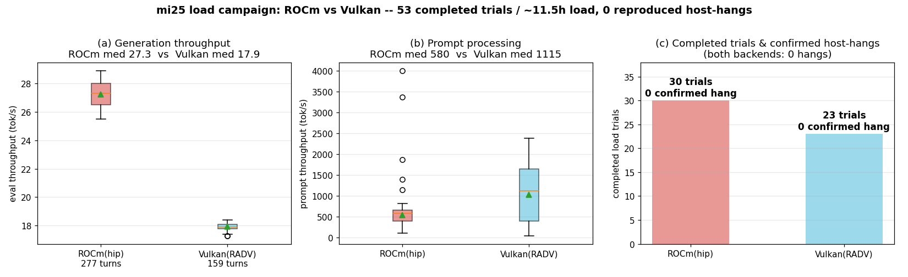
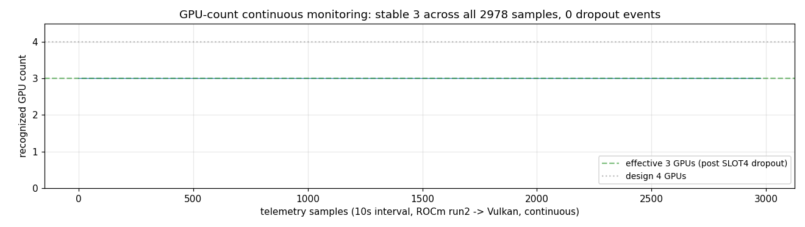

# mi25 ハング再現負荷試験: ROCm/Vulkan 53試行で再現せず

- **実施日時**: 2026年6月23日 08:31 〜 6月24日 16:13 (JST)

## 添付ファイル

- [実装プラン](attachment/2026-06-24_161909_mi25_hang_repro_load_campaign/plan.md)
- [負荷ドライバ load_driver.py](attachment/2026-06-24_161909_mi25_hang_repro_load_campaign/load_driver.py)
- [オーケストレータ run_campaign.sh](attachment/2026-06-24_161909_mi25_hang_repro_load_campaign/run_campaign.sh)
- [テレメトリ telemetry.sh](attachment/2026-06-24_161909_mi25_hang_repro_load_campaign/telemetry.sh)
- [解析スクリプト analyze.py](attachment/2026-06-24_161909_mi25_hang_repro_load_campaign/analyze.py)
- [集計値 analysis_summary.json](attachment/2026-06-24_161909_mi25_hang_repro_load_campaign/analysis_summary.json)
- [ブート状態ログ boot_state.log](attachment/2026-06-24_161909_mi25_hang_repro_load_campaign/boot_state.log)
- キャンペーンログ: [ROCm run1](attachment/2026-06-24_161909_mi25_hang_repro_load_campaign/campaign_hip_run1.log) / [ROCm run2](attachment/2026-06-24_161909_mi25_hang_repro_load_campaign/campaign_hip_run2.log) / [Vulkan](attachment/2026-06-24_161909_mi25_hang_repro_load_campaign/campaign_vulkan.log)

## 核心発見サマリ





opencode feature-bench(run_id=m31) 実行中に mi25 が起こした全体ハードハングの**再現性・発生条件・
カーネル signature** を統計的に特定するため、opencode の build フェーズを模した合成連続推論負荷を
**ROCm(hip) → Vulkan(RADV) の2バックエンド**で反復投入した。**合計53完走試行・約11.5時間の実負荷**の
結果、決定的な発見は以下のとおり:

1. **元のハングは負荷では再現しなかった**。確定ホストハング(三点死＋BMC生存)は **ROCm 30完走試行・
   Vulkan 23完走試行のいずれでもゼロ**。カーネルの危険 signature（GPU reset / ring timeout /
   VM page fault / PCIe AER / soft lockup / panic / call trace）も**全期間で実数0**だった。とくに
   **ROCm試行は最大 14,765 トークン(run1)/14,300(run2) まで到達し、元ハングの 15.0K context 地点と
   ほぼ同等のcontext領域を踏破**しながら再現しなかった（後述の限界に Vulkan の到達域あり）。

2. **唯一の「ハング様」事象(ROCm run1 trial 7)は、元のハングと signature が異なる**。この事象では
   `/health=000`・ping不達・ssh不達の三点死に加えて、**BMC(10.1.4.7)自体も制御ホストから到達不能**
   （`No route to host` / IPMIセッション確立不可）だった。元のopencodeハングは **BMC生存・電源ON確認可**
   で「ホストのみ死」だったのに対し、本事象は **BMC を含む mi25 拠点(10.1.4.x)全体への経路喪失**であり、
   **制御ホスト↔mi25拠点間のネットワーク/経路障害**と整合する（ホスト自身は生存の可能性が高い）。当時の
   v1ドライバは三点死を一律ハング判定したため誤って HANG 確定したが、これが後述の **v2検出器（BMC＋
   拠点参照による弁別）導入の直接の動機**になった。v2検出器下の47完走試行(run2 24＋Vulkan 23)では、
   ホストハングもネットワーク障害分類イベントも**ゼロ**。

3. **GPU枚数・PCIeリンクとも全期間で安定**（物理層仮説を補強）。GPU枚数は全 3,303 テレメトリサンプル
   (run1 325＋run2/Vulkan 2,978)で実効3枚を維持し、追加脱落(3→2 等)は皆無（図2）。各ブートで power cap も
   160.0W×3 で不変。さらに**生存3枚の PCIe リンクは全 rocm-smi サンプルを通じて `8.0GT/s x16` 一定**で、
   リンク幅・速度の揺らぎは一度も観測されなかった。**障害が発現していない窓では生存カードのリンクは
   完全に安定**しており、ハングが間欠的なPCIe物理層事象であるという解釈と整合する。

4. **温度・電力にハング相関の異常スパイクなし**（プラン解析軸）。ROCm は eval 負荷が高い分 Vulkan より
   明確に高温（junction max 82℃ / memory(HBM2) max 87℃ vs Vulkan 63℃ / 52℃）だが、いずれも Vega10 の
   上限内でスロットリング兆候なし。瞬時電力は両backendとも cap(160W) を瞬間的に超過(ROCm 171W / Vulkan
   175W)するがピーク100%使用率・sclk 1500MHz ブースト時の一過性で、ハングとの相関は認められない。

5. **スループットは既知の ROCm/Vulkan 特性を再確認**（図1a/1b）: eval は ROCm 中央値 **27.3 t/s** が
   Vulkan **17.9 t/s** を上回る（Vulkan/ROCm≈0.66）一方、prompt processing は Vulkan 中央値 **1115 t/s**
   が ROCm **580 t/s** の約1.9倍。[既存メモ](../2026-06-18_084557_mi25_vulkan_param_sweep.md)の
   「prompt 速い/eval 遅い」傾向と一致。

**結論**: 元の opencode ハングは「**連続推論負荷で決定論的に誘発される事象ではない**」。ROCm固有でも
なく（Vulkanでも誘発されず）、最有力解釈は **SLOT4 PCIe物理層障害に代表される確率的・間欠的な
ハードウェア事象**である。負荷の継続そのものはトリガではないため、再発防止は負荷側のチューニングでは
なく**物理層(SLOT4の再装着・配線)の是正**に向かうべき。

## 前提・目的

### 背景

opencode feature-bench(run_id=m31) の trial 2 build フェーズ実行中、mi25 が全体ハードハングした
（BMC電源ONだが ping/SSH不達・llama `/health=000`）。元レポート:
`http://10.1.6.4:5032/opencode/report/2026-06-21_232002_feature_bench_m31p100.md/raw`。

事象の要点:
- 構成: `unsloth/Qwen3.6-35B-A3B-GGUF:UD-Q4_K_XL` / 131072 ctx / **ROCm(hip)**（pin `0fac87b15`、ub=2048/FA）。
- ハング時の **context は 15.0K(11%) と小さく**、フルコンテキスト枯渇ではなかった。
- 起動時に「**実効 GPU 3枚/期待4枚・GPU脱落の可能性**」警告。最有力原因は
  [SLOT4 の PCIe物理層障害(既知)](../2026-06-19_015028_mi25_coldcycle_3card_recovery.md)と整合する
  GPUドライバ起因のカーネルハングと推定されていた。

### 目的

mi25 に opencode 利用を模した連続推論負荷を反復投入し、ハングの**再現性・発生条件・カーネル
signature** を統計的に特定する。試験後は mi25 をシャットダウンする。

### 確定方針（ユーザ確認済み）

1. バックエンド: **ROCm → Vulkan の2フェーズ比較**（「ROCm固有か」を切り分け）。
2. 1試行の負荷: **実ワークロード相当（約12分/試行の連続推論, TRIAL_SEC=720）**。
3. ハング時: **KVMスクショ→BMCリセット→復帰→継続**（統計重視。発生率・条件・時間分布を採取）。

> opencode ハーネス本体は本機に無いため、OpenAI互換API へ build フェーズを模した合成負荷（Rails の
> search/pagination/disk-usage 実装を周回する多ターンのコーディング会話）を用いた。GPU/ドライバ起因
> ハングに効く変数は「連続推論の継続」であり、合成負荷で再現条件を突けると判断した。

## 環境情報

- **サーバ**: mi25 (10.1.4.13) / Supermicro X10DRG-Q
- **GPU**: AMD Vega10 (Instinct MI25/V320 系) — 設計4枚・**実効3枚(48GB)**。SLOT4(00:03) が PCIe
  リンク死(PresDet-/x0)で脱落（[既知・遠隔修復不可](../2026-06-19_015028_mi25_coldcycle_3card_recovery.md)）。
- **BMC**: 10.1.4.7 (ATEN/AMI, FW3.94)。**IPMI(ipmitool)のみ**（RedfishはDCMSライセンス未活性で不可）。
- **モデル**: `unsloth/Qwen3.6-35B-A3B-GGUF:UD-Q4_K_XL` / ctx=131072 / ub=2048 / `--flash-attn 1`
- **サンプラ**: temperature=0.6, top_p=0.95, top_k=20, min_p=0（bench と同一）
- **バックエンド**:
  - ROCm(hip): commit **`0fac87b15` に pin**（元ハング発生commitと一致＝忠実再現）
  - Vulkan(RADV): master追従ビルド（build-vulkan/）
- **制御ホスト**: 本機。負荷・計測・電源制御をすべてここから実行し、全ログをローカル保存
  （mi25 freeze 時もフリーズ直前までのデータが残る）。
- **root fs**: `/dev/nvme0n1p2 / ext4`（全ブートで健全・read-only 再マウントなし）

## 試験方法

### アーキテクチャ

```
[制御ホスト] --HTTP(負荷)--> mi25:8000/v1        (load_driver.py)
            --SSH(計測10s毎/dmesg常時)--> mi25    (telemetry.sh → ローカル追記)
            --IPMI(電源/KVM)--> 10.1.4.7         (bmc-power.sh / bmc-screenshot.sh)
```

### 負荷ドライバ（合成 opencode 負荷）

`load_driver.py`: 1試行＝多ターンのコーディング会話。Rails の search/pagination/disk-usage 実装指示を
周回し、assistant 出力を会話に積んで context を成長させながら、1試行 wall-clock が 720秒に達するまで
連続推論。Qwen3.6 thinking の `reasoning_content` も会話に積む。各ターンを JSONL 記録。

### ハング三点確認＋拠点弁別（v2検出器の肝）

ストリーミングのチャンク間タイムアウト等で停止を検知したら `health + ping + ssh` の三点を確認。
三点死の場合、**BMC到達性と mi25拠点参照(10.1.5.1 / 10.1.1.1)で原因を弁別**する:

- **BMC到達可 かつ 拠点参照到達可** → 拠点NWとBMCは生存・ホストのみ死 = **真のホストハング**(rc42)
- **BMC不達 または 拠点参照全滅** → 拠点/経路のネットワーク障害(ホスト生存の可能性大) = **NETWORK**(rc43,
  リセットせず回復待機)

> ※ 制御ホストと同拠点の参照(例 10.1.6.4)は mi25拠点側の障害を検出できないため使わない。この弁別が
> 無かった v1 では run1 trial7 を誤ってホストハング判定した（核心発見2）。

### キャンペーン構成

| フェーズ | 期間(JST) | パラメータ | 結果 |
|---------|-----------|-----------|------|
| ROCm run1 | 06-23 08:31〜10:12 | MAX30/MIN10/CAP21600/TRIAL720 (v1検出器) | 6完走 → trial7で経路喪失事象(09:55検知→rc9中断10:12) |
| ROCm run2 | 06-24 05:50〜10:53 | MAX24/MIN4/CAP18000/TRIAL720 (v2検出器) | **24完走・hang 0**（MAX到達で終了） |
| Vulkan | 06-24 11:12〜16:13 | MAX24/MIN4/CAP18000/TRIAL720 (v2検出器) | **23完走・hang 0**（5h CAP到達で終了） |

## 結果

### 再現性・異常イベント

| 指標 | ROCm(hip) | Vulkan(RADV) |
|------|-----------|--------------|
| 完走試行数 | **30**（run1 6 ＋ run2 24） | **23** |
| 確定ホストハング(rc42) | **0** | **0** |
| ネットワーク障害分類(rc43) | 0（v2下） | 0 |
| 推論ターン総数 | 277 | 159 |
| 生成トークン累計 | 536,582 | 311,563 |
| eval t/s 中央値 | **27.3** | **17.9** |
| prompt t/s 中央値 | **580** | **1,115** |
| カーネル危険signature | 0 | 0 |

> run1 の異常2件(stall＋HANG_CONFIRMED)は同一事象(trial7 turn2)で、**v1検出器の誤判定**。当時BMCも
> 到達不能で remote 復旧不能(rc9)だったが、これは「ホストのみ死＝真ハング」ではなく拠点経路喪失の
> signature（核心発見2）。

### ブート状態テーブル（認識枚数・power cap）

| boot | 日時(JST) | reset種別 | backend | 認識GPU | power cap | 後続ハング |
|------|-----------|-----------|---------|---------|-----------|-----------|
| 初回 | 06-23 08:18 | power-on | hip | 3 | 160.0W×3 | なし(6完走後に経路喪失) |
| run2 | 06-24 05:50 | phase-start | hip | 3 | 160.0W×3 | なし(24完走) |
| 移行 | 06-24 11:01 | cold power-on | vulkan | 3 | 160.0W×3 | なし |
| Vulkan | 06-24 11:12 | phase-start | vulkan | 3 | 160.0W×3 | なし(23完走) |

全ブートで **3枚・160.0W で不変**。試験中の GPU枚数テレメトリ(10s毎・計3,303サンプル＝run1 325＋
run2/Vulkan 2,978。rocm-smi 詳細テレメトリの 3,001 エポックとは別ストリーム)でも 3枚から変動なし。

### スループット参考値

- **ROCm**: eval 中央値 27.3 t/s（範囲約25.5〜28.5）、prompt 中央値 580 t/s。
- **Vulkan**: eval 中央値 17.9 t/s（帯域上限で頭打ち・分散小）、prompt 中央値 1,115 t/s（context成長で
  724→1418 t/s と上昇）。
- 既存メモの「Vulkan は prompt 速い/eval 遅い」傾向（[param sweep](../2026-06-18_084557_mi25_vulkan_param_sweep.md)）を再確認。

### 到達コンテキスト量（元ハングの 15.0K 地点との対比）

1試行 = 新規会話を 720秒ぶん連続生成し、context を積み上げる方式。到達した最大 prompt_tokens は:

| backend | 1試行あたり最大 prompt_tokens | 平均 | 最大ターン数 | 元ハング(15.0K)領域の踏破 |
|---------|------------------------------|------|-------------|--------------------------|
| ROCm run1 | 14,765 | 11,383 | 10 | **ほぼ到達** |
| ROCm run2 | 14,300 | 13,014 | 10 | **ほぼ到達** |
| Vulkan | 10,016 | 9,566 | 7 | **未到達**（eval遅で720s内の生成量が少ない） |

ROCm は元ハングと同等の context 領域を踏みながら再現しなかった点で再現試験として十分。一方 **Vulkan は
15K 領域に達しておらず**、Vulkan の「再現せず」は元ハングの正確な context 条件では未検証（後述の限界）。

### テレメトリ（温度・電力・PCIe リンク）

10秒毎の rocm-smi サンプル（run2＋Vulkan で計3,001エポック・GPU別9,000弱の測定点）を解析。

| 指標 | ROCm | Vulkan | 備考 |
|------|------|--------|------|
| junction 温度 max | 82℃ | 63℃ | 中央値 ROCm 49 / Vulkan 43℃ |
| memory(HBM2) 温度 max | **87℃** | 52℃ | Vega10 上限内・スロットリングなし |
| 瞬時電力 max | 171W | 175W | cap=160W を**瞬間的に超過**（ピーク使用率時の一過性） |
| 瞬時電力 中央値 | 44W | 17W | ターン間アイドルを含む |
| GPU使用率 max / sclk max | 100% / 1500MHz | 同左 | eval 時にフルロード・最大ブースト到達 |
| **PCIe リンク** | **8.0GT/s x16 一定** | **8.0GT/s x16 一定** | 全サンプルで揺らぎ0（生存3枚） |

- **PCIe リンクは全期間 `8.0GT/s x16` で不変**。生存3枚に関する限りリンク劣化・幅低下は皆無で、
  「障害が出ていない窓ではリンクは安定」という間欠故障像と整合（核心発見3）。
- ROCm は eval 連続演算で Vulkan より高温（HBM2 87℃）だが上限内。**温度・電力にハングと相関する異常
  スパイクは観測されず**、熱/電力起因のトリガは認められない。

## 考察・結論

- **負荷誘発仮説は棄却的**: ROCm固有commit(`0fac87b15`)を忠実再現した30完走試行でも、Vulkan 23完走
  試行でも、元ハングは再現しなかった。ROCm 試行は元ハングと同等の **~14.8K context 領域まで踏破**して
  いるため、context 成長・連続推論の継続はトリガではないと言える。
- **元ハングの最有力解釈は確率的・間欠的なPCIe物理層事象**: 元レポートの「実効3枚・GPU脱落の可能性」
  警告と、SLOT4 PCIeリンク死(既知)を踏まえると、ハングは負荷の関数ではなく**物理層障害の確率的発現**
  と整合する。とくに**生存3枚のPCIeリンクが全期間 `8.0GT/s x16` で不変・温度/電力に異常スパイクなし**
  という所見は、「障害が出ていない窓は完全に安定」という間欠故障像を裏付ける。今回の試験窓(約11.5時間)
  ではその確率事象を引けなかった、と解釈するのが自然。
- **ROCm固有ではない（ただし限界あり）**: Vulkanでも誘発されないため、特定バックエンドのソフトウェア
  欠陥に帰せる証拠は得られなかった。**ただし Vulkan は eval が遅く 720s/試行では最大10K tokens 止まり**
  で、元ハングの 15.0K context 領域には到達していない。Vulkan アームは「同領域での非再現」までは主張
  できず、より長い TRIAL_SEC か明示的な context プリロードで 15K 超を踏ませる追試が望ましい。
- **検出器の教訓**: run1 trial7 のように「三点死だがBMCも不達」のケースは**ネットワーク経路障害**であり、
  ホストハングと弁別すべき。BMC＋拠点参照を弁別子に入れた v2 検出器は、47完走試行で誤検出・誤リセット
  ゼロで機能した。

**再発防止の方向性**: 負荷側チューニングではなく、**SLOT4 の物理再装着・配線是正**（遠隔不可・要現地）。
3枚48GB構成でも当該モデルは収まるため運用継続は可能。

**残課題（追試案）**: Vulkan で 15K 超 context を踏ませる（TRIAL_SEC 拡大 or 長文プリロード）と、再現
試験としての backend 非依存性の主張が完全になる。

## 再現方法

```bash
# 制御ホストの scratchpad に下記を配置（添付参照）
#   load_driver.py / telemetry.sh / run_campaign.sh / analyze.py

# 1) 電源ON・ロック・llama起動（ROCmはpin 0fac87b15で忠実再現）
.claude/skills/gpu-server/scripts/bmc-power.sh mi25 on        # SSH疎通まで待機
.claude/skills/gpu-server/scripts/unlock.sh mi25 && .claude/skills/gpu-server/scripts/lock.sh mi25
.claude/skills/llama-server/scripts/llama-up.sh mi25 "unsloth/Qwen3.6-35B-A3B-GGUF:UD-Q4_K_XL" 131072

# 2) ROCm キャンペーン（実走値: max24/min4/cap18000/trial720s）
MAX_TRIALS=24 MIN_TRIALS=4 PHASE_CAP_SEC=18000 TRIAL_SEC=720 bash run_campaign.sh hip

# 3) Vulkan へ切替（down→cold power-on→lock→up→campaign）
.claude/skills/llama-server/scripts/llama-down.sh mi25
.claude/skills/gpu-server/scripts/bmc-power.sh mi25 on
.claude/skills/gpu-server/scripts/unlock.sh mi25 && .claude/skills/gpu-server/scripts/lock.sh mi25
MI25_BACKEND=vulkan .claude/skills/llama-server/scripts/llama-up.sh mi25 "unsloth/Qwen3.6-35B-A3B-GGUF:UD-Q4_K_XL" 131072
MAX_TRIALS=24 MIN_TRIALS=4 PHASE_CAP_SEC=18000 TRIAL_SEC=720 MI25_BACKEND=vulkan bash run_campaign.sh vulkan

# 4) 解析・図生成
python3 analyze.py    # fig_summary.png / fig_gpucount.png / analysis_summary.json

# 5) シャットダウン
.claude/skills/llama-server/scripts/llama-down.sh mi25
.claude/skills/gpu-server/scripts/bmc-power.sh mi25 status   # Off 確認
.claude/skills/gpu-server/scripts/unlock.sh mi25
```

## 参照した過去レポート

- [mi25 コールド電源サイクルで3枚復帰(SLOT8回復・SLOT4不可逆)](../2026-06-19_015028_mi25_coldcycle_3card_recovery.md)
- [mi25 Vulkan eval パラメータ探索(改善不可・帯域上限)](../2026-06-18_084557_mi25_vulkan_param_sweep.md)
- [start.sh の GPU 可視性自動検出化](../2026-06-20_052841_start_sh_gpu_visibility_autodetect.md)
