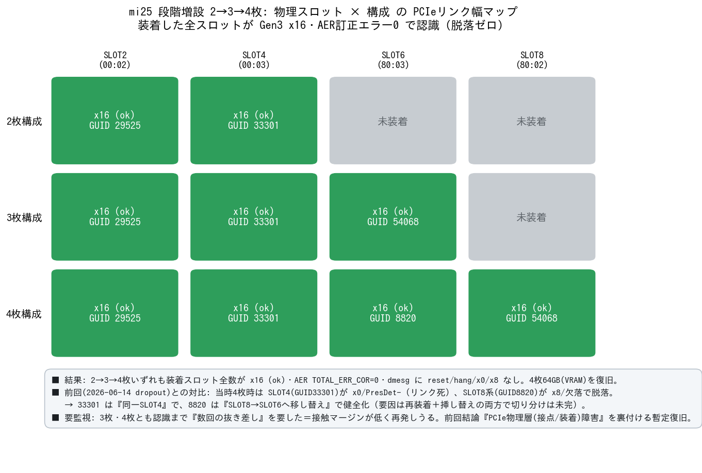

# mi25 MI25 4枚を全認識で復旧 — 物理再装着でPCIe脱落解消（要監視）

実施日時: 2026年6月25日 06:32 (JST)

## 添付ファイル

- プラン: [plan.md](attachment/2026-06-25_063238_mi25_4card_recovery/plan.md)
- 収集データ（生ログ要約）: [data.md](attachment/2026-06-25_063238_mi25_4card_recovery/data.md)
- 核心サマリPNG生成スクリプト: [make_assets.py](attachment/2026-06-25_063238_mi25_4card_recovery/make_assets.py)

## 核心発見サマリ



[前回 dropout レポート](2026-06-14_131713_mi25_gpu4_pcie_dropout.md) で「MI25 4枚目の脱落は **PCIe 物理層障害（接点/ライザー/装着）であり、遠隔修復不可・物理ハンズオン（再装着・配線点検・カード入れ替え）が必要**」と結論づけた件について、実機で **シャットダウン → 2枚 → 3枚 → 4枚** と段階的に物理装着し、各構成を網羅調査した。

1. **4枚すべてが Gen3 x16・AER訂正エラー0 で認識され、64GB VRAM が復旧**。2枚・3枚・4枚いずれの構成でも、装着したスロット全数が `Width x16 (ok)`・`TOTAL_ERR_COR=0`・dmesg に reset/hang/x0/x8 なしで完全に健全だった。前回（4枚装着を試みた際）に頻発した脱落（`x0`/`PresDet-`、当時は実効3枚）は **再現しなかった**。

2. **前回の障害常連カードが健全化**。前回 SLOT4 で13ブート中12回リンク死していた **GUID 33301 は今回も同一 SLOT4 で x16 健全**。前回 SLOT8 で x8/欠落だった **GUID 8820 は SLOT6 へ移し替えた上で x16 健全**。→ 改善要因は「**同一接点の再装着**」と「**カードの挿し替え**」の両方が混在し、特定スロット起因かカード起因かの**切り分けは未完**。

3. **ただし「解消したが要監視」**。ユーザ報告のとおり **3枚・4枚を認識させるには、認識するまで数回の抜き差しが必要だった**。これは接触マージンが低く再発しうることを示し、前回結論「PCIe 物理層（接点/装着）障害」を裏付ける。本復旧は**恒久解決ではなく暫定復旧**と位置づけ、経過観察（特に長時間稼働・高負荷・再起動後の再列挙）を要する。

4. **MMIO は全構成で非問題**。VRAM の 16GB BAR は全カード `size=16G` で正常割当（2枚時は3TB台、3/4枚時は56TB台へ窓位置が移動するが、いずれも物理アドレス空間内）。[MMIO 512GB 設定](2026-06-13_112006_mi25_qwen36_128k.md) は維持されており、枚数増加による BAR 割当失敗・再配置の兆候はなかった。

## 前提・目的

- **背景**: [mi25 4枚目MI25脱落レポート](2026-06-14_131713_mi25_gpu4_pcie_dropout.md) で、4枚目の脱落原因を PCIe 物理層障害と確定し、遠隔（電源サイクル・BIOS）では修復不可能・物理ハンズオンが必要と結論づけていた。SLOT4(`00:03`, GUID 33301) が支配的な脱落要因、SLOT8(`80:02`, GUID 8820) が限界気味とされていた。
- **目的**: ユーザが実機で物理対応（シャットダウン後の再装着・段階的増設）を行うのに合わせ、2→3→4枚の各構成で GPU 認識・PCIe リンク幅・エラー状態を網羅調査し、前回仮説（物理対応で復旧可能か）を検証する。
- **前提条件**: mi25 が利用可能。本作業は LLM・リモートブラウザを使用しない**読み取り専用の確認**のため、`gpu-server` ロックは不要（CLAUDE.md の区分に従う）。物理作業（電源 OFF/ON・カード装着）はユーザが実施。

## 環境情報

| 項目 | 値 |
|------|-----|
| 機種 | Supermicro **SYS-7048GR-TR** / M/B **X10DRG-Q** |
| BIOS | American Megatrends Inc. **Ver 3.2**（2019-11-22） |
| CPU | Intel Xeon **E5-2620 v3** ×2（各6コア/12スレッド、デュアルソケット＝2 NUMA ノード） |
| OS | Ubuntu **22.04.5 LTS** / kernel **5.15.0-181-generic** |
| ROCm | **6.2.2-116**（/opt/rocm-6.2.2） |
| GPU（全枚共通） | gfx900 / 64CU / VRAM 16368M / **MEM ECC active** |

### スロット↔ルートポート↔GUID 対応

ルートポートのデバイス番号は物理固定（`dmidecode -t slot` の Bus Address と `lspci -tv` の照合で確定）。

| 物理スロット | ルートポート | 2枚 | 3枚 | 4枚 |
|---|---|---|---|---|
| CPU1 SLOT2 | `00:02.0` | 29525 | 29525 | 29525 |
| CPU1 SLOT4 | `00:03.0` | 33301 | 33301 | 33301 |
| CPU2 SLOT6 | `80:03.0` | — | 54068 | 8820 |
| CPU2 SLOT8 | `80:02.0` | — | — | 54068 |

※ 4枚時に SLOT6/SLOT8 のカード配置が3枚時から入れ替わっている（54068 が SLOT6→SLOT8、新規 8820 が SLOT6）。これは「認識まで数回の抜き差し」を要した物理作業の反映。

### カード素性・ドライバ（参考）

- **VBIOS / SKU / Subsystem**: 観測した範囲で全カード同一 — **VBIOS `113-D0513700-001`**、**Card SKU `D0513700`**、**Subsystem `Radeon PRO V320`**。同一モデル/ロットと見られる。
- **シリアル番号は取得不可**（`get_serial_number, Not supported`）。**個体識別は GUID のみ**で、シリアルによるカード追跡ができない。これは後述の「スロット固有 vs カード個体」の切り分けを難しくする一因。
- **ドライバ**: amdgpu は **out-of-tree（amdkcl, kernel taint）**。kernel cmdline は `ro` のみで amdgpu 特殊パラメータなし。
- **ECC**: 全カード `MEM ECC is active` / `SRAM ECC is not presented`。
- **idle 状態（参考）**: sclk 852 / mclk 167 / socclk 600 MHz、PwrCap 160W、Fan 9.41%。

## 調査詳細

各構成とも、ユーザの電源投入後に以下を収集した（詳細な生ログは [data.md](attachment/2026-06-25_063238_mi25_4card_recovery/data.md)）。

### 構成別の健全性（全構成で完全健全）

| 構成 | 認識 | 装着カード LnkSta | 全ルートポート | AER TOTAL_ERR_COR | dmesg reset/hang/x0/x8 |
|---|---|---|---|---|---|
| 2枚 | 2/2 | x16 Gen3 (ok) | x16・PresDet+ | 0 | なし |
| 3枚 | 3/3 | x16 Gen3 (ok) | x16・PresDet+ | 0 | なし |
| **4枚** | **4/4** | **x16 Gen3 (ok)** | **x16・PresDet+** | **0** | **なし** |

- **VRAM/ECC**: 全カード VRAM 16368M、`MEM ECC is active`。idle 温度 junction 30〜38℃、消費電力 3〜6W で正常。
- **VRAM BAR（MMIO）**: 全カード Region 0 が `size=16G` で正常割当。窓位置は 2枚時 `0x30000000000`（≈3TB）→ 3/4枚時 `0x380000000000`〜`0x384800000000`（≈56TB台）へ枚数に応じて移動するが、いずれも物理アドレス空間内で BAR 割当失敗・再配置は発生せず。
- **VIS_VRAM = 16GB（VRAM 全域が CPU 可視）**: `rocm-smi --showmeminfo all` で VIS_VRAM が VRAM 総量と一致。MI25 が VRAM 全体を 64bit prefetchable Large-BAR で公開していることの直接の裏付けであり、過去の MMIO 不足（4枚分の 16GB BAR を割り当てきれず脱落）の根本がこの Large-BAR にあることを補強する。GTT は約 7.7GB（8317042688 B）。
- **DevSta の表示は良性**: 全 GPU の `lspci -vv` で `DevSta: CorrErr+ UnsupReq+` が立つが、**AER カウンタ `TOTAL_ERR_COR=0`・CESta の実エラービット（RxErr/BadTLP/BadDLLP/Timeout）は全て `-`**（`AdvNonFatalErr+` は mask 済み）。amdgpu 初期化時の VBIOS プローブ由来の良性ステータスで、実害なし。
- **dmesg の良性ログ**: `BAR 6: can't assign ... (bogus alignment)` は expansion ROM、`pnp ... disabling ... overlaps BAR 7` は 64bit pref ウィンドウ重なり処理で、いずれも前回同様の良性。カーネルパニック・AER fatal はなし。
- **NVMe `00:01.0`**: 今回フレッシュブートでは `CESta: CorrErr-`（前回レポートで長時間稼働後に観測された `CorrErr+`/`Timeout+` は良性と再確認）。`Width x4` は x4 SSD のネイティブ幅。
- **GPU間トポロジ（参考・2枚時のみ取得）**: `rocm-smi --showtopo` で GPU 間 weight 40 / hops 2 / Link Type **PCIE**（P2P は PCIe 経由、XGMI なし）。NUMA は2枚時の両 GPU（SLOT2/4＝CPU1 側）がともに **node0**。**4枚時は SLOT6/8 が CPU2 側のため node1 になる**（前回 dropout レポートのスロット対応表より：SLOT2/4=node0、SLOT6/8=node1）。マルチGPU のテンソル分割帯域・NUMA 配置に関わるが、3/4枚での showtopo は未取得。

### 前回障害常連カードの対比（核心）

| カード | 前回（4枚装着を試みた際の観測, dropoutレポート） | 今回4枚時 | スロット変化 |
|---|---|---|---|
| GUID 33301 | SLOT4 で 13ブート中12回 **x0/PresDet-（リンク死）** | **x16 健全** | **同一 SLOT4 で改善** |
| GUID 8820 | SLOT8 で **x8/欠落・不安定** | **x16 健全** | **SLOT8→SLOT6 へ移動して改善** |
| GUID 54068 | 安定スロットの健全カード（当時のスロットは前回レポート未特定） | x16 健全 | →SLOT8 |

**33301 は同一スロットでの再装着により、8820 は別スロットへの挿し替えにより**それぞれ復旧した。改善要因がこの両方に分かれているため、「SLOT8 接点が固有に弱い」のか「カード個体差」なのかは本調査だけでは確定できない。ただし**どちらの場合も物理層（接点・装着）の問題であり、前回結論と矛盾しない**。

### 抜き差しを要した事実（要監視の根拠）

ユーザ報告によれば、**3枚・4枚を認識させる際、OS から全数が見えるまで数回のカード抜き差しが必要**だった。一度安定して列挙された後は、本調査の範囲（idle 観測）では x16・エラー0 を維持しているが、これは接触マージンが低いことを示しており、再起動・高負荷・温度変化で再発する可能性は残る。

この抜き差し作業は**客観ログでも裏付けられる**: `last reboot` / `journalctl --list-boots` に、段階増設を行った時間帯（03:30〜04:32 など）に**短時間ブートが多数**残っている（数分で落ちて再起動を繰り返した痕跡）。なお同ログには 6/23 08:17〜6/24 10:57 の**約26.7時間の連続稼働実績**も残るが、これは**今回の4枚復旧より前（当時の構成）の記録**であり、4枚構成の長期安定性の証拠としては使えない（あくまで本機が長時間連続稼働しうること自体の参考）。

## 再現方法

```bash
# 0. ロック不要（読み取り専用の確認。LLM/リモートブラウザは使わない）

# 1. 物理作業（ユーザ）: 電源OFF → カード装着 → 電源ON
#    認識しない場合は、認識するまでカードを数回抜き差しする

# 2. 認識枚数
ssh mi25 'lspci | grep -c "Instinct MI25"'
ssh mi25 'rocm-smi --showid'

# 3. スロット対応の確定（DMI Bus Address と PCIeツリーを照合）
ssh mi25 'sudo dmidecode -t slot | grep -E "Designation|Current Usage|Bus Address"'
ssh mi25 'lspci -tv | grep -iE "MI25|Vega"'

# 4. 各カードのリンク幅・BAR・エラー
ssh mi25 'sudo lspci -vv -s <bdf> | grep -Ei "LnkSta:|SltSta|Region 0:|DevSta"'
ssh mi25 'cat /sys/bus/pci/devices/0000:<bdf>/aer_dev_correctable | grep TOTAL'

# 5. dmesg の障害痕跡
ssh mi25 'sudo dmesg | grep -iE "amdgpu" | grep -iE "fail|reset|hang|x0|x8|VRAM|ECC"'
```

## 結論・対応

- **結果**: MI25 4枚すべてが Gen3 x16・AER エラー0 で認識され、**64GB VRAM が復旧**（前回は4枚装着しても実効3枚だった）。前回（4枚装着時）の脱落（SLOT4 x0・SLOT8 x8）は再現せず、段階的増設の全構成で健全だった。前回レポートの結論「障害は PCIe 物理層起因で、物理ハンズオン（再装着・配線点検・カード入れ替え）により復旧可能」を**実証**した。
- **位置づけ（要監視）**: ただし **3枚・4枚とも認識まで数回の抜き差しを要した**ため、接触マージンが低く再発しうる。本復旧は**恒久解決ではなく暫定復旧**であり、経過観察を要する。「特定スロット固有の弱さ」か「カード個体差」かは、33301（同一スロットで復旧）と 8820（挿し替えで復旧）の改善経路が分かれているため未確定。
- **推奨フォローアップ**:
  1. **長時間稼働・再起動後の再列挙確認**: 数回のコールド/ウォーム再起動で4枚が安定列挙されるか（`cycle_loop.sh` 等）。
  2. **実負荷での安定性検証**: llama-server で4枚 offload 推論を実行し、高負荷時に脱落・リンク劣化が出ないか（要 `gpu-server` ロック）。本レポートは idle 観測のみのため範囲外。
  3. **接点・配線の恒久対策**: 抜き差しで復旧する＝接点品質が主因のため、可能なら接点清掃・ライザーケーブル点検を実施。
- **当面の運用**: 4枚64GB が利用可能。本番モデル（Qwen3.6 22GB）は余裕で収まる。ただし再起動のたびに認識枚数の確認を推奨。

## 参照レポート

- [mi25 4枚目MI25脱落の原因究明 — PCIe物理層障害と確定](2026-06-14_131713_mi25_gpu4_pcie_dropout.md)（本レポートの直接の前提・続報）
- [mi25 で Qwen3.6-35B-A3B を 128k 実行（ROCm版）](2026-06-13_112006_mi25_qwen36_128k.md)（BIOS MMIO 256→512GB の初出・確定構成）
- [mi25 ハング再現負荷試験（ROCm/Vulkan 53試行）](2026-06-24_161909_mi25_hang_repro_load_campaign.md)（確率的 SLOT4 PCIe 物理層障害の傍証）
