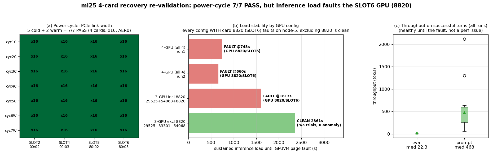

# mi25 4枚復旧の負荷検証 — 電源7/7合格もGPU 8820が負荷でフォルト

実施日時: 2026年6月25日 09:46 (JST)

## 添付ファイル

- [実装プラン](attachment/2026-06-25_094641_mi25_4card_load_gpuvm_fault/plan.md)
- [核心サマリ図生成スクリプト](attachment/2026-06-25_094641_mi25_4card_load_gpuvm_fault/make_summary.py)
- [電源サイクルテストスクリプト](attachment/2026-06-25_094641_mi25_4card_load_gpuvm_fault/cycle_4card.sh)
- [電源サイクル結果ログ](attachment/2026-06-25_094641_mi25_4card_load_gpuvm_fault/cycle_trend.log)
- [収集データ(生ログ要約)](attachment/2026-06-25_094641_mi25_4card_load_gpuvm_fault/data.md)
- フォルト dmesg: [4枚run1](attachment/2026-06-25_094641_mi25_4card_load_gpuvm_fault/crash1_dmesg.txt) / [4枚run2](attachment/2026-06-25_094641_mi25_4card_load_gpuvm_fault/crash2_dmesg.txt) / [3枚+8820](attachment/2026-06-25_094641_mi25_4card_load_gpuvm_fault/crash3_3card_dmesg.txt)

## 核心発見サマリ



[朝の4枚復旧レポート](2026-06-25_063238_mi25_4card_recovery.md) で「物理再装着により4枚 Gen3 x16・AER0 で復旧したが**暫定復旧・要監視**(idle 観測のみ)」とした件について、推奨フォローアップの **①電源サイクルテスト** と **②実負荷テスト** を実施した。

1. **電源サイクルは完全合格(7/7)**。コールド電源サイクル5回 + ウォーム再起動2回のすべてで **4枚が x16・PresDet+・AER0 で再列挙**(GUID 29525/33301/54068/8820)。前回 dropout(13ブート中12回脱落・SLOT4遠隔不可逆)とは劇的に異なり、**物理再装着で再起動耐性は獲得した**ことを実証。

2. **しかし実負荷では GPU 8820(SLOT6 / 87:00.0)が再現性をもって GPUVM page fault を起こす**。`Memory access fault by GPU node-5 ... address 0x100000000 / [gfxhub0] no-retry page fault`(UTCL2)で llama-server が即死。4枚構成で **2/2 再現**(約700秒で発現)、しかも **3枚でも 8820 を含めば発現**(約1613秒)。一方 **8820 を除外した3枚{29525,33301,54068}は3試行(約2361秒)完走・anomaly 0 でクリア**。→ **犯人は GPU 8820 個体(または SLOT6 装着)**で確定。

3. **物理層(PCIe)も熱も正常 = compute/VRAM 層の突然死**。全 run で gpu_count=4、4ルートポート x16・AER cor/fatal=0 を維持。負荷中(405サンプル)の **junction 温度ピークは65℃・電力ピークは164W(160Wキャップ近傍で正常範囲)で熱起因ではない**。フォルト直前のスループットも健全(eval 20〜23・prompt ピーク600 t/s)。つまり PCIe 脱落でも熱暴走でも性能劣化でもなく、**compute/VRAM 層(GPUVM)の突然死**で、SLOT4 が過去に起こした物理層リンク死とは別系統。

4. **副次的発見: 旧 villain 33301(SLOT4)は負荷安定**。過去に遠隔不可逆でリンク死していた 33301 を含む3枚{29525,33301,54068}が負荷で完走した。SLOT4 のカードはむしろ実用レベルに復帰している。

5. **結論: 4枚復旧は「列挙・再起動は安定、実負荷は不安定」**。本番は **8820 を除いた3枚(48GB)で運用可能**(Qwen3.6 22GB は余裕)。**4枚64GB を使うには 8820(SLOT6)への物理対応が必須**。朝の挿し替え(8820 を SLOT8→SLOT6)以降に顕在化したため、8820 の再装着・別スロット移動・カード交換のいずれかが必要。

## 前提・目的

- **背景**: [4枚復旧レポート](2026-06-25_063238_mi25_4card_recovery.md) は idle 観測のみで「暫定復旧・要監視」とし、フォローアップに ①長時間稼働・再起動後の再列挙確認 ②実負荷での安定性検証 を挙げていた。
- **目的**: ①電源サイクル/再起動をまたいで4枚が安定列挙されるか、②4枚 offload 推論の高負荷下で脱落・リンク劣化・ハングが出ないか、を検証する。
- **前提条件**: mi25 利用可能。負荷テストは LLM を使うため `gpu-server` ロックを取得。物理作業は発生しない範囲(電源サイクルは BMC、構成切替は HIP_VISIBLE_DEVICES によるソフト的なデバイスマスク)。

## 環境情報

| 項目 | 値 |
|------|-----|
| 機種 | Supermicro SYS-7048GR-TR / M/B X10DRG-Q / BIOS 3.2 |
| CPU | Intel Xeon E5-2620 v3 ×2(2 NUMA) |
| OS | Ubuntu 22.04.5 / kernel 5.15.0-181 |
| ROCm | 6.2.2-116 |
| GPU | MI25(gfx900)×4、各 VRAM 16368M、MEM ECC active |
| llama.cpp | mi25 pin ビルド(`update_and_build-mi25.sh`)、HEAD は FP8 でビルド不能のため pin |
| モデル | `unsloth/Qwen3.6-35B-A3B-GGUF:UD-Q4_K_XL`、ctx=131072 |
| 起動構成 | `--n-gpu-layers 99 --split-mode layer --flash-attn 1 --poll 0 -b 2048 -ub 2048 --cache-type-k/v q8_0`(skill 既定) |

スロット↔BDF↔GUID↔HIP index↔KFD node の対応は [data.md](attachment/2026-06-25_094641_mi25_4card_load_gpuvm_fault/data.md) を参照(フォルト元 8820 = SLOT6 = 80:03.0 = 87:00.0 = HIP3 = node-5)。

## 調査詳細

### ① 電源サイクルテスト(7/7 合格)

[cycle_4card.sh](attachment/2026-06-25_094641_mi25_4card_load_gpuvm_fault/cycle_4card.sh) で、コールド電源サイクル5回(`bmc-power.sh soft`→電力ドレイン30秒→`on`→SSH復帰→ロック取り直し→採取)+ ウォーム再起動2回(`ssh sudo reboot`)を実施。各サイクルで認識枚数・GUID・4ルートポートの LnkSta/PresDet/AER・dmesg signature を採取。

**全7サイクルで COUNT=4、全ポート x16・8GT/s・PresDet+・AER 全0、dmesg dropout/reset/hang なし**(詳細 [cycle_trend.log](attachment/2026-06-25_094641_mi25_4card_load_gpuvm_fault/cycle_trend.log))。各ブート 電源ON/再起動から約2.3〜2.5分(OS 起動後 約1分)で SSH 復帰し全数即列挙。再起動耐性は獲得済み。

### ② 負荷テスト(GPU 8820 の GPUVM フォルト)

合成連続推論負荷ドライバ([前回キャンペーン](2026-06-24_161909_mi25_hang_repro_load_campaign.md)の `load_driver.py`/`run_campaign.sh`/`telemetry.sh` を再利用、per-card PCIe+AER サンプラを追加)で 4枚 offload に負荷を投入。

- **4枚 run1**: trial 1(7ターン・9785トークン到達)を完走後、trial 2 冒頭で `Memory access fault by GPU node-5`(8820)→ llama-server 即死。約745秒。
- **4枚 run2**: 再起動して再投入 → **同一カード(8820)・同一アドレス(0x100000000)・別プロセス(別 agent handle)で再発**。約660秒。→ **2/2 再現**。

物理層は全期間健全(gpu_count=4、全ポート x16・AER0)、熱も正常(junction ≤65℃・電力 ≤164W)。フォルトは `[gfxhub0] no-retry page fault ... UTCL2`、保護/マッピング/ウォーカー各エラーは全0の純粋なページ不在で、PCIe 脱落とは別系統(compute/VRAM 層)。

**発現タイミングの規則性(機構ヒント)**: サーバログ上、フォルトは毎回「マルチターンで蓄積した文脈の **prompt-cache context-checkpoint を復元 → 短い新規プロンプトを処理 → 直後にフォルト**」という同一パターンで発生(`restored context checkpoint` の直後)。また **枚数が多いほど早く発現**(4枚 約700秒 < 3枚 約1613秒)し、per-card compute が小さい4枚の方が早く落ちる=8820 への P2P/アドレッシング負荷の集中を示唆する。ただし 8820 除外で完全に消えるため、根本は 8820 個体/SLOT6 にある。

### ③ 切り分け(犯人は 8820 個体/SLOT6)

前回(2026-06-24)は **8820 を含む3枚(当時 8820=SLOT8)で24試行完走**していた。今回の変化は「8820 を SLOT8→SLOT6 へ挿し替え」かつ「4枚化」。`HIP_VISIBLE_DEVICES` でデバイスを絞り、どちらが効いているか切り分けた。

| 構成 | 連続負荷 | 結果 |
|---|---|---|
| 3枚 incl 8820 {29525,54068,8820}(SLOT4除外) | ~1613s | **8820 フォルト**(4枚より遅いが発現) |
| 3枚 excl 8820 {29525,33301,54068}(8820除外) | ~2361s(3/3完走) | **クリア・anomaly 0** |

→ **8820 を含む構成は枚数に関わらずフォルト、除外するとクリア**。4-way split 固有ではなく **8820 個体(または SLOT6 装着)が負荷で GPUVM フォルトする**ことが確定。2026-06-24 に 8820 が SLOT8 で安定だったことと合わせると、**朝の SLOT8→SLOT6 挿し替え以降に顕在化**(カード個体劣化か SLOT6 接触/配線かは遠隔では未分離)。

## 再現方法

```bash
# 前提: gpu-server ロック取得。資産は本レポート attachment と前回キャンペーン attachment を使用。

# ① 電源サイクルテスト(7サイクル)
COLD=5 WARM=2 SID="<lock-session-id>" OUTDIR=<scratch> bash cycle_4card.sh
#   → cycle_trend.log に各サイクルの COUNT / 4ポート LnkSta / AER / GUID

# ② 負荷テスト(4枚)
.claude/skills/llama-server/scripts/llama-up.sh mi25 "unsloth/Qwen3.6-35B-A3B-GGUF:UD-Q4_K_XL" 131072
MAX_TRIALS=6 MIN_TRIALS=4 PHASE_CAP_SEC=7200 TRIAL_SEC=720 bash run_campaign.sh hip
#   → trial 2 冒頭付近で /tmp/llama-server.log に "Memory access fault by GPU node-5"

# ③ 切り分け(デバイスマスクして手動起動 → 負荷)
#   8820除外 = HIP_VISIBLE_DEVICES=0,1,2 / 8820含む3枚 = 0,2,3
ssh mi25 "cd ~/llama.cpp && HIP_VISIBLE_DEVICES=0,1,2 nohup ./build/bin/llama-server -m <gguf> \
  --jinja --n-gpu-layers 99 --split-mode layer --flash-attn 1 --poll 0 -b 2048 -ub 2048 \
  --ctx-size 131072 --cache-type-k q8_0 --cache-type-v q8_0 --port 8000 --host 0.0.0.0 \
  --alias 'unsloth/Qwen3.6-35B-A3B-GGUF:UD-Q4_K_XL' > /tmp/llama-server.log 2>&1 &"
MAX_TRIALS=3 MIN_TRIALS=3 TRIAL_SEC=720 bash run_campaign.sh hip

# フォルト元の特定
ssh mi25 'sudo dmesg | grep -iE "amdgpu 0000:87:00.0.*page fault|Memory access fault"'
ssh mi25 'rocm-smi --showbus'   # HIP index -> BDF
```

## 結論・対応

- **電源サイクル/再起動: 合格**。4枚復旧は再起動耐性を獲得(7/7、x16・AER0)。前回 dropout の遠隔不可逆性は解消。
- **実負荷: 不合格(GPU 8820)**。8820(SLOT6/87:00.0)が連続推論で再現性をもって GPUVM page fault を起こし、llama-server を即死させる。8820 を含む全構成で発現(4枚 約700秒・3枚 約1613秒)、除外すると安定。物理層は健全=compute/VRAM 層の問題。
- **当面の運用(推奨)**: **8820 を除いた3枚{29525(SLOT2), 33301(SLOT4), 54068(SLOT8)}= 48GB で運用**。Qwen3.6(22GB)は余裕。起動時に `HIP_VISIBLE_DEVICES=0,1,2` で 8820 をマスクする(skill 既定の auto は4枚を掴むため、本番は明示マスクが必要)。
- **4枚64GB を回復するための物理対応**: 8820(SLOT6)の再装着 → 別スロット(例: 元の SLOT8、または空きスロット)へ移動 → 改善なければカード個体交換。2026-06-24 に 8820 が SLOT8 で安定していたため、まず **8820 を SLOT8 系へ戻す/移す**価値が高い。
- **副次**: 旧 villain 33301(SLOT4)は負荷安定を確認。SLOT4 のカードはもはやボトルネックではない。
- **最終状態**: llama-server 停止・電源 ON・4枚なお列挙(idle)。ロックは解放。

## 参照レポート

- [mi25 MI25 4枚を全認識で復旧 — 物理再装着でPCIe脱落解消(要監視)](2026-06-25_063238_mi25_4card_recovery.md)(本レポートの直接の前提)
- [mi25 4枚目MI25脱落の原因究明 — PCIe物理層障害と確定](2026-06-14_131713_mi25_gpu4_pcie_dropout.md)(SLOT4 の物理層障害。本件の GPUVM フォルトとは別系統)
- [mi25 ハング再現負荷試験(ROCm/Vulkan 53試行)](2026-06-24_161909_mi25_hang_repro_load_campaign.md)(負荷ドライバ/検出器の出典。当時 8820 は SLOT8 で24試行安定)
- [mi25 で Qwen3.6-35B-A3B を 128k 実行(ROCm版)](2026-06-13_112006_mi25_qwen36_128k.md)(確定構成の出典)
</content>
