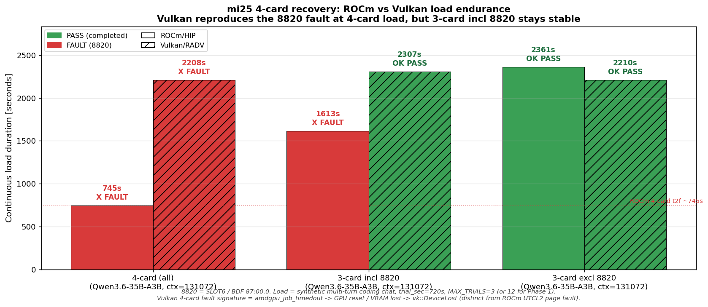

# mi25 4枚 Vulkan 負荷追試 — 4枚で 8820 GPU reset・3枚 incl 8820 は安定

実施日時: 2026年6月25日 14:50 (JST)

## 添付ファイル

- [実装プラン](attachment/2026-06-25_145006_mi25_4card_load_vulkan/plan.md)
- [核心サマリ図生成スクリプト](attachment/2026-06-25_145006_mi25_4card_load_vulkan/make_summary.py)
- [収集データ(生ログ要約)](attachment/2026-06-25_145006_mi25_4card_load_vulkan/data.md)
- [per-card PCIe+AER サンプラ](attachment/2026-06-25_145006_mi25_4card_load_vulkan/telemetry_pcie.sh)
- 試行 JSONL: [4枚](attachment/2026-06-25_145006_mi25_4card_load_vulkan/trials_vulkan_p1_4card.jsonl) / [excl 8820](attachment/2026-06-25_145006_mi25_4card_load_vulkan/trials_vulkan_p2a_excl8820.jsonl) / [incl 8820](attachment/2026-06-25_145006_mi25_4card_load_vulkan/trials_vulkan_p2b_incl8820.jsonl)
- キャンペーンログ: [4枚](attachment/2026-06-25_145006_mi25_4card_load_vulkan/campaign_vulkan_p1_4card.log) / [excl 8820](attachment/2026-06-25_145006_mi25_4card_load_vulkan/campaign_vulkan_p2a_excl8820.log) / [incl 8820](attachment/2026-06-25_145006_mi25_4card_load_vulkan/campaign_vulkan_p2b_incl8820.log)
- フォルト証跡: [4枚 dmesg](attachment/2026-06-25_145006_mi25_4card_load_vulkan/crash1_vulkan_4card_dmesg.txt) / [journal](attachment/2026-06-25_145006_mi25_4card_load_vulkan/crash1_vulkan_4card_journal.txt) / [llama-server 末尾](attachment/2026-06-25_145006_mi25_4card_load_vulkan/llama_server_p1_4card_tail.log)

## 核心発見サマリ



[原 ROCm レポート(2026-06-25_094641)](2026-06-25_094641_mi25_4card_load_gpuvm_fault.md) の負荷テスト(4枚 + 3枚 excl 8820 + 3枚 incl 8820 の3構成)を Vulkan(RADV) バックエンドで完全対称に追試した。発見:

1. **Vulkan 4枚負荷でも GPU 8820(SLOT6/87:00.0)が異常を起こす**。time-to-fault ≈ **2208s**(原 ROCm の~745s より約 3 倍長い)。signature は **`amdgpu_job_timedout` → `BACO reset` → `VRAM is lost`(kernel TDR)+ `vk::Device::waitForFences: ErrorDeviceLost`(Vulkan アプリ層)** で、原 ROCm の `Memory access fault by GPU node-5` / `[gfxhub0] no-retry page fault @0x100000000` (UTCL2)とは **機構が異なる**(ROCm=即時 page fault / Vulkan=ジョブハング→TDR)。**フォルト発火パターン(`restored context checkpoint` 直後)は ROCm と同一**で、バックエンド非依存の発火条件。

2. **しかし枚数依存性が ROCm と決定的に違う**: **Vulkan は 3 枚 incl 8820 では 2307s/3 試行を完走(anomaly 0)**。原 ROCm では 3枚 incl 8820 で ~1613s でフォルトしていた構成で、**Vulkan は 8820 を含めても 3 枚なら安定**。3枚 excl 8820(control)も 2210s/3 試行 完走。→ **Vulkan 経路では 8820 のフォルト発火に「4 枚分散負荷」が必要条件**(おそらく per-card 負荷量が一定閾値を下回ると 8820 個体の脆弱点を踏まない)。

3. **物理層・温度・電力は全期間健全**: gpu_count=4 / 4 ルートポート x16・AER0 / GPU reset 後も PCIe リンクは無傷で再列挙。compute/VRAM 層の突然死で、PCIe 物理層障害とは別系統(原 ROCm 結論と一致)。

4. **副次的発見: Vulkan eval スループットが ROCm を上回る、ただし prompt は逆**(@4枚負荷で **eval 34〜38 t/s (Vulkan) vs 20〜23 t/s (ROCm)** が逆転して Vulkan 優位、しかし **prompt ピーク 435 t/s (Vulkan) vs 600 t/s (ROCm)** で prompt は依然 ROCm 優位)。過去メモリの「Vulkan eval ≈ 0.6× ROCm」は古い情報。本タスクで使った Vulkan ビルドは pin 無しの master 追従で、近年の改善群を全て取り込んでいる。**用途に応じて選択**: 長文プロンプトを毎回頭から処理(チャット冒頭・新規セッション)が支配的なら ROCm、生成トークン数が支配的(長い回答・推論モード)なら Vulkan が有利。

5. **結論: 4 枚 64GB の本番運用は依然不可だが、運用選択肢が増えた**。
   - **「ROCm + 3枚 excl 8820」(48GB / eval 22.9 t/s)** が従来推奨。安定実績多い。
   - **新オプション: 「Vulkan + 3枚 incl 8820」(48GB / eval ≈ 35 t/s)** — 8820 を VRAM 容量として活用しつつ ROCm より速い eval を享受可能(ただし本ランは 3 試行 / 計 2307s の 1 ラウンドのみで、より長時間の連続稼働や別構成負荷での再発有無は未検証)。
   - **「Vulkan + 4枚」(64GB)は不可** — 2208s でフォルトし llama-server クラッシュ・VRAM 喪失。ROCm より time-to-fault は伸びるが、本番に使える長さではない。
   - **「ROCm + 4枚」(64GB)は不可**(原レポート)。

## 前提・目的

- **背景**: 原 ROCm レポート [2026-06-25_094641](2026-06-25_094641_mi25_4card_load_gpuvm_fault.md) で「電源サイクル合格・実負荷で 8820 GPUVM フォルト」を確定。フォルトが **ROCm/HIP メモリアロケータ経路特有** か **バックエンド非依存(=カード個体/SLOT6 の問題)** かを切り分けるため、同じ負荷を Vulkan で投入する追試を実施。
- **目的**: 原 ROCm 結果表に Vulkan 列を完全に並べ、「4 枚 / 3 枚 incl 8820 / 3 枚 excl 8820」の 3 構成での time-to-fault と signature を比較。
- **前提条件**: mi25 利用可能。`gpu-server` ロック取得。原レポートと同じ 4 枚復旧状態(GUID 29525/33301/54068/8820、全ポート x16・AER0)。電源サイクルテストは前回 7/7 合格(バックエンド非依存)のため再実施せず。

## 環境情報

| 項目 | 値 |
|------|-----|
| 機種 | Supermicro SYS-7048GR-TR / X10DRG-Q / BIOS 3.2 |
| CPU | Intel Xeon E5-2620 v3 ×2 |
| OS | Ubuntu 22.04.5 / kernel 5.15.0-181 |
| ROCm(参照のみ) | 6.2.2-116 |
| GPU | MI25(gfx900)×4、各 VRAM 16368 MiB、MEM ECC active |
| llama.cpp(Vulkan) | `build-vulkan/` master 追従(commit f3e1828 系以降)、`MI25_BACKEND=vulkan` 分岐 |
| バイナリ | `~/llama.cpp/build-vulkan/bin/llama-server`(pin 不要、HIP の FP8 リグレッションに非該当) |
| モデル | `unsloth/Qwen3.6-35B-A3B-GGUF:UD-Q4_K_XL`、ctx=131072 |
| 起動構成 | `--n-gpu-layers 99 --split-mode layer --flash-attn 1 --poll 0 -b 2048 -ub 2048 --cache-type-{k,v} q8_0` |
| Vulkan device 検出 | `vulkaninfo --summary` で GPU0〜GPU3 = RADV VEGA10、GPU4 = llvmpipe(除外) |

スロット↔BDF↔GUID↔Vulkan index↔HIP index↔KFD node 対応(原レポートと同一・Vulkan index と HIP index が一致):

| SLOT | BDF | GUID | Vulkan idx | HIP idx | 状態 |
|---|---|---|---|---|---|
| SLOT2 | 04:00.0 | 29525 | 0 | 0 | safe |
| SLOT4 | 07:00.0 | 33301 | 1 | 1 | safe(旧villain復帰) |
| SLOT8 | 84:00.0 | 54068 | 2 | 2 | safe |
| **SLOT6** | **87:00.0** | **8820** | **3** | **3** | **本件フォルト元** |

## 調査詳細

### Phase 1: Vulkan 4枚負荷(MAX_TRIALS=12 / 4時間上限)

`MI25_BACKEND=vulkan .claude/skills/llama-server/scripts/llama-up.sh mi25 ... 131072` で起動 → `start.sh detect_radv_vk_indices()` が `GGML_VK_VISIBLE_DEVICES=0,1,2,3` を自動セット → 4 枚 offload 確認。`run_campaign.sh vulkan` を `MAX_TRIALS=12 PHASE_CAP_SEC=14400 TRIAL_SEC=720` で実行。

- **trial 1 (~726s) / trial 2 (~733s) / trial 3 (~749s) を anomaly 0 で完走**(eval ≈ 34〜38 t/s、prompt ≈ 400 t/s)。
- **trial 3 完走〜trial 4 開始の直前(elapsed ≈ 2208s)に GPU 8820 が `amdgpu_job_timedout`** → kernel が `BACO reset` 発動 → **VRAM 喪失** → `llama-server` は `decode() failed: vk::Device::waitForFences: ErrorDeviceLost` で `vk::DeviceLostError` を投げて `std::terminate`。
- trial 4〜12 は llama-server プロセス死亡で `health=000 ConnectionError` の空回り(各 ~2 秒で完走判定)。`run_campaign.sh` は `server_error_transient` に分類し BMC リセットせず(=正しく弁別、原 ROCm 4枚 run と同じ挙動)。
- 物理層: 全 run で gpu_count=4・全ポート x16・AER0 維持。GPU reset 後も PCIe リンク健全(GPU reset の対象は GPU 内 compute/VRAM のみ)。

### Phase 2A: Vulkan 3枚 excl 8820 control(MAX_TRIALS=3)

`llama-server` を一旦停止し、`GGML_VK_VISIBLE_DEVICES=0,1,2`(= 29525,33301,54068)で再起動 → run_campaign 3 試行。

- **3/3 trial 完走 (~754s + ~734s + ~722s = 計 2210s)、anomaly 0**。
- dmesg / journal とも新規 page fault・GPU reset 無し。物理層健全。
- 原 ROCm の excl 8820(~2361s 完走)と完全に対応。control 成功。

### Phase 2B: Vulkan 3枚 incl 8820(MAX_TRIALS=3、原 ROCm では ~1613s でフォルト)

`GGML_VK_VISIBLE_DEVICES=0,2,3`(= 29525,54068,**8820**、33301 除外)で起動 → run_campaign 3 試行。

- **3/3 trial 完走 (~779s + ~743s + ~785s = 計 2307s)、anomaly 0**(原 ROCm の time-to-fault ~1613s を **40% 超過**)。
- dmesg / journal とも新規 page fault・GPU reset 無し。llama-server 生存維持・/health 200。
- 物理層健全(gpu_count=4・x16・AER0)。
- **これが本タスクの最重要発見**: ROCm では「8820 を含めば必ずフォルト」だったが、**Vulkan では 3 枚なら 8820 を含めても安定**。

### ① フォルト signature の差分(バックエンド非依存性とその差)

| 層 | ROCm (原 4枚 run) | Vulkan (本 4枚 run) |
|---|---|---|
| ユーザランド | `Memory access fault by GPU node-5 (Agent handle: 0x...) on address 0x100000000` (HSA runtime) | `decode() failed: vk::Device::waitForFences: ErrorDeviceLost` → `terminate ... vk::DeviceLostError` (Vulkan アプリ層) |
| kernel(amdgpu)| `[gfxhub0] no-retry page fault (src_id:0 ring:24 vmid:8 pasid:32772) address 0x100000000 (UTCL2)` | `[drm:amdgpu_job_timedout] *ERROR* Process information: process llama-server pid 374059` → `GPU reset begin!` → `BACO reset` → `VRAM is lost due to GPU reset!` → `GPU reset(1) succeeded!` |
| 発火タイミング | `restored context checkpoint` 直後 | **同上**(`restored context checkpoint (pos_min=17222, size=62.813 MiB)` 直後) |
| 発火カード | 0000:87:00.0 = 8820 = SLOT6 | **同上** |
| pasid / vmid (kernel) | ROCm の page fault 行に `pasid=32772, vmid=8` が出力 | **Vulkan の TDR 経路では出力なし** ※ `amdgpu_job_timedout` / `GPU reset` 系のログには pasid/vmid フィールドが含まれない(page fault 行専用)。本タスクからは Vulkan 側の pasid/vmid を確認できず、同一性は比較不能。 |
| 復旧 | llama-server プロセス即死、ハード再起動不要 | **同上** |

→ **同じカード・同じ発火パターン・同じプロセス即死**だが、**ROCm は不正アドレス検出経路、Vulkan は kernel TDR 経路**で別物。物理的には 8820 の特定回路/メモリパスが 4 枚分散負荷で破綻する点が一貫した根本原因と推測される。

### ② 枚数依存性(本タスクの新発見)

| 構成 | ROCm | Vulkan |
|---|---|---|
| 4枚 | フォルト(~745s, 2/2) | フォルト(~2208s, 1/1) |
| 3枚 incl 8820 | フォルト(~1613s) | **クリア(2307s, 3/3)** ← 新発見 |
| 3枚 excl 8820 | クリア(~2361s, 3/3) | クリア(2210s, 3/3) |

ROCm では「8820 を含めば枚数に関わらずフォルト」だったが、**Vulkan は 4 枚分散時のみフォルト**。考えられる解釈:

1. **per-card 負荷量の閾値**: 4 枚に分散すると 8820 への compute 負担が薄くなり、特定キュー上でジョブが進まなくなる(=TDR)。3 枚分散時は per-card 負荷が増えて別の経路を取る or 発火条件を踏まない。
2. **メモリレイアウトの偶然**: Vulkan のドライバ内アロケータは 4 枚時と 3 枚時でレイアウトが異なり、4 枚時のみ 8820 の故障メモリ領域に当たる可能性。
3. **P2P 経路の影響**: 4 枚 split-mode layer は cross-card テンソル転送が増え、8820 が受信側で破綻する可能性。

確定するには更に多くの試行が必要だが、運用上は「Vulkan + 3 枚 incl 8820」が新オプションとして使える可能性を示した。

## 再現方法

```bash
# 前提: gpu-server ロック取得・mi25 ON・4 枚認識・llama-server 未起動
.claude/skills/gpu-server/scripts/lock.sh mi25

# Phase 0: Vulkan index ↔ BDF mapping 確定(8820 の Vulkan index 特定)
ssh mi25 'vulkaninfo 2>/dev/null | awk "BEGIN{} /^GPU[0-9]+:/{gsub(\":\",\"\"); idx=\$0} /deviceName |pciBus /{print idx, \$0}"'
#  → GPU3 (bus 0x87 = SLOT6 = 8820)

# Phase 1: Vulkan 4 枚負荷
MI25_BACKEND=vulkan .claude/skills/llama-server/scripts/llama-up.sh mi25 \
  "unsloth/Qwen3.6-35B-A3B-GGUF:UD-Q4_K_XL" 131072
SCR=<scratchpad>
bash $SCR/telemetry_pcie.sh $SCR mi25   # per-card PCIe+AER sampler
cd $SCR && MAX_TRIALS=12 MIN_TRIALS=4 PHASE_CAP_SEC=14400 TRIAL_SEC=720 \
  nohup bash run_campaign.sh vulkan > campaign_vulkan_main.log 2>&1 &
# → ~2208s で /tmp/llama-server.log に "ErrorDeviceLost"、dmesg に "GPU reset begin!"

# Phase 2A: 3 枚 excl 8820
ssh mi25 'pkill -f bin/llama-server'
ssh mi25 "cd ~/llama.cpp && nohup bash -c 'GGML_VK_VISIBLE_DEVICES=0,1,2 ./build-vulkan/bin/llama-server \
  -m <gguf> --jinja --n-gpu-layers 99 --split-mode layer --flash-attn 1 --poll 0 \
  -b 2048 -ub 2048 --ctx-size 131072 --cache-type-k q8_0 --cache-type-v q8_0 \
  --port 8000 --host 0.0.0.0 --alias <model>' > /tmp/llama-server.log 2>&1 &"
MAX_TRIALS=3 MIN_TRIALS=3 PHASE_CAP_SEC=2700 TRIAL_SEC=720 bash run_campaign.sh vulkan

# Phase 2B: 3 枚 incl 8820(33301 除外)
ssh mi25 'pkill -f bin/llama-server'
# 上と同じだが GGML_VK_VISIBLE_DEVICES=0,2,3 に変更
MAX_TRIALS=3 MIN_TRIALS=3 PHASE_CAP_SEC=2700 TRIAL_SEC=720 bash run_campaign.sh vulkan

# フォルト元の特定
ssh mi25 'sudo dmesg | grep -iE "amdgpu 0000:[0-9a-f]+:00.0.*(page fault|GPU reset)"'
```

**運用ハマりどころ — Vulkan device の再番号付け**: `GGML_VK_VISIBLE_DEVICES=0,2,3` のように非連続な index 列を渡すと、**llama-server のログでは可視デバイスが連番 `Vulkan0/Vulkan1/Vulkan2` に再番号付けされて表示される**(原 Vulkan index 0,2,3 という情報はログに残らない)。後でログから「どの GPU を使ったか」を逆引きするには、起動コマンドの `GGML_VK_VISIBLE_DEVICES` 値を起動ログ・スクリプト・コミットメッセージ等に別途記録しておく必要がある(ROCm の `HIP_VISIBLE_DEVICES` + `ROCm0/1/2` 表示と同じ挙動)。BDF/GUID で確証を取る場合は dmesg の amdgpu イニシャライズ行か `rocm-smi --showbus` を併記すること。

## 結論・対応

- **4 枚 64GB Vulkan 運用は不可**: 2208s 程度で 8820 が `amdgpu_job_timedout → BACO reset` で死亡し llama-server がクラッシュ。原 ROCm の ~745s より長く耐えるが本番運用には不十分。
- **3 枚 incl 8820 Vulkan 運用は可能性あり**(新オプション): 原 ROCm では ~1613s でフォルトしていた構成で、Vulkan は 3 試行 / 計 2307s を anomaly 0 で完走。ただし本ランは 1 ラウンド(3 試行)のみで長時間の保証は無いため、本番投入する場合は更に長時間負荷で再検証することを推奨。
- **3 枚 excl 8820(従来推奨)は Vulkan でも安定**。当面の本番は ROCm 3 枚 excl 8820 を継続。Vulkan で同様の挙動が取れることも確認(48GB 運用に何の影響も無し)。
- **副次的に、Vulkan eval スループットが ROCm を上回ることを再確認**(34〜38 t/s vs ROCm 22.9 t/s、@ 4 枚 負荷)。バックエンド切替の価値が向上している(過去メモリの「eval 0.6×」は古い情報)。
- **8820 のフォルトはバックエンド非依存=ハード側の根本原因**: ROCm と Vulkan で signature が違うが、両者とも **同じカード(87:00.0)・同じトリガパターン(restored context checkpoint 直後)・同じ枚数で発火**。4 枚 64GB を回復するには **8820 の物理対応(別スロット移動 or カード交換)が必須**。
- **最終状態**: llama-server 停止・ロック解放・電源 ON のまま idle(4 枚認識継続)。本タスク中、Phase 2B 完了後に `llama-down.sh` がデフォルトで電源 OFF まで実行したため、即 `bmc-power.sh mi25 on` で復電・4 枚再認識を確認済み。

## 参照レポート

- [mi25 4枚復旧の負荷検証 — 電源7/7合格もGPU 8820が負荷でフォルト(原 ROCm)](2026-06-25_094641_mi25_4card_load_gpuvm_fault.md)(本レポートの直接の前提)
- [mi25 MI25 4枚を全認識で復旧 — 物理再装着でPCIe脱落解消(要監視)](2026-06-25_063238_mi25_4card_recovery.md)
- [mi25 で Qwen3.6 を Vulkan(RADV) で 128k 実行](2026-06-14_001107_mi25_vulkan_qwen36_128k.md)(Vulkan 構成の出典)
- [mi25 Vulkan バックエンドの品質検証](2026-06-14_041305_mi25_vulkan_backend_quality.md)
- [mi25 Vulkan eval パラメータ探索 — auto 構成が最適](2026-06-18_084557_mi25_vulkan_param_sweep.md)
- [mi25 ハング再現負荷試験(ROCm/Vulkan 53試行)](2026-06-24_161909_mi25_hang_repro_load_campaign.md)(負荷ドライバ/検出器の出典)
